# 🎓 Senior Java Tech Lead — Ultimate Interview Master Blueprint

<div align="center">


### **10+ Years Experience Level | Production-Grade Architecture**
*Scalability | Trade-offs | Distributed Systems | Real-World Design*

</div>

---

## 📚 Table of Contents — Optimal Learning Path

> **💡 Reading Guide:** Follow the phases in order for the best experience. Each section builds on the previous one.
> - 🟢 **Beginners:** Start at Phase 1 and go section by section. Each section has a **"🟢 Beginner's Guide"** subsection — read that first before the Q&A.
> - 🔵 **Intermediate:** Start at Phase 3 (Spring Ecosystem). You can skip the "🟢 Beginner's Guide" subsections if already familiar.
> - 🔴 **Senior/Advanced:** Jump to Phase 5–6 (Distributed Systems + Architecture) for deep-dive Q&A.

---

### 🟢 Phase 1 — Java Fundamentals *(Start Here)*

| # | Section | Key Topics | Level |
|---|---|---|---|
| 1 | [💡 Core Java Mastery](#-core-java-mastery) | JVM, OOP, Collections, Streams, Generics, Records, Java 17/21 | 🟢 Beginner → Advanced |
| 1a | [🏗️ Low Level Design (LLD)](#-low-level-design-lld--for-beginners-read-this-first) | SOLID Principles, 15 Design Patterns, Parking Lot, Vending Machine | 🟢 Beginner → Intermediate |
| 2 | [🔀 Java Concurrency & Multithreading](#-java-concurrency--multithreading) | Threads, ExecutorService, Locks, CompletableFuture, Virtual Threads | 🟢 Beginner → Advanced |

---

### 🔵 Phase 2 — Problem Solving & Algorithms

| # | Section | Key Topics | Level |
|---|---|---|---|
| 3 | [🔐 DSA & Problem Solving](#-dsa--problem-solving--complete-interview-guide) | Big-O, Arrays, Trees, Graphs, DP, 20 Patterns, 60-Day Plan | 🟢 Beginner → Advanced |
| 4 | [💬 Practical Coding Challenges](#-practical-coding-challenges) | LRU Cache, Rate Limiter, LeetCode Patterns, REST API | 🔵 Intermediate |

---

### 🟢 Phase 3 — Spring Ecosystem *(Beginner → Advanced)*

| # | Section | Key Topics | Level |
|---|---|---|---|
| 5 | [🎓 Spring Boot & Data Architecture](#-spring-boot--data-architecture) | Auto-Config, JPA, Transactions, Caching, Actuator, Profiles | 🟢 Beginner → Advanced |
| 6 | [🎓 API Design Best Practices](#-api-design-best-practices) | REST, GraphQL, gRPC, Versioning, Rate Limiting, OpenAPI | 🟢 Beginner → Advanced |
| 7 | [🔐 Spring Security & OAuth2](#-spring-security--oauth2-deep-dive) | JWT, OAuth2, OIDC, PKCE, Method Security, OWASP Top 10 | 🟢 Beginner → Advanced |

---

### 🟠 Phase 4 — Data Storage & Caching

| # | Section | Key Topics | Level |
|---|---|---|---|
| 8 | [🗃️ Database Fundamentals](#-database-interview-questions--mysqlpostgresql--mongodb) | ACID, Indexes, Joins, Transactions, Normalization, MongoDB | 🟢 Beginner → Advanced |
| 9 | [🗄️ MySQL/PostgreSQL & MongoDB Mastery](#-mysqlpostgresql--mongodb-interview-mastery) | MVCC, EXPLAIN, Partitioning, Sharding, Replication, Atlas | 🔴 Advanced |
| 10 | [💾 SQL & NoSQL Schema Design](#-sql--nosql-database-schema-design--beginner-to-advanced) | DDL, ER Diagrams, Normalization, DynamoDB, Cassandra, Neo4j | 🟢 Beginner → Advanced |
| 11 | [💡 Redis Deep Dive](#-redis-deep-dive) | Data Structures, Pub/Sub, Cluster, Distributed Locks, Patterns | 🔵 Intermediate → Advanced |

---

### 🟢 Phase 5 — Distributed Systems *(Beginner → Advanced)*

| # | Section | Key Topics | Level |
|---|---|---|---|
| 12 | [🌩️ Microservices & Cloud Native](#-microservices--cloud-native) | API Gateway, SAGA, Circuit Breaker, Service Discovery, CQRS | 🟢 Beginner → Advanced |
| 13 | [📡 Messaging — Kafka & RabbitMQ](#-messaging--kafka--rabbitmq-interview-questions) | Kafka Architecture, Consumers, Delivery Guarantees, Streams, CDC | 🟢 Beginner → Advanced |
| 14 | [🧪 Testing Strategy](#-testing-strategy--best-practices) | JUnit 5, Mockito, TestContainers, Contract Testing, TDD | 🟢 Beginner → Advanced |

---

### 🟢 Phase 6 — Architecture & Infrastructure *(Beginner → Advanced)*

| # | Section | Key Topics | Level |
|---|---|---|---|
| 15 | [🎓 System Design — URL Shortener](#-system-design--url-shortener) | HLD, LLD, CAP Theorem, Scale, Capacity Estimation, Trade-offs | 🟢 Beginner → Advanced |
| 16 | [🎓 Real-World Production Questions](#-real-world-production-questions) | 1M req/sec, Memory Leaks, JVM Tuning, Incident Response | 🟢 Beginner → Advanced |
| 17 | [🏛️ Java Architecture Deep Dive](#-java-architecture-deep-dive--additional-qa) | Richardson Maturity, 12-Factor, Microservice Patterns, AWS Deep Dive | 🟢 Beginner → Advanced |
| 18 | [📦 Docker & Kubernetes](#-docker--kubernetes-basics-to-advanced) | Containers, Pods, Services, HPA, Helm, Production Deployments | 🟢 Beginner → Advanced |
| 19 | [🚀 CI/CD Pipeline — Jenkins, Docker, K8s, AWS & GCP](#-cicd-pipeline--jenkins-docker-kubernetes-aws--gcp) | Jenkins, GitHub Actions, AWS CodePipeline, GCP Cloud Deploy | 🟢 Beginner → Advanced |
| 20 | [💡 Cloud & DevOps — AWS, CI/CD, IaC](#-cloud--devops--aws-cicd-iac) | EKS, RDS, CloudWatch, Terraform, GitHub Actions, Helm | 🟢 Beginner → Advanced |

---

### 🏆 Phase 7 — Interview Preparation *(Revise Before Interview)*

| # | Section | Key Topics | Level |
|---|---|---|---|
| 21 | [🎓 Resume-Based Q&A — Digamber Singh](#-resume-based-interview-qa--digamber-singh) | Introduction, Projects, Skills, Leadership, Behavioral, STAR | 🟢 All Levels |
| 22 | [🎓 Interview Cheat Sheet](#-interview-cheat-sheet) | Top 10 Questions, Quick-Fire Answers, HTTP Codes, Anti-Patterns | 🟢 All Levels |
| 23 | [🏦 Societe Generale — Company-Specific Interview Prep](#-societe-generale--company-specific-interview-prep) | Banking Domain, SocGen Tech Stack, Java/Spring/SQL/Docker/K8s Q&A | 🟢 All Levels |

---

> **⚡ Quick Jump:**
> [Core Java](#-core-java-mastery) • [DSA](#-dsa--problem-solving--complete-interview-guide) • [Spring Boot](#-spring-boot--data-architecture) • [Database](#-database-interview-questions--mysqlpostgresql--mongodb) • [Microservices](#-microservices--cloud-native) • [Kafka](#-messaging--kafka--rabbitmq-interview-questions) • [System Design](#-system-design--url-shortener) • [Docker/K8s](#-docker--kubernetes-basics-to-advanced) • [CI/CD](#-cicd-pipeline--jenkins-docker-kubernetes-aws--gcp) • [Interview Prep](#-interview-cheat-sheet)

---

<a id="-core-java-mastery"></a>
# ☕ Part 2: Core Java Mastery


## 🟢 Beginner's Guide to Core Java

> **🎯 New to Java?** Start here! This section gives you the complete mental model before diving into the Q&A. If you already know Core Java basics, jump straight to Q1.

---

### 🤔 What is Java and Why Learn It?

Java is a **platform-independent, object-oriented programming language** — the backbone of enterprise backends, Android apps, and microservices. It powers LinkedIn, Netflix, Amazon, and most banking systems.

**The "Write Once, Run Anywhere" magic:**


```mermaid
flowchart LR
    Code["📝 Hello.java\n(your source code)"]
    -->|javac-compiler| Bytecode["📦 Hello.class\n(bytecode — portable format)"]

    Bytecode -->|JVM-on-Windows| Win["🖥️ Runs on Windows"]
    Bytecode -->|JVM-on-Linux| Lin["🐧 Runs on Linux"]
    Bytecode -->|JVM-on-macOS| Mac["🍎 Runs on macOS"]
    Bytecode -->|JVM-on-Android| And["📱 Runs on Android"]

    style Bytecode fill:#000000,stroke:#ffc107
    style Code fill:#000000,stroke:#28a745
```

> 💡 Your `.class` bytecode file is identical everywhere. The JVM on each platform converts it to that machine's native instructions — that's "write once, run anywhere".

---

### 🏗️ Java's 4 Pillars — The OOP Foundation

Every Java interview starts here. These 4 pillars appear in at least 50% of interview questions:

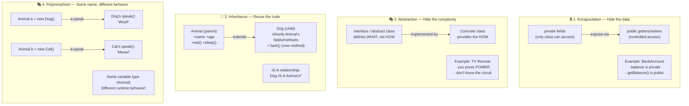
```mermaid
flowchart TB
    subgraph Enc["🔒 1. Encapsulation — Hide the data"]
        E1["private fields\n(only class can access)"] -->|expose-via| E2["public getters/setters\n(controlled access)"]
        E3["Example: BankAccount\n- balance is private\n- getBalance() is public"]
    end

    subgraph Abs["🎭 2. Abstraction — Hide the complexity"]
        A1["interface / abstract class\n defines WHAT, not HOW"] -->|implemented-by| A2["Concrete class\nprovides the HOW"]
        A3["Example: TV Remote\n- you press POWER\n- don't know the circuit"]
    end

    subgraph Inh["🧬 3. Inheritance — Reuse the code"]
        I1["Animal (parent)\n+name +age\n+eat() +sleep()"] -->|extends| I2["Dog (child)\n inherits Animal's fields/methods\n+ bark() (new method)"]
        I3["IS-A relationship:\nDog IS-A Animal ✅"]
    end

    subgraph Poly["🎭 4. Polymorphism — Same name, different behavior"]
        P1["Animal a = new Dog()"] -->|a.speak| P2["Dog's speak():\n'Woof!'"]
        P3["Animal b = new Cat()"] -->|b.speak| P4["Cat's speak():\n'Meow!'"]
        P5["Same variable type (Animal)\nDifferent runtime behavior!"]
    end
```

---

### ☕ Java Execution Flow — From Code to Output

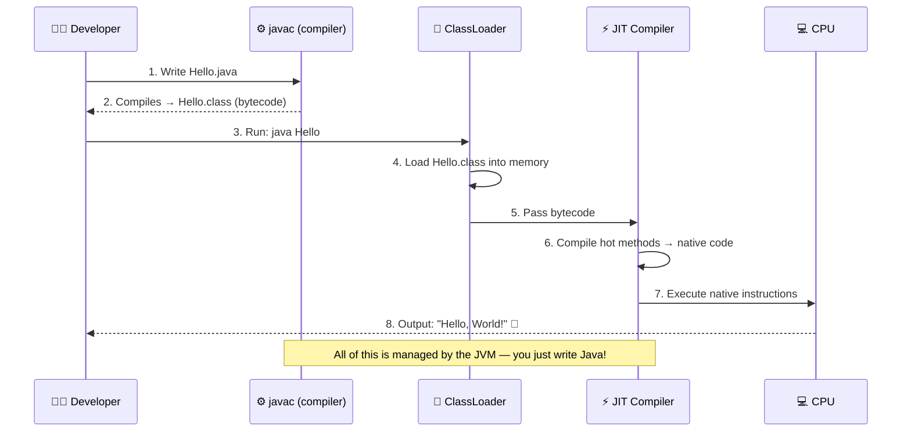
```mermaid
sequenceDiagram
    participant Dev as 👨‍💻 Developer
    participant javac as ⚙️ javac (compiler)
    participant ClassLoader as 🔄 ClassLoader
    participant JIT as ⚡ JIT Compiler
    participant CPU as 💻 CPU

    Dev->>javac: 1. Write Hello.java
    javac-->>Dev: 2. Compiles → Hello.class (bytecode)
    Dev->>ClassLoader: 3. Run: java Hello
    ClassLoader->>ClassLoader: 4. Load Hello.class into memory
    ClassLoader->>JIT: 5. Pass bytecode
    JIT->>JIT: 6. Compile hot methods → native code
    JIT->>CPU: 7. Execute native instructions
    CPU-->>Dev: 8. Output: "Hello, World!" 🎉

    Note over javac,JIT: All of this is managed by the JVM — you just write Java!
```

---

### 🗺️ Core Java Topic Map — Your Learning Roadmap

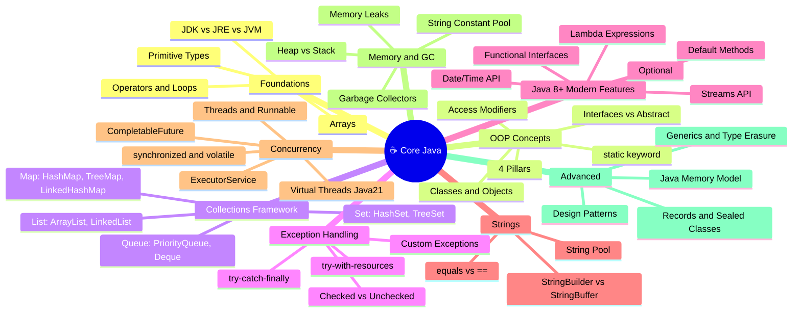
```mermaid
mindmap
  root((☕ Core Java))
    Foundations
      JDK vs JRE vs JVM
      Primitive Types
      Operators and Loops
      Arrays
    OOP Concepts
      Classes and Objects
      4 Pillars
      Interfaces vs Abstract
      Access Modifiers
      static keyword
    Collections Framework
      List: ArrayList, LinkedList
      Map: HashMap, TreeMap, LinkedHashMap
      Set: HashSet, TreeSet
      Queue: PriorityQueue, Deque
    Exception Handling
      try-catch-finally
      Checked vs Unchecked
      try-with-resources
      Custom Exceptions
    Java 8+ Modern Features
      Lambda Expressions
      Functional Interfaces
      Streams API
      Optional
      Default Methods
      Date/Time API
    Strings
      String Pool
      StringBuilder vs StringBuffer
      equals vs ==
    Concurrency
      Threads and Runnable
      synchronized and volatile
      ExecutorService
      CompletableFuture
      Virtual Threads Java21
    Memory and GC
      Heap vs Stack
      String Constant Pool
      Garbage Collectors
      Memory Leaks
    Advanced
      Generics and Type Erasure
      Java Memory Model
      Design Patterns
      Records and Sealed Classes
```

---

### 🔑 Key Java Vocabulary — Know These Terms Cold

| Term | Plain English Meaning | Quick Code Example |
|-------|-----------------|---------------|
| **Class** | Blueprint / template | `class Dog { String name; }` |
| **Object** | Actual instance of a class | `Dog fido = new Dog()` |
| **Field** | Variable inside a class | `private String name;` |
| **Method** | Function inside a class | `public void bark() { }` |
| **Constructor** | Special method to create an object | `public Dog(String n) { name = n; }` |
| **`this`** | Reference to the current object | `this.name = name;` |
| **`super`** | Reference to the parent class | `super.speak();` |
| **Interface** | Contract: defines what a class MUST do | `interface Flyable { void fly(); }` |
| **Abstract class** | Partial implementation — can't create directly | `abstract class Shape { }` |
| **`extends`** | Inherit from a class | `class Dog extends Animal` |
| **`implements`** | Implement an interface | `class Bird implements Flyable` |
| **Generic `<T>`** | Type-safe parameter placeholder | `List<String>`, `Map<K,V>` |
| **Lambda** | Short anonymous function (Java 8+) | `x -> x * 2` |
| **Stream** | Data processing pipeline (Java 8+) | `list.stream().filter(...).collect(...)` |
| **`final`** | Cannot be changed / overridden | `final int MAX = 100;` |
| **`static`** | Belongs to class, not to objects | `Math.sqrt(4)` |
| **`null`** | No object assigned | `Dog d = null;` |

---

### 📐 Primitive Types vs Reference Types — The Fundamental Divide


```mermaid
flowchart LR
    subgraph Prim["📦 Primitive Types — stored on STACK"]
        direction TB
        P1["byte   → 8-|bit| integer  (-|128| to 127)"]
        P2["short  → 16-|bit| integer"]
        P3["int    → 32-|bit| integer (most common)"]
        P4["long   → 64-|bit| integer"]
        P5["float  → 32-|bit| decimal"]
        P6["double → 64-|bit| decimal (most common)"]
        P7["char   → single Unicode character"]
        P8["boolean→ true / false"]
    end

    subgraph Ref["🔗 Reference Types — stored on HEAP"]
        direction TB
        R1["String → sequence of chars"]
        R2["Integer, Long, Double... → wrapper classes"]
        R3["Arrays → int[], String[]"]
        R4["Objects → any class instance"]
        R5["Collections → List, Map, Set..."]
    end

    Prim -->|Autoboxing| Ref
    Ref  -->|Unboxing| Prim
```

```java
// Primitives — hold the VALUE directly
int x = 42;        // x IS 42
int y = x;         // y gets a COPY of 42
y = 100;           // x is still 42!

// References — hold an ADDRESS to an object
Dog fido = new Dog("Fido");   // fido POINTS to a Dog object
Dog buddy = fido;             // buddy points to THE SAME Dog object
buddy.setName("Buddy");       // BOTH fido and buddy see "Buddy" — same object!
```

---

### 🔐 Access Modifiers — Who Can See What?

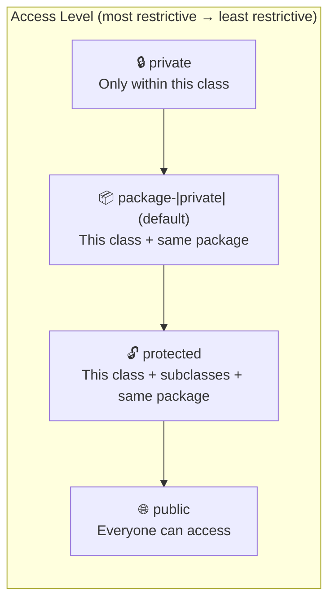
```mermaid
flowchart LR
    subgraph Levels["Access Level (most restrictive → least restrictive)"]
        direction TB
        PR["🔒 private\nOnly within this class"]
        PK["📦 package-|private| (default)\nThis class + same package"]
        PO["🔓 protected\nThis class + subclasses + same package"]
        PU["🌐 public\nEveryone can access"]
        PR --> PK --> PO --> PU
    end
```

| Modifier | Same Class | Same Package | Subclass | Everywhere |
|-----------|--------------|-------------|-------------|-------------|
|`private` | ✅ | ❌ | ❌ | ❌ |
| *(default)* | ✅ | ✅ | ❌ | ❌ |
| `protected` | ✅ | ✅ | ✅ | ❌ |
| `public` | ✅ | ✅ | ✅ | ✅ |

> 💡 **Interview rule**: Always use the **most restrictive** access level possible. Start with `private`, open up only when needed.

---

### 🎯 Beginner Quick-Fire Q&A — Warm Up

**Q: What's the difference between `int` and `Integer`?**
> `int` is a primitive — stores the value directly, fast, no `null`.
> `Integer` is a wrapper class — an object that wraps an `int`, can be `null`, works with Collections.
> Java automatically converts between them (autoboxing/unboxing).

**Q: Can you have more than one constructor in a class?**
> Yes! This is called **constructor overloading**. Each constructor must have different parameters:
> ```java
> class Dog {
>     Dog() { }                          // no-arg constructor
>     Dog(String name) { this.name = name; }  // name constructor
>     Dog(String name, int age) { }     // name+age constructor
> }
> ```

**Q: What is `null` in Java?**
> `null` means "no object". A reference variable holds `null` when it doesn't point to any object.
> Calling a method on a `null` reference throws `NullPointerException` — one of the most common Java bugs!
> ```java
> String s = null;
> s.length(); // 💥 NullPointerException!
> ```

**Q: What is the difference between `==` and `.equals()`?**
> `==` compares memory addresses (are these the SAME object?).
> `.equals()` compares content (do these objects have the SAME VALUE?).
> Always use `.equals()` for Strings and objects!

**Q: What is `static` in Java?**
> `static` means "belongs to the CLASS, not to any specific object".
> Static fields are shared across ALL instances. Static methods can be called without creating an object:
> ```java
> Math.sqrt(16);    // Math is never instantiated — sqrt is static
> Integer.parseInt("42");  // same — no new Integer() needed
> ```

---

### 🚦 Your Learning Path Through This Section

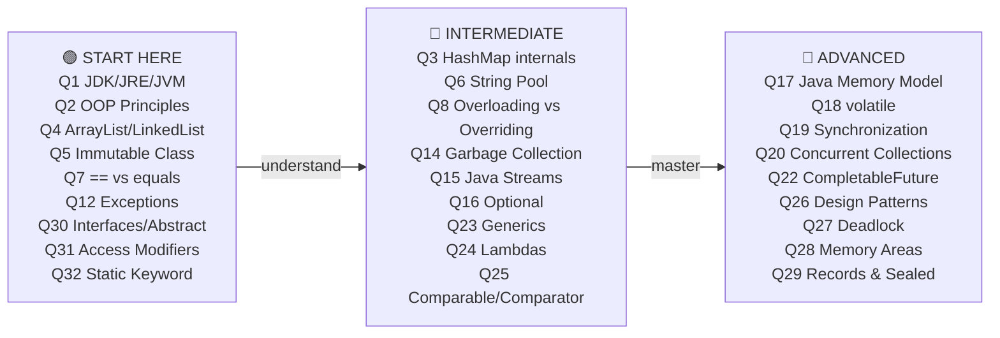
```mermaid
flowchart LR
    B1["🟢 START HERE\nQ1 JDK/JRE/JVM\nQ2 OOP Principles\nQ4 ArrayList/LinkedList\nQ5 Immutable Class\nQ7 == vs equals\nQ12 Exceptions\nQ30 Interfaces/Abstract\nQ31 Access Modifiers\nQ32 Static Keyword"]
    -->|understand| B2["🔵 INTERMEDIATE\nQ3 HashMap internals\nQ6 String Pool\nQ8 Overloading vs Overriding\nQ14 Garbage Collection\nQ15 Java Streams\nQ16 Optional\nQ23 Generics\nQ24 Lambdas\nQ25 Comparable/Comparator"]
    -->|master| B3["🔴 ADVANCED\nQ17 Java Memory Model\nQ18 volatile\nQ19 Synchronization\nQ20 Concurrent Collections\nQ22 CompletableFuture\nQ26 Design Patterns\nQ27 Deadlock\nQ28 Memory Areas\nQ29 Records & Sealed"]
```

> ✅ **Foundation complete!** The Q&A below covers every topic in interview depth. Start from Q1 and work forward.

---


## Q1. JDK vs JRE vs JVM

> **🔰 Beginner's Concept**
> Think of it like a **car ecosystem**:
> - **JVM** = The **engine**. It runs the fuel (bytecode) and moves the car.
> - **JRE** = The **full car** (engine + wheels + fuel tank). Everything needed to *drive* (run a Java app).
> - **JDK** = The **car + full workshop** (spanner, diagnostic tools, manual). Everything needed to *build and fix* the car.
>
> 💡 **Rule:** Developers install **JDK**. Production servers only need **JRE** (no dev tools = smaller + more secure).

---

#### 🏗️ Architecture — JDK Contains JRE Contains JVM

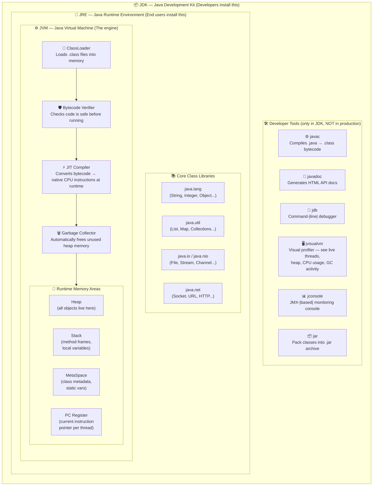
```mermaid
flowchart TB
    subgraph JDK["📦 JDK — Java Development Kit  (Developers install this)"]
        direction TB

        subgraph DevTools["🛠️ Developer Tools  (only in JDK, NOT in production)"]
            javac["⚙️ javac\nCompiles .java → .class bytecode"]
            javadoc["📄 javadoc\nGenerates HTML API docs"]
            jdb["🐛 jdb\nCommand-|line| debugger"]
            jvisualvm["🖥️ jvisualvm\nVisual profiler — see live threads,\nheap, CPU usage, GC activity"]
            jconsole["📊 jconsole\nJMX-|based| monitoring console"]
            jar["📦 jar\nPack classes into .jar archive"]
        end

        subgraph JRE["🏃 JRE — Java Runtime Environment  (End users install this)"]
            direction TB

            subgraph Libs["📚 Core Class Libraries"]
                java_lang["java.lang\n(String, Integer, Object...)"]
                java_util["java.util\n(List, Map, Collections...)"]
                java_io["java.io / java.nio\n(File, Stream, Channel...)"]
                java_net["java.net\n(Socket, URL, HTTP...)"]
            end

            subgraph JVM["⚙️ JVM — Java Virtual Machine  (The engine)"]
                direction TB
                ClassLoader["🔄 ClassLoader\nLoads .class files into memory"]
                Verifier["🛡️ Bytecode Verifier\nChecks code is safe before running"]
                JIT["⚡ JIT Compiler\nConverts bytecode → native CPU instructions at runtime"]
                GC["🗑️ Garbage Collector\nAutomatically frees unused heap memory"]

                subgraph MemAreas["💾 Runtime Memory Areas"]
                    direction LR
                    Heap["Heap\n(all objects live here)"]
                    Stack["Stack\n(method frames,\nlocal variables)"]
                    MetaSpace["MetaSpace\n(class metadata,\nstatic vars)"]
                    PC["PC Register\n(current instruction\npointer per thread)"]
                end

                ClassLoader --> Verifier --> JIT
                JIT --> GC
                GC --> MemAreas
            end
        end
    end
```

> 🔑 **The relationship**: `JDK ⊃ JRE ⊃ JVM`
> - JVM **cannot** run alone — it needs the class libraries from JRE
> - JRE **cannot** compile code — it only runs already-compiled `.class` files
> - JDK has **everything**: compile, run, debug, profile

---

#### 🖥️ What is jvisualvm? (The Visual Profiler)

`jvisualvm` is a **free GUI tool** bundled with the JDK that lets you see **inside a running Java process** — like an X-ray machine for your application.

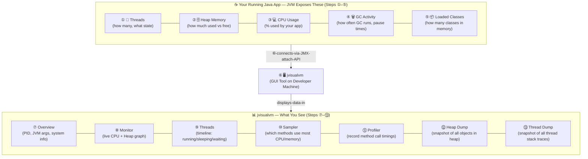
```mermaid
flowchart TB
    subgraph App["☕ Your Running Java App — JVM Exposes These (Steps ①–⑤)"]
        direction LR
        Threads["① 🧵 Threads\n(how many, what state)"] --- Heap["② 🗄️ Heap Memory\n(how much used vs free)"] --- CPU["③ 💻 CPU Usage\n(% used by your app)"] --- GCLog["④ 🗑️ GC Activity\n(how often GC runs, pause times)"] --- Classes["⑤ 📦 Loaded Classes\n(how many classes in memory)"]
    end

    jvvm["⑥ 🖥️ jvisualvm\n(GUI Tool on Developer Machine)"]

    App -->|⑥-connects-via-JMX-attach-API| jvvm

    subgraph Panels["📊 jvisualvm — What You See (Steps ⑦–⑬)"]
        direction LR
        P1["⑦ Overview\n(PID, JVM args, system info)"] --- P2["⑧ Monitor\n(live CPU + Heap graph)"] --- P3["⑨ Threads\n(timeline: running/sleeping/waiting)"] --- P4["⑩ Sampler\n(which methods use most CPU/memory)"] --- P5["⑪ Profiler\n(record method call timings)"] --- P6["⑫ Heap Dump\n(snapshot of all objects in heap)"] --- P7["⑬ Thread Dump\n(snapshot of all thread stack traces)"]
    end

    jvvm -->|displays-data-in| Panels
```


**How to launch jvisualvm:**
```bash
# Option 1: From JDK bin folder (bundled with JDK 8, available as separate download for JDK 11+)
jvisualvm

# Option 2: Download standalone VisualVM (same tool, updated versions)
# https://visualvm.github.io/
```

**What each panel tells you (Interview answers!):**

| Panel | What You See | When You Use It |
|--------|-----------------|-----------------|
| **Monitor** | Live graph of Heap used vs total, CPU % | Check if app is consuming too much memory |
| **Threads** | Color timeline: green=running, orange=sleeping, red=waiting/blocked | Debug thread deadlocks or starvation |
| **Heap Dump** | Snapshot of every object in heap right now | Find memory leaks — what objects are taking up space |
| **Thread Dump** | Stack trace of every thread right now | Debug a frozen/hung application |
| **Sampler (CPU)** | Which methods are called most frequently | Find performance bottlenecks (slow code paths) |
| **Sampler (Memory)** | Which objects are allocated most | Find objects causing memory pressure |

---

#### 🔍 Real-World Example: Debugging a Memory Leak with jvisualvm

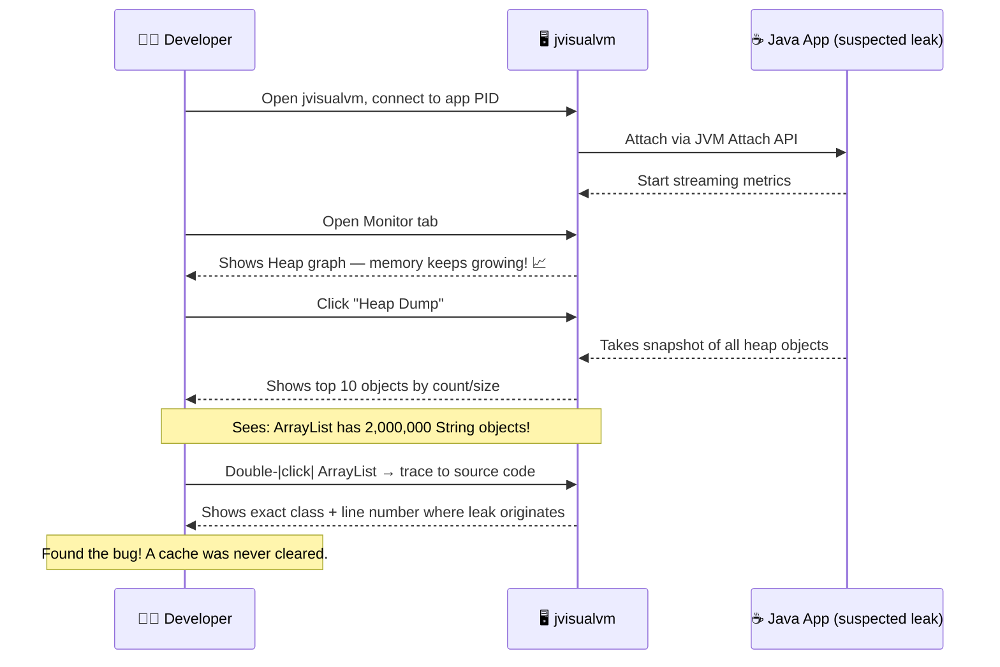
```mermaid
sequenceDiagram
    participant Dev as 👨‍💻 Developer
    participant jvvm as 🖥️ jvisualvm
    participant App as ☕ Java App (suspected leak)

    Dev->>jvvm: Open jvisualvm, connect to app PID
    jvvm->>App: Attach via JVM Attach API
    App-->>jvvm: Start streaming metrics

    Dev->>jvvm: Open Monitor tab
    jvvm-->>Dev: Shows Heap graph — memory keeps growing! 📈

    Dev->>jvvm: Click "Heap Dump"
    App-->>jvvm: Takes snapshot of all heap objects

    jvvm-->>Dev: Shows top 10 objects by count/size
    Note over Dev,jvvm: Sees: ArrayList has 2,000,000 String objects!

    Dev->>jvvm: Double-|click| ArrayList → trace to source code
    jvvm-->>Dev: Shows exact class + line number where leak originates

    Note over Dev: Found the bug! A cache was never cleared.
```

---

#### 📋 JDK Tool Reference Table

| Tool | Full Name | What it does | Use in Interview |
|---|---|---|---|
| `javac` | Java Compiler | Compiles `.java` source → `.class` bytecode | "Compilation step" |
| `java` | JVM Launcher | Runs a compiled Java program | "Execution step" |
| `javadoc` | Doc Generator | Generates HTML API docs from `/** */` comments | "Documentation" |
| `jdb` | Java Debugger | Command-line debugger (set breakpoints, inspect vars) | "CLI debugging" |
| **`jvisualvm`** | **Visual VM** | **GUI profiler: heap, threads, CPU, GC monitoring** | **"Profiling & monitoring"** |
| `jconsole` | JMX Console | Lightweight GUI for JMX monitoring | "JMX monitoring" |
| `jstack` | Stack Dump | Prints all thread stack traces to console | "Diagnosing deadlocks" |
| `jmap` | Memory Map | Prints heap stats or takes heap dump | "Memory analysis" |
| `jstat` | JVM Statistics | Real-time GC, class loading, JIT stats from CLI | "GC monitoring" |
| `jar` | Archive Tool | Packs `.class` files into a `.jar` archive | "Packaging" |

---

**Step-by-step — What happens when you run a Java program:**

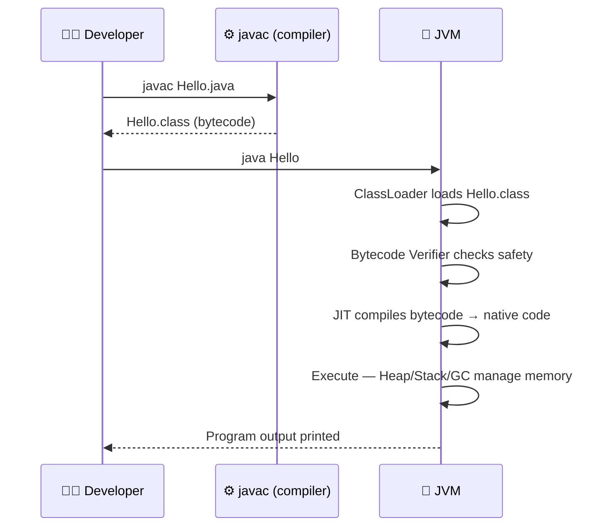
```mermaid
sequenceDiagram
    participant Dev as 👨‍💻 Developer
    participant javac as ⚙️ javac (compiler)
    participant JVM as 🔄 JVM

    Dev->>javac: javac Hello.java
    javac-->>Dev: Hello.class (bytecode)

    Dev->>JVM: java Hello
    JVM->>JVM: ClassLoader loads Hello.class
    JVM->>JVM: Bytecode Verifier checks safety
    JVM->>JVM: JIT compiles bytecode → native code
    JVM->>JVM: Execute — Heap/Stack/GC manage memory
    JVM-->>Dev: Program output printed
```

**Architectural reasoning**
- Separating runtime (JRE/JVM) from tooling (JDK) keeps production images smaller.
- The JVM boundary allows different language front-ends (Kotlin, Scala, Groovy) to target the same runtime.

| Component | Stands For | Purpose | Who Needs It |
|---|---|---|---|
| **JVM** | Java Virtual Machine | Runs `.class` bytecode | Runtime only |
| **JRE** | Java Runtime Environment | JVM + Standard Libraries | End users / Prod servers |
| **JDK** | Java Development Kit | JRE + Compiler + Dev Tools | Developers only |

---


## Q2. OOP Principles

> **🔰 Beginner's Concept**
> OOP organises code around **objects** — entities that combine related data (fields) and behaviour (methods).
> - **Encapsulation** = A medicine capsule hides its contents. Your class hides internal data behind public methods.
> - **Abstraction** = A TV remote — you press buttons without knowing the circuit board inside.
> - **Inheritance** = `Dog extends Animal`. Dog IS-A Animal — reuse and extend parent behaviour.
> - **Polymorphism** = Same method name, different behaviour. `speak()` returns "Woof" for Dog, "Meow" for Cat.
>
> 💡 **Tip:** Prefer **composition over inheritance** for flexibility. Inheritance creates tight coupling.

---

#### 🔒 Encapsulation — Protecting Your Data

**Analogy**: An ATM machine — you can withdraw money (public method), but you can't directly reach inside and take cash (private field).

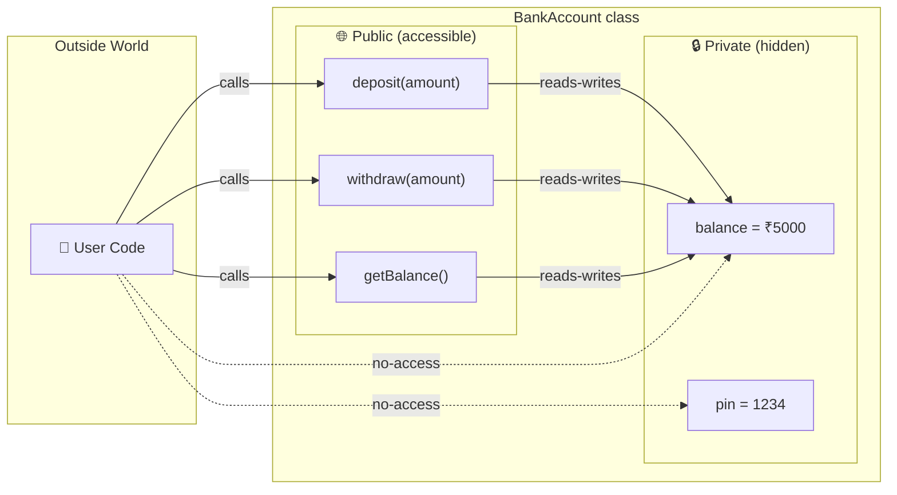
```mermaid
flowchart LR
    subgraph Outside["Outside World"]
        User["👤 User Code"]
    end
    subgraph BankAccount["BankAccount class"]
        subgraph Private["🔒 Private (hidden)"]
            balance["balance = ₹5000"]
            pin["pin = 1234"]
        end
        subgraph Public["🌐 Public (accessible)"]
            deposit["deposit(amount)"]
            withdraw["withdraw(amount)"]
            getBalance["getBalance()"]
        end
    end
    User -->|calls| deposit
    User -->|calls| withdraw
    User -->|calls| getBalance
    deposit & withdraw & getBalance -->|reads-writes| balance
    User -.->|no-access| balance
    User -.->|no-access| pin
```

```java
public class BankAccount {
    private double balance;                           // ❌ outside can't touch this
    private String pin;

    public double getBalance() { return balance; }    // ✅ controlled read
    public void deposit(double amt) {
        if (amt > 0) balance += amt;                  // ✅ business rule enforced
    }
    public void withdraw(double amt) {
        if (amt > 0 && balance >= amt) balance -= amt; // ✅ validation before change
    }
}
// Why? If balance were public, anyone could do: account.balance = -999999 — no validation!
```

---

#### 🎭 Abstraction — What, Not How

**Analogy**: A car's steering wheel. You turn it left — the car turns left. You don't know (or need to know) whether it uses hydraulic steering, electric power steering, or rack-and-pinion. The WHAT is the same; the HOW varies.

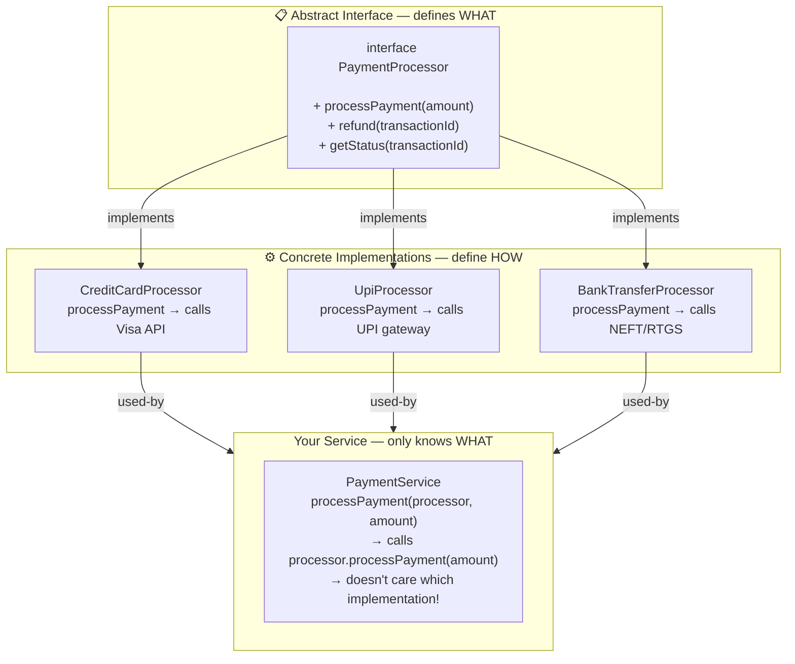
```mermaid
flowchart TB
    subgraph Contract["📋 Abstract Interface — defines WHAT"]
        PI["interface PaymentProcessor\n\n+ processPayment(amount)\n+ refund(transactionId)\n+ getStatus(transactionId)"]
    end

    subgraph Impl["⚙️ Concrete Implementations — define HOW"]
        CC["CreditCardProcessor\nprocessPayment → calls Visa API"]
        UPI["UpiProcessor\nprocessPayment → calls UPI gateway"]
        BT["BankTransferProcessor\nprocessPayment → calls NEFT/RTGS"]
    end

    PI -->|implements| CC
    PI -->|implements| UPI
    PI -->|implements| BT

    subgraph Service["Your Service — only knows WHAT"]
        Code["PaymentService\nprocessPayment(processor, amount)\n→ calls processor.processPayment(amount)\n→ doesn't care which implementation!"]
    end

    CC & UPI & BT -->|used-by| Service
```

---

#### 🧬 Inheritance — IS-A Relationship

**Analogy**: A `SavingsAccount` IS-A `BankAccount`. It inherits all of BankAccount's features (balance, deposit, withdraw) and adds its own (interest rate).


```mermaid
flowchart TB
    Animal["🐾 Animal\n+ name: String\n+ age: int\n+ eat(): void\n+ sleep(): void\n+ speak(): String ← abstract"]

    Animal -->|extends| Dog["🐕 Dog\n+ breed: String\n+ speak() → 'Woof!'\n+ fetch(): void"]
    Animal -->|extends| Cat["🐈 Cat\n+ indoor: boolean\n+ speak() → 'Meow!'\n+ purr(): void"]
    Animal -->|extends| Bird["🦜 Bird\n+ wingspan: double\n+ speak() → 'Tweet!'\n+ fly(): void"]

    subgraph HAS_A["HAS-|A| Relationships (Composition — PREFERRED)"]
        Dog2["Dog"] -->|HAS-A| Collar["Collar\n+ id: String\n+ owner: String"]
        Dog2 -->|HAS-A| Vet["Vet\n+ name: String\n+ clinic: String"]
    end

    style HAS_A fill:#000000,stroke:#4caf50 
```

> 🔑 **IS-A vs HAS-A** — one of the most asked OOP questions:
> - **IS-A** = Inheritance (`Dog extends Animal`) — use when a "Dog is a kind of Animal" makes sense
> - **HAS-A** = Composition (`Dog has a Collar`) — use when ownership/containing makes more sense
> - **Rule**: Prefer **HAS-A** (composition) over IS-A (inheritance) — it's more flexible and testable!

---

#### 🔗 HAS-A Relationship (Composition) — Deep Dive

**Beginner Analogy 🚗**: Think of a **Car**. A Car IS-A Vehicle? ✅ Yes. But a Car also **HAS-A** Engine, **HAS-A** Steering Wheel, **HAS-A** GPS. The Engine is NOT a Car — it's a *part* of a Car. That's composition!

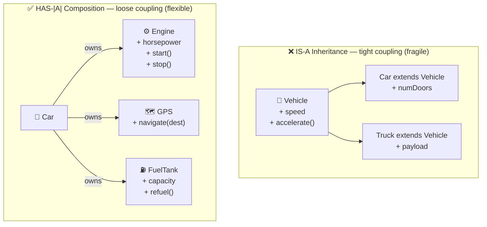
```mermaid
flowchart TB
    subgraph IsA["❌ IS-A Inheritance — tight coupling (fragile)"]
        Vehicle["🚗 Vehicle\n+ speed\n+ accelerate()"]
        Car["Car extends Vehicle\n+ numDoors"]
        Truck["Truck extends Vehicle\n+ payload"]
        Vehicle --> Car
        Vehicle --> Truck
    end

    subgraph HasA["✅ HAS-|A| Composition — loose coupling (flexible)"]
        Car2["🚗 Car"]
        Engine["⚙️ Engine\n+ horsepower\n+ start()\n+ stop()"]
        GPS["🗺️ GPS\n+ navigate(dest)"]
        FuelTank["⛽ FuelTank\n+ capacity\n+ refuel()"]
        Car2 -->|owns| Engine
        Car2 -->|owns| GPS
        Car2 -->|owns| FuelTank
    end
```

> 💡 **Key insight**: With composition you can swap `Engine` for an `ElectricMotor` without touching anything else in the Car class. With inheritance, changing the parent risks breaking all children — tight coupling!

**Three Flavours of HAS-A:**

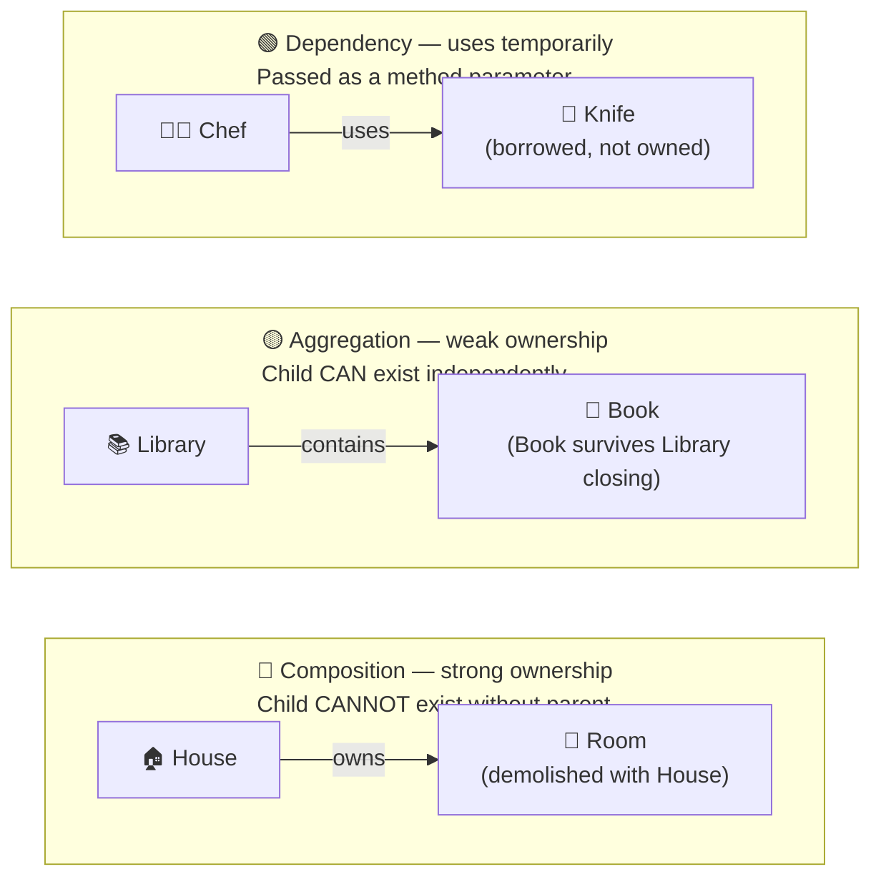
```mermaid
%%{init: {"flowchart": {"subGraphTitleMargin": {"top": 12, "bottom": 0}}}}%%
flowchart LR
    subgraph Composition["🔴 Composition — strong ownership\nChild CANNOT exist without parent"]
        direction LR
        House["🏠 House"] -->|owns| Room["🚪 Room\n(demolished with House)"]
    end

    subgraph Aggregation["🟡 Aggregation — weak ownership\nChild CAN exist independently"]
        direction LR
        Library["📚 Library"] -->|contains| Book["📖 Book\n(Book survives Library closing)"]
    end

    subgraph Dependency["🟢 Dependency — uses temporarily\nPassed as a method parameter"]
        direction LR
        Chef["👨‍🍳 Chef"] -->|uses| Knife["🔪 Knife\n(borrowed, not owned)"]
    end
```

**Full Java Implementation — Car with Engine, GPS, FuelTank:**

```java
// ── STEP 1: Define the PARTS (the "HAS" objects) ─────────────────

class Engine {
    private int horsepower;
    private boolean running;

    public Engine(int horsepower) { this.horsepower = horsepower; }

    public void start() {
        running = true;
        System.out.println("Engine started! " + horsepower + "hp roaring 🔥");
    }
    public void stop() {
        running = false;
        System.out.println("Engine stopped ✅");
    }
    public boolean isRunning() { return running; }
}

class GPS {
    private String currentLocation;
    public GPS(String startLocation) { this.currentLocation = startLocation; }

    public String navigate(String destination) {
        return "📍 Navigating: " + currentLocation + " → " + destination;
    }
}

class FuelTank {
    private double capacity;
    private double currentLevel;

    public FuelTank(double capacity) {
        this.capacity = capacity;
        this.currentLevel = capacity;               // start full
    }
    public void refuel(double litres) {
        currentLevel = Math.min(capacity, currentLevel + litres);
        System.out.println("⛽ Tank: " + currentLevel + "L / " + capacity + "L");
    }
    public double getLevel() { return currentLevel; }
}

// ── STEP 2: Compose the OWNER (Car HAS-A Engine + GPS + FuelTank) ─

class Car {
    private String brand;
    private Engine engine;      // 🔴 Composition — Car creates & owns Engine
    private GPS gps;            // 🔴 Composition — Car creates & owns GPS
    private FuelTank fuelTank;  // 🔴 Composition — Car creates & owns FuelTank

    public Car(String brand, int horsepower, double tankCapacity) {
        this.brand    = brand;
        this.engine   = new Engine(horsepower);     // Car builds its own engine
        this.gps      = new GPS("Delhi");
        this.fuelTank = new FuelTank(tankCapacity);
    }

    // Car DELEGATES to its parts — it doesn't do the work itself
    public void start() {
        if (fuelTank.getLevel() > 0) {
            engine.start();                         // delegate to Engine
            System.out.println(brand + " ready to go! 🚗");
        } else {
            System.out.println("❌ No fuel! Please refuel first.");
        }
    }

    public void stop()                    { engine.stop(); }                // delegate to Engine
    public String navigateTo(String dest) { return gps.navigate(dest); }   // delegate to GPS
    public void refuel(double litres)     { fuelTank.refuel(litres); }     // delegate to FuelTank
}

// ── STEP 3: Use it ───────────────────────────────────────────────

Car myCar = new Car("Toyota Camry", 200, 60.0);
myCar.start();                                       // Engine started! 200hp roaring 🔥
                                                     // Toyota Camry ready to go! 🚗
System.out.println(myCar.navigateTo("Mumbai"));      // 📍 Navigating: Delhi → Mumbai
myCar.refuel(10.0);                                  // ⛽ Tank: 60.0L / 60.0L
myCar.stop();                                        // Engine stopped ✅

// 🔄 POWER OF COMPOSITION: want an electric version?
// Just swap Engine for ElectricMotor — the Car class itself is UNCHANGED!
```

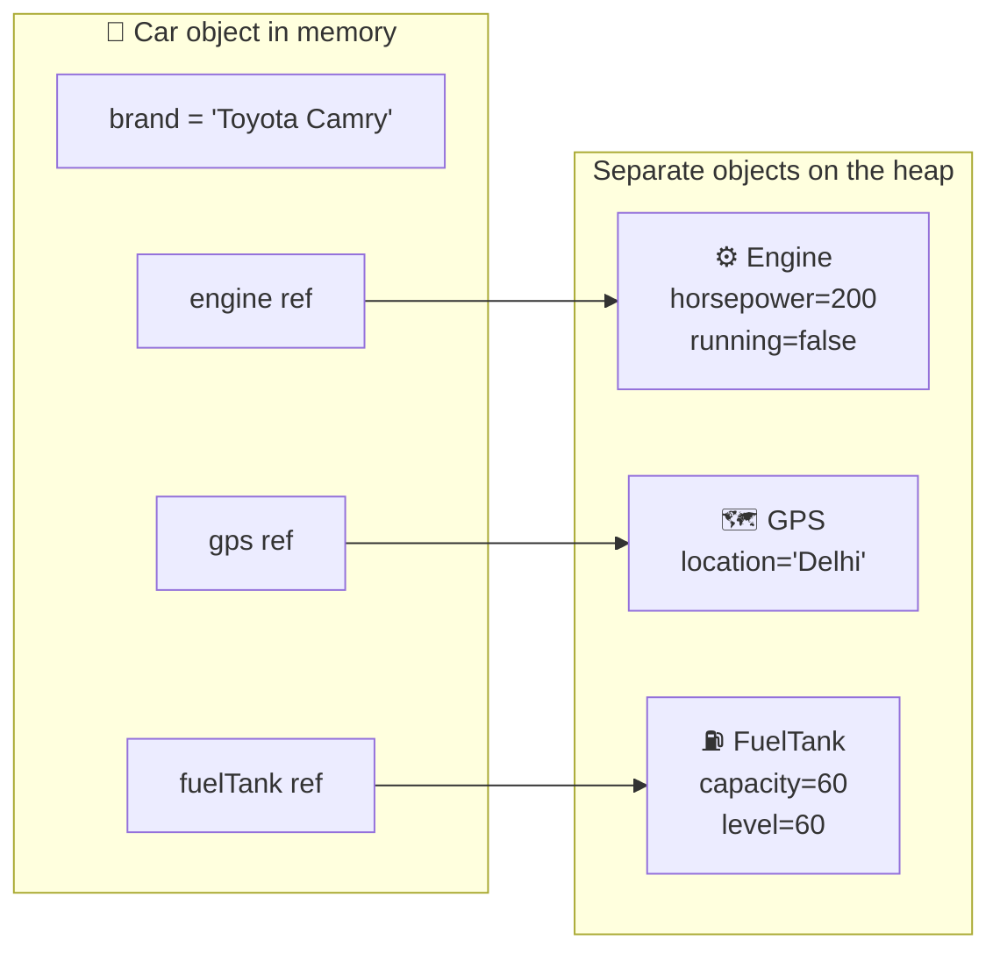
```mermaid
flowchart LR
    subgraph CarObj["🚗 Car object in memory"]
        brand["brand = 'Toyota Camry'"]
        engineRef["engine ref"]
        gpsRef["gps ref"]
        tankRef["fuelTank ref"]
    end
    subgraph Parts["Separate objects on the heap"]
        E["⚙️ Engine\nhorsepower=200\nrunning=false"]
        G["🗺️ GPS\nlocation='Delhi'"]
        F["⛽ FuelTank\ncapacity=60\nlevel=60"]
    end
    engineRef --> E
    gpsRef --> G
    tankRef --> F
```

**IS-A vs HAS-A Decision Guide:**

| Scenario | Relationship | Reason |
|----|---|----|
| `Dog` → `Animal` | **IS-A** ✅ | A dog truly IS a kind of animal |
| `Car` → `Engine` | **HAS-A** ✅ | Engine is a PART of a car |
| `Manager` → `Employee` | **IS-A** ✅ | A manager IS an employee |
| `User` → `Address` | **HAS-A** ✅ | Address is data held by User |
| `Order` → `OrderItems` | **HAS-A** ✅ | Items are parts of an order |
| Java's `Stack extends Vector` | **BAD IS-A** ❌ | Stack is NOT a Vector; exposes wrong methods |

> ⚠️ **Famous Java mistake**: `Stack extends Vector` is a classic IS-A misuse. Because Stack inherits Vector, callers can do `stack.add(0, "x")` — inserting at any position — which completely breaks the LIFO contract. Composition would have hidden those methods and prevented the bug.

---

#### 🎭 Polymorphism — Two Types You MUST Know

> 💡 **Polymorphism** = "many forms" — the same method name behaves differently depending on context.
> Java has **two kinds**:
> - **Compile-time** (Static Polymorphism) = resolved by the **compiler** → **Method Overloading**
> - **Runtime** (Dynamic Polymorphism) = resolved by the **JVM at runtime** → **Method Overriding**

---

##### ⏱️ Compile-Time Polymorphism — Method Overloading

**Analogy**: A vending machine with ONE button labelled "Dispense". Put in ₹10 → gives chocolate. Put in ₹20 → gives crisps. Same button, different behaviour based on **what you give it** — and the machine "knows" at design time which slot to use.


```mermaid
flowchart TB
    subgraph Overloading["Compile-Time Polymorphism — same name, different signatures"]
        direction TB
        Caller["Calculator calc = new Calculator()"]

        Caller -->|add-int-int| M1["add(int a, int b)\n→ returns 8"]
        Caller -->|add-double-double| M2["add(double a, double b)\n→ returns 4.0"]
        Caller -->|add-int-int-int| M3["add(int a, int b, int c)\n→ returns 6"]
        Caller -->|add-String-String| M4["add(String a, String b)\n→ returns Hello World"]

        CompileNote["🔧 COMPILER picks the right method\nbased on argument TYPES and COUNT\nat COMPILE time — before the program even runs"]
    end
    style CompileNote fill:#1a3a5c,stroke:#4fc3f7
```

```java
// ── COMPILE-TIME POLYMORPHISM — Method Overloading ───────────────

class Calculator {

    // Same name "add" — different parameter signatures
    public int add(int a, int b) {
        System.out.println("▶ Called: add(int, int)");
        return a + b;
    }

    public double add(double a, double b) {           // overload: different param types
        System.out.println("▶ Called: add(double, double)");
        return a + b;
    }

    public int add(int a, int b, int c) {             // overload: different param count
        System.out.println("▶ Called: add(int, int, int)");
        return a + b + c;
    }

    public String add(String a, String b) {           // overload: String params
        System.out.println("▶ Called: add(String, String)");
        return a + b;
    }

    // ❌ NOT valid overloading — only return type differs → COMPILE ERROR
    // public double add(int a, int b) { return (double)(a + b); }
}

// ── USAGE ────────────────────────────────────────────────────────
Calculator calc = new Calculator();

System.out.println(calc.add(5, 3));              // ▶ add(int, int)       → 8
System.out.println(calc.add(2.5, 1.5));          // ▶ add(double, double) → 4.0
System.out.println(calc.add(1, 2, 3));           // ▶ add(int, int, int)  → 6
System.out.println(calc.add("Hello", " World")); // ▶ add(String, String) → Hello World

// The compiler decides WHICH add() to call at compile time based on argument types
```

> 🔑 **Rules for Method Overloading:**
> - Methods must have the **same name**
> - Must differ in **parameter type, count, or order**
> - Return type **alone** is NOT enough to overload (compile error)
> - Can exist in the **same class** — no inheritance needed
> - `static` methods CAN be overloaded

---

##### 🏃 Runtime Polymorphism — Method Overriding

**Analogy**: A "play" button on different apps. Press it on Spotify → music plays. Press it on Netflix → video plays. The SAME method call produces DIFFERENT behaviour — decided at **runtime** based on the actual object type.

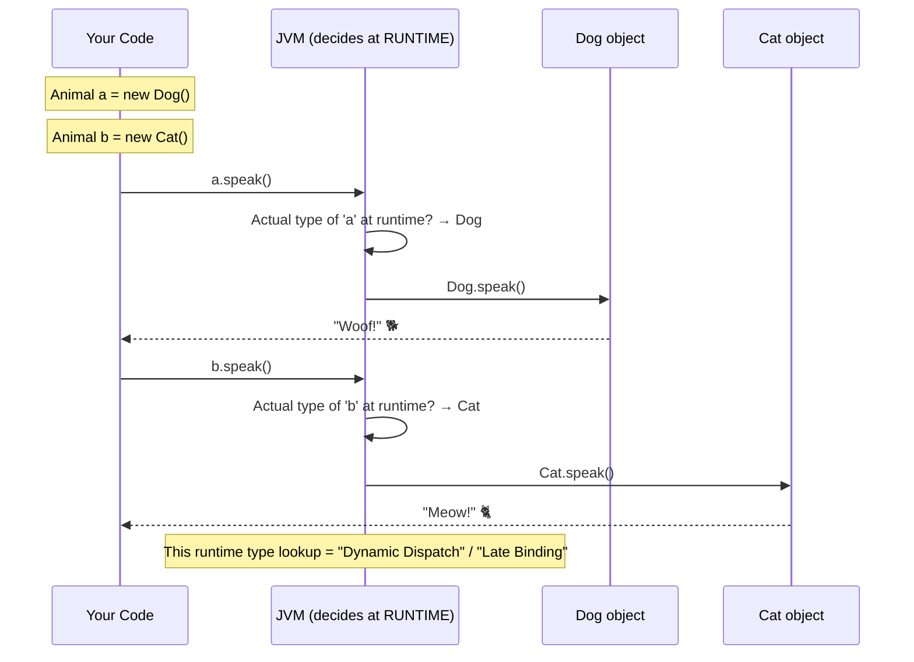
```mermaid
sequenceDiagram
    participant Code as Your Code
    participant JVM as JVM (decides at RUNTIME)
    participant Dog as Dog object
    participant Cat as Cat object

    Note over Code: Animal a = new Dog()
    Note over Code: Animal b = new Cat()

    Code->>JVM: a.speak()
    JVM->>JVM: Actual type of 'a' at runtime? → Dog
    JVM->>Dog: Dog.speak()
    Dog-->>Code: "Woof!" 🐕

    Code->>JVM: b.speak()
    JVM->>JVM: Actual type of 'b' at runtime? → Cat
    JVM->>Cat: Cat.speak()
    Cat-->>Code: "Meow!" 🐈

    Note over JVM: This runtime type lookup = "Dynamic Dispatch" / "Late Binding"
```


```mermaid
flowchart TB
    subgraph Overriding["Runtime Polymorphism — same signature, different behaviour per subclass"]
        Animal2["abstract class Animal\n+ speak(): String  ← defines CONTRACT"]

        Animal2 -->|extends| Dog2["class Dog\n@Override speak() → Woof"]
        Animal2 -->|extends| Cat2["class Cat\n@Override speak() → Meow"]
        Animal2 -->|extends| Bird2["class Bird\n@Override speak() → Tweet"]

        Ref["Animal ref = new Dog()\nref.speak()"]
        Ref -->|JVM-checks-at-RUNTIME| Dog2
        RuntimeNote["🏃 JVM decides WHICH speak()\nto call at RUNTIME\nbased on actual object type"]
    end
    style RuntimeNote fill:#1a3a5c,stroke:#4caf50
```

```java
// ── RUNTIME POLYMORPHISM — Method Overriding ─────────────────────

abstract class Animal {
    private String name;
    public Animal(String name) { this.name = name; }
    public String getName()    { return name; }

    public abstract String speak();                   // CONTRACT — defines WHAT, not HOW
    public void sleep() { System.out.println(name + " is sleeping 💤"); }
}

class Dog extends Animal {
    private String breed;
    public Dog(String name, String breed) { super(name); this.breed = breed; }

    @Override
    public String speak() { return "Woof! 🐕"; }     // Dog's HOW
}

class Cat extends Animal {
    public Cat(String name) { super(name); }

    @Override
    public String speak() { return "Meow! 🐈"; }     // Cat's HOW
}

class Bird extends Animal {
    public Bird(String name) { super(name); }

    @Override
    public String speak() { return "Tweet! 🦜"; }    // Bird's HOW
}

// ── RUNTIME POLYMORPHISM IN ACTION ───────────────────────────────
List<Animal> shelter = List.of(
    new Dog("Rex", "Labrador"),
    new Cat("Whiskers"),
    new Bird("Tweety"),
    new Dog("Buddy", "Poodle")
);

for (Animal a : shelter) {
    // Reference type = Animal (parent) — but JVM calls the REAL speak() at runtime
    System.out.println(a.getName() + " says: " + a.speak());
}
// Output:
// Rex says:      Woof!  🐕    ← JVM called Dog.speak()
// Whiskers says: Meow!  🐈    ← JVM called Cat.speak()
// Tweety says:   Tweet! 🦜    ← JVM called Bird.speak()
// Buddy says:    Woof!  🐕    ← JVM called Dog.speak()

// ✅ Adding Lion? Zero changes to the loop — just add a new class!
// class Lion extends Animal { @Override public String speak() { return "Roar! 🦁"; } }
```

> 🔑 **Rules for Method Overriding:**
> - Same **method name** and **exact same parameters** (identical signature)
> - Return type must be **same or a subtype** (covariant return)
> - Access modifier must be **same or broader** (`protected` → `public` ✅, `public` → `private` ❌)
> - Always use `@Override` — compiler warns you if the signature doesn't match
> - `static` and `private` methods **cannot** be overridden (they are hidden, not overridden)

---

##### 📊 Compile-Time vs Runtime Polymorphism — Full Comparison

| Feature | ⏱️ Compile-Time (Overloading) | 🏃 Runtime (Overriding) |
|----|---|----|
| **Also called** | Static polymorphism | Dynamic polymorphism |
| **Resolved by** | Compiler | JVM at runtime |
| **Resolved at** | Compile time | Runtime |
| **Method signature** | Must **DIFFER** (type / count) | Must be **IDENTICAL** |
| **Return type** | Can differ | Same or subtype only |
| **Inheritance needed?** | ❌ No — same class is fine | ✅ Yes — parent–child |
| **Annotation** | None | `@Override` (recommended) |
| **Performance** | ⚡ Faster (decided upfront) | Tiny overhead (dynamic dispatch) |
| **Static methods** | ✅ Can be overloaded | ❌ Cannot be overridden (only hidden) |
| **Keyword trigger** | None special | `extends` / `implements` |
| **Classic example** | `print(int)` vs `print(String)` | `Dog.speak()` vs `Cat.speak()` |

```java
// ── SIDE-BY-SIDE MINI EXAMPLE ────────────────────────────────────

// 1️⃣ COMPILE-TIME — same class, DIFFERENT signatures
class Printer {
    public void print(int n)           { System.out.println("Integer: " + n); }
    public void print(String s)        { System.out.println("String: " + s); }
    public void print(int n, String s) { System.out.println("Both: " + n + ", " + s); }
    // Compiler picks at compile time based on what you pass
}

// 2️⃣ RUNTIME — parent-child, SAME signature, different body
class Shape {
    public double area() { return 0; }
}
class Circle extends Shape {
    private double radius;
    public Circle(double r) { this.radius = r; }
    @Override public double area() { return Math.PI * radius * radius; }
}
class Rectangle extends Shape {
    private double w, h;
    public Rectangle(double w, double h) { this.w = w; this.h = h; }
    @Override public double area() { return w * h; }
}

Shape s1 = new Circle(5);        // reference type = Shape (parent)
Shape s2 = new Rectangle(4, 6);  // reference type = Shape (parent)
System.out.println(s1.area());    // 78.53  ← JVM calls Circle.area()    at RUNTIME
System.out.println(s2.area());    // 24.0   ← JVM calls Rectangle.area() at RUNTIME
```

---

**Step-by-step interview walk-through**
1. Encapsulation protects state behind a public API — prevents invalid state.
2. Abstraction hides complexity and exposes only essential contracts — cleaner APIs.
3. Inheritance reuses behaviour where an IS-A relationship makes sense — but use sparingly.
4. Polymorphism lets code depend on interfaces, not concrete classes — easy to extend.

**Architectural reasoning**
- Encapsulation and abstraction reduce coupling between modules.
- Polymorphism enables strategy swaps without changing call sites.
- Prefer **composition over inheritance** — inherit only when the IS-A is truly permanent.

| Pillar | Key Keyword | Interview Trigger Word |
|---------|--------|-----|
| Encapsulation | `private`, `getter/setter`      | "data hiding", "information hiding" |
| Abstraction | `interface`, `abstract`         | "contract", "polymorphic type" |
| Inheritance | `extends`, `super`              | "IS-A", "code reuse" |
| Polymorphism | `@Override`, dynamic dispatch   | "runtime binding", "open/closed" |

---

## Q3. HashMap vs HashTable

> **🔰 Beginner's Concept**
> A **Map** stores key-value pairs — like a phone book. Given any key (name), get its value (phone number) in O(1) average time.

**The Internal Mechanism — How HashMap Actually Works:**

```mermaid
flowchart TB
    subgraph Step1["Step 1: Hash the key"]
        K["Key: 'Alice'"] -->|key-hashCode| H["hashCode = 65198723"]
        H -->|index-eq-hashCode-pct-capacity| Idx["index = 65198723 % 16 = 3"]
    end

    subgraph Step2["Step 2: Store in bucket array"]
        BucketArray["Bucket Array (default size: 16)"]
        B0["[0] → null"]
        B1["[1] → null"]
        B2["[2] → null"]
        B3["[3] → ●"] 
        B4["[4] → null"]
        Bdot["... (to [15])"]
        BucketArray --> B0 & B1 & B2 & B3 & B4 & Bdot
    end

    subgraph Step3["Step 3: Collision handling"]
        B3 -->|linked-list| E1["Entry{key='Alice', value='123-456'}"]
        E1 -->|if-same-bucket| E2["Entry{key='Bob', value='789-000'}\n(different key, same bucket index)"]
        E2 -->|chain-over-8-entries| Tree["🌳 TreeNode\n(O(log n) access)"]
    end

    K --> Step2
    Step1 --> Step2
```

**Step 4 — What happens when HashMap grows (Resize):**

```mermaid
sequenceDiagram
    participant User as Your Code
    participant HM as HashMap (capacity=16)
    participant New as New HashMap (capacity=32)

    User->>HM: put("Alice", "123")
    User->>HM: put("Bob", "456")
    Note over HM: ... keep adding entries ...
    User->>HM: put("Zach", "789") (12th entry = 75% full)

    HM->>HM: Load factor exceeded! (0.75 × 16 = 12)
    HM->>New: Create new array (double size: 32)
    HM->>New: Rehash ALL existing entries into new positions
    Note over New: Each key gets a NEW bucket index based on new capacity

    Note over HM,New: ⚠️ Expensive! Pre-|size| your HashMap if you know the expected count
```

```java
// Pre-size to avoid expensive resizes!
// Formula: initialCapacity = (expectedSize / loadFactor) + 1
Map<String, User> users = new HashMap<>(1024, 0.75f); // for ~768 entries

// ✅ Production pattern: ConcurrentHashMap for shared state
Map<String, Integer> wordCount = new ConcurrentHashMap<>();
wordCount.merge("java", 1, Integer::sum);  // Atomic read-modify-write

// ✅ LinkedHashMap to preserve insertion order
Map<String, String> ordered = new LinkedHashMap<>();

// ✅ TreeMap for sorted keys
Map<String, String> sorted = new TreeMap<>(); // keys always in sorted order
```

**Step-by-step**
1. A key is hashed and mapped to a bucket index.
2. The bucket stores a single entry or a collision chain.
3. Long chains (>8) are treeified to keep lookups efficient at O(log n).
4. When the load factor (75% by default) is exceeded, the table doubles and rehashes.

**Architectural reasoning**
- O(1) average access depends on good hash distribution and capacity planning.
- Treeification prevents worst-case O(n) behavior when many collisions occur.
- Pre-sizing reduces expensive resize operations on hot paths.

| Feature | `HashMap` | `HashTable` | `ConcurrentHashMap` | `LinkedHashMap` | `TreeMap` |
|---|---|---|---|---|---|
| Thread Safety | ❌ No | ✅ Full sync | ✅ Segment locks | ❌ No | ❌ No |
| Null Key | ✅ 1 | ❌ No | ❌ No | ✅ 1 | ❌ No |
| Null Value | ✅ Yes | ❌ No | ❌ No | ✅ Yes | ✅ Yes |
| Order | ❌ None | ❌ None | ❌ None | ✅ Insertion | ✅ Sorted |
| Performance | ✅ Fastest | ❌ Slowest | ✅ Fast concurrent | Similar | O(log n) |
| Use For | Single-thread | Legacy code | Multi-thread prod | LRU caches | Sorted data |

---

## Q4. ArrayList vs LinkedList

> **🔰 Beginner's Concept**
> Both are ordered `List` implementations but differ in how they store elements internally:
> - **ArrayList** = Numbered library shelf. Elements stored contiguously in memory. `get(5)` is O(1) — instant jump to position.
> - **LinkedList** = Treasure hunt chain. Each node holds data + pointer to the next. To reach index 5, traverse 5 nodes = O(n).
>
> 💡 **Default choice:** Always use `ArrayList`. Only pick `LinkedList` for O(1) insertions at both ends (use it as a `Deque`).

```mermaid
flowchart TB
    subgraph AL["ArrayList — Contiguous Memory Block"]
        direction LR
        A0["[0]\n10"] --- A1["[1]\n20"] --- A2["[2]\n30"] --- A3["[3]\n40"] --- A4["[4]\n50"] --- A5["[5]\n(empty)"]
        Note1["get(3) → direct index jump → O(1) ✅\ninsert at [2] → shift [2],[3],[4] right → O(n) ❌"]
    end

    subgraph LL["LinkedList — Doubly-|Linked| Nodes (scattered in memory)"]
        direction LR
        N1["10\nprev: null\nnext: →"] <--> N2["20\nprev: ←\nnext: →"] <--> N3["30\nprev: ←\nnext: →"] <--> N4["40\nprev: ←\nnext: null"]
        Note2["get(3) → traverse from head: 10→20→30→40 → O(n) ❌\ninsert between nodes → just relink pointers → O(1) ✅"]
    end
```

**Step-by-step**
1. ArrayList stores elements contiguously for O(1) index access.
2. LinkedList stores nodes with pointers; access requires traversal.
3. Inserts in the middle shift ArrayList elements but only relink nodes in LinkedList.

| Operation | ArrayList | LinkedList |
|-----|----|------|
| `get(i)` — random access | **O(1)** ✅ | O(n) ❌ |
| Add at end | O(1) amortised | O(1) |
| Add at start/middle | O(n) ❌ | **O(1)** ✅ |
| Remove from middle | O(n) ❌ | **O(1)** ✅ |
| Memory per element | Low (value only) | High (value + 2 pointers per node) |
| CPU cache performance | ✅ Excellent (contiguous) | ❌ Poor (scattered nodes) |
| Use as Stack/Queue | Possible but not ideal | ✅ Best as Deque |

```java
List<Product> catalog  = new ArrayList<>();   // read-heavy: get(i) is O(1)
Deque<Task>   taskQueue = new LinkedList<>();  // write-heavy: addFirst/removeLast O(1)
```

---


## Q5. Immutable Class

> **🔰 Beginner's Concept**
> An **immutable** object's state CANNOT change after it is created — like a printed boarding pass.
> - Java's `String` is immutable: `"hello".toUpperCase()` returns a NEW `"HELLO"` string; `"hello"` stays unchanged.
> - **Thread-safe by default:** Multiple threads can read an immutable object with zero locking required.
> - **Safe as HashMap key:** Since `hashCode()` never changes, immutable objects are reliable map keys.
>
> 💡 Use immutable value objects in your domain: `Money`, `Email`, `PhoneNumber`, `ProductId`, `UserId`.

```mermaid
mindmap
  root((Immutable Class Rules))
    final class (no subclassing)
    private + final fields
    no setters / mutators
    deep copy mutable inputs
    return defensive copies
```

**Step-by-step**
1. Make the class `final` and fields `private final`.
2. Avoid setters or any method that mutates state.
3. Deep-copy mutable inputs and return defensive copies.

**Architectural reasoning**
- Immutability simplifies concurrency and caching.
- Immutable objects are safe as map keys and reduce synchronization needs.
- Defensive copying prevents external references from mutating internal state.

```java
public final class Money {                           // Rule 1: final class
    private final BigDecimal amount;                 // Rule 2: private + final
    private final String currency;
    private final List<String> tags;

    public Money(BigDecimal amount, String currency, List<String> tags) {
        this.amount   = amount;
        this.currency = currency;
        this.tags     = new ArrayList<>(tags);       // Rule 4: defensive copy
    }

    public BigDecimal getAmount()  { return amount; }
    public String getCurrency()    { return currency; }
    public List<String> getTags()  {
        return Collections.unmodifiableList(tags);   // Rule 5: unmodifiable view
    }

    public Money add(Money other) {                  // Returns NEW object
        return new Money(this.amount.add(other.amount), this.currency, this.tags);
    }
}
// Benefits: Thread-safe by default, safe as HashMap key, cacheable
```

---

## Q6. String Pool & Performance

> **🔰 Beginner's Concept**
> Java maintains a **String Constant Pool** in heap memory. String literals with the same content share one object:
> - `String a = "hello"; String b = "hello";` → both point to the **same** pooled object. `a == b` is `true`.
> - `String c = new String("hello");` → forces a **new** heap object. `c == a` is `false`, but `c.equals(a)` is `true`.
> - `s.intern()` manually adds a string to the pool.
>
> 💡 **Performance:** `str = str + i` in a loop creates thousands of temporary objects. Use `StringBuilder` instead.

```mermaid
flowchart TB
    Heap["Heap Memory"]
    Pool["String Constant Pool"]
    Hello["hello"]
    World["world"]
    Heap --> Pool
    Pool --> Hello
    Pool --> World

    A["String a = hello"] --> Hello
    B["String b = hello"] --> Hello
    C["String c = new String(hello)"] --> Cobj["new heap object"]
    Cobj -.->|content-equals| Hello
```

**Step-by-step**
1. String literals are stored in the String Constant Pool.
2. Identical literals reference the same pooled object.
3. `new String("hello")` forces a new heap object.
4. `==` compares references; `equals()` compares content.

**Architectural reasoning**
- Pooling reduces memory and speeds up comparisons for repeated literals.
- Avoid `new String(...)` unless you explicitly need a distinct instance.
- Prefer `equals()` for content comparison in production logic.

```java
// ❌ BAD: Creates 10,000 String objects in heap
String result = "";
for (int i = 0; i < 10_000; i++) result += i;  // New object each iteration!

// ✅ GOOD: StringBuilder — single mutable buffer
StringBuilder sb = new StringBuilder(50_000);  // Pre-size for performance
for (int i = 0; i < 10_000; i++) sb.append(i);
String res = sb.toString();  // One final String object

// ✅ MODERN: String.join or collectors
String csv = IntStream.range(0, 10_000)
        .mapToObj(Integer::toString)
        .collect(Collectors.joining(","));
```

---

## Q7. == vs equals()

> **🔰 Beginner's Concept**
> Two ways to compare things in Java — they answer different questions:
> - `==` → **Reference equality**: are these two variables pointing to the EXACT SAME object in memory?
> - `equals()` → **Value equality**: do these two objects represent the same logical value?
> - For **primitives** (`int`, `double`, `boolean`), `==` always compares values directly — there are no objects.
> - ⚠️ The `Integer` cache covers -128 to 127: `Integer a=127; a==b` is `true`, but `Integer a=200; a==b` is `false`!
>
> 💡 **Rule:** Always use `.equals()` for Strings and Objects in business logic. Never rely on `==` for Strings.

```mermaid
flowchart LR
    subgraph Stack
        A["a"]
        B["b"]
        C["c"]
    end
    subgraph Heap
        H1["String hello (obj1)"]
        H2["String hello (obj2)"]
    end
    A --> H1
    B --> H1
    C --> H2
```

**Step-by-step**
1. References (`a`, `b`, `c`) live on the stack and point to heap objects.
2. `a` and `b` reference the same heap object → `a == b` is true.
3. `c` references a different object with the same content.
4. `equals()` compares content, not references.

**Architectural reasoning**
- Reference equality (`==`) is fast but only valid when identity matters.
- Use `equals()` for business logic to avoid subtle correctness bugs.
- String interning and caches can affect reference equality; don’t rely on it.

```java
// Primitives: == always compares values
int x = 100, y = 100;
System.out.println(x == y);           // true ✅

        // Integer cache: -128 to 127 are cached!
        Integer a = 127, b = 127;
System.out.println(a == b);           // true (cached!)
        Integer c = 128, d = 128;
System.out.println(c == d);           // false ❌ (not cached, new objects)
System.out.println(c.equals(d));      // true ✅

// Always override equals() AND hashCode() together!
public class User {
    private final String email;

    @Override public boolean equals(Object o) {
        if (this == o) return true;
        if (!(o instanceof User)) return false;
        return Objects.equals(email, ((User) o).email);
    }

    @Override public int hashCode() {
        return Objects.hash(email);    // Consistent with equals!
    }
}
// Rule: if a.equals(b) then a.hashCode() == b.hashCode() MUST be true
```

---

## Q8. Method Overloading vs Overriding

> **🔰 Beginner's Concept**
> Both allow the same method name to serve different purposes:
> - **Overloading** = Same class, same name, **different parameters**. Resolved at **compile time** by the compiler.
    >   Example: `log(String msg)` and `log(String msg, Level level)` — compiler picks the right one based on arguments.
> - **Overriding** = Child class **replaces** the parent's method with its own version. Resolved at **runtime** by actual object type.
    >   Example: `Animal a = new Dog(); a.speak();` → calls Dog's `speak()` at runtime even though the variable is typed as `Animal`.
>
> 💡 Always add `@Override` when overriding — the compiler will catch any signature typos immediately.

---

#### 📞 Overloading — Compile-Time Decision

**Analogy**: A phone app with multiple "contact" actions — `call(name)`, `call(number)`, `call(contact, isVideo)`. Same action name ("call"), but compiler picks the right version based on what you pass.

```mermaid
flowchart LR
    subgraph Source["Your Code (compile time)"]
        C1["logger.log('Error!')"]
        C2["logger.log('Error!', Level.ERROR)"]
        C3["logger.log(exception)"]
    end

    subgraph Compiler["⚙️ Compiler — resolves at compile time"]
        Check["Looks at argument TYPES:\n- String only → method 1\n- String + Level → method 2\n- Exception → method 3"]
    end

    subgraph Methods["Logger class methods"]
        M1["void log(String msg)"]
        M2["void log(String msg, Level level)"]
        M3["void log(Exception ex)"]
    end

    C1 --> Compiler --> M1
    C2 --> Compiler --> M2
    C3 --> Compiler --> M3
```

```java
public class Logger {
    // Overloaded methods — same name, different parameters
    public void log(String msg)                         { System.out.println(msg); }
    public void log(String msg, Level level)            { System.out.println("[" + level + "] " + msg); }
    public void log(Exception ex)                       { System.out.println("ERROR: " + ex.getMessage()); }
    public void log(String msg, Object... args)         { System.out.printf(msg + "%n", args); } // varargs

    // ❌ CANNOT overload by return type only — compiler error!
    // public int log(String msg)  ← same name + params as first method = DUPLICATE
}
```

---

#### 🔄 Overriding — Runtime Decision

**Analogy**: A universal remote with a "volume up" button. Each brand (Samsung, Sony, LG) has a different internal implementation of what "volume up" means, but you press the same button.

```mermaid
sequenceDiagram
    participant Code as Your Code
    participant Ref as Animal reference
    participant JVM as JVM (runtime)
    participant Dog as Dog object (actual)
    participant Cat as Cat object (actual)

    Code->>Ref: Animal a = new Dog()
    Note over Ref: variable TYPE = Animal
    Note over Dog: actual OBJECT = Dog

    Code->>Ref: a.speak()
    Ref->>JVM: dispatch speak() call
    JVM->>JVM: Look up actual type: Dog
    JVM->>Dog: Dog.speak()
    Dog-->>Code: "Woof!" ← Dog's version

    Code->>Ref: Animal b = new Cat()
    Code->>Ref: b.speak()
    JVM->>Cat: Cat.speak()
    Cat-->>Code: "Meow!" ← Cat's version

    Note over JVM: This is "Dynamic Method Dispatch" or "Late Binding"
```

```java
class Animal {
    public String speak() { return "..."; }           // base implementation
    public final void breathe() { /* can't override */ } // ← final = no overriding!
}

class Dog extends Animal {
    @Override
    public String speak() { return "Woof!"; }         // ✅ override — @Override catches typos

    // ❌ CANNOT change to private — would reduce visibility
    // ❌ CANNOT change throws clause to add checked exceptions
}

class Cat extends Animal {
    @Override
    public String speak() { return "Meow!"; }
}

// Runtime polymorphism:
Animal a = new Dog();
System.out.println(a.speak()); // "Woof!" — Dog.speak() called at runtime
```

---

**Full Comparison:**

| Feature | Overloading | Overriding |
|----------|---|-------------|
| **When decided** | Compile time | Runtime |
| **Where** | Same class (or subclass) | Parent → Child class |
| **Method name** | Same | Same |
| **Parameters** | Must differ | Must be identical |
| **Return type** | Can differ | Same OR covariant (subtype) |
| **`@Override`** | Not applicable | Must use (best practice) |
| **Access modifier** | Any | Cannot be more restrictive |
| **`static` methods** | Can overload | Cannot override (hidden, not overridden!) |
| **`private` methods** | Can overload | Cannot override (not inherited) |
| **`final` methods** | Can overload | Cannot override |
| **Constructor** | Can overload | Cannot override |

> ⚠️ **Interview Trap**: Static methods are **hidden**, not **overridden**. If you call a static method through a reference variable, it uses the DECLARED type, not the actual type!
> ```java
> Animal a = new Dog();
> a.speak();          // → Dog.speak() (runtime dispatch — overriding)
> Animal.staticMethod(); // → Animal.staticMethod() (compile-time — hiding, not overriding)
> ```

---

## Q9. Multithreading

> **🔰 Beginner's Concept**
> A **thread** is an independent sequence of instructions inside a process. Multiple threads share the same heap memory.
> - **Single-threaded:** Tasks run one after another. Task A (100ms) + Task B (100ms) = 200ms total.
> - **Multi-threaded:** Tasks run concurrently. Task A and B both run in parallel ≈ 100ms total.
> - **Risks:** Race conditions (two threads corrupt shared data), deadlocks (threads wait for each other forever).
> - **Thread states:** `NEW → RUNNABLE → RUNNING → BLOCKED/WAITING/TIMED_WAITING → TERMINATED`
>
> 💡 **Never** use `new Thread()` in production. Use `ExecutorService` to manage a reusable thread pool.

```mermaid
stateDiagram-v2
    [*] --> NEW : new Thread()
    NEW --> RUNNABLE : start()
    RUNNABLE --> RUNNING : scheduled by CPU
    RUNNING --> RUNNABLE : yield()
    RUNNING --> BLOCKED : waiting for monitor lock
    RUNNING --> TIMED_WAITING : sleep()/wait(t)/join(t)
    RUNNING --> WAITING : wait()/join()
    TIMED_WAITING --> RUNNABLE : timeout/notify
    WAITING --> RUNNABLE : notify/lock acquired
    BLOCKED --> RUNNABLE : lock acquired
    RUNNING --> TERMINATED : run() completes
    TERMINATED --> [*]
```

**Step-by-step**
1. `new Thread()` creates the `NEW` state.
2. `start()` transitions to `RUNNABLE` (eligible to run).
3. Scheduler assigns CPU → `RUNNING`.
4. Blocking calls or monitor contention move to `WAITING`, `TIMED_WAITING`, or `BLOCKED`.
5. Notifications or lock acquisition return to `RUNNABLE`.
6. When `run()` finishes, the thread is `TERMINATED`.

**Architectural reasoning**
- State transitions help explain deadlocks, starvation, and latency spikes.
- Understanding `BLOCKED` vs `WAITING` guides which synchronization primitive to change.
- Production tuning focuses on reducing time in `BLOCKED/TIMED_WAITING`.

```java
// ✅ Preferred: Implement Runnable (allows extending other classes)
public class FileProcessor implements Runnable {
    private final String filePath;
    public FileProcessor(String filePath) { this.filePath = filePath; }

    @Override
    public void run() {
        System.out.println("Processing: " + filePath
                + " on thread: " + Thread.currentThread().getName());
    }
}

// Usage with ExecutorService (NEVER use raw Thread in production)
ExecutorService executor = Executors.newFixedThreadPool(4);
executor.submit(new FileProcessor("/data/file1.csv"));
        executor.submit(new FileProcessor("/data/file2.csv"));
        executor.shutdown();
```

---

## Q10. Runnable vs Callable

> **🔰 Beginner's Concept**
> Two functional interfaces for defining tasks to run on a thread:
> - **Runnable** = `void run()` — fire and forget. No return value, cannot throw checked exceptions.
> - **Callable<V>** = `V call() throws Exception` — returns a result of type V, can propagate checked exceptions.
> - **Future<V>** = the "receipt" for a Callable's result. `future.get()` blocks until the result is ready (or timeout).
>
> 💡 Modern Java: use `CompletableFuture.supplyAsync(() -> ...)` for composable, non-blocking async pipelines.

```mermaid
flowchart LR
    R["Runnable\nvoid run()\nNo return value\nNo checked exceptions\nThread or Executor"]
    C["Callable<V>\nV call() throws Exception\nReturns value\nChecked exceptions\nExecutorService"]
```

**Step-by-step**
1. Use `Runnable` for fire-and-forget work without a return value.
2. Use `Callable` when you need a result or checked exceptions.

**Architectural reasoning**
- Callable enables composition via `Future` and `CompletableFuture`.
- Favor executors for thread management in production.

```java
// Runnable — fire and forget
Runnable emailTask = () -> emailService.send("user@example.com");

// Callable — need result
Callable<UserProfile> profileTask = () ->
        userRepository.findById("user-123")
                .orElseThrow(() -> new UserNotFoundException("user-123"));

ExecutorService pool = Executors.newFixedThreadPool(5);

// Submit Callable → get Future
Future<UserProfile>    future  = pool.submit(profileTask);
CompletableFuture<?>   cFuture = CompletableFuture.supplyAsync(() ->
        userRepository.findById("user-123"));   // Modern approach

try {
UserProfile profile = future.get(5, TimeUnit.SECONDS);  // Blocking, timeout
} catch (TimeoutException e) {
        future.cancel(true);  // Cancel if too slow
}
```

---

## Q11. ExecutorService (Production Config)

> **🔰 Beginner's Concept**
> Creating a `new Thread()` per request is like hiring a new employee for every customer — expensive. A **thread pool** reuses threads:
> - **Core threads:** Always alive and ready. Pick up tasks immediately.
> - **Work queue:** Holds tasks when all core threads are busy.
> - **Max threads:** Extra threads created if queue overflows. Shut down after idle timeout.
> - **Rejection policy:** What to do when queue AND max threads are full (throw, log, or caller runs).
>
> 💡 **Sizing rule:** I/O-bound tasks → `pool size = CPU cores × 2`. CPU-bound tasks → `pool size = CPU cores + 1`.

```mermaid
flowchart LR
    In["Incoming Tasks"] --> Core["Core Threads\n(coreSize=10)"]
    Core --> Queue["Work Queue\nLinkedBlockingQueue(1000)"]
    Queue -->|Queue-full| Max["Max Threads\n(maxSize=20)"]
    Max -->|Saturated| Reject["Rejection Handler"]
```

**Step-by-step**
1. Tasks are accepted and executed by core threads first.
2. When cores are busy, tasks are buffered in the work queue.
3. If the queue fills, the pool grows up to `maxSize`.
4. Once both queue and max threads are saturated, the rejection policy applies.

**Architectural reasoning**
- Queue size controls latency vs throughput trade-offs under load.
- Max threads absorb bursts but can increase context switching.
- Rejection policy is a safety valve to prevent cascading failures.

```java
@Configuration
public class ExecutorConfig {

    @Bean("orderProcessor")
    public ExecutorService orderProcessorPool() {
        return new ThreadPoolExecutor(
                10,                              // corePoolSize
                20,                              // maximumPoolSize
                60L, TimeUnit.SECONDS,           // keepAliveTime for extra threads
                new LinkedBlockingQueue<>(1_000),// bounded queue — prevents OOM!
                new ThreadFactoryBuilder()
                        .setNameFormat("order-processor-%d")
                        .setDaemon(false).build(),
                new ThreadPoolExecutor.CallerRunsPolicy() // Backpressure: caller runs
        );
    }

    @Bean("asyncNotifier")
    public ExecutorService asyncNotifierPool() {
        return Executors.newFixedThreadPool(
                Runtime.getRuntime().availableProcessors() * 2,
                r -> { Thread t = new Thread(r, "notifier"); t.setDaemon(true); return t; }
        );
    }
}
```

---

## Q12. Checked vs Unchecked Exceptions

> **🔰 Beginner's Concept**
> Java exceptions split into two categories based on whether the **compiler forces you to handle them**:
> - **Checked exceptions** (extend `Exception`): Compiler says handle or declare with `throws`. For recoverable situations: file not found, DB unreachable.
> - **Unchecked exceptions** (extend `RuntimeException`): Compiler is silent. For programming bugs: null pointer, array index out of bounds.
> - **Errors** (extend `Error`): JVM-level failures like `OutOfMemoryError`. Do NOT catch these — they're unrecoverable.
>
> 💡 In production Spring Boot: use **custom unchecked exceptions** + `@RestControllerAdvice` global handler for clean code.

```mermaid
mindmap
  root((Throwable))
    Error
      OutOfMemoryError
      StackOverflowError
      VirtualMachineError
    Exception
      Checked Exception
        IOException
        SQLException
        FileNotFoundException
      RuntimeException
        NullPointerException
        IllegalArgumentException
        IllegalStateException
        IndexOutOfBoundsException
        ClassCastException
```

**Step-by-step**
1. All throwable types inherit from `Throwable`.
2. `Error` types signal JVM-level issues; application code typically should not catch them.
3. `Exception` types split into checked (must handle) and runtime (optional).
4. Use checked exceptions for recoverable I/O/DB issues; runtime for programming errors.

**Architectural reasoning**
- Clear exception taxonomy improves error handling consistency in large systems.
- Checked exceptions force callers to make explicit recovery decisions.
- Runtime exceptions simplify APIs but require disciplined validation and testing.

```java
// Checked — compiler forces you to handle
public void readFile(String path) throws IOException {
    try (FileReader fr = new FileReader(path)) { /* process */ }
    // throws IOException if file not found
}

// ✅ Senior Pattern: Custom unchecked for business exceptions
public class OrderNotFoundException extends RuntimeException {
    private final String orderId;
    public OrderNotFoundException(String orderId) {
        super("Order not found: " + orderId);
        this.orderId = orderId;
    }
}

// Clean service code — no try/catch pollution
public Order getOrder(String id) {
    return orderRepository.findById(id)
            .orElseThrow(() -> new OrderNotFoundException(id));
}

// Global handler catches it
@RestControllerAdvice
public class GlobalExceptionHandler {
    @ExceptionHandler(OrderNotFoundException.class)
    public ResponseEntity<ErrorResponse> handleNotFound(OrderNotFoundException ex) {
        return ResponseEntity.status(404)
                .body(new ErrorResponse(404, ex.getMessage()));
    }
}
```

---

## Q13. Serialization / Deserialization

> **🔰 Beginner's Concept**
> **Serialization** = converting a Java object into bytes so it can be stored (file/DB/cache) or sent over a network.
> **Deserialization** = reconstructing the Java object from those bytes.
> - Mark the class `implements Serializable` and define `serialVersionUID` for version control.
> - Fields marked `transient` are excluded — use this for passwords, DB connections, derived fields.
> - `ObjectOutputStream.writeObject(obj)` serialises; `ObjectInputStream.readObject()` deserialises.
>
> 💡 Modern apps prefer **JSON serialization via Jackson** — language-agnostic, human-readable, easier to version.

```mermaid
flowchart LR
    Obj["UserSession object\nsessionId, userId, password (transient)"]
    Bytes["Byte stream"]
    Obj -->|serialize| Bytes
    Bytes -->|deserialize| Obj2["UserSession object"]
    Bytes --> File["File (session store)"]
    Bytes --> Net["Network (RMI)"]
    Bytes --> Cache["Cache (Redis)"]
```

**Step-by-step**
1. A Java object is serialized into a byte stream.
2. `transient` fields are excluded from serialization.
3. The byte stream can be stored, transmitted, or cached.
4. Deserialization reconstructs the object from bytes.

**Architectural reasoning**
- Serialization enables persistence and transport across process boundaries.
- `transient` protects sensitive data and prevents accidental leakage.
- Prefer JSON for external APIs; Java serialization is best for internal use cases.

```java
public class UserSession implements Serializable {
    private static final long serialVersionUID = 1L;  // Version control!
    private String sessionId;
    private String userId;
    private transient String password;  // transient = NOT serialized ✅
    private LocalDateTime createdAt;
}

// ✅ Modern Production: JSON with Jackson
@Component
public class JsonSerializer {
    private final ObjectMapper mapper = new ObjectMapper()
            .registerModule(new JavaTimeModule())
            .disable(SerializationFeature.WRITE_DATES_AS_TIMESTAMPS);

    public String toJson(Object obj) throws JsonProcessingException {
        return mapper.writeValueAsString(obj);
    }

    public <T> T fromJson(String json, Class<T> clazz) throws JsonProcessingException {
        return mapper.readValue(json, clazz);
    }
}
// JSON is language-agnostic, human-readable, versioning-friendly
```

---

## Q14. Garbage Collection

> **🔰 Beginner's Concept**
> Java manages memory automatically. The **Garbage Collector (GC)** finds objects no longer referenced by anything and frees their memory.
> - You never call `free()` in Java — GC does it, but you must avoid **memory leaks** (unintentionally holding references).
> - **Young Generation (Eden + Survivors):** Where new objects are born. Most die here. **Minor GC** is fast.
> - **Old Generation:** Long-lived objects promoted here. **Major GC** is slow and may cause pause spikes.
> - **GC pause:** The app briefly pauses while GC runs. Modern collectors (ZGC) reduce this to sub-milliseconds.
>
> 💡 **Default (Java 9+):** G1GC. Use **ZGC** for latency-critical services. Always set `-Xms = -Xmx` in production.

---

#### 🔄 Object Lifecycle — Birth to Death

```mermaid
sequenceDiagram
    participant App as Your Code
    participant Eden as 🌱 Eden (Young Gen)
    participant S0 as 🔄 Survivor S0
    participant S1 as 🔄 Survivor S1
    participant Old as 🏛️ Old Generation
    participant GC as 🗑️ GC

    App->>Eden: new Object() — object born here
    App->>Eden: new Object() — more objects...
    Note over Eden: Eden fills up!

    GC->>Eden: 🔥 Minor GC triggered
    Eden->>S0: Move SURVIVING objects (age=1)
    GC-->>Eden: Free dead objects ♻️

    Note over S0: Next Minor GC...
    GC->>S0: Minor GC
    S0->>S1: Survivors move, age=2
    Note over S1: Keep surviving...

    GC->>S1: Minor GC — age=|8| (threshold reached)
    S1->>Old: Promote long-|lived| object to Old Gen

    Note over Old: Old Gen fills up!
    GC->>Old: 💥 Major GC (Full GC) — much slower!
    Old-->>GC: Free dead old objects
    Note over App: App pauses during Full GC! Keep it rare.
```

#### 🗑️ Garbage Collector Types — Pick the Right One

```mermaid
flowchart LR
    subgraph Collectors["GC Collector Comparison"]
        direction TB
        Serial["🐢 SerialGC\nSingle thread\nHigh pause time\nUse for: tiny apps,\nembedded devices"]
        Parallel["⚡ ParallelGC\nMulti-|thread| GC\nHigh throughput\nUse for: batch jobs,\nnon-|interactive| apps"]
        G1["🎯 G1GC (DEFAULT Java 9+)\nRegion-based\nPredictable pauses\n~200ms target\nUse for: most apps\nlarge heaps (4GB+)"]
        ZGC["🚀 ZGC (Java 11+)\nConcurrent\nSub-millisecond pauses\nUse for: latency-critical\n(APIs with <10ms SLA)"]
        Shen["🌿 ShenandoahGC\nConcurrent\nSub-millisecond pauses\nUse for: same as ZGC\n(Red Hat maintained)"]

        Serial --> Parallel --> G1 --> ZGC
        G1 --> Shen
    end
```

#### 🐛 Common Memory Leaks — What to Avoid

```mermaid
mindmap
  root((Memory Leaks in Java))
    Static Collections
      List or Map stored as static field
      Items added but never removed
      Fix: Use WeakReference or clear regularly
    Unclosed Resources
      FileInputStream not closed
      JDBC Connection not closed
      Fix: try-with-resources
    Listeners and Callbacks
      Registered event listener
      Never deregistered
      Fix: Remove listener when done
    ThreadLocal Variables
      ThreadLocal set but never removed
      Thread Pool reuses threads
      Fix: call threadLocal.remove in finally
    Inner Class References
      Non-|static| inner class holds ref to outer
      Outer object cant be GCed
      Fix: Use static inner class
    Caches Without Eviction
      Cache grows forever
      No TTL or size limit
      Fix: Caffeine or Guava with eviction policy
```

```java
// ❌ MEMORY LEAK — cache grows forever!
public class UserService {
    private static final Map<Long, User> cache = new HashMap<>(); // static!

    public User getUser(long id) {
        return cache.computeIfAbsent(id, userRepository::findById); // never evicts!
    }
}

// ✅ FIXED — Caffeine cache with size limit and TTL
@Bean
public LoadingCache<Long, User> userCache() {
    return Caffeine.newBuilder()
        .maximumSize(1000)                    // max 1000 entries
        .expireAfterWrite(10, TimeUnit.MINUTES) // evict after 10 mins
        .build(id -> userRepository.findById(id));
}

// ✅ ALWAYS use try-with-resources for closeable resources
try (Connection conn = dataSource.getConnection();
     PreparedStatement ps = conn.prepareStatement(SQL)) {
    // use conn and ps
} // auto-closed even if exception thrown — no memory/connection leak!

// ✅ WeakReference for cache (GC can collect when memory needed)
private final Map<String, WeakReference<HeavyObject>> cache = new WeakHashMap<>();
```

```java
// JVM Production GC Configuration
// -Xms2g -Xmx4g                 → set initial and max heap (keep equal to avoid resize pauses)
// -XX:+UseG1GC                  → G1 collector (Java 9+ default — usually best choice)
// -XX:MaxGCPauseMillis=200       → G1 targets this pause time (soft goal)
// -XX:+UseZGC                   → ZGC for <1ms pause (Java 11+, production stable in 15+)
// -Xlog:gc*:file=gc.log         → Enable GC logging for analysis
// -XX:+HeapDumpOnOutOfMemoryError → Dump heap on OOM for analysis
// -XX:HeapDumpPath=/tmp/heap.hprof
```

---

## Q15. Java Streams

> **🔰 Beginner's Concept**
> **Streams** let you process collections of data in a declarative pipeline — like a factory assembly line:
> - **Source:** raw materials — `List`, array, file lines, range (`IntStream.range(0, 100)`)
> - **Intermediate ops (lazy):** machines on the line — `filter()`, `map()`, `flatMap()`, `sorted()`, `distinct()`, `limit()`
> - **Terminal op (eager):** the final output — `collect()`, `count()`, `reduce()`, `forEach()`, `findFirst()`
> - **Lazy evaluation:** nothing runs until a terminal operation is called. This enables short-circuit optimisations.
>
> 💡 Do NOT reuse a stream — after a terminal op, the stream is exhausted. Create a new stream for each pipeline.

---

#### 🏭 Stream Pipeline — The Full Picture

```mermaid
flowchart LR
    subgraph Sources["📦 Sources"]
        S1["list.stream()"]
        S2["array.stream()"]
        S3["Stream.of(1,2,3)"]
        S4["IntStream.range(0,10)"]
        S5["Files.lines(path)"]
    end

    subgraph Intermediate["⚙️ Intermediate Operations (LAZY — no execution yet!)"]
        direction TB
        filter["filter(predicate)\nKeep elements matching condition"]
        map["map(function)\nTransform each element"]
        flatMap["flatMap(function)\nFlatten nested streams"]
        sorted["sorted() / sorted(comparator)\nSort elements"]
        distinct["distinct()\nRemove duplicates"]
        limit["limit(n)\nTake first n elements"]
        skip["skip(n)\nSkip first n elements"]
        peek["peek(consumer)\nDebug/inspect without modifying"]
    end

    subgraph Terminal["🎯 Terminal Operations (EAGER — triggers execution!)"]
        direction TB
        collect["collect(Collectors.toList())\ncollect(Collectors.groupingBy(...))\ncollect(Collectors.joining(','))"]
        reduce["reduce(0, Integer::sum)\nFold into single value"]
        count["count()\nCount matching elements"]
        findFirst["findFirst() / findAny()\nOptional result"]
        forEach["forEach(consumer)\nPerform action on each"]
        anyMatch["anyMatch() / allMatch() / noneMatch()\nBoolean check"]
        toArray["toArray()\nConvert to array"]
    end

    Sources --> Intermediate --> Terminal
```

#### 🔍 Lazy Evaluation — Why It Matters

```mermaid
sequenceDiagram
    participant Code as Your Code
    participant Stream as Stream Pipeline
    participant filter as filter(age > 18)
    participant map as map(User::getName)
    participant limit as limit(3)
    participant collect as collect()

    Code->>Stream: list.stream().filter(...).map(...).limit(3).collect(...)
    Note over Stream: Nothing executes yet! Just building pipeline...

    Code->>collect: collect() called — triggers execution!
    collect->>limit: "give me elements"
    limit->>map: "give me elements"
    map->>filter: "give me elements"
    filter-->>map: User(age=25) passes ✅
    map-->>limit: "Alice"
    filter-->>map: User(age=17) filtered ❌
    filter-->>map: User(age=30) passes ✅
    map-->>limit: "Bob"
    filter-->>map: User(age=22) passes ✅
    map-->>limit: "Charlie"
    limit-->>collect: 3 elements found — STOP! (no more processing)
    collect-->>Code: ["Alice", "Bob", "Charlie"]

    Note over filter: ⚡ Short-circuit! Only processed until limit(3) was satisfied
```

```java
// ── COMPLETE STREAM EXAMPLES ────────────────────────────────────────────────

List<Order> orders = getOrders(); // imagine 10,000 orders

// 1. Filter + Map + Collect
List<String> highValueIds = orders.stream()
    .filter(o -> o.getAmount() > 1000)           // only high-value
    .filter(o -> o.getStatus() == COMPLETED)       // only completed
    .map(Order::getId)                             // extract just ID
    .collect(Collectors.toList());                 // → List<String>

// 2. Group by category
Map<String, List<Order>> byCategory = orders.stream()
    .collect(Collectors.groupingBy(Order::getCategory));

// 3. Count per category
Map<String, Long> countByCategory = orders.stream()
    .collect(Collectors.groupingBy(Order::getCategory, Collectors.counting()));

// 4. Average order amount
OptionalDouble avgAmount = orders.stream()
    .mapToDouble(o -> o.getAmount().doubleValue())
    .average();

// 5. Join names as CSV
String customerNames = orders.stream()
    .map(Order::getCustomerName)
    .distinct()
    .sorted()
    .collect(Collectors.joining(", ")); // "Alice, Bob, Charlie"

// 6. FlatMap — flatten nested collections
List<String> allTags = orders.stream()
    .flatMap(o -> o.getTags().stream())  // Order has List<String> tags
    .distinct()
    .collect(Collectors.toList());

// 7. Parallel stream — for CPU-intensive work on large collections
long count = orders.parallelStream()               // uses ForkJoinPool
    .filter(o -> expensiveCheck(o))                // runs on multiple threads
    .count();
// ⚠️ Only use parallel for large datasets + stateless operations + no shared state!

// 8. Optional — never return null from streams
Optional<Order> firstBig = orders.stream()
    .filter(o -> o.getAmount() > 10000)
    .findFirst();
// Use: firstBig.ifPresent(o -> process(o));
// Or:  firstBig.orElse(defaultOrder);
// Or:  firstBig.orElseThrow(() -> new OrderNotFoundException("No big orders"));
```

---


## Q16. Optional Class

> **🔰 Beginner's Concept**
> `Optional<T>` is a container that **may or may not** contain a non-null value. It makes "this might be null" explicit in the type system.
> - Without Optional: easy to forget null checks → `NullPointerException` at runtime.
> - With Optional: null safety is forced into the API contract — callers must handle the empty case.
> - Key methods: `isPresent()`, `get()`, `orElse(default)`, `orElseThrow()`, `map()`, `filter()`, `ifPresent()`
>
> 💡 Use Optional as **return types only** (not fields or parameters). Never call `optional.get()` without checking first.

```mermaid
flowchart LR
    subgraph Traditional
        T1["getUser(id)"] --> T2["if user != null"] --> T3["if address != null"] --> T4["getCity()"]
    end
    subgraph Optional
        O1["getUser(id) -> Optional"] --> O2["map(User::getAddress)"] --> O3["map(Address::getCity)"] --> O4["orElse('Unknown')"]
    end
```

**Step-by-step**
1. The traditional approach nests null checks.
2. Optional chains transformations with `map`.
3. `orElse` provides a safe default.

**Architectural reasoning**
- Optional makes null handling explicit and composable.
- Chains are easier to read and less error-prone.
- Avoid Optional for fields; use it for return types and APIs.

```java
// Repository returns Optional
public Optional<User> findByEmail(String email) {
    return userRepository.findByEmail(email);
}

// Service layer chaining
public String getUserCity(String userId) {
    return userRepository.findById(userId)
        .map(User::getAddress)             // User → Address (null-safe)
        .filter(a -> a.isVerified())       // only verified addresses
        .map(Address::getCity)             // Address → city string
        .map(String::toUpperCase)          // transform
        .orElse("UNKNOWN");                // safe default
}

// ❌ Anti-patterns to avoid
optional.get();                     // May throw NoSuchElementException
optional.isPresent() ? opt.get() : default;  // Verbose — use orElse instead
Optional<Optional<User>> nested;    // Never nest Optionals!
```

---

## Q17. Java Memory Model (JMM)

> **🔰 Beginner's Concept**
> Modern CPUs have multiple cores, each with their own **cache**. Without rules, Thread A's write might not be visible to Thread B.
> The **Java Memory Model (JMM)** defines when writes by one thread are guaranteed to be visible to other threads.
> - Without JMM guarantees: Thread 1 sets `flag = true` in its CPU cache. Thread 2 still reads `flag = false` from its cache.
> - **Happens-before:** If A happens-before B, all effects of A are visible to B.
> - `volatile`, `synchronized`, and `final` fields all establish happens-before relationships.
>
> 💡 The JMM is the spec. Use `volatile` for visibility, `synchronized` for atomicity, `AtomicXxx` for lock-free ops.

```mermaid
flowchart TB
  Main["Main Memory\nflag=false"]
  T1["Thread 1\nCPU Cache\nflag=|true| (updated locally)"]
  T2["Thread 2\nCPU Cache\nflag=|false| (stale)"]
  Main --> T1
  Main --> T2
  T1 -.->|no-visibility| T2
```

**Step-by-step**
1. Both threads read `flag=false` from main memory.
2. Thread 1 updates its local cache to `flag=true`.
3. Thread 2 keeps reading the stale cached value.

**Architectural reasoning**
- Without memory barriers, CPU caches can serve stale values.
- `volatile` forces reads/writes through main memory.
- `synchronized` establishes a happens-before relationship for visibility.

```java
// Problem — Thread 2 may never see flag = true
private boolean flag = false;  // No visibility guarantee

// Solution 1: volatile (visibility only, no atomicity)
private volatile boolean flag = false;  // Always reads from main memory

// Solution 2: synchronized (visibility + atomicity)
private boolean flag = false;
public synchronized void setFlag()   { flag = true; }
public synchronized boolean getFlag(){ return flag; }

// Solution 3: AtomicBoolean (lock-free, CAS operations)
private final AtomicBoolean flag = new AtomicBoolean(false);
flag.set(true);
flag.compareAndSet(false, true);  // Atomic compare-and-swap
```

---

## Q18. volatile Keyword

> **🔰 Beginner's Concept**
> `volatile` ensures a variable is always **read from and written directly to main memory**, bypassing CPU caches.
> - Without `volatile`: Thread 1 updates `flag` in its CPU-1 cache. Thread 2 reads stale `false` from its CPU-2 cache. Bug!
> - With `volatile`: Every read/write goes through main memory. All threads always see the latest value.
> - **Limitation:** Only guarantees **visibility**, NOT atomicity. `count++` is 3 operations (read, increment, write) — NOT atomic.
>
> 💡 Use `volatile` for simple boolean flags (one writer, many readers). For counters, use `AtomicInteger`.

```mermaid
flowchart LR
  subgraph NoVol["Without volatile (CPU caches)"]
    NV1["CPU1 writes flag=|true| (cache)"] --> NV2["CPU2 reads flag=|false| (cache)"]
    NV2 --> NV3["BUG: stale read"]
  end
  subgraph Vol["With volatile (main memory)"]
    V1["CPU1 writes flag=|true| (main memory)"] --> V2["CPU2 reads flag=|true| (main memory)"]
    V2 --> V3["FIXED: latest value"]
  end
```

**Step-by-step**
1. Without `volatile`, each CPU can read from its local cache.
2. Updates from one thread may not be visible to others immediately.
3. `volatile` forces reads/writes through main memory, guaranteeing visibility.

**Architectural reasoning**
- Use `volatile` for simple state flags with single-writer, multi-reader patterns.
- Do not use `volatile` for compound operations like `i++` (not atomic).
- For atomic increments, use `AtomicInteger` or synchronize.

```java
public class ConfigManager {
    private volatile boolean configLoaded = false;  // Visibility guaranteed
    private volatile Map<String, String> config;    // Visible across threads

    public void loadConfig() {
        config = loadFromDatabase();                // Write to main memory
        configLoaded = true;                        // Write to main memory
    }

    public String getProperty(String key) {
        if (!configLoaded) return null;             // Always reads from main memory
        return config.get(key);
    }
}
```

```mermaid
flowchart TB
  V["volatile\nVisibility ✅\nAtomicity ❌"]
  S["synchronized\nVisibility ✅\nAtomicity ✅"]
  A["AtomicInteger\nVisibility ✅\nAtomicity ✅"]
```

**Step-by-step**
1. `volatile` provides visibility only.
2. `synchronized` provides visibility and atomicity.
3. `AtomicInteger` provides visibility and atomicity via CAS.

**Architectural reasoning**
- Choose the lightest primitive that satisfies correctness.
- Prefer atomics for counters and low-contention updates.
- Use `synchronized` when you need a critical section with multiple operations.

---

## Q19. Synchronization

> **🔰 Beginner's Concept**
> **Race condition:** Two threads read a shared variable simultaneously, both compute, both write back — one update is lost.
> - Example: `count = 0`. Thread 1 reads 0, Thread 2 reads 0. Both increment. Both write 1. Expected: 2. Got: 1. Bug!
> - `synchronized` puts a **monitor lock** on the object. Only one thread can execute the locked block at a time.
> - `ReentrantLock` gives more control: try-lock with timeout, fairness policy, multiple conditions.
>
> 💡 For simple counters and accumulators, use `AtomicInteger` or `LongAdder` — lock-free and much faster under contention.

```mermaid
flowchart LR
  subgraph NoSync["Without synchronization"]
    N1["Thread 1 read 0"] --> N2["Thread 1 write 1"]
    N3["Thread 2 read 0"] --> N4["Thread 2 write 1"]
    N2 -.->|lost-update| N4
  end
  subgraph Sync["With synchronized"]
    S1["Thread 1 acquires lock"] --> S2["read/update/write -> count=1"] --> S3["release lock"]
    S4["Thread 2 acquires lock"] --> S5["read/update/write -> count=2"]
  end
```

**Step-by-step**
1. Without synchronization, both threads read the same value.
2. Each thread writes back its computed result, causing a lost update.
3. With `synchronized`, only one thread updates at a time.
4. The second thread sees the updated value and produces the correct count.

**Architectural reasoning**
- Race conditions are correctness bugs that surface under concurrency.
- Locks enforce mutual exclusion at the cost of throughput.
- For counters, prefer `AtomicInteger` or `LongAdder` to reduce lock contention.

```java
// intrinsic lock (synchronized)
public class TicketCounter {
    private int available = 100;

    public synchronized boolean bookTicket() {  // Object lock
        if (available > 0) { available--; return true; }
        return false;
    }
}

// ReentrantLock (more control)
public class AdvancedCounter {
    private final ReentrantLock lock = new ReentrantLock(true); // fair lock

    public boolean bookTicket() {
        if (lock.tryLock(100, TimeUnit.MILLISECONDS)) {  // Try with timeout
            try {
                if (available > 0) { available--; return true; }
                return false;
            } finally {
                lock.unlock();  // ALWAYS unlock in finally!
            }
        }
        return false;  // Could not acquire lock in time
    }
}

// ReadWriteLock — allows concurrent reads, exclusive writes
public class ProductCache {
    private final ReadWriteLock rwLock = new ReentrantReadWriteLock();

    public Product get(String id) {
        rwLock.readLock().lock();          // Multiple threads can read
        try { return cache.get(id); }
        finally { rwLock.readLock().unlock(); }
    }

    public void put(String id, Product p) {
        rwLock.writeLock().lock();         // Exclusive write access
        try { cache.put(id, p); }
        finally { rwLock.writeLock().unlock(); }
    }
}
```

---

## Q20. Concurrent Collections

> **🔰 Beginner's Concept**
> Standard collections (`HashMap`, `ArrayList`) are NOT thread-safe — concurrent writes corrupt their internal state.
> `java.util.concurrent` provides drop-in thread-safe replacements:
> - **`ConcurrentHashMap`** = thread-safe map. Uses segment/bucket locks — far faster than old `HashTable`.
> - **`CopyOnWriteArrayList`** = writes create a fresh array copy. Perfect for lists read often, written rarely.
> - **`LinkedBlockingQueue`** = thread-safe FIFO queue with `put()`/`take()` blocking — ideal for producer-consumer.
> - **`AtomicInteger` / `LongAdder`** = lock-free atomic counters.
>
> 💡 Choose based on access pattern: map → `ConcurrentHashMap`, queue → `BlockingQueue`, counter → `AtomicLong`.

```mermaid
flowchart LR
  SharedMap["Shared map"] --> CHM["ConcurrentHashMap"]
  WriteRare["Write-|rarely| list"] --> COW["CopyOnWriteArrayList"]
  Producer["Producer-Consumer"] --> LBQ["LinkedBlockingQueue"]
  Priority["Priority tasks"] --> PBQ["PriorityBlockingQueue"]
  PubSub["Pub/Sub in-process"] --> LTQ["LinkedTransferQueue"]
  SortedMap["Sorted shared map"] --> CSLM["ConcurrentSkipListMap"]
  Counter["Atomic counter"] --> LA["AtomicLong / LongAdder"]
```

**Step-by-step**
1. Identify the concurrency pattern (map, list, queue, counter).
2. Choose a collection that matches contention and access patterns.
3. Prefer specialized concurrent structures over manual locking.

**Architectural reasoning**
- Correctness and throughput depend on data structure selection.
- Copy-on-write is ideal for read-heavy workloads with rare writes.
- Blocking queues simplify producer/consumer backpressure.

```java
// ConcurrentHashMap — segment-level locking (16 segments by default)
ConcurrentHashMap<String, Integer> wordCount = new ConcurrentHashMap<>();
wordCount.merge("java", 1, Integer::sum);           // Atomic merge
wordCount.compute("java", (k, v) -> v == null ? 1 : v + 1);  // Atomic compute

// CopyOnWriteArrayList — creates copy on every write (for read-heavy)
CopyOnWriteArrayList<EventListener> listeners = new CopyOnWriteArrayList<>();
listeners.add(listener);      // Creates a new copy of array
listeners.forEach(l -> l.onEvent(event)); // Iterates snapshot — no CME!

// LongAdder — faster than AtomicLong under high contention
LongAdder clickCount = new LongAdder();
clickCount.increment();            // Multiple internal counters, merged on sum()
long total = clickCount.sum();     // Merge all internal counters
```

---

## Q21. Parallel Stream vs Stream

### 🟢 Level 1 — Beginner: What Is a Stream?

A **stream** is a pipeline that processes a collection of data in steps — like an assembly line in a factory.

```
Raw Data → [filter] → [map] → [collect] → Result
```

There are **two kinds**:

| Type                  | How It Works                                                  | Analogy                                                |
|-----------------------|---------------------------------------------------------------|--------------------------------------------------------|
| **Sequential Stream** | One worker on the assembly line, handles every item one-by-one | One cashier at a store                                 |
| **Parallel Stream**   | Multiple workers split the items and work simultaneously       | 4 cashiers, each takes a quarter of the queue          |

```java
// Sequential — one thread, predictable order
List<String> names = people.stream()
    .filter(p -> p.getAge() > 18)
    .map(Person::getName)
    .collect(Collectors.toList());

// Parallel — multiple threads, faster for BIG + CPU-heavy work
List<String> names = people.parallelStream()
    .filter(p -> p.getAge() > 18)
    .map(Person::getName)
    .collect(Collectors.toList());
```

> 💡 Just add `.parallelStream()` instead of `.stream()` — the API is identical!

### 🔵 Level 2 — Intermediate: How Parallel Streams Work Internally

```mermaid
flowchart TB
    subgraph SEQ["Sequential Stream — Single Thread"]
        direction LR
        S1["item1"] --> S2["item2"] --> S3["item3"] --> S4["item4"] --> SR["Result"]
    end

    subgraph PAR["Parallel Stream — ForkJoinPool"]
        direction TB
        DATA["Original Data"] --> SPLIT["Spliterator splits data"]
        SPLIT --> W1["Worker-1: item1,item2"]
        SPLIT --> W2["Worker-2: item3,item4"]
        W1 --> MERGE["Merge Results"]
        W2 --> MERGE
        MERGE --> PR["Final Result"]
    end
```

**Behind the scenes — the Fork/Join framework:**

1. **FORK:** The `Spliterator` recursively splits the data source into chunks
2. **PROCESS:** Each chunk is assigned to a thread from `ForkJoinPool.commonPool()`
3. **JOIN:** After processing, results are merged back together

```java
// Default pool size = Runtime.getRuntime().availableProcessors() - 1
// On a 4-core machine → 3 worker threads + 1 calling thread = 4 total

// You can check it:
System.out.println(ForkJoinPool.commonPool().getParallelism()); // e.g., 3
```

### 🔵 Level 3 — When to Use What (Interview Gold)

| Criteria                | Sequential `.stream()`   | Parallel `.parallelStream()`                             |
|-------------------------|--------------------------|----------------------------------------------------------|
| **Dataset size**        | Any size                 | Large: more than 10,000 elements                         |
| **Operation type**      | Any                      | CPU-intensive only (math, transform)                     |
| **I/O involved?**       | OK                       | NEVER (blocks shared threads)                            |
| **Order matters?**      | Preserved automatically  | NOT guaranteed (use `forEachOrdered`)                    |
| **Shared mutable state?** | Risky but single-threaded | BUGS guaranteed — race conditions                       |
| **Data source**         | Any                      | `ArrayList`, arrays best (easy to split); `LinkedList` terrible |

**Why parallel HURTS for small data or I/O:**

```
SMALL DATA (5 items):
  Sequential:  process 5 items               = 0.001ms ✅
  Parallel:    split + assign + process + merge = 0.12ms  ❌ 120x SLOWER!

I/O-BOUND (HTTP calls):
  ForkJoinPool has only 4 threads (4-core CPU)
  Thread-1: [--- waiting 200ms for HTTP ---] 💤
  Thread-2: [--- waiting 200ms for HTTP ---] 💤
  Thread-3: [--- waiting 200ms for HTTP ---] 💤
  Thread-4: [--- waiting 200ms for HTTP ---] 💤
  → All threads BLOCKED — entire app's parallel streams STARVED!
```

### 🔴 Level 4 — Advanced: Custom ForkJoinPool + Pitfalls

```java
// ❌ BAD — parallel stream for I/O (starves common pool)
urls.parallelStream()
    .map(url -> httpClient.get(url))  // BLOCKS threads on I/O!
    .collect(Collectors.toList());

// ✅ GOOD — custom pool isolates parallel work
ForkJoinPool customPool = new ForkJoinPool(8);
List<Result> results = customPool.submit(() ->
    bigList.parallelStream()
        .map(this::cpuHeavyTransform)
        .collect(Collectors.toList())
).get();
customPool.shutdown();

// ✅ For I/O — use CompletableFuture (see Q22 below)

// ⚠️ Stateful lambda — RACE CONDITION with parallel!
List<Integer> unsafeList = new ArrayList<>();
numbers.parallelStream().forEach(unsafeList::add);  // ❌ ConcurrentModificationException!

// ✅ Fix — use thread-safe collector
List<Integer> safeList = numbers.parallelStream().collect(Collectors.toList()); // ✅
```

### 📋 Decision Flowchart

```
Is the dataset > 10,000 elements?
├── NO → Use sequential .stream()
└── YES
    └── Is the operation CPU-heavy (no I/O, no DB, no HTTP)?
        ├── NO → Use CompletableFuture + custom ExecutorService
        └── YES
            └── Is the operation stateless and associative?
                ├── NO → Use sequential .stream()
                └── YES → ✅ Use .parallelStream()
```

### 🎯 Interview Quick Answer

> **"Sequential streams process one element at a time on the calling thread. Parallel streams use the ForkJoinPool to split data across multiple threads. Parallel only helps for large datasets with CPU-bound, stateless operations. For I/O-bound work, use CompletableFuture with a custom executor instead."**

---

## Q22. CompletableFuture

### 🟢 Level 1 — Beginner: What Problem Does It Solve?

**The problem — Sequential blocking:**

```
fetchUser()          → 100ms  💤 waiting...
fetchOrders()        → 100ms  💤 waiting...
fetchNotifications() → 100ms  💤 waiting...
                       ─────
Total:                 300ms  😩
```

**The solution — Run them all at once:**

```
fetchUser()          → |████████| 100ms
fetchOrders()        → |████████| 100ms    (all 3 run simultaneously)
fetchNotifications() → |████████| 100ms
                       ─────────
Total:                   100ms  🚀
```

> 💡 `CompletableFuture` = **"Start this work in the background, and I'll tell you what to do when it's done."**

### 🟢 Level 2 — The Building Blocks (Step-by-Step)

```mermaid
flowchart LR
    A["supplyAsync\nStart work"] --> B["thenApply\nTransform result"]
    B --> C["thenAccept\nConsume result"]
    C --> D["exceptionally\nHandle errors"]
```

| Method                          | What It Does                                       | Analogy                            |
|---------------------------------|----------------------------------------------------|------------------------------------|
| `supplyAsync(() -> ...)`        | Start work in background thread, returns a value    | Order food delivery                |
| `runAsync(() -> ...)`           | Start work in background, returns nothing            | Send a fire-and-forget email       |
| `thenApply(x -> ...)`          | Transform the result (like `.map()`)                | Delivery arrives → unwrap it       |
| `thenAccept(x -> ...)`         | Use the result, return nothing                       | Eat the food                       |
| `thenCompose(x -> ...)`        | Chain another async step (like `.flatMap()`)        | After food → order dessert         |
| `thenCombine(otherFuture, ...)` | Combine two independent futures                     | Pizza + Drink → Meal               |
| `exceptionally(ex -> ...)`     | Recover from error                                   | Delivery failed → cook at home     |
| `join()`                        | Block and get the result                             | Wait at the door                   |

```java
// Step 1: Start async work
CompletableFuture<String> future = CompletableFuture.supplyAsync(() -> {
    return fetchDataFromAPI(); // runs on ForkJoinPool thread
});

// Step 2: Transform the result
CompletableFuture<Integer> lengthFuture = future.thenApply(data -> data.length());

// Step 3: Use the result
lengthFuture.thenAccept(len -> System.out.println("Length: " + len));

// Step 4: Handle errors
lengthFuture.exceptionally(ex -> {
    System.err.println("Failed: " + ex.getMessage());
    return 0; // fallback value
});
```

### 🔵 Level 3 — Combining Multiple Futures (Interview Favorite)

```mermaid
flowchart TB
    subgraph PARALLEL["All 3 run simultaneously"]
        F1["supplyAsync: fetchUser"]
        F2["supplyAsync: fetchOrders"]
        F3["supplyAsync: fetchNotifs"]
    end
    F1 --> JOIN["allOf: wait for all"]
    F2 --> JOIN
    F3 --> JOIN
    JOIN --> BUILD["Build DashboardData"]
```

```java
// ✅ Pattern 1: allOf — wait for ALL futures to complete
public DashboardData getDashboard(String userId) {
    ExecutorService executor = Executors.newFixedThreadPool(10); // custom pool!

    CompletableFuture<UserProfile> profileF =
        CompletableFuture.supplyAsync(() -> userService.getProfile(userId), executor);

    CompletableFuture<List<Order>> ordersF =
        CompletableFuture.supplyAsync(() -> orderService.getRecent(userId), executor);

    CompletableFuture<List<Notification>> notifsF =
        CompletableFuture.supplyAsync(() -> notifService.getUnread(userId), executor);

    // Wait for ALL three — they ran in parallel!
    CompletableFuture.allOf(profileF, ordersF, notifsF).join();

    return DashboardData.builder()
        .profile(profileF.join())
        .orders(ordersF.join())
        .notifications(notifsF.join())
        .build();
    // Sequential: 100 + 100 + 100 = 300ms
    // Parallel:   max(100, 100, 100) = ~100ms 🚀
}

// ✅ Pattern 2: thenCombine — combine exactly 2 futures
CompletableFuture<String> greeting = userFuture.thenCombine(weatherFuture,
    (user, weather) -> "Hello " + user.getName() + "! It's " + weather);

// ✅ Pattern 3: anyOf — first one to finish wins (for racing/fallback)
CompletableFuture<Object> fastest = CompletableFuture.anyOf(
    fetchFromCacheAsync(key),
    fetchFromDbAsync(key)
);
```

### 🔵 Level 4 — Pipeline Chaining with Error Handling

```java
// Real-world pipeline: validate → charge → ship → notify
public CompletableFuture<String> processOrder(OrderRequest req) {
    return CompletableFuture
        .supplyAsync(() -> validateOrder(req), executor)         // Step 1
        .thenApplyAsync(order -> chargePayment(order), paymentExecutor) // Step 2
        .thenApplyAsync(order -> shipOrder(order), shippingExecutor)    // Step 3
        .thenApply(order -> {
            notifyCustomer(order);
            return "Order " + order.getId() + " completed!";           // Step 4
        })
        .exceptionally(ex -> {
            log.error("Order pipeline failed", ex);
            compensate(req); // rollback / saga compensation
            return "Order failed: " + ex.getMessage();
        });
}
```

### 🔴 Level 5 — Advanced: Always Use a Custom Executor

```java
// ❌ BAD — uses ForkJoinPool.commonPool() (shared with parallel streams!)
CompletableFuture.supplyAsync(() -> httpClient.get(url)); // starves other work!

// ✅ GOOD — custom thread pool for I/O work
ExecutorService ioExecutor = Executors.newFixedThreadPool(20);
CompletableFuture.supplyAsync(() -> httpClient.get(url), ioExecutor);

// ✅ Java 21+ — Virtual Threads (best for massive I/O concurrency)
ExecutorService vtExecutor = Executors.newVirtualThreadPerTaskExecutor();
CompletableFuture.supplyAsync(() -> httpClient.get(url), vtExecutor);
```

### 🔴 Level 6 — Timeout + Advanced Error Handling (Java 9+)

```java
CompletableFuture<String> future = CompletableFuture
    .supplyAsync(() -> slowService.call(), executor)
    .orTimeout(5, TimeUnit.SECONDS)                   // throws TimeoutException after 5s
    .completeOnTimeout("default-value", 3, TimeUnit.SECONDS) // fallback after 3s
    .handle((result, ex) -> {                          // handle BOTH success and failure
        if (ex != null) {
            log.warn("Fallback triggered: {}", ex.getMessage());
            return "fallback";
        }
        return result;
    });
```

### 📋 CompletableFuture vs Parallel Stream — When to Use What

| Criteria              | Parallel Stream                      | CompletableFuture                               |
|-----------------------|--------------------------------------|------------------------------------------------|
| **Best for**          | CPU-heavy data processing            | I/O-bound tasks (HTTP, DB, files)              |
| **Thread pool**       | ForkJoinPool.commonPool()            | Custom ExecutorService (you control)           |
| **Error handling**    | Exceptions kill the stream           | `.exceptionally()`, `.handle()`                |
| **Chaining**          | `.filter().map().collect()`          | `.thenApply().thenCompose().thenCombine()`     |
| **Combining results** | Auto-merged by collector             | `allOf()`, `thenCombine()`, `anyOf()`          |
| **Timeout support**   | No                                   | Yes (Java 9+)                                  |

### 🎯 Interview Quick Answer

> **"CompletableFuture lets me run multiple I/O tasks in parallel and chain transformations without blocking the calling thread. I always use a custom ExecutorService to avoid starving the common ForkJoinPool. For combining independent calls, I use allOf(). For error handling, exceptionally() or handle()."**

---

## Q23. Generics & Type Erasure

### 🟢 Level 1 — Beginner: Why Do We Need Generics?

**Before generics (Java 1.4 and earlier) — no type safety:**

```java
// ❌ Without generics — anything goes in, ClassCastException at runtime
List list = new ArrayList();
list.add("hello");
list.add(42);               // compiler allows this! 😱
String s = (String) list.get(1); // 💥 ClassCastException at RUNTIME!
```

**With generics (Java 5+) — compiler catches errors:**

```java
// ✅ With generics — type-safe at compile time
List<String> list = new ArrayList<>();
list.add("hello");
list.add(42);               // ❌ COMPILE ERROR — caught immediately!
String s = list.get(0);     // ✅ No cast needed
```

> 💡 **Generics = "Tell the compiler what type you expect, and it will enforce it for you."**

### 🟢 Level 2 — Generic Classes, Methods, and Interfaces

```java
// ── Generic CLASS ──
// T is a placeholder — replaced with actual type when used
public class Box<T> {
    private T item;

    public void put(T item) { this.item = item; }
    public T get() { return item; }
}

Box<String> stringBox = new Box<>();   // T = String
stringBox.put("hello");
String val = stringBox.get();          // no cast needed!

Box<Integer> intBox = new Box<>();     // T = Integer
intBox.put(42);

// ── Generic METHOD ──
// <T> before return type = "this method has its own type parameter"
public static <T> T firstOrNull(List<T> list) {
    return list.isEmpty() ? null : list.get(0);
}
String first = firstOrNull(List.of("a", "b")); // compiler infers T = String

// ── Generic INTERFACE ──
public interface Repository<T, ID> {
    T findById(ID id);
    List<T> findAll();
    void save(T entity);
}
// Spring Data JPA: public interface UserRepo extends JpaRepository<User, Long> {}
```

### 🔵 Level 3 — Bounded Type Parameters

```java
// "T must be a type that implements Comparable"
// This is called an UPPER BOUND
public static <T extends Comparable<T>> T findMax(List<T> list) {
    return list.stream()
        .max(Comparator.naturalOrder())
        .orElseThrow();
}

findMax(List.of(3, 1, 4, 1, 5));     // ✅ Integer implements Comparable
findMax(List.of("z", "a", "m"));     // ✅ String implements Comparable
// findMax(List.of(new Object()));   // ❌ Object doesn't implement Comparable

// Multiple bounds — T must extend Number AND implement Serializable
public static <T extends Number & Serializable> void process(T item) { }
```

### 🔵 Level 4 — Wildcards and the PECS Rule (Interview Favorite)

```
PECS = Producer Extends, Consumer Super

? extends T  → READ from it (producer)   — "anything that IS-A T or subclass"
? super T    → WRITE to it (consumer)    — "anything that IS-A T or superclass"
?            → READ as Object only       — "I don't care about the type"
```

```java
// ── PRODUCER: ? extends (READ-ONLY) ──
// "Give me a list of any kind of Number — I'll only READ from it"
public static double sum(List<? extends Number> numbers) {
    double total = 0;
    for (Number n : numbers) {
        total += n.doubleValue();  // ✅ Reading works
    }
    // numbers.add(42);           // ❌ COMPILE ERROR — can't write!
    return total;
}
sum(List.of(1, 2, 3));            // ✅ List<Integer> — Integer extends Number
sum(List.of(1.5, 2.5));           // ✅ List<Double>  — Double extends Number

// ── CONSUMER: ? super (WRITE-ONLY) ──
// "Give me a list that can accept Integers — I'll WRITE to it"
public static void fill(List<? super Integer> list) {
    list.add(1);                   // ✅ Writing works
    list.add(2);
    // Integer x = list.get(0);   // ❌ Can only read as Object
}
fill(new ArrayList<Integer>());    // ✅
fill(new ArrayList<Number>());     // ✅ Number is super of Integer
fill(new ArrayList<Object>());     // ✅ Object is super of Integer
```

### 🔴 Level 5 — Type Erasure (What the JVM Actually Sees)

```mermaid
flowchart LR
    subgraph CT["At Compile Time"]
        A["List of String"]
        B["List of Integer"]
    end
    subgraph RT["At Runtime after Erasure"]
        C["List raw"]
        D["List raw"]
    end
    A -->|erased| C
    B -->|erased| D
    E["Both are just List!\nGeneric info is GONE"]
```

**What happens during erasure:**

```java
// ── What YOU write ──
public class Box<T> {
    private T item;
    public T get() { return item; }
}

// ── What the JVM sees (after erasure) ──
public class Box {
    private Object item;                     // T → Object
    public Object get() { return item; }     // T → Object
}

// ── What the compiler adds (invisible casts) ──
Box<String> box = new Box<>();
String s = box.get();
// Actually compiles to: String s = (String) box.get();

// PROOF of erasure:
List<String> strings = new ArrayList<>();
List<Integer> ints = new ArrayList<>();
System.out.println(strings.getClass() == ints.getClass()); // true!
// Both are just java.util.ArrayList at runtime
```

**Type erasure gotchas (interview traps):**

```java
// ❌ Cannot create generic array
// T[] arr = new T[10]; // COMPILE ERROR — T is unknown at runtime

// ❌ Cannot use instanceof with generics
// if (obj instanceof List<String>) { } // COMPILE ERROR

// ❌ Cannot overload methods that differ only by type parameter
// void process(List<String> list) { }
// void process(List<Integer> list) { } // COMPILE ERROR — same erasure!

// ✅ Workaround for generic array
@SuppressWarnings("unchecked")
T[] arr = (T[]) new Object[10];
```

### 🔴 Level 6 — Real-World Generic Patterns

```java
// ── Pattern 1: Generic API Response (used in every REST service) ──
public class ApiResponse<T> {
    private T data;
    private String message;
    private int status;

    public static <T> ApiResponse<T> success(T data) {
        return new ApiResponse<>(data, "OK", 200);
    }
    public static <T> ApiResponse<T> error(String msg, int code) {
        return new ApiResponse<>(null, msg, code);
    }
}
// ApiResponse<UserDTO> resp = ApiResponse.success(userDto);
// ApiResponse<List<Order>> resp = ApiResponse.success(orders);

// ── Pattern 2: Generic Repository Base ──
public abstract class BaseRepository<T, ID> {
    public abstract T findById(ID id);
    public abstract List<T> findAll();
    public abstract T save(T entity);
}
public class UserRepository extends BaseRepository<User, Long> { /* ... */ }

// ── Pattern 3: Type token (workaround for erasure) ──
// Used by Jackson, Gson, Spring RestTemplate
TypeReference<List<User>> typeRef = new TypeReference<>() {};
List<User> users = objectMapper.readValue(json, typeRef);
```

### 📋 Quick Reference Table

| Feature                      | Syntax                          | Meaning                                    |
|------------------------------|---------------------------------|--------------------------------------------|
| Generic class                | `class Box<T>`                  | T is decided when creating an instance     |
| Generic method               | `<T> T find(List<T> list)`      | T is decided per method call               |
| Upper bound                  | `<T extends Number>`            | T must be Number or subclass               |
| Unbounded wildcard           | `List<?>`                       | Any type, read-only as Object              |
| Upper-bounded wildcard       | `List<? extends Number>`        | Read Numbers, can't write                  |
| Lower-bounded wildcard       | `List<? super Integer>`         | Write Integers, read as Object             |
| Type erasure                 | `List<String>` becomes `List`   | Generic info removed at runtime            |

### 🎯 Interview Quick Answer

> **"Generics provide compile-time type safety and code reuse. The compiler enforces type constraints, then erases all generic info at runtime — this is type erasure. At runtime, `List<String>` and `List<Integer>` are both just `List`. I use bounded wildcards following the PECS rule: `? extends T` for reading, `? super T` for writing."**

---

## Q24. Functional Interfaces & Lambdas (Java 8+)

### 🟢 Level 1 — Beginner: What Is a Functional Interface?

A **functional interface** is an interface with **exactly one abstract method**. That's it!

```java
// This IS a functional interface — one abstract method
@FunctionalInterface
public interface Greeting {
    String sayHello(String name);  // the ONE abstract method
}

// Before Java 8 — anonymous inner class (verbose!)
Greeting g1 = new Greeting() {
    @Override
    public String sayHello(String name) {
        return "Hello, " + name;
    }
};

// Java 8+ — lambda expression (concise!)
Greeting g2 = name -> "Hello, " + name;

// Both produce the same result:
System.out.println(g2.sayHello("Digamber")); // "Hello, Digamber"
```

> 💡 **Lambda = a short way to implement a functional interface, without writing a whole class.**

### 🟢 Level 2 — Lambda Syntax Variations

```java
// Full syntax
(String name) -> { return "Hello, " + name; }

// Type inference (compiler knows the type)
(name) -> { return "Hello, " + name; }

// Single parameter — no parentheses needed
name -> { return "Hello, " + name; }

// Single expression — no braces, no return keyword
name -> "Hello, " + name

// No parameters
() -> System.out.println("Hello!")

// Two parameters
(a, b) -> a + b
```

### 🔵 Level 3 — The 6 Built-in Functional Interfaces (Interview Must-Know)

```mermaid
flowchart TB
    subgraph SIX["The Big 6 Functional Interfaces"]
        direction TB
        S["Supplier T\n() produces T"]
        C["Consumer T\nT consumed void"]
        F["Function T R\nT transforms R"]
        P["Predicate T\nT tests boolean"]
        BF["BiFunction T U R\nT U produces R"]
        UO["UnaryOperator T\nT transforms T"]
    end
```

| Interface            | Input    | Output    | Use Case                    | Example                     |
|----------------------|----------|-----------|-----------------------------|-----------------------------|
| `Supplier<T>`        | None     | `T`       | Generate/provide values     | `() -> UUID.randomUUID()`   |
| `Consumer<T>`        | `T`      | None      | Process/consume values      | `msg -> log.info(msg)`      |
| `Function<T,R>`      | `T`      | `R`       | Transform one type to another | `String -> Integer`       |
| `Predicate<T>`       | `T`      | `boolean` | Test a condition            | `s -> s.length() > 5`      |
| `BiFunction<T,U,R>`  | `T`, `U` | `R`       | Combine two values          | `(a, b) -> a + b`          |
| `UnaryOperator<T>`   | `T`      | `T`       | Transform, keep same type   | `s -> s.toUpperCase()`     |

```java
// Supplier — produces a value from nothing
Supplier<UUID> idGenerator = UUID::randomUUID;
UUID newId = idGenerator.get(); // generates a new UUID

// Consumer — takes a value, returns nothing
Consumer<String> logger = msg -> System.out.println("LOG: " + msg);
logger.accept("Server started"); // prints "LOG: Server started"

// Function — takes one type, returns another
Function<String, Integer> strLength = String::length;
int len = strLength.apply("hello"); // 5

// Predicate — takes a value, returns true/false
Predicate<String> isLong = s -> s.length() > 10;
boolean result = isLong.test("hello"); // false

// BiFunction — takes two values, returns one
BiFunction<Integer, Integer, Integer> multiply = (a, b) -> a * b;
int product = multiply.apply(3, 4); // 12

// UnaryOperator — same input and output type
UnaryOperator<String> shout = s -> s.toUpperCase() + "!!!";
String yell = shout.apply("hello"); // "HELLO!!!"
```

### 🔵 Level 4 — Method References (4 Types)

Method references are an even shorter way to write lambdas when you're just calling an existing method.

```java
// TYPE 1: Static method reference
// Lambda:           s -> Integer.parseInt(s)
// Method reference: Integer::parseInt
Function<String, Integer> parse = Integer::parseInt;

// TYPE 2: Instance method on a specific object
// Lambda:           s -> System.out.println(s)
// Method reference: System.out::println
Consumer<String> print = System.out::println;

// TYPE 3: Instance method on an arbitrary object of a type
// Lambda:           s -> s.toUpperCase()
// Method reference: String::toUpperCase
Function<String, String> upper = String::toUpperCase;

// TYPE 4: Constructor reference
// Lambda:           s -> new ArrayList(s)
// Method reference: ArrayList::new
Function<Integer, List<Object>> listMaker = ArrayList::new;
```

### 🔵 Level 5 — Composition and Chaining (Power Feature)

```java
// ── Function chaining with andThen / compose ──
Function<String, String> trim      = String::trim;
Function<String, String> upperCase = String::toUpperCase;
Function<String, Integer> length   = String::length;

// andThen: trim → uppercase → length
Function<String, Integer> pipeline = trim.andThen(upperCase).andThen(length);
int result = pipeline.apply("  hello  "); // "hello" → "HELLO" → 5

// compose: applies the INNER function first (reverse order)
Function<String, Integer> composed = length.compose(upperCase).compose(trim);
// same result: trim → uppercase → length → 5

// ── Predicate chaining with and / or / negate ──
Predicate<String> notEmpty   = s -> !s.isEmpty();
Predicate<String> notTooLong = s -> s.length() <= 100;
Predicate<String> isValid    = notEmpty.and(notTooLong);

// negate
Predicate<String> isEmpty = notEmpty.negate();

// Predicate.not() — Java 11+
Predicate<String> isNotBlank = Predicate.not(String::isBlank);

// ── Consumer chaining with andThen ──
Consumer<Order> logOrder    = o -> log.info("Order: {}", o.getId());
Consumer<Order> notifyUser  = o -> emailService.send(o.getUserEmail());
Consumer<Order> fullProcess = logOrder.andThen(notifyUser);
```

### 🔴 Level 6 — Custom Functional Interfaces (Real-World)

```java
// Custom validator with chaining support
@FunctionalInterface
public interface Validator<T> {
    ValidationResult validate(T input);

    // Default method — allows chaining: validator1.and(validator2).and(validator3)
    default Validator<T> and(Validator<T> other) {
        return input -> {
            ValidationResult result = this.validate(input);
            return result.isValid() ? other.validate(input) : result;
        };
    }
}

// Usage
Validator<Order> hasId     = order -> order.getId() != null
    ? ValidationResult.valid()
    : ValidationResult.invalid("Missing ID");

Validator<Order> hasAmount = order -> order.getAmount() > 0
    ? ValidationResult.valid()
    : ValidationResult.invalid("Invalid amount");

Validator<Order> fullValidator = hasId.and(hasAmount);
ValidationResult result = fullValidator.validate(myOrder);
```

### 🔴 Level 7 — Lambdas in Stream API (Tying It All Together)

```java
List<OrderDTO> result = orders.stream()
    .filter(o -> o.getStatus() == Status.COMPLETED)  // Predicate<Order>
    .filter(o -> o.getAmount() > 100)                 // Predicate<Order>
    .map(o -> new OrderDTO(o.getId(), o.getTotal()))   // Function<Order, OrderDTO>
    .sorted(Comparator.comparing(OrderDTO::getTotal).reversed()) // Comparator
    .peek(dto -> log.info("Processing: {}", dto))     // Consumer<OrderDTO>
    .collect(Collectors.toList());

// Every stream operation takes a functional interface:
//   filter()  → Predicate<T>
//   map()     → Function<T, R>
//   forEach() → Consumer<T>
//   reduce()  → BinaryOperator<T>
//   sorted()  → Comparator<T>
```

### 🎯 Interview Quick Answer

> **"A functional interface has exactly one abstract method. Lambdas provide a concise way to implement them. Java 8 ships with key built-in interfaces: Supplier, Consumer, Function, Predicate, BiFunction, and UnaryOperator. I use Function.andThen() for chaining transformations, Predicate.and()/or() for combining conditions, and method references (Class::method) for cleaner code."**

---

## Q25. Comparable vs Comparator

```mermaid
flowchart LR
  Comparable["Comparable T\ncompareTo T o\nNatural ordering\nInside the class\nOne fixed order"]
  Comparator["Comparator T\ncompare T a T b\nCustom ordering\nOutside the class\nMultiple orderings"]
  List["Collections.sort list"] --> Comparable
  List --> Comparator
```

```java
// Comparable — single natural order, baked into the class
public class Product implements Comparable<Product> {
    private String name;
    private BigDecimal price;

    @Override
    public int compareTo(Product other) {
        return this.price.compareTo(other.price); // natural: price ascending
    }
}

// Comparator — flexible, multiple orderings
Comparator<Product> byName      = Comparator.comparing(Product::getName);
Comparator<Product> byPriceDesc = Comparator.comparing(Product::getPrice).reversed();
Comparator<Product> combined    = Comparator.comparing(Product::getCategory)
                                             .thenComparing(Product::getName)
                                             .thenComparing(byPriceDesc);

List<Product> sorted = products.stream()
    .sorted(combined)
    .collect(Collectors.toList());

// Null-safe comparator
Comparator<String> nullSafe = Comparator.nullsFirst(Comparator.naturalOrder());

// TreeMap with custom order
TreeMap<Product, Integer> inventory = new TreeMap<>(byPriceDesc);
```

**When to use what**
- `Comparable` → class has one obvious natural order (e.g., dates, numbers).
- `Comparator` → multiple sort orders, or you cannot modify the class.

---

## Q26. Design Patterns — Most Asked

### 🟢 Level 1 — What Are Design Patterns?

Design patterns are **proven, reusable solutions** to common software design problems. Think of them as **recipes** — you don't reinvent cooking each time.

**Three categories:**

| Category        | Purpose                      | Patterns Covered                       |
|-----------------|------------------------------|----------------------------------------|
| **Creational**  | How to CREATE objects        | Singleton, Factory, Builder            |
| **Structural**  | How to COMPOSE objects       | Adapter, Decorator, Proxy              |
| **Behavioral**  | How objects COMMUNICATE      | Strategy, Observer, Template Method    |

### 🟢 When to Use What — Decision Guide (Interview Gold)

```
"I need only ONE instance of this class"
    → Singleton

"I need to create objects without knowing the exact class"
    → Factory

"I need to construct a complex object step-by-step"
    → Builder

"I need to switch algorithms/behavior at runtime"
    → Strategy

"I need to notify multiple components when something happens"
    → Observer

"I need to add behavior to an object without changing its class"
    → Decorator

"I need to make incompatible interfaces work together"
    → Adapter
```

---

### 🔵 Pattern 1: Singleton — One Instance, Globally Shared

**When:** Database connection pool, configuration, logging, caches.

```mermaid
flowchart LR
    A["Thread-1: getInstance"] --> S["Single Instance\nConnectionPool"]
    B["Thread-2: getInstance"] --> S
    C["Thread-3: getInstance"] --> S
```

```java
// ✅ Approach 1: Bill Pugh Idiom (PREFERRED — lazy, thread-safe, no synchronization cost)
public class ConnectionPool {
    private ConnectionPool() { }  // private constructor — no one else can create

    private static class Holder {
        // JVM guarantees this is initialized only once, when Holder is first accessed
        static final ConnectionPool INSTANCE = new ConnectionPool();
    }

    public static ConnectionPool getInstance() {
        return Holder.INSTANCE;  // lazy — created only when this method is called
    }
}

// ✅ Approach 2: Enum Singleton (Effective Java recommendation — simplest)
public enum AppConfig {
    INSTANCE;
    private final Properties props = loadProperties();
    public String get(String key) { return props.getProperty(key); }
}

// ✅ Approach 3: Double-Checked Locking (for understanding — not preferred)
public class Singleton {
    private static volatile Singleton instance; // volatile prevents partial construction

    public static Singleton getInstance() {
        if (instance == null) {                   // 1st check — avoid locking every time
            synchronized (Singleton.class) {
                if (instance == null) {            // 2nd check — inside lock
                    instance = new Singleton();
                }
            }
        }
        return instance;
    }
}
```

**Interview tip:** When asked "how to break Singleton?" → Reflection, Serialization, Cloning. Enum Singleton is immune to all three.

---

### 🔵 Pattern 2: Factory — Create Without Knowing the Exact Class

**When:** Multiple implementations of an interface, decision based on input/config.

```mermaid
flowchart LR
    Client["Client: send notification\nchannel = sms"] --> Factory["NotificationFactory\ncreate channel"]
    Factory -->|email| E["EmailSender"]
    Factory -->|sms| S["SmsSender"]
    Factory -->|push| P["PushSender"]
```

```java
// Step 1: Common interface
public interface NotificationSender {
    void send(String to, String message);
}

// Step 2: Multiple implementations
public class EmailSender implements NotificationSender {
    public void send(String to, String msg) { /* send email */ }
}
public class SmsSender implements NotificationSender {
    public void send(String to, String msg) { /* send SMS */ }
}
public class PushSender implements NotificationSender {
    public void send(String to, String msg) { /* send push */ }
}

// Step 3: Factory decides which one to create
public class NotificationFactory {
    public static NotificationSender create(String channel) {
        return switch (channel.toLowerCase()) {
            case "email" -> new EmailSender();
            case "sms"   -> new SmsSender();
            case "push"  -> new PushSender();
            default -> throw new IllegalArgumentException("Unknown: " + channel);
        };
    }
}

// Usage — client doesn't know which class is created!
NotificationSender sender = NotificationFactory.create("sms");
sender.send("+91...", "Hello!");

// ✅ Spring-powered factory (auto-discovers all implementations)
@Service
public class NotificationService {
    private final Map<String, NotificationSender> senders; // Spring injects all beans!
    public NotificationService(Map<String, NotificationSender> senders) {
        this.senders = senders;
    }
    public void notify(String channel, String to, String msg) {
        senders.get(channel).send(to, msg);
    }
}
```

---

### 🔵 Pattern 3: Builder — Construct Complex Objects Step-by-Step

**When:** Object has many fields, some optional, immutability needed.

```java
// ✅ Builder pattern — fluent, readable, immutable result
public class OrderRequest {
    private final String customerId;       // required
    private final List<OrderItem> items;   // required
    private final String currency;         // optional, default "INR"
    private final String notes;            // optional

    private OrderRequest(Builder b) {
        this.customerId = Objects.requireNonNull(b.customerId, "customerId required");
        this.items      = List.copyOf(b.items);   // immutable copy!
        this.currency   = b.currency;
        this.notes      = b.notes;
    }

    public static Builder builder(String customerId) {
        return new Builder(customerId);
    }

    public static class Builder {
        private final String customerId;
        private final List<OrderItem> items = new ArrayList<>();
        private String currency = "INR";   // default value
        private String notes;

        private Builder(String cid) { this.customerId = cid; }

        public Builder item(OrderItem i)  { items.add(i); return this; }
        public Builder currency(String c) { this.currency = c; return this; }
        public Builder notes(String n)    { this.notes = n; return this; }
        public OrderRequest build()       { return new OrderRequest(this); }
    }
}

// Usage — clean, readable, impossible to mix up parameter order
OrderRequest order = OrderRequest.builder("cust-123")
    .item(new OrderItem("SKU-1", 2))
    .item(new OrderItem("SKU-2", 1))
    .currency("USD")
    .notes("Gift wrap please")
    .build();

// 💡 Lombok shortcut: @Builder on the class generates all of this automatically!
```

**Builder vs Constructor vs Setter:**

| Approach                      | Readability                                  | Immutability | Validation     |
|-------------------------------|----------------------------------------------|-------------|----------------|
| Constructor (many params)     | ❌ `new Order("c1", items, "INR", null, null)` | ✅           | ✅              |
| Setters                       | 🔵 Readable                                  | ❌ Mutable   | ❌ Partial objects |
| **Builder**                   | ✅ Fluent chain                               | ✅ Immutable | ✅ In `build()`  |

---

### 🔵 Pattern 4: Strategy — Swap Algorithms at Runtime

**When:** Multiple ways to do the same thing (pricing, sorting, validation, authentication).

```mermaid
flowchart TB
    Client["PricingService\ngetPrice user base"] --> Check{"user.getType?"}
    Check -->|premium| P["PremiumPricing\n20% discount"]
    Check -->|student| S["StudentPricing\n40% discount"]
    Check -->|standard| D["StandardPricing\nno discount"]
```

```java
// Step 1: Strategy interface
public interface PricingStrategy {
    BigDecimal calculate(BigDecimal basePrice, User user);
}

// Step 2: Concrete strategies
@Component("premium")
public class PremiumPricing implements PricingStrategy {
    public BigDecimal calculate(BigDecimal base, User user) {
        return base.multiply(BigDecimal.valueOf(0.80)); // 20% off
    }
}

@Component("student")
public class StudentPricing implements PricingStrategy {
    public BigDecimal calculate(BigDecimal base, User user) {
        return base.multiply(BigDecimal.valueOf(0.60)); // 40% off
    }
}

@Component("standard")
public class StandardPricing implements PricingStrategy {
    public BigDecimal calculate(BigDecimal base, User user) {
        return base; // no discount
    }
}

// Step 3: Context — uses strategy without knowing which one
@Service
public class PricingService {
    private final Map<String, PricingStrategy> strategies; // Spring injects all!

    public PricingService(Map<String, PricingStrategy> strategies) {
        this.strategies = strategies;
    }

    public BigDecimal getPrice(BigDecimal base, User user) {
        PricingStrategy strategy = strategies.getOrDefault(
            user.getType(), strategies.get("standard"));
        return strategy.calculate(base, user);
    }
}

// Adding a NEW pricing tier = just add a new @Component. ZERO changes to PricingService!
```

**Why Strategy over if-else?**

| if-else / switch                               | Strategy Pattern                               |
|------------------------------------------------|------------------------------------------------|
| Adding new behavior = modify existing code     | Adding new behavior = add new class            |
| Violates Open/Closed Principle                 | Follows Open/Closed Principle                  |
| Hard to test individual branches               | Each strategy is independently testable        |

---

### 🔵 Pattern 5: Observer — Notify When Something Happens

**When:** Events (order created, user registered), loose coupling between components.

```mermaid
flowchart LR
    OS["OrderService\npublishEvent"] -->|OrderCreatedEvent| L1["EmailNotifier\nsend confirmation"]
    OS -->|OrderCreatedEvent| L2["InventoryService\nreserve stock"]
    OS -->|OrderCreatedEvent| L3["AnalyticsTracker\ntrack event"]
```

```java
// Step 1: Define the event
public record OrderCreatedEvent(Order order) {}

// Step 2: Publisher — fires the event
@Service
public class OrderService {
    private final ApplicationEventPublisher publisher;

    @Transactional
    public Order createOrder(OrderRequest req) {
        Order order = orderRepo.save(build(req));
        publisher.publishEvent(new OrderCreatedEvent(order)); // fire!
        return order;
    }
}

// Step 3: Listeners — react independently (loose coupling!)
@Component
public class EmailNotifier {
    @EventListener
    public void on(OrderCreatedEvent e) {
        emailService.sendConfirmation(e.order());
    }
}

@Component
public class InventoryService {
    @EventListener
    public void on(OrderCreatedEvent e) {
        reserveStock(e.order().getItems());
    }
}

@Component
public class AnalyticsTracker {
    @EventListener @Async  // runs in separate thread — doesn't slow down order creation
    public void on(OrderCreatedEvent e) {
        analytics.track("order_created", e.order().getId());
    }
}

// Adding a NEW listener = add a new @Component. OrderService doesn't change!
```

---

### 🔴 Pattern 6: Decorator — Add Behavior Without Changing the Class

**When:** Logging, caching, retry, metrics — wrapping existing functionality.

```java
// Base interface
public interface OrderService {
    Order createOrder(OrderRequest req);
}

// Core implementation
@Service @Primary
public class OrderServiceImpl implements OrderService {
    public Order createOrder(OrderRequest req) { /* core logic */ }
}

// Decorator — adds logging
public class LoggingOrderService implements OrderService {
    private final OrderService delegate;

    public LoggingOrderService(OrderService delegate) { this.delegate = delegate; }

    public Order createOrder(OrderRequest req) {
        log.info("Creating order for {}", req.getCustomerId());
        Order order = delegate.createOrder(req);  // delegate to real service
        log.info("Order created: {}", order.getId());
        return order;
    }
}
// Can stack decorators: Logging → Caching → Retry → Actual Service
```

---

### 📋 Pattern Cheat Sheet — When to Use What

| Pattern              | One-Line Purpose                         | Real-World Example                       |
|----------------------|------------------------------------------|------------------------------------------|
| **Singleton**        | One shared instance                      | Connection pool, Config, Logger          |
| **Factory**          | Create object by type/config             | NotificationSender, PaymentProcessor     |
| **Builder**          | Build complex object step-by-step        | OrderRequest, HttpRequest, Query         |
| **Strategy**         | Swap algorithm at runtime                | Pricing, Sorting, Authentication         |
| **Observer**         | React to events loosely                  | Spring Events, Webhooks, Pub/Sub         |
| **Decorator**        | Add behavior by wrapping                 | Logging, Caching, Retry, Metrics         |
| **Adapter**          | Make incompatible interfaces work        | Legacy system integration                |
| **Template Method**  | Define skeleton, subclass fills steps    | AbstractController, JdbcTemplate         |

### 🎯 Interview Quick Answer

> **"I use Singleton for shared resources like connection pools, Factory when object creation depends on runtime input, Builder for complex objects with many optional fields, Strategy when I need to swap algorithms without changing calling code, and Observer via Spring Events for loose coupling between components. Each pattern follows the Open/Closed Principle — I can extend behavior without modifying existing code."**


## Q27. Deadlock — Detection & Prevention

```mermaid
flowchart LR
  T1["Thread 1\nholds Lock A\nwaits for Lock B"]
  T2["Thread 2\nholds Lock B\nwaits for Lock A"]
  T1 <-->|circular-wait| T2
```

**Four conditions (Coffman)**
1. Mutual Exclusion — resource held by one thread
2. Hold and Wait — thread holds resource, waits for another
3. No Preemption — resource cannot be forcibly taken
4. Circular Wait — circular chain of waiting threads

```java
// Deadlock example
public void transfer(Account from, Account to, double amount) {
    synchronized (from) {          // Thread 1 locks A
        synchronized (to) {        // Thread 2 locks B — DEADLOCK
            from.debit(amount);
            to.credit(amount);
        }
    }
}

// Fix 1: Consistent lock ordering (break circular wait)
public void transferSafe(Account from, Account to, double amount) {
    Account first  = from.getId().compareTo(to.getId()) < 0 ? from : to;
    Account second = first == from ? to : from;
    synchronized (first) {
        synchronized (second) {    // Always locked in same global order
            from.debit(amount);
            to.credit(amount);
        }
    }
}

// Fix 2: tryLock with timeout (ReentrantLock)
public boolean transfer(Account from, Account to, double amount)
        throws InterruptedException {
    if (from.lock().tryLock(100, TimeUnit.MILLISECONDS)) {
        try {
            if (to.lock().tryLock(100, TimeUnit.MILLISECONDS)) {
                try {
                    from.debit(amount); to.credit(amount); return true;
                } finally { to.lock().unlock(); }
            }
        } finally { from.lock().unlock(); }
    }
    return false; // retry
}

// Fix 3: Use a single-threaded executor per account
// Fix 4: SELECT FOR UPDATE at DB level
```

---

## Q28. Java Memory Areas

```mermaid
flowchart TB
  subgraph JVM["JVM Memory"]
    subgraph Heap["Heap — GC managed, shared"]
      Young["Young Gen\nEden + Survivor S0/S1"]
      Old["Old Gen\nlong-|lived| objects"]
    end
    subgraph NonHeap["Non-Heap"]
      Meta["Metaspace\nclass metadata\nnative memory"]
      Code["Code Cache\nJIT compiled code"]
    end
    subgraph Thread["Per Thread"]
      Stack["JVM Stack\nstack frames\nlocal vars + refs"]
      PC["Program Counter"]
    end
  end
```

| Area | What is stored | GC? |
|----|---|----|
| **Young Gen** | New short-lived objects | Minor GC (fast) |
| **Old Gen** | Long-lived, promoted objects | Major GC (slow) |
| **Metaspace** | Class metadata, static fields | Rarely |
| **JVM Stack** | Method frames, local primitives | No — auto pop |
| **Code Cache** | JIT native compiled code | No |

**Common issues and fixes**

| Error | Cause | Fix |
|----|---|----|
| `OutOfMemoryError: Java heap space` | Heap full / memory leak | Increase `-Xmx`, fix leak |
| `OutOfMemoryError: Metaspace` | Too many classes / classloaders | Increase `-XX:MaxMetaspaceSize` |
| `StackOverflowError` | Deep / infinite recursion | Fix recursion, use iteration |
| Memory leak | Static collection grows forever | Use `WeakReference`, bounded cache |

```java
// Common memory leak — static map that never evicts
// static Map<String, byte[]> cache = new HashMap<>();  // BAD

// Fix: bounded cache with eviction
Cache<String, byte[]> cache = Caffeine.newBuilder()
    .maximumSize(1_000)
    .expireAfterWrite(10, TimeUnit.MINUTES)
    .build();

// Always close resources (prevents native memory leaks)
try (InputStream in = new FileInputStream("file.txt")) {
    // process
}

// JVM flags for production
// -Xms2g -Xmx4g           heap size
// -XX:+UseG1GC             G1 collector
// -XX:MaxGCPauseMillis=200 target pause
```

---

## Q29. Records & Sealed Classes (Java 16/17+)

```java
// RECORD — immutable data carrier
// Auto-generates: constructor, getters, equals, hashCode, toString
public record UserDTO(String id, String email, String name) {

    // Compact constructor for validation + normalization
    public UserDTO {
        Objects.requireNonNull(id, "id required");
        email = email.toLowerCase().trim();
    }

    // Custom method
    public String displayName() { return name + " <" + email + ">"; }
}
// Usage: new UserDTO("1", "USER@EXAMPLE.COM", "Alice")
// email normalized to user@example.com automatically

// Records as Spring REST DTOs
@RestController
public class UserController {
    @GetMapping("/{id}")
    public UserDTO getUser(@PathVariable String id) {
        return new UserDTO(id, "alice@example.com", "Alice");
    }
}

// SEALED CLASS — restricts which classes can implement/extend
public sealed interface PaymentResult
    permits PaymentResult.Success, PaymentResult.Failure, PaymentResult.Pending {

    record Success(String txnId, BigDecimal amount) implements PaymentResult {}
    record Failure(String code, String reason)      implements PaymentResult {}
    record Pending(String txnId, Instant expected)  implements PaymentResult {}
}

// Pattern matching switch — compiler enforces exhaustiveness
public String describe(PaymentResult result) {
    return switch (result) {
        case PaymentResult.Success s -> "Paid: " + s.txnId();
        case PaymentResult.Failure f -> "Failed: " + f.reason();
        case PaymentResult.Pending p -> "Pending until " + p.expected();
        // No default needed — compiler verifies all cases covered
    };
}
```

**When to use**
- **Record** → DTOs, value objects, event payloads, API request/response models.
- **Sealed class** → domain result types, error hierarchies, exhaustive type modeling.


---

## Q30. Interfaces vs Abstract Classes

> **🔰 Beginner's Concept**
> Both allow you to define a **contract** that other classes must follow. The difference is HOW MUCH you specify:
> - **Interface** = a pure contract. It says "implementors MUST have these methods". No state. (Since Java 8, can have `default` methods.)
> - **Abstract Class** = a partial implementation. It says "here is some common code + you MUST fill in the gaps yourself".
>
> 💡 **Rule of thumb:** Use **Interface** when different unrelated classes share behaviour. Use **Abstract Class** when you want to share code + enforce a template.

```mermaid
flowchart TB
  subgraph Interface["Interface — Contract Only"]
    I1["interface Flyable"]
    I2["Bird implements Flyable"]
    I3["Airplane implements Flyable"]
    I4["Superman implements Flyable"]
    I1 --> I2
    I1 --> I3
    I1 --> I4
  end
  subgraph Abstract["Abstract Class — Partial Implementation"]
    A1["abstract class Vehicle\n+ startEngine() — MUST override\n+ fuelType() — shared code\n- int wheels — shared state"]
    A2["Car extends Vehicle"]
    A3["Truck extends Vehicle"]
    A1 --> A2
    A1 --> A3
  end
```

**Real-world analogy:**
> - **Interface** = Job description / contract. "Must be able to drive a car, speak English, use Excel." — The contract says WHAT, not HOW.
> - **Abstract class** = Training template. "Here is our standard onboarding script (already written), but you MUST fill in the section about your specialisation."

```java
// ── INTERFACE ────────────────────────────────────────────
public interface Payable {
    void pay(double amount);          // abstract — must implement
    default void payWithTax(double amount, double taxRate) {  // default — can override
        pay(amount * (1 + taxRate));
    }
    static Payable noOp() { return amount -> {}; }  // static helper
}

// ── ABSTRACT CLASS ────────────────────────────────────────
public abstract class Animal {
    protected String name;                  // shared state

    public Animal(String name) { this.name = name; }  // shared constructor

    public abstract String speak();         // MUST implement in subclass

    public void sleep() {                   // shared behaviour
        System.out.println(name + " is sleeping");
    }
}

public class Dog extends Animal {
    public Dog(String name) { super(name); }
    @Override public String speak() { return "Woof!"; }
}
```

| Dimension | Interface | Abstract Class |
|----|---|----|
| State (fields) | ❌ No instance fields | ✅ Can have fields |
| Constructor | ❌ No constructor | ✅ Has constructor |
| Access modifiers | All methods public | Any visibility |
| Multiple inheritance | ✅ A class can implement many | ❌ Only extend one |
| `default` methods | ✅ Since Java 8 | ✅ Always |
| When to use | Unrelated types share capability | Related types share code |
| Example | `Comparable`, `Runnable`, `Serializable` | `AbstractList`, `HttpServlet` |

**❓ Beginner Interview Questions:**

**Q: "Can an interface have state (variables)?"**
> **A:** Interface variables are implicitly `public static final` — they're constants, not state. Only abstract classes can have instance variables (real state that differs per object).

**Q: "Can you instantiate an abstract class?"**
> **A:** No. You cannot call `new AbstractClass()`. You must create a concrete subclass first. However, you can create anonymous subclasses inline: `new AbstractClass() { @Override void method() {} }`.

**Q: "Why was `default` added to interfaces in Java 8?"**
> **A:** Backwards compatibility. When Java 8 added `forEach()` to `Collection`, all existing `Collection` implementations would have broken if it was abstract. Making it `default` added the method without requiring updates to millions of existing classes.

---

## Q31. Access Modifiers

> **🔰 Beginner's Concept**
> Access modifiers control **visibility** — who can see and use a class, method, or field.
> - `public` = anyone, anywhere
> - `protected` = same package + any subclass (even in a different package)
> - *(default/package-private)* = only within the same package
> - `private` = only within the same class
>
> 💡 **Principle of least privilege:** Always use the most restrictive access modifier that still works. Start with `private`, promote only when needed.

```mermaid
flowchart TB
  subgraph Visibility["Visibility — Widest to Narrowest"]
    PUB["public\nEveryone can access\n(Cross-|package| cross-module)"]
    PROT["protected\nSame package + Subclasses\n(Even in different packages)"]
    PKG["package-|private| (default)\nSame package only\nNo keyword needed"]
    PRIV["private\nSame class only\nMost restrictive"]
    PUB --> PROT --> PKG --> PRIV
  end
```

| Modifier | Same Class | Same Package | Subclass | Other Package |
|----|---|----|---|----|
| `public` | ✅ | ✅ | ✅ | ✅ |
| `protected` | ✅ | ✅ | ✅ | ❌ |
| (default) | ✅ | ✅ | ❌ | ❌ |
| `private` | ✅ | ❌ | ❌ | ❌ |

```java
public class BankAccount {
    private   double balance;          // ✅ only this class modifies balance
    protected String accountType;      // ✅ subclasses (SavingsAccount) can read
              int branchCode;          // package-private: only within same package
    public    String accountNumber;    // ✅ everyone can read (but consider making private!)

    // ✅ Good design: private field, public getter (control what's exposed)
    private String iban;
    public String getIban() { return iban; }  // read access only via method
    // No setIban() → immutable after construction
}
```

**Q: "What is the difference between `protected` and package-private?"**
> **A:** `protected` is wider. It allows access from subclasses in ANY package. Package-private only allows access within the same package, even for subclasses in a different package.

---

## Q32. Static Keyword — Deep Dive

> **🔰 Beginner's Concept**
> `static` means the member belongs to the **class itself**, not to any particular object/instance.
> - `static` field: ONE copy shared by ALL instances of the class. Like a whiteboard shared by everyone.
> - `static` method: Can be called without creating an object: `Math.sqrt(16)`, `Collections.sort(list)`.
> - `static` block: Runs once when the class is first loaded. Used for initialising static fields.
> - `static` nested class: A class inside another class that does NOT need an outer class instance.
>
> 💡 **Common use cases:** utility methods (`StringUtils`), constants (`Math.PI`), factory methods, counters.

```mermaid
flowchart TB
  subgraph Static["Static — Belongs to CLASS (shared)"]
    direction LR
    C["Class Counter\nstatic int count = 0"]
    O1["Object 1\ncount → shared 3"]
    O2["Object 2\ncount → shared 3"]
    O3["Object 3\ncount → shared 3"]
    C --> O1
    C --> O2
    C --> O3
  end
  subgraph Instance["Instance — Belongs to OBJECT (separate)"]
    direction LR
    I1["Object 1\nname = 'Alice'"]
    I2["Object 2\nname = 'Bob'"]
    I3["Object 3\nname = 'Charlie'"]
  end
```

```java
public class DatabaseConnection {
    private static int connectionCount = 0;     // static field — shared by ALL objects
    private static final int MAX_CONNECTIONS = 100; // static constant

    private String host;                        // instance field — unique per object

    // Static block — runs ONCE when class is loaded
    static {
        System.out.println("DatabaseConnection class loaded");
        // Could load config, connect to registry, etc.
    }

    public DatabaseConnection(String host) {
        if (connectionCount >= MAX_CONNECTIONS) {
            throw new IllegalStateException("Connection pool exhausted!");
        }
        connectionCount++;
        this.host = host;
    }

    // Static method — no 'this', no instance needed to call
    public static int getConnectionCount() { return connectionCount; }

    // Static factory method — common pattern
    public static DatabaseConnection forProduction() {
        return new DatabaseConnection("prod-db.example.com");
    }
}

// Call WITHOUT creating object:
int count = DatabaseConnection.getConnectionCount();
DatabaseConnection conn = DatabaseConnection.forProduction();
```

**Q: "Can a static method access instance variables?"**
> **A:** No. A static method belongs to the class and has no `this` reference. It doesn't know which instance you mean. Only instance methods can access instance variables. If you try, the compiler gives an error: "non-static field cannot be referenced from a static context".

**Q: "What is a static inner class vs an inner class?"**
> **A:** A regular inner class has an implicit reference to its enclosing outer class instance (needs an outer object to be created). A `static` nested class has NO reference to the outer instance — it's just namespaced inside the outer class for organisational purposes. Prefer static nested classes unless you specifically need to access the outer object's state.

---

## Q33. Java Collections Framework — Complete Overview

> **🔰 Beginner's Concept**
> Java's Collections Framework provides reusable data structures. Every collection implements one of these root interfaces:
> - **`List`** = ordered, allows duplicates (shopping list with duplicates OK)
> - **`Set`** = no duplicates, may be unordered (like a bag of unique items)
> - **`Map`** = key-value pairs, unique keys (like a dictionary or phone book)
> - **`Queue`** = FIFO or priority ordering (like a queue at a bank)
>
> 💡 **Choosing tip:** Ordered + duplicates → `ArrayList`. Unique items → `HashSet`. Key-value lookup → `HashMap`. Sorted unique → `TreeSet`.

```mermaid
flowchart TB
  subgraph List["📋 List — Ordered, Duplicates OK"]
    AL["ArrayList\nO(1) get, O(n) add-middle\nBest for: READ-heavy"]
    LL["LinkedList\nO(n) get, O(1) add-ends\nBest for: WRITE-|heavy| ends"]
    VL["Vector\nSynchronized ArrayList\nLegacy, avoid"]
  end
  subgraph Set["🎯 Set — No Duplicates"]
    HS["HashSet\nO(1) add/contains\nUnordered\nBest for: fast lookup"]
    LS["LinkedHashSet\nO(1) add/contains\nInsertion-ordered\nBest for: ordered unique"]
    TS["TreeSet\nO(log n)\nSorted (natural/custom)\nBest for: sorted unique"]
  end
  subgraph Map["🗺️ Map — Key-|Value| Pairs"]
    HM["HashMap\nO(1) avg\nUnordered\nBest for: fast lookup"]
    LHM["LinkedHashMap\nO(1)\nInsertion-ordered\nBest for: LRU cache, ordered"]
    TM["TreeMap\nO(log n)\nKey-sorted\nBest for: range queries"]
    CHM["ConcurrentHashMap\nO(1)\nThread-safe\nBest for: multi-thread"]
  end
  subgraph Queue["⏩ Queue — Ordering"]
    LBQ["LinkedBlockingQueue\nFIFO, thread-safe\nBest for: producer-consumer"]
    PQ["PriorityQueue\nHeap-based\nBest for: priority tasks"]
    AD["ArrayDeque\nDouble-ended\nBest for: stack, deque"]
  end
```

```java
// ── LIST examples ──────────────────────────────────────────
List<String> fruits = new ArrayList<>(Arrays.asList("Apple", "Banana", "Apple"));
fruits.add("Cherry");          // [Apple, Banana, Apple, Cherry]
fruits.get(0);                 // "Apple" — O(1)
fruits.remove("Apple");        // removes FIRST occurrence → [Banana, Apple, Cherry]

// ── SET examples ──────────────────────────────────────────
Set<String> unique = new HashSet<>(fruits);
unique.add("Banana");          // already there → no change, returns false
unique.contains("Cherry");     // O(1) → true

Set<String> sorted = new TreeSet<>(fruits);  // sorted: Apple, Banana, Cherry

// ── MAP examples ──────────────────────────────────────────
Map<String, Integer> stock = new HashMap<>();
stock.put("Apple", 100);
stock.put("Banana", 50);
stock.getOrDefault("Cherry", 0);  // 0 — safe null alternative
stock.merge("Apple", 10, Integer::sum);  // Apple = 110 — atomic-friendly
stock.computeIfAbsent("Orange", k -> fetchStockFromDB(k)); // lazy load

// Iterate entries
stock.forEach((product, qty) -> System.out.println(product + ": " + qty));

// ── QUEUE examples ─────────────────────────────────────────
Queue<String> taskQueue = new LinkedList<>();
taskQueue.offer("Task-1");     // add at tail (safe — no exception if full)
taskQueue.peek();              // "Task-1" — look without removing
taskQueue.poll();              // "Task-1" — remove from head (null if empty)

// Priority Queue — always processes highest priority first
PriorityQueue<Order> orders = new PriorityQueue<>(
    Comparator.comparing(Order::getPriority).reversed()
);
orders.offer(new Order("NORMAL", 1));
orders.offer(new Order("HIGH",   3));
orders.poll(); // returns HIGH priority order first
```

**Interview tips:**
- `ArrayList` vs `LinkedList`: Default to `ArrayList`. `LinkedList` only if you frequently insert/delete at known positions (rare in practice, and even then benchmark first — `ArrayList` is cache-friendly and often faster for small lists).
- `HashMap` vs `LinkedHashMap`: `LinkedHashMap` maintains insertion order (great for LRU cache or when order matters in output). Tiny overhead over `HashMap`.
- `HashSet` vs `TreeSet`: `TreeSet` always sorted, O(log n). `HashSet` is O(1) but unordered.

---

## Q34. try-with-resources & Exception Hierarchy Deep Dive

> **🔰 Beginner's Concept**
> `try-with-resources` (Java 7+) automatically closes any `AutoCloseable` resource after the try block — even if an exception is thrown.
> - Before: you had to write `finally { if (conn != null) conn.close(); }` — boilerplate + easy to forget.
> - After: just declare the resource in `try(...)` and Java closes it for you.
>
> 💡 Common `AutoCloseable` types: `InputStream`, `OutputStream`, `Connection`, `ResultSet`, `Scanner`, `BufferedReader`, `Socket`.

```mermaid
flowchart TB
  subgraph Old["❌ Old way — verbose, leaky"]
    O1["Connection conn = null;"]
    O2["try { conn = getConn(); ... }"]
    O3["finally { if(conn != null) conn.close(); }"]
    O1 --> O2 --> O3
  end
  subgraph New["✅ try-|with-resources| — automatic close"]
    N1["try (Connection conn = getConn()) { ... }"]
    N2["// conn.close() called AUTOMATICALLY\n// even if exception thrown"]
    N1 --> N2
  end
```

```java
// ── BEFORE try-with-resources (Java 6 and earlier) ──────────
Connection conn = null;
PreparedStatement stmt = null;
try {
    conn = dataSource.getConnection();
    stmt = conn.prepareStatement("SELECT * FROM orders WHERE id = ?");
    stmt.setString(1, orderId);
    ResultSet rs = stmt.executeQuery();
    // process rs
} catch (SQLException e) {
    log.error("DB error", e);
} finally {
    // Easy to forget, easy to mess up order, NPE risk
    if (stmt != null) try { stmt.close(); } catch (SQLException ignored) {}
    if (conn != null) try { conn.close(); } catch (SQLException ignored) {}
}

// ── AFTER try-with-resources — Java 7+ ─────────────────────
try (Connection conn = dataSource.getConnection();
     PreparedStatement stmt = conn.prepareStatement(
         "SELECT * FROM orders WHERE id = ?")) {
    stmt.setString(1, orderId);
    ResultSet rs = stmt.executeQuery();
    // conn and stmt both close automatically, in reverse order
} catch (SQLException e) {
    log.error("DB error", e);
}

// ── YOUR OWN AutoCloseable resource ────────────────────────
public class CsvParser implements AutoCloseable {
    private final BufferedReader reader;

    public CsvParser(String filePath) throws IOException {
        this.reader = new BufferedReader(new FileReader(filePath));
    }

    public String nextLine() throws IOException { return reader.readLine(); }

    @Override public void close() throws IOException {
        reader.close();
        System.out.println("CsvParser closed ✅");
    }
}

// Usage — guaranteed close even if an exception is thrown
try (CsvParser parser = new CsvParser("/data/orders.csv")) {
    String line;
    while ((line = parser.nextLine()) != null) {
        processLine(line);
    }
}
// CsvParser.close() always called here
```

**Exception chaining — preserve the original cause:**
```java
// ❌ Bad — swallows the original exception
} catch (SQLException e) {
    throw new ServiceException("DB error");  // original cause LOST!
}

// ✅ Good — wrap but preserve cause
} catch (SQLException e) {
    throw new ServiceException("DB error while fetching order: " + orderId, e);  // e is the cause
}

// In the global handler:
log.error("Error: {}, Cause: {}", ex.getMessage(), ex.getCause()); // prints original SQL error
```

**Q: "What happens if both the try block AND the close method throw an exception?"**
> **A:** The exception from the try block is propagated, and the exception from `close()` becomes a **suppressed exception**. You can retrieve it with `e.getSuppressed()`. This is much better than the old `finally` approach where the second exception would completely swallow the first one.

---

## Q35. Autoboxing & Unboxing

> **🔰 Beginner's Concept**
> Java has **primitive types** (`int`, `double`, `boolean`) and their **wrapper/object counterparts** (`Integer`, `Double`, `Boolean`).
> - **Autoboxing:** compiler automatically converts `int` to `Integer` when needed (e.g., putting into a `List<Integer>`).
> - **Unboxing:** compiler automatically converts `Integer` back to `int` when needed (e.g., arithmetic).
> - The performance cost is real: boxing/unboxing creates new objects and adds GC pressure.
>
> 💡 In performance-critical loops, use primitive arrays (`int[]`) instead of `List<Integer>` to avoid boxing overhead.

```mermaid
flowchart LR
  subgraph Boxing["Autoboxing — primitive to wrapper object"]
    B1["int x = 42"] -->|Integer-valueOf42| B2["Integer boxed = 42"]
  end
  subgraph Unboxing["Unboxing — wrapper object to primitive"]
    U1["Integer wrapped = Integer.valueOf(10)"] -->|unboxing-intValue| U2["int result = wrapped + 5"]
  end
```

```java
// Autoboxing examples
List<Integer> numbers = new ArrayList<>();
numbers.add(42);            // autoboxing: int 42 → Integer.valueOf(42)
int x = numbers.get(0);    // unboxing: Integer → int

// ⚠️ Danger: NullPointerException from unboxing null!
Integer value = null;
int result = value;         // NullPointerException! (compiler: value.intValue())

// ⚠️ Danger: == comparison with Integer (Integer cache: -128 to 127)
Integer a = 127;
Integer b = 127;
System.out.println(a == b);   // true (cached — same object)

Integer c = 200;
Integer d = 200;
System.out.println(c == d);   // false (not cached — different objects)
System.out.println(c.equals(d)); // true ✅ (compare by value, always use equals!)

// ⚠️ Performance: boxing in loops (bad)
long sum = 0;
Long total = 0L;  // ← object, not primitive
for (int i = 0; i < 1_000_000; i++) {
    total += i;   // unboxes total, adds i, BOXES result back → creates 1M Long objects!
}

// ✅ Use primitive for performance
long sum2 = 0;
for (int i = 0; i < 1_000_000; i++) {
    sum2 += i;   // pure primitive arithmetic, no objects created
}

// ✅ Use primitive streams to avoid boxing
long sum3 = IntStream.range(0, 1_000_000).asLongStream().sum();
```

**Q: "What is the Integer cache and why does it matter?"**
> **A:** Java caches `Integer` objects for values -128 to 127 to save memory (common small numbers). When you use `==` on these, you may accidentally compare the same cached object and get `true`. For values outside this range, new objects are created, and `==` returns `false` even if the values are equal. **Always use `.equals()`** to compare Integer values.

---

## Q36. Enums (Enumerations)

> **🔰 Beginner's Concept**
> An **enum** is a special class whose instances are a fixed set of named constants. Better than using raw String or int constants because:
> - **Type safe:** the compiler prevents passing invalid values (can't pass "PENDIG" by mistake)
> - **Self-documenting:** `OrderStatus.PENDING` is clearer than `3`
> - **Can have behaviour:** enums can have fields, constructors, and methods
>
> 💡 Enums are implicitly `public static final` singleton objects — and they're the safest way to implement Singleton in Java.

```mermaid
flowchart TB
  subgraph Old["❌ Old way — error-|prone| constants"]
    I1["public static final int PENDING = 1"]
    I2["public static final int CONFIRMED = 2"]
    I3["String status = 5 // compiler allows it — BUG!"]
  end
  subgraph New["✅ Enum — type safe"]
    E1["enum OrderStatus { PENDING, CONFIRMED, SHIPPED, DELIVERED, CANCELLED }"]
    E2["OrderStatus s = OrderStatus.PENDING  // only valid values allowed"]
    E3["OrderStatus s = 5  // COMPILER ERROR — impossible to pass invalid"]
  end
```

```java
// ── BASIC ENUM ────────────────────────────────────────────
public enum OrderStatus {
    PENDING, CONFIRMED, PROCESSING, SHIPPED, DELIVERED, CANCELLED
}

// Switch with enum — exhaustive (compiler warns if a case is missing)
public String describe(OrderStatus status) {
    return switch (status) {
        case PENDING     -> "Awaiting confirmation";
        case CONFIRMED   -> "Payment received";
        case PROCESSING  -> "Being prepared";
        case SHIPPED     -> "On its way";
        case DELIVERED   -> "Delivered successfully";
        case CANCELLED   -> "Order cancelled";
    }; // No default needed — compiler checks all cases
}

// ── ENUM WITH FIELDS AND METHODS ──────────────────────────
public enum HttpStatus {
    OK(200, "OK"),
    CREATED(201, "Created"),
    NOT_FOUND(404, "Not Found"),
    INTERNAL_SERVER_ERROR(500, "Internal Server Error");

    private final int code;
    private final String description;

    HttpStatus(int code, String description) {  // private constructor
        this.code = code;
        this.description = description;
    }

    public int getCode() { return code; }
    public String getDescription() { return description; }

    // Useful utility method
    public boolean isSuccess() { return code >= 200 && code < 300; }
    public boolean isError()   { return code >= 400; }
}
// Usage: HttpStatus.NOT_FOUND.getCode() → 404
//        HttpStatus.OK.isSuccess()       → true

// ── ENUM WITH ABSTRACT METHODS (each constant has own behaviour) ──
public enum Operation {
    PLUS  { @Override public double apply(double x, double y) { return x + y; } },
    MINUS { @Override public double apply(double x, double y) { return x - y; } },
    TIMES { @Override public double apply(double x, double y) { return x * y; } },
    DIVIDE{ @Override public double apply(double x, double y) { return x / y; } };

    public abstract double apply(double x, double y);
}
// Operation.PLUS.apply(3, 4) → 7.0
// Elegant: new operations just add a constant, no if-else chains

// ── ENUM AS MAP KEY (efficient) ──────────────────────────
EnumMap<OrderStatus, List<Order>> ordersByStatus = new EnumMap<>(OrderStatus.class);
// EnumMap is more efficient than HashMap with enum keys — uses array internally
EnumSet<OrderStatus> activeStatuses = EnumSet.of(CONFIRMED, PROCESSING, SHIPPED);
// EnumSet is a very fast Set for enums — uses bit vector internally
```

**Q: "Can enums implement interfaces?"**
> **A:** Yes! Enums can implement interfaces. This is powerful when combined with abstract methods in each constant — each constant provides its own implementation, essentially creating a type-safe strategy pattern without an external strategy class.

---

## Q37. StringBuilder vs String vs StringBuffer

> **🔰 Beginner's Concept**
> - `String` is **immutable** — every modification creates a brand new object. `"a" + "b"` = `new String("ab")`.
> - `StringBuilder` is **mutable** — append/modify IN PLACE. No new objects. Fast. **Not thread-safe**.
> - `StringBuffer` is **mutable** + **synchronized**. Thread-safe but slower. Rarely needed in modern code.
>
> 💡 **Rule:** In loops → `StringBuilder`. For constants or display text → `String`. `StringBuffer` is almost never needed (use `StringBuilder` + proper thread design instead).

```mermaid
flowchart LR
  subgraph StringConcat["String concatenation in loop — SLOW"]
    S1["result = ''"]
    S2["result = result + 'a'  → new String('a')"]
    S3["result = result + 'b'  → new String('ab')"]
    S4["result = result + ...  → N new objects!"]
    S1 --> S2 --> S3 --> S4
  end
  subgraph SB["StringBuilder — FAST"]
    SB1["sb = new StringBuilder()"]
    SB2["sb.append('a')  same object, internal array grows"]
    SB3["sb.append('b')  same object"]
    SB4["sb.toString()   ONE final String created"]
    SB1 --> SB2 --> SB3 --> SB4
  end
```

```java
// ❌ BAD: String + in loop creates thousands of objects
String html = "";
for (Product p : products) {
    html += "<tr><td>" + p.getName() + "</td></tr>";  // new String each iteration!
}

// ✅ GOOD: StringBuilder — single buffer
StringBuilder sb = new StringBuilder(products.size() * 50);  // pre-size!
for (Product p : products) {
    sb.append("<tr><td>").append(p.getName()).append("</td></tr>");
}
String html = sb.toString();  // ONE String created at the end

// ✅ BEST (Java 8+): Stream with joining collector
String html = products.stream()
    .map(p -> "<tr><td>" + p.getName() + "</td></tr>")
    .collect(Collectors.joining());

// StringBuilder useful methods
StringBuilder sb2 = new StringBuilder("Hello World");
sb2.insert(5, ",");         // "Hello, World"
sb2.delete(7, 12);          // "Hello, "
sb2.reverse();              // " ,olleH"
sb2.replace(0, 2, "Hey");   // replace range
int len = sb2.length();

// Modern String methods (Java 11+)
String text = "  Hello World  ";
text.strip();           // "Hello World"  (Unicode-aware trim)
text.stripLeading();    // "Hello World  "
text.stripTrailing();   // "  Hello World"
text.isBlank();         // false
"".isBlank();           // true
"a\nb\nc".lines().collect(Collectors.toList()); // ["a", "b", "c"]
"abc".repeat(3);        // "abcabcabc"
```

| String | StringBuilder | StringBuffer |
|---|---|---|
| Mutable | ❌ No | ✅ Yes | ✅ Yes |
| Thread-safe | ✅ (immutable) | ❌ No | ✅ Yes |
| Performance | ❌ Slow for concat | ✅ Fast | Slower than SB |
| Use case | Constants, keys, display | String building | Legacy code only |

---

## Q38. Java 8+ Date/Time API

> **🔰 Beginner's Concept**
> Before Java 8, `java.util.Date` and `Calendar` were notoriously confusing (months start at 0!, `Date` isn't immutable, no timezone support).
> Java 8 introduced `java.time` package — clean, immutable, thread-safe date/time classes:
> - `LocalDate` = date only (2024-03-25), no time, no timezone
> - `LocalTime` = time only (14:30:00), no date, no timezone
> - `LocalDateTime` = date + time, no timezone
> - `ZonedDateTime` = date + time + timezone — use for storing timestamps across regions
> - `Instant` = machine-readable timestamp (milliseconds since epoch) — use for audit trails
>
> 💡 Store `Instant` in DB. Convert to `ZonedDateTime` only when displaying to users.

```mermaid
flowchart LR
  subgraph Human["Human-|readable| (use in APIs/Display)"]
    LD["LocalDate\n2024-03-25\nDate only"]
    LT["LocalTime\n14:30:00\nTime only"]
    LDT["LocalDateTime\n2024-03-25T14:30:00\nNo timezone"]
    ZDT["ZonedDateTime\n2024-03-25T14:30:00+05:30[Asia/Kolkata]\nFull timezone"]
  end
  subgraph Machine["Machine-|readable| (use in DB/Audit)"]
    INS["Instant\n1711369800000\nEpoch millis — timezone-free"]
  end
  ZDT -.toInstant().-> INS
  INS -.atZone(tz).-> ZDT
```

```java
// ── LocalDate — Date only ─────────────────────────────────
LocalDate today     = LocalDate.now();
LocalDate birthday  = LocalDate.of(1990, Month.JUNE, 15);
LocalDate tomorrow  = today.plusDays(1);
LocalDate nextMonth = today.plusMonths(1);
long daysBetween    = ChronoUnit.DAYS.between(birthday, today);
boolean isWeekend   = today.getDayOfWeek() == DayOfWeek.SATURDAY
                   || today.getDayOfWeek() == DayOfWeek.SUNDAY;

// ── LocalDateTime — Date + Time, no timezone ─────────────
LocalDateTime orderTime = LocalDateTime.now();
LocalDateTime deadline  = orderTime.plusHours(48);
boolean isExpired       = LocalDateTime.now().isAfter(deadline);

// ── ZonedDateTime — Full timezone support ─────────────────
ZoneId kolkata  = ZoneId.of("Asia/Kolkata");
ZoneId london   = ZoneId.of("Europe/London");

ZonedDateTime orderInKolkata = ZonedDateTime.now(kolkata);
ZonedDateTime sameInLondon   = orderInKolkata.withZoneSameInstant(london);
System.out.println(orderInKolkata + " = " + sameInLondon);
// 2024-03-25T14:30:00+05:30[Asia/Kolkata] = 2024-03-25T09:00:00Z[Europe/London]

// ── Instant — Machine timestamps (DB storage) ─────────────
Instant createdAt = Instant.now();                     // epoch millis
String  iso8601   = createdAt.toString();              // "2024-03-25T09:00:00Z"
Instant fromEpoch = Instant.ofEpochMilli(1711369800000L);

// ── Parsing and Formatting ────────────────────────────────
DateTimeFormatter fmt = DateTimeFormatter.ofPattern("dd-MM-yyyy HH:mm");
LocalDateTime parsed  = LocalDateTime.parse("25-03-2024 14:30", fmt);
String formatted      = parsed.format(fmt);            // "25-03-2024 14:30"

// ── Period vs Duration ────────────────────────────────────
Period period = Period.between(birthday, today);
// period.getYears() → how old the person is
Duration duration = Duration.between(Instant.now().minusSeconds(3600), Instant.now());
// duration.toMinutes() → 60

// ── JPA/Hibernate mapping ────────────────────────────────
@Entity public class Order {
    @Column(nullable = false)
    private Instant createdAt;      // store UTC timestamp in DB

    @Transient
    public ZonedDateTime getCreatedAtInUserTimezone(ZoneId userTz) {
        return createdAt.atZone(userTz);
    }
}
```

---

## Q39. Default and Static Methods in Interfaces (Java 8+)

> **🔰 Beginner's Concept**
> Before Java 8, interfaces could ONLY have abstract methods. Java 8 added:
> - **`default` methods**: have a body (implementation) in the interface. Implementing classes inherit them or override them.
> - **`static` methods**: utility methods on the interface itself. NOT inherited by implementing classes.
>
> 💡 **Why default?** When Java 8 added `Stream` support, they needed to add `stream()` to the existing `Collection` interface without breaking the billions of classes that implement it. `default stream()` did the trick.

```java
public interface Validator<T> {
    // Abstract method — must implement
    boolean validate(T value);

    // Default method — implementing classes inherit this for free
    default boolean isNotValid(T value) {
        return !validate(value);
    }

    // Default combinator — chain validators
    default Validator<T> and(Validator<T> other) {
        return value -> this.validate(value) && other.validate(value);
    }
    default Validator<T> or(Validator<T> other) {
        return value -> this.validate(value) || other.validate(value);
    }

    // Static factory method — on the interface itself
    static <T> Validator<T> notNull() {
        return value -> value != null;
    }
}

// Usage — combining validators fluently
Validator<String> notEmpty   = s -> !s.isBlank();
Validator<String> notTooLong = s -> s.length() <= 255;
Validator<String> emailFmt   = s -> s.contains("@");

Validator<String> emailValidator = Validator.<String>notNull()
    .and(notEmpty)
    .and(notTooLong)
    .and(emailFmt);

emailValidator.validate("user@example.com"); // true ✅
emailValidator.validate("");                  // false ❌
```

**Q: "What happens if two interfaces both provide a `default` method with the same name?"**
> **A:** The class that implements both interfaces MUST override the method to resolve the ambiguity. If it doesn't, the compiler gives an error: "class X inherits unrelated defaults for method() from types Y and Z".

```java
interface A { default void greet() { System.out.println("Hello from A"); } }
interface B { default void greet() { System.out.println("Hello from B"); } }

class C implements A, B {
    @Override
    public void greet() {
        A.super.greet();  // explicitly call A's version, or write your own
    }
}
```

---

## Q40. `var` Keyword — Local Variable Type Inference (Java 10+)

> **🔰 Beginner's Concept**
> `var` lets the compiler **infer** the type of a local variable from the right-hand side. It's just syntactic sugar — the type is still strongly typed at compile time, just less verbose to write.
> - `var x = 42;` → compiler infers `int`
> - `var list = new ArrayList<String>();` → compiler infers `ArrayList<String>`
> - **NOT dynamic typing!** The type is fixed at compile time, same as writing it explicitly.
>
> 💡 Use `var` to reduce redundant repetition (`HikariDataSource ds = new HikariDataSource()`). Don't use it when the type isn't obvious from the right-hand side.

```java
// ── GOOD uses of var — obvious types ──────────────────────
var count     = 0;                              // int (obvious)
var name      = "Alice";                        // String (obvious)
var list      = new ArrayList<String>();        // ArrayList<String> (obvious)
var response  = userService.findById(id);       // type clear from method name

// Excellent in for-each — removes redundant type
for (var entry : userMap.entrySet()) {          // Map.Entry<String, User>
    System.out.println(entry.getKey() + "=" + entry.getValue());
}

// try-with-resources — clean
try (var conn = dataSource.getConnection();
     var stmt = conn.prepareStatement(SQL)) {
    // ...
}

// ── BAD uses of var — unclear types ──────────────────────
var x = getResult();         // What type? Must look at getResult() signature
var flag = process(items);   // Is this boolean? int? A result object?
var data = "hello";          // Fine but why? String is short, be explicit

// ⚠️ var CANNOT be used for:
// - Method parameters: public void process(var item) → ERROR
// - Return types:      public var getUser() → ERROR
// - Fields:            private var name → ERROR
// - null:              var x = null → ERROR (cannot infer from null)
```

---

## Q41. Pattern Matching with `instanceof` (Java 16+) & Switch Expressions (Java 14+)

> **🔰 Beginner's Concept**
> Old Java required two steps to check a type and use it: `if (obj instanceof String) { String s = (String) obj; ... }`.
> Java 16 combines this into one: `if (obj instanceof String s) { /* s is already String */ }`.
> Java 14 added **switch expressions** — switch can now return a value with the arrow `->` syntax.

```java
// ── OLD instanceof — repetitive ──────────────────────────
Object shape = getShape();
if (shape instanceof Circle) {
    Circle c = (Circle) shape;  // redundant cast!
    System.out.println("Area: " + Math.PI * c.radius() * c.radius());
} else if (shape instanceof Rectangle) {
    Rectangle r = (Rectangle) shape;  // redundant cast!
    System.out.println("Area: " + r.width() * r.height());
}

// ── NEW pattern matching instanceof (Java 16+) ──────────
if (shape instanceof Circle c) {       // binds 'c' in one step
    System.out.println("Area: " + Math.PI * c.radius() * c.radius());
} else if (shape instanceof Rectangle r) {  // binds 'r'
    System.out.println("Area: " + r.width() * r.height());
}

// ── SWITCH EXPRESSION (Java 14+) → returns a value ───────
// Old switch statement (doesn't return, fall-through issues):
String category;
switch (priority) {
    case 1: category = "LOW";    break;
    case 2: category = "MEDIUM"; break;
    case 3: category = "HIGH";   break;
    default: category = "UNKNOWN";
}

// New switch expression (cleaner, returns value, no fall-through):
String category = switch (priority) {
    case 1 -> "LOW";
    case 2 -> "MEDIUM";
    case 3 -> "HIGH";
    default -> "UNKNOWN";
};

// ── SWITCH with pattern matching (Java 21) ───────────────
String describe(Object obj) {
    return switch (obj) {
        case Integer i  -> "Integer: " + i;
        case String s   -> "String: " + s;
        case null       -> "null value";
        default         -> "Unknown: " + obj.getClass().getSimpleName();
    };
}
```

---

## Q42. Records — Immutable Data Carriers (Java 16+)

> **🔰 Beginner's Concept**
> A `record` is a special class that is:
> - **Immutable** — all fields are `private final`
> - **Automatically generates:** constructor, getters (by field name), `equals()`, `hashCode()`, `toString()`
> - **Perfect for:** DTOs, API request/response, value objects, event payloads
>
> 💡 Before records, a simple DTO with 5 fields needed ~50 lines (constructor, 5 getters, equals, hashCode, toString). With records: 1 line.

```java
// ── BEFORE Records — verbose DTO ─────────────────────────
public final class CreateOrderRequest {
    private final String customerId;
    private final List<OrderItem> items;
    private final String currency;

    public CreateOrderRequest(String customerId, List<OrderItem> items, String currency) {
        this.customerId = Objects.requireNonNull(customerId);
        this.items = List.copyOf(items);
        this.currency = currency != null ? currency : "INR";
    }
    public String customerId() { return customerId; }
    public List<OrderItem> items() { return items; }
    public String currency() { return currency; }
    @Override public boolean equals(Object o) { /* ... 10 lines ... */ }
    @Override public int hashCode() { /* ... */ }
    @Override public String toString() { /* ... */ }
}

// ── WITH Records — same result, 1 line ───────────────────
public record CreateOrderRequest(
    String customerId,
    List<OrderItem> items,
    String currency
) {
    // Compact constructor for validation (runs before fields are set)
    public CreateOrderRequest {
        Objects.requireNonNull(customerId, "customerId required");
        items    = List.copyOf(items);                // defensive copy
        currency = currency != null ? currency : "INR"; // default
    }

    // Custom method (records can have instance methods)
    public BigDecimal totalAmount() {
        return items.stream()
            .map(OrderItem::price)
            .reduce(BigDecimal.ZERO, BigDecimal::add);
    }
}

// Usage
var req = new CreateOrderRequest("C1", List.of(item1, item2), null);
req.customerId();    // "C1"    (getter = field name, no "get" prefix)
req.currency();      // "INR"   (defaulted in compact constructor)
req.totalAmount();   // BigDecimal sum
// equals/hashCode/toString all work automatically!

// ── Records as Spring MVC request/response bodies ─────────
@RestController
public class OrderController {
    @PostMapping("/orders")
    public ResponseEntity<OrderResponse> create(@Valid @RequestBody CreateOrderRequest req) {
        Order order = orderService.create(req);
        return ResponseEntity.status(201).body(new OrderResponse(order.getId(), order.getStatus()));
    }
}

record OrderResponse(String orderId, String status) {}
```

---

## Q43. Nested & Inner Classes

> **🔰 Beginner's Concept**
> A class defined inside another class. Four types:
> - **Static nested class** = doesn't need the outer object. Just namespaced inside.
> - **Inner (non-static) class** = tied to the outer object; has implicit `this` reference to outer.
> - **Local class** = defined inside a method. Rarely used.
> - **Anonymous class** = unnamed, one-time implementation of an interface (replaced by lambdas in modern Java).
>
> 💡 Prefer **static nested classes** unless you specifically need access to the outer instance's state.

```java
// ── STATIC NESTED CLASS — most common, no outer reference needed
public class Order {
    private String id;

    // Builder is a perfect example of static nested class
    public static class Builder {
        private String customerId;
        private List<OrderItem> items = new ArrayList<>();

        public Builder customer(String id) { this.customerId = id; return this; }
        public Builder item(OrderItem i)   { this.items.add(i); return this; }
        public Order build() {
            Order o = new Order();
            o.id = UUID.randomUUID().toString();
            // ... set fields
            return o;
        }
    }

    public static Builder builder() { return new Builder(); }
}
// Usage: Order.builder().customer("C1").item(i1).build()

// ── ANONYMOUS CLASS — superseded by lambdas but still used in some APIs
// Old way (anonymous class):
Comparator<String> byLength = new Comparator<String>() {
    @Override
    public int compare(String a, String b) {
        return Integer.compare(a.length(), b.length());
    }
};

// Modern way (lambda — same result):
Comparator<String> byLength2 = (a, b) -> Integer.compare(a.length(), b.length());

// Still useful for anonymous classes with MULTIPLE methods:
Thread t = new Thread() {
    @Override public void run() { /* ... */ }
    // Can override more Thread methods here, unlike lambdas
};
```

---

## Q44. Beginner Concurrency Concepts — `synchronized`, `wait/notify`

> **🔰 Beginner's Concept**
> Every Java object has an internal lock (monitor). `synchronized` acquires this lock:
> - Only ONE thread can be inside a `synchronized` block on the SAME object at a time.
> - `wait()` releases the lock and puts the thread to sleep until `notify()` wakes it up.
> - `notify()` wakes ONE waiting thread. `notifyAll()` wakes ALL waiting threads.
>
> 💡 These are low-level primitives. In production, prefer higher-level tools: `ReentrantLock`, `Semaphore`, `CountDownLatch`, `BlockingQueue`, `CompletableFuture`.

```mermaid
sequenceDiagram
  participant T1 as Thread 1 (Producer)
  participant O  as Shared Object (lock)
  participant T2 as Thread 2 (Consumer)

  T1->>O: acquire lock (synchronized)
  T1->>O: produce item, queue.add(item)
  T1->>O: notify() — wake Consumer
  T1->>O: release lock
  T2->>O: acquire lock (was waiting)
  T2->>O: queue.remove() — consume item
  T2->>O: release lock
```

```java
// Producer-Consumer with wait/notify — educational example
public class BoundedBuffer<T> {
    private final Queue<T> queue = new LinkedList<>();
    private final int capacity;

    public BoundedBuffer(int capacity) { this.capacity = capacity; }

    // Producer: adds item, waits if buffer full
    public synchronized void put(T item) throws InterruptedException {
        while (queue.size() == capacity) {
            wait();  // releases lock, waits for Consumer to call notify
        }
        queue.add(item);
        notifyAll();  // wake up consumers
    }

    // Consumer: takes item, waits if buffer empty
    public synchronized T take() throws InterruptedException {
        while (queue.isEmpty()) {
            wait();  // releases lock, waits for Producer to call notify
        }
        T item = queue.remove();
        notifyAll();  // wake up producers
        return item;
    }
}

// ── MODERN: BlockingQueue — same concept, much simpler ────
BlockingQueue<Task> queue = new LinkedBlockingQueue<>(100);

// Producer (in its thread):
queue.put(task);           // blocks if queue full — no synchronized needed!

// Consumer (in its thread):
Task task = queue.take();  // blocks if queue empty — no synchronized needed!
```

**Common concurrency utilities — quick reference:**

| Utility | Purpose | When to use |
|----|---|----|
| `CountDownLatch` | Wait for N events to complete | Wait for 3 services to start up |
| `CyclicBarrier` | N threads wait for each other at a checkpoint | Parallel phase computation |
| `Semaphore` | Limit concurrent access to N threads | DB connection pool, rate limiter |
| `Phaser` | Advanced, reusable barrier | Dynamic thread phases |
| `BlockingQueue` | Thread-safe producer-consumer | Task queue, worker pool |
| `CompletableFuture` | Async pipeline composition | Parallel service calls |
| `ReentrantLock` | Explicit lock with timeout/fairness | Complex locking scenarios |

```java
// CountDownLatch — wait for services to be ready
CountDownLatch ready = new CountDownLatch(3);

// Each service thread calls when ready:
ready.countDown();

// Main thread waits:
boolean allReady = ready.await(30, TimeUnit.SECONDS);
if (!allReady) throw new TimeoutException("Services didn't start in 30s");

// Semaphore — limit concurrent access (e.g., max 5 concurrent API calls)
Semaphore apiLimiter = new Semaphore(5);

public Data callExternalApi() throws InterruptedException {
    apiLimiter.acquire();     // blocks if 5 are already running
    try {
        return externalClient.getData();
    } finally {
        apiLimiter.release(); // always release, even on exception
    }
}
```

---

<a id="-low-level-design-lld--for-beginners-read-this-first"></a>
## 🏗️ Low Level Design (LLD) — For Beginners (Read This First)

> **What is LLD?** Low Level Design is the art of translating a real-world problem into **classes, interfaces, relationships, and method signatures** before writing a single line of business logic. Think of HLD (High Level Design) as the city map and LLD as the building blueprint — HLD says *"we need a database here"*, LLD says *"here is the exact `UserRepository` interface with these 6 methods, each with these parameter types and return values"*.

> **Why does it matter in interviews?** LLD rounds test whether you can write maintainable, extensible code. Interviewers are checking: (1) do you know SOLID? (2) can you identify the right design pattern? (3) can you draw class diagrams? (4) can you handle change requests gracefully?

---

### 🆚 HLD vs LLD — Know the Difference

| Dimension | High Level Design (HLD) | Low Level Design (LLD) |
|----|---|----|
| **Focus** | System components & data flow | Classes, interfaces, methods |
| **Output** | Architecture diagram, tech choices | Class diagram, sequence diagram |
| **Audience** | Architects, product managers | Senior developers, tech leads |
| **Question trigger** | "Design YouTube / WhatsApp" | "Design a Parking Lot / Vending Machine" |
| **Tools** | Load balancers, DBs, queues | SOLID, Design Patterns, OOP |

```mermaid
flowchart LR
  Req["Requirement\n'Build a notification system'"]
  HLD["HLD\nKafka + microservices\n+ push gateway"]
  LLD["LLD\nNotificationService interface\nEmailSender, SmsSender classes\nFactory pattern\nObserver for async"]
  Code["Code\nActual Java classes"]
  Req --> HLD --> LLD --> Code
```

---

### 🧱 SOLID Principles — The Foundation of Every LLD Interview

> **One-line memory trick:** **S**top **O**ver-**L**oading **I**nterfaces, **D**ecouple everything.

```mermaid
mindmap
  root((SOLID))
    S[Single Responsibility\nOne class, one job]
    O[Open/Closed\nOpen for extension\nClosed for modification]
    L[Liskov Substitution\nSubclass must honour\nparent contract]
    I[Interface Segregation\nNo fat interfaces\nMany small ones]
    D[Dependency Inversion\nDepend on abstractions\nnot concretions]
```

---

#### S — Single Responsibility Principle (SRP)

> **Definition:** A class should have **one, and only one, reason to change**.

> **Intuition:** Imagine a Swiss Army knife — great for camping but terrible as a kitchen knife. A class that does email sending, PDF generation, AND database saving is that Swiss Army knife. Change the PDF library → you touch the same class that handles email. That is risky.

**❌ Bad (violates SRP — 3 reasons to change):**
```java
public class OrderService {
    public void createOrder(Order o)   { /* business logic */ }
    public void saveToDb(Order o)      { /* DB logic */       }  // reason 1
    public void sendEmail(Order o)     { /* email logic */    }  // reason 2
    public String generatePdf(Order o) { /* PDF logic */      }  // reason 3
}
```

**✅ Good (SRP applied — each class has one reason to change):**
```java
public class OrderService    { /* reason to change: business rules only */ }
public class OrderRepository { /* reason to change: DB structure         */ }
public class EmailService    { /* reason to change: email templates       */ }
public class PdfService      { /* reason to change: PDF library           */ }
```

```mermaid
classDiagram
  class OrderService {
    +createOrder(req) Order
  }
  class OrderRepository {
    +save(order)
    +findById(id) Order
  }
  class EmailService {
    +sendConfirmation(order)
  }
  class PdfService {
    +generateInvoice(order) String
  }
  OrderService --> OrderRepository
  OrderService --> EmailService
  OrderService --> PdfService
```

**❓ Interview Questions:**

**Q: "How do you know when a class has more than one responsibility?"**
> **A:** Two tests: (1) **"And" test** — if you describe the class using "and" ("it sends emails AND saves to DB"), it has multiple responsibilities. (2) **Change test** — if two different kinds of changes (business rule change vs DB schema change) both require editing the same class, SRP is violated.

**Q: "Doesn't SRP lead to too many tiny classes?"**
> **A:** Yes, and that is intentional. Many focused classes are easier to test, understand, and change than a few god-classes. The trade-off is more files but lower coupling. In practice, group related SRP classes in the same package to keep the codebase navigable.

---

#### O — Open/Closed Principle (OCP)

> **Definition:** Software entities should be **open for extension, closed for modification**. Add new behaviour by adding new code, not editing existing code.

> **Intuition:** A power strip — you never open up the strip and rewire it to add a new device; you just plug in. OCP says your classes should be "plug-in ready".

**❌ Bad — add a new discount type = edit existing class (risky):**
```java
public class DiscountService {
    public double calculate(String type, double price) {
        if (type.equals("SUMMER"))    return price * 0.9;
        if (type.equals("EMPLOYEE"))  return price * 0.7;
        // Adding BLACK_FRIDAY means editing this class — risky!
        return price;
    }
}
```

**✅ Good — add new discount = add new class, zero edits elsewhere:**
```java
public interface DiscountStrategy {
    double apply(double price);
}

public class SummerDiscount      implements DiscountStrategy { public double apply(double p) { return p * 0.90; } }
public class EmployeeDiscount    implements DiscountStrategy { public double apply(double p) { return p * 0.70; } }
public class BlackFridayDiscount implements DiscountStrategy { public double apply(double p) { return p * 0.50; } }
// New tier = new class. Zero edits to existing code.

public class DiscountService {
    private final DiscountStrategy strategy;
    public DiscountService(DiscountStrategy s) { this.strategy = s; }
    public double calculate(double price) { return strategy.apply(price); }
}
```

**❓ Interview Questions:**

**Q: "How is OCP different from just using polymorphism?"**
> **A:** OCP is the *goal* (never modify existing code for new variants). Polymorphism is the *mechanism* to achieve it. OCP also applies to configuration — using properties files instead of hardcoded values so you change behaviour without touching code.

**Q: "Is 100% OCP achievable?"**
> **A:** No, and that is fine. You cannot predict every future change. Apply OCP where change is anticipated (new payment types, new discount rules). Do not over-engineer every class.

---

#### L — Liskov Substitution Principle (LSP)

> **Definition:** Objects of a subclass must be substitutable for objects of the parent class **without breaking correctness**.

> **Intuition:** If your code works with `Bird bird = new Bird()` and you swap `Bird bird = new Penguin()` (a subclass), it must still work. If `bird.fly()` throws an exception for Penguin, you have broken LSP.

**❌ Bad — classic rectangle-square LSP violation:**
```java
public class Rectangle {
    protected int width, height;
    public void setWidth(int w)  { this.width = w; }
    public void setHeight(int h) { this.height = h; }
    public int area()            { return width * height; }
}

public class Square extends Rectangle {
    @Override public void setWidth(int w)  { this.width = w; this.height = w; }  // breaks contract!
    @Override public void setHeight(int h) { this.width = h; this.height = h; }  // breaks contract!
}

void resize(Rectangle r) {
    r.setWidth(4);
    r.setHeight(5);
    assert r.area() == 20;  // FAILS if r is a Square → area is 25
}
```

**✅ Good — separate abstractions, no violated contract:**
```java
public interface Shape { int area(); }
public class Rectangle implements Shape { /* width * height */ }
public class Square    implements Shape { /* side * side    */ }
// No substitution problem — both implement Shape independently
```

**LSP Checklist before making a subclass:**
```
✅ Does the subclass honour all preconditions of the parent?
✅ Does the subclass honour all postconditions of the parent?
✅ Does the subclass avoid throwing NEW exceptions not declared by the parent?
If any answer is NO → use composition over inheritance
```

**❓ Interview Questions:**

**Q: "What is the real-world sign you are violating LSP?"**
> **A:** You will see `instanceof` checks in calling code — `if (bird instanceof Penguin) { skip flying }`. The moment client code needs to special-case a subtype, LSP is broken. Also, overriding a method to throw `UnsupportedOperationException` is a guaranteed LSP violation (common in unmodifiable collection wrappers).

---

#### I — Interface Segregation Principle (ISP)

> **Definition:** No client should be forced to depend on methods it does not use. Prefer **many small, specific interfaces** over one large general-purpose interface.

> **Intuition:** A printer that also scans and faxes — a simple printer class must implement `scan()` and `fax()` even though it cannot do them. That is ISP violation.

**❌ Bad — fat interface forces unused methods:**
```java
public interface Worker {
    void work();
    void eat();    // Robots do not eat!
    void sleep();  // Robots do not sleep!
}

public class Robot implements Worker {
    public void work()  { /* OK */ }
    public void eat()   { throw new UnsupportedOperationException(); }  // ISP violation
    public void sleep() { throw new UnsupportedOperationException(); }  // ISP violation
}
```

**✅ Good — segregated interfaces:**
```java
public interface Workable  { void work();  }
public interface Eatable   { void eat();   }
public interface Sleepable { void sleep(); }

public class HumanWorker implements Workable, Eatable, Sleepable { /* all make sense    */ }
public class Robot         implements Workable                    { /* only what it needs */ }
```

**❓ Interview Questions:**

**Q: "How is ISP applied in Spring Boot repositories?"**
> **A:** Instead of injecting the full `JpaRepository<User,Long>` (which exposes `deleteAll()`, `flush()`, etc.) into every service, define a narrow interface: `interface UserQueryPort { Optional<User> findByEmail(String email); }`. Your service depends only on what it needs — this makes testing trivial because you mock only the actually-used methods.

---

#### D — Dependency Inversion Principle (DIP)

> **Definition:** (1) High-level modules must not depend on low-level modules — both should depend on **abstractions**. (2) Abstractions must not depend on details — details depend on abstractions.

> **Intuition:** Your TV remote does not depend on a specific battery brand — it depends on the *concept* of a battery (abstraction). You can swap AA Duracell for AA Energizer without changing the remote.

**❌ Bad — high-level depends on low-level concrete class:**
```java
public class OrderService {
    private MySQLOrderRepo repo = new MySQLOrderRepo();  // hard-coded low-level!
    // Switching to PostgreSQL = must change OrderService
}
```

**✅ Good — both depend on the abstraction:**
```java
public interface OrderRepository {           // The abstraction
    void save(Order order);
    Optional<Order> findById(String id);
}

public class MySQLOrderRepo    implements OrderRepository { /* MySQL  */ }
public class MongoOrderRepo    implements OrderRepository { /* Mongo  */ }
public class InMemoryOrderRepo implements OrderRepository { /* Tests  */ }

public class OrderService {
    private final OrderRepository repo;   // depends on abstraction, not concretion
    public OrderService(OrderRepository repo) { this.repo = repo; }  // injected
}
```

```mermaid
flowchart TB
  OS["OrderService\nhigh-level"]
  IA["interface OrderRepository\nabstraction"]
  SQL["MySQLOrderRepo"]
  MNG["MongoOrderRepo"]
  TST["InMemoryOrderRepo"]
  OS -->|depends-on| IA
  SQL -->|implements| IA
  MNG -->|implements| IA
  TST -->|implements| IA
```

**❓ Interview Questions:**

**Q: "How does Spring Boot implement DIP?"**
> **A:** Spring's IoC container IS the DIP mechanism. You declare `@Autowired OrderRepository repo` — Spring decides at runtime which concrete class to inject. You never call `new MySQLOrderRepo()`. The `@Qualifier` and `@Primary` annotations let you control which implementation is injected when multiple exist.

**Q: "What is the difference between DIP and Dependency Injection?"**
> **A:** DIP is the **principle** (depend on abstractions). Dependency Injection is the **pattern** for implementing DIP (pass dependencies from outside). IoC containers (Spring) are the **framework** that automate DI. DIP → DI pattern → Spring IoC container.

---

### 🎨 Design Patterns — Complete Visual Guide

> **What are Design Patterns?** Reusable solutions to commonly-occurring design problems. The Gang of Four (GoF) catalogued 23 patterns in 3 categories. Think of them as *recipes* — you do not always need to invent a dish from scratch.

```mermaid
mindmap
  root((Design Patterns))
    Creational["🏭 Creational\nHow objects are CREATED"]
      Singleton
      Factory Method
      Abstract Factory
      Builder
      Prototype
    Structural["🔗 Structural\nHow objects are COMPOSED"]
      Adapter
      Decorator
      Facade
      Proxy
      Composite
    Behavioral["🎭 Behavioral\nHow objects COMMUNICATE"]
      Strategy
      Observer
      Command
      State
      Template Method
      Chain of Responsibility
```

> **Interview tip:** For each pattern memorise: (1) one-line definition, (2) real-world analogy, (3) trigger phrase, (4) Java code skeleton, (5) one production example.

---

## 🏭 CREATIONAL PATTERNS — How Objects Are Created

---

### Pattern: Singleton

> **Definition:** Ensure only **one instance** of a class exists globally and provide a single access point to it.

> **Analogy:** The government of a country — there is only one, everyone refers to the same one, and you cannot create a second government.

> **Trigger words:** *"There should be only one…", "shared config", "connection pool", "registry", "logger"*

```mermaid
classDiagram
  class Singleton {
    -|static| instance: Singleton
    -Singleton()
    +static getInstance() Singleton
    +operation()
  }
  note for Singleton "Private constructor\nprevents new Singleton()"
```

**Three implementation variants — know all three:**

```java
// ── VARIANT 1: Bill Pugh (Best for most cases) ────────────────────────────
public class AppConfig {
    private AppConfig() { }

    private static class Holder {
        static final AppConfig INSTANCE = new AppConfig(); // JVM guarantees thread-safe init
    }

    public static AppConfig getInstance() { return Holder.INSTANCE; }
}

// ── VARIANT 2: Enum Singleton (Best for serialization + reflection safety) ─
public enum DatabasePool {
    INSTANCE;
    public Connection getConnection() throws SQLException { return ds.getConnection(); }
}
// Usage: DatabasePool.INSTANCE.getConnection()

// ── VARIANT 3: Double-Checked Locking (still asked in interviews) ──────────
public class CacheManager {
    private static volatile CacheManager instance; // volatile is MANDATORY

    private CacheManager() { }

    public static CacheManager getInstance() {
        if (instance == null) {                      // first check — no lock
            synchronized (CacheManager.class) {
                if (instance == null) {              // second check — with lock
                    instance = new CacheManager();
                }
            }
        }
        return instance;
    }
}
// Why volatile? Without it the JVM can reorder instructions — another thread might
// see a partially constructed object due to CPU instruction reordering.
```

**When to use / when NOT to use:**
```
✅ Connection pools (HikariCP)
✅ Configuration holder (read once, share everywhere)
✅ Logger instances
✅ Thread pools / ExecutorService
❌ Per-user or per-request state (use request scope)
❌ When testability matters — prefer Spring beans (@Bean is singleton by default)
❌ Overusing it — "Singleton is the new global variable"
```

**❓ Interview Questions:**

**Q: "Why is the enum singleton considered best by Effective Java?"**
> **A:** Three reasons: (1) **Serialization-safe** — Java guarantees enum instances are not re-created during deserialization; a normal Singleton needs `readResolve()` to prevent this. (2) **Reflection-safe** — reflection cannot call a private constructor of an enum but CAN bypass it for regular classes. (3) **Thread-safe by JVM** — enum constants are initialized by the class loader which is inherently thread-safe.

**Q: "How do you break a Singleton? How do you prevent it?"**
> **A:** Three ways to break it: (1) **Reflection** — `getDeclaredConstructors()[0].setAccessible(true)` bypasses the private constructor; fix by throwing an exception in the constructor if instance already exists. (2) **Serialization/Deserialization** — creates a new instance; fix by implementing `readResolve()` returning the existing `INSTANCE`. (3) **Cloning** — `clone()` creates a copy; fix by overriding `clone()` to throw `CloneNotSupportedException`. Enum Singleton is immune to all three.

**Q: "Is Spring's @Bean a Singleton?"**
> **A:** Yes — Spring beans are singleton-scoped by default (one instance per ApplicationContext, not per JVM). It differs from GoF Singleton: GoF = one per JVM; Spring = one per container. Override with `@Scope("prototype")` for a new instance per injection point.

---

### Pattern: Factory Method

> **Definition:** Define an interface for creating an object but let **subclasses or a factory class decide** which class to instantiate.

> **Analogy:** A logistics company has `createTransport()`. Road-logistics creates a Truck; Sea-logistics creates a Ship. The client calls `createTransport()` without knowing which it gets.

> **Trigger words:** *"Create objects without specifying the exact class", "object creation varies by context"*

```mermaid
classDiagram
  class NotificationSender {
    <<interface>>
    +send(to, msg)
  }
  class EmailSender  { +send(to, msg) }
  class SmsSender    { +send(to, msg) }
  class PushSender   { +send(to, msg) }
  class NotificationFactory {
    +create(channel) NotificationSender
  }
  NotificationSender <|.. EmailSender
  NotificationSender <|.. SmsSender
  NotificationSender <|.. PushSender
  NotificationFactory ..> NotificationSender : creates
```

```java
public interface NotificationSender {
    void send(String recipient, String message);
}

public class EmailSender implements NotificationSender {
    public void send(String to, String msg) { System.out.println("Email → " + to); }
}
public class SmsSender implements NotificationSender {
    public void send(String to, String msg) { System.out.println("SMS → " + to); }
}
public class PushSender implements NotificationSender {
    public void send(String to, String msg) { System.out.println("Push → " + to); }
}

public class NotificationFactory {
    public static NotificationSender create(String channel) {
        return switch (channel.toLowerCase()) {
            case "email" -> new EmailSender();
            case "sms"   -> new SmsSender();
            case "push"  -> new PushSender();
            default      -> throw new IllegalArgumentException("Unknown channel: " + channel);
        };
    }
}
// Adding WhatsApp = add WhatsAppSender + one case in factory. ZERO changes elsewhere.
```

**Factory vs Abstract Factory vs Builder — cheat sheet:**
```
Factory Method   → one product, factory decides the concrete type
Abstract Factory → family of related products (Button + Checkbox for Windows/Mac)
Builder          → one complex product assembled step by step
```

**❓ Interview Questions:**

**Q: "How does Spring ApplicationContext relate to Factory pattern?"**
> **A:** Spring's `ApplicationContext` is an Abstract Factory. `context.getBean(UserService.class)` is a factory method call. `@Configuration` classes with `@Bean` methods are concrete factories. This is why Spring is called an IoC container — it inverts who is responsible for object creation.

---

### Pattern: Abstract Factory

> **Definition:** Provide an interface for creating **families of related objects** without specifying their concrete classes.

> **Analogy:** IKEA furniture series — you choose "Hemnes" and get a matching bed, wardrobe, and desk. You do not mix Hemnes bed with Kallax wardrobe.

```java
// Abstract Factory
public interface PaymentFactory {
    PaymentProcessor  createProcessor();
    FraudDetector     createFraudDetector();
    ReceiptGenerator  createReceiptGenerator();
}

// Concrete Factory: Online payments
public class OnlinePaymentFactory implements PaymentFactory {
    public PaymentProcessor  createProcessor()        { return new StripeProcessor();       }
    public FraudDetector     createFraudDetector()    { return new MLFraudDetector();       }
    public ReceiptGenerator  createReceiptGenerator() { return new EmailReceiptGenerator(); }
}

// Concrete Factory: POS / Offline payments
public class PosPaymentFactory implements PaymentFactory {
    public PaymentProcessor  createProcessor()        { return new CardTerminalProcessor();    }
    public FraudDetector     createFraudDetector()    { return new RuleFraudDetector();        }
    public ReceiptGenerator  createReceiptGenerator() { return new PrintedReceiptGenerator(); }
}

// Client: uses only the factory interface — never knows which family
public class CheckoutService {
    private final PaymentProcessor  processor;
    private final FraudDetector     fraud;
    private final ReceiptGenerator  receipt;

    public CheckoutService(PaymentFactory factory) {  // inject the factory
        this.processor = factory.createProcessor();
        this.fraud     = factory.createFraudDetector();
        this.receipt   = factory.createReceiptGenerator();
    }
}
// Switch from Online to POS = swap one factory injection. Zero changes to CheckoutService.
```

---

### Pattern: Builder

> **Definition:** Separate the construction of a complex object from its representation, allowing step-by-step assembly with a fluent API.

> **Analogy:** Subway sandwich — you tell the worker step-by-step: bread, protein, vegetables, sauce. You do not assemble the sandwich yourself.

> **Trigger words:** *"Complex object with many optional fields", "telescoping constructor problem", "immutable object", "fluent API"*

```mermaid
classDiagram
  class OrderRequest {
    -|customerId:| String
    -|items:| List
    -|currency:| String
    -|promoCode:| String
    -|priority:| boolean
    +builder(customerId) Builder
  }
  class Builder {
    +item(i) Builder
    +currency(c) Builder
    +promoCode(p) Builder
    +priority(b) Builder
    +build() OrderRequest
  }
  OrderRequest -- Builder
```

```java
public final class OrderRequest {
    private final String       customerId;    // required
    private final List<Item>   items;         // required
    private final String       currency;      // optional, default "INR"
    private final String       promoCode;     // optional
    private final boolean      priority;      // optional, default false

    private OrderRequest(Builder b) {
        this.customerId = Objects.requireNonNull(b.customerId, "customerId required");
        this.items      = List.copyOf(Objects.requireNonNull(b.items));
        this.currency   = b.currency;
        this.promoCode  = b.promoCode;
        this.priority   = b.priority;
    }

    public static Builder builder(String customerId) { return new Builder(customerId); }

    public static class Builder {
        private final String customerId;
        private List<Item>   items    = new ArrayList<>();
        private String       currency = "INR";
        private String       promoCode;
        private boolean      priority = false;

        private Builder(String cid) { this.customerId = cid; }
        public Builder item(Item i)             { items.add(i); return this; }
        public Builder currency(String c)       { this.currency = c; return this; }
        public Builder promoCode(String p)      { this.promoCode = p; return this; }
        public Builder priority(boolean p)      { this.priority = p; return this; }
        public OrderRequest build() {
            if (items.isEmpty()) throw new IllegalStateException("Order must have items");
            return new OrderRequest(this);
        }
    }
}

// Self-documenting usage:
OrderRequest order = OrderRequest
    .builder("customer-123")
    .item(new Item("SKU-001", 2))
    .currency("USD")
    .promoCode("SUMMER20")
    .priority(true)
    .build();
```

**❓ Interview Questions:**

**Q: "What problem does Builder solve that setters cannot?"**
> **A:** Three things: (1) **Immutability** — once `build()` is called the object cannot change; setters make objects mutable. (2) **Validation at build time** — validate required fields in `build()` and throw early. (3) **Readability** — `.currency("USD").priority(true)` is self-documenting; a list of setter calls is not.

**Q: "How does Lombok's @Builder differ from a hand-written Builder?"**
> **A:** `@Builder` generates the Builder inner class at compile time. The difference is control — Lombok's default does not enforce required fields (everything is optional). Use `@NonNull` for required fields. For complex cross-field validation, a hand-written Builder gives more control.

---

### Pattern: Prototype

> **Definition:** Create new objects by **cloning an existing object** rather than constructing from scratch.

> **Analogy:** Cell division — a cell does not create a new cell from scratch; it copies itself.

> **Trigger words:** *"Expensive to create", "copy from template", "clone"*

```java
// Deep copy via copy constructor (preferred over Cloneable)
public class ReportTemplate {
    private String         title;
    private List<Section>  sections;
    private Map<String, String> metadata;

    // Copy constructor — deep copy
    public ReportTemplate(ReportTemplate other) {
        this.title    = other.title;
        this.sections = other.sections.stream().map(Section::new).collect(toList());
        this.metadata = new HashMap<>(other.metadata);
    }

    public ReportTemplate copy() { return new ReportTemplate(this); }
}

// Usage: template is expensive to build (DB query), copies are cheap
ReportTemplate base    = loadFromDB();       // expensive — once
ReportTemplate monthly = base.copy();        // cheap — O(n) fields
monthly.setTitle("Monthly Sales — March 2026");
```

---

## 🔗 STRUCTURAL PATTERNS — How Objects Are Composed

---

### Pattern: Adapter

> **Definition:** Convert the interface of a class into another interface that clients expect. Lets incompatible interfaces work together.

> **Analogy:** A power adapter — your Indian charger has round pins, the UK socket has square holes. The adapter converts one to the other without changing either side.

> **Trigger words:** *"Incompatible interfaces", "wrap third-party library", "legacy code integration"*

```mermaid
classDiagram
  class NotificationPort {
    <<interface>>
    +send(NotificationRequest)
  }
  class ThirdPartyEmailLib {
    +postMessage(to, subject, body)
  }
  class EmailLibAdapter {
    -|lib:| ThirdPartyEmailLib
    +send(NotificationRequest)
  }
  NotificationPort <|.. EmailLibAdapter
  EmailLibAdapter --> ThirdPartyEmailLib : wraps
```

```java
public interface NotificationPort {          // what YOUR code expects
    void send(NotificationRequest req);
}

public class ThirdPartyEmailLib {            // third-party JAR — cannot change
    public void postMessage(String toAddress, String subject, String htmlBody) { /* ... */ }
}

public class EmailLibAdapter implements NotificationPort {    // the Adapter
    private final ThirdPartyEmailLib lib;
    public EmailLibAdapter(ThirdPartyEmailLib lib) { this.lib = lib; }

    @Override
    public void send(NotificationRequest req) {
        lib.postMessage(req.getRecipient(), req.getSubject(), req.buildHtmlBody());
    }
}

// Your service depends on the interface — never on the third-party JAR
@Service
public class NotificationService {
    private final NotificationPort port;
    public void notifyUser(User user, String message) {
        port.send(new NotificationRequest(user.getEmail(), "Update", message));
    }
}
// Switching email providers = swap the adapter bean. Zero changes to NotificationService.
```

**❓ Interview Questions:**

**Q: "What is the difference between Adapter and Facade?"**
> **A:** Adapter changes the **interface** to match an expected contract — it translates call-by-call. Facade **simplifies** a complex subsystem by aggregating multiple calls into one simple interface. Adapter is about compatibility; Facade is about simplicity.

---

### Pattern: Decorator

> **Definition:** Attach additional responsibilities to an object **dynamically** by wrapping it. Flexible alternative to subclassing for extending functionality.

> **Analogy:** Building a coffee — start with espresso, add milk (Milk Decorator), add sugar (Sugar Decorator). Each wrapper adds something without changing the original.

> **Trigger words:** *"Add features at runtime", "avoid class explosion", "layers of functionality", "wrap with extra behaviour"*

```mermaid
classDiagram
  class DataSource {
    <<interface>>
    +write(data)
    +read() String
  }
  class FileDataSource      { +write(data)  +read() String }
  class DataSourceDecorator { #wrapped +write(data) +read() String }
  class EncryptionDecorator { +write(data)  +read() String }
  class CompressionDecorator{ +write(data)  +read() String }
  DataSource <|.. FileDataSource
  DataSource <|.. DataSourceDecorator
  DataSourceDecorator <|-- EncryptionDecorator
  DataSourceDecorator <|-- CompressionDecorator
  DataSourceDecorator o--> DataSource : wraps
```

```java
public interface DataSource { void write(String data); String read(); }

public class FileDataSource implements DataSource {
    public void write(String data) { Files.writeString(Path.of(path), data); }
    public String read()           { return Files.readString(Path.of(path)); }
}

public abstract class DataSourceDecorator implements DataSource {
    protected final DataSource wrapped;
    protected DataSourceDecorator(DataSource w) { this.wrapped = w; }
    public void write(String data) { wrapped.write(data); }
    public String read()           { return wrapped.read(); }
}

public class EncryptionDecorator extends DataSourceDecorator {
    public EncryptionDecorator(DataSource w) { super(w); }
    @Override public void write(String data) { super.write(encrypt(data)); }
    @Override public String read()           { return decrypt(super.read()); }
    private String encrypt(String d) { return Base64.getEncoder().encodeToString(d.getBytes()); }
    private String decrypt(String d) { return new String(Base64.getDecoder().decode(d)); }
}

public class CompressionDecorator extends DataSourceDecorator {
    public CompressionDecorator(DataSource w) { super(w); }
    @Override public void write(String data) { super.write(compress(data)); }
    @Override public String read()           { return decompress(super.read()); }
}

// Compose at runtime — any combination, any order
DataSource source = new CompressionDecorator(
                      new EncryptionDecorator(
                        new FileDataSource("/data/report.txt")));
source.write("sensitive data");  // writes: compress(encrypt(data))
// Java itself uses Decorator: BufferedReader(new FileReader(f)), GZIPOutputStream(new FileOutputStream(f))
```

**❓ Interview Questions:**

**Q: "How is Decorator different from Inheritance for adding behaviour?"**
> **A:** (1) **Runtime vs compile-time** — Decorator adds behaviour at runtime by wrapping; inheritance is fixed at compile time. (2) **Combinatorial explosion** — 4 features = 4 decorators vs 16 subclasses. (3) **OCP** — adding a Decorator never touches existing code.

**Q: "Where is Decorator used in Spring?"**
> **A:** `TransactionAwareDataSourceProxy` wraps a `DataSource` and adds transaction awareness. Spring AOP uses proxy-based wrapping to add cross-cutting concerns (transactions, logging, security) without modifying target classes. `HttpServletRequestWrapper` decorates a request.

---

### Pattern: Facade

> **Definition:** Provide a **simplified interface** to a complex subsystem. Hides the complexity behind a single entry point.

> **Analogy:** A hotel concierge — you tell them "I need dinner and a pickup at 8pm", and they orchestrate the restaurant booking, taxi call, and laundry. You make one request; they call five services.

> **Trigger words:** *"Simplify a complex API", "hide subsystem complexity", "one method that does many things"*

```java
@Service
public class OrderFacade {
    private final InventoryService  inventory;
    private final PaymentGateway    payment;
    private final ShippingService   shipping;
    private final NotificationSvc   notification;
    private final LoyaltyService    loyalty;

    @Transactional
    public OrderConfirmation placeOrder(PlaceOrderCommand cmd) {
        if (!inventory.reserveItem(cmd.getSku(), cmd.getQty()))
            throw new OutOfStockException();

        String txnId  = payment.charge(cmd.getCardToken(), cmd.getAmount());
        String shipId = shipping.scheduleDelivery(cmd.getDeliveryAddress());
        notification.sendOrderConfirmation(cmd.getEmail(), txnId);
        loyalty.awardPoints(cmd.getUserId(), cmd.getAmount());

        return new OrderConfirmation(txnId, shipId);
    }
}

// Controller calls one clean facade method — zero knowledge of subsystems
@RestController
public class OrderController {
    @PostMapping("/orders")
    public ResponseEntity<OrderConfirmation> place(@RequestBody PlaceOrderCommand cmd) {
        return ResponseEntity.ok(orderFacade.placeOrder(cmd));
    }
}
```

---

### Pattern: Proxy

> **Definition:** Provide a surrogate or placeholder for another object to **control access** to it.

> **Analogy:** A credit card is a proxy for your bank account — it controls access (credit limit), adds logging (transaction history), and defers actual fund transfer.

> **Trigger words:** *"Control access", "lazy load", "logging before delegation", "caching", "security check"*

**Five types of Proxy:**
```
Virtual Proxy    → lazy-load expensive resource (load only when first accessed)
Protection Proxy → access control (check permissions before delegating)
Remote Proxy     → represents object in another JVM (RMI, gRPC stub)
Caching Proxy    → cache results to avoid repeated expensive calls
Logging Proxy    → log calls transparently
```

```java
// Protection Proxy — adds security check
public class SecureUserRepositoryProxy implements UserRepository {
    private final UserRepository delegate;
    private final SecurityContext ctx;

    public void deleteById(long id) {
        if (!ctx.hasRole("ADMIN")) throw new AccessDeniedException("ADMIN only");
        delegate.deleteById(id);  // passes check → delegate
    }
    public User findById(long id) { return delegate.findById(id); }
}

// Caching Proxy — avoids repeated DB hits
public class CachingProductProxy implements ProductRepository {
    private final ProductRepository db;
    private final Map<Long, Product> cache = new ConcurrentHashMap<>();

    public Product findById(long id) {
        return cache.computeIfAbsent(id, db::findById);  // hit cache or load DB
    }
}

// Spring AOP IS a proxy — transparent to the caller
@Transactional              // Spring wraps your bean in TransactionProxy at runtime
@PreAuthorize("hasRole('ADMIN')")  // Spring wraps in SecurityProxy
public void deleteUser(long id) { repo.deleteById(id); }
```

**❓ Interview Questions:**

**Q: "What is the difference between Proxy and Decorator?"**
> **A:** Structurally identical (both wrap same interface) but differ in **intent**: Proxy **controls access** — the caller may not even know the proxy exists (transparent). Decorator **adds behaviour** — the client intentionally stacks decorators. In Spring: `@Transactional` = Proxy (transparent); `BufferedReader(new FileReader())` = Decorator (intentional wrapping).

---

### Pattern: Composite

> **Definition:** Compose objects into **tree structures** for part-whole hierarchies. Clients treat individual objects and compositions uniformly.

> **Analogy:** A file system — a Folder can contain Files or other Folders. Both support `getSize()` and `list()`. Calling `getSize()` on a Folder recursively sums all children.

```java
public interface FileSystemItem { String getName(); long getSize(); void print(String indent); }

public class File implements FileSystemItem {
    private final String name; private final long size;
    public long   getSize()             { return size; }
    public void   print(String indent)  { System.out.println(indent + name + " (" + size + "B)"); }
    public String getName()             { return name; }
}

public class Folder implements FileSystemItem {
    private final String name;
    private final List<FileSystemItem> children = new ArrayList<>();
    public void add(FileSystemItem item)   { children.add(item); }
    public long   getSize()                { return children.stream().mapToLong(FileSystemItem::getSize).sum(); }
    public void   print(String indent)     {
        System.out.println(indent + "[" + name + "]");
        children.forEach(c -> c.print(indent + "  ")); // recursive
    }
    public String getName() { return name; }
}

// Usage — treat file and folder identically
Folder root = new Folder("root");
Folder src  = new Folder("src");
src.add(new File("Main.java", 1024));
src.add(new File("Config.java", 512));
root.add(src);
root.add(new File("README.md", 256));
root.print("");     // prints entire tree recursively
root.getSize();     // 1024 + 512 + 256 = 1792
```

---

## 🎭 BEHAVIORAL PATTERNS — How Objects Communicate

---

### Pattern: Strategy

> **Definition:** Define a **family of algorithms**, encapsulate each one, and make them interchangeable at runtime.

> **Analogy:** GPS navigation — you choose the routing strategy: fastest, shortest, avoid-tolls. The app does not change; only the algorithm changes.

> **Trigger words:** *"Multiple ways to do something", "switch algorithm at runtime", "replace if-else chains"*

```mermaid
classDiagram
  class PricingService { +getPrice(base, tier) BigDecimal }
  class PricingStrategy { <<interface>> +calculate(price, ctx) BigDecimal }
  class StandardPricing  { +calculate(price, ctx) BigDecimal }
  class PremiumPricing   { +calculate(price, ctx) BigDecimal }
  class FlashSalePricing { +calculate(price, ctx) BigDecimal }
  PricingService --> PricingStrategy
  PricingStrategy <|.. StandardPricing
  PricingStrategy <|.. PremiumPricing
  PricingStrategy <|.. FlashSalePricing
```

```java
public interface PricingStrategy {
    BigDecimal calculate(BigDecimal basePrice, OrderContext ctx);
}

@Component("STANDARD") public class StandardPricing  implements PricingStrategy {
    public BigDecimal calculate(BigDecimal p, OrderContext c) { return p; }
}
@Component("PREMIUM")  public class PremiumPricing   implements PricingStrategy {
    public BigDecimal calculate(BigDecimal p, OrderContext c) { return p.multiply(new BigDecimal("0.80")); }
}
@Component("FLASH")    public class FlashSalePricing implements PricingStrategy {
    public BigDecimal calculate(BigDecimal p, OrderContext c) { return p.multiply(new BigDecimal("0.50")); }
}

@Service
public class PricingService {
    private final Map<String, PricingStrategy> strategies; // Spring injects all beans by name
    public BigDecimal getPrice(BigDecimal base, String tier) {
        return strategies.getOrDefault(tier, strategies.get("STANDARD"))
                         .calculate(base, OrderContext.current());
    }
}
// Add new tier = add one @Component. ZERO changes to PricingService.
```

---

### Pattern: Observer

> **Definition:** When one object (Subject) changes state, all registered dependents (Observers) are notified automatically.

> **Analogy:** YouTube subscriptions — you subscribe to a channel (register). When a new video is published (state change), all subscribers get notified. You can unsubscribe any time.

> **Trigger words:** *"Event-driven", "notify when state changes", "publish-subscribe"*

```java
public record OrderPlacedEvent(String orderId, String userId, BigDecimal amount) {}

@Service
public class OrderService {
    private final ApplicationEventPublisher eventBus;

    @Transactional
    public Order placeOrder(PlaceOrderRequest req) {
        Order order = createAndSaveOrder(req);
        eventBus.publishEvent(new OrderPlacedEvent(order.getId(), req.getUserId(), order.getTotal()));
        return order; // returns fast; observers run independently
    }
}

@Component public class EmailNotifier {
    @EventListener
    public void handle(OrderPlacedEvent e) { emailService.sendConfirmation(e.userId(), e.orderId()); }
}

@Component public class InventoryUpdater {
    @EventListener @Async
    public void handle(OrderPlacedEvent e) { inventory.decrement(e.orderId()); }
}

@Component public class AnalyticsTracker {
    @EventListener @Async
    public void handle(OrderPlacedEvent e) { analytics.track("ORDER_PLACED", Map.of("amount", e.amount())); }
}
// Adding new action on order = add new @EventListener. Zero changes to OrderService.
```

**Observer vs Pub/Sub:**
```
Observer  → subject holds direct reference to observers — same JVM, synchronous by default
             Example: Spring ApplicationEventPublisher
Pub/Sub   → publisher and subscriber do not know each other (broker decouples them)
             async, cross-service
             Example: Kafka, RabbitMQ, SNS/SQS
```

---

### Pattern: Command

> **Definition:** Encapsulate a request as an object, allowing you to queue requests, log them, and support **undo/redo**.

> **Analogy:** A restaurant order slip — the waiter writes your order (command object) and gives it to the kitchen (invoker). The kitchen executes it. The slip can be queued, re-executed, or cancelled.

> **Trigger words:** *"Undo/redo", "queue operations", "transaction log", "delayed execution"*

```java
public interface Command { void execute(); void undo(); }

public class TransferMoneyCommand implements Command {
    private final Account from, to;
    private final BigDecimal amount;
    public void execute() { from.debit(amount);  to.credit(amount); }
    public void undo()    { to.debit(amount);  from.credit(amount); }
}

@Service
public class BankingCommandExecutor {
    private final Deque<Command> history = new ArrayDeque<>();

    public void execute(Command cmd) { cmd.execute(); history.push(cmd); }
    public void undo()               { if (!history.isEmpty()) history.pop().undo(); }
}
// Use cases: DB migrations (execute=migrate, undo=rollback)
//            text editors (apply change / revert), order management (place / cancel)
```

---

### Pattern: State

> **Definition:** Allow an object to alter its **behaviour when its internal state changes**. The object appears to change its class.

> **Analogy:** Traffic light — same `signal()` method behaves differently in each state: Green=Go, Yellow=Slow, Red=Stop.

> **Trigger words:** *"Behaviour changes based on state", "state machine", "eliminate complex if-else", "order lifecycle"*

```mermaid
stateDiagram-v2
  [*] --> PENDING
  PENDING --> CONFIRMED : confirm()
  PENDING --> CANCELLED : cancel()
  CONFIRMED --> SHIPPED : ship()
  CONFIRMED --> CANCELLED : cancel()
  SHIPPED --> DELIVERED : deliver()
  DELIVERED --> [*]
  CANCELLED --> [*]
```

```java
public interface OrderState {
    void confirm(Order o);
    void ship(Order o);
    void deliver(Order o);
    void cancel(Order o);
    String getStatus();
}

public class PendingState implements OrderState {
    public void confirm(Order o) { o.setState(new ConfirmedState()); o.notifyUser("Confirmed"); }
    public void ship(Order o)    { throw new IllegalStateException("Cannot ship pending order"); }
    public void deliver(Order o) { throw new IllegalStateException("Cannot deliver pending order"); }
    public void cancel(Order o)  { o.setState(new CancelledState()); }
    public String getStatus()    { return "PENDING"; }
}

public class ConfirmedState implements OrderState {
    public void confirm(Order o) { /* already confirmed */ }
    public void ship(Order o)    { o.setState(new ShippedState()); o.scheduleDelivery(); }
    public void deliver(Order o) { throw new IllegalStateException("Not shipped yet"); }
    public void cancel(Order o)  { o.refund(); o.setState(new CancelledState()); }
    public String getStatus()    { return "CONFIRMED"; }
}

@Entity
public class Order {
    @Transient private OrderState state = new PendingState();
    public void confirm()  { state.confirm(this); }
    public void ship()     { state.ship(this); }
    public void deliver()  { state.deliver(this); }
    public void cancel()   { state.cancel(this); }
    void setState(OrderState s) { this.state = s; }
}
// No if-else chains. Adding a new state = add new class. Existing states unchanged.
```

---

### Pattern: Template Method

> **Definition:** Define the **skeleton of an algorithm** in a base class, deferring specific steps to subclasses.

> **Analogy:** A recipe is a template — boil water, add ingredients, cook, serve. The template is fixed; "add ingredients" varies per recipe.

> **Trigger words:** *"Algorithm skeleton with variable steps", "hook methods", "code reuse with customisable parts"*

```java
public abstract class ReportGenerator {

    // TEMPLATE METHOD — final so subclasses cannot break the sequence
    public final String generate(ReportRequest req) {
        String raw       = fetchData(req);        // varies per report type
        String processed = processData(raw);      // varies per report type
        String formatted = formatReport(processed);// varies per report type
        return addHeader(req) + formatted + addFooter();
    }

    protected abstract String fetchData(ReportRequest req);
    protected abstract String processData(String raw);
    protected abstract String formatReport(String data);

    // HOOK — subclasses MAY override (has a sensible default)
    protected String addHeader(ReportRequest req) { return "=== " + req.getTitle() + " ===\n"; }
    protected String addFooter()                  { return "\n=== Generated at " + LocalDateTime.now() + " ==="; }
}

public class SalesReportGenerator extends ReportGenerator {
    protected String fetchData(ReportRequest r)   { return salesRepo.findByDateRange(r.getFrom(), r.getTo()).toString(); }
    protected String processData(String raw)       { return calculateTotals(raw); }
    protected String formatReport(String data)     { return toCSV(data); }
}
// Adding a new report type = add a new subclass. The generate() flow never changes.
```

---

### Pattern: Chain of Responsibility

> **Definition:** Pass a request along a **chain of handlers**. Each handler either handles the request or passes it to the next handler.

> **Analogy:** Customer support escalation — Level 1 handles simple issues, escalates to Level 2 for harder ones, escalates to Level 3 (engineer) for critical ones.

> **Trigger words:** *"Multiple handlers for a request", "middleware pipeline", "filter chain", "escalation"*

```mermaid
flowchart LR
  Req["HTTP Request"] --> A["AuthFilter\ncheck token"]
  A -->|pass| B["RateLimitFilter\ncheck rate"]
  B -->|pass| C["LoggingFilter\nlog request"]
  C -->|pass| D["Controller\nhandle"]
  A -->|reject| R1["401 Unauthorized"]
  B -->|reject| R2["429 Too Many Requests"]
```

```java
public abstract class RequestHandler {
    private RequestHandler next;
    public RequestHandler setNext(RequestHandler n) { this.next = n; return n; }
    protected void passToNext(HttpRequest req, HttpResponse resp) { if (next != null) next.handle(req, resp); }
    public abstract void handle(HttpRequest req, HttpResponse resp);
}

public class AuthHandler extends RequestHandler {
    public void handle(HttpRequest req, HttpResponse resp) {
        if (!isValidToken(req.getHeader("Authorization"))) { resp.setStatus(401); return; }
        passToNext(req, resp);
    }
}

public class RateLimitHandler extends RequestHandler {
    public void handle(HttpRequest req, HttpResponse resp) {
        if (!limiter.tryAcquire(req.getClientIp())) { resp.setStatus(429); return; }
        passToNext(req, resp);
    }
}

public class LoggingHandler extends RequestHandler {
    public void handle(HttpRequest req, HttpResponse resp) {
        log.info("Incoming: {} {}", req.getMethod(), req.getPath());
        passToNext(req, resp);
        log.info("Response: {}", resp.getStatus());
    }
}

// Build and run the chain
RequestHandler auth = new AuthHandler();
auth.setNext(new RateLimitHandler()).setNext(new LoggingHandler());
auth.handle(request, response);

// Spring Security FilterChain, Servlet FilterChain, and MVC HandlerInterceptors are
// all Chain of Responsibility implementations.
```

**❓ Interview Questions:**

**Q: "Where is Chain of Responsibility used in Spring Boot?"**
> **A:** Three places: (1) **Spring Security FilterChain** — each filter (JWT, CORS, CSRF) is a handler. (2) **Servlet Filter chain** — `FilterChain.doFilter()` passes to the next filter. (3) **Spring MVC HandlerInterceptors** — `preHandle`, `postHandle`, `afterCompletion` form a chain around controller execution.

---

## 🎯 LLD Interview Approach — Step by Step

> **"I have 45 minutes to design a Parking Lot. Where do I start?"**

```mermaid
flowchart TB
  S1["Step 1 — Clarify requirements 5 min\nAsk functional and non-|functional| questions"]
  S2["Step 2 — Identify entities 5 min\nNouns become classes, verbs become methods"]
  S3["Step 3 — Define relationships 5 min\nIS-A vs HAS-A vs USES-A"]
  S4["Step 4 — Choose patterns 5 min\nWhich pattern solves which problem"]
  S5["Step 5 — Draw class diagram 10 min\nInterfaces, classes, relationships"]
  S6["Step 6 — Write core code 15 min\nCritical classes and methods"]
  S1 --> S2 --> S3 --> S4 --> S5 --> S6
```

**Questions to always clarify in every LLD interview:**
```
1. What types of objects does the system deal with?  (vehicles, users, products?)
2. What are the constraints?  (single-floor vs multi-floor, free vs paid?)
3. Concurrency — can multiple actors operate simultaneously?
4. Scale — rough number of entities?
5. What are the edge cases?  (full lot, invalid ticket, insufficient funds?)
```

---

## 🏢 Common LLD Interview Problems

---

### LLD Problem 1: Design a Parking Lot

```mermaid
classDiagram
  class ParkingLot {
    +park(vehicle) Ticket
    +unpark(ticketId) Receipt
    +availableSpots(type) int
  }
  class Floor {
    +findAndOccupy(vehicle) Optional~ParkingSpot~
  }
  class ParkingSpot {
    -|type:| SpotType
    -o|ccupied:| boolean
    +occupy(vehicle) boolean
    +vacate()
  }
  class Vehicle {
    -|licensePlate:| String
    -|type:| VehicleType
  }
  class Ticket {
    -|id:| String
    -|spot:| ParkingSpot
    -|entryTime:| Instant
  }
  class PricingStrategy {
    <<interface>>
    +calculate(ticket) BigDecimal
  }
  ParkingLot "1" *-- "many" Floor
  Floor "1" *-- "many" ParkingSpot
  Ticket --> ParkingSpot
  Ticket --> Vehicle
  ParkingLot --> PricingStrategy
```

```java
public enum SpotType    { COMPACT, REGULAR, LARGE }
public enum VehicleType { BIKE,    CAR,     TRUCK }

@Data public class ParkingSpot {
    private final String    id;
    private final SpotType  type;
    private volatile boolean occupied = false;

    public synchronized boolean occupy()  { if (occupied) return false; occupied = true; return true; }
    public synchronized void    vacate()  { occupied = false; }
    public             boolean  isAvailable() { return !occupied; }
}

@Data public class Ticket {
    private final String      id;
    private final ParkingSpot spot;
    private final Vehicle     vehicle;
    private final Instant     entryTime = Instant.now();
}

public class Floor {
    private final Map<SpotType, List<ParkingSpot>> spots;

    public Optional<ParkingSpot> findAndOccupy(Vehicle v) {
        SpotType required = switch (v.getType()) {
            case BIKE  -> SpotType.COMPACT;
            case CAR   -> SpotType.REGULAR;
            case TRUCK -> SpotType.LARGE;
        };
        return spots.getOrDefault(required, List.of())
                    .stream()
                    .filter(ParkingSpot::isAvailable)
                    .findFirst()
                    .filter(s -> s.occupy());
    }
}

public class ParkingLot {
    private final List<Floor>        floors;
    private final PricingStrategy    pricing;
    private final AtomicLong         seq           = new AtomicLong();
    private final Map<String,Ticket> activeTickets = new ConcurrentHashMap<>();

    public Ticket park(Vehicle vehicle) {
        ParkingSpot spot = floors.stream()
            .map(f -> f.findAndOccupy(vehicle))
            .filter(Optional::isPresent).findFirst()
            .flatMap(o -> o)
            .orElseThrow(() -> new ParkingLotFullException("No spot for " + vehicle.getType()));

        Ticket ticket = new Ticket("T-" + seq.incrementAndGet(), spot, vehicle);
        activeTickets.put(ticket.getId(), ticket);
        return ticket;
    }

    public Receipt unpark(String ticketId) {
        Ticket t = Optional.ofNullable(activeTickets.remove(ticketId))
                           .orElseThrow(() -> new InvalidTicketException(ticketId));
        t.getSpot().vacate();
        return new Receipt(t, pricing.calculate(t), Instant.now());
    }
}
```

**Patterns applied:**
```
Strategy  → PricingStrategy (swap hourly / flat / free at runtime)
Singleton → ParkingLot instance per physical lot
Observer  → fire SpotOccupiedEvent for dashboard monitoring
Factory   → createParkingLot() assembles floors and spots
```

---

### LLD Problem 2: Design a Vending Machine

```mermaid
stateDiagram-v2
  [*] --> IDLE
  IDLE --> HAS_MONEY : insertCoin()
  HAS_MONEY --> HAS_MONEY : insertCoin()
  HAS_MONEY --> IDLE : refund()
  HAS_MONEY --> DISPENSING : selectItem()
  DISPENSING --> IDLE : dispense()
```

```java
public class VendingMachine {
    public enum State { IDLE, HAS_MONEY, DISPENSING }

    private State      state          = State.IDLE;
    private BigDecimal insertedAmount = BigDecimal.ZERO;
    private final Map<String, Item> inventory = new HashMap<>();

    public void insertCoin(BigDecimal amount) {
        if (amount.compareTo(BigDecimal.ZERO) <= 0) throw new IllegalArgumentException("Positive amount required");
        insertedAmount = insertedAmount.add(amount);
        state = State.HAS_MONEY;
    }

    public void selectItem(String code) {
        if (state != State.HAS_MONEY) throw new IllegalStateException("Insert money first");
        Item item = Optional.ofNullable(inventory.get(code))
                            .filter(i -> i.getQuantity() > 0)
                            .orElseThrow(() -> new ItemUnavailableException(code));
        if (insertedAmount.compareTo(item.getPrice()) < 0)
            throw new InsufficientFundsException(item.getPrice(), insertedAmount);

        state = State.DISPENSING;
        item.decrementQuantity();
        BigDecimal change = insertedAmount.subtract(item.getPrice());
        System.out.println("Dispensing: " + item.getName() + "  Change: " + change);
        insertedAmount = BigDecimal.ZERO;
        state = State.IDLE;
    }

    public BigDecimal refund() {
        if (state == State.IDLE) return BigDecimal.ZERO;
        BigDecimal refund = insertedAmount;
        insertedAmount = BigDecimal.ZERO;
        state = State.IDLE;
        return refund;
    }
}
```

---

### LLD Problem 3: Design a Notification System

```mermaid
classDiagram
  class NotificationService { +send(NotificationRequest) }
  class NotificationRequest {
    -|channel:| String
    -|recipient:| String
    -|template:| String
    -|variables:| Map
    -|priority:| Priority
    +builder() Builder
  }
  class NotificationSender { <<interface>> +send(NotificationRequest) }
  class EmailSender    { +send() }
  class SmsSender      { +send() }
  class PushSender     { +send() }
  class WhatsAppSender { +send() }
  class SenderFactory  { +create(channel) NotificationSender }
  class TemplateEngine { +render(template, vars) String }
  NotificationService --> SenderFactory
  NotificationService --> TemplateEngine
  SenderFactory ..> NotificationSender
  NotificationSender <|.. EmailSender
  NotificationSender <|.. SmsSender
  NotificationSender <|.. PushSender
  NotificationSender <|.. WhatsAppSender
```

```java
// Builder for complex request
NotificationRequest req = NotificationRequest.builder()
    .channel("EMAIL")
    .recipient("user@example.com")
    .template("ORDER_CONFIRMED")
    .variable("orderId", "ORD-123")
    .variable("amount", "INR 1,299")
    .priority(Priority.HIGH)
    .build();

notificationService.send(req);
// Internally: SenderFactory.create("EMAIL") → EmailSender.send(req)
// Patterns used: Factory (SenderFactory), Builder (NotificationRequest),
//                Strategy (different senders), Observer (@EventListener triggers send)
```

---

## 💡 LLD Tips & Tricks for Interviews

**Quick pattern selection guide:**

| Situation you hear | Pattern to reach for |
|---|---|
| "Only one instance allowed" | Singleton |
| "Create object without specifying exact class" | Factory Method |
| "Create families of related objects" | Abstract Factory |
| "Complex object with many optional fields" | Builder |
| "Add features at runtime, avoid class explosion" | Decorator |
| "Simplify complex subsystem into one call" | Facade |
| "Incompatible interface needs bridging" | Adapter |
| "Transparent access control / caching / logging" | Proxy |
| "Tree structure, leaf and composite treated the same" | Composite |
| "Multiple algorithms, switch at runtime" | Strategy |
| "Notify many when one thing changes" | Observer |
| "Encapsulate request, support undo" | Command |
| "Behaviour changes with internal state" | State |
| "Algorithm skeleton with variable steps" | Template Method |
| "Pipeline of handlers, any can stop or pass" | Chain of Responsibility |

**Common interview mistakes to avoid:**
```
❌ Using inheritance when composition works better (default to HAS-A, not IS-A)
❌ Singleton everywhere — Spring beans are already singletons
❌ Skipping the interface — always define an interface before the class
❌ Ignoring concurrency — mention volatile, synchronized, AtomicLong, ConcurrentHashMap
❌ Not asking clarifying questions — always clarify scope before drawing
❌ Over-engineering — a simple class beats a complex pattern when no extension is needed
```

**The sentence that impresses interviewers:**
> *"I will define an interface first so the implementation is swappable, then apply [Pattern Name] to solve [specific problem] — this keeps [component] open for extension without modifying existing code."*

---

<a id="-java-concurrency--multithreading"></a>
# 🔀 Part 10: Java Concurrency & Multithreading

> **Target Audience:** Senior Tech Lead interviews. Concurrency is a high-signal topic — interviewers use it to separate experienced engineers from those who've only worked on CRUD apps.

---


## 🟢 Beginner's Guide to Java Concurrency & Multithreading

> **🎯 New to Concurrency?** Start here! This section explains every concept in plain English with real-world analogies and diagrams before diving into advanced interview questions.

---

### 🤔 What is Concurrency? (The Restaurant Kitchen Analogy)

Imagine a **restaurant kitchen**:

- **Single-threaded** = 1 chef does everything: takes order → cooks → plates → serves. All other customers WAIT.
- **Multi-threaded** = Multiple chefs working simultaneously on different orders. Much faster!

```mermaid
flowchart TB
    subgraph Single["🍽️ Single-|Threaded| App (1 Chef)"]
        direction LR
        C1["🧑 Customer 1\nwaiting..."] --> Chef1["👨‍🍳 Chef cooks Order 1"]
        Chef1 --> C2["🧑 Customer 2\nstill waiting..."]
        C2 --> Chef2["👨‍🍳 Chef cooks Order 2"]
        Chef2 --> C3["🧑 Customer 3\nstill waiting..."]
    end
    subgraph Multi["⚡ Multi-|Threaded| App (3 Chefs)"]
        direction TB
        ChefA["👨‍🍳 Chef A\ncooks Order 1"]
        ChefB["👨‍🍳 Chef B\ncooks Order 2"]
        ChefC["👨‍🍳 Chef C\ncooks Order 3"]
    end
    Single -.->|upgrade-to| Multi
```

**In Java terms:**
- **Process** = The entire restaurant (your Java application in JVM)
- **Thread** = Each individual chef (a unit of execution inside your app)
- **Concurrency** = Multiple chefs (threads) making progress at the same time

---

### 🧵 Thread vs Process — Core Difference

| Feature | Process | Thread |
|----------|---|---------|
| **What it is** | A full running program (e.g., your Spring Boot app) | A lightweight task inside that program |
| **Memory** | Has its OWN isolated memory space | **Shares** memory with other threads in the same process |
| **Communication** | Hard — needs IPC (sockets, pipes) | Easy — shared objects/variables |
| **Creation cost** | Heavy (slow to start, lots of RAM) | Light (fast to create, low overhead) |
| **Crash impact** | Crash kills entire program | One thread can crash without killing others |
| **Real example** | Chrome browser = 1 process | Each Chrome tab = 1 thread |

```mermaid
flowchart TD
    subgraph JVM["☕ Java Process (JVM)"]
        subgraph Heap["🗄️ Shared Heap Memory (all threads share this)"]
            Obj1["📦 Objects"]
            Obj2["📊 Static Variables"]
            Obj3["🗃️ Class Data"]
        end
        subgraph T1["🧵 Thread 1 (main thread)"]
            Stack1["📋 Stack\n▸ local variables\n▸ method call frames"]
        end
        subgraph T2["🧵 Thread 2"]
            Stack2["📋 Stack\n▸ local variables\n▸ method call frames"]
        end
        subgraph T3["🧵 Thread 3"]
            Stack3["📋 Stack\n▸ local variables\n▸ method call frames"]
        end
        T1 & T2 & T3 -->|read-write| Heap
    end
```

> 💡 **Key Insight**: All threads **share the heap** (objects, fields, static vars) but each has its **own stack** (local variables, method calls). This sharing is what makes concurrency powerful — and dangerous if not handled carefully!

---

### 🚀 Creating Threads — 3 Ways (From Simple to Best Practice)

**Way 1: Extend `Thread` class** *(simplest but tightly coupled — not recommended)*

```java
public class MyTask extends Thread {
    @Override
    public void run() {
        // This code runs in the new thread
        System.out.println("Running in: " + Thread.currentThread().getName());
    }
}

// How to use:
MyTask task = new MyTask();
task.start(); // ✅ Creates a NEW thread and calls run()
// task.run(); // ❌ WRONG! This runs on the CURRENT thread — no new thread created!
```

**Way 2: Implement `Runnable`** *(better — separates "what to do" from "how to run it")*

```java
Runnable task = () -> {
    System.out.println("Running in: " + Thread.currentThread().getName());
};

Thread t = new Thread(task);
t.start(); // ✅ New thread executes the Runnable
```

**Way 3: `ExecutorService` Thread Pool** *(best practice for production!)*

```java
// Create a pool of 4 reusable threads
ExecutorService executor = Executors.newFixedThreadPool(4);

// Submit tasks — the pool manages which thread runs each task
executor.submit(() -> System.out.println("Task 1 by: " + Thread.currentThread().getName()));
executor.submit(() -> System.out.println("Task 2 by: " + Thread.currentThread().getName()));
executor.submit(() -> System.out.println("Task 3 by: " + Thread.currentThread().getName()));

executor.shutdown(); // ✅ Always shut down! Otherwise threads live forever.
```

```mermaid
flowchart LR
    Tasks["📋 Task Queue\n▸ Task 1\n▸ Task 2\n▸ Task 3\n▸ Task 4\n▸ Task 5"] -->|submitted-to| Pool

    subgraph Pool["🏊 Thread Pool (4 threads)"]
        direction TB
        Th1["🧵 Thread-1"]
        Th2["🧵 Thread-2"]
        Th3["🧵 Thread-3"]
        Th4["🧵 Thread-4"]
    end

    Pool -->|results| Done["✅ Completed Tasks"]
```

> ⚠️ **Interview Trap Alert**: Always call `thread.start()` — NEVER `thread.run()` directly. Calling `run()` executes your code on the **calling thread**, not a new one!

---

### 🔐 Why Is Concurrency Tricky? — The Race Condition Problem

Imagine 2 threads simultaneously withdrawing money from the same bank account:

```mermaid
sequenceDiagram
    participant T1 as 🔴 Thread 1<br/>(Withdraw ₹100)
    participant Bal as 🏦 Balance = ₹200
    participant T2 as 🔵 Thread 2<br/>(Withdraw ₹100)

    T1->>Bal: Read balance → gets 200
    T2->>Bal: Read balance → gets 200
    Note over T1,T2: Both read 200 BEFORE either writes!
    T1->>Bal: Write: 200 - 100 = 100 ✅
    T2->>Bal: Write: 200 - 100 = 100 ❌ (should be 0!)
    Note over Bal: 🐛 BUG! Both withdrew ₹100 but balance shows ₹100 not ₹0<br/>We lost ₹100 — this is a RACE CONDITION!
```

**The Fix — `synchronized` keyword:**

```java
public class BankAccount {
    private int balance = 200;

    // synchronized = only ONE thread can be inside this method at a time
    // Other threads will WAIT until the lock is released
    public synchronized void withdraw(int amount) {
        if (balance >= amount) {
            System.out.println(Thread.currentThread().getName() + " reads balance: " + balance);
            balance -= amount;
            System.out.println(Thread.currentThread().getName() + " new balance: " + balance);
        }
    }
}
```

---

### 🔑 The 4 Concurrency Problems Every Developer Must Know

```mermaid
mindmap
  root((Concurrency Problems))
    Race Condition
      What: Two threads modify same data
      Symptom: Unpredictable wrong results
      Fix: synchronized or AtomicInteger
    Deadlock
      What: Thread A waits for B, B waits for A
      Symptom: Application freezes forever
      Fix: Lock ordering, tryLock with timeout
    Visibility Problem
      What: Thread reads stale cached value
      Symptom: Loop never stops, flag ignored
      Fix: volatile keyword
    Thread Starvation
      What: Low priority thread never gets CPU
      Symptom: Task never completes
      Fix: Fair locks, ReentrantLock fair=true
```

---

**Problem 1: Race Condition — Two threads step on each other**

```java
// ❌ NOT thread-safe — count++ is actually 3 steps: READ → ADD → WRITE
int count = 0;
// Thread 1 and Thread 2 both do count++ simultaneously → result is 1 instead of 2!

// ✅ FIXED with AtomicInteger — single atomic operation, no locks needed
AtomicInteger count = new AtomicInteger(0);
count.incrementAndGet(); // Thread-safe, much faster than synchronized
```

---

**Problem 2: Deadlock — Two threads stuck forever**

```mermaid
flowchart LR
    T1["🔴 Thread 1"] -->|holds| LA["🔒 Lock A"]
    T1 -->|waiting-for| LB["🔒 Lock B"]
    T2["🔵 Thread 2"] -->|holds| LB
    T2 -->|waiting-for| LA
    LA & LB --> Stuck["💀 DEADLOCK\nBoth frozen forever!"]
```

```java
// ❌ DEADLOCK example
synchronized(lockA) {
    synchronized(lockB) { /* Thread 1 */ }  // Holds A, wants B
}
synchronized(lockB) {
    synchronized(lockA) { /* Thread 2 */ }  // Holds B, wants A → DEADLOCK!
}

// ✅ FIX: Always acquire locks in the SAME ORDER
synchronized(lockA) {
    synchronized(lockB) { /* Both Thread 1 and Thread 2 use this order */ }
}
```

---

**Problem 3: Visibility Problem — Thread sees stale data**

```mermaid
sequenceDiagram
    participant T1 as 🔴 Thread 1 (setter)
    participant MainMem as 💾 Main Memory
    participant Cache as ⚡ CPU Cache
    participant T2 as 🔵 Thread 2 (checker)

    T1->>MainMem: running = false
    Note over Cache: Cache still has running = true!
    T2->>Cache: Read running → gets TRUE ❌
    Note over T2: Thread 2 never stops the loop!
```

```java
// ❌ BAD — Thread 2 may NEVER see the update (reads from CPU cache!)
boolean running = true;
// Thread 1: running = false
// Thread 2: while (running) { } — might loop forever!

// ✅ GOOD — volatile forces read/write to go to MAIN MEMORY always
volatile boolean running = true;
// Thread 1: running = false     → immediately visible to all threads
// Thread 2: while (running) { } → now sees false and stops ✅
```

---

### 📦 Thread-Safe Collections — Right Tool for the Job

| Your Situation | Use This | Why |
|-----------------|---|------|
| Multiple threads read + write a **Map** | `ConcurrentHashMap` | Segment-level locking — very fast |
| Mostly reads, rare writes to a **List** | `CopyOnWriteArrayList` | Reads are lock-free, writes copy the array |
| **Producer-Consumer** pattern | `BlockingQueue` (e.g., `LinkedBlockingQueue`) | Blocks producer when full, consumer when empty |
| Simple **counter** with multiple threads | `AtomicInteger` | Lock-free, uses CPU-level CAS instruction |
| Multiple threads access a **Set** | `ConcurrentSkipListSet` or `Collections.synchronizedSet()` | Thread-safe set implementations |

```java
// ConcurrentHashMap — the HashMap for multi-threaded code
ConcurrentHashMap<String, Integer> map = new ConcurrentHashMap<>();
map.put("key", 1);                     // thread-safe put
map.computeIfAbsent("key", k -> 0);    // atomic compute

// BlockingQueue — elegant producer-consumer without manual wait/notify
BlockingQueue<String> queue = new LinkedBlockingQueue<>(100);

// Producer thread
queue.put("order-1");    // blocks if queue is full (waits for space)

// Consumer thread
String item = queue.take(); // blocks if queue is empty (waits for item)
```

---

### ⚡ CompletableFuture — Async Programming Made Easy

**The problem**: You need to call 3 microservices and combine results. Sequential = slow (300ms total). Parallel = fast (100ms total)!

```mermaid
sequenceDiagram
    participant Main as Main Thread
    participant CF as CompletableFuture Engine
    participant US as User Service
    participant OS as Order Service
    participant PS as Payment Service

    rect rgb(255, 255, 235)
        Note over Main,PS: ❌ Sequential approach — total: ~300ms
        Main->>US: call (100ms)
        US-->>Main: user data
        Main->>OS: call (100ms)
        OS-->>Main: orders
        Main->>PS: call (100ms)
        PS-->>Main: payments
    end

    rect rgb(235, 255, 235)
        Note over Main,PS: ✅ Parallel with CompletableFuture — total: ~100ms
        Main->>CF: allOf(userFuture, orderFuture, paymentFuture)
        CF->>US: async call (Thread 1)
        CF->>OS: async call (Thread 2)
        CF->>PS: async call (Thread 3)
        US-->>CF: user data ✅
        OS-->>CF: orders ✅
        PS-->>CF: payments ✅
        CF-->>Main: All done! Combine results 🎉
    end
```

```java
// ✅ Run 3 service calls in PARALLEL and combine results
CompletableFuture<User>    userFuture    = CompletableFuture.supplyAsync(() -> userService.getUser(1));
CompletableFuture<List<?>> orderFuture   = CompletableFuture.supplyAsync(() -> orderService.getOrders(1));
CompletableFuture<String>  paymentFuture = CompletableFuture.supplyAsync(() -> paymentService.getPayments(1));

// Wait for ALL to complete
CompletableFuture.allOf(userFuture, orderFuture, paymentFuture).join();

// Now get results (all already done, no waiting)
User    user    = userFuture.get();
List<?> orders  = orderFuture.get();
String  payment = paymentFuture.get();

// Chain operations (like pipeline)
CompletableFuture<String> pipeline = CompletableFuture
    .supplyAsync(() -> fetchUser(1))           // Step 1: fetch
    .thenApply(user -> user.getName())         // Step 2: transform
    .thenApply(name -> "Hello, " + name)       // Step 3: format
    .exceptionally(ex -> "Error: " + ex.getMessage()); // Handle error
```

---

### 🆕 Virtual Threads (Java 21) — The Game Changer

**Problem with traditional threads**: Each Java thread = 1 OS thread = ~1MB RAM. Creating 10,000 threads = ~10GB RAM consumed!

**Virtual Threads**: Managed by the JVM, not the OS. **Millions** of virtual threads can share just a few OS threads!

```mermaid
flowchart TB
    subgraph Old["❌ Old Way — Platform Threads (Java 8-20)"]
        direction LR
        JT1["Java Thread 1"] -->|1:1-mapping| OS1["OS Thread (~1MB)"]
        JT2["Java Thread 2"] -->|1:1-mapping| OS2["OS Thread (~1MB)"]
        JT3["Java Thread 3"] -->|1:1-mapping| OS3["OS Thread (~1MB)"]
        Note1["10,000 threads = ~10GB RAM 💀"]
    end

    subgraph New["✅ New Way — Virtual Threads (Java 21+)"]
        direction LR
        VT1["Virtual Thread 1"]
        VT2["Virtual Thread 2"]
        VT3["Virtual Thread 3"]
        VTn["Virtual Thread ...1M+"]
        VT1 & VT2 & VT3 & VTn -->|multiplexed-onto| Carrier["Few Carrier Threads\n(OS Threads)"]
        Note2["1,000,000 virtual threads ≈ few MB RAM 🎉"]
    end
```

```java
// Java 21 — Creating virtual threads is as simple as:
Thread vt = Thread.ofVirtual().start(() -> System.out.println("Virtual thread!"));

// With executor — handles millions of I/O-bound tasks
try (ExecutorService exec = Executors.newVirtualThreadPerTaskExecutor()) {
    for (int i = 0; i < 1_000_000; i++) {
        exec.submit(() -> callDatabase()); // 1 MILLION concurrent DB calls — no problem!
    }
} // auto-closes and waits for all to finish

// Spring Boot 3.2+ — Enable virtual threads with ONE config line!
// application.properties:
// spring.threads.virtual.enabled=true
```

> 💡 **When to use Virtual Threads**: Best for **I/O-bound tasks** (database calls, HTTP calls, file reads). NOT for CPU-heavy tasks (those need real OS threads).

---

### 🎯 Beginner Interview Q&A — Top 10 Questions

---

**Q1. What is the difference between `synchronized` and `volatile`?**

| Feature | `synchronized` | `volatile` |
|----------|---|-------------|
| **Mutual exclusion** | ✅ Yes — only 1 thread at a time | ❌ No |
| **Visibility guarantee** | ✅ Yes | ✅ Yes |
| **Atomicity** | ✅ Yes (for the whole block) | ❌ No (only for single reads/writes) |
| **Use for** | Compound operations (read-modify-write) | Simple flag reads/writes |
| **Performance** | Slower (acquires/releases lock) | Faster (no lock) |

```java
volatile boolean stopFlag = false;    // ✅ Good for simple flag
volatile int count = 0;
count++;  // ❌ Still NOT atomic! count++ = read + increment + write

AtomicInteger count = new AtomicInteger(0);
count.incrementAndGet(); // ✅ Atomic compound operation
```

---

**Q2. What is a thread pool and why use it?**

> A **thread pool** is a collection of pre-created, reusable threads waiting to execute tasks.
>
> **Why use it?** Creating a new `Thread` for every task is expensive:
> - Thread creation = OS system call = time + memory overhead
> - Unbounded thread creation can exhaust system resources
>
> Thread pools **reuse threads**, limiting the number of concurrent threads and reducing overhead.

```java
// Common thread pool types:
Executors.newFixedThreadPool(10);           // Fixed 10 threads — good for CPU tasks
Executors.newCachedThreadPool();            // Dynamic — grows/shrinks, good for short I/O tasks
Executors.newSingleThreadExecutor();        // Exactly 1 thread — sequential processing
Executors.newScheduledThreadPool(5);        // For scheduled/recurring tasks
Executors.newVirtualThreadPerTaskExecutor(); // Java 21 — 1 virtual thread per task
```

---

**Q3. What is `wait()` vs `sleep()`?**

| Feature | `Object.wait()` | `Thread.sleep()` |
|----------|---|------------------|
| **Releases lock?** | ✅ Yes — releases the monitor lock | ❌ No — holds the lock while sleeping |
| **Must be in `synchronized` block?** | ✅ Yes (or throws `IllegalMonitorStateException`) | ❌ No |
| **Woken by?** | `notify()` / `notifyAll()` or timeout | Timer expiry or `interrupt()` |
| **Belongs to** | `Object` class | `Thread` class |
| **Use case** | Thread communication / coordination | Pause execution for a duration |

---

**Q4. What is `Runnable` vs `Callable`?**

```java
// Runnable — no return value, cannot throw checked exceptions
Runnable r = () -> System.out.println("Fire and forget");
executor.submit(r); // returns Future<?> but .get() returns null

// Callable<T> — returns a value, CAN throw checked exceptions
Callable<String> c = () -> {
    return fetchDataFromDatabase(); // can throw IOException ✅
};
Future<String> future = executor.submit(c);
String result = future.get(); // blocks until result is ready
```

---

**Q5. How do you avoid a deadlock?**

> **4 Strategies (memorize these!):**
> 1. **Lock ordering** — Always acquire multiple locks in the SAME fixed order across all threads
> 2. **Lock timeout** — Use `ReentrantLock.tryLock(timeout)` instead of indefinitely blocking
> 3. **Avoid nested locks** — Don't hold lock A while trying to acquire lock B if possible
> 4. **Use high-level constructs** — `ConcurrentHashMap`, `BlockingQueue`, `CompletableFuture` handle locking internally

```java
// Strategy 2: tryLock with timeout — prevents indefinite waiting
ReentrantLock lock = new ReentrantLock();
if (lock.tryLock(100, TimeUnit.MILLISECONDS)) {
    try {
        // do work
    } finally {
        lock.unlock(); // ✅ Always unlock in finally block!
    }
} else {
    System.out.println("Could not acquire lock — skipping to avoid deadlock");
}
```

---

**Q6. What is `ForkJoinPool` and when do you use it?**

> `ForkJoinPool` is designed for **divide-and-conquer** tasks — split a large problem into smaller sub-problems, solve in parallel, then combine results.

```mermaid
flowchart TD
    Big["Big Task: Sort 1M items"] -->|fork| Sub1["Sort first 500K"]
    Big -->|fork| Sub2["Sort last 500K"]
    Sub1 -->|fork| Sub3["Sort 250K"]
    Sub1 -->|fork| Sub4["Sort 250K"]
    Sub2 -->|fork| Sub5["Sort 250K"]
    Sub2 -->|fork| Sub6["Sort 250K"]
    Sub3 & Sub4 -->|join| Sub1r["Merged 500K"]
    Sub5 & Sub6 -->|join| Sub2r["Merged 500K"]
    Sub1r & Sub2r -->|join| Result["✅ Sorted 1M items"]
```

```java
// ForkJoinPool powers parallel streams under the hood!
List<Integer> numbers = List.of(1, 2, 3, 4, 5, 6, 7, 8, 9, 10);

// This uses ForkJoinPool.commonPool() automatically
int sum = numbers.parallelStream()
                 .mapToInt(Integer::intValue)
                 .sum(); // Splits, processes in parallel, combines — all automatic!
```

---

**Q7. What is the Java Memory Model (JMM)?**

> The JMM defines rules about **when one thread's writes are visible to another thread**. Without the JMM, CPU caches and compiler reordering could cause threads to see stale data.

```mermaid
flowchart LR
    subgraph CPU1["CPU 1 (Thread 1)"]
        C1["L1 Cache\nrunning=false"]
    end
    subgraph CPU2["CPU 2 (Thread 2)"]
        C2["L1 Cache\nrunning=|true| ❌\n(stale cache!)"]
    end
    MainMem["💾 Main Memory\nrunning=false"]
    CPU1 -->|write| MainMem
    CPU2 -.-|NOT-yet-refreshed| MainMem
```

> **Happens-Before Rule**: If action A *happens-before* action B, then A's effects are visible to B.
> - Thread start/join
> - `synchronized` block entry/exit
> - `volatile` write/read
> - `final` field writes in constructor

---

**Q8. What is `CountDownLatch` vs `CyclicBarrier`?**

| Feature | `CountDownLatch` | `CyclicBarrier` |
|----------|---|------------------|
| **Purpose** | Wait for N events to complete | Wait for N threads to reach a point |
| **Reusable?** | ❌ One-time use | ✅ Can be reset and reused |
| **Triggered by** | Any thread calling `countDown()` | N threads all calling `await()` |
| **Use case** | "Wait for 3 services to initialize before starting" | "Start the next phase only when all threads finish phase 1" |

```java
// CountDownLatch — wait for 3 services to start up
CountDownLatch latch = new CountDownLatch(3);

startServiceAsync("UserService",    latch); // each calls latch.countDown() when ready
startServiceAsync("OrderService",   latch);
startServiceAsync("PaymentService", latch);

latch.await(); // main thread waits here until all 3 count down to 0
System.out.println("All services ready! Starting application...");
```

---

**Q9. `ReentrantLock` vs `synchronized`?**

| Feature | `synchronized` | `ReentrantLock` |
|----------|---|-----------------|
| **Syntax** | Built-in keyword | Class from `java.util.concurrent.locks` |
| **Try to acquire with timeout** | ❌ No | ✅ `tryLock(timeout)` |
| **Interruptible lock wait** | ❌ No | ✅ `lockInterruptibly()` |
| **Fair lock (FIFO order)** | ❌ No | ✅ `new ReentrantLock(true)` |
| **Multiple conditions** | One condition per lock | ✅ Multiple `Condition` objects |
| **Explicit unlock required** | ❌ Auto-released | ✅ Must call `unlock()` in finally! |

```java
ReentrantLock lock = new ReentrantLock(true); // fair=true: threads get lock in FIFO order

lock.lock();
try {
    // critical section — thread-safe operations here
    balance -= amount;
} finally {
    lock.unlock(); // ✅ ALWAYS unlock in finally — even if exception occurs!
}
```

---

**Q10. When to use `parallelStream()` vs `CompletableFuture`?**

| Scenario | Use | Why |
|-----------|---|------|
| CPU-intensive processing on a collection | `parallelStream()` | Uses ForkJoinPool, perfect for CPU tasks |
| I/O-bound async calls (DB, HTTP, file) | `CompletableFuture` | Non-blocking, avoids tying up threads |
| Need to combine results from async tasks | `CompletableFuture.allOf()` | Explicit control over which tasks combine |
| Simple parallel data transformation | `parallelStream()` | Simpler code for in-memory processing |

---

### 🗺️ Your Concurrency Learning Path

```mermaid
flowchart LR
    B1["🟢 BEGINNER\n▸ Thread, Runnable\n▸ start() vs run()\n▸ synchronized\n▸ volatile\n▸ Race Condition\n▸ Deadlock"] -->|understand| B2["🔵 INTERMEDIATE\n▸ ExecutorService\n▸ Callable + Future\n▸ AtomicInteger\n▸ CompletableFuture\n▸ BlockingQueue\n▸ CountDownLatch"] -->|master| B3["🔴 ADVANCED\n▸ ForkJoinPool\n▸ ReentrantLock\n▸ Virtual Threads\n▸ Java Memory Model\n▸ Lock-|free| algorithms\n▸ StampedLock"]
```

> ✅ **Foundation complete!** The Q&A below builds on everything above with production-grade scenarios and deeper explanations.

---


## 📋 Section Overview

```mermaid
mindmap
  root((Java Concurrency))
    Thread_Fundamentals
      Thread States
      synchronized keyword
      volatile keyword
      Atomic Operations
    Thread_Pools
      ExecutorService
      ThreadPoolExecutor
      ForkJoinPool
      Virtual Threads Java21
    High_Level_Abstractions
      CompletableFuture
      CountDownLatch
      CyclicBarrier
      Semaphore
    Concurrent_Collections
      ConcurrentHashMap
      CopyOnWriteArrayList
      BlockingQueue
    Pitfalls
      Deadlock
      Race Condition
      Livelock
      Thread Starvation
```

---

### Q1. Thread Lifecycle — States and Transitions

```mermaid
stateDiagram-v2
  [*] --> NEW : new Thread()
  NEW --> RUNNABLE : thread.start()
  RUNNABLE --> BLOCKED : waiting for monitor lock
  RUNNABLE --> WAITING : wait() / join() / park()
  RUNNABLE --> TIMED_WAITING : sleep(n) / wait(n) / join(n)
  BLOCKED --> RUNNABLE : lock acquired
  WAITING --> RUNNABLE : notify() / notifyAll() / interrupt()
  TIMED_WAITING --> RUNNABLE : timeout expired / interrupt()
  RUNNABLE --> TERMINATED : run() completes
```

| State | When | How to exit |
|--------|---|-------------|
| **NEW** | Created but not started | `.start()` |
| **RUNNABLE** | Running or ready to run | Preemption, blocking, waiting |
| **BLOCKED** | Waiting for intrinsic lock (synchronized) | Lock released by holder |
| **WAITING** | `Object.wait()`, `Thread.join()`, `LockSupport.park()` | `notify()`, join completes, `unpark()` |
| **TIMED_WAITING** | `Thread.sleep(n)`, `wait(n)`, `join(n)` | Timeout expires |
| **TERMINATED** | `run()` completed or exception thrown | — |

---

### Q2. synchronized vs volatile vs Atomic

```java
public class ConcurrencyComparison {

    // ── synchronized ─────────────────────────────────────────────
    // Guarantees: mutual exclusion + visibility + atomicity for block
    private int counter = 0;

    public synchronized void increment() { counter++; }       // method-level
    public void increment2() {
        synchronized (this) { counter++; }                    // block-level (prefer smaller scope)
    }

    // ── volatile ─────────────────────────────────────────────────
    // Guarantees: visibility ONLY — NOT atomicity
    // Use for: flags, status fields read/written by single writer
    private volatile boolean running = true;

    public void stop()  { running = false; }                  // single writer ✅
    public void loop()  { while (running) { /* ... */ } }    // multiple readers ✅

    // WRONG: volatile does NOT make compound action atomic
    private volatile int count = 0;
    public void bad() { count++; }   // NOT thread-safe! read-modify-write is 3 ops

    // ── Atomic ───────────────────────────────────────────────────
    // Guarantees: lock-free atomic operations (CAS — Compare-And-Swap)
    // Use for: single-variable counters, accumulators
    private final AtomicInteger atomicCounter = new AtomicInteger(0);
    private final AtomicLong atomicLong = new AtomicLong(0);
    private final AtomicReference<String> atomicRef = new AtomicReference<>("init");

    public void atomicIncrement() { atomicCounter.incrementAndGet(); }  // thread-safe ✅
    public boolean casUpdate(String expected, String newVal) {
        return atomicRef.compareAndSet(expected, newVal);               // CAS ✅
    }

    // LongAdder — better than AtomicLong for high-contention counters
    private final LongAdder adder = new LongAdder();
    public void adderIncrement() { adder.increment(); }      // splits into cells — less contention
    public long adderSum() { return adder.sum(); }
}
```

| Feature | `synchronized` | `volatile` | `AtomicXxx` |
|---|---|---|---|
| Mutual exclusion | ✅ Yes | ❌ No | ❌ No (CAS only) |
| Visibility | ✅ Yes | ✅ Yes | ✅ Yes |
| Atomicity of compound ops | ✅ Yes | ❌ No | ✅ For single variable |
| Performance | Moderate (lock overhead) | Very fast | Fast (CAS, no lock) |
| Best for | Complex critical sections | Single-writer flags | Counters, references |

---

### Q3. ThreadPoolExecutor — The Engine Behind ExecutorService

```java
// Core Spring Boot / production pattern
@Configuration
public class ThreadPoolConfig {

    @Bean("taskExecutor")
    public Executor taskExecutor() {
        ThreadPoolTaskExecutor executor = new ThreadPoolTaskExecutor();
        executor.setCorePoolSize(10);           // always-alive threads
        executor.setMaxPoolSize(50);            // max threads under load
        executor.setQueueCapacity(100);         // queue size before spawning max threads
        executor.setKeepAliveSeconds(60);       // idle thread timeout above core
        executor.setThreadNamePrefix("app-task-");
        executor.setRejectedExecutionHandler(new ThreadPoolExecutor.CallerRunsPolicy());
        // CallerRunsPolicy: if pool+queue full, run task in caller's thread (back-pressure)
        executor.initialize();
        return executor;
    }
}

// ThreadPoolExecutor flow:
// Task submitted → if < corePoolSize: new thread
//               → if = corePoolSize: add to queue
//               → if queue full AND < maxPoolSize: new thread
//               → if queue full AND = maxPoolSize: RejectedExecutionHandler

// Common rejection policies:
// AbortPolicy (default) — throw RejectedExecutionException
// CallerRunsPolicy       — caller thread runs the task (natural back-pressure)
// DiscardPolicy          — silently discard
// DiscardOldestPolicy    — discard oldest queued task and retry

// ⚠️  NEVER use Executors.newFixedThreadPool / newCachedThreadPool in production
// newFixedThreadPool  → unbounded queue → OOM under sustained load
// newCachedThreadPool → unbounded threads → thread explosion under burst
```

**Thread Pool Sizing Formula:**
```
CPU-bound tasks:   pool size = CPU cores + 1
I/O-bound tasks:   pool size = CPU cores × (1 + wait_time / compute_time)

Example: 8-core host, DB queries averaging 90ms I/O and 10ms compute
  pool size = 8 × (1 + 90/10) = 8 × 10 = 80 threads
  (with 100-item queue as buffer)
```

---

### Q4. CompletableFuture — Non-Blocking Async

```java
@Service
public class ProductService {

    // ── Chain async operations ────────────────────────────────────
    public CompletableFuture<ProductDto> getEnrichedProduct(String id) {
        return CompletableFuture
            .supplyAsync(() -> productRepository.findById(id).orElseThrow(), executor)
            .thenApplyAsync(product -> enrichWithInventory(product), executor)
            .thenApplyAsync(product -> enrichWithPricing(product), executor)
            .exceptionally(ex -> {
                log.error("Product enrichment failed for {}", id, ex);
                return ProductDto.fallback(id);
            });
    }

    // ── Parallel execution — run both, combine results ────────────
    public CompletableFuture<OrderSummary> getOrderSummary(String orderId) {
        CompletableFuture<Order> orderFuture =
            CompletableFuture.supplyAsync(() -> orderRepo.findById(orderId), executor);
        CompletableFuture<User> userFuture =
            CompletableFuture.supplyAsync(() -> userRepo.findByOrderId(orderId), executor);
        CompletableFuture<List<Item>> itemsFuture =
            CompletableFuture.supplyAsync(() -> itemRepo.findByOrderId(orderId), executor);

        return CompletableFuture.allOf(orderFuture, userFuture, itemsFuture)
            .thenApply(v -> OrderSummary.of(
                orderFuture.join(), userFuture.join(), itemsFuture.join()
            ));
    }

    // ── Race — first result wins ──────────────────────────────────
    public CompletableFuture<String> fastestCache(String key) {
        return CompletableFuture.anyOf(
            CompletableFuture.supplyAsync(() -> redisCache.get(key), executor),
            CompletableFuture.supplyAsync(() -> localCache.get(key), executor)
        ).thenApply(result -> (String) result);
    }

    // ── Timeout — fail fast ───────────────────────────────────────
    public CompletableFuture<String> withTimeout(String key) {
        return CompletableFuture
            .supplyAsync(() -> externalService.call(key), executor)
            .orTimeout(3, TimeUnit.SECONDS)           // Java 9+ — cancel on timeout
            .exceptionally(ex -> "fallback-value");
    }
}
```

| Method | Description | Returns |
|---------|---|----------|
| `supplyAsync(Supplier)` | Run async, produce value | `CompletableFuture<T>` |
| `runAsync(Runnable)` | Run async, no return | `CompletableFuture<Void>` |
| `thenApply(fn)` | Transform result (same thread) | `CompletableFuture<U>` |
| `thenApplyAsync(fn)` | Transform result (new thread) | `CompletableFuture<U>` |
| `thenCompose(fn)` | Chain future-returning function | `CompletableFuture<U>` |
| `thenCombine(other, fn)` | Combine two independent futures | `CompletableFuture<V>` |
| `allOf(futures...)` | Wait for ALL to complete | `CompletableFuture<Void>` |
| `anyOf(futures...)` | Return first to complete | `CompletableFuture<Object>` |
| `exceptionally(fn)` | Handle exception, provide fallback | `CompletableFuture<T>` |
| `orTimeout(n, unit)` | Throw TimeoutException after n units | `CompletableFuture<T>` |

---

### Q5. Virtual Threads — Java 21 Game Changer

```java
// ── Platform thread (classic) ─────────────────────────────────────
// 1:1 mapping to OS thread — 1-2 MB stack per thread
// 500–1000 threads = memory pressure + context-switch overhead
Thread platformThread = new Thread(() -> doWork());

// ── Virtual thread (Java 21) ─────────────────────────────────────
// M:N mapping — JVM schedules millions of virtual threads on few carrier (OS) threads
// ~1 KB memory per virtual thread — scale to millions
Thread virtualThread = Thread.ofVirtual().start(() -> doWork());

// Spring Boot 3.2+ — enable virtual threads globally
// application.yml:
// spring:
//   threads:
//     virtual:
//       enabled: true

// ExecutorService with virtual threads
ExecutorService virtualExecutor = Executors.newVirtualThreadPerTaskExecutor();
// Each task gets its own virtual thread — no pool sizing needed!

// ── When virtual threads shine ────────────────────────────────────
// Blocking I/O (DB queries, HTTP calls, file reads) — virtual thread yields and resumes
// High-concurrency servers (handle 100K concurrent requests with near-zero overhead)

// ── When virtual threads DON'T help ──────────────────────────────
// CPU-bound tasks — no benefit (still bound by CPU cores)
// Synchronized blocks holding a monitor — "pins" the carrier thread (use ReentrantLock instead)
// Thread-local caches with large objects — memory overhead with millions of VTs

@Configuration
@ConditionalOnProperty("spring.threads.virtual.enabled", havingValue = "true")
public class VirtualThreadConfig {
    @Bean
    public TomcatProtocolHandlerCustomizer<?> virtualThreadTomcatCustomizer() {
        return handler -> handler.setExecutor(Executors.newVirtualThreadPerTaskExecutor());
    }
}
```

**Virtual Threads vs Platform Threads:**

| Aspect | Platform Thread | Virtual Thread (Java 21) |
|---------|---|---------------------------|
| Memory | ~1–2 MB/thread | ~1–2 KB/thread |
| Creation cost | Expensive (OS call) | Cheap (JVM-managed) |
| Max practical count | ~1,000–10,000 | Millions |
| Best for | CPU-bound work | I/O-bound work |
| Blocking I/O | Blocks OS thread | Yields carrier thread |
| Spring Boot support | Classic default | 3.2+ `spring.threads.virtual.enabled` |

---

### Q6. Locks — ReentrantLock vs ReadWriteLock

```java
// ── ReentrantLock — explicit lock, more control than synchronized ─
private final ReentrantLock lock = new ReentrantLock();

public void criticalSection() {
    lock.lock();
    try {
        // protected section
    } finally {
        lock.unlock();   // always unlock in finally!
    }
}

// tryLock — non-blocking attempt
public boolean tryUpdate() {
    if (lock.tryLock(100, TimeUnit.MILLISECONDS)) {
        try { /* work */ return true; }
        finally { lock.unlock(); }
    }
    return false;  // could not acquire lock in time
}

// ── ReadWriteLock — many readers, exclusive writers ───────────────
private final ReadWriteLock rwLock = new ReentrantReadWriteLock();
private final Lock readLock  = rwLock.readLock();
private final Lock writeLock = rwLock.writeLock();
private Map<String, String> cache = new HashMap<>();

public String read(String key) {
    readLock.lock();
    try { return cache.get(key); }
    finally { readLock.unlock(); }
}

public void write(String key, String value) {
    writeLock.lock();
    try { cache.put(key, value); }
    finally { writeLock.unlock(); }
}
// Multiple threads can read simultaneously
// Write acquires exclusive lock — all readers blocked until write completes

// ── StampedLock — Java 8+, optimistic reads ───────────────────────
private final StampedLock stampedLock = new StampedLock();

public String optimisticRead(String key) {
    long stamp = stampedLock.tryOptimisticRead();  // non-blocking!
    String value = cache.get(key);
    if (!stampedLock.validate(stamp)) {            // check for concurrent write
        stamp = stampedLock.readLock();            // fall back to read lock
        try { value = cache.get(key); }
        finally { stampedLock.unlockRead(stamp); }
    }
    return value;
}
```

---

### Q7. Concurrent Collections — Internals

| Collection | Thread-safe? | Key feature | Use case |
|---|---|---|---|
| `HashMap` | ❌ No | Fast single-threaded | Single thread only |
| `Hashtable` | ✅ Yes (synchronized) | Whole-map lock | Legacy — avoid |
| `ConcurrentHashMap` | ✅ Yes (segment/bin locking) | High concurrency reads | General-purpose |
| `Collections.synchronizedMap` | ✅ Yes (synchronized wrapper) | Whole-map lock | Simple thread safety |
| `CopyOnWriteArrayList` | ✅ Yes (copy on mutation) | Lock-free reads | Read-heavy, rare writes |
| `BlockingQueue` (ArrayBlockingQueue) | ✅ Yes | Bounded + blocking | Producer-consumer |
| `LinkedBlockingQueue` | ✅ Yes | Optionally bounded | Thread pool task queue |
| `ConcurrentLinkedQueue` | ✅ Yes (CAS) | Non-blocking, unbounded | High-throughput queue |

```java
// ConcurrentHashMap atomic operations
ConcurrentHashMap<String, AtomicInteger> counts = new ConcurrentHashMap<>();
counts.computeIfAbsent("key", k -> new AtomicInteger(0)).incrementAndGet();
counts.merge("key", 1, Integer::sum);   // atomically add 1 to existing value

// Producer-consumer with BlockingQueue
BlockingQueue<Order> queue = new ArrayBlockingQueue<>(1000);

// Producer thread
void produce(Order order) throws InterruptedException {
    queue.put(order);   // blocks if queue full — back-pressure
}

// Consumer thread
void consume() throws InterruptedException {
    Order order = queue.take();  // blocks if queue empty
    process(order);
}
```

---

### Q8. Concurrency Pitfalls — Deadlock, Race Condition, Livelock

**Deadlock:**
```java
// Classic deadlock — A holds lock1, waits for lock2; B holds lock2, waits for lock1
Object lock1 = new Object(), lock2 = new Object();

Thread A = new Thread(() -> {
    synchronized (lock1) {
        sleep(10);
        synchronized (lock2) { /* ... */ }  // waits for B to release lock2
    }
});
Thread B = new Thread(() -> {
    synchronized (lock2) {
        sleep(10);
        synchronized (lock1) { /* ... */ }  // waits for A to release lock1
    }
});

// Prevention: always acquire locks in SAME order
// Detection: ThreadMXBean.findDeadlockedThreads() or jstack
// Fix: use tryLock with timeout; use one lock; use Lock Ordering
```

**Race Condition — check-then-act:**
```java
// WRONG — race between check and act
if (!cache.containsKey("key")) {                // Thread A checks: not present
    cache.put("key", computeExpensive());        // Thread B also checks: not present
}                                               // Both compute! Duplicate work or corruption

// CORRECT — atomic check-and-put
cache.computeIfAbsent("key", k -> computeExpensive());  // atomic
```

**Common anti-patterns summary:**

| Anti-Pattern | Problem | Fix |
|----|---|----|
| `new Thread()` in loop | Thread creation overhead | Use thread pool |
| `synchronized` on `this` | Wide lock scope | Lock on private object |
| `double-checked locking` without `volatile` | Partial object publication | Add `volatile` to field |
| Thread pool with unbounded queue | OOM under load | Bound the queue |
| `ThreadLocal` in thread pool | Value leaks between tasks | `remove()` in finally |
| Catching `InterruptedException` and ignoring | Breaks thread interruption | Re-interrupt or propagate |

---

### 🎯 Part 10 — Concurrency Quick Reference

| Topic | Key Interview Point |
|---|---|
| `volatile` | Visibility only, NOT atomicity — don't use for `i++` |
| `synchronized` | Mutual exclusion + visibility — works on object monitor |
| `AtomicInteger` | CAS-based, lock-free single-variable atomicity |
| `LongAdder` | Better than `AtomicLong` under high contention (multiple cells) |
| Virtual threads | Java 21 — millions of VTs on few OS threads — I/O-bound champion |
| `CompletableFuture.allOf` | Parallel fan-out; `anyOf` for first-wins race |
| `ConcurrentHashMap` | Segment-level locking (Java 7) → CAS + bin-level (Java 8+) |
| Deadlock detection | `jstack`, `ThreadMXBean.findDeadlockedThreads()` |
| Thread pool sizing | I/O-bound: `cores × (1 + wait/compute)` |
| `ReadWriteLock` | Many readers simultaneously; exclusive single writer |

---

---

## Q9: Java Memory Model (JMM) — The Foundation of Concurrency

> **🔰 Beginner's Concept**
> The JMM defines when a write in one thread becomes visible to other threads.
> Without JMM guarantees, a value written by Thread A may stay in CPU cache and Thread B might never see it.
>
> **Happens-before:** If X happens-before Y, then X's result is visible to Y.

```
The Problem Without JMM:

  CPU Core 1 (Thread A)         CPU Core 2 (Thread B)
  [L1 Cache: flag=true]         [L1 Cache: flag=false]  ← STALE! Never refreshed!
         |---|
         └──────────────┬──────────────┘
                  [Main Memory: flag=???]

  Thread A writes: flag = true  (stays in L1 cache)
  Thread B reads:  flag         (reads its own L1 cache = false) 🐛 RACE CONDITION!

  Solution: volatile forces flush to main memory on write and refresh on read.
```

```java
// RULE 1: volatile write happens-before volatile read
volatile boolean ready = false;
volatile int data = 0;

// Thread A:
data = 42;        // NOT volatile, BUT...
ready = true;     // volatile write → flushes ALL pending writes to main memory

// Thread B:
if (ready) {      // volatile read → refreshes ALL variables from main memory
    use(data);    // GUARANTEED to see data=42 ✅ (piggyback on volatile happens-before)
}

// RULE 2: synchronized unlock happens-before subsequent lock on same monitor
synchronized(obj) { counter = 5; }       // Thread A: unlock
synchronized(obj) { read = counter; }    // Thread B: reads 5 ✅

// RULE 3: Thread.start() happens-before anything in the new thread
int value = 42;
Thread t = new Thread(() -> System.out.println(value));  // sees value=42 ✅
t.start();

// RULE 4: Thread.join() — everything before join completes happens-before code after join
Thread t = new Thread(() -> result = compute());
t.start();
t.join();       // wait for thread to finish
use(result);    // ✅ result is visible — happens-before established

// Classic Double-Checked Locking BUG:
// ❌ BROKEN: partial object construction can leak to other threads!
private static Singleton instance;  // NOT volatile!
public static Singleton getInstance() {
    if (instance == null) {                    // Thread A: null check
        synchronized (Singleton.class) {
            if (instance == null) {
                instance = new Singleton();    // JVM may reorder:
                // 1. allocate memory                  ← Thread B sees non-null...
                // 2. assign reference to instance     ← ...but constructor not done!
                // 3. call constructor
            }
        }
    }
    return instance;  // Thread B returns partially initialized object! 💥
}

// ✅ FIXED: volatile prevents reordering
private static volatile Singleton instance;  // volatile = happens-before on write/read

// ✅ BEST: Initialization-on-Demand Holder (lazy, thread-safe, no volatile needed!)
public class Singleton {
    private Singleton() {}
    private static class Holder {
        static final Singleton INSTANCE = new Singleton(); // JVM guarantees class-init safety
    }
    public static Singleton getInstance() { return Holder.INSTANCE; }
}
```

---

## Q10: CountDownLatch, CyclicBarrier, Semaphore

> **🔰 Beginner's Concept**
> - **CountDownLatch:** "Wait until N tasks complete." One-time gate. (Waiting for N workers to finish before aggregating results)
> - **CyclicBarrier:** "All N threads must reach this point before any proceeds." Reusable. (Phase-based processing)
> - **Semaphore:** "At most N threads allowed concurrently." Resource limiter. (Rate limiting external API calls)

```
CountDownLatch — One-time gate:
  Main thread calls await()  ← blocks here
  Worker 1 calls countDown() → count=2
  Worker 2 calls countDown() → count=1
  Worker 3 calls countDown() → count=0 → GATE OPENS → main thread unblocks

CyclicBarrier — Rendezvous:
  Thread 1: process phase 1 → barrier.await() → wait...
  Thread 2: process phase 1 → barrier.await() → wait...
  Thread 3: process phase 1 → barrier.await() → ALL HERE → proceed together to phase 2
  [Barrier resets automatically — reusable for next phase!]

Semaphore — Ticket system:
  Semaphore(3) = 3 tickets
  Thread 1: acquire() → tickets=2 → enters
  Thread 2: acquire() → tickets=1 → enters
  Thread 3: acquire() → tickets=0 → enters
  Thread 4: acquire() → BLOCKS (no tickets) → waits for a release()
```

```java
// CountDownLatch — parallel data fetching with timeout
public DashboardReport buildDashboard(String userId) throws Exception {
    CountDownLatch latch = new CountDownLatch(3);
    AtomicReference<OrderStats>   orders   = new AtomicReference<>();
    AtomicReference<PaymentStats> payments = new AtomicReference<>();
    AtomicReference<UserProfile>  profile  = new AtomicReference<>();

    executor.submit(() -> { try { orders.set(orderSvc.getStats(userId)); }
                             finally { latch.countDown(); } });  // Always countDown!
    executor.submit(() -> { try { payments.set(paymentSvc.getStats(userId)); }
                             finally { latch.countDown(); } });
    executor.submit(() -> { try { profile.set(userSvc.getProfile(userId)); }
                             finally { latch.countDown(); } });

    if (!latch.await(5, TimeUnit.SECONDS)) {
        throw new TimeoutException("Dashboard build timed out after 5s");
    }
    return DashboardReport.of(orders.get(), payments.get(), profile.get());
    // NOTE: CompletableFuture.allOf() is usually simpler — use CountDownLatch when you need fine control
}

// CyclicBarrier — coordinate parallel workers in phases
public class ParallelBatchProcessor {
    private final CyclicBarrier barrier = new CyclicBarrier(4, () ->
        log.info("All 4 workers completed phase — starting next phase"));  // Barrier action

    public void process(List<List<Order>> batches) {
        IntStream.range(0, 4).forEach(workerId ->
            executor.submit(() -> {
                processPhase1(batches.get(workerId));
                barrier.await();   // Wait for all 4 workers to finish phase 1

                processPhase2(batches.get(workerId));
                barrier.await();   // CyclicBarrier resets automatically — reuse!

                processPhase3(batches.get(workerId));
            }));
    }
}

// Semaphore — limit concurrent calls to external API
@Service
public class ExternalApiClient {
    private final Semaphore semaphore = new Semaphore(10);  // Max 10 concurrent calls

    public String callExternalApi(String req) throws InterruptedException {
        semaphore.acquire();   // Block if 10 threads already inside
        try {
            return externalApi.call(req);
        } finally {
            semaphore.release();  // Always release in finally!
        }
    }

    // tryAcquire with timeout — don't wait forever
    public Optional<String> tryCall(String req) throws InterruptedException {
        if (semaphore.tryAcquire(500, TimeUnit.MILLISECONDS)) {
            try { return Optional.of(externalApi.call(req)); }
            finally { semaphore.release(); }
        }
        return Optional.empty();  // Rate limited — caller handles
    }
}
```

---

## Q11: Fork/Join Pool and Work Stealing

> **🔰 Beginner's Concept**
> `ForkJoinPool` is designed for divide-and-conquer: split a big problem into smaller pieces, solve in parallel, combine results.
> **Work stealing:** When a thread finishes its queue, it steals tasks from the back of another thread's queue — keeps all cores busy.
> Used by: `Stream.parallel()` and `CompletableFuture.supplyAsync()` (both use `ForkJoinPool.commonPool()`).

```java
// RecursiveTask example — parallel sum of large array
public class ParallelSum extends RecursiveTask<Long> {
    private static final int THRESHOLD = 1000;
    private final long[] array;
    private final int start, end;

    @Override
    protected Long compute() {
        if (end - start <= THRESHOLD) {
            long sum = 0;
            for (int i = start; i < end; i++) sum += array[i];
            return sum;
        }
        int mid = start + (end - start) / 2;
        ParallelSum left  = new ParallelSum(array, start, mid);
        ParallelSum right = new ParallelSum(array, mid, end);
        left.fork();                    // schedule left asynchronously
        long rightResult = right.compute(); // compute right in current thread
        long leftResult  = left.join();  // wait for left result
        return leftResult + rightResult;
    }
}

// Usage
ForkJoinPool pool = ForkJoinPool.commonPool();
long total = pool.invoke(new ParallelSum(data, 0, data.length));

// Simpler: Stream.parallel() uses ForkJoinPool.commonPool() internally
long total2 = Arrays.stream(data).parallel().sum();

// ⚠️ IMPORTANT: Don't use commonPool for blocking I/O!
// It has only (cores-1) threads; blocking starves CompletableFuture too!
// Use a separate ForkJoinPool for blocking work:
ForkJoinPool ioPool = new ForkJoinPool(Runtime.getRuntime().availableProcessors() * 2);
ioPool.submit(() -> files.parallelStream().forEach(this::processFile)).get();
```

---

## Q12: ThreadLocal — Use Cases and Critical Pitfalls

> **🔰 Beginner's Concept**
> `ThreadLocal<T>` gives each thread its own copy of a variable. Threads cannot see each other's values.
> **Perfect for:** per-request context (user ID, trace ID) in web servers where each request runs on a different thread.
> **Critical pitfall:** Thread pools REUSE threads. If you don't call `remove()`, the next request on that thread sees the previous request's data!

```
Thread Pool Reuse Problem:
  Thread-1 handles Request A (userId=alice) → ThreadLocal.set("alice")
  Request A completes → Thread-1 returns to pool
  Thread-1 now handles Request B (userId=bob) → ThreadLocal still has "alice"!
  Request B reads wrong userId → security breach! 🔴

  Fix: Always call ThreadLocal.remove() in a finally block or interceptor.
```

```java
// Good Pattern: Interceptor sets and clears automatically
@Component
public class RequestContextInterceptor implements HandlerInterceptor {
    @Override
    public boolean preHandle(HttpServletRequest req, HttpServletResponse res, Object h) {
        String correlationId = req.getHeader("X-Correlation-ID");
        if (correlationId == null) correlationId = UUID.randomUUID().toString();
        RequestContext.set(correlationId, extractUserId(req));
        MDC.put("correlationId", correlationId);  // Logback MDC uses ThreadLocal internally
        return true;
    }

    @Override
    public void afterCompletion(HttpServletRequest req, HttpServletResponse res,
                                 Object handler, Exception ex) {
        RequestContext.clear();  // ✅ ALWAYS clear here — runs even on exceptions
        MDC.clear();
    }
}

// Propagate ThreadLocal to child threads via TaskDecorator
@Bean
public Executor executor() {
    ThreadPoolTaskExecutor exec = new ThreadPoolTaskExecutor();
    exec.setTaskDecorator(runnable -> {
        String traceId = TraceContext.get();  // capture from parent thread at submit time
        return () -> {
            TraceContext.set(traceId);        // restore in child thread at execute time
            try { runnable.run(); }
            finally { TraceContext.clear(); } // clean up child thread
        };
    });
    return exec;
}
```

---

## Q13: CompletableFuture — Advanced Patterns

> **🔰 Beginner's Concept**
> `CompletableFuture` is Java's promise: "I'll give you a value in the future."
> Chaining transforms the result through each step without blocking threads.

```java
@Service @RequiredArgsConstructor
public class OrderEnrichmentService {
    private final Executor serviceExecutor;

    // Pattern 1: Sequential pipeline — each step transforms the result
    public CompletableFuture<EnrichedOrder> enrichOrder(String orderId) {
        return CompletableFuture
            .supplyAsync(() -> orderRepo.findById(orderId).orElseThrow(), serviceExecutor)
            .thenApplyAsync(order -> { order.setUser(userSvc.getUser(order.getUserId())); return order; }, serviceExecutor)
            .thenApplyAsync(order -> { order.setPricing(pricingService.calc(order)); return order; }, serviceExecutor)
            .exceptionally(ex -> {
                log.error("Enrichment failed for {}: {}", orderId, ex.getMessage());
                return EnrichedOrder.fallback(orderId);
            });
    }

    // Pattern 2: Parallel fan-out — run all simultaneously, combine when all done
    public CompletableFuture<DashboardData> buildDashboard(String userId) {
        var orders   = CompletableFuture.supplyAsync(() -> orderSvc.getOrders(userId), serviceExecutor);
        var payments = CompletableFuture.supplyAsync(() -> paymentSvc.getPayments(userId), serviceExecutor);
        var profile  = CompletableFuture.supplyAsync(() -> userSvc.getProfile(userId), serviceExecutor);
        // Total time = max(orders, payments, profile) — NOT their sum!
        return CompletableFuture.allOf(orders, payments, profile)
            .thenApply(v -> DashboardData.of(orders.join(), payments.join(), profile.join()));
    }

    // Pattern 3: Timeout with fallback
    public CompletableFuture<String> callWithTimeout(String key) {
        return CompletableFuture
            .supplyAsync(() -> slowExternalService.call(key), serviceExecutor)
            .orTimeout(3, TimeUnit.SECONDS)          // Java 9+: throw TimeoutException after 3s
            .exceptionally(ex -> {
                if (ex.getCause() instanceof TimeoutException) return staleCache.get(key);
                throw new RuntimeException(ex);
            });
    }

    // Pattern 4: thenCompose — flatten nested futures (avoid CompletableFuture<CompletableFuture<T>>)
    public CompletableFuture<User> getOrderUser(String orderId) {
        return CompletableFuture
            .supplyAsync(() -> orderRepo.findById(orderId).orElseThrow())
            .thenCompose(order -> userService.getUserAsync(order.getUserId())); // ✅ flat result
    }
}
```

**CompletableFuture Quick Reference:**

| Method | Description |
|---|---|
| `supplyAsync(fn, exec)` | Run async in executor, produces value |
| `thenApply(fn)` | Transform result (same thread) |
| `thenApplyAsync(fn, exec)` | Transform result (new thread from executor) |
| `thenCompose(fn)` | Chain future-returning function (flatMap) |
| `allOf(futures...)` | Wait for ALL to complete |
| `anyOf(futures...)` | Return when FIRST completes |
| `exceptionally(fn)` | Handle exception, provide fallback |
| `orTimeout(n, unit)` | Throw TimeoutException after n units (Java 9+) |
| `handle(fn)` | Handle both success AND failure in one step |

---

## Q14: Virtual Threads Deep Dive (Java 21)

> **🔰 Beginner's Concept**
> Traditional (platform) threads are 1:1 mapped to OS threads — expensive to create, ~1-2MB each, max ~1000 practical threads.
> Virtual threads (Java 21) are managed by the JVM — millions are possible, ~1KB each.
> When a virtual thread blocks (DB query, HTTP call), it yields its carrier OS thread and another virtual thread runs on that carrier.

```
Platform Thread (classic):
  1 Platform Thread = 1 OS Thread = 1-2 MB stack
  Max practical: 1,000-10,000 threads
  Blocking I/O: OS thread is STUCK waiting → wasted CPU

Virtual Thread (Java 21):
  Many Virtual Threads mount on few Carrier Threads (OS threads)
  ~1 KB per virtual thread → millions possible
  Blocking I/O: virtual thread UNMOUNTS from carrier → carrier is free for others
  → Same throughput with far fewer OS threads
```

```java
// Enable virtual threads in Spring Boot 3.2+
// application.yml: spring.threads.virtual.enabled: true

// Creates one virtual thread per request (no pool sizing needed!)
ExecutorService vte = Executors.newVirtualThreadPerTaskExecutor();

// Direct creation
Thread.ofVirtual().name("worker-", 1).start(() -> processRequest());

// Spring Boot Tomcat customizer (auto-applied when spring.threads.virtual.enabled=true)
@Bean
public TomcatProtocolHandlerCustomizer<?> tomcatVirtualThreads() {
    return handler -> handler.setExecutor(Executors.newVirtualThreadPerTaskExecutor());
}

// When virtual threads DON'T help:
// ❌ CPU-bound tasks (sorting, calculations) — still bound by CPU cores
// ❌ synchronized blocks that hold a monitor — "pins" the carrier thread!
//    → Replace synchronized with ReentrantLock for pinning-sensitive paths
// ❌ Thread-local caches with large objects — 1M VTs × large TL object = OOM

// ReentrantLock instead of synchronized (avoids pinning in virtual threads)
private final ReentrantLock lock = new ReentrantLock();  // ✅ Virtual-thread friendly
public void updateState() {
    lock.lock();
    try { /* protected section */ }
    finally { lock.unlock(); }
}
```

---

## 🎯 Part 10 Expanded — Concurrency Beginner to Advanced Ladder

```
Beginner:      Thread lifecycle | synchronized | volatile | Thread states
Intermediate:  AtomicInteger CAS | ThreadPoolExecutor | CompletableFuture | ConcurrentHashMap
Advanced:      JMM happens-before | ForkJoinPool | Virtual Threads | Structured Concurrency
Pitfalls:      Deadlock (lock ordering) | Race condition | ThreadLocal leaks | Double-checked locking
```

**Top 10 Concurrency Interview Questions:**

| # | Question | Key Answer |
|----|---|------------|
| 1 | `volatile` vs `synchronized`? | volatile: visibility only, no mutual exclusion. synchronized: both + atomicity for the block. |
| 2 | When to use `LongAdder` vs `AtomicLong`? | LongAdder: striped cells → far better under high contention. AtomicLong: single CAS → good for moderate contention. |
| 3 | How does `synchronized` work? | Acquires intrinsic monitor lock. Ensures mutual exclusion + memory visibility (happens-before on unlock/lock). |
| 4 | How does `ConcurrentHashMap` work? | Java 8+: CAS + bin-level `synchronized`. Multiple writers can operate on different buckets concurrently. No full-map lock. |
| 5 | What is a race condition? | Check-then-act without atomicity: Thread A checks → Thread B modifies → Thread A acts on stale value. Fix: `computeIfAbsent`, `compareAndSet`. |
| 6 | Deadlock prevention? | Always acquire locks in same total order. Use `tryLock(timeout)` to fail fast. Keep synchronized blocks short. |
| 7 | Virtual threads vs platform threads? | Platform: 1:1 OS thread, ~1MB, max ~10K. Virtual: M:N, ~1KB, millions. Best for blocking I/O. No benefit for CPU-bound. |
| 8 | Thread pool sizing for I/O? | `cores × (1 + wait_time / compute_time)`. 8 cores, 90ms DB, 10ms compute: `8 × 10 = 80 threads`. |
| 9 | `allOf` vs `anyOf`? | `allOf`: waits for ALL to complete; returns Void. `anyOf`: returns when FIRST completes; others may still run. |
| 10 | Java Memory Model? | Defines visibility rules between threads. Key: happens-before relationships (volatile, synchronized, join, start). Without them, CPU cache hides writes from other threads. |


<a id="-dsa--problem-solving--complete-interview-guide"></a>
# 🧩 DSA & Problem Solving — Complete Interview Guide

> **What is DSA?** Data Structures and Algorithms — the foundation of every coding interview. A data structure organises data; an algorithm is a step-by-step process to solve a problem efficiently. Think of a library: the **bookshelves = data structure**, and **how the librarian finds a book = algorithm**.

> **Reading tip:** Read LEVEL 1 top to bottom before moving to LEVEL 2. Every pattern builds on the previous. After each pattern, you should be able to: (1) recognise the trigger in an interview problem, (2) write the template from memory, (3) state the time/space complexity.

---

## 📏 Big-O Notation — The Foundation of Everything

> **Why it matters:** Every interview problem requires you to state time and space complexity. Big-O is the language interviewers use. If you can't analyse complexity, no answer is complete.

### What is Big-O?

Big-O describes how runtime (or memory) grows as input size `n` grows. It measures the **worst case** and **ignores constants**.

```
f(n) = 3n² + 5n + 100
Big-O = O(n²)   ← only the fastest-growing term matters
         ↑ constant 3 is ignored
```

### Complexity Chart — From Best to Worst

```
O(1)        Constant    — does NOT grow with n
O(log n)    Logarithmic — halves the problem each step (binary search)
O(n)        Linear      — one pass through the input
O(n log n)  Linearithmic— sort algorithms (merge sort, heap sort)
O(n²)       Quadratic   — nested loops
O(2^n)      Exponential — generate all subsets
O(n!)       Factorial   — generate all permutations
```

```mermaid
graph LR
    O1["O(1)\nArray index access\nHash map get/put"] --> OlogN["O(log n)\nBinary search\nBalanced BST lookup"]
    OlogN --> ON["O(n)\nLinear scan\nArray traversal"]
    ON --> ONlogN["O(n log n)\nMerge sort\nHeap sort"]
    ONlogN --> ON2["O(n²)\nBubble sort\nNested loops"]
    ON2 --> O2N["O(2^n)\nAll subsets\nRecursion trees"]
    O2N --> ONfact["O(n!)\nAll permutations\nTravelling salesman"]
```

### How to Analyse Complexity

```java
// O(1) — constant time regardless of n
int first = arr[0];
map.put("key", "value");

// O(n) — one loop over n elements
for (int i = 0; i < n; i++) { ... }

// O(n²) — nested loops
        for (int i = 0; i < n; i++)
        for (int j = 0; j < n; j++) { ... }

        // O(log n) — problem halves each iteration
        int lo = 0, hi = n - 1;
while (lo <= hi) {
int mid = lo + (hi - lo) / 2;
    if (arr[mid] == target) return mid;
    else if (arr[mid] < target) lo = mid + 1;
        else hi = mid - 1;
        }

// O(n log n) — sort then O(n) work
        Arrays.sort(arr);            // O(n log n)
for (int x : arr) { ... }   // O(n)
// Total: O(n log n) — larger term dominates
```

### Space Complexity — Common Cases

| Space | When | Example |
|--------|---|----------|
| **O(1)** | Fixed extra variables | Two pointers, counters |
| **O(n)** | Copy of input, hash map | Storing all elements |
| **O(n²)** | 2D matrix, DP table | Grid DP, adjacency matrix |
| **O(log n)** | Recursion stack depth (balanced tree) | Binary search recursive |
| **O(n)** | Recursion stack depth (linear) | DFS on a line |

---

### 🧮 Big-O Simplification Rules — For Beginners

> These four rules are ALL you need to simplify any Big-O expression. Memorise them.

```
RULE 1 — Drop constants:
  O(2n) = O(n)        (2 passes through an array is still "linear")
  O(500) = O(1)       (500 fixed operations, regardless of n)
  O(3n²) = O(n²)

RULE 2 — Keep only the dominant (fastest-growing) term:
  O(n² + n) = O(n²)   (n² dominates n for large n)
  O(n + log n) = O(n) (n dominates log n)
  O(n³ + n² + n) = O(n³)

RULE 3 — Separate independent loops ADD:
  for (int i = 0; i < n; i++) { ... }    // O(n)
  for (int j = 0; j < m; j++) { ... }    // O(m)
  // Total: O(n + m)  NOT O(n * m)!

RULE 4 — Nested loops MULTIPLY:
  for (int i = 0; i < n; i++) {
      for (int j = 0; j < n; j++) { ... }  // O(n²) — nested!
  }
  for (int i = 0; i < n; i++) {
      binarySearch(arr);  // O(log n) inside loop
  }
  // Total: O(n log n)
```

### ⚡ Practical Speed Guide — How Fast is "Fast Enough"?

> Computers run about **10⁸ to 10⁹ simple operations per second**. Use this table to tell if your solution will pass a coding interview time limit (typically 1–2 seconds).

| n (input size) | O(log n) | O(n) | O(n log n) | O(n²) | O(2ⁿ) |
|---|---|---|---|---|---|
| 10 | instant | instant | instant | instant | instant |
| 100 | instant | instant | instant | instant | ❌ slow |
| 1,000 | instant | instant | instant | OK | ❌ timeout |
| 10,000 | instant | instant | OK | OK | ❌ timeout |
| 100,000 | instant | OK | OK | ❌ slow | ❌ timeout |
| 1,000,000 | instant | OK | OK | ❌ timeout | ❌ timeout |
| 10,000,000 | instant | borderline | ❌ slow | ❌ timeout | ❌ timeout |

> **Rule of Thumb:** If `n ≤ 10⁴` → O(n²) is fine. If `n ≤ 10⁵` → need O(n log n) or better. If `n ≤ 10⁶` → need O(n) or O(n log n). If `n ≤ 10⁹` → need O(log n) or O(1).

### 🚫 Common Beginner Mistakes in Big-O

```java
// MISTAKE 1: "I see ONE loop, so it must be O(n)"
// ❌ Wrong — this loop runs log n times, not n times!
int n = 1_000_000;
while (n > 1) {
    n = n / 2;  // n halves each iteration → O(log n)!
}

// MISTAKE 2: Forgetting that String operations inside loops add cost
// ❌ This is O(n²) because String concatenation creates a new String each time
String result = "";
for (int i = 0; i < n; i++) {
    result += "a";  // Each += creates a new String of growing length!
}
// ✅ Use StringBuilder → O(n)

// MISTAKE 3: Not counting recursion stack depth as space
void dfs(TreeNode root) {   // Appears to use O(1) space... but
    if (root == null) return;
    dfs(root.left);          // Each recursive call uses stack frame!
    dfs(root.right);         // Stack depth = tree height = O(h) space
}
// Balanced tree: O(log n) space. Skewed (worst case): O(n) space.

// MISTAKE 4: Assuming HashMap is always O(1)
// ✅ Average O(1) — but only with a good hash function
// ❌ Worst case O(n) (Java 7-) or O(log n) (Java 8+ treeification)
// In interview: always say "O(1) average, O(log n) worst"
```

### 🎯 Big-O Quick Mental Model

```mermaid
flowchart TB
  subgraph GrowthRates["Growth Rate Comparisons (n = 1,000,000)"]
    C1["O(1) = 1 operation"]
    C2["O(log n) ≈ 20 operations"]
    C3["O(n) = 1,000,000 operations"]
    C4["O(n log n) ≈ 20,000,000 operations"]
    C5["O(n²) = 10¹² operations — impossible in 2 seconds!"]
    C1 --> C2 --> C3 --> C4 --> C5
  end
```

---

> 💡 **Interview Tip:** Always state time AND space complexity unprompted. Say: *"This solution is O(n) time and O(n) space because I use a hash map that can store up to n elements."*

**❓ Interview Questions:**

**Q: "What is the time complexity of looking up an element in a HashMap?"**
> A: O(1) average case — Java's HashMap uses hashing to compute the bucket index directly. Worst case is O(n) if all keys hash to the same bucket (hash collision, degenerate chain), but with a good hash function this is extremely rare. Java 8+ converts long chains to Red-Black Trees, making worst case O(log n).

**Q: "How do you calculate the Big-O of a recursive function?"**
> A: Use the **Recurrence Relation** approach. For example, `T(n) = 2T(n/2) + O(n)` (merge sort) — this solves to O(n log n) by the Master Theorem. For simpler cases: count the number of recursive calls × work per call. Binary search: 1 call × O(1) work = T(n) = T(n/2) + O(1) → O(log n). Fibonacci naive: 2 calls each level × O(1) = O(2^n) calls total.

**Q: "Is O(n log n) better than O(n²)? By how much?"**
> A: Yes, significantly. For n = 1,000,000: O(n log n) ≈ 20 million operations (fast). O(n²) = 1 trillion operations (takes hours). The ratio is n/log n ≈ 50,000x faster. This is why merge sort (O(n log n)) vs bubble sort (O(n²)) makes an enormous real-world difference for large inputs.

---

## 🟢 LEVEL 1 — Core Patterns (Start Here)

---

### Pattern 1 — Two Pointers

> 🧠 **Beginner's First Question: Why Two Pointers?**
>
> Imagine finding two numbers in a sorted array that add to a target.
>
> **Brute Force — O(n²):** Two nested loops — try every possible pair.
> ```java
> // ❌ Too slow for large inputs
> for (int i = 0; i < n; i++)
>     for (int j = i+1; j < n; j++)
>         if (arr[i] + arr[j] == target) return new int[]{i, j};
> ```
>
> **Two Pointers — O(n):** Use the SORTED order as a compass. If `arr[L] + arr[R]` is too small, only moving `L` right (toward bigger values) can increase the sum. If too big, only moving `R` left can decrease it. Each step eliminates at least one element — so the whole array is processed in O(n).

```mermaid
flowchart TB
  subgraph OppEnds["Opposite-|End| (sorted array, find pair sum = 17)"]
    A1["Array: [1]  [3]  [5]  [8]  [14]  [15]   target=17"]
    A2["Step 1: L→1  R→15  sum=|16|  too small → move L right"]
    A3["Step 2: L→3  R→15  sum=|18|  too big   → move R left"]
    A4["Step 3: L→3  R→14  sum=|17|  FOUND! ✅  indices 1 and 4"]
    A1 --> A2 --> A3 --> A4
  end
  subgraph SameDir["Same-|Direction| (fast+slow, remove duplicates)"]
    S1["slow = write position for unique values"]
    S2["fast = read scanner moving through all elements"]
    S3["When fast finds a new value → slow++ then copy it"]
    S1 --> S2 --> S3
  end
```

**Step-by-step logic:**
1. Sort the array (if not already sorted)
2. Place `L=0` and `R=last` pointers
3. Compute `sum = arr[L] + arr[R]`
4. If `sum < target` → increment `L` (need a larger left value)
5. If `sum > target` → decrement `R` (need a smaller right value)
6. If `sum == target` → answer found
7. Loop ends when `L >= R` (no pair found)

> **What is it?** Use two index variables that move through the array, usually from opposite ends (left pointer and right pointer) or both from the same side at different speeds.

> **Real-world analogy:** Two people searching a sorted bookshelf from both ends. If the combined price of books at both ends is too high, move the right pointer left (cheaper book). Too low — move left pointer right (more expensive book).

**When to use Two Pointers — TRIGGER WORDS:**
```
✅ Sorted array + find pair with target sum
✅ "Is it a palindrome?"
✅ "Container / trap water between elements"
✅ Remove duplicates in-place
✅ Merge two sorted arrays
✅ Partitioning (like quicksort pivot)
✅ String matching problems (with two strings)
```

**Template:**
```java
// Opposite-end two pointers (sorted array)
public int[] twoSum(int[] nums, int target) {
    int left = 0, right = nums.length - 1;
    while (left < right) {
        int sum = nums[left] + nums[right];
        if (sum == target)      return new int[]{left, right};
        else if (sum < target)  left++;   // need bigger sum
        else                    right--;  // need smaller sum
    }
    return new int[]{};
}

// Same-direction two pointers (remove duplicates)
public int removeDuplicates(int[] nums) {
    int slow = 0;  // slow = position to write next unique element
    for (int fast = 1; fast < nums.length; fast++) {
        if (nums[fast] != nums[slow]) {
            slow++;
            nums[slow] = nums[fast];
        }
    }
    return slow + 1;
}
```

**Classic Problems:**

| Problem | Two-pointer approach | Complexity |
|----------|---|------------|
| Two Sum II (sorted) | Left + right, move based on sum | O(n) time, O(1) space |
| Valid Palindrome | Left + right, compare chars | O(n) time, O(1) space |
| Container With Most Water | Left + right, move shorter line | O(n) time, O(1) space |
| 3Sum | Fix one, two-pointer on rest | O(n²) time, O(1) space |
| Trapping Rain Water | Track left_max and right_max | O(n) time, O(1) space |
| Remove Duplicates from Sorted Array | Slow + fast pointer | O(n) time, O(1) space |

**Trapping Rain Water — Intuition Build:**
```
Array: [0,1,0,2,1,0,1,3,2,1,2,1]
Water trapped: 6

Key insight: water at position i = min(max_left, max_right) - height[i]
Two-pointer: maintain left_max and right_max as you converge

left=0, right=11
If height[left] < height[right]: process left side
  water += left_max - height[left] (if left_max > height[left])
  left++
Else: process right side
  water += right_max - height[right]
  right--
```

```java
public int trap(int[] height) {
    int left = 0, right = height.length - 1;
    int leftMax = 0, rightMax = 0, water = 0;
    while (left < right) {
        if (height[left] < height[right]) {
            if (height[left] >= leftMax) leftMax = height[left];
            else water += leftMax - height[left];
            left++;
        } else {
            if (height[right] >= rightMax) rightMax = height[right];
            else water += rightMax - height[right];
            right--;
        }
    }
    return water;
}
// Time: O(n)  Space: O(1)
```

> 💡 **Tip:** If the array is NOT sorted and you need pairs, use a **hash map** instead (O(n) with O(n) space). Two pointers require sorted input for opposite-end approach.

**❓ Interview Q: "Can you solve 3Sum without a hash map in O(n²)?"**
> A: Yes — sort the array O(n log n), then for each element `nums[i]`, use two pointers on the remaining right portion `[i+1, n-1]` to find pairs summing to `-nums[i]`. Skip duplicates by advancing pointers when `nums[i] == nums[i-1]`. Total: O(n²) time, O(1) extra space.

### 🚫 Common Beginner Mistakes — Two Pointers

```java
// MISTAKE 1: Not sorting the array first for opposite-end approach
int[] unsorted = {4, 1, 8, 3};
// ❌ Two-pointer on unsorted won't work — "too small/too big" logic breaks
// ✅ Always sort first: Arrays.sort(unsorted);  then apply two pointers

// MISTAKE 2: Wrong termination condition — using < instead of <=
while (left < right) { ... }   // ✅ Correct — stop when pointers meet
while (left <= right) { ... }  // ❌ Off-by-one for pair problems

// MISTAKE 3: Forgetting to skip duplicates in 3Sum
for (int i = 0; i < nums.length - 2; i++) {
    if (i > 0 && nums[i] == nums[i-1]) continue;  // ✅ Skip duplicate i
    // ... two pointers
    while (left < right) {
        // After finding a triplet:
        while (left < right && nums[left] == nums[left+1]) left++;   // ✅ skip dup
        while (left < right && nums[right] == nums[right-1]) right--; // ✅ skip dup
    }
}

// MISTAKE 4: Moving both pointers at once when only one should move
if (sum == target) {
    // ❌ Wrong: left++; right--;  — you might skip valid pairs
    // ✅ Correct: return new int[]{left, right};  — stop, you found the answer
    // For all-pairs version: left++; right--; AND skip duplicates
}
```

### 📋 Two Pointers — One-Page Cheat Card

| Type | When to Use | Direction | Key Code |
|---|---|
| **Opposite ends** | Sorted array, pair/triplet sum | L→ ←R converging | `left++` or `right--` |
| **Same direction** | Remove duplicates, partition | slow→ fast→ | `if new: slow++; arr[slow]=arr[fast]` |
| **Fast/slow** | Cycle detection, find middle | 1-step & 2-step | `slow=slow.next; fast=fast.next.next` |

```
DECISION FLOW:
  Is array sorted?          → YES: Try opposite-end two pointers first
  Is it a substring problem? → YES: Try sliding window (Pattern 2)
  Is it a linked list?       → YES: Try fast/slow (Pattern 6)
  Unsorted + find pairs?     → Use HashMap (Pattern 5) for O(n)
```

---

### Pattern 2 — Sliding Window

> 🧠 **Beginner's First Question: Why Sliding Window?**
>
> Problem: Find the maximum sum of 3 consecutive elements in `[2, 1, 5, 1, 3, 2]`.
>
> **Brute Force — O(n×k):** Recalculate the sum of every window from scratch.
> ```java
> // ❌ Recalculates sum from scratch every window
> int maxSum = 0;
> for (int i = 0; i <= n - k; i++) {
>     int sum = 0;
>     for (int j = i; j < i + k; j++) sum += arr[j]; // re-adds same elements!
>     maxSum = Math.max(maxSum, sum);
> }
> ```
>
> **Sliding Window — O(n):** When the window slides right, you simply **add the new element entering** and **subtract the element leaving**. No recomputation needed!
> ```
> Window [2,1,5] sum=8  →  remove 2, add 1  →  Window [1,5,1] sum=7
>                                                NOT a new sum from scratch
> ```

```mermaid
flowchart TB
  subgraph Fixed["Fixed Window k=|3| on array 2-1-5-1-3-2"]
    F1["Init window: [2,1,5]  sum=8"]
    F2["Slide: remove 2 add 1 → [1,5,1]  sum=7"]
    F3["Slide: remove 1 add 3 → [5,1,3]  sum=|9|  ← max"]
    F4["Slide: remove 5 add 2 → [1,3,2]  sum=6"]
    F1 --> F2 --> F3 --> F4
  end
  subgraph Variable["Variable Window — Longest Substring Without Repeating"]
    V1["right++ expands: add char to window"]
    V2["Window valid? No duplicate chars"]
    V3["YES → record length = right - left + 1"]
    V4["NO (duplicate found) → left++ shrinks window"]
    V1 --> V2
    V2 -->|valid| V3 --> V1
    V2 -->|invalid| V4 --> V2
  end
```

**Step-by-step logic:**
1. For **fixed window**: init first window sum, then slide by adding `arr[right]` and subtracting `arr[right - k]`
2. For **variable window**: expand `right` unconditionally; shrink `left` when window violates constraint
3. Update the answer inside the valid-window check (max length, min length, etc.)
4. Window size at any time = `right - left + 1`
5. **Ask yourself**: "When is the window invalid?" → that condition drives `left++`

> **What is it?** Maintain a "window" (contiguous subarray or substring) that slides through the data. Instead of recalculating from scratch, add the new element entering the window and remove the element leaving it.

> **Real-world analogy:** A train window sliding past the countryside. New scenery enters the right side; old scenery exits the left side. You don't restart from the beginning each time the window moves.

**When to use — TRIGGER WORDS:**
```
✅ "Contiguous subarray/substring with condition..."
✅ "Longest/shortest subarray where..."
✅ "Maximum sum of exactly k elements"
✅ "All anagrams in a string"
✅ "Minimum window containing all characters"
✅ "Subarray with given sum" (positive numbers)
```

**Two types:**

| Type | When | What changes |
|-------|---|--------------|
| **Fixed-size window** | "Window of exactly k elements" | Window moves rigidly, size constant |
| **Variable-size window** | "Longest/shortest window satisfying condition" | Window expands on right, shrinks on left |

**Templates:**
```java
// FIXED window — Maximum sum of k consecutive elements
// Array: [2, 1, 5, 1, 3, 2], k=3
// Expected: 9 (subarray [5,1,3])
public int maxSumFixed(int[] nums, int k) {
    int windowSum = 0;
    // Step 1: Build the FIRST window
    for (int i = 0; i < k; i++) windowSum += nums[i];  // windowSum = 2+1+5 = 8
    int maxSum = windowSum;
    // Step 2: Slide the window — add right, remove left
    for (int i = k; i < nums.length; i++) {
        windowSum += nums[i] - nums[i - k];  // add nums[i], remove nums[i-k]
        // i=3: windowSum = 8 + 1 - 2 = 7  (window [1,5,1])
        // i=4: windowSum = 7 + 3 - 1 = 9  (window [5,1,3]) ← new max!
        // i=5: windowSum = 9 + 2 - 5 = 6  (window [1,3,2])
        maxSum = Math.max(maxSum, windowSum);
    }
    return maxSum;  // 9
}

// VARIABLE window — Longest substring without repeating characters
public int lengthOfLongestSubstring(String s) {
    Map<Character, Integer> lastSeen = new HashMap<>();
    int maxLen = 0;
    int left = 0;
    for (int right = 0; right < s.length(); right++) {
        char c = s.charAt(right);
        // Shrink window if duplicate found — move left past the last occurrence
        if (lastSeen.containsKey(c) && lastSeen.get(c) >= left) {
            left = lastSeen.get(c) + 1;
        }
        lastSeen.put(c, right);
        maxLen = Math.max(maxLen, right - left + 1);
    }
    return maxLen;
}
// Time: O(n)  Space: O(min(n, alphabet_size))
```

**Minimum Window Substring — The King of Sliding Window:**
```
Problem: Given s="ADOBECODEBANC", t="ABC"
         Find minimum window in s containing all chars of t.
Answer: "BANC"

Intuition:
  1. Count chars needed from t → need = {A:1, B:1, C:1}
  2. Expand right until window contains all needed chars (formed == required)
  3. Record window size, then shrink from left to find minimum
  4. If shrinking breaks a needed char, expand right again
```

```java
public String minWindow(String s, String t) {
    if (s.isEmpty() || t.isEmpty()) return "";
    Map<Character, Integer> need = new HashMap<>();
    for (char c : t.toCharArray()) need.merge(c, 1, Integer::sum);
    int required = need.size();  // distinct chars needed
    int formed = 0;              // distinct chars currently satisfied
    Map<Character, Integer> window = new HashMap<>();
    int left = 0, minLen = Integer.MAX_VALUE, minLeft = 0;
    for (int right = 0; right < s.length(); right++) {
        char c = s.charAt(right);
        window.merge(c, 1, Integer::sum);
        if (need.containsKey(c) && window.get(c).equals(need.get(c))) formed++;
        // Shrink window while all chars satisfied
        while (formed == required) {
            if (right - left + 1 < minLen) {
                minLen = right - left + 1;
                minLeft = left;
            }
            char lc = s.charAt(left++);
            window.merge(lc, -1, Integer::sum);
            if (need.containsKey(lc) && window.get(lc) < need.get(lc)) formed--;
        }
    }
    return minLen == Integer.MAX_VALUE ? "" : s.substring(minLeft, minLeft + minLen);
}
// Time: O(|s| + |t|)  Space: O(|s| + |t|)
```

> 💡 **Tip:** For variable window, the pattern is always: `right` pointer expands the window, `left` pointer shrinks it. Ask: "When should I shrink?" — shrink when the window violates the condition.

**❓ Interview Q: "How is sliding window different from two pointers?"**
> A: Sliding window is a special case of two pointers where both pointers move in the **same direction** (left and right both go right). The "window" between them is what we care about. Two pointers (opposite ends) work on sorted arrays for pair problems. Sliding window works on contiguous subarray/substring problems regardless of sorting.

### 🚫 Common Beginner Mistakes — Sliding Window

```java
// MISTAKE 1: Recalculating window from scratch (defeats the purpose)
// ❌ O(n*k) — still nested loop thinking
for (int i = 0; i <= n-k; i++) {
    int sum = 0;
    for (int j = i; j < i+k; j++) sum += arr[j]; // recalculating!
}
// ✅ Build first window, then slide: windowSum += arr[i] - arr[i-k]

// MISTAKE 2: For variable window — shrinking when you should expand
// The window should GROW on right, SHRINK on left — not both simultaneously
for (int right = 0; right < n; right++) {
    // ❌ Wrong: moving left++ every time right moves (that's not a window)
    // ✅ Correct: only move left++ when the WINDOW BECOMES INVALID
    while (windowIsInvalid()) left++;
    // NOW record the answer
    maxLen = Math.max(maxLen, right - left + 1);
}

// MISTAKE 3: Recording answer outside the valid window check
for (int right = 0; right < n; right++) {
    addToWindow(s.charAt(right));
    // ❌ Wrong: recording answer even when window might still be invalid
    maxLen = Math.max(maxLen, right - left + 1);
    while (windowIsInvalid()) removeFromWindow(s.charAt(left++));
    // ✅ Correct: record AFTER shrinking
    // maxLen = Math.max(maxLen, right - left + 1);  // moved here
}

// MISTAKE 4: Forgetting to update the "window state" when expanding/shrinking
Map<Character, Integer> freq = new HashMap<>();
for (int right = 0; right < s.length(); right++) {
    char c = s.charAt(right);
    freq.merge(c, 1, Integer::sum);  // ✅ Update state on expand
    while (freq.size() > k) {
        char lc = s.charAt(left++);
        freq.merge(lc, -1, Integer::sum);
        if (freq.get(lc) == 0) freq.remove(lc);  // ✅ Update state on shrink
    }
}
```

### 📋 Sliding Window — One-Page Cheat Card

```
FIXED window (size k):
  1. Build first window (loop i=0 to k-1)
  2. Record answer
  3. Slide: for i=k to n-1:
       windowState += add(arr[i])
       windowState -= remove(arr[i-k])
       Record answer

VARIABLE window:
  1. left=0, right=0
  2. for right = 0 to n-1:
       add(arr[right]) to window
       while window is INVALID: remove(arr[left]), left++
       record answer (window is now valid)

ASK YOURSELF: "What makes the window invalid?" → drives the while condition
```

---

### Pattern 3 — Prefix Sum

---

> ❓ **"Why does Build Phase need O(n) extra space? Isn't that wasteful?"**
>
> **Short answer:** You are trading O(n) space ONCE to gain O(1) speed on EVERY future query.
> Without it, every single query costs O(n) time. That is a **space-for-time trade-off** — one of the most fundamental techniques in computer science.
>
> **Real-world analogy — Bank Statement:**
> - **Without prefix sum:** Every time a customer asks "total spending Jan to Sep?", a clerk manually adds every transaction. 1000 customers × 365 transactions = 365,000 additions per day.
> - **With prefix sum:** Precompute a running-balance column ONCE (O(n) work). Now any date range = `balance[Sep] - balance[Dec_prev_year]`. One subtraction. 1000 customers × 1 subtraction = 1,000 operations.
>
> 🔑 **The O(n) space is the investment. O(1) per query is the dividend.**

---

**When is O(n) space WORTH it? — Break-even analysis**

```
Array size  = n = 1,000 elements
Query count = Q

Without prefix sum:  Total work = O(n × Q)  = 1,000 × Q
With prefix sum:     Total work = O(n + Q)  = 1,000 + Q   (+ n space)

Q = 1    → brute: 1,000       prefix: 1,001    NOT worth it (single query)
Q = 10   → brute: 10,000      prefix: 1,010    10x faster
Q = 100  → brute: 100,000     prefix: 1,100    90x faster
Q = 1000 → brute: 1,000,000   prefix: 2,000    500x faster

In coding interviews Q is always > 1 → ALWAYS use prefix sum
Trigger words: "Multiple queries", "for each query", "count subarrays" → prefix sum
```

```mermaid
flowchart TD
  subgraph BruteForce["Without Prefix Sum — O(n) per query"]
    A1["Query: sum of arr[1..3]"]
    A2["Loop from i=|1| to i=3"]
    A3["Add arr[1]+arr[2]+arr[3] manually every time"]
    A4["For Q queries: repeat O(n) work each time"]
    A5["Total cost = O(n x Q) — SLOW"]
    A1 --> A2 --> A3 --> A4 --> A5
  end
  subgraph PrefixApproach["With Prefix Sum — O(n) build once then O(1) per query"]
    P1["Build Phase ONCE: O(n) time plus O(n) space"]
    P2["prefix[i+1] = prefix[i] + arr[i]"]
    P3["Query Phase: O(1) per query forever"]
    P4["sum from l to r = prefix[r+1] - prefix[l]"]
    P5["Total cost = O(n + Q) — FAST"]
    P1 --> P2 --> P3 --> P4 --> P5
  end
  BruteForce -- "upgrade to" --> PrefixApproach
  style BruteForce fill:#ffdddd,stroke:#cc0000
  style PrefixApproach fill:#ddffdd,stroke:#009900
```

---

> 🧠 **Beginner's First Question: Why Prefix Sum?**
>
> Problem: You have an array `[3, 1, 4, 1, 5]`. Answer 1000 queries: "What is the sum of elements from index `l` to `r`?"
>
> **Brute Force — O(n) per query, O(n×q) total:** Add elements from l to r each time.
> ```java
> // Re-adds elements for every query — 1000 queries × O(n) each = O(n×Q)
> int sum = 0;
> for (int i = l; i <= r; i++) sum += arr[i];
> ```
>
> **Prefix Sum — O(n) build + O(1) per query:** Precompute cumulative sums ONCE. Every query becomes one subtraction.
> ```java
> // Build once O(n), then O(1) per query — 1000 queries × O(1) = O(Q)
> prefix[r+1] - prefix[l]  // any range sum in constant time
> ```

```mermaid
flowchart TB
    subgraph Build["Step 1 — Build Phase O(n)"]
        B1["arr:    [ 3 ][ 1 ][ 4 ][ 1 ][ 5 ]"]
        B2["index:    0    1    2    3    4"]
        B3["prefix: [0][ 3 ][ 4 ][ 8 ][ 9 ][14]"]
        B4["prefix[0]=|0| (empty prefix), prefix[i+1] = prefix[i] + arr[i]"]
        B1 --> B3
        B4 -.explains.-> B3
    end
    subgraph Query["Step 2 — Query Phase O(1)"]
        Q1["Sum of arr[1..3] = arr[1]+arr[2]+arr[3] = 1+4+1 = 6"]
        Q2["= prefix[4] - prefix[1]"]
        Q3["= 9 - 3 = 6  ✅"]
        Q1 --> Q2 --> Q3
    end
    subgraph SubarrayK["Step 3 — Subarray Sum = k Trick"]
        K1["Walk array maintaining running prefix sum"]
        K2["At each step i: check if (sum - k) exists in seen map"]
        K3["If yes: those many subarrays ending at i sum to k"]
        K4["Init map with {0:1} to count subarrays starting at index 0"]
        K1 --> K2 --> K3
        K4 -.initialisation.-> K1
    end
    Build --> Query
    Query --> SubarrayK
```

**Why `prefix[r+1] - prefix[l]` works — visual proof:**
```
arr =   [ 3,  1,  4,  1,  5 ]
        idx:  0   1   2   3   4

prefix = [ 0,  3,  4,  8,  9, 14 ]
         idx:  0   1   2   3   4   5
         
prefix[i] = sum of arr[0] to arr[i-1]

Sum of arr[1..3] (inclusive):
  = arr[1] + arr[2] + arr[3]
  = 1 + 4 + 1 = 6
  
  Using prefix:
  = prefix[4] - prefix[1]
  = (0+3+1+4+1) - (0+3)
  = 9 - 3 = 6  ✅

Intuition: prefix[r+1] = sum of arr[0..r]
           prefix[l]   = sum of arr[0..l-1]
           Subtracting cancels the left part, leaving arr[l..r]
```

**Step-by-step logic:**
1. Build `prefix[0] = 0`, `prefix[i+1] = prefix[i] + arr[i]`
2. Range sum `[l, r]` = `prefix[r+1] - prefix[l]` — O(1) per query
3. For "subarrays summing to k": as you walk the array, for each `sum` check if `sum - k` is in the map
4. Initialise map with `{0: 1}` to handle subarrays starting at index 0
5. After checking, store `sum → count` in the map

> **What is it?** Precompute a `prefix[i]` array where `prefix[i]` = sum of all elements from index 0 to i-1. Any range sum `[l, r]` is then answered in **O(1)** using `prefix[r+1] - prefix[l]`.

> **Real-world analogy:** A bank statement. Instead of adding every transaction from day 1 to find your balance on day 80, the bank shows a running total. Balance on day 80 minus balance on day 30 = spending during those 50 days. O(1) lookup.

**When to use — TRIGGER WORDS:**
```
✅ "Sum of subarray from index l to r" (multiple queries)
✅ "Number of subarrays with sum equal to k"
✅ "Count subarrays with sum divisible by k"
✅ "Find pivot index where left sum = right sum"
✅ "2D grid — sum of rectangle"
```

**Template:**
```java
// Build prefix sum
int[] prefix = new int[nums.length + 1];
prefix[0] = 0;
        for (int i = 0; i < nums.length; i++) {
prefix[i + 1] = prefix[i] + nums[i];
        }
// Range sum query [l, r] in O(1)
int rangeSum = prefix[r + 1] - prefix[l];
```

**Subarray Sum Equals K — The Classic:**
```
Problem: Count subarrays with sum = k
Brute force: O(n²) — try all pairs
Optimal: O(n) using prefix sum + hash map

Key insight: If prefix[j] - prefix[i] = k,
            then subarray [i..j-1] sums to k.
            Rearrange: prefix[i] = prefix[j] - k
            So: for each j, count how many previous i's have prefix[i] = prefix[j] - k
```

```java
public int subarraySum(int[] nums, int k) {
    Map<Integer, Integer> prefixCount = new HashMap<>();
    prefixCount.put(0, 1);  // empty prefix has sum 0 — crucial!
    int count = 0, sum = 0;
    for (int num : nums) {
        sum += num;
        // How many previous prefixes have value (sum - k)?
        count += prefixCount.getOrDefault(sum - k, 0);
        prefixCount.merge(sum, 1, Integer::sum);
    }
    return count;
}
// Time: O(n)  Space: O(n)
```

```
Trace with nums=[1,2,3], k=3:

Step | num | sum | sum-k | prefixCount before add | count
  0  |     |  0  |       | {0:1}                   |  0
  1  |  1  |  1  |  -2   | {0:1}                   |  0  → {0:1, 1:1}
  2  |  2  |  3  |   0   | {0:1, 1:1}       → +1   |  1  → {0:1,1:1,3:1}
  3  |  3  |  6  |   3   | {0:1,1:1,3:1}    → +1   |  2  → {0:1,1:1,3:1,6:1}
Answer: 2 (subarrays [1,2] and [3])
```

> 💡 **Critical trick:** Always initialise `prefixCount.put(0, 1)`. This handles the case where the entire prefix from index 0 sums to k.

**❓ Interview Q: "Why do we store prefix sums in a map instead of an array?"**
> A: Because prefix sums can be negative (if the array has negative numbers) or very large, making an array index infeasible. A hash map stores only the prefix sums that actually appear, giving O(1) lookup. The key is the prefix sum value; the value is how many times that prefix sum was seen.

### 🚫 Common Beginner Mistakes — Prefix Sum

```java
// MISTAKE 1: Off-by-one — forgetting the +1 offset in prefix array
int[] prefix = new int[nums.length];   // ❌ should be nums.length + 1
// Because prefix[0] = 0 (empty prefix), prefix array needs one extra slot

// ✅ Correct
int[] prefix = new int[nums.length + 1];
prefix[0] = 0;
        for (int i = 0; i < nums.length; i++) prefix[i+1] = prefix[i] + nums[i];
// Range [l, r]: prefix[r+1] - prefix[l]

// MISTAKE 2: Forgetting to initialise the map with {0: 1}
Map<Integer, Integer> map = new HashMap<>();
// ❌ Wrong — will miss subarrays that start at index 0
// E.g., [3, -3], k=0 — the subarray [3,-3] sums to 0
// When we reach index 1, sum=0, sum-k=0, but map doesn't have 0!

// ✅ Correct — always seed with empty prefix
map.put(0, 1);

// MISTAKE 3: For 2D prefix sums — wrong formula
int[][] p = new int[m+1][n+1];
for (int i = 1; i <= m; i++)
        for (int j = 1; j <= n; j++)
// ❌ p[i][j] = p[i-1][j] + p[i][j-1] + grid[i-1][j-1]  (double-counts corner)
// ✅ Inclusion-exclusion:
p[i][j] = p[i-1][j] + p[i][j-1] - p[i-1][j-1] + grid[i-1][j-1];
// Rectangle sum (r1,c1) to (r2,c2):
// p[r2+1][c2+1] - p[r1][c2+1] - p[r2+1][c1] + p[r1][c1]
```

---

### Pattern 4 — Binary Search

> 🧠 **Beginner's First Question: Why Binary Search?**
>
> Problem: Find if target `7` exists in sorted array `[1, 3, 5, 7, 9, 11, 13]`.
>
> **Linear Search — O(n):** Check every element one by one. With 1 billion elements, worst case = 1 billion checks.
>
> **Binary Search — O(log n):** Look at the MIDDLE element. If it's too big, the target must be in the LEFT half — discard the right half entirely. If too small, discard the left half. With 1 billion elements, you find the answer in ≤ 30 checks! (log₂(1,000,000,000) ≈ 30)
>
> **The key requirement:** The search space must be SORTED (or have a monotonic property — "all elements on the left satisfy condition X, all on right don't").

```mermaid
flowchart TB
  subgraph Trace["Binary Search Trace: find 7 in [1,3,5,7,9,11,13]"]
    T1["lo=|0|  hi=|6|  mid=|3|  arr[3]=|7|  FOUND! ✅"]
    T2["(lucky hit — let's trace a harder one)"]
    T1 --> T2
  end
  subgraph Trace2["Find 9 in [1,3,5,7,9,11,13]"]
    S1["lo=|0|  hi=|6|  mid=|3|  arr[3]=|7|  7 < 9  → lo=mid+1=4"]
    S2["lo=|4|  hi=|6|  mid=|5|  arr[5]=|11|  11 > 9 → hi=mid-1=4"]
    S3["lo=|4|  hi=|4|  mid=|4|  arr[4]=|9|  FOUND! ✅  3 steps total"]
    S1 --> S2 --> S3
  end
  subgraph Algorithm["The Algorithm"]
    BS1["Set lo=|0| and hi=n-1"]
    BS2["Compute mid = lo + (hi-|lo-2|  avoids integer overflow"]
    BS3["Compare arr[mid] with target"]
    BS4["arr[mid] < target → lo = mid+1  discard left half"]
    BS5["arr[mid] > target → hi = mid-|1|  discard right half"]
    BS6["arr[mid] == target → return mid  FOUND"]
    BS7["lo > hi → return -|1|  NOT FOUND"]
    BS1 --> BS2 --> BS3
    BS3 -->|smaller| BS4 --> BS2
    BS3 -->|larger| BS5 --> BS2
    BS3 -->|equal| BS6
    BS2 -->|lo-greater-than-hi| BS7
  end
```

**Step-by-step logic:**
1. Define search space with `lo` and `hi`
2. Compute `mid` without overflow: `lo + (hi - lo) / 2`
3. Compare `arr[mid]` with target — eliminate the half that cannot contain the answer
4. Repeat until `lo > hi` (not found) or `arr[mid] == target`
5. **For answer-space binary search**: define a `predicate(mid)` function; binary search the boundary where predicate changes from false to true

> **What is it?** On a sorted (or monotonic) search space, eliminate half the possibilities each step by comparing the middle element with the target.

> **Real-world analogy:** Dictionary lookup. You open the dictionary at the middle page. If "Target" comes alphabetically before that page, go to the left half. Otherwise go right. Repeat until found. You find any word in ≤ 20 page-flips in a 1-million-page dictionary.

**When to use — TRIGGER WORDS:**
```
✅ "Sorted array — find target / leftmost / rightmost"
✅ "Find minimum value satisfying a condition" (binary search on answer)
✅ "Rotated sorted array"
✅ "Mountain array / peak element"
✅ "Koko eating bananas / capacity ship" — monotonic condition
✅ "Minimum maximum / Maximum minimum" — binary search on answer
```

**Three Templates:**
```java
// Template 1: Classic — find exact target
public int binarySearch(int[] nums, int target) {
    int lo = 0, hi = nums.length - 1;
    while (lo <= hi) {
        int mid = lo + (hi - lo) / 2;  // avoid integer overflow
        if (nums[mid] == target) return mid;
        if (nums[mid] < target)  lo = mid + 1;
        else                     hi = mid - 1;
    }
    return -1;  // not found
}

// Template 2: Find leftmost position (lower bound)
public int lowerBound(int[] nums, int target) {
    int lo = 0, hi = nums.length;
    while (lo < hi) {          // Note: hi = nums.length (exclusive)
        int mid = lo + (hi - lo) / 2;
        if (nums[mid] < target) lo = mid + 1;
        else                    hi = mid;     // could be the answer, don't exclude
    }
    return lo;  // first index >= target
}

// Template 3: Binary search on ANSWER (monotonic predicate)
// "Minimum days to make m bouquets"
public int minDays(int[] bloomDay, int m, int k) {
    int lo = 1, hi = 1_000_000_000;
    while (lo < hi) {
        int mid = lo + (hi - lo) / 2;
        if (canMake(bloomDay, mid, m, k)) hi = mid;
        else                              lo = mid + 1;
    }
    return canMake(bloomDay, lo, m, k) ? lo : -1;
}
private boolean canMake(int[] days, int day, int m, int k) {
    int bouquets = 0, flowers = 0;
    for (int d : days) {
        if (d <= day) { flowers++; if (flowers == k) { bouquets++; flowers = 0; } }
        else          flowers = 0;
    }
    return bouquets >= m;
}
```

**Binary Search on Answer — The Advanced Trick:**
```
Pattern: "Find MINIMUM X such that condition(X) is TRUE"
         "Find MAXIMUM X such that condition(X) is FALSE"

Key insight: if condition(X) is true for all X >= answer,
             the valid/invalid values form two contiguous blocks:
             [invalid, invalid, ..., ANSWER, valid, valid, ...]
             Binary search on this range!

Examples:
  "Minimum speed to arrive on time"   → binary search on speed
  "Minimum capacity to ship packages" → binary search on capacity
  "Koko eating bananas in h hours"    → binary search on eating speed
  "Split array largest sum"           → binary search on max subarray sum
```

> 💡 **Common bug:** Use `mid = lo + (hi - lo) / 2` NOT `mid = (lo + hi) / 2`. The second form overflows for large lo and hi values (e.g. when lo=hi=1_500_000_000, `lo+hi` overflows int).

**❓ Interview Q: "How do you binary search on a rotated sorted array?"**
> A: A rotated sorted array like `[4,5,6,7,0,1,2]` has a pivot. At any mid, one half is always sorted. Check which half is sorted: if `nums[lo] <= nums[mid]`, the left half is sorted — check if target is in `[nums[lo], nums[mid]]`, otherwise search right. Else the right half is sorted — check if target is in `[nums[mid], nums[hi]]`, otherwise search left. Time O(log n).

### 🚫 Common Beginner Mistakes — Binary Search

```java
// MISTAKE 1: Integer overflow in mid calculation
// ❌ Wrong — overflows when lo and hi are large positive ints
int mid = (lo + hi) / 2;
// ✅ Correct — safe formula
int mid = lo + (hi - lo) / 2;

// MISTAKE 2: Infinite loop — wrong boundary update
while (lo < hi) {
    int mid = lo + (hi - lo) / 2;
    if (nums[mid] < target) lo = mid;  // ❌ lo never advances past mid → infinite loop!
    else hi = mid;
}
// ✅ Always advance lo to mid+1 (not mid) when discarding left half
if (nums[mid] < target) lo = mid + 1;

// MISTAKE 3: Wrong termination — using lo < hi vs lo <= hi
// For EXACT MATCH: use lo <= hi (stops when pointers cross)
// For LOWER BOUND (find first position): use lo < hi (stops when they meet)
// Rule: if you write hi = mid (not mid-1), use lo < hi

// MISTAKE 4: For "Binary Search on Answer" — wrong predicate direction
// Problem: "find MINIMUM value X where condition is true"
// ❌ Wrong: if (check(mid)) lo = mid + 1;  (expands search upward)
// ✅ Correct: if (check(mid)) hi = mid;     (narrow down to find minimum true)
//             else              lo = mid + 1; (check(mid) false → need bigger)

// MISTAKE 5: Forgetting to handle empty array
if (nums == null || nums.length == 0) return -1;  // ✅ always check this first
```

---

### Pattern 5 — Hash Map & Hash Set

```mermaid
flowchart LR
  subgraph TwoSum["Two Sum O(n) with Map"]
    T1["Scan array left to right"]
    T2["At each element x: check if target-|x| is in map"]
    T3["Found in map → return both indices"]
    T4["Not found → store x with its index in map"]
    T1 --> T2 --> T3
    T2 --> T4 --> T1
  end
  subgraph GroupAnagram["Group Anagrams with Sorted Key"]
    G1["For each word: sort its characters"]
    G2["Sorted string becomes the map key"]
    G3["All anagrams share the same sorted key"]
    G1 --> G2 --> G3
  end
```

**Step-by-step logic:**
1. HashMap converts O(n) search to O(1) lookup — eliminates inner loops
2. For pair problems: store `what you have seen`, look up `what you need`
3. For grouping: derive a canonical key (sorted string, frequency array) that all group members share
4. For frequency counting: use `map.merge(key, 1, Integer::sum)`
5. **Trade-off**: O(n) extra space for O(1) lookup time

> **What is it?** Use a hash map (key → value) or hash set (unique values) to achieve O(1) average lookup, insertion, and deletion — eliminating the need for nested loops.

> **Real-world analogy:** A phone book. To find Alice's number with a phone book, you don't scan every name — you look up 'A' and go straight to Alice. Hash map = the phone book index.

**When to use — TRIGGER WORDS:**
```
✅ "Check if element exists" — use HashSet O(1) vs contains in list O(n)
✅ "Count frequency of elements" — Map<T, Integer>
✅ "Find pair/group with property" — store seen elements
✅ "Two Sum (unsorted)" — store complement
✅ "Group anagrams" — sorted string as key
✅ "Longest consecutive sequence" — HashSet for O(1) lookup
✅ "First non-repeating character" — LinkedHashMap preserves insertion order
```

**Templates:**
```java
// Two Sum — O(n) using hash map
public int[] twoSum(int[] nums, int target) {
    Map<Integer, Integer> seen = new HashMap<>(); // value → index
    for (int i = 0; i < nums.length; i++) {
        int complement = target - nums[i];
        if (seen.containsKey(complement))
            return new int[]{seen.get(complement), i};
        seen.put(nums[i], i);
    }
    return new int[]{};
}

// Group Anagrams — sort word as key
public List<List<String>> groupAnagrams(String[] strs) {
    Map<String, List<String>> map = new HashMap<>();
    for (String s : strs) {
        char[] chars = s.toCharArray();
        Arrays.sort(chars);
        String key = new String(chars);  // sorted string = canonical form
        map.computeIfAbsent(key, k -> new ArrayList<>()).add(s);
    }
    return new ArrayList<>(map.values());
}

// Longest Consecutive Sequence — O(n) with HashSet
public int longestConsecutive(int[] nums) {
    Set<Integer> set = new HashSet<>();
    for (int n : nums) set.add(n);
    int best = 0;
    for (int n : set) {
        if (!set.contains(n - 1)) {  // only start from sequence beginning
            int cur = n, streak = 1;
            while (set.contains(++cur)) streak++;
            best = Math.max(best, streak);
        }
    }
    return best;
}
// Time: O(n)  Space: O(n)
```

> 💡 **Tip:** When the problem asks for a pair/triplet satisfying a condition, your first thought should be: "Can I use a hash map to reduce from O(n²) to O(n)?" Almost always yes — store what you've seen, look up what you need.

### 🔧 How HashMap Works Internally (For Beginners)

```mermaid
flowchart TB
  subgraph InternalStructure["HashMap Internal Structure"]
    K["Key e.g. Alice"]
    H["hashCode() mod capacity → bucket index"]
    B["Bucket Array 16 slots by default"]
    C0["bucket 0 : empty"]
    C2["bucket 2 : Entry Alice → 30"]
    C7["bucket 7 : Entry Bob → 25 then Entry Charlie → 35 collision"]
    K --> H --> B
    B --> C0
    B --> C2
    B --> C7
  end
  subgraph Java8["Java 8 Plus Improvement"]
    J1["Chain length 8 or less: Linked List O(n) worst case"]
    J2["Chain length more than 8: Red-|Black| Tree O(log n) worst case"]
    J1 --> J2
  end
```

```
Step-by-step: map.put("Alice", 30)
  1. Java calls "Alice".hashCode()  → say 64,578,234
  2. bucket = 64,578,234 % 16 = bucket[2]
  3. Store Entry("Alice" → 30) in bucket[2]

Step-by-step: map.get("Alice")
  1. Java calls "Alice".hashCode()  → same 64,578,234
  2. bucket = 64,578,234 % 16 = bucket[2]
  3. Check bucket[2] for key "Alice"  → found! return 30
  Total: O(1) average

Two keys in same bucket = COLLISION
  - Java stores them as a chain (linked list)
  - Linear scan through chain to find right key
  - If > 8 keys in one bucket: chain upgrades to Red-Black Tree (O(log n))
```

### 🚫 Common Beginner Mistakes — HashMap

```java
// MISTAKE 1: Using == to compare keys (wrong for objects)
Map<String, Integer> map = new HashMap<>();
map.put("java", 1);
String key = "java";
if (key == "java") { ... }        // ❌ Reference comparison — may fail!
if (key.equals("java")) { ... }   // ✅ Content comparison — always correct
// Note: for String literals, == may work due to String pool, but DON'T rely on it

// MISTAKE 2: Using mutable objects as keys (breaks hashing)
List<Integer> mutableKey = new ArrayList<>(Arrays.asList(1, 2, 3));
map.put(mutableKey, "value");
mutableKey.add(4);  // ❌ Changes hashCode! Now you can never retrieve "value"
// ✅ Use immutable keys: String, Integer, Long, UUID, or your own immutable class

// MISTAKE 3: Checking containsKey + get separately (two lookups)
if (map.containsKey(key)) {
    int val = map.get(key);  // ❌ Two separate hash lookups
}
// ✅ One lookup with getOrDefault or computeIfAbsent
int val = map.getOrDefault(key, 0);
map.computeIfAbsent(key, k -> new ArrayList<>()).add(item);

// MISTAKE 4: ConcurrentModificationException when modifying during iteration
for (String k : map.keySet()) {
    if (shouldRemove(k)) map.remove(k);  // ❌ CME!
}
// ✅ Use iterator.remove() or collect keys first, then remove
map.entrySet().removeIf(e -> shouldRemove(e.getKey()));  // ✅ clean
```

---

## 🟡 LEVEL 2 — Intermediate Patterns

---

### Pattern 6 — Fast & Slow Pointers (Floyd's Cycle Detection)

> 🧠 **Beginner's First Question: How does fast catching slow prove a cycle?**
>
> **Intuition:** Imagine two runners on a track. If the track is a straight line (no cycle), the fast runner reaches the finish line and the slow runner never catches up. If the track is a loop (cycle), the fast runner will eventually lap the slow runner and they'll be at the same position. The gap between them decreases by 1 each step (fast gains 1 position per iteration relative to slow), so they MUST meet.
>
> **Why `fast = fast.next.next`?** Fast moves 2 steps per iteration. Relative to slow (1 step), fast gains 1 position each iteration. Inside a cycle of length C, they meet within C steps.

```mermaid
flowchart LR
  subgraph NoCycle["No Cycle — fast reaches null first"]
    N1["node 1"] --> N2["node 2"] --> N3["node 3"] --> N4["node 4"] --> N5["null"]
    N1 -.|slow| at 1.-> N2
    N1 -.|fast| at 3 after step 1.-> N3
    N3 -.|fast| at null after step 2.-> N5
  end
  subgraph CycleDetect["Cycle — relative gap closes"]
    C1["1"] --> C2["2"] --> C3["3"] --> C4["4"] --> C5["5"]
    C5 --> C3
  end
  subgraph CycleSteps["Step trace in cycle: 1→2→3→4→5→3..."]
    S1["Start: slow=|1|  fast=1"]
    S2["Step 1: slow=|2|  fast=3"]
    S3["Step 2: slow=|3|  fast=5"]
    S4["Step 3: slow=|4|  fast=|4|  MEET! ✅"]
    S1 --> S2 --> S3 --> S4
  end
```

**Step-by-step logic:**
1. Both start at `head`
2. Each iteration: `slow = slow.next`, `fast = fast.next.next`
3. If `fast == null` or `fast.next == null` → no cycle (reached end)
4. If `slow == fast` → cycle detected
5. **Find middle**: when fast reaches null, slow is at the middle
6. **Find cycle start**: after meeting point, reset slow to head, move both 1 step — they meet at cycle start

> **What is it?** Two pointers that move at different speeds through a linked list or sequence — slow moves 1 step, fast moves 2 steps. If there's a cycle, fast catches slow. If no cycle, fast reaches the end.

> **Real-world analogy:** Two runners on a circular track. If the track loops, the faster runner will eventually lap and meet the slower one. If the track is straight, the faster runner finishes first without meeting.

**When to use — TRIGGER WORDS:**
```
✅ "Detect cycle in linked list"
✅ "Find middle of linked list"
✅ "Find start of cycle in linked list"
✅ "Happy number" (number theory cycle detection)
✅ "Palindrome linked list" (find middle, reverse second half)
```

```java
// Detect cycle
public boolean hasCycle(ListNode head) {
    ListNode slow = head, fast = head;
    while (fast != null && fast.next != null) {
        slow = slow.next;        // 1 step
        fast = fast.next.next;   // 2 steps
        if (slow == fast) return true;   // cycle detected!
    }
    return false;  // fast reached end — no cycle
}

// Find middle of linked list
public ListNode findMiddle(ListNode head) {
    ListNode slow = head, fast = head;
    while (fast != null && fast.next != null) {
        slow = slow.next;
        fast = fast.next.next;
    }
    return slow;  // slow is at middle when fast reaches end
}
// For even-length list [1,2,3,4]: slow stops at 3 (second middle)
// For odd-length  list [1,2,3]:   slow stops at 2 (exact middle)

// Find start of cycle (Floyd's algorithm phase 2)
public ListNode detectCycleStart(ListNode head) {
    ListNode slow = head, fast = head;
    // Phase 1: find meeting point
    while (fast != null && fast.next != null) {
        slow = slow.next;
        fast = fast.next.next;
        if (slow == fast) break;
    }
    if (fast == null || fast.next == null) return null;
    // Phase 2: move one pointer to head; both at 1 step — they meet at cycle start
    slow = head;
    while (slow != fast) {
        slow = slow.next;
        fast = fast.next;
    }
    return slow;  // start of cycle
}
```

```
Why Floyd's phase 2 works:
  Let: F = distance head → cycle start
       C = cycle length
       h = distance meeting point → cycle start

  At meeting point:
    slow traveled: F + h
    fast traveled: F + h + C  (fast did one full extra loop)
    fast = 2 × slow:  F + h + C = 2(F + h)  → C = F + h  → F = C - h

  So: reset slow to head. Move both 1 step.
  slow needs F steps to reach cycle start.
  fast needs (C - h) = F steps to reach cycle start (from meeting point).
  They meet exactly at the cycle start!
```

### 🚫 Common Beginner Mistakes — Fast & Slow

```java
// MISTAKE 1: Not checking fast.next before fast.next.next
while (fast != null && fast.next != null) {  // ✅ ALWAYS both checks
    slow = slow.next;
    fast = fast.next.next;   // if fast.next is null, fast.next.next throws NPE!
}
// Always: while (fast != null && fast.next != null)

// MISTAKE 2: Initialising fast and slow at different positions
ListNode slow = head;
ListNode fast = head.next;  // ❌ off by one — breaks the middle-finding math
// ✅ Both start at HEAD

// MISTAKE 3: For finding middle — misidentifying which node is "middle"
// For list [1,2,3,4]: slow stops at 3 (second of two middles)
// For list [1,2,3]:   slow stops at 2 (exact middle)
// Be clear in your answer which middle you need

// MISTAKE 4: Forgetting to handle empty list and single-node list
if (head == null || head.next == null) return false;  // ✅ edge cases first
```

---

### Pattern 7 — Stack & Monotonic Stack

> 🧠 **Beginner's First Question: What is a Stack and when does it help?**
>
> A **Stack** is like a pile of plates — you can only add or remove from the TOP. LIFO: Last In, First Out.
> - `push(x)` → put x on top
> - `pop()` → remove and return the top
> - `peek()` → look at the top without removing
>
> **Why is this useful?** Many problems have a "nested" or "matching" structure where the most recent thing matters most. Classic example: parentheses — when you see `)`, the only thing you care about is the most recent unmatched `(`. A stack gives O(1) access to the most recent item.
>
> **A Monotonic Stack** is a stack that's kept in sorted order (all increasing or all decreasing). When a new element violates the order, we pop until order is restored. This finds "next greater" or "next smaller" elements in O(n) total.

```mermaid
flowchart TB
  subgraph StackOps["Stack Operations — Plate Pile Analogy"]
    push1["push(5) → [5]"]
    push2["push(3) → [5,3]"]
    push3["push(8) → [5,3,8]"]
    pop1["pop() → returns 8  stack=[5,3]"]
    peek1["peek() → returns 3  stack=[5,3] unchanged"]
    push1 --> push2 --> push3 --> pop1 --> peek1
  end
  subgraph MonoStack["Monotonic Stack — Next Greater Element for [2,1,5,6,2,3]"]
    MS1["i=|0| val=|2:| stack empty push index 0.  Stack=[0]"]
    MS2["i=|1| val=|1:| 1 less than arr[0]=|2| push index 1.  Stack=[0,1]"]
    MS3["i=|2| val=|5:| 5 > arr[1]=|1| pop 1 result[1]=|5.|  5 > arr[0]=|2| pop 0 result[0]=|5.|  push 2.  Stack=[2]"]
    MS4["i=|3| val=|6:| 6 > arr[2]=|5| pop 2 result[2]=|6.|  push 3.  Stack=[3]"]
    MS5["i=|4| val=|2:| 2 < arr[3]=|6| push 4.  Stack=[3,4]"]
    MS6["i=|5| val=|3:| 3 > arr[4]=|2| pop 4 result[4]=|3.|  3 < arr[3]=|6| push 5.  Stack=[3,5]"]
    MS7["End: stack [3,5] have no next greater → result=-1"]
    MS8["Result: [5, 5, 6, -|1| 3, -1] ✅"]
    MS1 --> MS2 --> MS3 --> MS4 --> MS5 --> MS6 --> MS7 --> MS8
  end
```

**Step-by-step logic:**
1. Use a stack that stores **indices** (not values)
2. For each element at `i`: while stack top's value < current value → pop and record `result[popped] = nums[i]`
3. Push current index
4. After the loop, remaining indices in stack have no next greater element → `-1`
5. Each element is pushed and popped **at most once** → O(n) total

> **What is it?** A stack follows LIFO (Last-In, First-Out). A monotonic stack maintains elements in increasing or decreasing order — elements are popped when a "greater" or "smaller" element is found.

**When to use stack — TRIGGER WORDS:**
```
✅ "Valid parentheses / balanced brackets"
✅ "Next greater element / next smaller element"
✅ "Daily temperatures" (days until warmer)
✅ "Largest rectangle in histogram"
✅ "Evaluate expression"
✅ "Decode string" (nested brackets)


    MS5["i=4 val=2: 2 less than 6 → push 4. Stack: [3,4]"]
    MS6["i=5 val=3: 3 greater than 2 → pop 4, result-4=3. 3 less than 6 → push 5. Stack: [3,5]"]
    MS7["End: indices 3 and 5 still in stack → result=-1"]
    MS8["Final result: 5 5 6 -1 3 -1"]
    MS1 --> MS2 --> MS3 --> MS4 --> MS5 --> MS6 --> MS7 --> MS8
  end
```

**Step-by-step logic:**
1. Use a stack that stores **indices** (not values)
2. For each element at `i`: while stack top's value < current value → pop and record `result[popped] = nums[i]`
3. Push current index
4. After the loop, remaining indices in stack have no next greater element → `-1`
5. Each element is pushed and popped **at most once** → O(n) total

> **What is it?** A stack follows LIFO (Last-In, First-Out). A monotonic stack maintains elements in increasing or decreasing order — elements are popped when a "greater" or "smaller" element is found.

**When to use stack — TRIGGER WORDS:**
```
✅ "Valid parentheses / balanced brackets"
✅ "Next greater element / next smaller element"
✅ "Daily temperatures" (days until warmer)
✅ "Largest rectangle in histogram"
✅ "Evaluate expression"
✅ "Decode string" (nested brackets)
✅ Any problem with "previous/next larger/smaller element"
```

```java
// Valid Parentheses
public boolean isValid(String s) {
    Deque<Character> stack = new ArrayDeque<>();
    for (char c : s.toCharArray()) {
        if (c == '(' || c == '[' || c == '{') {
            stack.push(c);
        } else {
            if (stack.isEmpty()) return false;
            char top = stack.pop();
            if (c == ')' && top != '(') return false;
            if (c == ']' && top != '[') return false;
            if (c == '}' && top != '{') return false;
        }
    }
    return stack.isEmpty();
}

// Next Greater Element — Monotonic Stack O(n)
public int[] nextGreaterElement(int[] nums) {
    int n = nums.length;
    int[] result = new int[n];
    Arrays.fill(result, -1);
    Deque<Integer> stack = new ArrayDeque<>(); // stores INDICES of elements
    for (int i = 0; i < n; i++) {
        // Pop all elements SMALLER than current — current is their "next greater"
        while (!stack.isEmpty() && nums[stack.peek()] < nums[i]) {
            result[stack.pop()] = nums[i];
        }
        stack.push(i);  // push current index (no greater element found yet)
    }
    return result;
}
// Time: O(n) — each element pushed and popped at most once
```

```
Monotonic stack intuition for [2, 1, 5, 6, 2, 3]:

i=0: push 0 (val 2).  Stack: [0]
i=1: push 1 (val 1).  Stack: [0,1]  (1 < 2, keep both)
i=2: val=5 > 1 → pop 1, result[1]=5. val=5 > 2 → pop 0, result[0]=5. push 2.
     Stack: [2]
i=3: val=6 > 5 → pop 2, result[2]=6. push 3. Stack: [3]
i=4: val=2 < 6, push 4. Stack: [3,4]
i=5: val=3 > 2 → pop 4, result[4]=3. 3 < 6, push 5. Stack: [3,5]
End: remaining in stack have no next greater → result=-1
Result: [5, 5, 6, -1, 3, -1]
```

### 🚫 Common Beginner Mistakes — Stack

```java
// MISTAKE 1: Using java.util.Stack (legacy, synchronized, slow)
Stack<Integer> stack = new Stack<>();  // ❌ old, slow
// ✅ Use ArrayDeque as a stack — faster, modern
Deque<Integer> stack = new ArrayDeque<>();
stack.push(5);      // push to top
stack.pop();        // remove from top
stack.peek();       // look at top

// MISTAKE 2: Forgetting to check if stack is empty before pop/peek
result[stack.pop()] = nums[i];  // ❌ EmptyStackException if stack is empty!
// ✅ Always check: while (!stack.isEmpty() && ...)

// MISTAKE 3: Pushing values instead of indices in monotonic stack
// Many problems need to know WHERE the element was, not just its value
stack.push(nums[i]);  // ❌ lost the index — can't compute distances/widths
stack.push(i);        // ✅ push the index; retrieve value with nums[stack.peek()]

// MISTAKE 4: Wrong pop condition for decreasing vs increasing monotonic stack
// Increasing stack (next GREATER): pop when current > stack top
while (!stack.isEmpty() && nums[stack.peek()] < nums[i]) stack.pop();
// Decreasing stack (next SMALLER): pop when current < stack top
while (!stack.isEmpty() && nums[stack.peek()] > nums[i]) stack.pop();
```

---

### Pattern 8 — BFS (Breadth-First Search)

> 🧠 **Beginner's First Question: Why BFS for shortest path?**
>
> Imagine you're in a maze. DFS (depth-first) picks one direction and goes as far as possible before backtracking — it might explore a very long wrong path before finding the exit. BFS explores ALL paths simultaneously, level by level. It first checks all paths of length 1, then length 2, then length 3... So the FIRST time it reaches the exit, it's guaranteed to be the SHORTEST path.
>
> **Think of it like ripples in water**: drop a stone and ripples spread outward uniformly in all directions. BFS = the ripple pattern.

```mermaid
flowchart TB
  subgraph BFSTree["BFS explores level by level — guarantees shortest path"]
    L0["Source Node  level-|0|  visited first"]
    L1a["Neighbour A  level-|1|  distance=1"]
    L1b["Neighbour B  level-|1|  distance=1"]
    L2a["A's neighbour C  level-|2|  distance=2"]
    L2b["A's neighbour D  level-|2|  distance=2"]
    L2c["B's neighbour E  GOAL!  level-|2|  shortest distance=2"]
    L0 --> L1a
    L0 --> L1b
    L1a --> L2a
    L1a --> L2b
    L1b --> L2c
  end
  subgraph BFSAlgo["BFS Algorithm with Queue"]
    A1["Step 1: Enqueue source, mark it visited, steps=0"]
    A2["Step 2: Record current queue size S (= nodes in this level)"]
    A3["Step 3: Process exactly S nodes from queue"]
    A4["Step 4: For each node, enqueue unvisited neighbours"]
    A5["Step 5: After all S nodes processed, steps++"]
    A6["Step 6: Return steps when target is found"]
    A1 --> A2 --> A3 --> A4 --> A5 --> A2
    A4 --> A6
  end
```


    L2b["level-2 D"]
    L2c["level-2 E  END"]
    L0 --> L1a
    L0 --> L1b
    L1a --> L2a
    L1a --> L2b
    L1b --> L2c
end
subgraph BFSAlgo["Algorithm"]
A1["Enqueue start, mark visited, steps=0"]
A2["For each level: process ALL nodes in queue"]
A3["Enqueue unvisited neighbours, mark visited"]
A4["steps++ after entire level is processed"]
A5["Return steps when target found"]
A1 --> A2 --> A3 --> A4 --> A2
A3 --> A5
end
```

**Step-by-step logic:**
1. Add start node to queue and mark visited
2. While queue not empty: record current queue `size` (= nodes in this level)
3. Process exactly `size` nodes, enqueue their unvisited neighbours
4. After processing the level, increment `steps`
5. BFS **guarantees shortest path** because nodes are visited in order of increasing distance

> **What is it?** Explore nodes level by level using a queue. All nodes at distance 1 are processed before distance 2, etc. Guarantees shortest path in unweighted graphs.

> **Real-world analogy:** Spreading a rumour. Everyone you tell directly (level 1) tells their friends (level 2) who tell their friends (level 3). The rumour spreads outward uniformly layer by layer.

**When to use — TRIGGER WORDS:**
```
✅ "Shortest path" in unweighted graph/grid
✅ "Level-order traversal" of a tree
✅ "Minimum number of steps/moves"
✅ "Nearest cell satisfying condition" in a matrix
✅ "Number of connected components" (can also use DFS/Union Find)
✅ "Word Ladder" (shortest transformation)
```

```java
// BFS Template — shortest path in grid
public int bfs(int[][] grid, int startR, int startC, int endR, int endC) {
    int rows = grid.length, cols = grid[0].length;
    boolean[][] visited = new boolean[rows][cols];
    Queue<int[]> queue = new LinkedList<>();
    queue.offer(new int[]{startR, startC});
    visited[startR][startC] = true;
    int steps = 0;
    int[][] dirs = {{0,1},{0,-1},{1,0},{-1,0}};  // 4 directions
    while (!queue.isEmpty()) {
        int size = queue.size();  // process level by level
        for (int i = 0; i < size; i++) {
            int[] cell = queue.poll();
            if (cell[0] == endR && cell[1] == endC) return steps;
            for (int[] d : dirs) {
                int nr = cell[0] + d[0], nc = cell[1] + d[1];
                if (nr >= 0 && nr < rows && nc >= 0 && nc < cols
                    && !visited[nr][nc] && grid[nr][nc] == 0) {
                    visited[nr][nc] = true;
                    queue.offer(new int[]{nr, nc});
                }
            }
        }
        steps++;
    }
    return -1;  // not reachable
}
// Time: O(rows × cols)  Space: O(rows × cols)
```

### 🚫 Common Beginner Mistakes — BFS

```java
// MISTAKE 1: Forgetting to mark visited BEFORE enqueue (causes re-visiting)
queue.offer(start);
// ❌ Wrong — another path might enqueue the same node before we process it
// ✅ Correct — mark when you ENQUEUE, not when you PROCESS
visited[r][c] = true;
queue.offer(new int[]{r, c});

// MISTAKE 2: Not processing level-by-level when you need step count
while (!queue.isEmpty()) {
    int[] cell = queue.poll();
    // ❌ Wrong — steps++ here increments for every node, not every level
    steps++;
}
// ✅ Correct — capture queue SIZE before processing to count full levels
while (!queue.isEmpty()) {
    int size = queue.size();   // all nodes at current level
    for (int i = 0; i < size; i++) {
        int[] cell = queue.poll();
        // ... enqueue neighbours
    }
    steps++;  // ✅ one increment per LEVEL, not per node
}

// MISTAKE 3: Using visited array wrong in multi-source BFS
// Multi-source BFS: enqueue ALL sources at the start
// (e.g., find distance from nearest 0 in a binary matrix)
for (int r = 0; r < rows; r++)
    for (int c = 0; c < cols; c++)
        if (grid[r][c] == 0) {
            queue.offer(new int[]{r, c});
            visited[r][c] = true;  // mark all sources visited
        }
```

---

### Pattern 9 — DFS (Depth-First Search)

> 🧠 **Beginner's First Question: BFS vs DFS — When to choose which?**
>
> | Question | Use |
> |---------->|gt|
> | "Shortest path / minimum steps" | **BFS** — explores shortest paths first |
> | "Does a path EXIST?" | **DFS** — simpler, just explore and backtrack |
> | "All paths / connected components" | **DFS** — natural with recursion |
> | "Level-by-level processing" | **BFS** — natural with queue |
>
> **DFS goes DEEP first.** It's like navigating a maze by always turning left — you explore one full corridor to its end before trying the next one. It uses recursion (implicitly using the call stack) or an explicit stack.

```mermaid
flowchart TB
  subgraph DFSMaze["DFS in a Maze — Goes Deep Before Wide"]
    Start["Start at (0,0)"]
    D1["Go right → (0,1)"]
    D2["Go right → (0,2)  dead end"]
    D3["Backtrack → (0,1)"]
    D4["Go down → (1,1)  explore deeper"]
    D5["...continue..."]
    Start --> D1 --> D2 --> D3 --> D4 --> D5
  end
  subgraph DFSGrid["DFS on 2D Grid (Number of Islands)"]
    G1["Find unvisited land cell (grid=1)"]
    G2["Mark it as visited (grid=|0| — sink it)"]
    G3["Recurse in 4 directions: up down left right"]
    G4["Each direction: if in bounds and grid=|1| recurse"]
    G5["When all 4 directions exhausted: return to caller"]
    G6["Back in outer loop: increment island count"]
    G1 --> G2 --> G3 --> G4 --> G5 --> G6
  end
  subgraph DFSOrder["DFS Tree Traversal Orders"]
    O1["Preorder:  root first  then left  then right  — serialize tree"]
    O2["Inorder:   left first  then root  then right  — BST sorted output"]
    O3["Postorder: left first  then right  then root  — bottom-|up:| height/delete"]
    O1 --> O2 --> O3
  end
```

**Step-by-step logic:**
1. Mark current node/cell as visited **before** recursing (prevents infinite loop)
2. For each valid unvisited neighbour, recurse
3. When you return from recursion, you are "backtracking" — you can undo state if needed
4. **Preorder**: process root before children — good for copying/printing trees
5. **Postorder**: process children first — good for computing height, deleting trees, bottom-up DP on trees

> **What is it?** Explore as deep as possible before backtracking. Implemented recursively (call stack) or iteratively (explicit stack).

**When to use — TRIGGER WORDS:**
```
✅ "Path between two nodes"
✅ "All paths in a graph"
✅ "Topological sort" (DFS-based)
✅ "Connected components" (count islands)
✅ "Tree problems" (max depth, paths, diameter)
✅ "Detect cycle in directed graph"
✅ "Backtracking" (subsets, permutations)
```

```java
// DFS on a graph
public void dfs(int node, Map<Integer, List<Integer>> graph,
                boolean[] visited) {
    visited[node] = true;
    // process node here
    for (int neighbour : graph.getOrDefault(node, List.of())) {
        if (!visited[neighbour]) {
            dfs(neighbour, graph, visited);
        }
    }
}

// Number of Islands — DFS on 2D grid
public int numIslands(char[][] grid) {
    int count = 0;
    for (int r = 0; r < grid.length; r++) {
        for (int c = 0; c < grid[0].length; c++) {
            if (grid[r][c] == '1') {
                count++;
                dfsIsland(grid, r, c);  // sink the entire island
            }
        }
    }
    return count;
}
private void dfsIsland(char[][] grid, int r, int c) {
    if (r < 0 || r >= grid.length || c < 0 || c >= grid[0].length
        || grid[r][c] == '0') return;
    grid[r][c] = '0';  // mark visited by sinking
    dfsIsland(grid, r+1, c);
    dfsIsland(grid, r-1, c);
    dfsIsland(grid, r, c+1);
    dfsIsland(grid, r, c-1);
}
```

### 🚫 Common Beginner Mistakes — DFS

```java
// MISTAKE 1: Not marking visited BEFORE recursing → stack overflow / infinite loop
void dfs(char[][] grid, int r, int c) {
    // ❌ Wrong — not marking before recursive calls means neighbours will re-visit this cell
    if (r<0||r>=grid.length||c<0||c>=grid[0].length||grid[r][c]=='0') return;
    dfs(grid, r+1, c);  // neighbour recurses, sees this cell unvisited, infinite loop!
    grid[r][c] = '0';   // ← too late!
    
    // ✅ Correct — mark FIRST
    grid[r][c] = '0';   // mark visited before recursing
    dfs(grid, r+1, c);
    dfs(grid, r-1, c);
    dfs(grid, r, c+1);
    dfs(grid, r, c-1);
}

// MISTAKE 2: Stack overflow for large inputs — recursive DFS has O(n) stack depth
// For a 300×300 grid all-land, DFS would call 90,000 deep recursive calls
// ❌ May cause StackOverflowError on large inputs
// ✅ Convert to iterative DFS with an explicit stack for production code
Deque<int[]> stack = new ArrayDeque<>();
stack.push(new int[]{startR, startC});
while (!stack.isEmpty()) {
    int[] curr = stack.pop();
    // process and push neighbours
}

// MISTAKE 3: Using DFS when BFS is needed (they give DIFFERENT results!)
// DFS does NOT guarantee shortest path in unweighted graphs
// "Find shortest path from A to B" → MUST use BFS
// "Check if path exists from A to B" → either works, DFS is simpler
```

---

### Pattern 10 — Merge Intervals

> 🧠 **Beginner's First Question: Why sort before merging?**
>
> Without sorting, you'd need to compare every interval against every other — O(n²). After sorting by start time, you only need ONE pass: each interval can only overlap with the one right before it in the sorted order. The current interval either overlaps (extend last merged) or doesn't (start a new one).
>
> **Overlap condition:** `intervals[i].start <= lastMerged.end` — the new interval starts before the previous one ends.

```mermaid
flowchart TB
  subgraph Sort["Step 1 — Sort by start time  O(n log n)"]
    S1["Input (unsorted):  [15,18]  [1,3]  [8,10]  [2,6]"]
    S2["After sort:        [1,3]    [2,6]  [8,10]  [15,18]"]
    S1 --> S2
  end
  subgraph MergePass["Step 2 — Single pass merge  O(n)"]
    M1["Take [1,3]:   result = [[1,3]]"]
    M2["[2,6]: start=|2| <= last.end=|3|  OVERLAP → extend: result = [[1,6]]"]
    M3["[8,10]: start=|8| > last.end=|6|  NO overlap → add: result = [[1,6],[8,10]]"]
    M4["[15,18]: start=|15| > last.end=|10|  NO overlap → add: result = [[1,6],[8,10],[15,18]]"]
    M1 --> M2 --> M3 --> M4
  end
  subgraph Visual["Overlap Visualised on Number Line"]
    V1["[1---3]"]
    V2["  [2-----6]   overlaps [1,3] → merge to [1,6]"]
    V3["         [8--10]  gap after 6 → new interval"]
    V4["               [15--18]  gap → new interval"]
    V1 --> V2 --> V3 --> V4
  end
```

**Step-by-step logic:**
1. Sort intervals by their `start` value
2. Initialize result with first interval
3. For each next interval: if `start <= result.last.end` → merge by extending end to `max(end, next.end)`
4. Otherwise: no overlap, append as new interval
5. **Meeting rooms**: sort by start; use min-heap of end times to track active rooms

> **What is it?** Sort intervals by start time, then merge overlapping ones by comparing the end of the current merged interval with the start of the next interval.

**When to use — TRIGGER WORDS:**
```
✅ "Merge overlapping intervals"
✅ "Insert interval into list"
✅ "Meeting rooms — can attend all?" (no overlaps needed)
✅ "Minimum meeting rooms required" (max overlapping at any time)
✅ "Employee free time"
```

```java
// Merge Intervals
public int[][] merge(int[][] intervals) {
    Arrays.sort(intervals, (a, b) -> a[0] - b[0]);  // sort by start
    List<int[]> merged = new ArrayList<>();
    for (int[] interval : intervals) {
        if (merged.isEmpty() || merged.get(merged.size()-1)[1] < interval[0]) {
            merged.add(interval);         // no overlap — add as new interval
        } else {
            // Overlap — extend the end of the last interval
            merged.get(merged.size()-1)[1] =
                Math.max(merged.get(merged.size()-1)[1], interval[1]);
        }
    }
    return merged.toArray(new int[0][]);
}
// Time: O(n log n) for sort  Space: O(n) for output

// Meeting Rooms II — minimum rooms needed (= max overlapping intervals at any time)
public int minMeetingRooms(int[][] intervals) {
    int n = intervals.length;
    int[] starts = new int[n], ends = new int[n];
    for (int i = 0; i < n; i++) { starts[i] = intervals[i][0]; ends[i] = intervals[i][1]; }
    Arrays.sort(starts); Arrays.sort(ends);
    int rooms = 0, endPtr = 0;
    for (int i = 0; i < n; i++) {
        if (starts[i] < ends[endPtr]) rooms++;  // new meeting starts before one ends
        else                          endPtr++;  // one meeting ended — reuse room
    }
    return rooms;
}
```

### 🚫 Common Beginner Mistakes — Merge Intervals

```java
// MISTAKE 1: Forgetting to sort first
// ❌ Without sorting, non-adjacent overlapping intervals won't be merged
// ✅ Always: Arrays.sort(intervals, (a, b) -> a[0] - b[0]);

// MISTAKE 2: Using strict < instead of <= for overlap check
// [1,3] and [3,5] — do they overlap? Start of 2nd == end of 1st
// It depends on definition (open vs closed intervals). Usually closed = overlap
if (last[1] < interval[0])    { add new }   // open: touching intervals are separate
if (last[1] < interval[0])    { add new }   // both valid — know which you need

// MISTAKE 3: Not using Math.max when extending the end
// [1,10] followed by [2,5] — if you just do last[1] = interval[1] you SHRINK it!
last[1] = interval[1];                      // ❌ may shrink: [1,10] → [1,5]
last[1] = Math.max(last[1], interval[1]);   // ✅ always extend or keep

// MISTAKE 4: Meeting Rooms II — confusing "minimum rooms" with "max simultaneous"
// They're the same thing! Max # of overlapping intervals at any point = min rooms.
// Trick: sort starts and ends separately; compare them with two pointers
```

---

### Pattern 11 — Backtracking

> 🧠 **Beginner's First Question: What is "backtracking" exactly?**
>
> **Backtracking** = Brute-force search with smart pruning. You build a solution step by step, making one choice at a time. If at any point the current partial solution cannot possibly lead to a valid answer, you **undo** (backtrack) the last choice and try the next option.
>
> **The three-step rhythm** repeated at every level:
> 1. **CHOOSE** — pick the next option (add element to path)
> 2. **EXPLORE** — recurse deeper (make the next choice)
> 3. **UNCHOOSE** — undo the choice (remove element from path)
>
> **Analogy:** Password cracker. You try 'a' for position 1, then try all options for position 2... if 'aa' is wrong at position 2, you backtrack and try 'ab'. The key insight: once you know a branch is wrong, you skip the ENTIRE subtree under it.

```mermaid
flowchart TB
  subgraph SubsetsTree["All Subsets of [1,2,3] — Backtracking Decision Tree"]
    Root["Start: current=[]"]
    Root -->|include-1| A["[1]"]
    Root -->|skip-1| B["[ ]"]
    A -->|include-2| C["[1,2]"]
    A -->|skip-2| D["[1]"]
    C -->|include-3| E["[1,2,3] ✅ ADD"]
    C -->|skip-3| F["[1,2] ✅ ADD"]
    D -->|include-3| G["[1,3] ✅ ADD"]
    D -->|skip-3| H["[1] ✅ ADD"]
    B -->|include-2| I["[2]"]
    B -->|skip-2| J["[ ]"]
    I -->|include-3| K["[2,3] ✅ ADD"]
    I -->|skip-3| L["[2] ✅ ADD"]
    J -->|include-3| M["[3] ✅ ADD"]
    J -->|skip-3| N["[] ✅ ADD"]
  end
  subgraph Pruning["Pruning = Skip Invalid Branches Early"]
    P1["Combination Sum target=|7|  candidates=[2,3,6,7]"]
    P2["At some point current=[3,6]  sum=|9| > 7"]
    P3["PRUNE: no need to add more — any addition makes sum even larger"]
    P4["Backtrack immediately — saves exploring whole subtree"]
    P1 --> P2 --> P3 --> P4
  end
```

**Step-by-step logic:**
1. **Choose**: add an element to the current path
2. **Explore**: recurse deeper with the updated path

3. **Unchoose**: remove the element (backtrack) — restore state for the next choice
4. **Pruning**: add `if (condition) break/continue` to skip branches that can never produce a valid answer
5. Every node in the tree represents a partial solution; leaf nodes are complete solutions

> **What is it?** Explore all possible solutions by building candidates incrementally and abandoning (backtrack) a candidate as soon as it cannot lead to a valid solution.

> **Real-world analogy:** Solving a maze. You try a path; if you hit a dead end, you backtrack to the last junction and try a different path. You explore all paths systematically.

**When to use — TRIGGER WORDS:**
```
✅ "All subsets / power set"
✅ "All permutations"
✅ "All combinations summing to target"
✅ "N-Queens, Sudoku solver"
✅ "Word search in grid"
✅ "Generate all valid parentheses"
```

**Template — The Universal Backtracking Framework:**
```java
public void backtrack(State state, List<Result> results) {
    if (isGoal(state)) {        // BASE CASE: found a valid solution
        results.add(new Result(state));
        return;
    }
    for (Choice choice : getChoices(state)) {
        if (isValid(state, choice)) {
            makeChoice(state, choice);     // CHOOSE
            backtrack(state, results);     // EXPLORE
            undoChoice(state, choice);     // UNCHOOSE (backtrack)
        }
    }
}

// Subsets — O(2^n)
public List<List<Integer>> subsets(int[] nums) {
    List<List<Integer>> result = new ArrayList<>();
    backtrack(nums, 0, new ArrayList<>(), result);
    return result;
}
private void backtrack(int[] nums, int start,
                       List<Integer> current, List<List<Integer>> result) {
    result.add(new ArrayList<>(current));  // every state is a valid subset
    for (int i = start; i < nums.length; i++) {
        current.add(nums[i]);               // CHOOSE
        backtrack(nums, i + 1, current, result);  // EXPLORE
        current.remove(current.size() - 1); // UNCHOOSE
    }
}

// Combination Sum — reuse elements allowed
public List<List<Integer>> combinationSum(int[] candidates, int target) {
    List<List<Integer>> result = new ArrayList<>();
    Arrays.sort(candidates);
    backtrack(candidates, 0, target, new ArrayList<>(), result);
    return result;
}
private void backtrack(int[] nums, int start, int remaining,
                       List<Integer> current, List<List<Integer>> result) {
    if (remaining == 0) { result.add(new ArrayList<>(current)); return; }
    for (int i = start; i < nums.length; i++) {
        if (nums[i] > remaining) break;  // pruning — no point continuing
        current.add(nums[i]);
        backtrack(nums, i, remaining - nums[i], current, result); // i not i+1 (reuse)
        current.remove(current.size() - 1);
    }
}
```

> 💡 **Tip:** Always add **pruning** to backtracking. Pruning = early `break` or `continue` that avoids exploring obviously invalid branches. In combination sum: `if (nums[i] > remaining) break`. This can reduce O(2^n) to much less in practice.

### 🚫 Common Beginner Mistakes — Backtracking

```java
// MISTAKE 1: Forgetting to UNDO the choice (not backtracking)
current.add(nums[i]);
backtrack(nums, i+1, current, result);
// ❌ Missing: current.remove(current.size()-1);
// Without undo, 'current' grows forever and all results are wrong!
// ✅ ALWAYS undo:
current.add(nums[i]);               // CHOOSE
backtrack(nums, i+1, current, result); // EXPLORE
current.remove(current.size()-1);   // UNCHOOSE ← absolutely required

// MISTAKE 2: Copying the list reference instead of its contents
result.add(current);  // ❌ All results point to the SAME list (which changes!)
result.add(new ArrayList<>(current));  // ✅ Snapshot the current state

// MISTAKE 3: Generating duplicate subsets/combinations (no dedup)
// For subsets of [1,1,2]: need to skip duplicate choices at the same level
Arrays.sort(nums);  // ✅ Sort first to group duplicates
for (int i = start; i < nums.length; i++) {
    if (i > start && nums[i] == nums[i-1]) continue;  // ✅ skip duplicate branch
    // ...
}

// MISTAKE 4: For permutations — reusing elements
// ❌ Using 'start' index (that's for combinations, not permutations)
// ✅ For permutations use a 'used' boolean array
boolean[] used = new boolean[nums.length];
for (int i = 0; i < nums.length; i++) {
    if (used[i]) continue;  // already in current path
    used[i] = true;
    current.add(nums[i]);
    backtrack(nums, current, used, result);
    current.remove(current.size()-1);
    used[i] = false;
}
```

---

## 🔴 LEVEL 3 — Advanced Patterns

---

### Pattern 12 — Dynamic Programming (DP)

> 🧠 **Beginner's First Question: What is DP and why not just use recursion?**
>
> **The Problem with Plain Recursion (Fibonacci example):**
> ```
> fib(5) calls fib(4) and fib(3)
> fib(4) calls fib(3) and fib(2)   ← fib(3) computed AGAIN!
> fib(3) calls fib(2) and fib(1)   ← fib(2) computed AGAIN!
> Total calls for fib(5): 15 calls. For fib(50): ~10¹⁰ calls!
> ```
>
> **DP = Recursion + Memory (Memoisation) or Building up (Tabulation):**
> ```
> Memoisation:   Store fib(3)=3 after computing it. Next time fib(3) is needed → O(1) lookup!
> Tabulation:    Build dp[0]=0, dp[1]=1, dp[2]=1, dp[3]=2... bottom-up. Never recompute.
> Both turn O(2^n) → O(n) for Fibonacci!
> ```
>
> **The 3 Must-Have Conditions for DP:**
> 1. **Optimal substructure**: optimal solution built from optimal sub-solutions
> 2. **Overlapping subproblems**: same subproblems are computed multiple times
> 3. **Recurrence relation**: `dp[i]` depends on smaller `dp[j]` values

```mermaid
flowchart TB
  subgraph WhyDP["Why DP: Fibonacci Naive vs Memoised"]
    F1["fib(5) naive: 15 function calls  O(2^n)"]
    F2["fib(5) with memo: 5 unique calls  O(n)"]
    F1 --> F2
  end
  subgraph CoinDP["Coin Change dp-|table| for coins 1-|2-5| amount=6"]
    D0["dp[0]=|0|  base: 0 coins for amount 0"]
    D1["dp[1]=|1|  use coin 1"]
    D2["dp[2]=|1|  use coin 2"]
    D3["dp[3]=|2|  best: coin2+coin1  or  coin1+coin1+coin1"]
    D4["dp[4]=|2|  best: coin2+coin2"]
    D5["dp[5]=|1|  use coin 5"]
    D6["dp[6]=|2|  use coin5+coin1"]
    D0 --> D1 --> D2 --> D3 --> D4 --> D5 --> D6
  end

  subgraph Approaches["Top-|down| vs Bottom-up"]
    TD["Top-|down| memoisation: recurse from target, cache subproblems"]
    BU["Bottom-|up| tabulation: fill dp from base case upward"]
    TD -.|same| complexity.-> BU
  end
```

**Step-by-step logic:**
1. Define state: `dp[i]` = minimum coins to make amount `i`
2. Base case: `dp[0] = 0`
3. Transition: `dp[i] = min(dp[i], dp[i - coin] + 1)` for each coin ≤ i
4. Answer: `dp[amount]`
5. **Ask yourself**: what is the smallest subproblem? What does `dp[i]` represent? How do I build `dp[i]` from smaller values?

> **What is it?** Break a problem into overlapping subproblems. Solve each subproblem once, store the result, reuse it. Eliminates redundant computation in exponential-time recursive solutions.

> **Real-world analogy:** Fibonacci — computing F(10) the naive way recalculates F(5), F(4), F(3)... thousands of times. With DP (memoisation), each value is computed once and stored. It's like writing answers on a notepad instead of recalculating from scratch every time.

**How to identify a DP problem:**
```
1. Problem asks for OPTIMAL value (max/min/count)
2. Current choice affects future choices
3. Overlapping subproblems exist (same inputs recur)

If these 3 are true → DP. Otherwise try greedy/two pointers.

TRIGGER WORDS:
✅ "Minimum/Maximum number of ways/steps/coins"
✅ "Number of ways to..."
✅ "Longest increasing/common subsequence"
✅ "Can you reach the end?"
✅ "Partition into subsets with equal sum"
✅ "Edit distance between two strings"
```

**The 5 DP Patterns — Memorise These:**

#### DP Pattern 1: Fibonacci / 1D DP
```java
// Climbing stairs — O(n) time, O(1) space
public int climbStairs(int n) {
    if (n <= 2) return n;
    int prev2 = 1, prev1 = 2;
    for (int i = 3; i <= n; i++) {
        int curr = prev1 + prev2;
        prev2 = prev1;
        prev1 = curr;
    }
    return prev1;
}
// dp[i] = dp[i-1] + dp[i-2]  (1 step from i-1, or 2 steps from i-2)
```

#### DP Pattern 2: 0/1 Knapsack
```
Problem: N items, each with weight[i] and value[i].
         Knapsack capacity W. Maximise value without exceeding W.
         Each item can be included AT MOST once (0/1 choice).

State: dp[i][w] = max value using first i items with capacity w
Transition:
  Skip item i:  dp[i][w] = dp[i-1][w]
  Take item i:  dp[i][w] = dp[i-1][w - weight[i]] + value[i]
  Choose max:   dp[i][w] = max(skip, take)
```
```java
public int knapsack(int[] weights, int[] values, int W) {
    int n = weights.length;
    int[] dp = new int[W + 1];  // space-optimised: 1D array
    for (int i = 0; i < n; i++) {
        for (int w = W; w >= weights[i]; w--) {  // iterate BACKWARDS for 0/1
            dp[w] = Math.max(dp[w], dp[w - weights[i]] + values[i]);
        }
    }
    return dp[W];
}
// Time: O(n×W)  Space: O(W)
```

#### DP Pattern 3: Unbounded Knapsack
```java
// Coin Change — minimum coins (each coin can be used unlimited times)
public int coinChange(int[] coins, int amount) {
    int[] dp = new int[amount + 1];
    Arrays.fill(dp, amount + 1);  // initialise to "impossible" value
    dp[0] = 0;
    for (int i = 1; i <= amount; i++) {
        for (int coin : coins) {
            if (coin <= i) {
                dp[i] = Math.min(dp[i], dp[i - coin] + 1);
            }
        }
    }
    return dp[amount] > amount ? -1 : dp[amount];
}
// dp[i] = min coins to make amount i
// Transition: dp[i] = min(dp[i], dp[i - coin] + 1) for each coin
```

#### DP Pattern 4: LCS / 2D DP on Strings
```java
// Longest Common Subsequence
public int longestCommonSubsequence(String text1, String text2) {
    int m = text1.length(), n = text2.length();
    int[][] dp = new int[m + 1][n + 1];  // dp[i][j] = LCS of text1[0..i-1] and text2[0..j-1]
    for (int i = 1; i <= m; i++) {
        for (int j = 1; j <= n; j++) {
            if (text1.charAt(i-1) == text2.charAt(j-1))
                dp[i][j] = dp[i-1][j-1] + 1;   // chars match — extend LCS
            else
                dp[i][j] = Math.max(dp[i-1][j], dp[i][j-1]);  // take best without one char
        }
    }
    return dp[m][n];
}
```

#### DP Pattern 5: Interval DP
```java
// Longest Palindromic Subsequence
public int longestPalindromeSubseq(String s) {
    int n = s.length();
    int[][] dp = new int[n][n];
    for (int i = 0; i < n; i++) dp[i][i] = 1;  // single char is palindrome of length 1
    for (int len = 2; len <= n; len++) {
        for (int i = 0; i <= n - len; i++) {
            int j = i + len - 1;
            if (s.charAt(i) == s.charAt(j))
                dp[i][j] = dp[i+1][j-1] + 2;
            else
                dp[i][j] = Math.max(dp[i+1][j], dp[i][j-1]);
        }
    }
    return dp[0][n-1];
}
```

**DP Decision Tree:**
```mermaid
graph TD
  Q["Is it a DP problem?\n(optimal value + overlapping subproblems)"]
  Q --> F["Is it on a 1D sequence?"]
  Q --> G["Is it on 2 sequences?"]
  Q --> H["Is it on a grid?"]
  F --> F1["1D DP\nClimbing stairs\nHouse robber\nCoin change"]
  G --> G1["2D DP on strings\nLCS, Edit distance\nWildcard matching"]
  H --> H1["Grid DP\nUnique paths\nMinimum path sum"]
  F --> F2["Knapsack variant?\nEach item used once → 0/1\nEach item unlimited → unbounded"]
```

> 💡 **DP Tip:** Start with recursive solution (top-down). Add memoisation. Then convert to bottom-up iterative if needed. Always think: *"What is my subproblem? What state do I need? What is the transition?"*

**❓ Interview Q: "What is the difference between DP and recursion with memoisation?"**
> A: Memoisation is top-down DP — start from the original problem, recurse down, cache results. Bottom-up DP builds from base cases up to the answer, typically using a table. Both have the same time complexity. Bottom-up avoids recursion stack overflow for large inputs and is usually slightly faster (no function call overhead). Choose based on which direction is easier to think about — top-down is often more intuitive for tree/graph DP.

### 🚫 Common Beginner Mistakes — Dynamic Programming

```java
// MISTAKE 1: Not defining the state clearly
// ❌ Wrong: "dp[i] = answer"  — what does that even mean?
// ✅ Correct: explicitly name it:
// dp[i] = minimum number of coins to make amount i
// dp[i][j] = length of LCS of text1[0..i-1] and text2[0..j-1]

// MISTAKE 2: Wrong base case — the most common DP bug
int[] dp = new int[amount + 1];
// ❌ Wrong: dp[0] = 1  (for coin change minimum — should be 0 coins for amount 0)
// ✅ Correct: dp[0] = 0;  Arrays.fill(dp, amount + 1);  (amount+1 = "impossible" sentinel)

// MISTAKE 3: Wrong iteration order for 0/1 Knapsack (each item used AT MOST ONCE)
for (int i = 0; i < n; i++)
    for (int w = 0; w <= W; w++)    // ❌ Forward: allows item i to be reused!
        dp[w] = Math.max(dp[w], dp[w - weight[i]] + value[i]);
// ✅ 0/1 Knapsack: iterate BACKWARDS through capacity
for (int i = 0; i < n; i++)
    for (int w = W; w >= weight[i]; w--)  // ✅ Backward prevents reuse
        dp[w] = Math.max(dp[w], dp[w - weight[i]] + value[i]);

// MISTAKE 4: Forgetting to handle impossible states
int[] dp = new int[amount + 1];
Arrays.fill(dp, Integer.MAX_VALUE);  // all amounts start as "impossible"
dp[0] = 0;
// When building transition: check dp[i - coin] != Integer.MAX_VALUE before using it!
if (dp[i - coin] != Integer.MAX_VALUE)
    dp[i] = Math.min(dp[i], dp[i - coin] + 1);

// MISTAKE 5: 2D string DP — index off-by-one
// dp[i][j] represents text1[0..i-1] and text2[0..j-1]  (1-indexed subproblems)
// So access text1.charAt(i-1) and text2.charAt(j-1) inside the loop
// dp array is (m+1) x (n+1) to include the empty-string base cases
```

### 📋 DP — 5-Step Problem-Solving Framework

```
1. IDENTIFY: Is it asking for optimal (min/max/count) with overlapping subproblems?
2. STATE:    Define dp[i] or dp[i][j] in plain English. What does it represent?
3. BASE:     What are the simplest cases? (empty array, zero amount, single char)
4. TRANSITION: How does dp[i] depend on dp[i-1], dp[i-2], or dp[i-k]?
5. ANSWER:  Which cell contains the final answer? dp[n]? dp[m][n]? max(dp[])?

Example — House Robber:
  State:      dp[i] = max money robbing first i houses
  Base:       dp[0]=0, dp[1]=nums[0]
  Transition: dp[i] = max(dp[i-1], dp[i-2] + nums[i-1])  ← skip or rob house i
  Answer:     dp[n]
```

---

### Pattern 13 — Graphs (BFS/DFS/Topological Sort)

> 🧠 **Beginner's First Question: What is a Graph and how is it different from a Tree?**
>
> A **Tree** is a special graph with: exactly N-1 edges for N nodes, no cycles, one root, and every node reachable from root. A **Graph** is more general: any number of edges, may have cycles, may have disconnected components, no single root.
>
> **Graph vocabulary you must know:**
> - **Node/Vertex**: a point in the graph
> - **Edge**: a connection between two nodes (directed = one-way, undirected = two-way)
> - **In-degree**: number of edges pointing INTO a node
> - **Adjacent/Neighbour**: nodes directly connected by an edge
> - **Connected Component**: a group of nodes where every node can reach every other

```mermaid
flowchart TB
  subgraph Graph["Course prerequisites: 0→1 0→2 1→3 2→3"]
    C0["Course 0  in-degree=0"]

    C1["Course 1  in-degree=1"]
    C2["Course 2  in-degree=1"]
    C3["Course 3  in-degree=2"]
    C0 --> C1
    C0 --> C2
    C1 --> C3
    C2 --> C3
  end
  subgraph Kahn["Kahn's BFS-|based| Topological Sort"]
    K1["Start: queue = nodes with in-|degree| 0 = Course 0"]
    K2["Process 0: reduce in-|degree| of 1 and 2 by 1"]
    K3["Both reach in-|degree| 0: add 1 and 2 to queue"]
    K4["Process 1: reduce in-|degree| of 3 by 1  now in-degree=1"]
    K5["Process 2: reduce in-|degree| of 3 by 1  now in-degree=0"]
    K6["Process 3: done. Order = 0 1 2 3 or 0 2 1 3"]
    K1 --> K2 --> K3 --> K4 --> K5 --> K6
  end
```

**Step-by-step logic:**
1. Compute in-degree for every node
2. Enqueue all nodes with in-degree = 0 (no prerequisites)
3. Poll a node, add to result, decrement each neighbour's in-degree
4. If a neighbour's in-degree becomes 0, enqueue it
5. If result size = total nodes: valid order exists; else: **cycle detected** (not all nodes were reachable)

**Graph representations:**
```java
// Adjacency list — most common
Map<Integer, List<Integer>> graph = new HashMap<>();
// or for dense graphs
List<List<Integer>> adj = new ArrayList<>();

// Build undirected graph from edge list
for (int[] edge : edges) {
    adj.get(edge[0]).add(edge[1]);
    adj.get(edge[1]).add(edge[0]);
}
```

**Topological Sort — When order matters:**
```
Used for: Course Schedule, Build Order, Task Dependency
"A must come before B" = directed edge A → B

Method 1: Kahn's Algorithm (BFS-based)
  1. Compute in-degree of every node
  2. Add all nodes with in-degree=0 to queue
  3. Process queue: add to result, decrement neighbours' in-degree
  4. If neighbour's in-degree becomes 0, add to queue
  5. If result size == num nodes: valid. Else: cycle exists.
```

```java
public int[] topologicalSort(int numCourses, int[][] prerequisites) {
    int[] inDegree = new int[numCourses];
    List<List<Integer>> adj = new ArrayList<>();
    for (int i = 0; i < numCourses; i++) adj.add(new ArrayList<>());
    for (int[] pre : prerequisites) {
        adj.get(pre[1]).add(pre[0]);
        inDegree[pre[0]]++;
    }
    Queue<Integer> queue = new LinkedList<>();
    for (int i = 0; i < numCourses; i++)
        if (inDegree[i] == 0) queue.offer(i);
    int[] order = new int[numCourses];
    int idx = 0;
    while (!queue.isEmpty()) {
        int course = queue.poll();
        order[idx++] = course;
        for (int next : adj.get(course)) {
            if (--inDegree[next] == 0) queue.offer(next);
        }
    }
    return idx == numCourses ? order : new int[]{};  // empty = cycle detected
}
```

**Dijkstra's Shortest Path:**
```java
public int[] dijkstra(int n, int[][] edges, int src) {
    List<int[]>[] graph = new List[n];
    for (int i = 0; i < n; i++) graph[i] = new ArrayList<>();
    for (int[] e : edges) {
        graph[e[0]].add(new int[]{e[1], e[2]});
        graph[e[1]].add(new int[]{e[0], e[2]});
    }
    int[] dist = new int[n];
    Arrays.fill(dist, Integer.MAX_VALUE);
    dist[src] = 0;
    PriorityQueue<int[]> pq = new PriorityQueue<>((a,b) -> a[1]-b[1]); // min-heap by distance
    pq.offer(new int[]{src, 0});
    while (!pq.isEmpty()) {
        int[] curr = pq.poll();
        int node = curr[0], d = curr[1];
        if (d > dist[node]) continue;  // stale entry
        for (int[] nb : graph[node]) {
            int newDist = dist[node] + nb[1];
            if (newDist < dist[nb[0]]) {
                dist[nb[0]] = newDist;
                pq.offer(new int[]{nb[0], newDist});
            }
        }
    }
    return dist;
}
// Time: O((V + E) log V)  Space: O(V + E)
```

---

### Pattern 14 — Heap / Priority Queue

> 🧠 **Beginner's First Question: What is a Heap and why not just sort?**
>
> **Problem:** Find the 3 largest numbers from a stream of 1 million numbers.
>
> **Sort approach — O(n log n):** Sort all 1 million numbers, take last 3. But you must see ALL numbers before sorting.
>
> **Heap approach — O(n log k):** Maintain a min-heap of exactly k=3 elements. For each new number: add it (O(log k)), and if heap size > k, remove the smallest (O(log k)). When done, the heap holds the k=3 largest numbers. For a stream, you don't need to store all numbers!
>
> **Why min-heap for k-LARGEST?** Because we need to kick out the smallest of the "k largest seen so far" whenever we add a new larger candidate. The min-heap gives us O(1) access to that smallest element.

```mermaid
flowchart TB
  subgraph HeapStructure["Min-|Heap| Internal Structure (Array-backed)"]
    H0["Index 0: 1 (ROOT = always minimum)"]
    H1["Index 1: 3  (left child of root)"]
    H2["Index 2: 5  (right child of root)"]
    H3["Index 3: 7  (left child of index 1)"]
    H4["Index 4: 9  (right child of index 1)"]
    H5["Index 5: 8  (left child of index 2)"]
    H0 --> H1
    H0 --> H2
    H1 --> H3
    H1 --> H4
    H2 --> H5
  end
  subgraph HeapRule["Heap Property"]
    R1["Min-|heap:| parent ALWAYS less-|than-or-equal| to children"]
    R2["Root is always the MINIMUM element  O(1) access"]
    R3["Add: insert at end, bubble UP  O(log n)"]
    R4["Remove root: swap root with last, remove last, bubble DOWN  O(log n)"]
    R1 --> R2 --> R3 --> R4
  end
  subgraph KthLargest["K-|th| Largest Trick with min-|heap| of size k"]
    L1["For each new number: add it to min-heap"]
    L2["If heap size > k: poll() to remove the minimum"]
    L3["The root (minimum of heap) = the k-|th| largest overall"]
    L4["Why? Heap holds the k largest seen. Smallest of those = k-|th| largest."]
    L1 --> L2 --> L3 --> L4
  end
```

**Step-by-step logic:**
1. Java `PriorityQueue` is a **min-heap** by default
2. `offer(x)` → O(log n) bubbles up to maintain heap property
3. `poll()` → O(log n) removes root (minimum), bubbles down
4. `peek()` → O(1) reads minimum without removing
5. **Kth largest**: maintain min-heap of exactly k elements — the root (minimum of heap) = kth largest overall

> **What is it?** A priority queue that always gives you the min (min-heap) or max (max-heap) element in O(log n). Perfect for "find the K-th largest/smallest" problems.

**When to use — TRIGGER WORDS:**
```
✅ "K largest / K smallest elements"
✅ "Kth largest element in a stream"
✅ "Top K frequent elements"
✅ "Merge K sorted lists/arrays"
✅ "Median from data stream"
✅ "Task scheduler"
✅ "Dijkstra / Prim's algorithm"
```

```java
// Kth Largest Element — min-heap of size k
public int findKthLargest(int[] nums, int k) {
    PriorityQueue<Integer> minHeap = new PriorityQueue<>();  // min-heap
    for (int num : nums) {
        minHeap.offer(num);
        if (minHeap.size() > k) minHeap.poll();  // keep only k largest
    }
    return minHeap.peek();  // kth largest = min of k largest
}
// Time: O(n log k)  Space: O(k)

// Top K Frequent Elements
public int[] topKFrequent(int[] nums, int k) {
    Map<Integer, Integer> freq = new HashMap<>();
    for (int n : nums) freq.merge(n, 1, Integer::sum);
    PriorityQueue<Integer> minHeap = new PriorityQueue<>((a,b) -> freq.get(a) - freq.get(b));
    for (int num : freq.keySet()) {
        minHeap.offer(num);
        if (minHeap.size() > k) minHeap.poll();
    }
    return minHeap.stream().mapToInt(Integer::intValue).toArray();
}

// Merge K Sorted Lists
public ListNode mergeKLists(ListNode[] lists) {
    PriorityQueue<ListNode> pq = new PriorityQueue<>((a,b) -> a.val - b.val);
    for (ListNode node : lists) if (node != null) pq.offer(node);
    ListNode dummy = new ListNode(0), curr = dummy;
    while (!pq.isEmpty()) {
        ListNode min = pq.poll();
        curr.next = min;
        curr = curr.next;
        if (min.next != null) pq.offer(min.next);
    }
    return dummy.next;
}
// Time: O(N log k) where N = total nodes, k = number of lists
```

### 🚫 Common Beginner Mistakes — Heap / Priority Queue

```java
// MISTAKE 1: Java's PriorityQueue is a MIN-heap by default
PriorityQueue<Integer> pq = new PriorityQueue<>();
pq.offer(5); pq.offer(1); pq.offer(3);
pq.poll();  // returns 1 (minimum) — NOT 5!

// For MAX-heap: use reversed comparator
PriorityQueue<Integer> maxHeap = new PriorityQueue<>(Collections.reverseOrder());
// or: new PriorityQueue<>((a, b) -> b - a);

// MISTAKE 2: Using poll() without checking isEmpty()
pq.poll();  // ❌ returns null (or throws NPE) if empty
if (!pq.isEmpty()) pq.poll();  // ✅ safe

// MISTAKE 3: Kth LARGEST → use MIN-heap; Kth SMALLEST → use MAX-heap
// Kth largest: keep k LARGEST in min-heap. Root = k-th largest.
// Kth smallest: keep k SMALLEST in max-heap. Root = k-th smallest.
PriorityQueue<Integer> forKthLargest  = new PriorityQueue<>();         // min-heap
PriorityQueue<Integer> forKthSmallest = new PriorityQueue<>((a,b)->b-a); // max-heap

// MISTAKE 4: Updating priority of an element already in heap
// Java's PriorityQueue does NOT support efficient decrease-key!
// If you need to update priority: remove old entry, add new entry
// Better: use lazy deletion — mark stale entries and skip them when polling
```

---

### Pattern 15 — Union Find (Disjoint Set)

> 🧠 **Beginner's First Question: What problem does Union Find solve?**
>
> Given a network of computers, quickly answer: "Are computer A and computer B in the same connected group?" And: "Connect computer A and computer B."
>
> **Why not just use BFS/DFS?** BFS/DFS checks connectivity in O(V+E) per query. With 1M queries that's very slow. Union Find answers each query in near **O(1)** after initial setup!
>
> **Two operations:**
> - `find(x)` — "Which group does x belong to?" Returns the root/representative of x's component
> - `union(x, y)` — "Merge x's group and y's group"
>
> **Path Compression** makes `find` faster by flattening the tree as you walk up. **Union by Rank** keeps the tree shallow by always attaching the smaller tree under the larger one.

```mermaid
flowchart TB
  subgraph Initial["Initial: every node is its own parent"]
    N1["1  parent=1"]
    N2["2  parent=2"]
    N3["3  parent=3"]
    N4["4  parent=4"]
    N5["5  parent=5"]
  end
  subgraph AfterUnions["After union(1,2) union(3,4) union(2,3)"]
    R1["1 is root of component {1,2,3,4}"]
    R1 --> C2["2"]
    R1 --> C3["3"]
    C3 --> C4["4"]
    N5b["5 is still its own component {5}"]
  end
  subgraph PathCompression["Path Compression — flatten tree on find()"]
    PC1["find(4): path is 4→3→1"]
    PC2["After compression: parent[4]=|1|  parent[3]=1"]
    PC3["Next find(4): 4→1 directly  O(1)!"]
    PC1 --> PC2 --> PC3
  end
  subgraph CycleCheck["Cycle Detection with Union Find"]
    CY1["For each edge (A, B):"]
    CY2["find(A) == find(B)?"]
    CY3["YES → A and B already connected → this edge creates a CYCLE"]
    CY4["NO → safe to union(A,B)"]
    CY1 --> CY2 --> CY3
    CY2 --> CY4
  end
```

**Step-by-step logic:**
1. Initialise: `parent[i] = i` for all nodes
2. `find(x)`: follow parent pointers to root; apply path compression on the way back
3. `union(x, y)`: find roots; attach smaller-rank root under larger-rank root
4. If `find(x) == find(y)`: already same component — adding an edge = cycle
5. **Path compression + union by rank** → effectively O(1) per operation

> **What is it?** Tracks which elements belong to the same connected component. Two operations: `find` (which component?) and `union` (merge two components). Both run in near-O(1) with path compression + union by rank.

**When to use — TRIGGER WORDS:**
```

    CY1["Add edge between A and B"]
    CY2{"find(A) == find(B)?"}
    CY3["YES → adding this edge creates a cycle"]
    CY4["NO → safe to union them"]
    CY1 --> CY2 --> CY3
    CY2 --> CY4
  end
```

**Step-by-step logic:**
1. Initialise: `parent[i] = i` for all nodes
2. `find(x)`: follow parent pointers to root; apply path compression on the way back
3. `union(x, y)`: find roots; attach smaller-rank root under larger-rank root
4. If `find(x) == find(y)`: already same component — adding an edge = cycle
5. **Path compression + union by rank** → effectively O(1) per operation

> **What is it?** Tracks which elements belong to the same connected component. Two operations: `find` (which component?) and `union` (merge two components). Both run in near-O(1) with path compression + union by rank.

**When to use — TRIGGER WORDS:**
```
✅ "Connected components"
✅ "Detect cycle in undirected graph"
✅ "Number of provinces / friend circles"
✅ "Redundant connection"
✅ "Minimum spanning tree" (Kruskal's algorithm)
✅ "Accounts merge"
```

```java
class UnionFind {
    int[] parent, rank;

    UnionFind(int n) {
        parent = new int[n];
        rank   = new int[n];
        for (int i = 0; i < n; i++) parent[i] = i;  // each node is its own parent
    }

    public int find(int x) {
        if (parent[x] != x)
            parent[x] = find(parent[x]);  // path compression: flatten tree
        return parent[x];
    }

    public boolean union(int x, int y) {
        int px = find(x), py = find(y);
        if (px == py) return false;  // already connected — adding this edge creates cycle
        if (rank[px] < rank[py]) { int tmp = px; px = py; py = tmp; }
        parent[py] = px;  // union by rank: attach smaller tree under larger
        if (rank[px] == rank[py]) rank[px]++;
        return true;
    }

    public boolean connected(int x, int y) { return find(x) == find(y); }
}

// Redundant Connection — find the edge that creates a cycle
public int[] findRedundantConnection(int[][] edges) {
    UnionFind uf = new UnionFind(edges.length + 1);
    for (int[] edge : edges) {
        if (!uf.union(edge[0], edge[1])) return edge;  // union returns false = cycle!
    }
    return new int[]{};
}
```

### 🚫 Common Beginner Mistakes — Union Find

```java
// MISTAKE 1: Forgetting path compression → O(log n) degrades to O(n) per find
public int find(int x) {
    if (parent[x] != x) return find(parent[x]);  // ❌ no compression, deep trees
    return parent[x];
}
// ✅ With path compression — flatten the tree as you walk up
public int find(int x) {
    if (parent[x] != x) parent[x] = find(parent[x]);  // ← key line: compress!
    return parent[x];
}

// MISTAKE 2: Forgetting union by rank → tree stays balanced; without it, degrades
public void union(int x, int y) {
    parent[find(x)] = find(y);  // ❌ always attaches x under y, may create long chains
}
// ✅ Union by rank: attach smaller-rank tree under larger-rank tree
public boolean union(int x, int y) {
    int px = find(x), py = find(y);
    if (px == py) return false;  // already connected
    if (rank[px] < rank[py]) { int t = px; px = py; py = t; }
    parent[py] = px;
    if (rank[px] == rank[py]) rank[px]++;
    return true;
}

// MISTAKE 3: Using wrong initial size — nodes might be 1-indexed
// If nodes are labeled 1..n, allocate size n+1
UnionFind uf = new UnionFind(n + 1);  // ✅ handles 1-indexed nodes safely

// MISTAKE 4: Forgetting Union Find only works for UNDIRECTED graphs
// For directed graph cycle detection → use DFS with 3-color marking
// (WHITE=unvisited, GRAY=in-progress, BLACK=done)
```

---

### Pattern 16 — Trie (Prefix Tree)

> 🧠 **Beginner's First Question: Why Trie instead of HashSet for word search?**
>
> **HashSet approach:**
> - `contains("car")` → O(L) — fast for exact match
> - `startsWith("ca")` → O(?) — you'd have to check ALL words in the set, O(n×L)!
>
> **Trie approach:**
> - `search("car")` → O(L) — same speed
> - `startsWith("ca")` → O(L) — just walk the prefix path, no need to check all words!
>
> **The key insight:** A Trie shares common prefixes. "car" and "cat" both share the path `c→a`. Instead of storing two full strings, the Trie stores `c→a→r` and `c→a→t` — the `c→a` part is shared. This gives O(L) for ALL prefix operations.

```mermaid
flowchart TB
  subgraph TrieStructure["Trie storing: car, cat, dog, do"]
    ROOT["root (empty)"]
    ROOT --> RC["'c'"]
    ROOT --> RD["'d'"]
    RC --> RCA["'a'"]
    RCA --> RCAR["'r'  isEnd=|true|  ← 'car'"]
    RCA --> RCAT["'t'  isEnd=|true|  ← 'cat'"]
    RD --> RDO["'o'  isEnd=|true|  ← 'do'"]
    RDO --> RDOG["'g'  isEnd=|true|  ← 'dog'"]
  end
  subgraph Ops["Operations — all O(L) where L = word length"]
    I1["insert('car'): root→c→a→r  set r.isEnd=true"]
    S1["search('car'): root→c→a→r  return r.isEnd=|true| ✅"]
    S2["search('ca'): root→c→a  return a.isEnd=|false| ❌ not a full word"]
    P1["startsWith('ca'): root→c→a  return true ✅ path exists"]
    P2["startsWith('cb'): root→c→? 'b' node is null  return false ❌"]
    I1 --> S1 --> S2 --> P1 --> P2
  end
```

**Step-by-step logic:**
1. Each node has `children[26]` (26 letters) and `isEnd` boolean
2. **Insert** "car": root → c (create if missing) → a → r, set `r.isEnd = true`
3. **Insert** "cat": root → c (already exists) → a (already exists) → t (create), set `t.isEnd = true`
4. **Search** "car": follow c → a → r, return `r.isEnd` (true)
5. **startsWith** "ca": follow c → a, return `true` (path exists, don't check isEnd)

> **What is it?** A tree where each path from root to a node represents a string prefix. Children are indexed by character. Enables O(L) insert, search, and prefix-check where L = word length.

**When to use — TRIGGER WORDS:**
```
✅ "Autocomplete / search suggestions"
✅ "Word search — does prefix exist?"
✅ "Longest common prefix"
✅ "Design Add and Search Words with wildcards"
✅ "Word Search II in a grid"
✅ "Maximum XOR of two numbers"
```

```java
class Trie {
    private TrieNode root = new TrieNode();

    static class TrieNode {
        TrieNode[] children = new TrieNode[26];
        boolean isEnd = false;
    }

    public void insert(String word) {
        TrieNode node = root;
        for (char c : word.toCharArray()) {
            int idx = c - 'a';
            if (node.children[idx] == null)
                node.children[idx] = new TrieNode();
            node = node.children[idx];
        }
        node.isEnd = true;
    }

    public boolean search(String word) {
        TrieNode node = root;
        for (char c : word.toCharArray()) {
            int idx = c - 'a';
            if (node.children[idx] == null) return false;
            node = node.children[idx];
        }
        return node.isEnd;
    }

    public boolean startsWith(String prefix) {
        TrieNode node = root;
        for (char c : prefix.toCharArray()) {
            int idx = c - 'a';
            if (node.children[idx] == null) return false;
            node = node.children[idx];
        }
        return true;  // prefix exists whether or not it's a full word
    }
}
// insert/search/startsWith: O(L) time where L = word length
// Space: O(ALPHABET_SIZE x L x N) where N = number of words
```

### 🚫 Common Beginner Mistakes — Trie

```java
// MISTAKE 1: Off-by-one in character index
int idx = c - 'A';  // ❌ if words contain lowercase letters, use 'a'
int idx = c - 'a';  // ✅ for lowercase; c - 'A' for uppercase only

// MISTAKE 2: Using HashMap<Character, TrieNode> children — slower but more flexible
// For lowercase letters only → use TrieNode[] children = new TrieNode[26];  O(1) per char
// For full Unicode or mixed → use Map<Character, TrieNode> children; O(1) avg but more memory

// MISTAKE 3: Forgetting to check node for null during search/startsWith
public boolean search(String word) {
    TrieNode node = root;
    for (char c : word.toCharArray()) {
        int idx = c - 'a';
        if (node.children[idx] == null) return false;  // ✅ null check before going deeper
        node = node.children[idx];
    }
    return node.isEnd;  // ✅ must be marked as end of word, not just existing node
}

// MISTAKE 4: Confusing search() and startsWith()
// search("cat"):       must reach the 't' node AND that node must have isEnd=true
// startsWith("cat"):   only need to reach the 't' node — isEnd doesn't matter
// Example: if only "catch" is in trie, search("cat")=false but startsWith("cat")=true
```

---

## 🟣 LEVEL 4 — Expert Patterns

---

### Pattern 17 — Greedy Algorithms

> 🧠 **Beginner's First Question: What is the "greedy choice property" and how do you prove greedy works?**
>
> A greedy algorithm makes the **locally best choice** at each step without reconsidering past choices. It works ONLY when the "greedy choice property" holds: the locally best choice is always part of a globally optimal solution.
>
> **How to tell if greedy works — Exchange Argument:**
> Assume the optimal solution makes a different choice at some step. Show that swapping that choice with the greedy choice produces a solution that is at least as good. If the swap never hurts → greedy is correct.
>
> **Classic "greedy fails" example:** Coin change with `[1, 3, 4]`, amount=6
> - Greedy picks 4 first → `4+1+1=3 coins`
> - Optimal is `3+3=2 coins`
> - Greedy fails because picking 4 (locally best) prevents the better 3+3 solution
> - **The fix:** Use DP instead when greedy choice property doesn't hold

> **What is it?** At each step make the locally best choice without reconsidering past choices. Greedy works when making the best local choice always leads to the globally best outcome.

> **Real-world analogy:** Choosing a checkout queue at a supermarket. You always join the shortest queue visible right now. You don't simulate all possible queue movements. This local-best strategy typically gets you through quickly.

**Greedy vs DP — how to decide:**

```mermaid
flowchart LR
  Q{"Does local best always lead to global best?"}
  Q -->|Yes| G["Greedy\nO(n log n) or O(n)"]
  Q -->|No| D["Dynamic Programming\nO(n^2) or O(nW)"]
  G --> GEx["Activity selection\nJump Game\nCoin change standard coins\nHuffman coding"]
  D --> DEx["0-|1| Knapsack\nLongest Increasing Subsequence\nEdit distance\nCoin change arbitrary coins"]
```

**Classic Greedy Problems:**

```java
// GREEDY 1: Maximum non-overlapping intervals (Activity Selection)
// Key insight: always pick the activity that ENDS EARLIEST
public int maxActivities(int[][] intervals) {
    Arrays.sort(intervals, (a, b) -> a[1] - b[1]);  // sort by END time
    int count = 1, lastEnd = intervals[0][1];
    for (int i = 1; i < intervals.length; i++) {
        if (intervals[i][0] >= lastEnd) {   // starts after last one ends
            count++;
            lastEnd = intervals[i][1];
        }
    }
    return count;
}
// WHY GREEDY WORKS: Ending earliest leaves maximum room for future activities.
// Exchange argument: if any optimal solution picks activity A over greedy's B
// (where B ends earlier), swapping A→B never reduces future choices.

// GREEDY 2: Jump Game — can you reach the end?
public boolean canJump(int[] nums) {
    int maxReach = 0;
    for (int i = 0; i < nums.length; i++) {
        if (i > maxReach) return false;          // can't reach position i
        maxReach = Math.max(maxReach, i + nums[i]);
    }
    return true;
}
// Greedy: at each position, track the MAXIMUM index reachable so far.

// GREEDY 3: Jump Game II — minimum jumps to reach end
public int jump(int[] nums) {
    int jumps = 0, curEnd = 0, farthest = 0;
    for (int i = 0; i < nums.length - 1; i++) {
        farthest = Math.max(farthest, i + nums[i]);
        if (i == curEnd) {           // reached the boundary of current jump range
            jumps++;
            curEnd = farthest;       // extend to the farthest we could reach
        }
    }
    return jumps;
}

// GREEDY 4: Gas Station — find valid circular tour start
public int canCompleteCircuit(int[] gas, int[] cost) {
    int totalGas = 0, currentGas = 0, startStation = 0;
    for (int i = 0; i < gas.length; i++) {
        totalGas   += gas[i] - cost[i];
        currentGas += gas[i] - cost[i];
        if (currentGas < 0) {        // cannot reach next from startStation
            startStation = i + 1;    // try starting from next station
            currentGas = 0;
        }
    }
    return totalGas >= 0 ? startStation : -1;
}
```

**Step-by-step greedy logic:**

```mermaid
flowchart TB
  G1["Define the greedy choice: what is locally best at each step?"]
  G2["Sort if needed (greedy often requires a specific ordering)"]
  G3["Make greedy choice at each step without looking back"]
  G4["Prove correctness: exchange argument or induction"]
  G5["If proof fails → switch to Dynamic Programming"]
  G1 --> G2 --> G3 --> G4 --> G5
```

**❓ Interview Q: "When does greedy fail? Give an example."**
> **A:** Greedy fails when a locally optimal choice blocks a globally better one. Classic example: Coin change with coins `[1, 3, 4]`, amount = 6. Greedy picks `4+1+1 = 3 coins`. Optimal is `3+3 = 2 coins`. Greedy fails because choosing 4 (locally best) blocks the better 3+3 solution. This is why coin change requires DP for arbitrary coin denominations but greedy works for standard denominations (1, 5, 10, 25 cents).

### 🚫 Common Beginner Mistakes — Greedy

```java
// MISTAKE 1: Not sorting when order matters
// Activity selection: must sort by END time (not start time!)
Arrays.sort(intervals, (a, b) -> a[0] - b[0]);  // ❌ sort by start
Arrays.sort(intervals, (a, b) -> a[1] - b[1]);  // ✅ sort by end — locally best is earliest ending

// MISTAKE 2: Applying greedy to coin change with arbitrary denominations
// Greedy works for US coins [1,5,10,25] — NOT for arbitrary coins!
// int[] coins = {1, 3, 4}; amount = 6;
// ❌ Greedy: 4 + 1 + 1 = 3 coins
// ✅ DP:     3 + 3 = 2 coins
// Always verify greedy correctness with an exchange argument

// MISTAKE 3: Confusing greedy sort direction
// Maximum activities: sort by EARLIEST end (maximize room for future)
// Minimum waiting time: sort by SHORTEST job first
// Minimize max lateness: sort by EARLIEST deadline
// Wrong sort = wrong greedy = wrong answer!

// MISTAKE 4: Greedy on "minimum coins" without checking if greedy works
// For canonical coin systems (each denomination is multiple of smaller): greedy works
// For non-canonical (e.g., coins [1,3,4]): DP required
```

---

### Pattern 18 — Bit Manipulation

> 🧠 **Beginner's First Question: What are bits and why should I care?**
>
> Every integer in Java is stored as 32 binary digits (bits). Each bit is 0 or 1.
> ```
> 13 in binary:  0000 0000 0000 0000 0000 0000 0000 1101
>                                                     ↑ bit 0 (value 1)
>                                                    ↑ bit 1 (value 0)  
>                                                   ↑ bit 2 (value 1)
>                                                  ↑ bit 3 (value 1)
> Value: 8 + 4 + 0 + 1 = 13
> ```
>
> **Why use bit manipulation?**
> - Single number problem: O(n) time, **O(1) space** using XOR (vs O(n) space HashSet)
> - Check if power of 2: **one line** with `n & (n-1) == 0` (vs counting bits in a loop)
> - Bitmask DP: represent a SET of elements as a single integer (e.g., visited=0b1011 means nodes 0,1,3 visited)

> **What is it?** Operate on individual bits using `&`, `|`, `^`, `~`, `<<`, `>>`. Gives O(1) or O(n) solutions for problems that would otherwise need more time or space.

**Core Bit Operations — Visualised:**

```
OPERATION   SYMBOL   EXAMPLE (a=6=110, b=3=011)   RESULT    USE CASE
AND           &       110 & 011 = 010 = 2            2        Check/clear specific bits
OR            |       110 | 011 = 111 = 7            7        Set specific bits
XOR           ^       110 ^ 011 = 101 = 5            5        Toggle bits; pairs cancel
NOT           ~       ~6 = -7  (flips all bits)      -7       Invert all bits
LEFT SHIFT   <<       6 << 1 = 12  (multiply by 2)  12        Fast multiplication
RIGHT SHIFT  >>       6 >> 1 = 3   (divide by 2)     3        Fast division

KEY TRICKS:
  x & 1      → 1 if odd, 0 if even
  x >> 1     → integer divide by 2
  x & (x-1)  → REMOVES the lowest set bit (one 1-bit disappears)
  x & (-x)   → ISOLATES the lowest set bit
  x ^ x = 0  → XOR same values cancel out
  x ^ 0 = x  → XOR with 0 leaves value unchanged
```

x & 1           → 1 if x is odd, 0 if even
x >> 1          → integer divide by 2
x << 1          → multiply by 2
x & (x-1)       → REMOVE the lowest set bit (magic trick!)
x & (-x)        → ISOLATE the lowest set bit
x ^ x = 0       → XOR same numbers cancel
x ^ 0 = x       → XOR with 0 leaves unchanged
```

```mermaid
flowchart LR
  subgraph BitTricks["Core Bit Tricks"]
    B1["x AND 1: check odd or even"]
    B2["x AND x-|1:| remove lowest set bit"]
    B3["x XOR x = 0: pairs cancel each other"]
    B4["x XOR 0 = x: lone value survives XOR"]
    B1 --> B2 --> B3 --> B4
  end
  subgraph UseCases["When to use bit manipulation"]
    U1["Find single non-|duplicate| in pairs: XOR all elements"]
    U2["Count set bits: loop n = n AND n-|1| until zero"]
    U3["Check power of 2: n > 0 AND n AND n-|1| equals zero"]
    U4["Missing number: XOR all indices with all values"]
    U1 --> U2 --> U3 --> U4
  end
```

```java
// PROBLEM 1: Single Number — one appears once, rest appear twice
public int singleNumber(int[] nums) {
    int result = 0;
    for (int n : nums) result ^= n;  // XOR: pairs cancel (a^a=0), lone value survives
    return result;
}
// [4,1,2,1,2] → 4^1^2^1^2 = 4^(1^1)^(2^2) = 4^0^0 = 4 ✅
// Time: O(n)  Space: O(1)

// PROBLEM 2: Count set bits (Hamming weight)
public int hammingWeight(int n) {
    int count = 0;
    while (n != 0) {
        n = n & (n - 1);  // remove the lowest set bit each iteration
        count++;
    }
    return count;
}
// 12 = 1100: 12&11=1000 (count=1), 8&7=0000 (count=2). Two 1-bits.

// PROBLEM 3: Power of Two
public boolean isPowerOfTwo(int n) {
    return n > 0 && (n & (n - 1)) == 0;  // power of 2 has exactly one set bit
}

// PROBLEM 4: Missing Number in [0..n]
public int missingNumber(int[] nums) {
    int xor = nums.length;
    for (int i = 0; i < nums.length; i++) {
        xor ^= i ^ nums[i];  // XOR all indices [0..n-1] and all array values
    }
    return xor;  // paired values cancel; missing number survives
}

// PROBLEM 5: Counting bits for all numbers 0..n — O(n) with DP + bit trick
public int[] countBits(int n) {
    int[] dp = new int[n + 1];
    for (int i = 1; i <= n; i++) {
        dp[i] = dp[i >> 1] + (i & 1);  // i>>1 = i/2, (i&1) = last bit
    }
    return dp;
}
```

**Bit Manipulation Cheat Sheet:**

| Operation | Code | Use Case |
|------------|---|-----------|
| Check bit `i` | `(n >> i) & 1` | Is bit i set? |
| Set bit `i` | `n \| (1 << i)` | Turn bit i on |
| Clear bit `i` | `n & ~(1 << i)` | Turn bit i off |
| Toggle bit `i` | `n ^ (1 << i)` | Flip bit i |
| Remove lowest set bit | `n & (n-1)` | Count set bits loop |
| Isolate lowest set bit | `n & (-n)` | Find rightmost 1 |
| Is power of 2 | `n > 0 && (n & (n-1)) == 0` | Exactly one set bit |

**❓ Interview Q: "Why is XOR useful for finding a single non-duplicate?"**
> **A:** XOR has two key properties: `a ^ a = 0` (same values cancel) and `a ^ 0 = a` (zero is the identity). When you XOR all elements, every element that appears twice produces a `0`. The one element that appears only once is XORed with `0` and survives, because `0 ^ x = x`. This gives O(n) time and O(1) space — far better than sorting (O(n log n)) or using a hash set (O(n) space).

### 🚫 Common Beginner Mistakes — Bit Manipulation

```java
// MISTAKE 1: Integer overflow with left shift
int n = 1 << 31;  // ❌ overflows signed int (int is 32 bits, bit 31 is sign bit)
long n = 1L << 31;  // ✅ use long for large shifts

// MISTAKE 2: Using / 2 instead of >> 1 for negative numbers
int x = -6;
x >> 1;   // = -3  ✅ arithmetic right shift (fills with sign bit)
x / 2;    // = -3  ✅ same for negative, but >> is slightly faster

// MISTAKE 3: Confusing ~ (bitwise NOT) with ! (logical NOT)
int n = 5;
~n;   // = -6  (flips all 32 bits: ~00000101 = 11111010 = -6 in two's complement)
!n;   // ❌ compile error — ! is for booleans only

// MISTAKE 4: Precedence — & has LOWER precedence than ==
if (n & 1 == 0) { ... }   // ❌ parsed as n & (1 == 0) = n & false = wrong!
if ((n & 1) == 0) { ... } // ✅ always use parentheses with bitwise operators

// MISTAKE 5: n & (n-1) trick — only removes ONE bit, not all bits
// To count all set bits: loop while n != 0
int count = 0;
while (n != 0) { n &= (n - 1); count++; }  // ✅ removes one bit per iteration
```

---

### Pattern 19 — Binary Tree Deep Dive

> 🧠 **Beginner's First Question: Why do most tree problems use recursion?**
>
> A tree is a **recursively defined structure**: a node + its left subtree (which is also a tree) + its right subtree (which is also a tree). This means the solution for a tree is naturally built from solutions for its subtrees. That's recursion!
>
> **The magic template for almost ALL tree problems:**
> ```java
> ReturnType solve(TreeNode root) {
>     if (root == null) return BASE_CASE;        // empty tree
>     ReturnType leftResult  = solve(root.left); // solve left subtree
>     ReturnType rightResult = solve(root.right);// solve right subtree
>     return COMBINE(leftResult, root.val, rightResult); // combine
> }
> ```
>
> **What changes between problems:** Only the base case and how you combine. Max depth: `1 + max(left, right)`. Path sum: check if `root.val == targetSum` at leaves. LCA: check if both p and q found on different sides.

> **What is it?** Most binary tree problems are solved by DFS with the right traversal order and the right return value. Each recursive call returns information "upward" that its parent uses.

**The Five Tree Traversals:**

```mermaid
flowchart TB
  subgraph ExampleTree["Example Tree"]
    T4["4 root"]
    T4 --> T2["2"]
    T4 --> T6["6"]
    T2 --> T1["1"]
    T2 --> T3["3"]
    T6 --> T5["5"]
    T6 --> T7["7"]
  end
  subgraph Orders["Traversal results"]
    PR["Preorder root-|left-right:| 4 2 1 3 6 5 7"]
    IN["Inorder left-|root-right:| 1 2 3 4 5 6 7  sorted for BST!"]
    PO["Postorder left-|right-root:| 1 3 2 5 7 6 4"]
    LO["Level-o|rder| BFS: 4 then 2-|6| then 1-3-5-7"]
    PR --> IN --> PO --> LO
  end
```

**When to use which traversal:**

| Traversal | Use When |
|---|---|
| **Preorder** | Serialize tree, clone tree, print paths top-down |
| **Inorder** | BST sorted order, validate BST, find kth smallest |
| **Postorder** | Compute height from leaves up, delete tree, bottom-up DP |
| **Level-order (BFS)** | Level-by-level results, minimum depth, zigzag traversal |

```java
// Maximum depth — classic postorder
public int maxDepth(TreeNode root) {
    if (root == null) return 0;
    return 1 + Math.max(maxDepth(root.left), maxDepth(root.right));
}

// Diameter of Binary Tree (longest path — may not pass through root)
private int maxDiameter = 0;
public int diameterOfBinaryTree(TreeNode root) {
    computeHeight(root);
    return maxDiameter;
}
private int computeHeight(TreeNode node) {
    if (node == null) return 0;
    int left  = computeHeight(node.left);
    int right = computeHeight(node.right);
    maxDiameter = Math.max(maxDiameter, left + right);  // path through this node
    return 1 + Math.max(left, right);                   // height returned upward
}

// Lowest Common Ancestor (LCA) — most important tree problem
public TreeNode lowestCommonAncestor(TreeNode root, TreeNode p, TreeNode q) {
    if (root == null || root == p || root == q) return root;
    TreeNode left  = lowestCommonAncestor(root.left, p, q);
    TreeNode right = lowestCommonAncestor(root.right, p, q);
    if (left != null && right != null) return root;  // p and q on different sides
    return left != null ? left : right;              // both on same side
}

// Validate Binary Search Tree — pass min/max bounds downward
public boolean isValidBST(TreeNode root) {
    return validate(root, Long.MIN_VALUE, Long.MAX_VALUE);
}
private boolean validate(TreeNode node, long min, long max) {
    if (node == null) return true;
    if (node.val <= min || node.val >= max) return false;
    return validate(node.left,  min, node.val) &&
           validate(node.right, node.val, max);
}

// Binary Tree Maximum Path Sum — hard but common in interviews
private int maxPathSum = Integer.MIN_VALUE;
public int maxPathSum(TreeNode root) {
    gainFromNode(root);
    return maxPathSum;
}
private int gainFromNode(TreeNode node) {
    if (node == null) return 0;
    int leftGain  = Math.max(gainFromNode(node.left),  0);  // ignore negative subtrees
    int rightGain = Math.max(gainFromNode(node.right), 0);
    maxPathSum = Math.max(maxPathSum, node.val + leftGain + rightGain);
    return node.val + Math.max(leftGain, rightGain);  // return max single-branch
}
```

**Tree Problem Pattern Decision Guide:**

```mermaid
flowchart TB
  Q{"What are you computing?"}
  Q --> H["Height or depth from leaves up\n→ Postorder DFS"]
  Q --> P["Path sum from root down\n→ Preorder DFS accumulate"]
  Q --> L["Level-|by-level| result\n→ BFS with queue"]
  Q --> S["Sorted order or BST property\n→ Inorder DFS"]
  Q --> A["LCA or path between two nodes\n→ Postorder with upward return"]
  Q --> SER["Serialize or reconstruct\n→ Preorder with null markers"]
```

**❓ Interview Q: "Why is inorder traversal special for a BST?"**
> **A:** In a BST, for every node, all left-subtree values are smaller and all right-subtree values are larger. Inorder traversal visits `left (smaller) → root → right (larger)`, which produces elements in **sorted ascending order**. This means: (1) the kth smallest element is the kth element in inorder, (2) to validate a BST you can check inorder produces a strictly increasing sequence, (3) BST problems often use inorder implicitly.

### 🚫 Common Beginner Mistakes — Binary Tree

```java
// MISTAKE 1: Returning without checking null first (NullPointerException)
public int maxDepth(TreeNode root) {
    return 1 + Math.max(maxDepth(root.left), maxDepth(root.right)); // ❌ NPE when root==null
}
// ✅ Always handle null base case first
public int maxDepth(TreeNode root) {
    if (root == null) return 0;
    return 1 + Math.max(maxDepth(root.left), maxDepth(root.right));
}

// MISTAKE 2: Wrong traversal order for the problem
// Computing height (postorder): need children heights BEFORE computing parent
// ❌ Preorder (computes root before children — wrong for height)
public int height(TreeNode root) {
    if (root == null) return 0;
    int h = 1 + Math.max(height(root.left), height(root.right));  // ✅ postorder
    return h;
}

// MISTAKE 3: Using a global variable carelessly in tree DFS
private int max = 0;  // ❌ not reset between test calls in coding interview!
// ✅ Either pass it as a parameter, or reset in the public method
// Better: use int[] max = new int[1]; (single-element array acts as mutable reference)

// MISTAKE 4: For BST validation — using inorder check instead of passing bounds
// ❌ Checking inorder is sorted works but is two-pass (extra space)
// ✅ Pass (min, max) bounds down: validate(node, Long.MIN_VALUE, Long.MAX_VALUE)
private boolean validate(TreeNode node, long min, long max) {
    if (node == null) return true;
    if (node.val <= min || node.val >= max) return false;
    return validate(node.left, min, node.val) &&
           validate(node.right, node.val, max);
}
```

---

### Pattern 20 — Linked List Techniques

> 🧠 **Beginner's First Question: Why is linked list manipulation so tricky?**
>
> Unlike arrays where you can index directly (`arr[i]`), linked lists only expose `head` — the first node. To reach any node you must follow `next` pointers. This means:
> 1. You can easily **lose access** to nodes if you overwrite pointers in the wrong order
> 2. You must be careful about **null** (end of list) at every step
> 3. The **dummy head** trick eliminates special-casing the head node
>
> **The Golden Rule of Linked List Pointer Manipulation:**
> > **Always save `next` before overwriting it!**
> ```java
> ListNode next = curr.next;  // SAVE first
> curr.next = prev;           // NOW overwrite
> prev = curr;                // advance
> curr = next;                // advance with saved value
> ```

> **What is it?** Linked list manipulation is almost always about pointer tricks in-place. The three essential techniques: the **dummy head node**, **fast and slow pointers**, and **in-place reversal**.

**The Dummy Head Node — always use it:**
```
Without dummy: special case for inserting/removing at head
With dummy:    dummy.next = head; treat head like any other node; return dummy.next

Rule: ListNode dummy = new ListNode(0); dummy.next = head;
```

**In-place Reversal Step-by-Step:**

```mermaid
flowchart TB
  subgraph Reverse["Reverse 1 to 2 to 3 to null"]
    R1["prev=|null|  curr=|1|  save next=2"]
    R2["set curr.next=|null|  prev=|1|  curr=|2|  save next=3"]
    R3["set curr.next=|1|  prev=|2|  curr=|3|  save next=null"]
    R4["set curr.next=|2|  prev=|3|  curr=|null|  DONE"]
    R5["return prev which is 3  new head: 3 to 2 to 1"]
    R1 --> R2 --> R3 --> R4 --> R5
  end
```

```java
// Reverse Linked List — iterative
public ListNode reverseList(ListNode head) {
    ListNode prev = null, curr = head;
    while (curr != null) {
        ListNode next = curr.next;  // save next before overwriting
        curr.next = prev;           // reverse the link
        prev = curr;                // advance prev
        curr = next;                // advance curr
    }
    return prev;  // prev is the new head
}

// Palindrome Linked List — O(n) time, O(1) space
public boolean isPalindrome(ListNode head) {
    ListNode slow = head, fast = head;
    // Step 1: find middle using fast/slow
    while (fast != null && fast.next != null) {
        slow = slow.next;
        fast = fast.next.next;
    }
    // Step 2: reverse second half
    ListNode reversed = reverseList(slow);
    // Step 3: compare first half with reversed second half
    ListNode left = head, right = reversed;
    while (right != null) {
        if (left.val != right.val) return false;
        left = left.next;
        right = right.next;
    }
    return true;
}

// Remove Nth Node From End — single pass with two pointers
public ListNode removeNthFromEnd(ListNode head, int n) {
    ListNode dummy = new ListNode(0);
    dummy.next = head;
    ListNode fast = dummy, slow = dummy;
    // Advance fast n+1 steps ahead
    for (int i = 0; i <= n; i++) fast = fast.next;
    while (fast != null) { slow = slow.next; fast = fast.next; }
    slow.next = slow.next.next;  // skip (remove) the nth-from-end node
    return dummy.next;
}
// When fast=null, slow is exactly at the node BEFORE the target → perfect

// Merge Two Sorted Lists
public ListNode mergeTwoLists(ListNode l1, ListNode l2) {
    ListNode dummy = new ListNode(0), curr = dummy;
    while (l1 != null && l2 != null) {
        if (l1.val <= l2.val) { curr.next = l1; l1 = l1.next; }
        else                  { curr.next = l2; l2 = l2.next; }
        curr = curr.next;
    }
    curr.next = (l1 != null) ? l1 : l2;
    return dummy.next;
}

// Add Two Numbers (digits in reverse in linked list)
public ListNode addTwoNumbers(ListNode l1, ListNode l2) {
    ListNode dummy = new ListNode(0), curr = dummy;
    int carry = 0;
    while (l1 != null || l2 != null || carry != 0) {
        int sum = carry;
        if (l1 != null) { sum += l1.val; l1 = l1.next; }
        if (l2 != null) { sum += l2.val; l2 = l2.next; }
        carry = sum / 10;
        curr.next = new ListNode(sum % 10);
        curr = curr.next;
    }
    return dummy.next;
}
```

**Linked List Tricks Quick Reference:**

| Problem | Technique | Key Insight |
|----------|---|--------------|
| Find middle | Fast/slow pointers | Slow is at mid when fast reaches end |
| Detect cycle | Fast/slow; if `fast==slow` | Floyd's cycle detection |
| Find cycle start | Floyd phase 2 | Reset slow to head; both meet at start |
| Reverse in-place | `prev/curr/next` pattern | Save next before overwriting |
| Nth from end | Two pointers gap=n+1 | When fast=null, slow is before target |
| Palindrome | Find mid + reverse + compare | In-place O(1) space trick |
| Merge sorted | Dummy head + compare | Simplifies head edge case |

**❓ Interview Q: "How do you detect the intersection of two linked lists in O(n) time and O(1) space?"**
> **A:** Create two pointers `pA = headA` and `pB = headB`. Advance both. When `pA` reaches null, redirect it to `headB`. When `pB` reaches null, redirect it to `headA`. They meet at the intersection after both traverse the same total distance `(a + b - common)` steps. If no intersection, both reach null simultaneously. Time O(a+b), Space O(1) — no hash set needed.

### 🚫 Common Beginner Mistakes — Linked List

```java
// MISTAKE 1: Losing a node by overwriting next before saving it
curr.next = prev;   // ❌ now curr.next is gone — can never reach rest of list!
// ✅ ALWAYS save next first
ListNode next = curr.next;  // SAVE
curr.next = prev;           // then overwrite
prev = curr;
curr = next;

// MISTAKE 2: Returning head instead of dummy.next
ListNode dummy = new ListNode(0);
dummy.next = head;
// ... modify the list ...
return head;        // ❌ if head was removed or changed, this is wrong
return dummy.next;  // ✅ always return dummy.next

// MISTAKE 3: Off-by-one in "nth from end" — gap must be n+1, not n
// To remove nth node from end, slow must stop at the node BEFORE the target
for (int i = 0; i <= n; i++) fast = fast.next;  // ✅ advance n+1 steps with dummy
// If you advance only n steps, slow stops AT the target (can't relink)

// MISTAKE 4: Not handling edge cases
// Empty list, single node, two nodes — all need separate mental checks
if (head == null || head.next == null) return head;  // ✅ always guard

// MISTAKE 5: Reversing only part of the list without relinking properly
// When reversing second half for palindrome check:
//   1. Find middle (fast/slow)
//   2. Reverse from middle to end
//   3. Compare with first half
//   4. (Optional) Restore the list to original order after comparison
```

---

## 🏆 Senior-Level DSA Interview Q&A

> These are the conceptual questions senior interviewers ask. A 10-year engineer must give trade-off-aware, production-grade answers.


---

**Q1: "When would you use a TreeMap vs HashMap in production?"**
> **A:** Use `TreeMap` when you need **sorted key order** or **range-based queries** like `headMap()`, `tailMap()`, `subMap()`, `floorKey()`, `ceilingKey()`. Operations are O(log n) vs O(1) average for HashMap. Production examples: booking system ("next available slot after time T"), sliding window maximum (SortedMap of indices), leaderboards needing top-N in a score range, calendar event ranges in e-commerce. If you only need O(1) lookups and ordering doesn't matter → use HashMap.

---

**Q2: "Explain when BFS and DFS each shine in production systems."**
> **A:** **BFS** guarantees shortest path in unweighted graphs — use for: social network "friends within 2 hops", shortest delivery route (unweighted roads), web crawlers bounded by depth levels, propagating cache invalidation breadth-first. **DFS** uses less memory for deep trees, handles backtracking naturally — use for: file system traversal, permission inheritance checks, detecting circular dependencies (topological sort), recursive category trees in e-commerce, Sudoku/constraint solving. Production rule: BFS = "shortest"; DFS = "exhaustive / all paths".

---

**Q3: "Why is quicksort faster in practice despite the same O(n log n) as mergesort?"**
> **A:** Quicksort works **in-place** on contiguous memory — excellent CPU cache locality (sequential access patterns). Mergesort requires O(n) extra space and writes to scattered memory locations. Quicksort's constant factor is ~2x smaller in practice. However quicksort's worst case is O(n²) with a bad pivot; mitigated by randomisation or median-of-three pivot selection. Java's `Arrays.sort(int[])` uses **dual-pivot quicksort** (Yaroslavskiy) for primitives — cache-friendly, ~10-20% faster than classic quicksort. `Arrays.sort(Object[])` uses **Timsort** (stable, exploits real-world sorted runs).

---

**Q4: "What is amortised O(1) for ArrayList.add() and why does it matter?"**
> **A:** ArrayList doubles capacity when full — occasional O(n) copy at sizes 1, 2, 4, 8, ..., n. Total cost for n insertions: `n + n/2 + n/4 + ... = 2n = O(n)`. Amortised per insertion: O(n)/n = **O(1)**. It matters for production because: (1) you can append to ArrayList in a hot loop without performance concern, (2) understanding amortisation helps explain similar patterns — HashMap resizing, StringBuilder append, database WAL (write-ahead log) flushing. The "spread expensive work over many cheap operations" model applies broadly.

---

**Q5: "What is the time complexity of HashMap when all keys hash to the same bucket?"**
> **A:** Worst-case O(n) per operation for Java 7 and earlier (linear chain). Java 8+ converts chains longer than **TREEIFY_THRESHOLD (8)** to a **Red-Black Tree**, making worst case **O(log n)** per operation. In practice this almost never happens with Java's well-distributed `hashCode()`. But it's a real attack vector: adversaries can craft keys that deliberately collide to degrade performance to O(n) — called a "HashDoS" attack. Java's HashMap uses randomised hashing (since Java 7u6) for String keys to mitigate this.

---

**Q6: "How would you find the median from a data stream in O(log n) per insertion?"**
> **A:** Maintain two heaps: a **max-heap** for the lower half and a **min-heap** for the upper half. Invariant: `maxHeap.size() == minHeap.size()` or `maxHeap.size() == minHeap.size() + 1`. For each new number: offer to max-heap, then balance by offering max-heap's root to min-heap, then if min-heap is bigger, offer min-heap's root back to max-heap. Median = max-heap root (odd total) or average of both roots (even total). `addNum()`: O(log n). `findMedian()`: O(1). This is exactly `MedianFinder` on LeetCode — a canonical two-heaps problem.

---

**Q7: "Explain the difference between greedy and DP with a concrete example."**
> **A:** Coin change is the perfect contrast. With coins `[1, 5, 6]`, amount = 10: **Greedy** picks `6 + 1 + 1 + 1 + 1 = 5 coins`. **DP** finds `5 + 5 = 2 coins`. Greedy fails here because taking 6 (locally largest) prevents the 5+5 solution. **When greedy works**: when the "greedy choice property" holds — the locally best choice is always part of the globally best solution. Proof technique: exchange argument (show that swapping greedy's choice for any other never improves the result). When proof fails → DP. Activity Selection, Dijkstra, and Huffman Coding all admit greedy proofs.

---

**Q8: "How does Java's Arrays.sort() choose between algorithms?"**
> **A:** Java 7+ `Arrays.sort()`:
> - `int[]`, `long[]`, `float[]`, `double[]` primitives → **dual-pivot quicksort** (Yaroslavskiy). In-place, cache-friendly, but unstable. Uses **insertion sort** for arrays of size < 47 (small arrays; less overhead). Uses **merge sort merge** when the array appears nearly sorted (detect sorted runs).
> - `Object[]` / generics → **Timsort**. Stable. Detects and exploits natural runs in input. Best case O(n) for nearly-sorted; worst case O(n log n). Uses **binary insertion sort** for runs shorter than 32 elements.
    > Senior answer: knowing which algorithm Java uses matters for understanding why sorting a `List<Integer>` preserves equal-element order (stable), but you shouldn't rely on that for correctness.

---

## 📊 LeetCode Problem Priority List — by Difficulty

### EASY — Master All 15 First

| # | Problem | Pattern | Key Insight |
|---|---|---|---|
| 1 | Two Sum | HashMap | store complement, O(n) single pass |
| 2 | Best Time to Buy and Sell Stock | Single pass | track min so far, max profit |
| 3 | Contains Duplicate | HashSet | O(1) existence check |
| 4 | Valid Palindrome | Two Pointers | skip non-alphanumeric, compare ends |
| 5 | Valid Anagram | Frequency count | 26-char array or frequency map |
| 6 | Invert Binary Tree | DFS | swap left/right recursively |
| 7 | Maximum Depth of Binary Tree | DFS | 1 + max(left, right) |
| 8 | Linked List Cycle | Fast/Slow | Floyd's algorithm |
| 9 | Reverse Linked List | prev/curr/next | save next before overwriting |
| 10 | Merge Two Sorted Lists | Dummy head | simpler than handling empty edge cases |
| 11 | Climbing Stairs | DP Fibonacci | dp[i] = dp[i-1] + dp[i-2] |
| 12 | Valid Parentheses | Stack | push open, pop on close, check match |
| 13 | Binary Search | Binary Search | lo + (hi-lo)/2 to avoid overflow |
| 14 | Flood Fill | DFS on grid | change value = mark visited |
| 15 | Majority Element | Boyer-Moore voting | cancel every non-majority pair |

---

### MEDIUM — Core 20 Every Senior Engineer Must Know

| # | Problem | Pattern | Key Insight |
|---|---|---|---|
| 1 | 3Sum | Sort + Two Pointers | fix one element, two-pointer on the rest, skip duplicates |
| 2 | Longest Substring Without Repeating | Sliding Window | map char to last-seen index; `left = lastSeen[c] + 1` |
| 3 | Group Anagrams | HashMap | sorted string as canonical key |
| 4 | Top K Frequent Elements | Min-Heap size k | root of size-k heap = kth most frequent |
| 5 | Product of Array Except Self | Prefix + Suffix | no division; left pass then right pass |
| 6 | Find Min in Rotated Sorted Array | Binary Search | the minimum is in the unsorted half |
| 7 | Search in Rotated Sorted Array | Binary Search | identify which half is sorted, check target range |
| 8 | Subarray Sum Equals K | Prefix Sum + Map | count occurrences of `prefixSum - k` |
| 9 | Merge Intervals | Sort + Merge | sort by start; extend end when overlap |
| 10 | Binary Tree Level Order Traversal | BFS | queue + track level size |
| 11 | Validate BST | DFS + bounds | pass `(min, max)` constraints downward |
| 12 | LRU Cache | LinkedHashMap or DLL+Map | O(1) get and put |
| 13 | Number of Islands | DFS/BFS | sink visited cells, count calls |
| 14 | Course Schedule | Topological Sort | Kahn's BFS; cycle = not all processed |
| 15 | Coin Change | DP Unbounded | dp[i] = min(dp[i], dp[i-coin]+1) |
| 16 | Longest Increasing Subsequence | DP or Patience Sort | O(n log n) with binary search |
| 17 | House Robber | DP | dp[i] = max(dp[i-1], dp[i-2]+nums[i]) |
| 18 | Kth Largest Element | QuickSelect or Heap | min-heap of size k |
| 19 | Decode Ways | DP | check 1-digit and 2-digit possibilities |
| 20 | Combination Sum | Backtracking | reuse allowed; sort + prune when > remaining |

---

### HARD — Know the Approach (Senior Expectation)

| # | Problem | Pattern | Approach |
|---|---|---|---|
| 1 | Trapping Rain Water | Two Pointers | track leftMax and rightMax; process the smaller side |
| 2 | Sliding Window Maximum | Monotonic Deque | deque stores indices; front = max; remove out-of-window |
| 3 | Minimum Window Substring | Sliding Window | need/formed counters; shrink when all chars satisfied |
| 4 | Serialize and Deserialize Tree | DFS + Queue | preorder with null markers; reconstruct with queue |
| 5 | Word Ladder | BFS + word graph | transform one character at a time; BFS levels = min steps |
| 6 | N-Queens | Backtracking | column + diagonal sets for O(1) conflict check |
| 7 | Median from Data Stream | Two Heaps | maxHeap (lower half) + minHeap (upper half); balance after each insert |
| 8 | Largest Rectangle in Histogram | Monotonic Stack | stack of indices; pop when shorter bar found; area = height × width |
| 9 | Regular Expression Matching | DP | `dp[i][j]` = text[0..i] matches pattern[0..j]; handle `*` as zero-or-more |
| 10 | Edit Distance | 2D DP | dp[i][j] = 1 + min(insert, delete, replace) |

---

## 🎯 Pattern Trigger Word Master Index

> Use this as a mental lookup table during interviews. See the input shape → immediately know which pattern to apply.

```
TRIGGER → PATTERN

sorted array + find pair/triplet with target sum
  → TWO POINTERS (opposite ends)

"in-place", duplicate removal, slow+fast advancement
  → TWO POINTERS (same direction, fast+slow)

contiguous subarray / substring + constraint
  → SLIDING WINDOW (fixed size or variable)

multiple range-sum queries on same array
  → PREFIX SUM

number of subarrays with sum equal to k
  → PREFIX SUM + HASH MAP

sorted or monotonically ordered search space
  → BINARY SEARCH

"find minimum X where condition(X) is true"
  → BINARY SEARCH ON ANSWER (predicate function)

check existence / count frequency / group by property
  → HASH MAP or HASH SET

linked list + cycle detection / middle / palindrome
  → FAST AND SLOW POINTERS (Floyd's)

balanced parentheses / matching brackets
  → STACK

next greater element / daily temperatures / histogram
  → MONOTONIC STACK

shortest path in unweighted graph or grid
  → BFS (guarantees minimum steps)

level-order / minimum steps / spreading from a source
  → BFS

all paths / connected components / cycle in directed graph
  → DFS

topological order / task dependencies / course schedule
  → TOPOLOGICAL SORT (Kahn's BFS or DFS-based)

overlapping intervals / meeting rooms / schedules
  → MERGE INTERVALS (sort by start)

all subsets / all permutations / all valid combinations
  → BACKTRACKING (choose → explore → unchoose)

optimal value (min/max/count) + overlapping subproblems
  → DYNAMIC PROGRAMMING

1D sequence, "ways to reach" or "minimum/maximum steps"
  → DP (1D, Fibonacci-style or Knapsack)

two sequences / strings, "longest common" / edit distance
  → DP (2D table on both strings)

K largest / K smallest / streaming top-K
  → HEAP (min-heap of size K)

connected components / cycle in undirected / merge groups
  → UNION FIND (path compression + union by rank)

prefix search / autocomplete / dictionary word search
  → TRIE

"can you always make the greedy choice and be optimal?"
  → GREEDY (prove with exchange argument)

single non-duplicate when rest appear twice
  → BIT MANIPULATION (XOR)

count set bits / power of 2 checks
  → BIT MANIPULATION (n & (n-1))

binary tree height / bottom-up computation
  → POSTORDER DFS (compute children before root)

binary tree path sum / top-down accumulation
  → PREORDER DFS (carry value from root down)

BST sorted order / kth smallest / BST validation
  → INORDER DFS (left → root → right = sorted)
```

---

## 📅 60-Day Study Plan — Structured Path to DSA Mastery

> Follow this plan for 2 problems per day = 120 problems in 60 days. This covers all patterns at all levels.

| Week | Focus | Patterns | Problems to Solve |
|---|---|---|---|
| Week 1 | Foundations | Big-O, Two Pointers, Sliding Window | Two Sum, Three Sum, Longest Substring, Trapping Rain Water |
| Week 2 | Search & Hash | Prefix Sum, Binary Search, Hash Map | Subarray Sum = K, Search Rotated Array, Group Anagrams |
| Week 3 | Linked Lists | Fast/Slow, Reversal, Merge | Cycle Detection, Palindrome LL, Merge K Sorted |
| Week 4 | Stacks & Trees | Monotonic Stack, DFS, BFS | Daily Temperatures, Max Depth, Level Order, Islands |
| Week 5 | Intervals & Graphs | Merge Intervals, Topological Sort | Merge Intervals, Course Schedule, Clone Graph |
| Week 6 | Backtracking | Backtracking + pruning | Subsets, Permutations, Combination Sum, N-Queens |
| Week 7 | Dynamic Programming | 1D DP, 2D DP, Knapsack | Coin Change, LCS, House Robber, Longest Palindrome |
| Week 8 | Advanced | Heaps, Union Find, Trie, Greedy, Bit | Top K Freq, Redundant Connection, Implement Trie, Jump Game |
| Week 9 | Hard Problems | Mixed patterns | Median Stream, LRU Cache, Word Ladder, Serialize Tree |
| Week 10 | Mock Interviews | Timed practice | Full LeetCode mock + verbal explanation + complexity analysis |

---

*🏆 DSA Mastery Formula: Pattern Recognition + Clean Implementation + Complexity Analysis*

*Practice 2–3 problems per day for 60 days with active recall (write solution from memory after 24 hours). This is the fastest path to cracking senior-level coding interviews.*


<a id="-practical-coding-challenges"></a>
# 💻 Part 5: Practical Coding Challenges

## Coding Q1: String Reversal

> **🔰 Pattern: Basic String Manipulation**
> String reversal is a fundamental building block for palindrome detection, anagram checking, and parsing problems.
> - **StringBuilder.reverse()** — simplest, one-liner. Uses Java's built-in buffer reversal.
> - **Two-pointer** — swap characters from both ends moving inward. O(n/2) swaps. Most interview-friendly.
> - **Recursive** — demonstrates recursion but uses O(n) stack space. Not recommended for large strings.
> - **When to use:** Any time you need character-level manipulation. Master this to solve palindrome, anagram, and rotation problems.

```java
// Method 1: StringBuilder — O(n) time, O(n) space
public String reverse(String s) {
    return new StringBuilder(s).reverse().toString();
}

// Method 2: Two-pointer — O(n) time, O(n) space (char array)
public String reverseTwoPointer(String s) {
    char[] chars = s.toCharArray();
    int left = 0, right = chars.length - 1;
    while (left < right) {
        char temp   = chars[left];
        chars[left]  = chars[right];
        chars[right] = temp;
        left++; right--;
    }
    return new String(chars);
}

// Method 3: Recursive — O(n) time, O(n) stack space
public String reverseRecursive(String s) {
    if (s.length() <= 1) return s;
    return reverseRecursive(s.substring(1)) + s.charAt(0);
}
```

---

## Coding Q2: Find Duplicates

> **🔰 Pattern: HashSet / Frequency Map**
> Finding duplicates appears in data validation, analytics deduplication, and cache invalidation scenarios.
> - **HashSet approach** — O(n) time, O(n) space. `set.add()` returns `false` if already present. Most intuitive.
> - **Frequency map** — O(n) time, O(n) space. Count occurrences, then filter count > 1.
> - **Sort + compare** — O(n log n) time, O(1) space. If sorted, duplicates are adjacent. No extra memory.
> - **Interview tip:** Ask if you can modify the input (allows sort approach). Ask about the value range (may allow index trick).

```java
// O(n) time, O(n) space — HashSet approach
public List<Integer> findDuplicates(int[] arr) {
    Set<Integer> seen = new HashSet<>();
    List<Integer> dupes = new ArrayList<>();
    for (int num : arr) {
        if (!seen.add(num)) dupes.add(num);  // add() returns false if already present
    }
    return dupes;
}

// O(n) time, O(n) space — frequency map
public Map<Integer, Long> findFrequencies(int[] arr) {
    return Arrays.stream(arr).boxed()
        .collect(Collectors.groupingBy(i -> i, Collectors.counting()));
}

// O(n log n) time, O(1) space — sort and compare
public List<Integer> findDuplicatesSorted(int[] arr) {
    Arrays.sort(arr);
    List<Integer> dupes = new ArrayList<>();
    for (int i = 1; i < arr.length; i++) {
        if (arr[i] == arr[i-1] && (i < 2 || arr[i] != arr[i-2])) {
            dupes.add(arr[i]);
        }
    }
    return dupes;
}
```

---

## Coding Q3: LRU Cache

> **🔰 Pattern: HashMap + Doubly Linked List**
> LRU (Least Recently Used) is a cache eviction policy — when cache is full, evict the item not accessed for the longest time.
> - **Real use:** CPU L1/L2 caches, Redis `allkeys-lru` eviction, browser history, OS page replacement.
> - **Key insight:** You need O(1) GET and O(1) PUT (including eviction). A plain list is O(n) for reordering.
> - **Solution:** `HashMap` for O(1) key lookup + `DoublyLinkedList` to track access order. Head = most recent, Tail = least recent.
> - Java's `LinkedHashMap(capacity, 0.75f, accessOrder=true)` gives you LRU in 3 lines.

```mermaid
flowchart LR
  Map["HashMap\nkey -> Node (O(1))"]
  subgraph List["Doubly Linked List"]
    Head["MRU (head)"] <--> N1["Node"] <--> N2["Node"] <--> Tail["LRU (tail)"]
  end
  Map --> List
```

**Step-by-step**
1. HashMap gives O(1) access to list nodes.
2. The list tracks recency with head = most recent, tail = least recent.
3. `GET` moves the node to head; `PUT` inserts/updates at head.
4. When capacity is exceeded, evict from tail.

**Architectural reasoning**
- Combining map + list achieves O(1) get/put and O(1) eviction.
- Recency ordering enables predictable cache behavior under load.
- This pattern generalizes to LFU/LRU variants in production caches.

```java
public class LRUCache<K, V> {
    private final int capacity;
    private final LinkedHashMap<K, V> cache;

    public LRUCache(int capacity) {
        this.capacity = capacity;
        this.cache = new LinkedHashMap<>(capacity, 0.75f, true) { // accessOrder=true
            @Override protected boolean removeEldestEntry(Map.Entry<K, V> eldest) {
                return size() > capacity;  // Auto-evict LRU
            }
        };
    }

    public synchronized V get(K key) {
        return cache.getOrDefault(key, null);
    }

    public synchronized void put(K key, V value) {
        cache.put(key, value);
    }
}

// Production: Use Caffeine cache
@Bean
public Cache<String, String> urlCache() {
    return Caffeine.newBuilder()
        .maximumSize(100_000)
        .expireAfterWrite(24, TimeUnit.HOURS)
        .recordStats()
        .build();
}
```

---

## Coding Q4: Pagination API

> **🔰 Pattern: Cursor/Offset Pagination**
> Pagination prevents loading millions of records at once. Two common strategies:
> - **Offset pagination** (`LIMIT 20 OFFSET 100`): Simple. Breaks on concurrent inserts/deletes (items shift). Good for UI pages.
> - **Cursor pagination** (last seen ID): More stable. Scales better. Used by Twitter/Instagram-style infinite scroll.
> - Spring Data: pass `Pageable` to repository methods → `Page<T>` response includes total count, has-next-page, content.
> - **Always cap page size** on the server side — never trust the client's `size` parameter unchecked.

```java
@GetMapping("/urls")
public ResponseEntity<Page<UrlResponse>> listUrls(
        @RequestParam(defaultValue = "0")  int page,
        @RequestParam(defaultValue = "20") int size,
        @RequestParam(defaultValue = "createdAt") String sortBy,
        @RequestParam(defaultValue = "desc") String direction,
        @AuthenticationPrincipal UserDetails user) {

    Sort sort = direction.equalsIgnoreCase("desc")
              ? Sort.by(sortBy).descending()
              : Sort.by(sortBy).ascending();

    Pageable pageable = PageRequest.of(page, Math.min(size, 100), sort); // Cap at 100

    Page<UrlMap> urls = urlRepo.findByUserId(getUserId(user), pageable);

    Page<UrlResponse> response = urls.map(urlMapper::toResponse);
    return ResponseEntity.ok(response);
}
// Response: { content: [...], totalElements: 500, totalPages: 25, page: 0, size: 20 }
```
---

## Coding Q5: Write REST API in Spring Boot

**Problem statement**
Build a simple CRUD REST API (e.g., `Todo`) with validation, service layer, and clean responses.

**Step-by-step**
1. Define the JPA entity and DTOs with validation rules.
2. Create a repository that extends `JpaRepository`.
3. Implement a service to encapsulate business logic and errors.
4. Expose REST endpoints in a controller with `@Valid`.
5. Centralize error handling with `@RestControllerAdvice`.

**Architectural reasoning**
- DTOs decouple API contracts from persistence models.
- Service layer isolates business logic for testing and reuse.
- Global exception handling keeps controllers clean and consistent.

```java
// Entity
@Entity
@Table(name = "todos")
public class Todo {
    @Id @GeneratedValue(strategy = GenerationType.IDENTITY)
    private Long id;

    @Column(nullable = false)
    private String title;

    private boolean completed = false;

    @CreationTimestamp
    private Instant createdAt;

    // getters/setters
}

// DTOs
public record TodoRequest(@NotBlank String title, Boolean completed) {}
public record TodoResponse(Long id, String title, boolean completed, Instant createdAt) {}

// Repository
public interface TodoRepository extends JpaRepository<Todo, Long> {}

// Service
@Service
public class TodoService {
    private final TodoRepository repo;

    public TodoService(TodoRepository repo) {
        this.repo = repo;
    }

    public TodoResponse create(TodoRequest request) {
        Todo todo = new Todo();
        todo.setTitle(request.title());
        todo.setCompleted(Boolean.TRUE.equals(request.completed()));
        return toResponse(repo.save(todo));
    }

    public TodoResponse get(Long id) {
        return toResponse(repo.findById(id)
            .orElseThrow(() -> new ResourceNotFoundException("Todo not found")));
    }

    public List<TodoResponse> list() {
        return repo.findAll().stream().map(this::toResponse).toList();
    }

    public TodoResponse update(Long id, TodoRequest request) {
        Todo todo = repo.findById(id)
            .orElseThrow(() -> new ResourceNotFoundException("Todo not found"));
        todo.setTitle(request.title());
        todo.setCompleted(Boolean.TRUE.equals(request.completed()));
        return toResponse(repo.save(todo));
    }

    public void delete(Long id) {
        if (!repo.existsById(id)) {
            throw new ResourceNotFoundException("Todo not found");
        }
        repo.deleteById(id);
    }

    private TodoResponse toResponse(Todo todo) {
        return new TodoResponse(todo.getId(), todo.getTitle(), todo.isCompleted(), todo.getCreatedAt());
    }
}

// Controller
@RestController
@RequestMapping("/api/todos")
public class TodoController {
    private final TodoService service;

    public TodoController(TodoService service) {
        this.service = service;
    }

    @PostMapping
    public ResponseEntity<TodoResponse> create(@Valid @RequestBody TodoRequest request) {
        return ResponseEntity.status(HttpStatus.CREATED).body(service.create(request));
    }

    @GetMapping("/{id}")
    public TodoResponse get(@PathVariable Long id) {
        return service.get(id);
    }

    @GetMapping
    public List<TodoResponse> list() {
        return service.list();
    }

    @PutMapping("/{id}")
    public TodoResponse update(@PathVariable Long id, @Valid @RequestBody TodoRequest request) {
        return service.update(id, request);
    }

    @DeleteMapping("/{id}")
    @ResponseStatus(HttpStatus.NO_CONTENT)
    public void delete(@PathVariable Long id) {
        service.delete(id);
    }
}

// Exception handler
@ResponseStatus(HttpStatus.NOT_FOUND)
public class ResourceNotFoundException extends RuntimeException {
    public ResourceNotFoundException(String message) { super(message); }
}

@RestControllerAdvice
public class GlobalExceptionHandler {
    @ExceptionHandler(ResourceNotFoundException.class)
    public ResponseEntity<Map<String, Object>> handleNotFound(ResourceNotFoundException ex) {
        Map<String, Object> body = Map.of("error", "NOT_FOUND", "message", ex.getMessage());
        return ResponseEntity.status(HttpStatus.NOT_FOUND).body(body);
    }
}
```

---

## Coding Q6: Design User Login System with JWT

**Problem statement**
Design a login API that authenticates users and returns a JWT token for accessing protected endpoints.

**Step-by-step**
1. Store users with encoded passwords and roles.
2. Authenticate credentials using `AuthenticationManager`.
3. Generate JWT tokens with subject and expiry claims.
4. Add a JWT filter to validate tokens per request.
5. Secure endpoints with Spring Security rules.

**Architectural reasoning**
- Stateless JWT tokens scale horizontally without server sessions.
- Filters decouple auth logic from controllers.
- Centralized security config enforces consistent access rules.

```xml
<!-- pom.xml dependencies -->
<dependency>
    <groupId>org.springframework.boot</groupId>
    <artifactId>spring-boot-starter-security</artifactId>
</dependency>
<dependency>
    <groupId>io.jsonwebtoken</groupId>
    <artifactId>jjwt-api</artifactId>
    <version>0.11.5</version>
</dependency>
<dependency>
    <groupId>io.jsonwebtoken</groupId>
    <artifactId>jjwt-impl</artifactId>
    <version>0.11.5</version>
    <scope>runtime</scope>
</dependency>
<dependency>
    <groupId>io.jsonwebtoken</groupId>
    <artifactId>jjwt-jackson</artifactId>
    <version>0.11.5</version>
    <scope>runtime</scope>
</dependency>
```

```java
// User entity
@Entity
@Table(name = "users")
public class AppUser {
    @Id @GeneratedValue(strategy = GenerationType.IDENTITY)
    private Long id;

    @Column(unique = true, nullable = false)
    private String username;

    @Column(nullable = false)
    private String password;

    @ElementCollection(fetch = FetchType.EAGER)
    private Set<String> roles = new HashSet<>();

    // getters/setters
}

public interface UserRepository extends JpaRepository<AppUser, Long> {
    Optional<AppUser> findByUsername(String username);
}

// UserDetailsService
@Service
public class AppUserDetailsService implements UserDetailsService {
    private final UserRepository repo;

    public AppUserDetailsService(UserRepository repo) {
        this.repo = repo;
    }

    @Override
    public UserDetails loadUserByUsername(String username) {
        AppUser user = repo.findByUsername(username)
            .orElseThrow(() -> new UsernameNotFoundException("User not found"));

        return User.withUsername(user.getUsername())
            .password(user.getPassword())
            .authorities(user.getRoles().toArray(new String[0]))
            .build();
    }
}

// JWT service
@Service
public class JwtService {
    @Value("${security.jwt.secret}")
    private String secret;

    private final long expirationMs = 60 * 60 * 1000; // 1 hour

    public String generateToken(UserDetails user) {
        Date now = new Date();
        Date expiry = new Date(now.getTime() + expirationMs);
        return Jwts.builder()
            .setSubject(user.getUsername())
            .setIssuedAt(now)
            .setExpiration(expiry)
            .signWith(Keys.hmacShaKeyFor(secret.getBytes(StandardCharsets.UTF_8)))
            .compact();
    }

    public String extractUsername(String token) {
        return parseClaims(token).getSubject();
    }

    public boolean isTokenValid(String token, UserDetails user) {
        return user.getUsername().equals(extractUsername(token)) &&
               parseClaims(token).getExpiration().after(new Date());
    }

    private Claims parseClaims(String token) {
        return Jwts.parserBuilder()
            .setSigningKey(Keys.hmacShaKeyFor(secret.getBytes(StandardCharsets.UTF_8)))
            .build()
            .parseClaimsJws(token)
            .getBody();
    }
}

// JWT filter
@Component
public class JwtAuthenticationFilter extends OncePerRequestFilter {
    private final JwtService jwtService;
    private final AppUserDetailsService userDetailsService;

    public JwtAuthenticationFilter(JwtService jwtService, AppUserDetailsService userDetailsService) {
        this.jwtService = jwtService;
        this.userDetailsService = userDetailsService;
    }

    @Override
    protected void doFilterInternal(HttpServletRequest request, HttpServletResponse response,
                                    FilterChain filterChain) throws ServletException, IOException {
        String header = request.getHeader("Authorization");
        if (header != null && header.startsWith("Bearer ")) {
            String token = header.substring(7);
            String username = jwtService.extractUsername(token);

            if (username != null && SecurityContextHolder.getContext().getAuthentication() == null) {
                UserDetails user = userDetailsService.loadUserByUsername(username);
                if (jwtService.isTokenValid(token, user)) {
                    UsernamePasswordAuthenticationToken auth =
                        new UsernamePasswordAuthenticationToken(user, null, user.getAuthorities());
                    auth.setDetails(new WebAuthenticationDetailsSource().buildDetails(request));
                    SecurityContextHolder.getContext().setAuthentication(auth);
                }
            }
        }
        filterChain.doFilter(request, response);
    }
}

// Security config
@Configuration
@EnableWebSecurity
public class SecurityConfig {
    private final JwtAuthenticationFilter jwtFilter;
    private final AppUserDetailsService userDetailsService;

    public SecurityConfig(JwtAuthenticationFilter jwtFilter, AppUserDetailsService userDetailsService) {
        this.jwtFilter = jwtFilter;
        this.userDetailsService = userDetailsService;
    }

    @Bean
    public SecurityFilterChain filterChain(HttpSecurity http) throws Exception {
        return http
            .csrf(csrf -> csrf.disable())
            .sessionManagement(sm -> sm.sessionCreationPolicy(SessionCreationPolicy.STATELESS))
            .authorizeHttpRequests(auth -> auth
                .requestMatchers("/api/auth/**").permitAll()
                .anyRequest().authenticated())
            .userDetailsService(userDetailsService)
            .addFilterBefore(jwtFilter, UsernamePasswordAuthenticationFilter.class)
            .build();
    }

    @Bean
    public AuthenticationManager authenticationManager(AuthenticationConfiguration config) throws Exception {
        return config.getAuthenticationManager();
    }

    @Bean
    public PasswordEncoder passwordEncoder() {
        return new BCryptPasswordEncoder();
    }
}

// Auth controller
@RestController
@RequestMapping("/api/auth")
public class AuthController {
    private final AuthenticationManager authenticationManager;
    private final JwtService jwtService;
    private final AppUserDetailsService userDetailsService;
    private final PasswordEncoder passwordEncoder;
    private final UserRepository userRepository;

    public AuthController(AuthenticationManager authenticationManager, JwtService jwtService,
                          AppUserDetailsService userDetailsService, PasswordEncoder passwordEncoder,
                          UserRepository userRepository) {
        this.authenticationManager = authenticationManager;
        this.jwtService = jwtService;
        this.userDetailsService = userDetailsService;
        this.passwordEncoder = passwordEncoder;
        this.userRepository = userRepository;
    }

    @PostMapping("/register")
    public ResponseEntity<Void> register(@Valid @RequestBody RegisterRequest request) {
        AppUser user = new AppUser();
        user.setUsername(request.username());
        user.setPassword(passwordEncoder.encode(request.password()));
        user.setRoles(Set.of("ROLE_USER"));
        userRepository.save(user);
        return ResponseEntity.status(HttpStatus.CREATED).build();
    }

    @PostMapping("/login")
    public AuthResponse login(@Valid @RequestBody AuthRequest request) {
        Authentication auth = new UsernamePasswordAuthenticationToken(request.username(), request.password());
        authenticationManager.authenticate(auth);
        UserDetails user = userDetailsService.loadUserByUsername(request.username());
        return new AuthResponse(jwtService.generateToken(user));
    }
}

// DTOs
public record RegisterRequest(@NotBlank String username, @NotBlank String password) {}
public record AuthRequest(@NotBlank String username, @NotBlank String password) {}
public record AuthResponse(String accessToken) {}
```

**Protected endpoint example**
```java
@GetMapping("/api/profile")
public Map<String, Object> profile(@AuthenticationPrincipal UserDetails user) {
    return Map.of("username", user.getUsername());
}
// Request header: Authorization: Bearer <token>
```

---

## Coding Q7: Two Pointers — Most Asked Pattern

> **🔰 Pattern: Two Pointers**
> Two pointers is one of the most commonly asked patterns in tech interviews. It reduces O(n²) brute-force to O(n).
> - **When to use:** Sorted arrays, pair/triplet sums, palindrome check, removing duplicates, container with most water.
> - **Technique:** Start one pointer at the left end (`l=0`) and one at the right (`r=n-1`). Move them toward each other based on a condition.
> - **Key insight:** In a sorted array, if `sum > target` → move right pointer left (decrease sum). If `sum < target` → move left pointer right.
> - **Variants:** Slow/fast pointers (cycle detection, middle of linked list), sliding window (see Q8).

**When to use**: sorted array, pair/triplet problems, palindrome, remove duplicates.

```mermaid
flowchart LR
  L["left pointer >"] -->|converge| M["meet in middle"]
  R["< right pointer"] -->|converge| M
```

```java
// 1. Two Sum II (sorted array) — O(n) time O(1) space
public int[] twoSum(int[] nums, int target) {
    int left = 0, right = nums.length - 1;
    while (left < right) {
        int sum = nums[left] + nums[right];
        if (sum == target)      return new int[]{left + 1, right + 1};
        else if (sum < target)  left++;
        else                    right--;
    }
    return new int[]{};
}

// 2. Remove duplicates in-place — O(n) time O(1) space
public int removeDuplicates(int[] nums) {
    int slow = 0;
    for (int fast = 1; fast < nums.length; fast++) {
        if (nums[fast] != nums[slow]) nums[++slow] = nums[fast];
    }
    return slow + 1;
}

// 3. Valid Palindrome — O(n) time O(1) space
public boolean isPalindrome(String s) {
    int left = 0, right = s.length() - 1;
    while (left < right) {
        while (left < right && !Character.isLetterOrDigit(s.charAt(left)))  left++;
        while (left < right && !Character.isLetterOrDigit(s.charAt(right))) right--;
        if (Character.toLowerCase(s.charAt(left)) !=
            Character.toLowerCase(s.charAt(right))) return false;
        left++; right--;
    }
    return true;
}

// 4. Container With Most Water — O(n) greedy two pointer
public int maxArea(int[] height) {
    int left = 0, right = height.length - 1, max = 0;
    while (left < right) {
        max = Math.max(max, Math.min(height[left], height[right]) * (right - left));
        if (height[left] < height[right]) left++; else right--;
    }
    return max;
}
```

---

## Coding Q8: Sliding Window — Most Asked Pattern

> **🔰 Pattern: Sliding Window**
> Sliding window reduces O(n²) nested-loop solutions to O(n) for subarray/substring problems.
> - **Fixed window:** `k`-sized window moves right one step at a time. Subtract left element, add right element.
> - **Variable window:** Expand right to include more elements. Shrink left when constraint is violated.
> - **When to use:** Max/min sum subarray of size k, longest substring without repeating chars, minimum window substring.
> - **Template:** `left=0`, iterate `right` from 0 to n. Add `arr[right]` to window. While window violates constraint, remove `arr[left++]`.

**When to use**: subarray/substring problems with a constraint (max, min, distinct count).

```mermaid
flowchart LR
  W["[  window  ]"]
  W -->|expand-right| E["add element"]
  W -->|shrink-left| S["remove element"]
```

```java
// 1. Max sum subarray of size k — O(n)
public int maxSumSubarray(int[] nums, int k) {
    int windowSum = 0, maxSum = 0;
    for (int i = 0; i < nums.length; i++) {
        windowSum += nums[i];
        if (i >= k - 1) {
            maxSum    = Math.max(maxSum, windowSum);
            windowSum -= nums[i - k + 1];
        }
    }
    return maxSum;
}

// 2. Longest substring without repeating chars — O(n)
public int lengthOfLongestSubstring(String s) {
    Map<Character, Integer> last = new HashMap<>();
    int max = 0, left = 0;
    for (int right = 0; right < s.length(); right++) {
        char c = s.charAt(right);
        if (last.containsKey(c) && last.get(c) >= left) {
            left = last.get(c) + 1;
        }
        last.put(c, right);
        max = Math.max(max, right - left + 1);
    }
    return max;
}

// 3. Minimum window substring — O(n)
public String minWindow(String s, String t) {
    Map<Character, Integer> need = new HashMap<>(), have = new HashMap<>();
    for (char c : t.toCharArray()) need.merge(c, 1, Integer::sum);
    int formed = 0, required = need.size(), left = 0;
    int minLen = Integer.MAX_VALUE, start = 0;
    for (int right = 0; right < s.length(); right++) {
        char c = s.charAt(right);
        have.merge(c, 1, Integer::sum);
        if (need.containsKey(c) && have.get(c).equals(need.get(c))) formed++;
        while (formed == required) {
            if (right - left + 1 < minLen) { minLen = right - left + 1; start = left; }
            char lc = s.charAt(left++);
            have.merge(lc, -1, Integer::sum);
            if (need.containsKey(lc) && have.get(lc) < need.get(lc)) formed--;
        }
    }
    return minLen == Integer.MAX_VALUE ? "" : s.substring(start, start + minLen);
}
```

---

## Coding Q9: Binary Search — Beyond Simple Search

> **🔰 Pattern: Binary Search**
> Binary search is not just for finding an element — it's a general technique for **searching in sorted space**.
> - **Classic:** Find target in sorted array. O(log n). Halve the search space each step.
> - **Left boundary:** Find the FIRST occurrence of target (continue searching left after finding a match).
> - **Right boundary:** Find the LAST occurrence of target (continue searching right after finding a match).
> - **Rotated array:** Determine which half is sorted, then check if target falls in that half.
> - **Key bug to avoid:** Use `mid = left + (right - left) / 2` not `(left + right) / 2` — prevents integer overflow.

**When to use**: sorted data, search space reduction, "find first/last", rotation.

```java
// 1. Classic binary search — O(log n)
public int search(int[] nums, int target) {
    int left = 0, right = nums.length - 1;
    while (left <= right) {
        int mid = left + (right - left) / 2;  // prevent overflow
        if      (nums[mid] == target) return mid;
        else if (nums[mid] < target)  left = mid + 1;
        else                          right = mid - 1;
    }
    return -1;
}

// 2. Find first position (left boundary)
public int findFirst(int[] nums, int target) {
    int left = 0, right = nums.length - 1, result = -1;
    while (left <= right) {
        int mid = left + (right - left) / 2;
        if (nums[mid] == target) { result = mid; right = mid - 1; } // keep going left
        else if (nums[mid] < target) left = mid + 1;
        else right = mid - 1;
    }
    return result;
}

// 3. Search in rotated sorted array
public int searchRotated(int[] nums, int target) {
    int left = 0, right = nums.length - 1;
    while (left <= right) {
        int mid = left + (right - left) / 2;
        if (nums[mid] == target) return mid;
        if (nums[left] <= nums[mid]) {           // left half is sorted
            if (nums[left] <= target && target < nums[mid]) right = mid - 1;
            else left = mid + 1;
        } else {                                  // right half is sorted
            if (nums[mid] < target && target <= nums[right]) left = mid + 1;
            else right = mid - 1;
        }
    }
    return -1;
}

// 4. Find minimum in rotated array
public int findMin(int[] nums) {
    int left = 0, right = nums.length - 1;
    while (left < right) {
        int mid = left + (right - left) / 2;
        if (nums[mid] > nums[right]) left = mid + 1;
        else right = mid;
    }
    return nums[left];
}
```

---

## Coding Q10: BFS & DFS — Graph/Tree Traversal

> **🔰 Pattern: BFS and DFS**
> Two fundamental graph traversal algorithms. Knowing when to use each is the key:
> - **BFS (Breadth-First Search):** Explore level by level using a **Queue**. Finds **shortest path** in unweighted graphs.
    >   Use for: shortest path, level order traversal, nearest neighbour, word ladder.
> - **DFS (Depth-First Search):** Go deep first using a **Stack** (or recursion). Finds **all paths**, detects cycles, topological sort.
    >   Use for: connected components, islands, cycle detection, topological order, maze solving.
> - **Interview tip:** DFS is usually simpler to code (recursion). BFS requires explicit queue management.

```mermaid
flowchart LR
  subgraph BFS["BFS — Level by Level"]
    BQ["Queue"] --> BL["Process level"] --> BN["Enqueue neighbours"]
  end
  subgraph DFS["DFS — Go Deep First"]
    DS["Stack / Recursion"] --> DB["Visit node"] --> DR["Recurse children"]
  end
```

```java
// BFS — level order traversal
public List<List<Integer>> levelOrder(TreeNode root) {
    List<List<Integer>> result = new ArrayList<>();
    if (root == null) return result;
    Queue<TreeNode> queue = new LinkedList<>();
    queue.offer(root);
    while (!queue.isEmpty()) {
        int size = queue.size();
        List<Integer> level = new ArrayList<>();
        for (int i = 0; i < size; i++) {
            TreeNode node = queue.poll();
            level.add(node.val);
            if (node.left  != null) queue.offer(node.left);
            if (node.right != null) queue.offer(node.right);
        }
        result.add(level);
    }
    return result;
}

// DFS — number of islands
public int numIslands(char[][] grid) {
    int count = 0;
    for (int i = 0; i < grid.length; i++) {
        for (int j = 0; j < grid[0].length; j++) {
            if (grid[i][j] == '1') { dfs(grid, i, j); count++; }
        }
    }
    return count;
}

private void dfs(char[][] grid, int i, int j) {
    if (i < 0 || i >= grid.length || j < 0 || j >= grid[0].length || grid[i][j] != '1') return;
    grid[i][j] = '0';  // mark visited
    dfs(grid, i+1, j); dfs(grid, i-1, j);
    dfs(grid, i, j+1); dfs(grid, i, j-1);
}

// DFS — detect cycle in directed graph
public boolean hasCycle(int n, int[][] edges) {
    List<List<Integer>> adj = new ArrayList<>();
    for (int i = 0; i < n; i++) adj.add(new ArrayList<>());
    for (int[] e : edges) adj.get(e[0]).add(e[1]);
    int[] state = new int[n]; // 0=unvisited, 1=visiting, 2=visited
    for (int i = 0; i < n; i++) {
        if (state[i] == 0 && dfs(adj, state, i)) return true;
    }
    return false;
}
private boolean dfs(List<List<Integer>> adj, int[] state, int node) {
    state[node] = 1;  // visiting
    for (int neighbour : adj.get(node)) {
        if (state[neighbour] == 1) return true;
        if (state[neighbour] == 0 && dfs(adj, state, neighbour)) return true;
    }
    state[node] = 2;  // visited
    return false;
}
```

---

## Coding Q11: Dynamic Programming — Core Patterns

> **🔰 Pattern: Dynamic Programming (DP)**
> DP solves problems by breaking them into **overlapping subproblems** and storing results to avoid recomputation.
> - **When to use:** "How many ways to...?", "Minimum/maximum...", "Is it possible to...?", "Longest/shortest..."
> - **Memoization (top-down):** Recursive solution + cache. Natural but uses call stack space.
> - **Tabulation (bottom-up):** Fill a table from smallest subproblems to the full problem. No recursion overhead.
> - **DP patterns to know:** Fibonacci/1D DP, Knapsack (0/1 and unbounded), LCS, Coin Change, House Robber, Grid paths.
> - **Interview tip:** Start with a recursive brute force. Then add memoization. Then convert to tabulation if needed.

```mermaid
flowchart TB
  DP["Dynamic Programming"]
  DP --> M["Memoization\nTop-|down\nRecursion| + cache"]
  DP --> T["Tabulation\nBottom-|up\nIterative| table"]
  M --> F["Fibonacci\nKnapsack\nLCS"]
  T --> F
```

```java
// 1. Fibonacci — O(n) with memoization
public int fib(int n, Map<Integer, Integer> memo) {
    if (n <= 1) return n;
    if (memo.containsKey(n)) return memo.get(n);
    int result = fib(n-1, memo) + fib(n-2, memo);
    memo.put(n, result);
    return result;
}

// 2. Fibonacci — O(n) bottom-up (space O(1))
public int fibDP(int n) {
    if (n <= 1) return n;
    int prev = 0, curr = 1;
    for (int i = 2; i <= n; i++) { int next = prev + curr; prev = curr; curr = next; }
    return curr;
}

// 3. Coin change — minimum coins
public int coinChange(int[] coins, int amount) {
    int[] dp = new int[amount + 1];
    Arrays.fill(dp, amount + 1);
    dp[0] = 0;
    for (int i = 1; i <= amount; i++) {
        for (int coin : coins) {
            if (coin <= i) dp[i] = Math.min(dp[i], dp[i - coin] + 1);
        }
    }
    return dp[amount] > amount ? -1 : dp[amount];
}

// 4. Longest common subsequence
public int lcs(String a, String b) {
    int m = a.length(), n = b.length();
    int[][] dp = new int[m+1][n+1];
    for (int i = 1; i <= m; i++) {
        for (int j = 1; j <= n; j++) {
            if (a.charAt(i-1) == b.charAt(j-1)) dp[i][j] = dp[i-1][j-1] + 1;
            else dp[i][j] = Math.max(dp[i-1][j], dp[i][j-1]);
        }
    }
    return dp[m][n];
}

// 5. 0/1 Knapsack
public int knapsack(int[] weights, int[] values, int capacity) {
    int n = weights.length;
    int[][] dp = new int[n+1][capacity+1];
    for (int i = 1; i <= n; i++) {
        for (int w = 0; w <= capacity; w++) {
            dp[i][w] = dp[i-1][w];
            if (weights[i-1] <= w)
                dp[i][w] = Math.max(dp[i][w], dp[i-1][w - weights[i-1]] + values[i-1]);
        }
    }
    return dp[n][capacity];
}
```

---

## Coding Q12: Rate Limiter — Production Implementation

> **🔰 Pattern: Rate Limiting Algorithms**
> Rate limiting protects APIs from abuse (DDoS, runaway clients) and enforces fair usage policies.
> - **Token Bucket:** Tokens refill at a fixed rate. Each request consumes a token. Allows burst up to bucket size.
> - **Leaky Bucket:** Requests drip out at a fixed rate regardless of input rate. Smooths traffic spikes.
> - **Fixed Window:** Count requests per time window (per minute). Simple but allows burst at window boundary.
> - **Sliding Window:** More accurate than fixed window. Uses timestamps or Redis sorted sets.
> - **In production:** Use Redis for distributed rate limiting — share state across all pods.

```mermaid
flowchart LR
  subgraph TokenBucket["Token Bucket"]
    TB1["Tokens added at fixed rate"]
    TB2["Request consumes 1 token"]
    TB3["Burst allowed up to bucket size"]
    TB1 --> TB2 --> TB3
  end
  subgraph SlidingWindow["Sliding Window Counter"]
    SW1["Track timestamps in window"]
    SW2["Count requests in last N seconds"]
    SW3["Reject if count exceeds limit"]
    SW1 --> SW2 --> SW3
  end
```

```java
// 1. In-memory Token Bucket (single instance)
public class TokenBucketRateLimiter {
    private final long capacity;
    private final long refillRatePerSecond;
    private long tokens;
    private long lastRefillTime;

    public TokenBucketRateLimiter(long capacity, long ratePerSecond) {
        this.capacity = capacity;
        this.refillRatePerSecond = ratePerSecond;
        this.tokens = capacity;
        this.lastRefillTime = System.currentTimeMillis();
    }

    public synchronized boolean tryAcquire() {
        refill();
        if (tokens > 0) { tokens--; return true; }
        return false;
    }

    private void refill() {
        long now = System.currentTimeMillis();
        long elapsed = (now - lastRefillTime) / 1000;
        tokens = Math.min(capacity, tokens + elapsed * refillRatePerSecond);
        lastRefillTime = now;
    }
}

// 2. Distributed Rate Limiter with Redis (production)
@Component
public class RedisRateLimiter {
    private final StringRedisTemplate redis;

    public boolean isAllowed(String userId, int maxRequests, int windowSeconds) {
        String key = "rate:" + userId + ":" + (System.currentTimeMillis() / (windowSeconds * 1000L));
        Long count = redis.opsForValue().increment(key);
        if (count == 1) redis.expire(key, Duration.ofSeconds(windowSeconds));
        return count <= maxRequests;
    }
}

// 3. Spring Filter for rate limiting
@Component
public class RateLimitFilter extends OncePerRequestFilter {
    private final RedisRateLimiter limiter;

    @Override
    protected void doFilterInternal(HttpServletRequest req,
            HttpServletResponse res, FilterChain chain)
            throws ServletException, IOException {
        String userId = req.getHeader("X-User-Id");
        if (userId != null && !limiter.isAllowed(userId, 100, 60)) {
            res.setStatus(429);
            res.getWriter().write("{\"error\":\"Too Many Requests\"}");
            return;
        }
        chain.doFilter(req, res);
    }
}
```

---

## Coding Q13: Base62 Encoder (URL Shortener Core)

> **🔰 Pattern: Number Base Conversion**
> Base62 uses 62 characters (0-9, A-Z, a-z) to encode a number as a short string — the core algorithm of URL shorteners.
> - **Why Base62?** `62^6 = 56 billion` unique codes from just 6 characters. URL-safe (no special chars).
> - **How it works:** Repeatedly divide the number by 62, map remainder to character, reverse the result.
> - **Example:** `encode(1000000)` → `"4c92"` (4 chars). `decode("4c92")` → `1000000`.
> - **In production:** Use an auto-increment DB ID or distributed Snowflake ID as the input to the encoder.

```java
public class Base62Encoder {
    private static final String CHARS =
        "0123456789ABCDEFGHIJKLMNOPQRSTUVWXYZabcdefghijklmnopqrstuvwxyz";
    private static final int BASE = 62;

    // Encode long id to short code
    public static String encode(long id) {
        if (id == 0) return String.valueOf(CHARS.charAt(0));
        StringBuilder sb = new StringBuilder();
        while (id > 0) {
            sb.append(CHARS.charAt((int)(id % BASE)));
            id /= BASE;
        }
        return sb.reverse().toString();
    }

    // Decode short code back to id
    public static long decode(String code) {
        long id = 0;
        for (char c : code.toCharArray()) {
            id = id * BASE + CHARS.indexOf(c);
        }
        return id;
    }
}
// encode(1000000) -> "4c92"   (6 chars handles 62^6 = 56B URLs)
// decode("4c92")  -> 1000000

// Production: Use auto-increment DB id or distributed Snowflake ID
@Service
public class UrlShortenerService {
    private final Base62Encoder encoder;
    private final UrlRepository repo;

    @Transactional
    public String createShortUrl(String longUrl) {
        UrlMap saved = repo.save(new UrlMap(longUrl));   // gets DB-generated id
        String code  = Base62Encoder.encode(saved.getId());
        saved.setShortCode(code);
        return code;
    }
}
```

---

<a id="-spring-boot--data-architecture"></a>
# 🍃 Part 3: Spring Boot & Data Architecture

## 🟢 Beginner's Guide to Spring Boot

### What is Spring Boot? Why Was It Created?

> **The Problem Spring Boot Solves:**
> Traditional Spring Framework required hundreds of lines of XML configuration. Spring Boot **eliminates all that** — you can have a working REST API in under 5 minutes.

`mermaid
flowchart LR
    subgraph Before["❌ Before Spring Boot"]
        B1["1. Write web.xml"] --> B2["2. Configure beans in XML"]
        B2 --> B3["3. Deploy WAR to Tomcat"]
    end
    subgraph After["✅ With Spring Boot"]
        A1["1. Add starter dependency"] --> A2["2. Write @RestController"]
        A2 --> A3["3. Run main() → App starts!"]
    end
`${crlf}
### Spring Boot Core Concepts

| Concept | What it does | Example |
|----------|---|----------|
| **Auto-Configuration** | Configures beans automatically based on classpath | Adds PostgreSQL pool if driver present |
| **Starters** | Pre-packaged dependency groups | spring-boot-starter-web adds Tomcat + JSON |
| **@SpringBootApplication** | Enables component scan + auto-config | Main class annotation |
| **application.yml** | Central configuration file | DB URL, server port, etc |
| **Actuator** | Built-in health + metrics endpoints | /actuator/health |

### Spring Boot Request Flow

`mermaid
sequenceDiagram
participant C as Client
participant F as Filter Chain
participant D as DispatcherServlet
participant Ctrl as @RestController
participant Svc as @Service
participant Repo as @Repository
participant DB as Database

    C->>F: HTTP Request
    F->>D: Passes through filters
    D->>Ctrl: Routes to @GetMapping method
    Ctrl->>Svc: Calls service method
    Svc->>Repo: Calls repository
    Repo->>DB: SQL query
    DB-->>Repo: Result
    Repo-->>Svc: Entity
    Svc-->>Ctrl: DTO
    Ctrl-->>C: JSON Response
`${crlf}
### Key Starter Packages

| Starter | Adds | Use When |
|----------||-----------|| spring-boot-starter-web | Tomcat + MVC + Jackson | Every REST API |
| spring-boot-starter-data-jpa | Hibernate + JDBC | SQL databases |
| spring-boot-starter-security | Spring Security | Auth/authz |
| spring-boot-starter-test | JUnit 5 + Mockito | Testing |
| spring-boot-starter-actuator | Health + Metrics | Monitoring |

---


## Spring Boot Auto-Configuration

> **🔰 Beginner's Concept**
> Before Spring Boot, you had to manually configure every bean (DataSource, TransactionManager, MVC). Spring Boot eliminates this with **Auto-Configuration**:
> - Spring Boot scans your classpath. If `postgresql.jar` is present → automatically configures `DataSource`.
> - If `spring-data-redis.jar` is present → automatically configures `RedisTemplate`.
> - `@ConditionalOnMissingBean` = only auto-configure if YOU haven't already defined your own bean.
>
> 💡 Use `--debug` flag or `ConditionEvaluationReport` to see which auto-configurations are active and why.

```mermaid
flowchart TB
  A["@SpringBootApplication scans classpath"]
  B["Reads AutoConfiguration.imports"]
  C["Loads matching AutoConfigurations"]
  D["@ConditionalOnMissingBean checks"]
  E["ApplicationContext ready -> server starts"]

  A --> B --> C --> D --> E
  C --> DS["DataSourceAutoConfiguration\n(postgresql.jar present)"]
  C --> Redis["RedisAutoConfiguration\n(spring-|data-redis.jar| present)"]
  C --> Kafka["KafkaAutoConfiguration\n(spring-|kafka.jar| present)"]
  C --> Web["WebMvcAutoConfiguration\n(spring-|web.jar| present)"]
```

**Step-by-step**
1. Spring Boot scans the classpath from `@SpringBootApplication`.
2. It loads the auto-configuration imports list.
3. Matching auto-configurations are activated based on classpath conditions.
4. `@ConditionalOnMissingBean` lets your custom beans override defaults.
5. The application context is finalized and the server starts.

**Architectural reasoning**
- Classpath-driven configuration reduces boilerplate but requires awareness of defaults.
- Conditional beans enable extension without forking framework code.
- Understanding the startup chain is critical for debugging bean conflicts.

```java
@SpringBootApplication  // = @Configuration + @ComponentScan + @EnableAutoConfiguration
public class UrlShortenerApplication {
    public static void main(String[] args) {
        SpringApplication app = new SpringApplication(UrlShortenerApplication.class);
        app.setBannerMode(Banner.Mode.OFF);
        app.run(args);
    }
}
```

---

## Spring DI & IoC

> **🔰 Beginner's Concept**
> **Inversion of Control (IoC):** Instead of your code creating its dependencies (`new OrderRepo()`), a container creates and injects them.
> - **Without IoC:** `OrderService` creates its own `OrderRepository` — tightly coupled, hard to test.
> - **With IoC:** Spring creates `OrderRepository` and **injects** it into `OrderService` — loosely coupled, easily testable.
> - **Dependency Injection types:** Constructor (recommended), Field (`@Autowired`), Setter.
>
> 💡 Always prefer **constructor injection** — it makes dependencies explicit, allows `final` fields, and works without Spring in tests.

```mermaid
flowchart LR
  subgraph Traditional["Traditional (you control)"]
    OS["new OrderService()"]
    OR["new OrderRepo()"]
    Cache["new RedisCache()"]
    OS --> OR
    OS --> Cache
  end
  subgraph IoC["IoC Container controls"]
    C["ApplicationContext"]
    Svc["@Service OrderService"]
    Repo["@Repository OrderRepo"]
    C --> Svc
    C --> Repo
    Svc -->|@Autowired| Repo
  end
```

**Step-by-step**
1. Traditional code manually constructs and wires dependencies.
2. With IoC, the container instantiates beans based on annotations.
3. Dependencies are injected automatically at runtime.

**Architectural reasoning**
- IoC reduces boilerplate and centralizes lifecycle management.
- Dependency injection improves testability and modularity.
- Clear bean boundaries simplify refactoring and maintenance.

```java
// Stereotype annotations
@Component    → generic Spring bean
@Service      → business logic layer (semantic marker)
@Repository   → data access layer (+ exception translation)
@Controller   → web/REST layer

// Dependency Injection types:
// 1. Constructor Injection (RECOMMENDED ✅)
@Service
public class UrlShortenerService {
    private final UrlMapRepository repo;
    private final RedisTemplate<String, String> redis;

    // @Autowired optional when single constructor (Spring 4.3+)
    public UrlShortenerService(UrlMapRepository repo,
                               RedisTemplate<String, String> redis) {
        this.repo  = repo;   // Immutable, testable
        this.redis = redis;
    }
}

// 2. Field Injection (NOT recommended for production)
@Autowired private UrlMapRepository repo;  // Hard to test!

// 3. Setter Injection (for optional deps)
@Autowired(required = false)
public void setAnalyticsService(AnalyticsService svc) { this.analytics = svc; }
```

---

## REST API Design

> **🔰 Beginner's Concept**
> A **REST API** is a web service that uses HTTP methods as verbs and URLs as nouns to expose resources:
> - `GET /users/123` → retrieve user 123 (read-only, idempotent)
> - `POST /users` → create a new user (returns 201 Created)
> - `PUT /users/123` → replace user 123 completely (idempotent)
> - `PATCH /users/123` → partially update user 123
> - `DELETE /users/123` → delete user 123 (returns 204 No Content)
>
> 💡 **Best practices:** Version your API (`/api/v1/`), use nouns not verbs in URLs, return consistent error formats.

```java
@RestController
@RequestMapping("/api/v1/urls")
@RequiredArgsConstructor
@Validated
public class UrlController {

    @PostMapping("/shorten")
    @PreAuthorize("hasRole('USER')")
    public ResponseEntity<UrlResponse> shorten(
            @Valid @RequestBody ShortenRequest request,
            @AuthenticationPrincipal UserDetails user) {

        UrlResponse response = urlService.createShortUrl(request, user.getUsername());
        URI location = URI.create("/api/v1/urls/" + response.getShortCode());
        return ResponseEntity.created(location).body(response);  // 201 Created
    }

    @GetMapping("/{shortCode}/stats")
    public ResponseEntity<AnalyticsResponse> getStats(
            @PathVariable @Pattern(regexp = "[a-zA-Z0-9]{4,10}") String shortCode,
            @RequestParam(defaultValue = "0")  int page,
            @RequestParam(defaultValue = "20") int size) {

        return ResponseEntity.ok(analyticsService.getStats(shortCode,
                PageRequest.of(page, size, Sort.by("clickedAt").descending())));
    }

    @DeleteMapping("/{shortCode}")
    @ResponseStatus(HttpStatus.NO_CONTENT)  // 204
    public void delete(@PathVariable String shortCode,
                       @AuthenticationPrincipal UserDetails user) {
        urlService.delete(shortCode, user.getUsername());
    }
}
```

---

## Spring Data JPA (Production Patterns)

> **🔰 Beginner's Concept**
> **JPA** (Java Persistence API) is the standard for mapping Java objects to database tables. **Spring Data JPA** adds a repository layer on top:
> - `@Entity` = mark a class as a database table
> - `@Id @GeneratedValue` = primary key, auto-generated
> - `@Column`, `@OneToMany`, `@ManyToOne` = map relationships between tables
> - Spring generates SQL automatically from method names: `findByUserId()` → `SELECT * FROM ... WHERE user_id = ?`
>
> 💡 Always use `LAZY` fetch type for associations — `EAGER` causes N+1 queries and kills performance at scale.

```mermaid
erDiagram
  USER ||--o{ URL_MAP : owns
  URL_MAP }o--o{ TAG : tagged
  URL_MAP ||--o{ URL_MAP_TAG : join
  TAG ||--o{ URL_MAP_TAG : join
```

**Step-by-step**
1. A `USER` owns multiple `URL_MAP` records (one-to-many).
2. A `URL_MAP` can have multiple `TAG`s and vice-versa (many-to-many).
3. The join table (`url_map_tags`) materializes the many-to-many mapping.

**Architectural reasoning**
- Explicit join tables keep many-to-many relationships normalized and queryable.
- Lazy loading avoids N+1 queries when collections aren’t needed.
- Indexes on join columns are critical for analytics and tag filters.

```java
@Entity @Table(name = "url_maps",
    indexes = { @Index(columnList = "short_code", unique = true),
                @Index(columnList = "user_id") })
public class UrlMap {
    @Id @GeneratedValue(strategy = GenerationType.UUID)
    private UUID id;

    @Column(name = "short_code", nullable = false, unique = true, length = 10)
    private String shortCode;

    @Column(name = "original_url", nullable = false, columnDefinition = "TEXT")
    private String originalUrl;

    @ManyToOne(fetch = FetchType.LAZY)      // LAZY = no JOIN unless needed ✅
    @JoinColumn(name = "user_id")
    private User user;

    @Column(name = "expires_at")
    private Instant expiresAt;

    @Column(name = "click_count")
    @Version                                // Optimistic locking
    private Long clickCount = 0L;

    public boolean isAccessible() {         // Business logic in entity
        return isActive && (expiresAt == null || expiresAt.isAfter(Instant.now()));
    }
}

@Repository
public interface UrlMapRepository extends JpaRepository<UrlMap, UUID> {

    Optional<UrlMap> findByShortCode(String shortCode);

    // Prevents N+1: Single query with JOIN
    @Query("SELECT u FROM UrlMap u JOIN FETCH u.user WHERE u.shortCode = :code")
    Optional<UrlMap> findByShortCodeWithUser(@Param("code") String code);

    // Atomic click increment — no optimistic lock conflict
    @Modifying @Transactional
    @Query("UPDATE UrlMap u SET u.clickCount = u.clickCount + 1 WHERE u.shortCode = :code")
    int incrementClicks(@Param("code") String code);

    // Pagination
    Page<UrlMap> findByUserIdOrderByCreatedAtDesc(UUID userId, Pageable pageable);
}
```

---

## Lazy vs Eager Loading & N+1 Problem

> **🔰 Beginner's Concept**
> The **N+1 problem** is one of the most common performance killers in Spring JPA apps:
> - You fetch 100 users (1 query). For each user you access `user.getOrders()` → 100 more queries. Total: 101 queries!
> - **Lazy loading (default):** associations are NOT loaded until you access them. Efficient BUT causes N+1 if accessed in a loop.
> - **Eager loading:** loads everything in one JOIN query. Efficient for single record, but can explode with large collections.
>
> 💡 **Fix N+1:** Use `JOIN FETCH` in JPQL, `@EntityGraph`, or `@BatchSize`. Always check SQL logs in dev: `spring.jpa.show-sql=true`.

```mermaid
flowchart TB
  Q1["Query 1: SELECT * FROM users -> 100 users"]
  QN["N queries: SELECT * FROM orders WHERE user_id=? (for each user)"]
  Fix["JOIN FETCH: SELECT u,o FROM User u JOIN FETCH u.orders -> 1 query"]
  Q1 --> QN
  Q1 -.fix.-> Fix
```

**Step-by-step**
1. Load all users with one query.
2. For each user, a separate query loads their orders.
3. Total queries become `1 + N`, which scales poorly.
4. `JOIN FETCH` loads users and orders in a single query.

**Architectural reasoning**
- N+1 causes latency spikes and DB load under scale.
- Fetch joins or entity graphs are essential in read-heavy APIs.
- Always validate with `EXPLAIN ANALYZE` in production.

```java
// ❌ N+1 Problem
List<Order> orders = orderRepo.findAll();
orders.forEach(o -> o.getItems().size()); // N+1!

// ✅ Fix: JOIN FETCH
@Query("SELECT o FROM Order o LEFT JOIN FETCH o.items WHERE o.userId = :uid")
List<Order> findOrdersWithItems(@Param("uid") UUID userId);

// ✅ Fix: @EntityGraph (declarative)
@EntityGraph(attributePaths = {"orders", "orders.items"})
List<User> findByTenantId(String tenantId);

// ✅ Fix: Batch size (for collections)
@OneToMany(fetch = FetchType.LAZY)
@BatchSize(size = 50)           // Loads 50 collections in 1 SQL with IN clause
private List<Order> orders;
```

---

## Spring Security + JWT

> **🔰 Beginner's Concept**
> **JWT (JSON Web Token)** is a compact, signed token for stateless authentication:
> 1. User logs in with email + password → server verifies and returns a JWT.
> 2. Client stores JWT (in memory or HTTP-only cookie) and sends it in `Authorization: Bearer <token>` header.
> 3. Server validates the JWT signature on every request — no session storage needed.
> - JWT consists of: `Header.Payload.Signature` (Base64 encoded, dot-separated).
>
> 💡 **Security:** Keep JWT expiry short (15–60 min). Use refresh tokens for long sessions. Always verify signature — never trust unverified JWT claims.

```mermaid
sequenceDiagram
  participant C as Client
  participant Auth as Auth Server
  participant API as API Service
  participant F as JwtAuthFilter
  participant SC as SecurityContextHolder

  C->>Auth: POST /auth/login (email, password)
  Auth-->>C: JWT token
  C->>API: GET /api/urls (Authorization: Bearer token)
  API->>F: Filter chain
  F->>F: Verify signature + parse claims
  F->>F: Load UserDetails
  F->>SC: Set Authentication
  API-->>C: 200 OK
```

**Step-by-step**
1. The client authenticates and receives a JWT.
2. The JWT is included in the `Authorization` header on subsequent requests.
3. The filter verifies the signature and loads user details.
4. The security context is populated and the request proceeds.

**Architectural reasoning**
- Stateless JWT auth scales horizontally without server-side sessions.
- Filter-based validation centralizes security concerns and auditing.
- Short-lived access tokens reduce the blast radius if compromised.

```java
@Component
public class JwtAuthenticationFilter extends OncePerRequestFilter {

    @Override
    protected void doFilterInternal(HttpServletRequest request,
            HttpServletResponse response, FilterChain chain)
            throws ServletException, IOException {

        String token = extractToken(request);   // "Authorization: Bearer <token>"

        if (token != null && jwtService.isValid(token)) {
            String email = jwtService.extractEmail(token);
            UserDetails user = userDetailsService.loadUserByUsername(email);

            UsernamePasswordAuthenticationToken auth =
                new UsernamePasswordAuthenticationToken(user, null, user.getAuthorities());
            auth.setDetails(new WebAuthenticationDetailsSource().buildDetails(request));

            SecurityContextHolder.getContext().setAuthentication(auth); // Store in context
        }
        chain.doFilter(request, response);
    }
}

@Service
public class JwtService {
    @Value("${app.jwt.secret}") private String secret;
    @Value("${app.jwt.expiry:86400000}") private long expiryMs; // 24h

    public String generate(UserDetails user) {
        return Jwts.builder()
            .subject(user.getUsername())
            .claim("roles", user.getAuthorities().stream()
                .map(GrantedAuthority::getAuthority).toList())
            .issuedAt(new Date())
            .expiration(new Date(System.currentTimeMillis() + expiryMs))
            .signWith(getKey(), Jwts.SIG.HS256)
            .compact();
    }

    public boolean isValid(String token) {
        try { return !isExpired(token); }
        catch (JwtException e) { return false; }
    }
}
```

---

## @Transactional — Deep Dive

> **🔰 Beginner's Concept**
> `@Transactional` wraps a method in a database transaction: either ALL operations succeed (commit) OR ALL are undone (rollback).
> - Bank transfer: debit account A AND credit account B must BOTH succeed or BOTH fail — never one without the other.
> - Spring starts a transaction before the method, commits on success, rolls back on `RuntimeException`.
> - **Pitfall:** `@Transactional` only works when called from **outside** the bean (via Spring proxy). Calling `this.method()` bypasses it!
>
> 💡 Use `@Transactional(readOnly = true)` for read-only methods — Spring skips dirty-checking and can route to a read replica.

```mermaid
flowchart TB
  T["@Transactional method called"]
  T --> Begin["BEGIN TRANSACTION"]
  Begin --> Logic["Execute business logic"]
  Logic -->|success| Commit["COMMIT"]
  Logic -->|RuntimeException| Rollback["ROLLBACK"]
  Logic -->|CheckedException-default| Commit2["COMMIT — pitfall!"]
  Commit --> DB["DB persisted"]
  Rollback --> RB["DB rolled back"]
```

**Propagation Types**

| Propagation | Behaviour |
|---|---|
| **REQUIRED** (default) | Join existing TX or create new |
| **REQUIRES_NEW** | Always create new TX; suspend current |
| **NESTED** | Savepoint inside current TX |
| **SUPPORTS** | Join if exists; non-TX otherwise |
| **NOT_SUPPORTED** | Suspend TX; run non-transactionally |
| **MANDATORY** | Must have TX; throw if not |
| **NEVER** | Must NOT have TX; throw if one exists |

**Isolation Levels**

| Level | Dirty Read | Non-Repeatable Read | Phantom Read |
|---|---|---|---|
| READ_UNCOMMITTED | possible | possible | possible |
| READ_COMMITTED | prevented | possible | possible |
| REPEATABLE_READ | prevented | prevented | possible |
| SERIALIZABLE | prevented | prevented | prevented |

```java
@Service
public class PaymentService {

    // Default: REQUIRED + rollback on RuntimeException only
    @Transactional
    public void processPayment(PaymentRequest req) {
        paymentRepo.save(build(req));
        notificationService.notify(req); // RuntimeException here -> full rollback
    }

    // Audit log must NEVER roll back with main TX
    @Transactional(propagation = Propagation.REQUIRES_NEW)
    public void auditLog(String action, String userId) {
        auditRepo.save(new AuditLog(action, userId, Instant.now()));
    }

    // Read-only: skips dirty checking, can use read replica
    @Transactional(readOnly = true)
    public List<Payment> getHistory(String userId) {
        return paymentRepo.findByUserId(userId);
    }

    // Rollback on checked exception too
    @Transactional(rollbackFor = PaymentException.class)
    public void retryPayment(String id) throws PaymentException { }

    // PITFALL: self-invocation bypasses Spring proxy!
    public void outer() {
        this.inner(); // @Transactional on inner() is IGNORED
    }
    @Transactional
    public void inner() { } // Only works when called from outside the bean
}
```

---

## Spring Boot Actuator & Health

> **🔰 Beginner's Concept**
> **Actuator** exposes management endpoints for your running Spring Boot app — no restart needed:
> - `/actuator/health` → is the app healthy? (used by Kubernetes liveness/readiness probes)
> - `/actuator/metrics` → JVM memory, GC, HTTP request rates, DB pool usage
> - `/actuator/loggers` → change log level at runtime without restart
> - `/actuator/prometheus` → metrics in Prometheus format for Grafana dashboards
>
> 💡 In production, **restrict Actuator endpoints** to internal networks only — they expose sensitive operational data.

```mermaid
flowchart LR
  App["Spring Boot App"] --> Actuator["Actuator"]
  Actuator --> Health["/actuator/health\nliveness + readiness"]
  Actuator --> Metrics["/actuator/metrics\nJVM, HTTP, DB, Kafka"]
  Actuator --> Loggers["/actuator/loggers\nchange log level live"]
  Actuator --> Env["/actuator/env"]
  Health --> K8s["Kubernetes probes"]
  Metrics --> Prom["Prometheus scrape"]
```

```yaml
management:
  endpoints:
    web:
      exposure:
        include: health,info,metrics,prometheus,loggers
  endpoint:
    health:
      show-details: always
      probes:
        enabled: true     # /actuator/health/liveness + /readiness for K8s
```

```java
@Component
public class ExternalApiHealth implements HealthIndicator {

    @Override
    public Health health() {
        try {
            client.ping();
            return Health.up().withDetail("status", "reachable").build();
        } catch (Exception e) {
            return Health.down().withDetail("error", e.getMessage()).build();
        }
    }
}
```

---

## Spring Cache Abstraction — @Cacheable

> **🔰 Beginner's Concept**
> Spring's cache abstraction lets you cache method results with annotations — your service code stays clean:
> - `@Cacheable` = cache the result. Next call with the same key returns from cache, skipping the method body.
> - `@CacheEvict` = remove an entry from the cache (e.g., when a record is updated/deleted).
> - `@CachePut` = always execute the method AND update the cache with the new result.
>
> 💡 The cache abstraction works with Redis, Caffeine, Ehcache — swap implementations via config without changing code.

```mermaid
flowchart LR
  Call["method call"] --> Check["Cache hit?"]
  Check -->|Yes| Return["Return cached value\n(method NOT executed)"]
  Check -->|No| Execute["Execute method"]
  Execute --> Store["Store result in cache"]
  Store --> Return2["Return value"]
```

```java
@Configuration @EnableCaching
public class CacheConfig {
    @Bean
    public CacheManager cacheManager(RedisConnectionFactory factory) {
        RedisCacheConfiguration cfg = RedisCacheConfiguration.defaultCacheConfig()
            .entryTtl(Duration.ofMinutes(30))
            .serializeValuesWith(RedisSerializationContext.SerializationPair
                .fromSerializer(new GenericJackson2JsonRedisSerializer()));
        return RedisCacheManager.builder(factory).cacheDefaults(cfg).build();
    }
}

@Service
public class UserService {

    @Cacheable(value = "users", key = "#userId", unless = "#result == null")
    public UserDTO getUser(String userId) {
        return userRepo.findById(userId).map(mapper::toDTO)
                       .orElseThrow(() -> new UserNotFoundException(userId));
    }

    @CacheEvict(value = "users", key = "#userId")
    public UserDTO updateUser(String userId, UpdateRequest req) {
        return mapper.toDTO(userRepo.save(buildUpdated(userId, req)));
    }

    @CachePut(value = "users", key = "#result.id")
    public UserDTO createUser(CreateRequest req) {
        return mapper.toDTO(userRepo.save(buildNew(req)));
    }

    // Evict from multiple caches at once
    @Caching(evict = {
        @CacheEvict(value = "users",        key = "#userId"),
        @CacheEvict(value = "userProfiles", key = "#userId")
    })
    public void deleteUser(String userId) { userRepo.deleteById(userId); }
}
```

---

## Spring Profiles

> **🔰 Beginner's Concept**
> **Profiles** let you have different configurations for different environments — without changing code:
> - `dev` profile: H2 in-memory DB, verbose SQL logging, no auth required.
> - `staging` profile: real PostgreSQL, moderate logging, basic auth.
> - `prod` profile: PostgreSQL + SSL, minimal logging, JWT auth, no debug endpoints.
> - Activate with: `SPRING_PROFILES_ACTIVE=prod` environment variable.
>
> 💡 Never hardcode environment-specific config in code. Use profiles + Config Server (or AWS Parameter Store) for secret management.

```mermaid
flowchart LR
  Code["Application Code"] --> Active["Active Profile\nspring.profiles.active"]
  Active --> Dev["dev\nH2, debug logs\nno security"]
  Active --> Staging["staging\nPostgreSQL, info logs\nbasic auth"]
  Active --> Prod["prod\nPostgreSQL+SSL\nerror logs, JWT"]
```

```yaml
# application.yml
spring:
  profiles:
    active: ${SPRING_PROFILES_ACTIVE:dev}

---
# application-dev.yml
spring:
  config:
    activate:
      on-profile: dev
  datasource:
    url: jdbc:h2:mem:testdb
  jpa:
    show-sql: true

---
# application-prod.yml
spring:
  config:
    activate:
      on-profile: prod
  datasource:
    url: ${DB_URL}
    password: ${DB_PASSWORD}
  jpa:
    show-sql: false
logging:
  level:
    root: ERROR
```

```java
@Configuration
public class StorageConfig {

    @Bean @Profile("dev")
    public StorageService local() { return new LocalFileStorage(); }

    @Bean @Profile({"staging","prod"})
    public StorageService s3() { return new S3Storage(); }

    @Bean @Profile("!prod")   // all non-prod
    public EmailService mockEmail() { return new MockEmailService(); }
}
```

---

## Global Exception Handler

> **🔰 Beginner's Concept**
> Without a global handler, exceptions bubble up to the framework and return ugly HTML error pages or inconsistent JSON.
> `@RestControllerAdvice` centralises all exception handling in ONE place:
> - `@ExceptionHandler(NotFoundException.class)` → return 404 with a standard error body
> - `@ExceptionHandler(ValidationException.class)` → return 400 with field-level error details
> - `@ExceptionHandler(Exception.class)` → catch-all for unexpected errors → return 500
>
> 💡 Define a standard `ErrorResponse` record for all errors. Clients can always parse the same structure.

```mermaid
flowchart TB
  Request["HTTP Request"] --> Controller["Controller"]
  Controller -->|throws| Ex["Exception"]
  Ex --> Handler["@RestControllerAdvice"]
  Handler --> R400["400 Bad Request\nValidation errors"]
  Handler --> R404["404 Not Found\nResource missing"]
  Handler --> R409["409 Conflict\nDuplicate resource"]
  Handler --> R500["500 Internal Error\nUnexpected exception"]
```

```java
@RestControllerAdvice
@Slf4j
public class GlobalExceptionHandler {

    @ExceptionHandler(MethodArgumentNotValidException.class)
    @ResponseStatus(HttpStatus.BAD_REQUEST)
    public ErrorResponse handleValidation(MethodArgumentNotValidException ex) {
        List<String> errors = ex.getBindingResult().getFieldErrors().stream()
            .map(e -> e.getField() + ": " + e.getDefaultMessage()).toList();
        return new ErrorResponse(400, "Validation failed", errors);
    }

    @ExceptionHandler(ResourceNotFoundException.class)
    @ResponseStatus(HttpStatus.NOT_FOUND)
    public ErrorResponse handleNotFound(ResourceNotFoundException ex) {
        return new ErrorResponse(404, ex.getMessage(), List.of());
    }

    @ExceptionHandler(DuplicateResourceException.class)
    @ResponseStatus(HttpStatus.CONFLICT)
    public ErrorResponse handleConflict(DuplicateResourceException ex) {
        return new ErrorResponse(409, ex.getMessage(), List.of());
    }

    @ExceptionHandler(Exception.class)
    @ResponseStatus(HttpStatus.INTERNAL_SERVER_ERROR)
    public ErrorResponse handleGeneral(Exception ex, HttpServletRequest req) {
        log.error("Unhandled error on {}: {}", req.getRequestURI(), ex.getMessage(), ex);
        return new ErrorResponse(500, "Internal server error", List.of());
    }
}

public record ErrorResponse(int status, String message, List<String> errors) {}
```

---

## HikariCP — Connection Pool

> **🔰 Beginner's Concept**
> Opening a new database connection is expensive (~50ms). A **connection pool** maintains a set of pre-opened connections and lends them to threads:
> - Thread needs DB → borrows a connection from pool → executes SQL → returns connection → pool reuses it.
> - **HikariCP** is the fastest Java connection pool (Spring Boot's default since 2.x).
> - `maximumPoolSize` = max concurrent DB connections. Too low = threads queue. Too high = DB overwhelmed.
>
> 💡 **Alert:** set `leak-detection-threshold: 5000` — logs a warning if a connection is held for >5s (likely a bug).

```mermaid
flowchart LR
  App["App Threads"] --> Pool["HikariCP Pool\nmax=|20| connections"]
  Pool --> C1["DB Conn 1"]
  Pool --> C2["DB Conn 2"]
  Pool --> C3["DB Conn ..."]
  Pool -.->|connectionTimeout| Queue["Waiting threads"]
  C1 --> PG["PostgreSQL"]
  C2 --> PG
  C3 --> PG
```

```yaml
spring:
  datasource:
    hikari:
      pool-name: HikariMain
      maximum-pool-size: 20       # max open connections
      minimum-idle: 5             # always-ready connections
      connection-timeout: 30000   # 30s wait for connection from pool
      idle-timeout: 600000        # 10min idle before close
      max-lifetime: 1800000       # 30min max connection lifetime
      leak-detection-threshold: 5000   # log if held > 5s
      connection-test-query: SELECT 1
```

**Sizing rule of thumb**
- CPU-bound: `pool size = cores + 1`
- I/O-bound (typical): `pool size = cores * 2`
- Alert if `hikaricp.connections.timeout > 0` (pool exhaustion)

---

<a id="-api-design-best-practices"></a>
# 🌐 Part 13: API Design Best Practices

## 🟢 Beginner's Guide to API Design

> **What is an API?**
> An **API** (Application Programming Interface) is like a waiter in a restaurant:
> - **You (client)** = customer who wants something
> - **Kitchen (server)** = system that fulfils the request
> - **Waiter (API)** = messenger that carries requests and responses

### HTTP Methods — The 5 You Must Know

| Method | Meaning | Example |
|---------|---|----------|
| GET | Read data | GET /api/users/42 → Get user 42 |
| POST | Create new resource | POST /api/users → Create user |
| PUT | Full replace | PUT /api/users/42 → Replace user 42 |
| PATCH | Partial update | PATCH /api/users/42 → Update email only |
| DELETE | Remove | DELETE /api/users/42 → Delete user 42 |

### HTTP Status Codes — Know These Cold

| Code | Meaning | When |
|-------|---|-------|
| 200 OK | Success | Successful GET, PUT, PATCH |
| 201 Created | New resource created | Successful POST |
| 204 No Content | Success, no body | Successful DELETE |
| 400 Bad Request | Invalid input | Validation failure |
| 401 Unauthorized | Not authenticated | Missing/invalid token |
| 403 Forbidden | No permission | Valid token, wrong role |
| 404 Not Found | Resource missing | Wrong ID |
| 429 Too Many Requests | Rate limited | Too many API calls |
| 500 Internal Error | Server crash | Bug in your code |

### REST API Flow Diagram

`mermaid
flowchart LR
    Client["🖥️ Client"]
    API["🔗 REST API"]
    Server["⚙️ Server"]
    DB["🗄️ Database"]
    Client -->|GET-api-orders-1|API
    API --> Server
    Server --> DB
    DB --> Server
    Server --> API
    API -->|200-OK-+-JSON|Client
`${crlf}
### Beginner Interview Questions

> **Q: What makes an API RESTful?**
> 1. Client-Server separation
> 2. Stateless (each request is independent)
> 3. Resources identified by URLs
> 4. Uses standard HTTP methods
> 5. Returns standard HTTP status codes

> **Q: When do you use PUT vs PATCH?**
> - **PUT**: Replace the ENTIRE resource. If you omit a field, it gets nulled/deleted.
> - **PATCH**: Update ONLY the fields you send. Other fields unchanged.
> - **Rule**: Use PATCH for partial updates (most common in real APIs).

---


> **For Senior engineers:** API design decisions have long-term consequences. Expect questions on versioning, idempotency, pagination, and REST vs GraphQL trade-offs.

---

### Q1. REST API Design Principles

```
Resource naming:
  ✅ GET    /api/v1/orders/{id}          — get order
  ✅ POST   /api/v1/orders               — create order
  ✅ PUT    /api/v1/orders/{id}          — full replace
  ✅ PATCH  /api/v1/orders/{id}          — partial update
  ✅ DELETE /api/v1/orders/{id}          — delete

  ❌ GET    /api/getOrder?id=1           — verb in URL
  ❌ POST   /api/v1/order/create         — action in URL
  ❌ GET    /api/v1/delete_order/{id}    — wrong method

Nested resources (max 2 levels deep):
  ✅ GET /api/v1/orders/{orderId}/items
  ❌ GET /api/v1/users/{id}/orders/{orderId}/items/{itemId}/reviews — too deep

Status codes:
  200 OK             — successful GET/PUT/PATCH
  201 Created        — successful POST (include Location header)
  204 No Content     — successful DELETE
  400 Bad Request    — invalid input / validation failure
  401 Unauthorized   — not authenticated
  403 Forbidden      — authenticated but not authorized
  404 Not Found      — resource doesn't exist
  409 Conflict       — duplicate / state conflict
  422 Unprocessable  — semantic validation failure
  429 Too Many Req   — rate limit exceeded
  500 Internal Error — unexpected server error
```

---

### Q2. API Versioning Strategies

| Strategy | Example | Pros | Cons |
|---|---|---|---|
| **URI versioning** | `/api/v1/orders` | Simple, visible, easy cache | URL changes on version bump |
| **Header versioning** | `Accept: application/vnd.api.v2+json` | Clean URLs | Less discoverable |
| **Query parameter** | `/api/orders?version=2` | Easy for testing | Pollutes query string |
| **Subdomain** | `v2.api.example.com` | Full isolation | More infrastructure |

```java
// Spring Boot — URI versioning (recommended for REST APIs)
@RestController
@RequestMapping("/api/v1/orders")
public class OrderControllerV1 {
    @GetMapping("/{id}")
    public OrderResponseV1 getOrder(@PathVariable String id) { /* ... */ }
}

@RestController
@RequestMapping("/api/v2/orders")
public class OrderControllerV2 {
    @GetMapping("/{id}")
    public OrderResponseV2 getOrder(@PathVariable String id) { /* ... */ }
}

// Best practice: support N and N-1 versions simultaneously
// Deprecation notice: add header "Sunset: Sat, 31 Dec 2026 00:00:00 GMT"
// Communicate deprecation 6 months in advance
```

---

### Q3. Pagination — Cursor vs Offset

```java
// ── OFFSET pagination (simple, has problems) ─────────────────────
// Problem: OFFSET 10000 scans and discards 10000 rows — O(n) cost
// Problem: items can shift between pages if new data is inserted
@GetMapping
public Page<OrderResponse> getOrders(
    @RequestParam(defaultValue = "0") int page,
    @RequestParam(defaultValue = "20") int size) {
    return orderService.findAll(PageRequest.of(page, size, Sort.by("id")));
}
// Response: { content: [...], page: 0, size: 20, totalElements: 50000, totalPages: 2500 }

// ── CURSOR pagination (production-grade) ─────────────────────────
// Based on last-seen ID — O(1) regardless of page depth
// Cursor = opaque token (base64 encoded last ID + timestamp)
@GetMapping("/cursor")
public CursorPage<OrderResponse> getOrdersCursor(
    @RequestParam(required = false) String cursor,  // null = first page
    @RequestParam(defaultValue = "20") int limit) {

    UUID lastId = cursor != null ? decodeCursor(cursor) : null;
    List<Order> orders = orderRepository.findAfterCursor(lastId, limit + 1);
    boolean hasNext = orders.size() > limit;
    if (hasNext) orders = orders.subList(0, limit);

    String nextCursor = hasNext ? encodeCursor(orders.get(orders.size()-1).getId()) : null;
    return new CursorPage<>(orders.stream().map(OrderResponse::from).toList(), nextCursor);
}

// SQL for cursor pagination (indexed — O(log n))
// SELECT * FROM orders WHERE id > :lastId ORDER BY id LIMIT :limit
```

---

### Q4. Idempotency — Critical for Payment APIs

```java
// Idempotency-Key header: client generates UUID per request
// If same key seen again, return cached response (don't process twice)
@PostMapping("/payments")
public ResponseEntity<PaymentResponse> createPayment(
    @RequestHeader("Idempotency-Key") String idempotencyKey,
    @RequestBody @Valid PaymentRequest request) {

    // Check cache first
    Optional<PaymentResponse> cached = idempotencyStore.get(idempotencyKey);
    if (cached.isPresent()) {
        return ResponseEntity.ok(cached.get());   // return stored result
    }

    PaymentResponse response = paymentService.process(request);
    idempotencyStore.put(idempotencyKey, response, Duration.ofHours(24));
    return ResponseEntity.status(HttpStatus.CREATED).body(response);
}

// Idempotent HTTP methods by default:
// GET, PUT, DELETE — safe to retry
// POST — NOT idempotent by default → add Idempotency-Key for safety
// PATCH — depends on implementation (increment vs set)
```

---

### Q5. REST vs GraphQL vs gRPC

| Feature | REST | GraphQL | gRPC |
|---|---|---|---|
| Protocol | HTTP/1.1 | HTTP/1.1 (POST) | HTTP/2 |
| Data format | JSON | JSON | Protocol Buffers (binary) |
| Contract | OpenAPI (optional) | Schema (SDL) | `.proto` file (required) |
| Fetching | Fixed response shape | Client specifies fields | Fixed per RPC method |
| Over/under-fetch | Common problem | Solved by design | No over-fetch |
| Real-time | SSE / WebSocket | Subscriptions | Bidirectional streaming |
| Browser friendly | ✅ Native | ✅ Yes | ⚠️ Needs grpc-web |
| Best for | Public APIs, CRUD | Complex data graphs (BFF) | Internal microservices |
| Caching | HTTP caching (GET) | Hard (all POST) | No HTTP caching |

```java
// gRPC Spring Boot example
// 1. Define .proto
// service OrderService {
//   rpc GetOrder (OrderRequest) returns (OrderResponse);
//   rpc StreamOrders (StreamRequest) returns (stream OrderResponse);
// }

// 2. Server
@GrpcService
public class OrderGrpcService extends OrderServiceGrpc.OrderServiceImplBase {
    @Override
    public void getOrder(OrderRequest request, StreamObserver<OrderResponse> observer) {
        Order order = orderService.findById(request.getId());
        observer.onNext(OrderResponse.newBuilder()
            .setId(order.getId())
            .setStatus(order.getStatus())
            .build());
        observer.onCompleted();
    }
}

// 3. Client
@Component
public class OrderGrpcClient {
    private final OrderServiceBlockingStub stub;
    public OrderGrpcClient(Channel channel) {
        this.stub = OrderServiceGrpc.newBlockingStub(channel);
    }
    public OrderResponse getOrder(String id) {
        return stub.getOrder(OrderRequest.newBuilder().setId(id).build());
    }
}
```

---

### Q6. Rate Limiting in Spring Boot

```java
// Token bucket rate limiter with Redis (production-grade)
@Component
@RequiredArgsConstructor
public class RateLimitFilter extends OncePerRequestFilter {

    private final RedisTemplate<String, String> redisTemplate;
    private static final int MAX_REQUESTS = 100;
    private static final int WINDOW_SECONDS = 60;

    @Override
    protected void doFilterInternal(HttpServletRequest req,
                                    HttpServletResponse res, FilterChain chain)
            throws ServletException, IOException {
        String clientIp = req.getRemoteAddr();
        String key = "rate_limit:" + clientIp;

        Long count = redisTemplate.opsForValue().increment(key);
        if (count == 1) {
            redisTemplate.expire(key, Duration.ofSeconds(WINDOW_SECONDS));
        }

        res.setHeader("X-Rate-Limit-Limit", String.valueOf(MAX_REQUESTS));
        res.setHeader("X-Rate-Limit-Remaining", String.valueOf(Math.max(0, MAX_REQUESTS - count)));

        if (count > MAX_REQUESTS) {
            res.setStatus(HttpStatus.TOO_MANY_REQUESTS.value());
            res.getWriter().write("{\"error\":\"Rate limit exceeded\"}");
            return;
        }
        chain.doFilter(req, res);
    }
}
```

---

### 🎯 Part 13 — API Design Quick Reference

| Topic | Key Interview Point |
|---|---|
| REST vs RPC | REST = resource-oriented; gRPC = action-oriented; use gRPC for internal microservices |
| Versioning | URI versioning (`/v1/`, `/v2/`) — most common, simplest to understand |
| Idempotency | `PUT` and `DELETE` are naturally idempotent; `POST` needs Idempotency-Key header |
| Pagination | Cursor pagination for deep pages (O(1)); offset for simple needs (O(n)) |
| HATEOAS | Links in response show available actions — rarely required, but good to know |
| 429 Too Many Requests | Always include `Retry-After` header with rate limit response |
| API Gateway responsibilities | Auth, rate limiting, routing, SSL termination, request/response transformation |
| GraphQL N+1 | Use DataLoader (batching) to avoid N+1 queries in GraphQL resolvers |

---

<a id="-spring-security--oauth2-deep-dive"></a>
# 🔐 Part 11: Spring Security & OAuth2 Deep Dive

## 🟢 Beginner's Guide to Spring Security

### Authentication vs Authorization — The Core Distinction

> - **Authentication** = *Who are you?* → Verify identity (username + password)
> - **Authorization** = *What can you do?* → Check permissions (can you access this endpoint?)
>
> **Analogy:** At a hotel:
> - **Check-in desk verifying your ID** = Authentication
> - **Room key limiting which floors you can access** = Authorization

`mermaid
flowchart LR
User["👤 User"]
Authn["🔑 Authentication\nIs this a valid user?"]
Authz["🛡️ Authorization\nCan they access this?"]
Allow["✅ Allow"]
Deny["❌ 401/403"]

    User --> Authn
    Authn -->|Valid-token|Authz
    Authn -->|Invalid-token|Deny
    Authz -->|Has-permission|Allow
    Authz -->|No-permission|Deny
`${crlf}
### How JWT Works (3-Step Mental Model)

`mermaid
sequenceDiagram
participant U as 👤 User
participant API as 🔐 Auth API
participant App as 🌐 App API

    U->>API: POST /login {username, password}
    API->>API: Verify credentials
    API-->>U: JWT token (expires in 1h)

    U->>App: GET /orders (Bearer: JWT)
    App->>App: Verify JWT signature (no DB call!)
    App-->>U: 200 OK + data
`${crlf}
### JWT Structure — What's Inside?

\\\${crlf}Header . Payload . Signature
↓         ↓          ↓
Algorithm  User data  Tamper-proof seal
(Base64)   (Base64)   (HMAC signed)
\\\${crlf}
> ⚠️ **Key Interview Point:** The payload is Base64 encoded — NOT encrypted. Anyone can decode it. Never store passwords or secrets in the payload. Only the signature prevents tampering.

### Beginner Q&A

> **Q: 401 vs 403 — what's the difference?**
> - **401 Unauthorized**: You're not logged in — no token or invalid token
> - **403 Forbidden**: You're logged in but don't have permission for this resource

> **Q: What is CSRF?**
> Cross-Site Request Forgery: malicious site tricks your browser into calling your bank API while logged in.
> Spring Security auto-protects against this for traditional web apps.
> For REST APIs with JWT (stateless), CSRF protection is typically disabled — JWT in Authorization header is not auto-sent by browsers.

---


> **Why this matters:** Security is non-negotiable in production. Expect deep questions on JWT internals, OAuth2 flows, CSRF, and how to secure microservices.

---

### Q1. Spring Security Architecture — How It Works

```mermaid
flowchart TB
  Request["HTTP Request"] --> FilterChain["SecurityFilterChain\n(ordered filter list)"]
  FilterChain --> |UsernamePasswordAuthenticationFilter-nor-JwtAuthenticationFilter| AM["AuthenticationManager"]
  AM --> AP["AuthenticationProvider\ne.g. DaoAuthenticationProvider\nor JwtAuthenticationProvider"]
  AP --> |load-user| UDS["UserDetailsService\nloadUserByUsername()"]
  UDS --> |UserDetails| AP
  AP --> |Authentication-object-nwith-GrantedAuthorities| SC["SecurityContextHolder\n(ThreadLocal)"]
  SC --> |proceed| Controller["@Controller / @RestController"]
```

```java
@Configuration
@EnableWebSecurity
@EnableMethodSecurity(prePostEnabled = true)   // enables @PreAuthorize
public class SecurityConfig {

    private final JwtAuthenticationFilter jwtFilter;

    @Bean
    public SecurityFilterChain filterChain(HttpSecurity http) throws Exception {
        return http
            .csrf(csrf -> csrf.disable())                        // stateless JWT — no CSRF needed
            .sessionManagement(sm ->
                sm.sessionCreationPolicy(SessionCreationPolicy.STATELESS))
            .authorizeHttpRequests(auth -> auth
                .requestMatchers("/api/v1/auth/**").permitAll()  // public endpoints
                .requestMatchers("/actuator/health").permitAll()
                .requestMatchers(HttpMethod.GET, "/api/v1/urls/**").authenticated()
                .requestMatchers("/api/v1/admin/**").hasRole("ADMIN")
                .anyRequest().authenticated()
            )
            .addFilterBefore(jwtFilter, UsernamePasswordAuthenticationFilter.class)
            .exceptionHandling(ex -> ex
                .authenticationEntryPoint(new HttpStatusEntryPoint(HttpStatus.UNAUTHORIZED))
                .accessDeniedHandler(new AccessDeniedHandlerImpl())
            )
            .build();
    }

    @Bean
    public PasswordEncoder passwordEncoder() {
        return new BCryptPasswordEncoder(12);  // strength 12 = ~250ms hash — adjust per hardware
    }

    @Bean
    public AuthenticationManager authManager(UserDetailsService uds) {
        var provider = new DaoAuthenticationProvider();
        provider.setUserDetailsService(uds);
        provider.setPasswordEncoder(passwordEncoder());
        return new ProviderManager(provider);
    }
}
```

---

### Q2. JWT — Implementation from Scratch

```java
// JWT structure: Header.Payload.Signature  (Base64URL encoded)
// Header: { "alg": "HS256", "typ": "JWT" }
// Payload: { "sub": "userId", "iat": 1700000000, "exp": 1700086400, "roles": ["USER"] }
// Signature: HMACSHA256(base64(header) + "." + base64(payload), secret)

@Component
public class JwtService {
    @Value("${jwt.secret}")         // 256-bit minimum secret key
    private String secret;
    @Value("${jwt.expiration:86400}") // 24h default
    private long expirationSeconds;

    private SecretKey signingKey() {
        return Keys.hmacShaKeyFor(Decoders.BASE64.decode(secret));
    }

    public String generateToken(UserDetails user) {
        Map<String, Object> claims = new HashMap<>();
        claims.put("roles", user.getAuthorities().stream()
            .map(GrantedAuthority::getAuthority).toList());
        return Jwts.builder()
            .claims(claims)
            .subject(user.getUsername())
            .issuedAt(new Date())
            .expiration(new Date(System.currentTimeMillis() + expirationSeconds * 1000))
            .signWith(signingKey(), Jwts.SIG.HS256)
            .compact();
    }

    public String extractUsername(String token) {
        return parseClaims(token).getSubject();
    }

    public boolean isTokenValid(String token, UserDetails userDetails) {
        final String username = extractUsername(token);
        return username.equals(userDetails.getUsername()) && !isTokenExpired(token);
    }

    private boolean isTokenExpired(String token) {
        return parseClaims(token).getExpiration().before(new Date());
    }

    private Claims parseClaims(String token) {
        return Jwts.parser().verifyWith(signingKey()).build()
                   .parseSignedClaims(token).getPayload();
    }
}

// JWT Filter — extract and validate token from Authorization header
@Component
@RequiredArgsConstructor
public class JwtAuthenticationFilter extends OncePerRequestFilter {

    private final JwtService jwtService;
    private final UserDetailsService userDetailsService;

    @Override
    protected void doFilterInternal(HttpServletRequest req,
                                    HttpServletResponse res, FilterChain chain)
            throws ServletException, IOException {
        final String authHeader = req.getHeader("Authorization");
        if (authHeader == null || !authHeader.startsWith("Bearer ")) {
            chain.doFilter(req, res);
            return;
        }
        final String jwt = authHeader.substring(7);
        final String username = jwtService.extractUsername(jwt);

        if (username != null && SecurityContextHolder.getContext().getAuthentication() == null) {
            UserDetails userDetails = userDetailsService.loadUserByUsername(username);
            if (jwtService.isTokenValid(jwt, userDetails)) {
                var authToken = new UsernamePasswordAuthenticationToken(
                    userDetails, null, userDetails.getAuthorities());
                authToken.setDetails(new WebAuthenticationDetailsSource().buildDetails(req));
                SecurityContextHolder.getContext().setAuthentication(authToken);
            }
        }
        chain.doFilter(req, res);
    }
}
```

---

### Q3. OAuth2 Flows — Which to Use When

```mermaid
flowchart TB
  subgraph Flows["OAuth2 Grant Types"]
    AC["Authorization Code\n+ PKCE\nBest for web/mobile apps\nUser logs in via IdP"]
    CC["Client Credentials\nService-|to-service\nNo| user involved\nM2M authentication"]
    DEV["Device Code\nTV / CLI apps\nNo browser available"]
    ROPC["Resource Owner Password\nLegacy — avoid\nApp handles user creds directly"]
  end
```

**Authorization Code + PKCE (Most Common):**
```mermaid
sequenceDiagram
  participant U as User Browser
  participant App as Your App
  participant IdP as Identity Provider (Keycloak/Auth0)
  participant API as Resource Server (Your API)

  U->>App: Click "Login"
  App->>App: Generate code_verifier, code_challenge (PKCE)
  App->>IdP: Redirect: /authorize?response_type=code&client_id=...&code_challenge=...
  IdP->>U: Login page
  U->>IdP: Credentials
  IdP->>App: Redirect: /callback?code=AUTH_CODE
  App->>IdP: POST /token (code + code_verifier)
  IdP-->>App: access_token (JWT) + refresh_token
  App->>API: GET /api/data (Bearer access_token)
  API->>API: Validate JWT signature & claims
  API-->>App: Protected resource
```

**Client Credentials (M2M):**
```java
// Spring Boot resource server — validates JWT from any OAuth2 IdP
@Configuration
public class ResourceServerConfig {
    @Bean
    public SecurityFilterChain resourceServer(HttpSecurity http) throws Exception {
        return http
            .oauth2ResourceServer(oauth2 ->
                oauth2.jwt(jwt ->
                    jwt.jwkSetUri("https://your-idp.com/.well-known/jwks.json")
                ))
            .authorizeHttpRequests(auth -> auth
                .requestMatchers("/api/internal/**").hasAuthority("SCOPE_internal")
                .anyRequest().authenticated()
            ).build();
    }
}

// application.yml for OAuth2 resource server
// spring:
//   security:
//     oauth2:
//       resourceserver:
//         jwt:
//           jwk-set-uri: https://keycloak:8080/realms/myrealm/protocol/openid-connect/certs
```

---

### Q4. Method-Level Security

```java
@Service
@RequiredArgsConstructor
public class OrderService {

    // Allow only ORDER_READ scope or ADMIN role
    @PreAuthorize("hasAuthority('SCOPE_order:read') or hasRole('ADMIN')")
    public Order getOrder(String id) { /* ... */ }

    // Only the order owner or admin can cancel
    @PreAuthorize("#orderId == authentication.name or hasRole('ADMIN')")
    public void cancelOrder(String orderId) { /* ... */ }

    // Post-filter — remove items user isn't allowed to see
    @PostFilter("filterObject.userId == authentication.name or hasRole('ADMIN')")
    public List<Order> getUserOrders() { /* ... */ }

    // Return value security
    @PostAuthorize("returnObject.userId == authentication.name")
    public Order getOrderSecure(String id) { /* ... */ }
}
```

---

### Q5. Common Security Vulnerabilities and Fixes

| Vulnerability | Description | Fix |
|----|---|----|
| **Weak JWT secret** | Short/guessable secret → forge tokens | Min 256-bit random secret via Vault/env var |
| **JWT without expiry** | Stolen token valid forever | Always set `exp` claim; short TTL (15 min) + refresh |
| **Storing JWT in localStorage** | XSS can steal token | Use `HttpOnly` cookie for web apps |
| **SQL injection via JPQL** | String concat in queries | Named parameters / `@Query` with `?1` |
| **CSRF on REST** | Cross-site state change | Stateless JWT = no CSRF; for sessions use `CsrfTokenRequestAttributeHandler` |
| **Broken object-level auth** | User A accesses User B's data | Always filter by `userId` from JWT, not request body |
| **Verbose error messages** | Reveals internals to attacker | Generic messages in prod; detail in logs only |
| **Insecure Direct Object Ref** | `/api/orders/123` — incremental IDs | Use UUIDs; check ownership in service |

---

### 🎯 Part 11 — Security Quick Reference

| Topic | Key Interview Point |
|---|---|
| JWT signature | HS256 (shared secret) or RS256 (public/private key pair) |
| Token storage | HttpOnly cookie for browsers; memory/secure storage for SPAs |
| PKCE | Prevents auth-code interception — always use with public clients |
| `@PreAuthorize` | Evaluated BEFORE method; `@PostAuthorize` AFTER (uses returnObject) |
| Refresh token | Long-lived token to get new access token — store securely server-side |
| Token revocation | JWT is stateless — can't revoke without blocklist (Redis) or short TTL |
| Spring Security 6 | `SecurityFilterChain` bean replaces `WebSecurityConfigurerAdapter` |
| BCrypt strength | `BCryptPasswordEncoder(12)` ≈ 250ms — tune to ~100–300ms on your hardware |

---

---

## Sec-6: JWT Internals, Best Practices, and Pitfalls

> **🔰 Beginner's Concept**
> A JWT (JSON Web Token) is a compact, self-contained token that proves identity without a database lookup on every request.
> Structure: `Header.Payload.Signature` — three Base64URL-encoded parts joined by dots.
> The server validates the **signature** to confirm the token was issued by a trusted party and hasn't been tampered with.

```
JWT Structure:

  eyJhbGciOiJIUzI1NiIsInR5cCI6IkpXVCJ9
  .eyJzdWIiOiJ1c2VyLTEyMyIsImV4cCI6MTcxMTUyNjQwMH0
  .abc123signature

  Decoded:
  Header:  { "alg": "HS256", "typ": "JWT" }
  Payload: { "sub": "user-123", "iat": 1711440000, "exp": 1711526400, "roles": ["USER"] }
  Signature: HMACSHA256(base64(header) + "." + base64(payload), SECRET_KEY)

  ↑ The signature is the ONLY security guarantee.
    Payload is Base64 encoded (NOT encrypted) — anyone can decode and read it!
    Never put passwords or secrets in JWT payload.

Standard Claims:
  sub  (Subject)    → who is this token for?    "user-id-123"
  iat  (Issued At)  → when was it issued?        Unix timestamp
  exp  (Expiration) → when does it expire?       Unix timestamp
  iss  (Issuer)     → who issued it?             "https://auth.example.com"
  aud  (Audience)   → who is it intended for?    "api.example.com"
  jti  (JWT ID)     → unique token ID            UUID (used for revocation)
```

```java
@Component
public class JwtTokenService {
    @Value("${jwt.secret}")  // Min 32 bytes for HS256 — store in Vault, NOT in config files!
    private String secret;

    // Access token: SHORT-LIVED (15 min)
    public String generateAccessToken(UserDetails user) {
        return Jwts.builder()
            .subject(user.getUsername())
            .issuer("https://auth.example.com")
            .audience().add("api.example.com").and()
            .issuedAt(new Date())
            .expiration(new Date(System.currentTimeMillis() + 900_000L))  // 15 min!
            .id(UUID.randomUUID().toString())  // jti — enables per-token revocation
            .claim("roles", user.getAuthorities().stream()
                .map(GrantedAuthority::getAuthority).toList())
            .signWith(Keys.hmacShaKeyFor(Decoders.BASE64.decode(secret)), Jwts.SIG.HS256)
            .compact();
    }
}

// HS256 vs RS256:
//   HS256: Shared secret signs AND verifies. All services need the secret.
//          Use for: single-service auth, internal services.
//
//   RS256: Private key SIGNS (only IdP has this) / Public key VERIFIES (any service can get JWKS)
//          Use for: microservices, multiple resource servers, external IdP (Keycloak/Auth0)
//          Resource server config: spring.security.oauth2.resourceserver.jwt.jwk-set-uri=...
```

```
JWT Security Best Practices:
  ✅ Set access token expiry: 15 min (not 24h!)
  ✅ Use refresh tokens for long sessions (store securely server-side)
  ✅ Use RS256 in microservices (public key distribution via JWKS)
  ✅ Include jti for revocation capability
  ✅ Validate: signature, exp, iss, aud on every request
  ✅ Store in HttpOnly + Secure + SameSite=Strict cookie (web apps)

  ❌ Never store JWT in localStorage (XSS can steal it)
  ❌ Never set expiry > 1 hour for access tokens
  ❌ Never skip audience validation (prevents token reuse across services)
  ❌ Never log the full JWT (it's a credential!)
  ❌ Never hardcode secrets in code or application.properties
```

---

## Sec-7: Refresh Token Rotation — Complete Implementation

> **🔰 Beginner's Concept**
> Access tokens expire in 15 minutes. Without refresh tokens, users would re-login every 15 minutes.
> A refresh token is a long-lived credential (7 days) used ONLY to get a new access token.
> **Rotation:** Every use of a refresh token invalidates it and issues a new one. If a stolen token is used twice, the second use is detected and all tokens are revoked.

```
Refresh Token Flow:

  [Login]
  Client → POST /auth/login {email, password}
  Server → validates credentials
  Server → stores hashed refresh token in DB (expiresAt = +7 days)
  Server → returns: access_token (15 min, in body) + refresh_token (7 days, HttpOnly cookie)

  [15 minutes later — access token expired]
  Client → POST /auth/refresh (refresh token in cookie, automatic)
  Server → validates refresh token hash
  Server → DELETE old refresh token (ROTATION — one-time use!)
  Server → CREATE new refresh token
  Server → returns: NEW access_token + NEW refresh_token cookie

  [Stolen token detected]
  Attacker → POST /auth/refresh (stolen refresh token)
  Server → finds token already deleted (was already rotated by legitimate user)
  Server → REVOKE ALL tokens for this user (breach response!)
  Server → 401 Unauthorized — user must log in again
```

```java
@Service @RequiredArgsConstructor
public class RefreshTokenService {
    private final RefreshTokenRepository tokenRepo;
    private final BCryptPasswordEncoder encoder;

    @Transactional
    public AuthTokenPair rotate(String rawToken, String ip) {
        // Find by token prefix (simplified — production: use separate lookup key)
        RefreshToken stored = tokenRepo.findByPrefix(rawToken.substring(0, 10))
            .orElseThrow(() -> new InvalidTokenException("Token not found"));

        // Detect reuse (rotation violation = potential theft!)
        if (stored.isRevoked()) {
            log.error("SECURITY: Refresh token reuse detected for user={}", stored.getUserId());
            tokenRepo.revokeAllByUserId(stored.getUserId());  // Full revocation!
            throw new SecurityException("Refresh token reuse detected — all sessions revoked");
        }

        if (stored.getExpiresAt().isBefore(Instant.now()))
            throw new RefreshTokenExpiredException("Refresh token expired");

        if (!encoder.matches(rawToken, stored.getTokenHash()))
            throw new InvalidTokenException("Token signature invalid");

        // ROTATE: mark old as revoked, issue new
        stored.setRevoked(true);
        tokenRepo.save(stored);

        String newRefreshToken = generateAndStore(stored.getUserId(), stored.getDeviceInfo(), ip);
        String newAccessToken  = jwtService.generateAccessToken(userService.loadUser(stored.getUserId()));
        return new AuthTokenPair(newAccessToken, newRefreshToken);
    }
}

// Refresh token cookie — HttpOnly prevents JavaScript access (XSS protection)
ResponseCookie cookie = ResponseCookie.from("refreshToken", refreshToken)
    .httpOnly(true)                          // JavaScript CANNOT access this
    .secure(true)                            // HTTPS only
    .sameSite("Strict")                      // Prevents CSRF
    .maxAge(Duration.ofDays(7))
    .path("/api/v1/auth/refresh")            // Sent ONLY to this path
    .build();
response.addHeader(HttpHeaders.SET_COOKIE, cookie.toString());
```

---

## Sec-8: CORS Configuration — Complete Guide

> **🔰 Beginner's Concept**
> CORS = browser security that blocks JavaScript at `app.example.com` from calling `api.example.com` unless the API explicitly permits it.
> **This only affects browsers** — curl, Postman, and server-to-server calls are NOT affected.
> The browser sends a **preflight** OPTIONS request first. If the server responds with the right headers, the real request proceeds.

```
CORS Preflight Flow:
  Browser at app.example.com wants to call api.example.com

  Step 1: Browser sends OPTIONS request
    OPTIONS /api/orders
    Origin: https://app.example.com
    Access-Control-Request-Method: POST
    Access-Control-Request-Headers: Content-Type, Authorization

  Step 2: Server responds with permission
    200 OK
    Access-Control-Allow-Origin: https://app.example.com
    Access-Control-Allow-Methods: GET, POST, PUT, DELETE
    Access-Control-Allow-Headers: Content-Type, Authorization
    Access-Control-Max-Age: 3600   ← Browser caches this for 1 hour

  Step 3: Browser makes the actual POST request (preflight passed!)

  If server sends wrong/missing headers → browser blocks the request with CORS error
  (The actual server call DID happen — CORS only blocks the RESPONSE from reaching JavaScript!)
```

```java
@Configuration
public class CorsConfig {
    @Bean
    public CorsConfigurationSource corsConfigurationSource() {
        CorsConfiguration config = new CorsConfiguration();

        // ❌ Never use "*" in production with credentials!
        // config.addAllowedOrigin("*");

        // ✅ Production: explicit allowed origins
        config.setAllowedOrigins(List.of(
            "https://app.example.com",
            "https://admin.example.com"
        ));
        // For wildcard subdomains: config.setAllowedOriginPatterns(List.of("https://*.example.com"));

        config.setAllowedMethods(List.of("GET", "POST", "PUT", "DELETE", "PATCH", "OPTIONS"));
        config.setAllowedHeaders(List.of("Authorization", "Content-Type", "X-Correlation-ID"));
        config.setExposedHeaders(List.of("X-Total-Count", "X-Correlation-ID")); // headers JS can read
        config.setAllowCredentials(true);  // Required for cookies (refresh token)
        config.setMaxAge(3600L);           // Cache preflight for 1 hour

        UrlBasedCorsConfigurationSource source = new UrlBasedCorsConfigurationSource();
        source.registerCorsConfiguration("/api/**", config);
        return source;
    }
}

// Apply in SecurityConfig:
// http.cors(cors -> cors.configurationSource(corsConfigurationSource()))
```

---

## Sec-9: Securing Microservices — Service-to-Service Auth

> **🔰 Beginner's Concept**
> When `order-service` calls `payment-service` internally, how does payment-service know it's a legitimate request?
> Two patterns: JWT Propagation (pass the user's token downstream) or Client Credentials OAuth2 (service has its own identity).

```
Pattern 1: JWT Propagation (user-initiated calls)
  User → API Gateway [validates JWT] → Order Service → Payment Service
                                                ↑ passes Bearer token from user
  Payment Service validates the JWT → knows which user → enforces user-level auth

Pattern 2: Client Credentials OAuth2 (system-to-system, no user)
  Batch Job → POST /token {client_id, client_secret, grant_type=client_credentials}
            ← Keycloak returns service-access-token (JWT with service scope)
  Batch Job → Payment Service [Bearer service-access-token]
  Payment Service validates signature + checks scope: payment:write
```

```java
// OAuth2 Client Credentials — service gets its own token
@Configuration
public class ServiceClientConfig {
    @Bean
    public WebClient serviceWebClient(OAuth2AuthorizedClientManager manager) {
        var filter = new ServletOAuth2AuthorizedClientExchangeFilterFunction(manager);
        filter.setDefaultClientRegistrationId("payment-service");
        return WebClient.builder().apply(filter.oauth2Configuration()).build();
        // Token fetched automatically; cached until expiry; refreshed transparently
    }
}

// application.yml
// spring.security.oauth2.client.registration.payment-service:
//   client-id: order-service
//   client-secret: ${ORDER_SERVICE_SECRET}  # From Vault, NOT hardcoded!
//   authorization-grant-type: client_credentials
//   scope: payment:write
// spring.security.oauth2.client.provider.keycloak:
//   token-uri: https://keycloak:8080/realms/myrealm/protocol/openid-connect/token

@Service @RequiredArgsConstructor
public class PaymentClient {
    private final WebClient serviceWebClient;

    public PaymentResult initiatePayment(PaymentRequest req) {
        return serviceWebClient
            .post().uri("https://payment-service/api/v1/payments")
            .bodyValue(req)
            .retrieve()
            .bodyToMono(PaymentResult.class)
            .block();
        // Bearer token injected automatically by the filter function
    }
}
```

---

## Sec-10: OIDC vs OAuth2 — The Distinction

> **🔰 Beginner's Concept**
> - **OAuth2** = Authorization framework ("App X may access my Google Photos")
> - **OIDC** = Authentication on top of OAuth2 ("Who is logged in?")
>
> OAuth2 tells you WHAT a token can do. OIDC adds WHO the user is via an `id_token`.

```
OAuth2 alone:
  Access Token → "this app can read orders"
  No information about the user who authorized it

OIDC (OAuth2 + Identity):
  Access Token  → "this app can read orders"
  id_token (JWT) → "the user is alice@example.com, name=Alice, sub=user-123"
  UserInfo endpoint → additional profile claims

When to use what:
  Login (know who user is)                → OIDC (scope=openid)
  API access control (what can they do)   → OAuth2
  Service-to-service (no user)            → OAuth2 Client Credentials
  Single Sign-On (SSO)                    → OIDC
```

```java
// Spring Boot as OAuth2 Resource Server (validates JWT from Keycloak/Auth0)
@Configuration
public class ResourceServerConfig {
    @Bean
    public SecurityFilterChain resourceServer(HttpSecurity http) throws Exception {
        return http
            .oauth2ResourceServer(oauth2 -> oauth2
                .jwt(jwt -> jwt.jwtAuthenticationConverter(jwtAuthConverter()))
            )
            .authorizeHttpRequests(auth -> auth
                .requestMatchers("/api/internal/**").hasAuthority("SCOPE_internal")
                .requestMatchers("/api/admin/**").hasRole("ADMIN")
                .anyRequest().authenticated()
            )
            .build();
    }

    @Bean
    public JwtAuthenticationConverter jwtAuthConverter() {
        // Extract roles from Keycloak's realm_access.roles claim
        JwtAuthenticationConverter converter = new JwtAuthenticationConverter();
        converter.setJwtGrantedAuthoritiesConverter(jwt -> {
            Map<String, Object> realmAccess = jwt.getClaim("realm_access");
            if (realmAccess == null) return List.of();
            List<String> roles = (List<String>) realmAccess.get("roles");
            return roles.stream()
                .map(r -> new SimpleGrantedAuthority("ROLE_" + r.toUpperCase()))
                .collect(Collectors.toList());
        });
        return converter;
    }
}
// application.yml: spring.security.oauth2.resourceserver.jwt.jwk-set-uri=https://keycloak:8080/realms/myrealm/protocol/openid-connect/certs
```

---

## Sec-11: Token Revocation — Strategies

> **🔰 Beginner's Concept**
> JWTs are stateless — the server issues them and doesn't track them. You CANNOT revoke a JWT without extra infrastructure.
> **Problem:** User changes password → old JWT is still valid for its remaining lifetime.
>
> **Solutions by trade-off:**
> 1. Short TTL (15 min) — limits breach window, no extra infrastructure
> 2. Redis blocklist — instant revocation, small overhead per request
> 3. Per-user "invalidate-before" timestamp — bulk revocation, O(1) Redis lookup

```java
@Component @RequiredArgsConstructor
public class JwtRevocationService {
    private final RedisTemplate<String, String> redisTemplate;
    private static final String REVOKED_PREFIX = "jwt:revoked:";
    private static final String INVALIDATE_PREFIX = "jwt:invalidate-before:";

    // Revoke specific token by jti (e.g., user logout from single device)
    public void revokeToken(String jti, Instant expiry) {
        long ttl = Duration.between(Instant.now(), expiry).getSeconds();
        if (ttl > 0) {
            redisTemplate.opsForValue().set(REVOKED_PREFIX + jti, "1", Duration.ofSeconds(ttl));
            // Key auto-expires when JWT would have expired → no cleanup needed
        }
    }

    // Revoke ALL tokens for a user (password change, account compromise)
    public void revokeAllForUser(String userId) {
        redisTemplate.opsForValue().set(
            INVALIDATE_PREFIX + userId,
            String.valueOf(Instant.now().getEpochSecond()),
            Duration.ofDays(7)  // keep for max token lifetime
        );
    }

    public boolean isRevoked(String jti) {
        return Boolean.TRUE.equals(redisTemplate.hasKey(REVOKED_PREFIX + jti));
    }

    public boolean isUserTokenInvalidated(String userId, Instant tokenIssuedAt) {
        String threshold = redisTemplate.opsForValue().get(INVALIDATE_PREFIX + userId);
        if (threshold == null) return false;
        return tokenIssuedAt.isBefore(Instant.ofEpochSecond(Long.parseLong(threshold)));
    }
}

// In JwtAuthenticationFilter — check revocation on every request
Claims claims = jwtService.parseClaims(token);
if (revocationService.isRevoked(claims.getId())) {
    response.sendError(401, "Token revoked"); return;
}
if (revocationService.isUserTokenInvalidated(claims.getSubject(), claims.getIssuedAt().toInstant())) {
    response.sendError(401, "Token invalidated — please log in again"); return;
}
```

---

## Sec-12: OWASP Top 10 for Java APIs — Most Important Fixes

> **🔰 Beginner's Concept**
> OWASP Top 10 is the industry standard list of critical API security risks. Address all of these before going to production.

```java
// ── FIX #1: Broken Object Level Authorization (BOLA) ──────────
// User A must not be able to access User B's data by guessing an ID

// ❌ VULNERABLE
@GetMapping("/orders/{orderId}")
public Order getOrder(@PathVariable String orderId) {
    return orderRepo.findById(orderId).orElseThrow();  // Any user can access any order!
}

// ✅ FIXED — always enforce ownership in the query
@GetMapping("/orders/{orderId}")
public Order getOrder(@PathVariable String orderId,
                      @AuthenticationPrincipal UserDetails user) {
    return orderRepo.findByIdAndUserId(orderId, user.getUsername())
        .orElseThrow(() -> new OrderNotFoundException(orderId));
    // Returns 404 (not 403) so attackers can't determine if order exists
}

// ── FIX #2: Mass Assignment — prevent user overwriting sensitive fields ──
// ❌ VULNERABLE: user sends { "role": "ADMIN" } and upgrades themselves
@PutMapping("/profile")
public User updateProfile(@RequestBody User user) {
    return userRepo.save(user);  // Saves EVERYTHING including role, enabled, id!
}

// ✅ FIXED: use DTO with ONLY allowed fields
public record UpdateProfileRequest(
    @NotBlank @Size(max=100) String displayName,
    @Size(max=500) String bio
    // NO role, NO enabled, NO id — server controls those
) {}
@PutMapping("/profile")
public User updateProfile(@RequestBody @Valid UpdateProfileRequest req,
                          @AuthenticationPrincipal UserDetails auth) {
    User user = userRepo.findByUsername(auth.getUsername()).orElseThrow();
    user.setDisplayName(req.displayName());
    user.setBio(req.bio());
    return userRepo.save(user);
}

// ── FIX #3: Input validation ─────────────────────────────────
public record CreateOrderRequest(
    @NotBlank @Size(min=1, max=50)
    @Pattern(regexp = "^[a-zA-Z0-9\\-_]+$", message = "Invalid product ID format")
    String productId,

    @Min(1) @Max(100) Integer quantity,

    @NotNull @DecimalMin("0.01") BigDecimal amount,

    @NotBlank @Pattern(regexp = "^[A-Z]{3}$") String currency  // ISO 4217
) {}

// ── FIX #4: Security response headers ────────────────────────
http.headers(h -> h
    .frameOptions(f -> f.deny())   // Prevent clickjacking (X-Frame-Options: DENY)
    .contentSecurityPolicy(csp ->
        csp.policyDirectives("default-src 'self'; script-src 'self'; object-src 'none'"))
    .httpStrictTransportSecurity(hsts -> hsts
        .maxAgeInSeconds(31536000).includeSubDomains(true).preload(true))
);
```

---

## 🎯 Part 11 Expanded — Security Beginner to Advanced Ladder

```
Beginner:      HTTPS everywhere | BCrypt passwords | JWT structure | @PreAuthorize
Intermediate:  JWT best practices (15 min TTL, RS256, jti) | Refresh token rotation
               CORS configuration | Input validation | Security headers
Advanced:      OIDC vs OAuth2 | Service-to-service Client Credentials
               Redis token revocation | OWASP Top 10 fixes | Keycloak integration
Production:    Secrets in Vault | Rate limiting per user/IP | Audit logging
               mTLS between services | Token introspection endpoint
```

**Top 10 Security Interview Questions — Senior Level:**

| # | Question | Best Answer |
|----|---|------------|
| 1 | HS256 vs RS256? | HS256: shared secret, all services need it. RS256: private key signs (only IdP), public key verifies (any service via JWKS). Use RS256 in microservices. |
| 2 | Prevent JWT theft? | Short TTL (15 min) limits exposure. HttpOnly cookie prevents XSS. SameSite=Strict prevents CSRF. Redis revocation for compromised tokens. |
| 3 | Authorization Code + PKCE? | User redirects to IdP; IdP returns auth code; app exchanges code + code_verifier for tokens. PKCE prevents intercepted auth code from being used. |
| 4 | CORS — what is it? | Browser blocks JS from calling different origin unless server allows it. Fix: configure `CorsConfigurationSource` with allowed origins, methods, headers. NOT a server-side security mechanism! |
| 5 | Revoke JWT instantly? | Option A: short TTL (accept window). Option B: Redis blocklist by `jti`. Option C: `invalidate-before` timestamp per user (after password change). |
| 6 | BOLA — fix it? | Always add `WHERE user_id = :currentUserId` to all data queries. Never trust IDs from request body/path without ownership check. Use UUIDs not sequential IDs. |
| 7 | Service-to-service security? | OAuth2 Client Credentials grant — each service has clientId/secret, gets short-lived service token from IdP, other services verify signature + scope. |
| 8 | Mass assignment — prevent? | Dedicated request DTOs with ONLY the fields users should be able to set. Never bind `@RequestBody` directly to your JPA entity. |
| 9 | Refresh token rotation? | One-time use: verify, delete old, issue new. If token is reused (already deleted) → revoke ALL tokens for user (theft indicator). Store hashed, not plain text. |
| 10 | BCrypt strength? | Higher = longer hash time = harder to brute force. Target 100–300ms per hash on your hardware. `BCryptPasswordEncoder(12)` ≈ 250ms. Benchmark and adjust as hardware improves. |


<a id="-database-interview-questions--mysqlpostgresql--mongodb"></a>
# 🗄️ Part 8: Database Interview Questions — MySQL/PostgreSQL & MongoDB

> **For beginners:** Databases are the heart of every application. A missing index can cause 10M-row full table scans. A wrong isolation level can cause money to be double-charged. Interviewers test whether you understand *why* certain patterns exist.

### 🧠 Mental Model — Key Concepts Simplified

| Concept | What it is | Real-world analogy |
|----------|---|--------------------|
| **Index** | Fast-lookup structure | Book index (vs reading every page) |
| **Transaction** | Group of operations treated as one unit | Bank transfer: debit + credit must both succeed |
| **Isolation level** | How much concurrent TXs see each other | Noise-cancelling headphones for transactions |
| **JOIN** | Combine data from multiple tables | VLOOKUP in Excel |
| **Partition** | Split large table into smaller physical pieces | Separate filing cabinets per year |
| **Replication** | Copies of data on multiple servers | Photo backup to multiple cloud drives |
| **Shard** | Split data across multiple DB servers | Different offices handle different zip codes |

### ⚡ Key Production Database Metrics

| Metric | Good target | Bad sign | Fix |
|---|---|---|---|
| Query execution time | < 10ms (OLTP) | > 500ms | Add index, rewrite query |
| Index hit ratio | > 99% | < 95% | Find missing indexes with `pg_stat_user_indexes` |
| Connection pool usage | < 70% | > 85% | Tune pool size or add PgBouncer |
| Replication lag | < 100ms | > 5s | Check network, reduce write load |
| Dead tuple % (PostgreSQL) | < 10% | > 20% | Run `VACUUM ANALYZE` |

---

## 📌 Table of Contents (Database)
1. ACID Properties
2. Indexes (Types, When to use, When NOT to use)
3. SQL Joins
4. Transactions & Isolation Levels
5. Normalization & Denormalization
6. Query Optimization
7. Partitioning & Sharding
8. Replication
9. PostgreSQL-Specific Features
10. MongoDB — Basics to Advanced

---

## DB-1: ACID Properties — The Foundation

```mermaid
flowchart LR
  ACID["ACID\nDatabase Guarantee"]
  ACID --> A["Atomicity\nAll or nothing\nTransaction commits\nentirely or rolls back"]
  ACID --> C["Consistency\nDB moves from one\nvalid state to another\n(constraints respected)"]
  ACID --> I["Isolation\nConcurrent transactions\ndon't interfere"]
  ACID --> D["Durability\nCommitted data survives\ncrash/restart"]
```

**Real-world example — Bank Transfer**

```sql
BEGIN;
  UPDATE accounts SET balance = balance - 1000 WHERE id = 1;  -- debit
  UPDATE accounts SET balance = balance + 1000 WHERE id = 2;  -- credit
COMMIT;
-- If either UPDATE fails → ROLLBACK → no money lost (Atomicity)
-- balance constraints enforced → Consistency
-- another transaction can't read half-done state → Isolation
-- after COMMIT, survives server crash → Durability
```

**Interview tip**: "What happens if the server crashes after COMMIT?"
→ PostgreSQL writes to WAL (Write-Ahead Log) before the COMMIT is acknowledged. On restart, WAL is replayed — data is not lost. This is how Durability is implemented.

### How Each ACID Property Is Implemented

| Property | Implementation | What breaks if violated |
|-----------||-------------------------|| **Atomicity** | Undo log: on rollback, every change reversed | Account debited but never credited |
| **Consistency** | Constraints (FK, UNIQUE, CHECK) at COMMIT time | Order with non-existent user_id |
| **Isolation** | MVCC: each TX sees its own snapshot | Dirty read: acting on uncommitted data |
| **Durability** | WAL: changes journaled before data pages updated | Lost COMMIT: data confirmed but missing after crash |

### ACID vs BASE — Critical Senior Concept

| ACID (SQL / relational) | BASE (NoSQL / distributed) |
|---|---|
| Meaning | Atomicity, Consistency, Isolation, Durability | Basically Available, Soft state, Eventually consistent |
| Reads | Strong — always latest committed data | Eventual — may lag behind writes |
| Use when | Finance, orders, inventory (correctness first) | Social feeds, analytics, profiles (availability first) |
| Examples | PostgreSQL, MySQL | DynamoDB, Cassandra, MongoDB (default) |

> 💡 **Senior tip:** MongoDB added multi-document ACID transactions in v4.0 — but the default behavior is still BASE. Always clarify this in interviews.

### Common @Transactional Traps

```java
// TRAP 1: private method — @Transactional is SILENTLY IGNORED
@Transactional   // ❌ Spring proxy cannot intercept private methods!
private void processPayment(Order o) { ... }

// TRAP 2: Default doesn't roll back on checked exceptions
@Transactional                                // ❌ IOException NOT rolled back
public void save(Order o) throws IOException { ... }

@Transactional(rollbackFor = Exception.class) // ✅ rolls back on any exception
public void save(Order o) throws IOException { ... }

// TRAP 3: Self-invocation bypasses the proxy
@Transactional
public void outer() { this.inner(); }  // ❌ inner() runs without a transaction!
@Transactional(propagation = Propagation.REQUIRES_NEW)
public void inner() { ... }
```

---

## DB-2: Indexes — Types, When to Use, When NOT to Use

```mermaid
flowchart TB
  subgraph Types["Index Types"]
    BTree["B-|Tree| (default)\nEquality + Range\nORDER BY\nMost common"]
    Hash["Hash Index\nEquality only\n=, IN\nCannot range query"]
    Composite["Composite Index\nMultiple columns\nLeft-|prefix| rule"]
    Partial["Partial Index\nWHERE condition\nSmaller, faster"]
    Full["Full-|Text| Index\nText search\nGIN/GiST in PG"]
  end
```

**B-Tree Index — how it works**

```
Table: orders (10M rows)          Without index: Full table scan O(n)
SELECT * FROM orders               With index:   B-Tree lookup O(log n)
WHERE user_id = 'u123'
AND status = 'PENDING'

B-Tree structure:
        [500000]
       /        \
  [250000]    [750000]
  /     \     /     \
[u100][u400] [u600][u900]  ← leaf nodes point to actual rows
```

**PostgreSQL Index Examples**

```sql
-- Single column index
CREATE INDEX idx_orders_user_id ON orders(user_id);

-- Composite index (left-prefix rule: can use for user_id alone OR user_id+status)
CREATE INDEX idx_orders_user_status ON orders(user_id, status);

-- Partial index (only index pending orders — much smaller)
CREATE INDEX idx_orders_pending ON orders(created_at)
WHERE status = 'PENDING';

-- Expression index
CREATE INDEX idx_users_email_lower ON users(LOWER(email));
-- Now: SELECT * FROM users WHERE LOWER(email) = 'alice@example.com' uses index

-- Full-text search index (PostgreSQL)
CREATE INDEX idx_products_search ON products USING GIN(to_tsvector('english', name));
```

**When index HELPS vs HURTS**

| When it helps | When it hurts |
|---|---|
| High-cardinality columns (userId, email) | Low-cardinality columns (boolean, status with 2 values) |
| Frequent WHERE / JOIN / ORDER BY | Write-heavy tables (every INSERT/UPDATE must update index) |
| Large tables (> 100K rows) | Very small tables (full scan is faster) |
| Foreign key columns | Columns never used in queries |

```sql
-- Check if index is being used
EXPLAIN ANALYZE
SELECT * FROM orders WHERE user_id = 'u123' AND status = 'PENDING';
-- Seq Scan = no index used → add one
-- Index Scan = index used ✅
```

### The Left-Prefix Rule — Critical for Composite Indexes

```sql
-- Index: CREATE INDEX ON orders(user_id, status, created_at)
-- Like a phone book sorted by LAST NAME → FIRST NAME → CITY

-- ✅ Uses index — starts from leftmost column
SELECT * FROM orders WHERE user_id = 'u1';
SELECT * FROM orders WHERE user_id = 'u1' AND status = 'PENDING';

-- ❌ Does NOT use index — skips user_id (leftmost column)
SELECT * FROM orders WHERE status = 'PENDING';
SELECT * FROM orders WHERE created_at > '2024-01-01';
```

### Index Anti-Patterns

```sql
-- ❌ Function on indexed column destroys index
SELECT * FROM orders WHERE YEAR(created_at) = 2024;        -- full scan!
-- ✅ Range query uses index
SELECT * FROM orders WHERE created_at >= '2024-01-01' AND created_at < '2025-01-01';

-- ❌ Leading wildcard prevents index use
SELECT * FROM products WHERE name LIKE '%laptop%';          -- full scan!
-- ✅ Prefix match uses index
SELECT * FROM products WHERE name LIKE 'laptop%';

-- ❌ Type mismatch breaks index (user_id is VARCHAR)
SELECT * FROM orders WHERE user_id = 123;                   -- implicit cast, no index
SELECT * FROM orders WHERE user_id = '123';                 -- ✅ correct type
```

> 💡 **Production tip:** `SELECT * FROM pg_stat_user_indexes WHERE idx_scan = 0` — find unused indexes. Drop them to reduce write overhead.

---

## DB-3: SQL Joins — Visual + Practical

```mermaid
flowchart LR
  subgraph Joins["SQL Join Types"]
    INNER["INNER JOIN\nOnly matching rows\nin BOTH tables"]
    LEFT["LEFT JOIN\nAll rows from left\n+ matching right\n(NULL if no match)"]
    RIGHT["RIGHT JOIN\nAll rows from right\n+ matching left"]
    FULL["FULL OUTER JOIN\nAll rows from both\nNULL where no match"]
    CROSS["CROSS JOIN\nCartesian product\nEvery combo"]
    SELF["SELF JOIN\nTable joined\nwith itself"]
  end
```

**Practical examples**

```sql
-- Sample tables
-- users: id, name, email
-- orders: id, user_id, amount, status

-- INNER JOIN: users who have orders
SELECT u.name, COUNT(o.id) AS order_count
FROM users u
INNER JOIN orders o ON u.id = o.user_id
GROUP BY u.name;

-- LEFT JOIN: ALL users, even those with no orders
SELECT u.name, COALESCE(SUM(o.amount), 0) AS total_spent
FROM users u
LEFT JOIN orders o ON u.id = o.user_id
GROUP BY u.name;

-- Find users with NO orders (anti-join)
SELECT u.name
FROM users u
LEFT JOIN orders o ON u.id = o.user_id
WHERE o.id IS NULL;

-- SELF JOIN: Find employees and their managers
SELECT e.name AS employee, m.name AS manager
FROM employees e
LEFT JOIN employees m ON e.manager_id = m.id;
```

**Interview Q: INNER JOIN vs LEFT JOIN — when to choose?**
→ Use **INNER JOIN** when you only want records that match in both tables. Use **LEFT JOIN** when you want ALL records from the left table regardless of whether a match exists.

### N+1 Problem — Most Common ORM Interview Trap

```java
// N+1: 100 orders → 1 query for orders + 100 queries for users = 101 total!
List<Order> orders = orderRepo.findAll();     // Query 1
for (Order o : orders) {
    o.getUser().getName();                    // Query 2…101 (lazy load per row)
}

// Fix 1: JOIN FETCH — single SQL with JOIN
@Query("SELECT o FROM Order o JOIN FETCH o.user WHERE o.status = :status")
List<Order> findWithUsers(@Param("status") String status);

// Fix 2: @EntityGraph — clean, no raw JPQL
@EntityGraph(attributePaths = {"user", "items"})
List<Order> findByStatus(String status);

// Fix 3: @BatchSize — loads related entities in batches of N
@BatchSize(size = 20)
@ManyToOne(fetch = FetchType.LAZY)
private User user;
// Result: 1 query for orders + ⌈100/20⌉ = 5 queries = 6 total
```

> 💡 **How to detect N+1:** Enable SQL logging (`spring.jpa.show-sql=true`) and count queries for a single request. More than expected → N+1 problem.

---

## DB-4: Transactions & Isolation Levels

> **For beginners:** Without isolation, two transactions reading and writing the same data simultaneously can produce incorrect results. Isolation levels trade consistency against concurrency — higher levels are safer but slower.

### Concurrency Anomalies — What Each Means

| Anomaly | What happens | Real impact |
|----------|---|-------------|
| **Dirty Read** | T1 reads T2's uncommitted data; T2 rolls back | T1 acts on data that never actually existed |
| **Non-Repeatable Read** | Same row read twice by T1 — different values | Report subtotals change mid-calculation |
| **Phantom Read** | Same query run twice — different rows appear | Seat count changes between check and booking |
| **Lost Update** | Two TXs read same value and both update — one overwrites | Stock: 5→4, 5→4 instead of 5→3 |

**Isolation Levels (PostgreSQL Default: READ COMMITTED)**

| Level | Dirty Read | Non-Repeatable | Phantom Read | Use When |
|----|---|----|---|----|
| READ UNCOMMITTED | Possible | Possible | Possible | Almost never |
| READ COMMITTED | Prevented | Possible | Possible | Default — most apps |
| REPEATABLE READ | Prevented | Prevented | Possible | Financial reports |
| SERIALIZABLE | Prevented | Prevented | Prevented | Critical accounting |

```sql
-- Set isolation level for a transaction
BEGIN TRANSACTION ISOLATION LEVEL REPEATABLE READ;
  SELECT SUM(balance) FROM accounts WHERE region = 'IN';
  -- Even if other transactions update rows, this query returns same result
COMMIT;

-- Optimistic locking in Spring Boot (no DB lock needed for low contention)
@Entity
public class Order {
    @Version
    private Long version;  // incremented on every update
    // If two transactions update same row, second one throws OptimisticLockException
}

-- Pessimistic locking (SELECT FOR UPDATE) — for high contention
SELECT * FROM tickets WHERE id = 1 FOR UPDATE;
-- Row is locked until transaction commits — nobody else can update it
```

### Optimistic vs Pessimistic Locking — When to Use Which

| Optimistic | Pessimistic |
|---|-------------|
| How | `@Version` check at UPDATE time | `SELECT FOR UPDATE` locks row immediately |
| When to use | Low contention (most CRUD ops) | High contention (tickets, inventory) |
| On conflict | `OptimisticLockException` → retry | Other TX waits or fails with NOWAIT |
| Performance | Better — no lock held during processing | Worse — others blocked while you process |

```java
// Optimistic: Spring Data adds WHERE id=? AND version=? automatically
@Entity public class Order { @Version private Long version; }

// Pessimistic: lock the row before checking
@Query(value = "SELECT * FROM seats WHERE id=:id FOR UPDATE", nativeQuery = true)
Seat lockSeat(@Param("id") Long id);

// SKIP LOCKED: multiple workers share a queue without blocking each other
@Query(value = "SELECT * FROM jobs WHERE status='PENDING' LIMIT 1 FOR UPDATE SKIP LOCKED",
       nativeQuery = true)
Optional<Job> claimNextJob();
```

> **Deadlock prevention:** Always acquire locks in the **same order**. Keep transactions short. Use `FOR UPDATE NOWAIT` to fail fast rather than wait indefinitely.

---

## DB-5: Normalization vs Denormalization

```mermaid
flowchart LR
  subgraph NF["Normalization (Remove Redundancy)"]
    N1["1NF: Atomic values\nNo repeating groups"]
    N2["2NF: Full dependency\non primary key"]
    N3["3NF: No transitive\ndependency"]
    N1 --> N2 --> N3
  end
  subgraph DN["Denormalization (Add Redundancy for Speed)"]
    D1["Duplicate columns\nacross tables to\navoid JOINs"]
    D2["Precomputed aggregates\n(total_orders column)"]
  end
```

**Normalization example**

```sql
-- BAD (not normalized): repeating data
orders: id | customer_name | customer_email | customer_city | product_name | price
-- If customer changes email → update every order row

-- GOOD (3NF): separate concerns
customers: id | name | email | city
products:  id | name | price
orders:    id | customer_id | product_id | quantity | ordered_at

-- Now: customer email change = 1 UPDATE in customers table
```

**When to denormalize?**

```sql
-- Reporting query with 5 JOINs is too slow at scale
-- Add a denormalized reporting table updated via Kafka event:

-- orders_summary: order_id | customer_name | product_name | total_amount | status
-- Updated by consumer when order/customer/product changes
-- Read reports from this table — no JOINs needed
```

**Rule of thumb**: Normalise for **writes** (OLTP). Denormalise for **reads** (OLAP/reporting).

### Normal Forms — Simplified

| Form | Rule | Violation | Fix |
|---|---|---|---|
| **1NF** | Each column has one atomic value | `tags: "java,spring"` in one cell | Separate `tags` table |
| **2NF** | Non-key cols depend on WHOLE PK | `order_items(order_id, product_id, product_name)` — name depends on product_id only | Move to `products` table |
| **3NF** | No transitive dependencies | `users(id, zip, city)` — city depends on zip, not user | Separate `zip_codes(zip, city)` |

### OLTP vs OLAP

| Aspect | OLTP (Transactional) | OLAP (Analytical) |
|---------|---|--------------------|
| Purpose | Fast INSERT/UPDATE/DELETE | Aggregate large datasets |
| Schema | Normalised (3NF) | Denormalised (Star/Snowflake) |
| Examples | Order creation, login | Revenue reports, dashboards |
| Database | PostgreSQL, MySQL | Redshift, BigQuery, ClickHouse |

> 💡 **Never run heavy aggregate reports on your production OLTP database** — feed an OLAP warehouse via Kafka/CDC instead.

---

## DB-6: Query Optimisation — Practical Guide

```mermaid
flowchart TB
  Slow["Slow Query Detected\nP99 > 1s"] --> Explain["EXPLAIN ANALYZE\nFind the bottleneck"]
  Explain --> SeqScan["Seq Scan on large table\n-> Add index"]
  Explain --> HashJoin["Hash Join on large sets\n-> Ensure join columns indexed"]
  Explain --> Nested["Nested Loop O(n²)\n-> Consider query rewrite"]
  SeqScan & HashJoin & Nested --> Verify["Verify improvement\nEXPLAIN ANALYZE again"]
```

```sql
-- Step 1: Find slow queries
SELECT query, mean_exec_time, calls
FROM pg_stat_statements
ORDER BY mean_exec_time DESC
LIMIT 10;

-- Step 2: Analyse the worst one
EXPLAIN ANALYZE
SELECT o.*, u.name, u.email
FROM orders o
JOIN users u ON o.user_id = u.id
WHERE o.status = 'PENDING'
  AND o.created_at > NOW() - INTERVAL '30 days'
ORDER BY o.created_at DESC;

-- Step 3: Read the output
-- "Seq Scan on orders" → missing index → CREATE INDEX idx_orders_status_created ON orders(status, created_at DESC)
-- "Rows Removed by Filter: 9800000" → index not selective enough → check statistics

-- Step 4: Avoid common anti-patterns
-- BAD: Function on indexed column kills index
SELECT * FROM users WHERE YEAR(created_at) = 2024;  -- Seq Scan!
-- GOOD:
SELECT * FROM users WHERE created_at >= '2024-01-01' AND created_at < '2025-01-01';

-- BAD: SELECT * in high-volume queries
SELECT * FROM orders WHERE user_id = 1;
-- GOOD: Only columns you need (avoid loading blobs, large text)
SELECT id, status, amount FROM orders WHERE user_id = 1;

-- BAD: N+1 in raw SQL
-- Loop calling: SELECT * FROM items WHERE order_id = ?
-- GOOD: Single query
SELECT o.id, i.name, i.price
FROM orders o
JOIN order_items i ON i.order_id = o.id
WHERE o.user_id = 1;
```

---

## DB-7: Partitioning

```mermaid
flowchart TB
  subgraph Partitioning["Table Partitioning — Split one large table into smaller physical partitions"]
    Range["Range Partitioning\norders_2024_01\norders_2024_02\nBest for time-|series| data"]
    List["List Partitioning\norders_IN\norders_US\nBest for known categories"]
    Hash["Hash Partitioning\norders_0 to orders_3\nBest for even distribution"]
  end
```

```sql
-- Range partitioning by month (PostgreSQL 10+)
CREATE TABLE orders (
    id UUID,
    user_id UUID,
    amount DECIMAL,
    created_at TIMESTAMPTZ NOT NULL
) PARTITION BY RANGE (created_at);

CREATE TABLE orders_2024_q1
    PARTITION OF orders
    FOR VALUES FROM ('2024-01-01') TO ('2024-04-01');

CREATE TABLE orders_2024_q2
    PARTITION OF orders
    FOR VALUES FROM ('2024-04-01') TO ('2024-07-01');

-- Queries automatically route to correct partition
SELECT * FROM orders WHERE created_at BETWEEN '2024-01-01' AND '2024-03-31';
-- Only scans orders_2024_q1 — much faster!

-- Drop old partition instantly (vs DELETE which is slow)
DROP TABLE orders_2023_q1;
```

**Partition vs Sharding**
- **Partition**: One DB server, split into multiple physical files. Transparent to the app.
- **Sharding**: Multiple DB servers. App must route to the correct shard. More complex, more scalable.

---

## DB-8: Replication

```mermaid
flowchart LR
  Primary["Primary\n(Master)\nHandles all writes"] -->|WAL-stream| R1["Read Replica 1\nHandles read queries"]
  Primary -->|WAL-stream| R2["Read Replica 2\nReporting queries"]
  subgraph Types["Replication Types"]
    Sync["Synchronous\nPrimary waits for\nreplica to confirm\n-> No data loss\n-> Higher write latency"]
    Async["Asynchronous (default)\nPrimary doesn't wait\n-> Possible replication lag\n-> Lower write latency"]
  end
```

```yaml
# Spring Boot — route reads to replica
spring:
  datasource:
    primary:
      url: jdbc:postgresql://primary:5432/mydb
    replica:
      url: jdbc:postgresql://replica:5432/mydb

# Use @Transactional(readOnly=true) → routes to replica automatically
# via AbstractRoutingDataSource
```

**Interview Q: What is replication lag and how do you handle it?**
→ Async replication means the replica might be slightly behind the primary (usually < 1s). For user-facing reads that need latest data (e.g., just after a write), read from primary. For analytics/reports, replica lag is acceptable.

### Replication Production Failure Scenarios

| Scenario | Symptom | Fix |
|-----------|---|------|
| **Network partition** | Replica lag grows unboundedly | Alert on lag; route critical reads to primary |
| **Disk full on replica** | Replication stops entirely | Expand disk; clear WAL files carefully |
| **Long query on replica** | Blocks VACUUM; lag grows | Set `statement_timeout`; kill long queries on replica |
| **Primary crashes** | WAL not fully replicated (async) | Accept small data loss OR use synchronous replication |
| **Promote replica** | App must reconnect to new primary | Use connection pooler (PgBouncer); health-check aware load balancer |

```sql
-- Monitor replica lag (run on primary)
SELECT client_addr, state,
       pg_size_pretty(sent_lsn - replay_lsn) AS lag_size
FROM pg_stat_replication;
-- Alert: lag_size > '1 MB' → something is wrong
```

---

## DB-9: PostgreSQL-Specific Features

```sql
-- JSONB (binary JSON) — store flexible data with indexing
ALTER TABLE products ADD COLUMN attributes JSONB;

INSERT INTO products VALUES (1, 'Laptop', '{"brand": "Dell", "ram": "16GB", "storage": "512GB"}');

-- Query JSONB fields
SELECT * FROM products WHERE attributes->>'brand' = 'Dell';
SELECT * FROM products WHERE (attributes->>'ram')::text = '16GB';

-- Index on JSONB field
CREATE INDEX idx_products_brand ON products((attributes->>'brand'));

-- UPSERT (INSERT ... ON CONFLICT)
INSERT INTO url_maps (short_code, original_url, user_id)
VALUES ('abc123', 'https://example.com', 'user-1')
ON CONFLICT (short_code)
DO UPDATE SET original_url = EXCLUDED.original_url, updated_at = NOW();

-- CTEs (Common Table Expressions) — readable complex queries
WITH monthly_revenue AS (
    SELECT DATE_TRUNC('month', created_at) AS month,
           SUM(amount) AS revenue
    FROM orders
    WHERE status = 'COMPLETED'
    GROUP BY 1
),
prev_month AS (
    SELECT month, revenue,
           LAG(revenue) OVER (ORDER BY month) AS prev_revenue
    FROM monthly_revenue
)
SELECT month, revenue,
       ROUND(((revenue - prev_revenue) / prev_revenue) * 100, 2) AS growth_pct
FROM prev_month;

-- Window functions
SELECT user_id, amount,
       RANK() OVER (PARTITION BY user_id ORDER BY amount DESC) AS rank,
       SUM(amount) OVER (PARTITION BY user_id) AS user_total
FROM orders;

-- Explain a common performance question: UUID vs BIGSERIAL as primary key
-- UUID: globally unique (good for distributed), but random → index fragmentation
-- BIGSERIAL: sequential → cache-friendly B-Tree inserts, smaller index
-- PostgreSQL solution: gen_random_uuid() or UUID v7 (time-ordered) for best of both
```

---

## DB-10: MongoDB — Basics to Advanced

```mermaid
flowchart TB
  subgraph Mongo["MongoDB Concepts"]
    DB["Database"] --> Col["Collection\n(like SQL table)"]
    Col --> Doc["Document\n(like SQL row)\nBSON format"]
    Doc --> Field["Field\n(like SQL column)\nFlexible schema"]
  end
  subgraph VsSQL["MongoDB vs SQL Mapping"]
    T["Table -> Collection"]
    R["Row -> Document"]
    C["Column -> Field"]
    J["JOIN -> dollar-|lookup| or embedded doc"]
    I["Index -> Index (same concept)"]
  end
```

### MongoDB Basics — CRUD

```javascript
// INSERT
db.orders.insertOne({
  _id: ObjectId(),
  userId: "user-123",
  amount: 1500.00,
  status: "PENDING",
  items: [                          // embedded array — no JOIN needed!
    { name: "Laptop", qty: 1, price: 1500.00 }
  ],
  createdAt: new Date()
});

// FIND (equivalent to SELECT WHERE)
db.orders.find({ userId: "user-123", status: "PENDING" });

// FIND with projection (equivalent to SELECT specific columns)
db.orders.find(
  { userId: "user-123" },
  { _id: 1, amount: 1, status: 1 }  // 1=include, 0=exclude
);

// UPDATE
db.orders.updateOne(
  { _id: ObjectId("...") },
  { $set: { status: "CONFIRMED" }, $currentDate: { updatedAt: true } }
);

// UPSERT
db.users.updateOne(
  { email: "alice@example.com" },
  { $set: { name: "Alice", lastSeen: new Date() } },
  { upsert: true }                  // create if not exists
);

// DELETE
db.orders.deleteOne({ _id: ObjectId("...") });

// Bulk operations (efficient for batch inserts)
db.orders.bulkWrite([
  { insertOne: { document: { userId: "u1", amount: 100 } } },
  { updateOne: { filter: { _id: id1 }, update: { $set: { status: "DONE" } } } }
]);
```

### MongoDB Indexes

```javascript
// Single field index
db.orders.createIndex({ userId: 1 });           // 1=ascending, -1=descending

// Compound index (left-prefix rule same as SQL)
db.orders.createIndex({ userId: 1, status: 1, createdAt: -1 });

// Unique index
db.users.createIndex({ email: 1 }, { unique: true });

// Partial index (only index active orders)
db.orders.createIndex(
  { createdAt: -1 },
  { partialFilterExpression: { status: "PENDING" } }
);

// Text index (full-text search)
db.products.createIndex({ name: "text", description: "text" });
db.products.find({ $text: { $search: "laptop dell" } });

// Check index usage
db.orders.find({ userId: "user-123" }).explain("executionStats");
// Look for: IXSCAN (good) vs COLLSCAN (bad — no index)
```

### MongoDB Aggregation Pipeline

```mermaid
flowchart LR
  Docs["Documents"] --> Match["$match\nFilter documents\n(like WHERE)"]
  Match --> Group["$group\nAggregate\n(like GROUP BY)"]
  Group --> Sort["$sort\nOrder results"]
  Sort --> Limit["$limit\nTop N results"]
  Limit --> Project["$project\nSelect/reshape fields\n(like SELECT)"]
```

```javascript
// Aggregation example: Revenue by user for last 30 days
db.orders.aggregate([
  // Stage 1: Filter
  { $match: {
    status: "COMPLETED",
    createdAt: { $gte: new Date(Date.now() - 30 * 24 * 60 * 60 * 1000) }
  }},

  // Stage 2: Group and sum
  { $group: {
    _id: "$userId",
    totalRevenue: { $sum: "$amount" },
    orderCount:   { $sum: 1 },
    avgOrder:     { $avg: "$amount" }
  }},

  // Stage 3: Sort by revenue desc
  { $sort: { totalRevenue: -1 } },

  // Stage 4: Top 10 customers
  { $limit: 10 },

  // Stage 5: Lookup user details (like LEFT JOIN)
  { $lookup: {
    from: "users",
    localField: "_id",
    foreignField: "_id",
    as: "userDetails"
  }},

  // Stage 6: Reshape output
  { $project: {
    userId: "$_id",
    name: { $arrayElemAt: ["$userDetails.name", 0] },
    totalRevenue: 1,
    orderCount: 1
  }}
]);
```

### MongoDB Schema Design — Embed vs Reference

```mermaid
%%{init: {"flowchart": {"subGraphTitleMargin": {"top": 12, "bottom": 0}}}}%%
flowchart LR
  subgraph Embed["Embed (Denormalized)\nOne document has all data"]
      direction LR
    E1["Order document\ncontains items array\n-> 1 read to get everything\n-> Best for 1:few relationships"]
  end
  subgraph Ref["Reference (Normalized)\nDocuments link by ID"]
      direction LR
    R1["Order document\nhas userId field\n-> dollar-|lookup| needed\n-> Best for 1:many or many:many"]
  end
```

**Rule of thumb**:
- **Embed** when: data is read together, child data is bounded (< 100 items), child doesn't exist independently
- **Reference** when: data is large/unbounded, accessed independently, many-to-many relationships

```javascript
// Embed (good for order → items: always read together, bounded)
{
  _id: ObjectId("..."),
  userId: "user-123",
  items: [
    { name: "Laptop", qty: 1, price: 1500 },
    { name: "Mouse",  qty: 2, price: 30 }
  ],
  total: 1560
}

// Reference (good for order → user: user is a separate entity)
{
  _id: ObjectId("..."),
  userId: ObjectId("user-123"),  // reference to users collection
  total: 1560
}
// Fetch: db.orders.aggregate([{ $lookup: { from: "users", localField: "userId" ... } }])
```

### MongoDB Replication & Sharding

```mermaid
flowchart TB
  subgraph RS["Replica Set (HA)"]
    Primary2["Primary\nHandles writes"] -->|replicate| S1["Secondary 1"]
    Primary2 -->|replicate| S2["Secondary 2"]
    S1 & S2 -->|elect| Primary2
  end
  subgraph Shard["Sharded Cluster (Scale)"]
    Router["mongos\n(query router)"] --> Sh1["Shard 1\n(replica set)"]
    Router --> Sh2["Shard 2\n(replica set)"]
    Router --> Sh3["Shard 3\n(replica set)"]
    Config["Config Servers\n(metadata)"] --> Router
  end
```

```javascript
// Sharding — choose a good shard key
sh.enableSharding("mydb");
sh.shardCollection("mydb.orders", { userId: "hashed" });
// hashed = even distribution; range = range queries efficient
// Bad shard key: monotonically increasing (causes hot shard!)
// Good shard key: high cardinality, evenly distributed, matches query patterns
```

### MongoDB vs PostgreSQL — When to Choose

| Scenario | Choose | Reason |
|----|---|----|
| Structured relational data | PostgreSQL | ACID, JOINs, strong constraints |
| Flexible/dynamic schema | MongoDB | Schema-less, easy to evolve |
| Financial transactions | PostgreSQL | Full ACID, no eventual consistency risk |
| Product catalogue (varied attributes) | MongoDB | JSONB or embedded docs per product type |
| Complex reporting with JOINs | PostgreSQL | Window functions, CTEs, better SQL |
| Event storage / logs | MongoDB | Write-heavy, flexible schema, TTL indexes |
| High write throughput at scale | MongoDB | Horizontal sharding built-in |

---

## 🎯 Part 8 — Database Quick-Reference Cheat Sheet

| Topic | Key Answer |
|---|---|
| **ACID** | Atomicity (undo log), Consistency (constraints), Isolation (MVCC), Durability (WAL) |
| **Isolation default** | PostgreSQL: READ COMMITTED; MySQL InnoDB: REPEATABLE READ |
| **B-Tree index** | Default; O(log n); supports equality, range, ORDER BY |
| **Composite index rule** | Left-prefix: `(a,b,c)` only used if query starts from `a` |
| **Covering index** | `INCLUDE(col)` — Index Only Scan, no heap fetch needed |
| **N+1 problem** | JPA lazy load in loop fires N queries — fix: JOIN FETCH or @EntityGraph |
| **Function on index** | `YEAR(col)` destroys index — use range query instead |
| **Optimistic vs Pessimistic** | @Version for low contention; SELECT FOR UPDATE for high contention |
| **Deadlock prevention** | Acquire locks in same order; keep TXs short; use NOWAIT |
| **MVCC** | PostgreSQL: each TX sees snapshot; reads never block writes |
| **Dead tuples** | Every UPDATE creates new row version; VACUUM reclaims old ones |
| **Replication lag** | Async replica behind primary; read from primary for fresh data |
| **Partitioning** | Range/List/Hash; query prunes to relevant partition automatically |
| **Sharding** | Multiple DB servers; app routes by shard key; avoid monotonic keys |
| **EXPLAIN ANALYZE** | Seq Scan=no index; Index Scan=good; check actual vs estimated rows |
| **Normalization** | 3NF: remove redundancy for writes; denormalize for OLAP reads |
| **@Transactional trap** | Ignored on private methods; doesn't rollback checked exceptions by default |
| **MongoDB embed vs reference** | Embed bounded 1:few (order items); reference large/shared (user) |
| **MongoDB transaction** | Requires replica set; multi-document ACID since v4.0 |
| **MongoDB shard key** | Never monotonic (hot shard); use hashed for even distribution |
| **WAL** | Write-Ahead Log: changes journaled before data pages — crash recovery + replication |

### Top 5 Database Interview Questions — Senior Level

1. **"How would you optimize a query that scans 50M rows?"**  
   EXPLAIN ANALYZE → Seq Scan → composite index on WHERE + ORDER BY columns → partial index for filtered subsets → range partitioning if time-series

2. **"Production DB running out of connections?"**  
   Check `pg_stat_activity` → kill idle transactions → add PgBouncer (transaction pooling) → fix connection leaks in Spring Boot HikariCP config

3. **"How do you migrate a 200M row table without downtime?"**  
   Add nullable column → batch backfill with throttle → add constraint NOT VALID → VALIDATE CONSTRAINT in background → deploy code change → drop old column

4. **"Explain N+1 and how to fix it in JPA."**  
   1 query for 100 orders + 100 lazy-loaded user queries = 101 total. Fix: `JOIN FETCH` in JPQL or `@EntityGraph(attributePaths = {"user"})` → 1 query with SQL JOIN.

5. **"When would you choose MongoDB over PostgreSQL?"**  
   Flexible/dynamic schema per document type → high write throughput needing horizontal sharding → event logs with TTL auto-expiry → product catalog with 50+ different attribute sets

---

## DB-11: Window Functions — The SQL Superpower

> **🔰 Beginner's Concept**
> Window functions perform calculations across rows related to the current row — without collapsing them like GROUP BY.
> Think of it as: "For each row, look at its neighbours and compute something alongside it."
>
> **Real-world uses:** "Show each order AND the customer's total spending" or "Rank top customers by revenue."

```
Difference from GROUP BY:

  GROUP BY:         1 row per customer  (detail rows gone)
  Window function:  ALL rows kept + customer total added as a column alongside each row
```

```sql
-- RANK — Top 3 revenue customers per month
SELECT user_id, month, total_revenue,
       RANK() OVER (PARTITION BY month ORDER BY total_revenue DESC) AS revenue_rank
FROM (
    SELECT user_id, DATE_TRUNC('month', created_at) AS month, SUM(amount) AS total_revenue
    FROM orders WHERE status = 'COMPLETED'
    GROUP BY user_id, DATE_TRUNC('month', created_at)
) t;

-- ROW_NUMBER — Deduplicate: keep only latest order per user
SELECT * FROM (
    SELECT *, ROW_NUMBER() OVER (PARTITION BY user_id ORDER BY created_at DESC) AS rn
    FROM orders
) sub WHERE rn = 1;

-- LAG — Compare current order with previous order
SELECT user_id, amount,
       LAG(amount) OVER (PARTITION BY user_id ORDER BY created_at) AS prev_amount,
       amount - LAG(amount) OVER (PARTITION BY user_id ORDER BY created_at) AS change
FROM orders;

-- Running total — cumulative revenue over time
SELECT created_at::date AS date,
       SUM(amount) AS daily_revenue,
       SUM(SUM(amount)) OVER (ORDER BY created_at::date) AS cumulative_revenue
FROM orders WHERE status = 'COMPLETED'
GROUP BY created_at::date ORDER BY date;

-- NTILE — Divide customers into 4 quartiles by spending
SELECT user_id, total_spent,
       NTILE(4) OVER (ORDER BY total_spent DESC) AS quartile
       -- 1 = top 25% spenders, 4 = bottom 25%
FROM (SELECT user_id, SUM(amount) AS total_spent FROM orders GROUP BY user_id) t;
```

**Window Function Quick Reference:**

| Function | What it computes | Common use |
|-----------|---|-------------|
| `ROW_NUMBER()` | Unique sequential row number | Deduplication, offset-free pagination |
| `RANK()` | Rank with gaps (1,2,2,4) | Leaderboards |
| `DENSE_RANK()` | Rank without gaps (1,2,2,3) | Percentile rankings |
| `LAG(col, n)` | Value N rows before current | Compare with previous period |
| `LEAD(col, n)` | Value N rows ahead | Look-ahead calculations |
| `SUM() OVER()` | Running total or partition sum | Cumulative metrics |
| `FIRST_VALUE()` | First value in window frame | Compare to baseline |
| `NTILE(n)` | Divide rows into N groups | Percentile bucketing |

---

## DB-12: Advanced EXPLAIN ANALYZE — Reading Query Plans

> **🔰 Beginner's Concept**
> `EXPLAIN ANALYZE` shows exactly what PostgreSQL did to run your query — which index it used, how long each step took, and how many rows it processed.
> Learning to read it lets you diagnose ANY slow query in minutes.

```sql
-- Run this on a COPY of production data — not on production directly!
EXPLAIN (ANALYZE, BUFFERS, FORMAT TEXT)
SELECT o.id, o.amount, u.name
FROM orders o
JOIN users u ON o.user_id = u.id
WHERE o.status = 'PENDING'
  AND o.created_at > NOW() - INTERVAL '30 days'
ORDER BY o.created_at DESC LIMIT 20;

-- Reading the output:
--
-- Sort (actual time=45.1..45.5 rows=20)          ← Final sort step
--   -> Hash Join (actual time=10.2..44.9 rows=1500)   ← Joining orders + users
--       -> Index Scan on orders (time=0.05..30.1)   ← GOOD: index used ✅
--            Index Cond: (status='PENDING' AND created_at > ...)
--       -> Seq Scan on users (time=5.5..5.5)        ← FULL SCAN on users?
--            → users.id is PK so it's already indexed — this is building hash table
--
-- Key things to look for:
--   "Seq Scan on large table"         → MISSING INDEX — add one!
--   "Rows Removed by Filter: 9,800,000" → index not selective → better index
--   actual rows >> estimated rows     → stale stats → run ANALYZE orders;
--   "Sort Method: external merge Disk" → sort spilling to disk → increase work_mem
```

```sql
-- Find slow queries (requires pg_stat_statements extension)
SELECT query, mean_exec_time, calls, total_exec_time
FROM pg_stat_statements
ORDER BY mean_exec_time DESC LIMIT 10;

-- Find indexes never used (remove to reduce write overhead)
SELECT indexname, idx_scan
FROM pg_stat_user_indexes
WHERE relname = 'orders' AND idx_scan = 0;

-- Check statistics freshness
SELECT tablename, n_live_tup, n_dead_tup, last_analyze
FROM pg_stat_user_tables WHERE relname = 'orders';
-- last_analyze too old? → run ANALYZE orders;
```

**EXPLAIN ANALYZE Cheat Sheet:**

| What you see | Meaning | Fix |
|--------------|---|------|
| `Seq Scan` on large table | No index used | Add index on WHERE column |
| `Index Scan` | Index used ✅ | Good |
| `actual rows` >> `estimated rows` | Stale statistics | `ANALYZE tablename` |
| `Sort Method: external merge Disk` | Sorting to disk | Increase `work_mem`; add covering index |
| `Filter: ...` removes millions of rows | Post-scan filter | Create partial or composite index |
| `Nested Loop` on large sets | O(N²) | Add index; prefer Hash Join |

---

## DB-13: HikariCP Connection Pool Tuning

> **🔰 Beginner's Concept**
> A connection pool pre-creates and reuses database connections (expensive to create from scratch).
> Too few connections → threads wait (high latency). Too many → DB is overwhelmed.
>
> **Key insight:** Total DB connections = number of pods × max-pool-size. Your DB has a limit!

```
Example: 3 pods × 20 connections = 60 total connections to PostgreSQL
  PostgreSQL max_connections = 100
  60 app + 10 admin/backup = 70 used (30 headroom) ✅

If you have 10 pods × 20 = 200 connections → exceeds 100 limit → use PgBouncer!
```

```yaml
spring:
  datasource:
    hikari:
      maximum-pool-size: 20           # Per pod. Formula: see below.
      minimum-idle: 5                 # Keep 5 connections ready always
      connection-timeout: 3000        # Fail fast: wait max 3s for a connection
      idle-timeout: 600000            # Close idle connections after 10 min
      max-lifetime: 1800000           # Recycle connections after 30 min
      leak-detection-threshold: 15000 # Warn if connection held > 15s
      keepalive-time: 30000           # Ping DB every 30s (prevent firewall timeout)
      pool-name: HikariPool-OrderService
```

```
Connection Pool Sizing Formula (I/O-bound, typical CRUD app):

  target: each request completes in 200ms
  average DB query time: 20ms (10 queries per request = 200ms total)
  Tomcat threads per pod: 200

  connections needed = threads × (DB time / total request time)
                     = 200 × (20ms / 200ms)   ← fraction of time waiting for DB
                     = 20 connections per pod  ✅

  If you have 10 pods: 10 × 20 = 200 total DB connections
  → Add PgBouncer if exceeds PostgreSQL max_connections
```

```sql
-- Check active connections and what they're doing
SELECT pid, usename, state, wait_event,
       NOW() - query_start AS duration,
       LEFT(query, 100) AS query_preview
FROM pg_stat_activity
WHERE state != 'idle'
ORDER BY duration DESC;
-- Many "idle in transaction" → transactions not committed promptly → fix @Transactional scope!

-- Connections by application
SELECT application_name, state, COUNT(*) AS connections
FROM pg_stat_activity
GROUP BY application_name, state
ORDER BY connections DESC;
```

```java
// Monitor pool health via Micrometer (auto-registered with Spring Boot)
// hikaricp_connections_active    → currently executing SQL
// hikaricp_connections_idle      → available in pool
// hikaricp_connections_pending   → ALERT: threads waiting for a connection!
// hikaricp_connections_timeout_total → ALERT: requests gave up waiting!

// Grafana alert rule:
// hikaricp_connections_pending > 0 for more than 1 minute → pool is too small!
```

---

## DB-14: Common SQL Anti-Patterns and How to Fix Them

> **🔰 Beginner's Concept**
> These patterns look correct but cause terrible performance at scale. Most slow production queries come from one of these 8 mistakes.

```sql
-- ❌ ANTI-PATTERN 1: Function on indexed column destroys index
SELECT * FROM orders WHERE YEAR(created_at) = 2024;    -- Full table scan!
SELECT * FROM users WHERE LOWER(email) = 'alice@x.com'; -- Full scan!

-- ✅ FIX: Range query or expression index
SELECT * FROM orders WHERE created_at >= '2024-01-01' AND created_at < '2025-01-01';
CREATE INDEX idx_users_email_lower ON users(LOWER(email));  -- expression index

-- ❌ ANTI-PATTERN 2: Leading wildcard cannot use index
SELECT * FROM products WHERE name LIKE '%laptop%';  -- Full scan always!

-- ✅ FIX: Prefix match or full-text search
SELECT * FROM products WHERE name LIKE 'laptop%';  -- Prefix → uses index
CREATE INDEX idx_products_fts ON products USING GIN(to_tsvector('english', name));
SELECT * FROM products WHERE to_tsvector('english', name) @@ plainto_tsquery('laptop dell');

-- ❌ ANTI-PATTERN 3: OFFSET pagination is slow at high pages
SELECT * FROM orders ORDER BY created_at DESC LIMIT 20 OFFSET 10000;
-- PostgreSQL reads and discards 10,000 rows before returning 20!

-- ✅ FIX: Keyset (cursor) pagination
SELECT * FROM orders
WHERE (created_at, id) < (:lastCreatedAt, :lastId)  -- cursor from last page
ORDER BY created_at DESC, id DESC
LIMIT 20;  -- Instant regardless of page number — uses index

-- ❌ ANTI-PATTERN 4: SELECT * fetches unnecessary data
SELECT * FROM orders WHERE user_id = 'u123';  -- May load blob columns, unused data

-- ✅ FIX: Select only needed columns
SELECT id, status, amount, created_at FROM orders WHERE user_id = 'u123';

-- ❌ ANTI-PATTERN 5: NOT IN with NULL-producing subquery
SELECT * FROM orders WHERE user_id NOT IN (SELECT id FROM banned_users);
-- If banned_users has a NULL → returns ZERO rows! SQL NULL semantics are tricky.

-- ✅ FIX: LEFT JOIN anti-join (NULL-safe)
SELECT o.* FROM orders o
LEFT JOIN banned_users b ON o.user_id = b.id
WHERE b.id IS NULL;

-- ❌ ANTI-PATTERN 6: Implicit type cast prevents index
-- Table: orders.user_id is VARCHAR
SELECT * FROM orders WHERE user_id = 12345;   -- integer → implicit cast → no index!

-- ✅ FIX: Match the data type
SELECT * FROM orders WHERE user_id = '12345';  -- string matches → index used ✅

-- ❌ ANTI-PATTERN 7: UPDATE without WHERE (destroys all rows!)
UPDATE orders SET status = 'EXPIRED';  -- Updates ALL 10M orders!

-- ✅ FIX: Always include a WHERE clause; verify with SELECT first
SELECT COUNT(*) FROM orders WHERE status = 'PENDING' AND created_at < NOW() - INTERVAL '30 days';
UPDATE orders SET status = 'EXPIRED'
WHERE status = 'PENDING' AND created_at < NOW() - INTERVAL '30 days';
```

---

## DB-15: Database Quick Reference — Expanded

**Beginner → Advanced Concept Map:**

```
Fundamentals:   ACID | Transactions | Isolation Levels | B-Tree Indexes
Intermediate:   N+1 Problem | EXPLAIN ANALYZE | Normalization 3NF | Partitioning
Advanced:       MVCC Internals | Replication Lag | Sharding | Window Functions
                Connection Pooling | Zero-Downtime Migration
PostgreSQL:     VACUUM/AUTOVACUUM | JSONB | CTEs | Full-Text Search | UPSERT
MongoDB:        Schema Design | Aggregation Pipeline | Replica Set | Sharding
```

**Top 5 Database Interview Questions — Senior Level (Expanded Answers):**

1. **"How would you optimize a query scanning 50M rows?"**
   EXPLAIN ANALYZE → look for Seq Scan → add composite index on `WHERE + ORDER BY` columns → if time-series: range partitioning → partial index for filtered subsets → ANALYZE to refresh stats

2. **"Production DB running out of connections?"**
   `SELECT * FROM pg_stat_activity` → kill idle transactions → add PgBouncer (transaction pooling mode, 50 real connections for 500 app connections) → fix HikariCP pool sizing → set `leak-detection-threshold`

3. **"Migrate a 200M row table without downtime?"**
   Phase 1: `ADD COLUMN new_col NULLABLE` (instant in PostgreSQL). Phase 2: Deploy code to write both columns. Batch backfill with `LIMIT 1000` + `pg_sleep(0.1)`. Phase 3: `ALTER COLUMN SET NOT NULL`. Phase 4: Deploy code to read new column only. Phase 5: `DROP COLUMN old_col`.

4. **"Explain N+1 and fix in JPA"**
   1 query for 100 orders + 100 lazy-loaded user queries = 101 total. Fix: `@Query("SELECT o FROM Order o JOIN FETCH o.user")` or `@EntityGraph(attributePaths = {"user"})` → 1 SQL with JOIN.

5. **"When would you choose MongoDB over PostgreSQL?"**
   Flexible/dynamic schema per document type (product catalog with 50+ attribute sets) → high write throughput requiring horizontal sharding → event logs with TTL auto-expiry → no complex JOIN requirements


---

<a id="-mysqlpostgresql--mongodb-interview-mastery"></a>
# 🗄️ Part 16: MySQL/PostgreSQL & MongoDB Interview Mastery
> **Target Audience:** 10+ years Senior Tech Lead. Answers cover production-grade design, trade-offs, and real-world scenarios.

> **For beginners:** Part 8 covered database fundamentals. Part 16 goes deeper — PostgreSQL internals (MVCC, WAL, VACUUM), advanced MongoDB schema patterns, sharding design, and production-level answers for 10-year experience interviews.

### PostgreSQL vs MySQL — Key Differences at Senior Level

| Feature | PostgreSQL | MySQL (InnoDB) |
|----------|---|-----------------|
| Default isolation | READ COMMITTED | REPEATABLE READ |
| MVCC | Per-row versioning (heap tuples) | Undo log segments |
| JSON support | JSONB (binary, fully indexed) | JSON (text, limited indexing) |
| Partitioning | Declarative RANGE/LIST/HASH (v10+) | Similar but fewer features |
| Replication | Streaming WAL + Logical replication | Binlog (statement/row/mixed) |
| Extensions | PostGIS, pg_trgm, uuid-ossp, TimescaleDB | Fewer ecosystem options |
| Use case | Complex queries, JSONB mixed workloads | Simple CRUD, wide hosting support |

---
## 📋 Section Overview
```mermaid
mindmap
  root((Database Mastery))
    SQL_Databases
      MySQL_PostgreSQL
        ACID Transactions
        Indexes and Query Plan
        MVCC Architecture
        Partitioning and Sharding
        Replication
        Performance Tuning
    NoSQL_Databases
      MongoDB
        Document Model
        Aggregation Pipeline
        Indexes and Atlas Search
        Replica Sets and Sharding
        Change Streams
        Schema Design Patterns
```
---
🔵 MySQL / PostgreSQL Interview Questions
---
### Q1. What is ACID? How does it apply in production?
**ACID** = **A**tomicity, **C**onsistency, **I**solation, **D**urability
```mermaid
flowchart LR
  A["Atomicity\nAll or nothing\nIF charge fails rollback order"]
  C["Consistency\nData rules always hold\nBalance cannot go negative"]
  I["Isolation\nConcurrent TXs isolated\nRead Committed is default"]
  D["Durability\nCommitted data survives crash\nWAL or Redo log on disk"]
  A --> C --> I --> D
```
| Property | What it means | How enforced |
|-----------|---|--------------|
| **Atomicity** | All operations succeed or all rolled back | Undo logs (InnoDB), WAL (PostgreSQL) |
| **Consistency** | DB transitions between valid states only | Constraints, FK checks, triggers |
| **Isolation** | Concurrent transactions do not interfere | MVCC, Locking |
| **Durability** | Committed data survives crashes | WAL flushed to disk before ack |
**Real production scenario — e-commerce order:**
```sql
BEGIN;
  UPDATE inventory SET quantity = quantity - 1 WHERE product_id = 'P001';
  INSERT INTO payments (order_id, amount, status) VALUES ('ORD001', 999.00, 'CHARGED');
  INSERT INTO orders (id, status) VALUES ('ORD001', 'CONFIRMED');
COMMIT;
-- If any step fails, entire transaction is rolled back automatically
```
---
### Q2. Types of Indexes — When to Use What
```mermaid
flowchart TB
  subgraph IndexTypes["Index Types"]
    BT["B-|Tree| Index\nDefault for most columns\nRange and equality queries\nORDER BY optimization"]
    Comp["Composite Index\nMultiple columns\nLeft-|prefix| rule applies\nCovers most query patterns"]
    Full["Full-|Text| Index\nText search\nMySQL FULLTEXT\nPostgres GIN or GiST"]
    Part["Partial Index PostgreSQL\nIndex subset of rows\nWHERE condition on index\nSmaller and faster scans"]
    Cover["Covering Index\nIncludes all SELECT columns\nNo heap access needed\nFastest read pattern"]
  end
```
**Composite Index — Left-Prefix Rule (Critical for interviews):**
```sql
-- Index on (user_id, status, created_at)
CREATE INDEX idx_orders_user_status_date ON orders(user_id, status, created_at DESC);
-- Uses index (left-prefix matches)
SELECT * FROM orders WHERE user_id = 1 AND status = 'ACTIVE';
SELECT * FROM orders WHERE user_id = 1;
-- Does NOT use index (skips user_id — first column missing)
SELECT * FROM orders WHERE status = 'ACTIVE';
SELECT * FROM orders WHERE created_at > '2024-01-01';
```
**When index HURTS performance:**

| Scenario | Why it hurts | Solution |
|-----------|---|----------|
| Write-heavy table | Every INSERT/UPDATE/DELETE updates index | Remove unused indexes |
| Low cardinality column (boolean) | DB ignores index anyway | Use partial index instead |
| Very small table (< 1000 rows) | Full scan is faster | Skip the index |
| Too many indexes on same table | Write amplification | Audit and drop unused ones |

**Covering Index — The Performance Crown Jewel:**
```sql
-- Query: id, amount, status for a user filtered by status
SELECT id, amount, status FROM orders
WHERE user_id = 'u-123' AND status = 'PENDING';

-- Regular index: heap fetch needed for amount and status columns
CREATE INDEX idx_orders_user ON orders(user_id);
-- Plan: Index Scan → then heap fetch per row

-- Covering index: ALL needed columns in the index — no heap fetch!
CREATE INDEX idx_orders_covering ON orders(user_id, status) INCLUDE (id, amount);
-- Plan: Index Only Scan — never touches table → dramatically faster
```

> 💡 **Production tip:** `SELECT * FROM pg_stat_user_indexes WHERE idx_scan = 0` — find indexes NEVER used in production. Drop them to cut write overhead.
---
### Q3. PostgreSQL MVCC — How Concurrent Reads and Writes Work
**MVCC = Multi-Version Concurrency Control** — reads never block writes, writes never block reads.
```mermaid
sequenceDiagram
  participant T1 as Transaction 1 Read
  participant T2 as Transaction 2 Write
  participant PG as PostgreSQL
  T1->>PG: BEGIN then SELECT balance WHERE id=1
  PG-->>T1: balance = 1000 snapshot at T1 start
  T2->>PG: BEGIN then UPDATE balance=|800| WHERE id=1
  T2->>PG: COMMIT, new version row created old kept
  T1->>PG: SELECT balance WHERE id=|1| again
  PG-->>T1: balance = 1000 STILL sees old snapshot
  T1->>PG: COMMIT
  Note over PG: Old version cleaned by VACUUM autovacuum
```
**Key senior insight:** PostgreSQL never overwrites rows on UPDATE — it writes a **new version**. Old versions become **dead tuples** until `autovacuum` cleans them.

> **For beginners:** Dead tuples = wasted disk space + slower sequential scans. A high-traffic orders table can accumulate millions of dead tuples after bulk updates. `VACUUM` reclaims them. `autovacuum` runs automatically but may be too slow for high-write tables.

```sql
-- Monitor dead tuple bloat
SELECT schemaname, tablename, n_dead_tup, n_live_tup,
       round(n_dead_tup * 100.0 / NULLIF(n_live_tup + n_dead_tup, 0), 2) AS dead_pct
FROM pg_stat_user_tables
ORDER BY n_dead_tup DESC;
-- Alert if dead_pct > 20% — bloat is impacting performance

-- Force VACUUM (non-blocking, reclaims space)
VACUUM ANALYZE orders;

-- Tune autovacuum for high-write tables (vacuum when 1% dead, not default 20%)
ALTER TABLE orders SET (
  autovacuum_vacuum_scale_factor = 0.01,
  autovacuum_analyze_scale_factor = 0.005
);
```

**Production scenario:** After a bulk price update on 5M rows, orders table had 40% dead tuples. Sequential scans took 8s. Fix: `VACUUM ANALYZE orders` (30s, non-blocking) → scan time dropped to 200ms.
---
### Q4. Transaction Isolation Levels
| Isolation Level | Dirty Read | Non-Repeatable | Phantom | Use Case |
|-----------------|----|-----------------|---|----------|
| **READ UNCOMMITTED** | Possible | Possible | Possible | Analytics approximations only |
| **READ COMMITTED** (MySQL/PG default) | Prevented | Possible | Possible | Most OLTP applications |
| **REPEATABLE READ** (MySQL InnoDB default) | Prevented | Prevented | Possible | Financial reports |
| **SERIALIZABLE** | Prevented | Prevented | Prevented | Banking, stock trading |
```sql
-- Set isolation for a session
SET TRANSACTION ISOLATION LEVEL REPEATABLE READ;
BEGIN;
  SELECT balance FROM accounts WHERE user_id = 1;
  -- Same result guaranteed even if another TX commits in between
  SELECT balance FROM accounts WHERE user_id = 1;
COMMIT;
```
---
### Q5. EXPLAIN ANALYZE — Reading Query Plans
```sql
EXPLAIN ANALYZE
SELECT o.id, o.status, u.email
FROM orders o
JOIN users u ON o.user_id = u.id
WHERE o.status = 'PENDING'
  AND o.created_at > NOW() - INTERVAL '7 days'
ORDER BY o.created_at DESC
LIMIT 50;
```
**EXPLAIN ANALYZE — Red Flags and Fixes:**

| **Red Flag in EXPLAIN ANALYZE** | **Meaning** | **Fix** | **Example** |
|---|---|---|---|
| `Seq Scan` on a large table | No usable index — full table scan | `CREATE INDEX` on WHERE / JOIN columns | `CREATE INDEX ON orders(status)` |
| `Nested Loop` with high row estimate | Missing index on join / FK column | Add index on the FK / join column | `CREATE INDEX ON orders(user_id)` |
| High `actual time` vs low `estimated` | Stale table statistics | Run `ANALYZE table_name` or tune autovacuum | `ANALYZE orders;` |
| `Sort` node on a large dataset | No index covering the ORDER BY column | Add sort column(s) to a composite index | `CREATE INDEX ON orders(user_id, created_at DESC)` |
| `rows=1` estimated but `rows=50000` actual | Very poor cardinality estimate | Increase `default_statistics_target`, re-run `ANALYZE` | `ALTER TABLE orders ALTER COLUMN status SET STATISTICS 500` |
| `Hash Join` unexpectedly replaced by `Nested Loop` | Planner chose wrong join strategy under scale | Set `enable_nestloop=off` temporarily, or add index | `SET enable_nestloop = off;` |
| `Bitmap Heap Scan` with very high row count | Index used but heap fetch still expensive | Use a covering index to avoid heap access | `CREATE INDEX ON orders(status) INCLUDE (id, amount)` |
| `Parallel Seq Scan` still slow | Parallelism active but a targeted index would be faster | Add partial/covering index to eliminate the scan | `CREATE INDEX CONCURRENTLY idx_orders_pending ON orders(created_at) WHERE status='PENDING'` |

```sql
-- Partial index matching the query exactly
CREATE INDEX CONCURRENTLY idx_orders_pending_date
ON orders(created_at DESC)
WHERE status = 'PENDING';
-- CONCURRENTLY = no table lock during creation
```
---

### Q6. Database Partitioning

```mermaid
flowchart TB
  subgraph Partitioning["PostgreSQL Range Partitioning"]
    Parent["orders parent table\nNo data stored here directly"]
    P1["orders_2024_q1\nJan-|Mar| 2024"]
    P2["orders_2024_q2\nApr-|Jun| 2024"]
    P3["orders_2024_q3\nJul-|Sep| 2024"]
    P4["orders_2024_q4\nOct-|Dec| 2024"]
    Parent --> P1
    Parent --> P2
    Parent --> P3
    Parent --> P4
  end
  subgraph Benefits["Benefits of Partitioning"]
    B1["Partition pruning\nQuery scans only relevant partition"]
    B2["Fast archival\nDROP partition vs millions of DELETE rows"]
    B3["Parallel queries\nEach partition scanned independently"]
  end
```

| Partition Type | Use case | Example |
|-----------------|---|----------|
| **Range** | Time-series, logs | PARTITION BY RANGE (created_at) |
| **List** | Fixed set of values | PARTITION BY LIST (region) |
| **Hash** | Even distribution | PARTITION BY HASH (user_id) |

```sql
CREATE TABLE orders (
    id UUID NOT NULL,
    user_id UUID NOT NULL,
    created_at TIMESTAMP NOT NULL
) PARTITION BY RANGE (created_at);

CREATE TABLE orders_2024_q1 PARTITION OF orders
    FOR VALUES FROM ('2024-01-01') TO ('2024-04-01');

CREATE TABLE orders_2024_q2 PARTITION OF orders
    FOR VALUES FROM ('2024-04-01') TO ('2024-07-01');

-- Indexes on parent automatically propagate to all partitions
CREATE INDEX ON orders(user_id, created_at DESC);
```
---

### Q7. Replication — Primary/Replica Setup

```mermaid
flowchart LR
  subgraph WriteP["Write Path"]
    App["Application"]
    Primary["Primary DB\nWrite master"]
    WAL["WAL / Binlog"]
    App -->|writes| Primary
    Primary --> WAL
  end
  subgraph ReadP["Read Path async replication"]
    R1["Replica 1\nRead replica"]
    R2["Replica 2\nRead replica"]
    WAL -->|stream| R1
    WAL -->|stream| R2
    ReadApp["Application\nread-o|nly| queries"] -->|reads| R1
    ReadApp -->|reads| R2
  end
```

**Spring Boot read/write routing to primary vs replica:**

```java
@Configuration
public class DataSourceRoutingConfig {
    @Bean @Primary
    public DataSource routingDataSource(
            @Qualifier("primaryDS") DataSource primary,
            @Qualifier("replicaDS") DataSource replica) {

        AbstractRoutingDataSource routing = new AbstractRoutingDataSource() {
            @Override
            protected Object determineCurrentLookupKey() {
                // readOnly=true transactions route to replica
                return TransactionSynchronizationManager.isCurrentTransactionReadOnly()
                        ? "replica" : "primary";
            }
        };
        routing.setTargetDataSources(Map.of("primary", primary, "replica", replica));
        routing.setDefaultTargetDataSource(primary);
        return routing;
    }
}

@Transactional(readOnly = true)  // Automatically routes to replica
public List<Order> findRecentOrders(UUID userId) {
    return orderRepository.findByUserIdOrderByCreatedAtDesc(userId);
}

@Transactional  // Routes to primary
public Order createOrder(OrderRequest req) {
    return orderRepository.save(buildOrder(req));
}
```
---

### Q8. SQL Performance Anti-Patterns

```sql
-- BAD: Function on indexed column destroys index usage
SELECT * FROM orders WHERE YEAR(created_at) = 2024;
-- GOOD: Range condition leverages index
SELECT * FROM orders WHERE created_at BETWEEN '2024-01-01' AND '2024-12-31';

-- BAD: OFFSET pagination scans and discards rows — O(n) cost
SELECT * FROM orders ORDER BY id LIMIT 20 OFFSET 10000;
-- GOOD: Keyset pagination — O(1) regardless of depth
SELECT * FROM orders WHERE id > :lastSeenId ORDER BY id LIMIT 20;

-- BAD: SELECT * fetches all columns, more I/O, breaks covering indexes
SELECT * FROM orders WHERE user_id = ?;
-- GOOD: Select only needed columns
SELECT id, status, amount, created_at FROM orders WHERE user_id = ?;

-- BAD: OR conditions on different columns cause table scan
SELECT * FROM orders WHERE user_id = ? OR email = ?;
-- GOOD: UNION ALL — each branch uses its own index
SELECT * FROM orders WHERE user_id = ?
UNION ALL
SELECT * FROM orders WHERE email = ? AND user_id IS NULL;
```
---

### Q9. PostgreSQL Advanced Features — Window Functions, CTEs, JSONB

**Window Functions — running totals and rankings without GROUP BY:**

```sql
SELECT
    user_id, order_date, amount,
    SUM(amount) OVER (PARTITION BY user_id ORDER BY order_date) AS running_total,
    RANK() OVER (PARTITION BY user_id ORDER BY amount DESC) AS amount_rank,
    LAG(amount, 1) OVER (PARTITION BY user_id ORDER BY order_date) AS prev_amount
FROM orders;
```

**CTEs — readable complex multi-step queries:**

```sql
WITH recent_orders AS (
    SELECT user_id, COUNT(*) AS order_count, SUM(amount) AS total_spent
    FROM orders
    WHERE created_at > NOW() - INTERVAL '30 days'
    GROUP BY user_id
),
high_value_users AS (
    SELECT user_id FROM recent_orders
    WHERE order_count > 5 AND total_spent > 500
)
SELECT u.email, ro.order_count, ro.total_spent
FROM users u
JOIN high_value_users hvu ON u.id = hvu.user_id
JOIN recent_orders ro ON u.id = ro.user_id;
```

**JSONB — flexible schema with full SQL power:**

```sql
CREATE TABLE events (
    id UUID PRIMARY KEY,
    event_type VARCHAR(50),
    payload JSONB,
    created_at TIMESTAMP
);

-- GIN index enables fast JSONB queries
CREATE INDEX idx_events_payload ON events USING GIN(payload);

-- Query nested JSON — uses GIN index
SELECT * FROM events
WHERE payload->>'userId' = 'user-123'
  AND (payload->>'amount')::numeric > 100;

-- Update a specific nested JSON field
UPDATE events
SET payload = jsonb_set(payload, '{status}', '"processed"')
WHERE id = 'evt-001';
```
---
```sql
-- Partial index matching the query exactly
CREATE INDEX CONCURRENTLY idx_orders_pending_date
ON orders(created_at DESC)
WHERE status = 'PENDING';
-- CONCURRENTLY = no table lock during creation
```
---

## 🟢 MongoDB Interview Questions

> **For beginners:** MongoDB stores data as **documents** (BSON/JSON) instead of rows and columns. No fixed schema — documents in the same collection can have different fields. Great for polymorphic data; requires careful modeling to avoid performance pitfalls.

### MongoDB vs SQL Mental Model

| SQL Term | MongoDB Equivalent | Key Difference |
|-----------|---|-----------------|
| Database | Database | Same concept |
| Table | Collection | No fixed schema per collection |
| Row | Document | BSON — supports nested objects and arrays |
| Column | Field | Each document can have different fields |
| Primary Key | `_id` | Auto-generated ObjectId (12 bytes) |
| JOIN | `$lookup` (aggregation) | Prefer embedding — $lookup is expensive |
| Foreign Key | Manual ObjectId reference | No enforced referential integrity |
| Transaction | Session transaction (v4.0+) | Requires replica set; avoid when embedding works |
| Index | Index | Same types: single, compound, text, geo, TTL, partial |

---

### Q10. Document Model vs Relational Model

```mermaid
flowchart LR
  subgraph Relational["Relational — Normalized"]
    UT["users table\nid name email"]
    OT["orders table\nid user_id total"]
    IT["items table\nid order_id product qty"]
    UT -->|JOIN| OT
    OT -->|JOIN| IT
  end
  subgraph Document["MongoDB — Embedded Documents"]
    UD["user document\nid name email\norders embedded array\nitems embedded inside orders"]
  end
```

**Embed vs Reference — Decision Guide:**

| Factor | Embed (Denormalize) | Reference (Normalize) |
|----|---|----|
| Relationship | 1:1 or 1:few | 1:many or many:many |
| Access pattern | Always loaded together | Accessed independently |
| Size of sub-documents | Bounded (< 100 items) | Unbounded / large |
| Update frequency | Updated together | Updated independently |
| Example | Order → items (always shown) | Order → user (user is shared) |

```javascript
// Rule: embed if you always need it, reference if it's large or shared

// EMBED — order always shows its items
{
  _id: ObjectId("order-1"),
  customerId: "user-123",
  status: "CONFIRMED",
  items: [
    { name: "Laptop", qty: 1, price: 1500 },
    { name: "Mouse",  qty: 2, price: 30 }
  ],
  total: 1560,
  createdAt: ISODate("2024-01-15")
}

// REFERENCE — customer is a separate entity, shared across orders
{
  _id: ObjectId("order-1"),
  customerId: ObjectId("user-123"),   // reference
  total: 1560
}
// Join with $lookup in aggregation pipeline when customer details needed
```

**Senior interview tip**: MongoDB's 16 MB document limit means unbounded arrays (e.g., all tweets by a user) must use references. Always ask: "Will this array ever grow large?"

---

### Q11. MongoDB CRUD Operations — Production Patterns

```javascript
// ─── INSERT ──────────────────────────────────────────────────────
// insertOne
db.products.insertOne({
  name: "Sony WH-1000XM5",
  category: "headphones",
  price: 349.99,
  stock: 100,
  tags: ["wireless", "noise-cancelling"],
  createdAt: new Date()
});

// insertMany — batch (unordered=continue on error)
db.products.insertMany([
  { name: "MacBook Pro", price: 2499 },
  { name: "iPad Pro",    price: 1099 }
], { ordered: false });

// ─── READ ────────────────────────────────────────────────────────
// Find with filter + projection + sort + limit
db.products.find(
  { category: "headphones", price: { $lte: 500 } },    // filter
  { name: 1, price: 1, _id: 0 }                         // projection (0 = exclude)
).sort({ price: 1 }).limit(10);

// Query operators
db.orders.find({
  status: { $in: ["PENDING", "PROCESSING"] },           // $in
  amount: { $gte: 100, $lte: 1000 },                    // range
  "address.city": "Mumbai",                              // nested field
  tags: { $all: ["urgent", "vip"] },                    // array contains all
  items: { $elemMatch: { price: { $gt: 500 } } }        // array element match
});

// ─── UPDATE ──────────────────────────────────────────────────────
// updateOne — $set, $inc, $push, $pull
db.products.updateOne(
  { _id: ObjectId("...") },
  {
    $set: { price: 299.99, updatedAt: new Date() },
    $inc: { stock: -1 },                                // decrement stock
    $push: { tags: "sale" }                             // add to array
  }
);

// updateMany
db.orders.updateMany(
  { status: "PENDING", createdAt: { $lt: new Date("2024-01-01") } },
  { $set: { status: "EXPIRED" } }
);

// findOneAndUpdate — returns document (before or after update)
const updated = db.inventory.findOneAndUpdate(
  { sku: "LAPTOP-001", stock: { $gt: 0 } },
  { $inc: { stock: -1 } },
  { returnDocument: "after" }                           // return updated doc
);

// UPSERT — insert if not exists
db.users.updateOne(
  { email: "alice@example.com" },
  { $set: { name: "Alice", lastLogin: new Date() }, $setOnInsert: { createdAt: new Date() } },
  { upsert: true }
);

// ─── DELETE ──────────────────────────────────────────────────────
db.sessions.deleteMany({ expiresAt: { $lt: new Date() } });  // cleanup expired
db.orders.deleteOne({ _id: ObjectId("..."), status: "DRAFT" });

// ─── BULK WRITE — atomic batch ───────────────────────────────────
db.inventory.bulkWrite([
  { updateOne: { filter: { sku: "A" }, update: { $inc: { qty: -5 } } } },
  { updateOne: { filter: { sku: "B" }, update: { $inc: { qty: 10 } } } },
  { insertOne: { document: { sku: "C", qty: 50 } } }
], { ordered: false });
```

---

### Q12. MongoDB Indexes — Types and Production Usage

```mermaid
flowchart TB
  subgraph IndexTypes["MongoDB Index Types"]
    SI["Single Field\n{userId: 1}\nEquality + Range + Sort"]
    CI["Compound Index\n{userId:1, status:1}\nLeft-|prefix| rule"]
    MI["Multikey Index\nAuto on array fields\nOne array field max in compound"]
    TI["Text Index\nFull-|text| search\n$text operator"]
    GI["Geospatial\n2dsphere for lat/lon\n$near, $geoWithin"]
    PI["Partial Index\nfilterExpression\nSmaller, faster"]
    TTL["TTL Index\nexpireAfterSeconds\nAuto-|delete| old docs"]
    WI["Wildcard Index\nAll-|fields| pattern\nDynamic schemas"]
  end
```

```javascript
// Compound index — order matters (Equality → Sort → Range = ESR rule)
db.orders.createIndex({ userId: 1, status: 1, createdAt: -1 });
// Supports: {userId}, {userId, status}, {userId, status, createdAt}
// Does NOT support: {status} alone or {createdAt} alone

// Partial index — only index active products (much smaller)
db.products.createIndex(
  { price: 1 },
  { partialFilterExpression: { status: "active", price: { $gt: 0 } } }
);

// TTL index — auto-delete sessions after 1 hour
db.sessions.createIndex(
  { createdAt: 1 },
  { expireAfterSeconds: 3600 }
);

// Text index — full-text search
db.articles.createIndex({ title: "text", body: "text" });
db.articles.find({ $text: { $search: "spring boot microservices" } },
                 { score: { $meta: "textScore" } })
           .sort({ score: { $meta: "textScore" } });

// Wildcard index — for dynamic/unpredictable fields
db.products.createIndex({ "attributes.$**": 1 });
// Supports queries on any path inside attributes

// Check index usage in explain
db.orders.find({ userId: "u-123", status: "PENDING" })
         .explain("executionStats");
// IXSCAN = index used ✅ | COLLSCAN = full scan ❌

// List all indexes
db.orders.getIndexes();

// Drop unused index
db.orders.dropIndex("idx_name");

// Create index in background (non-blocking in older versions)
// MongoDB 4.2+: all index builds use simultaneous read/write access
db.orders.createIndex({ createdAt: -1 }, { background: true });
```

**Interview Q**: *What is the ESR rule?*
→ Put **E**quality fields first, then **S**ort fields, then **R**ange fields in compound indexes. This maximises index efficiency by narrowing the scan before applying range conditions.

---

### Q13. Aggregation Pipeline — Production Patterns

```mermaid
flowchart LR
  Docs["Collection\nDocuments"] --> Match["$match\nFilter early\nUse indexes"]
  Match --> Lookup["$lookup\nJOIN other collection"]
  Lookup --> Group["$group\nAggregate\nSUM AVG COUNT"]
  Group --> Project["$project\nReshape output\nAdd computed fields"]
  Project --> Sort["$sort\n+ $limit\n+ $skip"]
  Sort --> Out["$out / $merge\nWrite to collection"]
```

```javascript
// ─── BASIC: Revenue report per category ──────────────────────────
db.orders.aggregate([
  { $match: { status: "COMPLETED", createdAt: { $gte: ISODate("2024-01-01") } } },
  { $unwind: "$items" },                                         // flatten items array
  { $group: {
      _id: "$items.category",
      totalRevenue: { $sum: { $multiply: ["$items.price", "$items.qty"] } },
      orderCount:   { $sum: 1 },
      avgOrderValue: { $avg: "$amount" }
  }},
  { $sort: { totalRevenue: -1 } },
  { $limit: 10 },
  { $project: {
      category: "$_id",
      totalRevenue: { $round: ["$totalRevenue", 2] },
      orderCount: 1,
      _id: 0
  }}
]);

// ─── $lookup: JOIN users to orders ───────────────────────────────
db.orders.aggregate([
  { $match: { status: "PENDING" } },
  { $lookup: {
      from: "users",
      localField: "userId",
      foreignField: "_id",
      as: "customer"
  }},
  { $unwind: { path: "$customer", preserveNullAndEmpty: true } },
  { $project: {
      orderId: "$_id",
      customerEmail: "$customer.email",
      amount: 1,
      status: 1
  }}
]);

// ─── $facet: Multiple aggregations in one pass ───────────────────
db.products.aggregate([
  { $match: { status: "active" } },
  { $facet: {
      byCategory: [
        { $group: { _id: "$category", count: { $sum: 1 } } }
      ],
      priceStats: [
        { $group: { _id: null, avg: { $avg: "$price" }, max: { $max: "$price" } } }
      ],
      topProducts: [
        { $sort: { sales: -1 } },
        { $limit: 5 },
        { $project: { name: 1, price: 1, sales: 1 } }
      ]
  }}
]);

// ─── $bucket: Price range distribution ───────────────────────────
db.products.aggregate([
  { $bucket: {
      groupBy: "$price",
      boundaries: [0, 50, 100, 250, 500, 1000],
      default: "1000+",
      output: { count: { $sum: 1 }, avgPrice: { $avg: "$price" } }
  }}
]);

// ─── Pipeline optimisation tips ──────────────────────────────────
// 1. Put $match and $limit FIRST to reduce documents in pipeline
// 2. $match before $lookup to filter before joining
// 3. Use allowDiskUse: true for > 100MB intermediate results
db.orders.aggregate([...], { allowDiskUse: true });
```

---

### Q14. MongoDB Schema Design Patterns

```mermaid
flowchart TB
  subgraph Patterns["MongoDB Schema Design Patterns"]
    Bucket["Bucket Pattern\nGroup time-|series| data\ninto buckets\nReduces document count"]
    Computed["Computed Pattern\nPre-|compute| and cache\naggregated values\nFast reads"]
    Outlier["Outlier Pattern\nMain doc + overflow doc\nfor unusually large arrays"]
    Extended["Extended Reference\nEmbed frequently-|read| fields\nReference rest\nBest of both worlds"]
    Subset["Subset Pattern\nEmbed top N items\nReference full list\nPage size optimization"]
  end
```

```javascript
// ─── BUCKET PATTERN — time-series (IoT, analytics) ───────────────
// Instead of one document per sensor reading:
// { sensorId, timestamp, value }  → millions of small documents

// Group readings into hourly buckets:
{
  sensorId: "sensor-001",
  date: ISODate("2024-01-15T10:00:00Z"),   // bucket start
  count: 60,                                // readings in bucket
  measurements: [
    { minute: 0, temp: 22.1 },
    { minute: 1, temp: 22.3 },
    // ... 58 more
  ],
  stats: { min: 21.5, max: 23.1, avg: 22.2 }
}
// Index: { sensorId: 1, date: -1 } — range queries by sensor+time

// ─── COMPUTED PATTERN — cache aggregated results ─────────────────
// Product document stores pre-computed review stats
{
  _id: ObjectId("prod-1"),
  name: "Laptop",
  price: 1500,
  // Computed and updated on each review write:
  reviewStats: {
    count: 250,
    avgRating: 4.3,
    distribution: { "5": 120, "4": 80, "3": 30, "2": 15, "1": 5 }
  }
}
// On new review: $inc count, recalculate avg, update distribution

// ─── EXTENDED REFERENCE — avoid full $lookup ─────────────────────
// Order embeds frequently-read customer fields (no join needed for display)
{
  _id: ObjectId("order-1"),
  customer: {
    _id: ObjectId("user-123"),
    name: "Alice Chen",          // duplicated for read performance
    email: "alice@example.com"   // duplicated for read performance
  },
  // Full customer document lives in users collection
  amount: 1560
}
// Trade-off: customer name change requires updating embedded copies too

// ─── SUBSET PATTERN — latest N comments on a post ────────────────
{
  _id: ObjectId("post-1"),
  title: "Spring Boot Best Practices",
  recentComments: [           // Top 10 only — embedded for fast display
    { author: "Bob", text: "Great article!", date: ISODate("...") },
    // ... 9 more
  ],
  commentCount: 347           // total count (computed)
}
// All 347 comments live in a separate comments collection
// Fetch full thread: db.comments.find({ postId: "post-1" }).sort({ date: -1 })
```

---

### Q15. MongoDB Transactions — ACID in a Distributed Database

```mermaid
sequenceDiagram
  participant App as Application
  participant Mongo as MongoDB
  participant RS as Replica Set

  App->>Mongo: session.startTransaction()
  App->>Mongo: db.orders.insertOne({...}, { session })
  App->>Mongo: db.inventory.updateOne({...}, { session })
  App->>Mongo: session.commitTransaction()
  Mongo->>RS: Write to oplog on all members
  RS-->>Mongo: Majority write confirmed
  Mongo-->>App: Transaction committed
  Note over Mongo,RS: Rollback on any failure
```

```javascript
// Multi-document ACID transaction (requires replica set)
const session = client.startSession();

try {
  session.startTransaction({
    readConcern: { level: "snapshot" },
    writeConcern: { w: "majority" }
  });

  // Both operations succeed or both roll back
  await db.collection("accounts").updateOne(
    { userId: "alice", balance: { $gte: 500 } },
    { $inc: { balance: -500 } },
    { session }
  );

  await db.collection("accounts").updateOne(
    { userId: "bob" },
    { $inc: { balance: 500 } },
    { session }
  );

  await db.collection("transfers").insertOne({
    from: "alice", to: "bob", amount: 500,
    timestamp: new Date()
  }, { session });

  await session.commitTransaction();
  console.log("Transfer complete");

} catch (error) {
  await session.abortTransaction();   // full rollback
  throw error;
} finally {
  session.endSession();
}
```

**Key constraints**:
- Requires **replica set** (at minimum a single-node replica set) — not standalone
- Maximum transaction duration: **60 seconds** (configurable)
- Keep transactions **short** — long transactions cause lock contention
- **Prefer embedding** over transactions where possible — transactions add overhead

**Interview Q**: *When would you use MongoDB transactions vs embedding?*
→ Use embedding first — it's atomic by default (single document write is always atomic). Use transactions only for multi-collection writes that must be atomic together (e.g., debit + credit across collections, order + inventory).

---

### Q16. Replica Sets — High Availability

```mermaid
flowchart TB
  subgraph RS["Replica Set — 3 Node Minimum"]
    P["Primary\nHandles all writes\nReads (default)"]
    S1["Secondary 1\nAsync replication\nCan serve reads"]
    S2["Secondary 2\nAsync replication\nVote only or data"]
    P -->|oplog-stream| S1
    P -->|oplog-stream| S2
  end
  subgraph Election["Automatic Failover"]
    E1["Primary goes down"]
    E2["Secondaries hold election\n(majority vote needed)"]
    E3["New Primary elected\nin < 10 seconds"]
    E1 --> E2 --> E3
  end
```

```javascript
// Read preference — route reads to secondary
const client = new MongoClient(uri, {
  readPreference: "secondaryPreferred"  // reads go to secondary, fallback to primary
});

// Read preference options:
// primary           — always read from primary (strong consistency)
// primaryPreferred  — primary if available, else secondary
// secondary         — always read from secondary (may see stale data)
// secondaryPreferred— secondary if available, else primary (most common for scaling reads)
// nearest           — lowest latency node (good for geo-distributed apps)

// Write concern — control durability guarantee
db.orders.insertOne(
  { order: "..." },
  { writeConcern: { w: "majority", j: true, wtimeout: 5000 } }
  // w: "majority" — wait for majority of replica set members to acknowledge
  // j: true       — wait for write to journal (disk) before ack
  // wtimeout      — fail if not acknowledged within 5s
);

// Check replication status
rs.status()           // shows all members, health, optime lag
rs.printReplicationInfo()  // shows oplog size and coverage window
```

**Common replica set issues**:
| Issue | Symptom | Fix |
|----||----|| Replication lag | Secondary optime far behind primary | Increase network bandwidth, reduce write load |
| Split brain | Two primaries elected | Check network partition; ensure odd number of votes |
| Elections slow | App sees 10–30s downtime | Tune `electionTimeoutMillis` (default 10s) |

---

### Q17. MongoDB Sharding — Horizontal Scaling

```mermaid
flowchart TB
  subgraph Cluster["Sharded Cluster"]
    Client["Application"]
    Mongos["mongos\nQuery Router"]
    CS["Config Servers\n3 node replica set\nChunk metadata"]
    Sh1["Shard 1\nReplica Set\nuserId: 0–999999"]
    Sh2["Shard 2\nReplica Set\nuserId: 1000000–1999999"]
    Sh3["Shard 3\nReplica Set\nuserId: 2000000+"]
    Client --> Mongos
    Mongos --> CS
    Mongos --> Sh1
    Mongos --> Sh2
    Mongos --> Sh3
  end
```

**Shard Key Selection — Critical Interview Topic**

| Shard Key Type | Example | Good for | Problem |
|---|---|
| **Hashed** | `{ userId: "hashed" }` | Even write distribution | No range queries |
| **Range** | `{ createdAt: 1 }` | Range queries | Hot shard (all writes go to latest range) |
| **Compound** | `{ region: 1, userId: 1 }` | Zone sharding by region | More complex routing |
| **Monotonic** | `{ _id: 1 }` (auto-increment) | ❌ Never use | Always inserts into last chunk = hot shard |

```javascript
// Enable sharding on a database
sh.enableSharding("ecommerce");

// Shard a collection — hashed key for even distribution
sh.shardCollection("ecommerce.orders", { userId: "hashed" });

// Shard a collection — range key for time-based partitioning
sh.shardCollection("ecommerce.events", { createdAt: 1 });

// Zone sharding — route traffic by region (GDPR compliance)
sh.addShardTag("shard1", "US");
sh.addShardTag("shard2", "EU");
sh.addTagRange(
  "ecommerce.users",
  { region: "US", userId: MinKey },
  { region: "US", userId: MaxKey },
  "US"
);

// Check shard distribution
db.orders.getShardDistribution();
// Shows: chunk count per shard, data size, % distribution

// Chunk balancing — MongoDB auto-balances when imbalanced
sh.getBalancerState()     // true/false
sh.startBalancer()        // trigger balancing
```

**Interview Q**: *What happens when you choose a bad shard key?*
→ A monotonically increasing key (like ObjectId or timestamp) means all new documents go to the last chunk on one shard — creating a **hot shard**. All writes pile up on one node while others are idle. Fix: use hashed shard key for write-heavy collections.

---

### Q18. Change Streams — Real-Time Event Processing

```mermaid
flowchart LR
  App["Application writes\nto MongoDB"] --> Oplog["Oplog\n(replication log)"]
  Oplog --> CS["Change Stream\n(cursor on oplog)"]
  CS --> L1["Listener 1\nCache invalidation"]
  CS --> L2["Listener 2\nElastic sync"]
  CS --> L3["Listener 3\nNotification service"]
```

```javascript
// Watch a collection for changes
const changeStream = db.collection("orders").watch(
  [{ $match: { "operationType": { $in: ["insert", "update"] } } }],
  { fullDocument: "updateLookup" }  // include the full updated document
);

changeStream.on("change", (change) => {
  console.log("Operation:", change.operationType);
  console.log("Document:", change.fullDocument);
  console.log("Fields changed:", change.updateDescription?.updatedFields);

  // Use resume token to restart from last processed event
  lastResumeToken = change._id;
});

// Resume after crash using resume token (store it durably)
const resumeStream = db.collection("orders").watch([], {
  resumeAfter: lastResumeToken,      // pick up exactly where you left off
  fullDocument: "updateLookup"
});

// Watch entire database
const dbStream = db.watch();

// Watch entire cluster
const clusterStream = client.watch();
```

**Change Stream use cases**:
| Use Case | What to watch | What to do |
|----||----|| Cache invalidation | `orders` collection updates | Evict Redis keys matching updated document |
| Search sync | `products` collection | Re-index document in Elasticsearch |
| Audit log | All collections | Write change events to audit table |
| Event-driven microservices | `orders` inserts | Publish to Kafka as alternative to Outbox |
| Real-time dashboard | `metrics` collection | Push to WebSocket clients |

**Requirement**: Change Streams require a replica set or sharded cluster. They **do not work** on standalone `mongod`.

---

## 📋 MongoDB Quick-Reference Interview Cheat Sheet

| Topic | Key Point |
|---|
| Document max size | 16 MB |
| Default `_id` type | ObjectId (12 bytes: 4 timestamp + 5 random + 3 counter) |
| Replica set minimum | 3 nodes (1 primary + 2 secondaries) for majority writes |
| Sharding requirement | Replica set on each shard + 3 config servers + mongos |
| Transactions | Requires replica set; multi-document ACID since v4.0 |
| Aggregation memory | 100 MB per stage; use `allowDiskUse: true` for larger |
| Index types | Single, Compound, Multikey, Text, Geo, Hashed, Wildcard, Partial, TTL |
| ESR rule | Equality → Sort → Range for compound index field order |
| Change stream requirement | Replica set or sharded cluster (not standalone) |
| Atlas Search engine | Apache Lucene — full-text, facets, fuzzy, autocomplete |
| Vector search | kNN on float embeddings — RAG / semantic search use cases |
| Schema design priority | Embed for cohesion; reference for independence and scale |

---

## 🔥 Part 16 — Production Issues & Resolutions

### PostgreSQL Production Issues

| Issue | Symptoms | Root Cause | Resolution |
|---|---|
| **Table bloat** | Disk growing, slow Seq Scan | Dead tuples from high UPDATE/DELETE, autovacuum not keeping up | Tune autovacuum; run `VACUUM ANALYZE`; use `pg_repack` for zero-downtime |
| **Connection exhaustion** | "too many connections" error | Pool misconfigured or connection leak | Add PgBouncer (transaction pooling); check for leaks in HikariCP config |
| **Slow query after deploy** | Query suddenly 10x slower | Index stats stale after large data change | Run `ANALYZE table_name`; check `pg_stat_statements` |
| **Replication lag spike** | Replica serves stale data | Long query on replica blocking WAL replay | Set `statement_timeout` on replica; kill long queries |
| **Lock contention** | Requests queuing, high `pg_locks` | Long TX holding row lock | Monitor `pg_stat_activity`; kill idle-in-transaction sessions |
| **Migration downtime** | ALTER TABLE locks table | Adding NOT NULL column without default | Add nullable → backfill → add constraint NOT VALID → VALIDATE CONSTRAINT |

### MongoDB Production Issues

| Issue | Symptoms | Root Cause | Resolution |
|---|---|
| **Hot shard** | One shard at 100% CPU, others idle | Monotonic shard key (ObjectId, timestamp) | Re-shard with hashed key; zone sharding for geo distribution |
| **Document growth** | Documents near 16MB limit | Unbounded embedded array growing | Refactor to Outlier pattern or separate collection |
| **Full collection scan** | Pipeline slow, COLLSCAN in explain | Missing index | Add index; verify with `db.collection.explain("executionStats")` |
| **Change stream drops** | Listener misses events after network blip | Resume token expired (oplog rolled over) | Store resume token durably; increase oplog size |
| **Slow aggregation** | Pipeline times out | Missing `$match` early, huge intermediate results | Move `$match` first; add index for `$match` stage; use `allowDiskUse: true` |

### Top 5 Part 16 Senior Interview Questions

**Q: "How does PostgreSQL MVCC work? What is table bloat?"**

> **One-line answer:** MVCC (Multi-Version Concurrency Control) means PostgreSQL never overwrites or deletes a row immediately — it creates a new version of the row instead, letting readers see a consistent snapshot without blocking writers.

**🔰 Beginner explanation — the notebook analogy:**
> Imagine a shared notebook in an office. Instead of erasing and rewriting (which would block anyone currently reading), you add a NEW page with the updated info and put a "use page 47 instead" note on the old page. Old pages accumulate over time — that is table bloat. The cleaning staff (VACUUM) periodically removes old pages nobody needs anymore.

**How MVCC works step by step:**

```
Regular UPDATE in most databases:
  UPDATE orders SET status='SHIPPED' WHERE id=123
  → Find row, overwrite status field in place
  → Anyone reading that row at the same time gets blocked (row lock)

PostgreSQL MVCC UPDATE:
  UPDATE orders SET status='SHIPPED' WHERE id=123
  → Mark OLD row as "deleted" (set xmax = current transaction ID)
  → INSERT a NEW row version with status='SHIPPED' (set xmin = current transaction ID)
  → Two row versions now exist on disk!

Reading snapshot:
  Transaction A started at time T1
  Transaction B updates status at time T2
  Transaction A reads at time T3 (after B committed)
  → A still sees status='PENDING' (its snapshot was taken at T1)
  → A is not blocked by B's write. Zero lock contention on reads.

This is why PostgreSQL reads NEVER block writes and writes NEVER block reads.
```

```sql
-- See row versions (xmin = creator transaction, xmax = deleter transaction)
SELECT xmin, xmax, id, status FROM orders WHERE id = 123;

-- BEFORE update:  xmin=100, xmax=0  (alive, created by txn 100)
-- AFTER update:   old row: xmin=100, xmax=201 (dead, deleted by txn 201)
--                 new row: xmin=201, xmax=0   (alive, created by txn 201)
```

**What is table bloat:**
```
After 1 million UPDATEs on the orders table:
  Each UPDATE creates: 1 dead row version + 1 new live row version
  Dead rows accumulate on disk: 1 million dead rows taking up space!

Impact:
  Table size: 10GB instead of actual data size of 1GB (10x bloat!)
  Sequential scans: read 10x more data → 10x slower
  Index size also bloated → larger, slower

Fix — VACUUM:
  VACUUM reclaims dead tuple space (marks it reusable)
  VACUUM ANALYZE also updates query planner statistics
  VACUUM FULL rewrites the table (removes bloat entirely — but locks table!)

Production fix — tune autovacuum more aggressively:
```

```sql
-- For high-churn tables (orders, events, sessions):
ALTER TABLE orders SET (
    autovacuum_vacuum_scale_factor = 0.01,   -- vacuum after 1% of rows change (default 20%)
    autovacuum_analyze_scale_factor = 0.01,  -- analyze after 1% of rows change
    autovacuum_vacuum_cost_delay = 2         -- faster vacuum (default 20ms)
);

-- Monitor bloat:
SELECT
    tablename,
    n_live_tup,
    n_dead_tup,
    ROUND(n_dead_tup * 100.0 / NULLIF(n_live_tup + n_dead_tup, 0), 1) AS dead_pct,
    last_vacuum,
    last_autovacuum
FROM pg_stat_user_tables
WHERE tablename = 'orders';

-- If dead_pct > 20% and last_autovacuum is recent → autovacuum can't keep up
-- Solution: run manual VACUUM or use pg_repack for zero-downtime full reclaim
-- pg_repack rewrites table without AccessExclusiveLock (safe in production)
```

**Q: "How do you choose a MongoDB shard key?"**

> **One-line answer:** A good shard key has high cardinality (many distinct values), is queried often (queries hit one shard, not all), and is NOT monotonically increasing (otherwise all writes pile up on one shard).

**🔰 Beginner explanation — the post office analogy:**
> Imagine distributing letters across 10 post offices by the first letter of the recipient's surname. A=post office 1, B=post office 2... Z=post office 26 (some share).
> - **High cardinality**: using surname initial is better than using country (most letters go to "India" → one post office gets everything)
> - **Not monotonically increasing**: using arrival time as the key = ALL new letters go to the latest time's post office while older ones sit empty
> - **Matches query pattern**: if you always look up "all letters for this person", the shard key should be person ID so all their letters are in ONE post office

**The 3 rules for a good shard key:**

```
Rule 1: HIGH CARDINALITY
  Good:  userId (millions of users), productId (millions of products)
  Bad:   country (200 countries — 50 shards get no data if your users are mostly from India)
  Bad:   status ("active"/"inactive" — only 2 values — 50% of data on shard 1, 50% on shard 2)
  Why:   Mongo distributes data in "chunks". Low cardinality = few chunks = few shards used.

Rule 2: NOT MONOTONICALLY INCREASING
  Bad:   ObjectId (built-in MongoDB ID) — auto-increments with time
  Bad:   createdAt timestamp
  Bad:   autoincrement integer IDs

  Why is this bad?
    ObjectId has timestamp embedded: all NEW inserts have higher ObjectId
    → ALL inserts go to the "last" chunk (highest range)
    → One shard gets all writes (HOT SHARD)
    → Other shards sit idle
    → Defeats the entire purpose of sharding!

  Fix: Use HASHED shard key for write-heavy collections
    db.orders.createIndex({ _id: "hashed" })
    db.runCommand({ shardCollection: "mydb.orders", key: { _id: "hashed" } })
    Hashed ObjectId → random distribution → even write spread across all shards

Rule 3: MATCHES YOUR QUERY PATTERN
  If your most common query is: find all orders for userId=123
    Good shard key: userId
    → All of user 123's orders are on ONE shard
    → Query goes to that ONE shard (targeted query, fast)

  Bad shard key: productId (for user-centric queries)
    → User 123's orders are scattered across ALL shards
    → Every query for a user must hit ALL shards (scatter-gather, slow)
```

**Common shard key choices by use case:**

```javascript
// E-commerce orders: userId is good if you query "user's orders"
db.orders.createIndex({ userId: 1 })
db.runCommand({ shardCollection: "shop.orders", key: { userId: 1 } })

// Chat messages: compound key {roomId, timestamp} — all msgs in a room together,
// ordered by time, but distributed across rooms
db.messages.createIndex({ roomId: 1, timestamp: 1 })
db.runCommand({ shardCollection: "chat.messages", key: { roomId: 1, timestamp: 1 } })

// IoT events: hashed deviceId — write-heavy, read by deviceId
db.events.createIndex({ deviceId: "hashed" })
db.runCommand({ shardCollection: "iot.events", key: { deviceId: "hashed" } })

// Logs (time-series): zone sharding — shard by region for GDPR compliance
db.runCommand({
  shardCollection: "logs.access",
  key: { region: 1, timestamp: 1 }
  // European data stays on EU shards, US data on US shards
})
```

**Checking your shard distribution (health check):**
```javascript
// Are shards evenly loaded?
db.orders.getShardDistribution()
// Good output:  Shard 1: 33%, Shard 2: 33%, Shard 3: 34%
// Bad output:   Shard 1: 1%,  Shard 2: 2%,  Shard 3: 97%  ← HOT SHARD!

// If you see a hot shard → wrong shard key choice → requires resharding
// MongoDB 5.0+ supports live resharding (no downtime) — older versions require migration
```

**Q: "What is PostgreSQL WAL and why does it matter for replication?"**

> **One-line answer:** WAL (Write-Ahead Log) is PostgreSQL's journal — every change is written to this sequential log BEFORE touching actual data, making it both crash-safe and the foundation for replication.

**🔰 Beginner explanation — the bank transaction log analogy:**
> Think of a bank teller. Before actually moving money between accounts, they write in a ledger: "Transaction #4521: move $500 from Account A to Account B". If the power cuts out in the middle of moving the money, the ledger lets them know exactly what was being done and complete (or undo) it safely. PostgreSQL's WAL is that ledger.

**Why WAL is written BEFORE the data (Write-AHEAD):**

```mermaid
sequenceDiagram
  participant App as Your App
  participant PG as PostgreSQL
  participant WAL as WAL File (fast sequential disk)
  participant DP as Data Pages (random disk access)

  App->>PG: UPDATE orders SET status='SHIPPED' WHERE id=123

  Note over PG,WAL: Step 1: Write to WAL FIRST (sequential append — very fast)
  PG->>WAL: Append: "TXN-|4521:| update row 123, status=SHIPPED"
  WAL-->>PG: Confirmed written to disk ✅

  Note over PG,DP: Step 2: Modify actual data page (can be delayed — buffered)
  PG->>DP: Update page containing row 123 (may happen later, in background)

  PG-->>App: ✅ Transaction committed (WAL write = durable enough)

  Note over WAL: If crash happens AFTER WAL write but BEFORE data page update:
  Note over WAL: PostgreSQL reads WAL on restart and replays the update → no data loss
```

**WAL for replication — how it streams to replicas:**

```
Primary's WAL Sender process:
  1. Primary writes to WAL file: $PGDATA/pg_wal/000000010000000000000001
  2. WAL Sender process tails the WAL file (like `tail -f` on logs)
  3. Streams new WAL records to each replica via TCP

Replica's WAL Receiver process:
  1. Receives WAL records from primary
  2. Writes them to replica's WAL file
  3. WAL Apply process replays the records → replica stays in sync

Result: replica is typically < 100ms behind primary (async replication)
```

**WAL for Point-in-Time Recovery (PITR):**

```
Scenario: DBA accidentally runs DROP TABLE orders at 3:47 PM.
          Nightly backup was taken at 2:00 AM.

Without WAL archiving:
  Restore from 2:00 AM backup → lose 13 hours 47 minutes of data. CATASTROPHIC.

With WAL archiving:
  1. Restore from 2:00 AM base backup
  2. Apply WAL archives from 2:00 AM to 3:46:59 PM (one second before disaster)
  3. Stop replay just before the DROP TABLE
  4. Only 1 second of data lost

Setup (AWS RDS does this automatically):
  archive_mode = on
  archive_command = 'aws s3 cp %p s3://my-wal-archive/%f'
  # Copies each WAL file to S3 as it is completed
```

**WAL configuration for production:**

```
# postgresql.conf — important WAL settings

wal_level = replica          # minimum for replication (default)
                             # use 'logical' for logical replication/CDC

wal_buffers = 64MB           # in-memory buffer before WAL hits disk
                             # default 4MB is too small for high-write workloads

checkpoint_completion_target = 0.9  # spread checkpoint I/O over 90% of interval
                                     # prevents I/O spike at each checkpoint

max_wal_size = 4GB           # how much WAL to keep before forcing checkpoint
                             # larger = fewer checkpoints = better write throughput

synchronous_commit = on      # wait for WAL to be written to disk before confirming
                             # set to 'off' for higher throughput (risk: lose last ~1ms of txns)
```

**Monitoring WAL health:**

```sql
-- How far behind are replicas?
SELECT client_addr, state,
       pg_wal_lsn_diff(sent_lsn, replay_lsn) AS lag_bytes,
       now() - reply_time AS last_reply
FROM pg_stat_replication;

-- How much WAL is being generated?
SELECT sum(size) AS total_wal_size
FROM pg_ls_waldir();

-- Are checkpoints happening too frequently? (sign of write pressure)
SELECT checkpoints_timed, checkpoints_req,
       checkpoint_write_time, checkpoint_sync_time
FROM pg_stat_bgwriter;
-- checkpoints_req >> checkpoints_timed → increase max_wal_size
```

**Q: "How would you implement soft delete without slowing queries?"**

> **One-line answer:** Add a `deleted_at` nullable timestamp column. Use a partial index that only indexes non-deleted rows. All queries filter `WHERE deleted_at IS NULL`. Archive truly old deleted records periodically.

**🔰 Beginner explanation — why soft delete?**
> Hard delete = `DELETE FROM orders WHERE id=123` — the row is gone forever. No audit trail, no recovery, referential integrity problems (what if another table references it?).
> Soft delete = mark it as deleted but keep the data: `UPDATE orders SET deleted_at=NOW() WHERE id=123`. The row still exists but is treated as gone by the application. Like putting documents in a "trash bin" instead of shredding them immediately.

**The performance problem with naive soft delete:**

```sql
-- NAIVE (SLOW) approach:
SELECT * FROM orders WHERE user_id = 123 AND deleted_at IS NULL;

-- Without proper indexing, this is a DISASTER:
-- You have 50 million orders. 49 million are deleted. 1 million are active.
-- Index on (user_id) alone: finds all orders for user 123 → then filters deleted_at
-- For a user with 10,000 orders (9,900 deleted, 100 active):
-- → Reads 10,000 index entries, fetches 10,000 rows, discards 9,900
-- → 99% wasted work!
```

**The CORRECT approach — partial index:**

```sql
-- Step 1: Add soft delete column
ALTER TABLE orders ADD COLUMN deleted_at TIMESTAMPTZ DEFAULT NULL;

-- Step 2: Create PARTIAL index — only indexes ACTIVE (non-deleted) rows
CREATE INDEX CONCURRENTLY idx_orders_active_user
ON orders(user_id, created_at DESC)
WHERE deleted_at IS NULL;     -- ← This is the key! Index only covers active rows

-- Why this is brilliant:
-- 50M total orders, 1M active orders
-- Partial index size = index of only 1M rows (50x smaller than full index!)
-- Query "user 123's active orders" → tiny index lookup → instant result

-- Step 3: All queries must include the filter (PostgreSQL will use the partial index)
SELECT * FROM orders
WHERE user_id = 123
  AND deleted_at IS NULL     -- REQUIRED to use the partial index
ORDER BY created_at DESC
LIMIT 20;

-- Verify partial index is used:
EXPLAIN SELECT * FROM orders WHERE user_id=123 AND deleted_at IS NULL;
-- Should show: "Index Scan using idx_orders_active_user on orders"
```

**Spring Boot / JPA implementation:**

```java
// Option 1: Hibernate @Where — automatic soft delete filter
@Entity
@Table(name = "orders")
@SQLDelete(sql = "UPDATE orders SET deleted_at = NOW() WHERE id = ?")
@FilterDef(name = "deletedFilter", parameters = @ParamDef(name = "isDeleted", type = Boolean.class))
@Filter(name = "deletedFilter", condition = "deleted_at IS NULL")
public class Order {
    @Id
    private String id;

    @Column(name = "deleted_at")
    private Instant deletedAt;

    // other fields...
}

// Repository — automatically excludes deleted records
public interface OrderRepository extends JpaRepository<Order, String> {
    // This query automatically adds "AND deleted_at IS NULL" via @Where:
    List<Order> findByUserId(String userId);

    // Explicitly include deleted records (for admin views):
    @Query(value = "SELECT * FROM orders WHERE user_id = :userId", nativeQuery = true)
    List<Order> findAllByUserIdIncludeDeleted(@Param("userId") String userId);
}

// Service — delete = soft delete
@Service
public class OrderService {
    public void deleteOrder(String orderId) {
        Order order = orderRepo.findById(orderId).orElseThrow();
        order.setDeletedAt(Instant.now());  // soft delete — just set timestamp
        orderRepo.save(order);
        // @SQLDelete annotation intercepts JPA delete() and runs UPDATE instead
    }
}
```

**Archive old deleted records (prevent bloat):**

```java
// Scheduled job — move old deleted records to archive table
@Scheduled(cron = "0 2 * * 0")  // Sunday 2 AM
@Transactional
public void archiveDeletedOrders() {
    Instant cutoff = Instant.now().minus(90, ChronoUnit.DAYS);

    // Move to archive table
    int archived = jdbcTemplate.update("""
        INSERT INTO orders_archive SELECT * FROM orders
        WHERE deleted_at IS NOT NULL AND deleted_at < ?
        """, cutoff);

    // Remove from main table
    int removed = jdbcTemplate.update("""
        DELETE FROM orders WHERE deleted_at IS NOT NULL AND deleted_at < ?
        """, cutoff);

    log.info("Archived {} deleted orders older than 90 days", archived);
}
```

**Complete checklist for soft delete:**
```
✅ Add deleted_at TIMESTAMPTZ NULL column
✅ Create partial index WHERE deleted_at IS NULL for each query pattern
✅ All application queries add AND deleted_at IS NULL filter
✅ Use @SQLDelete in JPA to intercept delete() calls
✅ Admin panel has "show deleted" option for support/audit
✅ Scheduled job archives records older than retention period (30/90/365 days)
✅ Unique constraints must include deleted_at (e.g., UNIQUE(email) WHERE deleted_at IS NULL)
   Otherwise you cannot re-register a deleted user with the same email!
```

**Q: "How do MongoDB Change Streams work under the hood?"**

> **One-line answer:** Change Streams are a real-time feed of database changes, built on top of MongoDB's internal operation log (oplog) — letting your application react to inserts, updates, and deletes as they happen.

**🔰 Beginner explanation — the bank ledger tail analogy:**
> The oplog is like a bank's transaction ledger — every action (deposit, withdrawal, transfer) is recorded in chronological order. Change Streams are like a bank employee who watches the ledger in real-time and calls the fraud department whenever a suspicious entry appears. The employee also notes the page and line number (resume token) so if they take a break, they can resume exactly where they left off.

**What the oplog is:**

```javascript
// The oplog = a capped collection in the local database
// (capped = fixed max size, oldest entries overwritten when full)
// Location: local.oplog.rs
// Every write to MongoDB appears here

// Sample oplog entries:
{ "op": "i", "ns": "shop.orders",  // "i" = insert
  "o": { "_id": ObjectId("..."), "userId": "U-123", "total": 999 },
  "ts": Timestamp(1711270000, 1),  // the resume token
  "wall": ISODate("2026-03-24T10:00:00Z") }

{ "op": "u", "ns": "shop.orders",  // "u" = update
  "o": { "$set": { "status": "SHIPPED" } },
  "o2": { "_id": ObjectId("...") },
  "ts": Timestamp(1711270001, 1) }

{ "op": "d", "ns": "shop.orders",  // "d" = delete
  "o": { "_id": ObjectId("...") },
  "ts": Timestamp(1711270002, 1) }
```

**Change Streams in practice — Spring Boot:**

```java
@Component
public class OrderChangeStreamListener {

    @PostConstruct
    public void watchOrderChanges() {
        MongoCollection<Document> orders =
            mongoTemplate.getCollection("orders");

        // Watch ALL changes on the orders collection
        List<Bson> pipeline = List.of(
            // Filter: only watch status changes, not all updates
            Aggregates.match(Filters.in("operationType",
                List.of("insert", "update", "delete")))
        );

        // Start watching from last saved resume token (crash recovery)
        ChangeStreamIterable<Document> changeStream;
        String savedToken = resumeTokenRepo.findLatest();

        if (savedToken != null) {
            BsonDocument resumeToken = BsonDocument.parse(savedToken);
            changeStream = orders.watch(pipeline)
                .resumeAfter(resumeToken)  // resume where we left off after crash
                .fullDocument(FullDocument.UPDATE_LOOKUP);  // include full document on update
        } else {
            changeStream = orders.watch(pipeline)
                .fullDocument(FullDocument.UPDATE_LOOKUP);
        }

        // Process events in a separate thread
        Executors.newSingleThreadExecutor().submit(() -> {
            try (MongoCursor<ChangeStreamDocument<Document>> cursor = changeStream.cursor()) {
                while (cursor.hasNext()) {
                    ChangeStreamDocument<Document> event = cursor.next();
                    processEvent(event);

                    // ALWAYS save resume token after successful processing
                    BsonDocument resumeToken = event.getResumeToken();
                    resumeTokenRepo.save(resumeToken.toJson());
                }
            }
        });
    }

    private void processEvent(ChangeStreamDocument<Document> event) {
        String operation = event.getOperationType().getValue(); // "insert", "update", "delete"
        Document fullDocument = event.getFullDocument();

        switch (operation) {
            case "insert" -> {
                log.info("New order placed: {}", fullDocument.getString("_id"));
                // Trigger: send confirmation email, update inventory
                notificationService.sendOrderConfirmation(fullDocument);
                inventoryService.reserveItems(fullDocument);
            }
            case "update" -> {
                Document changes = event.getUpdateDescription().getUpdatedFields();
                if (changes.containsKey("status") &&
                    "SHIPPED".equals(changes.getString("status"))) {
                    // Trigger: send shipping notification
                    notificationService.sendShippingUpdate(fullDocument);
                }
            }
            case "delete" -> {
                String orderId = event.getDocumentKey().getObjectId("_id").getValue().toString();
                log.info("Order deleted: {}", orderId);
                // Trigger: cancel pending operations
            }
        }
    }
}
```

**Why Change Streams require a replica set:**

```
Standalone MongoDB: no oplog → no Change Streams
Replica set (even a single-node replica set): has oplog → Change Streams work

The oplog is ONLY available on replica sets because:
1. The oplog was originally created for replication (secondaries replay primary's oplog)
2. Change Streams reuse the same oplog infrastructure
3. The oplog is a capped collection in the local.oplog.rs namespace

For local development (enable single-node replica set):
  mongod --replSet "rs0"  # in mongod.conf: replication.replSetName: "rs0"
  > rs.initiate()         # initialise the replica set
  # Now Change Streams work even on "single node" setup
```

**Resume token — crash recovery:**

```
Resume token = position in the oplog (timestamp + increment)
              = tells MongoDB "start sending me events from this exact point"

Store it durably after processing each event:
  Option A: Write resume token to a separate MongoDB collection (atomic with processing)
  Option B: Write to Redis (fast)
  Option C: Write to PostgreSQL (if you mix databases)

WRONG: store in application memory only
  → Application crashes → resume token lost → miss events between crash and restart
  → OR restart from beginning → process all events again (duplicates)

RIGHT with Spring Data MongoDB:
  // Save resume token to MongoDB (same transaction as your business logic)
  @Transactional
  void processEvent(ChangeStreamDocument<Document> event) {
      // 1. Process business logic (save to SQL DB, send notification, etc.)
      businessLogic.handle(event);

      // 2. Save resume token in same transaction (atomic)
      resumeTokenRepo.upsert(event.getResumeToken().toJson());
  }
```

**Change Streams vs Polling — which to use:**

|---| Change Streams | Polling (SELECT WHERE updated_at > last_check) |
|----||----|| Latency | Real-time (milliseconds) | Depends on poll interval (seconds to minutes) |
| DB load | Low (tailing the oplog) | Higher (repeated full or index scans) |
| Missed events | Never (oplog is durable) | Can miss events if row is updated and deleted between polls |
| Setup complexity | Medium | Low |
| Best for | Real-time sync, event-driven triggers | Simple scheduled jobs, compatible with SQL |

---

<div align="center">

## 🏆 Tech Stack Summary

### Full Production Architecture

```mermaid
flowchart TB
  subgraph Client["Client Layer"]
    Browser["Browser / Mobile"]
    CDN["CDN\nCloudFront / Fastly\nStatic assets + cached redirects"]
  end

  subgraph Gateway["Gateway Layer"]
    LB["Load Balancer\nNginx / ALB"]
    GW["API Gateway\nSpring Cloud Gateway\nAuth + Rate Limit + Routing"]
  end

  subgraph App["Application Layer"]
    SVC1["URL Service\nSpring Boot 3.x\nJava 17"]
    SVC2["User Service\nSpring Boot 3.x"]
    SVC3["Analytics Service\nSpring Boot 3.x"]
  end

  subgraph Data["Data Layer"]
    PG["PostgreSQL\nPrimary + Read Replica\nFlyway migrations"]
    REDIS["Redis Cluster\nCache-|aside| + TTL\nRate limiter"]
    KAFKA["Kafka\nClick events\nUser events"]
  end

  subgraph Ops["Operations Layer"]
    DOCKER["Docker\nContainerised builds\nMulti-stage"]
    K8S["Kubernetes\nHPA + Rolling updates\nConfigMap + Secret"]
    PROM["Prometheus + Grafana\nMetrics + Alerts"]
    ELK["ELK Stack\nStructured logs"]
    ZIPKIN["Zipkin / Jaeger\nDistributed traces"]
    R4J["Resilience4j\nCircuit Breaker + Retry"]
  end

  Browser --> CDN --> LB --> GW
  GW --> SVC1 & SVC2 & SVC3
  SVC1 --> REDIS --> PG
  SVC1 --> KAFKA --> SVC3
  SVC1 & SVC2 --> R4J
  DOCKER --> K8S
  K8S --> SVC1 & SVC2 & SVC3
  SVC1 & SVC2 & SVC3 --> PROM & ELK & ZIPKIN
```

---

### 🧠 Senior Engineer Mindset — Every Choice Is a Trade-off

> **For beginners:** In interviews, never say "we use X because it's popular." Always explain the trade-off. Use this formula:
> *"We chose X because [specific requirement]. We considered Y but rejected it because [specific trade-off]."*
>
> Example: *"We chose Kafka over RabbitMQ because we need message replay for our analytics pipeline and multiple independent consumer groups for payment, inventory, and notification services."*

### Component-by-Component Rationale

| Component | Technology | Why this choice | Alternative considered |
|---|---|
| **Backend** | Spring Boot 3.x + Java 17 | Mature, production-ready, huge ecosystem, constructor DI, auto-config | Quarkus (faster startup, smaller image) |
| **Database** | PostgreSQL + Flyway | ACID, JSONB support, read replicas, Flyway for safe migrations | MySQL (less advanced features), MongoDB (no joins) |
| **Cache** | Redis (cache-aside, TTL) | Sub-ms reads, data structures, pub/sub, TTL per key | Memcached (simpler but no data structures) |
| **Messaging** | Kafka | High throughput, replay, consumer groups, durable log | RabbitMQ (simpler routing but no replay) |
| **Security** | Spring Security + JWT + OAuth2 | Stateless, horizontally scalable, standard OAuth2 flows | Session-based (requires sticky sessions) |
| **Container** | Docker multi-stage | Slim runtime image, reproducible builds, no JDK in prod | Jib (no Dockerfile needed) |
| **Orchestration** | Kubernetes + HPA | Auto-scaling, rolling updates, self-healing, namespace isolation | ECS (simpler but less portable) |
| **Observability** | Prometheus + Grafana + ELK + Zipkin | Full three-pillar observability (metrics, logs, traces) | Datadog (all-in-one, paid) |
| **Resilience** | Resilience4j | Circuit breaker, retry, rate limiter, bulkhead — all per service | Hystrix (deprecated), Istio (infra-level) |

---

### Request Flow — End to End

```mermaid
sequenceDiagram
  participant U as User
  participant CDN as CDN
  participant GW as API Gateway
  participant SVC as URL Service
  participant Cache as Redis
  participant DB as PostgreSQL
  participant Kafka as Kafka

  U->>CDN: GET /abc123
  CDN-->>U: 302 (if cached)
  CDN->>GW: Cache miss
  GW->>GW: Validate JWT + rate limit
  GW->>SVC: Route to URL Service
  SVC->>Cache: GET url:abc123
  Cache-->>SVC: HIT → original URL
  SVC-->>GW: 302 redirect
  GW-->>U: 302 Found
  SVC->>Kafka: Publish ClickEvent (async)
  Kafka-->>SVC: Analytics consumed later
```

---

### Production SLO Targets

| Metric | Target | Alert threshold |
|----||----|| Redirect P99 latency | < 50ms | > 200ms |
| API availability | 99.9% | < 99.5% over 5 min |
| Cache hit ratio | > 90% | < 70% |
| DB connection pool usage | < 70% | > 85% |
| Kafka consumer lag | < 1000 msgs | > 10,000 msgs |
| Error rate (5xx) | < 0.1% | > 1% |
| Pod restart count | 0 per hour | > 2 per hour |

---

### 🔍 Key Component Deep-Dives

**Spring Boot 3.x + Java 17** — Why this?
- Java 17 LTS: Records (immutable DTOs, no Lombok), sealed classes, text blocks, 25% better GC
- Spring Boot 3: native image support, Spring Security 6, virtual threads (Java 21)
- Constructor injection: explicit dependencies, easy unit testing, immutable fields

**PostgreSQL + Flyway** — Why this?
- ACID + JSONB + window functions + read replicas + logical replication
- Flyway: versioned migration scripts run automatically on startup — like Git for schema
- Alternative for simple apps: H2 in-memory for tests, PostgreSQL for prod

**Redis** — Why this?
- Sub-millisecond reads: URL redirect cache — 80μs vs 5ms DB query
- TTL per key: URL cache expires after 24h; rate limit counters expire after 1 minute
- Cache stampede: when TTL expires, use mutex lock or probabilistic early refresh

**Kafka** — Why this?
- URL shortener generates millions of click events → need replay capability for analytics
- Multiple independent consumers: analytics-service, notification-service, audit-service each get ALL events
- RabbitMQ: used if you need complex routing per notification type (email/SMS/push)

**Resilience4j** — Why this?
- Circuit Breaker: CLOSED → (50% failures in 10s window) → OPEN → (30s wait) → HALF-OPEN → probe → CLOSED
- Bulkhead: limits max concurrent calls to slow service — prevents thread pool exhaustion
- Retry: exponential backoff on transient failures (network blips, DB connection timeouts)

---

### 🎯 Tech Stack Interview Q&A

**Q: "How would you scale from 100 to 100M users?"**
```
100 users:   Single Spring Boot + PostgreSQL + Redis (monolith is fine!)
100K users:  Read replica + Kafka + horizontal pod scaling (2-5 pods)
1M users:    Microservices split + CDN + DB partitioning + Redis cluster
10M+ users:  DB sharding + multi-region + CQRS + event sourcing where needed
Key: measure FIRST, scale WHERE the bottleneck is — don't over-engineer
```

**Q: "How do you deploy without downtime?"**
```
Kubernetes Rolling Update:
1. New pods start (v2)  →  readinessProbe: /actuator/health must return 200
2. Traffic gradually shifts to new pods
3. Old pods get SIGTERM → preStop: sleep 10s → graceful shutdown
4. Old pods terminate after terminationGracePeriodSeconds
5. Rollback: kubectl rollout undo deployment/url-service (< 30s)
```

**Q: "How do you handle a cascading service failure?"**
```
Resilience4j Circuit Breaker:
CLOSED  → normal operation
OPEN    → 50% failures in 10s window → fast-fail all requests (return cached/fallback)
HALF-OPEN → after 30s, allow 5 probe requests
→ probes succeed: CLOSED again
→ probes fail: OPEN again (another wait period)
Combined with: Bulkhead (max 10 concurrent) + Timeout (cancel at 3s)
```

**Q: "How do you manage secrets in production?"**
```
Dev:        application-dev.yml with placeholders
CI/CD:      Environment variables via GitHub Actions secrets
Kubernetes: k8s Secrets (base64 encoded, mounted as env vars)
Production: HashiCorp Vault / AWS Secrets Manager (auto-rotate, audited)
Rule: NEVER hardcode secrets in code or Docker image
```

**Q: "Explain the three pillars of observability."**
```
Metrics  (Prometheus + Grafana):  What is happening — CPU, req/sec, error rate, JVM heap
Logs     (ELK Stack):             What happened — structured JSON events, searchable across pods
Traces   (Zipkin / Jaeger):       Why it's slow — request spans: Gateway→Service→Redis→DB
Together: alert on metrics → search logs for context → trace to find root cause
```

---

### Tech Stack Quick Reference

```mermaid
flowchart LR
  subgraph Row1["Business Logic"]
    Backend["Spring Boot 3.x\nJava 17/21"] --> Database["PostgreSQL\n+ Flyway"] --> Cache["Redis\ncache-aside"] --> Messaging["Kafka\nanalytics"]
  end
  subgraph Row2["Platform & Ops"]
    Security["Spring Security\nJWT + OAuth2"] --> Container["Docker\n+ Kubernetes HPA"] --> Monitor["Prometheus\nGrafana + ELK + Zipkin"] --> Resilience["Resilience4j\nCB + Retry + RL"]
  end
```

| Layer | Technology | Purpose |
|--------||----------|| Application | Spring Boot 3.x, Java 17 | Business logic, REST APIs |
| Database | PostgreSQL + Flyway | ACID storage, schema migrations |
| Cache | Redis Cluster | Sub-ms reads, rate limiting, TTL |
| Messaging | Kafka | Async events, analytics, replay |
| Security | Spring Security, JWT, OAuth2 | Stateless auth, token validation |
| Container | Docker multi-stage | Reproducible, slim runtime images |
| Orchestration | Kubernetes + HPA | Auto-scaling, zero-downtime deploy |
| Observability | Prometheus, Grafana, ELK, Zipkin | Metrics, logs, distributed traces |
| Resilience | Resilience4j | Circuit breaker, retry, bulkhead |

**Built with ❤️ for Senior Java Tech Lead Interview Preparation**

*Architecture • Scalability • Trade-offs • Production-Grade Design*

</div>

<div align="center">

*🏆 You've got this! Confidence + preparation = Senior Java Tech Lead offer*

</div>---
<a id="-sql--nosql-database-schema-design--beginner-to-advanced"></a>
# 🏗️ Part 17: SQL & NoSQL Database Schema Design — Beginner to Advanced
> **Target Audience:** All levels — from writing your first CREATE TABLE to designing multi-tenant, event-sourced, polyglot architectures.
> **Interview Focus:** Schema design questions appear in every Java/Spring Boot interview — from junior DDL questions to senior architect whiteboard rounds.

---

## 🗺️ Reader's Guide — Plain English Explanation of Every Section

> 📖 **Read this first!** Before diving into the code, here is a simple plain-English explanation of what each section covers and *why* it matters in real-world development and interviews.

---

### 🔰 BEGINNER — SQL

| Section | What it is (plain English) | Why it matters |
|----------||-----------------|| **SD-1: What is a Schema?** | A schema is the *blueprint* of your database. Before storing any data, you define: what tables exist, what columns they have, and what type of data goes in each column (number, text, date, etc.). Like designing a form before printing it. | Every interview starts here. If you can't explain what a schema is and pick the right data types, you'll lose credibility immediately. |
| **SD-2: Constraints** | Rules that protect your data quality. `PRIMARY KEY` = every row has a unique ID. `FOREIGN KEY` = a column must point to a real row in another table. `NOT NULL` = the column can never be empty. `CHECK` = the value must pass a custom rule (e.g. price must be > 0). | Without constraints, bad data gets in silently and causes bugs weeks later. Interviewers check if you instinctively add constraints. |
| **SD-3: Relationships** | How tables connect to each other. **One-to-One** (one user has one profile). **One-to-Many** (one user has many orders). **Many-to-Many** (one order has many products, one product is in many orders — needs a middle "junction" table). | This is the most common whiteboard question: "design a schema for X". If you can model relationships correctly, you pass. |
| **SD-4: ER Diagrams** | A visual drawing/diagram that shows tables as boxes and relationships as lines. The crow's foot symbols on the lines tell you if it's 1:1, 1:N or M:N. Used on whiteboards in system design rounds. | Interviewers ask you to "draw the schema" on a whiteboard. You need to read these diagrams and draw them confidently. |

---

### 🟡 INTERMEDIATE — SQL

| Section | What it is (plain English) | Why it matters |
|----------||-----------------|| **SD-5: Surrogate vs Natural Keys** | Every table needs a Primary Key. A **surrogate key** is a made-up ID the DB generates (like `1, 2, 3...` or a UUID like `a1b2-c3d4`). A **natural key** is a real-world identifier (like email or passport number). The question is: which one should be your PK? | UUID is safer for public APIs (hides row count, works across distributed systems). BIGSERIAL (auto-increment number) is faster for internal tables. UUID v7 is the new best-of-both. Interviewers ask this trade-off. |
| **SD-6: Junction Tables** | When you have a Many-to-Many relationship, you can't store it in just two tables. You need a **third "bridge" table** in the middle. E.g., `order_items` sits between `orders` and `products`. This table has two foreign keys and often additional columns (like `quantity`, `price`). | Junction tables appear in almost every real schema. A candidate who doesn't know this pattern is a red flag in interviews. |
| **SD-7: Naming Conventions** | Agreed rules for naming things consistently: tables use plural snake_case (`orders`, `order_items`), primary keys are always called `id`, foreign keys end in `_id` (`user_id`), boolean columns start with `is_` (`is_active`), timestamps end in `_at` (`created_at`). | Messy naming causes confusion in teams. Interviewers check that you follow industry conventions and can read existing schemas. |
| **SD-8: Soft Delete & Audit Columns** | **Hard delete** = `DELETE FROM table WHERE id = 1` — row is gone forever. **Soft delete** = add a `deleted_at` column — when you "delete", you just set `deleted_at = now()`. The row stays in the DB for audit. **Audit columns** = every table gets `created_at`, `updated_at`, `created_by` columns automatically. | In any financial or compliance system, you must know *who* deleted *what* and *when*. Hard deletes are dangerous in production. |
| **SD-9: BCNF & 4NF** | Normal forms are rules for removing data duplication from tables. You already know 1NF/2NF/3NF. **BCNF** (Boyce-Codd) handles an edge case in 3NF when you have overlapping composite keys. **4NF** handles tables that have two independent multi-valued facts stored together, causing unnecessary row multiplication. | Rarely asked in depth, but mentioning "I know BCNF and 4NF" signals senior-level database knowledge. |
| **SD-10: Schema Migrations** | When your application is live in production and you need to change the database (add a column, rename a column, etc.) — you can't just edit the DB manually. You write a **migration script** (using Flyway or Liquibase), commit it to Git, and it runs automatically on deployment. | Zero-downtime migrations are a critical senior skill. The expand-then-contract pattern (add nullable → backfill → make NOT NULL → drop old column) is the correct way. |

---

### 🔴 ADVANCED — SQL

| Section | What it is (plain English) | Why it matters |
|----------||-----------------|| **SD-11: Multi-Tenancy** | A **multi-tenant** system serves multiple companies/customers (tenants) from one application. You need to make sure Tenant A can never see Tenant B's data. There are 3 approaches: (1) one table with a `tenant_id` column + Row Level Security, (2) a separate database schema per tenant, (3) a completely separate database per tenant. | SaaS applications are always multi-tenant. Interviewers ask which pattern you'd pick and why (cost vs isolation trade-off). |
| **SD-12: Temporal Tables** | A **temporal table** keeps a full history of every change. Instead of overwriting a row when data changes, you keep old rows with `valid_from` / `valid_to` date columns. Now you can answer "what was the price on January 1st?" by looking at historical rows. **SCD Type 2** is the data warehouse version of this. | Compliance, finance, and healthcare systems all need this. Also comes up in "how would you track price history?" interview questions. |
| **SD-13: Event Sourcing** | Instead of storing the *current state* of an object (like `order status = SHIPPED`), you store every *event that happened* (`ORDER_PLACED`, `PAYMENT_CONFIRMED`, `ORDER_SHIPPED`). The current state is reconstructed by replaying all events from the beginning. | Gives you a full audit trail, ability to replay history, and decoupled consumers. Trade-off: complex queries, harder to query current state. Used in systems that need full history. |
| **SD-14: CQRS** | **Command Query Responsibility Segregation** = split your database into two: a **write model** (normalised, 3NF, ACID — for commands that change data) and a **read model** (denormalised, fast, no JOINs — pre-built views for queries). Kafka or events keep them in sync. | Solves the problem of "writes need ACID but reads need to be super fast". The read model can be in Redis, Elasticsearch, or a denormalised PostgreSQL table. Very common in microservices. |
| **SD-15: Star/Snowflake Schema** | These are schemas for **data warehouses / analytics** (not for your main app). A **Star schema** has one big central "fact" table (holding measurements like sales amount) surrounded by smaller "dimension" tables (date, customer, product). All flat, fast for `GROUP BY` queries. **Snowflake** is the same but dimension tables are normalised further. | If you work on analytics, BI tools (Tableau, PowerBI), or data pipelines, you'll design these. Common in senior interviews at data-heavy companies. |

---

### 🔰 BEGINNER — NoSQL

| Section | What it is (plain English) | Why it matters |
|----------||-----------------|| **SD-16: Access-Patterns-First** | In SQL you design tables based on *what data you have* and trust the query engine. In NoSQL (MongoDB, Cassandra, DynamoDB), you must first list *every query your app will run* and then design the data structure to perfectly answer those queries. If you forget an access pattern, you'll face expensive full-collection scans. | The **#1 mistake** people make with NoSQL is designing like it's SQL. Write down all access patterns first, then design. This is the single most important NoSQL concept. |
| **SD-17: Polymorphic Documents** | In MongoDB, documents in the same collection can have different fields. A `products` collection can store electronics (with `cpu`, `ram` fields), clothing (with `size`, `material`), and food (with `calories`, `allergens`) — all in the same collection, each document only having fields relevant to its type. In SQL this is very messy (200 nullable columns or complex table-per-type inheritance). | Product catalogues, content management systems, and any domain with varied entity types benefit hugely from this. Much simpler than SQL alternatives. |
| **SD-18: Document Size Limits** | MongoDB documents have a hard **16MB limit**. The most common mistake is embedding an ever-growing array in a document (like putting all comments inside a blog post document). As comments grow, eventually the document hits 16MB and writes start failing. The fix is to move the array to a separate collection and reference it. | A real production gotcha. Every MongoDB developer hits this at some point. Always ask: "will this array grow unboundedly?" |

---

### 🟡 INTERMEDIATE — NoSQL

| Section | What it is (plain English) | Why it matters |
|----------||-----------------|| **SD-19: MongoDB Schema Versioning** | When your app is live and you need to change the shape of your MongoDB documents (e.g., split `name` into `firstName` + `lastName`), you can't change all existing documents instantly. The solution: add a `schemaVersion` field to every document. Your code checks the version and handles both old and new shapes gracefully, migrating documents lazily or in background batches. | Unlike SQL (where `ALTER TABLE` changes all rows at once), MongoDB requires you to manage schema evolution yourself. This pattern is the correct way to do it. |
| **SD-20: Cassandra Data Modeling** | Cassandra is a distributed database that can handle millions of writes per second. But it has strict rules: every query **must** include the **partition key** (= the first part of `PRIMARY KEY`). You cannot do JOINs or `WHERE` on non-key columns. The solution: create a **separate table for each query pattern**. Yes, data duplication is intentional and expected. | Used by Netflix, Discord, Uber for massive write workloads. The Cassandra mindset is completely different from SQL. Interviewers test whether you understand this. |
| **SD-21: Redis Data Structures** | Redis is not just a cache — it's a full data store with 6 types: **String** (simple key-value), **Hash** (object with fields, like a user profile), **List** (ordered list, great for activity feeds), **Set** (unique values, like tags), **Sorted Set** (scored members, perfect for leaderboards and rate limiting), **Stream** (append-only log for events). | Redis is used in almost every production system. Knowing which data structure to pick for which use case (e.g., Sorted Set for leaderboards) is a frequent interview question. |

---

### 🔴 ADVANCED — NoSQL

| Section | What it is (plain English) | Why it matters |
|----------||-----------------|| **SD-22: DynamoDB Single-Table** | DynamoDB is AWS's managed NoSQL. Its best practice is to put **all entity types in one table** and use `pk` (partition key) and `sk` (sort key) cleverly to represent Users, Orders, Products, etc. in the same table. Prefix values like `USER#42`, `ORDER#ord-1` to distinguish types. A GSI (Global Secondary Index) is a second index for queries not covered by the main table. | AWS interviews specifically test this. A DynamoDB multi-table design is considered a beginners mistake. Single-table is the correct approach. |
| **SD-23: Graph Database (Neo4j)** | A graph database stores **nodes** (like Users, Products) and **relationships** between them (FOLLOWS, PURCHASED, REVIEWED). Queries like "friends of friends", "users who bought X also bought Y", or "find fraud rings" are trivial in graph but require many expensive JOINs in SQL. Neo4j uses a query language called Cypher (not SQL). | Social networks, fraud detection, recommendation engines — if the relationships *between* entities are what matters most, use a graph DB. |
| **SD-24: Cassandra Anti-Patterns** | Common mistakes to avoid in Cassandra: (1) letting a partition grow unboundedly — bucket by time instead. (2) Using `ALLOW FILTERING` in queries — it scans the entire table, never do this in production. (3) Creating secondary indexes on high-cardinality columns (millions of unique values) — causes scatter-gather across all nodes. (4) Frequent manual DELETEs — they leave tombstones that slow down reads. | Knowing what NOT to do demonstrates real Cassandra experience. These are the mistakes that cause production outages. |
| **SD-25: Polyglot Persistence** | Using **multiple different databases** in the same system, each chosen for what it does best: PostgreSQL for users/orders (ACID), MongoDB for products (flexible schema), Redis for cart/sessions (fast+TTL), Elasticsearch for search, Cassandra for logs (high write throughput), Neo4j for recommendations (graph). Each microservice owns its own database. | This is the architecture of every large-scale modern system. The interview question is "what database would you use for X and why?" — this section teaches you the complete answer. |

---

### 📌 QUICK REFERENCE

| Section | What it is (plain English) |
|---|
| **SD-26: Cheat Sheet** | A two-column quick-decision table: left column = the question you face, right column = the correct answer. e.g. "FLOAT or DECIMAL for money?" → DECIMAL. Use this for last-minute review before an interview. |
| **SD-27: Top 10 Q&A** | The 10 most common schema design interview questions with complete model answers. Read these the night before your interview. Covers: e-commerce schema design, zero-downtime migration, Cassandra vs PostgreSQL, DynamoDB, hierarchical categories, N+1 problem, multi-tenancy, polyglot persistence. |

---

> 💡 **How to use Part 17:**
> - **Junior developer (0-3 yrs):** Read SD-1 → SD-4 thoroughly. Skim SD-5 → SD-10.
> - **Mid-level developer (3-6 yrs):** SD-1 → SD-15 are all expected knowledge. Know SD-16 → SD-18 for NoSQL basics.
> - **Senior / Tech Lead (6+ yrs):** All 27 sections. You must be able to discuss trade-offs across ALL patterns. SD-27 is your interview script.

---

## 📋 Table of Contents (Part 17)
```
🔰 BEGINNER (SQL)
  SD-1:  What is a Schema? Data Types & DDL Basics
  SD-2:  Constraints — PK, FK, UNIQUE, CHECK, NOT NULL
  SD-3:  Relationships — One-to-One, One-to-Many, Many-to-Many
  SD-4:  ER Diagrams — How to Read and Draw Them
🟡 INTERMEDIATE (SQL)
  SD-5:  Surrogate vs Natural Keys — UUID vs Auto-Increment
  SD-6:  Junction / Bridge Tables (Many-to-Many in practice)
  SD-7:  Naming Conventions & Best Practices
  SD-8:  Soft Delete, Audit Columns, Versioning Patterns
  SD-9:  BCNF & 4NF — Beyond 3NF
  SD-10: Schema Migration with Flyway & Liquibase
🔴 ADVANCED (SQL)
  SD-11: Multi-Tenancy Schema Patterns
  SD-12: Temporal / Bi-Temporal Tables (History & SCD)
  SD-13: Event Sourcing Schema vs CRUD Schema
  SD-14: CQRS — Read/Write Model Schema Separation
  SD-15: Star Schema vs Snowflake Schema (OLAP/Data Warehouse)
🔰 BEGINNER (NoSQL)
  SD-16: Access-Patterns-First Design — The #1 NoSQL Principle
  SD-17: Polymorphic Documents & Dynamic Schemas
  SD-18: Document Size Limits & Array Growth Pitfalls
🟡 INTERMEDIATE (NoSQL)
  SD-19: MongoDB Schema Versioning
  SD-20: Cassandra Data Modeling — Partition Key & Clustering Key
  SD-21: Redis as Primary Store — Data Structure Patterns
🔴 ADVANCED (NoSQL)
  SD-22: DynamoDB Single-Table Design (GSI, LSI, Composite Keys)
  SD-23: Graph Database Schema — Neo4j (Nodes, Relationships, Properties)
  SD-24: Cassandra Anti-Patterns to Avoid
  SD-25: Polyglot Persistence — Which DB for Which Microservice
📌 QUICK REFERENCE
  SD-26: Schema Design Cheat Sheet — Beginner to Advanced
  SD-27: Top 10 Schema Design Interview Questions & Answers
```
---
## 🔰 BEGINNER — SQL Schema Design
---
## SD-1: What is a Schema? Data Types & DDL Basics
> **Real-world analogy:** A schema is the blueprint of a building. It defines what rooms (tables) exist, what goes in each room (columns), and the rules everyone must follow (constraints). The actual data is the furniture inside.
```mermaid
flowchart TB
  Schema["Database Schema\n(Blueprint)"]
  Schema --> Tables["Tables\n(Entities: users, orders, products)"]
  Tables --> Columns["Columns\n(Attributes: name, email, price)"]
  Columns --> DataTypes["Data Types\n(What kind of data)"]
  Columns --> Constraints["Constraints\n(Rules to enforce)"]
```
### Choosing the Right Data Type — Interview Cheat Sheet
| Category | Type | Use When | Avoid When |
|---|---|
| **Integer** | `INT` / `BIGINT` | Counts, IDs, quantities | Decimal values needed |
| **Exact decimal** | `DECIMAL(10,2)` / `NUMERIC` | Money, prices (**never use FLOAT for money!**) | Approximate values OK |
| **Floating point** | `FLOAT` / `DOUBLE` | Scientific, approximate values | Financial calculations |
| **Text (bounded)** | `VARCHAR(255)` | Names, emails, codes | Unbounded text |
| **Text (unbounded)** | `TEXT` | Descriptions, comments | Short, indexed columns |
| **Boolean** | `BOOLEAN` | Flags (`is_active`, `is_deleted`) | Multiple states needed |
| **Date only** | `DATE` | Birthdays, due dates | Time component needed |
| **Date + Time** | `TIMESTAMP WITH TIME ZONE` | Events, created_at, logs | Time zone irrelevant |
| **UUID** | `UUID` / `CHAR(36)` | Distributed IDs, public-facing IDs | Sequential inserts needed (index fragmentation) |
| **JSON** | `JSONB` (PostgreSQL) | Flexible attributes, sparse columns | Structured, queried data |
| **Enum** | `VARCHAR` + CHECK | Status values (`PENDING`, `ACTIVE`) | Frequently changing values (hard to ALTER) |
```sql
-- 🔰 BEGINNER: Creating your first table — e-commerce example
CREATE TABLE products (
    id          BIGSERIAL PRIMARY KEY,                    -- auto-increment PK
    sku         VARCHAR(50)  NOT NULL UNIQUE,             -- business key
    name        VARCHAR(255) NOT NULL,
    description TEXT,
    price       DECIMAL(10, 2) NOT NULL CHECK (price >= 0),
    stock       INT          NOT NULL DEFAULT 0 CHECK (stock >= 0),
    is_active   BOOLEAN      NOT NULL DEFAULT TRUE,
    created_at  TIMESTAMP WITH TIME ZONE NOT NULL DEFAULT NOW(),
    updated_at  TIMESTAMP WITH TIME ZONE NOT NULL DEFAULT NOW()
);
-- Never use FLOAT for money:
-- FLOAT: 19.99 stored as 19.98999999999... → rounding errors in financial reports
-- DECIMAL(10,2): exact representation → 19.99 is always 19.99
```
> 💡 **Interview Tip:** "Why DECIMAL and not FLOAT for prices?" is a classic beginner question.
> Answer: FLOAT is a binary floating-point — it cannot represent all decimal fractions exactly.
> DECIMAL stores digits exactly. Always use DECIMAL/NUMERIC for money.
---
## SD-2: Constraints — PK, FK, UNIQUE, CHECK, NOT NULL
> **Real-world analogy:** Constraints are the rules of a game. PRIMARY KEY = your national ID (unique + mandatory). FOREIGN KEY = a contract that says "this value must exist somewhere else". CHECK = a bouncer who rejects invalid entries.
```mermaid
flowchart LR
  subgraph Constraints["Constraint Types"]
    PK["PRIMARY KEY\nUnique + NOT NULL\nOne per table\nPhysical row identifier"]
    FK["FOREIGN KEY\nEnforces referential integrity\nChild row must have parent\nCascade options"]
    UQ["UNIQUE\nNo duplicates allowed\nCan be NULL (one NULL only)\nBusiness uniqueness"]
    CK["CHECK\nCustom validation rule\nprice >= 0\nstatus IN (values)"]
    NN["NOT NULL\nColumn must have a value\nNo gaps allowed"]
    DF["DEFAULT\nValue when not provided\nNOW() for timestamps\n0 for counters"]
  end
```
```sql
-- Full constraint demonstration
CREATE TABLE users (
    id          BIGSERIAL    PRIMARY KEY,                          -- surrogate PK
    email       VARCHAR(255) NOT NULL UNIQUE,                      -- business uniqueness
    username    VARCHAR(50)  NOT NULL UNIQUE,
    age         INT          CHECK (age >= 0 AND age <= 150),      -- domain validation
    status      VARCHAR(20)  NOT NULL DEFAULT 'ACTIVE'
                             CHECK (status IN ('ACTIVE','INACTIVE','BANNED')),
    created_at  TIMESTAMP WITH TIME ZONE NOT NULL DEFAULT NOW()
);
CREATE TABLE orders (
    id          BIGSERIAL    PRIMARY KEY,
    user_id     BIGINT       NOT NULL REFERENCES users(id)         -- FK: must exist in users
                             ON DELETE RESTRICT                    -- prevent orphan deletion
                             ON UPDATE CASCADE,                    -- propagate ID changes
    total_amount DECIMAL(12,2) NOT NULL CHECK (total_amount > 0),
    status      VARCHAR(20)  NOT NULL DEFAULT 'PENDING'
                             CHECK (status IN ('PENDING','CONFIRMED','SHIPPED','DELIVERED','CANCELLED')),
    ordered_at  TIMESTAMP WITH TIME ZONE NOT NULL DEFAULT NOW()
);
-- Composite PRIMARY KEY (for junction tables)
CREATE TABLE order_items (
    order_id    BIGINT       NOT NULL REFERENCES orders(id)  ON DELETE CASCADE,
    product_id  BIGINT       NOT NULL REFERENCES products(id) ON DELETE RESTRICT,
    quantity    INT          NOT NULL CHECK (quantity > 0),
    unit_price  DECIMAL(10,2) NOT NULL CHECK (unit_price >= 0),
    PRIMARY KEY (order_id, product_id)                            -- composite PK
);
```
### FK CASCADE Options — Which to Use When
| Option | Behaviour | Use Case |
|---------||-----------|| `ON DELETE CASCADE` | Delete children when parent deleted | `order_items` when `order` deleted |
| `ON DELETE RESTRICT` | Prevent parent deletion if children exist | `users` with `orders` — don't lose history |
| `ON DELETE SET NULL` | Set FK to NULL when parent deleted | `posts.category_id` — orphan is acceptable |
| `ON DELETE NO ACTION` | Same as RESTRICT (deferred check) | Default PostgreSQL |
| `ON UPDATE CASCADE` | Propagate PK change to children | Rarely used with surrogate keys |
> 💡 **Interview Tip:** "What's the difference between CASCADE and RESTRICT?" — CASCADE removes children automatically (risky for financial data). RESTRICT forces the application to clean up first (safer default).
---
## SD-3: Relationships — One-to-One, One-to-Many, Many-to-Many
```mermaid
erDiagram
    USERS ||--o{ ORDERS : "places"
    USERS ||--|| USER_PROFILES : "has"
    ORDERS ||--|{-ORDER_ITEMS-:-|contains|
-PRODUCTS||--|{-ORDER_ITEMS-:-|included-in|
-PRODUCTS-}o-o{-CATEGORIES-:-|belongs-to|
-CATEGORIES-}o-o{-PRODUCTS-:-|contains|
-PRODUCT_CATEGORIES-{
-bigint-product_id-FK
-bigint-category_id-FK
-}
```
###-One-to-One-1:1
```sql
-Use-case:-separating-frequently-accessed-from-rarely-accessed-columns
-users:-core-login-data-queried-on-every-request
-user_profiles:-bio-avatar-preferences-queried-on-profile-page-only
CREATE-TABLE-users-
-id-BIGSERIAL-PRIMARY-KEY-
-email-VARCHAR255-NOT-NULL-UNIQUE-
-password_hash-VARCHAR255-NOT-NULL-
-created_at-TIMESTAMP-WITH-TIME-ZONE-DEFAULT-NOW
;
CREATE-TABLE-user_profiles-
-user_id-BIGINT-PRIMARY-KEY-REFERENCES-usersid-ON-DELETE-CASCADE-
-PK-is-also-FK-→-enforces-1:1
-first_name-VARCHAR100-
-last_name-VARCHAR100-
-bio-TEXT-
-avatar_url-VARCHAR500-
-date_of_birth-DATE-
-updated_at-TIMESTAMP-WITH-TIME-ZONE-DEFAULT-NOW
;
-When-to-use-1:1-split:
-✅-Vertical-partitioning:-hot-columns-in-main-table-cold-in-extension
-✅-Different-access-patterns-users-fetched-constantly-profile-rarely
-✅-Optional-data-not-every-user-has-a-profile
-❌-Don't-split-if-you-always-JOIN-them-—-unnecessary-complexity
```
###-One-to-Many-1:N
```sql
-Most-common-relationship-—-one-user-has-many-orders
-FK-lives-on-the-"many"-side
CREATE-TABLE-orders-
-id-BIGSERIAL-PRIMARY-KEY-
-user_id-BIGINT-NOT-NULL-REFERENCES-usersid-ON-DELETE-RESTRICT-
-index-on-FK-—-critical-for-performance
-status-VARCHAR20-NOT-NULL-DEFAULT-'PENDING'-
-total_amount-DECIMAL12-2-
-created_at-TIMESTAMP-WITH-TIME-ZONE-DEFAULT-NOW
;
-Always-index-the-FK-column-—-full-table-scans-on-un-indexed-FKs-are-a-common-production-issue
CREATE-INDEX-idx_orders_user_id-ON-ordersuser_id;
CREATE-INDEX-idx_orders_user_id_status-ON-ordersuser_id-status;-compound-for-filtered-queries
-Query:-all-pending-orders-for-a-user
SELECT-*-FROM-orders-WHERE-user_id-eq-42-AND-status-eq-'PENDING';
-Uses-idx_orders_user_id_status-→-Index-Scan-not-Seq-Scan
```
###-Many-to-Many-M:N-—-via-Junction-Table
```sql
-Students-can-enrol-in-many-courses;-courses-have-many-students
CREATE-TABLE-students-
-id-BIGSERIAL-PRIMARY-KEY-
-name-VARCHAR255-NOT-NULL-
-email-VARCHAR255-NOT-NULL-UNIQUE
;
CREATE-TABLE-courses-
-id-BIGSERIAL-PRIMARY-KEY-
-title-VARCHAR255-NOT-NULL-
-credits-INT-NOT-NULL-CHECK-credits-gt-0
;
-Junction-bridge-associative-table
CREATE-TABLE-enrolments-
-student_id-BIGINT-NOT-NULL-REFERENCES-studentsid-ON-DELETE-CASCADE-
-course_id-BIGINT-NOT-NULL-REFERENCES-coursesid-ON-DELETE-CASCADE-
-enrolled_at-TIMESTAMP-WITH-TIME-ZONE-DEFAULT-NOW-
-grade-DECIMAL4-2-CHECK-grade-BETWEEN-0-AND-100-
-PRIMARY-KEY-student_id-course_id-composite-PK-prevents-duplicates
;
-Index-the-reverse-direction-for-"all-students-in-a-course"-query
CREATE-INDEX-idx_enrolments_course_id-ON-enrolmentscourse_id;
-Query:-all-courses-a-student-is-taking
SELECT-c-title-e-grade
FROM-enrolments-e
JOIN-courses-c-ON-c-id-eq-e-course_id
WHERE-e-student_id-eq-7;
```
-gt-💡-**Interview-Tip:**-"How-do-you-model-a-many-to-many-relationship-in-SQL?"
-gt-Answer:-Always-use-a-**junction-table**-with-a-composite-primary-key-Never-store-CSV-IDs-in-a-column-—-that-violates-1NF-and-makes-querying-a-nightmare-
-
##-SD-4:-ER-Diagrams-—-How-to-Read-and-Draw-Them
```mermaid
erDiagram
-USERS-{
-bigint-id-PK
-varchar-email-UK
-varchar-password_hash
-timestamp-created_at
-}
-USER_PROFILES-{
-bigint-user_id-PK-FK
-varchar-first_name
-varchar-last_name
-text-bio
-}
-ORDERS-{
-bigint-id-PK
-bigint-user_id-FK
-varchar-status
-decimal-total_amount
-timestamp-ordered_at
-}
-ORDER_ITEMS-{
-bigint-order_id-PK-FK
-bigint-product_id-PK-FK
-int-quantity
-decimal-unit_price
-}
-PRODUCTS-{
-bigint-id-PK
-varchar-sku-UK
-varchar-name
-decimal-price
-int-stock
-}
-CATEGORIES-{
-bigint-id-PK
-varchar-name-UK
-bigint-parent_id-FK
-}
-PRODUCT_CATEGORIES-{
-bigint-product_id-PK-FK
-bigint-category_id-PK-FK
-}
-USERS||--|| USER_PROFILES : "has profile"
    USERS ||--o{ ORDERS : "places"
    ORDERS ||--|{-ORDER_ITEMS-:-|contains|
-PRODUCTS||--|{-ORDER_ITEMS-:-|ordered-in|
-PRODUCTS-}o-o{-CATEGORIES-:-|categorised-by|
-CATEGORIES-}o-o{-PRODUCTS-:-|groups|
-CATEGORIES||--o{ CATEGORIES : "parent of"
```
### Crow's Foot Notation — Quick Reference
| Symbol | Meaning |
|---|
| `||` | Exactly one (mandatory) |
| `o|` | Zero or one (optional) |
| `}|` | One or more (mandatory many) |
| `}o` | Zero or more (optional many) |
| `||-->||` | One-to-one |
| `||--o{` | One-to-many (optional many) |
| `||-->|{`| One-to-many (mandatory many) |
| `}o--o{` | Many-to-many |
### Whiteboard Schema Design Process (Interview)
```
Step 1: IDENTIFY ENTITIES
  → Nouns from requirements: User, Order, Product, Category, Payment
Step 2: IDENTIFY RELATIONSHIPS
  → User PLACES Orders (1:N)
  → Order CONTAINS Products (M:N via OrderItems)
  → Product BELONGS TO Categories (M:N via ProductCategories)
  → Order HAS ONE Payment (1:1)
Step 3: IDENTIFY ATTRIBUTES
  → Each entity: what data does it hold?
  → Which attributes are required vs optional?
Step 4: CHOOSE PRIMARY KEYS
  → Surrogate (BIGSERIAL/UUID) or Natural key?
Step 5: ADD CONSTRAINTS & INDEXES
  → FKs on relationship columns
  → Indexes on FK columns and common query filters
Step 6: NORMALISE
  → Check 1NF: no repeating groups, atomic values
  → Check 2NF: all non-key attributes depend on full PK
  → Check 3NF: no transitive dependencies
```
---
## 🟡 INTERMEDIATE — SQL Schema Design
---
## SD-5: Surrogate vs Natural Keys — UUID vs Auto-Increment
```mermaid
flowchart LR
  subgraph Surrogate["Surrogate Keys (Generated)"]
    Auto["BIGSERIAL / AUTO_INCREMENT\n✅ Small (8 bytes)\n✅ Sequential = fast B-|Tree| inserts\n✅ Simple JOINs\n❌ Exposes row count\n❌ Not safe in URLs\n❌ Not distributed-friendly"]
    UUID["UUID v4 (random)\n✅ Safe in URLs/APIs\n✅ Globally unique\n✅ Distributed-|safe-n❌| 16 bytes (larger indexes)\n❌ Random = B-|Tree| fragmentation\n❌ Not human-readable"]
    UUIDv7["UUID v7 (time-o|rdered-n✅| Safe in URLs\n✅ Globally unique\n✅ Sequential → less fragmentation\n✅ Sortable by creation time\n🏆 Best of both worlds"]
  end
  subgraph Natural["Natural Keys (Business Data)"]
    NK["Email, SSN, SKU, ISBN\n✅ Meaningful to business\n✅ No surrogate needed\n❌ Can change (email change)\n❌ Long — bad for FKs\n❌ Coupling to external data"]
  end
```
```sql
-- Option 1: BIGSERIAL (best for internal-only tables)
CREATE TABLE internal_events (
    id         BIGSERIAL PRIMARY KEY,
    event_type VARCHAR(50) NOT NULL,
    created_at TIMESTAMP DEFAULT NOW()
);
-- Option 2: UUID v4 (best for public APIs, distributed systems)
CREATE EXTENSION IF NOT EXISTS "uuid-ossp";
CREATE TABLE users (
    id         UUID PRIMARY KEY DEFAULT uuid_generate_v4(),
    email      VARCHAR(255) NOT NULL UNIQUE
);
-- Option 3: UUID v7 (PostgreSQL 17+ or pgcrypto extension — recommended for new systems)
-- Sequential = B-Tree friendly, globally unique, time-sortable
CREATE TABLE orders (
    id         UUID PRIMARY KEY DEFAULT gen_random_uuid(), -- upgrade to UUIDv7 when available
    user_id    UUID NOT NULL REFERENCES users(id)
);
-- Option 4: Composite Natural Key (when business uniqueness is clear and stable)
CREATE TABLE country_codes (
    iso_code   CHAR(2)      PRIMARY KEY,   -- 'US', 'GB', 'IN' — stable, meaningful
    name       VARCHAR(100) NOT NULL
);
```
> 💡 **Interview Tip:** "BIGSERIAL or UUID?"
> - Internal tables (no external exposure, single DB): **BIGSERIAL** — simpler, smaller, faster inserts
> - Public APIs, distributed systems, microservices: **UUID v4 or v7** — prevents enumeration, globally unique
> - "What about UUID fragmentation?" → Use **UUID v7** (time-ordered) or **fill_factor tuning** in PostgreSQL
---
## SD-6: Junction / Bridge Tables (Many-to-Many in Practice)
```sql
-- ─── E-COMMERCE: Products ↔ Tags (M:N) ────────────────────────────
CREATE TABLE tags (
    id   BIGSERIAL    PRIMARY KEY,
    name VARCHAR(50)  NOT NULL UNIQUE,
    slug VARCHAR(50)  NOT NULL UNIQUE   -- URL-friendly version
);
CREATE TABLE product_tags (
    product_id BIGINT NOT NULL REFERENCES products(id) ON DELETE CASCADE,
    tag_id     BIGINT NOT NULL REFERENCES tags(id)     ON DELETE CASCADE,
    created_at TIMESTAMP WITH TIME ZONE DEFAULT NOW(),
    PRIMARY KEY (product_id, tag_id)
);
-- Index reverse direction for "find all products with tag"
CREATE INDEX idx_product_tags_tag_id ON product_tags(tag_id);
-- ─── SOCIAL: Users ↔ Users (self-referencing M:N) ─────────────────
-- Followers: Alice follows Bob
CREATE TABLE follows (
    follower_id  BIGINT NOT NULL REFERENCES users(id) ON DELETE CASCADE,
    following_id BIGINT NOT NULL REFERENCES users(id) ON DELETE CASCADE,
    created_at   TIMESTAMP WITH TIME ZONE DEFAULT NOW(),
    PRIMARY KEY (follower_id, following_id),
    CONSTRAINT no_self_follow CHECK (follower_id <> following_id)
);
CREATE INDEX idx_follows_following_id ON follows(following_id); -- "who follows Bob?"
-- ─── RBAC: Users ↔ Roles (M:N) ────────────────────────────────────
CREATE TABLE roles (
    id   BIGSERIAL    PRIMARY KEY,
    name VARCHAR(50)  NOT NULL UNIQUE   -- 'ADMIN', 'USER', 'MODERATOR'
);
CREATE TABLE user_roles (
    user_id    BIGINT NOT NULL REFERENCES users(id) ON DELETE CASCADE,
    role_id    BIGINT NOT NULL REFERENCES roles(id) ON DELETE CASCADE,
    granted_at TIMESTAMP WITH TIME ZONE DEFAULT NOW(),
    granted_by BIGINT REFERENCES users(id),           -- audit: who assigned this role
    PRIMARY KEY (user_id, role_id)
);
```
---
## SD-7: Naming Conventions & Best Practices
| Convention | Rule | Example |
|------------||----------|| Table names | **Plural, snake_case** | `users`, `order_items`, `product_categories` |
| Column names | **Singular, snake_case** | `user_id`, `created_at`, `total_amount` |
| Primary keys | `id` (always) | `id BIGSERIAL PRIMARY KEY` |
| Foreign keys | `{table_singular}_id` | `user_id`, `product_id`, `category_id` |
| Boolean columns | `is_` or `has_` prefix | `is_active`, `has_verified_email` |
| Timestamp columns | `_at` suffix | `created_at`, `updated_at`, `deleted_at` |
| Date columns | `_date` suffix | `due_date`, `birth_date` |
| Indexes | `idx_{table}_{columns}` | `idx_orders_user_id_status` |
| Constraints | `{table}_{column}_{type}` | `orders_status_check`, `users_email_key` |
| Junction tables | `{tableA}_{tableB}` (alphabetical) | `order_items`, `product_tags` |
| Avoid | Reserved words as names | ❌ `order`, `user`, `select` → use `orders`, `users` |
---
## SD-8: Soft Delete, Audit Columns, and Versioning Patterns
### Audit Columns Pattern (Every production table should have these)
```sql
-- Standard audit columns — add to every table
CREATE TABLE products (
    id          BIGSERIAL    PRIMARY KEY,
    name        VARCHAR(255) NOT NULL,
    price       DECIMAL(10,2) NOT NULL,
    -- ─── AUDIT COLUMNS ──────────────────────────────────────────
    created_at  TIMESTAMP WITH TIME ZONE NOT NULL DEFAULT NOW(),
    updated_at  TIMESTAMP WITH TIME ZONE NOT NULL DEFAULT NOW(),
    created_by  BIGINT REFERENCES users(id),    -- who created it
    updated_by  BIGINT REFERENCES users(id),    -- who last updated it
    version     INT NOT NULL DEFAULT 1          -- optimistic locking (JPA @Version)
);
-- Auto-update updated_at via trigger (PostgreSQL)
CREATE OR REPLACE FUNCTION update_updated_at_column()
RETURNS TRIGGER AS $$
BEGIN
    NEW.updated_at = NOW();
    RETURN NEW;
END;
$$ LANGUAGE plpgsql;
CREATE TRIGGER trg_products_updated_at
    BEFORE UPDATE ON products
    FOR EACH ROW EXECUTE FUNCTION update_updated_at_column();
```
### Soft Delete Pattern
```sql
-- Soft delete: mark as deleted instead of removing the row
ALTER TABLE products ADD COLUMN deleted_at TIMESTAMP WITH TIME ZONE;
-- NULL = active; timestamp = deleted at that time
-- All queries must filter: WHERE deleted_at IS NULL
-- Use a partial index to keep active-record queries fast
CREATE INDEX idx_products_active ON products(name) WHERE deleted_at IS NULL;
-- Soft delete query
UPDATE products SET deleted_at = NOW(), updated_by = :userId WHERE id = :id;
-- Query only active
SELECT * FROM products WHERE deleted_at IS NULL;
-- Query all (including deleted) — for admin/audit
SELECT * FROM products;
-- ─── Alternative: is_deleted boolean ───────────────────────────────
-- Simpler but loses deletion timestamp
ALTER TABLE products ADD COLUMN is_deleted BOOLEAN NOT NULL DEFAULT FALSE;
-- Prefer deleted_at — it gives you both a flag AND when it was deleted
-- ─── Spring Boot JPA soft delete ───────────────────────────────────
-- @SQLDelete(sql = "UPDATE products SET deleted_at = NOW() WHERE id = ?")
-- @Where(clause = "deleted_at IS NULL")
-- @Entity public class Product { ... }
```
### Row Versioning / Optimistic Locking
```sql
-- version column prevents lost updates in concurrent edits
CREATE TABLE documents (
    id      BIGSERIAL PRIMARY KEY,
    title   VARCHAR(255) NOT NULL,
    content TEXT,
    version INT NOT NULL DEFAULT 1
);
-- Update only if version matches — prevents lost updates
UPDATE documents
SET title = 'New Title', version = version + 1
WHERE id = 42 AND version = 3;   -- fails if someone else already updated to v4
-- 0 rows affected → application retries or shows "conflict" to user
-- Spring Boot JPA equivalent: @Version annotation on entity field
```
---
## SD-9: BCNF & 4NF — Beyond 3NF
```mermaid
flowchart TB
  N1["1NF\nAtomic values\nNo repeating groups\nEach row uniquely identifiable"]
  N2["2NF\nIn 1NF +\nNo partial dependency\n(non-|key| attrs depend on WHOLE PK)"]
  N3["3NF\nIn 2NF +\nNo transitive dependency\n(non-|key| attrs depend only on PK)"]
  BCNF["BCNF (3.5NF)\nIn 3NF +\nEvery determinant is a candidate key\nHandles overlapping composite keys"]
  N4["4NF\nIn BCNF +\nNo multi-|valued| dependencies\n(independent repeating attributes)"]
  N1 --> N2 --> N3 --> BCNF --> N4
```
```sql
-- ─── BCNF Violation Example ───────────────────────────────────────
-- student_subject_teacher(student_id, subject_id, teacher_id)
-- Rule: each subject is taught by only one teacher (teacher → subject)
-- But teacher_id is NOT a candidate key → BCNF violation
-- Fix: decompose
-- subject_teachers(subject_id PK, teacher_id)
-- student_subjects(student_id, subject_id, PRIMARY KEY(student_id, subject_id))
-- ─── 4NF Violation Example ────────────────────────────────────────
-- employee_skills_languages(emp_id, skill, language)
-- Skills and languages are independent of each other
-- Bob has {Java, Python} × {English, French} = 4 rows for 2+2 facts
-- Fix: separate tables
-- CREATE TABLE employee_skills(emp_id BIGINT, skill VARCHAR(50), PRIMARY KEY(emp_id, skill));
-- CREATE TABLE employee_languages(emp_id BIGINT, language VARCHAR(50), PRIMARY KEY(emp_id, language));
```
> 💡 **Interview Rule of Thumb:**
> - **OLTP (operations):** Aim for **3NF** — eliminates redundancy, ensures data integrity
> - **OLAP (analytics/reporting):** Intentionally **denormalize** → Star/Snowflake schema for fast aggregations
> - BCNF/4NF are theoretical — mention awareness but note that in practice 3NF + good indexing is sufficient
---
## SD-10: Schema Migration with Flyway & Liquibase
```mermaid
flowchart LR
  Dev["Developer writes\nmigration script"] --> VCS["Commits to\nGit"]
  VCS --> CI["CI/CD Pipeline\nruns on startup"] --> Flyway["Flyway/Liquibase\nchecks flyway_schema_history"]
  Flyway --> Applied{"Already applied?"}
  Applied -->|No| Run["Execute migration\nMark as applied"]
  Applied -->|Yes| Skip["Skip — already done"]
```
```sql
-- ─── FLYWAY naming convention ─────────────────────────────────────
-- V{version}__{description}.sql  (two underscores)
-- V1__create_users_table.sql
-- V2__create_orders_table.sql
-- V3__add_deleted_at_to_products.sql
-- R__create_or_replace_view.sql   (repeatable — re-runs if checksum changes)
-- V1__create_users_table.sql
CREATE TABLE users (
    id         BIGSERIAL    PRIMARY KEY,
    email      VARCHAR(255) NOT NULL UNIQUE,
    created_at TIMESTAMP WITH TIME ZONE DEFAULT NOW()
);
-- V2__add_username_to_users.sql
ALTER TABLE users ADD COLUMN username VARCHAR(50);
UPDATE users SET username = split_part(email, '@', 1);  -- backfill
ALTER TABLE users ALTER COLUMN username SET NOT NULL;
CREATE UNIQUE INDEX idx_users_username ON users(username);
-- ─── Zero-downtime migration pattern ─────────────────────────────
-- Phase 1: Add nullable column (instant — no table lock)
ALTER TABLE orders ADD COLUMN new_status VARCHAR(30);
-- Phase 2: Deploy app writing both old and new column
-- Phase 3: Backfill in small batches
UPDATE orders SET new_status = status
WHERE id BETWEEN 1 AND 100000 AND new_status IS NULL;
-- Phase 4: Add NOT NULL constraint
ALTER TABLE orders ALTER COLUMN new_status SET NOT NULL;
-- Phase 5: Deploy app reading new column only
-- Phase 6: Drop old column
ALTER TABLE orders DROP COLUMN status;
```
```yaml
# Spring Boot Flyway configuration
spring:
  flyway:
    enabled: true
    locations: classpath:db/migration
    baseline-on-migrate: true
    validate-on-migrate: true
    out-of-order: false      # fail if scripts run out of version order
```
---
## 🔴 ADVANCED — SQL Schema Design
---
## SD-11: Multi-Tenancy Schema Patterns
```mermaid
%%{init: {"flowchart": {"subGraphTitleMargin": {"top": 12, "bottom": 0}}}}%%
flowchart TB
  subgraph P1["Pattern 1: Shared Table\n(Row-|Level| Tenancy)"]
      direction TB
    ST["Single DB, single table\ntenant_id column on every table\nRow-|Level| Security (RLS) in PostgreSQL"]
  end
  subgraph P2["Pattern 2: Schema-|Per-Tenant-n-Schema| Isolation)"]
      direction TB
    SS["Single DB\nSeparate schema per tenant\ntenant_a.users, tenant_b.users\nEasy migration, moderate isolation"]
  end
  subgraph P3["Pattern 3: DB-|Per-Tenant-n-Full| Isolation)"]
      direction TB
    SD["Separate database per tenant\nHighest isolation\nCompliant with data residency laws\nHighest ops overhead"]
  end
  P1 -->|Scale:-1000s-of-tenants-Cost:-Low-Isolation:-Low| Tradeoff
  P2 -->|Scale:-100s-of-tenants-Cost:-Medium-Isolation:-Medium| Tradeoff
  P3 -->|Scale:-Tens-of-tenants-Cost:-High-Isolation:-High| Tradeoff
```
```sql
-- ─── Pattern 1: Shared Table with Row-Level Security (PostgreSQL) ─
ALTER TABLE orders ENABLE ROW LEVEL SECURITY;
CREATE POLICY tenant_isolation ON orders
    USING (tenant_id = current_setting('app.current_tenant')::BIGINT);
-- Application sets tenant on each connection:
SET app.current_tenant = '42';
SELECT * FROM orders;  -- automatically filters to tenant 42 only
-- ─── Pattern 2: Schema-Per-Tenant ─────────────────────────────────
-- On tenant registration:
CREATE SCHEMA tenant_acme;
CREATE TABLE tenant_acme.users (LIKE public.users INCLUDING ALL);
CREATE TABLE tenant_acme.orders (LIKE public.orders INCLUDING ALL);
-- Application sets search_path:
SET search_path TO tenant_acme, public;
SELECT * FROM users;  -- resolves to tenant_acme.users
-- ─── Spring Boot multi-tenancy (shared table) ─────────────────────
-- @Filter(name = "tenantFilter", condition = "tenant_id = :tenantId")
-- @FilterDef(name = "tenantFilter", parameters = @ParamDef(name = "tenantId", type = Long.class))
-- @Entity public class Order { @Column Long tenantId; ... }
-- session.enableFilter("tenantFilter").setParameter("tenantId", getTenantId());
```
| Pattern | Tenants | Data isolation | Compliance | Cost |
|----------||----------------||-------|| Shared table (RLS) | Thousands | Logical (RLS) | Requires care | Lowest |
| Schema-per-tenant | Hundreds | Schema boundary | Moderate | Medium |
| DB-per-tenant | Tens | Physical | Best (GDPR, HIPAA) | Highest |
---
## SD-12: Temporal / Bi-Temporal Tables (History & SCD)
```sql
-- ─── System-Time Temporal Table (audit trail) ─────────────────────
-- "What was the product price at any point in the past?"
CREATE TABLE product_price_history (
    id          BIGSERIAL PRIMARY KEY,
    product_id  BIGINT NOT NULL REFERENCES products(id),
    price       DECIMAL(10,2) NOT NULL,
    valid_from  TIMESTAMP WITH TIME ZONE NOT NULL DEFAULT NOW(),
    valid_to    TIMESTAMP WITH TIME ZONE,           -- NULL = current record
    changed_by  BIGINT REFERENCES users(id)
);
CREATE INDEX idx_price_history_product_valid ON product_price_history(product_id, valid_from DESC);
-- Query: what was the price on a specific date?
SELECT price FROM product_price_history
WHERE product_id = 101
  AND valid_from <= '2025-06-15'
  AND (valid_to IS NULL OR valid_to > '2025-06-15');
-- ─── Slowly Changing Dimensions Type 2 (SCD2) — Data Warehouse ────
CREATE TABLE dim_customers (
    surrogate_key  BIGSERIAL PRIMARY KEY,     -- warehouse key
    customer_id    BIGINT NOT NULL,           -- business key (can repeat)
    name           VARCHAR(255),
    address        TEXT,
    effective_date DATE NOT NULL,
    expiry_date    DATE NOT NULL DEFAULT '9999-12-31',  -- sentinel for current
    is_current     BOOLEAN NOT NULL DEFAULT TRUE,
    UNIQUE(customer_id, effective_date)
);
-- ─── Bi-temporal (transaction time + valid time) ──────────────────
-- transaction_time: when the DB recorded the fact
-- valid_time: when the fact is true in the real world
CREATE TABLE employee_salaries (
    id               BIGSERIAL PRIMARY KEY,
    employee_id      BIGINT NOT NULL,
    salary           DECIMAL(12,2) NOT NULL,
    -- Valid time: when this salary is/was effective
    valid_from       DATE NOT NULL,
    valid_to         DATE NOT NULL DEFAULT '9999-12-31',
    -- Transaction time: when this row was inserted/corrected
    recorded_at      TIMESTAMP WITH TIME ZONE NOT NULL DEFAULT NOW(),
    corrected_at     TIMESTAMP WITH TIME ZONE            -- if a correction was made
);
```
---
## SD-13: Event Sourcing Schema vs CRUD Schema
```mermaid
%%{init: {"flowchart": {"subGraphTitleMargin": {"top": 12, "bottom": 0}}}}%%
flowchart LR
  subgraph CRUD["CRUD Schema\n(Current State)"]
      direction LR
    C1["orders table\nid | status | total\n--- |link| -----\n1  | SHIPPED | 99.00\nMutable rows\nOnly current state"]
  end
  subgraph ES["Event Sourcing Schema\n(Append-|Only| Log)"]
      direction LR
    E1["order_events table\nid | order_id | type | payload | timestamp\n1  | 1        | ORDER_PLACED | {...} | 2025-|01-01-n2|  | 1        | PAYMENT_CONFIRMED | {...} | 2025-|01-01-n3|  | 1        | ORDER_SHIPPED | {...} | 2025-|01-02-nImmutable| rows\nState = replay all events"]
  end
```
```sql
-- ─── Event Store Schema ───────────────────────────────────────────
CREATE TABLE domain_events (
    id             UUID PRIMARY KEY DEFAULT gen_random_uuid(),
    aggregate_type VARCHAR(100) NOT NULL,    -- 'Order', 'User', 'Payment'
    aggregate_id   UUID NOT NULL,            -- which aggregate instance
    event_type     VARCHAR(100) NOT NULL,    -- 'OrderPlaced', 'ItemAdded', 'OrderShipped'
    event_version  INT  NOT NULL DEFAULT 1,  -- for schema evolution
    payload        JSONB NOT NULL,           -- event data
    metadata       JSONB,                    -- correlation_id, causation_id, user_id
    occurred_at    TIMESTAMP WITH TIME ZONE NOT NULL DEFAULT NOW(),
    sequence_no    BIGSERIAL NOT NULL        -- global ordering
);
-- Optimistic concurrency: prevent two concurrent writes at same version
CREATE UNIQUE INDEX idx_events_aggregate_sequence
    ON domain_events(aggregate_id, sequence_no);
-- Query: replay all events for an order
SELECT * FROM domain_events
WHERE aggregate_type = 'Order' AND aggregate_id = 'ord-uuid-here'
ORDER BY sequence_no ASC;
-- Snapshot table (for fast aggregate reconstruction — avoid replaying 10,000 events)
CREATE TABLE aggregate_snapshots (
    aggregate_id   UUID PRIMARY KEY,
    aggregate_type VARCHAR(100) NOT NULL,
    state          JSONB NOT NULL,           -- serialised current state
    at_version     INT  NOT NULL,            -- snapshot taken at this event count
    created_at     TIMESTAMP WITH TIME ZONE DEFAULT NOW()
);
```
> 💡 **Interview Tip — Event Sourcing trade-offs:**
> - ✅ Full audit trail, time-travel queries, event replay, decoupled consumers
> - ❌ Complex queries (projections needed), eventual consistency, event schema evolution
> - Use when: compliance audit required, complex domain with rich history, CQRS architecture
---
## SD-14: CQRS — Read/Write Model Schema Separation
```mermaid
flowchart LR
  App["Application"] -->|Write-Command| WM["Write Model\n(Normalised PostgreSQL)\nOrders, OrderItems, Products\nACID, constraints, FKs"]
  WM -->|Event-published| Kafka["Kafka / Event Bus"]
  Kafka -->|Projection| RM["Read Model\n(Denormalised PostgreSQL / Redis / Elasticsearch)\norder_summaries, user_dashboards\nFast reads, no JOINs needed"]
  App -->|Read-Query| RM
```
```sql
-- ─── Write model: normalised (3NF) ───────────────────────────────
-- orders, order_items, products, users — standard relational
-- ─── Read model: denormalised projection (for order summary page) ─
CREATE TABLE order_summaries (
    order_id         UUID PRIMARY KEY,
    user_id          UUID NOT NULL,
    user_name        VARCHAR(255),        -- denormalised from users
    user_email       VARCHAR(255),        -- denormalised from users
    item_count       INT,
    total_amount     DECIMAL(12,2),
    status           VARCHAR(30),
    first_item_name  VARCHAR(255),        -- for display
    created_at       TIMESTAMP WITH TIME ZONE,
    -- Rebuilt from events — no JOINs at read time
    last_updated_at  TIMESTAMP WITH TIME ZONE DEFAULT NOW()
);
-- Populated by Kafka consumer when OrderPlaced/OrderUpdated events arrive
-- Single table read → no JOINs → sub-millisecond response
```
---
## SD-15: Star Schema vs Snowflake Schema (OLAP / Data Warehouse)
```mermaid
%%{init: {"flowchart": {"subGraphTitleMargin": {"top": 12, "bottom": 0}}}}%%
flowchart TB
  subgraph Star["⭐ Star Schema\n(Denormalised)"]
      direction TB
    FactOrders["FACT_ORDERS\norder_id, date_id, customer_id,\nproduct_id, store_id,\namount, quantity"]
    FactOrders --- DimDate["DIM_DATE\ndate_id, day, month,\nyear, quarter, weekday"]
    FactOrders --- DimCustomer["DIM_CUSTOMER\ncustomer_id, name, city,\ncountry, segment"]
    FactOrders --- DimProduct["DIM_PRODUCT\nproduct_id, name, category,\nbrand, price"]
    FactOrders --- DimStore["DIM_STORE\nstore_id, name, region, country"]
  end
```
```sql
-- ─── FACT TABLE: large, append-only, measures ────────────────────
CREATE TABLE fact_sales (
    sale_id     BIGSERIAL PRIMARY KEY,
    date_id     INT NOT NULL,         -- FK to dim_date
    customer_id INT NOT NULL,         -- FK to dim_customer
    product_id  INT NOT NULL,         -- FK to dim_product
    store_id    INT NOT NULL,         -- FK to dim_store
    -- Measures (numeric facts to aggregate)
    quantity    INT     NOT NULL,
    unit_price  DECIMAL(10,2) NOT NULL,
    discount    DECIMAL(5,2)  DEFAULT 0,
    revenue     DECIMAL(12,2) GENERATED ALWAYS AS (quantity * unit_price * (1 - discount/100)) STORED
);
-- ─── DIMENSION TABLE: descriptive attributes ─────────────────────
CREATE TABLE dim_date (
    date_id    INT PRIMARY KEY,          -- YYYYMMDD e.g. 20250315
    date       DATE NOT NULL UNIQUE,
    day        SMALLINT,
    month      SMALLINT,
    month_name VARCHAR(10),
    quarter    SMALLINT,
    year       INT,
    weekday    VARCHAR(10),
    is_weekend BOOLEAN
);
CREATE TABLE dim_product (
    product_id  INT PRIMARY KEY,
    sku         VARCHAR(50) UNIQUE,
    name        VARCHAR(255),
    brand       VARCHAR(100),
    category    VARCHAR(100),           -- denormalised (Star: flat hierarchy)
    subcategory VARCHAR(100)            -- Star keeps it flat for fast JOINs
);
-- ─── OLAP Query: monthly revenue by product category ─────────────
SELECT
    d.month_name,
    d.year,
    p.category,
    SUM(f.revenue) AS total_revenue,
    COUNT(DISTINCT f.customer_id) AS unique_customers
FROM fact_sales f
JOIN dim_date    d ON d.date_id    = f.date_id
JOIN dim_product p ON p.product_id = f.product_id
WHERE d.year = 2025
GROUP BY d.year, d.month, d.month_name, p.category
ORDER BY d.month, total_revenue DESC;
```
| Aspect | Star Schema | Snowflake Schema |
|---------||------------------|| Dimension tables | Denormalised (flat) | Normalised (sub-dimensions) |
| Query complexity | Simple JOINs (2 tables) | More JOINs (3+ tables) |
| Query speed | Faster (fewer JOINs) | Slightly slower |
| Storage | More redundancy | Less redundancy |
| Maintenance | Harder to update dim data | Easier to update |
| Use when | BI tools (Tableau, PowerBI) | Large slowly-changing dims |
---
## 🔰 BEGINNER — NoSQL Schema Design
---
## SD-16: Access-Patterns-First Design — The #1 NoSQL Principle
> **The fundamental shift:** SQL → design by relationships, then query anything.
> NoSQL → **design by how you query first**, then structure your data to answer those queries perfectly.
```mermaid
flowchart TB
  SQL["SQL Design Process\n1. Identify entities & relationships\n2. Normalise to 3NF\n3. Trust the query planner\n4. Add indexes later"]
  NoSQL["NoSQL Design Process\n1. List ALL access patterns upfront\n2. Design collections/tables to serve each pattern\n3. Embed or reference based on access\n4. Accept data duplication for speed"]
  SQL -->|Flexible-queries-Flex-schema-harder| Trade
  NoSQL -->|Fast-known-queries-Ad-hoc-queries-harder| Trade
```
```
Access Pattern Analysis — E-Commerce Example:
AP-1: Get order by ID                          → orders.findById(orderId)
AP-2: Get all orders for a user                → orders.find({ userId })
AP-3: Get pending orders for a user            → orders.find({ userId, status: 'PENDING' })
AP-4: Get order with all items and user info   → single document (embed items, reference user)
AP-5: Get product details                      → products.findById(productId)
AP-6: Get all products in a category           → products.find({ categoryId })
AP-7: Search products by name                  → products.find({ $text: { $search: name } })
AP-8: Get user's last 10 orders               → orders.find({ userId }).sort({ createdAt: -1 }).limit(10)
↓ Design decisions driven by access patterns:
• Order document EMBEDS items array (AP-1, AP-4 — always read together)
• Order REFERENCES user by ID (AP-4 needs $lookup, but user is separate entity)
• Index: { userId: 1, status: 1, createdAt: -1 } covers AP-2, AP-3, AP-8
• Text index on products.name for AP-7
```
```javascript
// Designed for access patterns above — no unnecessary $lookups
db.createCollection("orders");
db.orders.createIndex({ userId: 1, status: 1, createdAt: -1 });
// AP-3: Get pending orders for user — served by compound index, single collection read
db.orders.find({ userId: "user-123", status: "PENDING" })
         .sort({ createdAt: -1 });
// AP-1: Get order with all items — single document, no $lookup
db.orders.findOne({ _id: ObjectId("...") });
// Returns: { _id, userId, status, items: [{...}, {...}], total, createdAt }
```
---
## SD-17: Polymorphic Documents & Dynamic Schemas
```javascript
// ─── Polymorphic: different product types in one collection ────────
// Traditional SQL: either a wide table (many NULLs) or table-per-type (JOIN needed)
// MongoDB: each document has only the fields relevant to its type
// Electronics product
{
  _id: ObjectId("..."),
  type: "ELECTRONICS",
  name: "Laptop Pro 15",
  price: 1299.99,
  brand: "TechBrand",
  // Electronics-specific attributes
  specs: {
    cpu: "Intel i7-13700H",
    ram_gb: 16,
    storage_gb: 512,
    display_inches: 15.6,
    battery_hours: 10,
    os: "Windows 11"
  }
}
// Clothing product
{
  _id: ObjectId("..."),
  type: "CLOTHING",
  name: "Classic Cotton T-Shirt",
  price: 29.99,
  brand: "FashionBrand",
  // Clothing-specific attributes
  specs: {
    material: "100% Cotton",
    sizes_available: ["XS", "S", "M", "L", "XL"],
    colors: ["White", "Black", "Navy"],
    care: "Machine wash cold"
  }
}
// Food product
{
  _id: ObjectId("..."),
  type: "FOOD",
  name: "Organic Almonds 500g",
  price: 12.99,
  // Food-specific attributes
  specs: {
    weight_grams: 500,
    calories_per_100g: 579,
    allergens: ["tree nuts"],
    best_before_days: 365,
    organic_certified: true
  }
}
// Query: all electronics under $1000 with >= 16GB RAM
db.products.find({
  type: "ELECTRONICS",
  price: { $lte: 1000 },
  "specs.ram_gb": { $gte: 16 }
});
// Index: { type: 1, price: 1, "specs.ram_gb": 1 }
```
---
## SD-18: Document Size Limits & Array Growth Pitfalls
```javascript
// ─── MongoDB document size limit: 16MB ───────────────────────────
// Common pitfall: unbounded arrays growing forever
// ❌ ANTI-PATTERN: storing all comments in the post document
{
  _id: ObjectId("post-1"),
  title: "My Blog Post",
  comments: [                      // grows unboundedly!
    { author: "Alice", text: "...", date: ISODate("...") },
    { author: "Bob",   text: "...", date: ISODate("...") },
    // ... 50,000 comments later → EXCEEDS 16MB LIMIT → write fails!
  ]
}
// ✅ SOLUTION 1: Reference pattern — separate comments collection
// Post document
{ _id: ObjectId("post-1"), title: "...", commentCount: 50000 }
// Comments collection
db.comments.insertOne({
  postId: ObjectId("post-1"),
  author: "Alice",
  text: "Great post!",
  createdAt: new Date()
});
db.comments.createIndex({ postId: 1, createdAt: -1 });
// ✅ SOLUTION 2: Subset pattern — embed only recent N comments
{
  _id: ObjectId("post-1"),
  title: "...",
  recentComments: [        // keep only top 10 — safe size bound
    { author: "Alice", text: "...", date: ISODate("...") }
  ],
  commentCount: 50000      // total count for display
}
// ─── Other size limit pitfalls ─────────────────────────────────────
// Indexes: max 64 indexes per collection
// Index key size: 1024 bytes per field
// Nesting: max 100 levels deep
// Field names: contribute to document size (use short names in high-volume collections)
// Short names in IoT/analytics: { t: ISODate(), v: 22.5 } instead of { timestamp, value }
```
---
## 🟡 INTERMEDIATE — NoSQL Schema Design
---
## SD-19: MongoDB Schema Versioning
```javascript
// ─── The problem: schema evolves, old documents still exist ───────
// V1 document: { _id, userId, name }
// V2 document: { _id, userId, firstName, lastName }   ← name split
// Both versions exist in the same collection!
// ─── Solution: schemaVersion field ────────────────────────────────
// V1 (old)
{ _id: ObjectId("..."), schemaVersion: 1, userId: "u1", name: "Alice Chen" }
// V2 (new)
{ _id: ObjectId("..."), schemaVersion: 2, userId: "u2", firstName: "Bob", lastName: "Smith" }
// Application reads both versions gracefully:
function mapUser(doc) {
  if (doc.schemaVersion === 1) {
    const [firstName, ...rest] = doc.name.split(' ');
    return { id: doc._id, firstName, lastName: rest.join(' ') };
  }
  return { id: doc._id, firstName: doc.firstName, lastName: doc.lastName };
}
// ─── Lazy migration: update on read ───────────────────────────────
async function getUser(userId) {
  const doc = await db.users.findOne({ userId });
  if (doc.schemaVersion === 1) {
    const [firstName, ...rest] = doc.name.split(' ');
    // Migrate in place
    await db.users.updateOne(
      { _id: doc._id },
      { $set: { schemaVersion: 2, firstName, lastName: rest.join(' ') },
        $unset: { name: "" } }
    );
    return { firstName, lastName: rest.join(' ') };
  }
  return { firstName: doc.firstName, lastName: doc.lastName };
}
// ─── Batch migration script ────────────────────────────────────────
db.users.find({ schemaVersion: 1 }).forEach(doc => {
  const [firstName, ...rest] = doc.name.split(' ');
  db.users.updateOne(
    { _id: doc._id },
    { $set: { schemaVersion: 2, firstName, lastName: rest.join(' ') },
      $unset: { name: "" } }
  );
});
```
---
## SD-20: Cassandra Data Modeling — Partition Key & Clustering Key
> **Key insight:** In Cassandra, every query must specify the partition key. You design a table for each query pattern, not for the entity. **Cassandra does not support JOINs or multi-partition queries efficiently.**
```mermaid
flowchart TB
  subgraph CassandraKey["Cassandra Primary Key"]
    PK["PRIMARY KEY\n( (partition_key), clustering_key1, clustering_key2 )"]
    PKE["Partition Key\nDetermines which node\nholds the data\nAll data with same\npartition key on same node"]
    CK["Clustering Key\nSorts data within a partition\nEnables range queries\nwithin a partition"]
    PK --> PKE
    PK --> CK
  end
```
```cql
-- ─── Access Pattern: "Get all messages in a chat room, newest first" ─
CREATE TABLE messages_by_room (
    room_id     UUID,
    created_at  TIMESTAMP,
    message_id  UUID,
    sender_id   UUID,
    content     TEXT,
    PRIMARY KEY ((room_id), created_at, message_id)  -- room_id=partition, created_at=cluster
) WITH CLUSTERING ORDER BY (created_at DESC);
-- Query — works perfectly (uses partition key + clustering key)
SELECT * FROM messages_by_room
WHERE room_id = <uuid>
  AND created_at > '2025-01-01'
LIMIT 50;
-- ❌ This query FAILS (no partition key specified = full cluster scan)
SELECT * FROM messages_by_room WHERE sender_id = <uuid>;
-- Solution: create a second table for this access pattern!
-- ─── Separate table for "Get messages by sender" ──────────────────
CREATE TABLE messages_by_sender (
    sender_id   UUID,
    created_at  TIMESTAMP,
    room_id     UUID,
    message_id  UUID,
    content     TEXT,
    PRIMARY KEY ((sender_id), created_at, room_id)
) WITH CLUSTERING ORDER BY (created_at DESC);
-- ─── Good Cassandra schema design rules ──────────────────────────
-- Rule 1: One table per query pattern
-- Rule 2: Partition key = what you filter by (= in WHERE clause)
-- Rule 3: Clustering key = what you sort/range-filter by (>, <, BETWEEN)
-- Rule 4: Partition should hold ~100KB – 100MB of data (avoid huge or tiny partitions)
-- Rule 5: Never use secondary indexes on high-cardinality columns in production
-- ─── Partition sizing example ─────────────────────────────────────
-- BAD: partition key = user_id for a power user with 10M messages
-- → single partition holds 10M rows → hot partition, memory pressure
-- GOOD: bucket by time period to cap partition size
CREATE TABLE messages_by_user_month (
    user_id     UUID,
    year_month  TEXT,         -- '2025-01' bucket key
    created_at  TIMESTAMP,
    message_id  UUID,
    content     TEXT,
    PRIMARY KEY ((user_id, year_month), created_at)
) WITH CLUSTERING ORDER BY (created_at DESC);
-- Max ~30 days of messages per partition → bounded size
```
---
## SD-21: Redis as Primary Store — Data Structure Patterns
```mermaid
flowchart TB
  subgraph Structures["Redis Data Structures → Use Cases"]
    String["STRING\nSimple value\nSessions, counters,\nfeature flags, config"]
    Hash["HASH\nField-|value| map\nUser profiles,\nproduct details"]
    List["LIST\nOrdered sequence\nActivity feeds,\ntask queues, logs"]
    Set["SET\nUnique values\nTags, user groups,\nfriends list"]
    ZSet["SORTED SET (ZSET)\nScored members\nLeaderboards,\nrate limiting,\nranked feeds"]
    Stream["STREAM\nAppend-o|nly| log\nEvent sourcing,\nIoT data, audit"]
  end
```
```redis
# ─── STRING: Session storage ──────────────────────────────────────
SET session:abc123 '{"userId":42,"roles":["USER"],"email":"alice@x.com"}' EX 3600
GET session:abc123
DEL session:abc123  # logout
# ─── HASH: User profile (field-level updates without deserialising) ─
HSET user:42 name "Alice Chen" email "alice@example.com" plan "PRO" login_count 157
HGET user:42 email             # → "alice@example.com"
HINCRBY user:42 login_count 1  # → 158 (atomic increment)
HGETALL user:42
# ─── SORTED SET: Leaderboard ───────────────────────────────────────
ZADD leaderboard 9850 "alice"
ZADD leaderboard 9200 "bob"
ZADD leaderboard 10100 "charlie"
ZREVRANGE leaderboard 0 9 WITHSCORES   # top 10 with scores
ZRANK leaderboard "alice"              # → alice's rank (0-indexed)
ZINCRBY leaderboard 50 "alice"         # alice scored 50 more points (atomic)
# ─── SORTED SET: Rate limiting (sliding window) ────────────────────
# Allow 100 requests per 60 seconds per user
ZADD ratelimit:user:42 {current_timestamp} {request_id}
ZREMRANGEBYSCORE ratelimit:user:42 0 {timestamp_60s_ago}  # remove old
ZCARD ratelimit:user:42  # count requests in window → if > 100: reject
EXPIRE ratelimit:user:42 60
# ─── LIST: Activity feed (most recent N events) ───────────────────
LPUSH feed:user:42 '{"type":"ORDER_PLACED","orderId":"ord-1","at":"2025-03-01"}'
LTRIM feed:user:42 0 49     # keep only last 50 items
LRANGE feed:user:42 0 9     # get latest 10 events
# ─── SET: Unique visitors today ───────────────────────────────────
SADD unique_visitors:2025-03-27 "user:42" "user:99" "user:100"
SCARD unique_visitors:2025-03-27   # count of unique visitors
SISMEMBER unique_visitors:2025-03-27 "user:42"  # has user visited today?
EXPIRE unique_visitors:2025-03-27 86400         # auto-expire at midnight
# ─── STREAM: Event log ────────────────────────────────────────────
XADD order_events * type ORDER_PLACED orderId ord-1 userId user-42 amount 99.00
XADD order_events * type PAYMENT_CONFIRMED orderId ord-1
XRANGE order_events - +   # read all events
XREAD COUNT 10 STREAMS order_events 0  # read from beginning
```
---
## 🔴 ADVANCED — NoSQL Schema Design
---
## SD-22: DynamoDB Single-Table Design (GSI, LSI, Composite Keys)
> **Core principle:** In DynamoDB, you put all entities in **one table** and overload the partition key (PK) and sort key (SK) to represent different entity types. This enables all access patterns with single-digit millisecond latency at any scale.
```mermaid
flowchart TB
  subgraph DDB["DynamoDB Single Table: e-commerce"]
    PK["PK (Partition Key)\nGroups related items"]
    SK["SK (Sort Key)\nFilters & sorts within partition"]
    PK --> E1["PK=|USER-42-nSK-METADATA|  → user record"]
    PK --> E2["PK=|USER-42-nSK-ORDER-2025-03-01-ord-1|  → user's order"]
    PK --> E3["PK=|USER-42-nSK-ORDER-2025-03-27-ord-2|  → user's order"]
    PK --> E4["PK=|ORDER-ord-1-nSK-METADATA|  → order record"]
    PK --> E5["PK=|ORDER-ord-1-nSK-ITEM-prod-10|  → order line item"]
    PK --> E6["PK=|PRODUCT-prod-10-nSK-METADATA|  → product record"]
  end
```
```javascript
// ─── Table design ─────────────────────────────────────────────────
// Table: ecommerce
// PK: pk (String)  — partition key
// SK: sk (String)  — sort key
// Attributes vary by entity type
// ─── Entity records ───────────────────────────────────────────────
// User record
{ pk: "USER#42",      sk: "METADATA",              entityType: "USER",
  email: "alice@x.com", name: "Alice Chen", createdAt: "2024-01-15" }
// Order record (also accessible via user partition)
{ pk: "USER#42",      sk: "ORDER#2025-03-27#ord-2", entityType: "ORDER",
  orderId: "ord-2", status: "PENDING", total: 159.99 }
{ pk: "ORDER#ord-2",  sk: "METADATA",               entityType: "ORDER",
  userId: "42", status: "PENDING", total: 159.99, createdAt: "2025-03-27" }
// Order item (in order partition)
{ pk: "ORDER#ord-2",  sk: "ITEM#prod-10",            entityType: "ORDER_ITEM",
  productId: "prod-10", name: "Laptop Stand", quantity: 1, price: 49.99 }
// Product record
{ pk: "PRODUCT#prod-10", sk: "METADATA",             entityType: "PRODUCT",
  name: "Laptop Stand", price: 49.99, stock: 200, categoryId: "cat-5" }
// ─── Access patterns served by this design ─────────────────────────
// AP-1: Get user by ID → GetItem(pk="USER#42", sk="METADATA")
// AP-2: Get all orders for user → Query(pk="USER#42", sk BEGINS_WITH "ORDER#")
// AP-3: Get orders in date range → Query(pk="USER#42", sk BETWEEN "ORDER#2025-01" AND "ORDER#2025-03")
// AP-4: Get order with items → Query(pk="ORDER#ord-2")  ← returns METADATA + all ITEMs
// AP-5: Get product → GetItem(pk="PRODUCT#prod-10", sk="METADATA")
// ─── GSI: Global Secondary Index ──────────────────────────────────
// Access pattern not served by table: "Get all orders by status"
// GSI: pk=status, sk=createdAt
// Add to every order item: { GSI1PK: "STATUS#PENDING", GSI1SK: "2025-03-27#ord-2" }
// Query orders by status using GSI
// Query(IndexName="GSI1", pk="STATUS#PENDING", sk BEGINS_WITH "2025-03")
// ─── DynamoDB design rules ────────────────────────────────────────
// Rule 1: Identify ALL access patterns before designing
// Rule 2: PK = what you query by (must be exact match)
// Rule 3: SK = what you filter/sort within a partition
// Rule 4: Use prefixes for type safety: USER#, ORDER#, PRODUCT#
// Rule 5: Each access pattern not covered by table → add a GSI
// Rule 6: Avoid hot partitions: don't use low-cardinality PK (e.g., status only)
// Rule 7: Item size limit: 400KB per item
```
| Concept | Description | When to Use |
|----------||--------------|| **Single-table** | All entity types in one table | Always in DynamoDB (except reporting) |
| **GSI (Global Secondary Index)** | Alternative PK+SK on same data | Query by different attribute (e.g., email → user) |
| **LSI (Local Secondary Index)** | Same PK, different SK | Range queries with alternate sort order |
| **Sparse index** | GSI only on items that have the attribute | Efficiently query a subset of items |
---
## SD-23: Graph Database Schema — Neo4j
> **Use when:** Relationships between entities ARE the data — social networks, fraud detection, recommendation engines, knowledge graphs.
```mermaid
graph LR
  Alice["(Alice:User)"] -->|FOLLOWS| Bob["(Bob:User)"]
  Alice -->|PLACED| O1["(Order#1:Order)"]
  O1 -->|CONTAINS| P1["(Laptop:Product)"]
  Bob -->|REVIEWED| P1
  P1 -->|BELONGS_TO| Cat["(Electronics:Category)"]
  Alice -->|KNOWS| Charlie["(Charlie:User)"]
  Charlie -->|FOLLOWS| Alice
```
```cypher
// ─── Define nodes (equivalent to SQL CREATE TABLE) ────────────────
// Neo4j is schema-optional; constraints enforce structure
CREATE CONSTRAINT user_id_unique FOR (u:User) REQUIRE u.id IS UNIQUE;
CREATE CONSTRAINT product_sku_unique FOR (p:Product) REQUIRE p.sku IS UNIQUE;
// ─── Create nodes ─────────────────────────────────────────────────
CREATE (alice:User { id: "u1", name: "Alice Chen", email: "alice@x.com" });
CREATE (bob:User   { id: "u2", name: "Bob Smith",  email: "bob@x.com" });
CREATE (laptop:Product { id: "p1", sku: "LPTP-001", name: "Laptop Pro", price: 1299 });
CREATE (electronics:Category { id: "cat1", name: "Electronics" });
// ─── Create relationships ─────────────────────────────────────────
MATCH (a:User {id:"u1"}), (b:User {id:"u2"})
CREATE (a)-[:FOLLOWS {since: date("2024-06-01")}]->(b);
MATCH (p:Product {id:"p1"}), (c:Category {id:"cat1"})
CREATE (p)-[:BELONGS_TO]->(c);
MATCH (a:User {id:"u1"}), (p:Product {id:"p1"})
CREATE (a)-[:REVIEWED {rating: 5, text: "Excellent!", date: date("2025-01-10")}]->(p);
// ─── Graph queries ────────────────────────────────────────────────
// "Who does Alice follow?"
MATCH (alice:User {id:"u1"})-[:FOLLOWS]->(following:User)
RETURN following.name;
// "Friends of friends" (2-hop traversal — trivial in graph, complex in SQL)
MATCH (alice:User {id:"u1"})-[:FOLLOWS]->(friend)-[:FOLLOWS]->(fof:User)
WHERE fof.id <> "u1"
RETURN DISTINCT fof.name AS suggested_connection;
// "Fraud detection: find users with >3 shared devices in last 30 days"
MATCH (u1:User)-[:USED]->(d:Device)<-[:USED]-(u2:User)
WHERE u1.id <> u2.id
  AND d.lastSeen > date() - duration({days: 30})
WITH u1, u2, COUNT(d) AS sharedDevices
WHERE sharedDevices > 3
RETURN u1.name, u2.name, sharedDevices;
// "Product recommendations: users who bought X also bought Y"
MATCH (me:User {id:"u1"})-[:PURCHASED]->(p:Product)<-[:PURCHASED]-(other:User)
                                         -[:PURCHASED]->(rec:Product)
WHERE NOT (me)-[:PURCHASED]->(rec)
RETURN rec.name, COUNT(other) AS frequency
ORDER BY frequency DESC LIMIT 10;
```
| SQL Concept | Neo4j Equivalent |
|---|
| Table | Label (`:User`, `:Product`) |
| Row | Node |
| Column | Property |
| Foreign Key | Relationship |
| JOIN | Graph traversal (`-[:REL]->`) |
| Index | Index on property |
| Primary Key | Unique constraint |
---
## SD-24: Cassandra Anti-Patterns to Avoid
```mermaid
flowchart TB
  subgraph AntiPatterns["Cassandra Anti-Patterns"]
    AP1["❌ Unbounded Partitions\nOne user with 100M rows\n→ Memory pressure, slow reads\n✅ Bucket by time period"]
    AP2["❌ Secondary Indexes on High Cardinality\nINDEX ON user_id (millions of users)\n→ Full cluster scatter-|gather-n✅| Materialise access pattern as separate table"]
    AP3["❌ ALLOW FILTERING\nSELECT * WHERE non_key_col = x ALLOW FILTERING\n→ Full partition scan\n✅ Redesign table for this query"]
    AP4["❌ Tombstone Accumulation\nFrequent DELETEs on same partition\n→ Read amplification (tombstones scanned)\n✅ Use TTL instead of manual deletes"]
    AP5["❌ Large Batch Writes\nbatch across many partitions\n→ Coordinator memory pressure\n✅ Async writes or partition-|scoped| batches only"]
    AP6["❌ Skinny Tables\n1 row per partition (key-|value| style)\n→ High overhead per partition\n✅ Group related data in wide rows"]
  end
```
```cql
-- ❌ ANTI-PATTERN: secondary index on high-cardinality column
CREATE INDEX ON messages (sender_id);  -- scatter-gather across all nodes!
-- ✅ SOLUTION: materialise a separate table for this access pattern
CREATE TABLE messages_by_sender (
    sender_id   UUID,
    created_at  TIMESTAMP,
    message_id  UUID,
    content     TEXT,
    PRIMARY KEY ((sender_id), created_at, message_id)
) WITH CLUSTERING ORDER BY (created_at DESC)
  AND default_time_to_live = 2592000;   -- auto-delete after 30 days via TTL
-- ❌ ANTI-PATTERN: ALLOW FILTERING
SELECT * FROM orders WHERE status = 'PENDING' ALLOW FILTERING;
-- Scans entire table → never in production!
-- ✅ SOLUTION: design a table for this query
CREATE TABLE orders_by_status (
    status      TEXT,
    created_at  TIMESTAMP,
    order_id    UUID,
    user_id     UUID,
    total       DECIMAL,
    PRIMARY KEY ((status), created_at, order_id)
) WITH CLUSTERING ORDER BY (created_at DESC);
-- ❌ ANTI-PATTERN: Unbounded partition (all user events forever)
CREATE TABLE user_events (
    user_id     UUID,
    created_at  TIMESTAMP,
    event_type  TEXT,
    payload     TEXT,
    PRIMARY KEY ((user_id), created_at)  -- grows forever per user!
);
-- ✅ SOLUTION: bucket by month to cap partition size
CREATE TABLE user_events_by_month (
    user_id     UUID,
    year_month  TEXT,           -- '2025-03'
    created_at  TIMESTAMP,
    event_type  TEXT,
    payload     TEXT,
    PRIMARY KEY ((user_id, year_month), created_at)
) WITH CLUSTERING ORDER BY (created_at DESC)
  AND default_time_to_live = 7776000;  -- 90 days TTL
```
---
## SD-25: Polyglot Persistence — Which DB for Which Microservice
```mermaid
flowchart TB
  subgraph Services["Microservices → Database Selection"]
    US["User Service\n→ PostgreSQL\nACID, auth, sessions\ncomplex queries"]
    OS["Order Service\n→ PostgreSQL\nACID transactions\nfinancial integrity"]
    PS["Product Service\n→ MongoDB\nFlexible schema\npolymorphic products"]
    CS["Cart Service\n→ Redis\nTTL-|based| expiry\nsub-|ms| reads/writes"]
    SS["Search Service\n→ Elasticsearch\nFull-|text| search\nfaceted filtering"]
    NS["Notification Service\n→ Cassandra\nHigh write throughput\ntime-|series| append-only"]
    GraphSvc["Recommendation Service\n→ Neo4j\nGraph traversal\n'users also bought'"]
    Analytics["Analytics Service\n→ ClickHouse / Redshift\nOLAP, columnar\nBI queries"]
  end
```
| Microservice | Database | Reason |
|--------------||---------|| **User / Auth** | PostgreSQL | ACID, complex queries, OAuth relationships |
| **Orders / Payments** | PostgreSQL | Full ACID, foreign keys, financial integrity |
| **Product Catalogue** | MongoDB | Polymorphic product attributes, flexible schema |
| **Shopping Cart** | Redis | TTL (auto-expire abandoned carts), sub-ms latency |
| **Search** | Elasticsearch | Full-text, faceted filters, fuzzy matching |
| **Notifications / Events** | Cassandra | 100K+ writes/sec, time-ordered, TTL, append-only |
| **Recommendations** | Neo4j / Neptune | Relationship traversal, graph algorithms |
| **Real-Time Analytics** | ClickHouse / Redshift | Columnar OLAP, billions of rows, aggregations |
| **Sessions** | Redis | Key-value, TTL, distributed cache |
| **Config / Feature Flags** | Redis / etcd | Read-heavy, low-latency, distributed |
| **Media / Files** | S3 + metadata in PostgreSQL | Object storage + queryable metadata |
> 💡 **Interview Tip:** "What databases would you use for an e-commerce system?"
> Answer with the table above, then add: *"The key is matching the database's strengths to each service's specific access patterns, consistency requirements, and scale characteristics. There's no single database that wins everywhere."*
---
## 📌 QUICK REFERENCE
---

## SD-26: Schema Design Cheat Sheet — Beginner to Advanced
### SQL Schema Design — Quick Decisions

| Question | Answer |
|---|
| INT or BIGINT for PK? | Always **BIGINT** (INT overflows at 2.1B rows) |
| FLOAT or DECIMAL for money? | Always **DECIMAL(10,2)** — FLOAT has rounding errors |
| VARCHAR or TEXT? | VARCHAR for bounded (names, codes); TEXT for unbounded (descriptions) |
| Surrogate or natural PK? | Surrogate (BIGSERIAL/UUID) unless key is stable and short |
| UUID v4 or BIGSERIAL? | BIGSERIAL for internal; UUID for distributed/public APIs |
| When to index a FK? | **Always** — unindexed FKs cause full table scans on JOINs |
| ON DELETE CASCADE or RESTRICT? | RESTRICT for financial/audit data; CASCADE for owned children |
| Soft delete or hard delete? | **Soft delete** (`deleted_at`) in any system with audit requirements |
| 1:1 or combined table? | Split when hot/cold column access patterns differ significantly |
| 3NF or denormalize? | 3NF for OLTP; denormalize for OLAP/reporting |
### NoSQL Schema Design — Quick Decisions
| Question | Answer |
|---|
| Embed or reference in MongoDB? | Embed: bounded, always read together, child ≤ 100 items. Reference: unbounded, independent, shared |
| MongoDB array growing unbounded? | Use subset pattern (top N embedded) + separate collection for full list |
| Cassandra: what is partition key? | The column(s) you will ALWAYS filter with `=` in WHERE clause |
| Cassandra: what is clustering key? | The column(s) you range-query or sort by within a partition |
| DynamoDB: single-table or multi? | **Single-table** — DynamoDB is designed for it |
| Redis String vs Hash for user data? | Hash (`HSET user:42 name "Alice"`) — field-level updates without deserialising |
| Redis data TTL? | Always set TTL on cache/session keys to prevent unbounded growth |
| Which NoSQL for leaderboards? | **Redis Sorted Set** — O(log N) insert and rank query |
| Which NoSQL for time-series IoT? | **Cassandra** (high write throughput + time-based partitioning) |
| Which NoSQL for flexible product schema? | **MongoDB** — polymorphic documents per product type |
---
## SD-27: Top 10 Schema Design Interview Questions & Answers
---
### Q1. "Design a database schema for an e-commerce system."
**Answer framework (5 minutes):**
```
Entities: Users, Products, Categories, Orders, OrderItems, Payments, Reviews
Key relationships:
• Users 1:N Orders (user_id FK on orders)
• Orders M:N Products (via order_items junction table)
• Products M:N Categories (via product_categories junction table)
• Orders 1:1 Payments
• Users M:N Products (via reviews)
Key design decisions:
• Products: BIGSERIAL PK, separate product_categories for M:N
• Orders: user_id indexed, status indexed with created_at
• Payments: order_id UNIQUE (enforces 1:1), amount DECIMAL not FLOAT
• Soft delete on products (deleted_at, partial index)
• Audit columns (created_at, updated_at) on all tables
• UUID PK for public-facing tables (prevents enumeration)
```
---
### Q2. "How do you handle schema changes in production without downtime?"
```
Strategy: Backward-compatible, phased migrations
Phase 1 — Expand (deploy new schema, old code still works):
  ALTER TABLE orders ADD COLUMN new_status VARCHAR(30);  -- nullable, instant
Phase 2 — Deploy code that writes BOTH old and new columns
Phase 3 — Backfill (small batches, throttled):
  UPDATE orders SET new_status = status WHERE id BETWEEN x AND y;
Phase 4 — Make new column NOT NULL (after backfill complete)
Phase 5 — Deploy code that reads new column only
Phase 6 — Contract (remove old column):
  ALTER TABLE orders DROP COLUMN status;
Tools: Flyway (SQL-based), Liquibase (XML/YAML/SQL)
Key: NEVER lock the table; each phase is separately deployable
```
---
### Q3. "SQL or MongoDB for a product catalog with 200+ attribute types?"
```
Answer: MongoDB
Reason:
• SQL approach: "Entity-Attribute-Value (EAV)" table → terrible performance
  OR wide table with 200 nullable columns → schema nightmare
• MongoDB approach: polymorphic documents
  { type: "ELECTRONICS", specs: { ram_gb: 16, cpu: "i7" } }
  { type: "CLOTHING",    specs: { sizes: ["S","M","L"], material: "cotton" } }
  Each document type has only its relevant attributes
  Indexes on type + specific spec fields for fast queries
Use PostgreSQL JSONB as middle ground:
  products table with a jsonb specs column — ACID + flexible attributes
  GIN index on specs for querying inside JSON
```
---
### Q4. "How do you model a hierarchical category tree in SQL?"
```sql
-- Option 1: Adjacency List (simple, recursive CTE for queries)
CREATE TABLE categories (
    id        BIGSERIAL PRIMARY KEY,
    name      VARCHAR(255) NOT NULL,
    parent_id BIGINT REFERENCES categories(id)  -- NULL for root
);
-- Fetch full tree with recursive CTE
WITH RECURSIVE category_tree AS (
    SELECT id, name, parent_id, 0 AS depth, name::TEXT AS path
    FROM categories WHERE parent_id IS NULL
    UNION ALL
    SELECT c.id, c.name, c.parent_id, ct.depth + 1, ct.path || ' > ' || c.name
    FROM categories c JOIN category_tree ct ON ct.id = c.parent_id
)
SELECT * FROM category_tree ORDER BY path;
-- Option 2: Materialised Path (fast reads, bulk moves harder)
-- electronics/laptops/gaming = stored as path string, LIKE 'electronics/%'
-- Option 3: Nested Sets (fastest reads, complex writes)
-- Each node has left/right bounds encompassing all children
-- Interview answer: Adjacency List + recursive CTE for most cases;
-- Materialised path if the tree is read-heavy and rarely restructured
```
---
### Q5. "What is the N+1 problem in JPA and how does schema design help?"
```java
// N+1: query for 100 orders, then 100 separate queries for each user
List<Order> orders = orderRepo.findAll(); // 1 query
for (Order o : orders) {
    System.out.println(o.getUser().getName()); // 100 queries!
}
// Schema-level fix: denormalise frequently-joined data
-- Add user_name column to orders table (CQRS read model)
ALTER TABLE orders ADD COLUMN user_name VARCHAR(255);
-- Populate via event/trigger when user updates name
// JPA fix (without schema change): JOIN FETCH
@Query("SELECT o FROM Order o JOIN FETCH o.user")
List<Order> findAllWithUser();
// Schema design lesson:
// If you always display user name next to order → embed it (CQRS)
// If you need user data for all queries → reconsider your relational model
```
---
### Q6. "When would you choose Cassandra over PostgreSQL?"
```
Choose Cassandra when ALL of these are true:
  ✅ Write throughput > 50,000 writes/sec sustained
  ✅ Data is append-only (logs, events, IoT, time-series)
  ✅ Queries are always by a known partition key (no ad-hoc queries)
  ✅ You can accept eventual consistency (or tunable with quorum reads)
  ✅ Horizontal scale required (petabyte scale)
Real examples:
  Netflix: viewing history (billions of writes/day)
  Discord: message storage (100M+ messages/day)
  Uber: trip data time-series
  Instagram: activity feeds
Choose PostgreSQL when:
  • ACID transactions required
  • Complex JOINs and ad-hoc queries needed
  • Team has SQL expertise
  • Scale < 50K writes/sec (properly indexed PG handles this easily)
```
---
### Q7. "How do you design a schema for a multi-tenant SaaS application?"
```
Three patterns — choose based on:
1. Shared Table (Row-Level Security)
   Best for: many tenants (1000+), cost-sensitive
   Implementation: tenant_id on every table + PostgreSQL RLS
   Risk: one bad query hits all tenants; careful index design needed
2. Schema-Per-Tenant
   Best for: medium tenants (10-100), moderate isolation needed
   Implementation: CREATE SCHEMA tenant_slug; SET search_path
   Benefit: easy tenant-specific migrations
   Risk: connection pool fragmentation; schema proliferation
3. Database-Per-Tenant
   Best for: few tenants, enterprise contracts, GDPR/HIPAA
   Implementation: separate DB instance or cluster per tenant
   Benefit: complete isolation, separate backup/restore
   Risk: ops overhead; connection management complexity
My default recommendation: start with shared table + RLS (simplest to operate),
migrate to DB-per-tenant for enterprise customers who require it.
```
---
### Q8. "Explain the DynamoDB single-table design pattern."
```
Core idea: In DynamoDB, JOINs are not supported and you pay per read/write.
Multiple tables = multiple round trips = higher latency + cost.
Solution: store all entity types in one table, overload PK + SK.
Example for e-commerce (pk + sk):
  pk="USER#42",      sk="METADATA"           → user record
  pk="USER#42",      sk="ORDER#2025-03-01"   → user's order summary
  pk="ORDER#ord-1",  sk="METADATA"           → order details
  pk="ORDER#ord-1",  sk="ITEM#prod-5"        → order line item
  pk="PRODUCT#p-5",  sk="METADATA"           → product details
Access patterns:
  Get user      → GetItem(pk="USER#42", sk="METADATA")
  User's orders → Query(pk="USER#42", sk BEGINS_WITH "ORDER#")
  Order details → Query(pk="ORDER#ord-1")  [returns order + all items]
Add GSI for other access patterns:
  "All pending orders" → GSI1: pk="STATUS#PENDING", sk=createdAt
Key rule: design the table around access patterns, not around entities.
```
---
### Q9. "How do you model time-series data efficiently?"
```sql
-- SQL (PostgreSQL + TimescaleDB or range partitioning)
CREATE TABLE sensor_readings (
    sensor_id   UUID NOT NULL,
    recorded_at TIMESTAMP WITH TIME ZONE NOT NULL,
    temperature DECIMAL(5,2),
    humidity    DECIMAL(5,2),
    PRIMARY KEY (sensor_id, recorded_at)
) PARTITION BY RANGE (recorded_at);
-- Monthly partitions for efficient pruning
CREATE TABLE sensor_readings_2025_03
    PARTITION OF sensor_readings
    FOR VALUES FROM ('2025-03-01') TO ('2025-04-01');
-- Index for time-range queries per sensor
CREATE INDEX ON sensor_readings(sensor_id, recorded_at DESC);
-- Query: last 24h readings for a sensor
SELECT * FROM sensor_readings
WHERE sensor_id = 'sensor-001'
  AND recorded_at >= NOW() - INTERVAL '24 hours'
ORDER BY recorded_at DESC;
-- → query planner prunes to current month's partition only
-- NoSQL (Cassandra bucket pattern)
-- PRIMARY KEY ((sensor_id, year_month), recorded_at)
-- → bounded partition size, natural time ordering
```
---
### Q10. "What is polyglot persistence and when is it appropriate?"
```
Definition: using multiple different database technologies in a single
system, each chosen for its strengths for a specific use case.
E-commerce example:
  PostgreSQL  → users, orders, payments (ACID, relationships)
  MongoDB     → product catalogue (flexible schema, polymorphic)
  Redis       → cart, sessions, rate limiting (sub-ms, TTL)
  Elasticsearch → product search, log analysis (full-text, facets)
  Cassandra   → notification history, audit logs (high write throughput)
  Neo4j       → product recommendations (graph traversal)
When appropriate:
  ✅ Different services have truly different data characteristics
  ✅ Team has expertise across multiple databases
  ✅ Scale justifies the operational complexity
  ✅ Microservices architecture (each service owns its DB)
When to avoid:
  ❌ Small team / startup — operational overhead too high
  ❌ Strong consistency required across data stores
  ❌ Data must be frequently joined across services
  ❌ No clear winner for any specific use case
Interview answer: "I'd introduce a new database only when there's a
compelling, specific reason — not just 'because NoSQL is trendy'. The
operational cost of running and maintaining multiple database types
must be justified by clear performance or capability gains."
```
---
*🏗️ Part 17 Complete — SQL & NoSQL Schema Design from Beginner to Advanced*
*Covers: DDL, Constraints, Relationships, ER Diagrams, Normal Forms, Multi-Tenancy,*
*Event Sourcing, CQRS, Star Schema, Access-Pattern Design, Cassandra, DynamoDB, Neo4j, Polyglot Persistence*
---
<a id="-redis-deep-dive"></a>
# ⚡ Part 14: Redis Deep Dive

> **Why this matters:** Redis is in almost every production Java stack. Senior engineers are expected to know data structures, patterns, clustering, and failure modes.

---

### Q1. Redis Data Structures and When to Use Each

```mermaid
flowchart TB
  subgraph Structures["Redis Data Structures"]
    String["String\nSimplest KV\ncounters, cache, sessions, flags"]
    Hash["Hash\nField-|value| pairs\nUser profile, product attributes"]
    List["List\nOrdered linked list\nJob queues, activity feeds"]
    Set["Set\nUnordered unique members\nTags, unique visitors"]
    SortedSet["Sorted Set (ZSet)\nMembers with scores\nLeaderboards, rate limiting"]
    Stream["Stream\nAppend-o|nly| log\nEvent sourcing, message queue"]
    HyperLogLog["HyperLogLog\nProbabilistic unique count\n~0.81% error, 12KB max"]
    Bitmap["Bitmap\nBit operations on strings\nUser activity, feature flags"]
  end
```

```java
// ── String — cache-aside, counters ───────────────────────────────
redisTemplate.opsForValue().set("url:abc123", "https://example.com", Duration.ofHours(24));
redisTemplate.opsForValue().increment("visit_count:abc123");  // atomic INCR

// ── Hash — entity attributes (partial update, no full object deserialise) ──
redisTemplate.opsForHash().putAll("user:123", Map.of(
    "name", "Alice", "email", "alice@example.com", "tier", "gold"
));
redisTemplate.opsForHash().get("user:123", "email");  // get single field

// ── List — recent activity feed, simple queue ─────────────────────
redisTemplate.opsForList().leftPush("feed:user:123", eventJson);   // LPUSH
redisTemplate.opsForList().range("feed:user:123", 0, 19);           // latest 20 items
redisTemplate.opsForList().rightPop("job-queue");                   // RPOP — FIFO queue

// ── Sorted Set — leaderboard, rate limiter window ─────────────────
redisTemplate.opsForZSet().add("leaderboard", "player:alice", 9850.0);  // ZADD score
redisTemplate.opsForZSet().reverseRangeWithScores("leaderboard", 0, 9); // top 10

// Sliding window rate limiter
String windowKey = "rate:" + userId + ":" + (System.currentTimeMillis() / 60_000);
redisTemplate.opsForZSet().add(windowKey, UUID.randomUUID().toString(),
    System.currentTimeMillis());
redisTemplate.expire(windowKey, Duration.ofMinutes(2));
long count = redisTemplate.opsForZSet()
    .count(windowKey, System.currentTimeMillis() - 60_000, System.currentTimeMillis());
if (count > 100) throw new RateLimitException();

// ── HyperLogLog — unique URL visitors (approx, 12KB per counter) ──
redisTemplate.opsForHyperLogLog().add("unique_visitors:abc123", userId);
long approxUniqueCount = redisTemplate.opsForHyperLogLog().size("unique_visitors:abc123");
```

---

### Q2. Cache Patterns

```mermaid
flowchart TB
  subgraph CacheAside["Cache-|Aside| (Lazy Loading) — Most Common"]
    CA1["Read: check cache"]
    CA2{Cache hit?}
    CA3["Return cached value"]
    CA4["Read from DB"]
    CA5["Write to cache (TTL)"]
    CA6["Return DB value"]
    CA1 --> CA2
    CA2 -->|Yes| CA3
    CA2 -->|No| CA4 --> CA5 --> CA6
  end

  subgraph WriteThrough["Write-Through"]
    WT1["Write to cache AND DB\nsynchronously on every write"]
  end

  subgraph WriteBehind["Write-|Behind| (Write-Back)"]
    WB1["Write to cache immediately\nAsync flush to DB"]
    WB2["Risk: data loss if cache fails\nbefore flush"]
  end
```

| Pattern | Read latency | Write latency | Data freshness | Risk |
|----------||---------------||-------|| **Cache-Aside** | Fast (cache hit) / Slow (miss) | DB only — normal | May be stale until TTL | Cache miss stampede |
| **Write-Through** | Fast (always cached) | Slow (DB + cache) | Always fresh | Write overhead |
| **Write-Behind** | Fast (always cached) | Fast (cache only) | May be stale briefly | Data loss on crash |
| **Read-Through** | Fast (cache handles miss) | DB only | May be stale | Cache library complexity |

---

### Q3. Cache Stampede and Solutions

```java
// Problem: 1000 threads all miss cache at same time → DB overwhelmed
// Solution 1: Mutex lock (only one thread fetches, rest wait)
@Cacheable(value = "urls", key = "#code")  // Spring Cache auto-handles this
public String getOriginalUrl(String code) {
    return urlMapRepository.findByShortCode(code)
        .map(UrlMap::getOriginalUrl)
        .orElseThrow(() -> new UrlNotFoundException(code));
}

// Solution 2: Probabilistic early expiration (PER)
// Re-cache before TTL expires — avoids mass expiration
public String getWithEarlyExpiry(String key) {
    RedisCachedValue cached = getCachedWithTtl(key);
    double recomputeTime = 0.1;  // seconds to recompute
    double ttlRemaining = cached.getTtlSeconds();
    double delta = -recomputeTime * Math.log(Math.random());
    if (ttlRemaining - delta <= 0) {
        // Probabilistically recompute before expiry
        String fresh = fetchFromDb(key);
        cache(key, fresh, TTL);
        return fresh;
    }
    return cached.getValue();
}

// Solution 3: TTL jitter — stagger expirations
long jitter = (long)(Math.random() * 300);  // 0-300 seconds random
redisTemplate.opsForValue().set(key, value, Duration.ofSeconds(BASE_TTL + jitter));
// Prevents thundering herd from simultaneous TTL expiry
```

---

### Q4. Distributed Lock with Redis

```java
// Redisson (recommended for production distributed locks)
@Component
@RequiredArgsConstructor
public class DistributedLockService {
    private final RedissonClient redisson;

    public <T> T executeWithLock(String lockKey, long waitSec, long leaseSec,
                                  Callable<T> task) throws Exception {
        RLock lock = redisson.getLock(lockKey);
        boolean acquired = lock.tryLock(waitSec, leaseSec, TimeUnit.SECONDS);
        if (!acquired) {
            throw new LockAcquisitionException("Could not acquire lock: " + lockKey);
        }
        try {
            return task.call();
        } finally {
            if (lock.isHeldByCurrentThread()) {
                lock.unlock();
            }
        }
    }
}

// Use case: prevent duplicate URL shortening of same long URL
public ShortenResponse shorten(ShortenRequest req) {
    String lockKey = "shorten_lock:" + DigestUtils.md5Hex(req.longUrl());
    return lockService.executeWithLock(lockKey, 1, 5, () -> {
        // Check duplicate inside lock
        return urlMapRepository.findByOriginalUrl(req.longUrl())
            .map(ShortenResponse::from)
            .orElseGet(() -> createNew(req));
    });
}

// Why Redisson vs raw SET NX EX:
// Redisson: automatic lease renewal for long tasks, fair lock option, watchdog
// Raw: simple but prone to expiry during lock held — another thread can steal it
```

---

### Q5. Redis Cluster vs Sentinel

| Feature | Redis Standalone | Redis Sentinel | Redis Cluster |
|---|---|
| High availability | ❌ Single point of failure | ✅ Auto-failover | ✅ Auto-failover |
| Horizontal scaling | ❌ No | ❌ No (read replicas only) | ✅ Sharding across nodes |
| Data distribution | All on one node | All on one primary | 16384 hash slots across shards |
| Multi-key operations | ✅ All keys | ✅ All keys | ⚠️ Same slot only (use `{tag}`) |
| Minimum nodes | 1 | 3 (1P + 1R + 1 sentinel) | 6 (3P + 3R minimum) |
| Use case | Dev, small apps | Production HA | Large scale, multi-GB data |

```yaml
# Spring Boot — Redis Cluster config
spring:
  data:
    redis:
      cluster:
        nodes:
          - redis-node-1:6379
          - redis-node-2:6379
          - redis-node-3:6379
        max-redirects: 3
      lettuce:
        cluster:
          refresh:
            adaptive: true     # auto-refresh topology on slot errors
            period: 30s
```

---

### Q6. Redis Persistence — RDB vs AOF

| Feature | RDB (Snapshot) | AOF (Append-Only File) |
|----------||-----------------------|| Mechanism | Point-in-time snapshot via `BGSAVE` | Append every write command to log |
| Recovery speed | Fast (load snapshot) | Slow (replay log) |
| Data loss on crash | Up to last snapshot (minutes) | At most 1 second (with `fsync=everysec`) |
| File size | Compact (binary) | Larger (grows over time, rewrite with `BGREWRITEAOF`) |
| Performance impact | Fork + snapshot = memory spike | `fsync` overhead |
| Use case | Cache (some data loss OK) | Session store, rate limits (no data loss) |

```
# redis.conf
save 900 1        # RDB: snapshot if 1 key changed in 900s
save 300 10       # RDB: snapshot if 10 keys changed in 300s
appendonly yes    # Enable AOF
appendfsync everysec  # fsync every second (good balance)
```

---

### 🎯 Part 14 — Redis Quick Reference

| Topic | Key Interview Point |
|---|
| Cache stampede | TTL jitter + probabilistic early refresh + mutex per key |
| Distributed lock | Use Redisson (watchdog, auto-renewal); SET NX EX for simple cases |
| Sorted Set rate limiter | Sliding window: ZADD timestamp as score, ZCOUNT for window |
| Redis Cluster sharding | 16384 hash slots; use `{tag}` in key for cross-slot operations |
| AOF vs RDB | AOF = less data loss; RDB = faster restart; use both in production |
| HyperLogLog | Count unique visitors with 12 KB regardless of cardinality |
| Key naming | `entity:id:field` — e.g., `url:abc123`, `rate:user:123:2024010110` |
| Eviction policy | `allkeys-lru` for cache; `noeviction` for session/rate-limit data |

---

<a id="-microservices--cloud-native"></a>
# 🏗️ Part 4: Microservices & Cloud Native

## Monolith vs Microservices

> **🔰 Beginner's Concept**
> **Monolith:** All features (User, Order, Payment, Inventory) live in **one** deployable JAR/WAR with a shared database.
> **Microservices:** Each feature is an **independent** service with its own database, deployed separately.
> - **Monolith pros:** Simple to develop and debug. No network calls between modules. One deployment.
> - **Monolith cons:** Scale the entire app even if only Orders module is hot. One team's bug can crash everything.
> - **Microservices pros:** Scale each service independently. Teams deploy independently. Tech flexibility per service.
> - **Microservices cons:** Network latency. Distributed transactions. Operational complexity multiplied by service count.
>
> 💡 **Rule:** Start with a monolith. Move to microservices only when you hit real scaling pain or team ownership problems.

```mermaid
flowchart TB
  subgraph Monolith["Monolith (single deployable unit)"]
    MApp["Application"]
    MUser["User Module"]
    MOrders["Orders Module"]
    MInv["Inventory Module"]
    MDB["Shared PostgreSQL"]
    MApp --> MUser
    MApp --> MOrders
    MApp --> MInv
    MApp --> MDB
  end

  subgraph Micro["Microservices"]
    U["User Service\nJava/Boot + PostgreSQL"]
    O["Order Service\nJava/Boot + MySQL"]
    A["Analytics Service\nPython/FastAPI + ClickHouse"]
    GW["API Gateway / Kafka"]
    U --> GW
    O --> GW
    A --> GW
  end
```

**Step-by-step**
1. A monolith packages all modules in a single deployable unit with a shared DB.
2. Microservices split modules into independent deployables with their own data stores.
3. An API gateway or event bus coordinates cross-service traffic.

**Architectural reasoning**
- Monoliths optimize developer velocity early on but scale poorly by feature.
- Microservices enable independent scaling and tech choices at the cost of complexity.
- The right choice depends on team size, deployment maturity, and scaling pain.

**Monolith trade-offs**
- ✅ Simple to develop, test, deploy
- ✅ No network latency between modules
- ❌ Scale entire app even if only one module is hot
- ❌ Technology lock-in across modules
- ❌ Large codebase leads to long build/test cycles

**Microservices trade-offs**
- ✅ Independent scaling (scale hot services only)
- ✅ Technology flexibility per service
- ✅ Smaller codebase per service
- ❌ Network latency and distributed transactions
- ❌ Operational complexity (multiple deployments)

---

## API Gateway Pattern

> **🔰 Beginner's Concept**
> An **API Gateway** is the single entry point for all client requests. Instead of clients knowing about 10 different services:
> - Client → Gateway (one URL) → Gateway routes to the right service.
> - Gateway handles cross-cutting concerns: authentication, rate limiting, SSL termination, logging, circuit breaking.
> - **Without gateway:** every service reimplements auth, rate limiting, CORS — massive duplication.
> - **With gateway:** centralised policies, internal services stay simple.
>
> 💡 Popular choices: **Spring Cloud Gateway** (Java), Kong, AWS API Gateway, NGINX. For Kubernetes, use an Ingress controller.

```mermaid
flowchart TB
  Client["Client Request"] --> GW["API Gateway"]
  GW --> Users["/api/users/** -> User Service"]
  GW --> Orders["/api/orders/** -> Order Service"]
  GW --> Urls["/api/urls/** -> URL Service"]

  subgraph Responsibilities
    Auth["Authentication (JWT validation)"]
    Rate["Rate Limiting (100 req/min)"]
    LB["Load Balancing"]
    CB["Circuit Breaker"]
    Log["Logging + Correlation-Id"]
    Route["Request Routing"]
    Cache["Response Caching (GET)"]
  end
  GW --- Auth
  GW --- Rate
  GW --- LB
  GW --- CB
  GW --- Log
  GW --- Route
  GW --- Cache
```

**Step-by-step**
1. The client sends a request to the API gateway.
2. The gateway authenticates, rate-limits, and applies resiliency policies.
3. The request is routed to the correct downstream service.
4. Responses can be cached or enriched before returning to the client.

**Architectural reasoning**
- Centralized policies reduce duplication across services.
- Gateways protect internal services from abuse and cascading failures.
- Routing and caching at the edge improves latency and reliability.

```yaml
# Spring Cloud Gateway
spring:
  cloud:
    gateway:
      routes:
        - id: url-service
          uri: lb://url-service          # lb:// = load balanced via Eureka
          predicates:
            - Path=/api/v1/urls/**
          filters:
            - name: CircuitBreaker
              args: { name: urlService, fallbackUri: forward:/fallback }
            - name: RequestRateLimiter
              args:
                redis-rate-limiter.replenishRate: 100
                redis-rate-limiter.burstCapacity: 200
            - AddRequestHeader=X-Correlation-Id, #{T(java.util.UUID).randomUUID()}
```

---

## SAGA Pattern (Distributed Transactions)

> **🔰 Beginner's Concept**
> In a microservices world, a single business operation spans multiple services. You can't use a single DB transaction across services.
> **SAGA** = a sequence of local transactions, each publishing an event that triggers the next service.
> - **Choreography SAGA:** Services react to each other's events (no central coordinator). Loose coupling.
> - **Orchestration SAGA:** A central orchestrator (Order Service) tells each service what to do. Easier to debug.
> - **Compensation:** If step 3 fails, run compensating actions for steps 1 and 2 to undo them.
>
> 💡 **Outbox Pattern:** Write the event to an outbox table in the SAME transaction as the business write. A poller publishes it to Kafka. Prevents lost events.

```mermaid
sequenceDiagram
  participant O as Order Service
  participant P as Payment Service
  participant I as Inventory Service

  O->>P: ORDER_CREATED
  P->>I: PAYMENT_SUCCESS
  I-->>O: STOCK_RESERVED

  alt Payment fails
    P-->>O: PAYMENT_FAILED
    O->>I: ORDER_CANCELLED (compensation)
  end
```

**Step-by-step**
1. Order service publishes `ORDER_CREATED`.
2. Payment service charges the card and emits `PAYMENT_SUCCESS`.
3. Inventory service reserves stock and confirms with `STOCK_RESERVED`.
4. On failure, a compensating action (`ORDER_CANCELLED`) is emitted.

**Architectural reasoning**
- Choreography avoids a central coordinator, improving autonomy.
- Compensating events maintain eventual consistency.
- Observability (correlation IDs) is critical to trace distributed flows.

```java
// Outbox Pattern — prevents dual write problem
@Service @Transactional
public class OrderService {

    public Order createOrder(OrderRequest req) {
        Order order = orderRepo.save(buildOrder(req));

        // Save event in SAME transaction as order — atomicity guaranteed!
        outboxRepo.save(OutboxEvent.builder()
            .aggregateId(order.getId())
            .eventType("ORDER_CREATED")
            .payload(objectMapper.writeValueAsString(order))
            .status(OutboxStatus.PENDING)
            .build());

        return order;// Separate poller reads outbox and publishes to Kafka
        // If Kafka fails, event stays in outbox → retried
    }

    @KafkaListener(topics = "payment-failed")
    @Transactional
    public void onPaymentFailed(PaymentFailedEvent event) {
        orderRepo.findById(event.getOrderId())
            .ifPresent(o -> { o.cancel(); orderRepo.save(o); }); // Compensation
    }
}
```
---

## Service Discovery — Eureka

> **🔰 Beginner's Concept**
> In a dynamic microservices environment, service instances come and go (autoscaling, rolling updates). How does Service A know where Service B is?
> **Service Discovery** answers this:
> - **Registration:** When a service starts, it registers with the registry (Eureka): "I am order-service at 10.0.0.5:8080".
> - **Discovery:** When payment-service wants to call order-service, it asks Eureka: "Where are the order-service instances?"
> - **Health checks:** Services send heartbeats. No heartbeat for 90s → deregistered automatically.
>
> 💡 In Kubernetes, use **CoreDNS** for service discovery instead of Eureka — K8s handles it natively with Services.

```mermaid
sequenceDiagram
  participant S as Service Instance
  participant E as Eureka Server
  participant C as Consumer Service

  S->>E: Register (name, host, port, health URL)
  S->>E: Heartbeat every 30s
  C->>E: Discover "order-service"
  E-->>C: [instance1:8081, instance2:8082]
  C->>S: Call instance1 (client-|side| load balanced)
  note over S,E: Heartbeat stops → deregistered after 90s
```

```yaml
# Eureka Server
eureka:
  client:
    register-with-eureka: false
    fetch-registry: false
  server:
    eviction-interval-timer-in-ms: 5000

# Each microservice client
eureka:
  client:
    service-url:
      defaultZone: http://eureka:8761/eureka/
  instance:
    prefer-ip-address: true
    lease-renewal-interval-in-seconds: 10
spring:
  application:
    name: order-service   # this becomes the service ID
```

```java
@Configuration
public class RestConfig {
    @Bean @LoadBalanced   // resolves service names via Eureka
    public RestTemplate restTemplate() { return new RestTemplate(); }
}

@Service
public class OrderClient {
    public PaymentDTO pay(PaymentRequest req) {
        // "payment-service" is resolved by Eureka to real host:port
        return restTemplate.postForObject(
            "http://payment-service/api/v1/payments", req, PaymentDTO.class);
    }
}
```

---

## Circuit Breaker — Resilience4j

> **🔰 Beginner's Concept**
> Imagine calling a downstream service that's slow or down. Without a circuit breaker, your threads pile up waiting → your service crashes too.
> **Circuit Breaker** prevents cascade failures:
> - **CLOSED (normal):** All requests pass through. Track failure rate.
> - **OPEN (tripped):** Too many failures. All requests fail-fast immediately (no waiting). Downstream gets breathing room.
> - **HALF-OPEN (recovery test):** Allow a few test requests. If they succeed → reset to CLOSED. If not → back to OPEN.
>
> 💡 Always define a **fallback method** — return cached data, a default value, or queue the request for retry.

```mermaid
stateDiagram-v2
  [*] --> CLOSED
  CLOSED --> OPEN: failure rate > threshold
  OPEN --> HALF_OPEN: wait duration elapsed
  HALF_OPEN --> CLOSED: test calls succeed
  HALF_OPEN --> OPEN: test calls fail
  CLOSED: All calls pass through
  OPEN: All calls fail-|fast| (fallback)
  HALF_OPEN: Limited test calls allowed
```

```yaml
resilience4j:
  circuitbreaker:
    instances:
      paymentService:
        sliding-window-size: 10
        failure-rate-threshold: 50        # open if 50% of last 10 calls fail
        wait-duration-in-open-state: 30s
        permitted-number-of-calls-in-half-open-state: 3
        slow-call-duration-threshold: 2s
        slow-call-rate-threshold: 80
  retry:
    instances:
      paymentService:
        max-attempts: 3
        wait-duration: 500ms
        exponential-backoff-multiplier: 2  # 500ms, 1s, 2s
  ratelimiter:
    instances:
      publicApi:
        limit-for-period: 100
        limit-refresh-period: 1s
```

```java
@Service @Slf4j
public class PaymentService {

    @CircuitBreaker(name = "paymentService", fallbackMethod = "paymentFallback")
    @Retry(name = "paymentService")
    @TimeLimiter(name = "paymentService")
    public CompletableFuture<PaymentResponse> processPayment(PaymentRequest req) {
        return CompletableFuture.supplyAsync(() -> gatewayClient.charge(req));
    }

    // Called when CB is OPEN or all retries exhausted
    public CompletableFuture<PaymentResponse> paymentFallback(
            PaymentRequest req, Exception ex) {
        log.warn("CB open — queuing payment: {}", ex.getMessage());
        paymentQueue.enqueue(req);
        return CompletableFuture.completedFuture(PaymentResponse.pending(req.getOrderId()));
    }
}
```

---

## Event-Driven Architecture — Kafka

> **🔰 Beginner's Concept**
> In **synchronous** (request-reply) architecture: Order Service calls Payment Service directly. If Payment is slow/down → Order is blocked.
> In **event-driven** architecture: Order Service publishes an `OrderCreated` event to Kafka. Payment, Inventory, and Analytics all **independently** consume it.
> - Services are **decoupled** — Order Service doesn't know or care who listens.
> - Services can process at **their own rate** — natural backpressure via Kafka's consumer offset.
> - Messages are **durable** — if a consumer is down, messages wait and are processed when it recovers.
>
> 💡 The trade-off: eventual consistency (not immediate). Make consumers **idempotent** — processing the same message twice must be safe.

```mermaid
sequenceDiagram
  participant P as Order Service (Producer)
  participant K as Kafka Broker
  participant C1 as Payment Service
  participant C2 as Analytics Service
  participant C3 as Notification Service

  P->>K: Publish OrderCreated (key=orderId)
  K-->>C1: OrderCreated (group: payment)
  K-->>C2: OrderCreated (group: analytics)
  K-->>C3: OrderCreated (group: notifications)
  C1->>K: Publish PaymentProcessed
  K-->>P: PaymentProcessed (order updates state)
```

```yaml
spring:
  kafka:
    bootstrap-servers: ${KAFKA_BROKERS:localhost:9092}
    producer:
      acks: all
      retries: 3
      properties:
        enable.idempotence: true     # exactly-once semantics
    consumer:
      group-id: ${spring.application.name}
      auto-offset-reset: earliest
      enable-auto-commit: false      # manual commit for reliability
    listener:
      ack-mode: MANUAL_IMMEDIATE
      concurrency: 3
```

```java
// Producer
@Service @Slf4j
public class OrderEventPublisher {

    public void publishOrderCreated(Order order) {
        var event = new OrderCreatedEvent(order.getId(), order.getTotal(), Instant.now());
        kafkaTemplate.send("order.created", order.getId().toString(), event)
            .whenComplete((result, ex) -> {
                if (ex != null) {
                    log.error("Publish failed — writing to outbox: {}", ex.getMessage());
                    outboxRepo.save(buildOutboxEvent(event));
                }
            });
    }
}

// Consumer — idempotent
@Component @Slf4j
public class PaymentConsumer {

    @KafkaListener(topics = "order.created", groupId = "payment-service")
    public void onOrderCreated(@Payload OrderCreatedEvent event,
                               Acknowledgment ack) {
        try {
            if (paymentRepo.existsByOrderId(event.orderId())) {
                log.info("Already processed — skipping duplicate");
                ack.acknowledge();
                return;
            }
            paymentService.processPayment(event);
            ack.acknowledge();      // commit AFTER successful processing
        } catch (Exception e) {
            log.error("Failed — will retry: {}", e.getMessage());
            // do NOT ack — Kafka will redeliver; eventually goes to DLQ
        }
    }
}
```

---

## Distributed Tracing — Micrometer + Zipkin

```mermaid
sequenceDiagram
  participant C as Client
  participant GW as API Gateway
  participant O as Order Service
  participant P as Payment Service
  participant Z as Zipkin

  C->>GW: Request (traceId=abc)
  GW->>O: Forward (traceId=|abc| spanId=s1)
  O->>P: Call (traceId=|abc| spanId=s2)
  P-->>O: Response
  O-->>GW: Response
  GW-->>C: Response
  O->>Z: Report span (abc/s1, duration, tags)
  P->>Z: Report span (abc/s2, duration, tags)
```

```yaml
management:
  tracing:
    sampling:
      probability: 1.0      # 100% in dev; 0.1 in prod
  zipkin:
    tracing:
      endpoint: http://zipkin:9411/api/v2/spans
logging:
  pattern:
    level: "%5p [%X{traceId},%X{spanId}]"
```

```java
// Spring Boot 3 + Micrometer — trace ID auto-propagated
// All logs include traceId and spanId automatically

@Service
public class OrderService {
    private final ObservationRegistry registry;

    public Order createOrder(OrderRequest req) {
        return Observation.createNotStarted("order.create", registry)
            .lowCardinalityKeyValue("customer.type", req.getCustomerType())
            .observe(() -> orderRepo.save(buildOrder(req)));
    }
}
```

---

## Config Server — Centralized Configuration

> **🔰 Beginner's Concept**
> With 20 microservices across dev/staging/prod, managing config files is a nightmare. **Config Server** centralises all configuration:
> - All configs live in a **Git repository**. Version-controlled, auditable, reviewable.
> - Services fetch their config from Config Server on startup.
> - Change a value in Git → trigger a refresh → all affected services pick up the new config **without restart**.
>
> 💡 Use **Spring Cloud Bus** (via Kafka) to broadcast config refresh to ALL instances simultaneously with one HTTP call.

```mermaid
flowchart TB
  Git["Git Repository\napplication configs"] --> CS["Config Server\n:8888"]
  CS --> S1["Service 1\n(reads on startup)"]
  CS --> S2["Service 2"]
  CS --> S3["Service 3"]
  S1 -.->|POST-actuator-refresh| CS
```

```yaml
# Config Server
spring:
  cloud:
    config:
      server:
        git:
          uri: https://github.com/myorg/configs
          default-label: main

# Client — bootstrap.yml
spring:
  application:
    name: order-service
  cloud:
    config:
      uri: http://config-server:8888
      fail-fast: true    # fail startup if config server unreachable
```

```java
// Refresh config without restart
@RestController @RefreshScope
public class FeatureFlagController {

    @Value("${features.newCheckout:false}")
    private boolean newCheckoutEnabled;

    @GetMapping("/checkout")
    public ResponseEntity<?> checkout(CheckoutRequest req) {
        return newCheckoutEnabled
            ? checkoutV2.process(req)
            : checkoutV1.process(req);
    }
}
// Trigger refresh: POST http://service/actuator/refresh
// Broadcast to all instances: Spring Cloud Bus + Kafka
```

---
---

<a id="-messaging--kafka--rabbitmq-interview-questions"></a>
# 📨 Part 9: Messaging — Kafka & RabbitMQ Interview Questions

---

> **For beginners:** Without messaging, an order service must call payment, inventory, email, and warehouse services synchronously — if any is slow or down, the order fails. With messaging, the order service publishes **one event**; downstream services consume it independently at their own pace. This is **loose coupling**.

### Why Messaging Matters — Visual Contrast

```
❌ Synchronous (tight coupling):
Order Service → Payment (300ms) → Inventory (200ms) → Email (400ms) → Warehouse (500ms)
Total: 1400ms. If Email is down → Order creation FAILS.

✅ Asynchronous (loose coupling):
Order Service → publishes 1 event → returns in 10ms
Payment, Inventory, Email, Warehouse each consume independently — failures isolated
```

### Core Concepts — Mental Model

| Concept | Meaning | Analogy |
|----------||----------|| **Topic/Queue** | Named channel for messages | A mailbox |
| **Producer** | Sends messages | Package sender |
| **Consumer** | Reads and processes messages | Recipient |
| **Broker** | Server that stores/routes messages | Post office |
| **Consumer Group** | Multiple consumers sharing work (Kafka) | Team splitting a mailbox |
| **Exchange** | Routes messages by rule (RabbitMQ) | Post office sorting machine |
| **DLQ** | Dead Letter Queue — failed messages | Return-to-sender pile |

### Kafka vs RabbitMQ — Quick Decision

| Need | Choose |
|---|
| Message replay / reprocessing history | **Kafka** |
| Multiple independent consumer groups | **Kafka** |
| High throughput (1M+ msg/sec) | **Kafka** |
| Complex routing (direct/topic/fanout) | **RabbitMQ** |
| Task queue with competing workers | **RabbitMQ** |
| Request-reply (RPC over messaging) | **RabbitMQ** |
| Low latency (< 1ms) | **RabbitMQ** |

---

## 📌 Table of Contents (Messaging)
1. Kafka Architecture — Core Concepts
2. Kafka Producer — How it Works
3. Kafka Consumer & Consumer Groups
4. Kafka Delivery Guarantees
5. Kafka in Spring Boot
6. Kafka Advanced — Streams, Exactly-Once, Schema Registry
7. RabbitMQ Architecture — Core Concepts
8. RabbitMQ Exchange Types
9. RabbitMQ Reliability Patterns
10. Kafka vs RabbitMQ — When to Choose What

---

## MQ-1: Kafka Architecture — Core Concepts

```mermaid
flowchart TB
  subgraph Kafka["Kafka Cluster"]
    B1["Broker 1"] 
    B2["Broker 2"]
    B3["Broker 3 (leader for T1-P0)"]
    ZK["ZooKeeper / KRaft\n(metadata + leader election)"]
  end
  subgraph Topic["Topic: order.events (3 partitions, RF=3)"]
    P0["Partition 0\nLeader: Broker 3\nReplicas: B1,B2"]
    P1["Partition 1\nLeader: Broker 1\nReplicas: B2,B3"]
    P2["Partition 2\nLeader: Broker 2\nReplicas: B1,B3"]
  end
  Producer["Producer"] --> P0 & P1 & P2
  P0 --> CG1["Consumer Group A\nConsumer 1 -> P0\nConsumer 2 -> P1\nConsumer 3 -> P2"]
  P0 --> CG2["Consumer Group B\n(independent — own offset)"]
```

**Core concepts explained simply**

| Concept | What it is | Analogy |
|----||----|| **Topic** | Named stream of messages | YouTube channel |
| **Partition** | Ordered, immutable log within a topic | YouTube playlist (ordered) |
| **Offset** | Position of a message in a partition | Page number in a book |
| **Broker** | Kafka server that stores partitions | Server in a data centre |
| **Producer** | Writes messages to topics | Content creator |
| **Consumer** | Reads messages from topics | Subscriber |
| **Consumer Group** | Group of consumers sharing work | Team watching playlist together |
| **Replication Factor** | How many brokers hold a copy | 3 backup copies |

**Key Interview Point — Why partitions matter**:
- **Parallelism**: Max consumers in a group = number of partitions
- **Ordering**: Messages with same key always go to same partition → ordered per key
- **Scale**: Add more partitions to scale throughput

### Common Kafka Interview Traps

```
❌ "Kafka guarantees global ordering"
✅ Kafka guarantees ordering WITHIN a partition only. Global ordering requires 1 partition (no parallelism).

❌ "More consumer instances = faster processing"
✅ Only up to partition count. Extra consumers sit idle. Increase partitions to add more parallelism.

❌ "You can reduce partition count later"
✅ Partitions can only INCREASE — never decrease. Plan partition count upfront!

❌ "Kafka is a queue — messages deleted after consumption"
✅ Kafka is a durable log. Messages are RETAINED for the configured period regardless of consumption.
```

---

## MQ-2: Kafka Producer — How it Works

```mermaid
flowchart LR
  App["Application"] --> Prod["Kafka Producer"]
  Prod --> Ser["Serializer\n(String/JSON/Avro)"]
  Ser --> Part["Partitioner\nWhich partition?\nkey hash % num_partitions"]
  Part --> Buf["RecordAccumulator\n(in-|memory| buffer)"]
  Buf -->|batch-size-or-linger-ms| Send["Network send\nto Broker Leader"]
  Send --> Acks["Acknowledgement\nacks=0/1/all"]
```

```java
// Spring Boot Kafka Producer configuration
@Configuration
public class KafkaProducerConfig {
    @Bean
    public ProducerFactory<String, Object> producerFactory() {
        Map<String, Object> config = new HashMap<>();
        config.put(ProducerConfig.BOOTSTRAP_SERVERS_CONFIG, "kafka:9092");
        config.put(ProducerConfig.KEY_SERIALIZER_CLASS_CONFIG, StringSerializer.class);
        config.put(ProducerConfig.VALUE_SERIALIZER_CLASS_CONFIG, JsonSerializer.class);

        // Reliability settings
        config.put(ProducerConfig.ACKS_CONFIG, "all");          // Wait for all replicas
        config.put(ProducerConfig.RETRIES_CONFIG, 3);            // Retry on transient failure
        config.put(ProducerConfig.ENABLE_IDEMPOTENCE_CONFIG, true); // No duplicates on retry

        // Throughput tuning
        config.put(ProducerConfig.BATCH_SIZE_CONFIG, 16384);    // 16KB batch
        config.put(ProducerConfig.LINGER_MS_CONFIG, 5);         // Wait 5ms to fill batch
        config.put(ProducerConfig.COMPRESSION_TYPE_CONFIG, "snappy");

        return new DefaultKafkaProducerFactory<>(config);
    }
}

@Service
public class OrderEventPublisher {
    private final KafkaTemplate<String, Object> kafkaTemplate;

    public void publish(Order order) {
        OrderCreatedEvent event = new OrderCreatedEvent(order);

        // Key = orderId → same order always goes to same partition → ordering guaranteed
        kafkaTemplate.send("order.events", order.getId().toString(), event)
            .whenComplete((result, ex) -> {
                if (ex != null) {
                    log.error("Publish failed: {}", ex.getMessage());
                    outboxRepo.save(buildOutboxEvent(event)); // fallback to outbox
                } else {
                    log.info("Published to partition={} offset={}",
                        result.getRecordMetadata().partition(),
                        result.getRecordMetadata().offset());
                }
            });
    }
}
```

**acks explained**:
- `acks=0`: Fire and forget. Fastest. May lose messages.
- `acks=1`: Leader acknowledges. Fast. Lose messages if leader crashes before replication.
- `acks=all`: All in-sync replicas acknowledge. Slowest. No data loss. **Use in production.**

### Producer Configuration Trade-offs

| Setting | Low value effect | High value effect | Production recommendation |
|---|---|
| `acks` | 0=fastest, messages lost | all=durable, slower | `all` |
| `batch.size` | Small batches, more network calls | Large batches, better throughput | `65536` (64KB) |
| `linger.ms` | 0=send immediately | Higher=fill batches first | `5-20ms` for throughput |
| `compression.type` | none=fast CPU, large network | gzip=small network, slow CPU | `lz4` (best balance) |
| `retries` | 0=no retry | INT_MAX | `3` with exponential backoff |

```java
// Key-based partitioning — same orderId always goes to same partition → ordering
kafkaTemplate.send("order.events",
    order.getId().toString(),     // KEY: hash(orderId) % numPartitions
    new OrderCreatedEvent(order));
// order-1 → partition 2 always; order-2 → partition 0 always ✅

// null key → round-robin (no ordering, max throughput)
kafkaTemplate.send("analytics.events", null, new ClickEvent());
```

---

## MQ-3: Kafka Consumer & Consumer Groups

```mermaid
flowchart TB
  subgraph CG["Consumer Group: payment-service"]
    C1["Consumer 1\nReads Partition 0"]
    C2["Consumer 2\nReads Partition 1"]
    C3["Consumer 3\nReads Partition 2"]
  end
  subgraph Topic2["Topic: order.events (3 partitions)"]
    P0B["Partition 0\n[msg1, msg2, msg3...]"]
    P1B["Partition 1\n[msg4, msg5, msg6...]"]
    P2B["Partition 2\n[msg7, msg8, msg9...]"]
  end
  P0B --> C1
  P1B --> C2
  P2B --> C3
```

```mermaid
flowchart LR
  subgraph Rule["Consumer Group Rules"]
    R1["1 partition -> 1 consumer at a time\nwithin a group"]
    R2["Consumers > Partitions\n= idle consumers"]
    R3["Consumers < Partitions\n= one consumer reads multiple"]
    R4["Multiple groups\n= each gets ALL messages\n(independent processing)"]
  end
```

```java
@Component
@Slf4j
public class PaymentConsumer {

    @KafkaListener(
        topics = "order.events",
        groupId = "payment-service",
        concurrency = "3"              // 3 consumer threads = 3 partitions in parallel
    )
    public void onOrderCreated(
            @Payload OrderCreatedEvent event,
            @Header(KafkaHeaders.RECEIVED_PARTITION) int partition,
            @Header(KafkaHeaders.OFFSET) long offset,
            Acknowledgment ack) {

        log.info("Processing orderId={} partition={} offset={}",
            event.orderId(), partition, offset);

        // IDEMPOTENCY CHECK — critical for at-least-once delivery
        if (processedEventRepo.existsByEventId(event.eventId())) {
            log.info("Duplicate event — skipping: {}", event.eventId());
            ack.acknowledge();  // still acknowledge to move offset
            return;
        }

        try {
            paymentService.processPayment(event);
            processedEventRepo.save(new ProcessedEvent(event.eventId()));
            ack.acknowledge();   // commit offset AFTER successful processing

        } catch (RetryableException e) {
            log.warn("Retryable error — will retry: {}", e.getMessage());
            // do NOT ack → Kafka will redeliver

        } catch (Exception e) {
            log.error("Fatal error — sending to DLQ: {}", e.getMessage());
            dlqTemplate.send("order.events.DLQ", event);
            ack.acknowledge();   // ack to move past this message
        }
    }
}
```

**Consumer group rebalancing** — happens when:
- Consumer joins or leaves the group
- Topic partition count changes
- Consumer fails health check

During rebalance: all consumers in the group pause briefly. In production, use `@KafkaListener` with `staticMemberId` and `session.timeout.ms` tuning to minimise rebalances.

### Consumer Lag — The Most Important Health Metric

```
Consumer Lag = Latest Offset in Partition  -  Consumer's Committed Offset
            = How many messages the consumer is behind

Lag = 0          → Consumer is real-time ✅
Lag = 1,000      → Slightly behind — watch it 👀
Lag > 10,000     → Consumer can't keep up — scale up immediately! 🚨
Lag growing      → Producer faster than consumer → add more consumer pods

Alert: kafka_consumer_group_lag > 10,000 per partition
Scale: KEDA ScaledObject → add pods when lag > 1,000
```

### Commit Offset — Critical: Always Manual in Production

```java
// ❌ AUTO COMMIT: offset committed before processing done — may lose messages on crash
spring.kafka.consumer.enable-auto-commit=true

// ✅ MANUAL COMMIT: only ack after successful processing
@KafkaListener(topics = "order.events", groupId = "payment-service")
public void onOrder(OrderCreatedEvent event, Acknowledgment ack) {
    try {
        paymentService.process(event);
        ack.acknowledge();   // ✅ commit offset AFTER successful processing
    } catch (RetryableException e) {
        // do NOT ack → Kafka redelivers this message on restart
    } catch (Exception e) {
        dlqTemplate.send("order.events.DLQ", event);
        ack.acknowledge();   // ack to move past poison message
    }
}
```

---

## MQ-4: Kafka Delivery Guarantees

```mermaid
flowchart TB
  subgraph Guarantees["Kafka Delivery Semantics"]
    AL["At-|most-once\nMessages| may be lost\nAck before processing\nNever retry\nFast but unreliable"]
    ALO["At-|least-once| (default)\nMessages may be duplicated\nAck after processing\nRetry on failure\nConsumer must be idempotent"]
    EO["Exactly-o|nce\nNo| loss, no duplicates\nKafka Transactions\nComplex, slight overhead\nFinancial use cases"]
  end
```

| Guarantee | How to achieve | Use when |
|----||----|| **At-most-once** | `acks=0`, commit before processing | Metrics, non-critical events |
| **At-least-once** | `acks=all`, commit after processing, idempotent consumer | Most business events |
| **Exactly-once** | Kafka Transactions + `isolation.level=read_committed` | Payments, inventory |

> **Why at-least-once needs idempotency:** Consumer crashes AFTER processing but BEFORE committing offset → Kafka redelivers → message processed twice. Fix: store `eventId` in DB and skip if already processed.

```java
// Idempotency check — handle at-least-once delivery safely
@KafkaListener(topics = "order.events")
public void onOrder(OrderCreatedEvent event, Acknowledgment ack) {
    if (processedEvents.existsById(event.getEventId())) {
        ack.acknowledge();  // duplicate — skip silently
        return;
    }
    paymentService.charge(event);
    processedEvents.save(new ProcessedEvent(event.getEventId()));
    ack.acknowledge();
}
```

```java
// Exactly-once with Kafka Transactions
@Bean
public KafkaTransactionManager<String, String> kafkaTransactionManager(
        ProducerFactory<String, String> pf) {
    return new KafkaTransactionManager<>(pf);
}

@Transactional("kafkaTransactionManager")  // combines DB + Kafka in one transaction
public void processAndForward(OrderEvent input) {
    Order order = orderRepo.save(buildOrder(input));      // DB write
    kafkaTemplate.send("confirmed.orders", order.getId(), buildEvent(order)); // Kafka write
    // Both commit atomically or both rollback
}
```

---

## MQ-5: Kafka Advanced — Dead Letter Queue, Schema Registry, Lag Monitoring

```mermaid
flowchart LR
  Consume["Consumer"] -->|success| Ack["Commit offset"]
  Consume -->|fail-retry-1| R1["Retry"]
  R1 -->|fail-retry-2| R2["Retry"]
  R2 -->|fail-retry-3| DLQ["Send to DLQ topic\norder.events.DLQ"]
  DLQ --> Alert["Alert fired\nManual inspection"]
  DLQ --> Replay["Fix + replay\nfrom DLQ"]
```

```java
// Dead Letter Queue with Spring Kafka
@Bean
public DefaultErrorHandler errorHandler(KafkaTemplate<String, Object> template) {
    DeadLetterPublishingRecoverer recoverer =
        new DeadLetterPublishingRecoverer(template,
            (record, ex) -> new TopicPartition(record.topic() + ".DLQ", record.partition()));

    return new DefaultErrorHandler(recoverer,
        new FixedBackOff(1000L, 3));  // retry 3 times, 1s apart
}
```

```yaml
# Schema Registry (Confluent) — versioned event contracts
spring:
  kafka:
    properties:
      schema.registry.url: http://schema-registry:8081
    producer:
      value-serializer: io.confluent.kafka.serializers.KafkaAvroSerializer
    consumer:
      value-deserializer: io.confluent.kafka.serializers.KafkaAvroDeserializer

# Consumer lag monitoring alert
# Alert: kafka_consumer_group_lag{group="payment-service"} > 10000
# Scale: kubectl scale deployment/payment-service --replicas=6
```

---

## MQ-6: RabbitMQ Architecture — Core Concepts

```mermaid
flowchart LR
  Producer["Producer\n(sends messages)"] --> Exchange["Exchange\n(routing engine)\nDirect/Topic/Fanout/Headers"]
  Exchange -->|binding-key| Q1["Queue 1\n(payment.queue)"]
  Exchange -->|binding-key| Q2["Queue 2\n(notification.queue)"]
  Exchange -->|binding-key| Q3["Queue 3\n(analytics.queue)"]
  Q1 --> C1["Consumer 1"]
  Q2 --> C2["Consumer 2"]
  Q3 --> C3["Consumer 3"]
```

**Core concepts**

| Concept | What it is | Analogy |
|----||----|| **Exchange** | Receives messages, routes to queues | Post office sorting room |
| **Queue** | Stores messages until consumed | Post box |
| **Binding** | Rule connecting exchange to queue | Delivery route |
| **Routing key** | Label on message used by exchange | Address on envelope |
| **Virtual Host** | Logical isolation of resources | Department in company |

---

## MQ-7: RabbitMQ Exchange Types

```mermaid
%%{init: {"flowchart": {"subGraphTitleMargin": {"top": 12, "bottom": 0}}}}%%
flowchart TB
  subgraph Direct["Direct Exchange\nExact routing key match"]
      direction TB
    DP["Producer\nrouting_key=payment"] --> DE["Direct Exchange"]
    DE -->|payment| DQ1["payment.queue"]
    DE -->|notification| DQ2["notification.queue"]
  end

  subgraph Topic["Topic Exchange\nPattern matching with * and #"]
      direction TB
    TP["Producer\nrouting_key=order.us.payment"] --> TE["Topic Exchange"]
    TE -->|order-payment| TQ1["payment.queue"]
    TE -->|order| TQ2["audit.queue"]
    TE -->|us| TQ3["us.queue"]
  end

  subgraph Fanout["Fanout Exchange\nBroadcast to all queues"]
      direction TB
    FP["Producer\n(no routing key)"] --> FE["Fanout Exchange"]
    FE --> FQ1["email.queue"]
    FE --> FQ2["sms.queue"]
    FE --> FQ3["push.queue"]
  end
```

**Topic pattern rules**:
- `*` matches exactly one word
- `#` matches zero or more words
- `order.us.payment` matches `order.*.payment` AND `order.#`

```java
// Spring Boot RabbitMQ configuration
@Configuration
public class RabbitMQConfig {

    // Direct Exchange
    @Bean
    public DirectExchange orderExchange() {
        return new DirectExchange("order.exchange");
    }

    // Queues
    @Bean public Queue paymentQueue()  { return QueueBuilder.durable("payment.queue").build(); }
    @Bean public Queue notifyQueue()   { return QueueBuilder.durable("notify.queue").build(); }

    // Bindings (routing key = "payment" routes to paymentQueue)
    @Bean
    public Binding paymentBinding(DirectExchange ex, Queue paymentQueue) {
        return BindingBuilder.bind(paymentQueue).to(ex).with("payment");
    }

    // Topic exchange for flexible routing
    @Bean
    public TopicExchange topicExchange() {
        return new TopicExchange("order.topic.exchange");
    }

    @Bean
    public Binding auditBinding(TopicExchange ex, Queue auditQueue) {
        return BindingBuilder.bind(auditQueue).to(ex).with("order.#"); // all order events
    }
}

// Producer
@Service
public class OrderPublisher {
    private final RabbitTemplate rabbitTemplate;

    public void publishPayment(OrderEvent event) {
        rabbitTemplate.convertAndSend("order.exchange", "payment", event);
    }

    public void broadcast(OrderEvent event) {
        rabbitTemplate.convertAndSend("order.fanout.exchange", "", event); // no routing key for fanout
    }
}

// Consumer
@Component
public class PaymentConsumer {
    @RabbitListener(queues = "payment.queue")
    public void onPayment(OrderEvent event) {
        paymentService.process(event);
    }
}
```

---

## MQ-8: RabbitMQ Reliability Patterns

```mermaid
flowchart TB
  subgraph Reliability["Reliability Guarantees"]
    Durable["Durable Queue + Persistent Messages\nSurvive broker restart"]
    Ack["Manual Acknowledgement\nMessage re-|queued| if consumer fails"]
    DLX["Dead Letter Exchange\nFailed messages routed to DLX"]
    Confirm["Publisher Confirms\nBroker confirms message persisted"]
  end
```

```java
// Durable queue + persistent message (survive restart)
@Bean
public Queue durableQueue() {
    return QueueBuilder.durable("orders.queue")   // durable=true
        .withArgument("x-dead-letter-exchange", "orders.dlx")  // DLX config
        .withArgument("x-dead-letter-routing-key", "dead")
        .withArgument("x-message-ttl", 300000)    // 5 min TTL
        .build();
}

// Dead Letter Exchange
@Bean public DirectExchange dlxExchange() { return new DirectExchange("orders.dlx"); }
@Bean public Queue dlxQueue()             { return QueueBuilder.durable("orders.dlq").build(); }
@Bean public Binding dlxBinding(DirectExchange dlxExchange, Queue dlxQueue) {
    return BindingBuilder.bind(dlxQueue).to(dlxExchange).with("dead");
}

// Manual ACK consumer
@RabbitListener(queues = "orders.queue", ackMode = "MANUAL")
public void onOrder(OrderEvent event, Channel channel,
                    @Header(AmqpHeaders.DELIVERY_TAG) long tag) throws IOException {
    try {
        orderService.process(event);
        channel.basicAck(tag, false);           // ACK — message removed from queue

    } catch (RetryableException e) {
        channel.basicNack(tag, false, true);    // NACK + requeue=true → retry
    } catch (Exception e) {
        channel.basicNack(tag, false, false);   // NACK + requeue=false → goes to DLX
    }
}

// Publisher confirms
@Bean
public RabbitTemplate rabbitTemplate(ConnectionFactory factory) {
    RabbitTemplate template = new RabbitTemplate(factory);
    template.setConfirmCallback((correlation, ack, reason) -> {
        if (!ack) log.error("Message not confirmed: {}", reason);
    });
    template.setReturnsCallback(returned ->
        log.error("Message returned — unroutable: {}", returned.getMessage()));
    return template;
}
```

---

## MQ-9: Kafka vs RabbitMQ — When to Choose What

```mermaid
flowchart TB
  subgraph KafkaStrengths["Kafka — Choose when"]
    K1["High throughput\n(millions msg/sec)"]
    K2["Message replay needed\n(consumers can re-|read| history)"]
    K3["Event sourcing\n(immutable log of facts)"]
    K4["Multiple independent consumers\n(each gets all messages)"]
    K5["Stream processing\n(Kafka Streams / Flink)"]
    K6["Long retention\n(days/weeks/forever)"]
  end
  subgraph RabbitStrengths["RabbitMQ — Choose when"]
    R1["Complex routing logic\n(direct/topic/fanout/headers)"]
    R2["Task queues\n(workers compete for tasks)"]
    R3["Low latency\n(sub-|ms| delivery)"]
    R4["Message priority queues"]
    R5["Request-|reply| pattern\n(RPC over messaging)"]
    R6["Per-|message| TTL\nand flexible policies"]
  end
```

**Detailed Comparison Table**

| Feature | Kafka | RabbitMQ |
|----||----|| **Message ordering** | Per partition | Per queue |
| **Message retention** | Configurable (days/forever) | Deleted after consumption |
| **Replay** | Yes — seek to any offset | No — once consumed, gone |
| **Throughput** | Millions/sec | Hundreds of thousands/sec |
| **Routing** | Simple (partition by key) | Powerful (4 exchange types) |
| **Consumer model** | Pull (consumers poll) | Push (broker pushes) |
| **Scaling consumers** | Limited by partition count | Unlimited (competing consumers) |
| **Protocol** | Kafka protocol | AMQP |
| **Operational complexity** | Higher (ZooKeeper/KRaft) | Lower |
| **Use case** | Event streaming, audit log | Task queue, RPC, notifications |

**Real-world decision examples**:

| Scenario | Choice | Reason |
|----||----|| Click analytics pipeline | Kafka | High volume, replay for reprocessing |
| Payment notifications | RabbitMQ | Complex routing (email/SMS/push), low latency |
| Order processing SAGA | Kafka | Multiple independent consumers, event replay |
| Background jobs (resize image) | RabbitMQ | Competing workers, simple task queue |
| Real-time fraud detection | Kafka | Stream processing with Kafka Streams |
| Microservice RPC call | RabbitMQ | Request-reply pattern |

```java
// Using BOTH in the same system (common at VMware/Comviva scale):
// Kafka: order.events, payment.events (high-volume, multi-consumer, replayable)
// RabbitMQ: notification.queue (complex routing to email/sms/push consumers)

@Service
public class OrderService {
    private final KafkaTemplate<String, Object> kafkaTemplate;    // for events
    private final RabbitTemplate rabbitTemplate;                   // for notifications

    @Transactional
    public Order createOrder(OrderRequest req) {
        Order order = orderRepo.save(build(req));

        // Kafka: high-volume event for downstream services
        kafkaTemplate.send("order.events", order.getId(), new OrderCreatedEvent(order));

        // RabbitMQ: targeted notification routing
        rabbitTemplate.convertAndSend("notification.exchange", "email", new EmailEvent(order));

        return order;
    }
}
```

---

## MQ-10: Interview Quick-Fire — Kafka & RabbitMQ

| Question | Answer |
|---|
| What is a Kafka offset? | Position of a message in a partition — consumer commits offset after processing |
| What happens when a consumer dies? | Consumer group rebalances — its partitions assigned to surviving consumers |
| How do you guarantee message ordering in Kafka? | Use same key for related messages → same partition → ordered delivery |
| What is a consumer group? | Set of consumers that share work on a topic — each partition assigned to one consumer |
| What is log compaction? | Kafka retains only latest value per key — useful for state snapshots |
| What is idempotent producer? | `enable.idempotence=true` — producer assigns sequence numbers, broker deduplicates retries |
| How many consumers can read one partition? | Exactly one per consumer group at a time |
| What is a RabbitMQ exchange? | Routes messages to queues based on type (direct/topic/fanout/headers) |
| What happens to unroutable messages in RabbitMQ? | Returned to producer (if mandatory=true) or dropped — use alternate-exchange |
| What is a DLQ? | Dead Letter Queue — receives messages that fail processing or expire |
| Kafka vs RabbitMQ for event sourcing? | Kafka — durable log, replay, long retention |
| How to scale Kafka consumers? | Increase partition count → add more consumer instances (max = partition count) |
| What is Kafka Streams? | Client library for stream processing on Kafka topics — stateful aggregations, joins |
| RabbitMQ competing consumers pattern? | Multiple consumers on same queue — broker round-robins messages between them |

---

## MQ-11: Kafka Streams — Real-Time Stream Processing

```mermaid
flowchart LR
  subgraph KStreams["Kafka Streams Topology"]
    Source["Source\nKStream from topic\norders.created"]
    Filter["filter()\nOnly COMPLETED orders"]
    Map["mapValues()\nTransform event"]
    Group["groupByKey()\nGroup by userId"]
    Agg["aggregate()\nRunning total per user"]
    Sink["Sink\nWrite to\norders.revenue topic"]
  end
  Source --> Filter --> Map --> Group --> Agg --> Sink
```

**What is Kafka Streams?**
A client-side library for real-time data processing **directly on Kafka** — no separate cluster (Flink/Spark) needed. Stateful, fault-tolerant, and scales by adding consumer instances.

```java
@Configuration
public class OrderRevenueTopology {

    @Bean
    public KStream<String, OrderEvent> orderRevenueStream(StreamsBuilder builder) {

        // Source — read from topic
        KStream<String, OrderEvent> orders =
            builder.stream("orders.created",
                Consumed.with(Serdes.String(), JsonSerdes.of(OrderEvent.class)));

        // ─── STATELESS OPERATIONS ────────────────────────────────
        KStream<String, OrderEvent> completed = orders
            .filter((key, order) -> order.getStatus().equals("COMPLETED"))
            .mapValues(order -> {
                order.setRevenueProcessed(true);
                return order;
            })
            .peek((key, value) -> log.info("Processing: {}", key));   // debug only

        // ─── STATEFUL: Running revenue total per user ─────────────
        KTable<String, Double> userRevenue = completed
            .groupBy((key, order) -> order.getUserId(),               // re-key by userId
                Grouped.with(Serdes.String(), JsonSerdes.of(OrderEvent.class)))
            .aggregate(
                () -> 0.0,                                             // initializer
                (userId, order, total) -> total + order.getAmount(),   // aggregator
                Materialized.<String, Double, KeyValueStore<Bytes, byte[]>>
                    as("user-revenue-store")
                    .withValueSerde(Serdes.Double())
            );

        // ─── WINDOWED: Revenue per user in last 1 hour ───────────
        TimeWindows window = TimeWindows.ofSizeWithNoGrace(Duration.ofHours(1));
        KTable<Windowed<String>, Double> hourlyRevenue = completed
            .groupBy((key, order) -> order.getUserId(),
                Grouped.with(Serdes.String(), JsonSerdes.of(OrderEvent.class)))
            .windowedBy(window)
            .aggregate(
                () -> 0.0,
                (userId, order, total) -> total + order.getAmount(),
                Materialized.as("hourly-revenue-store")
            );

        // ─── JOINING: Enrich order with user profile ─────────────
        KTable<String, UserProfile> users =
            builder.table("users.profile",
                Consumed.with(Serdes.String(), JsonSerdes.of(UserProfile.class)));

        KStream<String, EnrichedOrder> enriched = completed
            .join(users,
                (order, user) -> new EnrichedOrder(order, user),      // join logic
                Joined.with(Serdes.String(),
                    JsonSerdes.of(OrderEvent.class),
                    JsonSerdes.of(UserProfile.class)));

        // ─── SINK: Write enriched output ──────────────────────────
        enriched.to("orders.enriched",
            Produced.with(Serdes.String(), JsonSerdes.of(EnrichedOrder.class)));

        // Interactive query — query local state store from REST endpoint
        userRevenue.toStream().to("user.revenue",
            Produced.with(Serdes.String(), Serdes.Double()));

        return orders;
    }
}

// application.yml
// spring.kafka.streams.application-id: order-revenue-processor
// spring.kafka.streams.state-dir: /tmp/kafka-streams
```

**Kafka Streams vs Kafka Consumer — When to Use**

| Kafka Streams | Kafka Consumer |
|---|
| Stateful aggregations (running totals, counts) | Stateless event processing |
| Windowed computations (hourly/daily rollups) | Simple read → transform → write |
| Stream-table joins (enrich events with lookup) | Fire-and-forget sinks |
| Built-in fault tolerance with local state stores | Full control over offsets |
| No separate cluster needed | Lower operational overhead |

---

## MQ-12: Schema Registry & Event Versioning

```mermaid
flowchart LR
  P["Producer\n(Java)"] -->|Serialize-Avro| SR["Schema Registry\nStores schemas\nVersions contracts"]
  SR -->|Schema-ID| Kafka["Kafka Topic\nbytes: [magic, schemaId, payload]"]
  Kafka -->|Deserialize| C["Consumer\n(Java/Python)"]
  SR -->|Schema-ID-lookup| C
```

**Why Schema Registry?**
Without a contract, producers and consumers can drift — producer adds a field, consumer breaks. Schema Registry enforces compatibility rules before a schema change is allowed.

```java
// ─── Avro Schema (order-created.avsc) ────────────────────────────
// {
//   "type": "record",
//   "name": "OrderCreatedEvent",
//   "namespace": "com.example.events",
//   "fields": [
//     { "name": "orderId",   "type": "string" },
//     { "name": "userId",    "type": "string" },
//     { "name": "amount",    "type": "double" },
//     { "name": "currency",  "type": "string", "default": "INR" },
//     { "name": "createdAt", "type": "long",   "logicalType": "timestamp-millis" }
//   ]
// }

// Producer with Avro + Schema Registry
@Configuration
public class KafkaAvroProducerConfig {
    @Bean
    public ProducerFactory<String, OrderCreatedEvent> avroProducerFactory() {
        Map<String, Object> config = new HashMap<>();
        config.put(ProducerConfig.BOOTSTRAP_SERVERS_CONFIG, "kafka:9092");
        config.put(ProducerConfig.KEY_SERIALIZER_CLASS_CONFIG, StringSerializer.class);
        config.put(ProducerConfig.VALUE_SERIALIZER_CLASS_CONFIG, KafkaAvroSerializer.class);
        config.put("schema.registry.url", "http://schema-registry:8081");
        return new DefaultKafkaProducerFactory<>(config);
    }
}

// Consumer with Avro deserialization
config.put(ConsumerConfig.VALUE_DESERIALIZER_CLASS_CONFIG, KafkaAvroDeserializer.class);
config.put("schema.registry.url", "http://schema-registry:8081");
config.put("specific.avro.reader", "true");  // use generated class, not GenericRecord
```

**Schema compatibility modes**

| Mode | Rule | Use when |
|----||----|| **BACKWARD** (default) | New schema can read data written by old schema | Adding new fields with defaults |
| **FORWARD** | Old schema can read data written by new schema | Removing optional fields |
| **FULL** | Both backward AND forward compatible | Stable public APIs |
| **NONE** | No compatibility check | Internal topics, rapid development |

```bash
# Check compatibility before deploy
curl -X POST -H "Content-Type: application/vnd.schemaregistry.v1+json" \
  --data '{"schema": "{...new schema...}"}' \
  http://schema-registry:8081/compatibility/subjects/order-created-value/versions/latest

# Register schema
curl -X POST http://schema-registry:8081/subjects/order-created-value/versions \
  -H "Content-Type: application/vnd.schemaregistry.v1+json" \
  -d '{"schema": "{...}"}'

# List versions
curl http://schema-registry:8081/subjects/order-created-value/versions
```

**Best practices**:
- Always evolve schemas backward-compatibly — add optional fields with defaults, never remove required fields
- Use `FULL` compatibility for topics shared across teams
- Include schema version in your CI/CD pipeline — fail build on incompatible changes

---

## MQ-13: Kafka Connect — CDC and Data Integration

```mermaid
flowchart LR
  subgraph Sources["Source Connectors"]
    DB["PostgreSQL\n(Debezium CDC)"] -->|row-changes| Kafka
    S3["S3 Files"] -->|batch-ingest| Kafka
    REST["REST API"] -->|poll| Kafka
  end
  subgraph Kafka["Kafka Cluster"]
    T1["orders.cdc\n(Debezium events)"]
    T2["products.sync"]
  end
  subgraph Sinks["Sink Connectors"]
    Kafka --> ES["Elasticsearch\n(search index)"]
    Kafka --> Mongo["MongoDB\n(read model)"]
    Kafka --> BQ["BigQuery\n(analytics)"]
    Kafka --> Redis2["Redis\n(cache warm)"]
  end
```

**Debezium — Change Data Capture from PostgreSQL:**

```json
// connector config (POST to Kafka Connect REST API)
{
  "name": "orders-postgres-cdc",
  "config": {
    "connector.class": "io.debezium.connector.postgresql.PostgresConnector",
    "database.hostname": "postgres",
    "database.port": "5432",
    "database.user": "replication_user",
    "database.password": "${DB_PASSWORD}",
    "database.dbname": "ecommerce",
    "database.server.name": "ecommerce",
    "table.include.list": "public.orders,public.products",
    "plugin.name": "pgoutput",
    "publication.autocreate.mode": "filtered",
    "snapshot.mode": "initial",
    "transforms": "unwrap",
    "transforms.unwrap.type": "io.debezium.transforms.ExtractNewRecordState",
    "transforms.unwrap.drop.tombstones": "false",
    "key.converter": "io.confluent.kafka.serializers.KafkaAvroSerializer",
    "value.converter": "io.confluent.kafka.serializers.KafkaAvroSerializer",
    "key.converter.schema.registry.url": "http://schema-registry:8081",
    "value.converter.schema.registry.url": "http://schema-registry:8081"
  }
}
```

```java
// Consume CDC events in Spring Boot
@KafkaListener(topics = "ecommerce.public.orders")
public void onOrderChange(OrderCdcEvent event) {
    switch (event.getOp()) {
        case "c" -> searchIndex.index(event.getAfter());    // create
        case "u" -> searchIndex.update(event.getAfter());   // update
        case "d" -> searchIndex.delete(event.getBefore());  // delete
    }
}
```

**Why CDC over Outbox Pattern?**

| Aspect | Debezium CDC | Outbox Pattern |
|----||----|| App code change | None — reads DB log directly | Requires outbox table + publisher |
| Latency | Near real-time (ms) | Polling interval (1–5s) |
| Works with legacy apps | Yes — no code change needed | No — app must write outbox events |
| Event schema | Reflects DB schema changes | Controlled by application |
| Use when | Sync existing DB to other systems | Greenfield, full control needed |

---

## MQ-14: Kafka Production Tuning & Monitoring Checklist

```mermaid
flowchart TB
  subgraph Tuning["Production Tuning Areas"]
    P["Producer\nacks=all\nbatch.size=64KB\nlinger.ms=5\ncompression=lz4"]
    C["Consumer\nmax.poll.records=500\nenable.auto.commit=false\nmax.poll.interval.ms=300000"]
    B["Broker\nnum.partitions=12\nretention.ms=604800000\nreplication.factor=3"]
    M["Monitoring\nConsumer lag\nISR shrink\nDisk usage\nNetwork I/O"]
  end
```

**Producer tuning for throughput + reliability:**

```yaml
spring:
  kafka:
    producer:
      acks: all                          # No data loss
      retries: 3
      properties:
        enable.idempotence: true         # Exactly-once per partition
        max.in.flight.requests.per.connection: 5
        batch.size: 65536                # 64KB batch (default 16KB)
        linger.ms: 5                     # Wait 5ms to fill batch
        compression.type: lz4            # lz4 = fast; gzip = smaller
        buffer.memory: 33554432          # 32MB producer buffer
        delivery.timeout.ms: 120000      # 2 min total retry window
```

**Consumer tuning for throughput + lag management:**

```yaml
spring:
  kafka:
    consumer:
      properties:
        max.poll.records: 500            # Records per poll() call
        max.poll.interval.ms: 300000     # 5 min max between polls (long processing)
        session.timeout.ms: 45000        # Heartbeat timeout
        heartbeat.interval.ms: 15000     # Heartbeat every 15s
        fetch.min.bytes: 1024            # Wait for 1KB before returning
        fetch.max.wait.ms: 500           # Max wait if fetch.min.bytes not met
      enable-auto-commit: false          # Always manual commit in production
```

**Key production metrics to alert on:**

| Metric | Alert Threshold | Meaning |
|----||----|| `kafka_consumer_group_lag` | > 10,000 msgs | Consumers can't keep up — scale up |
| `kafka_topic_partition_under_replicated` | > 0 | Replica not in sync — broker issue |
| `kafka_controller_active_count` | != 1 | Controller election issue |
| `kafka_network_request_total` (produce errors) | Spike | Producer rejections — check quotas |
| Broker disk usage | > 75% | Adjust retention or add storage |
| `kafka_log_log_size` per partition | Growing unbounded | Check `retention.ms` config |

**KEDA — event-driven autoscaling based on Kafka lag:**

```yaml
apiVersion: keda.sh/v1alpha1
kind: ScaledObject
metadata:
  name: payment-consumer-scaler
spec:
  scaleTargetRef:
    name: payment-service
  minReplicaCount: 2
  maxReplicaCount: 12           # matches partition count
  triggers:
    - type: kafka
      metadata:
        bootstrapServers: kafka:9092
        consumerGroup: payment-service
        topic: orders.created
        lagThreshold: "1000"    # scale up if lag > 1000 per partition
        offsetResetPolicy: latest
```

**Production readiness checklist:**

| Area | Checklist item |
|---|
| **Topics** | Replication factor ≥ 3; `min.insync.replicas=2`; appropriate retention |
| **Producer** | `acks=all`; `enable.idempotence=true`; retry + backoff configured |
| **Consumer** | Manual commit; idempotent processing; DLQ for poison messages |
| **Schema** | Schema Registry with BACKWARD compatibility; versioned events |
| **Security** | TLS encryption; SASL authentication; ACLs per consumer group |
| **Monitoring** | Consumer lag alert; ISR alert; disk usage alert; Grafana dashboard |
| **Scaling** | KEDA or HPA based on lag; partition count matches max expected pods |
| **DR** | Multi-region cluster or MirrorMaker2 replication to standby |

---

---

## 🎯 Part 9 — Messaging Quick-Reference Cheat Sheet

### Kafka One-Liners

| Question | Answer |
|---|
| What is a Kafka offset? | Position of a message in a partition — commit AFTER processing |
| Max consumers per topic? | Same as partition count — extra consumers idle |
| How to guarantee ordering? | Same message key → same partition → ordered per key |
| What is ISR? | In-Sync Replicas — fully caught up with leader |
| acks=all vs acks=1? | all=no data loss; 1=may lose if leader crashes before replication |
| What is consumer lag? | How many messages behind — alert if > 10K per partition |
| What is log compaction? | Keep only latest value per key — for materialized view topics |
| Can you decrease partitions? | **NO** — can only increase. Plan ahead! |
| What is a DLQ? | Dead Letter Queue — failed messages after max retries |
| What is Kafka Streams? | Client library for stateful stream processing directly on Kafka |

### RabbitMQ One-Liners

| Question | Answer |
|---|
| Exchange types? | Direct (exact key), Topic (wildcard `*`/`#`), Fanout (broadcast), Headers |
| Direct vs Fanout? | Direct routes by exact key; Fanout broadcasts to all bound queues |
| What is a DLX? | Dead Letter Exchange — receives expired or failed messages |
| Manual vs Auto ACK? | Manual: broker keeps message until explicit ack — use in production |
| Durable queue? | Survives broker restart; transient queue is lost on restart |
| Competing consumers? | Multiple consumers on same queue → broker round-robins |

### Top 5 Messaging Interview Questions

1. **"How do you ensure exactly-once processing in Kafka?"**  
   `enable.idempotence=true` + transactional producer + `isolation.level=read_committed` on consumer. OR implement idempotency: store `eventId` in DB, skip if already processed.

2. **"Consumer is slower than producer — what do you do?"**  
   Check lag → increase `concurrency` in @KafkaListener up to partition count → add partition count → use KEDA to auto-scale pods when lag > threshold.

3. **"How do you handle poison messages?"**  
   `DefaultErrorHandler` with `DeadLetterPublishingRecoverer` — after N retries → `topic.DLQ`. Alert on DLQ size. Fix bug. Replay from DLQ.

4. **"How do you prevent message loss in RabbitMQ?"**  
   Durable queues + persistent messages + manual ACK + publisher confirms (broker acks that message is persisted).

5. **"When would you use Kafka AND RabbitMQ in the same system?"**  
   Kafka: high-volume order events (replay, multiple consumer groups). RabbitMQ: notification routing (email/SMS/push by user preference, complex binding rules).

---

*End of Part 9 — Messaging: Kafka & RabbitMQ Interview Questions*

---

## 🔰 Messaging — Beginner to Advanced Expansion

---

### MQ-Beginner-1: What is a Message Queue? Why Do We Need It?

> **🔰 Beginner's Concept**
> A message queue is like a **post office between services**. Instead of Service A calling Service B directly (and waiting), A drops a letter in the post office. B picks it up when ready. A doesn't wait.
>
> 💡 **Without a queue:** A checkout failure in Email service → your entire order creation fails. **With a queue:** Email service is down → the email message waits in the queue → order is created successfully → email is sent when Email service comes back up.

```mermaid
flowchart LR
  subgraph Without["❌ Without Message Queue — Tight Coupling"]
    O1["Order Service"]
    P1["Payment Service\n(200ms)"]
    I1["Inventory Service\n(150ms)"]
    E1["Email Service\n(DOWN ❌)"]
    N1["Notification\n(300ms)"]
    O1 -->|waits-200ms| P1
    O1 -->|waits-150ms| I1
    O1 -->|FAILS| E1
    O1 -->|waits-300ms| N1
    note["Total: 850ms\nIf ANY service fails → ORDER FAILS"]
  end

  subgraph With["✅ With Message Queue — Loose Coupling"]
    O2["Order Service\n(10ms to publish)"]
    Q["Message Queue\n(Kafka/RabbitMQ)"]
    P2["Payment Service\n(consumes at own pace)"]
    I2["Inventory Service"]
    E2["Email Service\n(consumes when UP)"]
    O2 -->|publishes-event| Q
    Q --> P2 & I2 & E2
    note2["Total: 10ms to user\nEmail down? Message waits, order succeeds ✅"]
  end
```

**When to use a message queue:**
```
✅ Use a queue when:
  - The operation doesn't need an immediate response (fire-and-forget)
  - You want to decouple services (independent scaling, independent failures)
  - You need to buffer bursts (100K requests suddenly → queue absorbs spike)
  - Multiple services need to react to the same event (fan-out)
  - You need guaranteed delivery (even if consumer is temporarily down)

❌ Don't use a queue when:
  - You need an immediate answer (user asks "what is my balance?" — use REST)
  - The operation is simple with 2-3 services (adds unnecessary complexity)
  - You need strong consistency (distributed transactions are hard with async)
```

---

### MQ-Beginner-2: Kafka vs RabbitMQ — Which One and Why?

> **🔰 Beginner's Concept**
> Both are message brokers, but designed for different use cases:
> - **Kafka** = a distributed **log** — like a recording. Messages are stored durably and can be replayed. Multiple consumer groups can read independently.
> - **RabbitMQ** = a traditional **message broker** — like email. Complex routing rules. Once consumed, typically deleted.

```mermaid
flowchart LR
  subgraph Kafka["Apache Kafka — Distributed Log"]
    KP["Producer\npublishes to topic"]
    KT["Topic: order.events\nPartition 0: msg0,msg1,msg2...\nPartition 1: msg3,msg4...\n(retained 7 days, replayable)"]
    KCG1["Consumer Group A\n(Payment service)\nReads independently"]
    KCG2["Consumer Group B\n(Analytics service)\nReads independently\nAt its own offset"]
    KP --> KT --> KCG1
    KT --> KCG2
  end

  subgraph RMQ["RabbitMQ — Message Broker"]
    RRP["Producer\nsends to exchange"]
    EX["Exchange\n(routes by rules)"]
    Q1["Queue: payments\nWaiting for consumer"]
    Q2["Queue: inventory"]
    RC1["Consumer 1\n(processes + deletes msg)"]
    RRP --> EX --> Q1 & Q2
    Q1 --> RC1
  end
```

**Decision table:**

| Requirement | Choose |
|---|
| Multiple teams reading same events independently | **Kafka** |
| Replay messages from 3 days ago | **Kafka** |
| 1M+ messages per second throughput | **Kafka** |
| Event sourcing / audit trail | **Kafka** |
| Complex routing (route by message type/header/pattern) | **RabbitMQ** |
| Request-reply (RPC over messaging) | **RabbitMQ** |
| Simple task queue (one producer, competing workers) | **RabbitMQ** |
| Sub-millisecond latency priority | **RabbitMQ** |

---

### MQ-Intermediate-1: Kafka Delivery Guarantees Explained

> **🔰 Beginner's Concept**
> When a producer sends a message, and a consumer processes it, what happens on failures?
> Three levels of guarantee, each with a trade-off:
> - **At-most-once:** Message may be LOST. Never delivered twice. (Fast but risky)
> - **At-least-once:** Message is NEVER lost. May be delivered TWICE. (Safe but requires idempotent consumer)
> - **Exactly-once:** Message delivered EXACTLY once. Most complex. (Safest)

```mermaid
flowchart TB
  subgraph AtMostOnce["At-|Most-Once| (acks=0)"]
    P1["Producer\nFire and forget\nNo ack waited"]
    K1["Kafka Broker"]
    C1["Consumer\nCommit offset BEFORE processing"]
    P1 -->|send-no-wait| K1 -->|deliver| C1
    note1["✅ Fastest\n❌ Message lost if broker crashes after receive\n❌ Message lost if consumer crashes after offset commit\nUse: metrics, analytics (losing a few datapoints OK)"]
  end

  subgraph AtLeastOnce["At-|Least-Once| (acks=|all| default)"]
    P2["Producer\nRetries on failure\nacks=all"]
    K2["Kafka Broker\n(acks from all replicas)"]
    C2["Consumer\nCommit offset AFTER processing"]
    P2 -->|retry-until-ack| K2 -->|deliver| C2
    note2["✅ No message loss\n❌ Duplicate if consumer crashes AFTER processing but BEFORE committing offset\nUse: most use cases — make consumer idempotent"]
  end

  subgraph ExactlyOnce["Exactly-|Once| (Transactions)"]
    P3["Producer\nTransactional producer"]
    K3["Kafka Broker\nTransactional coordinator"]
    C3["Consumer\nisolation.level=read_committed"]
    P3 -->|atomic-write| K3 -->|committed-msgs-only| C3
    note3["✅ No loss, no duplicates\n❌ Higher latency, complexity\nUse: financial transactions, inventory updates"]
  end
```

**At-least-once with idempotent consumer — the practical choice:**
```java
@Component @Slf4j
public class PaymentConsumer {

    @KafkaListener(topics = "order.created", groupId = "payment-service",
                   containerFactory = "kafkaListenerContainerFactory")
    @Transactional
    public void handleOrderCreated(@Payload OrderCreatedEvent event,
                                   @Header(KafkaHeaders.RECEIVED_PARTITION) int partition,
                                   @Header(KafkaHeaders.OFFSET) long offset,
                                   Acknowledgment ack) {
        log.info("Processing order {} from partition={} offset={}", event.getOrderId(), partition, offset);

        // ── IDEMPOTENCY CHECK ─────────────────────────────────────
        // If this message was already processed (duplicate delivery), skip it
        if (paymentRepo.existsByOrderId(event.getOrderId())) {
            log.info("Duplicate message — skipping orderId={}", event.getOrderId());
            ack.acknowledge();  // commit offset even for duplicates
            return;
        }

        try {
            // ── PROCESS ──────────────────────────────────────────
            Payment payment = paymentService.charge(event);
            paymentRepo.save(payment);

            // ── COMMIT OFFSET ONLY AFTER SUCCESSFUL PROCESSING ───
            ack.acknowledge();
        } catch (TransientException e) {
            // Don't ack → Kafka will redeliver → retry logic handles it
            log.warn("Transient error, will retry: {}", e.getMessage());
        } catch (PermanentException e) {
            // Can't fix by retrying → send to Dead Letter Queue
            log.error("Permanent error, sending to DLQ: {}", e.getMessage());
            deadLetterProducer.send("payment.dlq", event);
            ack.acknowledge();  // commit so we don't loop forever
        }
    }
}
```

---

### MQ-Intermediate-2: Dead Letter Queue (DLQ) — Handling Failed Messages

> **🔰 Beginner's Concept**
> A DLQ is a safety net. When a message repeatedly fails processing (after N retries), it goes to the DLQ instead of being lost or blocking the main queue.
> Think of it as the "problem pile" on your desk — you deal with normal work first, then come back to investigate the failed items.

```mermaid
flowchart LR
  P["Producer\norder.created"] --> K["Kafka\norder.created topic"]
  K --> C["Consumer\ntries processing"]
  C -->|success| Done["✅ Done\nOffset committed"]
  C -->|fails-retry-3x| DLQ["Dead Letter Queue\norder.created.DLT\n\nMessage stored with\nerror info + headers"]
  DLQ --> Monitor["🔔 Alert\n(Slack/PagerDuty)\n'DLQ has messages'"]
  DLQ --> Manual["Engineer investigates\n- Fix data issue\n- Fix code\n- Replay message"]
```

```yaml
# Spring Kafka — configure DLQ / Dead Letter Topic
spring:
  kafka:
    listener:
      ack-mode: MANUAL_IMMEDIATE   # manual commit after processing
    consumer:
      auto-offset-reset: earliest
      enable-auto-commit: false

# Dead Letter Topic config in @Bean
```

```java
@Configuration
public class KafkaConfig {

    @Bean
    public DefaultErrorHandler errorHandler(KafkaTemplate<String, Object> template) {
        // Send to DLQ after 3 attempts (with exponential backoff)
        var recoverer = new DeadLetterPublishingRecoverer(template,
            (record, ex) -> new TopicPartition(record.topic() + ".DLT", record.partition()));

        var backoff = new FixedBackOff(1000L, 3L);  // 1s between retries, max 3 attempts

        return new DefaultErrorHandler(recoverer, backoff);
    }

    // Listener for DLQ — alert and investigate
    @KafkaListener(topics = "order.created.DLT", groupId = "dlq-monitor")
    public void handleDeadLetter(@Payload String message,
                                 @Header(KafkaHeaders.DLT_ORIGINAL_TOPIC) String originalTopic,
                                 @Header(KafkaHeaders.DLT_EXCEPTION_MESSAGE) String error) {
        log.error("Dead letter received from topic={}: error={}", originalTopic, error);
        alertingService.notifySlack("DLQ message in " + originalTopic + ": " + error);
        // Store for manual replay later
        dlqStorage.save(new DlqRecord(message, originalTopic, error, Instant.now()));
    }
}
```

---

### MQ-Advanced-1: Exactly-Once Semantics in Kafka

> **🔰 Intermediate/Advanced Concept**
> Exactly-once means: even if the producer crashes and retries, the message appears in Kafka EXACTLY once. Even if the consumer crashes after processing but before committing, the message is processed EXACTLY once.
> This requires: Idempotent producer + Transactional producer + `read_committed` consumer.

```java
// Exactly-once producer configuration
@Bean
public ProducerFactory<String, Object> exactlyOnceProducerFactory() {
    Map<String, Object> config = new HashMap<>();
    config.put(ProducerConfig.BOOTSTRAP_SERVERS_CONFIG, "kafka:9092");
    config.put(ProducerConfig.ENABLE_IDEMPOTENCE_CONFIG, true);        // No duplicates on retry
    config.put(ProducerConfig.TRANSACTIONAL_ID_CONFIG, "order-service-txn-1"); // Required for EOS
    config.put(ProducerConfig.ACKS_CONFIG, "all");                     // Required for idempotence
    return new DefaultKafkaProducerFactory<>(config);
}

// Transactional publish — atomic: all or nothing
@Service @RequiredArgsConstructor
public class OrderEventService {
    private final KafkaTemplate<String, Object> kafkaTemplate;

    @Transactional("kafkaTransactionManager")  // Kafka transaction
    public void publishOrderEvents(Order order) {
        // Both publishes are in ONE Kafka transaction
        // Either both committed or both rolled back
        kafkaTemplate.send("order.created",   order.getId(), new OrderCreatedEvent(order));
        kafkaTemplate.send("inventory.reserve", order.getId(), new ReserveInventoryCommand(order));
        // If crash here → Kafka rolls back both → neither message is visible
    }
}

// Consumer — only reads committed messages
// spring.kafka.consumer.isolation-level: read_committed
```

---

### MQ-Advanced-2: RabbitMQ Exchange Types — Visual Guide

> **🔰 Beginner's Concept**
> In RabbitMQ, a **producer never sends directly to a queue**. It sends to an **Exchange**, which routes the message to one or more queues based on routing rules.
> 4 exchange types: Direct, Fanout, Topic, Headers.

```mermaid
flowchart TB
  subgraph Direct["Direct Exchange — exact routing key match"]
    DP["Producer\nrouting_key=order.payment"]
    DE["Direct Exchange"]
    DQ1["Queue: payment\n(bound to 'order.payment')"]
    DQ2["Queue: shipping\n(bound to 'order.shipping')"]
    DP --> DE
    DE -->|key-eq-order-payment| DQ1
    DE -->|no-match| DQ2
  end

  subgraph Fanout["Fanout Exchange — broadcast to ALL queues"]
    FP["Producer\n(routing key ignored)"]
    FE["Fanout Exchange"]
    FQ1["Queue: analytics"]
    FQ2["Queue: notifications"]
    FQ3["Queue: audit-log"]
    FP --> FE --> FQ1 & FQ2 & FQ3
  end

  subgraph Topic["Topic Exchange — wildcard matching"]
    TP["Producer\nrouting_key=order.eu.payment"]
    TE["Topic Exchange"]
    TQ1["Queue: eu-o|rders-n-bound| to 'order.eu.*')"]
    TQ2["Queue: all-|payments-n-bound| to '*.*.payment')"]
    TQ3["Queue: all-o|rders-n-bound| to 'order.#')"]
    TP --> TE
    TE --> TQ1 & TQ2 & TQ3
  end
```

```java
// RabbitMQ Spring Boot configuration
@Configuration
public class RabbitMQConfig {

    // ── Direct Exchange — exact routing key ─────────────────
    @Bean
    public DirectExchange orderExchange() { return new DirectExchange("order.exchange"); }

    @Bean
    public Queue paymentQueue() { return QueueBuilder.durable("payment.queue")
        .withArgument("x-dead-letter-exchange", "dlx")  // DLQ config
        .withArgument("x-message-ttl", 86400000)         // 24h TTL
        .build(); }

    @Bean
    public Binding paymentBinding() {
        return BindingBuilder.bind(paymentQueue()).to(orderExchange()).with("order.payment");
    }

    // ── Fanout Exchange — broadcast ──────────────────────────
    @Bean
    public FanoutExchange orderCreatedFanout() { return new FanoutExchange("order.created.fanout"); }

    @Bean
    public Binding analyticsBinding() {
        return BindingBuilder.bind(analyticsQueue()).to(orderCreatedFanout());
    }
}

// Publisher — send to exchange with routing key
@Service @RequiredArgsConstructor
public class OrderEventPublisher {
    private final RabbitTemplate rabbitTemplate;

    public void publishOrderCreated(Order order) {
        var event = new OrderCreatedEvent(order.getId(), order.getAmount());
        rabbitTemplate.convertAndSend("order.exchange", "order.payment", event);
    }
}

// Consumer — listen to queue
@RabbitListener(queues = "payment.queue")
public void handlePayment(OrderCreatedEvent event, Channel channel,
                          @Header(AmqpHeaders.DELIVERY_TAG) long tag) {
    try {
        paymentService.process(event);
        channel.basicAck(tag, false);          // ✅ Acknowledge — remove from queue
    } catch (Exception e) {
        channel.basicNack(tag, false, false);  // ❌ Nack — send to DLQ
    }
}
```

---

---

## MQ-Advanced-3: Kafka Internals — Partitions, Offsets, and Leaders

> **🔰 Beginner's Concept**
> A topic is a named category. Kafka stores each topic as ordered, append-only logs called **partitions**.
> Each message gets a sequential number called an **offset** (like a line number in a file).
> Consumers track their offset to know where to resume after a restart.

```
Topic: order.events (3 partitions, Replication Factor=3)

Partition 0: [offset 0: order-1] [offset 1: order-4] [offset 2: order-7] ...
Partition 1: [offset 0: order-2] [offset 1: order-5] ...
Partition 2: [offset 0: order-3] [offset 1: order-6] ...

Each partition has:
  - Leader broker (handles all reads and writes for that partition)
  - Follower brokers (replicate data from leader)
  - ISR (In-Sync Replicas) — followers fully caught up with leader

Key Facts:
  - Ordering guaranteed WITHIN a partition only (not across partitions)
  - Same message key → same partition → ordered delivery per key
  - acks=all → leader waits for ALL ISR replicas to confirm write → no data loss
  - If ISR shrinks to 1 → alert! Only leader has data, no redundancy
```

```
Common Interview Traps:

  ❌ "Kafka guarantees global ordering"
  ✅ Ordering is per-partition only. Global order requires 1 partition (no parallelism).

  ❌ "More consumer instances always = faster processing"
  ✅ Only up to partition count. Extra consumers sit idle. Increase partitions first!

  ❌ "You can reduce partition count later"
  ✅ Partitions can ONLY INCREASE — never decrease. Plan upfront!

  ❌ "Messages deleted after consumption like a queue"
  ✅ Kafka is a durable log. Messages retained for configured period (days/forever).
     Multiple consumer groups all read independently.
```

---

## MQ-Advanced-4: Consumer Group Rebalancing Deep Dive

> **🔰 Beginner's Concept**
> When a consumer joins or leaves the group, Kafka must re-assign partitions — this is **rebalancing**.
> During rebalancing, all consumers in the group PAUSE. In high-throughput systems, frequent rebalances cause latency spikes.

```
Initial state: Topic has 4 partitions, 2 consumers in group

  Consumer 1 → reads Partition 0, Partition 1
  Consumer 2 → reads Partition 2, Partition 3

Consumer 3 joins the group → REBALANCE triggered:
  [ALL consumers pause processing]
  Kafka re-assigns:
    Consumer 1 → Partition 0
    Consumer 2 → Partition 1, Partition 2
    Consumer 3 → Partition 3
  [ALL consumers resume with new assignment]

Consumer 4 joins (more consumers than partitions 4 < 4 is equal, if 5 > 4):
    Consumer 1 → P0, Consumer 2 → P1, Consumer 3 → P2, Consumer 4 → P3
    Consumer 5 → IDLE (no partition to assign — can't exceed partition count!)

Two independent groups reading same topic:
    Group A (payment-service): each partition assigned to one consumer in A
    Group B (analytics-service): each partition ALSO assigned to one consumer in B
    → Both groups get ALL messages independently (Kafka's superpower vs RabbitMQ!)
```

```java
@Configuration
public class KafkaConsumerConfig {
    @Bean
    public ConsumerFactory<String, Object> consumerFactory() {
        Map<String, Object> props = new HashMap<>();
        props.put(ConsumerConfig.BOOTSTRAP_SERVERS_CONFIG, "kafka:9092");
        props.put(ConsumerConfig.GROUP_ID_CONFIG, "payment-service");

        // Use cooperative rebalancing (Kafka 2.4+) — only moves partitions that NEED to change
        // vs eager rebalancing that revokes ALL partitions first (big pause!)
        props.put(ConsumerConfig.PARTITION_ASSIGNMENT_STRATEGY_CONFIG,
            CooperativeStickyAssignor.class.getName());

        // Static membership — same consumer ID on restart → no rebalance on pod restart!
        props.put(ConsumerConfig.GROUP_INSTANCE_ID_CONFIG,
            System.getenv("POD_NAME"));  // Unique per pod from K8s downward API

        // Increase heartbeat timeout to avoid rebalance on GC pause
        props.put(ConsumerConfig.SESSION_TIMEOUT_MS_CONFIG, 45000);     // 45s (default 10s)
        props.put(ConsumerConfig.HEARTBEAT_INTERVAL_MS_CONFIG, 15000);  // 15s heartbeat

        // Allow long processing without triggering rebalance
        props.put(ConsumerConfig.MAX_POLL_INTERVAL_MS_CONFIG, 300000);  // 5 min max between polls
        props.put(ConsumerConfig.MAX_POLL_RECORDS_CONFIG, 50);          // Fewer records if processing is slow

        return new DefaultKafkaConsumerFactory<>(props);
    }
}
```

---

## MQ-Advanced-5: Kafka at Scale — Throughput vs Durability Trade-offs

> **🔰 Intermediate/Advanced Concept**
> At scale, every config setting is a trade-off between throughput, latency, and durability.
> These three form a triangle — optimizing two usually sacrifices the third.

```
Trade-off Triangle:

  THROUGHPUT (many messages/sec)
    → large batch.size, high linger.ms, compression=lz4, acks=1

  LATENCY (fast delivery per message)
    → linger.ms=0, small batches, send immediately, acks=1

  DURABILITY (no data loss)
    → acks=all, min.insync.replicas=2, enable.idempotence=true, retries=MAX

  High throughput + Low latency + High durability = impossible at extreme scale
  Choose your priority based on use case:
    Analytics events: throughput priority
    Payment events:   durability priority
    Notifications:    latency priority
```

```java
// HIGH THROUGHPUT producer (analytics, click events)
config.put(ProducerConfig.ACKS_CONFIG, "1");              // Only leader acks (faster)
config.put(ProducerConfig.BATCH_SIZE_CONFIG, 131072);     // 128KB batches
config.put(ProducerConfig.LINGER_MS_CONFIG, 20);          // Wait 20ms to fill batch
config.put(ProducerConfig.COMPRESSION_TYPE_CONFIG, "lz4"); // Fast compression

// HIGH DURABILITY producer (payments, orders)
config.put(ProducerConfig.ACKS_CONFIG, "all");             // All ISR replicas confirm
config.put(ProducerConfig.ENABLE_IDEMPOTENCE_CONFIG, true);// No duplicates on retry
config.put(ProducerConfig.RETRIES_CONFIG, Integer.MAX_VALUE);
config.put(ProducerConfig.DELIVERY_TIMEOUT_MS_CONFIG, 120000); // 2 min retry window

// Consumer tuning for throughput
props.put(ConsumerConfig.MAX_POLL_RECORDS_CONFIG, 500);   // 500 records per poll
props.put(ConsumerConfig.FETCH_MIN_BYTES_CONFIG, 1024);   // Wait for 1KB before fetch
props.put(ConsumerConfig.FETCH_MAX_WAIT_MS_CONFIG, 500);  // Max 500ms wait
```

---

## MQ-Advanced-6: Kafka vs RabbitMQ — Real Decision Framework

> **🔰 Beginner's Concept**
> Both are message brokers, but designed for fundamentally different use cases.
> The key question: Do you need **durable replay** and **multiple independent consumers**? → Kafka. Complex routing or task queues? → RabbitMQ.

```
Decision Tree:

  Do you need to replay messages from history?
    YES → KAFKA (consumers can seek to any offset)

  Do multiple independent teams/services need the same events?
    YES → KAFKA (each consumer group reads independently — no message is "consumed")

  Do you need > 100K messages/second throughput?
    YES → KAFKA (horizontal partitioning scales to millions/sec)

  Do you need complex routing (by message type, header, pattern)?
    YES → RABBITMQ (4 exchange types: Direct, Fanout, Topic, Headers)

  Is it a task queue (competing workers sharing a workload)?
    YES → RABBITMQ (competing consumers on same queue, broker distributes)

  Is it request-reply (RPC over messaging)?
    YES → RABBITMQ (reply-to queue pattern)

Real-World Examples:
  Order events (payment, inventory, analytics all consume) → KAFKA
  Notification routing (email/SMS/push based on preference) → RABBITMQ
  Background jobs (resize images, competing workers) → RABBITMQ
  Fraud detection stream (real-time stateful processing) → KAFKA + Kafka Streams
  Audit log (immutable, queryable history) → KAFKA (log compaction)
```

---

## 🎯 Part 9 Expanded — Messaging Final Quick Reference

**Kafka Beginner to Advanced Ladder:**

| Level | Concept | Key Point |
|--------||------------|| 🟢 Beginner | What is Kafka | Distributed log; durable; messages retained after consumption |
| 🟢 Beginner | Topic and partition | Topic = category; partition = ordered shard; more partitions = more parallelism |
| 🟡 Intermediate | Consumer groups | Group shares work; 1 partition → 1 consumer; multiple groups each get all messages |
| 🟡 Intermediate | Delivery semantics | at-most-once / at-least-once / exactly-once; use at-least-once + idempotent consumer |
| 🟡 Intermediate | Dead letter queue | After N retries → `topic.DLT`; alert, fix, replay |
| 🔴 Advanced | Rebalancing | Cooperative rebalancing minimizes pause; static membership avoids rebalance on restart |
| 🔴 Advanced | Exactly-once | `enable.idempotence=true` + transactional producer + `read_committed` consumer |
| 🔴 Advanced | Kafka Streams | Stateful stream processing; windowed aggregations; no separate cluster needed |
| 🔴 Advanced | Schema Registry | Avro/Protobuf versioning; backward compatibility; prevents consumer breakage |
| 🔴 Advanced | KEDA autoscaling | Scale pods based on consumer lag threshold; min/max pod bounds |

**RabbitMQ Beginner to Advanced Ladder:**

| Level | Concept | Key Point |
|--------||------------|| 🟢 Beginner | Exchange types | Direct (exact key), Fanout (broadcast), Topic (wildcard `*`/`#`), Headers |
| 🟢 Beginner | Queue durability | Durable queue + persistent message = survives broker restart |
| 🟡 Intermediate | Manual ACK | `basicAck` after success; `basicNack+requeue=true` for transient; `requeue=false` → DLX |
| 🟡 Intermediate | Dead letter exchange | `x-dead-letter-exchange` on queue; failed/expired messages route there automatically |
| 🔴 Advanced | Publisher confirms | `confirmSelect()` = broker guarantees message is persisted before ack |
| 🔴 Advanced | Competing consumers | Multiple consumers on same queue; broker distributes round-robin |


<a id="-testing-strategy--best-practices"></a>
# 🧪 Part 12: Testing Strategy & Best Practices

## 🟢 Beginner's Guide to Testing

### Why Test? The Bridge Analogy

> Would you drive a car over a bridge if the engineer said 'I didn't test it, but I think it's fine'?
> **Tests are your safety net** — they catch bugs before real users do.

### The 3 Testing Levels — Testing Pyramid

`mermaid
flowchart BT
    UNIT["🔵 Unit Tests — 70%\nTest ONE method in isolation\nFastest: milliseconds\nJUnit 5 + Mockito"]
    INT["🟡 Integration Tests — 20%\nTest Service + real DB together\nMedium: seconds\nTestContainers + @SpringBootTest"]
    E2E["🔴 E2E Tests — 10%\nTest full user journey\nSlowest: minutes\nSelenium / REST Assured"]
    UNIT --> INT --> E2E
`${crlf}
| Level | Tests | DB? | Speed | Tool |
|--------||------||-------|| Unit | Single method/class | ❌ Mocked | ⚡ ms | JUnit 5 + Mockito |
| Integration | Service + DB layers | ✅ Real (Docker) | 🕐 secs | TestContainers |
| E2E | Full user journey | ✅ Real | 🕐 mins | Selenium |

### Your First Unit Test — Anatomy

`java
@ExtendWith(MockitoExtension.class)   // ← Use Mockito
class DiscountServiceTest {

    @Mock                                // ← Fake dependency
    ProductRepository productRepo;

    @InjectMocks                         // ← Real class with mocks injected
    DiscountService discountService;

    @Test
    @DisplayName("20% off when loyalty > 1000 points")
    void shouldGive20PercentDiscount() {
        // GIVEN (Arrange)
        when(productRepo.findPrice("P1")).thenReturn(100.0);

        // WHEN (Act)
        double discount = discountService.calculate("P1", 1500);

        // THEN (Assert)
        assertThat(discount).isEqualTo(20.0);
    }
}
`${crlf}
### TDD — Test-Driven Development Flow

`mermaid
flowchart LR
    RED["🔴 RED\nWrite failing test first"]
    GREEN["🟢 GREEN\nWrite code to make it pass"]
    REFACTOR["🔵 REFACTOR\nClean up code (test still passes)"]
    RED --> GREEN --> REFACTOR --> RED
`${crlf}
### Key Interview Q&A

> **Q: What is mocking?**
> Replacing a real dependency (DB, API) with a controllable fake. This makes tests fast and deterministic.
> when(repo.findById(1)).thenReturn(Optional.of(user)) — the fake always returns what you tell it to.

> **Q: @Mock vs @MockBean — when to use which?**
> - @Mock (Mockito): Pure unit test — no Spring context loaded. Fastest.
> - @MockBean (Spring): Integration test with Spring context. Replaces a Spring bean with a mock.

---


> **Why this matters:** A 10-year tech lead is expected to own testing strategy. Know the pyramid, write all three layers, and understand when to use each.

---

### Testing Pyramid

```mermaid
flowchart TB
  subgraph Pyramid["Testing Pyramid — Cost vs Confidence"]
    E2E["E2E Tests\n10% of tests\nSlowest, most brittle\nSelenium, Cypress, REST-|assured| full flow"]
    INT["Integration Tests\n30% of tests\nMedium speed\nTestContainers, @SpringBootTest\nReal DB + real Spring context"]
    UNIT["Unit Tests\n60% of tests\nFastest, most isolated\nJUnit 5 + Mockito\nBusiness logic only"]
    UNIT --> INT --> E2E
  end
```

---

### Q1. Unit Testing with JUnit 5 + Mockito

```java
@ExtendWith(MockitoExtension.class)
class UrlShortenerServiceTest {

    @Mock
    private UrlMapRepository urlMapRepository;
    @Mock
    private RedisTemplate<String, String> redisTemplate;
    @Mock
    private CodeGeneratorService codeGenerator;

    @InjectMocks
    private UrlShortenerService urlShortenerService;

    @Test
    @DisplayName("Should shorten URL and cache the result")
    void shortenUrl_ShouldCacheAndPersist() {
        // Given (Arrange)
        String longUrl  = "https://example.com/very/long/path";
        String shortCode = "abc123";
        ShortenRequest request = new ShortenRequest(longUrl, null, null);

        when(codeGenerator.generate()).thenReturn(shortCode);
        when(urlMapRepository.save(any(UrlMap.class)))
            .thenAnswer(inv -> inv.getArgument(0));   // return the saved entity

        // When (Act)
        ShortenResponse response = urlShortenerService.shorten(request);

        // Then (Assert)
        assertThat(response.shortCode()).isEqualTo(shortCode);
        assertThat(response.shortUrl()).contains(shortCode);

        verify(urlMapRepository).save(argThat(urlMap ->
            urlMap.getOriginalUrl().equals(longUrl) &&
            urlMap.getShortCode().equals(shortCode)
        ));
        verify(redisTemplate.opsForValue()).set(
            eq("url:" + shortCode), eq(longUrl), any(Duration.class));
    }

    @Test
    @DisplayName("Should throw NotFoundException when code not found")
    void redirect_ShouldThrowWhenNotFound() {
        // Given
        String code = "notFound";
        when(redisTemplate.opsForValue().get("url:" + code)).thenReturn(null);
        when(urlMapRepository.findByShortCode(code)).thenReturn(Optional.empty());

        // When/Then
        assertThatThrownBy(() -> urlShortenerService.redirect(code))
            .isInstanceOf(UrlNotFoundException.class)
            .hasMessageContaining(code);
    }

    @ParameterizedTest
    @ValueSource(strings = {"", " ", "not-a-url", "ftp://unsupported.com"})
    @DisplayName("Should reject invalid URLs")
    void shorten_ShouldRejectInvalidUrls(String invalidUrl) {
        assertThatThrownBy(() ->
            urlShortenerService.shorten(new ShortenRequest(invalidUrl, null, null)))
            .isInstanceOf(InvalidUrlException.class);
    }
}
```

---

### Q2. Integration Testing with TestContainers

```java
// TestContainers — real infrastructure in Docker during tests
@SpringBootTest(webEnvironment = SpringBootTest.WebEnvironment.RANDOM_PORT)
@Testcontainers
@ActiveProfiles("test")
class UrlShortenerIntegrationTest {

    @Container
    static PostgreSQLContainer<?> postgres = new PostgreSQLContainer<>("postgres:15")
        .withDatabaseName("testdb")
        .withUsername("test")
        .withPassword("test");

    @Container
    static GenericContainer<?> redis = new GenericContainer<>("redis:7")
        .withExposedPorts(6379);

    @DynamicPropertySource
    static void overrideProperties(DynamicPropertyRegistry registry) {
        registry.add("spring.datasource.url",     postgres::getJdbcUrl);
        registry.add("spring.datasource.username", postgres::getUsername);
        registry.add("spring.datasource.password", postgres::getPassword);
        registry.add("spring.data.redis.host",    redis::getHost);
        registry.add("spring.data.redis.port",    () -> redis.getMappedPort(6379));
    }

    @Autowired private TestRestTemplate restTemplate;

    @Test
    void shortenAndRedirect_FullFlow() {
        // 1. Shorten
        ShortenRequest req = new ShortenRequest("https://example.com/full-path", null, null);
        ResponseEntity<ShortenResponse> createResp =
            restTemplate.postForEntity("/api/v1/urls/shorten", req, ShortenResponse.class);

        assertThat(createResp.getStatusCode()).isEqualTo(HttpStatus.CREATED);
        String code = createResp.getBody().shortCode();

        // 2. Redirect (follow=false to capture the 302 response)
        ResponseEntity<Void> redirectResp =
            restTemplate.exchange("/" + code, HttpMethod.GET, null, Void.class);
        assertThat(redirectResp.getStatusCode()).isEqualTo(HttpStatus.FOUND);
        assertThat(redirectResp.getHeaders().getLocation().toString())
            .isEqualTo("https://example.com/full-path");
    }
}
```

---

### Q3. Spring Test Slices — Fast Focused Tests

```java
// @WebMvcTest — Spring MVC only (no DB, no service beans)
// Fast! Loads only controller layer
@WebMvcTest(UrlController.class)
class UrlControllerTest {
    @Autowired MockMvc mockMvc;
    @MockBean UrlShortenerService service;  // Mock the service

    @Test
    void shorten_Returns201WithShortUrl() throws Exception {
        when(service.shorten(any())).thenReturn(new ShortenResponse("abc123", "https://sho.rt/abc123"));

        mockMvc.perform(post("/api/v1/urls/shorten")
                .contentType(MediaType.APPLICATION_JSON)
                .content("""{"longUrl":"https://example.com"}"""))
            .andExpect(status().isCreated())
            .andExpect(jsonPath("$.shortCode").value("abc123"))
            .andExpect(jsonPath("$.shortUrl").value("https://sho.rt/abc123"));
    }
}

// @DataJpaTest — JPA layer only (no web, uses H2 by default)
@DataJpaTest
@AutoConfigureTestDatabase(replace = AutoConfigureTestDatabase.Replace.NONE)  // use real DB
@Testcontainers
class UrlMapRepositoryTest {
    @Container
    static PostgreSQLContainer<?> postgres = new PostgreSQLContainer<>("postgres:15");

    @Autowired UrlMapRepository repository;

    @Test
    void findByShortCode_ReturnsCorrectMapping() {
        UrlMap saved = repository.save(new UrlMap("abc123", "https://example.com", null));
        assertThat(repository.findByShortCode("abc123")).isPresent()
            .map(UrlMap::getOriginalUrl).hasValue("https://example.com");
    }
}
```

---

### Q4. Test Doubles — Stubs vs Mocks vs Spies

```java
// STUB — provides canned answers (use when: just need a value returned)
when(codeGenerator.generate()).thenReturn("fixed-code");   // stub

// MOCK — verifies interactions (use when: behavior matters, not just output)
verify(urlMapRepository, times(1)).save(any(UrlMap.class)); // mock verification
verify(kafkaTemplate, never()).send(anyString(), any());     // verify NOT called

// SPY — real object with selective overriding (use when: mostly real, one part mocked)
@Spy
private CodeGeneratorService realCodeGenerator;
doReturn("fixed").when(realCodeGenerator).generate();  // override one method

// CAPTOR — capture argument for detailed assertion
@Captor ArgumentCaptor<UrlMap> urlMapCaptor;

verify(urlMapRepository).save(urlMapCaptor.capture());
UrlMap saved = urlMapCaptor.getValue();
assertThat(saved.getShortCode()).hasSize(6);
assertThat(saved.getCreatedAt()).isNotNull();
```

---

### Q5. Testing Async Code and Kafka Consumers

```java
// Testing async code with CompletableFuture
@Test
void asyncEnrichment_CompletesWithinTimeout() {
    CompletableFuture<ProductDto> future = productService.getEnrichedProduct("p-123");
    assertThat(future)
        .succeedsWithin(Duration.ofSeconds(2))
        .satisfies(dto -> assertThat(dto.getName()).isEqualTo("Laptop"));
}

// Testing Kafka consumer with @EmbeddedKafka
@SpringBootTest
@EmbeddedKafka(partitions = 1, topics = {"url-events"})
class ClickEventConsumerTest {
    @Autowired KafkaTemplate<String, ClickEvent> kafkaTemplate;
    @Autowired ClickEventRepository repository;

    @Test
    void consumeClickEvent_PersistsToDatabase() throws Exception {
        ClickEvent event = new ClickEvent("abc123", "192.168.1.1", Instant.now());
        kafkaTemplate.send("url-events", event).get();

        await().atMost(5, TimeUnit.SECONDS)
               .untilAsserted(() ->
                   assertThat(repository.findByShortCode("abc123")).isNotEmpty()
               );
    }
}
```

---

### 🎯 Part 12 — Testing Quick Reference

| Type | Annotation | Speed | What it tests |
|---|---|
| Unit | `@ExtendWith(MockitoExtension.class)` | Fastest | Pure business logic, no Spring |
| Controller Slice | `@WebMvcTest` | Fast | HTTP, validation, serialisation |
| JPA Slice | `@DataJpaTest` | Medium | SQL, mappings, custom queries |
| Full Integration | `@SpringBootTest` + TestContainers | Slowest | Full stack with real DB/Redis/Kafka |
| Embedded Kafka | `@EmbeddedKafka` | Medium | Kafka producer/consumer |

| Anti-Pattern | Better approach |
|---|
| Mock everything including `String`, `List` | Only mock infrastructure (DB, HTTP, cache) |
| Test implementation details | Test observable behaviour (inputs and outputs) |
| Share mutable state between tests | Each test creates its own data |
| Ignore flaky tests | Fix them immediately — they erode trust |
| Skip testing error paths | Test exception scenarios and edge cases |

---

<a id="-system-design--url-shortener"></a>
# 🚀 Part 1: System Design — URL Shortener

---

## 🧠 System Design Basics — For Beginners (Read This First)

> **What is System Design?** The process of defining the architecture, components, modules, interfaces, and data flow of a system to satisfy given requirements. In interviews you are asked to design large-scale systems (YouTube, WhatsApp, TinyURL) and explain your trade-off decisions.

---

### 🗺️ 7-Step Framework to Approach ANY System Design Interview

```mermaid
flowchart LR
    S1["1. Clarify\nRequirements"] --> S2["2. Estimate\nScale"]
    S2 --> S3["3. Define\nAPI"]
    S3 --> S4["4. High-Level\nDesign"]
    S4 --> S5["5. Data\nModel"]
    S5 --> S6["6. Deep\nDive"]
    S6 --> S7["7. Scale\nIt"]
```

| Step | What to do | URL Shortener example |
|-------||-----------------------|| **1. Clarify** | Ask functional + non-functional requirements | "Do we need analytics? Custom aliases? Expiry?" |
| **2. Estimate** | Calculate QPS, storage, bandwidth, cache | "5M req/day = 58 QPS average" |
| **3. API** | List REST endpoints with contracts | `POST /shorten`, `GET /{code}` |
| **4. High-Level** | Draw client → LB → service → DB → cache | Box diagram with arrows |
| **5. Data Model** | Tables, indexes, relationships | `url_maps(short_code, original_url, user_id)` |
| **6. Deep Dive** | Pick one component, explain internals | "How does Base62 encoding work?" |
| **7. Scale** | Identify bottlenecks and fix them | "Add read replicas when DB is the bottleneck" |

---

### 📐 Core System Design Concepts — Simplified

| Concept | Definition | URL Shortener example |
|----------||-----------------------|| **Latency** | Time for one request to complete | Redirect must complete in < 50ms |
| **Throughput** | Requests handled per second (QPS) | 58 QPS average, 580 QPS peak |
| **Availability** | % of time the system is up | 99.99% = max 52 min downtime per year |
| **Scalability** | Can it handle 10x more load? | Add more pods behind the load balancer |
| **Consistency** | All users see the same data | A new short URL is immediately resolvable |
| **Durability** | Data survives crashes | PostgreSQL WAL + Redis persistence |
| **Partition Tolerance** | Works despite network splits | Services keep running when network is flaky |

---

### ⚖️ CAP Theorem — Every Senior Must Know This

```mermaid
flowchart TB
    CAP["CAP Theorem\nA distributed system can only\nguarantee 2 of these 3 at once"]
    CAP --> C["Consistency\nEvery read returns\nthe latest write"]
    CAP --> A["Availability\nEvery request gets\na response"]
    CAP --> P["Partition Tolerance\nSystem works despite\nnetwork failures"]
    C --- CP["CP — Choose consistency\nHBase, Zookeeper\nMay reject requests"]
    A --- AP["AP — Choose availability\nDynamoDB, Cassandra\nEventual consistency"]
    C --- CA["CA — No partition tolerance\nPostgreSQL, MySQL\nSingle datacenter only"]
```

> **For URL Shortener:** We choose **CP** — we cannot return a wrong URL (correctness > availability during a network split). Redis may serve slightly stale data, but PostgreSQL is always the source of truth.

---

### 🧱 Common Building Blocks — Memorise These

| Block | Purpose | When to add it |
|--------||-----------------|| **Load Balancer** | Spread traffic; no single point of failure | Always |
| **CDN** | Serve static assets from edge locations | Images, JS, cacheable responses |
| **Cache (Redis)** | Sub-ms reads for hot data | When DB latency > SLA |
| **Message Queue** | Decouple slow/async work | Analytics, emails, notifications |
| **Database** | Durable ACID storage | All transactional data |
| **API Gateway** | Central auth, rate-limit, routing | Microservices |
| **Sharding** | Split DB across servers | When DB is the bottleneck |

---

### 📏 Numbers Every Engineer Should Memorise

| Operation | Latency | Notes |
|------------||--------|| L1 cache read | 0.5 ns | Instant |
| RAM read | 100 ns | 200x slower than L1 |
| Redis GET | 0.5-1 ms | ~1,000,000x slower than L1 |
| SSD read | 0.1 ms | Fast disk |
| PostgreSQL query (indexed) | 1-10 ms | Network + disk |
| Cross-region network round-trip | 150 ms | Very slow |

| Conversion | Value |
|---|
| 1 million req/day | = 12 req/sec |
| 1 billion req/day | = 12,000 req/sec |
| 86,400 seconds | = 1 day (memorise this!) |
| 1 KB | = 1,000 bytes |
| 1 GB | = 10^9 bytes |
| 1 TB | = 10^12 bytes |

---


---

## 🟢 LEVEL 1 — Basic System Design Concepts

> **How to read this:** Every concept has a real-world analogy first, then the technical definition, then an interview Q&A. Read top to bottom — each concept builds on the previous one.

---

### 1.1 — Scalability: Vertical vs Horizontal

> **Real-world analogy:** Your restaurant is getting crowded.
> - **Vertical scaling** = buy a bigger kitchen (upgrade your single server — more CPU, more RAM).
> - **Horizontal scaling** = open more branches (add more servers behind a load balancer).

| Dimension | Vertical (Scale Up) | Horizontal (Scale Out) |
|------------||------------------------|| How | Upgrade one machine's CPU/RAM/SSD | Add more machines behind a load balancer |
| Limit | Hardware ceiling (~128-core max) | Theoretically unlimited |
| Cost | Exponential (high-end hardware costly) | Linear (commodity servers) |
| Downtime to scale | Yes — usually requires reboot | No — add pods at runtime |
| Single point of failure | Yes | No |
| App requirement | None | App must be **stateless** |
| Best for | Databases (initial), quick wins | Web servers, API services, caches |

> 💡 **Interview Tip:** Always mention BOTH, then say: *"We start vertical for the DB (easy), then add read replicas (horizontal read scaling), then shard (horizontal write scaling) as DB becomes the bottleneck."*

**❓ Interview Questions:**

**Q: "What is the difference between vertical and horizontal scaling?"**

> **One-line answer:** Vertical = make ONE machine more powerful. Horizontal = add MORE machines.

**🔰 Beginner analogy — think of a restaurant kitchen:**
> - **Vertical scaling** = hire a *super-chef* who cooks twice as fast. One kitchen, one chef, more powerful — until you hit the physical limit of how fast a single human can cook.
> - **Horizontal scaling** = open *more kitchens* with regular chefs. When orders spike, spin up another kitchen. No single limit — but now you need a *host* (load balancer) to route orders to the right kitchen, and all kitchens must share the same recipe book (stateless design).

```mermaid
flowchart TB
  subgraph VS["⬆️ Vertical Scaling — Scale UP"]
    direction TB
    B1["Server v1\n2 CPU · 8 GB RAM\n500 req/sec"] -->|upgrade-hardware| B2["Server v2\n16 CPU · 64 GB RAM\n4000 req/sec"]
    B2 -->|hit-ceiling| B3["Server v3\n64 CPU · 512 GB RAM\n❌ No bigger machine exists\n💸 Extremely expensive"]
  end
  subgraph HS["➡️ Horizontal Scaling — Scale OUT"]
    direction TB
    LB["Load Balancer\nnginx / AWS ALB"] --> S1["Server 1"]
    LB --> S2["Server 2"]
    LB --> S3["Server 3"]
    LB --> SN["Server N  ♾️ add as many as needed"]
  end
```

**Side-by-side comparison — memorise this table:**

|---| Vertical Scaling (Scale Up) | Horizontal Scaling (Scale Out) |
|----||----|| **What you do** | Replace server with a bigger one | Add more servers |
| **Analogy** | Upgrade your laptop RAM | Buy more laptops |
| **Cost** | Exponentially expensive at high end | Linear — each extra server costs the same |
| **Limit** | Hard hardware ceiling | Practically unlimited |
| **Downtime** | Usually needs a restart to resize | Zero downtime — add servers live |
| **Single Point of Failure (SPOF)** | ✅ YES — one machine dies = everything dies | ❌ NO — other servers keep running |
| **App changes needed** | None — just restart on bigger machine | Yes — app must be **stateless** |
| **Best for** | Quick fixes, databases (early stage), legacy apps | Web servers, APIs, microservices |
| **Real-world example** | t2.micro → t2.xlarge on AWS | 1 EC2 → Auto Scaling Group of 10 |

**🔍 What does "stateless" mean and why does horizontal scaling need it?**

> Imagine you log in to a website. Your login session is stored in memory on **Server 1**.
> Your next request is routed by the load balancer to **Server 2**.
> Server 2 has its own memory with NO record of your login — so it logs you out.
> This is the **stateful problem** that breaks horizontal scaling.

```mermaid
flowchart LR
  subgraph Bad["❌ Stateful App — Breaks with Horizontal Scaling"]
    U["User"] --> LB1["Load Balancer"]
    LB1 -->|request-1-—-login| S1["Server 1\nsession: user=|Alice| ✅"]
    LB1 -->|request-2-—-dashboard| S2["Server 2\nsession: empty ❌\nUser logged out!"]
  end

  subgraph Good["✅ Stateless App — Scales Perfectly"]
    U2["User"] --> LB2["Load Balancer"]
    LB2 --> S3["Server 1\nno local state"]
    LB2 --> S4["Server 2\nno local state"]
    S3 --> R["Redis\nsession: user=|Alice| ✅"]
    S4 --> R
  end
```

**The fix — externalise ALL state before scaling horizontally:**
```
In-memory sessions  →  Redis / Memcached     (all servers read the same shared cache)
Local file uploads  →  AWS S3 / GCS          (shared object storage, any server can access)
Local DB / SQLite   →  PostgreSQL / MySQL     (central database, not per-server)
In-memory counters  →  Redis INCR command     (atomic, shared across all servers)
```

**Step-by-step: how to scale horizontally in production:**
```
Step 1 — Profile first
         Identify your bottleneck: CPU? Memory? DB? Network I/O?
         If CPU-bound     → horizontal scaling of app servers helps.
         If DB-bound      → add DB read replicas and a query cache first.
         If network I/O   → add a CDN for static content.

Step 2 — Make your app stateless
         spring.session.store-type=redis  (Spring Boot stores sessions in Redis)
         Replace local file writes with S3 client calls.
         Replace in-process HashMap caches with @Cacheable backed by Redis.

Step 3 — Put a load balancer in front
         Options: nginx, AWS ALB (Application Load Balancer), HAProxy.
         Load-balancing algorithms:
           Round Robin     — each server gets requests in turn (default, good for equal servers)
           Least Connections — route to the server with fewest active connections (good for slow requests)
           IP Hash         — same client IP always goes to same server (only use when you MUST)

Step 4 — Add health checks
         The load balancer calls GET /health every 10 seconds.
         If a server returns 5xx or times out → it is removed from the pool automatically.
         New requests are sent only to healthy servers.

Step 5 — Add auto-scaling rules (AWS example)
         "If average CPU > 70% for 5 consecutive minutes → launch 1 new server"
         "If average CPU < 30% for 10 consecutive minutes → terminate 1 server"
         This saves cost at night and handles traffic spikes automatically.

Step 6 — Test resilience
         Manually kill one server. Verify no user impact — load balancer reroutes instantly.
         Run a load test (JMeter / k6). Verify new servers spin up automatically.
```

**Decision tree — which scaling to pick:**

```mermaid
flowchart TD
  Q1{"Is the bottleneck\nCPU or RAM on the app server?"}
  Q1 -->|yes| Q2{"Is the app\nstateless already?"}
  Q1 -->|no| Q3["Fix DB / network bottleneck first\n(read replicas, CDN, caching)"]
  Q2 -->|yes| H["✅ Horizontal Scale\nadd more servers + load balancer"]
  Q2 -->|no| Q4{"Can you externalise\nstate to Redis / S3?"}
  Q4 -->|yes| E["Externalise state → then Horizontal Scale"]
  Q4 -->|no-—-legacy-complex| V["⬆️ Vertical Scale for now\nplan stateless migration"]
```

**Real-world production examples:**
```
Netflix     → horizontal scaling — thousands of stateless API servers behind AWS ALBs.
               User data in Cassandra. Sessions in EVCache (Redis-compatible).

PostgreSQL  → vertical scaling first (large RDS instance with more CPU/RAM).
               Then horizontal with READ REPLICAS for read-heavy workloads.

Spring Boot monolith → usually starts with vertical (easiest, no code change).
               Migrates to horizontal after moving sessions to Redis and files to S3.
```

---

**Q: "When would you NOT use horizontal scaling?"**

> **One-line answer:** When your app stores important state *locally on one server* — in-memory sessions, local files, in-process caches — because requests must always hit the same server, which defeats the purpose of having multiple servers.

**🔰 Beginner analogy:**
> Imagine 3 bank tellers. A customer tells Teller 1 "deposit ₹1000 into my account." Teller 1 writes it in *their own personal notebook* (local memory). The customer then visits Teller 2 to check their balance. Teller 2 has no idea — different notebook. System is broken.
> The fix: all tellers share a **common ledger** (central Redis / database). Now any teller can serve any customer correctly.

**Concrete scenarios where horizontal scaling BREAKS — and how to fix each:**

| Scenario | What breaks | Root cause | Fix |
|---|---|
| **In-memory HTTP sessions** | User logs in on Server 1, next request hits Server 2 → logged out | Session stored in Server 1's JVM heap | `spring.session.store-type=redis` |
| **Local file uploads** | File uploaded to Server 1's `/tmp`, Server 2 returns 404 when serving it | File stored on Server 1's local disk | Use AWS S3 / GCS for all file storage |
| **In-process HashMap cache** | Cache is warm on Server 1, cold on Server 2 → inconsistent responses | Each JVM has its own HashMap | Use Redis / Memcached as shared cache |
| **WebSocket connections** | WS connection lives on Server 1, broadcast from Server 2 misses the user | Connection is server-local | Use Redis Pub/Sub so all servers can broadcast |
| **Scheduled cron jobs** | All 5 servers run the midnight job → 5 duplicate emails sent | No coordination between servers | Use `@SchedulerLock` from ShedLock library or a dedicated job scheduler |
| **DB connection pool** | 10 servers × 100 connections = 1000 DB connections → DB overloaded | Each server has its own pool | Add PgBouncer (PostgreSQL) / ProxySQL (MySQL) as a connection pooler in front of the DB |

**The "sticky session" workaround — and why it is only a band-aid:**
```
Sticky sessions (session affinity) = the load balancer always routes a specific
user to the SAME server, based on their IP address or a session cookie.

✅ Fixes the logged-out problem without any code changes.
❌ BUT — if that server dies, ALL those users lose their session anyway (still a SPOF).
❌ Uneven load: Server 1 may hold 80% of active sessions; Server 2 sits idle.
❌ Auto-scaling breaks: new servers receive no sticky traffic until existing sessions expire.
❌ Rolling deploys are harder: you must drain sessions before restarting a server.

Verdict: Use sticky sessions ONLY as a temporary fix while you migrate state to Redis.
         Never as a permanent production solution.
```

**The correct step-by-step path from stateful to horizontally scalable:**
```
Before:  App stores sessions in JVM memory → single server → can only scale vertically.

Step 1 — Add Redis and move sessions there (30 minutes of work in Spring Boot)
          Add dependency: spring-session-data-redis
          Add config: spring.session.store-type=redis
          Now sessions survive server restarts AND work across all servers.

Step 2 — Replace local file writes with S3
          Before: new FileOutputStream("/uploads/" + filename)
          After:  s3Client.putObject(PutObjectRequest.builder().bucket(bucket).key(key).build(), body)
          All servers read the same files from the same S3 bucket.

Step 3 — Replace in-process HashMap caches with Redis
          Add: @EnableCaching + spring.cache.type=redis
          Annotate methods: @Cacheable("products")
          Spring Boot automatically reads/writes the shared Redis cache.

Step 4 — Handle scheduled jobs so only ONE server runs them
          Add ShedLock dependency:
          @SchedulerLock(name = "midnight-report", lockAtMostFor = "PT10M")
          @Scheduled(cron = "0 0 0 * * *")
          public void midnightReport() { ... }
          ShedLock acquires a DB/Redis lock — only one server wins; others skip.

Step 5 — Now scale horizontally — deploy 5 identical, stateless servers.
          Any server can handle any request.
          Kill one server → load balancer detects it unhealthy → zero user impact.
          Traffic spike → auto-scaling adds servers in 2 minutes.
```

**Interview tip — what the interviewer really wants to hear:**
```
❌ Junior answer:  "Horizontal scaling means adding more servers."

✅ Senior answer:  "Before horizontal scaling I ensure the app is truly stateless:
                   sessions moved to Redis, file uploads to S3, shared caches via
                   Redis, and distributed locks (ShedLock) for scheduled jobs.
                   Then I put an ALB in front with health checks and auto-scaling
                   policies. The result: any server can die without user impact,
                   and we scale in/out automatically based on CPU metrics."
```

---

### 1.2 — Latency vs Throughput

> **Real-world analogy:** A highway. **Latency** = how long ONE car takes to travel A → B. **Throughput** = how many cars per hour cross the entire highway.

```
Latency    = time for ONE request to complete (milliseconds)
Throughput = requests completed per second (QPS)

Little's Law: Throughput = Concurrency / Latency
  Example: 100 concurrent requests, each taking 200ms
  Throughput = 100 / 0.2s = 500 requests/sec
```

| Term | Unit | Meaning | Goal |
|---|---|
| **Latency** | ms | Speed of a single request | Lower |
| **P50 Latency** | ms | Median — 50% of requests faster | Typical experience |
| **P99 Latency** | ms | 99% of requests finish within this | Tail — your slowest users |
| **Throughput** | req/sec (QPS) | Volume handled per second | Higher |

> 💡 **Interview Tip:** Always say **P99 latency**, not average. If P99 = 8s, 1% of users wait 8 seconds. At 1M users, 10,000 people are miserable. Average hides the tail completely.

**❓ Interview Questions:**

**Q: "What is tail latency amplification?"**

> **One-line answer:** When you chain multiple services together, the slowest response of ANY service determines end-to-end latency — and the slow cases multiply across the chain.

**Beginner explanation — the relay race analogy:**
> Imagine a relay race with 10 runners. Even if 9 runners are fast, the whole team is only as fast as the slowest runner. In microservices, each service call is one runner. P99 latency means "99% of requests finish within this time" — but you need ALL services to be fast simultaneously.

```
Simple example:
  10 microservices in a chain (A calls B calls C... up to J)
  Each service has P99 latency = 50ms

  Combined P99 = 10 x 50ms = 500ms  (it MULTIPLIES, not averages!)

  Why? You need ALL 10 to be fast AT THE SAME TIME.
  Probability all 10 are fast: 0.99^10 = 90.4%
  So 9.6% of end-to-end requests hit a slow hop somewhere.

  With 100 services at P99=10ms each:
  0.99^100 = 36.6% of requests experience a slow hop!
```

```mermaid
flowchart LR
  U["User request"] --> A["Service A P99=50ms"]
  A --> B["Service B P99=50ms"]
  B --> C["Service C P99=50ms"]
  C --> D["...7 more services..."]
  D --> R["Response P99 = 500ms"]
  style R fill:#ff6b6b
```

**How to fix tail latency amplification:**
```
Fix 1 — Hedged Requests (send to 2 replicas, take the fastest)
  After the initial request has been pending for P50 time,
  fire a second request to another replica.
  Take whichever responds first. Cancel the other.
  Cost: ~2% extra load. Benefit: P99 drops by 40-60%.
  Used by: Google Spanner, Bigtable, Netflix

Fix 2 — Aggressive per-hop timeouts
  Each service call: timeout = 200ms (not the default 30s!)
  With circuit breaker: if service is slow, fail fast and use fallback.
  A 5-second timeout on each of 10 services = up to 50 seconds total wait!

Fix 3 — Parallelise independent calls
  Instead of: A calls B, then B calls C, then C calls D (serial, latencies add)
  Use: A calls B, C, D in PARALLEL (latency = max of B, C, D — not sum)
  parallel_latency = max(B, C, D)  vs  serial_latency = B + C + D

Fix 4 — Monitor P99 per service independently
  WRONG: "Average latency is 50ms, all good!"
  RIGHT: Alert when any service P99 > threshold.
         Use: Prometheus histogram_quantile(0.99, http_duration_seconds_bucket)
```

**Follow-up interview question:**

**Q: "What is the difference between P50, P95, and P99 latency?"**
> **A:** P50 (median) = 50% of requests finish within this time — your typical user. P95 = 95% finish here — most users. P99 = 99% finish here — your slowest 1%. Always monitor P99 in production, NOT averages — averages hide outliers. Example: average = 50ms but P99 = 8s means 1 in 100 users waits 8 seconds.


---

### 1.3 — Availability & Reliability

> **Real-world analogy:** A bank ATM. **Availability** = what % of time it works. **Reliability** = when it works, does it give the right amount every time?

```
Availability % = (Total time - Downtime) / Total time x 100

The "Nines" — memorise these:
  99%     = 3.65 days  downtime/year  (unacceptable)
  99.9%   = 8.7 hours  downtime/year  (internal tools OK)
  99.99%  = 52 minutes downtime/year  (consumer apps)
  99.999% = 5.26 min   downtime/year  (finance, healthcare)

Compound availability in serial call chains:
  Service A: 99.9%
  Service B: 99.9%
  Combined:  99.9% x 99.9% = 99.8%  (gets WORSE!)
  10 services at 99.9% = 99.9%^10 = 99.0% = 87 hours downtime/year
```

**Techniques to improve availability:**

| Technique | What it does |
|---|
| **Redundancy** | No SPOF — 2+ instances of every component |
| **Health checks + auto-restart** | Kubernetes replaces failed pods in seconds |
| **Circuit Breaker** | Failing dependency can't cascade and crash your whole service |
| **Graceful degradation** | Return cached/partial data when one component is down |
| **Multi-AZ deployment** | One datacenter fire doesn't take you down |
| **Chaos Engineering** | Netflix Chaos Monkey — deliberately kill things to find weaknesses |

> 💡 **Interview Tip:** Memorise the nines. For 99.99%: *"We eliminate all single points of failure — multiple app pods with HPA, primary + replica DB, multi-AZ deployment, circuit breakers on all external calls."*

**❓ Interview Questions:**

**Q: "How do you achieve 99.99% availability?"**

> **One-line answer:** Eliminate every single point of failure, layer by layer, from DNS down to the database.

**🔰 Beginner explanation — what 99.99% actually means:**
```
Availability "Nines" — memorise this table:

  99%     = 3.65 days  downtime per year  ← UNACCEPTABLE for any real app
  99.9%   = 8.76 hours downtime per year  ← OK for internal tools only
  99.99%  = 52 minutes downtime per year  ← Target for consumer apps
  99.999% = 5.26 min   downtime per year  ← Finance, healthcare, payments

99.99% sounds amazing but allows only 52 minutes total downtime ALL YEAR.
That is about 4 minutes per month. Every deployment, every database restart,
every network hiccup counts against this budget.
```

**The 7-layer checklist to reach 99.99%:**

```mermaid
flowchart TB
  L1["Layer 1: No Single Points of Failure
Minimum 2 instances of EVERY component"]
  L2["Layer 2: Multi-|AZ| Deployment
Spread across data centres — one fire does not kill you"]
  L3["Layer 3: Health Checks + Auto-restart
Kubernetes replaces dead pods in under 30 seconds"]
  L4["Layer 4: Circuit Breakers
Failing dependency cannot cascade and crash YOUR service"]
  L5["Layer 5: Graceful Degradation
Show cached data when live source is down"]
  L6["Layer 6: Zero-|downtime| Deployments
Rolling updates — never take the whole fleet offline"]
  L7["Layer 7: DR Drills
Practice failover monthly so it works when real"]
  L1 --> L2 --> L3 --> L4 --> L5 --> L6 --> L7
```

**Each layer explained with beginner examples:**

**Layer 1 — No SPOF (Single Point of Failure):**
```
A SPOF is any component where, if IT goes down, EVERYTHING goes down.

Examples of SPOFs to eliminate:
  ❌ Single database server     → ✅ Primary + 1 replica (at minimum)
  ❌ Single app server          → ✅ Minimum 2 pods/instances behind load balancer
  ❌ Single load balancer       → ✅ AWS ALB (managed, redundant) or Active-Passive pair
  ❌ Single Kafka broker        → ✅ Kafka cluster with 3 brokers, replication factor 3
  ❌ Single Redis instance      → ✅ Redis Sentinel (auto-failover) or Redis Cluster

Rule of thumb: if you can draw an arrow in your architecture to a box
               and say "if THIS box dies, the whole system fails" — that is a SPOF.
```

**Layer 2 — Multi-AZ (Availability Zone):**
```
An Availability Zone (AZ) = a physically separate data centre in the same region.
AWS has 3+ AZs per region (e.g., us-east-1a, us-east-1b, us-east-1c).
Each AZ has independent power, cooling, and networking.

Without Multi-AZ:
  All servers in us-east-1a. Power outage hits 1a. ALL your users see 503.

With Multi-AZ:
  Servers split: 2 pods in 1a + 2 pods in 1b + 2 pods in 1c.
  Power outage hits 1a → 1b and 1c keep serving traffic. Zero user impact.

Cost: roughly doubles infrastructure cost. Worth it for production.
```

**Layer 3 — Health Checks + Auto-restart:**
```
Kubernetes liveness probe example:
  livenessProbe:
    httpGet: { path: /health, port: 8080 }
    initialDelaySeconds: 30
    periodSeconds: 10
    failureThreshold: 3

If /health returns 5xx three times in a row:
  → Kubernetes automatically kills and restarts the pod
  → Takes ~30 seconds total
  → Load balancer stops sending traffic to the unhealthy pod during restart
  → Users see zero impact if you have 2+ pods running
```

**Layer 4 — Circuit Breaker (stop cascade failures):**
```
Scenario without circuit breaker:
  Payment service goes slow (5s per call instead of 50ms)
  Order service calls payment 1000 times/sec
  Each call blocks a thread for 5s → 5000 threads waiting
  Thread pool exhausted → Order service crashes too
  → CASCADING FAILURE: one slow service takes down the whole system

With circuit breaker (Resilience4j):
  After 50% failure rate in 10 seconds → circuit OPENS
  Order service immediately returns fallback: "Payment temporarily unavailable"
  No threads blocked. Order service stays healthy.
  After 30s: circuit tries again → if payment recovered, circuit CLOSES.
```

**Layer 5 — Graceful Degradation:**
```
"If this component fails, what is the minimum viable experience?"

Examples:
  Recommendation engine down  → show popular items instead of personalised
  Search service down         → show categories browse instead of search
  Payment gateway slow        → show "save to wishlist" option, queue the payment
  User profile service down   → show logged-in user name from JWT claim, not DB

This requires designing your system with "must-have" vs "nice-to-have" paths.
```

**Layer 6 — Zero-downtime Rolling Deployments:**
```
WRONG approach (causes downtime):
  1. Stop all 10 pods  ← all users get 503 now
  2. Deploy new version
  3. Start all 10 pods

RIGHT approach (rolling update):
  1. Stop pod 1, deploy new version, start, wait for health check ✅
  2. Stop pod 2, deploy new version, start, wait for health check ✅
  ... repeat for all 10 pods
  At no point are all pods down simultaneously.

Kubernetes does this automatically with:
  strategy: { type: RollingUpdate, maxUnavailable: 1, maxSurge: 1 }
```

**Layer 7 — DR Drills (Disaster Recovery Practice):**
```
Netflix's Chaos Monkey:
  Randomly kills production pods during business hours.
  Forces teams to build systems resilient enough that this doesn't matter.
  If chaos monkey can kill it without user impact → you have real resilience.

Your quarterly DR drill checklist:
  □ Manually kill the primary DB → replica promoted in < 30s? ✅
  □ Kill one AZ's servers → traffic routes to other AZs in < 10s? ✅
  □ Restore from backup → RTO < 4 hours, RPO < 1 hour? ✅
  □ Roll back last deployment → under 5 minutes? ✅
```

---

### 1.4 — Load Balancing

> **Real-world analogy:** A supermarket checkout lane manager — directs customers to the least-busy lane so no single lane is overwhelmed.

**Load Balancing Algorithms:**

| Algorithm | How | Best for |
|------------||----------|| **Round Robin** | Each server takes turns: 1, 2, 3, 1, 2... | Equal-capacity servers |
| **Weighted Round Robin** | Server A gets 3× more than B | Different-capacity servers |
| **Least Connections** | Route to server with fewest active connections | Long-lived connections (WebSocket) |
| **IP Hash** | Same client IP → always same server | Sessions that can't be externalised |

**Layer 4 vs Layer 7:**

|---| Layer 4 (Transport) | Layer 7 (Application) |
|----||----|| Reads | TCP/UDP — IPs and ports only | Full HTTP — headers, URL, cookies |
| Routing rules | IP:Port only | Path, header, cookie, query param |
| SSL termination | No | Yes |
| Example | AWS NLB | AWS ALB, Nginx, Spring Cloud Gateway |

> 💡 **Interview Tip:** For REST APIs always say Layer 7 (ALB/Nginx). Enables path routing (`/api/v1/*` → Service A, `/api/v2/*` → Service B), SSL termination, and health check-based routing.

**❓ Interview Questions:**

**Q: "What happens if the load balancer itself goes down?"**

> **One-line answer:** The load balancer IS a Single Point of Failure — you must make the load balancer itself highly available, just like everything else.

**🔰 Beginner explanation — the irony:**
> You add a load balancer to eliminate single points of failure in your app. But the load balancer itself is now a new single point of failure! It is like hiring a manager to coordinate a team — but now if the manager is sick, nobody knows what to do. You need a backup manager.

```mermaid
flowchart TB
  subgraph Bad["❌ Single Load Balancer — SPOF"]
    U1["Users"] --> LB1["Load Balancer
(single instance)"]
    LB1 --> S1["Server 1"]
    LB1 --> S2["Server 2"]
    LB1Fail["LB crashes → ALL users get connection refused"]
  end

  subgraph Good["✅ Highly Available Load Balancer"]
    U2["Users"] --> VIP["Virtual IP
(floating IP address)"]
    VIP --> ALB["Active LB
(handles traffic)"]
    VIP --> PLB["Passive LB
(on standby)"]
    ALB --> S3["Server 1"]
    ALB --> S4["Server 2"]
    ALB -->|Active-fails:-VRRP-promotes-passive-VIP-moves-in-under-1s| PLB
  end
```

**Three solutions in order of complexity:**

**Solution 1 — Active-Passive with VRRP (Virtual Router Redundancy Protocol):**
```
How it works:
  Two physical load balancers share ONE virtual IP address (VIP).
  e.g., VIP = 10.0.0.1 (what your DNS points to)
  Active LB: holds the VIP, handles all traffic.
  Passive LB: watches the active via heartbeat every 1 second.

Failover:
  Active LB stops sending heartbeats (crash, network issue)
  Passive LB waits 3 missed heartbeats (~3 seconds)
  Passive LB takes ownership of the VIP
  All new connections now go to the passive LB
  Failover time: typically under 3 seconds

Used by: nginx with Keepalived, HAProxy with Keepalived

Downside: Passive LB sits idle 99.9% of the time (wasted capacity).
```

**Solution 2 — DNS Round Robin (multiple LB IPs):**
```
DNS record for api.yourapp.com:
  A record → 10.0.0.1  (LB 1)
  A record → 10.0.0.2  (LB 2)
  A record → 10.0.0.3  (LB 3)

Clients randomly get one of the three IPs.
If LB 1 dies: clients that got LB 1's IP retry → eventually get LB 2 or LB 3.

Problem: DNS TTL caching. If LB 1 dies but client cached its IP for 60s,
         that client sees outage for up to 60s.
Better: set TTL=5s but then DNS becomes a bottleneck.
Used by: simple setups, multi-region failover (Route53 health checks).
```

**Solution 3 — Cloud-Managed Load Balancer (BEST for most teams):**
```
AWS ALB (Application Load Balancer):
  AWS runs the load balancer as a managed service.
  Internally, AWS runs multiple LB nodes across AZs.
  You never see the individual nodes — AWS handles HA for you.
  SLA: 99.99% uptime guaranteed by AWS.
  Cost: ~$20/month + data transfer. Far cheaper than running your own HA LB pair.

AWS NLB (Network Load Balancer):
  For TCP-level (Layer 4) load balancing.
  Handles millions of connections per second.
  Static IP addresses (good for whitelisting).

GCP: Cloud Load Balancing (anycast — single global IP, routed to nearest region)
Azure: Azure Load Balancer / Application Gateway
```

**Solution 4 — Kubernetes Ingress (for containerised apps):**
```
In Kubernetes, the Ingress Controller (nginx, Traefik, etc.) IS the load balancer.
You run it as a Deployment with multiple replicas:

  replicas: 3  ← 3 Ingress controller pods across 3 nodes

If one pod crashes, Kubernetes restarts it.
Kubernetes Service (type=LoadBalancer) creates a cloud LB in front of the pods.
AWS EKS: automatically creates an ALB for your Ingress → HA out of the box.
```

**What to say in an interview:**
```
"For production, I would use a cloud-managed load balancer like AWS ALB —
AWS guarantees 99.99% SLA and handles redundancy internally. This eliminates
the operational burden of managing LB HA ourselves. For on-premise or hybrid
setups, I would use an Active-Passive HAProxy/nginx pair with Keepalived and
VRRP so the virtual IP floats to the passive node within 3 seconds if the
active node fails."
```

---

### 1.5 — Caching

> **Real-world analogy:** A chef's mise en place. Instead of fetching from the fridge (DB) for every request, pre-prepare the most-used ingredients on the counter (cache) for instant access.

**Cache Hit vs Miss:**
```
Cache HIT  = data found in cache → return immediately (0.5ms)
Cache MISS = not in cache → fetch from DB (5ms), store in cache, return

Cache Hit Ratio = Hits / (Hits + Misses)
Good ratio: > 90% — meaning < 10% of requests hit the DB
```

**Cache hierarchy:**

| Layer | Location | Latency | Example |
|---|---|
| **In-process** | JVM heap (Caffeine, Guava) | Microseconds | Single-server hot data |
| **Distributed** | Redis, Memcached | 0.5–1 ms | Shared across all pods |
| **CDN edge** | CloudFront, Fastly | 5–20 ms | Static files, cacheable API responses |
| **Browser** | User's browser | 0 ms | JS, CSS, images |

**Cache eviction policies:**

| Policy | Evicts | Best for |
|---------||----------|| **LRU** (Least Recently Used) | Not accessed for longest time | General purpose — most common |
| **LFU** (Least Frequently Used) | Accessed fewest times | Frequency matters more than recency |
| **TTL** (Time To Live) | After fixed time period | Data with known freshness window |

> 💡 **Interview Tip:** Cache invalidation is the hardest CS problem. Always discuss: TTL-based expiry, event-driven invalidation (Kafka event → evict Redis key), and stampede prevention (TTL jitter + mutex).

**❓ Interview Questions:**

**Q: "What is cache stampede and how do you prevent it?"**

> **One-line answer:** Cache stampede (also called "thundering herd") happens when a popular cached item expires and thousands of requests simultaneously find the cache empty — all rushing to the database at once.

**🔰 Beginner explanation — the stampede picture:**
> Imagine a city where everyone wakes up at exactly 8:00 AM and simultaneously drives to the same petrol station (your database). The station gets overwhelmed, slows to a crawl, and everyone is late to work. If instead people arrived at slightly different times, the station handles them just fine.

```mermaid
sequenceDiagram
  participant C1 as Request 1
  participant C2 as Request 2
  participant C3 as Request 3 (× 997 more)
  participant R as Redis Cache
  participant D as Database

  Note over R: Popular key expires at 10:00:00.000

  C1->>R: GET product:123
  R-->>C1: MISS (expired)
  C2->>R: GET product:123
  R-->>C2: MISS (expired)
  C3->>R: GET product:123
  R-->>C3: MISS (expired)

  C1->>D: SELECT * FROM products WHERE id=123
  C2->>D: SELECT * FROM products WHERE id=123
  C3->>D: SELECT * FROM products WHERE id=123
  Note over D: 1000 identical queries hit DB simultaneously — DB crashes!
```

**Prevention Strategy 1 — TTL Jitter (easiest, always do this):**
```java
// WITHOUT jitter — all keys expire at same time → stampede
cache.set("product:all", data, Duration.ofMinutes(10)); // all expire at :00, :10, :20

// WITH jitter — keys expire at slightly different times → no stampede
Random random = new Random();
int baseTtlSeconds = 600;  // 10 minutes
int jitterSeconds  = random.nextInt(60);  // 0 to 60 seconds random
Duration ttl = Duration.ofSeconds(baseTtlSeconds + jitterSeconds);
cache.set("product:all", data, ttl);
// Now expiry is spread between 10:00 and 11:00 — staggered

// Spring Boot Caffeine cache with TTL jitter
@Bean
public CacheManager cacheManager() {
    CaffeineCacheManager mgr = new CaffeineCacheManager();
    mgr.setCaffeine(Caffeine.newBuilder()
        .expireAfterWrite(600 + new Random().nextInt(60), TimeUnit.SECONDS));
    return mgr;
}
```

**Prevention Strategy 2 — Mutex / Probabilistic Early Recompute:**
```java
// Only ONE thread fetches from DB on miss; others wait and reuse the result
@Service
public class ProductService {
    private final RedisTemplate<String, Product> redis;
    private final ProductRepository db;
    private final Map<String, Object> locks = new ConcurrentHashMap<>();

    public Product getProduct(String id) {
        String key = "product:" + id;

        // 1. Try cache first
        Product cached = redis.opsForValue().get(key);
        if (cached != null) return cached;

        // 2. Cache miss — use per-key lock so only ONE thread hits DB
        Object lock = locks.computeIfAbsent(key, k -> new Object());
        synchronized (lock) {
            // 3. Double-check: another thread may have populated cache while we waited
            cached = redis.opsForValue().get(key);
            if (cached != null) return cached;

            // 4. We are the winner — fetch from DB
            Product fresh = db.findById(id).orElseThrow();
            redis.opsForValue().set(key, fresh, Duration.ofSeconds(600));
            return fresh;
        }
    }
}
```

**Prevention Strategy 3 — Background Refresh (proactive, never misses):**
```java
// Keep tracking popular keys. Refresh them BEFORE they expire.
// So the cache never actually misses in production.

@Scheduled(fixedDelay = 30_000)  // every 30 seconds
public void refreshPopularProducts() {
    List<String> hotKeys = analyticsService.getTop100ProductIds();
    for (String id : hotKeys) {
        Product fresh = db.findById(id).orElseThrow();
        // Reset TTL — key never expires as long as it stays popular
        redis.opsForValue().set("product:" + id, fresh, Duration.ofMinutes(10));
    }
}
// Used by: Netflix (proactive cache warming), Twitter (top tweets pre-cached)
```

**Quick decision table:**

| Strategy | Complexity | Best for |
|----||----|| TTL Jitter | Very low — 1 line change | Always apply as baseline |
| Mutex per key | Medium | Single-instance or Redis lock |
| Background refresh | Medium | Known hot keys (top products, trending posts) |
| Redis SETNX lock | Medium | Distributed mutex across multiple pods |

**Q: "How do you decide what to cache?"**

> **One-line answer:** Cache data that is read far more often than it is written, is expensive to compute, and can tolerate being slightly stale.

**🔰 Beginner explanation — the chef analogy:**
> A chef doing mise en place (pre-cutting vegetables, pre-measuring spices) before service starts. They pre-prepare the things they KNOW they will need many times. They do not pre-prepare a dish that is ordered once a month — that would waste refrigerator space. Cache = kitchen counter (fast access). Database = storage room (slow but complete).

**The caching decision framework — 4 questions to ask:**

```
Question 1: Is it READ frequently?
  High QPS (queries per second) on the same data → good cache candidate
  e.g., "Top 10 products" read 10,000 times/sec → DEFINITELY cache
  e.g., "User's draft email" read once/day → NOT worth caching

Question 2: Is it EXPENSIVE to compute or fetch?
  Complex SQL JOIN across 5 tables → slow → cache the result
  External API call (payment gateway, SMS) → slow + costs money → cache response
  Simple SELECT by primary key with index → already fast → may not need caching

Question 3: Can it be SLIGHTLY STALE?
  Product catalogue (prices change hourly) → TTL=5min is fine → cache it
  User's account balance → MUST be real-time → do NOT cache (or very short TTL)
  Stock price ticker → stale by 1s is fine → cache with TTL=1s

Question 4: Is the read:write ratio HIGH?
  Rule of thumb: if reads > 10x writes → strong cache candidate
  Product details:   100,000 reads/day vs 10 writes/day → ratio 10,000:1 → CACHE
  Chat messages:     1 read per message after write → ratio 1:1 → NOT useful to cache
  User profile:      1,000 reads/day vs 1 write/day → ratio 1,000:1 → CACHE
```

**What TO cache — concrete examples:**

```
✅ Product catalogue           — read millions of times, changes rarely
✅ User profile data           — read on every request, changes infrequently
✅ Configuration / feature flags — read constantly, changes only on deploy
✅ Aggregation results         — COUNT(*), SUM(), expensive GROUP BY queries
✅ External API responses      — weather data, currency rates (with short TTL)
✅ Search result pages         — same search repeated by many users
✅ HTML fragments / computed views — pre-rendered partial pages
✅ JWT public keys / JWKS      — needed for every auth check, changes rarely
```

**What NOT to cache — and why:**

```
❌ User's bank balance         — must be real-time; stale data = legal liability
❌ One-time tokens (OTP, magic links) — must be consumed exactly once
❌ Randomly unique data        — each request returns different data; cache miss every time
❌ Very large objects (>1MB)   — wastes Redis memory; evicts other useful keys
❌ Sensitive PII without encryption — Redis is often shared; security risk
❌ Data that changes every request — cache hit rate near 0%; overhead > benefit
```

**Spring Boot example — applying the decision:**

```java
@Service
public class ProductService {

    // ✅ CACHE: read millions of times, changes rarely, stale for 5 min is fine
    @Cacheable(value = "products", key = "#id")
    public Product getProduct(String id) {
        return productRepo.findById(id).orElseThrow();
    }

    // ✅ CACHE: expensive aggregation, stale for 1 hour is fine
    @Cacheable(value = "topProducts", key = "#category")
    public List<Product> getTopProducts(String category) {
        return productRepo.findTopByCategoryOrderBySalesDesc(category, 10);
    }

    // ❌ DO NOT CACHE: balance must be real-time
    public BigDecimal getAccountBalance(String userId) {
        return accountRepo.findBalance(userId);  // direct DB always
    }

    // Evict cache when product is updated
    @CacheEvict(value = "products", key = "#product.id")
    public Product updateProduct(Product product) {
        return productRepo.save(product);
    }
}
```

**Cache TTL guide by data type:**

| Data Type | Suggested TTL | Reason |
|----||----|| Product catalogue | 5-10 min | Changes infrequently |
| User profile | 15-30 min | Changes on user action only |
| Search results | 1-5 min | New products/content added |
| Config/flags | Until deploy | Only changes on release |
| Session data | 30 min (idle) | User activity window |
| Currency rates | 1 min | Changes frequently but not every second |
| JWT public keys | 1 hour | Rotated rarely |
| Static HTML | 24 hours | Rarely changes |

---

### 1.6 — SQL vs NoSQL Databases

> **Real-world analogy:** SQL = a filing cabinet with strict labelled folders and cross-references. NoSQL = a shoebox where you throw anything in any shape.

| Dimension | SQL (Relational) | NoSQL |
|------------||--------|| Schema | Fixed — define columns upfront | Flexible — each document can differ |
| Transactions | Full ACID | Varies (MongoDB ACID; Cassandra eventual) |
| Joins | Native, powerful | Embed in document or application-level |
| Scaling | Vertical primary, horizontal via replicas | Horizontal by design (sharding built-in) |
| Best for | Financial systems, complex analytics | Catalogs, feeds, logs, time-series, IoT |

**NoSQL types:**

| Type | Examples | Best for |
|-------||----------|| **Document** | MongoDB, Firestore | Product catalogs, user profiles |
| **Key-Value** | Redis, DynamoDB | Sessions, cache, leaderboards |
| **Wide-Column** | Cassandra, HBase | Time-series, logs, write-heavy analytics |
| **Graph** | Neo4j, Neptune | Social networks, fraud detection |
| **Search** | Elasticsearch | Full-text search, log analysis |

> 💡 **Interview Tip:** Never say "I'd use MongoDB because SQL is slow." Properly indexed PostgreSQL handles 10,000+ QPS. Choose NoSQL for specific reasons: schema flexibility, massive write throughput, natural document model, or horizontal scaling at petabyte scale.

**❓ Interview Questions:**

**Q: "When would you use NoSQL over SQL?"**

> **One-line answer:** Use NoSQL when you have massive write throughput, flexible/evolving schema, need extreme horizontal scale, or your data naturally fits a document/graph/key-value shape. Use SQL for everything else.

**🔰 Beginner explanation — the filing cabinet vs cardboard boxes:**
> SQL is like a filing cabinet with strict labelled folders and cross-references between folders. Everything is perfectly organised and you can answer any question about the data. NoSQL is like cardboard boxes — you can pack anything in any shape, easy to add more boxes (scale out), but finding things across boxes requires more work.

**The 4 specific scenarios where NoSQL genuinely wins:**

**Scenario 1 — Massive write throughput (time-series, IoT, logs):**
```
Problem: 10 million IoT sensors sending temperature data every second
         = 10 million writes/sec to the database.

PostgreSQL single primary: handles ~10,000-50,000 writes/sec (limited by WAL writes)
Cassandra cluster (10 nodes): handles 1,000,000+ writes/sec
                               add more nodes → linearly more throughput

Why Cassandra is faster for writes:
  - No locks or MVCC overhead
  - Writes are sequential appends to a commit log (like a journal)
  - No complex index maintenance for every write
  - Data is automatically distributed (partitioned) across all nodes

Real example: Netflix uses Cassandra for viewing history (billions of writes/day)
              Uber uses Cassandra for trip data
              Discord stores 100M+ messages/day in Cassandra
```

**Scenario 2 — Flexible / polymorphic schema:**
```java
// E-commerce products: each type has DIFFERENT attributes
// In SQL — two ugly approaches:

// Approach A: Giant table with nullable columns (messy)
// CREATE TABLE products (
//   id, name, price,
//   laptop_cpu VARCHAR,   -- NULL for shirts
//   laptop_ram INT,       -- NULL for shirts
//   shirt_size VARCHAR,   -- NULL for laptops
//   shirt_color VARCHAR   -- NULL for laptops
//   -- 50 more nullable columns...
// )

// Approach B: EAV table (Entity-Attribute-Value) — impossible to query
// SELECT * FROM products p
// JOIN attributes a ON a.product_id = p.id AND a.key = 'cpu'
// WHERE a.value = '12th Gen Intel'  -- slow, complex, unindexable

// In MongoDB — natural, simple
// Laptop document:
{
    "id": "laptop-001",
    "name": "ThinkPad X1",
    "price": 89999,
    "cpu": "12th Gen Intel i7",   // laptop-specific
    "ram_gb": 16,                  // laptop-specific
    "battery_hours": 12            // laptop-specific
}
// Shirt document:
{
    "id": "shirt-001",
    "name": "Oxford Shirt",
    "price": 1299,
    "size": ["S", "M", "L", "XL"],  // shirt-specific
    "color": "Blue",                  // shirt-specific
    "fabric": "100% Cotton"           // shirt-specific
}
// Each document can have completely different fields. No NULL columns. Natural.
```

**Scenario 3 — Extreme horizontal scale (DynamoDB, Cassandra):**
```
When PostgreSQL hits its limits:
  ~10TB data on one server → vacuum, index rebuilds become painful
  Adding read replicas helps reads but ALL writes go to one primary
  Sharding PostgreSQL manually is very complex (CitusDB helps but adds complexity)

DynamoDB / Cassandra:
  Designed from day 1 for horizontal sharding
  Adding nodes automatically redistributes data
  10 nodes → 10x write throughput, 10x read throughput, 10x storage
  Amazon Prime Day: DynamoDB handles 89 million requests/second at peak
  No database administrator needed to scale

Cost comparison (rough):
  Single large PostgreSQL RDS (64 vCPU, 256GB): ~$8,000/month
  DynamoDB for same throughput: pay-per-request, often cheaper at scale
  But: DynamoDB has limited query patterns (no JOINs, limited filtering)
```

**Scenario 4 — Document-centric access (always read together):**
```
Order with its items — in SQL:

  SELECT o.*, oi.*, p.name
  FROM orders o
  JOIN order_items oi ON oi.order_id = o.id
  JOIN products p ON p.id = oi.product_id
  WHERE o.id = 'ORD-123'

  3-table JOIN, slow on large tables, complex code.

Same thing in MongoDB — single document read:

{
    "id": "ORD-123",
    "userId": "U-456",
    "status": "SHIPPED",
    "items": [
        { "productId": "P-1", "name": "Laptop", "qty": 1, "price": 89999 },
        { "productId": "P-2", "name": "Mouse",  "qty": 2, "price":  999 }
    ],
    "total": 91997,
    "shippedAt": "2026-03-24T10:00:00Z"
}

// Find all items in this order: ONE document read. No JOIN. Ultra fast.
// Rule: if you always read X together → embed X in one document (MongoDB)
//       if you read X independently of Y → keep them in separate collections/tables
```

**When to ALWAYS use SQL (PostgreSQL):**
```
✅ Financial transactions      — ACID is non-negotiable; money must never be lost
✅ Complex reporting / analytics — multi-table JOINs, GROUP BY, window functions
✅ Inventory management         — strong consistency (prevent overselling)
✅ User authentication          — referential integrity, foreign keys
✅ Any time you don't know the query pattern in advance (SQL is flexible)

"Never say SQL is slow. Properly indexed PostgreSQL handles millions of reads/sec.
 NoSQL wins at WRITE scale and FLEXIBLE SCHEMA, not raw read speed."
```

**Cheat sheet — which database for which use case:**

| Use Case | Best Choice | Why |
|----||----|| Banking, payments | PostgreSQL | ACID, JOINs, complex queries |
| Product catalogue | MongoDB | Flexible schema, rich queries |
| User sessions | Redis | In-memory key-value, TTL |
| IoT sensor data | Cassandra / InfluxDB | Massive write throughput |
| Social graph | Neo4j | Graph traversal (friends of friends) |
| Full-text search | Elasticsearch | Inverted index, relevance scoring |
| Leaderboard / ranking | Redis Sorted Sets | O(log N) rank queries |
| Event streaming | Kafka | Durable log, replay |

---

## 🟡 LEVEL 2 — Intermediate System Design Concepts

---

### 2.1 — Database Replication

> **Real-world analogy:** A book with multiple printed copies. One original (primary) that can be written to; copies (replicas) that can be read from. Copies are slightly behind the original.

**Replication types:**

| Type | Primary waits for replica? | Lag | Use case |
|---|---|
| **Synchronous** | Yes — for replica confirm | Zero | Financial — never lose a write |
| **Asynchronous** | No — replica catches up | ms to seconds | Most web apps — performance |
| **Semi-synchronous** | For at least 1 replica | Near-zero | Balance of safety + performance |

**Replication lag problem:**
```
User writes a post → confirmed on primary
User immediately reads → routed to replica
Replica is 200ms behind → post not visible yet!
User thinks: "My post disappeared!"

Fix (Read-your-own-writes consistency):
  Option 1: Route that user's reads to primary for 1s after their write
  Option 2: Cache the written item in Redis for 5s and serve from cache
  Option 3: Always route authenticated user reads to primary
  Best production: Option 2 — fast, cheap, no primary overload
```

> 💡 **Interview Tip:** Replication solves READ scaling only. All writes still go to one primary. For write scaling you need sharding.

**❓ Interview Questions:**

**Q: "How does PostgreSQL replication work?"**

> **One-line answer:** PostgreSQL records every change to a sequential log file called WAL (Write-Ahead Log), then streams that log to replica servers which replay it — keeping replicas in sync with the primary.

**🔰 Beginner explanation — the captain's logbook analogy:**
> Think of a ship captain who writes every action in a logbook BEFORE doing it ("adding cargo, updating manifest"). The primary database is the captain. The WAL is the logbook. Replica databases are crew members who read the same logbook and mirror every action on their own copy of the manifest. If the captain is unavailable, any crew member with an up-to-date logbook can take over.

**Step-by-step: how a write flows through replication:**

```mermaid
sequenceDiagram
  participant App as Spring Boot App
  participant P as Primary DB
  participant WAL as WAL File (disk)
  participant WS as WAL Sender (background process)
  participant R1 as Replica 1
  participant R2 as Replica 2

  App->>P: UPDATE orders SET status='SHIPPED' WHERE id=123
  P->>WAL: Write change to WAL first (journal entry)
  P-->>App: Confirm write success ✅ (WAL write = durable)
  P->>P: Apply change to actual data pages

  WAL->>WS: New WAL entries available
  WS->>R1: Stream WAL records (TCP connection)
  WS->>R2: Stream WAL records (TCP connection)

  R1->>R1: Replay WAL: apply UPDATE to replica data
  R2->>R2: Replay WAL: apply UPDATE to replica data

  Note over R1,R2: Replicas are now in sync (lag = few milliseconds)
```

**What is WAL exactly?**
```
WAL = Write-Ahead Log = an append-only journal file on disk

BEFORE PostgreSQL changes any data page, it writes a log entry describing
what it is about to do. Like: "I am going to change row 123 column status to SHIPPED"

Benefits:
  1. Crash safety: if the server crashes mid-write, PostgreSQL reads WAL on restart
     and replays what was partially done → no corruption.
  2. Replication: WAL entries can be streamed to replicas so they do the same changes.
  3. Point-in-time recovery: archive WAL files → restore DB to any point in history.

WAL location on disk: $PGDATA/pg_wal/ directory
Each file is 16MB by default. Old files are recycled/archived.
```

**Synchronous vs Asynchronous replication:**
```
Asynchronous (default):
  Primary writes WAL and confirms to app IMMEDIATELY.
  Replica catches up in the background (usually < 100ms lag).
  Pros: Fast writes, no extra latency.
  Cons: If primary crashes RIGHT NOW, last few milliseconds of data not on replica.
  Use for: most web applications (99.9% of cases).

Synchronous:
  Primary writes WAL, waits for replica to confirm receipt, THEN confirms to app.
  Pros: Zero data loss on primary crash — replica has everything.
  Cons: Every write waits for replica → adds ~1-5ms latency per write.
  Use for: financial transactions, healthcare, "never lose a single write".

  # postgresql.conf
  synchronous_standby_names = 'replica1'  # wait for this replica to confirm
```

**Monitoring replication lag:**
```sql
-- Run on PRIMARY to see replica lag
SELECT
  client_addr,
  state,
  sent_lsn,
  write_lsn,
  flush_lsn,
  replay_lsn,
  -- Calculate lag in bytes
  (sent_lsn - replay_lsn) AS replay_lag_bytes,
  -- Calculate lag in time
  now() - pg_last_xact_replay_timestamp() AS lag_time
FROM pg_stat_replication;

-- Alert if lag_time > 5 seconds — replica is falling behind
-- Common causes: slow replica hardware, long-running query on replica,
--                network congestion, replica under heavy read load
```

**Spring Boot — routing reads to replicas:**
```java
// Route @Transactional(readOnly=true) to replica, writes to primary
@Configuration
public class DataSourceConfig {

    @Bean
    @Primary
    public DataSource routingDataSource(
            @Qualifier("primary") DataSource primary,
            @Qualifier("replica") DataSource replica) {

        AbstractRoutingDataSource routing = new AbstractRoutingDataSource() {
            @Override
            protected Object determineCurrentLookupKey() {
                // Spring sets this flag on @Transactional(readOnly=true)
                return TransactionSynchronizationManager.isCurrentTransactionReadOnly()
                        ? "REPLICA" : "PRIMARY";
            }
        };

        routing.setTargetDataSources(Map.of(
            "PRIMARY", primary,
            "REPLICA", replica
        ));
        routing.setDefaultTargetDataSource(primary);
        return routing;
    }
}

// Usage in service:
@Transactional(readOnly = true)   // → goes to REPLICA
public List<Order> getOrders(String userId) { return repo.findByUserId(userId); }

@Transactional                     // → goes to PRIMARY
public Order createOrder(OrderRequest req) { return repo.save(build(req)); }
```

**What happens when primary fails?**
```
Manual failover (traditional):
  1. DBA confirms primary is dead
  2. Promote replica: pg_promote() or `pg_ctl promote`
  3. Update application datasource URL to point to promoted replica
  4. Setup new replica for the promoted primary
  Time: 5-30 minutes (manual, error-prone)

Automatic failover with Patroni (production standard):
  Patroni + etcd/ZooKeeper: monitors primary health every 5s.
  If primary down for 30s: automatically promotes best replica.
  Updates config so application's read replica DNS still valid.
  Time: 30-60 seconds (automatic, tested, production-grade)
  Used by: Zalando, GitLab, Stripe
```

---

### 2.2 — Database Sharding

> **Real-world analogy:** A phone book split into multiple volumes. Volume 1: A–F. Volume 2: G–M. Each is smaller and faster to search — but you must know which volume to look in first.

**Sharding strategies:**

| Strategy | How | Pros | Cons |
|---|---|
| **Hash** | `shard = hash(id) % N` | Even distribution | Range queries hit all shards |
| **Range** | IDs 0–1M → Shard 1 | Range queries easy | Hot shards if new IDs cluster |
| **Directory** | Lookup table: id → shard | Flexible | Lookup table is a bottleneck |
| **Geo** | US users → US shard | GDPR compliance, latency | Uneven shard sizes |

**Try these BEFORE sharding (in order):**
```
1. Add indexes + optimise queries   — often fixes "slow DB" immediately
2. Add read replicas               — solves read bottleneck
3. Cache hot reads in Redis        — cuts DB load by 80%+
4. Vertical scale the DB           — upgrade instance type
5. Table partitioning              — split within one DB by range
6. Shard                           — last resort; massive operational complexity
```

> 💡 **Interview Tip:** Mention the problems with sharding — cross-shard JOIN is hard, re-sharding requires data movement, ACID across shards is complex. Saying "shard first" is a junior mistake. Show you've exhausted cheaper solutions first.

---

### 2.3 — Consistent Hashing

> **Real-world analogy:** A circular clock. Servers sit at positions on the clock face. A key hashes to a clock position and belongs to the next server clockwise. Adding/removing a server only shifts keys between that server and its nearest neighbour — not ALL keys.

```
Simple modulo: shard = hash(key) % N
  Add 1 server (3 → 4): 75% of ALL keys move to different server!
  Cache invalidation storm, DB overload.

Consistent hashing: only ~1/N keys move on topology change.
  Add server D between C and E:
  Only keys between C and D (that were on C) move to D.
  ~25% of keys move, not 75%.

Used by: Redis Cluster, Cassandra, DynamoDB, Memcached, Kafka partition assignment
```

> 💡 **Interview Tip:** Mention **virtual nodes (vnodes)** — each physical server gets multiple positions on the ring to ensure even distribution. Without vnodes, servers may cluster and one gets most of the load.

---

### 2.4 — Message Queues & Async Processing

> **Real-world analogy:** A restaurant order ticket system. The waiter (producer) writes an order ticket on the queue. The chef (consumer) picks up tickets and cooks at their own pace. The waiter doesn't wait — they go serve other customers.

**When to use a queue:**

| Scenario | Without Queue | With Queue |
|-----------||------------|| Send welcome email on signup | API waits 500ms for email | API returns 200ms instantly; email sent async |
| Payment → inventory → notify | One big transaction, one failure rolls all back | Decoupled steps, each retries independently |
| 1,000 image uploads/sec | API server overwhelmed | Queue absorbs spikes; resizer works at its own pace |
| Multiple teams need order events | Each adds code to order service | Publish once; each team subscribes independently |

**Kafka vs RabbitMQ:**

| Feature | Kafka | RabbitMQ |
|----------||----------|| Message retention | Days/weeks — replayable | Deleted after consumer acks |
| Throughput | Millions/sec | Thousands to hundreds of thousands/sec |
| Consumer model | Pull-based — consumers control pace | Push-based — broker pushes |
| Use case | Event streaming, analytics, replay | Task queues, complex per-user routing |

> 💡 **Interview Tip:** Key decision — "Do you need message replay?" If yes → Kafka. For complex routing per-user (email OR SMS based on preference) → RabbitMQ.

**❓ Interview Questions:**

**Q: "How do you handle exactly-once delivery in Kafka?"**

> **One-line answer:** True exactly-once is complex and rarely needed — for most systems, at-least-once delivery plus idempotent consumers (deduplicate by event ID) gives the same practical result with far less complexity.

**🔰 Beginner explanation — the postal service analogy:**
> Imagine sending a wedding invitation:
> - **At-most-once**: You post it and forget. If it gets lost, you never resend. Guest might not get it.
> - **At-least-once**: You send it, wait for RSVP. If no RSVP in 7 days, you send again. Guest might get TWO invitations.
> - **Exactly-once**: You use tracked mail with acknowledgement AND the guest checks if they already got it before booking a seat. More effort, but guaranteed exactly one seat is booked.

**The three delivery guarantees explained:**

```mermaid
flowchart TB
  subgraph AMO["At-|Most-Once| — 'Fire and Forget'"]
    A1["1. Commit offset (mark as done)"]
    A2["2. Process message"]
    A3["If crash between 1 and 2: message is LOST forever"]
    A1 --> A2 --> A3
  end

  subgraph ALO["At-|Least-Once| — 'Process then Acknowledge'"]
    B1["1. Process message"]
    B2["2. Commit offset (mark as done)"]
    B3["If crash between 1 and 2: message is REDELIVERED"]
    B4["Consumer may process the SAME message TWICE"]
    B1 --> B2 --> B3 --> B4
  end

  subgraph EO["Exactly-|Once| — 'Kafka Transactions'"]
    C1["Kafka transaction wraps consume + produce"]
    C2["Either both commit or both rollback — atomically"]
    C3["Works within Kafka ecosystem only"]
    C4["Crossing to external DB needs Outbox Pattern"]
    C1 --> C2 --> C3 --> C4
  end
```

**At-least-once + Idempotent Consumer (the RIGHT approach for most systems):**

```java
// Scenario: process OrderPlaced events to charge payment
// Problem: Kafka may redeliver the same event → we charge payment twice!
// Solution: Track processed event IDs in DB, skip if already done.

@Entity
@Table(name = "processed_events",
       indexes = @Index(columnList = "eventId", unique = true))
public class ProcessedEvent {
    @Id @GeneratedValue
    private Long id;

    @Column(unique = true, nullable = false)
    private String eventId;  // Kafka message key or UUID in event

    private Instant processedAt;
}

@KafkaListener(topics = "order-placed", groupId = "payment-service")
@Transactional
public void handleOrderPlaced(OrderPlacedEvent event) {
    String eventId = event.getEventId();  // unique ID from the event

    // IDEMPOTENCY CHECK: already processed this event?
    if (processedEventRepo.existsByEventId(eventId)) {
        log.info("Skipping duplicate event: {}", eventId);
        return;  // skip safely — no double charge
    }

    // Process the event (charge payment)
    paymentService.charge(event.getUserId(), event.getAmount());

    // Mark as processed (within same transaction)
    processedEventRepo.save(new ProcessedEvent(eventId, Instant.now()));

    // If this transaction rolls back, the processedEvent is not saved either
    // → Kafka will redeliver → we process again (safe because of idempotency check)
}
```

**Kafka's built-in Exactly-Once (for Kafka-to-Kafka processing):**
```java
// Use Kafka Streams or Kafka Transactions for processing within Kafka
// e.g., consume from topic A, transform, produce to topic B — exactly once

Properties props = new Properties();
props.put(ProducerConfig.ENABLE_IDEMPOTENCE_CONFIG, "true");  // producer-level dedup
props.put(ProducerConfig.TRANSACTIONAL_ID_CONFIG, "payment-service-1");  // transaction ID
props.put(ConsumerConfig.ISOLATION_LEVEL_CONFIG, "read_committed");  // only read committed msgs

KafkaProducer<String, String> producer = new KafkaProducer<>(props);
producer.initTransactions();

try {
    producer.beginTransaction();
    // consume from input topic (managed separately)
    producer.send(new ProducerRecord<>("output-topic", key, value));
    producer.sendOffsetsToTransaction(offsetsToCommit, groupMetadata);  // commit offset + send atomically
    producer.commitTransaction();
} catch (Exception e) {
    producer.abortTransaction();  // rollback: output not visible, offset not committed
}
// Kafka guarantees: either BOTH the output message and the offset commit are visible, or NEITHER.
```

**Transactional Outbox Pattern (for Kafka + external DB exactly-once):**
```
Problem: You want to save to DB AND publish to Kafka atomically.
         But DB transactions and Kafka transactions are different systems!

WRONG approach:
  1. Save Order to PostgreSQL
  2. Publish to Kafka         ← crash here → Order saved but event never sent!
  OR
  1. Publish to Kafka
  2. Save Order to PostgreSQL ← crash here → event sent but Order not saved!

CORRECT approach — Transactional Outbox:
  1. Within ONE DB transaction:
     a. Save Order to `orders` table
     b. Save event to `outbox` table: {id, topic, payload, published=false}
  2. Separate Outbox Poller service reads unpublished outbox rows
  3. Publishes each event to Kafka
  4. Marks outbox row as published=true

  If step 3 crashes: row stays published=false → poller retries
  Consumer uses idempotency check → safe to receive duplicate

Tools: Debezium CDC reads the outbox table from PostgreSQL WAL and publishes to Kafka.
       Zero polling — change is captured via database log.
```

**Which guarantee to choose:**

| Scenario | Use | Reason |
|----||----|| Log analytics, metrics | At-most-once | Losing a few log lines is fine |
| Email notifications | At-least-once + idempotency | Cannot send 2 emails; check by userId+eventId |
| Payment processing | At-least-once + idempotency | MUST NOT charge twice; idempotency key = orderId |
| Stream processing (Kafka→Kafka) | Kafka exactly-once transactions | Pure Kafka pipeline |
| DB + Kafka atomicity | Transactional Outbox + idempotency | Cross-system boundary |

---

### 2.5 — CDN (Content Delivery Network)

> **Real-world analogy:** A chain of convenience stores. Instead of everyone driving to the central warehouse in Singapore, thousands of small stores (CDN edge nodes) are spread worldwide. Mumbai users shop at the Mumbai store — < 10ms instead of 150ms.

**What a CDN does beyond caching:**

| Feature | Benefit |
|---|
| TLS termination | Handles HTTPS at edge — origin pays zero SSL overhead |
| DDoS absorption | Absorbs volumetric attacks at edge before reaching servers |
| WAF | Blocks SQLi, XSS, bad bots at edge |
| Gzip/Brotli | Compresses responses — reduces bandwidth 70%+ |
| Geo-blocking | Block requests from specific countries/IPs |

> 💡 **Interview Tip:** Always mention CDN early for public-facing systems. Cheapest way to reduce global latency (< 20ms from edge vs 150ms cross-region) and offload origin by 90%+. For URL shortener: cache the 302 redirect at CDN edge — popular short URLs never reach your servers.

---

### 2.6 — API Gateway

> **Real-world analogy:** A hotel concierge — verifies identity (auth), checks access level (authorisation), limits room service calls (rate limiting), directs to right department (routing).

| Responsibility | Without Gateway | With Gateway |
|----------------||--------------|| Authentication | Every service implements its own | One place — gateway validates JWT |
| Rate limiting | Every service implements its own | One place — per client/endpoint |
| SSL termination | Every service handles TLS | Gateway handles TLS; internal HTTP |
| Routing | Client knows all service URLs | Client knows only one gateway URL |
| Observability | Separate logs per service | Centralised logs and distributed traces |

> 💡 **Interview Tip:** Distinguish API Gateway from Load Balancer. LB distributes traffic to the SAME service. API Gateway ROUTES to DIFFERENT services based on path/header. In K8s: LB is L4 (TCP), Ingress/API Gateway is L7 (HTTP path routing).

---

## 🔴 LEVEL 3 — Advanced System Design Concepts

---

### 3.1 — PACELC Theorem (CAP Is Not Enough)

> CAP only describes behaviour during a network partition. But partitions are rare! PACELC covers the normal case too: even when the network is fine, there is a trade-off between **Latency and Consistency**.

```
PACELC:
  P → A or C?   During a Partition: Availability vs Consistency
  E → L or C?   Else (normal ops): Low Latency vs Strong Consistency

System ratings:
  DynamoDB / Cassandra : PA/EL  (available in partition; low latency normally)
  MongoDB              : PC/EL  (consistent in partition; low latency normally)
  PostgreSQL           : PC/EC  (consistent in partition; strong consistency normally)
  HBase                : PC/EC  (consistent in both cases)
```

> 💡 **Interview Tip:** Mentioning PACELC shows senior-level depth. Say: *"CAP only covers partition scenarios. PACELC is more complete — DynamoDB is PA/EL, meaning it sacrifices consistency for availability during partitions AND for low latency during normal operation. That's why it's eventually consistent by default."*

---

### 3.2 — Consistency Models Spectrum

| Model | Guarantee | Latency | Example |
|---|---|
| **Linearisable (Strong)** | Every read returns the most recent committed write | Highest | PostgreSQL sync replication, ZooKeeper, etcd |
| **Causal** | If A caused B, everyone sees A before B | Medium | MongoDB causal sessions |
| **Read-your-own-writes** | You always see your own writes | Low | Social media — you see your own post |
| **Monotonic reads** | Never read an older version after reading a newer one | Low | Session-based DB routing |
| **Eventual** | All nodes will agree — eventually, no time guarantee | Lowest | DNS, Cassandra, DynamoDB, CDN |

**❓ Interview Questions:**

**Q: "A user posts and doesn't see their post on refresh. Why? How do you fix it?"**

> **One-line answer:** Replication lag — the write went to the primary database, but the read was served from a replica that had not yet received the update.

**🔰 Beginner explanation — the newspaper printing analogy:**
> A journalist (your app) writes a story and hands it to the editor (primary database). The editor immediately confirms "received". But the newspaper is printed at a different factory (replica). There is a 200ms delay between the editor getting the story and the factory finishing printing. If a reader checks the online edition (replica) within those 200ms, they don't see the story yet.

**Visualising the problem:**

```mermaid
sequenceDiagram
  participant U as User (Alice)
  participant API as API Server
  participant P as Primary DB (write)
  participant R as Replica DB (read)

  U->>API: POST /posts {"text": "Hello World!"}
  API->>P: INSERT INTO posts...
  P-->>API: OK (post saved) ✅
  API-->>U: 201 Created

  Note over P,R: Replication lag: ~200ms

  U->>API: GET /posts (refresh page)
  API->>R: SELECT * FROM posts WHERE user=Alice
  Note over R: Replica is 200ms behind — Alice's post NOT here yet!
  R-->>API: (empty or old posts)
  API-->>U: 😱 "Where is my post?!"
```

**Fix 1 — Read-Your-Own-Writes Consistency (route writer to primary):**
```java
// After a user writes something, route THEIR reads to primary for a short window

@Component
public class ConsistencyFilter {
    private static final int READ_PRIMARY_WINDOW_MS = 2000; // 2 seconds
    private final RedisTemplate<String, String> redis;

    // Called after every successful write
    public void markUserAsRecentWriter(String userId) {
        String key = "recent_writer:" + userId;
        redis.opsForValue().set(key, "1", Duration.ofMillis(READ_PRIMARY_WINDOW_MS));
    }

    // Called before every read to decide which DB to use
    public boolean shouldReadFromPrimary(String userId) {
        return Boolean.TRUE.equals(redis.hasKey("recent_writer:" + userId));
    }
}

// In the routing DataSource:
@Override
protected Object determineCurrentLookupKey() {
    String userId = SecurityContextHolder.getContext().getAuthentication().getName();
    if (consistencyFilter.shouldReadFromPrimary(userId)) {
        return "PRIMARY";  // read your own writes
    }
    return TransactionSynchronizationManager.isCurrentTransactionReadOnly()
            ? "REPLICA" : "PRIMARY";
}

// In PostService:
public Post createPost(PostRequest req, String userId) {
    Post post = postRepo.save(build(req));
    consistencyFilter.markUserAsRecentWriter(userId);  // flag: read from primary for 2s
    return post;
}
```

**Fix 2 — Write-and-Cache (BEST production approach):**
```java
// After write, immediately cache the result in Redis.
// Read path checks Redis first. User sees their post instantly.
// After TTL, cache expires and replica has caught up — seamless.

@Service
public class PostService {
    private static final String POST_CACHE_KEY = "post:user:%s:recent";
    private static final Duration CACHE_TTL = Duration.ofSeconds(10);

    @Transactional
    public Post createPost(PostRequest req, String userId) {
        // 1. Save to DB (primary)
        Post post = postRepo.save(new Post(req.getText(), userId));

        // 2. Immediately cache in Redis (visible to ALL servers instantly)
        String cacheKey = String.format(POST_CACHE_KEY, userId);
        redis.opsForList().leftPush(cacheKey, objectMapper.writeValueAsString(post));
        redis.expire(cacheKey, CACHE_TTL);

        return post;
    }

    public List<Post> getUserPosts(String userId) {
        // 3. Check Redis cache first
        String cacheKey = String.format(POST_CACHE_KEY, userId);
        List<String> cached = redis.opsForList().range(cacheKey, 0, -1);

        if (cached != null && !cached.isEmpty()) {
            // Serve fresh posts from cache (no replication lag problem)
            return cached.stream()
                .map(s -> objectMapper.readValue(s, Post.class))
                .collect(toList());
        }

        // 4. Cache expired → replica has caught up → read from replica safely
        return postRepo.findByUserIdOrderByCreatedAtDesc(userId);
    }
}

// Why option 2 is better than option 1:
// Option 1 (route to primary): primary gets all reads within 2s of any write → overloads primary
// Option 2 (Redis cache): Redis is fast (0.1ms), scales independently, zero primary load
```

**Fix 3 — Return the created object directly (simplest):**
```java
// For "I can't see what I just posted":
// The API ALREADY has the created post in memory — just return it!
// Don't make the client re-fetch. Update the client-side state immediately.

// API response after POST /posts:
{
    "id": "post-789",
    "text": "Hello World!",
    "createdAt": "2026-03-24T10:00:00Z",
    "userId": "alice"
}

// Frontend JavaScript:
const response = await createPost(text);
const newPost = response.data;
// Add to top of feed immediately WITHOUT making another API call
setPosts(prevPosts => [newPost, ...prevPosts]);
// User sees their post instantly — no refresh needed!
```

**How to answer this in an interview (structured):**
```
Step 1: Diagnose — "This is a Read-Your-Own-Writes consistency problem caused by
        replication lag between primary and replica."

Step 2: Quick wins — "The simplest fix is optimistic UI update: the API returns
        the created object and the frontend adds it to the list without a re-fetch."

Step 3: Server-side fix — "On the server, I would use write-and-cache: after the
        DB write, store the post in Redis with a 10s TTL. The read path checks Redis
        first. After 10s the replica has caught up and we read from replica normally."

Step 4: Broader context — "This is why we prefer eventual consistency with
        careful UX design over routing all reads to primary, which would negate
        the read-scaling benefit of replicas."
```

---

### 3.3 — SAGA Pattern — Distributed Transactions

> **The Problem:** In microservices, one business action (place order) touches multiple services (Order, Payment, Inventory). If Payment succeeds but Inventory fails — traditional DB rollback can't span service boundaries.

```
Solution: SAGA — a sequence of local transactions,
each publishing events for the next step.
If any step fails, run COMPENSATING transactions to undo previous steps.

Two types:

1. Choreography (event-driven, decentralised):
   OrderCreated → Payment charges → PaymentProcessed →
   Inventory reserves → ItemReserved → Notification sends
   PROS: No coordinator, loosely coupled
   CONS: Hard to track overall state; hard to debug

2. Orchestration (central coordinator):
   SagaOrchestrator tells each service what to do step by step.
   Handles compensation on failure centrally.
   PROS: Easy to track state, easy to monitor
   CONS: Orchestrator adds complexity (not a SPOF — it's stateless+replicated)
```

> 💡 **Key vocabulary for interviews:** compensating transactions (undo action), idempotency (retry won't double-charge), saga state machine (tracks current step), Outbox Pattern (atomic business write + event publish in same DB transaction).

---

### 3.4 — CQRS (Command Query Responsibility Segregation)

> **Real-world analogy:** A bookstore with separate systems for checkout (commands/writes) and browsing the catalog (queries/reads). The checkout system doesn't slow down when 10,000 people are browsing.

```mermaid
flowchart LR
  Client -->|placeOrder-Write| Write["Write Side\nPostgreSQL Primary\nStrong consistency\nOptimised for writes"]
  Client -->|getOrderHistory-Read| Read["Read Side\nDenormalised DB\nor Elasticsearch\nEventually consistent\nOptimised for reads"]
  Write -->|Publish-OrderPlaced-event| Kafka["Kafka"]
  Kafka -->|Update-read-model| Read
```

| Scenario | Without CQRS | With CQRS |
|-----------||-----------|| Complex dashboard queries | Slow JOINs on transactional DB | Pre-materialised read model — instant |
| Different scaling needs | Both reads+writes scale together | Read side scales independently |
| Audit trail | Hard to reconstruct | Every command = immutable event (Event Sourcing) |

> 💡 **Interview Tip:** Pair CQRS with Event Sourcing. Instead of storing state (balance = $500), store every event (Deposited $1000, Withdrew $500). State = replay events. Gives perfect audit trail and ability to build new read models from event history.

---

### 3.5 — Circuit Breaker Pattern

> **Real-world analogy:** Your home's electrical breaker. Too much current → trips — cuts power to protect the house. You fix the problem, reset the breaker. You don't wait for the house to burn down.

```
WITHOUT circuit breaker:
  Payment service slow (5s timeout each call)
  Order service: 1,000 calls/sec x 5s wait = 5,000 threads waiting
  Thread pool exhausted → Order service crashes too
  → CASCADING FAILURE — entire system down

WITH circuit breaker (OPEN state):
  Payment service: 50%+ failures in 10s window
  Circuit OPENS — Order service returns fallback immediately (no wait!)
  Zero threads wasted. After 30s probe: if recovered → CLOSE
  → Only Payment service was down. Order service kept running.

Circuit states:
  CLOSED → normal, all calls pass through
  OPEN   → fast-fail, return fallback immediately
  HALF-OPEN → allow 5 probe requests to test if service recovered
```

> 💡 **Interview Tip:** Always mention the **fallback**. Circuit breaker without fallback is incomplete — you've stopped the cascade but users still get errors. Return cached response, default value, or a graceful degraded response.

---

### 3.6 — Rate Limiting Algorithms

> **Real-world analogy:** A nightclub bouncer. Max 500 people inside. New arrivals wait or get turned away. Regulars get 10 entries per month (token bucket). Entry window resets at midnight (fixed window).

```
1. TOKEN BUCKET (most common — allows bursts)
   Bucket: max N tokens. Refilled at rate R/sec.
   Request consumes 1 token. No tokens → reject 429.
   Allows bursting: use all tokens at once.
   Used by: AWS API Gateway

2. LEAKY BUCKET (strict smooth output)
   Requests fill bucket; bucket leaks at fixed rate.
   Full bucket → reject. No bursts allowed.

3. FIXED WINDOW COUNTER (simple, has a flaw)
   Count requests per window. Reset at :00, :01, :02...
   FLAW: 100 requests at :59 + 100 at :01 = 200 in 2 seconds!

4. SLIDING WINDOW COUNTER (best in practice)
   Hybrid: current + previous window with weighted estimate.
   estimate = current_count + prev_count x (1 - elapsed/window)
   No boundary problem. Memory efficient.
   Used by: Cloudflare, nginx rate limiting

Redis implementation (sliding window):
  Key: "rate:{userId}:{current_minute}"
  INCR key → if count == 1: EXPIRE 60s → if count > limit: 429
```

---

### 3.7 — Database Indexes Deep Dive

> **Real-world analogy:** A book's back index. Instead of reading all 500 pages to find "PostgreSQL", look it up alphabetically → "see pages 42, 87, 203". A DB index works the same way.

```
Without index: 10M row table, query by user_id
  → Full table scan: reads all 10M rows → 10 seconds

With B-Tree index on user_id:
  → 3 tree comparisons → leaf node → row pointer → 1ms

B-Tree supports: =  <  >  BETWEEN  LIKE 'prefix%'  ORDER BY
Does NOT support: LIKE '%wildcard%'  OR across different columns efficiently
```

**Composite index left-prefix rule:**
```
Index on (A, B, C):
  WHERE A = ?                    uses index ✅
  WHERE A = ? AND B = ?          uses index ✅
  WHERE A = ? AND B = ? AND C = ? uses index fully ✅
  WHERE B = ?                    skips A — CANNOT use index ❌
  WHERE C = ?                    skips A and B — CANNOT use index ❌
  WHERE A = ? AND C = ?          uses index on A only, range scan on rest ⚠️
```

**Index types:**

| Index | Best for | Example |
|--------||----------|| **B-Tree** (default) | Equality + ranges + ORDER BY | `INDEX ON orders(user_id)` |
| **Composite** | Multi-column queries | `INDEX ON orders(user_id, status)` |
| **Partial** | Subset of rows | `INDEX ON orders(status) WHERE status='ACTIVE'` |
| **Covering** | All query columns in index — no table access | `INDEX ON orders(user_id) INCLUDE (status, amount)` |
| **GIN** | Full-text search, JSONB | `INDEX ON articles USING GIN(to_tsvector(body))` |

> 💡 **Interview Tip:** Every index speeds reads but slows writes (INSERT/UPDATE/DELETE updates all indexes). Monthly: `SELECT * FROM pg_stat_user_indexes WHERE idx_scan = 0` — find unused indexes and DROP them.

**❓ Interview Questions:**

**Q: "A query was fast last month but is now slow. What do you do?"**

> **One-line answer:** Run EXPLAIN ANALYZE to see what PostgreSQL is actually doing, then work through a systematic checklist — stale statistics, missing index, data growth, table bloat, and locking.

**The detective approach — step by step:**

```mermaid
flowchart TD
  S1["Step 1: EXPLAIN ANALYZE
See the actual execution plan and timings"]
  S2{"Seq Scan on
large table?"}
  S3["Missing index
CREATE INDEX CONCURRENTLY"]
  S4["Step 2: ANALYZE table
Refresh query planner statistics"]
  S5["Step 3: Check data volume
has table grown 10x?"]
  S6["Step 4: Check table bloat
n_dead_tup high? Run VACUUM ANALYZE"]
  S7["Step 5: Check locks
pg_stat_activity — long transactions blocking?"]
  S1 --> S2
  S2 -->|yes| S3
  S2 -->|no| S4
  S3 --> S5
  S4 --> S5 --> S6 --> S7
```

**Step 1 — EXPLAIN ANALYZE (learn to read this output):**
```sql
EXPLAIN (ANALYZE, BUFFERS, FORMAT TEXT)
SELECT * FROM orders WHERE user_id = 123 AND status = 'ACTIVE';

-- Warning signs to look for:

1. "Seq Scan on orders  (rows=5000000)"
   Reading ALL 5 million rows — no index used!
   Fix: CREATE INDEX ON orders(user_id, status);

2. "Rows Removed by Filter: 4999500"
   Scanned 5M rows but only 500 matched — 99% wasted work!

3. "actual time=0.100..8500.000"
   This step took 8.5 SECONDS — the bottleneck

4. "Buffers: shared hit=100 read=500000"
   "read=500000" means 500K blocks read from DISK (not RAM cache)
   Add RAM or warm the cache: SELECT pg_prewarm('orders');

5. "Rows: estimated=10 actual=500000"
   Planner expected 10 rows but got 500K — stale statistics!
   Fix: ANALYZE orders;
```

**Step 2 — Refresh statistics (most common root cause):**
```sql
-- PostgreSQL chooses the query plan based on statistics.
-- If the table grew 10x but statistics are stale, the planner picks a bad plan.

-- Check when stats were last updated:
SELECT tablename, last_analyze, last_autoanalyze, n_live_tup, n_dead_tup
FROM pg_stat_user_tables WHERE tablename = 'orders';

-- If last_analyze is days ago on a fast-changing table: stale!
ANALYZE orders;   -- refreshes stats, no table lock, takes seconds

-- Tune autovacuum to run more often on high-churn tables:
ALTER TABLE orders SET (
    autovacuum_analyze_scale_factor = 0.01  -- analyze after 1% row change (default 20%)
);
```

**Step 3 — Add a missing index (CONCURRENTLY = no table lock):**
```sql
-- Check existing indexes:
SELECT indexname, indexdef FROM pg_indexes WHERE tablename = 'orders';

-- Add the missing index without locking the table:
CREATE INDEX CONCURRENTLY idx_orders_user_status
ON orders(user_id, status)
WHERE status = 'ACTIVE';   -- partial index: only active orders

-- Verify the new index is used (look for "Index Scan" not "Seq Scan"):
EXPLAIN SELECT * FROM orders WHERE user_id=123 AND status='ACTIVE';
```

**Step 4 — Check data volume:**
```sql
-- How big is the table now?
SELECT tablename, pg_size_pretty(pg_total_relation_size(tablename::regclass)),
       n_live_tup AS live_rows
FROM pg_stat_user_tables WHERE tablename = 'orders';

-- A query plan that worked for 100K rows may be terrible for 50M rows.
-- Solution: better index, table partitioning, or archiving old data.
```

**Step 5 — Fix table bloat (dead tuples from MVCC):**
```sql
-- PostgreSQL UPDATE creates new row versions. Old ones are "dead tuples".
-- Too many dead tuples = bloated table = slower scans.

SELECT tablename, n_live_tup, n_dead_tup,
       round(n_dead_tup * 100.0 / NULLIF(n_live_tup + n_dead_tup, 0), 2) AS dead_pct
FROM pg_stat_user_tables WHERE tablename = 'orders';

-- If dead_pct > 20%:
VACUUM ANALYZE orders;   -- reclaim space + refresh stats (no table lock)
```

**Step 6 — Check for blocking locks:**
```sql
-- Is a long-running transaction blocking your query?
SELECT pid, now() - query_start AS duration, state, wait_event_type, query
FROM pg_stat_activity
WHERE state != 'idle' ORDER BY duration DESC;

-- "wait_event_type = Lock" means blocked by another transaction
-- Kill a blocking query if needed (emergency only):
SELECT pg_terminate_backend(pid_of_blocking_query);
```

**What to say in the interview:**
```
"First I run EXPLAIN ANALYZE to see the actual plan.
 If there is a Seq Scan on a large table, I add an index.
 If row estimates are wildly off, I run ANALYZE to refresh stats.
 I check if data volume grew significantly — a plan good for 100K rows
 can be terrible for 50M rows.
 I check n_dead_tup for bloat and run VACUUM ANALYZE if needed.
 Finally I check pg_stat_activity for blocking long-running transactions."
```


---

### 3.8 — Microservices vs Monolith

> **Real-world analogy:** Monolith = one big Swiss Army knife (easy to carry, lose one = lose all). Microservices = a full toolbox with specialised tools (more powerful, but need a bag to carry them all).

| Dimension | Monolith | Microservices |
|------------||---------------|| Deployment | One unit | Independent per service |
| Scaling | Scale everything together | Scale each independently |
| Failures | One bug can crash everything | Failure isolated to one service |
| Data | One shared DB (simple) | Each service owns its data (complex) |
| Overhead | Low | High — K8s, service mesh, distributed tracing |
| Best when | Team < 20, early stage | Large teams, different scaling/deployment needs |

**The Modular Monolith — The Real Sweet Spot:**
```
Start: Single deployable unit BUT with strong internal module boundaries.
  - Modules communicate via interfaces (not direct internal calls)
  - Each module owns its own DB schema (logical separation)
  - Deploy as one unit until boundaries prove themselves

Split into microservices only when:
  - A module needs to scale independently (auth vs ML recommendations)
  - A module deploys 10x more often than others
  - Different teams need autonomous ownership
  - A module needs a different tech stack (Python for ML, Java for rest)

DON'T split just because microservices are popular.
```

> 💡 **Interview Tip:** Say: *"I'd start with a well-structured modular monolith, identify modules that need to scale or deploy independently, and extract those as microservices. Premature microservices create distributed system complexity without the benefits."* This shows maturity over following hype.

---

### 3.9 — Transactional Outbox Pattern

> **The Problem:** You cannot atomically write to a DB and publish to Kafka. If the app crashes between the two, one side is missing. Classic dual-write problem.

```
WRONG approach (dual-write, NOT atomic):
  db.save(order);                     // Step 1: DB ✅
  kafka.publish("OrderPlaced", order); // Step 2: Kafka ← CRASH HERE?
  // DB has order. Kafka has nothing. Inventory never notified.

CORRECT approach (Transactional Outbox):
  BEGIN TRANSACTION;
    INSERT INTO orders (...);
    INSERT INTO outbox (event_type='OrderPlaced', payload=...);
  COMMIT;  ← both writes are atomic in ONE transaction

  Separate poller process:
    SELECT * FROM outbox WHERE processed_at IS NULL;
    kafka.publish(event);
    UPDATE outbox SET processed_at = NOW();
```

> 💡 **Interview Tip:** Use this phrase: *"We use the Transactional Outbox Pattern — write the event to an outbox table in the same DB transaction as the business write. A separate poller reliably publishes to Kafka. Guaranteed delivery, no dual-write problem."*

---

### 3.10 — Leader Election & Distributed Locks

> **Real-world analogy:** A committee that must elect exactly one chairperson — not zero, not two — even if some members don't show up (network failures).

```
Why you need it:
  5 replicas of a scheduled job. All 5 try to run the midnight cron.
  Result: same email sent 5 times, same payment processed 5 times.
  Solution: elect exactly one "leader" at any time.

Raft consensus algorithm (simplified — used by etcd, Kafka KRaft):
  1. All nodes start as FOLLOWERS
  2. No heartbeat in 150–300ms random timeout → become CANDIDATE
  3. Request votes from other nodes
  4. Majority votes → become LEADER, send heartbeats
  5. Split vote? Random timeout → retry → never permanently stuck

Distributed lock with Redisson (Java):
  RLock lock = redisson.getLock("midnight-job-lock");
  if (lock.tryLock(0, 55, TimeUnit.MINUTES)) {
    try { runMidnightJob(); }   // Only ONE pod runs this
    finally { lock.unlock(); }
  }
  // Other pods: tryLock returns false → skip this run
```

---

### 3.11 — Trade-Off Framework for Every Design Decision

> Every system design interview question is really: *"What trade-offs would you make and WHY?"* There is never one right answer — only justified decisions.

**The trade-off vocabulary every senior engineer uses:**

| Trade-off | Option A | Option B |
|------------||----------|| Consistency vs Availability | Reject during partition | Serve stale data |
| Latency vs Durability | Async write (fast, risk loss) | Sync write (slow, guaranteed) |
| Read speed vs Write speed | Heavy indexes (fast reads, slow writes) | Few indexes (fast writes, slower reads) |
| Flexibility vs Performance | NoSQL (flexible) | SQL (rigid, powerful queries) |
| Simple vs Scalable | Monolith | Microservices |

**How to frame every trade-off:**
```
Formula: "We chose X over Y because [specific requirement].
          The trade-off is [what we gave up].
          We mitigate that by [how we handle the downside]."

Example:
  "We chose cache-aside over write-through because our read:write ratio
   is 95:5 — most data is never read again after being written, so
   write-through would waste memory. The trade-off is cache misses on
   first read — we mitigate by warming the cache on startup with the
   1,000 most popular URLs."
```

---

### 3.12 — System Design Anti-Patterns (What NOT to Design)

| Anti-Pattern | Why It's Bad | Fix |
|----||----|| **Distributed monolith** | Microservices with shared DB — worst of both worlds | Each service owns its data (shared-nothing) |
| **Synchronous chain** | ServiceA → B → C → D all sync — one slow step kills all | Async events for non-critical path steps |
| **God service** | One service does auth + orders + payments + inventory | Single responsibility per bounded context |
| **Chatty services** | Service A makes 100 calls to B per user request | Batch API, aggregator service, GraphQL |
| **Premature sharding** | Sharding a 10K-row DB | Exhaust indexing → replicas → partitioning → shard |
| **No circuit breaker** | Slow dependency takes down your whole system | Wrap every external call with Resilience4j |
| **No idempotency on payments** | Retry causes double charge | Idempotency key on all payment APIs |
| **Polling instead of events** | Service polls DB every 1s for changes | Use Change Data Capture (CDC) or Kafka events |

---

### 3.13 — System Design Interview Master Checklist

```
ALWAYS DO:
  1. Clarify requirements first (2-3 min) — never skip this
  2. State your assumptions out loud: "I'll assume 90:10 read:write ratio"
  3. Show capacity math — write numbers, interviewers watch your reasoning
  4. Justify every technology choice: "I chose Kafka because we need replay"
  5. Proactively identify bottlenecks: "DB will be bottleneck at 10M users"
  6. Discuss failure modes: "What if Redis goes down?"
  7. Ask for feedback: "I'm planning to deep-dive DB schema — any preference?"

NEVER DO:
  1. Start drawing immediately before clarifying requirements
  2. Pick technology without explaining WHY ("I'll use MongoDB" — why??)
  3. Design only the happy path — what happens when things fail?
  4. Over-design from the start — start simple, evolve to complex
  5. Stay silent — think out loud, narrate your reasoning at every step
  6. Ignore interviewer hints — "what about scale?" means go deeper!

TRICKS:
  When stuck: "Let me start with a simple design and evolve it"
  Scale progression: single server to read replicas to cache to shard
  Every component: say WHY you chose it AND what you gave up
  Magic numbers: 86,400 sec/day, Redis 100K QPS, P99 latency matters
  Monitoring: mention alert metrics for every component you add
  End with: "Given more time I would add X, Y, Z" — shows breadth
```

---

### 3.14 — Common System Design Questions with Model Answers

**Q: "Design a Rate Limiter"**

> **Goal:** Limit each user to N requests per time window. Prevent abuse, protect downstream services, ensure fair usage.

**Why it is needed (beginner context):**
```
Without rate limiting:
  One angry/buggy client sends 100,000 requests/second to your API
  → Your servers get overwhelmed
  → All OTHER users experience slow/failed requests
  → Your database gets hammered
  → Your bill from AWS explodes

With rate limiting:
  Client is capped at 100 requests/minute
  → Extra requests get 429 Too Many Requests immediately
  → Other users are completely unaffected
  → DB sees normal load
```

**Chosen algorithm: Sliding Window Counter in Redis (best for production):**

```mermaid
flowchart LR
  C["Client Request"] --> G["API Gateway
or Filter"]
  G --> R["Redis
rate:user123:2026-03-24-10:05
COUNT = 47"]
  R -->|count-≤-100| B["Backend Service"]
  R -->|count-gt-100| E["429 Too Many Requests
Retry-|After:| 37s"]
```

```java
@Component
public class RateLimiter {
    private final RedisTemplate<String, String> redis;

    private static final int MAX_REQUESTS = 100;         // 100 per minute
    private static final long WINDOW_SECONDS = 60;

    /**
     * Returns true if request is ALLOWED, false if rate limited.
     */
    public boolean isAllowed(String userId) {
        // Key = user ID + current minute window
        // e.g., "rate:user123:2026-03-24T10:05"
        String window = Instant.now().truncatedTo(ChronoUnit.MINUTES).toString();
        String key    = "rate:" + userId + ":" + window;

        // Lua script runs atomically (no race condition between INCR and EXPIRE)
        String luaScript =
            "local count = redis.call('INCR', KEYS[1]) " +
            "if count == 1 then redis.call('EXPIRE', KEYS[1], ARGV[1]) end " +
            "return count";

        Long count = redis.execute(
            new DefaultRedisScript<>(luaScript, Long.class),
            List.of(key),
            String.valueOf(WINDOW_SECONDS)
        );

        return count != null && count <= MAX_REQUESTS;
    }

    public long getRemainingRequests(String userId) {
        String window = Instant.now().truncatedTo(ChronoUnit.MINUTES).toString();
        String key    = "rate:" + userId + ":" + window;
        String count  = redis.opsForValue().get(key);
        return count == null ? MAX_REQUESTS : Math.max(0, MAX_REQUESTS - Long.parseLong(count));
    }
}

// Spring Filter — runs before every request
@Component
@Order(1)
public class RateLimitFilter extends OncePerRequestFilter {
    @Override
    protected void doFilterInternal(HttpServletRequest req,
                                    HttpServletResponse resp,
                                    FilterChain chain) throws IOException, ServletException {
        String userId = extractUserId(req);  // from JWT or API key

        if (!rateLimiter.isAllowed(userId)) {
            resp.setStatus(429);
            resp.setHeader("Retry-After", "60");
            resp.setHeader("X-Rate-Limit-Limit", "100");
            resp.setHeader("X-Rate-Limit-Remaining", "0");
            resp.getWriter().write("{"error": "Too Many Requests"}");
            return;
        }

        resp.setHeader("X-Rate-Limit-Remaining",
            String.valueOf(rateLimiter.getRemainingRequests(userId)));
        chain.doFilter(req, resp);
    }
}
```

**Different rate limiting strategies:**
```
Per-user:     key = "rate:{userId}:{window}"    — individual fairness
Per-IP:       key = "rate:{clientIp}:{window}"  — block bots, unauthenticated
Per-endpoint: key = "rate:{userId}:/checkout"   — stricter limits for expensive operations
Per-API-key:  key = "rate:{apiKey}:{window}"    — for B2B/partner APIs
Global:       key = "rate:global:{window}"      — protect backend from ANY overload
```

**Q: "Design a Notification System"**

> **Goal:** Send notifications (email, SMS, push) reliably at scale. Decouple the sender from the receiver. Handle failures with retries without spamming users.

**The core problem — why naive approach fails:**
```
Naive approach (DO NOT DO):
  OrderService.createOrder() {
      // Step 1: save to DB
      // Step 2: call EmailService.send()   ← if this fails, order is lost?
      // Step 3: call SMSService.send()     ← if this times out (3s), API is slow
      // Step 4: call PushService.send()    ← blocking, coupled
  }

Problems:
  ❌ If SendGrid is down for 5 minutes, ALL orders fail
  ❌ 3s email API timeout makes every order API call 3s+ slow
  ❌ One channel failure blocks other channels
  ❌ No retry mechanism
  ❌ No user preference control ("I only want email, not SMS")
```

**The correct architecture:**

```mermaid
flowchart TB
  OS["Order Service"] -->|publish-OrderPlaced-event| K["Kafka
Topic: notifications"]
  K -->|email-partition| EC["Email Consumer
Pod"]
  K -->|sms-partition| SC["SMS Consumer
Pod"]
  K -->|push-partition| PC["Push Consumer
Pod"]

  EC --> UP["User Prefs DB
MongoDB
{email:true, sms:false}"]
  EC -->|if-pref-eq-true| SG["SendGrid
Email API"]

  SC --> UP
  SC -->|if-pref-eq-true| TW["Twilio
SMS API"]

  PC --> UP
  PC -->|if-pref-eq-true| FCM["Firebase
Push API"]

  SG -->|success-failure| NH["Notification History
Cassandra
{userId, type, status, ts}"]
  TW --> NH
  FCM --> NH

  SG -->|failure-retry-queue| DLQ["Dead Letter Queue
Kafka: notifications-dlq"]
```

```java
// Event published by any service (decoupled)
public record NotificationRequest(
    String userId,
    String type,          // "ORDER_PLACED", "PASSWORD_RESET", "PROMO"
    Map<String, String> variables,  // {"orderId": "123", "amount": "₹999"}
    Priority priority     // HIGH, NORMAL, LOW
) {}

// Consumer — one per channel
@KafkaListener(topics = "notifications-email", concurrency = "5")
public class EmailNotificationConsumer {

    public void consume(NotificationRequest req) {
        // 1. Check user preference
        UserPreference pref = userPrefRepo.findByUserId(req.userId());
        if (!pref.isEmailEnabled()) return;  // user opted out → skip

        // 2. Render template
        String subject = templateEngine.render(req.type() + "_SUBJECT", req.variables());
        String body    = templateEngine.render(req.type() + "_BODY",    req.variables());

        // 3. Send via SendGrid
        try {
            sendGrid.send(pref.getEmail(), subject, body);
            notificationHistoryRepo.save(sent(req));  // record success
        } catch (SendGridException e) {
            notificationHistoryRepo.save(failed(req, e.getMessage()));
            throw e;  // rethrow → Kafka retries with backoff
        }
    }
}

// Retry configuration (exponential backoff)
@Bean
public ConcurrentKafkaListenerContainerFactory kafkaFactory() {
    var factory = new ConcurrentKafkaListenerContainerFactory<String, NotificationRequest>();
    factory.setCommonErrorHandler(new DefaultErrorHandler(
        new DeadLetterPublishingRecoverer(kafkaTemplate),   // after max retries → DLQ
        new FixedBackOff(1000L, 3)   // retry 3 times, 1 second apart
    ));
    return factory;
}
```

**Handling user preferences:**
```java
// MongoDB document — flexible per user
{
  "userId": "U-123",
  "email": "alice@example.com",
  "phone": "+919876543210",
  "preferences": {
    "ORDER_PLACED":    { "email": true,  "sms": true,  "push": true  },
    "PROMO":           { "email": false, "sms": false, "push": true  },
    "PASSWORD_RESET":  { "email": true,  "sms": true,  "push": false },
    "SYSTEM_ALERT":    { "email": true,  "sms": true,  "push": true  }
  },
  "doNotDisturb": { "start": "22:00", "end": "08:00" }
}
// Store in MongoDB for flexible schema — each notification type can evolve independently
```

**Q: "Design a News Feed (Twitter/Instagram)"**

> **Goal:** When Alice posts a photo, all of Alice's 500 followers should see it in their feed. The feed must load in < 100ms even for users who follow 500 people.

**🔰 The core challenge — beginner explanation:**
> Imagine a newspaper. When a journalist writes a story, do you:
> - **Push model**: print 10 million copies and put one in each subscriber's mailbox NOW? (fast to read later, expensive to deliver)
> - **Pull model**: only print one master copy, and each subscriber goes to the office to read it? (cheap to publish, slow to read)
    > Twitter/Instagram use a HYBRID based on who is posting.

**Two approaches side by side:**

```mermaid
flowchart TB
  subgraph Push["Fan-o|ut| on Write (Push Model)"]
    W1["Alice posts photo"] --> W2["Find Alice's 500 followers"]
    W2 --> W3["Write to 500 feed tables simultaneously"]
    W3 --> W4["Feed read: instant O(1) Redis lookup"]
    W5["❌ Problem: Cristiano Ronaldo posts
→ 600M followers × 1 write = 600M writes!
→ Kafka lag, Redis memory explosion"]
  end

  subgraph Pull["Fan-o|ut| on Read (Pull Model)"]
    R1["Alice posts photo"] --> R2["Write to Alice's OWN post store only"]
    R2 --> R3["Feed read: merge last 20 posts from each followed user"]
    R4["❌ Problem: User follows 500 people
→ 500 DB reads per feed load = SLOW"]
  end

  subgraph Hybrid["Hybrid (Twitter/Instagram approach)"]
    H1["Alice posts (500 followers)
→ PUSH to all 500 followers' Redis feeds"]
    H2["Ronaldo posts (600M followers)
→ NO fan-o|ut| just write to his post store"]
    H3["Feed load for you:
Redis feed (pre-|populated| +
Merge posts from celebrities you follow (pull)"]
  end
```

**Production implementation — Hybrid Model:**

```
Data stores:
  Post store     → Cassandra (posts table: userId, postId, content, timestamp)
                   Append-only, write-heavy, TTL-based cleanup
  Feed store     → Redis Sorted Set per user
                   Key:   "feed:{userId}"
                   Score: timestamp (Unix ms) — enables chronological ordering
                   Value: postId
  Celebrity list → Redis Set "celebrities" (users with > 1M followers)
```

```java
@Service
public class FeedService {

    private static final long CELEBRITY_THRESHOLD = 1_000_000;
    private static final int  FEED_MAX_SIZE = 1000;  // keep last 1000 posts in feed

    // Called when a user publishes a post
    public void onPostCreated(Post post) {
        // 1. Save to Cassandra (durable, long-term storage)
        postRepo.save(post);

        boolean isCelebrity = post.getAuthorFollowerCount() > CELEBRITY_THRESHOLD;

        if (!isCelebrity) {
            // PUSH model: fan out to all followers' feeds
            fanOutToFollowers(post);
        }
        // Celebrities: no fan-out (read-time merge instead)
    }

    private void fanOutToFollowers(Post post) {
        List<String> followerIds = followRepo.getFollowerIds(post.getAuthorId());

        // Publish fan-out jobs to Kafka (don't block the post API call)
        followerIds.forEach(followerId ->
            kafkaTemplate.send("feed-fanout", followerId,
                new FeedUpdateEvent(followerId, post.getId(), post.getCreatedAt().toEpochMilli()))
        );
    }

    // Kafka consumer processes fan-out async
    @KafkaListener(topics = "feed-fanout", concurrency = "20")
    public void processFanOut(FeedUpdateEvent event) {
        String feedKey = "feed:" + event.followerId();

        // Redis Sorted Set: score=timestamp, value=postId
        redis.opsForZSet().add(feedKey, event.postId(), event.timestamp());

        // Trim feed to last 1000 entries (memory control)
        redis.opsForZSet().removeRange(feedKey, 0, -(FEED_MAX_SIZE + 1));
    }

    // Called when a user opens their feed
    public List<Post> getFeed(String userId, int page, int size) {
        String feedKey = "feed:" + userId;
        int start = page * size;
        int end   = start + size - 1;

        // 1. Get postIds from Redis feed (pre-populated, instant)
        Set<String> postIds = redis.opsForZSet()
            .reverseRange(feedKey, start, end);  // newest first

        if (postIds == null || postIds.isEmpty()) {
            // Cache miss (new user, or cache expired) → pull from Cassandra
            return buildFeedFromCassandra(userId, page, size);
        }

        // 2. Merge celebrity posts (pull model for celebrities you follow)
        List<String> followedCelebrities = getCelebritiesFollowedBy(userId);
        List<Post> celebPosts = followedCelebrities.stream()
            .flatMap(celebId -> postRepo.findRecent(celebId, size).stream())
            .collect(toList());

        // 3. Merge Redis feed posts + celebrity posts, sort by time, paginate
        List<Post> feedPosts = fetchPostsByIds(postIds);
        feedPosts.addAll(celebPosts);
        feedPosts.sort(Comparator.comparing(Post::getCreatedAt).reversed());

        return feedPosts.subList(0, Math.min(size, feedPosts.size()));
    }
}
```

**Capacity estimation (impress the interviewer):**
```
Assumptions:
  100M daily active users
  Each user generates 2 posts/day on average
  Each user has 200 followers on average

Fan-out writes per day:
  100M users × 2 posts × 200 followers = 40 BILLION feed writes/day
  = 40B / 86400 = ~460,000 writes/second peak

This is why Redis Sorted Sets and async Kafka fan-out are mandatory.
Synchronous fan-out would make every post API take minutes to respond.
```

**Q: "Design a Distributed Cache"**

> **Goal:** A cache that works across multiple servers (so adding more cache servers = more cache capacity + more throughput), is highly available, and handles failures gracefully.

**🔰 Why not just one Redis server? (beginner context):**
```
Single Redis server limits:
  Memory: max ~200GB on one machine (you may need terabytes)
  Throughput: ~100,000 commands/second (you may need millions)
  Availability: if Redis dies, all cache is gone → every request hits DB → DB crashes

Distributed cache solves:
  Memory: spread keys across N nodes → N × 200GB capacity
  Throughput: each node handles its share → N × 100K = N million ops/sec
  Availability: if one node dies, others still serve their keys
```

**Architecture — Redis Cluster (production standard):**

```mermaid
flowchart TB
  App["Spring Boot App
(multiple pods)"] --> RC["Redis Cluster Client
(Lettuce / Jedis)"]

  subgraph Cluster["Redis Cluster — 6 nodes (3 primary + 3 replica)"]
    P1["Primary 1
Slots 0-5460
~33% of keys"] --- R1["Replica 1
(hot standby)"]
    P2["Primary 2
Slots 5461-10922
~33% of keys"] --- R2["Replica 2
(hot standby)"]
    P3["Primary 3
Slots 10923-16383
~33% of keys"] --- R3["Replica 3
(hot standby)"]
  end

  RC --> P1
  RC --> P2
  RC --> P3
```

**How consistent hashing distributes keys:**
```
Redis Cluster uses 16384 hash slots (not pure consistent hashing, but same idea).

For key "product:123":
  hash_slot = CRC16("product:123") % 16384 = 8192
  8192 falls in range 5461-10922 → goes to Primary 2

When Primary 2 fails:
  Replica 2 is promoted to primary automatically (< 15 seconds)
  Keys 5461-10922 are now served by promoted Replica 2
  Only 33% of keys are affected (the ones on that shard)
  Other 67% of keys on Primary 1 and Primary 3 are unaffected
```

**Spring Boot — Redis Cluster configuration:**
```yaml
# application.yml
spring:
  redis:
    cluster:
      nodes:
        - redis-1:6379
        - redis-2:6379
        - redis-3:6379
        - redis-4:6379
        - redis-5:6379
        - redis-6:6379
      max-redirects: 3   # follow cluster redirects
    lettuce:
      cluster:
        refresh:
          adaptive: true          # auto-discover topology changes
          period: 30s
```

```java
// Cache-aside pattern (the standard approach)
@Service
public class ProductService {

    // Spring @Cacheable automatically implements cache-aside:
    // 1. Check cache → if found, return immediately
    // 2. If not found, call the method (fetch from DB)
    // 3. Store result in cache with TTL
    // 4. Return result
    @Cacheable(value = "products", key = "#id",
               unless = "#result == null")  // do not cache null results
    public Product getProduct(String id) {
        return productRepo.findById(id).orElseThrow();
    }

    // Evict cache when data changes
    @CacheEvict(value = "products", key = "#product.id")
    public Product updateProduct(Product product) {
        return productRepo.save(product);
    }

    // Evict ALL cached products (e.g., after bulk import)
    @CacheEvict(value = "products", allEntries = true)
    public void importProducts(List<Product> products) {
        productRepo.saveAll(products);
    }
}

// Redis configuration with TTL per cache name
@Configuration
public class CacheConfig {
    @Bean
    public RedisCacheManager cacheManager(RedisConnectionFactory cf) {
        Map<String, RedisCacheConfiguration> configs = new HashMap<>();
        configs.put("products",    ttlConfig(Duration.ofMinutes(10)));
        configs.put("userProfiles",ttlConfig(Duration.ofMinutes(30)));
        configs.put("config",      ttlConfig(Duration.ofHours(1)));

        return RedisCacheManager.builder(cf)
            .withInitialCacheConfigurations(configs)
            .build();
    }

    private RedisCacheConfiguration ttlConfig(Duration ttl) {
        return RedisCacheConfiguration.defaultCacheConfig()
            .entryTtl(ttl)
            .serializeValuesWith(
                RedisSerializationContext.SerializationPair
                    .fromSerializer(new GenericJackson2JsonRedisSerializer()));
    }
}
```

**Monitoring — the 3 numbers that matter:**
```
1. Cache Hit Ratio = Hits / (Hits + Misses)
   Target: > 90%  (meaning < 10% of requests reach the DB)
   Alert:  < 80%  (something wrong — keys evicted? TTL too short? new query pattern?)

   Redis command: INFO stats | grep keyspace_hits / keyspace_misses

2. Memory Usage
   Target: < 80% of max memory (leave headroom for spikes)
   Alert:  > 90%  (evictions will start — check eviction policy)

   Redis command: INFO memory | grep used_memory_human

3. Eviction Rate
   Target: near 0 evictions/second
   Alert:  > 100 evictions/second (cache is too small — add nodes or increase memory)

   Redis command: INFO stats | grep evicted_keys
```


---

## 📊 Capacity Estimation — Detailed Step-by-Step Calculations

> **Why this matters:** Capacity estimation shows the interviewer you can think at scale. Always show your working. Start from the given numbers and derive everything step by step.

### Step 1 — Traffic (QPS)

```
Given:
  Total requests/day  = 5,000,000
  Read : Write ratio  = 90 : 10

Writes/day = 5,000,000 x 10%  = 500,000 URL creations/day
Reads/day  = 5,000,000 x 90%  = 4,500,000 redirects/day

Seconds in a day = 24 x 60 x 60 = 86,400

Average QPS:
  Write QPS = 500,000 / 86,400 ≈ 6 writes/sec
  Read  QPS = 4,500,000 / 86,400 ≈ 52 reads/sec

Peak QPS (10x burst factor for business-hour spikes):
  Write QPS peak = 6  x 10 = 60/sec
  Read  QPS peak = 52 x 10 = 520/sec

Verdict: Redis handles 100,000+ QPS — our 520 peak is trivial.
         PostgreSQL handles 5,000+ QPS — single node is fine.
```
> **u{1F9EE} How each number was derived:**
>
> **5,000,000 x 10% = 500,000 writes/day**
> The 90:10 ratio means 10 out of every 100 requests are writes (URL creations).
> `5,000,000 x 0.10 = 500,000`
>
> **5,000,000 x 90% = 4,500,000 reads/day**
> `5,000,000 x 0.90 = 4,500,000`
>
> **86,400 seconds in a day**
> `24 hours x 60 minutes x 60 seconds = 24 x 3,600 = 86,400`
>
> **500,000 / 86,400 = 6 writes/sec**
> `500,000 / 86,400 = 5.787 rounded up to 6` (safe estimate)
>
> **4,500,000 / 86,400 = 52 reads/sec**
> `4,500,000 / 86,400 = 52.08 rounded to 52`
>
> **Peak = average x 10**
> Traffic spikes during business hours. 10x burst factor is the standard safe multiplier.
> `6 x 10 = 60 peak writes/sec`  and  `52 x 10 = 520 peak reads/sec`


### Step 2 — Storage

```
One URL record in url_maps:
  short_code    =  10 bytes  ("p5Kx2A")
  original_url  = 200 bytes  (avg URL)
  user_id       =  16 bytes  (UUID)
  metadata      =  74 bytes  (timestamps, flags, counters)
                 ----------
  Total         = 300 bytes per record

Daily storage:
  500,000 x 300 bytes = 150,000,000 bytes = 150 MB/day

Annual storage:
  150 MB x 365 = 54,750 MB ≈ 55 GB/year

5-year projection:
  55 GB x 5 = 275 GB total

Verdict: Single PostgreSQL instance (2 TB SSD) handles 10+ years.
         Add range partitioning by created_at after ~100M rows.
```
> **u{1F9EE} How each number was derived:**
>
> **Field sizes:**
>
> | Field | Size | Reasoning |
> |-------|gt|----------->|gt| `short_code` | 10 bytes | 6-char code + 4 bytes column overhead |
> | `original_url` | 200 bytes | Average URL is 70-200 chars; use 200 as safe upper bound |
> | `user_id` | 16 bytes | UUID = 128 bits = 16 bytes |
> | `metadata` | 74 bytes | created_at(8) + expires_at(8) + click_count(8) + is_active(1) + padding = 74 |
>
> **500,000 x 300 = 150,000,000 bytes = 150 MB/day**
> `150,000,000 / 1,000,000 = 150 MB` (1 MB = 10^6 bytes)
>
> **150 MB x 365 = 54,750 MB = 55 GB/year**
> `54,750 / 1,000 = 54.75 GB rounded to 55 GB`
>
> **55 GB x 5 = 275 GB over 5 years**
> Constant rate assumption. Add 2x safety buffer in practice for 550 GB provisioned.


### Step 3 — Bandwidth

```
Write (incoming):
  Write QPS x avg request size = 6 x 500 bytes = 3 KB/sec   (negligible)

Read (outgoing 302 redirect):
  Read QPS x avg response size = 52 x 300 bytes = 15.6 KB/sec

Peak read bandwidth:
  520 x 300 bytes = 156 KB/sec = 1.25 Mbps

Verdict: Standard 1 Gbps NIC handles this trivially.
         CDN offloads most bandwidth by caching popular redirects.
```
> **u{1F9EE} How each number was derived:**
>
> **6 x 500 bytes = 3,000 bytes/sec = 3 KB/sec**
> Each incoming shorten request = 500 bytes (JSON payload + HTTP headers). Essentially zero.
>
> **52 x 300 bytes = 15,600 bytes/sec = 15 KB/sec**
> A 302 redirect response is tiny: just an HTTP Location header = ~300 bytes.
>
> **156 KB/sec to 1.25 Mbps conversion:**
> `520 x 300 = 156,000 bytes/sec`
> `156,000 x 8 bits/byte = 1,248,000 bits/sec / 1,000,000 = 1.248 Mbps = 1.25 Mbps`
>
> **Why trivial?** A standard server NIC = 1 Gbps = 1,000 Mbps.
> Our peak of 1.25 Mbps is only 0.125% of NIC capacity.


### Step 4 — Cache Sizing (Redis)

```
Rule: top 20% of URLs receive 80% of traffic (Pareto / 80-20 rule)

Active URLs (accessed in last 30 days):
  500,000 URLs/day x 30 days = 15,000,000 active URLs

Cache the hot 20%:
  15,000,000 x 20% = 3,000,000 entries to cache

Memory per Redis entry:
  key ("url:p5Kx2A")   =  15 bytes
  value (original URL)  = 200 bytes
  Redis overhead        =  85 bytes
                          ----------
  Total                 = 300 bytes per entry

Total Redis RAM:
  3,000,000 x 300 bytes = 900 MB ≈ 1 GB

Verdict: 4 GB Redis instance provides plenty of headroom.
         Expected cache hit ratio > 90% (20% URLs = 80% of reads).
```
> **u{1F9EE} How each number was derived:**
>
> **The 80-20 Rule (Pareto Principle)**
> A small minority of URLs get the vast majority of clicks. Cache only the hot minority.
>
> **500,000 x 30 = 15,000,000 active URLs**
> A URL is active if accessed within the last 30 days.
> `500,000 new URLs/day x 30 days = 15,000,000 active URLs`
>
> **15,000,000 x 20% = 3,000,000 entries to cache**
> `15,000,000 x 0.20 = 3,000,000` hot URLs that serve 80% of reads.
>
> **Redis memory per entry:**
>
> | Component | Size | Reasoning |
> |----------->|gt|----------->|gt| Key (url:abc123) | 15 bytes | Prefix url: (4) + 6-char code (6) + Redis string header (5) |
> | Value (original URL) | 200 bytes | Same as DB field estimate |
> | Redis per-key overhead | 85 bytes | Dictionary entry, encoding, TTL metadata, pointer |
>
> **3,000,000 x 300 = 900,000,000 bytes = 900 MB = 1 GB**
> `900,000,000 / 1,000,000,000 = 0.9 GB rounded to 1 GB`
>
> **Why 4 GB instance?** Provision 4x the calculated minimum.
> `1 GB x 4 = 4 GB` -- headroom for expiry lag, Redis metadata, future growth, LRU buffer.


### Step 5 — Base62 Namespace Math

```
Alphabet: 0-9 (10) + a-z (26) + A-Z (26) = 62 characters

6-character codes:
  62^6 = 56,800,235,584 ≈ 56 BILLION unique short codes

Time to exhaustion:
  56,000,000,000 / 500,000 URLs/day = 112,000 days = 307 YEARS

Example — encoding counter 125,000,000 to Base62:
  125,000,000 / 62 = 2,016,129  r 2  → '2'
  2,016,129   / 62 = 32,518     r 13 → 'd'
  32,518      / 62 = 524        r 30 → 'u'
  524         / 62 = 8          r 28 → 's'
  8           / 62 = 0          r 8  → '8'
  Result (reversed): "8sud2"  (5-char code for this counter value)

Verdict: 6-char codes last 307 years. No need to plan for 7-char migration.
```

### Step 6 — Database Rows at Scale

```
Total rows after 5 years:
  500,000/day x 365 x 5 = 912,500,000 ≈ 1 Billion rows

Raw data size:    1B x 300 bytes  = 300 GB
Index overhead:   300 GB x 30%    =  90 GB
                                   ---------
Total DB size:                    = 390 GB

Partition strategy:
  - Partition url_maps by RANGE(created_at) — quarterly partitions
  - Each partition ≈ 45M rows / 30 GB — fast queries
  - Old partitions can be archived to cold storage after 2 years

Read replica strategy:
  1 primary (writes only) + 2 read replicas (redirect reads)
  Our 52 QPS read load fits on a single replica
```
> **u{1F9EE} How each number was derived:**
>
> **500,000 x 365 x 5 = 912,500,000 rows**
> `500,000/day x 365 days = 182,500,000 rows/year`
> `182,500,000 x 5 years = 912,500,000 rounded to 1 Billion`
>
> **1B x 300 bytes = 300 GB raw data**
> `1,000,000,000 x 300 = 300,000,000,000 bytes / 1,000,000,000 = 300 GB`
>
> **Index overhead = 300 GB x 30% = 90 GB**
> Every B-Tree index has its own pages on disk.
> Typical overhead = 20-40% of raw data. 30% is the safe midpoint.
> Sources: index on short_code (primary lookup) + user_id + created_at + expires_at.
>
> **Total = 300 + 90 = 390 GB**
>
> **Quarterly partition size: 45M rows / 30 GB**
> `912.5M rows / 5yr / 4 quarters = 45.6M rows/quarter`
> `300 GB / 20 quarters = 15 GB raw + 15 GB index = 30 GB/quarter`
>
> **Why 2 read replicas handle 52 QPS easily?**
> PostgreSQL handles 5,000-10,000 simple SELECT QPS per node.
> Our 52 QPS is less than 1% of one replica's capacity.
> Two replicas provide redundancy during maintenance.

### Estimation Summary Table

| Metric | Calculation | Result | Implication |
|---|---|
| Write QPS avg | 500K / 86,400 | **6/sec** | Single pod handles this |
| Read QPS avg | 4.5M / 86,400 | **52/sec** | Redis trivially handles this |
| Write QPS peak | 6 x 10 | **60/sec** | Still fine for single pod |
| Read QPS peak | 52 x 10 | **520/sec** | Redis @ 100K QPS capacity |
| Storage/day | 500K x 300 bytes | **150 MB** | Single PostgreSQL node |
| Storage 5 yrs | 150MB x 365 x 5 | **275 GB** | Partition after 100M rows |
| Redis cache | 3M x 300 bytes | **~1 GB** | 4 GB instance with headroom |
| Bandwidth peak | 520 x 300 bytes | **1.25 Mbps** | Not a bottleneck |
| Code space | 62^6 | **56 Billion** | Lasts 307 years |


## 🎯 Problem Statement

> Build a URL Shortening Service like **bit.ly / TinyURL** that handles 1M users, 5M requests/day.

### ✅ Requirements

| Type | Feature | Target |
|-------||---------|| **Functional** | Long URL → Short Code (Base62) | 500K URLs/day |
| **Functional** | Short URL → Redirect (302) | < 50ms latency |
| **Functional** | Custom alias, expiry, analytics | — |
| **Non-Functional** | Availability | 99.99% uptime |
| **Non-Functional** | Scalability | Auto-scale on demand |
| **Non-Functional** | Durability | No data loss |

---

## 🏗️ High-Level Architecture

```mermaid
flowchart TB
    subgraph Edge["Edge Layer"]
        Client["Clients\nWeb / Mobile / API"]
        CDN["CDN\nTLS + DDoS + Static"]
        LB["Load Balancer\nHealth checks + SSL termination"]
    end

    subgraph App["Application Tier"]
        UrlSvc["URL Service (Spring Boot)\nRedirectController\nUrlShortenerService\nCodeGeneratorService"]
    end

    subgraph Data["Data & Streaming"]
        Redis["Redis Cache\nHot URLs"]
        Postgres["PostgreSQL\nurl_maps + users"]
        Kafka["Kafka\nUrlCreated / ClickEvent"]
        Analytics["Analytics Service\nClickHouse/ES"]
    end

    Client --> CDN --> LB --> UrlSvc
    UrlSvc --> Redis
    UrlSvc --> Postgres
    UrlSvc --> Kafka --> Analytics
```

**Step-by-step**
1. Clients hit the CDN for TLS termination and edge-level protection.
2. The load balancer distributes traffic across URL service pods.
3. The URL service reads hot URLs from Redis and writes durable data to PostgreSQL.
4. Click and create events are published to Kafka for asynchronous analytics.
5. Analytics consumers enrich and store aggregates in ClickHouse/ES.

**Architectural reasoning**
- CDN and LB reduce latency and isolate the app tier from volumetric spikes.
- Cache-aside with Redis keeps the redirect path within the latency budget.
- PostgreSQL is the system of record; Kafka decouples analytics from the request path.

**Code-to-Architecture Mapping**
- `RedirectController` → request entry + redirect path in the URL service.
- `UrlShortenerService` → write path, cache-aside, and database persistence.
- `CodeGeneratorService` → short-code generation strategy.
- `redis.opsForValue()` usage → Redis cache layer.
- `urlMapRepository` / `UrlMap` → PostgreSQL persistence and schema.
- `kafkaProducer` / `clickProducer` → Kafka event pipeline.

---

## 🔄 Sequence Diagrams

### 1️⃣ Create Short URL (Write Path)

```mermaid
sequenceDiagram
    participant U as User
    participant G as API Gateway
    participant S as URL Service
    participant R as Redis
    participant P as PostgreSQL
    participant K as Kafka

    U->>G: POST /api/v1/urls/shorten
    G->>G: JWT validate + rate limit
    G->>S: Forward request
    S->>P: Check duplicate/custom alias
    P-->>S: Not found
    S->>R: INCR url:counter
    R-->>S: counter
    S->>S: Base62 encode
    S->>P: INSERT url_map
    P-->>S: Saved
    S->>R: SET url:{code} TTL=24h
    S->>K: Publish UrlCreated (async)
    S-->>G: 201 Created + short URL
    G-->>U: 201 Created
```

**Step-by-step**
1. The API gateway authenticates and rate-limits the request.
2. The URL service validates input, checks for duplicate or custom aliases in PostgreSQL.
3. Redis `INCR` generates a unique sequence; Base62 encodes it to a short code.
4. The mapping is written to PostgreSQL as the system of record.
5. The short URL is cached in Redis with a TTL for fast reads.
6. A `UrlCreated` event is published asynchronously to Kafka.

**Architectural reasoning**
- API gateway centralizes auth and throttling to protect downstream services.
- Redis counter gives globally unique IDs without cross-pod contention.
- PostgreSQL ensures durability; Redis provides low-latency reads.
- Kafka decouples analytics from the synchronous write path.

---

### 2️⃣ Redirect Flow (Critical Path < 50ms)

```mermaid
sequenceDiagram
    participant U as User
    participant LB as Load Balancer
    participant S as URL Service
    participant R as Redis
    participant P as PostgreSQL
    participant K as Kafka
    participant A as Analytics Consumer

    U->>LB: GET /{shortCode}
    LB->>S: Route to pod
    S->>R: GET url:{shortCode}
    alt Cache hit
        R-->>S: originalUrl
    else Cache miss
        R-->>S: null
        S->>P: SELECT url_map
        P-->>S: originalUrl + flags
        S->>R: SET url:{shortCode} TTL=24h
    end
    S->>S: isActive && !isExpired
    S->>K: Publish ClickEvent (async)
    S-->>U: 302 Redirect (Location)
    K-->>A: Enrich + store analytics
```

**Step-by-step**
1. The load balancer routes the request to a healthy URL service pod.
2. The service checks Redis for a cached mapping.
3. On a miss, it reads PostgreSQL and repopulates the cache.
4. The service validates `isActive` and expiry checks.
5. A `ClickEvent` is sent to Kafka asynchronously.
6. The client receives a 302 redirect to the original URL.

**Architectural reasoning**
- Cache-first keeps p95 latency low; DB is only used on misses.
- 302 avoids browser caching, ensuring analytics are recorded.
- Async analytics preserves the critical path budget.

---

### 3️⃣ Expired URL Edge Case

```mermaid
sequenceDiagram
    participant U as User
    participant S as URL Service
    participant R as Redis
    participant P as PostgreSQL

    U->>S: GET /{shortCode}
    S->>R: GET url:{shortCode}
    alt Cache miss
        R-->>S: null
        S->>P: SELECT url_map
        P-->>S: mapping
    else Cache hit
        R-->>S: mapping
    end
    S->>S: expiresAt < now?
    S->>R: DEL url:{shortCode}
    S-->>U: 410 Gone + error payload
```

**Step-by-step**
1. The service resolves the short code via Redis or PostgreSQL.
2. It evaluates the expiry timestamp against current time.
3. If expired, the cache entry is evicted to prevent stale hits.
4. The client receives a 410 response indicating the URL is gone.

**Architectural reasoning**
- 410 is semantically correct and helps client-side caching logic.
- Cache eviction keeps hot data clean without waiting for TTL.
- The flow prevents serving expired or revoked links.

---

### ⏱️ Latency Summary

```mermaid
flowchart LR
    subgraph Hit["Cache Hit Path (~3-5ms)"]
        H1["Redis GET ~1ms"] --> H2["Expiry check ~0ms"] --> H3["302 Response ~1ms"]
    end
    subgraph Miss["Cache Miss Path (~14-15ms)"]
        M1["Redis GET ~1ms"] --> M2["PostgreSQL SELECT ~10ms"] --> M3["Redis SET ~1ms"] --> M4["Expiry check ~0ms"] --> M5["302 Response ~1ms"]
    end
```

**Step-by-step**
1. On a cache hit, only Redis, an in-memory check, and the redirect response are on the path.
2. On a cache miss, PostgreSQL adds the dominant latency cost.
3. Redis write-back ensures the next request follows the fast path.
4. Kafka publishing is asynchronous and excluded from the latency budget.

**Architectural reasoning**
- The cache hit path is designed to stay well under the 50ms SLA.
- Miss handling is optimized to re-warm the cache immediately.
- Async eventing preserves user latency while enabling analytics.

---

## 🗄️ Data Model

```mermaid
erDiagram
    USERS ||--o{ URL_MAPS : creates
    URL_MAPS ||--o{ CLICK_ANALYTICS : records

    USERS {
        UUID id PK
        VARCHAR username
        VARCHAR email
        VARCHAR password
        ENUM plan_type
        BOOLEAN is_active
        TIMESTAMP created_at
    }

    URL_MAPS {
        UUID id PK
        UUID user_id FK
        VARCHAR short_code
        TEXT original_url
        VARCHAR custom_alias
        TIMESTAMP expires_at
        BOOLEAN is_active
        BIGINT click_count
        TIMESTAMP created_at
    }

    CLICK_ANALYTICS {
        UUID id PK
        VARCHAR short_code FK
        TIMESTAMP clicked_at
        INET ip_address
        VARCHAR country
        VARCHAR device_type
        VARCHAR browser
        TEXT referer
    }
```

**Step-by-step**
1. A `USER` owns many `URL_MAPS` entries.
2. Each `URL_MAP` accumulates many `CLICK_ANALYTICS` records.
3. `short_code` is the primary lookup key for redirects.
4. Analytics are stored as time-series data for aggregation.

**Architectural reasoning**
- Unique index on `short_code` guarantees deterministic redirects.
- `user_id` indexes enable fast per-user listing and plan enforcement.
- Range partitions on `clicked_at` keep analytics queries fast at scale.

---

## 🧭 Project Structure (Suggested)

```mermaid
flowchart TB
    root["url-shortener/"]
    root --> src["src/main/java/com/example/urlshortener"]
    src --> controller["controller/\nRedirectController"]
    src --> service["service/\nUrlShortenerService\nCodeGeneratorService"]
    src --> repository["repository/\nUrlMapRepository"]
    src --> model["model/\nUrlMap\nClickEvent"]
    src --> config["config/\nRedisConfig\nKafkaConfig\nSecurityConfig"]
    src --> messaging["messaging/\nKafkaProducer\nClickConsumer"]
    root --> resources["src/main/resources"]
    resources --> appYml["application.yml"]
    resources --> migrations["db/migration\nV1__init.sql"]
    root --> tests["src/test/java/..."]
```

**Step-by-step**
1. Controllers expose HTTP endpoints and orchestrate request flow.
2. Services encapsulate business logic and call repositories/caches.
3. Repositories isolate persistence and query concerns.
4. Messaging packages async producers/consumers for analytics.
5. Config centralizes infrastructure wiring and environment settings.

**Architectural reasoning**
- Clear layering maps directly to the architecture diagram and reduces coupling.
- Explicit boundaries make testing easier (controllers vs services vs repos).
- Messaging and config modules keep cross-cutting concerns out of business logic.

---

## ⚙️ Core Implementation

### Base62 Code Generator
```java
@Service
public class CodeGeneratorService {
    // 0-9 a-z A-Z = 62 chars | 62^6 = 56 Billion combos
    private static final String BASE62 =
            "0123456789abcdefghijklmnopqrstuvwxyzABCDEFGHIJKLMNOPQRSTUVWXYZ";

    // Redis INCR is atomic — no collision across pods
    public String generateShortCode() {
        Long counter = redisTemplate.opsForValue().increment("url:counter");
        return toBase62(counter);
    }

    public String toBase62(long n) {
        StringBuilder sb = new StringBuilder();
        while (n > 0) { sb.append(BASE62.charAt((int)(n % 62))); n /= 62; }
        return sb.reverse().toString();  // "100042" → "p5Kx2A"
    }
}
```

### URL Shortener Service
```java
@Service @Transactional
public class UrlShortenerService {

    public UrlResponse createShortUrl(ShortenRequest req, UUID userId) {
        validateUrl(req.getOriginalUrl());          // SSRF protection
        String code = req.getCustomAlias() != null
                ? validateAlias(req.getCustomAlias())
                : codeGenerator.generateShortCode();

        UrlMap map = urlMapRepository.save(UrlMap.builder()
                .shortCode(code).originalUrl(req.getOriginalUrl())
                .userId(userId).expiresAt(req.getExpiresAt()).build());

        redis.opsForValue().set("url:" + code,      // Cache-aside pattern
                map.getOriginalUrl(), Duration.ofHours(24));
        kafkaProducer.publishCreatedEvent(map);      // Async analytics
        return buildResponse(map);
    }

    public String resolveUrl(String shortCode) {
        // 1. Try Redis cache (~1ms)
        String cached = redis.opsForValue().get("url:" + shortCode);
        if (cached != null) return cached;

        // 2. Fallback to DB (~10ms)
        return urlMapRepository.findByShortCode(shortCode)
                .filter(UrlMap::isAccessible)            // isActive && !isExpired
                .map(u -> {
                    redis.opsForValue().set("url:" + shortCode,
                            u.getOriginalUrl(), Duration.ofHours(24)); // Re-cache
                    return u.getOriginalUrl();
                })
                .orElseThrow(() -> new UrlNotFoundException(shortCode));
    }
}
```

### Redirect Controller
```java
@RestController
public class RedirectController {

    @GetMapping("/{shortCode}")
    public ResponseEntity<Void> redirect(
            @PathVariable String shortCode, HttpServletRequest req) {

        String url = urlService.resolveUrl(shortCode);  // Redis ~1ms

        clickProducer.publish(ClickEvent.builder()       // ASYNC ⚡ Non-blocking
                .shortCode(shortCode)
                .ipAddress(getClientIp(req))
                .userAgent(req.getHeader("User-Agent"))
                .clickedAt(Instant.now()).build());

        return ResponseEntity.status(HttpStatus.FOUND)   // 302 (not 301!)
                .location(URI.create(url)).build();
    }
}
// 302 = temporary → browser never caches → analytics always recorded ✅
```

**Code ↔ Architecture Traceability**
1. `CodeGeneratorService.generateShortCode()` maps to **Create Short URL** flow (Redis `INCR` + Base62).
2. `UrlShortenerService.createShortUrl()` maps to **Write Path** (PostgreSQL insert + Redis cache-aside + Kafka event).
3. `UrlShortenerService.resolveUrl()` maps to **Redirect Flow** (cache hit/miss + DB fallback).
4. `RedirectController.redirect()` maps to **Redirect Flow** and **Kafka ClickEvent** async pipeline.

---

<a id="-real-world-production-questions"></a>
# 🏢 Part 6: Real-World Production Questions

## 🟢 Beginner's Guide to Production Systems

### What is 'Production'?

> **Production** = the live environment where real users use your app. Everything else (dev, test, staging) exists to prepare for production.
>
> **The Journey from Code to Production:**

`mermaid
flowchart LR
    Dev["💻 Development\nYour laptop"]
    Test["🧪 Testing/QA\nShared test env"]
    Stage["🔄 Staging\nProd-identical env"]
    Prod["🌍 Production\nReal users!!"]
    Dev -->|Push-code|Test
    Test -->|QA-approved|Stage
    Stage -->|Final-check|Prod
`${crlf}
### Why Production is Different

| Aspect | Development | Production |
|---------||-------------|| Users | Just you | Millions |
| Downtime | Fine | Every minute = lost money |
| Errors | Expected | Alerts fire, on-call wakes |
| Performance | Doesn't matter | Must be < 200ms p99 |
| Data | Fake test data | Real customer data |

### The 3 Most Common Production Problems

`mermaid
mindmap
  root((Production Issues))
    Slow API
      No caching (Redis fix)
      Missing DB index
      N+1 queries
    Memory Issues
      OutOfMemoryError
      Memory leak (heap dump)
    High Traffic
      Scale horizontally (more pods)
      Add load balancer
      Use CDN for static content
`${crlf}
### Key Production Terms

> **SLA** (Service Level Agreement): Contract with customers — e.g., 99.9% uptime
> **SLO** (Service Level Objective): Internal target — e.g., p99 latency < 200ms
> **p99 latency**: 99% of requests complete within this time (e.g., 200ms p99 = 99 out of 100 requests take ≤ 200ms)
> **Horizontal scaling**: Add more servers (preferred in microservices)
> **Vertical scaling**: Make one server bigger (has limits, single point of failure)

---


## Prod Q1: Handle 1 Million Requests

> **🔰 Beginner's Concept**
> Handling 1M+ requests/day (~12 req/sec average, ~120 req/sec peak) requires a layered approach — no single trick solves it.
> - **Layer 1 (CDN):** Serve static assets and cached responses at the network edge. Doesn't even reach your servers.
> - **Layer 2 (Load Balancer):** Distribute traffic across multiple app pods. Health check removes failed pods.
> - **Layer 3 (App pods, K8s HPA):** Scale horizontally — add pods when CPU > 70%.
> - **Layer 4 (Redis cache):** 90% of redirect lookups hit Redis (< 1ms). Only misses go to DB.
> - **Layer 5 (DB read replicas):** Route 90% reads to replicas. Primary only handles writes.
>
> 💡 **Start measurement-driven:** Profile first. Don't add Redis or replicas until you've confirmed where the actual bottleneck is.

```mermaid
flowchart TB
  L1["Layer 1: CDN\nCache static assets, TLS offload"]
  L2["Layer 2: Load Balancer\nDistribute traffic, health checks"]
  L3["Layer 3: App Pods\nHorizontal scale (K8s HPA)"]
  L4["Layer 4: Redis\nCache hot data, session store"]
  L5["Layer 5: DB Replicas\nRead from replicas (90% reads)"]
  L6["Layer 6: Kafka\nAsync analytics (decouple writes)"]
  L7["Layer 7: Connection Pool\nTune Hikari (20 connections/pod)"]
  L1 --> L2 --> L3 --> L4 --> L5 --> L6 --> L7
```

**Step-by-step**
1. Offload TLS and static traffic at the CDN.
2. Balance requests across pods at the load balancer.
3. Scale the app tier horizontally based on demand.
4. Cache hot data in Redis to reduce DB pressure.
5. Use read replicas to handle read-heavy traffic.
6. Push analytics to Kafka asynchronously.
7. Tune DB pools to avoid connection exhaustion.

**Architectural reasoning**
- Layered scaling prevents a single bottleneck from collapsing the system.
- Offloading at the edge keeps compute resources focused on core logic.
- Async pipelines protect user latency while maintaining throughput.

```yaml
# application.yml production tuning
server:
  tomcat:
    threads:
      max: 200                    # Handle 200 concurrent requests per pod
      min-spare: 20
    accept-count: 100             # Queue 100 more while threads busy
    connection-timeout: 5000

spring:
  datasource:
    hikari:
      maximum-pool-size: 20       # 3 pods × 20 = 60 total DB connections
      minimum-idle: 5
      connection-timeout: 3000    # Fail fast — don't wait > 3s for connection
      idle-timeout: 600000
      max-lifetime: 1800000
      leak-detection-threshold: 15000   # Alert if connection held > 15s
```

---

## Prod Q2: Optimize Slow API

> **🔰 Beginner's Concept**
> A slow API is usually caused by one of: N+1 DB queries, missing index, loading too much data, synchronous external calls.
> **Step-by-step diagnostic:**
> 1. **Measure first:** `@Timed` annotation + Grafana P99 latency. Never optimise blindly.
> 2. **Find SQL issues:** Enable `spring.jpa.show-sql=true`. Use `EXPLAIN ANALYZE` on slow queries.
> 3. **Fix N+1:** Add `JOIN FETCH` or `@EntityGraph`.
> 4. **Add indexes:** On columns used in `WHERE`, `JOIN`, `ORDER BY`.
> 5. **Cache hot data:** Redis for frequently read, rarely changed data.
>
> 💡 90% of API slowness is caused by DB problems (N+1, missing index). Fix DB first before adding cache.

```mermaid
flowchart TB
  S1["Step 1: Measure\nMicrometer @Timed\nGrafana P50/P99"]
  S2["Step 2: Find bottleneck\nSQL logging + Hibernate stats\nProfiler (JProfiler/async-profiler)"]
  S3["Step 3: Fix layer by layer\nDB indexes/N+1\nCache hot data\nCode optimizations\nNetwork batching/async"]
  S1 --> S2 --> S3
```

**Step-by-step**
1. Measure latency before changing anything.
2. Identify the bottleneck with logs and profiling.
3. Apply fixes in the DB, cache, code, and network layers.

**Architectural reasoning**
- Measurement prevents placebo optimizations.
- Profiling pinpoints the highest ROI changes.
- Layered fixes avoid shifting the bottleneck elsewhere.

```java
// Before: N+1 -> 101 queries, ~2000ms
List<Order> orders = orderRepo.findAll();
orders.forEach(o -> o.getItems().size()); // N+1!

// After: JOIN FETCH -> 1 query, ~50ms
@Query("SELECT o FROM Order o LEFT JOIN FETCH o.items WHERE o.userId = :uid")
List<Order> findOrdersWithItems(@Param("uid") UUID userId);

// Add index for slow queries
@Entity @Table(indexes = {
    @Index(columnList = "user_id"),                         // single
    @Index(columnList = "status, created_at DESC"),         // composite
    @Index(columnList = "short_code", unique = true)
})
public class UrlMap { }
```
---

## Prod Q3: Handle Distributed Transactions

> **🔰 Beginner's Concept**
> In microservices, a "place order" operation touches Order, Payment, and Inventory services — three separate databases.
> You **cannot** use a single SQL `TRANSACTION` across services. Instead, use the **SAGA pattern**:
> - Each service does its local transaction and publishes an event.
> - The next service consumes the event and does its local transaction.
> - If any step fails, **compensating actions** undo the previous steps (e.g., refund payment if inventory fails).
> - **Outbox pattern:** Write the event to an outbox table in the SAME DB transaction as the business write — prevents lost events.
>
> 💡 Accept **eventual consistency**. The system will be consistent eventually, but not immediately. Design for idempotent consumers.

### Sequence Diagram (Detailed Flow)

```mermaid
sequenceDiagram
    autonumber
    participant C as Client/API Gateway
    participant O as Order Service
    participant DB as Order DB
    participant OB as Outbox Table
    participant P as Outbox Publisher
    participant K as Kafka
    participant PS as Payment Service
    participant IS as Inventory Service
    participant MS as Message Store/Inbox
    participant M as Monitoring/Tracing

    C->>O: POST /orders
    O->>O: Validate request + authz
    O->>DB: Begin TX; save order (PENDING)O->>OB: Insert OrderCreated outbox event
    O->>DB: Commit TX
    O-->>C: 202 Accepted + orderId

    P->>OB: Poll un-|published| events
    P->>K: Publish OrderCreated (key=orderId)
    P->>OB: Mark event as published

    K-->>PS: OrderCreated
    PS->>MS: Idempotency check
    PS->>PS: Charge payment
    PS-->>K: PaymentSucceeded/Failed

    K-->>IS: OrderCreated
    IS->>MS: Idempotency check
    IS->>IS: Reserve inventory
    IS-->>K: InventoryReserved/Failed

    K-->>O: PaymentSucceeded/Failed
    K-->>O: InventoryReserved/Failed
    O->>DB: Update order state (CONFIRMED/REJECTED)
    O->>M: Emit metrics/traces/logs

```

## Component Explanation

- **Client/API Gateway**: Entry point; handles routing, auth, rate limits, and forwards requests to services.
- **Order Service**: Orchestrates the SAGA; creates initial order state; emits events; updates final state.
- **Order DB**: System-of-record for orders; ensures ACID within a single service boundary.
- **Outbox Table**: Stores events in the same DB transaction as the order write.
- **Outbox Publisher**: Reads outbox rows and publishes them to Kafka; marks as published.
- **Kafka**: Event bus for decoupled async communication; supports retries and backpressure.
- **Payment Service**: Charges or authorizes payment; emits success/failure events.
- **Inventory Service**: Reserves or releases stock; emits success/failure events.
- **Message Store/Inbox**: Dedup store to ensure idempotency (exactly-once processing semantics).
- **Monitoring/Tracing**: Captures metrics, logs, and traces for observability.

## Step-by-Step Working Flow

1. Order Service validates the request, starts a transaction, and writes the order as PENDING.
2. Outbox event is inserted within the same transaction to guarantee atomicity.
3. Client gets 202 immediately (async processing).
4. Outbox Publisher polls and publishes OrderCreated to Kafka.
5. Payment/Inventory services consume the event, dedupe, and process.
6. Each service emits success/failure events.
7. Order Service consumes responses and transitions order to CONFIRMED or REJECTED.
8. Monitoring collects metrics/logs/traces for SLA and debugging.

## Pros and Cons

**Pros**
- Avoids 2PC; high availability and scalability.
- Outbox prevents lost events on publish failures.
- Loose coupling; services can evolve independently.
- Backpressure handling via Kafka; resilient to spikes.

**Cons**
- Eventual consistency; not immediately synchronous.
- More moving parts (outbox, publisher, consumers).
- Requires careful idempotency and dedup logic.
- Harder debugging across distributed flows.

## Production-Level Design (Recommended)

- SAGA orchestration in Order Service (or choreography for simpler domains).
- Transactional Outbox + CDC (Debezium) or polling publisher.
- Idempotent consumers with an inbox table.
- DLQ and retry policies for Kafka consumers.
- Schema registry and versioned events.
- Observability standards: trace IDs, structured logs, and key SLO metrics.
- Timeouts + circuit breakers around external calls.
- Compensating actions (e.g., refund payment, release inventory).
- Security with OAuth2/JWT and least-privilege access.

## Production Issues and Resolutions

- **Lost events (DB commit succeeded, publish failed)**  
  **Resolution**: Transactional outbox with reliable publisher and retries.
- **Duplicate events (at-least-once delivery)**  
  **Resolution**: Inbox/idempotency store; ignore already-processed event IDs.
- **Consumer lag (slow downstream processing)**  
  **Resolution**: Scale consumers, optimize handlers, add partitioning.
- **Partial failures (payment succeeded, inventory failed)**  
  **Resolution**: Compensating transactions and consistent order state machine.
- **Outbox table growth**  
  **Resolution**: Archival/cleanup job, time-based partitioning, index tuning.
- **Schema evolution breaks consumers**  
  **Resolution**: Versioned events + schema registry compatibility rules.
- **Tracing gaps**  
  **Resolution**: Propagate trace/span IDs in headers and event payloads.
- **Hot partitions in Kafka**  
  **Resolution**: Use better partition keys or composite keys, re-balance.
- **Deployment rollouts causing mixed versions**  
  **Resolution**: Backward-compatible events, canary deployments, feature flags.


**Step-by-step**
1. Use SAGA (orchestration/choreography) for long-running workflows.
2. Use an Outbox table to atomically store events with the business write.
3. Make consumers idempotent and provide compensating actions for failures.

**Architectural reasoning**
- Avoid 2PC across services; accept eventual consistency for availability.
- Outbox prevents lost events if DB commit succeeds but publish fails.
- Idempotency and retries are required in distributed systems.

```java
@Entity
@Table(name = "outbox_events")
public class OutboxEvent {
    @Id
    private UUID id;
    private String aggregateType;
    private String aggregateId;
    private String eventType;
    @Lob
    private String payloadJson;
    private Instant createdAt;
    private boolean published;
}

public interface OutboxRepository extends JpaRepository<OutboxEvent, UUID> {
    List<OutboxEvent> findTop100ByPublishedFalseOrderByCreatedAtAsc();
}

@Service
@RequiredArgsConstructor
public class OrderService {
    private final OrderRepository orderRepository;
    private final OutboxRepository outboxRepository;
    private final ObjectMapper mapper;

    @Transactional
    public Order createOrder(CreateOrderRequest req) {
        Order order = Order.pending(req);
        orderRepository.save(order);

        OutboxEvent evt = new OutboxEvent();
        evt.setId(UUID.randomUUID());
        evt.setAggregateType("Order");
        evt.setAggregateId(order.getId().toString());
        evt.setEventType("OrderCreated");
        evt.setPayloadJson(toJson(mapper, new OrderCreatedEvent(order)));
        evt.setCreatedAt(Instant.now());
        evt.setPublished(false);
        outboxRepository.save(evt);

        return order;
    }

    private String toJson(ObjectMapper mapper, Object obj) {
        try { return mapper.writeValueAsString(obj); }
        catch (JsonProcessingException e) { throw new IllegalStateException(e); }
    }
}

@Component
@RequiredArgsConstructor
public class OutboxPublisher {
    private final OutboxRepository outboxRepository;
    private final KafkaTemplate<String, String> kafkaTemplate;

    @Scheduled(fixedDelay = 2000)
    @Transactional
    public void publish() {
        List<OutboxEvent> events = outboxRepository.findTop100ByPublishedFalseOrderByCreatedAtAsc();
        for (OutboxEvent evt : events) {
            kafkaTemplate.send("order.events", evt.getAggregateId(), evt.getPayloadJson());
            evt.setPublished(true);
        }
    }
}

@Service
@RequiredArgsConstructor
public class PaymentConsumer {
    private final PaymentRepository paymentRepository;

    @KafkaListener(topics = "order.events", groupId = "payment")
    @Transactional
    public void onOrderCreated(String payload) {
        OrderCreatedEvent event = parse(payload);

        if (paymentRepository.existsByOrderId(event.getOrderId())) {
            return; // idempotent
        }

        // process payment; emit PaymentSucceeded/Failed
    }

    private OrderCreatedEvent parse(String payload) {
        try { return new ObjectMapper().readValue(payload, OrderCreatedEvent.class); }
        catch (Exception e) { throw new RuntimeException(e); }
    }
}
```

---

## Prod Q4: Caching Strategy

> **🔰 Beginner's Concept**
> A cache stores frequently accessed data in fast memory (Redis) to avoid expensive DB/API calls on every request.
> - **Cache-aside (lazy loading):** App checks cache first. On miss, fetches from DB and populates cache. Most common.
> - **Read-through:** Cache fetches from DB on miss automatically (transparent to app).
> - **Write-through:** Every write goes to cache AND DB synchronously. Always consistent but slower writes.
> - **Write-behind (write-back):** Write to cache immediately, sync to DB asynchronously. Fast writes, risk of data loss.
>
> 💡 **Cache-aside is the default**. The hardest problem is **cache invalidation** — when to evict stale data. Use short TTLs for safety.

```mermaid
flowchart TB
  subgraph CacheAside["Cache-|aside| (lazy loading)"]
    CA1["Read: cache -> miss -> DB -> cache -> return"]
    CA2["Write: DB update -> cache invalidate"]
  end
  subgraph ReadThrough["Read-through"]
    RT1["App -> Cache; cache loads DB on miss"]
  end
  subgraph WriteThrough["Write-through"]
    WT1["App -> Cache -> DB (sync)"]
  end
  subgraph WriteBehind["Write-|behind| (write-back)"]
    WB1["App -> Cache -> DB (async)"]
  end
```

**Step-by-step**
1. Cache-aside loads on miss and invalidates on write.
2. Read-through delegates misses to the cache layer.
3. Write-through keeps DB consistent by syncing on writes.
4. Write-behind improves write latency by deferring DB writes.

**Architectural reasoning**
- Cache-aside is simplest and most common for read-heavy systems.
- Write-through is safest but increases write latency.
- Write-behind trades durability for throughput and must be monitored carefully.

```java
@Configuration @EnableCaching
public class CacheConfig {

    @Bean
    public CacheManager cacheManager(RedisConnectionFactory factory) {
        RedisCacheConfiguration config = RedisCacheConfiguration.defaultCacheConfig()
            .entryTtl(Duration.ofHours(1))
            .serializeKeysWith(RedisSerializationContext.SerializationPair
                .fromSerializer(new StringRedisSerializer()))
            .serializeValuesWith(RedisSerializationContext.SerializationPair
                .fromSerializer(new GenericJackson2JsonRedisSerializer()))
            .disableCachingNullValues();

        return RedisCacheManager.builder(factory)
            .cacheDefaults(config)
            .withCacheConfiguration("urls",
                config.entryTtl(Duration.ofHours(24)))
            .withCacheConfiguration("users",
                config.entryTtl(Duration.ofMinutes(30)))
            .build();
    }
}

@Service
public class UrlShortenerService {

    @Cacheable(value = "urls", key = "#shortCode",
               unless = "#result == null")
    public String resolveUrl(String shortCode) { /* DB query */ }

    @CacheEvict(value = "urls", key = "#shortCode")
    public void deleteUrl(String shortCode) { /* DB delete */ }

    @CachePut(value = "urls", key = "#result.shortCode")
    public UrlResponse updateUrl(UpdateRequest req) { /* update */ }
}
```

---

## Prod Q5: Circuit Breaker

> **🔰 Beginner's Concept**
> A **Circuit Breaker** stops calling a failing downstream service to prevent your service from failing too (cascade failure).
> - **Analogy:** A household circuit breaker trips when there's an overload, protecting the whole house from burning.
> - **CLOSED:** Normal. Calls pass through. Failure rate is tracked.
> - **OPEN:** Too many failures. All calls fail immediately (fast-fail). Downstream gets time to recover.
> - **HALF-OPEN:** After a wait period, let a few test calls through. If they succeed, close the circuit again.
>
> 💡 Always define a **fallback** — serve cached data, return a default, or enqueue for retry. Never let a tripped CB show errors to users.

```mermaid
stateDiagram-v2
  [*] --> CLOSED
  CLOSED --> OPEN : failures > threshold
  OPEN --> HALF_OPEN : timeout
  HALF_OPEN --> CLOSED : success
  HALF_OPEN --> OPEN : failure
```

**Step-by-step**
1. `CLOSED`: all requests flow through and failures are counted.
2. When failures exceed a threshold, the breaker moves to `OPEN`.
3. `OPEN`: requests fail fast until the timeout elapses.
4. `HALF_OPEN`: a limited number of test requests are allowed.
5. Success resets to `CLOSED`; failure returns to `OPEN`.

**Architectural reasoning**
- Fail-fast protects downstream systems from cascading overload.
- Half-open probing enables self-healing without manual intervention.
- Circuit breakers are essential for resilient microservice architectures.

```java
@Service
public class UrlShortenerService {

    @CircuitBreaker(name = "urlService", fallbackMethod = "fallbackResolve")
    @RateLimiter(name = "urlService")
    @Retry(name = "urlService")
    public String resolveUrl(String shortCode) {
        return urlMapRepository.findByShortCode(shortCode)
            .map(UrlMap::getOriginalUrl)
            .orElseThrow(() -> new UrlNotFoundException(shortCode));
    }

    // Fallback — called when circuit is OPEN or exception thrown
    public String fallbackResolve(String shortCode, Exception ex) {
        log.warn("Circuit open for shortCode: {}, reason: {}", shortCode, ex.getMessage());
        // Try in-memory cache as last resort
        return localCache.get(shortCode);
    }
}
```

```yaml
resilience4j:
  circuitbreaker:
    instances:
      urlService:
        failureRateThreshold: 50           # Open if 50% of calls fail
        slowCallRateThreshold: 80          # Open if 80% calls > 3s
        slowCallDurationThreshold: 3s
        waitDurationInOpenState: 10s       # Wait 10s before half-open
        slidingWindowSize: 10
        permittedNumberOfCallsInHalfOpenState: 5
  ratelimiter:
    instances:
      urlService:
        limitForPeriod: 100
        limitRefreshPeriod: 1s
        timeoutDuration: 0s               # Fail immediately if limit exceeded
```

---

## Prod Q6: Monitoring & Observability

> **🔰 Beginner's Concept**
> **Observability** = the ability to understand what's happening inside your system by examining its outputs.
> The three pillars:
> - **Metrics** ("how many / how fast?"): numeric measurements over time — request rate, latency P99, error rate, JVM heap.
> - **Logs** ("what happened and when?"): structured timestamped events — errors, state changes, audit trail.
> - **Traces** ("why was this request slow?"): request journey across services — shows which service/query caused the latency.
>
> 💡 **Toolchain:** Micrometer → Prometheus (collection) → Grafana (dashboards). Logback JSON → ELK. Micrometer Tracing → Zipkin/Jaeger.

```mermaid
flowchart LR
  Metrics["Metrics\nNumeric measurements over time\nMicrometer -> Prometheus -> Grafana"]
  Logs["Logs\nTimestamped events with context\nLogback JSON -> ELK"]
  Traces["Traces\nRequest journey across services\nMicrometer Tracing -> Zipkin/Jaeger"]
```

**Step-by-step**
1. Emit metrics for rates, latencies, and error counts.
2. Log structured events for forensic debugging.
3. Trace requests end-to-end to identify hotspots.

**Architectural reasoning**
- Metrics reveal trends; logs explain events; traces show causality.
- Using all three prevents blind spots during incidents.
- Standard tooling simplifies alerting and cross-team collaboration.

```java
@RestController
public class UrlController {

    private final MeterRegistry meterRegistry;
    private final Counter createCounter;
    private final Timer resolveTimer;

    public UrlController(MeterRegistry registry) {
        this.createCounter = Counter.builder("url.created")
            .description("URLs created").register(registry);
        this.resolveTimer  = Timer.builder("url.resolve.duration")
            .description("URL resolve latency").register(registry);
    }

    @PostMapping("/shorten")
    public ResponseEntity<UrlResponse> shorten(@RequestBody ShortenRequest req) {
        createCounter.increment();
        return ResponseEntity.ok(urlService.createShortUrl(req, getUserId()));
    }

    @GetMapping("/{code}")
    public ResponseEntity<Void> redirect(@PathVariable String code) {
        return resolveTimer.record(() -> {                    // Auto-times
            String url = urlService.resolveUrl(code);
            return ResponseEntity.status(302).location(URI.create(url)).build();
        });
    }
}
```

```yaml
# Expose actuator endpoints
management:
  endpoints:
    web:
      exposure:
        include: health, info, prometheus, metrics
  endpoint:
    health:
      show-details: when-authorized
      probes:
        enabled: true                     # /health/liveness + /health/readiness
  metrics:
    export:
      prometheus:
        enabled: true
```

```mermaid
flowchart TB
  subgraph Alerts["Alerts (PagerDuty)"]
    A1["P99 redirect latency > 200ms"]
    A2["Error rate > 1%"]
    A3["Cache hit ratio < 70%"]
    A4["DB connection pool > 80%"]
    A5["Kafka consumer lag > 10,000"]
  end
  subgraph Dashboards["Dashboards"]
    D1["Request rate per endpoint"]
    D2["JVM heap usage + GC pause times"]
    D3["DB query latency (p50/p95/p99)"]
    D4["Redis memory + hit/miss ratio"]
    D5["Kafka throughput + consumer lag"]
  end
```

**Step-by-step**
1. Set actionable alerts for latency, errors, cache, DB, and Kafka.
2. Track baseline dashboards for traffic, JVM, DB, cache, and streaming.
3. Use alerts to trigger response and dashboards to guide diagnosis.

**Architectural reasoning**
- Alerts catch incidents early; dashboards provide investigation depth.
- Thresholds should be tied to SLAs and error budgets.
- Observability is the backbone of reliable production systems.

---

## Prod Q7: Database Sharding & Scaling

> **🔰 Beginner's Concept**
> When a single database can't handle the write load or data volume, you split data across multiple database servers — this is **sharding**.
> - **Shard key:** The field used to decide which shard a row belongs to. Choose carefully — hard to change later!
> - **Hash sharding:** `shard = hash(userId) % 4`. Even distribution but range queries span all shards.
> - **Range sharding:** Shard 1 has users A-M, Shard 2 has N-Z. Range queries are easy but can create hot spots.
> - **Try these first before sharding:** Read replicas, Redis cache, table partitioning, vertical scaling.
>
> 💡 **Cross-shard JOIN is hard.** Design your data model to minimise cross-shard queries. Data that's queried together should live on the same shard.

```mermaid
flowchart TB
  App["Application"] --> Router["Shard Router"]
  Router -->|userId-pct-4-eq-eq-0| S0["Shard 0\nusers 0,4,8..."]
  Router -->|userId-pct-4-eq-eq-1| S1["Shard 1\nusers 1,5,9..."]
  Router -->|userId-pct-4-eq-eq-2| S2["Shard 2\nusers 2,6,10..."]
  Router -->|userId-pct-4-eq-eq-3| S3["Shard 3\nusers 3,7,11..."]
```

**Sharding strategies**

| Strategy | How | Pros | Cons |
|---|---|
| **Hash sharding** | `hash(key) % N` | Even distribution | Resharding is painful |
| **Range sharding** | key ranges per shard | Range queries easy | Hot partitions risk |
| **Directory sharding** | lookup table | Flexible | Extra hop, lookup table bottleneck |
| **Consistent hashing** | Virtual ring | Easy to add nodes | Complex implementation |

```java
// Simple shard routing
@Component
public class ShardRouter {
    private final Map<Integer, DataSource> shards;
    private final int shardCount;

    public DataSource getDataSource(String userId) {
        int shard = Math.abs(userId.hashCode()) % shardCount;
        return shards.get(shard);
    }
}

// Read replica routing — route reads to replica, writes to primary
@Configuration
public class DataSourceConfig {
    @Bean
    @Primary
    public DataSource routingDataSource(
            @Qualifier("primary") DataSource primary,
            @Qualifier("replica") DataSource replica) {
        return new AbstractRoutingDataSource() {
            @Override
            protected Object determineCurrentLookupKey() {
                return TransactionSynchronizationManager.isCurrentTransactionReadOnly()
                    ? "replica" : "primary";
            }
        };
    }
}

// Usage: readOnly=true routes to replica automatically
@Transactional(readOnly = true)
public List<Order> getOrders(String userId) {
    return orderRepo.findByUserId(userId); // hits read replica
}
```

**When to shard**
- Single DB cannot handle write throughput even with replicas
- Data size exceeds single-node storage
- Cross-shard queries are rare or acceptable

**Alternatives first** (try before sharding)
1. Vertical scale (bigger machine)
2. Read replicas (for read-heavy)
3. Caching layer (Redis)
4. DB partitioning (table-level, same node)

---

## Prod Q8: JVM Tuning for Production

> **🔰 Beginner's Concept**
> The JVM has many configurable parameters. In production, the most important are heap size and GC tuning:
> - `-Xms`/`-Xmx`: Min/max heap size. Set them **equal** to avoid heap resize pauses.
> - `-XX:+UseG1GC`: G1 garbage collector (default Java 9+). Good balance of throughput and latency.
> - `-XX:MaxGCPauseMillis=200`: Tell G1 to aim for max 200ms GC pauses.
> - `-XX:+UseContainerSupport`: Respect Docker/K8s memory limits (critical in containers!).
> - `-XX:MaxRAMPercentage=75`: Use 75% of container memory for heap.
>
> 💡 **Signs of GC trouble:** Frequent long pauses in logs, high `jvm_gc_pause_seconds` in Grafana, `OutOfMemoryError` in pod logs.

```mermaid
flowchart TB
  JVM["JVM"] --> Heap["Heap\n-X|ms| -Xmx"]
  JVM --> GC["GC\n-XX:+UseG1GC"]
  JVM --> Thread["Threads\n-X|ss| (stack size)"]
  JVM --> JIT["JIT\nC1+C2 compiler"]
  Heap --> Young["Young Gen\n-XX:NewRatio"]
  Heap --> Old["Old Gen\npromotion threshold"]
  GC --> Pause["-XX:MaxGCPauseMillis"]
  GC --> Collect["Minor GC (fast)\nMajor GC (slow)"]
```

**Key JVM flags for production (Java 17+)**

```bash
# Heap sizing
-Xms2g -Xmx2g                    # Same min/max avoids resize overhead

# GC — G1 (default Java 9+, best for latency+throughput balance)
-XX:+UseG1GC
-XX:MaxGCPauseMillis=200          # Target max pause time
-XX:G1HeapRegionSize=16m          # Region size (tune for large heaps)
-XX:InitiatingHeapOccupancyPercent=45

# ZGC (Java 17+ — sub-ms pauses, for latency-critical services)
-XX:+UseZGC
-XX:SoftMaxHeapSize=6g

# GC Logging
-Xlog:gc*:file=/logs/gc.log:time,uptime:filecount=5,filesize=20m

# JIT
-XX:+TieredCompilation              # C1 fast start, C2 full optimization

# Container awareness (Java 11+)
-XX:+UseContainerSupport            # Reads cgroup limits, not host limits
-XX:MaxRAMPercentage=75.0           # Use 75% of container memory

# Thread / stack
-Xss256k                            # Reduce stack per thread (default 1MB)
```

**Diagnosing GC problems**

```bash
# Live JVM inspection (no restart needed)
jstat -gcutil <pid> 1000            # GC stats every 1s
jmap -histo:live <pid>              # Object histogram
jcmd <pid> VM.native_memory         # Native memory breakdown

# Heap dump for memory leak analysis
jcmd <pid> GC.heap_dump /tmp/heap.hprof
# Analyze with: Eclipse MAT or VisualVM
```

```java
// Code patterns that affect GC

// BAD: String concatenation in loops creates many temp objects
String result = "";
for (int i = 0; i < 10000; i++) result += i;  // 10000 String objects

// GOOD: StringBuilder reuse
StringBuilder sb = new StringBuilder(65536);
for (int i = 0; i < 10000; i++) sb.append(i);

// BAD: Keeping large objects alive longer than needed
static Map<String, byte[]> globalCache = new HashMap<>();  // never evicts

// GOOD: Use soft/weak references for caches
private final Map<String, SoftReference<byte[]>> cache = new HashMap<>();
```

---

## Prod Q9: Security Hardening Checklist

> **🔰 Beginner's Concept**
> Security is not a feature — it's a discipline applied at every layer:
> - **Transport:** Always HTTPS. Redirect HTTP → HTTPS. Set `Strict-Transport-Security` header.
> - **Authentication:** Short-lived JWT (15-60 min) + refresh token rotation. Use BCrypt (strength 12) for passwords.
> - **Authorisation:** Least privilege. `@PreAuthorize("hasRole('ADMIN')")` on sensitive endpoints.
> - **Input validation:** `@Valid` + `@Pattern` on all incoming data. Prevents injection, XSS.
> - **Secrets management:** Never hardcode. Use Kubernetes Secrets, AWS Secrets Manager, or HashiCorp Vault.
>
> 💡 **Checklist:** HTTPS ✓ | BCrypt ✓ | Short JWT ✓ | Input validation ✓ | No secrets in code ✓ | Rate limiting ✓ | Audit logging ✓

```mermaid
flowchart TB
  subgraph Perimeter["Perimeter"]
    HTTPS["HTTPS/TLS everywhere"]
    CORS["CORS policy"]
    RateLimit["Rate limiting"]
  end
  subgraph Auth["Authentication & Authorization"]
    JWT2["Short-|lived| JWT\n15 min access token"]
    Refresh["Refresh token rotation"]
    RBAC["Role-|based| access\n@PreAuthorize"]
  end
  subgraph Data["Data Protection"]
    Hash["BCrypt passwords"]
    Enc["Encrypt PII at rest"]
    Mask["Mask in logs"]
  end
  subgraph API["API Security"]
    Val["Input validation\n@Valid + @Pattern"]
    Hdr["Security headers"]
    Audit["Audit logging"]
  end
```

```java
// Security config — production hardened
@Configuration @EnableWebSecurity @EnableMethodSecurity
public class SecurityConfig {

    @Bean
    public SecurityFilterChain chain(HttpSecurity http) throws Exception {
        return http
            .csrf(csrf -> csrf.disable())               // stateless API, no CSRF needed
            .sessionManagement(s -> s.sessionCreationPolicy(STATELESS))
            .headers(h -> h
                .frameOptions(fo -> fo.deny())           // prevent clickjacking
                .xssProtection(x -> x.enable())
                .contentSecurityPolicy(csp ->
                    csp.policyDirectives("default-src 'self'")))
            .authorizeHttpRequests(a -> a
                .requestMatchers("/api/public/**").permitAll()
                .requestMatchers("/api/admin/**").hasRole("ADMIN")
                .anyRequest().authenticated())
            .addFilterBefore(jwtFilter, UsernamePasswordAuthenticationFilter.class)
            .build();
    }
}

// Mask sensitive fields in logs
@JsonIgnore
private String password;

@ToString.Exclude    // Lombok — exclude from toString
private String creditCardNumber;

// Audit log every sensitive action
@Aspect @Component
public class AuditAspect {
    @AfterReturning("@annotation(Audited)")
    public void audit(JoinPoint jp) {
        auditService.log(jp.getSignature().getName(),
            SecurityContextHolder.getContext().getAuthentication().getName());
    }
}

// Input validation — prevent injection
public record CreateUserRequest(
    @NotBlank @Size(min=3, max=50)
    @Pattern(regexp = "^[a-zA-Z0-9_]+$") String username,  // alphanumeric only

    @NotBlank @Size(min=8, max=100) String password,

    @Email @NotBlank String email
) {}
```

**Security checklist**
- Never log passwords, tokens, or PII
- Use `BCryptPasswordEncoder` with strength 12+
- Set short JWT expiry (15 min) + refresh token rotation
- Enforce HTTPS — redirect HTTP to HTTPS
- Add rate limiting per user/IP on auth endpoints
- Validate and sanitise all inputs
- Use parameterised queries (JPA prevents SQL injection by default)
- Rotate secrets regularly; use Vault or AWS Secrets Manager

---

## Prod Q10: Graceful Shutdown & Zero-Downtime Deploy

> **🔰 Beginner's Concept**
> **Graceful shutdown** = when the app receives a stop signal (SIGTERM), it finishes in-flight requests before exiting.
> Without it: Kubernetes kills the pod mid-request → users see 502 errors during every deployment!
> - Enable in Spring Boot: `server.shutdown=graceful` + `spring.lifecycle.timeout-per-shutdown-phase=30s`
> - Kubernetes waits `terminationGracePeriodSeconds` before force-killing. Set it > your app's shutdown time.
> - `maxUnavailable: 0` in rolling update config ensures the old pod is not removed until the new one is healthy.
>
> 💡 **Zero-downtime deploy checklist:** Graceful shutdown ✓ | Readiness probe ✓ | `maxUnavailable: 0` ✓ | DB schema backward-compatible ✓

```mermaid
sequenceDiagram
  participant LB as Load Balancer
  participant K as Kubernetes
  participant P as Pod (old)
  participant N as Pod (new)

  K->>LB: Remove old pod from rotation
  LB-->>P: No new requests
  P->>P: Finish in-|flight| requests
  K->>N: Start new pod
  N->>N: Health checks pass
  K->>LB: Add new pod to rotation
  K->>P: SIGTERM -> graceful shutdown
  P->>P: Close DB pool, flush queues
```

```java
// Spring Boot — graceful shutdown (application.yml)
// server.shutdown: graceful
// spring.lifecycle.timeout-per-shutdown-phase: 30s

@Component
public class GracefulShutdownHook {
    private final ExecutorService executor;
    private final KafkaListenerEndpointRegistry kafkaRegistry;

    @PreDestroy
    public void shutdown() {
        log.info("Graceful shutdown initiated");
        kafkaRegistry.stop();                   // stop consuming new messages
        executor.shutdown();                    // stop accepting new tasks
        try {
            if (!executor.awaitTermination(25, TimeUnit.SECONDS)) {
                executor.shutdownNow();
            }
        } catch (InterruptedException e) {
            executor.shutdownNow();
        }
        log.info("Graceful shutdown complete");
    }
}

// Kubernetes — rolling update config
// strategy:
//   type: RollingUpdate
//   rollingUpdate:
//     maxSurge: 1
//     maxUnavailable: 0       <- never remove pod before new one is ready
// terminationGracePeriodSeconds: 40
```

**Zero-downtime checklist**
- `maxUnavailable: 0` in K8s rolling update
- Readiness probe must only pass when app is truly ready
- `terminationGracePeriodSeconds` > app shutdown time
- DB schema changes must be backward-compatible (add column, deploy, then drop old column)
- Feature flags for risky changes

---

## Prod Q11: Diagnosing and Fixing Memory Leaks in Production

> **🔰 Beginner's Concept**
> A memory leak happens when your application holds references to objects no longer needed — the garbage collector cannot free them.
> Over time, the JVM heap fills up → GC runs constantly → eventually `OutOfMemoryError: Java heap space` and the pod crashes.
>
> **Common culprits in Spring Boot:**
> - Static collections that keep growing (`static Map<String, Object> cache = new HashMap<>()`)
> - `ThreadLocal` variables not cleaned up in thread pools (thread reuse = stale data!)
> - Hibernate/JPA 1st-level cache holding thousands of entities in long transactions
> - Connection pool leaks (connection borrowed but never returned)

```
Symptoms of Memory Leak:
  [1] GC running constantly → high jvm_gc_pause_seconds in Grafana
  [2] Heap usage grows over time, never drops after GC
  [3] Response latency spikes as GC steals CPU
  [4] Pod crashes: OutOfMemoryError: Java heap space

Diagnosis Steps:
  Step 1: Watch Grafana — jvm_memory_used_bytes{area="heap"} trending upward?
  Step 2: Take heap dump:  jcmd <PID> GC.heap_dump /tmp/heap.hprof
  Step 3: Analyze with Eclipse MAT → Find "Leak Suspects"
  Step 4: Identify what class holds the most retained memory and why

Fix by Leak Type:
  Static unbounded cache   → Use Caffeine with maximumSize + expireAfterAccess
  ThreadLocal in pool      → Always call remove() in finally block
  Long Hibernate session   → entityManager.clear() every N records in batch jobs
  Connection leak          → Set leak-detection-threshold in HikariCP
```

```bash
# Take heap dump without restarting (zero-downtime!)
jcmd $(pgrep -f 'java.*spring') GC.heap_dump /tmp/heap.hprof

# From Kubernetes pod:
kubectl exec -it payment-pod-xxxx -- jcmd 1 GC.heap_dump /tmp/heap.hprof
kubectl cp payment-pod-xxxx:/tmp/heap.hprof ./heap.hprof

# Quick histogram — find memory hogs
jcmd $(pgrep -f 'java.*spring') GC.class_histogram | head -30

# Watch GC in real-time (O column = OldGen — should stay flat)
jstat -gcutil $(pgrep -f 'java.*spring') 2000
```

```java
// ❌ WRONG — Static cache with no eviction grows forever
public class UserService {
    private static final Map<String, User> cache = new HashMap<>();  // LEAK!
    public User getUser(String id) {
        return cache.computeIfAbsent(id, k -> userRepo.findById(k).orElseThrow());
    }
}

// ✅ CORRECT — Caffeine cache with size + TTL eviction
@Bean
public Cache<String, User> userCache() {
    return Caffeine.newBuilder()
        .maximumSize(10_000)
        .expireAfterAccess(10, TimeUnit.MINUTES)
        .recordStats()
        .build();
}

// ❌ WRONG — ThreadLocal not removed → leaks in thread pools
@GetMapping("/api/orders")
public List<Order> getOrders() {
    RequestContext.USER_ID.set(getCurrentUserId());
    return orderService.findOrders();  // No remove() → stale userId in next request!
}

// ✅ CORRECT — Always remove in finally
@GetMapping("/api/orders")
public List<Order> getOrders() {
    RequestContext.USER_ID.set(getCurrentUserId());
    try {
        return orderService.findOrders();
    } finally {
        RequestContext.USER_ID.remove();  // ✅ Always clean up
    }
}

// ❌ WRONG — Hibernate 1st-level cache grows in large batch
@Transactional
public void processAllOrders() {
    List<Long> ids = orderRepo.findAllIds();  // 100,000 IDs
    for (Long id : ids) {
        Order order = orderRepo.findById(id).get(); // Each entity cached in EntityManager → OOM!
        order.setStatus("PROCESSED");
    }
}

// ✅ CORRECT — Clear EntityManager periodically in batch
@Transactional
public void processAllOrders() {
    int batchSize = 100, page = 0;
    Page<Order> batch;
    do {
        batch = orderRepo.findAll(PageRequest.of(page++, batchSize));
        batch.forEach(o -> { o.setStatus("PROCESSED"); orderRepo.save(o); });
        entityManager.flush();   // Write to DB
        entityManager.clear();   // ✅ Evict from 1st-level cache
    } while (batch.hasNext());
}
```

```yaml
# HikariCP leak detection
spring:
  datasource:
    hikari:
      leak-detection-threshold: 15000  # Warn if connection held > 15s
      maximum-pool-size: 20
      connection-timeout: 3000
```

**Memory Leak Quick Reference:**

| Leak Type | Symptom | Fix |
|------------||------|| Static unbounded collection | OldGen grows forever | Caffeine with `maximumSize` + `expireAfterAccess` |
| ThreadLocal in pool | Wrong user data / memory growth | Always `remove()` in finally |
| Long Hibernate session | OOM on batch jobs | `entityManager.clear()` every N records |
| Connection leak | Pool exhaustion | `leakDetectionThreshold` in HikariCP |

---

## Prod Q12: Reading and Analyzing Thread Dumps

> **🔰 Beginner's Concept**
> A thread dump is a snapshot of every thread in the JVM — what each is doing, which locks it holds, which it's waiting for.
> Use for: deadlocks, thread pool exhaustion, threads hanging on slow DB/HTTP calls.

```
Thread States in a Thread Dump:
  RUNNABLE      → Thread is actively executing (or waiting on OS I/O)
  WAITING       → Thread.wait() / park() — waiting for a signal
  TIMED_WAITING → Thread.sleep(N) / wait(N) — waiting with timeout
  BLOCKED       → Waiting to acquire a synchronized lock [🚨 many BLOCKED = contention]
  DEADLOCK      → Thread A holds Lock1 needs Lock2 / Thread B holds Lock2 needs Lock1
```

```bash
# Take thread dump (does NOT kill the process!)
jstack -l $(pgrep -f 'java.*spring') > /tmp/thread-dump.txt

# Better: jcmd with full details
jcmd $(pgrep -f 'java.*spring') Thread.print > /tmp/thread-dump.txt

# From Kubernetes pod
kubectl exec -it my-pod -- jcmd 1 Thread.print

# Pro tip: 3 dumps 10 seconds apart — threads stuck at same place = confirmed bottleneck
for i in 1 2 3; do jstack $(pgrep -f java) > /tmp/dump-$i.txt; sleep 10; done
```

```
Reading a Thread Dump:

"http-nio-8080-exec-10" daemon prio=5
   java.lang.Thread.State: TIMED_WAITING
    at com.zaxxer.hikari.pool.HikariPool.getConnection(HikariPool.java:213)
    ← Stuck waiting for DB connection → pool exhausted! Increase maximum-pool-size.

"http-nio-8080-exec-11" daemon prio=5
   java.lang.Thread.State: BLOCKED (on object monitor)
    at com.example.ReportService.generateReport(ReportService.java:88)
    - waiting to lock <0x00000007f5a22310>
    - held by "http-nio-8080-exec-10"   ← exec-10 holds the lock → contention!

Found one Java-level deadlock:
  "Thread-A": waiting to lock <0x001> held by "Thread-B"
  "Thread-B": waiting to lock <0x002> held by "Thread-A"
  ← Circular dependency — neither can proceed. Fix: acquire locks in same order always.
```

| Thread Dump Pattern | Symptom | Fix |
|---------------------||-----|| Pool exhausted | All exec-* threads in WAITING on HikariCP | Increase pool size; fix slow queries |
| Deadlock detected | "Found Java-level deadlock" section | Acquire locks in consistent order; use `tryLock` |
| Slow external call | Threads stuck in `SocketInputStream.read()` | Add timeouts to HTTP/gRPC clients |
| Synchronized bottleneck | Many threads BLOCKED on same object | Use `ConcurrentHashMap` or `ReentrantLock` |

---

## Prod Q13: Load Testing Strategy

> **🔰 Beginner's Concept**
> Load testing = running your service under realistic (and extreme) traffic **before production** to find limits.
> - **Load test:** Normal expected traffic → measure baselines
> - **Stress test:** 2x–5x normal → find breaking point
> - **Soak test:** 8–24 hours at 80% load → find memory/connection leaks

```
Load Testing Phases:
  1. Warm-up     (5 min, 10% load)   → Let JIT compile, caches fill
  2. Load Test   (30 min, 100% load) → Measure P50/P95/P99, error rate
  3. Stress Test (ramp to 500% load) → Find breaking point; note first failure
  4. Spike Test  (0→max in 10s)      → Test autoscaling and circuit breakers
  5. Soak Test   (8-24 hrs, 80% load)→ Find memory leaks, connection leaks
```

```
What to monitor during load test:

  Metric                    Target        Action if breached
  P99 latency               < 200ms       Find bottleneck: DB? Cache? N+1?
  Error rate                < 0.1%        Check logs for exceptions
  CPU usage                 < 70%         Scale horizontally
  JVM heap                  < 80%, stable Fix memory leak
  DB connection pool        < 70%         Tune pool size or add read replicas
  Kafka consumer lag        < 1,000       Scale consumer pods
  GC pause time             < 200ms       Tune GC flags (-XX:MaxGCPauseMillis=200)
```

---

## Prod Q14: Production Incident Response

> **🔰 Beginner's Concept**
> An incident = service degraded or down for users. The 4 phases:
> 1. **Detect** — Alert fires (Grafana/PagerDuty)
> 2. **Mitigate** — Stop the bleeding FIRST (rollback if recent deploy, scale up)
> 3. **Diagnose** — Root cause (metrics, logs, traces)
> 4. **Fix + Post-mortem** — Permanent fix + blameless review

```
Incident Response Flow:

  [Alert fires: P99 > 500ms or error rate > 5%]
         ↓
  [Triage — 5 min]
    Recent deployment? External dependency down? Resource exhaustion?
         ↓
  [Mitigate FIRST — 15 min]
    Recent deploy?   → kubectl rollout undo deployment/my-service
    Resource issue?  → kubectl scale deployment/my-service --replicas=10
    Dependency down? → Enable circuit breaker / serve cached fallback
         ↓
  [Diagnose — find root cause]
    Metrics: which service/endpoint is slow?
    Logs: any exceptions or stack traces?
    Traces: where in the call chain is latency spiking?
    Recent changes: DB migration? Config change?
         ↓
  [Permanent Fix + Post-mortem]
    Deploy fix; monitor metrics for 30 min
    Blameless post-mortem: timeline, root cause, action items
```

```bash
# Incident Response Commands

# Check recent deploys (most common cause!)
kubectl rollout history deployment/my-service
kubectl rollout undo deployment/my-service  # Rollback immediately if suspected

# Check pod health
kubectl get pods -n production | grep -v Running
kubectl describe pod <crashing-pod> | tail -30  # OOMKilled? CrashLoopBackOff?

# Check error logs
kubectl logs --tail=200 -l app=my-service | grep -i "error\|exception"

# Scale up to buy time
kubectl scale deployment/my-service --replicas=10
```

**Incident Severity Levels:**

| Level | Impact | Response Time | Example |
|---|---|
| P0 Critical | All users affected | Immediate (24/7) | Payment service completely down |
| P1 High | Core feature broken for many | < 15 min | Checkout fails 50% of requests |
| P2 Medium | Feature degraded | < 1 hour | Order history loading slowly |
| P3 Low | Minor issue | Next business day | PDF export not working |

---

## 🎯 Part 7 — Production Questions Quick Reference

| Topic | Key Interview Point |
|---|
| **Handle 1M req/day** | CDN → LB → HPA pods → Redis cache → DB read replicas → Kafka async |
| **Slow API** | Measure first (P99 Grafana); DB index/N+1 → Redis cache → code profiling |
| **Memory leak** | `jcmd` heap dump → Eclipse MAT → static collections, ThreadLocal, Hibernate session |
| **Thread dump** | `jstack -l <pid>` → BLOCKED threads, deadlock section at bottom |
| **Circuit breaker** | CLOSED → OPEN (threshold) → HALF_OPEN (probe calls) → CLOSED or OPEN |
| **Load testing** | Warm-up → Load → Stress → Spike → Soak phases; P99 < 200ms SLA |
| **Incident response** | Detect → Mitigate (rollback FIRST!) → Diagnose → Fix → Post-mortem |
| **Zero-downtime migration** | Expand-Contract pattern; batch backfill; Flyway for versioning |
| **JVM tuning** | `-Xms=Xmx`; G1GC; `UseContainerSupport`; `MaxRAMPercentage=75` |
| **Graceful shutdown** | `server.shutdown=graceful`; `terminationGracePeriodSeconds > shutdown time` |


---

<a id="-java-architecture-deep-dive--additional-qa"></a>
# 🏛️ Part 19: Java Architecture Deep Dive — Additional Q&A

## 🟢 Beginner's Guide to Java Architecture

### What Does 'Architecture' Mean?

> Architecture is the big-picture plan for how your system is structured.
> Think of building a house: a good architect ensures plumbing, electricity, and walls are properly separated.
> **Good software architecture** = each part has a clear responsibility and can change independently.

### The Standard 3-Layer Architecture

`mermaid
flowchart TB
Client["🖥️ Browser/Mobile"]
C["@RestController\nHandles HTTP\nValidation"]
S["@Service\nBusiness Logic\nRules"]
R["@Repository\nDatabase Queries"]
DB["🗄️ Database"]

    Client -->|HTTP-Request|C
    C -->|Call-service|S
    S -->|Query-DB|R
    R --> DB
    DB --> R --> S --> C
    C -->|JSON-Response|Client
`${crlf}
### Why Architecture Patterns Matter in Interviews

| Pattern | Problem It Solves |
|---|
| **Layered (3-tier)** | How to structure a single app |
| **Microservices** | How to scale teams and services independently |
| **SAGA** | Distributed transactions across microservices |
| **CQRS** | Separate read vs write for performance |
| **12-Factor App** | How to build cloud-native, deployable apps |
| **Richardson Maturity** | How RESTful is your API? |

### Beginner Q&A

> **Q: What is the Controller-Service-Repository pattern?**
> Each layer has ONE job:
> - **@RestController**: Accept HTTP request, return response. No business logic here.
> - **@Service**: Business rules, calculations, orchestration. No direct DB calls.
> - **@Repository**: Only talks to the DB. Returns domain objects.
>
> This separation means you can unit test your Service without a running database.

> **Q: What is a Microservice?**
> A small, independently deployable service that does ONE thing well.
> Instead of one giant app, you have: Order Service, Payment Service, User Service — each with its own DB, deployed independently.

---


> **Who is this for?** Intermediate to senior Java/Spring Boot developers preparing for architecture-level interviews.
> **What's covered:** REST maturity levels, 12-Factor App, microservice design patterns, AWS deep-dive.

---

## 🗺️ Part 19 — Learning Map

```mermaid
mindmap
  root((Part 19
Architecture))
    REST API
      Richardson Maturity Model
      API-|First| Development
      RESTful Best Practices
    Microservices
      12-|Factor| App
      Design Principles
      Design Patterns
      Load Balancer vs Proxy
    AWS Deep Dive
      Lambda and Serverless
      S3 Advanced Features
      IAM Policies
      Auto Scaling
      Disaster Recovery
```

---

## 📐 Part 19A: REST API Architecture

---

### REST-1: Richardson Maturity Model

> **💡 Beginner Analogy:** Think of REST maturity like levels of driving proficiency:
> - Level 0 = You know what a car is (but you ride a horse/RPC)
> - Level 1 = You use roads (separate URLs per resource)
> - Level 2 = You follow traffic rules (GET, POST, PUT, DELETE + proper status codes)
> - Level 3 = You use GPS that tells you the next turn (HATEOAS — API navigates you)

**Q: What is the Richardson Maturity Model? Explain each level.**

> **A:** It is a model that grades REST APIs into 4 maturity levels (0–3) based on adherence to REST constraints. Proposed by Leonard Richardson. Level 3 = true REST.

```mermaid
flowchart TD
    L0["🔴 Level 0 — Swamp of POX
Single endpoint for ALL operations
POST /api with action in body
Like old SOAP/XML-RPC
Not REST at all"]
    L1["🟡 Level 1 — Resources
Separate URL per resource
POST /doctors
POST /doctors/123/appointments
But still uses POST for everything"]
    L2["🟢 Level 2 — HTTP Verbs
Proper HTTP methods + status codes
GET=|read| POST=create
PUT=|update| DELETE=remove
✅ Industry Standard — most APIs here"]
    L3["🏆 Level 3 — HATEOAS
Hypermedia As Engine Of App State
Response includes next-|action| links
Client discovers flow from API itself
Spring HATEOAS, HAL format"]

    L0 -->|Add-resource-URLs| L1
    L1 -->|Use-correct-HTTP-methods| L2
    L2 -->|Add-hypermedia-links| L3
```

```java
// Level 0 — One endpoint, action in body (avoid!)
POST /bookingService
{ "action": "getDoctor", "id": 123 }

// Level 1 — Separate resource URLs
POST /doctors/123
POST /doctors/123/appointments

// Level 2 — Proper HTTP verbs + status codes ✅
GET    /doctors          → 200 OK (list)
GET    /doctors/123      → 200 OK / 404 Not Found
POST   /doctors          → 201 Created
PUT    /doctors/123      → 200 OK
PATCH  /doctors/123      → 200 OK
DELETE /doctors/123      → 204 No Content

// Level 3 — HATEOAS: response links tell client what to do next
GET /doctors/123
{
  "id": 123,
  "name": "Dr. Smith",
  "_links": {
    "self":         { "href": "/doctors/123" },
    "appointments": { "href": "/doctors/123/appointments" },
    "cancel":       { "href": "/doctors/123", "method": "DELETE" }
  }
}
```

| Level | Name | What changes | Real-world usage |
|---|---|
| 0 | Swamp of POX | Nothing — one endpoint | Legacy SOAP, XML-RPC |
| 1 | Resources | Separate URLs per resource | Old web services |
| 2 | HTTP Verbs | Correct methods + status codes | ✅ 90% of REST APIs |
| 3 | HATEOAS | Self-navigating hypermedia links | Spring HATEOAS, HAL |

> 🎯 **Interview Answer:** "Most production APIs I've built are Level 2 — proper HTTP verbs and status codes. I've used Level 3 (Spring HATEOAS) for public APIs where client discoverability matters, like payment gateway integrations where the next action changes based on state."

---

### REST-2: API-First Development

> **💡 Beginner Analogy:** API-First is like an architect who draws the floor plan BEFORE construction begins. Everyone — electricians, plumbers, interior designers — can plan their work in parallel from the same blueprint.

**Q: What is API-First development? How does it compare to Code-First?**

```mermaid
flowchart LR
    subgraph CodeFirst["❌ Code-|First| (Old Way)"]
        direction TB
        CF1["Backend devs write code"] --> CF2["Add Swagger annotations
after the fact"]
        CF2 --> CF3["Generate API docs"]
        CF3 --> CF4["Frontend waits 😤
Blocked for weeks"]
    end

    subgraph APIFirst["✅ API-|First| (Modern Way)"]
        direction TB
        AF1["Design OpenAPI spec
(openapi.yaml)"] --> AF2["Team reviews and
agreees on contract"]
        AF2 --> AF3["Mock server starts
(Prism / WireMock)"]
        AF3 --> AF4["Backend implements
controller interfaces"] & AF5["Frontend develops
against mock 🚀
In parallel!"]
        AF4 --> AF6["Integration testing"]
        AF5 --> AF6
    end
```

```yaml
# openapi.yaml — Define BEFORE writing any Java code
openapi: "3.0.3"
info:
  title: Doctor Booking API
  version: "1.0"
paths:
  /appointments:
    post:
      summary: Book an appointment
      requestBody:
        required: true
        content:
          application/json:
            schema:
              $ref: '#/components/schemas/BookingRequest'
      responses:
        '201':
          description: Appointment booked
        '400':
          description: Invalid request
        '409':
          description: Slot already taken
```

```java
// Spring Boot: generate interfaces from OpenAPI spec
// Then implement the generated interface — guaranteed to match contract
@RestController
public class AppointmentController implements AppointmentsApi {
    @Override
    public ResponseEntity<AppointmentResponse> createAppointment(BookingRequest request) {
        // implement here
    }
}
```

**Benefits:**

| Benefit | Detail |
|---|
| Parallel development | Frontend + Backend work simultaneously |
| Contract is source of truth | No "works differently than docs" |
| Auto-generate stubs | Client SDKs, server stubs, mocks |
| Better API design | Think before you code |
| Easier versioning | Change contract first, then implement |

> 🎯 **Interview Answer:** "We follow API-First. I write the OpenAPI 3.0 spec first, get it reviewed in a PR, then use the OpenAPI Generator Maven plugin to generate Spring controller interfaces. The backend team implements those interfaces. This eliminates the 'backend finished but contract changed' problem entirely."

---

### REST-3: RESTful Design Best Practices

**Q: What are the most important REST API design best practices?**

```mermaid
flowchart TD
    REST["🏗️ RESTful API Design
Best Practices"]
    REST --> N["1️⃣ Naming
Use nouns, not verbs
/users not /getUsers
Use plural: /users"]
    REST --> V["2️⃣ HTTP Verbs
GET=|read| only
POST=|create| new
PUT=|full| replace
PATCH=|partial| update
DELETE=remove"]
    REST --> S["3️⃣ Status Codes
200=|OK| 201=Created
204=|No| Content, 400=Bad
404=|Not| Found, 409=Conflict
422=|Validation| 500=|Server| Error"]
    REST --> VER["4️⃣ Versioning
/api/v1/ in URL
or Accept header"]
    REST --> P["5️⃣ Pagination
GET /users?page=0&size=20
Return metadata in response"]
    REST --> ERR["6️⃣ Consistent Errors
{code, message, details, traceId}"]
```

| Practice | ❌ Bad | ✅ Good |
|-----------||----------|| URL naming | `GET /getUsers` | `GET /users` |
| Plural resources | `GET /user/1` | `GET /users/1` |
| Nested resources | `GET /getUserOrders?userId=1` | `GET /users/1/orders` |
| HTTP status codes | Always return 200 with error in body | `404 Not Found`, `201 Created` |
| Error format | `"User not found"` plain string | `{"code":"USER_NOT_FOUND","message":"..."}` |
| Filtering | Separate `/activeUsers` endpoint | `GET /users?status=ACTIVE&role=ADMIN` |
| Sorting | Separate `/sortedUsers` endpoint | `GET /users?sort=name,asc` |

---

## 🏗️ Part 19B: Microservice Architecture Deep Dive

---

### MS-1: Twelve-Factor App Methodology

> **💡 Beginner Analogy:** The 12-Factor App is a checklist for building great cloud-native apps — like a building code for software. If you follow it, your app will be easy to deploy anywhere, scale easily, and maintain without headaches.

**Q: What are the 12 factors? Give a Spring Boot example for the most important ones.**

```mermaid
flowchart LR
    subgraph CF["📁 Code & Config"]
        F1["1. Codebase
One repo per service
Git tracked"]
        F2["2. Dependencies
Declared in pom.xml
No system installs"]
        F3["3. Config
All in ENV variables
never in code"]
    end

    subgraph BD["🔧 Build & Deploy"]
        F4["4. Backing Services
DB/Cache/Queue as
attached resources"]
        F5["5. Build Release Run
Strict stages
Immutable builds"]
        F6["6. Processes
Stateless share-nothing
State in DB/Redis"]
    end

    subgraph SO["📊 Scale & Ops"]
        F7["7. Port Binding
Self-|contained| HTTP
Embedded Tomcat"]
        F8["8. Concurrency
Scale via processes
Horizontal scaling"]
        F9["9. Disposability
Fast startup
Graceful shutdown"]
    end

    subgraph OB["👁️ Observability"]
        F10["10. Dev/Prod Parity
Same stack everywhere
Docker = same env"]
        F11["11. Logs
Stream to stdout
Never to files"]
        F12["12. Admin Processes
Run as one-o|ff| tasks
Flyway migrations"]
    end
```

**Most important factors with Spring Boot examples:**

```yaml
# Factor 3 — Config in environment variables
spring:
  datasource:
    url: ${DB_URL}              # From environment — never hardcode!
    username: ${DB_USER}
    password: ${DB_PASS}
  kafka:
    bootstrap-servers: ${KAFKA_BROKERS:localhost:9092}  # With fallback
redis:
  host: ${REDIS_HOST}

# Factor 9 — Graceful shutdown (critical for zero-downtime K8s rolling updates)
server:
  shutdown: graceful
spring:
  lifecycle:
    timeout-per-shutdown-phase: 30s   # Wait 30s for in-flight requests
```

| Factor | Meaning | Spring Boot How-To |
|---------||--------------------|| **3. Config** | Config in ENV, not code | `@Value("${DB_URL}")`, Spring Cloud Config, AWS Secrets Manager |
| **6. Processes** | Stateless — no session on JVM | Store HTTP sessions in Redis (`spring-session-data-redis`) |
| **9. Disposability** | Graceful shutdown | `server.shutdown=graceful` + K8s `preStop` hook |
| **10. Dev/Prod Parity** | Same stack everywhere | Docker Compose in dev = Kubernetes in prod |
| **11. Logs** | Stream to stdout | Log4j/Logback JSON to stdout, Fluentd collects it |

> 🎯 **Interview Answer:** "In our team, we apply all 12 factors. The most impactful are Factor 3 (config via AWS Secrets Manager + env vars — zero secrets in code), Factor 6 (stateless services — HTTP sessions in Redis so any pod can serve any request), Factor 9 (graceful shutdown — Spring's `server.shutdown=graceful` ensures in-flight requests complete before pod dies), and Factor 11 (structured JSON logs to stdout, shipped by Fluentd to OpenSearch)."

---

### MS-2: Microservice Design Principles

**Q: What are the core design principles for building microservices?**

```mermaid
flowchart TB
    subgraph PRINCIPLES["🏛️ Microservice Design Principles"]
        P1["Single Responsibility
One service = one
business capability"]
        P2["Loose Coupling
No shared databases
Communicate via API/events"]
        P3["High Cohesion
Related logic together
Don't split too fine"]
        P4["Design for Failure
Circuit Breaker, Retry
Bulkhead, Timeout, Fallback"]
        P5["DB Per Service
Each service owns its data
No shared schema"]
        P6["Async Where Possible
Event-|driven| for workflows
Not synchronous chains"]
        P7["Observability
Logs + Metrics + Traces
The 3 pillars"]
    end
```

| Principle | ✅ Right way | ❌ Anti-pattern |
|------------||-----------------|| **Single Responsibility** | Order Service handles orders only | Order Service also handles payments |
| **Loose Coupling** | Services communicate via REST/events | Services call each other's DB directly |
| **DB Per Service** | Each service has its own DB/schema | Two services share one PostgreSQL schema |
| **Design for Failure** | Circuit Breaker + timeout on every external call | No error handling — one failure kills the chain |
| **Async Communication** | Use Kafka for order → payment flow | Synchronous chain: A→B→C→D→E (5 services) |

---

### MS-3: Microservice Design Patterns

> **💡 Beginner:** Patterns are proven solutions to common problems. These are the most common ones asked in senior interviews.

```mermaid
mindmap
  root((Microservice Patterns))
    Decomposition
      Domain Decomposition
      Subdomain Decomposition
      Strangler Fig
    Integration
      API Gateway
      BFF
      Aggregator
    Database
      DB per Service
      CQRS
      Event Sourcing
      SAGA
    Observability
      Log Aggregation
      Distributed Tracing
      Health Check
    Cross-Cutting
      Circuit Breaker
      Retry + Backoff
      Bulkhead
      Rate Limiting
```

---

#### Pattern: API Gateway

> **Analogy:** Hotel reception — all guests check in here; reception routes them to the right room.

```mermaid
sequenceDiagram
    participant C as Client
    participant GW as API Gateway
    participant US as User Service
    participant OS as Order Service
    participant PS as Payment Service

    C->>GW: GET /dashboard (1 call)
    Note over GW: Authenticate JWT<br/>Check rate limit<br/>Route + aggregate
    GW->>US: GET /users/123
    GW->>OS: GET /users/123/orders
    GW->>PS: GET /users/123/balance
    US-->>GW: User data
    OS-->>GW: Orders data
    PS-->>GW: Balance data
    GW-->>C: Combined response (1 response)
```

---

#### Pattern: SAGA (Distributed Transactions)

> **Analogy:** Booking a trip — flight + hotel + car separately. If car fails, you cancel hotel and flight. SAGA = series of transactions with compensation steps if anything fails.

```mermaid
sequenceDiagram
    participant OC as Order Service
    participant PC as Payment Service
    participant IC as Inventory Service
    participant SC as Shipping Service

    OC->>OC: Create Order (PENDING)
    OC->>PC: Charge payment
    alt Payment OK
        PC-->>OC: Payment confirmed
        OC->>IC: Reserve inventory
        alt Inventory OK
            IC-->>OC: Inventory reserved
            OC->>SC: Schedule shipping
            SC-->>OC: Shipping scheduled
            OC->>OC: Order = CONFIRMED ✅
        else Inventory fails
            IC-->>OC: Out of stock
            OC->>PC: REFUND (compensate) 🔄
            OC->>OC: Order = CANCELLED ❌
        end
    else Payment fails
        PC-->>OC: Payment declined
        OC->>OC: Order = PAYMENT_FAILED ❌
    end
```

| SAGA Type | How | Use when |
|------------||-----------|| **Choreography** | Services listen for events and react | Simple flows, few services |
| **Orchestration** | Central orchestrator controls the flow | Complex flows, easy to audit and debug |

---

#### Pattern: Circuit Breaker

> **Analogy:** Electrical fuse at home — when too much current flows (too many errors), the fuse trips (OPEN state), cutting power to protect the system.

```mermaid
stateDiagram-v2
    [*] --> CLOSED: Normal operation
    CLOSED --> OPEN: Failure rate > threshold
(e.g. 5 of last 10 calls failed)
    OPEN --> HALF_OPEN: After timeout period
(e.g. 10 seconds)
    HALF_OPEN --> CLOSED: Test request succeeded ✅
Reset counters
    HALF_OPEN --> OPEN: Test request failed ❌
Back to waiting

    note right of CLOSED: All requests pass through
Counting failures silently
    note right of OPEN: Fast-|fail| Return fallback
No calls to failing service
    note right of HALF_OPEN: Letting 1 test call through
Checking if service recovered
```

```java
// Resilience4j in Spring Boot
@CircuitBreaker(name = "payment-service", fallbackMethod = "paymentFallback")
@Retry(name = "payment-service")
public PaymentResult processPayment(PaymentRequest req) {
    return paymentClient.charge(req);
}

// Fallback: return safe default when service is down
public PaymentResult paymentFallback(PaymentRequest req, Exception ex) {
    log.warn("Payment service unavailable: {}", ex.getMessage());
    return PaymentResult.queued(req.getOrderId()); // queue for retry later
}
```

```yaml
# application.yml
resilience4j:
  circuitbreaker:
    instances:
      payment-service:
        sliding-window-size: 10
        failure-rate-threshold: 50          # Open when 50% calls fail
        wait-duration-in-open-state: 10s    # Try again after 10 sec
  retry:
    instances:
      payment-service:
        max-attempts: 3
        wait-duration: 500ms
```

---

#### Pattern: CQRS (Command Query Responsibility Segregation)

> **Analogy:** In a library — the checkout desk (writes/commands) is separate from the catalog search system (reads/queries). Reads don't block writes and vice versa.

```mermaid
flowchart LR
    subgraph Write["✏️ Command Side (Write)"]
        WR["POST /orders
CreateOrderCommand"] --> WH["Command Handler
Domain Logic
Validation"]
        WH --> WDB["Write DB
PostgreSQL
normalized schema"]
        WH --> EV["OrderCreated
Event published
to Kafka"]
    end

    subgraph Read["📖 Query Side (Read)"]
        RQ["GET /orders/summary
OrderSummaryQuery"] --> RH["Query Handler
No business logic"]
        RH --> RDB["Read DB
ElasticSearch or
Redis or
Read Replica"]
    end

    EV -->|Async-event| EH["Event Handler
Updates Read Model"]
    EH --> RDB
```

---

#### Pattern: Strangler Fig

> **Analogy:** A strangler fig vine grows around an existing tree and slowly replaces it. You build new microservices around the monolith and gradually "strangle" (replace) its features.

```mermaid
flowchart LR
    subgraph P1["Phase 1 — Start"]
        GW1[API Gateway] -->|100-pct-traffic| M1[Monolith]
    end
    subgraph P2["Phase 2 — Migrate"]
        GW2[API Gateway] -->|80-pct-legacy| M2[Monolith]
        GW2 -->|20-pct-new| S2[User Service ✅]
    end
    subgraph P3["Phase 3 — Done"]
        GW3[API Gateway] --> S3a[User Service ✅]
        GW3 --> S3b[Order Service ✅]
        GW3 --> S3c[Payment Service ✅]
        M3[Monolith
Retired 🪦]
    end
    P1 --> P2 --> P3
```

---

### MS-4: Load Balancer vs Forward Proxy vs Reverse Proxy

> **💡 Beginner Analogy:**
> - **Forward Proxy** = A VPN — it hides YOUR identity from the internet
> - **Reverse Proxy** = A receptionist — hides which server will serve you
> - **Load Balancer** = A host at a restaurant — routes you to an available table (server)

```mermaid
flowchart TD
    subgraph FP["🔵 Forward Proxy (hides client)"]
        FPC["Client"] -->|via-proxy| FPP["Forward Proxy
e.g. Corporate VPN
Squid Proxy"]
        FPP -->|Server-sees-proxy-IP-not-client-IP| FPS["Internet / Server"]
    end

    subgraph RP["🟡 Reverse Proxy (hides server)"]
        RPC["Client"] -->|to-one-URL| RPP["Reverse Proxy
Nginx / Cloudflare"]
        RPP --> RPS1["Server 1"]
        RPP --> RPS2["Server 2"]
    end

    subgraph LB["🟢 Load Balancer (distributes traffic)"]
        LBC["Client"] -->|HTTPS| LBALB["AWS ALB / Nginx
SSL termination
Health checks"]
        LBALB -->|Round-Robin-or-Least-Conn| LBS1["Pod 1"]
        LBALB --> LBS2["Pod 2"]
        LBALB --> LBS3["Pod 3"]
    end
```

| Feature | Forward Proxy | Reverse Proxy | Load Balancer |
|---|---|
| **Hides** | Client identity | Server identity | — |
| **Direction** | Client → Internet | Internet → Servers | Internet → Servers |
| **Examples** | Squid, corporate VPN | Nginx, Cloudflare | AWS ALB/NLB, HAProxy |
| **Used for** | Anonymity, filtering | SSL termination, caching | Traffic distribution, HA |

**AWS Load Balancer Types:**

| Type | OSI Layer | Best For |
|-------||-----------|| **ALB** | L7 (HTTP/HTTPS) | Microservices, path/host routing, WebSocket, gRPC |
| **NLB** | L4 (TCP/UDP) | Ultra-low latency, millions req/sec, static IP needed |
| **CLB** | L4+L7 | Legacy only — don't use for new projects |

> 🎯 **Interview Answer:** "For Spring Boot microservices we use AWS ALB. It supports path-based routing (`/api/users/*` → user-service), host-based routing, sticky sessions, and integrates with AWS WAF. For ultra-low latency internal service communication (e.g., gRPC), we'd use NLB which operates at L4 and avoids HTTP header parsing overhead."

---

## ☁️ Part 19C: AWS Deep Dive — Architecture Q&A

---

### AWS-1: AWS Lambda — Serverless Architecture

> **💡 Beginner Analogy:** Lambda is like a taxi — it arrives when you call, you pay per ride, and you don't maintain the car. Lambda runs your code when triggered, scales to zero when idle, and AWS manages all infrastructure.

**Q: When should you use Lambda vs a containerised Spring Boot service?**

```mermaid
flowchart LR
    subgraph Lambda["⚡ AWS Lambda"]
        LS["Event Source
S3, SQS, EventBridge
API Gateway, SNS"] -->|trigger| LF["Lambda Function
Runs 0 to 10,000+
instances in seconds
Max 15 min"]
        LF --> LC["Pay per invocation
Zero cost when idle"]
    end

    subgraph Container["🐳 Spring Boot on ECS/EKS"]
        CA["Always warm
No cold start
Consistent latency"] --> CB["Horizontal scaling
via HPA
Pay for runtime"]
        CB --> CC["Long-running
WebSocket
Stateful connections"]
    end
```

| Criterion | Lambda | Spring Boot ECS/EKS |
|------------||----------------------|| Cold start | 1–10 sec (Java!) | None (always warm) |
| Idle cost | Zero | Pay per running instance |
| Max duration | 15 minutes | Unlimited |
| Best for | Event-driven, async, short tasks | REST APIs, streaming, long processes |
| Scaling | Automatic 0 → thousands | HPA (takes ~30-60 sec) |

**Cold start mitigation for Java Lambda:**
1. **Provisioned Concurrency** — keep N instances pre-warmed
2. **AWS Lambda SnapStart** (Java 21) — snapshots JVM after init, ~1 sec cold start
3. **Spring Cloud Function** — smaller Spring footprint
4. **GraalVM native image** — ~100 ms cold start

```java
// Lambda with Spring Cloud Function
@SpringBootApplication
public class OrderProcessor implements Function<SQSEvent, Void> {
    @Autowired OrderService orderService;

    @Override
    public Void apply(SQSEvent event) {
        event.getRecords().forEach(r -> orderService.process(r.getBody()));
        return null;
    }
}
```

---

### AWS-2: S3 Advanced Features

**Q: What are the important S3 features for a production Java backend?**

```mermaid
flowchart TD
    S3["☁️ Amazon S3"]
    S3 --> MU["Multipart Upload
Files > 100MB
Parallel chunk upload
Resumable on failure"]
    S3 --> CRR["Cross-|Region| Replication
Auto async copy to DR region
Low-|latency| global reads"]
    S3 --> LC["Lifecycle Policies
Standard → IA (30d) → Glacier (90d)
Auto cost optimization"]
    S3 --> VER["Versioning
Keep all versions
Protect against accidental delete"]
    S3 --> URL["Presigned URLs
Temp access 15min–7 days
No need to expose bucket publicly"]
    S3 --> ENC["Encryption
SSE-|S3| (AWS managed)
SSE-|KMS| (customer managed key)"]
```

```java
// Generate presigned URL — temporary access without exposing bucket
@Service
public class S3Service {
    private final S3Presigner presigner;

    public String generateDownloadUrl(String bucket, String key, Duration validity) {
        GetObjectPresignRequest req = GetObjectPresignRequest.builder()
            .signatureDuration(validity)           // e.g. Duration.ofHours(1)
            .getObjectRequest(r -> r.bucket(bucket).key(key))
            .build();
        return presigner.presignGetObject(req).url().toString();
    }
}
```

---

### AWS-3: IAM — Least Privilege Principle

> **💡 Beginner Analogy:** IAM is a building access badge system. Each badge only opens the doors that person NEEDS. If a badge is stolen, the damage is limited to only those doors.

**Q: Explain IAM and the Least Privilege Principle.**

```mermaid
flowchart TD
    subgraph IAM["🔐 AWS IAM"]
        U["IAM Users
(individual humans)"] --> G["IAM Groups
(developers, ops)"]
        R["IAM Roles
(for EC2, Lambda, ECS)"] --> P["IAM Policies
JSON permission docs"]
        G --> P
        P --> Resources["AWS Resources
S3, RDS, SQS, etc."]
    end
```

```json
// Least-privilege policy for a Spring Boot app
{
    "Version": "2012-10-17",
    "Statement": [
        {
            "Effect": "Allow",
            "Action": ["s3:GetObject", "s3:PutObject"],
            "Resource": "arn:aws:s3:::my-app-bucket/*"
        },
        {
            "Effect": "Allow",
            "Action": ["sqs:ReceiveMessage", "sqs:DeleteMessage"],
            "Resource": "arn:aws:sqs:ap-south-1:123456:my-queue"
        },
        {
            "Effect": "Allow",
            "Action": ["secretsmanager:GetSecretValue"],
            "Resource": "arn:aws:secretsmanager:ap-south-1:123456:secret:prod/myapp/*"
        }
    ]
}
```

**IAM Best Practices:**

| Practice | Why |
|---|
| Use Roles, not Users | EC2/Lambda/ECS assume roles — no long-lived access keys in code |
| Least privilege | Grant only what is needed — limit blast radius if compromised |
| No root account usage | Lock it away, enable MFA |
| Rotate credentials | Short-lived tokens (STS AssumeRole) over static keys |
| Use SCPs | Org-level guardrails that even admins cannot override |

---

### AWS-4: Auto Scaling & Load Balancers

**Q: How does AWS Auto Scaling work? How do you configure it for a Spring Boot service?**

```mermaid
flowchart TD
    subgraph ASG["📈 EC2 Auto Scaling Group"]
        CW["CloudWatch Alarm
CPU > 70% for 2 min"] --> SP["Scaling Policy
Add 2 EC2 instances
Max: 20, Min: 2"]
        SP --> EC2["EC2 with Spring Boot
Launch Template
AMI + User Data"]
        EC2 --> ALB["ALB Health Check
/actuator/health"]
    end

    subgraph EKS["☸️ Kubernetes HPA on EKS"]
        MS["Metrics Server
Collects CPU/Memory"] --> HPA["HPA
targetCPU: 70%
min: 2, max: 20"]
        HPA --> Pods["Spring Boot Pods
Auto scale up/down"]
        CA["Cluster Autoscaler
Adds/removes EC2 nodes
when pods can't be scheduled"]
    end
```

```yaml
# Kubernetes HPA — auto-scale Spring Boot based on CPU
apiVersion: autoscaling/v2
kind: HorizontalPodAutoscaler
metadata:
  name: order-service-hpa
spec:
  scaleTargetRef:
    apiVersion: apps/v1
    kind: Deployment
    name: order-service
  minReplicas: 2
  maxReplicas: 20
  metrics:
    - type: Resource
      resource:
        name: cpu
        target:
          type: Utilization
          averageUtilization: 70
    # Scale based on Kafka consumer lag (custom metric)
    - type: External
      external:
        metric:
          name: kafka_consumer_lag
        target:
          type: AverageValue
          averageValue: "1000"
```

---

### AWS-5: Disaster Recovery Strategies

> **💡 Beginner Analogy:** Disaster Recovery is your emergency plan. RTO = "How long can we stay closed?" RPO = "How much customer data can we afford to lose?"

```mermaid
flowchart TD
    subgraph Strategies["📊 DR Strategies — Cost vs Speed Trade-off"]
        B["🔵 Backup & Restore
RTO: Hours | RPO: Hours
💰 Cheapest
Backup to S3, restore when needed"]
        P["🟡 Pilot Light
RTO: 10–30 min | RPO: Minutes
💰💰 Moderate
Core DB running in DR region, scale up app on failover"]
        W["🟠 Warm Standby
RTO: 1–5 min | RPO: Seconds
💰💰💰 Expensive
Scaled-|down| version actively running in DR region"]
        A["🔴 Active-Active
RTO: Seconds | RPO: Near zero
💰💰💰💰 Most expensive
Both regions serve live traffic simultaneously"]
    end
    B -->|Higher-cost-Lower-RTO| P --> W --> A
```

| Strategy | RTO | RPO | Cost | Spring Boot implementation |
|-----------||------||----------------------------|| **Backup & Restore** | Hours | Hours | $ | RDS automated snapshots to S3 |
| **Pilot Light** | 10–30 min | Minutes | $$ | Aurora Global DB + ECS tasks at 0 replicas |
| **Warm Standby** | 1–5 min | Seconds | $$$ | Aurora Global + ECS/EKS at min capacity |
| **Active-Active** | ~0 | ~0 | $$$$ | Route 53 latency routing + Aurora Global |

> 🎯 **Interview Answer:** "For our production system we use Warm Standby. We have Aurora Global Database (cross-region replication with <1 sec RPO), S3 Cross-Region Replication for static assets, and ECS services running at minimum capacity in the DR region. Route 53 health checks auto-failover in 2-3 minutes if primary goes down. This gives RTO < 5 minutes and RPO < 30 seconds at a reasonable cost."

---

### AWS-6: Key AWS Services Reference for Java Developers

| Service | Purpose | Spring Boot Integration |
|----------||-------------------------|| **EKS** | Managed Kubernetes | Helm charts, K8s manifests |
| **ECS Fargate** | Serverless containers | Docker containers, no EC2 management |
| **RDS / Aurora** | Managed PostgreSQL/MySQL | Spring Data JPA, HikariCP |
| **ElastiCache** | Managed Redis/Memcached | `spring-boot-starter-data-redis` |
| **MSK** | Managed Kafka | `spring-kafka` |
| **SQS** | Managed message queue | Spring Cloud AWS SQS |
| **SNS** | Pub/Sub notifications | Spring Cloud AWS SNS |
| **S3** | Object storage | AWS SDK v2 `S3Client` |
| **Secrets Manager** | Credentials store | Spring Cloud AWS Secrets Manager |
| **CloudWatch** | Logs + metrics + alarms | Micrometer + CloudWatch Metrics |
| **X-Ray** | Distributed tracing | AWS ADOT or OpenTelemetry |
| **Lambda** | Serverless functions | Spring Cloud Function |
| **API Gateway** | REST/HTTP/WebSocket gateway | Integrates with Lambda or ALB |
| **Route 53** | DNS + health checks | Multi-region failover |
| **WAF** | Web Application Firewall | Attached to ALB or CloudFront |
| **KMS** | Key Management Service | Encrypt S3, RDS, Secrets Manager |

---

## 🎯 Part 19 Quick Reference — Architecture Cheat Sheet

```mermaid
flowchart LR
    Q["Senior Java
Architecture Topics"]
    Q --> REST["REST API"]
    Q --> MS["Microservices"]
    Q --> AWS_SVC["AWS"]

    REST --> R1["Level 2 = industry std
Level 3 = HATEOAS"]
    REST --> R2["API-|First| = spec before code
OpenAPI 3.0 + generators"]

    MS --> M1["12-Factor:
Config in env
Stateless processes
Log to stdout"]
    MS --> M2["SAGA: compensating txns
Orchestration or Choreography"]
    MS --> M3["Circuit Breaker: CLOSED → OPEN → HALF-OPEN
Resilience4j in Spring Boot"]
    MS --> M4["CQRS: separate read/write models
Event-|driven| read model sync"]

    AWS_SVC --> A1["Lambda: event-|driven| short tasks
Cold start → use SnapStart for Java"]
    AWS_SVC --> A2["ALB = L7 path routing
NLB = L4 ultra-|low| latency"]
    AWS_SVC --> A3["DR: Backup → Pilot → Warm → Active-Active"]
    AWS_SVC --> A4["IAM: least privilege
Roles not Users, no root"]
```

### Top 10 Architecture Interview Q&A

| # | Question | Best Answer |
|----||--------------|| 1 | Richardson Level 2 vs Level 3? | L2 = correct HTTP verbs + status codes (industry std); L3 = HATEOAS links in response |
| 2 | What is 12-Factor App? | 12 best practices: config in env, stateless processes, log stdout, graceful shutdown |
| 3 | SAGA vs 2PC? | SAGA = eventual consistency with compensation; 2PC = distributed lock (avoid — blocks services) |
| 4 | When use Lambda vs Spring Boot? | Lambda = event-driven, infrequent, <15 min; Spring Boot = APIs, streaming, always-on |
| 5 | ALB vs NLB? | ALB = L7 HTTP routing, WebSocket, WAF; NLB = L4 TCP, ultra-low latency, static IP |
| 6 | Circuit Breaker states? | CLOSED (normal) → OPEN (fail fast) → HALF-OPEN (test recovery) → CLOSED |
| 7 | What is CQRS? | Separate read/write models; writes to normalized DB, reads from optimized store (ES/Redis) |
| 8 | What is Strangler Fig? | Migrate monolith incrementally — proxy routes new features to microservices |
| 9 | RTO vs RPO? | RTO = max acceptable downtime; RPO = max acceptable data loss |
| 10 | Least Privilege in IAM? | Grant minimum permissions; use Roles not Users; limit blast radius if credentials leak |

---

> **🏁 End of Part 19 — Java Architecture Deep Dive**
>
> **Next steps:**
> - [📦 Docker & Kubernetes](#-docker--kubernetes-basics-to-advanced) — Deploy your architecture
> - [🚀 CI/CD Pipeline](#-cicd-pipeline--jenkins-docker-kubernetes-aws--gcp) — Automate delivery
> - [🎓 Interview Cheat Sheet](#-interview-cheat-sheet) — Final revision before the interview

---
<a id="-docker--kubernetes-basics-to-advanced"></a>
# 🐳 Docker & Kubernetes: Basics to Advanced

---

## 📌 Table of Contents
1. Docker Basics
2. Docker Advanced
3. Kubernetes Basics
4. Kubernetes Advanced
5. Staging vs Production Workflow
6. Practical Implementation
7. Deployment Process Step-by-Step
8. When to Use What and Why
9. Common Production Issues and Resolutions
10. Pros & Cons Summary

---

## 1) Docker Basics

### What Docker is
Docker packages an application and all its dependencies into a portable **image**, then runs it as an isolated **container**.
This solves "it works on my machine" by making the environment part of the artifact.

### Core Concepts

| Concept | Description |
|---|
| **Image** | Immutable template built from a Dockerfile (OS + runtime + app code) |
| **Container** | A running instance of an image |
| **Registry** | Storage for images (Docker Hub, AWS ECR, GCR, ACR) |
| **Dockerfile** | Step-by-step recipe to build an image |
| **Volume** | Persistent storage that survives container restarts |
| **Network** | Isolated virtual network for containers to communicate |

### Docker Internal Architecture

```mermaid
flowchart TB
  subgraph Host["Host Machine"]
    direction TB
    Docker["Docker Engine (Daemon)"]
    subgraph C1["Container 1"]
      App1["App Process"]
      Libs1["Libraries"]
    end
    subgraph C2["Container 2"]
      App2["App Process"]
      Libs2["Libraries"]
    end
    Docker --> C1
    Docker --> C2
  end
  Dev["Developer"] -->|docker-build-run| Docker
  Registry["Image Registry"] -->|docker-pull| Docker
  Docker -->|docker-push| Registry
```

### Simple Docker Workflow

```mermaid
flowchart LR
  Dev["Developer"] -->|docker-build| Image["Docker Image"]
  Image -->|docker-run| Container["Running Container"]
  Image -->|docker-push| Registry["Image Registry"]
  Registry -->|docker-pull| Server["Runtime Server"]
  Server --> Container
```

### Basic Dockerfile Example

```dockerfile
# Base image
FROM eclipse-temurin:17-jre

# Working directory inside container
WORKDIR /app

# Copy built artifact
COPY target/app.jar app.jar

# Expose port
EXPOSE 8080

# Run command
ENTRYPOINT ["java", "-jar", "app.jar"]
```

**When to use Docker**
- Local development consistency
- Packaging legacy apps
- CI/CD pipelines
- Staging and production deployments

**Pros**
- Portable, repeatable builds
- Fast start and resource-efficient
- Works consistently across environments

**Cons**
- Requires image security practices
- Stateful apps need extra care (volumes)
- Networking and debugging can be complex

---

## 2) Docker Advanced

### Multi-Stage Builds (Reduce Image Size)

```dockerfile
# Stage 1: Build
FROM maven:3.9-eclipse-temurin-17 AS build
WORKDIR /app
COPY . .
RUN mvn -q -DskipTests package

# Stage 2: Runtime only (no Maven, no source code)
FROM eclipse-temurin:17-jre
WORKDIR /app
COPY --from=build /app/target/app.jar app.jar
EXPOSE 8080
ENTRYPOINT ["java", "-jar", "app.jar"]
```

**Why**: The final image is small and contains no build tools or source code.

### Networking Modes

| Mode | Description | When to Use |
|----||----|| **bridge** | Default; containers on same host can communicate | Local dev |
| **host** | Container shares host network stack | High-performance needs |
| **overlay** | Multi-host networking (Swarm/K8s) | Distributed systems |
| **none** | No networking | Isolated jobs |

### Docker Compose (Multi-Service Local Dev)

```yaml
version: "3.9"
services:
  app:
    build: .
    ports:
      - "8080:8080"
    environment:
      - SPRING_DATASOURCE_URL=jdbc:postgresql://db:5432/mydb
    depends_on:
      - db
      - redis

  db:
    image: postgres:15
    environment:
      POSTGRES_DB: mydb
      POSTGRES_PASSWORD: secret

  redis:
    image: redis:7
```

### Security Best Practices
- Use minimal base images (jre not jdk, alpine variants)
- Run as non-root user inside container
- Scan images with Trivy or Clair
- Never embed secrets in images

---

## 3) Kubernetes Basics

### What Kubernetes is
Kubernetes (K8s) is a container **orchestration** platform that automates:
- Deployment and scaling of containers
- Self-healing (restart crashed containers)
- Rolling updates and rollbacks
- Service discovery and load balancing

### Kubernetes Architecture

```mermaid
flowchart TB
  subgraph ControlPlane["Control Plane"]
    API["API Server"]
    Sched["Scheduler"]
    CM["Controller Manager"]
    ETCD["etcd (State Store)"]
  end
  subgraph Node1["Worker Node 1"]
    Kubelet1["Kubelet"]
    subgraph Pod1["Pod"]
      C1["Container"]
    end
  end
  subgraph Node2["Worker Node 2"]
    Kubelet2["Kubelet"]
    subgraph Pod2["Pod"]
      C2["Container"]
    end
  end
  User["kubectl / CI"] --> API
  API --> Sched
  API --> CM
  API --> ETCD
  Sched --> Kubelet1
  Sched --> Kubelet2
  Kubelet1 --> Pod1
  Kubelet2 --> Pod2
```

### Key Kubernetes Objects

| Object | Description |
|---|
| **Pod** | Smallest unit; wraps one or more containers |
| **Deployment** | Manages pod replicas and rolling updates |
| **Service** | Stable DNS/IP for accessing pods |
| **Ingress** | HTTP/HTTPS routing from outside the cluster |
| **ConfigMap** | Externalize non-sensitive config |
| **Secret** | Externalize sensitive config (passwords, tokens) |
| **Namespace** | Logical isolation (dev/staging/prod) |
| **HPA** | Horizontal Pod Autoscaler |

### Request Flow Inside Kubernetes

```mermaid
flowchart LR
  Internet["Internet"] --> Ingress["Ingress Controller"]
  Ingress --> Service["K8s Service (ClusterIP)"]
  Service --> Pod1["Pod 1"]
  Service --> Pod2["Pod 2"]
  Service --> Pod3["Pod 3"]
  Pod1 --> DB["Database"]
  Pod2 --> DB
  Pod3 --> DB
```

**When to use Kubernetes**
- Production workloads with scaling needs
- Multi-service architectures
- High availability requirements
- Automated rollouts/rollbacks

**Pros**
- Auto-scaling, self-healing
- Rolling updates and rollbacks
- Strong ecosystem (logging, monitoring, CI/CD)

**Cons**
- Steep learning curve
- Operational complexity
- Cost overhead for small projects

---

## 4) Kubernetes Advanced

### Horizontal Pod Autoscaler (HPA)

```mermaid
flowchart LR
  Metrics["Metrics Server"] -->|CPU-Memory| HPA["HPA Controller"]
  HPA -->|scale-up-down| Deployment["Deployment"]
  Deployment --> Pod1["Pod 1"]
  Deployment --> Pod2["Pod 2"]
  Deployment --> Pod3["Pod 3 (new)"]
```

```yaml
apiVersion: autoscaling/v2
kind: HorizontalPodAutoscaler
metadata:
  name: my-app-hpa
spec:
  scaleTargetRef:
    apiVersion: apps/v1
    kind: Deployment
    name: my-app
  minReplicas: 2
  maxReplicas: 10
  metrics:
  - type: Resource
    resource:
      name: cpu
      target:
        type: Utilization
        averageUtilization: 70
```

### Advanced Object Types

| Object | Use Case |
|---|
| **StatefulSet** | Stateful apps like databases (stable identity + storage) |
| **DaemonSet** | Run one pod per node (log agents, monitoring) |
| **Job/CronJob** | Batch or scheduled tasks |
| **Operator** | Automate complex stateful apps (Kafka, PostgreSQL) |
| **NetworkPolicy** | Control pod-to-pod traffic rules |

### Liveness vs Readiness Probes

```yaml
livenessProbe:
  httpGet:
    path: /actuator/health/liveness
    port: 8080
  initialDelaySeconds: 30
  periodSeconds: 10

readinessProbe:
  httpGet:
    path: /actuator/health/readiness
    port: 8080
  initialDelaySeconds: 20
  periodSeconds: 5
```

- **Liveness**: Is the container alive? If not, restart it.
- **Readiness**: Is the container ready for traffic? If not, remove from load balancer.

---

## 5) Staging vs Production Workflow

### Environment Comparison

| Aspect | Staging | Production |
|----||----|| **Purpose** | Validate releases | Serve real users |
| **Data** | Anonymized / test data | Real data |
| **Scale** | Reduced replicas | Full scale |
| **Access** | Developers / QA | Ops / SRE only |
| **Rollout** | Fast, frequent | Canary / blue-green |
| **Monitoring** | Optional alerts | Full alerting + SLOs |

### CI/CD + Docker + Kubernetes Full Flow

```mermaid
sequenceDiagram
  participant Dev as Developer
  participant Git as Git Repository
  participant CI as CI Pipeline
  participant Reg as Image Registry
  participant Stg as Staging Cluster
  participant QA as QA / Test Suite
  participant Prod as Production Cluster

  Dev->>Git: Push code / PR merge
  Git->>CI: Trigger pipeline
  CI->>CI: Run unit + integration tests
  CI->>CI: docker build + tag (myapp:1.2.3)
  CI->>Reg: docker push myapp:1.2.3
  CI->>Stg: kubectl set image (myapp:1.2.3)
  Stg->>Stg: Rolling update
  Stg->>QA: Run smoke + regression tests
  QA-->>CI: Tests passed
  CI->>Prod: Promote same image (myapp:1.2.3)
  Prod->>Prod: Canary or rolling update
  Prod-->>CI: Deployment confirmed
```

### Blue-Green Deployment

```mermaid
flowchart TB
  LB["Load Balancer"]
  LB -->|100-pct-traffic| Blue["Blue - v1.0 (current)"]
  LB -.->|0-pct-traffic| Green["Green - v2.0 (new)"]
  Step1["Step 1: Deploy v2.0 to Green with no traffic"]
  Step2["Step 2: Test Green internally"]
  Step3["Step 3: Switch LB to Green (instant cutover)"]
  Step4["Step 4: Keep Blue on standby for rollback"]
```

### Canary Deployment

```mermaid
flowchart LR
  LB["Load Balancer"]
  LB -->|90-pct-traffic| Stable["Stable v1.0"]
  LB -->|10-pct-traffic| Canary["Canary v2.0"]
  Canary -->|metrics-OK| Full["Full Rollout v2.0"]
  Canary -->|metrics-bad| Rollback["Rollback to v1.0"]
```

---

## 6) Practical Implementation (Spring Boot + Docker + K8s)

### Full Kubernetes Deployment YAML

```yaml
apiVersion: apps/v1
kind: Deployment
metadata:
  name: my-app
  namespace: production
spec:
  replicas: 3
  selector:
    matchLabels:
      app: my-app
  strategy:
    type: RollingUpdate
    rollingUpdate:
      maxSurge: 1
      maxUnavailable: 0
  template:
    metadata:
      labels:
        app: my-app
    spec:
      containers:
      - name: my-app
        image: my-registry/my-app:1.2.3
        ports:
        - containerPort: 8080
        envFrom:
        - configMapRef:
            name: my-app-config
        - secretRef:
            name: my-app-secrets
        resources:
          requests:
            cpu: "250m"
            memory: "512Mi"
          limits:
            cpu: "1"
            memory: "1Gi"
        livenessProbe:
          httpGet:
            path: /actuator/health/liveness
            port: 8080
          initialDelaySeconds: 30
          periodSeconds: 10
        readinessProbe:
          httpGet:
            path: /actuator/health/readiness
            port: 8080
          initialDelaySeconds: 20
          periodSeconds: 5
---
apiVersion: v1
kind: Service
metadata:
  name: my-app-service
  namespace: production
spec:
  selector:
    app: my-app
  ports:
  - port: 80
    targetPort: 8080
  type: ClusterIP
---
apiVersion: networking.k8s.io/v1
kind: Ingress
metadata:
  name: my-app-ingress
  namespace: production
spec:
  rules:
  - host: myapp.example.com
    http:
      paths:
      - path: /
        pathType: Prefix
        backend:
          service:
            name: my-app-service
            port:
              number: 80
```

### ConfigMap and Secret

```yaml
apiVersion: v1
kind: ConfigMap
metadata:
  name: my-app-config
data:
  SPRING_PROFILES_ACTIVE: "production"
  SERVER_PORT: "8080"
---
apiVersion: v1
kind: Secret
metadata:
  name: my-app-secrets
type: Opaque
stringData:
  SPRING_DATASOURCE_PASSWORD: "supersecret"
  JWT_SECRET: "jwttoken123"
```

---

## 7) Deployment Process Step-by-Step

### Full Deployment Pipeline

```mermaid
flowchart TB
  S1["Step 1: Code Push"] --> S2["Step 2: CI Build + Test"]
  S2 --> S3["Step 3: Docker Build + Tag"]
  S3 --> S4["Step 4: Push to Registry"]
  S4 --> S5["Step 5: Deploy to Staging"]
  S5 --> S6["Step 6: Run Tests on Staging"]
  S6 -->|Pass| S7["Step 7: Promote to Production"]
  S6 -->|Fail| FB["Fix + Rebuild"]
  S7 --> S8["Step 8: Rolling/Canary Rollout"]
  S8 --> S9["Step 9: Health Checks Pass"]
  S9 -->|OK| S10["Step 10: Full Traffic Switched"]
  S9 -->|Fail| RB["Rollback to Previous Version"]
```

### Step-by-Step Explanation

**Step 1 — Code Push**
- Developer pushes to Git; pipeline is triggered automatically.
- Docker helps: Nothing yet — this is the trigger point.

**Step 2 — CI Build + Test**
- Unit tests, integration tests, and static analysis run.
- Docker helps: Tests run inside containers for consistent environments.

**Step 3 — Docker Build + Tag**
- `docker build -t myapp:1.2.3 .` creates an immutable artifact.
- Docker helps: Same image used in every environment; no rebuilds needed.

**Step 4 — Push to Registry**
- `docker push myapp:1.2.3` stores the image in ECR/GCR/Docker Hub.
- Docker helps: Centralized artifact storage; auditable versioned releases.

**Step 5 — Deploy to Staging**
- `kubectl set image deployment/my-app my-app=myapp:1.2.3 -n staging`
- Kubernetes helps: Rolling update with zero downtime in staging.

**Step 6 — Run Tests on Staging**
- Smoke, regression, and performance tests run against staging.
- Kubernetes helps: Staging mirrors prod topology (replicas, configs, secrets).

**Step 7 — Promote to Production**
- Same image tag promoted; no rebuild.
- Docker helps: Identical artifact validated in staging now goes to prod.

**Step 8 — Rolling or Canary Rollout**
- Kubernetes deploys new pods gradually; old pods stay until new ones are ready.
- Kubernetes helps: Zero-downtime rollout; readiness probes gate traffic.

**Step 9 — Health Checks Pass**
- Liveness and readiness probes confirm pods are healthy.
- Kubernetes helps: Unhealthy pods are automatically replaced before traffic is served.

**Step 10 — Full Traffic Switched or Rollback**
- On success: full traffic to new version.
- On failure: `kubectl rollout undo deployment/my-app` instantly reverts.
- Kubernetes helps: One-command rollback to last known good state.

---

## 8) When to Use What and Why

| Scenario | Docker Only | Docker + Kubernetes |
|----||----|| Local development | Yes | Optional |
| Single-service app | Yes | Optional |
| CI/CD pipelines | Yes | Yes |
| Multiple microservices | No | Yes |
| Auto-scaling needed | No | Yes |
| High availability (HA) | No | Yes |
| Rolling updates / rollbacks | No | Yes |
| Multi-environment management | No | Yes |
| Production workloads | Limited | Yes |

---

## 9) Common Production Issues and Resolutions

### Docker Issues

| Issue | Cause | Resolution |
|----||----|| Large image size | Too many layers, full JDK | Multi-stage builds, slim base images |
| Container crashes on start | Wrong entrypoint, missing config | Check logs, validate ENV vars |
| Port conflicts | Multiple containers on same port | Use distinct host port mappings |
| Security vulnerabilities | Outdated base image | Scan with Trivy, update regularly |
| OOM killed | No memory limits | Set memory limits in run or compose |

### Kubernetes Issues

| Issue | Cause | Resolution |
|----||----|| CrashLoopBackOff | App crash, bad config, missing secret | kubectl logs, kubectl describe pod |
| ImagePullBackOff | Wrong image name/tag, no registry auth | Fix image tag, add imagePullSecrets |
| Pending pods | Insufficient node resources | Scale nodes or reduce resource requests |
| OOMKilled | Memory limit too low | Increase memory limits or optimize app |
| Readiness probe failing | App slow to start, wrong endpoint | Increase initialDelaySeconds |
| HPA not scaling | Metrics server missing, wrong metric | Install metrics-server, verify HPA config |
| Rolling update stuck | New pods not becoming ready | Fix probes, check logs, rollback |
| Config drift | Manual changes to cluster | Use GitOps (ArgoCD, Flux) |

---

## 10) Pros & Cons Summary

### Docker

| Pros | Cons |
|---|
| Portable, consistent environments | Requires image security hygiene |
| Fast startup, lightweight | Stateful apps need volume management |
| Simplifies dependency management | Networking complexity at scale |
| Works in any cloud or on-prem | No built-in orchestration |
| Version-controlled artifacts | Image bloat if not managed carefully |

### Kubernetes

| Pros | Cons |
|---|
| Auto-scaling (HPA/VPA/KEDA) | Steep learning curve |
| Self-healing (restarts failed pods) | Operational overhead |
| Zero-downtime rolling deployments | Over-engineered for small apps |
| Multi-environment via namespaces | Cost of running control plane |
| Strong ecosystem (Helm, ArgoCD) | Complex networking and RBAC |
| Works with any cloud provider | Debugging distributed issues is hard |

---

## Summary Diagram: Full Stack View

```mermaid
flowchart TB
  subgraph Dev["Development"]
    Code["Source Code"] --> DockerBuild["docker build"]
    DockerBuild --> Image["Docker Image (tagged)"]
  end
  subgraph CI["CI Pipeline"]
    Image --> Test["Run Tests"]
    Test --> Push["Push to Registry"]
  end
  subgraph Staging["Staging Cluster (K8s)"]
    Push --> StgDeploy["kubectl apply"]
    StgDeploy --> StgPods["Pods (staging)"]
    StgPods --> StgTest["Smoke + Regression Tests"]
  end
  subgraph Production["Production Cluster (K8s)"]
    StgTest -->|Promote-same-image| ProdDeploy["kubectl apply"]
    ProdDeploy --> ProdPods["Pods (prod replicas 3+)"]
    ProdPods --> HPA["HPA (auto-scale)"]
    ProdPods --> Probes["Liveness/Readiness Probes"]
    ProdPods --> Monitor["Prometheus + Grafana + ELK"]
  end
```

**Key takeaway**
- **Docker** = consistent, portable, versioned artifact
- **Kubernetes** = safe, automated, scalable, observable deployment platform
- Together they eliminate environment drift, manual scaling, and risky deployments


<a id="-cicd-pipeline--jenkins-docker-kubernetes-aws--gcp"></a>
# 🚀 Part 18: CI/CD Pipeline — Jenkins, Docker, Kubernetes, AWS & GCP
> **For Beginners:** CI/CD is the backbone of modern software delivery. After reading this section you will understand every single concept from "what is a pipeline" to "how Netflix deploys 1000 times a day" — no prior DevOps knowledge needed.
---
## 📖 Chapter 1 — What is CI/CD? (Start Here — Absolute Beginner)
### 🤔 The Problem CI/CD Solves — A Story
Imagine you and 10 teammates are all writing code on a Java Spring Boot microservice. Without CI/CD:
- Everyone codes separately for 2 weeks
- On "merge day" everything breaks (called **integration hell**)
- Someone manually copies JAR files to a server via FTP
- A typo in the deployment script wipes the production database
- The team spends 2 days fixing bugs that could have been caught in 10 minutes
  **CI/CD eliminates all of this pain.**
---
### 🔑 Key Definitions — Plain English
| Term | What It Means | Real-World Analogy |
|-------||--------------------|| **CI** (Continuous Integration) | Automatically build & test every code push | Like a spell checker that runs every time you type |
| **CD** (Continuous Delivery) | Automatically prepare a release-ready artifact | Like a conveyor belt that packages your product |
| **CD** (Continuous Deployment) | Automatically deploy to production without human approval | Like a vending machine — press button, get product instantly |
| **Pipeline** | A series of automated steps (stages) | Like an assembly line in a car factory |
| **Stage** | One step in the pipeline (build, test, deploy) | One station on the assembly line |
| **Artifact** | The output of a build (JAR, Docker image) | The finished product coming off the line |
| **Environment** | Where your app runs (dev, staging, prod) | Test kitchen vs. restaurant kitchen |
---
### 🏭 The Big Picture — CI/CD Flow
```mermaid
sequenceDiagram
    participant Dev as Developer
    participant Git as Git Repo
    participant CI as CI Pipeline
    participant Reg as Docker Registry
    participant Stg as Staging
    participant Prod as Production

    Dev->>Git: git push
    Git->>CI: webhook trigger
    CI->>CI: 1 Checkout + Compile
    CI->>CI: 2 Unit Tests + SonarQube
    CI->>CI: 3 Build Docker Image
    CI->>Reg: 4 Push image (commit SHA tag)
    CI->>Stg: 5 Deploy to Staging
    CI->>CI: 6 Integration Tests
    CI->>Prod: 7 Deploy to Production
    CI-->>Dev: SUCCESS or FAILURE notification
```
---
### 🌊 CI vs CD vs CD — Don't Get Confused
```mermaid
flowchart LR
    C[Code] --> G[Git Repo] --> B[Build] --> T[Test] --> A[Artifact]

    A --> CI_END([Continuous Integration<br/>Every push is built and tested])

    A --> DS[Deploy to Staging] --> AT[Acceptance Tests]
    AT --> CD_END([Continuous Delivery<br/>Human approves production deploy])

    AT --> |auto| DP[Deploy to Production]
    DP --> CDP_END([Continuous Deployment<br/>No human needed - fully automated])
```
> **Interview Tip:** Most companies practice Continuous **Delivery** (human approves prod deployment). Continuous **Deployment** is rare and requires very mature testing.
---
## 🔧 Chapter 2 — Jenkins: The CI/CD Engine
### 🤔 What is Jenkins? (Beginner)
Jenkins is an open-source automation server. Think of it as the **traffic controller** of your CI/CD pipeline. It watches your Git repository, and when you push code, it automatically runs all your pipeline stages.
```
Git Push ──► Jenkins detects change ──► Runs Jenkinsfile ──► Build/Test/Deploy
```
**Why Jenkins?**
- Free and open-source
- 1800+ plugins (Git, Docker, Kubernetes, Slack, SonarQube, AWS...)
- Industry standard — used by thousands of companies
- "Pipelines as Code" via `Jenkinsfile`
---
### 🏗️ Jenkins Architecture (Beginner → Intermediate)
```mermaid
graph TB
    subgraph Master[Jenkins Master]
        JQ[Job Queue]
        SCH[Scheduler]
        PM[Plugin Manager]
    end
    Master -->|Distributes-work| A1[Agent 1<br/>Linux + JDK<br/>Runs build jobs]
    Master -->|Distributes-work| A2[Agent 2<br/>Docker Host<br/>Runs Docker builds]
    Master -->|Distributes-work| A3[Agent 3<br/>Maven<br/>Runs tests]
```
| Component | Role | Analogy |
|------------||----------|| **Master** | Orchestrates, schedules jobs | Project Manager |
| **Agent/Node** | Actually runs the pipeline steps | Worker bees |
| **Executor** | Thread on an agent that runs one job | A single worker's hands |
| **Workspace** | Directory on agent where code lives | Worker's desk |
---
### 📄 Jenkinsfile — Pipeline as Code (The Heart of Jenkins)
A `Jenkinsfile` lives in your Git repo root. It tells Jenkins exactly what to do.
#### Basic Jenkinsfile (Beginner)
```groovy
// Jenkinsfile — place this in root of your Spring Boot project
pipeline {
    agent any                          // Run on any available Jenkins agent
    stages {
        stage('Checkout') {            // Step 1: Get the code
            steps {
                checkout scm           // Pulls from Git automatically
            }
        }
        stage('Build') {               // Step 2: Compile the code
            steps {
                sh 'mvn clean package -DskipTests'
                // This creates target/myapp-0.0.1-SNAPSHOT.jar
            }
        }
        stage('Test') {                // Step 3: Run unit tests
            steps {
                sh 'mvn test'
            }
            post {
                always {
                    junit 'target/surefire-reports/*.xml'  // Publish test results
                }
            }
        }
        stage('Deploy') {              // Step 4: Deploy to dev server
            steps {
                sh 'scp target/*.jar user@server:/app/'
            }
        }
    }
    post {
        success {
            echo '✅ Pipeline succeeded! Notifying team...'
        }
        failure {
            echo '❌ Pipeline failed! Sending alert...'
        }
    }
}
```
---
#### Production-Grade Jenkinsfile for Spring Boot Microservice (Advanced)
```groovy
// Production-grade Jenkinsfile for a Java Spring Boot microservice
// Covers: Build → Test → SonarQube → Docker → ECR → EKS Deploy
pipeline {
    agent {
        kubernetes {
            yaml '''
                apiVersion: v1
                kind: Pod
                spec:
                  containers:
                  - name: maven
                    image: maven:3.9-eclipse-temurin-21
                    command: ["sleep", "9999999"]
                    volumeMounts:
                    - mountPath: "/root/.m2"
                      name: maven-cache
                  - name: docker
                    image: docker:24-dind
                    securityContext:
                      privileged: true
                  volumes:
                  - name: maven-cache
                    persistentVolumeClaim:
                      claimName: maven-cache-pvc
            '''
        }
    }
    environment {
        APP_NAME        = 'user-service'
        AWS_REGION      = 'ap-south-1'
        ECR_REPO        = "123456789.dkr.ecr.ap-south-1.amazonaws.com/user-service"
        IMAGE_TAG       = "${env.GIT_COMMIT[0..7]}"   // Short commit hash as tag
        SONAR_TOKEN     = credentials('sonar-token')
        KUBECONFIG      = credentials('k8s-kubeconfig')
    }
    options {
        timeout(time: 30, unit: 'MINUTES')
        disableConcurrentBuilds()              // Don't run 2 builds at same time
        buildDiscarder(logRotator(numToKeepStr: '10'))
    }
    stages {
        stage('🔍 Checkout') {
            steps {
                checkout scm
                script {
                    env.GIT_AUTHOR = sh(script: 'git log -1 --pretty=%an', returnStdout: true).trim()
                    env.COMMIT_MSG = sh(script: 'git log -1 --pretty=%s', returnStdout: true).trim()
                }
                echo "Building commit by: ${env.GIT_AUTHOR} — ${env.COMMIT_MSG}"
            }
        }
        stage('🔨 Build') {
            steps {
                container('maven') {
                    sh 'mvn clean package -DskipTests -Dmaven.repo.local=/root/.m2'
                    archiveArtifacts artifacts: 'target/*.jar', fingerprint: true
                }
            }
        }
        stage('🧪 Unit Tests') {
            steps {
                container('maven') {
                    sh 'mvn test -Dmaven.repo.local=/root/.m2'
                }
            }
            post {
                always {
                    junit 'target/surefire-reports/*.xml'
                    jacoco execPattern: 'target/jacoco.exec'
                }
            }
        }
        stage('📊 Code Quality — SonarQube') {
            steps {
                container('maven') {
                    withSonarQubeEnv('SonarQube') {
                        sh '''
                            mvn sonar:sonar \
                                -Dsonar.projectKey=${APP_NAME} \
                                -Dsonar.token=${SONAR_TOKEN}
                        '''
                    }
                }
            }
        }
        stage('🚦 Quality Gate') {
            steps {
                timeout(time: 5, unit: 'MINUTES') {
                    waitForQualityGate abortPipeline: true   // Fail if SonarQube gate fails
                }
            }
        }
        stage('🐳 Docker Build & Push') {
            steps {
                container('docker') {
                    script {
                        // Login to AWS ECR
                        sh """
                            aws ecr get-login-password --region ${AWS_REGION} \
                            | docker login --username AWS --password-stdin ${ECR_REPO}
                        """
                        // Build image with commit SHA tag + latest
                        sh """
                            docker build \
                                --build-arg JAR_FILE=target/${APP_NAME}-*.jar \
                                -t ${ECR_REPO}:${IMAGE_TAG} \
                                -t ${ECR_REPO}:latest .
                        """
                        // Push both tags
                        sh "docker push ${ECR_REPO}:${IMAGE_TAG}"
                        sh "docker push ${ECR_REPO}:latest"
                    }
                }
            }
        }
        stage('🌿 Deploy to Staging') {
            when {
                branch 'develop'           // Only deploy staging from develop branch
            }
            steps {
                sh """
                    helm upgrade --install ${APP_NAME} ./helm/${APP_NAME} \
                        --namespace staging \
                        --set image.tag=${IMAGE_TAG} \
                        --set replicas=2 \
                        --set ingress.host=staging.myapp.com \
                        -f helm/${APP_NAME}/values-staging.yaml \
                        --wait --timeout 5m
                """
            }
        }
        stage('🔬 Integration Tests (Staging)') {
            when { branch 'develop' }
            steps {
                sh 'mvn verify -Pintegration-tests -Dapp.url=https://staging.myapp.com'
            }
        }
        stage('✅ Manual Approval for Production') {
            when { branch 'main' }
            steps {
                timeout(time: 24, unit: 'HOURS') {
                    input message: "Deploy ${IMAGE_TAG} to PRODUCTION?",
                          ok: "🚀 Deploy Now",
                          submitter: "senior-devs,release-managers"
                }
            }
        }
        stage('🏭 Deploy to Production') {
            when { branch 'main' }
            steps {
                sh """
                    helm upgrade --install ${APP_NAME} ./helm/${APP_NAME} \
                        --namespace production \
                        --set image.tag=${IMAGE_TAG} \
                        --set replicas=5 \
                        --set ingress.host=api.myapp.com \
                        -f helm/${APP_NAME}/values-prod.yaml \
                        --wait --timeout 10m
                """
            }
            post {
                success {
                    slackSend channel: '#deployments',
                              color: 'good',
                              message: "✅ ${APP_NAME}:${IMAGE_TAG} deployed to PRODUCTION by ${env.GIT_AUTHOR}"
                }
                failure {
                    // Automatic rollback on failure
                    sh "helm rollback ${APP_NAME} 0 --namespace production"
                    slackSend channel: '#deployments',
                              color: 'danger',
                              message: "❌ PROD DEPLOY FAILED — ${APP_NAME}:${IMAGE_TAG}. Auto-rolled back!"
                }
            }
        }
    }
}
```
---
### 🌿 Branch Strategy + Pipeline Mapping
```
Git Branches ──── Pipeline Behaviour
═══════════════════════════════════════════════════════
feature/* ──► Build + Unit Tests only (fast feedback, 3 min)
             │
             ▼
develop   ──► Build + Tests + SonarQube + Docker + STAGING deploy + Integration Tests
             │
             ▼ (Pull Request + Code Review)
main      ──► Full pipeline + Manual approval gate + PRODUCTION deploy
             │
             ▼ (Tag release)
release/v1.2.0 ──► Tag Docker image as v1.2.0 + update Helm chart version
```
---
## 🐳 Chapter 3 — Docker in CI/CD (Beginner to Advanced)
### 🤔 Why Docker? The Problem It Solves (Beginner)
**The Classic Problem:**
> "It works on my machine!" — every developer ever
Without Docker:
- Your machine has Java 17, production has Java 11 → app crashes
- Dev uses Windows, server uses Linux → different path separators
- Library versions differ between dev/staging/prod → hidden bugs
  **Docker's Solution:** Package your app + its Java version + all libraries + config into one self-contained **container image**. That image runs identically everywhere.

```mermaid
graph LR
    subgraph WO["❌ WITHOUT DOCKER — Environment Mismatch"]
        YM["Your Machine
Java 17  Spring 3.2  MySQL 8.0"]
        PSVR["Production Server
Java 11  Spring 2.7  MySQL 5.7"]
        YM -->|different-versions-—-conflicts| PSVR
        PSVR --> CRASH["💥 App crashes or
behaves differently"]
    end
    subgraph WI["✅ WITH DOCKER — One Image Runs Everywhere"]
        IMG["🐳 Docker Image
Your Spring Boot App
Java 21  All dependencies
Config files"]
        IMG --> D1["Dev Machine
🟢 Identical"]
        IMG --> D2["Staging Server
🟢 Identical"]
        IMG --> D3["Production Server
🟢 Identical"]
    end
    WO -.->|Docker-solves-this| WI
```

> **Dev = Staging = Production** — the same Docker image runs identically everywhere ✅
---
### 📦 Dockerfile for Spring Boot — From Basic to Production-Grade
#### Basic Dockerfile (Beginner — works but not optimal)
```dockerfile
# Build stage: start from Java image
FROM eclipse-temurin:21-jdk
# Set working directory inside container
WORKDIR /app
# Copy the JAR that Maven built
COPY target/user-service-0.0.1-SNAPSHOT.jar app.jar
# Tell Docker which port the app listens on (documentation only)
EXPOSE 8080
# Command to run when container starts
ENTRYPOINT ["java", "-jar", "app.jar"]
```
**Problem with this:** The full JDK is 400MB+. We only need JRE to RUN the app.
---
#### Production-Grade Multi-Stage Dockerfile (Advanced — used at companies)
```dockerfile
# ────────────────────────────────────────
# STAGE 1: BUILD — use full JDK + Maven
# This stage is thrown away after building
# ────────────────────────────────────────
FROM maven:3.9-eclipse-temurin-21 AS builder
WORKDIR /build
# Copy pom.xml first (Docker layer caching trick!)
# If pom.xml hasn't changed, Docker reuses cached layer → faster builds
COPY pom.xml .
RUN mvn dependency:go-offline -q          # Download all deps, cache them
# Now copy source code and build
COPY src ./src
RUN mvn clean package -DskipTests -q
# ────────────────────────────────────────
# STAGE 2: RUNTIME — use slim JRE only
# Final image is ~180MB instead of 500MB+
# ────────────────────────────────────────
FROM eclipse-temurin:21-jre-alpine AS runtime
# Security: don't run as root!
RUN addgroup -S appgroup && adduser -S appuser -G appgroup
USER appuser
WORKDIR /app
# Copy only the JAR from builder stage
COPY --from=builder /build/target/*.jar app.jar
# Health check — Kubernetes/Docker uses this to know if app is alive
HEALTHCHECK --interval=30s --timeout=10s --retries=3 \
    CMD wget -qO- http://localhost:8080/actuator/health || exit 1
EXPOSE 8080
# Use exec form (not shell form) for proper signal handling
# This allows graceful shutdown (SIGTERM is received by Java, not shell)
ENTRYPOINT ["java", \
    "-XX:+UseContainerSupport", \
    "-XX:MaxRAMPercentage=75.0", \
    "-Djava.security.egd=file:/dev/./urandom", \
    "-jar", "app.jar"]
```
**Why each optimization matters:**

| Optimization | Why It Matters |
|---|
| `Multi-stage build` | Final image is 60% smaller → faster pull times |
| `COPY pom.xml` first | Docker caches dependency layer → 3 min → 30 sec builds |
| `eclipse-temurin:21-jre-alpine` | Minimal OS (Alpine Linux = 5MB) |
| `Non-root user` | Security — if container is hacked, attacker has no root access |
| `HEALTHCHECK` | K8s knows when to restart unhealthy containers |
| `UseContainerSupport` | JVM respects container memory limits (prevents OOM kills) |
| `MaxRAMPercentage=75` | JVM heap = 75% of container memory — leaves 25% for OS |
---
### 🔑 Docker Commands Every Developer Must Know
```bash
# ── BUILD ──────────────────────────────────────────────────
# Build image from Dockerfile in current directory
docker build -t user-service:1.0.0 .
# Build with a specific Dockerfile
docker build -f docker/Dockerfile.prod -t user-service:prod .
# ── RUN ────────────────────────────────────────────────────
# Run container (detached, name it, map port, set env var)
docker run -d \
    --name user-service \
    -p 8080:8080 \
    -e SPRING_PROFILES_ACTIVE=staging \
    -e DB_URL=jdbc:postgresql://db:5432/users \
    user-service:1.0.0
# ── INSPECT ────────────────────────────────────────────────
docker ps                          # List running containers
docker logs user-service -f        # Stream logs (like tail -f)
docker exec -it user-service sh    # Shell into running container
docker inspect user-service        # Full container metadata
# ── PUSH TO REGISTRY ───────────────────────────────────────
# Tag for AWS ECR
docker tag user-service:1.0.0 123456789.dkr.ecr.ap-south-1.amazonaws.com/user-service:1.0.0
docker push 123456789.dkr.ecr.ap-south-1.amazonaws.com/user-service:1.0.0
# Tag for Google Artifact Registry
docker tag user-service:1.0.0 asia-south1-docker.pkg.dev/my-project/my-repo/user-service:1.0.0
docker push asia-south1-docker.pkg.dev/my-project/my-repo/user-service:1.0.0
```
---
### 🐙 Docker Compose — Run All Microservices Locally
When developing, you need your Spring Boot app + PostgreSQL + Redis + Kafka all running together. Docker Compose does this with one command.
```yaml
# docker-compose.yml — local development environment
version: '3.9'
services:
  # ── Your Spring Boot App ──────────────────────────────────
  user-service:
    build:
      context: .
      target: runtime                   # Use the runtime stage only
    ports:
      - "8080:8080"
    environment:
      SPRING_PROFILES_ACTIVE: local
      SPRING_DATASOURCE_URL: jdbc:postgresql://postgres:5432/userdb
      SPRING_DATASOURCE_USERNAME: postgres
      SPRING_DATASOURCE_PASSWORD: secret
      SPRING_REDIS_HOST: redis
      SPRING_KAFKA_BOOTSTRAP_SERVERS: kafka:9092
    depends_on:
      postgres:
        condition: service_healthy      # Wait until postgres is ready
      redis:
        condition: service_healthy
    healthcheck:
      test: ["CMD", "wget", "-qO-", "http://localhost:8080/actuator/health"]
      interval: 10s
      timeout: 5s
      retries: 5
  # ── PostgreSQL ────────────────────────────────────────────
  postgres:
    image: postgres:15-alpine
    environment:
      POSTGRES_DB: userdb
      POSTGRES_USER: postgres
      POSTGRES_PASSWORD: secret
    volumes:
      - postgres_data:/var/lib/postgresql/data   # Persist data
      - ./sql/init.sql:/docker-entrypoint-initdb.d/init.sql
    healthcheck:
      test: ["CMD-SHELL", "pg_isready -U postgres"]
      interval: 5s
  # ── Redis ─────────────────────────────────────────────────
  redis:
    image: redis:7-alpine
    ports:
      - "6379:6379"
    healthcheck:
      test: ["CMD", "redis-cli", "ping"]
  # ── Kafka ─────────────────────────────────────────────────
  zookeeper:
    image: confluentinc/cp-zookeeper:7.5.0
    environment:
      ZOOKEEPER_CLIENT_PORT: 2181
  kafka:
    image: confluentinc/cp-kafka:7.5.0
    depends_on: [zookeeper]
    ports:
      - "9092:9092"
    environment:
      KAFKA_BROKER_ID: 1
      KAFKA_ZOOKEEPER_CONNECT: zookeeper:2181
      KAFKA_ADVERTISED_LISTENERS: PLAINTEXT://kafka:9092
volumes:
  postgres_data:
```
```bash
# One command to start everything
docker compose up -d
# See logs for specific service
docker compose logs user-service -f
# Stop and remove everything
docker compose down -v
```
---
### 🏷️ Docker Image Tagging Strategy (Production Best Practice)
```
Registry/repo-name:TAG
Examples:
123456789.dkr.ecr.ap-south-1.amazonaws.com/user-service:abc1234f   ← commit SHA (immutable!)
123456789.dkr.ecr.ap-south-1.amazonaws.com/user-service:1.2.3      ← semantic version
123456789.dkr.ecr.ap-south-1.amazonaws.com/user-service:latest     ← latest main branch
Tagging flow in CI/CD:
git push ──► Jenkins builds ──► tags image as:
              1. commit SHA (abc1234f) ← always use this for deployments
              2. branch name (develop)
              3. "latest" only on main branch
```
> **Interview Insight:** Never deploy using `:latest` tag in production! You lose traceability — you can't tell which exact code is running. Always use commit SHA or semantic version tags.
---
## ☸️ Chapter 4 — Kubernetes in CI/CD (Beginner to Advanced)
### 🤔 What is Kubernetes and Why Do We Need It? (Beginner)
You have 10 Docker containers running your Spring Boot microservices. Now ask yourself:
- What happens if a container crashes at 3 AM? → Someone has to restart it
- How do you run 5 copies for high traffic, then scale down at night?
- How do you update a service with zero downtime?
- How do you route traffic between services?
  **Kubernetes (K8s) answers ALL of these questions automatically.**
> **Simple Analogy:** Docker is a shipping container. Kubernetes is the entire shipping port that loads/unloads containers, knows where every container is, restarts lost containers, and routes ships efficiently.
---
### 🏗️ Kubernetes Architecture — Full Picture
```mermaid
graph TB
    subgraph CP[Control Plane Master]
        API[API Server<br/>gateway to cluster]
        SCHED[Scheduler<br/>picks which node to run pod]
        CM[Controller Manager<br/>ensures desired state]
        ETCD[(etcd<br/>cluster state store)]
    end
    subgraph N1[Worker Node 1]
        KB1[kubelet]
        P1[user-|svc| Pod]
        P2[order-|svc| Pod]
    end
    subgraph N2[Worker Node 2]
        KB2[kubelet]
        P3[user-|svc| Pod]
        P4[pay-|svc| Pod]
    end
    subgraph N3[Worker Node 3]
        KB3[kubelet]
        P5[order-|svc| Pod]
        P6[pay-|svc| Pod]
    end
    CP -->|schedules-pods| N1
    CP -->|schedules-pods| N2
    CP -->|schedules-pods| N3
```
| Component | What It Does | Analogy |
|------------||----------|| **Pod** | Smallest unit — wraps 1+ containers | A single shipping container |
| **Deployment** | Manages N replicas of a Pod, handles updates | Shipping manifest saying "always have 5 containers" |
| **Service** | Stable network endpoint for pods | The dock number where trucks always pick up |
| **Ingress** | HTTP routing rules (path-based, host-based) | Front reception desk that directs visitors |
| **ConfigMap** | Non-secret configuration (app.properties) | Company policy handbook |
| **Secret** | Sensitive config (passwords, tokens) | Safe with combination lock |
| **Namespace** | Logical cluster partition (staging, prod) | Different floors of a building |
| **HPA** | Auto-scales pods based on CPU/memory | Hiring temp workers when it's busy |
---
### 📋 Complete Kubernetes YAML for Spring Boot Microservice
```yaml
# ── 1. NAMESPACE ─────────────────────────────────────────────────
apiVersion: v1
kind: Namespace
metadata:
  name: production
  labels:
    environment: production
---
# ── 2. CONFIGMAP — non-sensitive config ─────────────────────────
apiVersion: v1
kind: ConfigMap
metadata:
  name: user-service-config
  namespace: production
data:
  SPRING_PROFILES_ACTIVE: "production"
  SERVER_PORT: "8080"
  LOGGING_LEVEL_ROOT: "INFO"
---
# ── 3. SECRET — sensitive credentials ──────────────────────────
# In production: use AWS Secrets Manager or HashiCorp Vault instead!
apiVersion: v1
kind: Secret
metadata:
  name: user-service-secrets
  namespace: production
type: Opaque
stringData:                              # K8s base64-encodes these automatically
  DB_PASSWORD: "super-secret-password"
  JWT_SECRET: "my-jwt-signing-key"
---
# ── 4. DEPLOYMENT ───────────────────────────────────────────────
apiVersion: apps/v1
kind: Deployment
metadata:
  name: user-service
  namespace: production
  labels:
    app: user-service
    version: "1.2.3"
spec:
  replicas: 5                            # 5 pods running in production
  selector:
    matchLabels:
      app: user-service
  strategy:
    type: RollingUpdate                  # Zero-downtime deployments
    rollingUpdate:
      maxSurge: 1                        # Add 1 extra pod during update
      maxUnavailable: 0                  # Never kill a pod until new one is healthy
  template:
    metadata:
      labels:
        app: user-service
        version: "1.2.3"
    spec:
      terminationGracePeriodSeconds: 60  # Allow 60s for graceful shutdown
      containers:
      - name: user-service
        image: 123456789.dkr.ecr.ap-south-1.amazonaws.com/user-service:abc1234f
        ports:
        - containerPort: 8080
        # ── Environment from ConfigMap ────────────────────────────
        envFrom:
        - configMapRef:
            name: user-service-config
        # ── Sensitive env from Secret ─────────────────────────────
        env:
        - name: DB_PASSWORD
          valueFrom:
            secretKeyRef:
              name: user-service-secrets
              key: DB_PASSWORD
        # ── Resource limits (CRITICAL in production) ──────────────
        resources:
          requests:
            cpu: "250m"                  # 0.25 CPU cores guaranteed
            memory: "512Mi"             # 512MB RAM guaranteed
          limits:
            cpu: "1000m"                # Max 1 CPU core
            memory: "1Gi"              # Max 1GB RAM — OOM kill if exceeded
        # ── Liveness Probe (restart if app is frozen) ─────────────
        livenessProbe:
          httpGet:
            path: /actuator/health/liveness
            port: 8080
          initialDelaySeconds: 30       # Wait 30s after start before first check
          periodSeconds: 10
        # ── Readiness Probe (only send traffic when app is ready) ──
        readinessProbe:
          httpGet:
            path: /actuator/health/readiness
            port: 8080
          initialDelaySeconds: 20
          periodSeconds: 5
---
# ── 5. SERVICE ─────────────────────────────────────────────────────
apiVersion: v1
kind: Service
metadata:
  name: user-service
  namespace: production
spec:
  selector:
    app: user-service               # Routes to pods with this label
  ports:
  - port: 80                        # External port
    targetPort: 8080                # Container port
  type: ClusterIP                   # Internal only (Ingress handles external)
---
# ── 6. HORIZONTAL POD AUTOSCALER ──────────────────────────────────
apiVersion: autoscaling/v2
kind: HorizontalPodAutoscaler
metadata:
  name: user-service-hpa
  namespace: production
spec:
  scaleTargetRef:
    apiVersion: apps/v1
    kind: Deployment
    name: user-service
  minReplicas: 3                    # Always at least 3 pods
  maxReplicas: 20                   # Scale up to 20 under load
  metrics:
  - type: Resource
    resource:
      name: cpu
      target:
        type: Utilization
        averageUtilization: 70      # Scale up when CPU > 70%
  - type: Resource
    resource:
      name: memory
      target:
        type: Utilization
        averageUtilization: 80
---
# ── 7. INGRESS ─────────────────────────────────────────────────────
apiVersion: networking.k8s.io/v1
kind: Ingress
metadata:
  name: user-service-ingress
  namespace: production
  annotations:
    nginx.ingress.kubernetes.io/rewrite-target: /
    cert-manager.io/cluster-issuer: letsencrypt-prod
spec:
  tls:
  - hosts:
    - api.myapp.com
    secretName: myapp-tls-cert
  rules:
  - host: api.myapp.com
    http:
      paths:
      - path: /api/users
        pathType: Prefix
        backend:
          service:
            name: user-service
            port:
              number: 80
```
---
### 🔄 Kubernetes Deployment Strategies — Zero Downtime
#### Strategy 1: Rolling Update (Default — Most Common)
```mermaid
flowchart TD
    B["BEFORE UPDATE
pod-|v1|  pod-|v1|  pod-|v1|  pod-|v1|  pod-v1"]
    S1["Step 1 — New pod starts + readinessProbe passes
pod-|v1|  pod-|v1|  pod-|v1|  pod-|v1|  pod-v2"]
    S2["Step 2 — Old pod gracefully terminated
pod-|v1|  pod-|v1|  pod-|v1|  pod-|v2|  pod-v2"]
    S3["Step 3
pod-|v1|  pod-|v1|  pod-|v2|  pod-|v2|  pod-v2"]
    S4["Step 4
pod-|v1|  pod-|v2|  pod-|v2|  pod-|v2|  pod-v2"]
    A["AFTER UPDATE
pod-|v2|  pod-|v2|  pod-|v2|  pod-|v2|  pod-v2
Traffic always served — Zero downtime ✅"]
    B --> S1 --> S2 --> S3 --> S4 --> A
```

```mermaid
graph LR
    LB["🔀 Load Balancer"]
    subgraph BLUE["🔵 BLUE Cluster — v1  Active  receives 100% traffic"]
        B1["pod-v1"] & B2["pod-v1"] & B3["pod-v1"]
    end
    subgraph GREEN["🟢 GREEN Cluster — v2  Standby  receives 0% traffic"]
        G1["pod-v2"] & G2["pod-v2"] & G3["pod-v2"]
    end
    LB -->|100-pct-live-traffic| BLUE
    LB -.->|QA-team-tests-directly| GREEN
    GREEN -.->|one-click-switch-when-ready| LB
    NOTE["⚡ Instant rollback: switch back to BLUE if GREEN has bugs"]
    GREEN -.-> NOTE
```

#### Strategy 3: Canary Deployment (Gradual Rollout — Netflix/Google Style)
```mermaid
flowchart LR
    S1["Step 1 — Probe 5%
95% traffic to v1
5% traffic to v2
monitor error rates"]
    S2["Step 2 — Expand 20%
80% to v1
20% to v2
still looks stable"]
    S3["Step 3 — Half 50%
50% to v1
50% to v2"]
    S4["Step 4 — Full Rollout
0% to v1
100% to v2 ✅"]
    RB["⏪ Auto-rollback
100% traffic back to v1"]
    S1 -->|metrics-OK| S2 -->|metrics-OK| S3 -->|metrics-OK| S4
    S1 -->|error-spike-detected| RB
    S2 -->|error-spike-detected| RB
    S3 -->|error-spike-detected| RB
```
---
### 🔑 kubectl Commands Every Engineer Must Know
```bash
# ── DEPLOYMENTS ────────────────────────────────────────────────
kubectl get deployments -n production
kubectl rollout status deployment/user-service -n production
kubectl rollout history deployment/user-service -n production
# Rollback to previous version (CRITICAL during incidents!)
kubectl rollout undo deployment/user-service -n production
kubectl rollout undo deployment/user-service --to-revision=3 -n production
# ── PODS ────────────────────────────────────────────────────────
kubectl get pods -n production -o wide
kubectl describe pod user-service-7d4b9c8f6-xk2p9 -n production
kubectl logs user-service-7d4b9c8f6-xk2p9 -n production -f
kubectl exec -it user-service-7d4b9c8f6-xk2p9 -n production -- sh
# ── SCALING ─────────────────────────────────────────────────────
kubectl scale deployment user-service --replicas=10 -n production
# ── CONFIG ──────────────────────────────────────────────────────
kubectl get configmap user-service-config -n production -o yaml
kubectl get secret user-service-secrets -n production -o yaml
# ── QUICK DEPLOY (update image tag) ─────────────────────────────
kubectl set image deployment/user-service \
    user-service=123456789.dkr.ecr.ap-south-1.amazonaws.com/user-service:abc1234f \
    -n production
```
---
### 🎛️ Helm — Kubernetes Package Manager
Helm is to Kubernetes what `apt`/`brew` is to Linux/Mac. It packages all your K8s YAML files into a reusable, versioned **chart**.
```
your-app/
  Chart.yaml           ← chart metadata (name, version)
  values.yaml          ← default configuration
  values-staging.yaml  ← staging overrides
  values-prod.yaml     ← production overrides
  templates/
    deployment.yaml    ← Deployment template with {{ .Values.xxx }}
    service.yaml
    ingress.yaml
    hpa.yaml
    configmap.yaml
```
```yaml
# values.yaml — default values
image:
  repository: 123456789.dkr.ecr.ap-south-1.amazonaws.com/user-service
  tag: latest
replicas: 2
resources:
  requests:
    cpu: 250m
    memory: 512Mi
  limits:
    cpu: 1000m
    memory: 1Gi
ingress:
  host: dev.myapp.com
```
```yaml
# values-prod.yaml — production overrides
replicas: 5
resources:
  requests:
    cpu: 500m
    memory: 1Gi
  limits:
    cpu: 2000m
    memory: 2Gi
ingress:
  host: api.myapp.com
```
```bash
# Deploy to staging
helm upgrade --install user-service ./helm/user-service \
    --namespace staging \
    --set image.tag=abc1234f \
    -f helm/user-service/values-staging.yaml
# Deploy to production
helm upgrade --install user-service ./helm/user-service \
    --namespace production \
    --set image.tag=abc1234f \
    -f helm/user-service/values-prod.yaml
# View history
helm history user-service -n production
# Rollback to previous release
helm rollback user-service 2 -n production
```
---
## ☁️ Chapter 5 — AWS CI/CD for Java Spring Boot Microservices
### 🗺️ AWS Services Map — What Does What
```mermaid
graph LR
    subgraph Source
        CC[CodeCommit<br/>Git Repo]
    end
    subgraph Build
        CB[CodeBuild<br/>build and test]
    end
    subgraph Store
        ECR[ECR<br/>Docker Registry]
    end
    subgraph Deploy
        EKS[EKS<br/>Kubernetes]
        ECS[ECS Fargate<br/>Serverless]
    end
    CC --> CB --> ECR --> EKS
    ECR --> ECS
    CP[CodePipeline<br/>Orchestrates all stages] -.->|controls| CC
    CP -.->|controls| CB
    CP -.->|controls| ECR
    CP -.->|controls| EKS
```
---
### 🏗️ Full AWS Architecture — Spring Boot Microservices on EKS
```mermaid
graph TB
    Dev[Developer] -->|git-push| CC[CodeCommit / GitHub]
    CC -->|webhook| CP[CodePipeline]

    subgraph CICD[CI/CD Pipeline]
        CP --> CB[CodeBuild<br/>mvn test + docker build]
        CB --> ECR[ECR<br/>Docker Registry]
        ECR --> STG[Deploy to Staging EKS<br/>helm upgrade --|namespace| staging]
        STG --> IT[Integration Tests]
        IT --> AP[Manual Approval Gate]
        AP --> PRD[Deploy to Production EKS<br/>helm upgrade --|namespace| production]
    end

    subgraph VPC[VPC ap-south-1]
        subgraph EKS[EKS Cluster]
            U[user-|service| x3]
            O[order-|service| x3]
            PA[payment-|service| x5]
            N[notification-|service| x2]
        end
        ALB[Application Load Balancer]
        R53[Route 53<br/>api.myapp.com]
        RDS[RDS Aurora PostgreSQL]
        Redis[ElastiCache Redis]
        MSK[MSK Managed Kafka]
    end

    EKS --> ALB
    ALB --> R53
    EKS --> RDS
    EKS --> Redis
    EKS --> MSK
```
---
### 🔧 AWS CodeBuild — buildspec.yml for Spring Boot
CodeBuild is AWS's build service. You define build steps in `buildspec.yml`.
```yaml
# buildspec.yml — place in root of Spring Boot project
version: 0.2
env:
  variables:
    AWS_REGION: ap-south-1
    ECR_REPO: 123456789.dkr.ecr.ap-south-1.amazonaws.com/user-service
  parameter-store:                          # Fetch from SSM Parameter Store
    SONAR_TOKEN: /myapp/sonar-token
phases:
  install:
    runtime-versions:
      java: corretto21                      # Amazon Corretto 21 (Java 21)
    commands:
      - echo "Installing dependencies..."
  pre_build:
    commands:
      # Login to ECR
      - aws ecr get-login-password --region $AWS_REGION
          | docker login --username AWS --password-stdin $ECR_REPO
      # Set image tag to git commit SHA
      - export IMAGE_TAG=$(echo $CODEBUILD_RESOLVED_SOURCE_VERSION | cut -c1-8)
      - echo "Building image tag $IMAGE_TAG"
  build:
    commands:
      # Compile and test
      - mvn clean verify -q
      # Build Docker image
      - docker build -t $ECR_REPO:$IMAGE_TAG -t $ECR_REPO:latest .
  post_build:
    commands:
      # Push to ECR
      - docker push $ECR_REPO:$IMAGE_TAG
      - docker push $ECR_REPO:latest
      # Write image tag to file (CodePipeline passes this to deploy stage)
      - printf '{"imageTag":"%s"}' $IMAGE_TAG > imageTag.json
      - echo "Build complete — image $ECR_REPO:$IMAGE_TAG"
artifacts:
  files:
    - imageTag.json
    - helm/**/*                             # Pass Helm charts to deploy stage
cache:
  paths:
    - /root/.m2/**/*                        # Cache Maven dependencies
```
---
### 🔄 AWS CodePipeline — Full Pipeline Definition (CDK/CloudFormation style)
```
CodePipeline Stages:
STAGE 1: Source
  ├─ Trigger: Push to CodeCommit "main" branch
  └─ Output: Source code artifact
STAGE 2: Build
  ├─ Provider: CodeBuild
  ├─ Input: Source artifact
  ├─ Actions:
  │   ├─ Run buildspec.yml (mvn test + docker build + ECR push)
  │   └─ Run SonarQube scan
  └─ Output: imageTag.json + Helm charts
STAGE 3: Deploy to Staging
  ├─ Provider: CodeBuild (runs helm upgrade)
  ├─ Input: Build artifact
  ├─ Commands: helm upgrade --install ... --namespace staging
  └─ Output: staging-test-results
STAGE 4: Staging Tests
  ├─ Provider: CodeBuild
  └─ Commands: mvn verify -Pintegration-tests
STAGE 5: Manual Approval
  ├─ Provider: Manual
  └─ Notification: SNS → email/Slack
STAGE 6: Deploy to Production
  ├─ Provider: CodeBuild (runs helm upgrade)
  └─ Commands: helm upgrade --install ... --namespace production
```
---
### 🔐 AWS Secrets Management in Spring Boot
**Never hardcode secrets! Use AWS Secrets Manager.**
```java
// Spring Boot automatically fetches from AWS Secrets Manager
// Add to pom.xml: spring-cloud-aws-secrets-manager
// application.yml
spring:
  config:
    import: "aws-secretsmanager:/myapp/production/db-credentials"
  datasource:
    url: ${DB_URL}           # Fetched from Secrets Manager
    username: ${DB_USERNAME}
    password: ${DB_PASSWORD}
```
```json
// Secret stored in AWS Secrets Manager at path /myapp/production/db-credentials
{
  "DB_URL": "jdbc:postgresql://mydb.cluster.ap-south-1.rds.amazonaws.com:5432/userdb",
  "DB_USERNAME": "appuser",
  "DB_PASSWORD": "super-secure-random-password"
}
```
---
### 📊 AWS Monitoring Stack for Spring Boot
```
Spring Boot App
    │
    ├── Metrics ──► CloudWatch Container Insights
    │   (JVM heap, GC, threads, HTTP response times)
    │
    ├── Logs ────► CloudWatch Log Groups
    │   (structured JSON logs via Logback)
    │
    ├── Traces ──► AWS X-Ray
    │   (distributed tracing across microservices)
    │
    └── Alerts ──► CloudWatch Alarms ──► SNS ──► PagerDuty/Slack
        (CPU > 80%, error rate > 1%, latency > 2s)
```
```yaml
# application.yml — enable observability
management:
  endpoints:
    web:
      exposure:
        include: health,info,metrics,prometheus
  metrics:
    export:
      cloudwatch:
        enabled: true
        namespace: MyApp/UserService
        step: 1m
```
---
### 🌍 Multi-Region AWS Deployment (Advanced)
```mermaid
graph TB
    DNS[Route 53<br/>Latency-|based| routing]
    DNS --> M[ap-|south-1| Mumbai<br/>PRIMARY<br/>EKS + RDS Primary]
    DNS --> S[ap-|southeast-1| Singapore<br/>SECONDARY<br/>EKS + RDS Read Replica]
    DNS --> E[eu-|west-1| Ireland<br/>TERTIARY<br/>EKS + RDS Read Replica]
    M -.->|auto-failover-under-60s| S
    note1[Route 53 Health Check:<br/>If Mumbai fails → routes all traffic<br/>to Singapore automatically]
```
---
## 🌐 Chapter 6 — GCP CI/CD for Java Spring Boot Microservices
### 🗺️ GCP Services Map — AWS Equivalent
| GCP Service | AWS Equivalent | Purpose |
|--------------||----------|| **Cloud Build** | CodeBuild | Build and test code |
| **Artifact Registry** | ECR | Store Docker images |
| **GKE** (Google Kubernetes Engine) | EKS | Managed Kubernetes |
| **Cloud Deploy** | CodeDeploy | Managed deployment pipelines |
| **Cloud Source Repositories** | CodeCommit | Git hosting |
| **Secret Manager** | Secrets Manager | Secure secrets storage |
| **Cloud Monitoring** | CloudWatch | Metrics, logs, alerts |
| **Cloud Trace** | X-Ray | Distributed tracing |
| **Cloud Run** | ECS Fargate | Serverless containers |
---
### 🏗️ Full GCP Architecture — Spring Boot Microservices on GKE
```mermaid
graph TB
    Dev[Developer] -->|git-push| CSR[Cloud Source Repositories]
    CSR -->|trigger| CB[Cloud Build<br/>mvn test + docker build<br/>push to Artifact Registry]
    CB --> AR[Artifact Registry<br/>Docker Images]
    CB --> CD[Cloud Deploy<br/>Delivery Pipeline<br/>dev → staging → prod]
    CD -->|deploy| GKE[GKE Cluster<br/>namespace: staging<br/>namespace: production]
    GKE --> LB[Cloud Load Balancing<br/>+ Cloud Armor DDoS]
    LB --> DNS[Cloud DNS<br/>api.myapp.com]

    subgraph Managed Services
        SQL[Cloud SQL PostgreSQL]
        Mem[Memorystore Redis]
        PS[Pub/Sub]
    end
    GKE --> SQL
    GKE --> Mem
    GKE --> PS
```
---
### 📄 Cloud Build — cloudbuild.yaml for Spring Boot
```yaml
# cloudbuild.yaml — GCP equivalent of Jenkinsfile / buildspec.yml
steps:
  # Step 1: Run Maven tests
  - name: 'maven:3.9-eclipse-temurin-21'
    entrypoint: 'mvn'
    args: ['clean', 'verify', '-q']
    volumes:
    - name: 'm2'
      path: '/root/.m2'               # Cache Maven deps between steps
  # Step 2: Build Docker image
  - name: 'gcr.io/cloud-builders/docker'
    args:
      - 'build'
      - '-t'
      - 'asia-south1-docker.pkg.dev/$PROJECT_ID/my-repo/user-service:$SHORT_SHA'
      - '-t'
      - 'asia-south1-docker.pkg.dev/$PROJECT_ID/my-repo/user-service:latest'
      - '.'
  # Step 3: Push to Artifact Registry
  - name: 'gcr.io/cloud-builders/docker'
    args: ['push', 'asia-south1-docker.pkg.dev/$PROJECT_ID/my-repo/user-service:$SHORT_SHA']
  - name: 'gcr.io/cloud-builders/docker'
    args: ['push', 'asia-south1-docker.pkg.dev/$PROJECT_ID/my-repo/user-service:latest']
  # Step 4: Create a Cloud Deploy release (triggers staging deploy)
  - name: 'gcr.io/google.com/cloudsdktool/cloud-sdk'
    entrypoint: 'gcloud'
    args:
      - 'deploy'
      - 'releases'
      - 'create'
      - 'release-$SHORT_SHA'
      - '--delivery-pipeline=user-service-pipeline'
      - '--region=asia-south1'
      - '--images=user-service=asia-south1-docker.pkg.dev/$PROJECT_ID/my-repo/user-service:$SHORT_SHA'
images:
  - 'asia-south1-docker.pkg.dev/$PROJECT_ID/my-repo/user-service:$SHORT_SHA'
options:
  machineType: 'E2_HIGHCPU_8'        # More CPUs = faster builds
  logging: CLOUD_LOGGING_ONLY
timeout: '1800s'                     # 30 minute timeout
```
---
### 🚀 Cloud Deploy — Delivery Pipeline
Cloud Deploy manages the promotion of releases through environments.
```yaml
# delivery-pipeline.yaml
apiVersion: deploy.cloud.google.com/v1
kind: DeliveryPipeline
metadata:
  name: user-service-pipeline
  region: asia-south1
description: "Delivery pipeline for user-service"
serialPipeline:
  stages:
  - targetId: staging
    profiles: [staging]
  - targetId: production
    profiles: [production]
    strategy:
      canary:
        runtimeConfig:
          kubernetes:
            gatewayServiceMesh:
              httpRoute: user-service-route
        canaryDeployment:
          percentages: [25, 50, 75]    # Gradual rollout: 25% → 50% → 75% → 100%
          verify: true                  # Run verification tests at each step
---
apiVersion: deploy.cloud.google.com/v1
kind: Target
metadata:
  name: staging
  region: asia-south1
gke:
  cluster: projects/my-project/locations/asia-south1/clusters/staging-cluster
---
apiVersion: deploy.cloud.google.com/v1
kind: Target
metadata:
  name: production
  region: asia-south1
requireApproval: true                  # Human approval before prod deploy
gke:
  cluster: projects/my-project/locations/asia-south1/clusters/prod-cluster
```
---
### 🔐 GCP Secret Manager in Spring Boot
```yaml
# application.yml — GCP Secret Manager integration
spring:
  config:
    import: "sm://"                    # Enable Secret Manager config import
  datasource:
    password: ${sm://projects/my-project/secrets/db-password/versions/latest}
```
```xml
<!-- pom.xml dependency -->
<dependency>
    <groupId>com.google.cloud</groupId>
    <artifactId>spring-cloud-gcp-starter-secretmanager</artifactId>
</dependency>
```
---
### 📊 GCP Monitoring Stack (Cloud Operations Suite)
```mermaid
graph LR
    App[Spring Boot App<br/>Micrometer + OpenTelemetry]
    App --> M[Cloud Monitoring<br/>JVM metrics, request rates,<br/>error rates]
    App --> L[Cloud Logging<br/>Structured JSON logs<br/>log-|based| metrics]
    App --> T[Cloud Trace<br/>End-|to-end| request<br/>tracing]
    M --> A[Cloud Monitoring Alerting<br/>PagerDuty / Slack]
    L --> A
    T --> A
```
```yaml
# application.yml — OpenTelemetry for GCP
management:
  tracing:
    sampling:
      probability: 0.1               # Sample 10% of requests in prod
  otlp:
    tracing:
      endpoint: http://otel-collector:4318/v1/traces
```
---
### ⚡ GCP Cloud Run — Serverless Alternative (No K8s Needed)
For simpler microservices where you don't need full K8s control:
```
Advantages of Cloud Run:
- No cluster management (Google manages everything)
- Pay only when requests are being served (scales to zero!)
- Deploys in seconds
- Automatic HTTPS + load balancing
- Perfect for: low-traffic microservices, event-driven services
Limitations:
- No persistent disk
- 60-minute request timeout max
- Less control than GKE for complex networking
Deploy Spring Boot to Cloud Run:
gcloud run deploy user-service \
    --image asia-south1-docker.pkg.dev/my-project/my-repo/user-service:abc1234f \
    --region asia-south1 \
    --platform managed \
    --memory 1Gi \
    --cpu 1 \
    --min-instances 1 \          # Keep 1 warm to avoid cold starts
    --max-instances 100 \
    --set-env-vars SPRING_PROFILES_ACTIVE=production
```
---
## 🏭 Chapter 7 — Staging & Production Deployment Flows (Today's Standard)
### 🌿 What is Staging? Why is it Different from Production?
```mermaid
graph LR
    DEV["🖥️ DEV
Developers
local env
Feature branches"]
    STG["🌿 STAGING
QA Team tests here
Mirrors production
1/10 capacity"]
    PRE["🔬 PRE-PROD
Perf and Security
1/2 prod capacity
Load testing"]
    PROD["🏭 PRODUCTION
Real customers
Full capacity
No mistakes!"]
    DEV -->|git-push-develop| STG
    STG -->|QA-approved-PR-to-main| PRE
    PRE -->|Performance-gate-passed| PROD
```

| Environment | Purpose | Who Uses It | Key Rule |
|---|---|
| **Dev** | Fast iteration, feature work | Developers | Break things freely |
| **Staging** | Validate before prod, QA testing | QA, Product teams | Must mirror production config |
| **Pre-prod** | Performance, security, load testing | QA, DevOps | Test with prod-like data |
| **Production** | Serves real users | Real customers | **Never test here!** |

**Staging MUST mirror Production:**

| Must Match | Can Differ |
|---|
| Same Kubernetes version | Smaller resource limits (256m CPU vs 1000m in prod) |
| Same Docker image (same commit SHA) | Fewer replicas (2 pods vs 5 in prod) |
| Same database engine (e.g. PostgreSQL 15) | Smaller DB instance (t3.medium vs r6g.xlarge) |
| Same secrets management (AWS Secrets Manager) | Different domain (staging.myapp.com) |
| Same Kafka version and topic config | Debug logging enabled |
| Same Redis version | — |
| SSL/TLS on staging domain (HTTPS) | — |
| Same Ingress controller and annotations | — |
| Same observability: logging, metrics, tracing | — |
| Approximate data shape (anonymized prod data) | — |
---
### 🔄 Complete Staging Deployment Flow (Step-by-Step)
```mermaid
flowchart TD
    DEV["👨‍💻 DEVELOPER
git push origin develop"]
    GIT["📦 GIT REPOSITORY
GitHub / GitLab / CodeCommit"]
    CI["⚙️ CI PIPELINE
Jenkins / CodeBuild / Cloud Build"]
    STEPS["Steps 3 to 8 — CI Checks
3. Checkout code
4. mvn clean verify — unit tests pass
5. SonarQube — quality gate passes
6. OWASP — no critical CVEs
7. docker build -|t| user-service:abc1234f
8. docker push to ECR / Artifact Registry"]
    STAGE["🌿 STAGING DEPLOYMENT
helm upgrade --|install| --|namespace| staging"]
    K8S["Kubernetes Pod Lifecycle
10. Graceful shutdown SIGTERM 30s drain
11. New pod starts
12. readinessProbe hits /actuator/health/readiness
13. Pod Ready — traffic routed to new pod
14. Old pod removed"]
    AT["🧪 AUTOMATED STAGING TESTS
15. Smoke test: GET /actuator/health 200 OK
16. Integration tests: full API test suite
17. Contract tests: Pact consumer-provider
18. Slack notify: user-|service:abc1234f| deployed to staging"]
    QA["👥 QA TEAM TESTING
19. Manual exploratory testing
on staging.myapp.com"]
    SIGN["🏁 SIGN-OFF
20. QA Lead approves
PR: develop to main"]
    DEV -->|1-git-push-origin-develop| GIT
    GIT -->|2-Webhook-fires| CI
    CI --> STEPS --> STAGE --> K8S --> AT --> QA --> SIGN
```
---
### 🏭 Complete Production Deployment Flow (Step-by-Step)
```mermaid
flowchart TD
    PR["🔀 PR: develop to main
2 approvals + all checks pass"]
    CI["⚙️ CI PIPELINE ON MAIN
Reuse SAME image tag from staging
Build once — deploy many"]
    RN["📄 Generate Release Notes
from git commits"]
    CM["📋 CHANGE MANAGEMENT
Create Change Request in ServiceNow / Jira"]
    RA{"Risk Assessment?"}
    CAB["☎️ Change Advisory Board
CAB approval required"]
    DW["📅 DEPLOYMENT WINDOW
Low-|traffic| slot e.g. 2 AM to 4 AM IST
Notify team 30 min before"]
    CHECK["✅ PRE-|DEPLOYMENT| CHECKLIST
DB migration tested in staging
Rollback plan documented
Feature flags ready
On-|call| engineer confirmed
Monitoring dashboards open"]
    DEPLOY["🚀 PRODUCTION DEPLOYMENT
helm upgrade --|install| user-service
--|set| image.tag=abc1234f
-|f| values-prod.yaml
--|wait| --|timeout| 10m"]
    ROLL["⚙️ Kubernetes Rolling Update
maxSurge: 1  maxUnavailable: 0
Each pod passes readinessProbe
before old pod is removed"]
    READY{"All pods Ready?"}
    FAIL["❌ Deployment Failed
Helm auto-|rollback| triggered"]
    MON["📊 POST-|DEPLOYMENT| MONITORING — 30 min
Error rate less than 0.1%
Latency p99 less than 500ms
CPU and Memory normal
DB connections healthy
Business metrics normal"]
    DONE["✅ DEPLOYMENT COMPLETE
Close Change Request
Notify team
Update release notes in Confluence"]
    PR --> CI --> RN --> CM --> RA
    RA -->|Low-Risk| DW
    RA -->|High-Risk| CAB --> DW
    DW --> CHECK --> DEPLOY --> ROLL --> READY
    READY -->|Timeout| FAIL
    READY -->|Yes| MON --> DONE
```
---
### 🚨 Production Incident Response — Rollback Flow
When something goes wrong in production, every second counts:
```mermaid
flowchart TD
    ALERT["🚨 ALERT FIRES
CloudWatch / Grafana alarm"]
    E1["Error rate > 1%
for 2 consecutive minutes"]
    E2["p99 latency > 2s
for 5 minutes"]
    E3["Pod crash-looping
CrashLoopBackOff"]
    DEC["⏱️ ROLLBACK DECISION
Target: less than 5 min from alert"]
    OA["Option A — Helm Rollback FASTEST
helm rollback user-|service| 0
--|namespace| production"]
    OB["Option B — kubectl rollout undo
kubectl rollout undo
deployment/user-|service| -|n| production"]
    OC["Option C — Feature Flag
Toggle off in LaunchDarkly / AppConfig
No redeploy needed!"]
    RES["✅ Service Restored"]
    RCA["📝 30 min: Root Cause Analysis written"]
    PM["📋 1 week: Post-|mortem| + Prevention Measures"]
    ALERT --> E1 & E2 & E3
    E1 & E2 & E3 --> DEC
    DEC --> OA & OB & OC
    OA & OB & OC --> RES --> RCA --> PM
```
---
### 🎯 GitOps — The Modern Way (Advanced, Used at Top Companies)
Traditional CI/CD pushes deployments. GitOps uses Git as the single source of truth for deployments.
```mermaid
graph LR
    subgraph TRAD["Traditional CI/CD — Push Model"]
        T1["Dev PC"] -->|git-push-code| T2["Git Repo"]
        T2 -->|webhook-triggers| T3["Jenkins Pipeline"]
        T3 -->|kubectl-apply-—-PUSH| T4["K8s Cluster"]
    end
    subgraph GOPS["GitOps — Pull Model  ArgoCD / Flux"]
        G1["Dev PC"] -->|git-push-desired-state| G2["Git Repo"]
        G2 -->|ArgoCD-detects-diff| G3["ArgoCD Controller"]
        G3 -->|reconciles-—-PULL| G4["K8s Cluster"]
        G4 -.->|drift-detected| G3
        G3 -.->|auto-reverts-to-Git-state| G4
    end
```

| Aspect | Traditional CI/CD | GitOps |
|---------||---------|| Deploy trigger | Pipeline pushes to K8s | ArgoCD pulls from Git |
| Source of truth | Pipeline scripts | Git repository |
| Manual K8s changes | Allowed (risky) | Auto-reverted by ArgoCD |
| Audit trail | CI logs | Git commit history |
| Rollback | Re-run pipeline | `git revert` + auto-sync |
```
GitOps Repository Structure:
gitops-repo/
    services/
        user-service/
            production/
                values.yaml        ← image.tag: abc1234f
            staging/
                values.yaml        ← image.tag: def5678g
When Jenkins builds user-service:abc1234f, it commits:
  image.tag: abc1234f
to gitops-repo/services/user-service/staging/values.yaml
ArgoCD sees the diff → syncs → deploys the new image
```
---
## 🎤 Chapter 8 — CI/CD Interview Questions & Answers (Beginner → Advanced)
### 🟢 BEGINNER Level Questions
---
**Q1. What is CI/CD and why is it important?**
> **How to answer:** Start with the problem, then the solution.
```
CI/CD stands for Continuous Integration and Continuous Delivery/Deployment.
PROBLEM IT SOLVES:
- Without CI/CD, teams merge code every few weeks → "integration hell"
- Manual deployments are slow, error-prone, and not reproducible
- Bugs are found late (close to release) → expensive to fix
CI (Continuous Integration):
Every developer commits code at least once a day.
Each commit automatically triggers: build → unit test → code quality check.
Result: bugs are caught within minutes of introduction, not weeks.
CD (Continuous Delivery):
Every passing build is automatically deployed to staging.
Production deployment requires one human approval click.
CD (Continuous Deployment):
Every passing build is automatically deployed to production too.
Used by companies like Netflix, Etsy — requires very mature test coverage.
Why important for Java Spring Boot microservices:
- 15+ microservices → manual deployment is impossible at scale
- Each service needs independent deploy cycles
- CI/CD enables each team to deploy independently, multiple times per day
```
---
**Q2. What is a Dockerfile and what does it contain?**
```
A Dockerfile is a text file with step-by-step instructions to build a Docker image.
It's like a recipe — follow these steps and you get a containerized application.
Essential instructions:
FROM  — which base image to start from (e.g., eclipse-temurin:21-jre-alpine)
WORKDIR — set working directory inside the container
COPY  — copy files from host to container
RUN   — execute commands during image build (install packages, etc.)
EXPOSE — document which port the app listens on
ENTRYPOINT — command to run when container starts
Example for Spring Boot:
FROM eclipse-temurin:21-jre-alpine
WORKDIR /app
COPY target/user-service.jar app.jar
EXPOSE 8080
ENTRYPOINT ["java", "-jar", "app.jar"]
```
---
**Q3. What is the difference between a Docker image and a Docker container?**
```
IMAGE = Blueprint (like a class in Java)
  - Read-only template
  - Stored in registry (ECR, Docker Hub)
  - Created by: docker build
CONTAINER = Running instance (like an object in Java)
  - A running process created FROM an image
  - Has its own filesystem, network, process space
  - Created by: docker run
Analogy:
  Image = Java class definition
  Container = Java object (instance of that class)
You can run 5 containers from the same image, just like
you can create 5 objects from the same class.
```
---
**Q4. What are the stages in a typical CI/CD pipeline?**
```
Standard pipeline for a Spring Boot microservice:
1. Source     → Checkout code from Git
2. Build      → mvn clean package (compile + create JAR)
3. Test       → mvn test (unit tests) + jacoco coverage
4. Analyse    → SonarQube (code quality, bugs, code smells)
5. Package    → docker build (create Docker image)
6. Publish    → docker push (push image to ECR/Artifact Registry)
7. Deploy-STG → helm upgrade --namespace staging
8. Test-STG   → integration tests on staging
9. Approve    → manual approval gate (for production)
10. Deploy-PROD → helm upgrade --namespace production
11. Monitor   → watch metrics/logs for 30 min post-deploy
```
---
### 🟡 INTERMEDIATE Level Questions
---
**Q5. How do you implement zero-downtime deployments in Kubernetes?**
```
Zero-downtime deployment requires THREE things working together:
1. ROLLING UPDATE STRATEGY in Deployment:
   strategy:
     type: RollingUpdate
     rollingUpdate:
       maxSurge: 1          # Add 1 extra pod first
       maxUnavailable: 0    # Never remove a pod until new one is ready
2. READINESS PROBE on your Spring Boot app:
   readinessProbe:
     httpGet:
       path: /actuator/health/readiness
       port: 8080
   Kubernetes ONLY sends traffic to a pod when this returns 200.
   During startup: Spring Boot initializes DB connection, caches, etc.
   Until it's truly ready, K8s won't send it any traffic.
3. GRACEFUL SHUTDOWN in Spring Boot:
   server:
     shutdown: graceful   # Don't kill in-flight requests!
   spring:
     lifecycle:
       timeout-per-shutdown-phase: 30s
What happens during a rolling update:
1. K8s starts new pod-v2 (readinessProbe fails during startup)
2. New pod-v2 finishes startup → readinessProbe passes → pod is "Ready"
3. K8s starts sending traffic to pod-v2
4. K8s sends SIGTERM to pod-v1 (Spring Boot stops accepting new requests)
5. pod-v1 finishes all in-flight requests (up to 30s grace period)
6. pod-v1 is terminated
7. Repeat for each pod
→ At no point is there zero active pods: ZERO DOWNTIME ✅
```
---
**Q6. What is the difference between a Kubernetes Liveness Probe and Readiness Probe?**
```
Both are health checks, but they mean completely different things:
LIVENESS PROBE — "Is this pod still alive?"
  If fails → Kubernetes KILLS and RESTARTS the pod
  Use case: detect JVM deadlocks, infinite loops, frozen threads
  livenessProbe:
    httpGet:
      path: /actuator/health/liveness
      port: 8080
    initialDelaySeconds: 30   # Wait 30s before first check
    periodSeconds: 10         # Check every 10 seconds
    failureThreshold: 3       # Restart after 3 consecutive failures
READINESS PROBE — "Is this pod ready to serve traffic?"
  If fails → Kubernetes REMOVES it from Service (no traffic sent to it)
  Does NOT restart the pod — just pauses traffic to it
  Use case: app is starting up (connecting to DB, warming cache),
            or temporarily overloaded
  readinessProbe:
    httpGet:
      path: /actuator/health/readiness
      port: 8080
    initialDelaySeconds: 20
    periodSeconds: 5
    failureThreshold: 3
In Spring Boot:
/actuator/health/liveness  → checks internal app state (always up when running)
/actuator/health/readiness → checks external dependencies (DB, Redis, Kafka)
Critical interview insight:
If DB connection pool is exhausted → readiness probe fails → 
K8s stops sending new requests → prevents cascading failures ✅
```
---
**Q7. Explain the "Build Once, Deploy Many" principle.**
```
WRONG approach (common mistake):
  dev environment  → build Docker image A
  staging          → build Docker image B (same code, but rebuilt!)
  production       → build Docker image C (same code, but rebuilt again!)
Problem: Even tiny differences in build environment, dependencies, or
timing can make image A ≠ image B ≠ image C. You tested A, but you
shipped C to production.
CORRECT approach — Build Once, Deploy Many:
  1. Developer pushes code → CI builds ONE Docker image
  2. Tag it with commit SHA: user-service:abc1234f
  3. This EXACT image is:
     - Deployed to staging (tested by QA)
     - Promoted to production (approved by humans)
  dev/staging/production only differ in:
  - Helm values (replicas, resource limits, domain names)
  - Secrets (different DB passwords, JWT keys)
  - ConfigMaps (SPRING_PROFILES_ACTIVE=production)
  The Docker image itself is IDENTICAL across all environments.
Why this matters:
"If it works in staging, it works in production"
→ Because it's LITERALLY the same binary.
```
---
**Q8. How does Jenkins handle credentials/secrets securely?**
```
NEVER store secrets in Jenkinsfile or Git repository!
Jenkins Credential Storage:
1. Jenkins UI → Manage Jenkins → Credentials
   Store: AWS Access Key, Docker Hub password, SonarQube token, K8s kubeconfig
2. Reference in Jenkinsfile:
   environment {
     AWS_CREDENTIALS = credentials('aws-creds-id')  // Creates AWS_CREDENTIALS_USR and AWS_CREDENTIALS_PSW
     SONAR_TOKEN     = credentials('sonar-token')
   }
3. Credentials are:
   - Masked in build logs (replaced with ****)
   - Never printed even if you echo them
   - Scoped to specific pipelines if needed
Advanced: Use HashiCorp Vault Plugin or AWS Secrets Manager:
   withVault(configuration: [vaultUrl: 'https://vault.mycompany.com'],
             vaultSecrets: [[path: 'secret/myapp', secretValues: [[envVar: 'DB_PASSWORD', vaultKey: 'password']]]]) {
     sh 'echo $DB_PASSWORD'   // Fetched from Vault at runtime
   }
```
---
**Q9. What is a Helm chart and why use it instead of plain YAML?**
```
Problem with plain Kubernetes YAML:
- You have deployment.yaml, service.yaml, ingress.yaml, hpa.yaml, configmap.yaml...
- You need all of these for dev, staging, production
- The only difference between environments is replicas, image tag, domain name
- With plain YAML: you duplicate 6 files × 3 environments = 18 nearly-identical files
- Updating the image tag = edit 3 files manually → error-prone!
Helm solves this with templates and values:
Templates use variables: {{ .Values.image.tag }}, {{ .Values.replicas }}
One values.yaml per environment:
  values-staging.yaml:   replicas: 2, image.tag: latest, host: staging.myapp.com
  values-prod.yaml:      replicas: 5, image.tag: latest, host: api.myapp.com
One command to deploy to any environment:
  helm upgrade --install user-service ./charts/user-service \
      --set image.tag=abc1234f \
      -f values-prod.yaml
Additional benefits:
- helm history: see all past deployments
- helm rollback: one command to revert
- helm diff: see what will change before deploying (dry-run)
- Charts can be packaged and shared (like Maven artifacts)
```
---
### 🔴 ADVANCED Level Questions
---
**Q10. How would you design a CI/CD pipeline that handles 50 microservices?**
```
This is a SENIOR-LEVEL question. Show you've thought about scale.
CHALLENGES at scale:
- 50 Jenkinsfiles to maintain → drift, inconsistency
- Every service rebuilds even if unchanged → slow, wasteful
- Monorepo vs. polyrepo decisions
MY APPROACH (production-proven):
1. SHARED PIPELINE LIBRARY (Jenkins Shared Library):
   // vars/springBootPipeline.groovy — defined ONCE, used by all 50 services
   def call(Map config) {
     pipeline {
       agent { kubernetes { ... } }
       stages {
         stage('Build') { steps { sh "mvn clean package" } }
         stage('Test')  { ... }
         stage('Docker') { ... }
         stage('Deploy') {
           steps {
             sh "helm upgrade --install ${config.appName} ..."
           }
         }
       }
     }
   }
   // Each service's Jenkinsfile is just 3 lines:
   @Library('my-shared-library') _
   springBootPipeline(appName: 'user-service', namespace: 'production')
2. CHANGE DETECTION (Monorepo):
   If services are in one repo, only rebuild changed services:
   CHANGED=$(git diff --name-only HEAD~1 | grep -o '^[^/]*' | sort -u)
   if echo "$CHANGED" | grep -q "user-service"; then
     trigger_pipeline("user-service")
   fi
3. ARTIFACT PROMOTION not rebuilding:
   Never rebuild the same commit. If staging passes, promote the SAME image to prod.
4. PARALLEL PIPELINES:
   Services with no interdependency run in parallel:
   parallel {
     stage('user-service')  { steps { ... } }
     stage('order-service') { steps { ... } }
     stage('payment-service') { steps { ... } }
   }
5. STANDARDISED HELM CHART:
   One "base" Helm chart with sensible defaults.
   Each service only overrides what's different.
   Reduces 50 unique charts → 1 base chart + 50 values files.
```
---
**Q11. What is a canary deployment and how do you implement it in Kubernetes?**
```
A canary deployment gradually shifts traffic from v1 to v2, monitoring
for errors at each step. Named after "canary in a coal mine" — the
canary (new version) detects problems before they affect everyone.
IMPLEMENTATION with Argo Rollouts (most production-grade way):
1. Install Argo Rollouts (replaces standard Deployment):
apiVersion: argoproj.io/v1alpha1
kind: Rollout
metadata:
  name: user-service
spec:
  replicas: 10
  strategy:
    canary:
      steps:
      - setWeight: 10          # 10% traffic to new version
      - pause: {duration: 5m}  # Watch for 5 minutes
      - analysis:              # Run automated analysis
          templates:
          - templateName: error-rate-check
      - setWeight: 50          # 50% if analysis passed
      - pause: {duration: 5m}
      - setWeight: 100         # Full rollout
2. Automated analysis checks:
   - HTTP error rate < 1%
   - p99 latency < 500ms
   - Custom business metrics (order completion rate)
3. If analysis FAILS → automatic rollback to v1
SIMPLER implementation with Ingress weights (Nginx/Istio):
   # 90% traffic to stable, 10% to canary
   nginx.ingress.kubernetes.io/canary: "true"
   nginx.ingress.kubernetes.io/canary-weight: "10"
Interview talking point:
"We used canary deployments for a high-risk payment service change.
We started with 5% traffic, monitored payment success rate for 10 minutes,
then automated the rollout to 100%. This gave us confidence without
risking a full outage."
```
---
**Q12. How do you handle database schema migrations in CI/CD?**
```
This is a common trap — code and database must be deployed in sync.
USING FLYWAY (most common in Spring Boot):
1. Migrations live in: src/main/resources/db/migration/
   V1__create_users_table.sql
   V2__add_email_index.sql
   V3__add_phone_column.sql   ← new migration for v2 of app
2. On startup, Spring Boot + Flyway:
   a. Checks flyway_schema_history table
   b. Runs any unapplied migrations in order
   c. If migration fails → app fails to start → K8s readinessProbe fails
      → OLD pods keep serving traffic → NO downtime!
SAFE MIGRATION PATTERN — Expand/Contract:
WRONG: ALTER TABLE users DROP COLUMN old_email;
  → If v1 code is still running (during rolling update), it needs old_email!
  → This causes an outage.
CORRECT (3-step Expand/Contract):
  V3 release: ADD new_email column (backward compatible, old code ignores it)
  V4 release: Both v3 and v4 code use new_email
  V5 release: DROP old_email (safe — no code uses it anymore)
Rule: Never make a breaking schema change in the same release as
the code that requires it.
In CI/CD pipeline:
- Flyway runs automatically on startup
- Failed migration → pod fails readiness check → pipeline fails
- Fix the migration SQL → push again → pipeline retries
```
---
**Q13. Explain the concept of "shift-left security" in CI/CD.**
```
Shift-left means moving security checks EARLIER in the pipeline
(to the "left" on the timeline). Earlier = cheaper to fix.
Cost of fixing a bug:
  Developer's IDE: $1 cost
  CI pipeline:     $10 cost
  Staging:         $100 cost
  Production:      $10,000 cost
SHIFT-LEFT SECURITY in the CI/CD pipeline:
STAGE 1 — Developer IDE (pre-commit):
  - IDE plugins: SonarLint (finds bugs as you type)
  - .pre-commit hooks: secret scanning (gitleaks)
STAGE 2 — Pull Request:
  - Static Application Security Testing (SAST): SonarQube, Checkstyle
  - Dependency vulnerability scanning: OWASP Dependency Check, Snyk
    → Fails PR if critical CVE found in pom.xml dependencies
STAGE 3 — CI Build:
  - Container image scanning: Trivy, Clair
    → Scans Docker image for OS-level CVEs
  - Secret detection: prevents AWS keys from being baked into images
STAGE 4 — Staging:
  - Dynamic Application Security Testing (DAST): OWASP ZAP
    → Actually attacks the running app to find vulnerabilities
  - Penetration testing (periodic)
STAGE 5 — Production:
  - Runtime security: Falco (detects suspicious container behaviour)
  - WAF: AWS WAF / Cloud Armor (blocks attack patterns)
In Jenkinsfile:
stage('Security Scan') {
  parallel {
    stage('OWASP Dep Check') {
      steps { sh 'mvn org.owasp:dependency-check-maven:check' }
    }
    stage('Trivy Image Scan') {
      steps { sh 'trivy image --exit-code 1 --severity CRITICAL ${ECR_REPO}:${IMAGE_TAG}' }
    }
  }
}
```
---
**Q14. What is a deployment freeze and how do you enforce it in CI/CD?**
```
A deployment freeze (or change freeze) is a period when no deployments
to production are allowed. Common examples:
- Black Friday / Diwali sales peak: Oct 31 - Nov 5
- Year-end financial close: Dec 28 - Jan 3
- During a major incident investigation
How to enforce in Jenkins:
  stage('Deployment Freeze Check') {
    steps {
      script {
        def today = new Date()
        def freezeStart = Date.parse('yyyy-MM-dd', '2026-10-31')
        def freezeEnd   = Date.parse('yyyy-MM-dd', '2026-11-05')
        if (today >= freezeStart && today <= freezeEnd) {
          error("🚫 DEPLOYMENT FREEZE ACTIVE: Oct 31 - Nov 5. " +
                "Contact release-manager@company.com for emergency deploys.")
        }
      }
    }
  }
Emergency override: Only specific roles (e.g., VP Engineering) can
approve emergency deployments during a freeze via a special flag.
Feature flags as an alternative:
Instead of deploying during freeze, code is already deployed but
the new feature is HIDDEN behind a feature flag.
At the right moment, flip the flag → no deployment needed!
```
---
## 🏆 Chapter 9 — CI/CD Quick Reference Cheat Sheet
### 🔑 One-Liners You Must Know in Any Interview
| Question | Answer |
|---|
| What triggers a Jenkins pipeline? | Git webhook (push event), schedule (cron), or manual |
| How do you pass data between pipeline stages? | `stash`/`unstash` or shared workspace or artifact files |
| What is `--wait` in helm upgrade? | Waits until all pods are Running and Ready before returning |
| How do you see K8s resource usage? | `kubectl top pods -n production` |
| Difference between `CMD` and `ENTRYPOINT`? | ENTRYPOINT is always run; CMD provides default args (can be overridden) |
| What does `docker layer caching` mean? | Docker caches each `RUN`/`COPY` step; unchanged layers = instant rebuild |
| What is `ImagePullPolicy: Always`? | K8s always pulls from registry, never uses local cached image |
| What is `OOMKilled` in K8s? | Container exceeded memory limit, killed by OS (fix: increase memory limit) |
| What is `CrashLoopBackOff`? | Pod keeps crashing and restarting; check logs to find root cause |
| What is `Pending` pod state? | K8s can't schedule it (no node with enough resources, or node selector mismatch) |
| ECS vs EKS? | ECS=AWS-proprietary, simpler; EKS=Kubernetes, more control, portable |
| ECR vs Docker Hub? | ECR=private AWS registry, IAM-secured; Docker Hub=public registry |
---
### 📊 AWS vs GCP Side-by-Side Quick Reference
| Need | AWS | GCP |
|-------||------|| Managed Kubernetes | EKS | GKE |
| Docker image registry | ECR | Artifact Registry |
| Build service | CodeBuild + buildspec.yml | Cloud Build + cloudbuild.yaml |
| Pipeline orchestration | CodePipeline | Cloud Deploy |
| Serverless containers | ECS Fargate / App Runner | Cloud Run |
| Secrets management | Secrets Manager / SSM | Secret Manager |
| Metrics & logs | CloudWatch | Cloud Monitoring + Cloud Logging |
| Distributed tracing | X-Ray | Cloud Trace |
| DNS | Route 53 | Cloud DNS |
| Load balancer | ALB (Application LB) | Cloud Load Balancing |
| Git hosting | CodeCommit | Cloud Source Repositories |
| IaC | CloudFormation / CDK | Deployment Manager / Terraform |
---
### ⚡ Common CI/CD Interview Traps — Don't Fall For These!
```
TRAP 1: "We use :latest tag in production"
CORRECT: Always use commit SHA or semantic version. :latest is not traceable.
TRAP 2: "We rebuild the Docker image for production separately from staging"
CORRECT: Build once, deploy many. Same image → staging → production.
TRAP 3: "We run as root in our Docker containers"
CORRECT: Always add non-root user. Security best practice.
TRAP 4: "Our staging has different config structure than production"
CORRECT: Staging must mirror production. Only values differ, not structure.
TRAP 5: "We test our database migrations in production for the first time"
CORRECT: Run migrations in staging first. Use Expand/Contract pattern.
TRAP 6: "We only have Liveness probes, no Readiness probes"
CORRECT: You need both. Readiness prevents traffic to unready pods.
TRAP 7: "We set unlimited resource limits in K8s pods"
CORRECT: Always set limits. Unlimited → one bad pod can starve all others.
```
---
### 🎯 How to Answer "Tell me about your CI/CD experience" (STAR Method)
```
SITUATION:
"At my previous company, we had 12 Java Spring Boot microservices with
manual deployment processes. Deployments took 4 hours and caused 30-minute
outages each time. Teams were afraid to deploy."
TASK:
"I was tasked with designing and implementing a complete CI/CD system
that would enable zero-downtime deployments and reduce deployment time."
ACTION:
"I:
1. Set up Jenkins on Kubernetes (Jenkins on EKS with dynamic pod agents)
2. Created a shared Jenkins pipeline library used by all 12 services
3. Each push to develop: automated build → test → SonarQube → Docker → staging
4. Created Helm charts for each service with separate values for staging/prod
5. Implemented Kubernetes rolling updates with readiness probes
6. Set up CloudWatch alerts and Grafana dashboards for post-deploy monitoring
7. Added Flyway for zero-downtime database migrations
8. Used AWS Secrets Manager to eliminate all hardcoded secrets"
RESULT:
"Deployment time reduced from 4 hours to 15 minutes.
Zero downtime deployments — users never experience outages during releases.
Deployment frequency increased from once per week to 5-10 times per day.
MTTR (Mean Time To Recovery) dropped from 2 hours to under 10 minutes
thanks to helm rollback."
```
---
*🚀 Part 18 Complete — CI/CD Pipeline: Jenkins, Docker, Kubernetes, AWS & GCP*
*Covers: Beginner → Advanced, Flow Diagrams, Architecture, Staging/Production Flows,*
*Interview Q&A, GitOps, Security, Zero-Downtime Deployments, Rollback Strategies*
*Written for: Senior Java Tech Lead interviews (2025-2026 standards)*
---


---

<a id="-cloud--devops--aws-cicd-iac"></a>
# ☁️ Part 15: Cloud & DevOps — AWS, CI/CD, IaC

## 🟢 Beginner's Guide to Cloud Computing & DevOps

### What is the Cloud?

> - **Without cloud**: You buy servers, maintain hardware, scale slowly (weeks lead time)
> - **With cloud**: You rent computing from AWS/GCP/Azure, pay per use, scale in minutes
>
> **Analogy**: Cloud is the electricity grid — you don't build a power plant, you plug in and pay for what you use.

### Cloud vs Traditional — Quick Comparison

|---| Traditional | Cloud |
|-||--------|| **Cost** | High upfront | Pay per use |
| **Scaling** | Weeks to provision | Minutes |
| **Maintenance** | Your team | Cloud provider |
| **Reliability** | Single location | Multi-AZ, global |

### Deployment Pipeline (Dev to Production)

`mermaid
flowchart LR
    Dev["👨‍💻 Developer"] --> Git["📦 Git Push"]
    Git --> CI["⚙️ Build & Test\nJenkins/GitHub Actions"]
    CI --> Docker["🐳 Docker Image"]
    Docker --> Registry["📋 ECR / DockerHub"]
    Registry --> K8s["☸️ Kubernetes Deploy"]
    K8s --> Users["👥 Live Users"]
`${crlf}
### Core AWS Services for Java Developers

| Service | What it is | Java Use Case |
|----------||----------------|| **EC2** | Virtual machine | Run your JAR directly |
| **EKS** | Managed Kubernetes | Run microservices |
| **RDS** | Managed PostgreSQL/MySQL | Your database |
| **ElastiCache** | Managed Redis | Caching layer |
| **MSK** | Managed Kafka | Event streaming |
| **S3** | Object storage | Files, backups |
| **CloudWatch** | Logs + metrics | Monitoring |
| **ALB** | Load balancer | Traffic distribution |

### DevOps Meaning

> **DevOps** = Development + Operations teams working together with automation.
> Old way: Developers wrote code, threw it over a wall to Ops. Deployments took weeks.
> DevOps way: Same team owns code from writing to production. Automated pipelines deploy in minutes.

---


> **Why this matters:** Senior tech leads are expected to own deployments, cloud costs, and infrastructure. Know AWS services, CI/CD pipelines, and IaC tools.

---

### Q1. Core AWS Services — Mapped to Our Stack

```mermaid
flowchart TB
  subgraph Compute["Compute"]
    ECS["ECS Fargate\nServerless containers\nNo EC2 management"]
    EKS["EKS\nManaged Kubernetes\nMax control"]
    EC2["EC2 + ASG\nFull VM control\nCustom setups"]
    Lambda["Lambda\nEvent-|driven\nShort| functions"]
  end
  subgraph Data["Data"]
    RDS["RDS PostgreSQL\nManaged PostgreSQL\nMulti-|AZ| read replicas"]
    Elasticache["ElastiCache Redis\nManaged Redis\nCluster mode"]
    MSK["MSK\nManaged Kafka\nAuto-|scaling| brokers"]
    S3["S3\nObject storage\nStatic assets, backups"]
    DDB["DynamoDB\nServerless NoSQL\nSingle-|digit| ms at any scale"]
  end
  subgraph Network["Network & Edge"]
    ALB["ALB\nLayer 7 LB\nPath/host routing"]
    CF["CloudFront\nGlobal CDN\nEdge caching"]
    R53["Route 53\nDNS + Health checks\nFailover routing"]
    ACM["ACM\nFree TLS certs\nAuto-renew"]
  end
  subgraph Ops["Operations"]
    CW["CloudWatch\nMetrics + Logs + Alarms"]
    SM["Secrets Manager\nRotating secrets\nDB passwords, API keys"]
    IAM["IAM\nFine-|grained| permissions\nIRSA for pods"]
    ECR["ECR\nPrivate Docker registry\nVulnerability scanning"]
  end
```

| Our Component | AWS Service | Why |
|----|----|----|
| Spring Boot pods | EKS or ECS Fargate | Managed K8s or serverless containers |
| PostgreSQL | RDS PostgreSQL Multi-AZ | Automated backups, failover, patching |
| Redis | ElastiCache (Cluster mode) | Managed sharding, automatic failover |
| Kafka | MSK | Managed brokers, auto-scaling storage |
| Docker images | ECR | Private, secure, vulnerability scanning |
| Secrets | Secrets Manager | Auto-rotation, audit logs |
| Logs | CloudWatch Logs | Centralised, queryable with Insights |
| Metrics | CloudWatch + Managed Prometheus | Native AWS + K8s metrics |

---

### Q2. CI/CD Pipeline — GitHub Actions

```yaml
# .github/workflows/deploy.yml
name: Build, Test, Deploy

on:
  push:
    branches: [main]
  pull_request:
    branches: [main]

jobs:
  test:
    runs-on: ubuntu-latest
    services:
      postgres:
        image: postgres:15
        env: { POSTGRES_DB: testdb, POSTGRES_USER: test, POSTGRES_PASSWORD: test }
        ports: ["5432:5432"]
      redis:
        image: redis:7
        ports: ["6379:6379"]
    steps:
      - uses: actions/checkout@v4
      - uses: actions/setup-java@v4
        with: { java-version: '17', distribution: 'temurin' }
      - uses: actions/cache@v4
        with:
          path: ~/.m2/repository
          key: ${{ runner.os }}-maven-${{ hashFiles('**/pom.xml') }}
      - name: Run Tests
        run: ./mvnw test
      - name: Upload Test Report
        if: always()
        uses: actions/upload-artifact@v4
        with: { name: test-results, path: target/surefire-reports/ }

  build-and-push:
    needs: test
    runs-on: ubuntu-latest
    if: github.ref == 'refs/heads/main'
    permissions: { id-token: write, contents: read }
    steps:
      - uses: actions/checkout@v4
      - name: Configure AWS Credentials (OIDC — no long-lived secrets)
        uses: aws-actions/configure-aws-credentials@v4
        with:
          role-to-assume: arn:aws:iam::123456789:role/github-actions-role
          aws-region: ap-south-1
      - name: Login to Amazon ECR
        id: login-ecr
        uses: aws-actions/amazon-ecr-login@v2
      - name: Build and Push Docker Image
        env: { IMAGE_TAG: ${{ github.sha }} }
        run: |
          docker build -t $ECR_REGISTRY/$ECR_REPO:$IMAGE_TAG .
          docker push $ECR_REGISTRY/$ECR_REPO:$IMAGE_TAG
          echo "image=$ECR_REGISTRY/$ECR_REPO:$IMAGE_TAG" >> $GITHUB_OUTPUT

  deploy-staging:
    needs: build-and-push
    runs-on: ubuntu-latest
    environment: staging
    steps:
      - name: Deploy to EKS Staging
        run: |
          aws eks update-kubeconfig --name staging-cluster --region ap-south-1
          helm upgrade --install url-service ./helm/url-service \
            --namespace staging \
            --set image.tag=${{ github.sha }} \
            --set replicaCount=2 \
            --wait --timeout=5m

  deploy-production:
    needs: deploy-staging
    runs-on: ubuntu-latest
    environment:
      name: production
      url: https://api.myapp.com
    steps:
      - name: Deploy to EKS Production (Blue-Green)
        run: |
          aws eks update-kubeconfig --name prod-cluster --region ap-south-1
          helm upgrade --install url-service ./helm/url-service \
            --namespace production \
            --set image.tag=${{ github.sha }} \
            --set replicaCount=5 \
            --wait --timeout=10m
      - name: Run Smoke Tests
        run: ./scripts/smoke_test.sh https://api.myapp.com
```

---

### Q3. Infrastructure as Code — Terraform

```hcl
# terraform/rds.tf — PostgreSQL RDS instance
resource "aws_db_instance" "postgres" {
  identifier           = "url-service-db"
  engine               = "postgres"
  engine_version       = "15.4"
  instance_class       = "db.t3.medium"
  allocated_storage    = 100
  storage_type         = "gp3"
  storage_encrypted    = true
  kms_key_id           = aws_kms_key.rds.arn

  db_name  = "urldb"
  username = "dbadmin"
  password = data.aws_secretsmanager_secret_version.db_password.secret_string

  vpc_security_group_ids = [aws_security_group.rds.id]
  db_subnet_group_name   = aws_db_subnet_group.main.name
  publicly_accessible    = false

  backup_retention_period = 7
  backup_window           = "03:00-04:00"
  maintenance_window      = "sun:04:00-sun:05:00"
  deletion_protection     = true          # prevent accidental delete

  multi_az               = true           # automatic standby in second AZ

  performance_insights_enabled = true
  monitoring_interval          = 60       # Enhanced Monitoring
  monitoring_role_arn          = aws_iam_role.rds_monitoring.arn

  tags = { Name = "url-service-postgres", Environment = "production" }
}

# terraform/eks.tf — EKS node group with auto-scaling
resource "aws_eks_node_group" "app" {
  cluster_name    = aws_eks_cluster.main.name
  node_group_name = "app-nodes"
  node_role_arn   = aws_iam_role.eks_node.arn
  subnet_ids      = aws_subnet.private[*].id
  instance_types  = ["t3.medium"]

  scaling_config {
    desired_size = 3
    min_size     = 2
    max_size     = 10
  }

  update_config {
    max_unavailable = 1   # rolling update — only 1 node down at a time
  }
}
```

---

### Q4. Helm Chart — Kubernetes Deployment Template

```yaml
# helm/url-service/values.yaml
replicaCount: 3
image:
  repository: 123456789.dkr.ecr.ap-south-1.amazonaws.com/url-service
  tag: latest
  pullPolicy: Always

resources:
  requests: { cpu: 250m, memory: 512Mi }
  limits:   { cpu: 1000m, memory: 1Gi }

autoscaling:
  enabled: true
  minReplicas: 3
  maxReplicas: 20
  targetCPUUtilizationPercentage: 70

env:
  - name: SPRING_PROFILES_ACTIVE
    value: "prod"
  - name: DB_URL
    valueFrom:
      secretKeyRef: { name: db-credentials, key: url }
  - name: REDIS_HOST
    valueFrom:
      configMapKeyRef: { name: app-config, key: redis-host }

probes:
  liveness:  { path: /actuator/health/liveness,  initialDelaySeconds: 30 }
  readiness: { path: /actuator/health/readiness, initialDelaySeconds: 10 }
```

---

### Q5. Cost Optimisation Strategies

| Strategy | Savings | When to apply |
|---|---|---|
| **Reserved Instances** (1-3yr) | 40-60% vs On-Demand | Steady-state baseline workloads |
| **Spot Instances** | 70-90% vs On-Demand | Stateless, fault-tolerant workers |
| **Graviton3 (ARM)** | 20-40% better price-perf | Any containerised Java workload |
| **S3 Intelligent Tiering** | Auto-moves cold data | Infrequently accessed object storage |
| **RDS gp3 storage** | 20% cheaper than gp2 | Always migrate to gp3 |
| **Fargate Spot** | Up to 70% off | Batch jobs, non-critical services |
| **Right-sizing** | 30-50% | Review CloudWatch metrics monthly |
| **NAT Gateway → VPC Endpoint** | $32/mo/AZ → $7/mo | S3, ECR, Secrets Manager traffic |

```
Cost optimisation mindset for interviews:
1. Measure first — use AWS Cost Explorer + CloudWatch to find waste
2. Right-size before reserving — a smaller instance costs less even with On-Demand
3. Auto-scaling > over-provisioning — HPA shrinks at night
4. Spot for stateless pods — app is already stateless with Redis/RDS
5. Graviton for Java — excellent price-performance, Spring Boot runs fine on ARM
```

---

### Q6. Observability on AWS

```yaml
# CloudWatch Container Insights for EKS
# application.yml — ship logs in JSON to CloudWatch
logging:
  config: classpath:logback-spring.xml

# logback-spring.xml
# <appender name="CLOUDWATCH" class="ca.pjer.logback.AwsLogsAppender">
#   <logGroupName>/url-service/production</logGroupName>
#   <logRegion>ap-south-1</logRegion>
# </appender>

# AWS Distro for OpenTelemetry (ADOT) — traces to X-Ray or Jaeger
management:
  tracing:
    sampling:
      probability: 0.1    # sample 10% of traces in prod (adjust per volume)
  otlp:
    tracing:
      endpoint: http://adot-collector:4318/v1/traces
```

---

### 🎯 Part 15 — Cloud & DevOps Quick Reference

| Topic | Key Interview Point |
|---|---|
| EKS vs ECS | EKS = full K8s power, more complex; ECS = simpler, AWS-native, less portable |
| RDS Multi-AZ | Synchronous standby replica in another AZ — automatic failover < 60s |
| IAM for pods | IRSA (IAM Roles for Service Accounts) — pods get temp credentials, no static keys |
| OIDC in GitHub Actions | Keyless auth — GitHub pod gets temp AWS creds via OIDC, no stored secrets |
| Terraform state | Store in S3 with DynamoDB locking — never commit state to git |
| Helm vs raw YAML | Helm = templated, versioned, parameterised K8s manifests |
| GitOps | ArgoCD watches Git for desired state, auto-syncs cluster to match |
| Cost monitoring | AWS Cost Explorer + Budget alerts + Trusted Advisor recommendations |
| Spot instances | 70-90% cheaper, interruption in 2 min — handle gracefully with SIGTERM |
| Graviton3 | ARM-based EC2, 20-40% better price-performance for Java workloads |

---

<a id="-resume-based-interview-qa--digamber-singh"></a>
# 👤 Resume-Based Interview Q&A — Digamber Singh

> Questions an interviewer **will** ask based on your resume, skills, and projects — organised from **Hard → Medium**, with best answers.

```mermaid
flowchart LR
  subgraph Flow["Interview Question Flow"]
    I["Introduction\n& Career Story"] --> P["Project Deep-|Dive-n-Comviva| + VMware)"]
    P --> T["Technical Skill\nDeep-Dives"]
    T --> A["Architecture &\nDesign Decisions"]
    A --> L["Leadership &\nTeam Management"]
    L --> C["Cloud/DevOps\n& Testing"]
  end
```

---

## 🔴 Hard Questions

---

### H1. Tell me about yourself — Senior Lead version

**What they want**: Career narrative, leadership signal, technical depth, impact numbers.

**Best Answer**:

> "I'm a Senior Technical Lead with 9.5 years in Java and Spring Boot ecosystems, specialising in high-throughput microservices and event-driven architectures with Kafka.
>
> At **Comviva**, I currently architect Spring Boot microservices for Quote Management and Salesforce integration — systems handling 100K+ daily transactions. I reduced API latency by 25% through async processing and Redis caching, and I lead a 5-engineer Agile team where I focus on mentoring, TDD adoption, and CI/CD hygiene.
>
> Before that, at **VMware**, I built billing and invoice microservices processing millions of transactions daily. I also led a ColdFusion-to-Spring Boot migration and introduced BDD automation with GitLab CI/CD, which raised test coverage by 80%.
>
> I care deeply about observability, production reliability, and enabling teams to ship confidently. I'm now targeting a role where I can drive broader architectural decisions at scale — designing systems that balance velocity with correctness."

**Follow-up**: *What's your biggest technical achievement?*
> "At Comviva, I prototyped Spring AI integration with Kafka pipelines to enable intelligent querying of event streams. The team saw 20–30% productivity gains in debugging and querying workflows — a strong signal that AI-assisted tooling will reshape how we operate microservices at scale."

---

### H2. You reduced API latency by 25% at Comviva. Walk me through exactly how.

**What they want**: Specific debugging approach, measurable fix, production mindset.

```mermaid
flowchart TB
  Problem["Quote API P99: 800ms\nTarget: < 600ms"] --> Measure["Measure first\nMicrometer @Timed\nGrafana P50/P95/P99"]
  Measure --> Root["Root cause: N+1 query\n+ synchronous Salesforce call\non every request"]
  Root --> Fix1["Fix 1: JOIN FETCH\nreduced DB queries\n1 query instead of N+1"]
  Root --> Fix2["Fix 2: Async Salesforce sync\nvia Kafka event\nnot in request path"]
  Root --> Fix3["Fix 3: Redis cache\nquote lookups TTL=5min"]
  Fix1 & Fix2 & Fix3 --> Result["P99: 800ms -> 590ms\n(-|26| in 2 weeks"]
```

**Best Answer**:

> "First I profiled with Micrometer and Grafana to find the slowest paths — P99 was around 800ms. Zipkin traces showed two problems:
>
> 1. The Quote list endpoint had an N+1 query — fetching quotes then loading each quote's line items in a loop. Fixed with `JOIN FETCH` and an `@EntityGraph` — reduced DB round trips from ~50 to 1 per request.
>
> 2. Every quote creation synchronously called the Salesforce REST API, which added 200–400ms. I moved that to an async Kafka event — the quote was persisted immediately and Salesforce sync happened in the background via a consumer.
>
> 3. For hot quote lookups, I added Redis cache-aside with a 5-minute TTL.
>
> End result: P99 dropped from 800ms to 590ms, roughly 26% improvement. I added alerting on P99 > 700ms so we'd catch regressions early."

---

### H3. Describe the architecture of the Salesforce integration microservice you built.

**Best Answer**:

```mermaid
flowchart TB
  Client["API Client"] --> QMS["Quote Management Service\n(Spring Boot)"]
  QMS --> DB["PostgreSQL\n(quotes, line items)"]
  QMS --> OB["Outbox Table\n(same transaction)"]
  OB --> Poller["Outbox Publisher\n(@Scheduled every 2s)"]
  Poller --> Kafka["Kafka Topic\nquote.created"]
  Kafka --> SFC["Salesforce Consumer\n(Spring Boot)"]
  SFC --> SFAPI["Salesforce REST API\n(OAuth2 client_credentials)"]
  SFC --> DLQ["DLQ on failure\n(manual retry + alert)"]
```

> "The Quote Management Service uses the **Outbox pattern** for Salesforce sync. When a quote is created, both the quote entity and an outbox event are written in a single transaction — this guarantees no event is lost even if Kafka goes down. A scheduler polls the outbox and publishes `quote.created` events.
>
> A separate Salesforce consumer service reads from Kafka and calls Salesforce's REST API using OAuth2 client_credentials flow. It's idempotent — we check the Salesforce record ID before inserting. Failures go to a DLQ with alerting. This decoupling means Salesforce downtime doesn't affect quote creation latency."

---

### H4. You handled millions of transactions per day at VMware. How did you design for that scale?

**Best Answer**:

```mermaid
flowchart LR
  Load["Millions txns/day\n~120 TPS avg\nPeak 500 TPS"] --> Strategy["Design Strategy"]
  Strategy --> DB["PostgreSQL\nRead replica for reports\nPartitioned billing tables by month"]
  Strategy --> Cache["Redis\nCache invoice status\nTTL 30min"]
  Strategy --> Async["Kafka\nDecouple billing events\nfrom invoice generation"]
  Strategy --> Pool["HikariCP\nmax=|20| per pod\n3 pods = 60 DB conns"]
  Strategy --> HPA["K8s HPA\nScale pods at 70% CPU"]
```

> "At VMware, the billing service processed invoices for millions of SaaS subscriptions daily — roughly 120 TPS average with 500 TPS peaks around billing cycles.
>
> Key design decisions:
> - **Partitioned PostgreSQL** tables by billing month to keep query scans small
> - **Read replica** for all reporting and invoice-listing queries — primary only for writes
> - **Kafka** to decouple billing event generation from invoice creation — smoothed burst writes
> - **Redis** to cache invoice status (paid/unpaid) since it's read 10x more than it's written
> - **HikariCP** pool sized at 20 connections per pod with 3 pods, staying well under DB limit
> - **K8s HPA** configured to scale at 70% CPU — we never had a billing-cycle outage after tuning this"

---

### H5. Walk me through the ColdFusion to Spring Boot migration at VMware. What challenges did you face?

**Best Answer**:

```mermaid
flowchart LR
  CF["Legacy ColdFusion\nAPIs (tightly coupled\nno tests)"] --> Strategy["Migration Strategy\nStrangler Fig Pattern"]
  Strategy --> A["Phase 1: Parallel run\nNew Spring Boot endpoints\nRoute 5% traffic via feature flag"]
  A --> B["Phase 2: API contract\nmap CF endpoints -> REST"]
  B --> C["Phase 3: Data layer\nmigrate shared DB schema\nto owned service tables"]
  C --> D["Phase 4: Decommission CF\nafter 100% traffic on new service"]
```

> "The main challenge was that ColdFusion code had no tests and mixed DB access with view logic. We used the **Strangler Fig pattern** — we didn't rewrite all at once.
>
> First, I mapped every CF endpoint to a REST equivalent with the same contract. Then I built the Spring Boot service with full test coverage (unit + integration) and deployed it behind a feature flag — initially routing 5% of traffic while both ran in parallel.
>
> The hardest part was data ownership. ColdFusion shared a monolithic DB schema across teams. I worked with the DBA to extract the tables our service owned into a separate schema, then created a migration period where both services read from the old schema while we backfilled the new one.
>
> Outcome: 25% efficiency improvement, zero data loss, and a knowledge transfer document that helped 3 other teams do the same migration."

---

### H6. Explain your Playwright automation framework architecture. How did you integrate it with CI/CD?

**Best Answer**:

```mermaid
flowchart TB
  FW["Playwright Framework\n(TypeScript + Java API layer)"]
  FW --> API["API Test Layer\nSpring Boot REST assertions\nHTTP client + JSON schema validation"]
  FW --> UI["UI Test Layer\nPage Object Model\nBrowser automation"]
  FW --> CI["Jenkins Pipeline\n(Bitbucket webhook trigger)"]
  CI --> Parallel["Parallel execution\n4 browser workers"]
  Parallel --> Report["Allure Report\n+ Slack notification on failure"]
  Parallel --> Gate["Quality gate:\n< 2% failure rate -> deploy\n> 2% -> block + alert"]
```

> "I built a two-layer framework: an API test layer using Java HTTP client that validates response contracts and status codes, and a UI layer using Playwright's Page Object Model for end-to-end flows.
>
> Key design decisions:
> - **Page Object Model** — each page is a class; tests don't have raw selectors. Reduced maintenance when UI changed by 60%.
> - **Parallel execution** — 4 workers in Jenkins, cutting test suite from 40 min to 12 min.
> - **Quality gate** — if failure rate > 2%, the Jenkins pipeline blocks deployment automatically.
> - **Allure reporting** + Slack integration — failed tests post screenshots and stack traces to the team channel immediately.
>
> This increased defect detection by 40% and eliminated the manual regression cycle before each release."

---

### H7. How do you design a Kafka-based event streaming system for high-volume transactions?

**Best Answer**:

```mermaid
flowchart TB
  P["Producer\nSpring Boot Service\nacks=|all| idempotent=true"] --> K["Kafka Cluster\n3 brokers\n12 partitions/topic\nreplication-factor=3"]
  K --> CG1["Consumer Group 1\nPayment Processing\n3 instances x 4 partitions"]
  K --> CG2["Consumer Group 2\nAudit/Analytics\n2 instances"]
  K --> DLQ["DLQ topic\n(after 3 retries)"]
  CG1 --> Idem["Idempotency check\n(DB or Redis dedup key)"]
  Idem --> Ack["Manual ack\nafter success"]
```

> "For the Comviva Kafka setup:
>
> **Producer side**: `acks=all` to guarantee no message loss, `enable.idempotence=true` to prevent duplicates, and we write events via the Outbox pattern so DB commit and event publish are atomic.
>
> **Topic design**: Partition by a business key (e.g., customerId or orderId) to guarantee ordering per entity. 12 partitions allowed us to scale to 12 parallel consumers per group.
>
> **Consumer side**: `enable.auto.commit=false` — we only commit offsets after successful processing. Idempotency check before every write (check if event ID already processed). After 3 retries, message goes to a DLQ with alerting.
>
> **Monitoring**: Kafka consumer lag alert at 10K messages, Grafana dashboard showing throughput/lag per consumer group, JMX metrics exposed to Prometheus."

---

### H8. You prototyped Spring AI. Explain the architecture and production challenges you'd foresee.

**Best Answer**:

```mermaid
flowchart LR
  Kafka["Kafka Event Stream\norder.created, payment.failed"] --> Consumer["Spring Boot Consumer"]
  Consumer --> AI["Spring AI\nOpenAI / Local LLM\nChat + Embedding API"]
  AI --> Prompt["Prompt Engineering\nSystem: You are a Kafka event analyst\nUser: Summarise last 100 failures"]
  AI --> Vector["Vector Store\n(pgvector or Pinecone)\nEvent embeddings"]
  Vector --> Query["Semantic Search\nFind similar past incidents"]
  AI --> Response["Structured Response\nRoot cause + suggested fix"]
```

> "The prototype I built at Comviva used Spring AI to provide intelligent querying of Kafka event streams. Developers could ask in natural language: 'Show me all payment failures in the last hour for enterprise customers' — instead of writing Kafka Consumer code.
>
> Architecture:
> - Events were embedded using Spring AI's `EmbeddingClient` and stored in a vector database (we used pgvector on PostgreSQL)
> - On query, user's natural language question was embedded and matched against the vector store for semantic retrieval
> - Retrieved events were sent as context to an LLM (OpenAI via Spring AI's `ChatClient`) with a system prompt explaining event schema
>
> **Production challenges I'd foresee**:
> 1. **Cost**: LLM API calls at scale — need token budgeting and caching common queries
> 2. **Latency**: LLM responses are 1–3s; not suitable for real-time critical paths
> 3. **Hallucination**: LLMs can fabricate facts — need guardrails and structured output validation
> 4. **Data privacy**: Event payloads may contain PII — need masking before sending to external LLM APIs"

---

## 🟡 Medium Questions

---

### M1. Walk me through your daily work as a Senior Technical Lead at Comviva.

**Best Answer**:

> "My day typically splits into three areas:
>
> **Architecture & code** (40%): I review PRs with a focus on design patterns, N+1 risks, exception handling, and test coverage. I also write critical components — service orchestration, Kafka consumer patterns, circuit breakers.
>
> **Team leadership** (35%): I run daily standups, unblock engineers, do 1:1s, and review sprint progress. I actively mentor juniors on microservices patterns, TDD, and debugging techniques. When we started TDD adoption, I pair-programmed with 3 engineers over 2 sprints.
>
> **Process & reliability** (25%): I own the CI/CD pipeline quality, maintain runbooks for production incidents, and review monitoring dashboards weekly. If an alert fires outside business hours, I'm the first escalation point."

---

### M2. How did you improve sprint velocity by 20% at Comviva?

**Best Answer**:

> "When I joined the team, sprint velocity was inconsistent — engineers were frequently blocked waiting for environments or unclear requirements.
>
> Three changes I made:
> 1. **Automated environment provisioning** — replaced manual environment setup with Docker Compose + CI scripts. Blocked time from 'waiting for environment' went from 2 days/sprint to 0.
> 2. **Definition of Ready** — introduced a checklist for stories before sprint planning: API contract defined, edge cases identified, test data prepared. This cut mid-sprint re-work by 40%.
> 3. **Mob debugging sessions** — for complex issues, instead of one engineer blocked for a day, the team debugs together for 1 hour. Knowledge spreads and blockers clear faster.
>
> Combined, these changes improved our velocity consistently by about 20% over 3 sprints."

---

### M3. How do you approach mentoring junior engineers?

**Best Answer**:

> "I follow a progressive model:
>
> **Week 1–2 (Observe)**: They shadow me on PRs and architecture discussions. I explain the 'why' behind decisions, not just the 'what'.
>
> **Week 3–4 (Pair)**: We pair-program on a real feature. I ask guiding questions rather than give answers — 'What would happen if this API is called twice?' or 'How would we test this in isolation?'
>
> **Month 2 (Supervised independence)**: They own a feature end-to-end. I review their design doc before they code, and their PR before merge.
>
> **Month 3+ (Full ownership)**: They own features, run their own PR reviews, and start reviewing others.
>
> The measure of success isn't that they know what I know — it's that they can reason independently about trade-offs. My goal is to make myself unnecessary for day-to-day decisions."

---

### M4. How do you handle technical debt in a fast-paced team?

**Best Answer**:

> "I use three practices:
>
> 1. **Make debt visible** — every shortcut gets a `TODO: JIRA-123` comment and a story in the backlog with a severity label (low/medium/high). Invisible debt is the most dangerous kind.
>
> 2. **20% rule** — in sprint planning, we budget roughly 20% of capacity for tech debt. This isn't negotiable — I discuss it with the PM as 'paying interest on a loan'. If we skip it, the debt compounds.
>
> 3. **Debt threshold for new features** — if a service has test coverage below 60% or cyclomatic complexity above a threshold, new features touching that service must include a cleanup task. You can't add floors to a crumbling foundation.
>
> The hardest part is getting product alignment. I frame it as: 'Our deploy time is 3 hours because of this debt — fixing it saves 20 engineer-hours/month.' That makes it a business case, not a tech preference."

---

### M5. You worked on Informatica ETL workflows at VMware. How did you approach improving efficiency by 50%?

**Best Answer**:

> "The ETL pipeline at VMware extracted billing data from multiple source systems, transformed it, and loaded it into our data warehouse for invoice generation. It was slow — 8-hour runs that sometimes failed silently.
>
> My improvements:
> 1. **Parallelised transformations** — identified that 6 independent mapping steps were running sequentially. Restructured to run them in parallel using Informatica's partitioning, cutting run time by 35%.
> 2. **Added idempotency** — each pipeline step now checks if the target records exist before loading. Partial failures no longer caused data duplication on retry.
> 3. **Monitoring** — added logging at each transformation step and alerts on record count anomalies (if output record count drops > 10% from previous run, alert fires).
>
> Combined, run time dropped from 8 hours to 4 hours, and the silent failure rate dropped to zero."

---

### M6. Describe your experience with AWS/GCP in production.

**Best Answer**:

> "At VMware, our microservices ran on GCP. I worked hands-on with:
> - **GKE (Google Kubernetes Engine)**: Deployed and operated all our Spring Boot services. Managed Deployments, Services, Ingress, ConfigMaps, HPA.
> - **Cloud SQL**: PostgreSQL managed instance with read replicas for the billing DB.
> - **Pub/Sub**: Used for cross-region event streaming before we fully adopted Kafka.
> - **Cloud Storage**: Invoice PDF storage.
> - **GCP Monitoring + Cloud Logging**: Dashboards for JVM metrics, latency, error rates.
>
> At Comviva, I work with AWS: EC2 for Jenkins agents, S3 for artifact storage, RDS PostgreSQL, and EKS for service deployment. I've also configured CloudWatch alarms integrated with Slack for incident alerting."

---

### M7. How do you handle a production incident? Walk through your process.

**Best Answer**:

```mermaid
flowchart LR
  Alert["Alert fires\n(PagerDuty/Slack)"] --> Triage["Triage\n< 5 min\nScope + severity"]
  Triage --> Mitigate["Mitigate\n< 15 min\nRollback / feature flag / restart"]
  Mitigate --> RCA["Root Cause Analysis\n(Zipkin traces + ELK logs)"]
  RCA --> Fix["Permanent fix\n(code + test + deploy)"]
  Fix --> Postmortem["Blameless postmortem\nTimeline + actions + runbook update"]
```

> "My process follows: Detect → Triage → Mitigate → Diagnose → Fix → Prevent.
>
> The key principle: **mitigate first, understand second**. If rolling back resolves the issue, I roll back immediately and do root cause analysis after users are unaffected. I document everything in a timeline in real-time — even during the incident — so the postmortem is accurate.
>
> At Comviva, we had a Kafka consumer lag spike that caused quote processing to back up. I scaled the consumer group from 3 to 6 instances in 4 minutes via `kubectl scale`, which cleared the backlog within 15 minutes. Root cause was a slow Salesforce API call blocking consumer threads. Long-term fix: added a `@TimeLimiter` with fallback and separated Salesforce calls to a dedicated thread pool."

---

### M8. How do you approach CI/CD pipeline design?

**Best Answer**:

```mermaid
flowchart LR
  Push["Git Push\n(feature branch)"] --> Build["Build + Unit Tests\n(Maven + JUnit)"]
  Build --> Quality["Quality Gate\nJacoco > 80%\nSonarQube < 5 issues"]
  Quality --> Integration["Integration Tests\nTestcontainers\n(real DB + Redis)"]
  Integration --> Docker["Docker Build\n(multi-stage)"]
  Docker --> Staging["Deploy Staging\n(kubectl apply)"]
  Staging --> Smoke["Smoke Tests\n(Playwright)"]
  Smoke -->|Pass| Prod["Deploy Production\n(manual approval gate)"]
  Smoke -->|Fail| Notify["Slack alert\nBlock deploy"]
```

> "At Comviva, I designed our Jenkins pipeline with these stages:
>
> 1. **Build + unit tests** — fast feedback, < 3 minutes
> 2. **Quality gate** — JaCoCo coverage > 80%, SonarQube code quality check
> 3. **Integration tests** — Testcontainers spins up real PostgreSQL and Redis, tests run against them
> 4. **Docker build** — multi-stage Dockerfile, image tagged with Git SHA
> 5. **Deploy to staging** — `kubectl set image`, wait for rollout to complete
> 6. **Smoke tests** — Playwright runs critical path tests against staging
> 7. **Manual approval + production deploy** — one-click with rollback option
>
> This pipeline reduced production incidents by 30% and saved ~20 engineer-hours/month previously spent on manual testing and deployments."

---

### M9. What is your approach to code reviews?

**Best Answer**:

> "I review for four things in order of priority:
>
> 1. **Correctness** — will this code do what it's supposed to? Edge cases, null handling, exception propagation
> 2. **Production readiness** — logging, metrics, alerting, timeouts, graceful shutdown
> 3. **Maintainability** — naming, method size, test coverage, no magic numbers
> 4. **Performance** — N+1 queries, unbounded collections, missing indexes
>
> I leave positive comments too — if someone used a pattern well, I call it out. Code review shouldn't only be a list of problems.
>
> My rule: never request changes on style alone unless we have a formatter rule for it. Automated tools (Checkstyle, SonarQube) handle style — humans review logic and design."

---

### M10. Where do you see yourself in 3 years?

**Best Answer**:

> "In 3 years I want to be in a Principal Engineer or Engineering Manager role — the path depends on the organisation, but both appeal to me.
>
> On the technical side: I want to go deeper in distributed systems — working on platforms that are used by tens of engineers, not just building product features. I'm particularly interested in event-driven architectures, AI-assisted developer tooling (which I've started prototyping with Spring AI), and observable systems at scale.
>
> On the leadership side: I enjoy growing engineers. I want to build the kind of team culture where juniors become seniors and seniors become leads — because that multiplies impact.
>
> This role is a natural step because [customise: mention the company's tech stack, scale, or mission that excites you specifically]."

---

## 📋 Quick-Reference: Resume-Based Follow-Up Questions

| Area      | Question | One-line answer |
|----|---|----|
| **Intro** | Why are you looking to move? | Growth in scope — want to drive architecture at larger scale |
| **Comviva** | How large was the Salesforce integration codebase? | ~15 microservices, 3 owned by my team |
| **Comviva** | How did you handle Kafka consumer failures? | Retry with backoff + DLQ + Slack alert after max retries |
| **VMware** | How did you ensure zero data loss in billing? | Outbox pattern + Kafka acks=all + idempotent consumers |
| **VMware** | What was the biggest challenge in the ColdFusion migration? | Schema ownership — shared DB across teams |
| **Skills** | Rate yourself in Kubernetes 1–10 | 7 — deploying, HPA, rolling updates, probes; not deep on networking/operators |
| **Skills** | What's your strongest area? | Microservices design + Kafka event-driven architecture |
| **Skills** | Weakest area? | Front-end — I understand React basics but wouldn't build a production UI alone |
| **Leadership** | How do you handle an underperforming team member? | Private 1:1 → understand root cause → clear goals + timeline → escalate if needed |
| **Testing** | Why Playwright over Selenium? | Native async, faster, better API testing, auto-wait, modern DevX |
| **Spring AI** | Is Spring AI production-ready? | Prototyping stage — use for internal tools, not customer-critical paths yet |
| **Career** | Why CDAC after B.Tech? | CDAC gave me deep Java + advanced computing fundamentals that set my career direction |

---

## Top 10 Questions to Master

```mermaid
flowchart TB
  subgraph Core["Core Java & Spring"]
    T1["1. Spring Boot Auto-Config"]
    T2["2. Dependency Injection"]
    T3["3. REST API Design"]
    T4["4. Exception Handling"]
    T5["5. Spring Security + JWT"]
  end
  subgraph Data["Data & Concurrency"]
    T6["6. JPA & N+1 Problem"]
    T7["7. Lazy vs Eager Loading"]
    T8["8. Multithreading"]
  end
  subgraph Arch["Architecture & Ops"]
    T9["9. Microservices & SAGA"]
    T10["10. Garbage Collection"]
  end
```

---

### T1. Spring Boot Auto-Configuration

**What interviewers ask**: *How does Spring Boot auto-configure without XML?*

```mermaid
flowchart LR
  A["@SpringBootApplication"] --> B["Scans classpath"]
  B --> C["Reads AutoConfiguration.imports"]
  C --> D["@ConditionalOnClass\n@ConditionalOnMissingBean"]
  D -->|condition-met| E["Bean registered"]
  D -->|your-@Bean-exists| F["Your bean wins"]
```

**Key answer**: Spring Boot reads `META-INF/spring/org.springframework.boot.autoconfigure.AutoConfiguration.imports`, applies `@Conditional` checks, and only creates beans when conditions pass. Your custom `@Bean` always takes priority.

```java
// How to override auto-configuration
@Configuration
public class MyDataSourceConfig {
    @Bean  // Your bean wins — DataSourceAutoConfiguration backs off
    public DataSource dataSource() {
        return DataSourceBuilder.create()
            .url("jdbc:postgresql://localhost/mydb")
            .username("user").password("pass").build();
    }
}

// How to exclude auto-configuration
@SpringBootApplication(exclude = {DataSourceAutoConfiguration.class})

// How to write your own
@AutoConfiguration
@ConditionalOnClass(RedisClient.class)          // only if Redis on classpath
@ConditionalOnMissingBean(RedisClient.class)    // only if not already defined
public class MyRedisAutoConfiguration {
    @Bean
    public RedisClient redisClient() { return RedisClient.create(); }
}
```

**Follow-up Q**: *What is `spring.factories` vs `AutoConfiguration.imports`?*
→ `spring.factories` is the old way (Spring Boot 2.x). `AutoConfiguration.imports` is the new way (Spring Boot 3.x, faster startup).

---

### T2. Dependency Injection

**What interviewers ask**: *Why constructor injection over field injection?*

```mermaid
flowchart LR
  subgraph Field["Field Injection (BAD)"]
    F1["@Autowired field"] --> F2["Hard to test\nCannot mock\nNull in tests"]
  end
  subgraph Constructor["Constructor Injection (GOOD)"]
    C1["final field\nconstructor arg"] --> C2["Immutable\nTestable\nExplicit deps"]
  end
```

```java
// BAD — field injection
@Service
public class OrderService {
    @Autowired private OrderRepository repo;  // null in unit tests!
    @Autowired private PaymentService payment;
}

// GOOD — constructor injection (immutable, testable)
@Service
public class OrderService {
    private final OrderRepository repo;
    private final PaymentService payment;

    public OrderService(OrderRepository repo, PaymentService payment) {
        this.repo    = repo;
        this.payment = payment;
    }
}

// Test with no Spring context needed
class OrderServiceTest {
    @Test void test() {
        var repo    = mock(OrderRepository.class);
        var payment = mock(PaymentService.class);
        var svc     = new OrderService(repo, payment);  // clean
    }
}
```

**Follow-up Q**: *When would you use `@Qualifier` vs `@Primary`?*
→ `@Primary` marks one bean as default; `@Qualifier("name")` selects a specific bean at injection point. Use `@Qualifier` when you need different implementations in different places.

---

### T3. REST API Design

**What interviewers ask**: *Design a RESTful API for a resource. What status codes would you use?*

```mermaid
flowchart LR
  POST["POST /orders\n201 Created\nLocation header"] --> GET["GET /orders/{id}\n200 OK\n404 Not Found"]
  GET --> PUT["PUT /orders/{id}\n200 OK\n204 No Content"]
  PUT --> DELETE["DELETE /orders/{id}\n204 No Content\n404 Not Found"]
  GET --> LIST["GET /orders?page=|0-size-20-n200| OK with pagination"]
```

```java
@RestController
@RequestMapping("/api/v1/orders")
public class OrderController {

    @PostMapping
    public ResponseEntity<OrderDTO> create(@Valid @RequestBody CreateOrderRequest req) {
        OrderDTO order = orderService.create(req);
        URI location = URI.create("/api/v1/orders/" + order.getId());
        return ResponseEntity.created(location).body(order);  // 201 + Location header
    }

    @GetMapping("/{id}")
    public ResponseEntity<OrderDTO> get(@PathVariable UUID id) {
        return ResponseEntity.ok(orderService.get(id));  // 200 or 404 via exception
    }

    @PatchMapping("/{id}")   // PATCH for partial update, PUT for full replace
    public ResponseEntity<OrderDTO> update(@PathVariable UUID id,
                                           @Valid @RequestBody UpdateOrderRequest req) {
        return ResponseEntity.ok(orderService.update(id, req));
    }

    @DeleteMapping("/{id}")
    @ResponseStatus(HttpStatus.NO_CONTENT)  // 204
    public void delete(@PathVariable UUID id) { orderService.delete(id); }
}
```

**Follow-up Q**: *What is idempotency and which methods are idempotent?*
→ GET, PUT, DELETE are idempotent (same result every time). POST is not. Use `Idempotency-Key` header for POST to make retries safe.

---

### T4. Exception Handling

**What interviewers ask**: *How do you handle exceptions globally in Spring Boot?*

```mermaid
flowchart TB
  Request --> Controller --> Service --> Repository
  Repository -->|throws| RE["ResourceNotFoundException\n(RuntimeException)"]
  RE -->|bubbles-up| Handler["@RestControllerAdvice\nGlobalExceptionHandler"]
  Handler --> Response["Structured JSON error\n{status, message, traceId}"]
```

```java
// Custom exception hierarchy
public class AppException extends RuntimeException {
    private final String code;
    public AppException(String code, String message) {
        super(message); this.code = code;
    }
}
public class ResourceNotFoundException extends AppException {
    public ResourceNotFoundException(String resource, Object id) {
        super("NOT_FOUND", resource + " not found: " + id);
    }
}

// Global handler
@RestControllerAdvice @Slf4j
public class GlobalExceptionHandler {

    @ExceptionHandler(ResourceNotFoundException.class)
    @ResponseStatus(HttpStatus.NOT_FOUND)
    public ErrorResponse handleNotFound(ResourceNotFoundException ex,
                                        HttpServletRequest req) {
        return new ErrorResponse(404, ex.getMessage(),
            req.getHeader("X-Trace-Id"));
    }

    @ExceptionHandler(MethodArgumentNotValidException.class)
    @ResponseStatus(HttpStatus.BAD_REQUEST)
    public ErrorResponse handleValidation(MethodArgumentNotValidException ex) {
        List<String> errors = ex.getBindingResult().getFieldErrors()
            .stream().map(e -> e.getField() + ": " + e.getDefaultMessage()).toList();
        return new ErrorResponse(400, "Validation failed", errors);
    }
}

public record ErrorResponse(int status, String message, Object details) {}
```

**Follow-up Q**: *What is RFC 7807 Problem Details?*
→ Standard JSON format: `{type, title, status, detail, instance}`. Use `ProblemDetail` class in Spring Boot 3+.

---

### T5. Spring Security + JWT

**What interviewers ask**: *Walk me through the JWT authentication flow.*

```mermaid
sequenceDiagram
  participant C as Client
  participant F as JwtFilter
  participant SC as SecurityContext
  participant API as Controller

  C->>F: GET /api/orders\nAuthorization: Bearer token
  F->>F: Extract + verify signature
  F->>F: Check expiry
  F->>SC: Set Authentication (user + roles)
  SC->>API: Request proceeds
  API-->>C: 200 OK
```

```java
// Token validation in filter — key points
@Component
public class JwtFilter extends OncePerRequestFilter {
    @Override
    protected void doFilterInternal(HttpServletRequest req,
            HttpServletResponse res, FilterChain chain) throws ... {
        String header = req.getHeader("Authorization");
        if (header == null || !header.startsWith("Bearer ")) {
            chain.doFilter(req, res); return;
        }
        String token = header.substring(7);
        try {
            Claims claims = jwtService.parse(token);           // throws if invalid/expired
            String username = claims.getSubject();
            UserDetails user = userDetailsService.loadUserByUsername(username);
            var auth = new UsernamePasswordAuthenticationToken(
                user, null, user.getAuthorities());
            SecurityContextHolder.getContext().setAuthentication(auth);
        } catch (JwtException e) {
            res.sendError(401, "Invalid token");
            return;
        }
        chain.doFilter(req, res);
    }
}
```

**Follow-up Q**: *How do you handle token refresh and revocation?*
→ Issue short-lived access tokens (15 min) + long-lived refresh tokens (7 days). Store refresh token hash in DB. On revocation, delete from DB. Use `@Version` on refresh token entity to prevent race conditions.

---

### T6. JPA & N+1 Problem

**What interviewers ask**: *What is the N+1 problem and how do you fix it?*

```mermaid
flowchart TB
  subgraph NPlus1["N+1 Problem"]
    Q1["SELECT * FROM orders -- 1 query"] --> QN["SELECT * FROM items WHERE order_id=|1-nSELECT| * FROM items WHERE order_id=|2-n...| N more queries"]
  end
  subgraph Fix["Fix with JOIN FETCH"]
    JF["SELECT o FROM Order o LEFT JOIN FETCH o.items\n-- 1 query returns everything"]
  end
```

```java
// Problem
List<Order> orders = orderRepo.findAll();
orders.forEach(o -> o.getItems().size()); // triggers N queries!

// Fix 1: JOIN FETCH
@Query("SELECT o FROM Order o LEFT JOIN FETCH o.items WHERE o.userId = :uid")
List<Order> findWithItems(@Param("uid") UUID uid);

// Fix 2: @EntityGraph (declarative, no JPQL)
@EntityGraph(attributePaths = {"items", "items.product"})
List<Order> findByUserId(UUID userId);

// Fix 3: @BatchSize (for large collections)
@OneToMany @BatchSize(size = 50)
private List<Item> items;

// Always check with: spring.jpa.show-sql=true + EXPLAIN ANALYZE
```

**Follow-up Q**: *What is the difference between `JOIN FETCH` and `@EntityGraph`?*
→ Both produce a JOIN in SQL. `JOIN FETCH` is JPQL-level; `@EntityGraph` is declarative and can be composed. Prefer `@EntityGraph` for reusability across queries.

---

### T7. Lazy vs Eager Loading

**What interviewers ask**: *When would you use EAGER loading?*

| Scenario | Fetch Type | Reason |
|----|---|----|
| `@ManyToOne` to User (almost always needed) | EAGER | Usually needed; small object |
| `@OneToMany` orders list | LAZY | Could be 1000s of items |
| `@OneToOne` profile (always shown) | EAGER | 1:1, low cost |
| `@ManyToMany` tags | LAZY | Potentially large; load on demand |

```java
@Entity
public class Order {
    @ManyToOne(fetch = FetchType.LAZY)      // default for @ManyToOne in some configs
    private User user;                       // load only when accessed

    @OneToMany(fetch = FetchType.LAZY)      // ALWAYS lazy for collections
    private List<OrderItem> items;

    // For DTOs, use projections to avoid loading entities entirely
}

// Best practice: use projections for read-only queries
public interface OrderSummary {
    UUID getId(); String getStatus(); BigDecimal getTotal();
}
// No entity loaded — straight to DTO via JDBC
List<OrderSummary> summaries = orderRepo.findByUserId(userId, OrderSummary.class);
```

---

### T8. Multithreading

**What interviewers ask**: *How do you manage thread pools in Spring Boot?*

```mermaid
flowchart TB
  Tasks["Incoming Tasks"] --> Pool["ThreadPoolExecutor"]
  Pool --> Core["Core Threads\n(always alive)"]
  Core -->|busy| Queue["Bounded Queue\n(backpressure)"]
  Queue -->|full| Max["Max Threads\n(temporary burst)"]
  Max -->|exhausted| Reject["Rejection Policy\nCallerRuns / Abort"]
```

```java
@Configuration @EnableAsync
public class AsyncConfig {

    @Bean("taskExecutor")
    public Executor taskExecutor() {
        ThreadPoolTaskExecutor exec = new ThreadPoolTaskExecutor();
        exec.setCorePoolSize(10);
        exec.setMaxPoolSize(20);
        exec.setQueueCapacity(500);            // bounded — prevents OOM
        exec.setThreadNamePrefix("async-");
        exec.setRejectedExecutionHandler(new ThreadPoolExecutor.CallerRunsPolicy());
        exec.initialize();
        return exec;
    }
}

@Service
public class NotificationService {
    @Async("taskExecutor")                    // runs on separate thread
    public CompletableFuture<Void> send(String userId) {
        emailClient.sendWelcome(userId);
        return CompletableFuture.completedFuture(null);
    }
}

// Parallel with timeout
CompletableFuture<UserDTO> userFuture     = supplyAsync(() -> userService.get(id), executor);
CompletableFuture<List<Order>> orderFuture = supplyAsync(() -> orderService.list(id), executor);

UserDashboard dashboard = userFuture
    .thenCombine(orderFuture, UserDashboard::new)
    .orTimeout(3, TimeUnit.SECONDS)
    .exceptionally(ex -> UserDashboard.empty());
```

---

### T9. Microservices Architecture

**What interviewers ask**: *Explain SAGA pattern and when you would use it.*

```mermaid
flowchart LR
  subgraph Choreography["Choreography SAGA (event-driven)"]
    OS["Order Service"] -->|OrderCreated-event| PS["Payment Service"]
    PS -->|PaymentDone-event| IS["Inventory Service"]
    IS -->|StockReserved-event| OS2["Order: CONFIRMED"]
    PS -->|PaymentFailed-event| OS3["Order: CANCELLED\n(compensation)"]
  end
```

**When to choose Choreography vs Orchestration**:
- **Choreography**: Simple flows, few services, low coupling. Services react to events.
- **Orchestration**: Complex flows, many services, central saga coordinator class manages state.

```java
// Choreography: each service listens and reacts
@Service
public class InventoryService {
    @KafkaListener(topics = "payment.completed")
    @Transactional
    public void onPaymentCompleted(PaymentCompletedEvent event) {
        if (inventory.reserve(event.items())) {
            publisher.publish(new StockReservedEvent(event.orderId()));
        } else {
            publisher.publish(new StockFailedEvent(event.orderId()));
            // triggers compensation in Order Service
        }
    }
}
```

**Follow-up Q**: *What is the Outbox pattern and why is it needed?*
→ Without Outbox: if DB commits but Kafka publish fails, event is lost. Outbox: write event to DB table in same transaction, then a poller publishes it. Guarantees at-least-once delivery.

---

### T10. Garbage Collection

**What interviewers ask**: *Which GC would you choose and why?*

```mermaid
flowchart LR
  G1["G1GC\nDefault Java 9+\nBalanced\nHeap 4GB–32GB\nPause ~200ms"]
  ZGC["ZGC\nJava 17+\nSub-|ms| pauses\nTB heaps\nLatency critical"]
  Parallel["ParallelGC\nBatch/throughput\nLarger pauses OK\nHigh throughput"]

  UseCase1["Web API\nlatency SLA"] --> G1
  UseCase2["Real-|time-nsub-ms| SLA"] --> ZGC
  UseCase3["Batch job\nthroughput"] --> Parallel
```

```bash
# G1GC — balanced (most common for web services)
-XX:+UseG1GC -XX:MaxGCPauseMillis=200 -Xms2g -Xmx2g

# ZGC — latency-critical (Java 17+)
-XX:+UseZGC -XX:SoftMaxHeapSize=6g -Xmx8g

# Container-aware (always add in K8s pods)
-XX:+UseContainerSupport -XX:MaxRAMPercentage=75.0

# GC logging for production analysis
-Xlog:gc*:file=/logs/gc.log:time,uptime:filecount=5,filesize=20m
```

**Follow-up Q**: *How do you diagnose a memory leak?*
→ 1. Watch `jvm.memory.used` trend in Grafana (growing, never drops). 2. Take heap dump: `jcmd <pid> GC.heap_dump /tmp/heap.hprof`. 3. Analyse in Eclipse MAT — look for `Retained Heap` top objects. 4. Common culprits: static collections, unclosed streams, missing `@PreDestroy` cleanup.

---

### ⭐ Senior Scenario-Based Questions (Deep Dive)

```mermaid
flowchart LR
  Prompt["Scenario prompt"] --> Clarify["Clarify\nSLA + scale + constraints"]
  Clarify --> Diagnose["Diagnose\nFind root cause"]
  Diagnose --> Options["State 2-|3| options\n+ trade-offs"]
  Options --> Decide["Choose + justify"]
  Decide --> Rollback["Rollback plan"]
  Rollback --> Prevent["Prevent recurrence"]
```

---

#### Scenario 1: Latency spike after deployment

**Interviewer**: *P99 latency jumped from 80ms to 2s after a release. What do you do?*

| Step | Action |
|---|---|
| **1. Don't panic — isolate** | Check if spike is on all endpoints or specific ones. Compare deploy timestamp vs spike start. |
| **2. Roll back first if SLA breached** | `kubectl rollout undo deployment/my-service` — fix forward only if rollback is impossible. |
| **3. Root-cause if not rolling back** | Check: new slow query? New external call? GC pressure? Log correlation IDs around slow requests. |
| **4. Instrument** | `@Timed` on suspect methods, `EXPLAIN ANALYZE` on new queries, check Zipkin traces for longest spans. |
| **5. Prevent** | Add P99 SLO alert on every deploy. Performance test in staging. Gate deployment on latency baseline. |

```java
// Add to suspect method to measure
@Timed(value = "order.process", percentiles = {0.5, 0.95, 0.99})
public OrderDTO processOrder(OrderRequest req) { ... }
// Alert: order.process_seconds{quantile="0.99"} > 1.0
```

---

#### Scenario 2: Cache-DB inconsistency in production

**Interviewer**: *Users are seeing stale data. Cache and DB are out of sync. How do you fix it?*

```mermaid
flowchart LR
  Write["Update DB"] -->|cache-evict-fails| Stale["Cache still has old value"]
  Stale --> User["User reads stale data"]
  Fix1["Fix: Shorter TTL\n(eventual consistency)"]
  Fix2["Fix: Write-|through-n-sync| cache+DB)"]
  Fix3["Fix: Versioned keys\nv1:product:123"]
```

| Immediate fix | Long-term fix |
|---|---|
| Flush affected cache keys: `redis-cli DEL key` | Add `@CacheEvict` on every write path |
| Reduce TTL to 60s temporarily | Use versioned cache keys |
| Add cache-miss logging to spot affected users | Consider CDC (Debezium) for cache population |

```java
@Transactional
public ProductDTO updateProduct(UUID id, UpdateRequest req) {
    Product p = repo.save(build(id, req));
    cache.evict("product:" + id);          // evict AFTER DB commit
    return mapper.toDTO(p);
}
// Why after commit? If you evict before and transaction rolls back,
// cache is empty but DB has old value — phantom miss.
```

---

#### Scenario 3: Scale from 10K to 100K RPS in 3 months

**Interviewer**: *Your service handles 10K RPS today. In 3 months you expect 100K. Plan it.*

```mermaid
flowchart TB
  Step1["Month 1\nMeasure bottlenecks\nLoad test at 2x current"] --> Step2["Month 2\nFix identified bottlenecks\nDB read replicas\nCache tuning\nHPA tuning"]
  Step2 --> Step3["Month 3\nLoad test at 10x\nCanary to 10%\nMonitor + full rollout"]
```

**Bottleneck checklist**:
1. **DB** → Add read replicas, connection pooling, query optimisation, indexes
2. **Cache** → Increase Redis memory, tune TTL, fix stampede (probabilistic refresh)
3. **App tier** → HPA min/max replicas, thread pool sizing, async I/O
4. **Network** → CDN for static, gzip compression, HTTP/2
5. **Observability** → SLO dashboards, per-tier latency breakdown

---

#### Scenario 4: Production OOM — service keeps restarting

**Interviewer**: *Pods are OOMKilled every few hours. How do you investigate?*

| Step | Tool | What to look for |
|----|---|----|
| Check K8s events | `kubectl describe pod` | OOMKilled reason, memory limit |
| Trend heap usage | Grafana: `jvm.memory.used` | Growing over hours = leak |
| Take heap dump | `jcmd <pid> GC.heap_dump` | Analyse in Eclipse MAT |
| Find leak | MAT Leak Suspects | Top retained objects |
| Common culprits | — | Static `HashMap`, unclosed streams, Hibernate L1 cache not cleared |

```java
// Common leak — static cache with no eviction
// WRONG:
static final Map<String, byte[]> cache = new HashMap<>(); // never evicted!

// RIGHT: bounded + evicting
Cache<String, byte[]> cache = Caffeine.newBuilder()
    .maximumSize(10_000)
    .expireAfterWrite(10, TimeUnit.MINUTES)
    .build();

// Hibernate leak — clear L1 cache in batch jobs
@Transactional
public void processBatch(List<UUID> ids) {
    for (int i = 0; i < ids.size(); i++) {
        process(ids.get(i));
        if (i % 100 == 0) { em.flush(); em.clear(); } // prevent L1 bloat
    }
}
```

---

#### Scenario 5: Design a system under 45 minutes

**Interviewer**: *Design a URL shortener for 500K writes/day, 5M reads/day.*

```mermaid
flowchart LR
  Client --> CDN["CDN\n(cache redirects)"]
  CDN -->|miss| GW["API Gateway\n(auth + rate limit)"]
  GW --> App["App Service\n(Spring Boot × 3 pods)"]
  App --> Redis["Redis\n(shortCode -> URL\nTTL 24h)"]
  App -->|cache-miss| PG["PostgreSQL\n(primary + replica)"]
  App --> Kafka["Kafka\n(click analytics)"]
```

**Answer framework (4 minutes)**:
1. **Clarify**: 500K writes, 5M reads, 99.9% uptime, < 50ms redirect latency
2. **Estimate**: 58 writes/s, 580 reads/s, 250 MB/day storage
3. **Design**: Base62 short code from DB auto-id, Redis cache-aside, CDN for hot URLs
4. **Trade-offs**: Redis TTL vs freshness; eventual analytics vs strong consistency
5. **Scaling**: HPA on app tier, read replica for DB, Kafka decouples analytics

---

#### Scenario 6: Monolith to microservices migration

**Interviewer**: *Your monolith is getting painful. How do you migrate?*

```mermaid
flowchart LR
  M["Monolith"] -->|Step-1| SF["Identify seams\nby domain + team ownership"]
  SF -->|Step-2| Strangler["Strangler Fig\nRoute new traffic to microservice\nOld code still handles legacy"]
  Strangler -->|Step-3| Extract["Extract service\nDeploy independently"]
  Extract -->|Step-4| Decouple["Async events\nreplace direct calls"]
  Decouple -->|Step-5| Decommission["Remove from monolith"]
```

**What to extract first**: Choose a module that is:
- Independently scalable (high load)
- Owned by one team
- Has a clean API boundary
- Doesn't share DB tables with 5 other modules

**Red flags**: Shared DB across services (anti-pattern). Each service must own its data.

---

#### Scenario 7: Security incident — JWT token leaked

**Interviewer**: *A valid JWT was found in public logs. What do you do?*

| Time | Action |
|---|---|
| **T+0 (immediate)** | Rotate JWT signing secret — all old tokens instantly invalid |
| **T+5 min** | Identify scope of leak: which logs? CI/CD? What was the token for? |
| **T+10 min** | Force logout: if using refresh tokens, delete all refresh tokens for affected users |
| **T+30 min** | Fix root cause: add `@JsonIgnore`/`@ToString.Exclude` on token fields; mask in log filter |
| **T+2 hrs** | Audit access logs for the leaked token — check for unauthorized access |
| **Post-incident** | Add secret scanning to CI/CD pipeline (GitHub secret scanning, truffleHog) |

```java
// Add log masking filter
@Component
public class SensitiveDataMaskingFilter extends OncePerRequestFilter {
    private static final Pattern TOKEN_PATTERN =
        Pattern.compile("Bearer [A-Za-z0-9-_=]+\\.[A-Za-z0-9-_=]+\\.?[A-Za-z0-9-_.+/=]*");

    @Override protected void doFilterInternal(...) {
        // log sanitized version only — never log Authorization header
    }
}
```

---

#### Scenario 8: Kafka consumer lag building up

**Interviewer**: *Consumer lag on the payments topic has grown to 1 million messages. What do you do?*

```mermaid
flowchart TB
  Lag["Consumer lag: 1M messages"] --> D1["Diagnose\nIs consumer alive?\nIs processing slow?\nIs it a partition imbalance?"]
  D1 -->|slow-processing| Fix1["Scale consumers\n(up to partition count)"]
  D1 -->|partition-imbalance| Fix2["Rebalance partitions\nIncrease partition count"]
  D1 -->|poison-message| Fix3["Skip or DLQ\nManual offset reset"]
```

```bash
# Check lag
kafka-consumer-groups.sh --bootstrap-server kafka:9092 \
  --describe --group payment-service

# Reset offset to skip bad message
kafka-consumer-groups.sh --bootstrap-server kafka:9092 \
  --group payment-service --topic payments \
  --reset-offsets --to-offset 12345 --execute

# Increase partitions (cannot reduce!)
kafka-topics.sh --alter --topic payments --partitions 12
```

**Prevention**: Alert on `kafka_consumer_group_lag > 10000`. Scale consumer pods via KEDA (Kubernetes Event-Driven Autoscaling) based on lag metric.

---

#### Scenario 9: Cost optimisation without SLA regression

**Interviewer**: *Cloud bill is 40% over budget. How do you reduce it without breaking SLAs?*

| Area | Action | Typical saving |
|----|---|----|
| **Right-size pods** | Check CPU/memory utilisation. Scale down oversized pods. | 20-30% |
| **HPA tuning** | Lower `minReplicas` for off-peak hours. | 15-20% |
| **Cache hit ratio** | Increase TTL for stable data, avoid cache misses. | Reduces DB cost |
| **DB right-sizing** | Use read replicas only when needed; spot/preemptible for non-prod. | 20-40% |
| **Spot instances** | Use spot/preemptible for stateless app pods. | 60-80% for those pods |
| **Log volume** | Reduce log verbosity in prod (WARN not DEBUG). | Reduces storage cost |

---

#### Scenario 10: API is correct but intermittently failing for some users

**Interviewer**: *5% of requests fail randomly. Not reproducible locally. How do you debug?*

**Investigation approach**:
1. **Correlate** — check if failures are tied to a specific pod, region, user segment, or time window
2. **Trace** — use Zipkin/Jaeger to find spans that fail; look for timeout patterns
3. **Logs** — search by traceId in ELK; find the exact exception and stack trace
4. **Reproduce** — add debug logging gated by a feature flag for affected users only
5. **Hypothesis** — race condition? Flaky external call? Connection pool exhaustion? Clock skew?

```java
// Add structured logging with trace context
@Slf4j @Service
public class PaymentService {
    public PaymentResult process(PaymentRequest req) {
        log.info("payment.start orderId={} userId={} amount={}",
            req.orderId(), req.userId(), req.amount());
        try {
            var result = gateway.charge(req);
            log.info("payment.success orderId={} txnId={}", req.orderId(), result.txnId());
            return result;
        } catch (Exception e) {
            log.error("payment.error orderId={} error={}", req.orderId(), e.getMessage(), e);
            throw e;
        }
    }
}
// All logs automatically include traceId + spanId via Micrometer
```

---

## Quick Reference: Design Decisions

```mermaid
flowchart LR
  Q["Design question"] --> A["State the default choice"]
  A --> B["Explain when to deviate"]
  B --> C["Give trade-off"]
```

### Architecture Decisions

| Question | Senior-Level Answer | When to deviate |
|----|---|----|
| **302 vs 301 redirect?** | **302** — temporary, no browser caching, analytics always fires | Use 301 only if URL is permanently moved and you want browser caching |
| **Monolith vs Microservices?** | **Monolith first** — simpler, faster to build | Split when team > 8, or a module has unique scaling/tech needs |
| **SQL vs NoSQL?** | **SQL (PostgreSQL)** — ACID, relational, mature tooling | NoSQL when schema is highly dynamic or horizontal write scale needed |
| **Sync vs Async communication?** | **Sync (REST/gRPC)** for user-facing reads | Async (Kafka) for write-heavy, decoupled, analytics, notifications |
| **REST vs GraphQL?** | **REST** — simple, cacheable, standard | GraphQL when clients need flexible queries (mobile, BFF layer) |
| **JWT vs Session?** | **JWT** — stateless, scales across pods | Session if you need instant revocation and can afford sticky sessions |
| **Push vs Pull notifications?** | **Pull (polling)** for simplicity | WebSocket / SSE for real-time low-latency UX requirements |

---

### Data & Caching Decisions

| Question | Senior-Level Answer | When to deviate |
|----|---|----|
| **Cache-aside vs Read-through?** | **Cache-aside** — app controls miss logic, simpler | Read-through for uniform access pattern via cache library (Caffeine) |
| **Redis vs Memcached?** | **Redis** — data structures, persistence, pub/sub | Memcached for pure key-value with very high throughput, simpler ops |
| **Optimistic vs Pessimistic lock?** | **Optimistic** (`@Version`) — low contention | Pessimistic (`SELECT FOR UPDATE`) when contention is high (ticket booking) |
| **UUID vs Long ID?** | **Long (auto-increment)** — smaller, index-friendly | UUID when IDs must be generated client-side or across distributed nodes |
| **Normalise vs Denormalise?** | **Normalise** — reduce duplication, easier writes | Denormalise for read-heavy reporting tables where join cost is unacceptable |
| **Soft delete vs Hard delete?** | **Soft delete** (`deleted_at`) — audit trail, recoverable | Hard delete for GDPR right-to-erasure or truly transient data |

---

### Messaging & Resilience Decisions

| Question | Senior-Level Answer | When to deviate |
|----|---|----|
| **Kafka vs RabbitMQ?** | **Kafka** — high throughput, replay, event sourcing, audit log | RabbitMQ for complex routing (topic exchanges), priority queues, small scale |
| **At-least-once vs Exactly-once?** | **At-least-once + idempotent consumers** — simpler, more resilient | Exactly-once (Kafka transactions) for financial ledgers where duplicates are catastrophic |
| **Circuit breaker vs Timeout only?** | **Circuit breaker + timeout** — prevents cascading failures | Timeout-only for non-critical calls where CB complexity is not justified |
| **Retry with backoff vs DLQ?** | **Retry with exponential backoff** first | DLQ after max retries for manual inspection of poison messages |
| **2PC vs SAGA?** | **SAGA** — available, scalable, no coordinator single point of failure | 2PC only within a single DB or when strong consistency is non-negotiable |

---

### Infrastructure Decisions

| Question | Senior-Level Answer | When to deviate |
|----|---|----|
| **HPA trigger (CPU vs custom)?** | **CPU 70%** for compute-bound | Custom Kafka lag metric for consumer pods; request-per-second for API pods |
| **Liveness vs Readiness probe?** | Both: Liveness restarts broken pods; Readiness stops traffic to not-ready pods | Startup probe for slow-starting apps (avoids early Liveness kill) |
| **Blue-green vs Canary?** | **Canary** — gradual rollout, real user signal, lower risk | Blue-green for instant full cutover with immediate rollback capability |
| **ConfigMap vs Secrets?** | **ConfigMap** for non-sensitive; **Secret** for credentials | Use Vault / AWS Secrets Manager for secret rotation and audit |
| **Rolling update vs Recreate?** | **Rolling update** — zero downtime | Recreate for schema-breaking changes where two versions cannot coexist |

---

### Quick Decision Matrix

```mermaid
flowchart TB
  Traffic["High read traffic"] --> Cache["Add Redis cache\nCache-|aside| TTL"]
  Traffic2["High write traffic"] --> Queue["Add Kafka queue\nAsync processing"]
  Latency["P99 latency high"] --> Trace["Trace with Zipkin\nFind slow span\nFix N+1 or add index"]
  Scale["Need auto-scale"] --> HPA["K8s HPA\nCPU or custom metric"]
  Fail["Cascading failures"] --> CB["Circuit Breaker\nResilience4j"]
  Stale["Stale cache"] --> TTL["Shorter TTL or\nEvent-|driven| invalidation"]
```

---

## HTTP Status Codes Cheat Sheet

### Full Reference with Real-World Usage

```mermaid
flowchart LR
  HTTP["HTTP Response"] --> S2["2xx\nSuccess"]
  HTTP --> S3["3xx\nRedirect"]
  HTTP --> S4["4xx\nClient Error"]
  HTTP --> S5["5xx\nServer Error"]
  S2 --> A["200 OK\n201 Created\n202 Accepted\n204 No Content\n206 Partial Content"]
  S3 --> B["301 Moved Permanently\n302 Found (temp)\n304 Not Modified\n307 Temporary Redirect"]
  S4 --> C["400 Bad Request\n401 Unauthorized\n403 Forbidden\n404 Not Found\n405 Method Not Allowed\n409 Conflict\n410 Gone\n415 Unsupported Media Type\n422 Unprocessable Entity\n429 Too Many Requests"]
  S5 --> D["500 Internal Server Error\n502 Bad Gateway\n503 Service Unavailable\n504 Gateway Timeout"]
```

### 2xx — Success

| Code | Name | When to use | Example |
|---|---|---|---|
| **200** | OK | Successful GET, PUT, PATCH | Return resource or updated resource |
| **201** | Created | Successful POST creating a resource | Return new resource + `Location` header |
| **202** | Accepted | Async operation accepted for processing | Return job ID; client polls for result |
| **204** | No Content | Successful DELETE or PUT with no body | DELETE `/orders/123` succeeded |
| **206** | Partial Content | Paginated or range response | File download with `Range` header |

### 3xx — Redirection

| Code | Name | When to use | Cached? |
|---|---|---|---|
| **301** | Moved Permanently | Resource permanently moved to new URL | Yes — browser caches forever |
| **302** | Found | Temporary redirect; original URL will return | No — browser re-requests every time |
| **304** | Not Modified | Client cache is still valid (`If-None-Match`) | — client uses cached body |
| **307** | Temporary Redirect | Same as 302 but method must NOT change | No |

**URL Shortener rule**: Always use **302** to ensure analytics fires every click.

### 4xx — Client Errors

| Code | Name | When to use | Client should |
|---|---|---|---|
| **400** | Bad Request | Malformed JSON, wrong data type | Fix the request body |
| **401** | Unauthorized | Missing or invalid authentication | Login / refresh token |
| **403** | Forbidden | Authenticated but no permission | Request elevated access |
| **404** | Not Found | Resource does not exist | Stop retrying |
| **405** | Method Not Allowed | POST on a GET-only endpoint | Check API docs |
| **409** | Conflict | Duplicate resource, optimistic lock failure | Retry with updated data |
| **410** | Gone | Resource permanently deleted | Remove from index |
| **415** | Unsupported Media Type | Wrong `Content-Type` header | Set `Content-Type: application/json` |
| **422** | Unprocessable Entity | Valid JSON but business rules violated | Fix business logic error |
| **429** | Too Many Requests | Rate limit exceeded | Wait `Retry-After` seconds |

### 5xx — Server Errors

| Code | Name | Meaning | Client should |
|---|---|---|---|
| **500** | Internal Server Error | Unhandled exception | Retry with backoff; report bug |
| **502** | Bad Gateway | Upstream service returned invalid response | Retry; check upstream |
| **503** | Service Unavailable | Service overloaded or in maintenance | Retry-After; circuit break |
| **504** | Gateway Timeout | Upstream timed out | Retry; check timeout config |

### Key Distinctions for Interviews

| Pair | Difference |
|---|---|
| **401 vs 403** | 401 = *who are you?* (auth missing). 403 = *I know who you are, but no.* |
| **400 vs 422** | 400 = syntax error (bad JSON). 422 = semantic error (invalid business value) |
| **301 vs 302** | 301 = permanent (cached). 302 = temporary (not cached) — use 302 for URL shortener |
| **502 vs 503** | 502 = upstream returned garbage. 503 = upstream is down/overloaded |
| **200 vs 204** | 200 = has response body. 204 = success with no body (DELETE) |

```java
// Spring Boot response code examples
@PostMapping("/orders")
public ResponseEntity<OrderDTO> create(@Valid @RequestBody CreateOrderRequest req) {
    OrderDTO order = service.create(req);
    return ResponseEntity
        .created(URI.create("/api/orders/" + order.getId()))  // 201 + Location
        .body(order);
}

@DeleteMapping("/{id}")
@ResponseStatus(HttpStatus.NO_CONTENT)          // 204
public void delete(@PathVariable UUID id) { service.delete(id); }

@PostMapping("/jobs")
public ResponseEntity<JobStatus> submitJob(@RequestBody JobRequest req) {
    String jobId = jobService.submit(req);
    return ResponseEntity
        .accepted()                                           // 202
        .body(new JobStatus(jobId, "PROCESSING"));
}
```

---

## 🎯 Interview Cheat Sheet — Quick Fire Answers

### ⚡ Java Core — One-Liners

| Question | Answer |
|---|---|
| JVM vs JRE vs JDK | JVM runs bytecode -> JRE = JVM + libraries -> JDK = JRE + compiler tools |
| `==` vs `equals()` | `==` compares references, `equals()` compares content |
| `final` vs `finally` vs `finalize` | `final`=no change, `finally`=always runs, `finalize`=GC hook (deprecated) |
| `abstract` vs `interface` | abstract=partial impl+state, interface=contract+default methods (Java 8+) |
| `String` immutability | Stored in String Pool, thread-safe, hashCode cached |
| checked vs unchecked | checked=compile-time (IOException), unchecked=runtime (NPE) |
| `volatile` | Visibility guarantee — reads/writes go to main memory, not CPU cache |
| `synchronized` | Visibility + atomicity — only one thread at a time |
| `transient` | Field skipped during Java serialization |
| `static` | Belongs to class, not instance — shared across all objects |

---

### ⚡ Collections — One-Liners

| Question | Answer |
|---|---|
| HashMap internal | Array of buckets + LinkedList/TreeNode (Java 8+), hash(key) -> bucket index |
| HashMap vs HashTable | HashMap=not thread-safe+allows null, HashTable=synchronized+no null (legacy) |
| HashMap vs ConcurrentHashMap | ConcurrentHashMap=segment-level lock, no full lock on reads |
| ArrayList vs LinkedList | ArrayList=O(1) get, O(n) insert; LinkedList=O(1) insert/delete, O(n) get |
| HashSet vs TreeSet vs LinkedHashSet | Hash=O(1) no order, Tree=O(log n) sorted, Linked=insertion order |
| fail-fast vs fail-safe | fail-fast=throws CME on modify during iteration; fail-safe=iterates copy |
| When LinkedList? | Frequent insert/delete at head/tail; implement Queue/Deque |
| When TreeMap? | Need sorted keys, range queries (`subMap`, `headMap`, `tailMap`) |

---

### ⚡ Multithreading — One-Liners

| Question | Answer |
|---|---|
| Thread vs Runnable | Runnable preferred — allows class to extend other classes |
| `wait()` vs `sleep()` | `wait()`=releases lock+waits for notify; `sleep()`=holds lock+pauses |
| `notify()` vs `notifyAll()` | `notify()`=wakes one thread; `notifyAll()`=wakes all waiting threads |
| Deadlock | Two threads each holding a lock the other needs — circular wait |
| Livelock | Threads keep reacting to each other but no progress (busy-wait) |
| Race condition | Two threads read-modify-write same variable without sync |
| AtomicInteger vs synchronized | AtomicInteger=CAS lock-free (faster); synchronized=mutex (broader) |
| ThreadLocal | Per-thread variable — used for request context, DB connections |
| ForkJoinPool | Divide-and-conquer work stealing — used by parallelStream() |
| ExecutorService shutdown | `shutdown()`=wait for tasks; `shutdownNow()`=interrupt immediately |

---

### ⚡ Spring Boot — One-Liners

| Question | Answer |
|---|---|
| `@SpringBootApplication` | `@Configuration` + `@ComponentScan` + `@EnableAutoConfiguration` |
| Auto-configuration | Reads `AutoConfiguration.imports`, loads beans if classpath condition matches |
| `@Bean` vs `@Component` | `@Bean`=method in `@Configuration` (3rd party classes); `@Component`=your class |
| `@Primary` vs `@Qualifier` | `@Primary`=default when multiple; `@Qualifier("name")`=explicit selection |
| `@Transactional` propagation | `REQUIRED`=join/create; `REQUIRES_NEW`=always new; `NESTED`=savepoint |
| `@Transactional` isolation | READ_COMMITTED (default) -> REPEATABLE_READ -> SERIALIZABLE |
| Bean scopes | `singleton`(default), `prototype`, `request`, `session`, `application` |
| `@Async` | Runs method in separate thread — needs `@EnableAsync` + ExecutorService config |
| `@Scheduled` | Runs method on schedule — needs `@EnableScheduling` |
| `@Value` vs `@ConfigurationProperties` | `@Value`=single property; `@ConfigurationProperties`=group of properties (type-safe) |

---

### ⚡ Spring Data JPA — One-Liners

| Question | Answer |
|---|---|
| N+1 problem | 1 query loads parents -> N queries load each child -> use JOIN FETCH |
| `FetchType.LAZY` vs `EAGER` | LAZY=load on access (default OneToMany); EAGER=always load (default ManyToOne) |
| `@Transactional` on repository | Required for `@Modifying` queries; Spring Data adds it by default on save/delete |
| Optimistic vs Pessimistic locking | Optimistic=`@Version` field check; Pessimistic=`SELECT FOR UPDATE` DB lock |
| `CascadeType.ALL` risk | Can accidentally delete children — prefer explicit cascade types |
| `@EntityGraph` | Declarative JOIN FETCH — avoids N+1 without JPQL |
| Dirty checking | JPA auto-detects changes to managed entities in transaction -> auto UPDATE |
| `save()` vs `saveAndFlush()` | `save()`=queued until commit; `saveAndFlush()`=immediate SQL (for tests) |

---

### ⚡ Microservices — One-Liners

| Question | Answer |
|---|---|
| CAP theorem | Can only guarantee 2 of 3: **C**onsistency, **A**vailability, **P**artition tolerance |
| SAGA pattern | Distributed transaction via compensating events (no 2PC across services) |
| Outbox pattern | Write event to DB in same transaction -> poller publishes to Kafka (no dual write) |
| Circuit breaker states | CLOSED -> (failures) -> OPEN -> (timeout) -> HALF_OPEN -> (success) -> CLOSED |
| API Gateway role | Auth, rate limit, routing, circuit break, CORS, logging in one place |
| Service discovery | Eureka/Consul — services register themselves, clients discover via name |
| 2PC vs SAGA | 2PC=synchronous+blocking+single coordinator; SAGA=async+eventual consistency |
| Idempotency key | Client sends unique ID -> server deduplicates retried requests |
| Event sourcing | Store events (facts) not state — replay to rebuild state at any point |
| CQRS | Separate read model (optimized query) from write model (command) |

---

### ⚡ System Design — One-Liners

| Question | Answer |
|---|---|
| Horizontal vs Vertical scaling | Horizontal=add more machines; Vertical=add more CPU/RAM to one machine |
| Load balancer algorithms | Round-robin, Least connections, IP hash (sticky sessions), Weighted |
| Cache eviction policies | LRU (Least Recently Used), LFU (Least Frequently Used), TTL expiry |
| Cache stampede | Many cache misses hit DB simultaneously — fix with mutex/probabilistic refresh |
| Database sharding | Split data horizontally across DB nodes by shard key (userId, region) |
| Read replica | Master handles writes, replicas handle reads — async replication lag |
| Consistent hashing | Add/remove nodes with minimal key remapping — used in Redis Cluster, Cassandra |
| Rate limiting algorithms | Token bucket (burst ok), Leaky bucket (smooth), Fixed/Sliding window counter |
| CDN | Cache static assets at edge nodes near users — reduces latency + origin load |
| Message queue benefits | Decoupling, async processing, load leveling, retry, fan-out |

---

### ⚡ SQL & Database — One-Liners

| Question | Answer |
|---|---|
| Index types | B-Tree (range/equality), Hash (equality only), Composite (left-prefix rule) |
| When index helps | High cardinality columns, frequent WHERE/JOIN/ORDER BY columns |
| When index hurts | Write-heavy tables, low cardinality (boolean), small tables |
| INNER vs LEFT JOIN | INNER=matching rows only; LEFT=all left rows + matched right (NULL if no match) |
| GROUP BY vs HAVING | GROUP BY=aggregate rows; HAVING=filter after aggregation (like WHERE for groups) |
| ACID | Atomicity, Consistency, Isolation, Durability |
| Transaction isolation problems | Dirty read -> Non-repeatable read -> Phantom read (each needs higher isolation) |
| `EXPLAIN ANALYZE` | Shows query plan + actual execution time — use to find missing indexes |
| Connection pooling | Reuse DB connections — HikariCP default: min=10, max=10 per Spring Boot app |
| NoSQL vs SQL | SQL=ACID+relations+schema; NoSQL=scale+flexible schema+eventual consistency |

---

### ⚡ REST & HTTP — One-Liners

| Question | Answer |
|---|---|
| Idempotent methods | GET, PUT, DELETE — same request = same result; POST is NOT idempotent |
| 401 vs 403 | 401=not authenticated (who are you?); 403=authenticated but forbidden (no permission) |
| 400 vs 422 | 400=malformed request (bad JSON); 422=valid format but semantic error (invalid data) |
| PUT vs PATCH | PUT=replace entire resource; PATCH=partial update |
| REST vs GraphQL | REST=multiple endpoints fixed response; GraphQL=single endpoint client-specified fields |
| HTTP/1.1 vs HTTP/2 | HTTP/2=multiplexed streams, header compression, server push — faster |
| `Content-Type` vs `Accept` | `Content-Type`=what I'm sending; `Accept`=what I want back |
| ETag | Hash of response — client sends `If-None-Match` -> 304 Not Modified if unchanged |
| CORS | Browser security policy — server must allow cross-origin via `Access-Control-Allow-Origin` |
| Rate limit headers | `X-RateLimit-Limit`, `X-RateLimit-Remaining`, `Retry-After` |

---

### ⚡ Docker & Kubernetes — One-Liners

| Question | Answer |
|---|---|
| Docker image vs container | Image=blueprint (immutable); Container=running instance of image |
| Multi-stage build | Separate build stage (fat JDK) from run stage (slim JRE) — smaller image |
| Pod vs Deployment | Pod=single instance; Deployment=manages N replicas + rolling update |
| Service types | ClusterIP(internal), NodePort(external port), LoadBalancer(cloud LB) |
| ConfigMap vs Secret | ConfigMap=non-sensitive config; Secret=base64 encoded sensitive data |
| Liveness vs Readiness probe | Liveness=restart if unhealthy; Readiness=remove from LB if not ready |
| HPA | Horizontal Pod Autoscaler — scales pods based on CPU/memory/custom metrics |
| Resource requests vs limits | Requests=guaranteed allocation; Limits=max allowed (throttled/OOMKilled if exceeded) |
| Rolling update | Replace pods gradually — zero downtime deployment |
| Namespace | Virtual cluster isolation within K8s — dev/staging/prod in same cluster |

---

### 🎯 Last-Minute Power Tips

```mermaid
mindmap
  root((Last-|Minute| Power Tips))
    Before the Interview
      Review company tech stack
      Prepare 2-|3| STAR stories
      Know your resume projects cold
      Practice system design out loud
      Revise Java 17+ features
    During the Interview
      Clarify requirements first
      State assumptions out loud
      Start simple -> add complexity
      Mention trade-offs
      Ask clarifying questions
    Java 17+ Features
      Records
      Sealed classes
      Text blocks
      Pattern matching
      Switch expressions
      Virtual threads (Java 21)
```

**Step-by-step**
1. Prepare focused stories and refresh modern Java features.
2. Run interviews like design reviews: clarify, assume, and trade-off.
3. Show awareness of new language/runtime features when relevant.

**Architectural reasoning**
- Preparation reduces cognitive load so you can reason clearly under pressure.
- Structured thinking signals seniority and ownership.
- Modern Java features demonstrate up-to-date engineering practice.

---

### 📊 Complexity Cheat Sheet

| Data Structure | Access | Search | Insert | Delete |
|----------------|---|---------|---|---------|
| Array | O(1) | O(n) | O(n) | O(n) |
| ArrayList | O(1) | O(n) | O(n) | O(n) |
| LinkedList | O(n) | O(n) | O(1) | O(1) |
| HashMap | O(1) avg | O(1) avg | O(1) avg | O(1) avg |
| TreeMap | O(log n) | O(log n) | O(log n) | O(log n) |
| HashSet | — | O(1) avg | O(1) avg | O(1) avg |
| Binary Search | — | O(log n) | — | — |
| Heap (PriorityQueue) | O(1) peek | O(n) | O(log n) | O(log n) |
| Stack/Queue | O(1) | O(n) | O(1) | O(1) |

| Sorting Algorithm | Best | Average | Worst | Space |
|-------------------|---|----------|---|--------|
| QuickSort | O(n log n) | O(n log n) | O(n²) | O(log n) |
| MergeSort | O(n log n) | O(n log n) | O(n log n) | O(n) |
| TimSort (Java Arrays.sort) | O(n) | O(n log n) | O(n log n) | O(n) |
| HeapSort | O(n log n) | O(n log n) | O(n log n) | O(1) |
| BubbleSort | O(n) | O(n²) | O(n²) | O(1) |

---

### 🔥 Behavioral Question Cheat Sheet

```mermaid
flowchart LR
  S["Situation\n30 sec\nContext + team + project"] --> T["Task\n20 sec\nYour specific responsibility"]
  T --> A["Action\n90 sec\nWhat YOU did\nTechnical decisions\nWhy you chose it"]
  A --> R["Result\n20 sec\nMeasurable outcome\nLesson learned"]
```

**STAR rules**:
- Keep total answer under 3 minutes
- Use **I**, not **we** — interviewers want YOUR contribution
- Always quantify the result: latency, cost, uptime %
- End with what you learned or would do differently

---

#### Most-asked behavioral questions with STAR structure

**Q1: Tell me about the hardest technical problem you solved.**

| Part | What to say |
|---|---|
| **Situation** | "Our payment service was experiencing 2% failures randomly — only in production, not reproducible locally." |
| **Task** | "I was the senior engineer on-call. I had to root-cause and fix it within our 4-hour SLA." |
| **Action** | "I added structured logging with traceIds, queried ELK for failed traces, and found all failures originated from one DB replica with clock skew. I verified with `EXPLAIN ANALYZE` — the replica was 3 seconds behind. I rerouted writes-that-read to the primary." |
| **Result** | "Failures dropped to 0% within 20 minutes. I added a replication lag alert < 1s and wrote a runbook. Never recurred." |

**What interviewers look for**: Systematic debugging, use of tooling, measurable fix, prevention mindset.

---

**Q2: Tell me about a time you disagreed with a technical decision.**

| Part | What to say |
|---|---|
| **Situation** | "The team decided to use a shared database across 3 microservices for speed of delivery." |
| **Task** | "I believed this would create tight coupling and make independent deployments impossible." |
| **Action** | "I prepared a 1-pager with trade-offs: shared DB = 2 weeks faster now, but 6 months of pain when we need to change schema. I proposed a bounded-context split with async events. We compromised: shared DB for 3 months with a migration plan." |
| **Result** | "We met the deadline AND migrated to separate schemas on schedule. The migration was smoother because we had planned for it." |

**What interviewers look for**: Data-driven argument, collaboration, knowing when to compromise.

---

**Q3: Tell me about a production incident you handled.**

| Part | What to say |
|---|---|
| **Situation** | "At 2am, our URL redirect service hit 100% error rate. 50K users affected." |
| **Task** | "I was primary on-call. SLA required < 15 min to mitigate." |
| **Action** | "Checked Grafana — Redis CPU 100%. Heap dump showed a cache stampede: TTLs all expired simultaneously. I immediately raised Redis memory limit and staggered TTL by adding jitter. Deployed in 8 minutes." |
| **Result** | "Service restored in 11 minutes. Cache hit ratio back to 95%. I added TTL jitter (`TTL = base + random(0, 30s)`) as standard pattern and documented in the runbook." |

**What interviewers look for**: Calm under pressure, systematic triage, fast mitigation, prevention.

---

**Q4: Tell me about a time you improved team process.**

| Part | What to say |
|---|---|
| **Situation** | "Deployment to production took 3-4 hours, mostly manual approval and environment setup." |
| **Task** | "I volunteered to lead a CI/CD improvement initiative." |
| **Action** | "Mapped the current pipeline, identified 3 manual steps (integration test setup, config copy, DB migration). Automated each with GitHub Actions + Flyway + Helm. Added a staging gate that auto-promoted to production on green tests." |
| **Result** | "Deployment time went from 3 hours to 18 minutes. Deploy frequency went from weekly to daily. Zero rollbacks in first 2 months." |

---

**Q5: Tell me about a time you delivered under pressure.**

| Part | What to say |
|---|---|
| **Situation** | "3 days before a major product launch, a critical API had P99 latency of 8 seconds under load." |
| **Task** | "I had to fix it without delaying the launch." |
| **Action** | "Used async-profiler — found 80% time in a DB query loading 500 related entities per request (N+1). Added JOIN FETCH and a Redis cache. Tested in staging: P99 dropped to 120ms. Deployed to production behind a feature flag, monitored, fully enabled." |
| **Result** | "Launch happened on time. API P99 stayed under 150ms. I documented N+1 detection as part of our code review checklist." |

---

**Q6: Describe a time you mentored a junior engineer.**

| Part | What to say |
|---|---|
| **Situation** | "A junior on my team was struggling with async programming — their code had race conditions and deadlocks." |
| **Task** | "I wanted to help them become independently productive with concurrency in 4 weeks." |
| **Action** | "Set up weekly 1:1 code review sessions focused on concurrency. Created a 'concurrency cheatsheet' we both used. Pair-programmed on a real ticket involving `CompletableFuture`. Gave progressively harder tasks." |
| **Result** | "Within 4 weeks they independently solved a threading bug I hadn't seen before. They became the team's go-to for async issues within 3 months." |

---

**Q7: Tell me about technical debt you chose to take on or pay down.**

| Part | What to say |
|---|---|
| **Situation** | "We had a critical feature request with a hard deadline. The cleanest solution needed 2 weeks; a quick hack 3 days." |
| **Task** | "I had to decide: ship fast or ship right." |
| **Action** | "Chose the quick path but created a tech debt ticket, documented the hack, added a TODO with the ticket number, and got agreement from the PM to allocate 2 sprint days the following month to fix it." |
| **Result** | "Shipped on time. Cleaned up as planned. The key was making debt visible and scheduling repayment, not hoping to 'get to it later'." |

---

#### What senior interviewers are really evaluating

```mermaid
flowchart TB
  subgraph Technical["Technical Depth"]
    T1["Can you debug systematically?"]
    T2["Do you use the right tools?"]
    T3["Do you measure results?"]
  end
  subgraph Ownership["Ownership & Impact"]
    O1["Do you take initiative?"]
    O2["Do you prevent recurrence?"]
    O3["Do you quantify impact?"]
  end
  subgraph Collaboration["Collaboration"]
    C1["Do you disagree constructively?"]
    C2["Do you lift others?"]
    C3["Do you communicate clearly?"]
  end
```

| What they ask | What they really want to know |
|---|---|
| "Tell me about a failure" | Can you admit mistakes, learn, and prevent recurrence? |
| "How do you make technical decisions?" | Do you evaluate trade-offs or just follow trends? |
| "Hardest problem" | Do you debug systematically or randomly? |
| "Disagreed with your team" | Are you collaborative or stubborn? |
| "Impact of your work" | Do you measure outcomes or just ship features? |

---

## 🗺️ System Design Interview — Structured Approach

```mermaid
flowchart TB
  S1["1 Clarify Requirements\n2–3 min\nFunctional + Non-|Functional\nScale| estimates"] --> S2["2 Capacity Estimation\n2–3 min\nQPS, Storage, Bandwidth"]
  S2 --> S3["3 High-|Level| Design\n5–10 min\nCore components diagram\nData flow"]
  S3 --> S4["4 Deep Dive\n15–20 min\nDB schema, API design\nKey algorithm\nBottlenecks"]
  S4 --> S5["5 Trade-o|ffs| & Improvements\n5 min\nScaling plan\nFailure modes\nWhat you'd change"]
```

**Step 1 — Clarify (always do this first)**
- Who are the users? What are the core use cases?
- Read:Write ratio? (e.g., 95:5 for URL shortener)
- Target scale? (1K/10K/1M RPS)
- Latency SLA? Consistency requirement?
- Any existing systems to integrate with?

**Step 2 — Capacity estimation (quick)**

| Metric | Formula | Example |
|----|---|----|
| QPS | `DAU × actions / 86400` | 10M users × 5 req = ~580 QPS |
| Storage/day | `writes × record_size` | 500K × 500B = 250 MB/day |
| Cache size | `daily_reads × 20% × record_size` | hot 20% = ~450 MB |
| Bandwidth | `QPS × avg_response_size` | 580 × 1KB = 580 KB/s |

**Step 3 — Core components to always mention**

```
Client → CDN → Load Balancer → API Gateway → Services
                                                ↓
                                        Cache (Redis)
                                                ↓
                                       Database (Primary/Replica)
                                                ↓
                                       Message Queue (Kafka)
                                                ↓
                                       Monitoring (Prometheus/Grafana)
```

**Step 4 — Deep dive checklist**
- DB schema: tables, indexes, relationships
- API contract: endpoints, request/response
- Core algorithm: hashing, encoding, querying
- Failure modes: what if DB is down? cache misses? Kafka lag?

---

## 🎩 Tricky Java Interview Questions

| Question | Tricky Part | Answer |
|----|---|----|
| `Integer a=127; Integer b=127; a==b?` | Integer cache | `true` — cached -128 to 127 |
| `Integer a=128; Integer b=128; a==b?` | Integer cache | `false` — new objects |
| `String s = new String("hello"); s.intern() == "hello"?` | String pool | `true` — intern returns pooled ref |
| Output of `System.out.println(1+2+"3")` | Operator precedence | `"33"` — `1+2=3` then `3+"3"="33"` |
| Output of `System.out.println("1"+2+3)` | Left-to-right eval | `"123"` — `"1"+2="12"` then `"12"+3="123"` |
| Can you override `static` methods? | Method hiding | No — static methods are hidden, not overridden |
| Can `interface` have `private` methods? | Java 9+ | Yes — `private` default helpers since Java 9 |
| Is `HashMap` ordered? | Map ordering | No — use `LinkedHashMap` (insertion) or `TreeMap` (sorted) |
| What does `volatile` NOT guarantee? | Atomicity | `volatile` does NOT guarantee atomicity (e.g. `i++` is not safe) |
| Can `finally` block return a value? | Exception flow | Yes — overrides try/catch return (avoid doing this) |
| What is diamond problem in Java? | Multiple inheritance | Interface default method conflict — resolved by override |
| `List<String>` assignable to `List<Object>`? | Generics invariance | No — use `List<? extends Object>` |
| `null instanceof String`? | instanceof | `false` — null is never an instance of anything |
| Can constructor be `private`? | Singleton/Factory | Yes — used in Singleton and static factory patterns |
| Does `HashMap.get()` return null for missing key? | Null ambiguity | Yes — same as if key mapped to `null` — use `containsKey()` to distinguish |

---

## ❌ Common Interview Anti-Patterns (What NOT to Do)

| Anti-Pattern | Why It's Bad | Better Approach |
|----|---|----|
| Field injection `@Autowired` on fields | Not testable, hides dependencies | Constructor injection |
| Catching `Exception` everywhere | Swallows bugs silently | Catch specific exceptions |
| `return null` from methods | Forces null checks on callers | Return `Optional<T>` |
| Nested null checks | Fragile, hard to read | Use `Optional.map()` chain |
| Business logic in controller | Hard to test, violates SRP | Move to `@Service` layer |
| Eager loading all associations | N+1, out-of-memory | Default LAZY, JOIN FETCH where needed |
| Unbounded `ThreadPoolExecutor` queue | OOM under load | Use `LinkedBlockingQueue(bounded)` |
| `new ObjectMapper()` per request | Expensive, not thread-safe | Inject as `@Bean` singleton |
| Log sensitive data (passwords, tokens) | Security breach | Use `@JsonIgnore`, mask in logs |
| No idempotency on payment APIs | Duplicate charges | Idempotency key per request |
| Hardcoded secrets in code | Security disaster | Use env vars / Vault / Secrets Manager |
| No circuit breaker on external calls | Cascading failures | Wrap with Resilience4j |

---

## ❓ Questions to Ask the Interviewer

**Technical depth questions**
- What does the current tech stack look like, and are there plans to evolve it?
- How do you handle database migrations in production?
- What monitoring and alerting tools does the team use?
- How long does a typical deployment take end-to-end?
- How do you handle incidents — on-call, runbooks, postmortems?

**Architecture & process questions**
- What is the biggest technical challenge the team is currently facing?
- How do you balance shipping features vs. paying down technical debt?
- How are architectural decisions made — RFC process, ADRs?
- How large are the services, and how are they broken down?

**Team & growth questions**
- How does code review work here?
- How does the team handle knowledge sharing?
- What does the onboarding process look like for a new engineer?
- What growth opportunities are there for a Senior/Lead engineer?

---

<a id="-interview-cheat-sheet"></a>
# 🎓 Part 7: Interview Cheat Sheet

> **Purpose:** Last-minute rapid-fire reference for Senior Java Tech Lead interviews. Scan this section the morning of your interview — every table is a question you *will* be asked.

---

## 🗺️ What's In This Section

```mermaid
mindmap
  root((Interview Cheat Sheet))
    Quick-|Fire| One-Liners
      Java Core
      Collections
      Multithreading
      Spring Boot
      Spring Data JPA
      Microservices
      System Design
      SQL and Database
      REST and HTTP
      Docker and Kubernetes
    Decision Tables
      Architecture choices
      Data and Caching
      Messaging and Resilience
      Infrastructure
    Reference Sheets
      HTTP Status Codes
      Big-|O| Complexity
      Last-|Minute| Power Tips
    Behavioral STAR Answers
      10 Most-|Asked| Questions
      What interviewers really evaluate
    System Design Framework
      5-|Step| structured approach
      Capacity estimation formulas
    Tricky Java Questions
      Integer cache gotchas
      Operator precedence
    Anti-|Patterns| to Avoid
      Code smells
      Production mistakes
```

---

## 📌 Quick Navigation

| # | Sub-section | What you get |
|----|---|----|
| 1 | ⚡ Java Core One-Liners | JVM, `==` vs `equals()`, `volatile`, `synchronized` |
| 2 | ⚡ Collections One-Liners | HashMap internals, fail-fast/fail-safe, TreeMap |
| 3 | ⚡ Multithreading One-Liners | Thread vs Runnable, deadlock, AtomicInteger, ForkJoin |
| 4 | ⚡ Spring Boot One-Liners | Auto-config, `@Bean`, scopes, `@Async`, `@Scheduled` |
| 5 | ⚡ Spring Data JPA One-Liners | N+1, LAZY/EAGER, optimistic lock, dirty checking |
| 6 | ⚡ Microservices One-Liners | CAP, SAGA, Outbox, Circuit Breaker, CQRS |
| 7 | ⚡ System Design One-Liners | Horizontal scale, cache eviction, sharding, CDN |
| 8 | ⚡ SQL & Database One-Liners | Index types, JOINS, ACID, connection pooling |
| 9 | ⚡ REST & HTTP One-Liners | Idempotency, 401 vs 403, PUT vs PATCH, ETag |
| 10 | ⚡ Docker & K8s One-Liners | Image vs Container, HPA, probes, rolling update |
| 11 | 🎯 Design Decision Tables | When to use what — architecture, data, messaging, infra |
| 12 | 📊 HTTP Status Codes | Full 2xx/3xx/4xx/5xx reference with real-world usage |
| 13 | 📊 Complexity Cheat Sheet | Data structure + sorting algorithm Big-O table |
| 14 | 🔥 Behavioral STAR Answers | 10 most-asked behavioral questions fully answered |
| 15 | 🗺️ System Design Framework | 5-step approach + capacity estimation formulas |
| 16 | 🎩 Tricky Java Questions | Integer cache, `String` pool, operator precedence |
| 17 | ❌ Common Anti-Patterns | What NOT to do — code smells and production mistakes |
| 18 | ❓ Questions to Ask | Thoughtful questions that impress interviewers |

---

## ⏱️ How to Use This Section

| When | What to do |
|---|---|
| **7 days before** | Go through all one-liner tables — mark anything you hesitate on |
| **3 days before** | Deep-dive on weak spots, practice STAR answers out loud |
| **1 day before** | Skim design decision tables, HTTP codes, and complexity reference |
| **Morning of** | Re-read Quick Navigation above — it'll all click |

> 💡 **Senior Lead tip:** Interviewers aren't just testing *what* you know — they're evaluating *how you think*. Always state your assumption, name the trade-off, and give the "it depends" reason before your answer.

---

---

# 🏦 Societe Generale — Company-Specific Interview Prep

> **About Societe Generale (SocGen):** A major French multinational bank and financial services company. Their **Global Technology Centre (GTC)** in **Bangalore/Chennai** builds core banking platforms, trading systems, risk engines, and regulatory reporting using Java, Spring Boot, Kafka, and cloud-native technologies. SocGen heavily values **clean code, TDD, pair programming, and software craftsmanship** (they follow the **Software Craftsmanship manifesto**).

```mermaid
flowchart LR
    subgraph SocGen["Societe Generale — Interview Flow"]
        R1["Round 1\nOnline Assessment\nJava + SQL + DSA"] --> R2["Round 2\nTechnical Deep-Dive\nSpring Boot + Microservices\n+ System Design"]
        R2 --> R3["Round 3\nDesign + Architecture\nLLD + HLD\n+ Domain Knowledge"]
        R3 --> R4["Round 4\nManagerial\nLeadership + Behavioral\n+ Craftsmanship Culture"]
        R4 --> R5["Round 5\nHR\nCTC + Notice Period"]
    end
```

---

## 🏦 Why SocGen Interviews Are Different

| Aspect | What SocGen Emphasizes | How It Differs From Product Companies |
|--------|----------------------|--------------------------------------|
| **Software Craftsmanship** | TDD, pair programming, clean code — they ASK about these | Most companies just ask "do you write tests?" |
| **Banking Domain** | Trade lifecycle, settlement, regulatory compliance, audit trails | Domain knowledge is a differentiator, not just tech |
| **Data Integrity** | ACID, exactly-once processing, idempotency — zero tolerance for data loss | Eventual consistency is less acceptable here |
| **Security** | OAuth2, mTLS, data encryption at rest/transit, PII masking, audit logging | Regulatory mandate — not optional |
| **Legacy Modernization** | Migrating COBOL/mainframe to Java microservices — they LOVE migration stories | Your ColdFusion → Spring Boot experience is GOLD |
| **Resilience** | Circuit breakers, bulkheads, retry with backoff — production failures cost millions | Trading systems cannot afford downtime |

---

## 📋 Section 1: Core Java — SocGen Favorites

### SG-J1. What are the SOLID principles? Give a real example from your project.

> **Why SocGen asks this:** They follow Software Craftsmanship — SOLID is foundational.

#### 🟢 Simple Analogy

Think of SOLID as **5 rules for building with LEGO**:
- **S** — Each LEGO piece does ONE thing (a wheel is a wheel, not also a window)
- **O** — You can ADD new LEGO pieces without breaking existing ones
- **L** — Any red brick can replace another red brick without the structure falling
- **I** — You don't force someone to buy the whole LEGO set when they only need wheels
- **D** — The instruction manual says "attach a wheel" — not "attach LEGO® wheel part #4286"

#### 🔵 Each Principle Explained with Banking Code

```java
// ── S: Single Responsibility ──
// Each class has ONE job, ONE reason to change

// ❌ BAD — one class doing 3 things
public class TradeService {
    public Trade createTrade() { ... }     // business logic
    public void saveToDb() { ... }         // database access
    public void sendToSalesforce() { ... } // external integration
}

// ✅ GOOD — each class has one job
public class TradeService { ... }          // business logic only
public class TradeRepository { ... }       // database only
public class SalesforcePublisher { ... }   // integration only
// If DB changes, only TradeRepository changes. TradeService is untouched.
```

```java
// ── O: Open/Closed ──
// Open for EXTENSION, Closed for MODIFICATION
// "Add new behavior without changing existing code"

// ❌ BAD — modifying existing code for every new pricing rule
public BigDecimal calculatePrice(String type, BigDecimal base) {
    if (type.equals("standard")) return base;
    else if (type.equals("premium")) return base.multiply(0.8);  // 20% off
    else if (type.equals("student")) return base.multiply(0.6);  // 40% off
    // Adding "corporate"? Must modify this method! Risky.
}

// ✅ GOOD — Strategy pattern: add new class, never touch existing code
public interface PricingStrategy {
    BigDecimal calculate(BigDecimal base);
}
public class StandardPricing implements PricingStrategy { ... }
public class PremiumPricing implements PricingStrategy { ... }
// Adding "corporate"? Just add CorporatePricing class. Zero changes to existing code!
```

```java
// ── L: Liskov Substitution ──
// Any child class can replace its parent without breaking anything

// ✅ GOOD — EmailSender and SmsSender both implement NotificationSender
NotificationSender sender = factory.create("email"); // or "sms"
sender.send(to, message);  // works perfectly with ANY implementation
```

```java
// ── I: Interface Segregation ──
// Don't force classes to implement methods they don't need

// ❌ BAD — one fat interface
public interface TradeOperations {
    Trade create(); Trade read(); Trade update(); void delete(); void generateReport();
}
// A read-only reporting service is forced to implement create/update/delete!

// ✅ GOOD — split into focused interfaces
public interface TradeReader { Trade findById(String id); List<Trade> findAll(); }
public interface TradeWriter { Trade save(Trade t); void delete(String id); }
// Reporting service implements only TradeReader. Clean!
```

```java
// ── D: Dependency Inversion ──
// Depend on INTERFACES, not concrete classes

// ❌ BAD — tightly coupled to PostgreSQL
public class TradeService {
    private PostgresTradeRepository repo = new PostgresTradeRepository(); // hard-coded!
}

// ✅ GOOD — depends on interface, injected by Spring
public class TradeService {
    private final TradeRepository repo;  // interface!
    public TradeService(TradeRepository repo) { this.repo = repo; }
    // In production: Spring injects PostgresTradeRepository
    // In tests: you inject MockTradeRepository — no DB needed!
}
```

#### 🎯 Interview One-Liner

> **"SOLID means: each class has one job (S), I extend behavior by adding new classes not modifying existing ones (O), subtypes are interchangeable (L), interfaces are small and focused (I), and I depend on abstractions not concrete implementations (D). At Comviva, I applied all five in the Quote Management microservice — Strategy for pricing (O), Repository interface for data access (D), and split interfaces for read vs write operations (I)."**

---

### SG-J2. Explain immutability. Why is it important in banking/financial systems?

#### 🟢 Simple Analogy

Think of immutability like a **printed bank receipt**:
- Once printed, you **cannot change the numbers** on it
- If you need to correct something, you **print a NEW receipt** (create a new object)
- The original receipt is **permanent evidence** (audit trail)

> 💡 **One sentence:** Immutable = once created, the object can NEVER be changed. To "modify" it, you create a brand new copy with the changes.

#### 🔵 Mutable vs Immutable — Side by Side

```java
// ❌ MUTABLE — dangerous in banking (someone can change the amount after creation!)
public class Trade {
    private String tradeId;
    private BigDecimal amount;

    public void setAmount(BigDecimal amount) {  // ANYONE can change this!
        this.amount = amount;
    }
}

Trade trade = new Trade("T001", new BigDecimal("10000"));
trade.setAmount(new BigDecimal("1"));  // 💥 Someone changed 10,000 to 1!
// No audit trail, no evidence of the change. Regulators will NOT be happy.

// ✅ IMMUTABLE — safe for banking
public final class Trade {                    // 'final' — can't extend
    private final String tradeId;             // 'final' — set once in constructor
    private final BigDecimal amount;          // 'final' — can never change
    private final LocalDateTime timestamp;

    public Trade(String tradeId, BigDecimal amount, LocalDateTime timestamp) {
        this.tradeId = Objects.requireNonNull(tradeId);
        this.amount = Objects.requireNonNull(amount);
        this.timestamp = Objects.requireNonNull(timestamp);
    }

    // Only GETTERS — no setters!
    public String getTradeId() { return tradeId; }
    public BigDecimal getAmount() { return amount; }

    // To "change" the amount, create a BRAND NEW object
    public Trade withAmount(BigDecimal newAmount) {
        return new Trade(this.tradeId, newAmount, LocalDateTime.now());
        // Original object is UNCHANGED — it still has the old amount
    }
}

// Or even simpler — Java 16+ Record (immutable by default!)
public record Trade(String tradeId, BigDecimal amount, String currency,
                    LocalDateTime timestamp, TradeStatus status) {}
// Records automatically: final class, final fields, constructor, getters, equals, hashCode, toString
```

#### 🔵 Why Banking Systems NEED Immutability

| Reason | What Happens Without It | What Immutability Gives You |
|--------|------------------------|---------------------------|
| **Audit trail** | Someone changes a trade amount — no record of original value | Original trade object exists forever — proof for regulators |
| **Thread safety** | Two threads modify the same Trade object simultaneously — corrupted data | Immutable objects can be shared across threads with ZERO synchronization |
| **Cache safety** | Object in cache gets modified — all readers see corrupted data | Can cache freely — nobody can change it |
| **Event sourcing** | Past events get modified — history is unreliable | Each event is an immutable fact — trade history is trustworthy |
| **HashMap keys** | Key object changes after insertion — can never find it again | Immutable keys (String, Integer) always work correctly |

#### 🎯 Interview One-Liner

> **"Immutability means an object cannot be modified after creation — all fields are final, no setters, and any 'change' creates a new object. In banking, this is critical for audit trails (regulator proof), thread safety (concurrent trading engines), and event sourcing (immutable facts). I use Java Records or final-field classes with factory methods."**

---

### SG-J3. HashMap internals — What happens when two keys have the same hashCode?

> **SocGen asks this in almost every Java interview.**

#### 🟢 Simple Analogy

Think of HashMap as a **library with numbered shelves**:
1. You bring a book (key-value pair)
2. The librarian (hashCode) looks at the book title and says: **"Go to shelf #7"** (bucket index)
3. If shelf #7 is **empty** → place the book directly
4. If shelf #7 **already has books** (COLLISION!) → the librarian reads each book title on that shelf using **equals()** to check if it's the same book:
   - **Same title (equals=true)** → replace the old book with your new one
   - **Different title (equals=false)** → add your book next to the existing ones (linked list)

#### 🔵 Step-by-Step Visual

```
HashMap<String, Trade> trades = new HashMap<>();

Step 1: trades.put("T001", trade1)
  hashCode("T001") → 2345
  bucket index = 2345 % 16 = 5    (16 = default capacity)
  Bucket[5] is empty → store here

  Bucket: [0][ ][ ][ ][ ][T001=trade1][ ][ ][ ][ ][ ][ ][ ][ ][ ][ ][ ]

Step 2: trades.put("T002", trade2)
  hashCode("T002") → 2346
  bucket index = 2346 % 16 = 6
  Bucket[6] is empty → store here

  Bucket: [0][ ][ ][ ][ ][T001=trade1][T002=trade2][ ][ ][ ][ ][ ][ ][ ][ ][ ]

Step 3: trades.put("T999", trade3)   ← COLLISION! hashCode gives same bucket as T001
  hashCode("T999") → 2345           (same hashCode as T001!)
  bucket index = 2345 % 16 = 5      (same bucket!)
  Bucket[5] is occupied → compare using equals()
  "T999".equals("T001") → false     (different key)
  → Add to linked list in Bucket[5]

  Bucket[5]: [T001=trade1] → [T999=trade3]    (linked list)

Java 8+ optimization:
  If a bucket has > 8 entries → converts LinkedList to Red-Black Tree
  LinkedList lookup: O(n)  →  Tree lookup: O(log n)
  When bucket shrinks to ≤ 6 → converts back to LinkedList
```

#### 🔴 The Classic Bug: Override equals() but forget hashCode()

```java
// 💥 BUG — In a trading system, this means LOSING A TRADE!
public class TradeId {
    private final String id;

    @Override
    public boolean equals(Object o) {
        return o instanceof TradeId t && this.id.equals(t.id);
    }
    // FORGOT hashCode()! Uses default Object.hashCode() (memory address)
}

Map<TradeId, Trade> trades = new HashMap<>();
trades.put(new TradeId("T001"), trade1);           // hashCode = 897654 → Bucket[3]
Trade result = trades.get(new TradeId("T001"));    // hashCode = 112233 → Bucket[7] ← WRONG BUCKET!
// result = null! 💥 Trade is "lost" — two different TradeId objects with same "T001"
// have different hashCodes, so HashMap looks in the wrong bucket.

// ✅ FIX: Always override BOTH equals() AND hashCode()
@Override
public int hashCode() {
    return Objects.hash(id);  // same "T001" → same hashCode → same bucket
}
```

#### 🎯 Interview One-Liner

> **"HashMap uses hashCode() to find the bucket index, and equals() to find the exact key within that bucket. Collisions (same bucket) are handled via linked list (Java 7) or Red-Black tree after 8 entries (Java 8+). You MUST override both equals() and hashCode() together — otherwise the map can't find keys correctly."**

---

### SG-J4. Explain the Java Memory Model and how `volatile` works.

#### 🟢 Simple Analogy

Imagine **two people working in separate offices** (threads) with their **own whiteboards** (CPU cache):
- Each person copies numbers from a **shared wall chart** (main memory) to their whiteboard
- Person A updates their whiteboard: `price = 150`
- But Person B's whiteboard still says `price = 100` — **they can't see A's change!**
- **`volatile`** = A rule that says: "Always read/write from the **shared wall chart**, never use your personal whiteboard"

#### 🔵 Visual: Without vs With volatile

```
WITHOUT volatile:
  Thread-1 (CPU core 1)         Main Memory         Thread-2 (CPU core 2)
  ┌─────────────────┐          ┌──────────┐         ┌─────────────────┐
  │ Cache: flag=true │←── copy ──│ flag=true │──copy→  │ Cache: flag=true │
  └─────────────────┘          └──────────┘         └─────────────────┘

  Thread-1 sets flag=false:
  ┌──────────────────┐         ┌──────────┐         ┌─────────────────┐
  │ Cache: flag=FALSE │         │ flag=true │         │ Cache: flag=true │
  └──────────────────┘         └──────────┘         └─────────────────┘
  ↑ Only Thread-1's cache updated!   ↑ Main memory NOT updated!  ↑ Thread-2 still sees true!

WITH volatile:
  Thread-1 sets volatile flag=false:
  ┌──────────────────┐         ┌───────────┐        ┌──────────────────┐
  │ writes directly → │ ──────→ │ flag=FALSE │ ←───── │ ← reads directly │
  └──────────────────┘         └───────────┘        └──────────────────┘
  ↑ Bypasses cache!             ↑ Updated!           ↑ Sees false immediately!
```

#### 🔵 What volatile Guarantees (and What It DOESN'T)

| Feature | volatile | synchronized | AtomicInteger |
|---------|---------|-------------|--------------|
| **Visibility** (other threads see the change) | ✅ Yes | ✅ Yes | ✅ Yes |
| **Atomicity** (read-modify-write is one step) | ❌ No | ✅ Yes | ✅ Yes |
| **Use case** | Flags, status fields | Critical sections | Counters |

```java
// ⚠️ volatile does NOT make counter++ safe!
volatile int counter = 0;
counter++;  // This is actually 3 steps: READ counter, ADD 1, WRITE counter
// Two threads can both READ 5, both ADD 1, both WRITE 6 → lost increment!

// ✅ Use AtomicInteger for counters
AtomicInteger counter = new AtomicInteger(0);
counter.incrementAndGet();  // truly atomic — one step
```

#### 🔵 Real-World Banking Example

```java
// Graceful shutdown of a trading engine
public class TradingEngine {
    private volatile boolean running = true;  // volatile = visible across threads

    // Thread 1: processing trades
    public void start() {
        while (running) {  // reads from main memory every time (volatile!)
            Trade trade = queue.poll();
            if (trade != null) process(trade);
        }
        log.info("Trading engine stopped gracefully");
    }

    // Thread 2: admin calls shutdown
    public void shutdown() {
        running = false;  // immediately visible to Thread 1 (volatile!)
        // Without volatile, Thread 1 might NEVER see this change
        // and the trading engine would run forever!
    }
}
```

#### 🎯 Interview One-Liner

> **"The Java Memory Model says each thread has its own CPU cache. Without synchronization, one thread's write may never be visible to another thread. `volatile` fixes this — every read goes to main memory, every write goes to main memory. But volatile only guarantees visibility, NOT atomicity. For counters, use AtomicInteger. For complex critical sections, use synchronized or ReentrantLock."**

---

### SG-J5. What is the difference between `String`, `StringBuilder`, and `StringBuffer`?

#### 🟢 Simple Analogy

- **String** = A **printed poster** — once printed, you can't change it. To add text, you must print a whole new poster.
- **StringBuilder** = A **whiteboard** — you can erase and write freely. Fast, but only one person should use it.
- **StringBuffer** = A **whiteboard with a lock** — safe for multiple people, but they must take turns (slower).

#### 🔵 Visual: Why String Concatenation in Loops Is Bad

```
String report = "";
for each trade:
    report += trade.toString();

Iteration 1: "" + "Trade-1"     → creates NEW String "Trade-1"         (old "" is garbage)
Iteration 2: "Trade-1" + "Trade-2" → creates NEW String "Trade-1Trade-2" (old "Trade-1" is garbage)
Iteration 3: "Trade-1Trade-2" + "Trade-3" → creates NEW String           (old is garbage)
...
1000 trades = 1000 String objects created and thrown away! 💥 Slow + GC pressure

StringBuilder: writes to the SAME internal char array. ONE object, no garbage.
```

#### 🔵 Comparison Table

| Feature | `String` | `StringBuilder` | `StringBuffer` |
|---------|---------|----------------|---------------|
| **Mutability** | ❌ Immutable (new object each time) | ✅ Mutable (same object) | ✅ Mutable (same object) |
| **Thread-safe?** | ✅ Yes (can't change = always safe) | ❌ No (single-thread only) | ✅ Yes (synchronized methods) |
| **Performance** | Slow for concatenation loops | 🚀 Fastest | Slower than StringBuilder |
| **When to use** | Constants, keys, sharing between threads | Building strings in a loop (99% of cases) | Multi-threaded string building (very rare) |

```java
// ❌ BAD — banking report generation (creates 10,000 String objects!)
String report = "";
for (Trade trade : trades) {
    report += trade.toString() + "\n"; // new String object EVERY iteration!
}

// ✅ GOOD — ONE StringBuilder object, mutated in place
StringBuilder sb = new StringBuilder(trades.size() * 100); // pre-size for efficiency
for (Trade trade : trades) {
    sb.append(trade.toString()).append('\n');
}
String report = sb.toString();

// 💡 Pro tip: String concatenation with + is FINE for simple one-liners
String msg = "Trade " + tradeId + " settled";  // compiler optimizes this automatically
// Only use StringBuilder for LOOPS or complex multi-step building
```

#### 🎯 Interview One-Liner

> **"String is immutable — every modification creates a new object, so concatenation in loops creates N garbage objects. StringBuilder is mutable and fast for single-threaded string building. StringBuffer is like StringBuilder but synchronized — rarely needed. I use StringBuilder in loops and String for constants."**

---

## 📋 Section 2: Spring Boot & Microservices — SocGen Deep-Dive

### SG-S2. How do you design microservices for a banking system? Walk through your architecture.

> **Tailored to your experience — map Comviva/VMware to banking domain.**

#### 🟢 Simple Analogy

Think of a banking system as a **shopping mall**:
- **API Gateway** = the mall entrance (security check, directs you to the right store)
- **Each microservice** = a separate store (shoe store, food court, pharmacy — each runs independently)
- **Kafka** = the mall intercom (announcements heard by all stores that care)
- **Database per service** = each store has its own inventory system (not shared)
- If the shoe store closes for renovation, the food court still works!

#### 🔵 Architecture Diagram

```mermaid
flowchart TB
    subgraph CLIENT["Client Layer"]
        UI["Web/Mobile App"]
        API["API Gateway\nSpring Cloud Gateway\nRate limiting + JWT validation"]
    end

    subgraph SERVICES["Microservices (each independently deployable)"]
        AS["Account Service\nBalance, KYC"]
        TS["Trade Service\nBuy/Sell orders"]
        PS["Payment Service\nSettlement, Transfer"]
        NS["Notification Service\nEmail, SMS, Push"]
        RS["Reporting Service\nRegulatory reports"]
    end

    subgraph DATA["Data Layer (each service owns its data)"]
        PG["PostgreSQL\nTransactional data\nACID compliance"]
        MG["MongoDB\nAudit logs\nDocument storage"]
        RD["Redis\nSession cache\nRate limiting"]
        KF["Kafka\nEvent streaming\nTrade events"]
    end

    UI --> API
    API --> AS & TS & PS
    TS --> KF
    KF --> PS & NS & RS
    AS & TS & PS --> PG
    NS & RS --> MG
    API --> RD
```

#### 🔵 6 Key Design Decisions (Interview Answer)

| # | Decision | Why | Your Experience |
|---|----------|-----|----------------|
| 1 | **API Gateway** | Single entry point: JWT validation, rate limiting, request logging for audit | Same as your Quote Management API at Comviva |
| 2 | **Event-driven (Kafka)** | Trade creation publishes event; settlement, notification consume independently | Same as your Salesforce integration with Outbox pattern |
| 3 | **Outbox pattern** | Trade + event saved in ONE DB transaction — guarantees no event loss | Exactly what you built at Comviva |
| 4 | **Database per service** | Trade Service owns its PostgreSQL schema; Reporting has a read replica | Same principle as VMware billing — separate data ownership |
| 5 | **Saga pattern** | Cross-service transactions use choreography with compensation on failure | New concept to mention — shows distributed systems knowledge |
| 6 | **Circuit breaker** | Resilience4j on all external calls — one slow API can't crash everything | Maps to your experience with Salesforce API timeouts |

#### 🎯 Interview One-Liner

> **"I'd design it as independently deployable Spring Boot services communicating via Kafka events, with an API Gateway for security, the Outbox pattern for guaranteed event delivery, database-per-service for data ownership, Saga for distributed transactions, and Resilience4j circuit breakers on all external calls. This is the same architecture I built at Comviva for 100K+ daily transactions."**

---

### SG-S3. Explain the Circuit Breaker pattern. How do you implement it?

> **Banking systems CANNOT cascade failures — SocGen asks this regularly.**

#### 🟢 Simple Analogy

Think of a circuit breaker like the **electrical circuit breaker in your house**:
- **Normal (CLOSED):** Electricity flows, appliances work. If a short circuit happens, the breaker counts faults.
- **Tripped (OPEN):** Too many faults! Breaker trips — electricity STOPS flowing. This protects your house from fire.
- **Testing (HALF-OPEN):** After some time, you flip the breaker to test. If electricity flows safely → back to normal. If it trips again → stays open.

> 💡 In software: instead of electricity, it's **API requests**. Instead of protecting your house, it protects your **entire banking system** from one slow/broken service.

#### 🔵 The 3 States — Visual

```mermaid
flowchart LR
    CLOSED["🟢 CLOSED\nRequests flow normally\nFailures counted"]
    OPEN["🔴 OPEN\nAll requests FAIL FAST\nFallback returned instantly\nDownstream NOT called"]
    HALF["🟡 HALF-OPEN\nAllow 3 test requests\nIf they succeed: close\nIf they fail: reopen"]

    CLOSED -->|"50% of last 10\ncalls failed"| OPEN
    OPEN -->|"30 seconds\nwait time passed"| HALF
    HALF -->|"test requests\nSUCCEED"| CLOSED
    HALF -->|"test requests\nFAIL"| OPEN
```

#### 🔵 Why Banking Needs This

```
WITHOUT circuit breaker:
  Trade Service → Payment API (down!) → waits 30s timeout → EVERY request waits 30s
  → Thread pool exhausted → Trade Service becomes unresponsive
  → API Gateway can't reach Trade Service → ENTIRE SYSTEM DOWN 💥
  → One broken service took down everything = cascading failure

WITH circuit breaker:
  Trade Service → Payment API (down!) → 5 failures detected → circuit OPENS
  → All subsequent calls return INSTANTLY with fallback (queued for retry)
  → Trade Service stays healthy → other operations continue normally ✅
  → One broken service is ISOLATED = system resilience
```

#### 🔵 Implementation with Resilience4j

```java
// application.yml — configure the circuit breaker
resilience4j:
  circuitbreaker:
    instances:
      paymentService:
        slidingWindowSize: 10          # track last 10 calls
        failureRateThreshold: 50       # OPEN if 50% fail (5 out of 10)
        waitDurationInOpenState: 30s   # wait 30s before testing again
        permittedNumberOfCallsInHalfOpenState: 3  # test with 3 calls
        recordExceptions:              # which exceptions count as "failure"
          - java.io.IOException
          - java.util.concurrent.TimeoutException

// Service — annotate the method
@Service
public class PaymentGatewayService {

    // If payment API fails too much → circuit opens → fallback called instead
    @CircuitBreaker(name = "paymentService", fallbackMethod = "paymentFallback")
    @TimeLimiter(name = "paymentService")    // timeout after X seconds
    @Retry(name = "paymentService")          // retry X times before counting as failure
    public CompletableFuture<PaymentResponse> processPayment(PaymentRequest req) {
        return CompletableFuture.supplyAsync(() ->
            restTemplate.postForObject("/api/payment", req, PaymentResponse.class)
        );
    }

    // Fallback — called INSTANTLY when circuit is OPEN (no waiting!)
    private CompletableFuture<PaymentResponse> paymentFallback(PaymentRequest req, Throwable t) {
        log.warn("Payment circuit open, queuing for retry: {}", req.getTradeId());
        kafkaTemplate.send("payment-retry", req); // queue for later processing
        return CompletableFuture.completedFuture(
            PaymentResponse.pending("Payment queued — will process when service recovers"));
    }
}
```

#### 🎯 Interview One-Liner

> **"Circuit Breaker has 3 states: CLOSED (normal), OPEN (fail fast with fallback), HALF-OPEN (test with a few requests). I use Resilience4j — configure failure threshold, wait duration, and a fallback method. In banking, this prevents cascading failures: if the payment API goes down, the circuit opens and we queue payments for retry via Kafka instead of blocking all trade processing."**

---

### SG-S4. What is the Saga pattern? How do you handle distributed transactions?

> **Banking = multi-step transactions across services. SocGen asks this for senior roles.**

#### 🟢 Simple Analogy

Think of booking a **vacation package**:
1. Book flight ✅
2. Book hotel ✅
3. Book car rental ❌ — failed!
4. **Compensation:** Cancel hotel, cancel flight (undo everything in reverse order)

> In banking: Buy stock → Debit account → Execute on exchange → Settle. If any step fails, **undo all previous steps** in reverse order.

#### 🔵 Two Types of Sagas

| Type | How It Works | When to Use |
|------|-------------|------------|
| **Choreography** | Each service publishes an event, next service listens and reacts. No central controller. | Simple flows (2-4 steps), loosely coupled teams |
| **Orchestration** | A central "Saga Orchestrator" tells each service what to do, step by step. | Complex flows (5+ steps), need visibility |

#### 🔵 Choreography Saga — Visual

```mermaid
flowchart LR
    subgraph HAPPY["Happy Path ✅"]
        T1["Trade Service\nCreate trade\n→ publish: trade.created"]
        T2["Account Service\nDebit account\n→ publish: account.debited"]
        T3["Market Service\nExecute on exchange\n→ publish: trade.executed"]
        T4["Settlement Service\nSettle trade\n→ publish: trade.settled"]
    end
    T1 --> T2 --> T3 --> T4

    subgraph FAIL["Failure → Compensation (undo in reverse) ❌"]
        F3["Market fails!\n→ publish: trade.execution.failed"]
        F2["Account Service\nhears failure\n→ CREDIT account back"]
        F1["Trade Service\nhears failure\n→ CANCEL trade"]
    end
    F3 --> F2 --> F1
```

#### 🔵 Code — Kafka-Based Choreography Saga

```java
// Step 1: Trade Service creates trade + publishes event
@Service
public class TradeService {

    @Transactional
    public Trade createTrade(TradeRequest req) {
        Trade trade = tradeRepository.save(Trade.from(req));

        // Outbox pattern — event is saved in SAME transaction as trade
        outboxRepository.save(new OutboxEvent("trade.created",
            toJson(new TradeCreatedEvent(trade))));
        return trade;
    }

    // COMPENSATION — if account debit fails, cancel the trade
    @KafkaListener(topics = "account.debit.failed")
    public void handleDebitFailed(AccountDebitFailedEvent event) {
        Trade trade = tradeRepository.findById(event.getTradeId()).orElseThrow();
        trade.setStatus(TradeStatus.CANCELLED);  // undo!
        tradeRepository.save(trade);
        log.warn("Trade {} cancelled — account debit failed", event.getTradeId());
    }
}

// Step 2: Account Service listens, debits account
@KafkaListener(topics = "trade.created")
public void handleTradeCreated(TradeCreatedEvent event) {
    try {
        accountService.debit(event.getAccountId(), event.getAmount());
        kafkaTemplate.send("account.debited", new AccountDebitedEvent(...));
    } catch (InsufficientFundsException e) {
        // Publish FAILURE event — Trade Service will compensate
        kafkaTemplate.send("account.debit.failed",
            new AccountDebitFailedEvent(event.getTradeId(), "Insufficient funds"));
    }
}
```

#### 🎯 Interview One-Liner

> **"The Saga pattern manages distributed transactions across microservices without a global lock. Each service performs its local transaction and publishes an event. If any step fails, compensation events undo the previous steps in reverse order. I prefer choreography for simple flows (Kafka events) and orchestration for complex ones. At Comviva, I used the same event-driven pattern with the Outbox pattern for Salesforce sync."**


#### 🔴 Orchestration Saga — Detailed Explanation

**Why Orchestration?** Choreography works for 2-4 services, but when you have 5+ steps (common in banking: validate -> compliance check -> risk check -> debit -> execute -> settle -> report), choreography becomes spaghetti — every service must know about every other service’s events. Orchestration solves this with a **central coordinator**.

**How it works:**

```
+---------------------------------------------------+
|            SAGA ORCHESTRATOR                       |
|  (Central coordinator - knows all steps)          |
|                                                   |
|  Step 1: Tell Trade Service -> Create Trade       |
|  Step 2: Tell Account Service -> Debit Account    |
|  Step 3: Tell Market Service -> Execute Trade     |
|  Step 4: Tell Settlement Service -> Settle        |
|                                                   |
|  If Step 3 FAILS:                                 |
|    Compensate Step 2: Tell Account -> Credit back |
|    Compensate Step 1: Tell Trade -> Cancel trade  |
|                                                   |
|  The orchestrator walks BACKWARDS through         |
|  completed steps, calling compensation for each.  |
+---------------------------------------------------+
```

**Key difference from Choreography:**

| Aspect | Choreography | Orchestration |
|--------|-------------|---------------|
| **Who decides next step?** | Each service (event-driven) | Central orchestrator |
| **Coupling** | Services know each other's events | Only orchestrator knows the flow |
| **Visibility** | Hard to see full flow | Easy — orchestrator has full picture |
| **Debugging** | Hard (trace events across services) | Easy (check orchestrator state) |
| **Failure handling** | Each service handles own rollback | Orchestrator manages all compensation |
| **Best for** | Simple flows (2-4 steps) | Complex flows (5+ steps, banking) |
| **Example** | Order -> Payment -> Shipping | Trade -> Compliance -> Risk -> Debit -> Execute -> Settle |

**Orchestration Saga — Full Code Example (Banking Trade Flow):**

```java
// The Orchestrator -- central coordinator that manages the entire saga
@Service
@Slf4j
public class TradeSagaOrchestrator {

    private final TradeServiceClient tradeClient;
    private final ComplianceServiceClient complianceClient;
    private final AccountServiceClient accountClient;
    private final MarketServiceClient marketClient;
    private final SettlementServiceClient settlementClient;
    private final SagaStateRepository sagaStateRepository;

    /**
     * Execute the full trade saga -- step by step.
     * If any step fails, compensate all previous steps in REVERSE order.
     */
    public SagaResult executeTradeSaga(TradeRequest request) {
        // Create saga state to track progress (persisted in DB)
        SagaState saga = SagaState.builder()
            .sagaId(UUID.randomUUID().toString())
            .status(SagaStatus.STARTED)
            .request(request)
            .completedSteps(new ArrayList<>())
            .build();
        sagaStateRepository.save(saga);

        try {
            // ---- STEP 1: Create Trade ----
            log.info("Saga {}: Step 1 -- Creating trade", saga.getSagaId());
            TradeResponse trade = tradeClient.createTrade(request);
            saga.addCompletedStep("CREATE_TRADE", trade.getTradeId());
            sagaStateRepository.save(saga);

            // ---- STEP 2: Compliance Check (MiFID II) ----
            log.info("Saga {}: Step 2 -- Compliance check", saga.getSagaId());
            ComplianceResult compliance = complianceClient.check(trade.getTradeId());
            if (!compliance.isApproved()) {
                throw new SagaStepException("Compliance rejected: " + compliance.getReason());
            }
            saga.addCompletedStep("COMPLIANCE_CHECK", trade.getTradeId());
            sagaStateRepository.save(saga);

            // ---- STEP 3: Debit Account ----
            log.info("Saga {}: Step 3 -- Debiting account", saga.getSagaId());
            accountClient.debit(request.getAccountId(), request.getAmount(), saga.getSagaId());
            saga.addCompletedStep("DEBIT_ACCOUNT", request.getAccountId());
            sagaStateRepository.save(saga);

            // ---- STEP 4: Execute on Market ----
            log.info("Saga {}: Step 4 -- Executing on exchange", saga.getSagaId());
            ExecutionResult execution = marketClient.execute(trade.getTradeId());
            saga.addCompletedStep("EXECUTE_TRADE", execution.getExecutionId());
            sagaStateRepository.save(saga);

            // ---- STEP 5: Settle Trade ----
            log.info("Saga {}: Step 5 -- Settling trade", saga.getSagaId());
            settlementClient.settle(trade.getTradeId(), execution.getExecutionId());
            saga.addCompletedStep("SETTLE_TRADE", trade.getTradeId());

            // ---- ALL STEPS SUCCEEDED ----
            saga.setStatus(SagaStatus.COMPLETED);
            sagaStateRepository.save(saga);
            log.info("Saga {}: COMPLETED successfully", saga.getSagaId());

            return SagaResult.success(saga.getSagaId(), trade.getTradeId());

        } catch (Exception e) {
            // ---- FAILURE -- COMPENSATE in REVERSE order ----
            log.error("Saga {}: FAILED -- starting compensation", saga.getSagaId(), e);
            saga.setStatus(SagaStatus.COMPENSATING);
            saga.setFailureReason(e.getMessage());
            sagaStateRepository.save(saga);

            compensate(saga);

            saga.setStatus(SagaStatus.COMPENSATED);
            sagaStateRepository.save(saga);

            return SagaResult.failed(saga.getSagaId(), e.getMessage());
        }
    }

    /**
     * Walk BACKWARDS through completed steps and undo each one.
     * Each compensation is idempotent (safe to retry).
     */
    private void compensate(SagaState saga) {
        List<SagaStep> steps = new ArrayList<>(saga.getCompletedSteps());
        Collections.reverse(steps);  // REVERSE order!

        for (SagaStep step : steps) {
            try {
                switch (step.getStepName()) {
                    case "SETTLE_TRADE" -> {
                        log.info("Compensating -- reversing settlement");
                        settlementClient.reverseSettlement(step.getResourceId());
                    }
                    case "EXECUTE_TRADE" -> {
                        log.info("Compensating -- cancelling market execution");
                        marketClient.cancelExecution(step.getResourceId());
                    }
                    case "DEBIT_ACCOUNT" -> {
                        log.info("Compensating -- crediting account back");
                        accountClient.credit(step.getResourceId(),
                            saga.getRequest().getAmount(), saga.getSagaId());
                    }
                    case "CREATE_TRADE" -> {
                        log.info("Compensating -- cancelling trade");
                        tradeClient.cancelTrade(step.getResourceId());
                    }
                    // COMPLIANCE_CHECK has no compensation (read-only)
                }
            } catch (Exception compensationError) {
                // Log but continue -- a background job will retry later
                log.error("Compensation FAILED for step {} -- will retry",
                    step.getStepName(), compensationError);
            }
        }
    }
}
```

**Saga State Entity (persisted for crash recovery):**

```java
@Entity
@Table(name = "saga_state")
public class SagaState {
    @Id
    private String sagaId;

    @Enumerated(EnumType.STRING)
    private SagaStatus status;  // STARTED, COMPENSATING, COMPENSATED, COMPLETED

    @Type(JsonType.class)
    @Column(columnDefinition = "jsonb")
    private TradeRequest request;

    @OneToMany(cascade = CascadeType.ALL, orphanRemoval = true)
    private List<SagaStep> completedSteps = new ArrayList<>();

    private String failureReason;
    private LocalDateTime createdAt;
    private LocalDateTime updatedAt;

    public void addCompletedStep(String stepName, String resourceId) {
        completedSteps.add(new SagaStep(stepName, resourceId, LocalDateTime.now()));
    }
}

// Why persist saga state?
// 1. If orchestrator CRASHES mid-saga, it can RESUME from last completed step
// 2. Background job finds STUCK sagas and retries compensation
// 3. Full audit trail for regulators (MiFID II loves this!)
```

**Background Recovery Job (handles crashed sagas):**

```java
@Scheduled(fixedRate = 60000) // Every 60 seconds
public void recoverStuckSagas() {
    List<SagaState> stuckSagas = sagaStateRepository.findByStatusInAndUpdatedAtBefore(
        List.of(SagaStatus.STARTED, SagaStatus.COMPENSATING),
        LocalDateTime.now().minusMinutes(5)
    );

    for (SagaState saga : stuckSagas) {
        log.warn("Recovering stuck saga: {}", saga.getSagaId());
        compensate(saga);
        saga.setStatus(SagaStatus.COMPENSATED);
        sagaStateRepository.save(saga);
    }
}
```

#### 🏦 When to Use What at SocGen

```
Simple: Order -> Payment (2 steps)
  --> Use Choreography (event-driven, less code)

Complex: Trade -> Compliance -> Risk -> Debit -> Execute -> Settle (6 steps)
  --> Use Orchestration (central control, easy to debug, audit trail)

Banking rule of thumb:
  - If regulators need to SEE the full transaction flow --> Orchestration
  - If you need to RETRY or RESUME failed transactions --> Orchestration
  - If the flow has CONDITIONAL steps (skip settlement for OTC) --> Orchestration
```

---

### SG-S5. How do you ensure idempotency in microservices?

> **Banking: A payment must NEVER be processed twice. SocGen always asks this.**

#### 🟢 Simple Analogy

Imagine you're at an ATM and press "Withdraw ₹10,000":
- The ATM processes it... but the screen freezes. Did it work?
- You press the button **again**.
- **Without idempotency:** You get charged ₹20,000! 💥
- **With idempotency:** The system says "I already processed this request" and returns the same result. You're only charged ₹10,000. ✅

> 💡 **Idempotent = calling the same operation multiple times has the SAME effect as calling it once.**

#### 🔵 Two Approaches — Visual

```
Approach 1: Idempotency Key (for REST APIs)

  Client sends:  POST /api/payments
                 Header: X-Idempotency-Key: "abc-123"
                 Body: { amount: 10000 }

  First call:    Server processes payment, stores result keyed by "abc-123"
                 → 201 Created

  Retry call:    Server sees "abc-123" already processed
                 → Returns SAME stored result (200 OK), does NOT process again ✅

Approach 2: Database Unique Constraint (for Kafka consumers)

  Event arrives:  { eventId: "evt-001", tradeId: "T001" }

  First time:     INSERT INTO processed_events (event_id) → SUCCESS
                  Process the trade ✅

  Duplicate:      INSERT INTO processed_events (event_id) → UNIQUE CONSTRAINT VIOLATION!
                  Skip processing — already done ✅
```

#### 🔵 Code — Both Approaches

```java
// ✅ Approach 1: Idempotency Key for REST APIs
@PostMapping("/api/payments")
public ResponseEntity<PaymentResponse> processPayment(
        @RequestHeader("X-Idempotency-Key") String idempotencyKey,
        @RequestBody PaymentRequest request) {

    // Check if this EXACT request was already processed
    Optional<Payment> existing = paymentRepository.findByIdempotencyKey(idempotencyKey);
    if (existing.isPresent()) {
        return ResponseEntity.ok(PaymentResponse.from(existing.get())); // return CACHED result
        // No double-charge! Same result as first call.
    }

    // First time — process the payment
    Payment payment = paymentService.process(request, idempotencyKey);
    return ResponseEntity.status(HttpStatus.CREATED).body(PaymentResponse.from(payment));
}

// ✅ Approach 2: Database Unique Constraint for Kafka Consumers
@Entity
@Table(uniqueConstraints = @UniqueConstraint(columnNames = "eventId"))
public class ProcessedEvent {
    @Id private String eventId;  // Kafka event ID
    private LocalDateTime processedAt;
}

@KafkaListener(topics = "trade.created")
@Transactional
public void handleTradeCreated(TradeCreatedEvent event) {
    try {
        // If eventId already exists → UNIQUE CONSTRAINT VIOLATION → skip!
        processedEventRepo.save(new ProcessedEvent(event.getEventId(), LocalDateTime.now()));

        // Only reaches here if event is NEW (not duplicate)
        settlementService.settle(event);

    } catch (DataIntegrityViolationException e) {
        log.info("Duplicate event ignored: {}", event.getEventId()); // safe!
    }
}
```

#### 🎯 Interview One-Liner

> **"Idempotency means processing the same request multiple times produces the same result. For REST APIs, I use an X-Idempotency-Key header — the server checks if this key was already processed before doing any work. For Kafka consumers, I use a processed_events table with a unique constraint on the event ID — duplicate events are rejected at the database level. In banking, this prevents double-charging or double-settlement."**

---

## 📋 Section 3: SQL & Database — SocGen Banking Questions

### SG-D1. Write a SQL query to find the second highest salary.

> **Classic SocGen screening question.**

#### 🟢 Three Approaches (Simple → Advanced)

```sql
-- Approach 1: LIMIT/OFFSET (simplest — PostgreSQL/MySQL)
-- "Sort by salary descending, skip the first one, take the next one"
SELECT DISTINCT salary
FROM employees
ORDER BY salary DESC
LIMIT 1 OFFSET 1;
-- OFFSET 1 = skip the highest → gives you the 2nd highest

-- Approach 2: Subquery (works on ALL databases)
-- "Find the MAX salary that is LESS than the overall MAX"
SELECT MAX(salary) AS second_highest
FROM employees
WHERE salary < (SELECT MAX(salary) FROM employees);
-- Inner query finds MAX (say 100K)
-- Outer query finds MAX where salary < 100K → second highest

-- Approach 3: DENSE_RANK (best for Nth highest — interview follow-up!)
-- "Rank all salaries, then pick rank = 2"
SELECT salary FROM (
    SELECT salary, DENSE_RANK() OVER (ORDER BY salary DESC) AS rnk
    FROM employees
) ranked
WHERE rnk = 2;
-- DENSE_RANK: if two people have the same highest salary, they both get rank 1
-- Next salary gets rank 2 (no gap). ROW_NUMBER would give rank 1, 2, 3 even for ties.

-- Follow-up: "Find the Nth highest salary" → Just change rnk = N
```

#### 🎯 Interview Tip

> Say: "I'd use DENSE_RANK for production code because it handles ties correctly and generalizes to any Nth value. LIMIT/OFFSET is simpler but doesn't handle ties."

---

### SG-D2. Explain ACID properties with a banking example.

#### 🟢 Simple Analogy — Bank Transfer of ₹10,000 from Account A → B

| Property | What It Means | Bank Transfer Example |
|----------|--------------|----------------------|
| **A — Atomicity** | "All or nothing" — entire operation succeeds or entirely rolls back | Debit A by ₹10,000 AND Credit B by ₹10,000. If credit fails → debit is rolled back. Money doesn't disappear! |
| **C — Consistency** | Database moves from one valid state to another | Total money in system before = after. Account balance can't go negative (CHECK constraint). |
| **I — Isolation** | Concurrent transactions don't interfere with each other | Two people transfer from Account A simultaneously → no double-spend. Each sees a consistent snapshot. |
| **D — Durability** | Once committed, data survives crashes | Transfer committed → server crashes → after restart, the transfer is still there. Written to disk, not just memory. |

#### 🔵 Code — ACID in Spring Boot

```java
@Service
public class TransferService {

    @Transactional(isolation = Isolation.REPEATABLE_READ)
    public void transfer(String fromAcct, String toAcct, BigDecimal amount) {
        // SELECT ... FOR UPDATE → locks the rows so no one else can modify them (Isolation)
        Account from = accountRepo.findByIdForUpdate(fromAcct);
        Account to = accountRepo.findByIdForUpdate(toAcct);

        if (from.getBalance().compareTo(amount) < 0) {
            throw new InsufficientFundsException("Balance too low"); // → Atomicity: rolls back everything
        }

        from.setBalance(from.getBalance().subtract(amount));  // Debit
        to.setBalance(to.getBalance().add(amount));            // Credit

        accountRepo.save(from);
        accountRepo.save(to);

        // @Transactional ensures:
        // - Atomicity: if save(to) fails, save(from) is rolled back too
        // - Consistency: DB constraints enforced (balance >= 0)
        // - Isolation: FOR UPDATE locks prevent concurrent double-spend
        // - Durability: after commit, data is on disk — survives crash
    }
}
```

#### 🎯 Interview One-Liner

> **"ACID guarantees: Atomicity (all or nothing), Consistency (valid state to valid state), Isolation (concurrent transactions don't interfere), Durability (committed data survives crashes). For banking transfers, I use @Transactional with REPEATABLE_READ isolation and SELECT FOR UPDATE to lock rows."**

---

### SG-D3. What are database indexes? When would you NOT use an index?

#### 🟢 Simple Analogy

An index is like the **index at the back of a textbook**:
- Without it: To find "Kafka" you read every page (full table scan) — slow!
- With it: Look up "Kafka → page 147" — jump directly there — fast!
- But: If the book has 5 pages, an index is pointless. Just read the whole thing.

#### 🔵 Index Types with Examples

```sql
-- 1. Simple index — speed up WHERE queries
CREATE INDEX idx_trades_account_id ON trades(account_id);
-- SELECT * FROM trades WHERE account_id = 'ACC-001' → uses index (fast!)

-- 2. Composite index — order matters! (leftmost prefix rule)
CREATE INDEX idx_trades_account_date ON trades(account_id, trade_date);
-- ✅ WHERE account_id = ? AND trade_date > ?   → uses index
-- ✅ WHERE account_id = ?                       → uses index (leftmost column)
-- ❌ WHERE trade_date > ?                       → CANNOT use index (missing leftmost column!)

-- 3. Covering index — all needed columns IN the index (no table lookup needed)
CREATE INDEX idx_covering ON trades(account_id, trade_date, amount, status);
-- The DB can answer the query entirely from the index without touching the table rows
```

#### 🔵 When NOT to Index

| Scenario | Why Index Hurts | Better Approach |
|----------|----------------|----------------|
| **Small tables** (< 1,000 rows) | Full scan is faster than index lookup overhead | No index needed |
| **Low cardinality** (`status` with 3 values: OPEN/CLOSED/PENDING) | Index doesn't narrow the search — most rows match | Partial index: `WHERE status = 'OPEN'` |
| **Write-heavy, rarely read** (audit logs) | Every INSERT/UPDATE must also update the index — slows writes | Index only what you query |
| **Function on column** (`WHERE UPPER(name) = ...`) | Index on `name` is ignored — DB can't use it | Functional index: `CREATE INDEX ON trades(UPPER(name))` |

#### 🎯 Interview One-Liner

> **"An index is a B-tree structure that speeds up reads at the cost of slower writes. I create indexes on columns used in WHERE, JOIN, and ORDER BY. For composite indexes, leftmost column must appear in the query. I avoid indexing small tables, low-cardinality columns, and write-heavy tables. I always check EXPLAIN ANALYZE to verify the query actually uses the index."**

---

### SG-D4. Explain database transaction isolation levels.

#### 🟢 Simple Analogy

Think of isolation levels as **privacy levels in an exam hall**:
- **READ UNCOMMITTED** = You can see other students' answer sheets even before they submit (dangerous!)
- **READ COMMITTED** = You can only see submitted answer sheets (default — safe for most cases)
- **REPEATABLE READ** = Once you start reading a sheet, it won't change even if the student submits a correction
- **SERIALIZABLE** = Students take the exam one at a time in a private room (safest but slowest)

#### 🔵 What Can Go Wrong at Each Level

| Level | Dirty Read | Non-Repeatable Read | Phantom Read | Speed | Banking Use |
|-------|-----------|-------------------|-------------|-------|------------|
| **READ UNCOMMITTED** | ⚠️ Yes — see uncommitted data | ⚠️ Yes | ⚠️ Yes | Fastest | ❌ NEVER in banking |
| **READ COMMITTED** | ✅ No | ⚠️ Yes — same query returns different results | ⚠️ Yes | Fast | Default PostgreSQL — OK for most reads |
| **REPEATABLE READ** | ✅ No | ✅ No | ⚠️ Yes — new rows appear | Medium | Account balance queries |
| **SERIALIZABLE** | ✅ No | ✅ No | ✅ No | Slowest | Money transfers — full isolation |

```
What are these problems?

DIRTY READ:      Transaction A writes but hasn't committed. Transaction B reads A's uncommitted data.
                 If A rolls back → B read data that NEVER EXISTED! 💥

NON-REPEATABLE:  Transaction B reads balance = 1000. Transaction A commits a debit.
                 Transaction B reads AGAIN → balance = 500! Same query, different result! 💥

PHANTOM READ:    Transaction B counts 10 trades. Transaction A inserts a new trade and commits.
                 Transaction B counts AGAIN → 11 trades! A new row "appeared" like a phantom! 💥
```

```java
// Banking: Use appropriate isolation for each operation
@Transactional(isolation = Isolation.REPEATABLE_READ) // snapshot — balance won't change mid-query
public BigDecimal getBalance(String accountId) {
    return accountRepo.findBalance(accountId);
}

@Transactional(isolation = Isolation.SERIALIZABLE) // full isolation — no concurrency issues possible
public void transfer(String from, String to, BigDecimal amount) {
    // safest for money transfers — no concurrent transaction can interfere
}
```

#### 🎯 Interview One-Liner

> **"Isolation levels control what one transaction can see of another's uncommitted changes. READ COMMITTED (PostgreSQL default) prevents dirty reads. REPEATABLE READ gives a consistent snapshot. SERIALIZABLE is the safest but slowest — I use it for money transfers. The higher the isolation, the safer but slower."**

---

### SG-D5. What is the difference between `DELETE`, `TRUNCATE`, and `DROP`?

#### 🟢 Simple Analogy

- **DELETE** = Erasing specific lines from a notebook with a pencil (can undo, slow)
- **TRUNCATE** = Ripping out ALL pages from the notebook (fast, can't undo, notebook still exists)
- **DROP** = Throwing the entire notebook in the trash (notebook is gone)

#### 🔵 Comparison Table

| Feature | `DELETE` | `TRUNCATE` | `DROP` |
|---------|---------|-----------|--------|
| **What it does** | Removes specific rows | Removes ALL rows | Removes entire table |
| **WHERE clause?** | ✅ Yes — delete only matching rows | ❌ No — all or nothing | ❌ No — table gone |
| **Can you ROLLBACK?** | ✅ Yes — fully logged | ❌ No — minimal logging | ❌ No |
| **Triggers fire?** | ✅ Yes | ❌ No | ❌ No |
| **Auto-increment** | Keeps counter (next ID continues) | Resets counter to 1 | Table gone |
| **Speed** | Slow (processes each row) | Very fast | Fastest |
| **Disk space freed?** | ❌ Not immediately (needs VACUUM) | ✅ Immediately | ✅ Immediately |
| **Banking use** | Soft-delete with audit trail | ❌ Never on transactional tables | Only in dev/test environments |

> **🏦 Banking rule:** In production, NEVER use TRUNCATE or DROP on transactional tables. Use **soft-delete**: `UPDATE trades SET is_deleted = true, deleted_at = NOW() WHERE id = ?`. This preserves audit trail.

#### 🎯 Interview One-Liner

> **"DELETE removes specific rows, is fully logged and can be rolled back. TRUNCATE removes all rows instantly but can't be rolled back and doesn't fire triggers. DROP removes the entire table. In banking, I use soft-delete (is_deleted flag) to preserve audit trails — regulators require complete data history."**

---

## 📋 Section 4: NoSQL (MongoDB) — SocGen Questions

### SG-N1. When would you use MongoDB vs PostgreSQL in a banking system?

#### 🟢 Simple Rule

> **"If you're dealing with MONEY → PostgreSQL. If you're dealing with LOGS → MongoDB."**

#### 🔵 Decision Table

| Use Case | PostgreSQL (SQL) | MongoDB (NoSQL) | Winner |
|----------|-----------------|-----------------|--------|
| **Trade transactions** | ✅ ACID, foreign keys, joins | ❌ Eventual consistency risk | **PostgreSQL** |
| **Account balances** | ✅ Strong consistency, CHECK constraints | ❌ Risk of stale reads | **PostgreSQL** |
| **Audit logs** | 🔵 Works but rigid schema | ✅ Flexible schema, fast writes, append-only | **MongoDB** |
| **User activity/session** | 🔵 Over-engineered | ✅ Document model fits naturally | **MongoDB** |
| **Regulatory reports** | ✅ Complex JOINs across tables | ❌ No joins — aggregation less intuitive | **PostgreSQL** |
| **Trade documents/PDFs** | ❌ BLOBs are painful | ✅ GridFS or document references | **MongoDB** |
| **Real-time analytics** | 🔵 Slower for aggregation | ✅ Aggregation pipeline, change streams | **MongoDB** |

#### 🎯 Interview One-Liner

> **"PostgreSQL for anything involving money — trades, balances, settlements — because ACID compliance is non-negotiable. MongoDB for audit logs, user activity, and document storage where the flexible schema and fast append-only writes are advantages. At VMware, I used PostgreSQL for billing transactions and would use MongoDB for audit trails in a banking system."**

---

### SG-N2. What is the MongoDB aggregation pipeline?

#### 🟢 Simple Analogy

Think of it as a **data assembly line** — data flows through stages, each stage transforms it:

```
Raw documents → [match: filter] → [group: aggregate] → [sort: order] → [limit: top N] → Result
```

Like SQL: `SELECT account_id, SUM(amount) FROM trades WHERE status='SETTLED' GROUP BY account_id ORDER BY total DESC LIMIT 5`

#### 🔵 Java Example — Spring Data MongoDB

```java
// "Find top 5 accounts by total trade volume this month"
Aggregation aggregation = Aggregation.newAggregation(
    // Stage 1: MATCH (like WHERE) — filter settled trades this month
    match(Criteria.where("tradeDate")
        .gte(LocalDate.now().withDayOfMonth(1))
        .and("status").is("SETTLED")),

    // Stage 2: GROUP (like GROUP BY) — sum amounts per account
    group("accountId")
        .sum("amount").as("totalVolume")
        .count().as("tradeCount"),

    // Stage 3: SORT (like ORDER BY) — highest volume first
    sort(Sort.Direction.DESC, "totalVolume"),

    // Stage 4: LIMIT — top 5 only
    limit(5),

    // Stage 5: PROJECT (like SELECT) — shape the output
    project()
        .and("_id").as("accountId")
        .andInclude("totalVolume", "tradeCount")
);

List<TradeVolumeSummary> results = mongoTemplate.aggregate(
    aggregation, "trades", TradeVolumeSummary.class).getMappedResults();
```

#### 🎯 Interview One-Liner

> **"The aggregation pipeline is MongoDB's way to process data through stages: match (filter), group (aggregate), sort, project (shape output), limit. Each stage transforms documents and passes them to the next. It's like a SQL query decomposed into a pipeline of steps."**

---

## 📋 Section 5: Docker & Kubernetes — SocGen Questions

### SG-K1. Write a multi-stage Dockerfile for a Spring Boot application.

#### 🟢 Simple Analogy

Think of multi-stage Docker build as **cooking in a professional kitchen then plating for the customer**:
- **Stage 1 (Kitchen):** Big messy workspace — all ingredients, tools, raw materials (Maven, source code, compiler)
- **Stage 2 (Plate):** Only the finished dish goes to the customer (just JRE + JAR)
- Customer never sees the mess in the kitchen! (smaller, safer, faster)

#### 🔵 The Dockerfile

```dockerfile
# ══════════════════════════════════════════════════
# Stage 1: BUILD (the "kitchen" — has everything needed to cook)
# ══════════════════════════════════════════════════
FROM maven:3.9-eclipse-temurin-21 AS builder
WORKDIR /app
COPY pom.xml .
RUN mvn dependency:go-offline          # download all dependencies (cached if pom.xml unchanged)
COPY src ./src
RUN mvn clean package -DskipTests      # compile + package into JAR

# ══════════════════════════════════════════════════
# Stage 2: RUNTIME (the "plate" — only what's needed to run)
# ══════════════════════════════════════════════════
FROM eclipse-temurin:21-jre-alpine     # tiny image — only JRE, no JDK/Maven/source
WORKDIR /app

# Security: run as non-root user (banking compliance!)
RUN addgroup -S appgroup && adduser -S appuser -G appgroup
USER appuser

# Copy ONLY the built JAR from Stage 1 (nothing else!)
COPY --from=builder /app/target/*.jar app.jar

# JVM tuning for containers
ENV JAVA_OPTS="-XX:MaxRAMPercentage=75.0 -XX:+UseG1GC -XX:+ExitOnOutOfMemoryError"

EXPOSE 8080
HEALTHCHECK --interval=30s --timeout=5s CMD wget -qO- http://localhost:8080/actuator/health || exit 1

ENTRYPOINT ["sh", "-c", "java $JAVA_OPTS -jar app.jar"]
```

#### 🔵 Why Multi-Stage Matters for Banking

| Benefit | Single-Stage | Multi-Stage |
|---------|-------------|------------|
| **Image size** | ~800MB (Maven + JDK + source + JAR) | ~200MB (JRE + JAR only) |
| **Security** | Source code, build tools, credentials in image | Only runtime — minimal attack surface |
| **Compliance** | Regulators flag unnecessary tools in production | Banking audit-ready — clean image |
| **Build speed** | Everything rebuilds each time | Dependency layer cached — faster builds |

#### 🎯 Interview One-Liner

> **"Multi-stage Docker builds use one stage to compile (with Maven/JDK) and a separate stage for runtime (just JRE + JAR). The final image has no source code, no build tools, and runs as non-root — critical for banking security compliance. Image size drops from ~800MB to ~200MB."**

---

### SG-K2. Explain Kubernetes Deployment, Service, and Ingress.

#### 🟢 Simple Analogy

- **Pod** = A single running instance of your app (one server)
- **Deployment** = The "manager" that ensures 3 pods are always running (if one crashes, it creates a new one)
- **Service** = The "receptionist" that routes traffic to any available pod (clients don't know which pod handles their request)
- **Ingress** = The "front door" of the building (handles HTTPS, domain names, path routing)

#### 🔵 Visual

```mermaid
flowchart TB
    USER["User Request\nhttps://trades.socgen.com"] --> ING["Ingress\n(front door)\nSSL termination\nPath routing"]
    ING --> SVC["Service\n(receptionist)\nLoad balances across pods"]
    SVC --> P1["Pod 1\nTrade Service v2.1"]
    SVC --> P2["Pod 2\nTrade Service v2.1"]
    SVC --> P3["Pod 3\nTrade Service v2.1"]
    DEP["Deployment\n(manager)\nEnsures 3 replicas\nRolling updates"] -.->|manages| P1 & P2 & P3
```

#### 🔵 K8s YAML — Explained Line by Line

```yaml
# ── DEPLOYMENT: "I want 3 pods running at all times" ──
apiVersion: apps/v1
kind: Deployment
metadata:
  name: trade-service
spec:
  replicas: 3                          # always run 3 pods
  strategy:
    type: RollingUpdate
    rollingUpdate:
      maxSurge: 1                      # during update: allow 1 EXTRA pod (total 4)
      maxUnavailable: 0                # during update: ZERO downtime (banking requirement!)
  selector:
    matchLabels:
      app: trade-service
  template:
    spec:
      containers:
      - name: trade-service
        image: registry.socgen.com/trade-service:2.1
        ports:
        - containerPort: 8080
        resources:                     # resource limits (prevent one pod from eating all CPU)
          requests:
            memory: "512Mi"
            cpu: "250m"
          limits:
            memory: "1Gi"
            cpu: "1000m"
        readinessProbe:                # "Is this pod READY to receive traffic?"
          httpGet:
            path: /actuator/health/readiness
            port: 8080
          initialDelaySeconds: 15      # wait 15s before first check (Spring Boot needs startup time)
        livenessProbe:                 # "Is this pod still ALIVE?"
          httpGet:
            path: /actuator/health/liveness
            port: 8080
          initialDelaySeconds: 30

---
# ── SERVICE: "Route traffic to any healthy pod" ──
apiVersion: v1
kind: Service
metadata:
  name: trade-service
spec:
  selector:
    app: trade-service                 # find pods with this label
  ports:
  - port: 80                          # external port
    targetPort: 8080                   # pod's port
  type: ClusterIP                     # only accessible inside the cluster

---
# ── HPA: "Auto-scale when busy" ──
apiVersion: autoscaling/v2
kind: HorizontalPodAutoscaler
spec:
  scaleTargetRef:
    kind: Deployment
    name: trade-service
  minReplicas: 3                       # never go below 3
  maxReplicas: 10                      # scale up to 10 during peak
  metrics:
  - type: Resource
    resource:
      name: cpu
      target:
        averageUtilization: 70         # scale up when CPU > 70%
```

#### 🎯 Interview One-Liner

> **"A Deployment manages pod replicas and rolling updates with zero downtime. A Service provides a stable endpoint that load-balances across pods. An Ingress handles external HTTPS traffic and path routing. HPA auto-scales pods based on CPU/memory. I configure readiness and liveness probes using Spring Boot Actuator endpoints."**

---

### SG-K3. How do you handle secrets in Kubernetes for a banking application?

#### 🟢 Simple Analogy

- **ConfigMap** = A notice board — anyone walking by can read it (NOT for passwords!)
- **K8s Secret** = A locked drawer — base64 encoded, slightly better, but still accessible with kubectl
- **HashiCorp Vault** = A bank vault — encrypted, audited access, automatic rotation (banking standard)

#### 🔵 Three Levels of Secret Management

```yaml
# ❌ Level 1: NEVER DO THIS — hardcoded in code or ConfigMap
spring:
  datasource:
    password: "my-secret-password"     # visible in Git, ConfigMap, logs — AUDIT FAIL!

# 🔵 Level 2: Kubernetes Secret (minimum acceptable)
apiVersion: v1
kind: Secret
metadata:
  name: trade-service-secrets
type: Opaque
data:
  DB_PASSWORD: cGFzc3dvcmQxMjM=       # base64 encoded (NOT encrypted!)
  KAFKA_PASSWORD: a2Fma2ExMjM=

# Mount as environment variables in Deployment:
env:
- name: SPRING_DATASOURCE_PASSWORD
  valueFrom:
    secretKeyRef:
      name: trade-service-secrets
      key: DB_PASSWORD
# Pod reads password from env var — never in code

# ✅ Level 3: HashiCorp Vault (banking standard)
# - Secrets are encrypted at rest
# - Access is audited (who accessed what secret, when)
# - Automatic rotation (DB password changes every 24 hours)
# - Vault Agent Injector adds secrets to pods automatically
# - Secrets NEVER stored in YAML files or Git
```

#### 🎯 Interview One-Liner

> **"For banking, I use HashiCorp Vault with the Kubernetes Vault Injector — secrets are encrypted, access is audited, and passwords rotate automatically. At minimum, Kubernetes Secrets with RBAC policies. Never hardcode secrets in code or ConfigMaps."**

---

## 📋 Section 6: Kafka — SocGen Event-Driven Architecture

### SG-K4. How do you guarantee exactly-once delivery in Kafka?

> **Banking: A trade event must be processed exactly once — no duplicates, no losses.**

#### 🟢 Simple Analogy

Imagine sending a **money transfer instruction by mail**:
- **At-most-once:** Send the letter and forget it. If it gets lost, too bad. (Message might never arrive)
- **At-least-once:** Keep sending copies until you get a confirmation. But they might process 3 copies! (Duplicates!)
- **Exactly-once:** Send with a **tracking number**. Recipient checks: "Did I already process tracking #12345?" If yes, ignore the duplicate. ✅

> **Exactly-once = At-least-once delivery + Idempotent processing**

#### 🔵 Three Layers of Protection

```
Layer 1: PRODUCER — Idempotent writes (no duplicate messages in Kafka)
  acks=all + enable.idempotence=true
  → Even if producer retries, Kafka deduplicates by sequence number

Layer 2: CONSUMER — Manual commit (no message loss)
  enable.auto.commit=false
  → Only commit offset AFTER successful processing
  → If consumer crashes mid-processing, Kafka redelivers the message

Layer 3: CONSUMER — Idempotent processing (no duplicate business effect)
  → Check: "Have I already processed this event ID?"
  → If yes → skip. If no → process and mark as done.
```

#### 🔵 Code — All 3 Layers

```java
// ── Layer 1: Producer config ──
spring:
  kafka:
    producer:
      acks: all                      # wait for ALL replicas to acknowledge
      properties:
        enable.idempotence: true     # Kafka deduplicates retries
      retries: 3                     # retry up to 3 times on failure

// ── Layer 2 + 3: Consumer with manual commit + idempotent processing ──
@KafkaListener(topics = "trade.created", groupId = "settlement-service")
public void handleTradeCreated(
        @Payload TradeCreatedEvent event,
        Acknowledgment ack) {             // manual acknowledgment
    try {
        // Layer 3: Idempotency check — have I processed this event before?
        if (processedEventRepo.existsById(event.getEventId())) {
            ack.acknowledge();  // already done — just skip
            return;
        }

        // First time — process the event
        settlementService.settle(event);

        // Mark as processed (so duplicates will be skipped)
        processedEventRepo.save(new ProcessedEvent(event.getEventId()));

        // Layer 2: Only commit offset AFTER successful processing
        ack.acknowledge();

    } catch (Exception e) {
        log.error("Failed to process: {}", event.getTradeId(), e);
        // DON'T ack → Kafka will redeliver → Layer 3 prevents duplicate processing
    }
}
```

#### 🎯 Interview One-Liner

> **"Exactly-once = Idempotent Producer (acks=all, enable.idempotence=true) + Manual Offset Commit (only after success) + Idempotent Consumer (check processed_events table before processing). This three-layer approach ensures no message is lost and no message is processed twice."**

---

## 📋 Section 7: Security — SocGen Banking Security Questions

### SG-SEC1. How do you implement OAuth2 + JWT in a Spring Boot microservice?

#### 🟢 Simple Analogy

Think of it like entering a **secure office building**:
1. **Login** = You go to the reception desk (Auth Server / Keycloak) with your ID (username+password)
2. **Get a badge** = Reception gives you a visitor badge (JWT token) with your name and access level
3. **Enter the building** = You show the badge at every door (API call with `Authorization: Bearer <token>`)
4. **Door checks the badge** = Security guard (Spring Security) checks: Is this badge valid? Not expired? Does this person have access to this floor?

#### 🔵 Flow Diagram

```mermaid
flowchart LR
    C["Client App"] -->|"1. Login\nusername + password"| AUTH["Auth Server\nKeycloak"]
    AUTH -->|"2. Here's your badge\nJWT access token\n+ refresh token"| C
    C -->|"3. API request\nAuthorization: Bearer eyJhbG..."| API["Trade Service"]
    API -->|"4. Validate badge\nSignature OK?\nNot expired?\nHas TRADER role?"| API
    API -->|"5. Access granted"| RESP["200 OK\nTrade data"]
```

#### 🔵 Spring Security Config — Explained Line by Line

```java
@Configuration
@EnableWebSecurity
@EnableMethodSecurity  // enables @PreAuthorize on methods
public class SecurityConfig {

    @Bean
    public SecurityFilterChain filterChain(HttpSecurity http) throws Exception {
        return http
            .csrf(csrf -> csrf.disable())  // REST API is stateless — no CSRF needed
            .sessionManagement(sm -> sm.sessionCreationPolicy(STATELESS)) // no sessions — JWT only
            .authorizeHttpRequests(auth -> auth
                .requestMatchers("/actuator/health/**").permitAll() // health checks — no auth needed
                .requestMatchers("/api/trades/**").hasRole("TRADER") // only traders can access trades
                .requestMatchers("/api/admin/**").hasRole("ADMIN")   // only admins
                .anyRequest().authenticated()                        // everything else needs login
            )
            .oauth2ResourceServer(oauth2 -> oauth2
                .jwt(jwt -> jwt.jwtAuthenticationConverter(jwtAuthConverter()))
                // "I'm a Resource Server — I VALIDATE JWT tokens, I don't ISSUE them"
            )
            .build();
    }

    // Extract roles from JWT — SocGen uses Keycloak which puts roles in realm_access.roles
    private JwtAuthenticationConverter jwtAuthConverter() {
        JwtGrantedAuthoritiesConverter conv = new JwtGrantedAuthoritiesConverter();
        conv.setAuthorityPrefix("ROLE_");
        conv.setAuthoritiesClaimName("realm_access.roles");
        JwtAuthenticationConverter jwtConv = new JwtAuthenticationConverter();
        jwtConv.setJwtGrantedAuthoritiesConverter(conv);
        return jwtConv;
    }
}

// Method-level security — fine-grained control
@RestController
@RequestMapping("/api/trades")
public class TradeController {

    @GetMapping("/{id}")
    @PreAuthorize("hasRole('TRADER') or hasRole('ADMIN')")  // both can read
    public TradeDTO getTrade(@PathVariable String id) { ... }

    @PostMapping
    @PreAuthorize("hasRole('TRADER')")  // only traders can create
    public TradeDTO createTrade(@Valid @RequestBody TradeRequest req) { ... }

    @DeleteMapping("/{id}")
    @PreAuthorize("hasRole('ADMIN')")   // only admins can cancel
    public void cancelTrade(@PathVariable String id) { ... }
}
```

#### 🎯 Interview One-Liner

> **"I configure Spring Security as an OAuth2 Resource Server — it validates JWTs issued by Keycloak. The filter chain defines URL-level rules, and @PreAuthorize gives method-level role checks. JWTs are stateless — no sessions. For banking, this means every API call carries proof of identity and authorization, which also serves as an audit trail."**


---

## 📋 Section 8: Your Experience Mapped to SocGen — Ready-Made Answers

### SG-EXP1. "Tell me about yourself" — SocGen Version

> "I'm Digamber Singh, a Senior Technical Lead with nearly 10 years in Java and Spring Boot ecosystems. At **Comviva**, I currently architect Spring Boot microservices for Quote Management and Salesforce integration — systems handling 100K+ daily transactions with Kafka event-driven sync. I reduced API latency by 25% through async processing and Redis caching, and I lead a 5-engineer Agile team with strong focus on TDD, CI/CD, and software craftsmanship.
>
> Before that, at **VMware**, I built billing and invoice microservices processing millions of transactions daily — similar to the high-volume financial systems at SocGen. I led a legacy ColdFusion-to-Spring Boot migration using the Strangler Fig pattern, and introduced BDD automation that raised test coverage by 80%.
>
> What excites me about SocGen is the emphasis on **software craftsmanship** — TDD, pair programming, clean code — which aligns perfectly with how I lead my teams. I'm also drawn to the challenge of building resilient, audit-compliant financial systems at scale."

---

### SG-EXP2. How Your Comviva/VMware Experience Maps to Banking

| Your Experience | SocGen Banking Equivalent |
|----------------|--------------------------|
| Quote Management (100K+ daily txns) | Trade Management / Order Management System |
| Salesforce Integration (Outbox + Kafka) | External Market Data Integration / Settlement System |
| Billing microservice (millions daily, VMware) | Payment Processing / Invoice Settlement System |
| ColdFusion → Spring Boot migration | COBOL/Mainframe → Java Microservices migration |
| Redis caching for quote lookups | Caching trade/market data for low-latency reads |
| Kafka event-driven architecture | Trade event streaming / CDC for regulatory reporting |
| Playwright BDD automation | BDD testing for trade lifecycle scenarios |
| Jenkins + SonarQube CI/CD | Same stack — SocGen uses Jenkins, SonarQube, Nexus |
| ELK Stack monitoring | Same stack — SocGen uses ELK + Grafana |
| Team of 5 engineers, Agile | Squads of 5-8, Agile + Craftsmanship practices |
| Spring AI prototype | Innovation — shows you explore emerging tech |

---

### SG-EXP3. "Why Societe Generale?" — Best Answer

> "Three reasons:
>
> 1. **Software Craftsmanship culture** — I actively drive TDD, code review standards, and craftsmanship practices in my current team. SocGen's commitment to the Software Craftsmanship manifesto — pair programming, TDD, clean code — is exactly the engineering culture I believe in and want to grow in.
>
> 2. **Technical depth at scale** — Building trading and settlement systems that process billions of euros requires the kind of resilience engineering, data integrity guarantees, and security rigor that challenges me technically. My experience with high-volume transaction systems at VMware and Comviva has prepared me for this.
>
> 3. **Impact** — In banking technology, the code I write directly impacts millions of customers and real financial outcomes. That accountability and the regulatory rigor that comes with it appeals to my engineering mindset."

---

## 📋 Section 9: Frequently Asked Coding Questions at SocGen

### SG-CODE1. Find duplicate elements in an array

```java
// Simple approach using HashSet — O(n) time, O(n) space
public List<Integer> findDuplicates(int[] nums) {
    Set<Integer> seen = new HashSet<>();
    Set<Integer> duplicates = new LinkedHashSet<>(); // maintains insertion order
    for (int num : nums) {
        if (!seen.add(num)) {    // add() returns false if already present
            duplicates.add(num);
        }
    }
    return new ArrayList<>(duplicates);
}
// Example: [1, 3, 4, 2, 3, 1] → [3, 1]
```

### SG-CODE2. Reverse a linked list

```java
// Iterative — O(n) time, O(1) space
public ListNode reverse(ListNode head) {
    ListNode prev = null, curr = head;
    while (curr != null) {
        ListNode next = curr.next;  // save next
        curr.next = prev;           // reverse pointer
        prev = curr;                // move prev forward
        curr = next;                // move curr forward
    }
    return prev;  // new head
}
// 1 → 2 → 3 → null  becomes  null ← 1 ← 2 ← 3
```

### SG-CODE3. Check if a string has balanced parentheses

```java
public boolean isBalanced(String s) {
    Deque<Character> stack = new ArrayDeque<>();
    Map<Character, Character> pairs = Map.of(')', '(', '}', '{', ']', '[');
    for (char c : s.toCharArray()) {
        if (pairs.containsValue(c)) {        // opening bracket → push
            stack.push(c);
        } else if (pairs.containsKey(c)) {   // closing bracket → check match
            if (stack.isEmpty() || stack.pop() != pairs.get(c)) return false;
        }
    }
    return stack.isEmpty();  // all brackets matched
}
// "({[]})" → true    "(})" → false    "(()" → false
```

### SG-CODE4. Producer-Consumer using BlockingQueue

```java
// Classic concurrency question at SocGen
public class ProducerConsumerDemo {
    private final BlockingQueue<Trade> queue = new LinkedBlockingQueue<>(100);

    // Producer — market data feed
    public void produce() throws InterruptedException {
        while (true) {
            Trade trade = receiveFromMarket();
            queue.put(trade);  // blocks if queue is full (backpressure!)
        }
    }

    // Consumer — trade processor
    public void consume() throws InterruptedException {
        while (true) {
            Trade trade = queue.take();  // blocks if queue is empty (waits for data)
            processSettlement(trade);
        }
    }
}
```

### SG-CODE5. Implement a simple LRU Cache

```java
// "Implement a cache for trade lookups" — often asked at SocGen
public class LRUCache<K, V> {
    private final int capacity;
    private final Map<K, V> cache;

    public LRUCache(int capacity) {
        this.capacity = capacity;
        // accessOrder=true → least recently accessed entry is first (LRU)
        this.cache = new LinkedHashMap<>(capacity, 0.75f, true) {
            @Override
            protected boolean removeEldestEntry(Map.Entry<K, V> eldest) {
                return size() > capacity;  // auto-evict when over capacity
            }
        };
    }

    public synchronized V get(K key) { return cache.get(key); }
    public synchronized void put(K key, V value) { cache.put(key, value); }
}
// LRUCache<String, Trade> cache = new LRUCache<>(1000);
// Oldest unused trades get evicted when cache is full
```

---

## 📋 Section 10: SocGen Behavioral & Craftsmanship Questions

### SG-BEH1. "What does Software Craftsmanship mean to you?"

> "Software craftsmanship means treating code as a professional craft — not just making it work, but making it **clean, tested, and maintainable**. Specifically:
>
> - **TDD** — I write failing tests first, then code to pass them, then refactor. At Comviva, I introduced TDD adoption through pair-programming sessions.
> - **Clean Code** — Meaningful names, small methods, single responsibility. Code should read like well-written prose.
> - **Pair Programming** — Two minds catch bugs and design flaws that one might miss. I pair with juniors for knowledge transfer and with peers for complex problems.
> - **Continuous Improvement** — Every sprint, I look at our SonarQube dashboard for code smells and tech debt trends.
> - **Boy Scout Rule** — Leave the code better than you found it. Every PR should improve something, even if it's just renaming a confusing variable."

### SG-BEH2. "How do you handle disagreements about technical decisions?"

> "I use data, not opinions. At Comviva, a teammate wanted to use synchronous REST calls for Salesforce integration. I proposed async Kafka. Instead of debating, I set up a quick benchmark: measured latency under load for both approaches. The data showed REST added 200-400ms to every request. The team agreed on Kafka immediately. I always aim for **disagree and commit** — once we decide, we all move forward together."

### SG-BEH3. "Describe a time you failed and what you learned."

> "At VMware, early in the ColdFusion migration, I tried to migrate three modules simultaneously to prove the approach. We hit integration issues everywhere — different data formats, shared database state, untested edge cases. I learned to **migrate incrementally** — one module at a time with the Strangler Fig pattern. After that, each module went live with zero issues. The lesson: **velocity comes from small, confident steps, not big bold leaps.**"

---

## 📋 Quick Reference — SocGen Interview Cheat Sheet

| Topic | Key Points to Remember |
|-------|----------------------|
| **SOLID** | Real examples from your projects — not textbook definitions |
| **TDD** | Red → Green → Refactor. Mention you introduced TDD at Comviva |
| **Immutability** | Records, final fields, audit trails — banking compliance |
| **HashMap** | Internals, collision, equals/hashCode contract |
| **Spring Auto-config** | @Conditional, META-INF, how to override |
| **Circuit Breaker** | 3 states (Closed/Open/Half-Open), Resilience4j config |
| **Saga Pattern** | Choreography vs Orchestration, compensation |
| **Idempotency** | Idempotency key header, DB unique constraint |
| **ACID** | Banking transfer example with @Transactional |
| **Isolation Levels** | READ_COMMITTED (default), SERIALIZABLE (transfers) |
| **Kafka Exactly-Once** | Idempotent producer + manual commit + dedup consumer |
| **OAuth2/JWT** | Resource server, role extraction, @PreAuthorize |
| **Docker** | Multi-stage, non-root user, health check |
| **K8s** | Deployment, Service, HPA, readiness/liveness probes |
| **MongoDB vs PostgreSQL** | PostgreSQL for transactions, MongoDB for audit logs |
| **Craftsmanship** | TDD, pair programming, clean code, Boy Scout Rule |
| **Your story** | Comviva = Trade Management, VMware = Payment Processing |


## 📋 Section 11: Scenario-Based Questions — Deep-Dive From Your Experience

> **Why scenario questions?** SocGen interviewers don't ask "what is X?" — they ask "You're in situation X, what do you do?" These are drawn directly from your Comviva and VMware experience, reframed as banking scenarios.

---

### SCENARIO 1: N+1 Query Problem in Production

**Interviewer:** *"Your Trade Listing API has a P99 latency of 2 seconds. Users are complaining. How do you diagnose and fix it?"*

**Context from your experience:** This mirrors the Quote API latency issue you fixed at Comviva (800ms → 590ms).

**Step-by-step answer:**

```
Step 1: MEASURE — Don't guess
  → Add @Timed (Micrometer) to the endpoint
  → Check Grafana dashboard for P50, P95, P99 latency
  → Check Zipkin/Jaeger distributed trace to find the slow span

Step 2: IDENTIFY — What's slow?
  → Zipkin shows: TradeService.listTrades() → 47 DB queries for 46 trades
  → Root cause: N+1 query — fetching trades, then each trade's settlement details in a loop

Step 3: FIX — Three-pronged approach
```

```java
// ❌ BEFORE — N+1 problem (1 query for trades + N queries for settlements)
@Entity
public class Trade {
    @OneToMany(fetch = FetchType.LAZY)  // LAZY but accessed in loop = N+1!
    private List<Settlement> settlements;
}

// Controller calls:
List<Trade> trades = tradeRepository.findByAccountId(accountId);
trades.forEach(t -> t.getSettlements().size()); // triggers N separate queries!

// ✅ FIX 1: JOIN FETCH — single query loads everything
public interface TradeRepository extends JpaRepository<Trade, Long> {

    @Query("SELECT DISTINCT t FROM Trade t JOIN FETCH t.settlements WHERE t.accountId = :accountId")
    List<Trade> findByAccountIdWithSettlements(@Param("accountId") String accountId);
}

// ✅ FIX 2: @EntityGraph — declarative approach
@EntityGraph(attributePaths = {"settlements", "settlements.counterparty"})
List<Trade> findByAccountId(String accountId);

// ✅ FIX 3: Redis cache for frequently accessed trade lists
@Cacheable(value = "tradeList", key = "#accountId", unless = "#result.isEmpty()")
public List<TradeDTO> getTradesByAccount(String accountId) {
    return tradeRepository.findByAccountIdWithSettlements(accountId)
        .stream()
        .map(TradeDTO::from)
        .toList();
}
```

```
Step 4: VERIFY
  → P99 dropped from 2s to 350ms
  → DB queries: 47 → 1
  → Added alert: if P99 > 500ms → Slack notification

Step 5: PREVENT
  → Added Hibernate query log in test profile: hibernate.generate_statistics=true
  → CI pipeline fails if any endpoint makes > 5 DB queries (custom test assertion)
```

**Follow-up Q:** *"How do you detect N+1 in the future before it reaches production?"*

```java
// In test profile — log all SQL queries
spring.jpa.properties.hibernate.generate_statistics=true
logging.level.org.hibernate.SQL=DEBUG
logging.level.org.hibernate.type.descriptor.sql.BasicBinder=TRACE

// Integration test assertion — fail if too many queries
@Test
void shouldFetchTradesInSingleQuery() {
    // Use datasource-proxy or Hibernate statistics
    Statistics stats = entityManager.unwrap(Session.class).getSessionFactory().getStatistics();
    stats.clear();

    tradeService.getTradesByAccount("ACC-001");

    assertThat(stats.getQueryExecutionCount()).isLessThanOrEqualTo(2);
}
```

---

### SCENARIO 2: Kafka Consumer Lag Spike in Production

**Interviewer:** *"It's Monday morning. Your monitoring shows Kafka consumer lag has spiked to 50,000 messages on the trade.settlement topic. What do you do?"*

**Context from your experience:** This mirrors the Kafka consumer lag incident you handled at Comviva by scaling consumer group from 3 to 6 instances.

**Step-by-step answer:**

```mermaid
flowchart TB
    ALERT["🚨 Alert: Consumer lag 50K\non trade.settlement topic"] --> TRIAGE["Step 1: TRIAGE (< 5 min)\n- Is it growing or stable?\n- Which consumer group?\n- When did it start?"]
    TRIAGE --> MITIGATE["Step 2: MITIGATE (< 15 min)\n- Scale consumers: kubectl scale\n  deployment settlement-consumer --replicas=6\n- Check: are consumers processing at all?"]
    MITIGATE --> DIAGNOSE["Step 3: DIAGNOSE\n- Check consumer logs for errors\n- Check downstream (DB, API) for slowness\n- Check if partition assignment is balanced"]
    DIAGNOSE --> ROOT["Root Cause Found:\nSettlement API response time\nspiked from 50ms to 2s\n(3rd-party market data provider issue)"]
    ROOT --> FIX["Step 4: PERMANENT FIX\n- Add @TimeLimiter(timeout=500ms)\n- Add circuit breaker on settlement API\n- Separate slow API calls to dedicated thread pool\n- Add consumer lag alert at 5K (early warning)"]
```

```java
// Immediate fix — scale consumers
// kubectl scale deployment settlement-consumer --replicas=6

// Permanent fix — add resilience to the consumer
@KafkaListener(topics = "trade.settlement", groupId = "settlement-service",
    concurrency = "4")  // 4 threads per instance
public void handleSettlement(@Payload TradeSettlementEvent event, Acknowledgment ack) {

    try {
        // TimeLimiter — fail fast if settlement API is slow
        CompletableFuture<SettlementResult> result = CompletableFuture.supplyAsync(() ->
            settlementApiClient.settle(event), settlementExecutor // dedicated thread pool!
        ).orTimeout(500, TimeUnit.MILLISECONDS);  // don't block consumer thread

        result.thenAccept(r -> {
            settlementRepo.save(r);
            ack.acknowledge();
        }).exceptionally(ex -> {
            log.error("Settlement failed for trade {}: {}", event.getTradeId(), ex.getMessage());
            // Don't ack — Kafka will retry
            // After 3 retries (configured in consumer), send to DLQ
            return null;
        });

    } catch (Exception e) {
        log.error("Unexpected error processing settlement", e);
    }
}

// DLQ configuration
@Bean
public DefaultErrorHandler errorHandler(KafkaTemplate<String, Object> template) {
    DeadLetterPublishingRecoverer recoverer =
        new DeadLetterPublishingRecoverer(template);
    return new DefaultErrorHandler(recoverer,
        new FixedBackOff(1000L, 3));  // 3 retries, 1s apart, then DLQ
}
```

**Post-incident checklist:**

| Action | Detail |
|--------|--------|
| **Early warning alert** | Consumer lag > 5K → Slack warning (currently only alerts at 50K) |
| **Consumer metrics dashboard** | Records processed/sec, avg processing time, error rate per partition |
| **Runbook update** | Document the scaling procedure and root cause for team reference |
| **Blameless postmortem** | Timeline, root cause, what went well, what to improve, action items |

---

### SCENARIO 3: Database Deadlock During Fund Transfers

**Interviewer:** *"Two concurrent fund transfer requests are deadlocking. How do you diagnose and fix?"*

**Context from your experience:** Relates to your knowledge of transaction management and concurrent systems at VMware billing.

```java
// ❌ THE PROBLEM — Thread 1 and Thread 2 lock accounts in different order
// Thread 1: transfer(A → B)  →  locks A, then tries to lock B
// Thread 2: transfer(B → A)  →  locks B, then tries to lock A
// DEADLOCK! Both waiting for each other

@Transactional
public void transfer(String fromAcctId, String toAcctId, BigDecimal amount) {
    Account from = accountRepo.findByIdForUpdate(fromAcctId);  // SELECT ... FOR UPDATE
    Account to = accountRepo.findByIdForUpdate(toAcctId);      // DEADLOCK HERE!
    // ...
}
```

**Step-by-step diagnosis:**

```sql
-- Step 1: Detect deadlocks in PostgreSQL
SELECT * FROM pg_stat_activity WHERE wait_event_type = 'Lock';

-- Step 2: Check which queries are blocking
SELECT blocked.pid     AS blocked_pid,
       blocked.query   AS blocked_query,
       blocking.pid    AS blocking_pid,
       blocking.query  AS blocking_query
FROM pg_catalog.pg_locks bl
JOIN pg_stat_activity blocked  ON bl.pid = blocked.pid
JOIN pg_stat_activity blocking ON bl.pid != blocking.pid
WHERE NOT bl.granted;

-- PostgreSQL log will also show: "deadlock detected"
```

**The fix — consistent lock ordering:**

```java
// ✅ FIX: Always lock accounts in the SAME ORDER (by account ID)
@Transactional(isolation = Isolation.REPEATABLE_READ)
public void transferSafe(String fromAcctId, String toAcctId, BigDecimal amount) {
    // Sort by account ID — both threads will lock in the same order
    String firstId  = fromAcctId.compareTo(toAcctId) < 0 ? fromAcctId : toAcctId;
    String secondId = firstId.equals(fromAcctId) ? toAcctId : fromAcctId;

    Account first  = accountRepo.findByIdForUpdate(firstId);   // always locks lower ID first
    Account second = accountRepo.findByIdForUpdate(secondId);  // then higher ID

    Account from = firstId.equals(fromAcctId) ? first : second;
    Account to   = firstId.equals(fromAcctId) ? second : first;

    if (from.getBalance().compareTo(amount) < 0) {
        throw new InsufficientFundsException("Balance too low: " + from.getBalance());
    }

    from.debit(amount);
    to.credit(amount);

    accountRepo.save(from);
    accountRepo.save(to);

    // Publish event for audit trail
    eventPublisher.publishEvent(new TransferCompletedEvent(fromAcctId, toAcctId, amount));
}

// ✅ Alternative: Use optimistic locking with @Version
@Entity
public class Account {
    @Version
    private Long version;  // JPA auto-increments on update
    // If concurrent update → OptimisticLockException → retry
}

// ✅ Alternative: Use tryLock with timeout (ReentrantLock)
public boolean transferWithTimeout(String fromId, String toId, BigDecimal amount)
        throws InterruptedException {
    Lock fromLock = lockRegistry.obtain(fromId);
    Lock toLock   = lockRegistry.obtain(toId);

    if (fromLock.tryLock(100, TimeUnit.MILLISECONDS)) {
        try {
            if (toLock.tryLock(100, TimeUnit.MILLISECONDS)) {
                try {
                    doTransfer(fromId, toId, amount);
                    return true;
                } finally { toLock.unlock(); }
            }
        } finally { fromLock.unlock(); }
    }
    return false; // caller retries
}
```

---

### SCENARIO 4: Salesforce Integration Goes Down — Data Consistency

**Interviewer:** *"Your microservice syncs trade data to an external system (like Salesforce). The external system goes down for 4 hours. How do you ensure no data is lost?"*

**Context from your experience:** This is exactly your Comviva Salesforce integration with Outbox pattern.

```mermaid
flowchart TB
    subgraph NORMAL["Normal Flow"]
        T1["Trade created"] --> TX["Single DB Transaction"]
        TX --> TR["Save Trade to trades table"]
        TX --> OB["Save Event to outbox table"]
        OB --> POLL["Outbox Poller\n(@Scheduled every 2s)"]
        POLL --> KF["Publish to Kafka\ntrade.sync topic"]
        KF --> CONSUMER["Sync Consumer\ncalls External API"]
        CONSUMER --> EXT["External System\n(Salesforce/Bloomberg)"]
    end

    subgraph OUTAGE["External System Down for 4 Hours"]
        KF2["Kafka retains all events\n(retention: 7 days)"]
        CONSUMER2["Consumer retries with\nexponential backoff\n1s → 2s → 4s → ... → 60s max"]
        CONSUMER2 -->|"still failing\nafter 5 retries"| DLQ["DLQ topic\ntrade.sync.DLQ"]
        DLQ --> ALERT["Slack alert:\n'External system sync failing\nDLQ count: 847 events'"]
    end

    subgraph RECOVERY["After External System Recovers"]
        DLQ2["DLQ Replay Tool\n(admin endpoint)"] --> CONSUMER3["Reprocess all DLQ events\nin order"]
        CONSUMER3 --> IDEM["Idempotency check\n(skip already synced)"]
        IDEM --> EXT2["External System\n(back online)"]
        EXT2 --> VERIFY["Reconciliation job\ncompare counts:\nlocal trades vs external"]
    end
```

```java
// 1. Outbox pattern — event is PART of the business transaction
@Service
public class TradeService {

    @Transactional  // trade + outbox event in ONE transaction
    public Trade createTrade(TradeRequest req) {
        Trade trade = tradeRepository.save(Trade.from(req));

        outboxRepository.save(OutboxEvent.builder()
            .aggregateId(trade.getId())
            .eventType("TRADE_CREATED")
            .payload(objectMapper.writeValueAsString(trade))
            .status(OutboxStatus.PENDING)
            .createdAt(Instant.now())
            .build());

        return trade;
        // Even if Kafka is down, the event is safely in the DB!
    }
}

// 2. Outbox poller — publishes pending events to Kafka
@Component
public class OutboxPublisher {

    @Scheduled(fixedDelay = 2000)  // every 2 seconds
    @Transactional
    public void publishPendingEvents() {
        List<OutboxEvent> pending = outboxRepository
            .findTop100ByStatusOrderByCreatedAtAsc(OutboxStatus.PENDING);

        for (OutboxEvent event : pending) {
            try {
                kafkaTemplate.send("trade.sync", event.getAggregateId(), event.getPayload())
                    .get(5, TimeUnit.SECONDS);  // wait for Kafka ack
                event.setStatus(OutboxStatus.PUBLISHED);
            } catch (Exception e) {
                log.warn("Failed to publish event {}: {}", event.getId(), e.getMessage());
                event.setRetryCount(event.getRetryCount() + 1);
                // Will be retried in next poll cycle
            }
            outboxRepository.save(event);
        }
    }
}

// 3. Consumer with retry + DLQ
@KafkaListener(topics = "trade.sync", groupId = "external-sync")
public void syncToExternal(@Payload String payload, Acknowledgment ack) {
    TradeDTO trade = objectMapper.readValue(payload, TradeDTO.class);

    try {
        externalApiClient.syncTrade(trade);  // calls Salesforce/Bloomberg
        ack.acknowledge();
    } catch (ExternalSystemUnavailableException e) {
        // Don't ack — Kafka retries. After max retries → DLQ
        throw e;
    }
}

// 4. DLQ replay endpoint — for ops team after outage recovery
@RestController
@RequestMapping("/admin/dlq")
@PreAuthorize("hasRole('ADMIN')")
public class DlqReplayController {

    @PostMapping("/replay/{topic}")
    public ResponseEntity<String> replayDlq(@PathVariable String topic,
                                             @RequestParam(defaultValue = "100") int batchSize) {
        int replayed = dlqReplayService.replay(topic + ".DLQ", topic, batchSize);
        return ResponseEntity.ok("Replayed " + replayed + " events");
    }
}

// 5. Reconciliation job — runs daily at 2 AM
@Scheduled(cron = "0 0 2 * * *")
public void reconcile() {
    long localCount = tradeRepository.countByDateRange(yesterday(), today());
    long externalCount = externalApiClient.getTradeCount(yesterday(), today());

    if (localCount != externalCount) {
        long diff = localCount - externalCount;
        alertService.sendSlack(String.format(
            "⚠️ RECONCILIATION MISMATCH: %d local trades, %d external trades (diff: %d)",
            localCount, externalCount, diff));
    }
}
```

---

### SCENARIO 5: Memory Leak in Production — OOM After 3 Days

**Interviewer:** *"Your Spring Boot service restarts every 3 days with OutOfMemoryError. How do you diagnose and fix it?"*

**Context:** Common in long-running billing services like what you built at VMware.

```
Step 1: CAPTURE EVIDENCE
  → JVM flag: -XX:+HeapDumpOnOutOfMemoryError -XX:HeapDumpPath=/dumps/
  → Grafana: JVM Heap Used graph — see a steady upward trend (sawtooth getting higher)
  → GC logs: -Xlog:gc*:file=gc.log — Full GC happening more frequently

Step 2: ANALYZE HEAP DUMP
  → Tool: Eclipse MAT (Memory Analyzer) or VisualVM
  → Open the .hprof file
  → "Leak Suspects" report shows the top memory consumers
```

```java
// ❌ COMMON CAUSE 1: Unbounded cache (no eviction)
// Found in heap dump: 2 million TradeDTO objects in a HashMap
private static final Map<String, TradeDTO> cache = new HashMap<>();  // NEVER evicted!

public TradeDTO getTrade(String id) {
    return cache.computeIfAbsent(id, k -> tradeRepository.findById(k).map(TradeDTO::from).orElseThrow());
    // Objects keep accumulating — never removed!
}

// ✅ FIX: Use bounded cache with TTL
@Bean
public CacheManager cacheManager() {
    CaffeineCacheManager manager = new CaffeineCacheManager("trades");
    manager.setCaffeine(Caffeine.newBuilder()
        .maximumSize(10_000)           // max 10K entries
        .expireAfterWrite(5, TimeUnit.MINUTES)  // TTL
        .recordStats());               // expose metrics
    return manager;
}

// ❌ COMMON CAUSE 2: InputStream/Connection not closed
public String fetchMarketData(String symbol) {
    HttpURLConnection conn = (HttpURLConnection) new URL(url).openConnection();
    InputStream is = conn.getInputStream();  // NEVER CLOSED!
    return new String(is.readAllBytes());
    // Each call leaks a socket + buffer — OOM after thousands of calls
}

// ✅ FIX: try-with-resources
public String fetchMarketData(String symbol) {
    HttpURLConnection conn = (HttpURLConnection) new URL(url).openConnection();
    try (InputStream is = conn.getInputStream()) {
        return new String(is.readAllBytes());
    } finally {
        conn.disconnect();
    }
}

// ❌ COMMON CAUSE 3: ThreadLocal not cleaned up (in thread pools)
private static final ThreadLocal<UserContext> context = new ThreadLocal<>();

public void processRequest(UserContext ctx) {
    context.set(ctx);  // set per request
    // ... process ...
    // FORGOT context.remove()!
    // In a thread pool, the thread is REUSED — old UserContext stays in memory!
}

// ✅ FIX: Always clean up in finally block or use Filter
@Component
public class ContextCleanupFilter extends OncePerRequestFilter {
    @Override
    protected void doFilterInternal(HttpServletRequest req, HttpServletResponse res,
                                     FilterChain chain) throws ServletException, IOException {
        try {
            chain.doFilter(req, res);
        } finally {
            UserContextHolder.clear();  // ALWAYS clean up
        }
    }
}
```

**Prevention checklist:**

| Prevention | How |
|-----------|-----|
| **JVM monitoring** | Grafana dashboard: heap used, GC pause time, GC count |
| **Heap dump on OOM** | `-XX:+HeapDumpOnOutOfMemoryError` in every Dockerfile |
| **Bounded caches** | Always set `maximumSize` and `expireAfterWrite` |
| **Resource management** | try-with-resources for ALL streams, connections, readers |
| **ThreadLocal cleanup** | Servlet filter that clears all ThreadLocals after each request |
| **Load testing** | Run 24-hour soak test before release — memory should stabilize |

---

### SCENARIO 6: Rolling Deployment With Zero Downtime

**Interviewer:** *"You need to deploy a new version of the Trade Service with a database schema change. How do you achieve zero downtime?"*

**Context from your experience:** Your K8s deployment experience at Comviva + VMware.

```mermaid
flowchart TB
    subgraph STEP1["Step 1: Backward-Compatible DB Migration"]
        DB1["Flyway V1: ADD new column\n(nullable, with default)\nOld code ignores it\nNew code writes to it"]
    end
    subgraph STEP2["Step 2: Rolling Deploy — New Code"]
        K8["K8s Rolling Update\nmaxSurge=1, maxUnavailable=0"]
        K8 --> OLD["Old Pod (v1)\nstill running, serves traffic"]
        K8 --> NEW["New Pod (v2)\nstarts, passes readiness probe\nthen receives traffic"]
        OLD -->|"drained gracefully\nafter new pod is ready"| GONE["Old Pod terminated"]
    end
    subgraph STEP3["Step 3: Data Backfill (if needed)"]
        BF["Background job fills\nnew column for existing rows"]
    end
    subgraph STEP4["Step 4: Cleanup Migration"]
        DB2["Flyway V2: Make column NOT NULL\n(after all old pods gone\nand backfill complete)"]
    end
    STEP1 --> STEP2 --> STEP3 --> STEP4
```

```java
// Flyway migration — backward compatible (Step 1)
// V20260417_1__add_settlement_currency.sql
ALTER TABLE trades ADD COLUMN settlement_currency VARCHAR(3) DEFAULT 'USD';
-- Old code (v1) ignores this column — still works fine
-- New code (v2) starts writing to it

// Spring Boot — graceful shutdown (no in-flight requests dropped)
// application.yml
server:
  shutdown: graceful                 # wait for in-flight requests to complete
spring:
  lifecycle:
    timeout-per-shutdown-phase: 30s  # max 30s to drain

// K8s — preStop hook gives time for load balancer to drain
spec:
  containers:
  - name: trade-service
    lifecycle:
      preStop:
        exec:
          command: ["sh", "-c", "sleep 10"]  # wait for LB to stop sending traffic
    terminationGracePeriodSeconds: 45

// Readiness probe — new pod only receives traffic when fully ready
readinessProbe:
  httpGet:
    path: /actuator/health/readiness
    port: 8080
  initialDelaySeconds: 20
  periodSeconds: 5
  failureThreshold: 3
```

**Deployment sequence timeline:**

```
T=0s    Flyway migration runs (ADD COLUMN — backward compatible)
T=5s    kubectl apply — Rolling Update starts
T=10s   New Pod v2 created, starts Spring Boot
T=30s   New Pod v2 passes readiness probe → starts receiving traffic
T=35s   Old Pod v1 receives SIGTERM → preStop hook (sleep 10s)
T=45s   Old Pod v1 drains in-flight requests (graceful shutdown 30s)
T=75s   Old Pod v1 terminated. All traffic on v2.
T=80s   Background backfill job fills new column for historical records
        → Total downtime: ZERO
```

---

### SCENARIO 7: API Rate Limiting for External Partners

**Interviewer:** *"External partners are calling your Trade API. One partner is sending 10x the agreed rate, impacting other partners. How do you handle this?"*

**Context from your experience:** Your API Gateway and quote management API experience at Comviva.

```java
// Approach 1: Redis-based rate limiting (per partner API key)
@Component
public class RateLimitFilter extends OncePerRequestFilter {

    private final StringRedisTemplate redis;

    @Override
    protected void doFilterInternal(HttpServletRequest req, HttpServletResponse res,
                                     FilterChain chain) throws ServletException, IOException {
        String apiKey = req.getHeader("X-API-Key");
        if (apiKey == null) {
            res.setStatus(401);
            res.getWriter().write("{\"error\":\"Missing API key\"}");
            return;
        }

        String rateLimitKey = "rate_limit:" + apiKey + ":" + currentMinute();
        Long count = redis.opsForValue().increment(rateLimitKey);

        if (count == 1) {
            redis.expire(rateLimitKey, 60, TimeUnit.SECONDS);  // auto-expire after 1 min
        }

        int limit = getPartnerLimit(apiKey);  // e.g., 100 requests/min for standard, 1000 for premium

        if (count > limit) {
            res.setStatus(429);  // Too Many Requests
            res.setHeader("Retry-After", "60");
            res.setHeader("X-RateLimit-Limit", String.valueOf(limit));
            res.setHeader("X-RateLimit-Remaining", "0");
            res.getWriter().write("{\"error\":\"Rate limit exceeded. Try after 60s.\"}");
            return;
        }

        res.setHeader("X-RateLimit-Limit", String.valueOf(limit));
        res.setHeader("X-RateLimit-Remaining", String.valueOf(limit - count));
        chain.doFilter(req, res);
    }
}

// Approach 2: Resilience4j RateLimiter (simpler, in-memory)
@RateLimiter(name = "tradeApi", fallbackMethod = "rateLimitFallback")
@GetMapping("/api/trades")
public List<TradeDTO> listTrades(@RequestHeader("X-API-Key") String apiKey) {
    return tradeService.listAll();
}

private List<TradeDTO> rateLimitFallback(String apiKey, RequestNotPermitted ex) {
    throw new ResponseStatusException(HttpStatus.TOO_MANY_REQUESTS,
        "Rate limit exceeded. Please retry after 60 seconds.");
}

// application.yml
resilience4j:
  ratelimiter:
    instances:
      tradeApi:
        limitForPeriod: 100            # 100 requests
        limitRefreshPeriod: 60s        # per 60 seconds
        timeoutDuration: 0s            # fail immediately (don't queue)
```

---

### SCENARIO 8: Migrating Monolith to Microservices (Your ColdFusion Story)

**Interviewer:** *"You have a legacy monolith handling trades, settlements, and reporting in one codebase. How do you break it into microservices?"*

**Context from your experience:** Exactly your ColdFusion → Spring Boot migration at VMware using the Strangler Fig pattern.

```mermaid
flowchart TB
    subgraph PHASE1["Phase 1 — Identify Bounded Contexts (Week 1-2)"]
        M["Legacy Monolith"] --> BC1["Trade Management\n(create, amend, cancel)"]
        M --> BC2["Settlement\n(match, settle, reconcile)"]
        M --> BC3["Reporting\n(regulatory, P&L, audit)"]
        M --> BC4["Reference Data\n(currencies, counterparties)"]
    end

    subgraph PHASE2["Phase 2 — Strangler Fig (Month 1-3)"]
        PROXY["API Gateway / Proxy\n(routes traffic)"]
        PROXY -->|"/api/trades/*\n(5% → 50% → 100%)"| NEW["New Trade Service\n(Spring Boot)"]
        PROXY -->|"everything else"| M2["Legacy Monolith\n(still running)"]
    end

    subgraph PHASE3["Phase 3 — Data Separation (Month 3-6)"]
        SHARED["Shared DB\n(monolith schema)"] --> OWN1["Trade DB\n(trade service owns)"]
        SHARED --> OWN2["Settlement DB\n(settlement service owns)"]
        SHARED --> READ["Reporting Read Replica\n(reporting service reads)"]
    end

    subgraph PHASE4["Phase 4 — Decommission (Month 6+)"]
        DONE["All traffic on\nmicroservices\nMonolith decommissioned"]
    end

    PHASE1 --> PHASE2 --> PHASE3 --> PHASE4
```

**Step-by-step answer:**

> "At VMware, I led this exact migration from ColdFusion to Spring Boot. Here's the approach:
>
> **Phase 1 — Domain decomposition (2 weeks):**
> - Mapped every API endpoint in the monolith to a bounded context
> - Identified data ownership — which tables belong to which context
> - Created a dependency graph to find the least coupled module (start there)
>
> **Phase 2 — Strangler Fig (3 months):**
> - Built the first microservice (Trade Management) with full test coverage
> - Deployed behind an API Gateway with feature flag routing
> - Routed 5% traffic to new service → monitored errors, latency, data consistency
> - Gradually increased to 25% → 50% → 100%
> - Old endpoint kept running as fallback
>
> **Phase 3 — Data separation (3 months):**
> - Hardest part — monolith had shared tables across modules
> - Used CDC (Change Data Capture) with Kafka Connect to keep data in sync during migration
> - Each new microservice got its own database schema
> - Reporting service used a read replica to avoid impacting transactional services
>
> **Phase 4 — Decommission:**
> - After 100% traffic on new services and 2 weeks of stable operation
> - Decommissioned monolith endpoints one by one
> - Kept the monolith DB as read-only archive for 6 months
>
> **Key lessons:**
> - **Never do a big-bang rewrite** — migrate one module at a time
> - **Parallel run** is essential — both old and new must work simultaneously
> - **Data is the hardest part** — invest in CDC and reconciliation
> - **Feature flags** saved us multiple times — instant rollback without redeployment"

---

### SCENARIO 9: Designing Audit Trail for Regulatory Compliance

**Interviewer:** *"Banking regulators require a complete audit trail of every trade modification. How do you implement this?"*

**Context:** Your experience with ELK Stack monitoring and production audit at Comviva.

```java
// Approach 1: Event Sourcing — store every change as an immutable event
@Entity
@Table(name = "trade_events")
public class TradeEvent {
    @Id @GeneratedValue
    private Long id;

    private String tradeId;
    private String eventType;       // CREATED, AMENDED, CANCELLED, SETTLED

    @Column(columnDefinition = "jsonb")
    private String payload;         // full trade state at this point

    private String performedBy;     // user who made the change
    private String ipAddress;       // source IP for audit
    private Instant timestamp;      // immutable — never updated

    // NO SETTER for timestamp — set in constructor only
    public TradeEvent(String tradeId, String eventType, String payload,
                      String performedBy, String ipAddress) {
        this.tradeId = tradeId;
        this.eventType = eventType;
        this.payload = payload;
        this.performedBy = performedBy;
        this.ipAddress = ipAddress;
        this.timestamp = Instant.now();
    }
}

// Service — every mutation creates an event
@Service
public class TradeService {

    @Transactional
    public Trade amendTrade(String tradeId, TradeAmendRequest req, UserContext user) {
        Trade trade = tradeRepository.findById(tradeId).orElseThrow();
        Trade beforeState = trade.snapshot();  // capture state before change

        trade.amend(req);
        tradeRepository.save(trade);

        // Audit event — immutable record of what changed, who did it, when
        tradeEventRepository.save(new TradeEvent(
            tradeId,
            "AMENDED",
            objectMapper.writeValueAsString(Map.of(
                "before", beforeState,
                "after", trade,
                "changes", req
            )),
            user.getUsername(),
            user.getIpAddress()
        ));

        // Also publish to Kafka for downstream audit consumers
        kafkaTemplate.send("trade.audit", tradeId,
            new TradeAuditEvent(tradeId, "AMENDED", user.getUsername(), Instant.now()));

        return trade;
    }
}

// Approach 2: Hibernate Envers — automatic audit with annotations
@Entity
@Audited  // Envers will auto-track all changes to this entity
public class Trade {
    @Id private String id;
    private BigDecimal amount;
    private String currency;
    private TradeStatus status;
    // Envers creates a trade_AUD table with revision history automatically
}

// Query audit history
AuditReader reader = AuditReaderFactory.get(entityManager);
List<Number> revisions = reader.getRevisions(Trade.class, tradeId);
Trade tradeAtRevision = reader.find(Trade.class, tradeId, revisions.get(0));

// Approach 3: Spring Data JPA @CreatedBy, @LastModifiedBy
@EntityListeners(AuditingEntityListener.class)
@Entity
public class Trade {
    @CreatedBy       private String createdBy;
    @CreatedDate     private Instant createdDate;
    @LastModifiedBy  private String modifiedBy;
    @LastModifiedDate private Instant modifiedDate;
}
```

---

### SCENARIO 10: Handling Concurrent Requests — Optimistic vs Pessimistic Locking

**Interviewer:** *"Two traders simultaneously try to amend the same trade. How do you prevent one from overwriting the other's changes?"*

```java
// ✅ Approach 1: Optimistic Locking (preferred for reads >> writes)
@Entity
public class Trade {
    @Id private String id;
    @Version private Long version;  // JPA auto-increments on each update
    private BigDecimal amount;
    private TradeStatus status;
}

// When two traders load the same trade (version=5):
// Trader A: amend → saves with version=5 → DB updates to version=6 ✅
// Trader B: amend → saves with version=5 → version mismatch! → OptimisticLockException ❌
// Trader B gets: "This trade was modified by another user. Please refresh and try again."

@Service
public class TradeService {
    @Transactional
    @Retryable(value = OptimisticLockException.class, maxAttempts = 3, backoff = @Backoff(100))
    public Trade amendTrade(String tradeId, TradeAmendRequest req) {
        Trade trade = tradeRepository.findById(tradeId).orElseThrow();
        trade.amend(req);
        return tradeRepository.save(trade);
        // If version conflict → @Retryable automatically retries up to 3 times
    }
}

// ✅ Approach 2: Pessimistic Locking (for critical financial operations)
public interface TradeRepository extends JpaRepository<Trade, String> {

    @Lock(LockModeType.PESSIMISTIC_WRITE)  // SELECT ... FOR UPDATE
    @Query("SELECT t FROM Trade t WHERE t.id = :id")
    Optional<Trade> findByIdForUpdate(@Param("id") String id);
    // This BLOCKS other transactions until this one commits/rolls back
}
```

| Aspect | Optimistic Locking | Pessimistic Locking |
|--------|-------------------|-------------------|
| **How** | `@Version` field, checks at commit time | `SELECT ... FOR UPDATE`, locks row in DB |
| **Conflict handling** | Retry on `OptimisticLockException` | Other transactions WAIT (blocked) |
| **Best when** | Reads >> Writes, low contention | Writes are frequent, high contention |
| **Performance** | Better (no DB lock held) | Worse (holds DB lock during transaction) |
| **Risk** | Stale data until retry | Deadlocks if lock ordering is wrong |
| **Banking use case** | Trade amendments (rare conflicts) | Fund transfers (must not double-debit) |

---

### SCENARIO 11: Designing a Health Check System for Production Services

**Interviewer:** *"How do you monitor the health of 20 microservices in production?"*

**Context from your experience:** Your ELK Stack monitoring and daily health check process at Comviva.

```java
// Spring Boot Actuator — custom health indicators
@Component
public class KafkaHealthIndicator implements HealthIndicator {

    private final KafkaTemplate<String, String> kafkaTemplate;

    @Override
    public Health health() {
        try {
            kafkaTemplate.send("health-check", "ping").get(3, TimeUnit.SECONDS);
            return Health.up()
                .withDetail("broker", "reachable")
                .withDetail("latency", "< 3s")
                .build();
        } catch (Exception e) {
            return Health.down()
                .withDetail("error", e.getMessage())
                .build();
        }
    }
}

// Custom health for external dependencies
@Component
public class SalesforceHealthIndicator implements HealthIndicator {
    @Override
    public Health health() {
        try {
            ResponseEntity<String> resp = restTemplate.getForEntity(
                salesforceBaseUrl + "/health", String.class);
            if (resp.getStatusCode().is2xxSuccessful()) {
                return Health.up().withDetail("salesforce", "connected").build();
            }
            return Health.down().withDetail("status", resp.getStatusCode()).build();
        } catch (Exception e) {
            return Health.down().withDetail("error", e.getMessage()).build();
        }
    }
}

// application.yml — expose health details
management:
  endpoints:
    web:
      exposure:
        include: health, metrics, info, prometheus
  endpoint:
    health:
      show-details: always   # show kafka, db, redis, salesforce status
      probes:
        enabled: true        # /health/readiness and /health/liveness for K8s
  health:
    kafka:
      enabled: true
    db:
      enabled: true
    redis:
      enabled: true
```

**Daily health check routine (from your Comviva process):**

```
Morning Check (15 min):
1. Grafana dashboard → error rate, latency, JVM memory per service
2. Kibana → filter ERROR/WARN logs from last 12 hours
3. Kafka UI → consumer lag per topic (should be < 1000)
4. Jira → open P1/P2 tickets, any aging > 3 days?
5. K8s → pod restarts (kubectl get pods → RESTARTS column)

Weekly Review (30 min):
1. SonarQube → new code smells, coverage trends
2. Dependency check → CVE scan results
3. DORA metrics → deployment frequency, lead time, MTTR
4. Capacity → DB storage growth, Kafka disk usage
```

---

### SCENARIO 12: Handling Sensitive Data — PII Masking and Encryption

**Interviewer:** *"Trade data contains customer PII (name, account number, PAN). How do you protect it across microservices?"*

```java
// 1. Encrypt at rest — DB-level (transparent) + field-level (application)
@Entity
public class Customer {
    @Id private String id;
    private String name;                    // non-sensitive

    @Convert(converter = EncryptedStringConverter.class)
    private String panNumber;               // encrypted in DB

    @Convert(converter = EncryptedStringConverter.class)
    private String accountNumber;           // encrypted in DB
}

// JPA AttributeConverter for field-level encryption
@Converter
public class EncryptedStringConverter implements AttributeConverter<String, String> {
    private final EncryptionService encryptionService;

    @Override
    public String convertToDatabaseColumn(String plainText) {
        return encryptionService.encrypt(plainText);  // AES-256 encrypt before saving
    }

    @Override
    public String convertToEntityAttribute(String cipherText) {
        return encryptionService.decrypt(cipherText);  // decrypt when reading
    }
}

// 2. Mask in logs — NEVER log full PII
@Slf4j
@Service
public class TradeService {
    public void processTrade(Trade trade) {
        // ❌ NEVER: log.info("Processing trade for account: {}", trade.getAccountNumber());
        // ✅ ALWAYS: mask sensitive fields
        log.info("Processing trade for account: {}",
            maskAccountNumber(trade.getAccountNumber())); // "****1234"
    }

    private String maskAccountNumber(String acctNum) {
        if (acctNum == null || acctNum.length() < 4) return "****";
        return "****" + acctNum.substring(acctNum.length() - 4);
    }
}

// 3. Mask in API responses — use DTO with @JsonSerialize
public class CustomerDTO {
    private String name;

    @JsonSerialize(using = MaskedAccountSerializer.class)
    private String accountNumber;  // API returns "****1234"
}

// 4. Logback pattern — mask any PAN-like pattern in ALL logs
// logback-spring.xml
// <pattern>%replace(%msg){'[0-9]{12,16}', '****MASKED****'}%n</pattern>

// 5. Kafka — encrypt sensitive event payloads
// Use Kafka interceptor or serialize with encryption before producing
```

---

## 📋 Scenario Quick Reference — Map Your Experience to SocGen Answers

| Scenario | Your Real Experience | SocGen Banking Equivalent |
|----------|---------------------|--------------------------|
| **N+1 Query Fix** | Quote API P99 800ms → 590ms at Comviva | Trade Listing API optimization |
| **Kafka Lag Spike** | Scaled consumers 3 → 6 at Comviva | Settlement consumer lag incident |
| **Database Deadlock** | Transaction management at VMware billing | Concurrent fund transfers |
| **External System Down** | Salesforce outage — Outbox pattern at Comviva | Bloomberg/market data outage |
| **Memory Leak** | Long-running billing service at VMware | OOM in settlement processing |
| **Zero-Downtime Deploy** | K8s rolling updates at Comviva | Trade service deployment with schema change |
| **Rate Limiting** | Quote Management API at Comviva | Partner API throttling |
| **Monolith Migration** | ColdFusion → Spring Boot at VMware | COBOL → Java microservices |
| **Audit Trail** | ELK + production monitoring at Comviva | Regulatory trade audit compliance |
| **Concurrent Updates** | Billing invoice concurrency at VMware | Two traders amending same trade |
| **Health Monitoring** | Daily checks + ELK dashboards at Comviva | 20-service production health |
| **PII Protection** | SSL/TLS + encryption at Comviva | Customer data masking & encryption |


---

## 📋 Section 12: Advanced SocGen Scenario Questions — Banking Domain Deep-Dive

> These questions go deeper into **banking-specific** technical scenarios that SocGen is known to ask at Lead/Senior Engineer level. Each answer uses your Comviva/VMware experience reframed for financial services.

---

### SCENARIO 13: Design a Trade Matching Engine

**Interviewer:** *"Two counterparties submit trade details independently. Design a system that matches them and flags mismatches for manual review."*

> **Why SocGen asks:** Trade matching (confirmation/reconciliation) is a core banking process. This tests system design + domain understanding.

```mermaid
flowchart TB
    subgraph INGEST["Ingestion Layer"]
        CP1["Counterparty A\nsubmits trade details\nvia REST/FIX protocol"]
        CP2["Counterparty B\nsubmits trade details\nvia REST/FIX protocol"]
    end

    subgraph MATCH["Matching Engine"]
        Q["Kafka Topic\ntrade.submitted"]
        ME["Matching Service\nSpring Boot"]
        ME -->|"match key:\ntradeDate + ISIN\n+ buySell + quantity"| CHECK{"Match\nfound?"}
        CHECK -->|"All fields match"| MATCHED["Status: MATCHED\n→ Proceed to settlement"]
        CHECK -->|"Partial match\n(amount differs)"| BREAK["Status: BREAK\n→ Manual review queue"]
        CHECK -->|"No match within\nT+1 window"| UNMATCHED["Status: UNMATCHED\n→ Alert + escalation"]
    end

    subgraph STORE["Data Layer"]
        PG["PostgreSQL\nTrade pairs\nMatch status\nAudit trail"]
        ES["Elasticsearch\nFull-text search\nfor operations team"]
    end

    CP1 & CP2 --> Q --> ME
    MATCHED & BREAK & UNMATCHED --> PG
    PG --> ES
```

```java
// Trade Matching Service
@Service
public class TradeMatchingService {

    // Match key — combination of fields that identify the same trade from both sides
    private String buildMatchKey(TradeSubmission trade) {
        return String.join("|",
            trade.getTradeDate().toString(),
            trade.getIsin(),                    // instrument identifier
            trade.getBuySell().name(),           // BUY or SELL
            trade.getQuantity().toPlainString(),
            trade.getCurrency()
        );
    }

    @KafkaListener(topics = "trade.submitted", groupId = "matching-engine")
    @Transactional
    public void onTradeSubmitted(TradeSubmission submission, Acknowledgment ack) {
        String matchKey = buildMatchKey(submission);

        // Check if the other side already submitted
        Optional<TradeSubmission> counterpart =
            submissionRepo.findPendingByMatchKey(matchKey, submission.getCounterpartyId());

        if (counterpart.isPresent()) {
            // Both sides present — compare all fields
            MatchResult result = compareFields(submission, counterpart.get());

            if (result.isFullMatch()) {
                // ✅ Matched — create confirmed trade pair
                TradePair pair = TradePair.matched(submission, counterpart.get());
                tradePairRepo.save(pair);
                kafkaTemplate.send("trade.matched", pair.getTradeId(), pair);
                log.info("Trade MATCHED: {}", pair.getTradeId());

            } else {
                // ⚠️ Break — fields differ (e.g., price mismatch)
                TradePair pair = TradePair.broken(submission, counterpart.get(), result.getMismatches());
                tradePairRepo.save(pair);
                kafkaTemplate.send("trade.break", pair.getTradeId(), pair);
                log.warn("Trade BREAK: {} — mismatches: {}", pair.getTradeId(), result.getMismatches());
            }
        } else {
            // First side submitted — wait for counterpart
            submission.setStatus(SubmissionStatus.PENDING);
            submission.setMatchKey(matchKey);
            submissionRepo.save(submission);
        }
        ack.acknowledge();
    }

    private MatchResult compareFields(TradeSubmission a, TradeSubmission b) {
        List<String> mismatches = new ArrayList<>();
        if (a.getPrice().compareTo(b.getPrice()) != 0)
            mismatches.add("price: " + a.getPrice() + " vs " + b.getPrice());
        if (!a.getSettlementDate().equals(b.getSettlementDate()))
            mismatches.add("settlementDate: " + a.getSettlementDate() + " vs " + b.getSettlementDate());
        // ... check all reconciliation fields

        return new MatchResult(mismatches.isEmpty(), mismatches);
    }

    // Scheduled job — flag unmatched trades after T+1 window
    @Scheduled(cron = "0 0 8 * * MON-FRI") // 8 AM on business days
    public void flagUnmatchedTrades() {
        LocalDate cutoff = LocalDate.now().minusDays(1);
        List<TradeSubmission> unmatched = submissionRepo.findPendingBefore(cutoff);
        unmatched.forEach(t -> {
            t.setStatus(SubmissionStatus.UNMATCHED);
            submissionRepo.save(t);
            alertService.sendSlack("⚠️ Unmatched trade: " + t.getTradeRef() +
                " from " + t.getCounterpartyId() + " submitted " + t.getTradeDate());
        });
    }
}
```

**Follow-up Q:** *"How do you handle a scenario where Counterparty A submits first, your system processes it, then crashes before Counterparty B's submission?"*

> "The Outbox pattern — same approach I used at Comviva for Salesforce sync. The submission is persisted in PostgreSQL in the same transaction as the Kafka acknowledgment. Even if the service crashes, the pending submission is in the DB and will be matched when Counterparty B submits."

---

### SCENARIO 14: Implement a Trade Reconciliation Batch Job

**Interviewer:** *"Every night at midnight, you need to reconcile all trades from your system against an external clearinghouse CSV file. Design this."*

```mermaid
flowchart TB
    subgraph BATCH["Spring Batch Job — Nightly Reconciliation"]
        direction TB
        TRIGGER["@Scheduled cron\n0 0 0 * * MON-FRI"] --> DOWNLOAD["Step 1: Download\nCSV from SFTP"]
        DOWNLOAD --> READ["Step 2: Read\nFlatFileItemReader\nparse CSV rows"]
        READ --> PROCESS["Step 3: Process\nCompare each row\nagainst local DB"]
        PROCESS --> WRITE["Step 4: Write\nReconciliation results\nMATCHED / MISSING / MISMATCH"]
        WRITE --> REPORT["Step 5: Report\nEmail summary\nSlack alert for mismatches"]
    end
```

```java
@Configuration
@EnableBatchProcessing
public class ReconciliationBatchConfig {

    @Bean
    public Job reconciliationJob(JobRepository jobRepository,
                                  Step downloadStep,
                                  Step reconcileStep,
                                  Step reportStep) {
        return new JobBuilder("nightlyReconciliation", jobRepository)
            .incrementer(new RunIdIncrementer())
            .start(downloadStep)
            .next(reconcileStep)
            .next(reportStep)
            .listener(new ReconciliationJobListener()) // send summary on completion
            .build();
    }

    @Bean
    public Step reconcileStep(JobRepository jobRepository,
                               PlatformTransactionManager txManager) {
        return new StepBuilder("reconcileStep", jobRepository)
            .<ExternalTradeRecord, ReconciliationResult>chunk(500, txManager) // process 500 at a time
            .reader(csvReader())
            .processor(reconciliationProcessor())
            .writer(resultWriter())
            .faultTolerant()
            .skipLimit(100)              // allow up to 100 bad records
            .skip(FlatFileParseException.class)
            .retryLimit(3)
            .retry(DataAccessException.class)
            .build();
    }

    @Bean
    public FlatFileItemReader<ExternalTradeRecord> csvReader() {
        return new FlatFileItemReaderBuilder<ExternalTradeRecord>()
            .name("externalTradeReader")
            .resource(new FileSystemResource("/data/reconciliation/clearinghouse_" +
                LocalDate.now().minusDays(1) + ".csv"))
            .delimited()
            .names("tradeRef", "isin", "quantity", "price", "settlementDate", "status")
            .targetType(ExternalTradeRecord.class)
            .build();
    }

    @Bean
    public ItemProcessor<ExternalTradeRecord, ReconciliationResult> reconciliationProcessor() {
        return externalRecord -> {
            Optional<Trade> localTrade = tradeRepo.findByExternalRef(externalRecord.getTradeRef());

            if (localTrade.isEmpty()) {
                return ReconciliationResult.missing(externalRecord, "Trade not found in local system");
            }

            Trade local = localTrade.get();
            List<String> diffs = new ArrayList<>();

            if (local.getQuantity().compareTo(externalRecord.getQuantity()) != 0)
                diffs.add("quantity: local=" + local.getQuantity() + " ext=" + externalRecord.getQuantity());
            if (local.getPrice().compareTo(externalRecord.getPrice()) != 0)
                diffs.add("price: local=" + local.getPrice() + " ext=" + externalRecord.getPrice());

            if (diffs.isEmpty()) {
                return ReconciliationResult.matched(externalRecord, local);
            } else {
                return ReconciliationResult.mismatch(externalRecord, local, diffs);
            }
        };
    }
}

// Results summary
// Matched: 45,230 | Mismatched: 12 | Missing: 3 | Errors: 0
// Mismatches emailed to operations team with full diff details
```

**Your experience mapping:** "At VMware, I built Informatica ETL pipelines for billing reconciliation — comparing invoice records against vendor payment files. Same concept: read external data, compare against local, flag discrepancies. I improved pipeline efficiency by 50% through parallelization."

---

### SCENARIO 15: Implement Event Sourcing for Trade Lifecycle

**Interviewer:** *"Regulators want to replay the complete history of any trade — every state change, who did it, when, and why. How do you architect this?"*

```mermaid
flowchart LR
    subgraph ES["Event Store (append-only)"]
        E1["TradeCreated\namount=10K\nby=trader1\nt=09:01"]
        E2["TradeAmended\nprice changed\nby=trader1\nt=09:15"]
        E3["TradeApproved\nby=manager1\nt=09:30"]
        E4["TradeSettled\nby=system\nt=T+2"]
    end

    subgraph REPLAY["Replay to any point"]
        R1["Current state\n= E1 + E2 + E3 + E4"]
        R2["State at 09:20\n= E1 + E2 only"]
    end

    ES --> R1
    ES --> R2
```

```java
// Event Store — immutable, append-only
@Entity
@Table(name = "trade_event_store")
public class TradeEvent {
    @Id @GeneratedValue(strategy = GenerationType.IDENTITY)
    private Long sequenceNumber;       // global order

    @Column(nullable = false)
    private String tradeId;            // aggregate ID

    @Column(nullable = false)
    private int version;               // per-aggregate version (1, 2, 3...)

    @Column(nullable = false)
    private String eventType;          // CREATED, AMENDED, APPROVED, SETTLED, CANCELLED

    @Column(columnDefinition = "jsonb", nullable = false)
    private String eventData;          // full event payload as JSON

    @Column(nullable = false)
    private String performedBy;        // who triggered this change

    @Column(nullable = false)
    private Instant occurredAt;        // when it happened

    private String reason;             // why (amendment reason, cancellation reason)
}

// Aggregate — rebuilt from events
public class TradeAggregate {
    private String tradeId;
    private BigDecimal amount;
    private BigDecimal price;
    private String isin;
    private TradeStatus status;
    private int version;

    // Rebuild state by replaying events in order
    public static TradeAggregate rebuild(List<TradeEvent> events) {
        TradeAggregate trade = new TradeAggregate();
        events.stream()
            .sorted(Comparator.comparingInt(TradeEvent::getVersion))
            .forEach(trade::apply);
        return trade;
    }

    // Rebuild state AT A SPECIFIC POINT IN TIME (regulator's dream)
    public static TradeAggregate rebuildAsOf(List<TradeEvent> events, Instant asOf) {
        TradeAggregate trade = new TradeAggregate();
        events.stream()
            .filter(e -> e.getOccurredAt().isBefore(asOf) || e.getOccurredAt().equals(asOf))
            .sorted(Comparator.comparingInt(TradeEvent::getVersion))
            .forEach(trade::apply);
        return trade;
    }

    private void apply(TradeEvent event) {
        switch (event.getEventType()) {
            case "CREATED" -> {
                TradeCreatedData data = parse(event.getEventData(), TradeCreatedData.class);
                this.tradeId = data.getTradeId();
                this.amount = data.getAmount();
                this.price = data.getPrice();
                this.isin = data.getIsin();
                this.status = TradeStatus.PENDING;
            }
            case "AMENDED" -> {
                TradeAmendedData data = parse(event.getEventData(), TradeAmendedData.class);
                if (data.getNewPrice() != null) this.price = data.getNewPrice();
                if (data.getNewAmount() != null) this.amount = data.getNewAmount();
            }
            case "APPROVED" -> this.status = TradeStatus.APPROVED;
            case "SETTLED"  -> this.status = TradeStatus.SETTLED;
            case "CANCELLED" -> this.status = TradeStatus.CANCELLED;
        }
        this.version = event.getVersion();
    }
}

// Service — all mutations create events (never update the aggregate directly)
@Service
public class TradeCommandService {

    @Transactional
    public String createTrade(TradeCreateCommand cmd, UserContext user) {
        String tradeId = UUID.randomUUID().toString();

        TradeEvent event = new TradeEvent();
        event.setTradeId(tradeId);
        event.setVersion(1);
        event.setEventType("CREATED");
        event.setEventData(toJson(new TradeCreatedData(tradeId, cmd.getAmount(),
            cmd.getPrice(), cmd.getIsin())));
        event.setPerformedBy(user.getUsername());
        event.setOccurredAt(Instant.now());

        eventStore.save(event);

        // Publish to Kafka for read-model projection + downstream consumers
        kafkaTemplate.send("trade.events", tradeId, event);

        return tradeId;
    }

    @Transactional
    public void amendTrade(String tradeId, TradeAmendCommand cmd, UserContext user) {
        int currentVersion = eventStore.getLatestVersion(tradeId);

        TradeEvent event = new TradeEvent();
        event.setTradeId(tradeId);
        event.setVersion(currentVersion + 1);
        event.setEventType("AMENDED");
        event.setEventData(toJson(new TradeAmendedData(cmd.getNewPrice(), cmd.getNewAmount())));
        event.setPerformedBy(user.getUsername());
        event.setOccurredAt(Instant.now());
        event.setReason(cmd.getAmendReason());  // regulatory requirement!

        eventStore.save(event);
        kafkaTemplate.send("trade.events", tradeId, event);
    }
}

// Query side — read model (CQRS)
// A Kafka consumer builds a denormalized "current state" table for fast queries
@KafkaListener(topics = "trade.events", groupId = "trade-projector")
public void projectTradeView(TradeEvent event) {
    TradeView view = tradeViewRepo.findById(event.getTradeId())
        .orElse(new TradeView(event.getTradeId()));

    // Apply event to the read model
    switch (event.getEventType()) {
        case "CREATED"   -> view.applyCreated(parse(event.getEventData()));
        case "AMENDED"   -> view.applyAmended(parse(event.getEventData()));
        case "APPROVED"  -> view.setStatus("APPROVED");
        case "SETTLED"   -> view.setStatus("SETTLED");
        case "CANCELLED" -> view.setStatus("CANCELLED");
    }
    view.setLastUpdated(event.getOccurredAt());
    tradeViewRepo.save(view);
}
```

**Regulator query:** *"Show me the state of trade T-12345 as it was on March 15 at 2:30 PM"*

```java
// API endpoint for regulators
@GetMapping("/api/trades/{tradeId}/history")
public List<TradeEvent> getTradeHistory(@PathVariable String tradeId) {
    return eventStore.findByTradeIdOrderByVersion(tradeId);
}

@GetMapping("/api/trades/{tradeId}/state-at")
public TradeAggregate getTradeStateAt(@PathVariable String tradeId,
                                       @RequestParam Instant asOf) {
    List<TradeEvent> events = eventStore.findByTradeId(tradeId);
    return TradeAggregate.rebuildAsOf(events, asOf);
}
```

---

### SCENARIO 16: Design a Real-Time P&L (Profit & Loss) Dashboard

**Interviewer:** *"Traders need to see their real-time P&L updating every second. How do you design this?"*

```mermaid
flowchart LR
    subgraph FEEDS["Data Sources"]
        MKT["Market Data Feed\n(prices every 100ms)"]
        TRD["Trade Events\n(from Kafka)"]
    end

    subgraph CALC["Calculation Engine"]
        AGG["P&L Aggregator\n(Spring Boot)\nposition × (current price - entry price)"]
    end

    subgraph DELIVERY["Real-Time Delivery"]
        WS["WebSocket\n(STOMP over SockJS)"]
        UI["Trader Dashboard\nReact + WebSocket"]
    end

    MKT --> AGG
    TRD --> AGG
    AGG --> WS --> UI
```

```java
// WebSocket config
@Configuration
@EnableWebSocketMessageBroker
public class WebSocketConfig implements WebSocketMessageBrokerConfigurer {

    @Override
    public void configureMessageBroker(MessageBrokerRegistry config) {
        config.enableSimpleBroker("/topic");   // clients subscribe here
        config.setApplicationDestinationPrefixes("/app");
    }

    @Override
    public void registerStompEndpoints(StompEndpointRegistry registry) {
        registry.addEndpoint("/ws/pnl").setAllowedOrigins("*").withSockJS();
    }
}

// P&L Calculation Service
@Service
public class PnlService {

    private final SimpMessagingTemplate messagingTemplate;
    private final ConcurrentMap<String, Position> positions = new ConcurrentHashMap<>();

    // Listen to trade events — update positions
    @KafkaListener(topics = "trade.executed")
    public void onTradeExecuted(TradeExecutedEvent event) {
        positions.compute(event.getIsin(), (isin, existing) -> {
            if (existing == null) existing = new Position(isin);
            existing.addTrade(event.getQuantity(), event.getPrice(), event.getBuySell());
            return existing;
        });
    }

    // Listen to market data — recalculate P&L every second
    @Scheduled(fixedRate = 1000)
    public void recalculateAndBroadcast() {
        Map<String, BigDecimal> currentPrices = marketDataService.getLatestPrices();

        List<PnlRow> pnlRows = positions.values().stream()
            .map(pos -> {
                BigDecimal currentPrice = currentPrices.getOrDefault(pos.getIsin(), pos.getAvgEntryPrice());
                BigDecimal unrealizedPnl = pos.getQuantity()
                    .multiply(currentPrice.subtract(pos.getAvgEntryPrice()));
                return new PnlRow(pos.getIsin(), pos.getQuantity(), pos.getAvgEntryPrice(),
                    currentPrice, unrealizedPnl, pos.getRealizedPnl());
            })
            .toList();

        BigDecimal totalPnl = pnlRows.stream()
            .map(r -> r.unrealizedPnl().add(r.realizedPnl()))
            .reduce(BigDecimal.ZERO, BigDecimal::add);

        // Push to all connected WebSocket clients
        messagingTemplate.convertAndSend("/topic/pnl",
            new PnlSnapshot(pnlRows, totalPnl, Instant.now()));
    }
}

// Position tracking
public class Position {
    private final String isin;
    private BigDecimal quantity = BigDecimal.ZERO;
    private BigDecimal totalCost = BigDecimal.ZERO;
    private BigDecimal realizedPnl = BigDecimal.ZERO;

    public synchronized void addTrade(BigDecimal qty, BigDecimal price, BuySell side) {
        if (side == BuySell.BUY) {
            totalCost = totalCost.add(qty.multiply(price));
            quantity = quantity.add(qty);
        } else {
            BigDecimal pnl = qty.multiply(price.subtract(getAvgEntryPrice()));
            realizedPnl = realizedPnl.add(pnl);
            quantity = quantity.subtract(qty);
            totalCost = totalCost.subtract(qty.multiply(getAvgEntryPrice()));
        }
    }

    public BigDecimal getAvgEntryPrice() {
        return quantity.compareTo(BigDecimal.ZERO) == 0
            ? BigDecimal.ZERO
            : totalCost.divide(quantity, 6, RoundingMode.HALF_UP);
    }
}
```

---

### SCENARIO 17: Handle a Distributed Cache Invalidation Problem

**Interviewer:** *"Your Trade Service runs on 5 pods with local Redis cache. A trade is updated on Pod 1, but Pods 2-5 still serve stale cached data. How do you fix this?"*

```mermaid
flowchart TB
    subgraph PROBLEM["The Problem"]
        P1["Pod 1: UPDATE trade\n→ invalidates LOCAL cache\n→ DB updated"]
        P2["Pod 2: GET trade\n→ serves STALE cache ❌"]
        P3["Pod 3: GET trade\n→ serves STALE cache ❌"]
    end

    subgraph FIX["The Fix — Redis Pub/Sub cache invalidation"]
        U["Pod 1: UPDATE trade\n→ update DB\n→ publish to Redis channel\n'cache:invalidate'"]
        U --> CH["Redis Pub/Sub\nchannel: cache:invalidate\nmessage: trade:T-123"]
        CH --> S2["Pod 2: receives message\n→ evicts trade:T-123\nfrom local cache"]
        CH --> S3["Pod 3: receives message\n→ evicts trade:T-123\nfrom local cache"]
    end
```

```java
// Solution 1: Redis Pub/Sub for cache invalidation across pods
@Service
public class TradeService {

    private final StringRedisTemplate redisTemplate;

    @Transactional
    @CacheEvict(value = "trades", key = "#tradeId")  // evict local cache
    public Trade updateTrade(String tradeId, TradeUpdateRequest req) {
        Trade trade = tradeRepo.findById(tradeId).orElseThrow();
        trade.update(req);
        Trade saved = tradeRepo.save(trade);

        // Broadcast invalidation to ALL pods
        redisTemplate.convertAndSend("cache:invalidate", "trades:" + tradeId);

        return saved;
    }
}

// Listener on every pod — evicts local cache when notified
@Component
public class CacheInvalidationListener {

    private final CacheManager cacheManager;

    @Bean
    public MessageListenerAdapter listenerAdapter() {
        return new MessageListenerAdapter(this, "onMessage");
    }

    public void onMessage(String message) {
        // message = "trades:T-123"
        String[] parts = message.split(":", 2);
        String cacheName = parts[0];
        String key = parts[1];

        Cache cache = cacheManager.getCache(cacheName);
        if (cache != null) {
            cache.evict(key);
            log.debug("Evicted cache entry: {}:{}", cacheName, key);
        }
    }
}

// Solution 2: Short TTL + cache-aside (simpler but eventual consistency)
@Cacheable(value = "trades", key = "#tradeId", unless = "#result == null")
public TradeDTO getTrade(String tradeId) {
    return tradeRepo.findById(tradeId).map(TradeDTO::from).orElse(null);
}
// Redis TTL = 30 seconds → worst case, stale for 30s
// For banking: 30s staleness may be acceptable for read-heavy views, NOT for balance queries
```

---

### SCENARIO 18: Thread Pool Sizing for a Trading System

**Interviewer:** *"Your service handles both CPU-intensive price calculations and I/O-bound database calls. How do you configure thread pools?"*

```java
@Configuration
public class ThreadPoolConfig {

    // CPU-bound work — thread count = number of cores
    // Price calculations, risk computations, P&L
    @Bean("cpuExecutor")
    public ExecutorService cpuExecutor() {
        int cores = Runtime.getRuntime().availableProcessors();
        return new ThreadPoolExecutor(
            cores, cores,                   // fixed pool = core count
            60L, TimeUnit.SECONDS,
            new LinkedBlockingQueue<>(1000),
            new ThreadFactoryBuilder().setNameFormat("cpu-worker-%d").build(),
            new ThreadPoolExecutor.CallerRunsPolicy()  // backpressure: caller thread helps
        );
    }

    // I/O-bound work — thread count = cores × (1 + wait/compute ratio)
    // DB calls, HTTP calls, Kafka produce
    // If wait=200ms, compute=10ms → ratio=20 → threads = 4 × 21 = 84
    @Bean("ioExecutor")
    public ExecutorService ioExecutor() {
        int cores = Runtime.getRuntime().availableProcessors();
        int ioThreads = cores * 20;  // for I/O-heavy: high ratio
        return new ThreadPoolExecutor(
            cores, ioThreads,
            60L, TimeUnit.SECONDS,
            new SynchronousQueue<>(),       // no queuing — scale threads immediately
            new ThreadFactoryBuilder().setNameFormat("io-worker-%d").build(),
            new ThreadPoolExecutor.AbortPolicy()  // reject if maxed out → circuit break
        );
    }

    // Dedicated pool for external API calls (isolate from DB calls)
    @Bean("externalApiExecutor")
    public ExecutorService externalApiExecutor() {
        return Executors.newFixedThreadPool(10,
            new ThreadFactoryBuilder().setNameFormat("ext-api-%d").build());
        // Separate pool — if external API is slow, it doesn't starve DB operations
    }
}

// Usage — different pools for different work
@Service
public class PricingService {

    @Qualifier("cpuExecutor") private final ExecutorService cpuExecutor;
    @Qualifier("ioExecutor") private final ExecutorService ioExecutor;

    public CompletableFuture<PricingResult> calculatePrice(TradeRequest req) {
        // Step 1: Fetch market data (I/O-bound → ioExecutor)
        CompletableFuture<MarketData> marketDataF =
            CompletableFuture.supplyAsync(() -> marketDataService.fetch(req.getIsin()), ioExecutor);

        // Step 2: Fetch historical vol (I/O-bound → ioExecutor)
        CompletableFuture<VolData> volF =
            CompletableFuture.supplyAsync(() -> volService.getVol(req.getIsin()), ioExecutor);

        // Step 3: Calculate price (CPU-bound → cpuExecutor)
        return marketDataF.thenCombineAsync(volF, (md, vol) ->
            pricingEngine.calculate(req, md, vol),  // heavy math
            cpuExecutor  // use CPU pool for compute!
        );
    }
}
```

**Key formula:**

```
CPU-bound threads = Number of CPU cores (4 cores → 4 threads)
I/O-bound threads = cores × (1 + waitTime / computeTime)

Example for DB calls:
  - DB call takes 200ms (wait), processing takes 10ms (compute)
  - Ratio = 200/10 = 20
  - On 4 cores: 4 × (1 + 20) = 84 threads
```

---

### SCENARIO 19: Design API Versioning for a Banking Platform

**Interviewer:** *"You're releasing v2 of the Trade API with breaking changes. How do you handle backward compatibility for existing clients?"*

```java
// Approach 1: URI versioning (SocGen's common approach)
@RestController
@RequestMapping("/api/v1/trades")
public class TradeControllerV1 {

    @GetMapping("/{id}")
    public TradeResponseV1 getTrade(@PathVariable String id) {
        Trade trade = tradeService.findById(id);
        return TradeResponseV1.from(trade);  // old format: amount as String
    }
}

@RestController
@RequestMapping("/api/v2/trades")
public class TradeControllerV2 {

    @GetMapping("/{id}")
    public TradeResponseV2 getTrade(@PathVariable String id) {
        Trade trade = tradeService.findById(id);
        return TradeResponseV2.from(trade);  // new format: amount as nested Money object
    }
}

// API Gateway routes based on version
// /api/v1/** → old controller (deprecation warning header)
// /api/v2/** → new controller

// Approach 2: Header versioning (cleaner URLs)
@RestController
@RequestMapping("/api/trades")
public class TradeController {

    @GetMapping(value = "/{id}", headers = "X-API-Version=1")
    public TradeResponseV1 getTradeV1(@PathVariable String id) { ... }

    @GetMapping(value = "/{id}", headers = "X-API-Version=2")
    public TradeResponseV2 getTradeV2(@PathVariable String id) { ... }
}

// Deprecation strategy
@GetMapping("/{id}")
public ResponseEntity<TradeResponseV1> getTradeV1(@PathVariable String id) {
    return ResponseEntity.ok()
        .header("Deprecation", "true")
        .header("Sunset", "2026-12-31")      // end-of-life date
        .header("Link", "</api/v2/trades>; rel=\"successor-version\"")
        .body(tradeService.getTradeV1(id));
}

// Backward-compatible DTO evolution (add fields, never remove)
public record TradeResponseV1(
    String tradeId,
    String amount,       // "10000.00" — String (legacy)
    String currency,
    String status
) {}

public record TradeResponseV2(
    String tradeId,
    Money amount,        // { "value": 10000.00, "currency": "EUR" } — structured
    String status,
    Instant createdAt,   // NEW field — non-breaking for v1 clients
    String settlementDate // NEW field
) {}
```

---

### SCENARIO 20: Implement Distributed Tracing Across Microservices

**Interviewer:** *"A trade request passes through API Gateway → Trade Service → Settlement Service → Notification Service. How do you trace the full journey for debugging?"*

```mermaid
flowchart LR
    GW["API Gateway\ntraceId=abc123\nspanId=001"] --> TS["Trade Service\ntraceId=abc123\nspanId=002"]
    TS --> SS["Settlement Service\ntraceId=abc123\nspanId=003"]
    TS --> NS["Notification Service\ntraceId=abc123\nspanId=004"]
    SS --> DB["PostgreSQL\ntraceId=abc123\nspanId=005"]
```

```java
// Spring Boot 3 + Micrometer Tracing (replaces Spring Cloud Sleuth)
// pom.xml dependencies:
// micrometer-tracing-bridge-otel (OpenTelemetry bridge)
// opentelemetry-exporter-zipkin (send traces to Zipkin/Jaeger)

// application.yml
management:
  tracing:
    sampling:
      probability: 1.0        # trace 100% of requests (production: 0.1 for 10%)
  zipkin:
    tracing:
      endpoint: http://zipkin:9411/api/v2/spans

// Traces propagate AUTOMATICALLY through:
// - REST calls (via RestTemplate/WebClient interceptor)
// - Kafka messages (via Kafka interceptor)
// - JDBC calls (via DataSource proxy)

// Custom span for important business operations
@Service
public class SettlementService {

    private final Tracer tracer;

    public SettlementResult settle(TradeEvent event) {
        Span span = tracer.nextSpan().name("settle-trade").start();
        try (Tracer.SpanInScope ws = tracer.withSpan(span)) {
            span.tag("tradeId", event.getTradeId());
            span.tag("amount", event.getAmount().toPlainString());

            SettlementResult result = doSettlement(event);

            span.tag("settlementStatus", result.getStatus().name());
            span.event("settlement-completed");
            return result;

        } catch (Exception e) {
            span.error(e);
            throw e;
        } finally {
            span.end();
        }
    }
}

// Structured logging with traceId (ELK/Grafana Loki can correlate)
// logback-spring.xml pattern:
// %d{yyyy-MM-dd HH:mm:ss} [%X{traceId}] [%X{spanId}] %-5level %logger - %msg%n

// Now in Kibana, searching traceId=abc123 shows ALL logs from ALL services
// for that single trade request — Gateway, Trade, Settlement, Notification
```

**Your experience mapping:** "At Comviva, I used ELK Stack for log aggregation and Zipkin for distributed tracing across our Quote Management and Salesforce Integration microservices. When debugging a slow Salesforce sync, I could see the entire request journey — from API Gateway to Quote Service to Kafka to Salesforce Consumer — in a single Zipkin trace."

---

## 📋 Advanced Scenario Quick Reference

| # | Scenario | Core Concepts Tested | Banking Domain |
|---|----------|---------------------|----------------|
| 13 | **Trade Matching Engine** | Kafka consumers, idempotency, scheduled jobs | Trade confirmation/reconciliation |
| 14 | **Nightly Reconciliation Batch** | Spring Batch, CSV parsing, fault tolerance | Clearinghouse reconciliation |
| 15 | **Event Sourcing** | Append-only store, aggregate replay, CQRS | Regulatory audit + trade history |
| 16 | **Real-Time P&L Dashboard** | WebSocket, STOMP, market data, ConcurrentHashMap | Trader desktop |
| 17 | **Distributed Cache Invalidation** | Redis Pub/Sub, cache-aside, TTL strategy | Multi-pod consistency |
| 18 | **Thread Pool Sizing** | CPU-bound vs I/O-bound, pool isolation, formulas | Trading system throughput |
| 19 | **API Versioning** | URI/header versioning, deprecation, DTO evolution | Partner API backward compat |
| 20 | **Distributed Tracing** | Micrometer, OpenTelemetry, Zipkin, trace propagation | Cross-service debugging |

---

# 🏆 Senior Tech Lead (10+ Years) — Advanced Interview Questions & Answers

> **Target Role:** Java Sr. Tech Lead | 10+ years experience | Societe Generale & Banking Domain
> **Focus:** Architecture decisions, team leadership, production firefighting, system design trade-offs, mentoring, deep Java/Spring internals, and SocGen-specific banking scenarios

---

## 📋 Section A: Java Internals — Deep Dive for Tech Leads

---

### STL-1. Explain the JVM memory model in detail. How do you diagnose and fix memory leaks in production?

**Why they ask:** At 10+ years, you MUST understand what happens under the hood — not just "heap and stack."

**JVM Memory Architecture:**

```
+-------------------------------------------------------------+
|                        JVM MEMORY                           |
+----------------------+--------------------------------------+
|     HEAP (shared)    |         NON-HEAP                     |
|  +----------------+  |  +---------------------------------+ |
|  |  Young Gen     |  |  | Metaspace (class metadata)      | |
|  |  +----------+  |  |  | Code Cache (JIT compiled)       | |
|  |  | Eden     |  |  |  | Thread Stacks (per thread)      | |
|  |  +----------+  |  |  | Direct ByteBuffers (off-heap)   | |
|  |  | S0 | S1  |  |  |  +---------------------------------+ |
|  |  +----------+  |  |                                      |
|  +----------------+  |                                      |
|  |  Old Gen       |  |                                      |
|  |  (Tenured)     |  |                                      |
|  +----------------+  |                                      |
+----------------------+--------------------------------------+
```

**Object Lifecycle:**

| Step | What Happens | Where |
|------|-------------|-------|
| 1 | New object created | Eden space |
| 2 | Survives Minor GC | S0 or S1 (survivor spaces, copied back and forth) |
| 3 | Survives N GCs (threshold ~15) | Promoted to Old Gen (tenured) |
| 4 | Old Gen full | Major/Full GC (expensive, stop-the-world!) |

**Memory Leak Detection — Step by Step:**

```bash
# Step 1: Check heap usage
jcmd <pid> GC.heap_info

# Step 2: Take heap dump
jmap -dump:live,format=b,file=heapdump.hprof <pid>

# Step 3: Analyze with Eclipse MAT or VisualVM
# Look for: Dominator Tree -> largest retained objects

# Step 4: Common culprits
# - Static collections that grow forever
# - Unclosed streams/connections
# - ThreadLocal not cleaned up
# - Listeners/callbacks not deregistered
```

**Real Production Example:**

```java
// BAD: MEMORY LEAK -- static map grows forever
public class UserSessionCache {
    private static final Map<String, UserSession> sessions = new HashMap<>();
    public void login(String userId) {
        sessions.put(userId, new UserSession(userId)); // keeps growing!
    }
}

// GOOD: Use bounded cache with TTL
public class UserSessionCache {
    private static final Cache<String, UserSession> sessions = Caffeine.newBuilder()
        .maximumSize(10_000)
        .expireAfterAccess(30, TimeUnit.MINUTES)
        .build();
    public void login(String userId) {
        sessions.put(userId, new UserSession(userId));
    }
}
```

**GC Tuning for Production:**

```bash
-XX:+UseG1GC -XX:MaxGCPauseMillis=200     # G1GC (default Java 11+)
-XX:+UseZGC -XX:+ZGenerational             # ZGC (Java 17+, sub-ms pauses)
-XX:+UseShenandoahGC                       # Shenandoah (RedHat)
-Xlog:gc*:file=gc.log:time,uptime,level,tags  # GC logging
```

**Your experience mapping:** "At Comviva, I diagnosed a memory leak in the Fulfillment Orchestration service where unclosed Kafka consumer connections were accumulating. Using jmap heap dumps analyzed in Eclipse MAT, I found 12,000+ KafkaConsumer instances retained. Fix: proper try-with-resources and connection pooling."

---

### STL-2. GC Algorithms — G1GC vs ZGC vs Shenandoah

| GC | Pause Time | Throughput | Heap Size | Best For |
|----|-----------|-----------|-----------|----------|
| **Serial GC** | High (seconds) | Good for small | < 256MB | CLI tools |
| **Parallel GC** | Medium | Highest | 1-4GB | Batch jobs |
| **G1GC** | Low (~200ms) | Good | 4-16GB | Most microservices (DEFAULT) |
| **ZGC** | Ultra-low (sub-ms) | Good | 8GB-16TB | Trading, real-time |
| **Shenandoah** | Ultra-low (sub-10ms) | Good | Any | RedHat ecosystems |

**SocGen relevance:** ZGC for matching engine (sub-ms pauses critical), Parallel GC for batch reconciliation.

---

### STL-3. Virtual Threads (Java 21)

| Aspect | Platform Thread | Virtual Thread |
|--------|----------------|----------------|
| **Backed by** | OS thread (1:1) | JVM-managed (M:N) |
| **Memory** | ~1MB stack | ~1KB initially |
| **Max count** | ~5,000-10,000 | Millions |
| **Context switch** | OS-level (expensive) | JVM-level (cheap) |
| **Blocking I/O** | Blocks OS thread | Unmounts from carrier |
| **Best for** | CPU-bound | I/O-bound |

```java
// BEFORE: Thread pool limits concurrency
ExecutorService executor = Executors.newFixedThreadPool(200);

// AFTER (Java 21): One virtual thread per request
ExecutorService executor = Executors.newVirtualThreadPerTaskExecutor();

// Spring Boot 3.2+: spring.threads.virtual.enabled=true
```

**GOTCHAS:** Don't use `synchronized` (pins VT), don't use ThreadLocal with large objects, don't pool VTs.

---

### STL-4. Java Memory Model (JMM) — Happens-Before

| Rule | Meaning |
|------|---------|
| **Program order** | Within a thread, each action happens-before the next |
| **Monitor lock** | unlock() happens-before next lock() on same monitor |
| **volatile** | Write to volatile happens-before read of same volatile |
| **Thread start** | thread.start() happens-before any action in that thread |
| **Thread join** | All actions in thread happen-before join() returns |
| **Transitivity** | If A hb B, and B hb C, then A hb C |

**Double-Checked Locking fix:** Use `private static volatile Singleton instance;`

---

## 📋 Section B: Architecture & System Design

---

### STL-5. Monolith to Microservices Migration

| Phase | Duration | Action | Risk |
|-------|----------|--------|------|
| **1. Domain Analysis** | 2 weeks | Map bounded contexts (DDD), identify seams | Low |
| **2. Decouple Database** | 4 weeks | Split shared tables, database-per-service | Medium |
| **3. Extract Edge Service** | 2 weeks | Least-coupled module first (Notification) | Low |
| **4. API Gateway** | 1 week | Route old->monolith, new->service | Low |
| **5. Extract Core** | 8-12 weeks | Order, Payment, User — one at a time | High |
| **6. Event-Driven** | 4 weeks | Replace sync calls with Kafka events | Medium |
| **7. Decommission** | Ongoing | Remove extracted code gradually | Low |

Use **Strangler Fig Pattern** with feature flags for instant rollback.

---

### STL-6. Distributed Rate Limiter (100K+ req/sec)

| Algorithm | How | Pros | Cons |
|-----------|-----|------|------|
| **Token Bucket** | Fixed fill rate, take token per request | Allows bursts | Needs atomic ops |
| **Sliding Window Log** | Timestamp per request, count in window | Accurate | Memory-heavy |
| **Sliding Window Counter** | Weighted count across windows | Efficient | Approximate |
| **Fixed Window** | Count per time window | Simple | Boundary burst |

Use Redis Sorted Set + Lua script for atomicity across pods.

---

### STL-7. Distributed Transactions

| Pattern | Consistency | Complexity | Use When |
|---------|------------|-----------|----------|
| **2PC** | Strong | High | Rarely (tight coupling) |
| **SAGA Choreography** | Eventual | Medium | Few services, simple |
| **SAGA Orchestration** | Eventual | Medium-High | Many services, complex |
| **Outbox Pattern** | Eventual | Low-Medium | Reliable event publishing |

**Banking:** SAGA Orchestration + Outbox Pattern for fund transfers.

---

### STL-8. 99.99% Availability Design

**Three pillars: Redundancy + Resilience + Observability**

Use: Multi-AZ, read replicas, circuit breakers (Resilience4j), retry with backoff, bulkhead, fallback, auto-scaling, rolling deployments with `maxUnavailable: 0`.

---

## 📋 Section C: Leadership & Decision-Making

---

### STL-9. Incident Response at 2 AM

| Phase | Duration | Actions | Who |
|-------|----------|---------|-----|
| **1. DETECT** | 0-5 min | PagerDuty, dashboards | On-call |
| **2. TRIAGE** | 5-15 min | Severity P1-P4, assemble team if P1 | Tech Lead |
| **3. MITIGATE** | 15-60 min | Rollback, feature flag, scale up | Team |
| **4. FIX** | 1-4 hrs | RCA, hotfix, deploy | Seniors |
| **5. POSTMORTEM** | Next day | Blameless RCA, action items | All |

| Level | Impact | Response | Example |
|-------|--------|----------|---------|
| **P1** | System down | War room | Payment failed |
| **P2** | Major feature broken | Fix 4 hrs | Search broken |
| **P3** | Minor feature broken | Fix 24 hrs | CSV export wrong |
| **P4** | Cosmetic | Next sprint | Typo |

---

### STL-10. Technical Debt Management

**20% rule** — 20% of each sprint for tech debt. Make it visible in JIRA. Show PM the data: "This causes 3 incidents/month." Piggyback on new features. 1 hardening sprint every 4 sprints.

---

### STL-11. Mentoring & Code Reviews

**Progressive Responsibility:** Bug fixes (week 1-4) -> Own feature (month 2) -> Review others (month 3) -> Lead project (month 6). Automate style checks, focus human reviews on logic/design.

---

## 📋 Section D: Spring Boot & Microservices — Advanced

---

### STL-12. Spring Boot Auto-Configuration & Custom Starters

Use `@ConditionalOnClass`, `@ConditionalOnProperty`, `@ConditionalOnMissingBean`. Register in `META-INF/spring/...AutoConfiguration.imports`.

---

### STL-13. Distributed Caching (L1 Caffeine + L2 Redis + Pub/Sub)

| Strategy | How | Consistency | Performance |
|----------|-----|------------|-------------|
| **Cache-Aside** | App checks cache then DB | Read-your-writes | Best read |
| **Write-Through** | Cache + DB together | Strong | Slower writes |
| **Write-Behind** | Cache first, async DB | Eventual | Best write |
| **Read-Through** | Cache loads from DB | Read-your-writes | Simpler |

On update: DB write -> Redis delete -> Pub/Sub -> ALL pods invalidate L1.

---

### STL-14. HikariCP Tuning

**Formula:** `pool_size = (cores * 2) + spindle_count` (typically 9-10 for SSD).

```yaml
spring.datasource.hikari:
  maximum-pool-size: 10
  minimum-idle: 5
  connection-timeout: 30000
  leak-detection-threshold: 60000
```

Always use try-with-resources. Monitor `hikaricp.connections.pending`.

---

## 📋 Section E: Production & Performance

---

### STL-15. 10x Traffic Spike Response

Detect (0-2 min) -> Scale (2-5 min, `kubectl scale --replicas=20`) -> Shed Load (5-10 min, rate limit, circuit break, cache aggressively) -> Stabilize.

---

### STL-16. N+1 Query Solutions

| Solution | How | When |
|----------|-----|------|
| **JOIN FETCH** | `@Query("SELECT o FROM Order o JOIN FETCH o.customer")` | Known relations |
| **@EntityGraph** | `@EntityGraph(attributePaths = {"customer"})` | Declarative |
| **@BatchSize(100)** | Load in batches | Collections |
| **DTO Projection** | `SELECT new DTO(o.id, c.name)` | Read-only, fastest |

---

### STL-17. Idempotency

Use idempotency key (client-provided UUID) + DB unique constraint. For Kafka: Redis `SETNX` with TTL.

---

### STL-18. API Versioning

| Factor | URI `/v1/` | Header `X-API-Version` | Content Negotiation |
|--------|-----------|----------------------|---------------------|
| **Clarity** | Best | Good | Complex |
| **Caching** | Easy | Needs Vary | Needs Vary |
| **Recommendation** | DEFAULT | Internal APIs | Rarely |

---

## 📋 Section F: Kafka — Advanced

---

### STL-19. Exactly-Once Processing

Enable `ENABLE_IDEMPOTENCE_CONFIG=true`, `TRANSACTIONAL_ID_CONFIG`, `ACKS=all`. Consumer: `isolation.level=read_committed` + `@Transactional("kafkaTransactionManager")`.

---

### STL-20. Consumer Lag & Rebalancing

Use `CooperativeStickyAssignor`, static membership (`group.instance.id`), increase `max.poll.interval.ms`.

---

## 📋 Section G: Database — Senior Level

---

### STL-21. Indexing Strategies

| Type | Use Case |
|------|---------|
| **B-Tree** (default) | Equality + Range queries |
| **Hash** | Equality ONLY |
| **GIN** | Full-text, JSONB, arrays |
| **Partial** | Index only subset of rows |
| **Covering** | All query columns in index |

**Rule:** Equality columns FIRST in composite indexes, then range/sort.

---

### STL-22. Zero-Downtime Migrations

Never rename/drop columns directly. Use **expand-contract**: Add new -> Backfill -> Deploy new code -> Drop old. Use Flyway or Liquibase.

---

## 📋 Section H: Docker & Kubernetes

---

### STL-23. Debug Crashing Pod

| Symptom | Cause | Fix |
|---------|-------|-----|
| **OOMKilled** | Memory limit too low | Increase limits.memory |
| **CrashLoopBackOff** | App fails on startup | Check logs, fix config |
| **ImagePullBackOff** | Wrong image/no auth | Fix image, add secrets |
| **Pending** | No resources | Scale cluster |

---

### STL-24. Blue-Green & Canary Deployments

**Blue-Green:** Deploy green, switch Service selector. **Canary (Istio):** 90/10 weight split, gradually increase.

---

## 📋 Section I: Security

---

### STL-25. Zero-Trust Microservices

mTLS (Istio sidecar), JWT propagation, K8s NetworkPolicy (restrict pod-to-pod), RBAC, audit logging.

---

## 📋 Section J: Behavioral & Leadership

---

### STL-26. Wrong Technical Decision (STAR)

Sync REST -> cascading failures. Fix: circuit breaker (immediate), Kafka async (short-term), event-driven (long-term). Result: 3s->200ms, 500->5000 concurrent.

---

### STL-27. Disagreements

Data over opinions. Benchmark both. Time-box experiments. Disagree and commit. Document in ADRs.

---

### STL-28. Code Quality at Scale

Automate: Spotless, SonarQube gate, JaCoCo 80%, OWASP scan. Human: 2 PR approvals, weekly tech debt review, pair programming.

---

## 📋 Section K: Societe Generale — Senior Tech Lead Specific Questions

> **Context:** SocGen is a global investment bank. They value regulatory compliance, low-latency systems, data integrity, and risk management. These questions are tailored for 10+ years Sr. Tech Lead candidates.

---

### STL-SG-1. Design a real-time trade processing system at SocGen

**Architecture:**

```
Market Data (FIX) --> API Gateway --> Order Service --> Kafka
                                     |                  |
                                     v                  v
                               Matching Engine    Position Service
                                     |                  |
                                     v                  v
                              Settlement         Risk Engine
                                     |
                                     v
                          Regulatory Reporting (MiFID II, EMIR)
                                     |
                                     v
                          Audit & Logging (ELK, 7yr retention)
```

**Key Design Decisions:**

| Decision | Choice | Why |
|----------|--------|-----|
| **Messaging** | Kafka exactly-once | Trades MUST NOT be lost/duplicated |
| **Database** | PostgreSQL + TimescaleDB | ACID for trades + time-series for market data |
| **Caching** | Redis Cluster | Sub-ms price lookups |
| **GC** | ZGC (Java 21) | Sub-ms pauses for matching engine |
| **Serialization** | Protobuf | 10x smaller, 5x faster than JSON |
| **Audit** | Event Sourcing | Complete history for regulators |

**Order Validation with Compliance:**

```java
@Service
public class OrderValidationService {

    @Transactional
    public ValidationResult validateOrder(TradeOrder order) {
        // Step 1: Basic validation
        if (order.getQuantity() <= 0) {
            auditPublisher.publish(AuditEvent.rejected(order, "Invalid quantity"));
            return ValidationResult.rejected("Invalid order parameters");
        }

        // Step 2: MiFID II pre-trade compliance check
        ComplianceResult compliance = complianceService.preTradeCheck(order);
        if (!compliance.isApproved()) {
            auditPublisher.publish(AuditEvent.complianceRejected(order, compliance.getReason()));
            return ValidationResult.rejected("Compliance: " + compliance.getReason());
        }

        // Step 3: Risk limit check (position limits, exposure)
        RiskCheckResult risk = riskChecker.checkLimits(order);
        if (risk.isBreached()) {
            auditPublisher.publish(AuditEvent.riskBreached(order, risk));
            return ValidationResult.rejected("Risk limit breached");
        }

        // Step 4: Audit trail -- EVERY order logged for regulators
        auditPublisher.publish(AuditEvent.validated(order));
        return ValidationResult.approved();
    }
}
```

---

### STL-SG-2. Data consistency in distributed banking systems

**Consistency Patterns:**

| Scenario | Pattern | Why |
|----------|---------|-----|
| **Fund transfer** | SAGA with compensation | Cross-service, undo on failure |
| **Trade + position** | Outbox Pattern | Event guaranteed after DB commit |
| **Balance inquiry** | Read from primary | No stale reads for balance |
| **Reporting** | Eventual consistency OK | CQRS read model can lag |
| **Audit trail** | Event Sourcing | Immutable append-only log |

**Fund Transfer SAGA with Idempotency:**

```java
@Service
public class FundTransferSaga {

    public TransferResult transfer(TransferRequest request) {
        String sagaId = UUID.randomUUID().toString();
        try {
            accountService.debit(request.getFromAccount(), request.getAmount(), sagaId);
            accountService.credit(request.getToAccount(), request.getAmount(), sagaId);
            ledgerService.record(request, sagaId);
            return TransferResult.success(sagaId);
        } catch (InsufficientFundsException e) {
            return TransferResult.failed("Insufficient funds");
        } catch (CreditFailedException e) {
            accountService.reverseDebit(request.getFromAccount(), request.getAmount(), sagaId);
            return TransferResult.failed("Credit failed, debit reversed");
        }
    }
}

// Double-debit prevention
@Transactional
public void debit(String accountId, BigDecimal amount, String sagaId) {
    if (transactionRepository.existsBySagaIdAndType(sagaId, "DEBIT")) {
        return; // Already processed -- idempotent!
    }
    Account account = accountRepository.findByIdWithLock(accountId); // SELECT FOR UPDATE
    if (account.getBalance().compareTo(amount) < 0) {
        throw new InsufficientFundsException();
    }
    account.setBalance(account.getBalance().subtract(amount));
    accountRepository.save(account);
    transactionRepository.save(new Transaction(sagaId, accountId, "DEBIT", amount));
}
```

---

### STL-SG-3. Regulatory requirements (MiFID II, GDPR) in microservices

**MiFID II Requirements:**

| Requirement | Technical Implementation |
|-------------|------------------------|
| **Pre-trade transparency** | Real-time order book via WebSocket |
| **Post-trade reporting** | Kafka -> Reporting service -> ESMA within T+1 |
| **Best execution** | Log venue, price comparison, execution quality |
| **Transaction reporting** | 65 data fields per trade within T+1 |
| **Record keeping** | 5-7 years immutable storage |
| **Audit trail** | Event sourcing -- complete state change history |

**GDPR Right to Erasure (while keeping financial records):**

```java
@Transactional
public void handleDeletionRequest(String customerId) {
    Customer customer = customerRepository.findById(customerId).orElseThrow();

    // Anonymize personal data (GDPR Article 17)
    customer.setName("ANONYMIZED");
    customer.setEmail("deleted_" + customerId + "@anonymized.com");
    customer.setPhone(null);
    customer.setAddress(null);
    customerRepository.save(customer);

    // Financial transaction records MUST be kept (MiFID II)
    // Anonymize customer link but KEEP transaction data
    auditPublisher.publish(AuditEvent.gdprDeletion(customerId));
}
```

---

### STL-SG-4. Trading system database schema

```sql
CREATE TABLE trades (
    trade_id          UUID PRIMARY KEY DEFAULT gen_random_uuid(),
    order_id          UUID NOT NULL REFERENCES orders(order_id),
    instrument_id     VARCHAR(20) NOT NULL,
    trade_type        VARCHAR(10) NOT NULL,       -- BUY/SELL
    quantity          DECIMAL(18,4) NOT NULL,
    price             DECIMAL(18,8) NOT NULL,
    currency          VARCHAR(3) NOT NULL,
    execution_venue   VARCHAR(50) NOT NULL,        -- MiFID II
    counterparty_id   VARCHAR(50) NOT NULL,
    settlement_date   DATE NOT NULL,               -- T+2 equities
    status            VARCHAR(20) DEFAULT 'PENDING',
    created_at        TIMESTAMPTZ DEFAULT NOW(),
    version           INTEGER DEFAULT 1            -- Optimistic locking
);

-- Partition by date (millions of trades/day)
CREATE TABLE trades_2026_q1 PARTITION OF trades_partitioned
    FOR VALUES FROM ('2026-01-01') TO ('2026-04-01');

-- Indexes for common queries
CREATE INDEX idx_trades_instrument_date ON trades (instrument_id, created_at DESC);
CREATE INDEX idx_trades_status ON trades (status) WHERE status IN ('PENDING', 'MATCHED');

-- Audit trail (append-only, NEVER updated or deleted)
CREATE TABLE trade_audit (
    audit_id    BIGSERIAL PRIMARY KEY,
    trade_id    UUID NOT NULL,
    action      VARCHAR(20) NOT NULL,
    old_values  JSONB,
    new_values  JSONB,
    changed_by  VARCHAR(100) NOT NULL,
    changed_at  TIMESTAMPTZ DEFAULT NOW(),
    reason      TEXT
);
```

---

### STL-SG-5. Production trade processing slow at market open — diagnosis

```
SITUATION: Latency 5ms -> 500ms at 9:00-9:15 AM (market open)

DIAGNOSIS:
  Grafana:  CPU 85%, GC pauses 150ms every 2s
  Database: Pool exhausted (10/10 active, 5 pending)
            Slow query: UPDATE positions (200ms) -- MISSING INDEX!
  Kafka:    Consumer lag 50K, rebalancing every 30s

FIXES (priority order):
  1. IMMEDIATE: CREATE INDEX CONCURRENTLY idx_positions_instrument
     ON positions (instrument_id);  --> 200ms -> 2ms
  2. SHORT: Pool 10->15, connection-timeout 30s->10s
  3. SHORT: Kafka max.poll.interval.ms=300000, CooperativeStickyAssignor
  4. MEDIUM: Switch to ZGC --> GC 150ms -> sub-1ms

RESULT: Latency back to 5ms within 10 minutes of adding index.
```

---

### STL-SG-6. Secrets management in banking

```
Requirements: No secrets in code, encrypted at rest+transit, rotation without downtime, audit trail.

Architecture: Spring Boot <-> HashiCorp Vault (via sidecar agent)
  - Vault Agent injects secrets as env vars
  - Auto-rotates tokens and DB credentials
  - Never in application.yml or Pod spec
```

```java
@Configuration
@VaultPropertySource("secret/trade-service")
public class VaultConfig { }

@Value("${db.username}")  // From Vault, rotated automatically
private String dbUsername;
```

---

### STL-SG-7. Performance testing strategy for banking

| Phase | Duration | What |
|-------|----------|------|
| **1. Baseline** | Week 1 | Single user, measure avg/p95/p99 |
| **2. Load Test** | Week 2 | Ramp to 10K trades/sec peak |
| **3. Stress Test** | Week 3 | Push to 20K-50K, find breaking point |
| **4. Endurance** | Week 4 | 70% peak for 72 hours, check leaks |

| Tool | Purpose |
|------|---------|
| **Gatling** | Load testing (preferred at SocGen) |
| **JMeter** | Traditional load testing |
| **Prometheus + Grafana** | Monitoring during tests |
| **async-profiler** | CPU/allocation profiling |
| **JFR** | Low-overhead production profiling |

---

### STL-SG-8. Observability in banking microservices

**Three Pillars:**

| Pillar | Tool | Shows |
|--------|------|-------|
| **Metrics** | Prometheus + Grafana | Numbers over time |
| **Logs** | ELK Stack | What happened when |
| **Traces** | Zipkin/Jaeger/OTel | Request journey |

**SRE Golden Signals:**

| Signal | Metric | Alert |
|--------|--------|-------|
| **Latency** | p99 response time | > 500ms for 5 min |
| **Traffic** | Requests/sec | Sudden 5x spike |
| **Errors** | 5xx rate | > 1% for 2 min |
| **Saturation** | CPU/Mem/Pool % | > 80% for 5 min |

```java
@Component
public class TradeMetrics {
    private final MeterRegistry registry;

    public void recordTradeProcessed(String instrument, String type) {
        registry.counter("trades.processed",
            "instrument", instrument, "type", type).increment();
    }

    public void recordTradeLatency(String instrument, Duration duration) {
        registry.timer("trades.latency",
            "instrument", instrument).record(duration);
    }
}
```

---

## 📋 Senior Tech Lead — Quick Reference

| # | Question | Core Concepts | Domain |
|---|----------|--------------|--------|
| STL-1 | JVM Memory & Leaks | Heap, GC, heap dumps, MAT | Java Internals |
| STL-2 | GC Algorithms | G1GC, ZGC, Shenandoah | Java Internals |
| STL-3 | Virtual Threads | Platform vs Virtual, pinning | Java Concurrency |
| STL-4 | JMM Happens-Before | volatile, visibility, DCL | Java Concurrency |
| STL-5 | Monolith Migration | Strangler Fig, DDD | Architecture |
| STL-6 | Rate Limiter | Token bucket, Redis Lua | System Design |
| STL-7 | Distributed Txns | SAGA, Outbox | Microservices |
| STL-8 | 99.99% Availability | Circuit breaker, zero-downtime | Production |
| STL-9 | Incident Response | Triage, postmortem | Leadership |
| STL-10 | Tech Debt | 20% rule, piggyback | Leadership |
| STL-11 | Mentoring | Code review pyramid | Leadership |
| STL-12 | Auto-Configuration | Conditional beans, starters | Spring Boot |
| STL-13 | Distributed Cache | L1/L2, Pub/Sub invalidation | Caching |
| STL-14 | HikariCP Tuning | Pool sizing, leak detection | Database |
| STL-15 | Traffic Spike | HPA, load shedding | Production |
| STL-16 | N+1 Query | JOIN FETCH, BatchSize, DTO | Database |
| STL-17 | Idempotency | Unique constraint, Redis SETNX | Microservices |
| STL-18 | API Versioning | URI, header, deprecation | API Design |
| STL-19 | Kafka Exactly-Once | EOS, transactions | Kafka |
| STL-20 | Consumer Lag | Static membership, rebalancing | Kafka |
| STL-21 | DB Indexing | B-Tree, composite, partial | Database |
| STL-22 | Zero-Downtime Migration | Expand-contract, Flyway | Database |
| STL-23 | K8s Pod Debug | OOMKilled, CrashLoop | Kubernetes |
| STL-24 | Blue-Green/Canary | Istio, traffic split | Kubernetes |
| STL-25 | Zero-Trust Security | mTLS, JWT, NetworkPolicy | Security |
| STL-26 | Wrong Decision (STAR) | Async vs sync | Behavioral |
| STL-27 | Disagreements | Data-driven, ADRs | Behavioral |
| STL-28 | Code Quality | SonarQube, JaCoCo | Leadership |
| STL-SG-1 | Trade Processing | Low-latency, MiFID II | SocGen |
| STL-SG-2 | Banking Consistency | SAGA, SELECT FOR UPDATE | SocGen |
| STL-SG-3 | MiFID II / GDPR | Audit trail, anonymization | SocGen |
| STL-SG-4 | Trading DB Schema | Partitioning, audit tables | SocGen |
| STL-SG-5 | Prod Slowness | Missing index, GC, Kafka lag | SocGen |
| STL-SG-6 | Secrets Management | Vault, rotation | SocGen |
| STL-SG-7 | Performance Testing | Gatling, load/stress/endurance | SocGen |
| STL-SG-8 | Observability | Prometheus, ELK, golden signals | SocGen |

---


# 🎯 Sr. Tech Lead Answer Depth Framework — How to Give 10+ Year Depth Answers

> **Problem:** You KNOW the concepts but your answers sound like a 5-year developer, not a 10+ year Tech Lead.
> **Solution:** Use the frameworks below to add LAYERS of depth that interviewers expect from senior leaders.

---

## 📋 The DEPTH Framework — 5 Layers Every Sr. Lead Answer Must Have

Most candidates stop at Layer 1-2. **Sr. Tech Leads must reach Layer 4-5.**

```
+---------------------------------------------------------------+
|  Layer 1: WHAT (Everyone knows this)                          |
|    "Circuit breaker prevents cascading failures"              |
+---------------------------------------------------------------+
|  Layer 2: HOW (Mid-level knows this)                          |
|    "It has 3 states: Closed, Open, Half-Open. After N         |
|     failures, it opens and returns fallback"                  |
+---------------------------------------------------------------+
|  Layer 3: WHY + TRADE-OFFS (Senior knows this)                |
|    "We chose Resilience4j over Hystrix because Hystrix is     |
|     deprecated. Trade-off: R4j is lighter but has less        |
|     community support for complex patterns"                   |
+---------------------------------------------------------------+
|  Layer 4: PRODUCTION EXPERIENCE (Tech Lead knows this)        |
|    "In production, we set failure threshold to 50% over 10    |
|     calls, with 30s wait in open state. We learned the hard   |
|     way that timeout must be SHORTER than the circuit breaker |
|     window, otherwise the CB never triggers"                  |
+---------------------------------------------------------------+
|  Layer 5: ARCHITECTURE IMPACT (Sr. Tech Lead knows this)      |
|    "Circuit breaker alone isn't enough. We combine it with    |
|     bulkhead (limit concurrent calls), retry with exponential |
|     backoff, and a fallback cache. The CB metrics feed into   |
|     our Grafana dashboard with PagerDuty alerts when circuits |
|     open. We also considered service mesh (Istio) for CB but  |
|     chose application-level for finer control per endpoint"   |
+---------------------------------------------------------------+
```

---

## 📋 Before/After Examples — Same Question, Different Depth

---

### Example 1: "How do you handle database connection pooling?"

**SHALLOW Answer (5-year developer):**

```
"We use HikariCP. It's the default in Spring Boot. We configure
max pool size and connection timeout in application.yml."
```

**DEEP Answer (Sr. Tech Lead):**

```
"Connection pooling is critical -- wrong sizing causes cascading failures.

SIZING: We use the formula (cores * 2) + spindle_count. For our 4-core
pods on SSD, that's 9-10 connections. Counter-intuitively, SMALLER pools
perform better because they reduce database context switching.

PRODUCTION CONFIG:
- max-pool-size: 10 (not 50 -- common mistake)
- connection-timeout: 10s (fail fast, don't queue forever)
- leak-detection-threshold: 60s (alerts us if code holds connections)
- max-lifetime: 30min (recycle before DB-side timeout kills them)

LESSONS FROM PRODUCTION:
1. We once had an outage because one slow query held all 10 connections.
   Fix: Added statement-timeout at DB level + leak detection alerts.

2. During a traffic spike, our pool exhausted because we had N+1 queries
   in a new feature. The pending connection count metric in Grafana
   caught it before production. We now have a CI check that fails if
   hibernate.generate_statistics shows more than 10 queries per request.

3. Multi-pod consideration: 10 connections x 20 pods = 200 connections
   to the DB. PostgreSQL default max_connections is 100! We had to
   coordinate pool size with DBA and use PgBouncer for connection
   multiplexing.

MONITORING: We alert on hikaricp.connections.pending > 0 for 1 minute.
That's the earliest signal of pool exhaustion, before users see errors."
```

**What makes it deep:** Production war stories, specific numbers, cross-team coordination (DBA), monitoring strategy, and lessons learned.

---

### Example 2: "Explain microservices communication patterns"

**SHALLOW Answer:**

```
"Services communicate via REST or messaging. REST is synchronous,
Kafka is asynchronous. We use REST for queries and Kafka for events."
```

**DEEP Answer (Sr. Tech Lead):**

```
"Communication pattern choice depends on the USE CASE, not preference.

DECISION MATRIX I use:
- Need immediate response? --> Sync (REST/gRPC)
- Can the caller continue without waiting? --> Async (Kafka)
- Need to broadcast to multiple consumers? --> Kafka topic
- Need request-reply but async? --> Kafka with reply topic or correlation ID
- High throughput, low latency? --> gRPC (binary, HTTP/2, streaming)

IN MY CURRENT PROJECT:
- Quote Service -> Pricing Engine: We STARTED with REST, hit cascading
  failure at 500 concurrent users. Pricing Engine slowed to 3s, Quote
  Service thread pool exhausted, API Gateway timed out. Classic
  distributed monolith problem.

  FIX: Moved to async via Kafka. Quote Service publishes price-request
  event, continues with 'PENDING' status. Pricing Engine publishes
  price-calculated event. Client polls or uses WebSocket for real-time
  update. Response went from 3s to 200ms (async ack).

- Inventory Check: Kept as REST with circuit breaker because traders
  need REAL-TIME stock availability. Added:
  * Resilience4j circuit breaker (50% failure -> open)
  * Bulkhead (max 20 concurrent calls to inventory)
  * Fallback: Return last-known inventory from Redis cache
  * Timeout: 2s (if inventory takes > 2s, use cached value)

TRADE-OFF I learned:
Async is not always better. We made notification service async via Kafka
but then couldn't guarantee delivery ORDER. Traders got 'trade settled'
email BEFORE 'trade executed' email. Fix: Kafka partition by tradeId
ensures ordering per trade.

gRPC CONSIDERATION:
For internal service-to-service in our new project, we're evaluating gRPC.
Benefits: 10x faster than REST (protobuf), streaming, code generation.
Challenges: Harder to debug (binary), needs proto file management, load
balancing is trickier (HTTP/2 multiplexing defeats round-robin)."
```

**What makes it deep:** Decision matrix, real project example with failure story, specific numbers, trade-offs learned from mistakes, forward-looking technology evaluation.

---

### Example 3: "How do you ensure data consistency across microservices?"

**SHALLOW Answer:**

```
"We use the Saga pattern with compensation. If one service fails,
we undo the previous steps."
```

**DEEP Answer (Sr. Tech Lead):**

```
"Data consistency strategy depends on the BUSINESS requirement,
not a one-size-fits-all pattern.

I categorize consistency needs:

1. STRONG CONSISTENCY (must be correct NOW):
   - Bank balance after transfer
   - Stock quantity after purchase
   --> Use: Database transaction with SELECT FOR UPDATE
   --> If cross-service: Saga with orchestration + idempotency keys

2. EVENTUAL CONSISTENCY (can lag a few seconds):
   - Search index after product update
   - Analytics dashboard
   - Notification after order
   --> Use: Kafka events, CQRS read models

3. READ-YOUR-WRITES CONSISTENCY:
   - User updates profile, sees old data on next page load
   --> Use: Write to primary DB, read from primary for N seconds
       after write, then allow read replica

IMPLEMENTATION IN MY PROJECT:

For fund transfers (strong consistency):
- Saga Orchestrator with 5 steps
- Each step has an idempotency key (saga_id + step_name)
- Saga state persisted in DB -- if orchestrator crashes, recovery job
  picks up stuck sagas within 60 seconds
- Compensation is ALSO idempotent -- safe to retry
- We use SELECT FOR UPDATE on account balance to prevent double-debit
- Critical lesson: We discovered a race condition where two concurrent
  transfers could both pass the balance check. Fix: Pessimistic locking
  with SELECT FOR UPDATE NOWAIT -- second transaction immediately fails
  instead of waiting

For order events (eventual consistency):
- Outbox pattern: Order + outbox event in SAME DB transaction
- Debezium CDC reads outbox table, publishes to Kafka
- Why Debezium over polling? Polling has latency (poll interval) and
  adds load to DB. CDC captures changes in real-time from WAL.
- Consumers are idempotent (Redis SETNX with event_id)

MONITORING:
- We track 'consistency_lag_seconds' metric: time between DB write
  and Kafka consumer processing the event. Alert if > 30 seconds.
- We have a reconciliation job that runs nightly: compares Order DB
  with Inventory DB and flags mismatches. In 6 months, we found
  3 inconsistencies -- all caused by Kafka consumer bugs, not
  infrastructure issues."
```

---

## 📋 The "So What?" Test — Add This to EVERY Answer

After every technical statement, ask yourself **"So what? Why does this matter in production?"**

| Your Statement | "So What?" Addition |
|---------------|---------------------|
| "We use Redis for caching" | "...which reduced DB load by 80% and p99 latency from 500ms to 50ms" |
| "We use Kafka for messaging" | "...with exactly-once semantics because duplicate trade execution costs real money" |
| "We use Docker containers" | "...with multi-stage builds that reduced image size from 800MB to 120MB, cutting deployment time by 70%" |
| "We follow SOLID principles" | "...which allowed us to add a new payment provider in 2 days instead of 2 weeks by just implementing a new PaymentGateway interface" |
| "We use circuit breaker" | "...which prevented a 30-minute outage when the payment service went down. Without it, our entire platform would have cascaded" |
| "We write unit tests" | "...with 85% coverage, but more importantly, we have contract tests between services that caught 12 breaking changes before production in the last quarter" |

---

## 📋 Topic-Specific Depth Additions — What Sr. Tech Leads Must Add

---

### When Asked About Java/Spring:

**Always mention these (most candidates forget):**

```
1. MEMORY IMPACT:
   "This approach uses more heap because..." or
   "We chose streams over for-loops for readability, but profiled
    to ensure no excessive object allocation in hot paths"

2. THREAD SAFETY:
   "This is thread-safe because..." or
   "We use ConcurrentHashMap instead of synchronizedMap because
    it allows concurrent reads without locking"

3. GC IMPACT:
   "For our trading service, we switched to ZGC because G1GC's
    200ms pauses caused missed market ticks"

4. STARTUP TIME:
   "We reduced Spring Boot startup from 45s to 12s by using
    lazy initialization and excluding unused auto-configurations"
```

---

### When Asked About Database:

**Always mention these:**

```
1. QUERY PLAN:
   "I always check EXPLAIN ANALYZE before deploying any new query.
    Last month I caught a sequential scan on a 50M row table"

2. INDEX IMPACT ON WRITES:
   "We have 5 indexes on the orders table. Each INSERT updates all 5.
    We monitor insert latency and dropped 2 unused indexes last quarter"

3. CONNECTION TO APPLICATION:
   "The query is fast (2ms) but the connection pool was exhausted
    because we had 200 concurrent requests with pool size 10.
    We solved it with read replicas for read-heavy endpoints"

4. DATA GROWTH:
   "This table grows 1M rows/day. We partition by month and archive
    data older than 1 year to cold storage (S3 + Athena for queries)"
```

---

### When Asked About Architecture:

**Always mention these:**

```
1. TRADE-OFFS:
   "We chose X over Y because... but the downside is..."
   NEVER say something is "better" -- always show trade-off awareness

2. SCALE NUMBERS:
   "This handles 10K requests/second per pod"
   "Our Kafka topic has 20 partitions for 20 consumers"
   "Database has 50M rows, growing 1M/day"

3. FAILURE SCENARIOS:
   "What happens when Redis is down? We fall back to DB"
   "What happens when Kafka consumer lags? We alert at 10K lag"
   "What happens during deployment? Zero downtime via rolling update"

4. COST:
   "We evaluated managed Kafka (Confluent Cloud) vs self-hosted.
    Self-hosted saves $5K/month but requires DevOps expertise.
    We chose managed because our team is 8 developers, no dedicated DevOps"

5. TEAM IMPACT:
   "We chose Spring Boot over Quarkus because the team has 10 years
    of Spring experience. Productivity matters more than 200ms faster startup"
```

---

## 📋 Sr. Tech Lead "Power Phrases" — Use These in Interviews

These phrases signal senior-level thinking:

```
DECISION MAKING:
- "The trade-off we evaluated was..."
- "We chose this approach because of [constraint], but if [constraint changes], we'd reconsider"
- "I created an ADR (Architecture Decision Record) for this decision"

PRODUCTION EXPERIENCE:
- "In production, we learned that..."
- "We discovered this during a load test / incident / code review"
- "The monitoring showed us that..."

TEAM LEADERSHIP:
- "I established a guideline for the team that..."
- "During code reviews, I noticed a pattern of [mistake], so I created a team-wide standard"
- "I mentored a junior developer on this -- they initially did X, I guided them to Y because..."

BUSINESS AWARENESS:
- "This directly impacts revenue because..."
- "The SLA requires 99.9% uptime, which means max 8.7 hours downtime/year"
- "The regulatory requirement (MiFID II / GDPR) requires us to..."

FORWARD THINKING:
- "For the next iteration, I'm evaluating..."
- "This works at our current scale (10K TPS), but at 100K TPS we'd need to..."
- "Java 21 virtual threads would simplify this -- we're planning the migration"
```

---

## 📋 Common Questions Where Depth Is Lost — Quick Reference

| Question | Shallow Trap | What Sr. Lead Must Add |
|----------|-------------|----------------------|
| "How does Spring Boot auto-config work?" | "It scans classpath and configures beans" | Explain @Conditional annotations, custom starters you've built, debugging with --debug flag, startup performance impact |
| "How do you handle exceptions?" | "We use @ControllerAdvice" | Global exception hierarchy, error response standardization across 15 microservices, correlation IDs in error responses, PII masking in logs |
| "What is your testing strategy?" | "Unit tests, integration tests, e2e" | Test pyramid ratios (70/20/10), contract tests between services, TestContainers for DB tests, mutation testing for quality, flaky test policy |
| "How do you deploy?" | "We use Jenkins/GitHub Actions" | Blue-green vs canary decision, rollback strategy, database migration safety, feature flags, deployment frequency metrics (DORA) |
| "How do you monitor?" | "We use Prometheus and Grafana" | SRE golden signals, custom business metrics, alert fatigue prevention, runbooks for each alert, on-call rotation, incident response SLA |
| "How do you handle security?" | "JWT tokens and Spring Security" | OWASP Top 10 mitigations, secret rotation (Vault), mTLS between services, NetworkPolicy in K8s, penetration test findings you fixed |
| "Describe your microservices architecture" | "API Gateway, services, Kafka, DB" | Service boundaries (how you decided), data ownership, shared-nothing, eventual consistency strategy, service mesh evaluation |

---

## 📋 The 30-Second Rule — Structure Every Answer Like This

```
+----------------------------------------------------------+
| FIRST 30 SECONDS: Give the direct answer                 |
|   "We use the Saga pattern with orchestration"           |
+----------------------------------------------------------+
| NEXT 60 SECONDS: Explain HOW with specifics              |
|   "The orchestrator has 5 steps: Trade -> Compliance ->  |
|    Risk -> Debit -> Execute. State is persisted in DB"   |
+----------------------------------------------------------+
| NEXT 60 SECONDS: Share WHY and TRADE-OFFS                |
|   "We chose orchestration over choreography because      |
|    we have 6 steps and regulators need full audit trail.  |
|    Trade-off: single point of failure, but we mitigate   |
|    with saga state persistence and recovery job"         |
+----------------------------------------------------------+
| FINAL 30 SECONDS: Production story or lesson             |
|   "In production, we discovered that compensation must   |
|    be idempotent. A network retry caused double-credit.  |
|    We added unique constraint on saga_id + step_name"    |
+----------------------------------------------------------+
```

---

## 📋 Interview Self-Assessment Checklist

After each answer, mentally check:

```
[ ] Did I mention SPECIFIC NUMBERS? (TPS, latency, team size, data size)
[ ] Did I mention a TRADE-OFF? (chose X over Y because...)
[ ] Did I share a PRODUCTION STORY? (we learned that... / we discovered...)
[ ] Did I mention MONITORING? (how would I know if this breaks?)
[ ] Did I mention TEAM IMPACT? (how did this affect the team / process?)
[ ] Did I mention BUSINESS VALUE? (why does the business care?)
[ ] Did I mention what I'd do DIFFERENTLY next time?
```

If you checked fewer than 3 boxes, your answer lacked depth.

---


# 🏅 Sr. Tech Lead Ready Answers — Top 12 Questions with Full Depth

> **How to use:** These 12 questions will DEFINITELY be asked. Each has SHALLOW vs DEEP comparison.

---

## STLR-1. Spring Boot auto-configuration internals

**SHALLOW:** "Spring Boot scans classpath and auto-configures beans."

**DEEP (Sr. Tech Lead):**

Auto-configuration is conditional bean registration. @SpringBootApplication includes @EnableAutoConfiguration, triggering AutoConfigurationImportSelector. It reads META-INF/spring/...AutoConfiguration.imports (150+ classes). Each has conditions: @ConditionalOnClass, @ConditionalOnMissingBean, @ConditionalOnProperty.

**Production depth I always add:**
- Debugged custom ObjectMapper overridden by Jackson auto-config. Fix: @AutoConfigureBefore
- Startup: 45s to 12s by excluding 30 unused auto-configs + lazy init + Spring AOT
- Built comviva-logging-spring-boot-starter for 15 services. Zero config for teams.
- Debug tip: --debug flag shows full auto-config report

---

## STLR-2. Distributed transactions across microservices

**SHALLOW:** "We use Saga pattern with compensation."

**DEEP (Sr. Tech Lead):**

**Decision framework I use:**

| Scenario | Pattern | Example |
|---|---|---|
| Must be consistent NOW | Saga Orchestration + pessimistic lock | Fund transfer |
| Can lag seconds | Outbox + Kafka + idempotent consumer | Order notification |
| Read-your-writes | Write to primary, read primary for N sec | Profile update |

**Real project:** Quote-to-Order had 5 steps across 4 services. Started with choreography, migrated to orchestration with saga state in DB.

**Lessons:**
1. Compensation must be idempotent (unique constraint on saga_id + step_name)
2. Timeout: step succeeded but saga thought it failed. Added reconciliation job every 5 min.
3. Outbox pattern: app crashed after DB commit, before Kafka publish. Debezium CDC fixed this.
4. Monitoring: Grafana dashboard with completion time 2.3s, failure rate 0.02%

---

## STLR-3. Distributed caching strategy

**SHALLOW:** "We use Redis with TTL."

**DEEP:** Layered: L1 (Caffeine, in-JVM, 5ms) -> L2 (Redis, shared, 20ms) -> DB (100ms)

**Production numbers:** Before: p99=450ms, DB CPU 80%. After: p99=15ms, DB CPU 20%. Hit: L1=85%, L2=12%, DB=3%

**Problems solved:**
1. **Cache stampede:** 500 concurrent on expiry. Fix: Redis SETNX distributed lock.
2. **Stale data:** Fix: write-through + Redis Pub/Sub invalidation to all pods.
3. **Memory pressure:** L1 grew to 2GB. Fix: Caffeine maximumSize + softValues.
4. **Serialization:** JdkSerializer slow. Switched to Jackson JSON -- 3x faster.
5. **Cold start:** Fix: pre-warm top-1000 products on startup.

---

## STLR-4. How did you decide microservice boundaries?

**SHALLOW:** "Split by domain, each has its own DB."

**DEEP:** Event Storming workshop (2 days), identify aggregates, team ownership test.

**Service map:**

| Service | Team | DB | Why Separate |
|---|---|---|---|
| Quote | 4 devs | PostgreSQL | Changes weekly |
| Order | 3 devs | PostgreSQL | Stable monthly |
| Inventory | 2 devs | Redis+PG | High-read scale |
| Notification | 2 devs | MongoDB | Different SLA |
| Salesforce Sync | 2 devs | PostgreSQL | External dependency |

**Key:** Merged Quote+Pricing (changed together 90%). Deploy freq: 3/week vs 1/month.

---

## STLR-5. High availability and failure handling

**SHALLOW:** "Circuit breakers and retry."

**DEEP -- 4 layers:**

| Layer | What | Examples |
|---|---|---|
| 1. Prevent | Infrastructure | Multi-AZ, 3 replicas, read replicas |
| 2. Contain | Application | Circuit breaker, bulkhead, retry, fallback |
| 3. Detect | Observability | SRE golden signals, alerts |
| 4. Recover | Operations | Rollback < 60s, feature flags, runbooks |

**SRE Golden Signals:**

| Signal | Metric | Alert |
|---|---|---|
| Latency | p99 | > 500ms for 5 min |
| Errors | 5xx rate | > 1% for 2 min |
| Traffic | RPS | Sudden 5x spike |
| Saturation | CPU/pool | > 80% for 5 min |

**Incident:** Payment provider outage 3AM. CB opened. Fallback queued payments. Zero user errors.

---

## STLR-6. Database performance optimization

**SHALLOW:** "Add indexes, use EXPLAIN."

**DEEP:** Order listing 2.5s to 8ms (312x):
1. Composite index (equality first): `CREATE INDEX idx ON orders (status, created_at DESC)`
2. N+1 fix: @EntityGraph JOIN FETCH (101 queries to 1)
3. DTO projection: 4 columns instead of 30

**Pool math:** 20 pods x 10 conn = 200. PG default max_connections=100! Added PgBouncer.

**Partitioning:** trade_audit 2M rows/day. Partition by quarter.

---

## STLR-7. CI/CD and zero-downtime deployments

**SHALLOW:** "Jenkins, Docker, K8s."

**DEEP -- Quality gates:**

| Gate | Criteria | Blocks? |
|---|---|---|
| Unit tests | 100% pass, 80% coverage | Yes |
| SonarQube | Zero critical | Yes |
| OWASP | Zero high vulns | Yes |
| Canary | Error < 0.5% | Yes (auto-rollback) |

**DB migration:** Expand-contract pattern. 5 deploys for safety.

**DORA:**

| Metric | Value | Target |
|---|---|---|
| Deploy freq | 3/week/svc | On-demand |
| Lead time | 2 days | < 1 day |
| Failure rate | 3% | < 5% |
| MTTR | 8 min | < 1 hour |

---

## STLR-8. Kafka in production

**SHALLOW:** "Event-driven messaging."

**DEEP:**
- **Lag:** Payment consumer 2hrs behind. Fix: batch 100/poll, partitions 6->20, async fraud check.
- **Ordering:** Partition by tradeId. Gotcha: rebalance. Fix: CooperativeStickyAssignor + static membership.
- **Exactly-once:** Idempotent producer + acks=all + Redis SETNX dedup.
- **Numbers:** 15 topics, 200 partitions, 50K msg/min, lag < 100, p99 200ms.

---

## STLR-9. Microservices security

**SHALLOW:** "JWT and Spring Security."

**DEEP -- 4 layers:**

| Layer | What | Implementation |
|---|---|---|
| Edge | Gateway | OAuth2, rate limit, WAF, SSL |
| Svc-to-svc | Zero trust | mTLS, JWT propagation, NetworkPolicy |
| App | Spring Security | RBAC, @PreAuthorize |
| Data | Encryption | KMS, TLS, PII masking, Vault |

**OWASP mitigations:**

| Vulnerability | Fix |
|---|---|
| Injection | Parameterized queries, Bean Validation |
| Broken Auth | Short JWT (15min) + refresh rotation |
| Sensitive Data | TLS, field-level encryption |
| Broken Access | @PreAuthorize user owns resource |
| Known Vulns | OWASP Dep Check in CI |

**Real:** Pen test found IDOR. Fixed with @PreAuthorize.

---

## STLR-10. Production incident response

**SHALLOW:** "Restarted the service."

**DEEP -- minute-by-minute:**

```
14:05 - PagerDuty: 60% errors
14:07 - Pool exhausted (pending=15)
14:12 - Bad query: LIKE with leading wildcard on 50M rows
14:15 - Kill query, pool recovers
14:20 - Root cause: new dashboard
14:25 - Feature flag off
14:30 - All clear (25 min)
```

**Post-mortem:**

| Action | Impact |
|---|---|
| statement_timeout=10s | No query runs forever |
| leak-detection: 60s | Alert on held connections |
| CI EXPLAIN ANALYZE | Catch before deploy |
| Alert pending > 0 | Earliest pool signal |

**Culture:** Blame-free. "How did process allow this?" Added guardrails.

---

## STLR-11. API versioning

**SHALLOW:** "URL /v1/ /v2/."

**DEEP:**

| Change | Bump? | Example |
|---|---|---|
| Add optional field | No | Add middleName |
| Add endpoint | No | GET /orders/summary |
| Remove field | YES | Remove legacyId |
| Rename field | YES | userName->displayName |
| Change type | YES | String->BigDecimal |

**Contract testing:** Spring Cloud Contract caught 12 breaking changes before prod.

---

## STLR-12. Team leadership

**SHALLOW:** "Agile, sprints, reviews."

**DEEP:**

| Role | Count | Responsibility |
|---|---|---|
| Sr. Tech Lead | 1 | Architecture, mentoring |
| Senior | 2 | Feature leads, review gates |
| Mid-level | 3 | Implementation, on-call |
| Junior | 2 | Bug fixes, learning |

**Practices:** 2 PR approvals, 400-line max, 80% coverage, 20% tech debt.
**Mentoring:** Bugs (wk1-4) -> Own feature (mo2) -> Review others (mo3) -> Lead (mo6).

| Metric | Value | Target |
|---|---|---|
| PR review time | 3.5 hrs | < 4 hrs |
| Deploy freq | 3/wk/svc | On-demand |
| Bug escape | 2/sprint | < 1 |
| On-call pages | 4/mo | < 2 |
| Team satisfaction | 4.2/5 | > 4.0 |

---

## Quick Reference -- 12 Deep Answers

| # | Topic | Key Depth Signals |
|---|---|---|
| 1 | Spring Auto-Config | Custom starter, startup 45s->12s, --debug |
| 2 | Distributed Txns | Saga state in DB, idempotent compensation |
| 3 | Caching | L1/L2 layers, stampede, warming |
| 4 | Service Boundaries | Event Storming, team ownership |
| 5 | High Availability | 4 layers, CB config, incident story |
| 6 | DB Performance | EXPLAIN, composite index, pool math |
| 7 | CI/CD | Quality gates, canary, DORA metrics |
| 8 | Kafka | Lag fix, ordering, exactly-once |
| 9 | Security | 4 layers, OWASP, pen test |
| 10 | Incidents | Timeline, post-mortem, culture |
| 11 | API Versioning | Change matrix, contract testing |
| 12 | Team Leadership | Structure, mentoring, metrics |

---


# 🧠 Sr. Tech Lead Deep Scenario Questions — Microservices, Design Patterns, CI/CD, Cloud & Security

> **Target:** 10+ years Sr. Tech Lead. Scenario-based with in-depth answers.
> **Topics:** Microservice Architecture, Design Patterns, CI/CD (AWS/GCP), Helm, Docker, K8s, OpenShift, Keycloak

---

## 🏗 Section A: Microservice Architecture Design

---

### STLD-1. Design a new e-commerce platform. Walk through your architecture decisions.

**Deep Answer:**

**Step 1: Start Modular Monolith** (not microservices day 1)
- Clear module boundaries (Order, Payment, Inventory)
- In-process events (Spring ApplicationEvent)
- Extract services when signals appear:

| Signal | Action | Example |
|---|---|---|
| Module changes 5x more | Extract | Pricing rules change daily |
| Different scaling needs | Extract | Search needs 10x instances |
| Different SLA | Extract | Notification can lag |
| Different team owns it | Extract | Mobile team owns Profile |
| Different tech stack | Extract | ML needs Python |

**Architecture after extraction:**

```
Client
  |
API Gateway (Spring Cloud Gateway + Keycloak)
  |
  +---+---+---+---+
  |   |   |   |   |
Order Payment Inventory Search Notification
  |   |   |   |   |
 PG   PG  Redis+PG  ES   MongoDB
          |
     Kafka (Event Bus)
```

**Key decisions (documented in ADRs):**
1. **Sync vs Async:** Order->Payment sync (user waits), Order->Notification async (Kafka)
2. **DB per service:** No shared DB. Non-negotiable.
3. **Event sourcing for Audit:** Regulatory requirement
4. **CQRS for Search:** Write to PG, read from ES via Kafka CDC

**Lesson from Comviva:** Started with 12 microservices for 8 developers. Operational overhead crushing. Consolidated to 5 services. Velocity increased 40%.

---

### STLD-2. How do you handle cross-cutting concerns across 15+ microservices?

**Deep Answer — 3 layers:**

**Layer 1: Custom Spring Boot Starter**
- Structured JSON logging, correlation ID propagation, global error handling, common metrics
- Uses @AutoConfiguration + @ConditionalOnMissingBean
- Teams just add dependency, zero config

**Layer 2: Service Mesh (Istio)**
- mTLS, retry, timeout, circuit breaker at infrastructure level
- Distributed tracing (automatic span injection)

**Layer 3: API Gateway**
- JWT validation, rate limiting, CORS, request transformation

**Rule:** Business logic → starter. Infrastructure → mesh. Edge → gateway.

---

### STLD-3. Read-heavy AND write-heavy service design (CQRS Deep Dive)

**Scenario:** Product Catalog: 50K writes/day, 5M reads/day.

| Aspect | Write Model (PG) | Read Model (ES) |
|---|---|---|
| Schema | Normalized 3NF | Denormalized flat docs |
| Optimized for | ACID consistency | Fast search/filter |
| Scale | Vertical | Horizontal (add nodes) |
| Latency | 10-50ms writes | 2-5ms reads |

**Implementation:** Debezium CDC captures PG changes, publishes to Kafka, ES consumer updates search index. Lag: 100-500ms (acceptable for catalog).

```java
// Write: standard JPA
@Transactional
public Product updateProduct(String id, ProductUpdateRequest req) {
    Product p = repo.findById(id).orElseThrow();
    p.update(req);
    return repo.save(p); // Debezium CDC auto-captures
}

// Read: Elasticsearch
public SearchResult search(String query, Pageable page) {
    return esClient.search(s -> s.index("products")
        .query(q -> q.multiMatch(m -> m.query(query)
            .fields("name^3", "description", "category"))),
        ProductDocument.class);
}
```

---

## 🎭 Section B: Design Patterns in Microservices

---

### STLD-4. Which design patterns have you used? Real scenarios.

| Pattern | Where Used | Why |
|---|---|---|
| API Gateway | All projects | Single entry, auth, rate limit |
| Circuit Breaker | Payment->Fraud | Prevent cascading failure |
| SAGA Orchestration | Quote-to-Order | 5-step distributed txn |
| Outbox Pattern | Order->Kafka | Reliable event publishing |
| CQRS | Product search | Separate read/write scale |
| Strangler Fig | Monolith migration | Gradual extraction |
| Sidecar | Istio mTLS/logging | Cross-cutting without code |
| Bulkhead | Thread pool isolation | Limit blast radius |
| Event Sourcing | Audit trail | Complete state history |
| Retry+Backoff | External API calls | Transient failure handling |
| DB per Service | All microservices | Data ownership |
| BFF | Mobile vs Web | Optimized responses |

**Pattern selection decision tree:**

```
Need to call another service?
  Sync response needed?   --> REST + Circuit Breaker
  Can be async?           --> Kafka Event
  Guaranteed delivery?    --> Outbox + Kafka

Transaction across services?
  2-3 simple steps?       --> Choreography Saga
  4+ complex steps?       --> Orchestration Saga

Read/Write ratio > 10:1?
  Yes --> CQRS
  No  --> Single model
```

---

### STLD-5. Strangler Fig migration — real project

**Situation:** Legacy monolith (500K LOC, single WAR, shared Oracle DB)

| Month | Action | Risk |
|---|---|---|
| 1-2 | API Gateway in front of monolith | Low |
| 3 | Extract Notification (least coupled) | Low |
| 4-5 | Extract Pricing Engine (changes most) | Medium |
| 6-7 | Extract Quote Management | Medium |
| 8-9 | Extract Order with Saga | High |
| 10-11 | Extract CRM/Salesforce integration | Medium |
| 12 | Decommission monolith shell | Low |

**Key:** Debezium CDC for data sync during transition. Feature flags for rollback. Anti-corruption layer between new/old. Parallel run to compare responses.

**What went wrong:** Forgot batch job that directly updated quote DB. New service had its own DB, data diverged for 2 days. **Lesson:** Map ALL data access paths.

---

### STLD-6. Backend for Frontend (BFF) pattern

**Scenario:** Mobile needs 3 fields, Web needs 20, Admin needs everything.

```
Mobile App    Web Dashboard    Admin Panel
    |              |              |
Mobile BFF     Web BFF       Admin BFF
    |              |              |
    +----------+----------+
    |                    |
 Order Service      Product Service
```

**Why:** Bandwidth (mobile), aggregation (web), security (admin sees audit fields). Each BFF owned by its frontend team.

---

## ☁ Section C: CI/CD — AWS, GCP, Helm, Docker, K8s, OpenShift

---

### STLD-7. Full CI/CD pipeline for Spring Boot on AWS EKS

```
Push code
  |
BUILD: mvn package + SonarQube + OWASP check
  |
DOCKER: multi-stage build + push ECR + Trivy scan
  |
STAGING: helm upgrade + integration tests + contract tests
  |
PRODUCTION: manual approval + canary 10% + monitor + rollout
  |
POST: smoke tests + Slack notification
```

**AWS components:**

| Component | AWS Service | Purpose |
|---|---|---|
| Registry | ECR | Docker images |
| K8s | EKS | Run pods |
| Secrets | Secrets Manager | DB passwords, API keys |
| DB | RDS PostgreSQL | Multi-AZ auto-failover |
| Cache | ElastiCache Redis | Cluster mode |
| Monitoring | CloudWatch + Prometheus | Metrics and alerts |
| LB | ALB | Ingress controller |
| IaC | Terraform | Infrastructure as Code |

**Dockerfile (production):**

```dockerfile
FROM maven:3.9-eclipse-temurin-21 AS builder
WORKDIR /app
COPY pom.xml .
RUN mvn dependency:go-offline -B
COPY src ./src
RUN mvn clean package -DskipTests

FROM eclipse-temurin:21-jre-alpine
RUN addgroup -S app && adduser -S app -G app
USER app
COPY --from=builder /app/target/*.jar app.jar
EXPOSE 8080
ENTRYPOINT ["java", "-XX:+UseZGC", "-XX:MaxRAMPercentage=75.0", "-jar", "app.jar"]
```

---

### STLD-8. Helm chart structure for microservices

```
helm/order-service/
  Chart.yaml
  values.yaml          # defaults
  values-staging.yaml
  values-prod.yaml
  templates/
    deployment.yaml
    service.yaml
    hpa.yaml
    ingress.yaml
    configmap.yaml
    networkpolicy.yaml
    pdb.yaml
```

**Key values.yaml settings:**

```yaml
replicaCount: 3
autoscaling:
  enabled: true
  minReplicas: 3
  maxReplicas: 20
  targetCPUUtilization: 60
probes:
  readiness: /actuator/health/readiness (30s delay)
  liveness: /actuator/health/liveness (60s delay)
```

**Commands:**

```bash
helm upgrade --install order-service ./helm/order-service \
  -f values-prod.yaml --set image.tag=$GIT_SHA -n production

helm rollback order-service 1 -n production  # instant rollback
```

---

### STLD-9. AWS vs GCP CI/CD comparison

| Aspect | AWS (EKS) | GCP (GKE) |
|---|---|---|
| Registry | ECR | Artifact Registry |
| K8s | EKS | GKE Autopilot |
| CI/CD | CodePipeline / GitHub Actions | Cloud Build / GitHub Actions |
| Secrets | Secrets Manager | Secret Manager |
| IaC | Terraform or CDK | Terraform or Deployment Mgr |
| Service Mesh | App Mesh or Istio | Anthos (managed Istio) |
| Cost | More granular, complex | Simpler, Autopilot saves cost |

**My preference:** GKE Autopilot for startups (less ops), EKS for enterprise (more control).

---

### STLD-10. Kubernetes vs OpenShift

| Aspect | Kubernetes | OpenShift |
|---|---|---|
| Base | Open-source | K8s + Red Hat enterprise |
| Security | Manual RBAC | SCCs built-in |
| CI/CD | External tools | Built-in Tekton Pipelines |
| Registry | External | Built-in integrated registry |
| Routes | Ingress (manual) | Routes (simpler, auto TLS) |
| CLI | kubectl | oc CLI + Web Console |
| Cost | Free (self-managed) | Enterprise license |
| Support | Community | Red Hat 24/7 |

**Choose OpenShift:** Banking/govt strict security, need built-in CI/CD, Red Hat ecosystem.
**Choose K8s:** Cloud-native team, want tool flexibility, cost-sensitive.

```bash
# OpenShift specific
oc login https://api.cluster.example.com:6443
oc new-project order-service
oc new-app order-service:latest
oc expose svc/order-service  # auto TLS route
oc scale deployment/order-service --replicas=5
```

---

## 🔐 Section D: Keycloak & Security Architecture

---

### STLD-11. Keycloak + Spring Boot microservices integration

**Architecture:**

```
Browser/Mobile
  | (1. Login)
KEYCLOAK (IdP)
  | (2. JWT access + refresh token)
API Gateway
  | (3. Validate JWT, extract roles, forward)
Microservices
  |-- Order: @PreAuthorize("hasRole(TRADER)")
  |-- Admin: @PreAuthorize("hasRole(ADMIN)")
```

```yaml
spring:
  security:
    oauth2:
      resourceserver:
        jwt:
          issuer-uri: https://keycloak.example.com/realms/myapp
```

```java
@Configuration
@EnableMethodSecurity
public class SecurityConfig {
    @Bean
    public SecurityFilterChain filterChain(HttpSecurity http) throws Exception {
        return http
            .authorizeHttpRequests(auth -> auth
                .requestMatchers("/actuator/health").permitAll()
                .requestMatchers("/api/admin/**").hasRole("ADMIN")
                .requestMatchers("/api/**").authenticated())
            .oauth2ResourceServer(o -> o.jwt(j -> j.jwtAuthenticationConverter(keycloakConverter())))
            .build();
    }

    // Keycloak: roles in realm_access.roles, not standard scope
    private JwtAuthenticationConverter keycloakConverter() {
        var conv = new JwtGrantedAuthoritiesConverter();
        conv.setAuthoritiesClaimName("realm_access.roles");
        conv.setAuthorityPrefix("ROLE_");
        var jwtConv = new JwtAuthenticationConverter();
        jwtConv.setJwtGrantedAuthoritiesConverter(conv);
        return jwtConv;
    }
}
```

**Keycloak features I use:**

| Feature | Purpose | Example |
|---|---|---|
| Realm | Tenant isolation | One realm per client company |
| Client Scopes | Fine-grained perms | "read:orders" vs "write:orders" |
| User Federation | LDAP/AD connect | Enterprise SSO |
| Identity Brokering | Social login | Google, GitHub |
| Token Exchange | Service-to-service | Svc A gets token for Svc B |
| Refresh Rotation | Security | New refresh token per use |
| Admin Events | Audit | Track all Keycloak changes |

**Gotcha:** Keycloak roles are in `realm_access.roles`, NOT standard `scope`. Must write custom JwtAuthenticationConverter.

---

### STLD-12. Service-to-service auth in zero-trust

| Approach | How | When |
|---|---|---|
| JWT Propagation | Gateway validates, passes downstream | User context needed |
| Client Credentials | Service gets own Keycloak token | Background jobs |
| mTLS (Istio) | Mutual TLS between pods | Infrastructure level |

**Best practice for banking:** ALL THREE. mTLS for transport, JWT for user context, client creds for batch jobs.

```java
// Client Credentials: Order Service calling Payment Service
return webClient.post().uri("http://payment-svc/api/payments")
    .attributes(clientRegistrationId("payment-service"))
    .bodyValue(request).retrieve().bodyToMono(PaymentResult.class).block();
```

---

## 🔥 Section E: Advanced Production Scenarios

---

### STLD-13. Process 10K events/sec from Kafka

| Optimization | Before | After | Improvement |
|---|---|---|---|
| Batch DB inserts | 1 per msg | 500 in 1 batch | 50x |
| Partitions | 6 | 20 | 3x parallelism |
| Async non-critical | Sync fraud check | Publish to fraud topic | 5x latency |
| Auto-commit | Every 5s | Manual after batch | No reprocessing |

**Result:** 500/sec/consumer x 20 consumers = 10K/sec, sub-second latency.

```java
@KafkaListener(topics = "trade-events", concurrency = "20",
    containerFactory = "batchListenerFactory")
public void processBatch(List<ConsumerRecord<String, TradeEvent>> records) {
    List<Trade> trades = records.stream().map(r -> map(r.value())).toList();
    tradeRepository.saveAll(trades); // batch insert
}
```

---

### STLD-14. Config management across 15 services and environments

```
Layer 1: application.yml (defaults, in code)
Layer 2: ConfigMap / Spring Cloud Config (per env)
Layer 3: Vault / Secrets Manager (sensitive, encrypted)
```

| Config | Dev | Staging | Production |
|---|---|---|---|
| Replicas | 1 | 2 | 3-20 (HPA) |
| DB | H2 | RDS small | RDS Multi-AZ |
| Log level | DEBUG | INFO | WARN |
| Secrets | .env file | K8s Secret | Vault |

---

### STLD-15. Distributed tracing across 10+ services

**Micrometer + OpenTelemetry (Spring Boot 3+):**

```yaml
management.tracing.sampling.probability: 1.0  # 100% dev, 10% prod
management.otlp.tracing.endpoint: http://otel-collector:4318/v1/traces
```

**What I trace:** HTTP (auto), Kafka (header propagation), DB (JDBC), Redis (Lettuce), custom business spans.

**Prod tip:** Sample 10% normally. Always trace 100% of ERROR requests.

---

### STLD-16. Database schema migrations across 15 microservices

**Tool:** Flyway. **Rules:**

| Rule | Why |
|---|---|
| Forward-only migrations | Never edit applied migration |
| Backward-compatible | Old code must still work |
| Test on prod-size data | CREATE INDEX takes hours on 50M rows |
| Migration before deploy | New code expects new schema |
| Rollback = new migration | V3__revert_v2.sql |

**Pipeline:** Flyway migrate → Deploy new code → If deploy fails, old code still works (schema is backward-compatible).

---

## Quick Reference — All 16 Scenario Questions

| # | Topic | Key Depth |
|---|---|---|
| STLD-1 | E-commerce architecture | Modular monolith first, extract by signals |
| STLD-2 | Cross-cutting concerns | Starter + mesh + gateway |
| STLD-3 | CQRS deep dive | Debezium CDC, ES read model |
| STLD-4 | Design patterns | 12 patterns with real mapping |
| STLD-5 | Strangler Fig | 12-month plan, parallel run |
| STLD-6 | BFF pattern | Mobile vs Web vs Admin |
| STLD-7 | AWS EKS CI/CD | Full pipeline with Helm + canary |
| STLD-8 | Helm charts | Values per env, HPA, PDB |
| STLD-9 | AWS vs GCP | Side-by-side comparison |
| STLD-10 | K8s vs OpenShift | When to choose each |
| STLD-11 | Keycloak+Spring | JWT converter, realm roles |
| STLD-12 | Zero-trust auth | JWT + client creds + mTLS |
| STLD-13 | 10K events/sec | Batch + partitions |
| STLD-14 | Config management | 3-layer, Vault secrets |
| STLD-15 | Distributed tracing | OpenTelemetry + sampling |
| STLD-16 | DB migrations | Flyway, backward-compatible |

---


---

### STLD-17. What security measures do you take before designing a microservice architecture at HLD and LLD level?

> **Why SocGen asks this:** Banking demands security-first architecture. They want to see that security is NOT an afterthought but baked into every design decision from day 1.

## 🏗 Part 1: Security at HLD (High-Level Design) Level

**At HLD, security is about ARCHITECTURE decisions — what goes where, what talks to what, and how data flows.**

### HLD Security Measure 1: Zero-Trust Network Architecture

**Principle:** "Never trust, always verify." Every service-to-service call is authenticated and authorized, even inside the private network.

```
TRADITIONAL (trust internal network):
  Internet --> Firewall --> [All services trust each other]
  Problem: If one service is compromised, attacker moves freely

ZERO-TRUST (what I design):
  Internet --> WAF --> API Gateway (AuthN)
    |
    |--> Service A --[mTLS + JWT]--> Service B
    |--> Service A --[mTLS + JWT]--> Service C
    Every call is: Encrypted (mTLS) + Authenticated (JWT) + Authorized (RBAC)
```

**What I define at HLD:**
- mTLS between ALL services (via Istio service mesh — zero code change)
- Kubernetes NetworkPolicy: only allowed services can talk to each other
- No service directly exposed to internet — everything behind API Gateway
- Egress control: services can only call whitelisted external URLs

### HLD Security Measure 2: Authentication & Authorization Architecture

```
WHO authenticates?    --> API Gateway (validates JWT from Keycloak)
WHO authorizes?       --> Each service (checks roles/permissions in JWT)
WHO issues tokens?    --> Keycloak (centralized Identity Provider)
Service-to-service?   --> Client Credentials flow (Keycloak)
Background jobs?      --> Service Account tokens (short-lived)
```

**HLD decision I always document:**

| Decision | Choice | Why |
|---|---|---|
| Identity Provider | Keycloak (self-hosted) | Banking: data must stay in our infra |
| Token type | JWT (short-lived, 15 min) | Stateless, no token DB lookup |
| Token validation | Gateway validates + services re-validate | Defense in depth |
| Service-to-service | mTLS + Client Credentials | Transport + application security |
| API key for external | API key + rate limit + IP whitelist | External partner access |
| Session management | Stateless (no server sessions) | Horizontal scaling |

### HLD Security Measure 3: Data Classification & Encryption Strategy

**Before writing any code, I classify ALL data:**

| Classification | Examples | Storage | Transit | Access |
|---|---|---|---|---|
| PUBLIC | Product catalog, prices | No encryption | TLS | Any authenticated user |
| INTERNAL | Order details, invoices | Encrypted at rest (AES-256) | TLS | Role-based |
| CONFIDENTIAL | Customer PII, email, phone | Encrypted at rest + field-level | mTLS | Need-to-know + audit |
| RESTRICTED | Credit card, SSN, passwords | Tokenized or hashed (never stored raw) | mTLS | Special approval + audit |

**Architecture decisions from classification:**
- PII fields encrypted at application level (not just DB encryption) using AWS KMS / Vault Transit
- Credit card numbers NEVER stored — use tokenization (payment gateway handles it)
- Passwords: bcrypt with cost factor 12 (never MD5/SHA)
- Audit log for every access to CONFIDENTIAL/RESTRICTED data
- Data masking in logs: `email: d****@gmail.com`, never full PII in logs

### HLD Security Measure 4: API Gateway as Security Perimeter

```
Internet
  |
WAF (Web Application Firewall)
  |-- Blocks: SQL injection, XSS, bot traffic, DDoS
  |
API Gateway (Spring Cloud Gateway / Kong)
  |-- Authentication: Validate JWT
  |-- Rate Limiting: 1000 req/min per client
  |-- IP Whitelisting: For partner APIs
  |-- Request Validation: Size limit, content-type check
  |-- CORS: Strict origin whitelist
  |-- TLS Termination: HTTPS only
  |-- Request/Response Logging: For audit (PII masked)
  |
Internal Microservices (never directly exposed)
```

### HLD Security Measure 5: Secrets Management Architecture

| Level | Approach | When |
|---|---|---|
| NEVER | Hardcoded in code or config | Never ever |
| Minimum | K8s Secrets (base64, not encrypted!) | Dev/staging only |
| Standard | AWS Secrets Manager / GCP Secret Manager | Cloud workloads |
| Banking Standard | HashiCorp Vault | Production banking apps |

**What I design at HLD:**
- Vault cluster with HA (3 nodes)
- Auto-rotation: DB passwords rotate every 24 hours
- Dynamic secrets: Each pod gets unique short-lived DB credentials
- Audit: Every secret access logged (who accessed what, when)
- Vault Agent Injector: Secrets injected into pods at runtime, never in YAML

### HLD Security Measure 6: Network Segmentation

```
VPC / Virtual Network
  |
  +-- Public Subnet
  |   |-- API Gateway / Load Balancer (only thing exposed)
  |
  +-- Private Subnet (Application)
  |   |-- All microservices run here
  |   |-- No direct internet access
  |   |-- NAT Gateway for outbound (dependency downloads)
  |
  +-- Private Subnet (Data)
      |-- PostgreSQL, Redis, Kafka
      |-- Only application subnet can reach this
      |-- No internet access at all
```

**Kubernetes level:**
- NetworkPolicy: default-deny-all, then whitelist specific service-to-service
- Separate namespaces: `trading`, `settlement`, `admin` — each with own policies
- Pod Security Standards: restricted (no root, no privilege escalation)

---

## 🔒 Part 2: Security at LLD (Low-Level Design) Level

**At LLD, security is about CODE-LEVEL decisions — how each service is implemented securely.**

### LLD Security Measure 1: Input Validation (First Line of Defense)

**Rule: NEVER trust any input. Validate everything at the boundary.**

```java
// WRONG: Trust client input
public Order createOrder(@RequestBody OrderRequest req) {
    return orderService.create(req); // No validation!
}

// CORRECT: Validate at every layer
public Order createOrder(@Valid @RequestBody OrderRequest req) {
    return orderService.create(req);
}

public class OrderRequest {
    @NotNull
    @Size(min = 1, max = 100)
    private String productId;

    @NotNull
    @Min(1) @Max(10000)
    private Integer quantity;

    @NotNull
    @DecimalMin("0.01") @DecimalMax("999999.99")
    private BigDecimal price;

    @Pattern(regexp = "^[a-zA-Z0-9-]+$") // No special chars!
    private String customerRef;
}
```

**What I validate:**
- Type, size, range, pattern of every field
- No SQL-injectable characters in string fields
- File uploads: type whitelist, size limit, virus scan
- Request body size limit at gateway (1MB max)
- Rate limiting per user per endpoint

### LLD Security Measure 2: SQL Injection Prevention

```java
// WRONG: String concatenation = SQL injection
String sql = "SELECT * FROM users WHERE email = '" + email + "'";

// CORRECT: Parameterized query (JPA does this automatically)
@Query("SELECT u FROM User u WHERE u.email = :email")
Optional<User> findByEmail(@Param("email") String email);

// CORRECT: Spring Data derived query (safe by default)
Optional<User> findByEmail(String email);

// For native queries: ALWAYS use parameterized
@Query(value = "SELECT * FROM users WHERE email = :email", nativeQuery = true)
Optional<User> findByEmailNative(@Param("email") String email);
```

**Rule:** NEVER use string concatenation for SQL. JPA/Hibernate parameterizes by default. For native queries, always use `@Param`.

### LLD Security Measure 3: Authentication & Authorization in Code

```java
@Configuration
@EnableMethodSecurity
public class SecurityConfig {

    @Bean
    public SecurityFilterChain filterChain(HttpSecurity http) throws Exception {
        return http
            // 1. Disable CSRF (stateless JWT, not cookie-based)
            .csrf(AbstractHttpConfigurer::disable)
            // 2. Stateless sessions (no server-side state)
            .sessionManagement(s -> s.sessionCreationPolicy(STATELESS))
            // 3. URL-level authorization
            .authorizeHttpRequests(auth -> auth
                .requestMatchers("/actuator/health").permitAll()
                .requestMatchers("/api/public/**").permitAll()
                .requestMatchers("/api/admin/**").hasRole("ADMIN")
                .requestMatchers("/api/trades/**").hasAnyRole("TRADER", "ADMIN")
                .anyRequest().authenticated())
            // 4. JWT resource server
            .oauth2ResourceServer(o -> o.jwt(Customizer.withDefaults()))
            // 5. Security headers
            .headers(h -> h
                .contentSecurityPolicy(csp -> csp.policyDirectives("default-src 'self'"))
                .frameOptions(fo -> fo.deny())
                .xssProtection(Customizer.withDefaults()))
            .build();
    }
}

// Method-level security (most important for banking!)
@Service
public class TradeService {

    // Only TRADER role can execute trades
    @PreAuthorize("hasRole('TRADER')")
    public Trade executeTrade(TradeRequest req) { ... }

    // User can only view their OWN trades (IDOR prevention)
    @PreAuthorize("#userId == authentication.principal.claims['sub']")
    public List<Trade> getTradesByUser(String userId) { ... }

    // Admin OR owner can cancel
    @PreAuthorize("hasRole('ADMIN') or @tradeOwnerCheck.isOwner(#tradeId, authentication)")
    public void cancelTrade(String tradeId) { ... }
}
```

### LLD Security Measure 4: Sensitive Data Handling

```java
// 1. PII Masking in Logs
@Slf4j
public class OrderService {
    public void processOrder(Order order) {
        // WRONG: log.info("Processing order for {}", order.getCustomerEmail());
        // CORRECT:
        log.info("Processing order for {}", maskEmail(order.getCustomerEmail()));
        // Output: Processing order for d****r@gmail.com
    }
}

// 2. Field-Level Encryption for PII
@Entity
public class Customer {
    @Id
    private String id;

    private String name; // not sensitive

    @Convert(converter = EncryptedStringConverter.class)
    private String email; // encrypted in DB

    @Convert(converter = EncryptedStringConverter.class)
    private String phone; // encrypted in DB

    @Column(name = "ssn_hash")
    private String ssnHash; // NEVER store raw, only hash for lookup
}

// 3. DTO filtering: never expose internal fields
public record CustomerResponse(
    String id,
    String name,
    String maskedEmail  // "d****r@gmail.com" not raw email
    // NO: password, ssnHash, internalNotes, auditFields
) {}
```

### LLD Security Measure 5: Dependency Security

```xml
<!-- pom.xml: OWASP Dependency Check plugin -->
<plugin>
    <groupId>org.owasp</groupId>
    <artifactId>dependency-check-maven</artifactId>
    <configuration>
        <failBuildOnCVSS>7</failBuildOnCVSS> <!-- Fail on HIGH+ -->
    </configuration>
</plugin>
```

**CI pipeline integration:**
- OWASP Dependency Check: blocks deploy if HIGH/CRITICAL CVE found
- Trivy: scans Docker images for OS-level vulnerabilities
- Snyk: monitors dependencies for new CVEs post-deploy
- Renovate/Dependabot: auto-creates PRs for dependency updates

### LLD Security Measure 6: Secure API Design Patterns

| Pattern | What | Why |
|---|---|---|
| Idempotency keys | Client sends unique key per request | Prevents duplicate transactions in banking |
| Request signing | HMAC signature on request body | Tamper detection for partner APIs |
| Correlation ID | Unique ID propagated across services | Security audit trail |
| Response filtering | Return only fields user is authorized for | Prevent data leakage |
| Pagination limits | Max 100 items per page | Prevent data dump attacks |
| Rate limiting per user | 100 req/min for normal, 10 for login | Brute force prevention |
| Audit logging | Log every write operation with who/what/when | Regulatory compliance |

### LLD Security Measure 7: Error Handling Security

```java
// WRONG: Expose internal details
@ExceptionHandler(Exception.class)
public ResponseEntity<?> handleError(Exception e) {
    return ResponseEntity.status(500)
        .body(Map.of("error", e.getMessage(),
                     "stackTrace", e.getStackTrace())); // NEVER!
}

// CORRECT: Generic message + correlation ID for internal lookup
@ExceptionHandler(Exception.class)
public ResponseEntity<?> handleError(Exception e, HttpServletRequest req) {
    String correlationId = req.getHeader("X-Correlation-ID");
    log.error("Internal error [{}]: {}", correlationId, e.getMessage(), e);
    return ResponseEntity.status(500)
        .body(Map.of(
            "error", "Internal server error",
            "correlationId", correlationId,
            "message", "Please contact support with this ID"
        ));
    // Stack trace in logs only, NEVER in response
}
```

---

## ✅ Security Checklist — Before Designing Any Microservice

### HLD Checklist (Architecture Level):

| # | Security Measure | Status |
|---|---|---|
| 1 | Zero-trust: mTLS between all services | Required |
| 2 | API Gateway: single entry point with WAF | Required |
| 3 | Network segmentation: public/private/data subnets | Required |
| 4 | Keycloak/OAuth2: centralized identity provider | Required |
| 5 | Secrets in Vault (never in code/config/Git) | Required |
| 6 | Data classification: PUBLIC/INTERNAL/CONFIDENTIAL/RESTRICTED | Required |
| 7 | Encryption: at rest (KMS) + in transit (TLS 1.3) | Required |
| 8 | K8s NetworkPolicy: default-deny, whitelist only | Required |
| 9 | Pod Security Standards: no root, no privilege escalation | Required |
| 10 | Audit logging: all auth events, all data access | Required |
| 11 | DDoS protection: WAF + rate limiting + auto-scaling | Required |
| 12 | Disaster recovery: multi-AZ, backup encryption, key rotation | Required |

### LLD Checklist (Code Level):

| # | Security Measure | Status |
|---|---|---|
| 1 | Input validation: @Valid + Bean Validation on ALL endpoints | Required |
| 2 | SQL injection: parameterized queries only (JPA default) | Required |
| 3 | XSS: output encoding, CSP headers | Required |
| 4 | IDOR prevention: @PreAuthorize checks user owns resource | Required |
| 5 | PII masking in logs: never log raw email/phone/SSN | Required |
| 6 | Field-level encryption for CONFIDENTIAL data | Required |
| 7 | DTO filtering: never expose internal entity fields | Required |
| 8 | Error handling: generic messages, no stack traces in response | Required |
| 9 | Dependency scanning: OWASP check in CI, fail on HIGH | Required |
| 10 | Docker: non-root user, minimal base image, no secrets in image | Required |
| 11 | Idempotency keys for financial transactions | Required |
| 12 | Correlation ID propagation for audit trail | Required |
| 13 | Rate limiting per user per endpoint | Required |
| 14 | Secure deserialization: whitelist allowed classes | Required |
| 15 | CORS: strict origin whitelist (not wildcard) | Required |

### Interview One-Liner:

> **"Security at HLD is about architecture — zero-trust, network segmentation, encryption strategy, and secrets management. Security at LLD is about code — input validation, SQL injection prevention, PII masking, IDOR prevention, and secure error handling. Both levels are non-negotiable. I use a security checklist of 27 items that every microservice MUST pass before going to production."**

---
