# 🏁 Senior Java Tech Lead — Ultimate Interview Master Blueprint

<div align="center">


### **10+ Years Experience Level | Production-Grade Architecture**
*Scalability • Trade-offs • Distributed Systems • Real-World Design*

</div>

---

## 📋 Table of Contents

| # | Section | Topics |
|---|---------|--------|
| 1 | [🚀 System Design — URL Shortener](#-part-1-system-design--url-shortener) | Architecture, Diagrams, Code |
| 2 | [☕ Core Java Mastery](#-part-2-core-java-mastery) | Q1–Q22 Deep Dive |
| 3 | [🍃 Spring Boot & Data](#-part-3-spring-boot--data-architecture) | Boot, JPA, Security |
| 4 | [🏗️ Microservices](#-part-4-microservices--cloud-native) | Gateway, SAGA |
| 5 | [💻 Coding Challenges](#-part-5-practical-coding-challenges) | LRU, LeetCode Patterns |
| 6 | [🏢 Production Questions](#-part-6-real-world-production-questions) | Scale, Tuning, Monitoring |
| 7 | [🗄️ Part 8: Database Interview Questions](#-part-8-database-interview-questions--mysqlpostgresql--mongodb) | MySQL/PostgreSQL, MongoDB, Indexes, Transactions |
| 8 | [📨 Part 9: Messaging — Kafka & RabbitMQ](#-part-9-messaging--kafka--rabbitmq-interview-questions) | Architecture, Consumers, Delivery Guarantees, Spring Boot |
| 9 | [🔀 Part 10: Java Concurrency & Multithreading](#-part-10-java-concurrency--multithreading) | Threads, Locks, CompletableFuture, Virtual Threads |
| 10 | [🔐 Part 11: Spring Security & OAuth2](#-part-11-spring-security--oauth2-deep-dive) | JWT, OAuth2, Method Security |
| 11 | [🧪 Part 12: Testing Strategy](#-part-12-testing-strategy--best-practices) | JUnit 5, Mockito, TestContainers, Contract |
| 12 | [🌐 Part 13: API Design Best Practices](#-part-13-api-design-best-practices) | REST, GraphQL, gRPC, Rate Limiting |
| 13 | [⚡ Part 14: Redis Deep Dive](#-part-14-redis-deep-dive) | Data Structures, Patterns, Cluster, Locks |
| 14 | [☁️ Part 15: Cloud & DevOps](#️-part-15-cloud--devops--aws-cicd-iac) | AWS, GitHub Actions, Terraform, Helm |
| 15 | [🐳 Docker & Kubernetes](#-docker--kubernetes-basics-to-advanced) | Basics, Advanced, Staging, Prod, CI/CD |
| 16 | [🎓 Interview Cheat Sheet](#-part-7-interview-cheat-sheet) | Quick Reference Tables |
| 17 | [👤 Resume-Based Q&A — Digamber Singh](#-resume-based-interview-qa--digamber-singh) | Intro, Projects, Skills, Leadership |
| 18 | [Top 10 Questions to Master](#top-10-questions-to-master) | Priority topics |
| 19 | [⭐ Senior Scenario-Based Questions (Deep Dive)](#-senior-scenario-based-questions-deep-dive) | Trade-offs, execution |
| 20 | [Quick Reference: Design Decisions](#quick-reference-design-decisions) | Senior callouts |
| 21 | [HTTP Status Codes Cheat Sheet](#http-status-codes-cheat-sheet) | API responses |
| 22 | [🔥 Behavioral Question Cheat Sheet](#-behavioral-question-cheat-sheet) | STAR answers |
| 23 | [🗄️ Part 16: MySQL/PostgreSQL & MongoDB Mastery](#-part-16-mysqlpostgresql--mongodb-interview-mastery) | ACID, MVCC, Indexes, Sharding, Replication, Atlas Search |
| 24 | [🏆 Tech Stack Summary](#-tech-stack-summary) | Stack mapping |

---

# 🚀 Part 1: System Design — URL Shortener

---

## 🧠 System Design Basics — For Beginners (Read This First)

> **What is System Design?** The process of defining the architecture, components, modules, interfaces, and data flow of a system to satisfy given requirements. In interviews you are asked to design large-scale systems (YouTube, WhatsApp, TinyURL) and explain your trade-off decisions.

---

### 🗺️ 7-Step Framework to Approach ANY System Design Interview

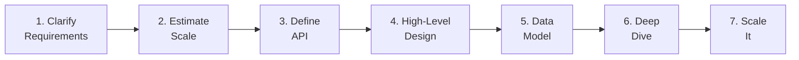

| Step | What to do | URL Shortener example |
|------|-----------|----------------------|
| **1. Clarify** | Ask functional + non-functional requirements | "Do we need analytics? Custom aliases? Expiry?" |
| **2. Estimate** | Calculate QPS, storage, bandwidth, cache | "5M req/day = 58 QPS average" |
| **3. API** | List REST endpoints with contracts | `POST /shorten`, `GET /{code}` |
| **4. High-Level** | Draw client → LB → service → DB → cache | Box diagram with arrows |
| **5. Data Model** | Tables, indexes, relationships | `url_maps(short_code, original_url, user_id)` |
| **6. Deep Dive** | Pick one component, explain internals | "How does Base62 encoding work?" |
| **7. Scale** | Identify bottlenecks and fix them | "Add read replicas when DB is the bottleneck" |

---

### 📐 Core System Design Concepts — Simplified

| Concept | Definition | URL Shortener example |
|---------|-----------|----------------------|
| **Latency** | Time for one request to complete | Redirect must complete in < 50ms |
| **Throughput** | Requests handled per second (QPS) | 58 QPS average, 580 QPS peak |
| **Availability** | % of time the system is up | 99.99% = max 52 min downtime per year |
| **Scalability** | Can it handle 10x more load? | Add more pods behind the load balancer |
| **Consistency** | All users see the same data | A new short URL is immediately resolvable |
| **Durability** | Data survives crashes | PostgreSQL WAL + Redis persistence |
| **Partition Tolerance** | Works despite network splits | Services keep running when network is flaky |

---

### ⚖️ CAP Theorem — Every Senior Must Know This

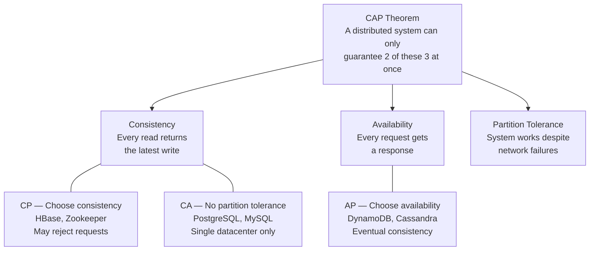

> **For URL Shortener:** We choose **CP** — we cannot return a wrong URL (correctness > availability during a network split). Redis may serve slightly stale data, but PostgreSQL is always the source of truth.

---

### 🧱 Common Building Blocks — Memorise These

| Block | Purpose | When to add it |
|-------|---------|----------------|
| **Load Balancer** | Spread traffic; no single point of failure | Always |
| **CDN** | Serve static assets from edge locations | Images, JS, cacheable responses |
| **Cache (Redis)** | Sub-ms reads for hot data | When DB latency > SLA |
| **Message Queue** | Decouple slow/async work | Analytics, emails, notifications |
| **Database** | Durable ACID storage | All transactional data |
| **API Gateway** | Central auth, rate-limit, routing | Microservices |
| **Sharding** | Split DB across servers | When DB is the bottleneck |

---

### 📏 Numbers Every Engineer Should Memorise

| Operation | Latency | Notes |
|-----------|---------|-------|
| L1 cache read | 0.5 ns | Instant |
| RAM read | 100 ns | 200x slower than L1 |
| Redis GET | 0.5-1 ms | ~1,000,000x slower than L1 |
| SSD read | 0.1 ms | Fast disk |
| PostgreSQL query (indexed) | 1-10 ms | Network + disk |
| Cross-region network round-trip | 150 ms | Very slow |

| Conversion | Value |
|-----------|-------|
| 1 million req/day | = 12 req/sec |
| 1 billion req/day | = 12,000 req/sec |
| 86,400 seconds | = 1 day (memorise this!) |
| 1 KB | = 1,000 bytes |
| 1 GB | = 10^9 bytes |
| 1 TB | = 10^12 bytes |

---

## 📊 Capacity Estimation — Detailed Step-by-Step Calculations

> **Why this matters:** Capacity estimation shows the interviewer you can think at scale. Always show your working. Start from the given numbers and derive everything step by step.

### Step 1 — Traffic (QPS)

```
Given:
  Total requests/day  = 5,000,000
  Read : Write ratio  = 90 : 10

Writes/day = 5,000,000 x 10%  = 500,000 URL creations/day
Reads/day  = 5,000,000 x 90%  = 4,500,000 redirects/day

Seconds in a day = 24 x 60 x 60 = 86,400

Average QPS:
  Write QPS = 500,000 / 86,400 ≈ 6 writes/sec
  Read  QPS = 4,500,000 / 86,400 ≈ 52 reads/sec

Peak QPS (10x burst factor for business-hour spikes):
  Write QPS peak = 6  x 10 = 60/sec
  Read  QPS peak = 52 x 10 = 520/sec

Verdict: Redis handles 100,000+ QPS — our 520 peak is trivial.
         PostgreSQL handles 5,000+ QPS — single node is fine.
```

### Step 2 — Storage

```
One URL record in url_maps:
  short_code    =  10 bytes  ("p5Kx2A")
  original_url  = 200 bytes  (avg URL)
  user_id       =  16 bytes  (UUID)
  metadata      =  74 bytes  (timestamps, flags, counters)
                 ----------
  Total         = 300 bytes per record

Daily storage:
  500,000 x 300 bytes = 150,000,000 bytes = 150 MB/day

Annual storage:
  150 MB x 365 = 54,750 MB ≈ 55 GB/year

5-year projection:
  55 GB x 5 = 275 GB total

Verdict: Single PostgreSQL instance (2 TB SSD) handles 10+ years.
         Add range partitioning by created_at after ~100M rows.
```

### Step 3 — Bandwidth

```
Write (incoming):
  Write QPS x avg request size = 6 x 500 bytes = 3 KB/sec   (negligible)

Read (outgoing 302 redirect):
  Read QPS x avg response size = 52 x 300 bytes = 15.6 KB/sec

Peak read bandwidth:
  520 x 300 bytes = 156 KB/sec = 1.25 Mbps

Verdict: Standard 1 Gbps NIC handles this trivially.
         CDN offloads most bandwidth by caching popular redirects.
```

### Step 4 — Cache Sizing (Redis)

```
Rule: top 20% of URLs receive 80% of traffic (Pareto / 80-20 rule)

Active URLs (accessed in last 30 days):
  500,000 URLs/day x 30 days = 15,000,000 active URLs

Cache the hot 20%:
  15,000,000 x 20% = 3,000,000 entries to cache

Memory per Redis entry:
  key ("url:p5Kx2A")   =  15 bytes
  value (original URL)  = 200 bytes
  Redis overhead        =  85 bytes
                          ----------
  Total                 = 300 bytes per entry

Total Redis RAM:
  3,000,000 x 300 bytes = 900 MB ≈ 1 GB

Verdict: 4 GB Redis instance provides plenty of headroom.
         Expected cache hit ratio > 90% (20% URLs = 80% of reads).
```

### Step 5 — Base62 Namespace Math

```
Alphabet: 0-9 (10) + a-z (26) + A-Z (26) = 62 characters

6-character codes:
  62^6 = 56,800,235,584 ≈ 56 BILLION unique short codes

Time to exhaustion:
  56,000,000,000 / 500,000 URLs/day = 112,000 days = 307 YEARS

Example — encoding counter 125,000,000 to Base62:
  125,000,000 / 62 = 2,016,129  r 2  → '2'
  2,016,129   / 62 = 32,518     r 13 → 'd'
  32,518      / 62 = 524        r 50 → 'O'
  524         / 62 = 8          r 28 → 's'
  8           / 62 = 0          r 8  → '8'
  Result (reversed): "8sOd2"  (5-char code for this counter value)

Verdict: 6-char codes last 307 years. No need to plan for 7-char migration.
```

### Step 6 — Database Rows at Scale

```
Total rows after 5 years:
  500,000/day x 365 x 5 = 912,500,000 ≈ 1 Billion rows

Raw data size:    1B x 300 bytes  = 300 GB
Index overhead:   300 GB x 30%    =  90 GB
                                   ---------
Total DB size:                    = 390 GB

Partition strategy:
  - Partition url_maps by RANGE(created_at) — quarterly partitions
  - Each partition ≈ 45M rows / 30 GB — fast queries
  - Old partitions can be archived to cold storage after 2 years

Read replica strategy:
  1 primary (writes only) + 2 read replicas (redirect reads)
  Our 52 QPS read load fits on a single replica
```

### Estimation Summary Table

| Metric | Calculation | Result | Implication |
|--------|------------|--------|-------------|
| Write QPS avg | 500K / 86,400 | **6/sec** | Single pod handles this |
| Read QPS avg | 4.5M / 86,400 | **52/sec** | Redis trivially handles this |
| Write QPS peak | 6 x 10 | **60/sec** | Still fine for single pod |
| Read QPS peak | 52 x 10 | **520/sec** | Redis @ 100K QPS capacity |
| Storage/day | 500K x 300 bytes | **150 MB** | Single PostgreSQL node |
| Storage 5 yrs | 150MB x 365 x 5 | **275 GB** | Partition after 100M rows |
| Redis cache | 3M x 300 bytes | **~1 GB** | 4 GB instance with headroom |
| Bandwidth peak | 520 x 300 bytes | **1.25 Mbps** | Not a bottleneck |
| Code space | 62^6 | **56 Billion** | Lasts 307 years |


## 🎯 Problem Statement

> Build a URL Shortening Service like **bit.ly / TinyURL** that handles 1M users, 5M requests/day.

### ✅ Requirements

| Type | Feature | Target |
|------|---------|--------|
| **Functional** | Long URL → Short Code (Base62) | 500K URLs/day |
| **Functional** | Short URL → Redirect (302) | < 50ms latency |
| **Functional** | Custom alias, expiry, analytics | — |
| **Non-Functional** | Availability | 99.99% uptime |
| **Non-Functional** | Scalability | Auto-scale on demand |
| **Non-Functional** | Durability | No data loss |

---

## 🏗️ High-Level Architecture

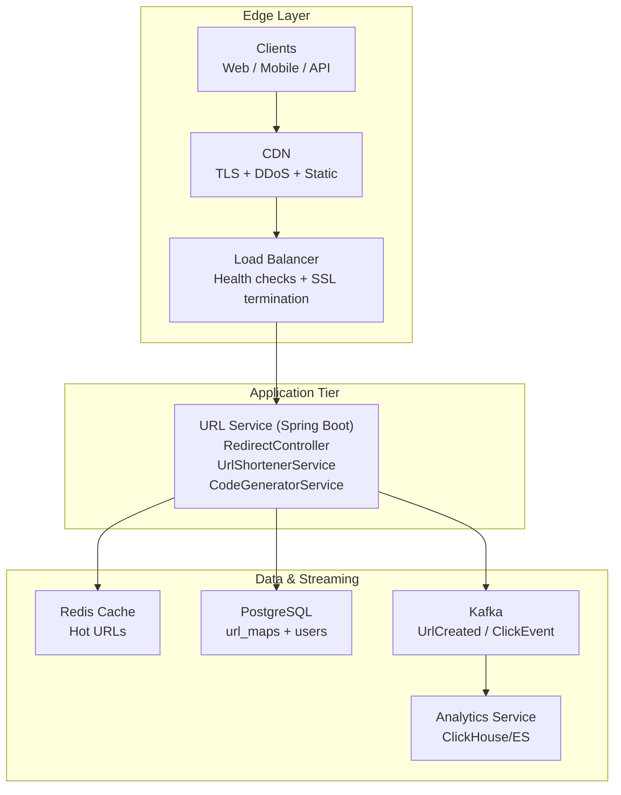

**Step-by-step**
1. Clients hit the CDN for TLS termination and edge-level protection.
2. The load balancer distributes traffic across URL service pods.
3. The URL service reads hot URLs from Redis and writes durable data to PostgreSQL.
4. Click and create events are published to Kafka for asynchronous analytics.
5. Analytics consumers enrich and store aggregates in ClickHouse/ES.

**Architectural reasoning**
- CDN and LB reduce latency and isolate the app tier from volumetric spikes.
- Cache-aside with Redis keeps the redirect path within the latency budget.
- PostgreSQL is the system of record; Kafka decouples analytics from the request path.

**Code-to-Architecture Mapping**
- `RedirectController` → request entry + redirect path in the URL service.
- `UrlShortenerService` → write path, cache-aside, and database persistence.
- `CodeGeneratorService` → short-code generation strategy.
- `redis.opsForValue()` usage → Redis cache layer.
- `urlMapRepository` / `UrlMap` → PostgreSQL persistence and schema.
- `kafkaProducer` / `clickProducer` → Kafka event pipeline.

---

## 🔄 Sequence Diagrams

### 1️⃣ Create Short URL (Write Path)

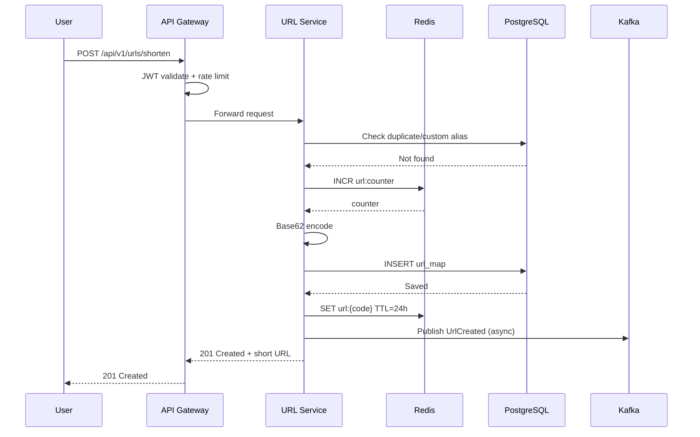

**Step-by-step**
1. The API gateway authenticates and rate-limits the request.
2. The URL service validates input, checks for duplicate or custom aliases in PostgreSQL.
3. Redis `INCR` generates a unique sequence; Base62 encodes it to a short code.
4. The mapping is written to PostgreSQL as the system of record.
5. The short URL is cached in Redis with a TTL for fast reads.
6. A `UrlCreated` event is published asynchronously to Kafka.

**Architectural reasoning**
- API gateway centralizes auth and throttling to protect downstream services.
- Redis counter gives globally unique IDs without cross-pod contention.
- PostgreSQL ensures durability; Redis provides low-latency reads.
- Kafka decouples analytics from the synchronous write path.

---

### 2️⃣ Redirect Flow (Critical Path < 50ms)

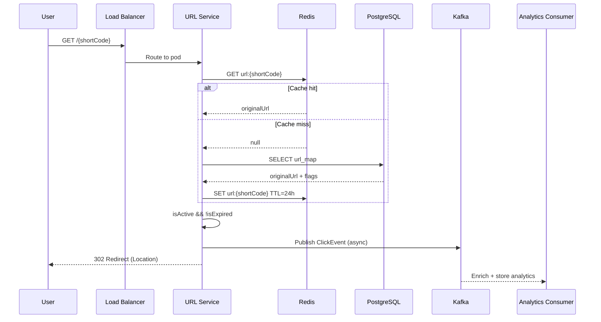

**Step-by-step**
1. The load balancer routes the request to a healthy URL service pod.
2. The service checks Redis for a cached mapping.
3. On a miss, it reads PostgreSQL and repopulates the cache.
4. The service validates `isActive` and expiry checks.
5. A `ClickEvent` is sent to Kafka asynchronously.
6. The client receives a 302 redirect to the original URL.

**Architectural reasoning**
- Cache-first keeps p95 latency low; DB is only used on misses.
- 302 avoids browser caching, ensuring analytics are recorded.
- Async analytics preserves the critical path budget.

---

### 3️⃣ Expired URL Edge Case

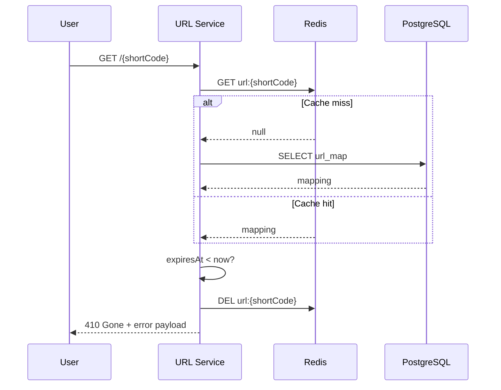

**Step-by-step**
1. The service resolves the short code via Redis or PostgreSQL.
2. It evaluates the expiry timestamp against current time.
3. If expired, the cache entry is evicted to prevent stale hits.
4. The client receives a 410 response indicating the URL is gone.

**Architectural reasoning**
- 410 is semantically correct and helps client-side caching logic.
- Cache eviction keeps hot data clean without waiting for TTL.
- The flow prevents serving expired or revoked links.

---

### ⏱️ Latency Summary

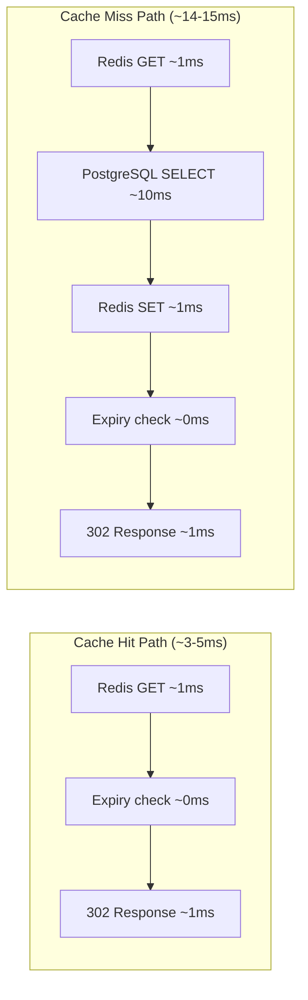

**Step-by-step**
1. On a cache hit, only Redis, an in-memory check, and the redirect response are on the path.
2. On a cache miss, PostgreSQL adds the dominant latency cost.
3. Redis write-back ensures the next request follows the fast path.
4. Kafka publishing is asynchronous and excluded from the latency budget.

**Architectural reasoning**
- The cache hit path is designed to stay well under the 50ms SLA.
- Miss handling is optimized to re-warm the cache immediately.
- Async eventing preserves user latency while enabling analytics.

---

## 🗄️ Data Model

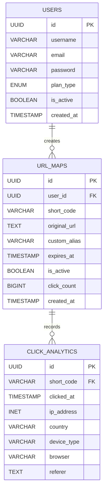

**Step-by-step**
1. A `USER` owns many `URL_MAPS` entries.
2. Each `URL_MAP` accumulates many `CLICK_ANALYTICS` records.
3. `short_code` is the primary lookup key for redirects.
4. Analytics are stored as time-series data for aggregation.

**Architectural reasoning**
- Unique index on `short_code` guarantees deterministic redirects.
- `user_id` indexes enable fast per-user listing and plan enforcement.
- Range partitions on `clicked_at` keep analytics queries fast at scale.

---

## 🧭 Project Structure (Suggested)

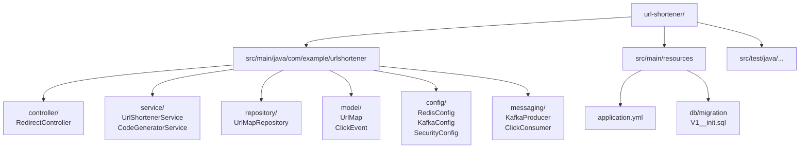

**Step-by-step**
1. Controllers expose HTTP endpoints and orchestrate request flow.
2. Services encapsulate business logic and call repositories/caches.
3. Repositories isolate persistence and query concerns.
4. Messaging packages async producers/consumers for analytics.
5. Config centralizes infrastructure wiring and environment settings.

**Architectural reasoning**
- Clear layering maps directly to the architecture diagram and reduces coupling.
- Explicit boundaries make testing easier (controllers vs services vs repos).
- Messaging and config modules keep cross-cutting concerns out of business logic.

---

## ⚙️ Core Implementation

### Base62 Code Generator
```java
@Service
public class CodeGeneratorService {
    // 0-9 a-z A-Z = 62 chars | 62^6 = 56 Billion combos
    private static final String BASE62 =
            "0123456789abcdefghijklmnopqrstuvwxyzABCDEFGHIJKLMNOPQRSTUVWXYZ";

    // Redis INCR is atomic — no collision across pods
    public String generateShortCode() {
        Long counter = redisTemplate.opsForValue().increment("url:counter");
        return toBase62(counter);
    }

    public String toBase62(long n) {
        StringBuilder sb = new StringBuilder();
        while (n > 0) { sb.append(BASE62.charAt((int)(n % 62))); n /= 62; }
        return sb.reverse().toString();  // "100042" → "p5Kx2A"
    }
}
```

### URL Shortener Service
```java
@Service @Transactional
public class UrlShortenerService {

    public UrlResponse createShortUrl(ShortenRequest req, UUID userId) {
        validateUrl(req.getOriginalUrl());          // SSRF protection
        String code = req.getCustomAlias() != null
                ? validateAlias(req.getCustomAlias())
                : codeGenerator.generateShortCode();

        UrlMap map = urlMapRepository.save(UrlMap.builder()
                .shortCode(code).originalUrl(req.getOriginalUrl())
                .userId(userId).expiresAt(req.getExpiresAt()).build());

        redis.opsForValue().set("url:" + code,      // Cache-aside pattern
                map.getOriginalUrl(), Duration.ofHours(24));
        kafkaProducer.publishCreatedEvent(map);      // Async analytics
        return buildResponse(map);
    }

    public String resolveUrl(String shortCode) {
        // 1. Try Redis cache (~1ms)
        String cached = redis.opsForValue().get("url:" + shortCode);
        if (cached != null) return cached;

        // 2. Fallback to DB (~10ms)
        return urlMapRepository.findByShortCode(shortCode)
                .filter(UrlMap::isAccessible)            // isActive && !isExpired
                .map(u -> {
                    redis.opsForValue().set("url:" + shortCode,
                            u.getOriginalUrl(), Duration.ofHours(24)); // Re-cache
                    return u.getOriginalUrl();
                })
                .orElseThrow(() -> new UrlNotFoundException(shortCode));
    }
}
```

### Redirect Controller
```java
@RestController
public class RedirectController {

    @GetMapping("/{shortCode}")
    public ResponseEntity<Void> redirect(
            @PathVariable String shortCode, HttpServletRequest req) {

        String url = urlService.resolveUrl(shortCode);  // Redis ~1ms

        clickProducer.publish(ClickEvent.builder()       // ASYNC ⚡ Non-blocking
                .shortCode(shortCode)
                .ipAddress(getClientIp(req))
                .userAgent(req.getHeader("User-Agent"))
                .clickedAt(Instant.now()).build());

        return ResponseEntity.status(HttpStatus.FOUND)   // 302 (not 301!)
                .location(URI.create(url)).build();
    }
}
// 302 = temporary → browser never caches → analytics always recorded ✅
```

**Code ↔ Architecture Traceability**
1. `CodeGeneratorService.generateShortCode()` maps to **Create Short URL** flow (Redis `INCR` + Base62).
2. `UrlShortenerService.createShortUrl()` maps to **Write Path** (PostgreSQL insert + Redis cache-aside + Kafka event).
3. `UrlShortenerService.resolveUrl()` maps to **Redirect Flow** (cache hit/miss + DB fallback).
4. `RedirectController.redirect()` maps to **Redirect Flow** and **Kafka ClickEvent** async pipeline.

---

# ☕ Part 2: Core Java Mastery

## Q1. JDK vs JRE vs JVM

> **🔰 Beginner's Concept**
> Think of it like a car ecosystem:
> - **JVM** (Java Virtual Machine) = The engine. Executes compiled `.class` bytecode on any OS.
> - **JRE** (Java Runtime Environment) = JVM + standard class libraries. Everything needed to **run** a Java program.
> - **JDK** (Java Development Kit) = JRE + compiler (`javac`) + debugger + profiler. Everything to **build** Java programs.
>
> 💡 **Rule:** Install JDK on developer machines. Production servers only need JRE (smaller, more secure).

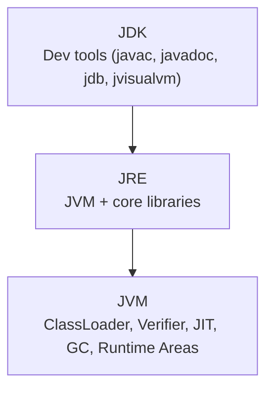

**Step-by-step**
1. The JVM is the runtime engine that executes bytecode.
2. The JRE packages the JVM with core libraries required to run apps.
3. The JDK adds developer tooling needed to build and debug.

**Architectural reasoning**
- Separating runtime (JRE/JVM) from tooling (JDK) keeps production images smaller.
- The JVM boundary allows different language front-ends to target the same runtime.

| Component | Stands For | Purpose | Who Needs It |
|-----------|-----------|---------|--------------|
| **JVM** | Java Virtual Machine | Runs `.class` bytecode | Runtime only |
| **JRE** | Java Runtime Environment | JVM + Standard Libraries | End users |
| **JDK** | Java Development Kit | JRE + Compiler + Tools | Developers |

---

## Q2. OOP Principles

> **🔰 Beginner's Concept**
> OOP organises code around **objects** — entities that combine related data (fields) and behaviour (methods).
> - **Encapsulation** = A medicine capsule hides its contents. Your class hides internal data behind public methods.
> - **Abstraction** = A TV remote — you press buttons without knowing the circuit board inside.
> - **Inheritance** = `Dog extends Animal`. Dog IS-A Animal — reuse and extend parent behaviour.
> - **Polymorphism** = Same method name, different behaviour. `speak()` returns "Woof" for Dog, "Meow" for Cat.
>
> 💡 **Tip:** Prefer **composition over inheritance** for flexibility. Inheritance creates tight coupling.

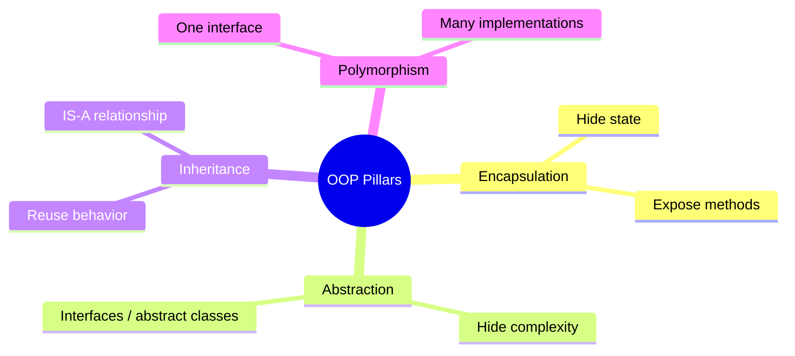

**Step-by-step**
1. Encapsulation protects state behind a public API.
2. Abstraction hides complexity and exposes essential contracts.
3. Inheritance reuses behavior where an IS-A relationship makes sense.
4. Polymorphism lets code depend on interfaces, not concrete classes.

**Architectural reasoning**
- Encapsulation and abstraction reduce coupling between modules.
- Polymorphism enables strategy swaps without changing call sites.
- Inheritance should be used sparingly to avoid fragile hierarchies.

```java
// ── ENCAPSULATION ──────────────────────────────────────────────────
public class BankAccount {
    private double balance;                         // hidden state
    public double getBalance() { return balance; }  // controlled access
    public void deposit(double amt) {
        if (amt > 0) balance += amt;                // business rule enforced
    }
}

// ── ABSTRACTION ────────────────────────────────────────────────────
public abstract class PaymentProcessor {
    public abstract void processPayment(double amount); // WHAT, not HOW
    public void validateAmount(double amount) {
        if (amount <= 0) throw new IllegalArgumentException("Invalid amount");
    }
}

// ── INHERITANCE ────────────────────────────────────────────────────
public class CreditCardProcessor extends PaymentProcessor {
    @Override
    public void processPayment(double amount) {
        validateAmount(amount);
        System.out.println("Processing card payment: " + amount);
    }
}

// ── POLYMORPHISM ───────────────────────────────────────────────────
public class PaymentService {
    public void execute(PaymentProcessor processor, double amount) {
        processor.processPayment(amount);  // Runtime binding
    }
}
// Usage:
// service.execute(new CreditCardProcessor(), 500.0);  → Credit card logic
// service.execute(new UPIProcessor(), 500.0);          → UPI logic
```

---

## Q3. HashMap vs HashTable

> **🔰 Beginner's Concept**
> A **Map** stores key-value pairs — like a phone book. Given any key, get its value in O(1) average time.
> - **Hashing:** The key is converted to an array index: `index = hash(key) % capacity`
> - **Bucket:** The array slot where the key-value pair is stored.
> - **Collision:** Two different keys map to the same bucket → Java stores them as a linked list (or tree after 8 entries).
> - **Load factor (0.75):** When 75% full, the array doubles in size and all entries rehash.
>
> 💡 `HashMap` is NOT thread-safe. Use `ConcurrentHashMap` in multi-threaded code — it uses segment-level locking.

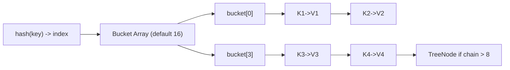

**Step-by-step**
1. A key is hashed and mapped to a bucket index.
2. The bucket stores a single entry or a collision chain.
3. Long chains are treeified to keep lookups efficient.
4. When the load factor is exceeded, the table resizes and rehashes.

**Architectural reasoning**
- O(1) average access depends on good hash distribution and capacity planning.
- Treeification prevents worst-case O(n) behavior.
- Pre-sizing reduces expensive resize operations on hot paths.

| Feature | HashMap | HashTable | ConcurrentHashMap |
|---------|---------|-----------|-------------------|
| Thread Safety | ❌ No | ✅ Yes (full sync) | ✅ Yes (segment lock) |
| Null Key | ✅ 1 allowed | ❌ No | ❌ No |
| Null Value | ✅ Multiple | ❌ No | ❌ No |
| Performance | ✅ Fastest | ❌ Slowest | ✅ Fast under concurrency |
| Iterator | Fail-fast | Enumerator | Weakly consistent |
| Use in | Single-thread | Legacy code | Multi-thread production |

```java
// Production: Always prefer ConcurrentHashMap for shared state
Map<String, Integer> wordCount = new ConcurrentHashMap<>();
wordCount.merge("java", 1, Integer::sum);  // Atomic merge operation
```

---

## Q4. ArrayList vs LinkedList

> **🔰 Beginner's Concept**
> Both are ordered `List` implementations but differ in how they store elements internally:
> - **ArrayList** = Numbered library shelf. Elements stored contiguously in memory. `get(5)` is O(1) — instant jump to position.
> - **LinkedList** = Treasure hunt chain. Each node holds data + pointer to the next. To reach index 5, traverse 5 nodes = O(n).
>
> 💡 **Default choice:** Always use `ArrayList`. Only pick `LinkedList` for O(1) insertions at both ends (use it as a `Deque`).

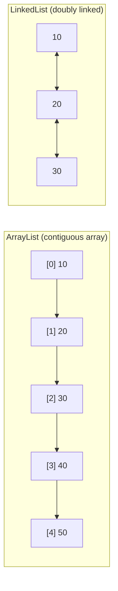

**Step-by-step**
1. ArrayList stores elements contiguously for O(1) index access.
2. LinkedList stores nodes with pointers; access requires traversal.
3. Inserts in the middle shift ArrayList elements but only relink nodes in LinkedList.

**Architectural reasoning**
- ArrayList is ideal for read-heavy workloads and cache-friendly scans.
- LinkedList is useful for frequent insert/delete at known positions.
- Memory overhead and CPU cache locality drive real-world performance.

| Operation | ArrayList | LinkedList |
|-----------|-----------|-----------|
| `get(i)` | **O(1)** ✅ | O(n) ❌ |
| Add at end | O(1) amortized | O(1) |
| Add at middle | O(n) ❌ | **O(1)** ✅ |
| Remove from middle | O(n) ❌ | **O(1)** ✅ |
| Memory usage | Low (array only) | High (data + 2 pointers) |
| Cache performance | ✅ Excellent | ❌ Poor (scattered memory) |

```java
List<Product> catalog = new ArrayList<>();  // Read-heavy: random access O(1)
Deque<Task> queue = new LinkedList<>();     // Write-heavy: addFirst/removeLast O(1)
```

---

## Q5. Immutable Class

> **🔰 Beginner's Concept**
> An **immutable** object's state CANNOT change after it is created — like a printed boarding pass.
> - Java's `String` is immutable: `"hello".toUpperCase()` returns a NEW `"HELLO"` string; `"hello"` stays unchanged.
> - **Thread-safe by default:** Multiple threads can read an immutable object with zero locking required.
> - **Safe as HashMap key:** Since `hashCode()` never changes, immutable objects are reliable map keys.
>
> 💡 Use immutable value objects in your domain: `Money`, `Email`, `PhoneNumber`, `ProductId`, `UserId`.

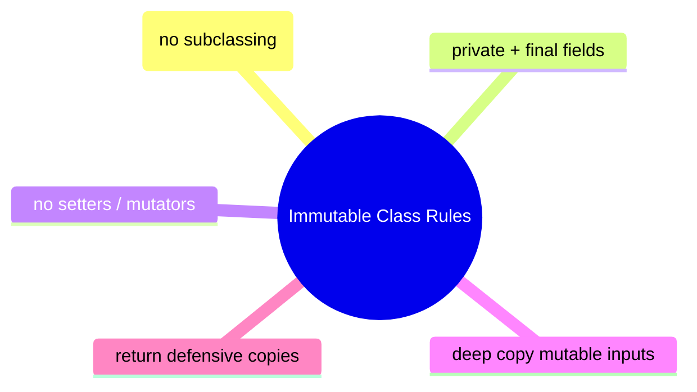

**Step-by-step**
1. Make the class `final` and fields `private final`.
2. Avoid setters or any method that mutates state.
3. Deep-copy mutable inputs and return defensive copies.

**Architectural reasoning**
- Immutability simplifies concurrency and caching.
- Immutable objects are safe as map keys and reduce synchronization needs.
- Defensive copying prevents external references from mutating internal state.

```java
public final class Money {                           // Rule 1: final class
    private final BigDecimal amount;                 // Rule 2: private + final
    private final String currency;
    private final List<String> tags;

    public Money(BigDecimal amount, String currency, List<String> tags) {
        this.amount   = amount;
        this.currency = currency;
        this.tags     = new ArrayList<>(tags);       // Rule 4: defensive copy
    }

    public BigDecimal getAmount()  { return amount; }
    public String getCurrency()    { return currency; }
    public List<String> getTags()  {
        return Collections.unmodifiableList(tags);   // Rule 5: unmodifiable view
    }

    public Money add(Money other) {                  // Returns NEW object
        return new Money(this.amount.add(other.amount), this.currency, this.tags);
    }
}
// Benefits: Thread-safe by default, safe as HashMap key, cacheable
```

---

## Q6. String Pool & Performance

> **🔰 Beginner's Concept**
> Java maintains a **String Constant Pool** in heap memory. String literals with the same content share one object:
> - `String a = "hello"; String b = "hello";` → both point to the **same** pooled object. `a == b` is `true`.
> - `String c = new String("hello");` → forces a **new** heap object. `c == a` is `false`, but `c.equals(a)` is `true`.
> - `s.intern()` manually adds a string to the pool.
>
> 💡 **Performance:** `str = str + i` in a loop creates thousands of temporary objects. Use `StringBuilder` instead.

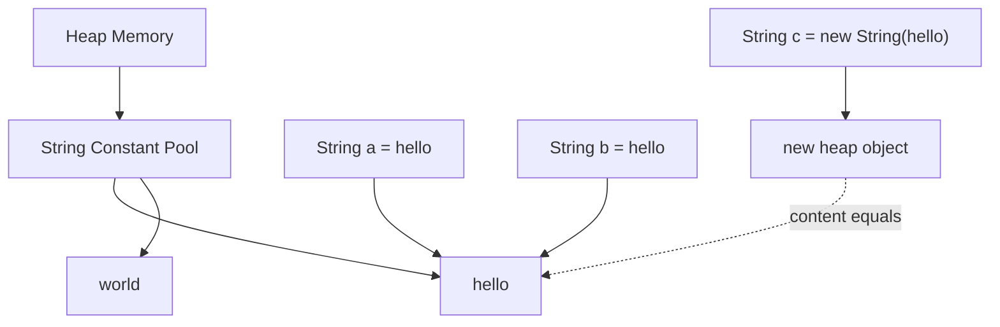

**Step-by-step**
1. String literals are stored in the String Constant Pool.
2. Identical literals reference the same pooled object.
3. `new String("hello")` forces a new heap object.
4. `==` compares references; `equals()` compares content.

**Architectural reasoning**
- Pooling reduces memory and speeds up comparisons for repeated literals.
- Avoid `new String(...)` unless you explicitly need a distinct instance.
- Prefer `equals()` for content comparison in production logic.

```java
// ❌ BAD: Creates 10,000 String objects in heap
String result = "";
for (int i = 0; i < 10_000; i++) result += i;  // New object each iteration!

// ✅ GOOD: StringBuilder — single mutable buffer
StringBuilder sb = new StringBuilder(50_000);  // Pre-size for performance
for (int i = 0; i < 10_000; i++) sb.append(i);
String res = sb.toString();  // One final String object

// ✅ MODERN: String.join or collectors
String csv = IntStream.range(0, 10_000)
        .mapToObj(Integer::toString)
        .collect(Collectors.joining(","));
```

---

## Q7. == vs equals()

> **🔰 Beginner's Concept**
> Two ways to compare things in Java — they answer different questions:
> - `==` → **Reference equality**: are these two variables pointing to the EXACT SAME object in memory?
> - `equals()` → **Value equality**: do these two objects represent the same logical value?
> - For **primitives** (`int`, `double`, `boolean`), `==` always compares values directly — there are no objects.
> - ⚠️ The `Integer` cache covers -128 to 127: `Integer a=127; a==b` is `true`, but `Integer a=200; a==b` is `false`!
>
> 💡 **Rule:** Always use `.equals()` for Strings and Objects in business logic. Never rely on `==` for Strings.

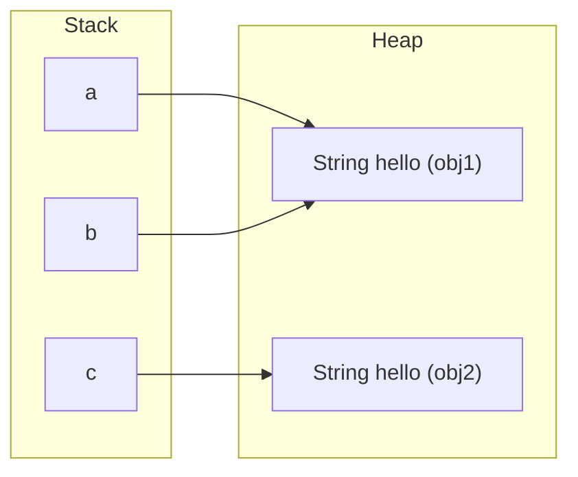

**Step-by-step**
1. References (`a`, `b`, `c`) live on the stack and point to heap objects.
2. `a` and `b` reference the same heap object → `a == b` is true.
3. `c` references a different object with the same content.
4. `equals()` compares content, not references.

**Architectural reasoning**
- Reference equality (`==`) is fast but only valid when identity matters.
- Use `equals()` for business logic to avoid subtle correctness bugs.
- String interning and caches can affect reference equality; don’t rely on it.

```java
// Primitives: == always compares values
int x = 100, y = 100;
System.out.println(x == y);           // true ✅

        // Integer cache: -128 to 127 are cached!
        Integer a = 127, b = 127;
System.out.println(a == b);           // true (cached!)
        Integer c = 128, d = 128;
System.out.println(c == d);           // false ❌ (not cached, new objects)
System.out.println(c.equals(d));      // true ✅

// Always override equals() AND hashCode() together!
public class User {
    private final String email;

    @Override public boolean equals(Object o) {
        if (this == o) return true;
        if (!(o instanceof User)) return false;
        return Objects.equals(email, ((User) o).email);
    }

    @Override public int hashCode() {
        return Objects.hash(email);    // Consistent with equals!
    }
}
// Rule: if a.equals(b) then a.hashCode() == b.hashCode() MUST be true
```

---

## Q8. Method Overloading vs Overriding

> **🔰 Beginner's Concept**
> Both allow the same method name to serve different purposes:
> - **Overloading** = Same class, same name, **different parameters**. Resolved at **compile time** by the compiler.
>   Example: `log(String msg)` and `log(String msg, Level level)` — compiler picks the right one at compile time.
> - **Overriding** = Child class **replaces** the parent's method with its own version. Resolved at **runtime** by actual object type.
>   Example: `Animal a = new Dog(); a.speak();` → calls Dog's `speak()` at runtime even though variable is typed as `Animal`.
>
> 💡 Always add `@Override` when overriding — the compiler will catch any signature typos immediately.

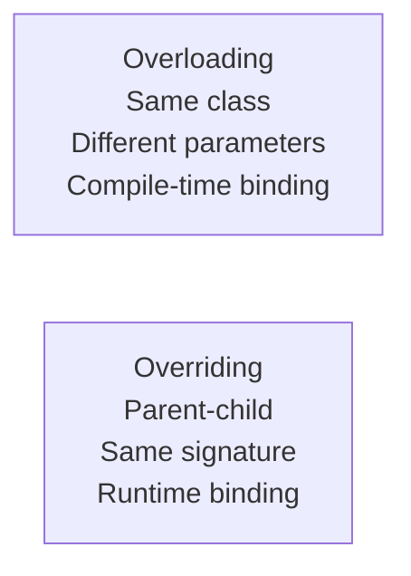

**Step-by-step**
1. Overloading chooses a method based on parameter types at compile time.
2. Overriding chooses a method based on runtime object type.

**Architectural reasoning**
- Overloading improves API ergonomics without changing behavior.
- Overriding enables polymorphic behavior and extensibility.
- Misuse can cause surprising dispatch; be explicit when designing APIs.

| Feature | Overloading | Overriding |
|---------|-------------|------------|
| Binding | Compile-time | Runtime |
| Class | Same class | Parent → Child |
| Parameters | Must differ | Must be identical |
| Return type | Can differ | Must be same or covariant |
| `@Override` | Not used | Must use (best practice) |
| Access modifier | Any | Cannot reduce visibility |
| `static` methods | Can overload | Cannot override (hidden) |

```java
// OVERLOADING — compile-time decision
public class Logger {
    public void log(String msg)            { /* log string   */ }
    public void log(String msg, Level lvl) { /* log with level*/ }
    public void log(Exception ex)          { /* log exception */ }
    // Called based on argument types at compile time
}

// OVERRIDING — runtime decision
public class Animal  { public String speak() { return "...";    } }
public class Dog extends Animal {
    @Override public String speak() { return "Woof!"; }
}
public class Cat extends Animal {
    @Override public String speak() { return "Meow!"; }
}
// Animal a = new Dog();
// a.speak() → "Woof!" decided at RUNTIME based on actual type (Dog)
```

---

## Q9. Multithreading

> **🔰 Beginner's Concept**
> A **thread** is an independent sequence of instructions inside a process. Multiple threads share the same heap memory.
> - **Single-threaded:** Tasks run one after another. Task A (100ms) + Task B (100ms) = 200ms total.
> - **Multi-threaded:** Tasks run concurrently. Task A and B both run in parallel ≈ 100ms total.
> - **Risks:** Race conditions (two threads corrupt shared data), deadlocks (threads wait for each other forever).
> - **Thread states:** `NEW → RUNNABLE → RUNNING → BLOCKED/WAITING/TIMED_WAITING → TERMINATED`
>
> 💡 **Never** use `new Thread()` in production. Use `ExecutorService` to manage a reusable thread pool.

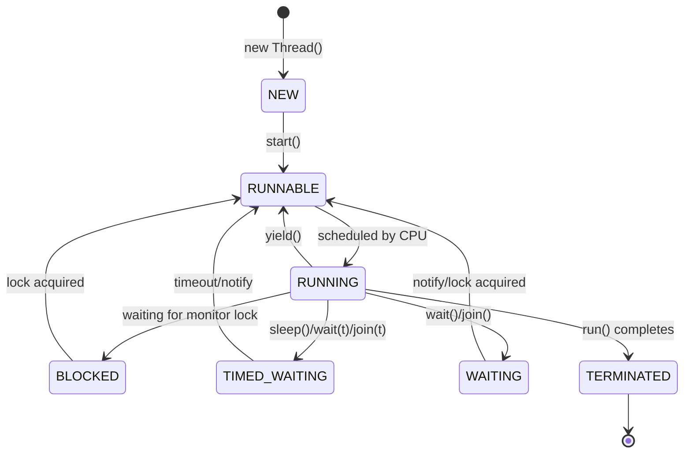

**Step-by-step**
1. `new Thread()` creates the `NEW` state.
2. `start()` transitions to `RUNNABLE` (eligible to run).
3. Scheduler assigns CPU → `RUNNING`.
4. Blocking calls or monitor contention move to `WAITING`, `TIMED_WAITING`, or `BLOCKED`.
5. Notifications or lock acquisition return to `RUNNABLE`.
6. When `run()` finishes, the thread is `TERMINATED`.

**Architectural reasoning**
- State transitions help explain deadlocks, starvation, and latency spikes.
- Understanding `BLOCKED` vs `WAITING` guides which synchronization primitive to change.
- Production tuning focuses on reducing time in `BLOCKED/TIMED_WAITING`.

```java
// ✅ Preferred: Implement Runnable (allows extending other classes)
public class FileProcessor implements Runnable {
    private final String filePath;
    public FileProcessor(String filePath) { this.filePath = filePath; }

    @Override
    public void run() {
        System.out.println("Processing: " + filePath
                + " on thread: " + Thread.currentThread().getName());
    }
}

// Usage with ExecutorService (NEVER use raw Thread in production)
ExecutorService executor = Executors.newFixedThreadPool(4);
executor.submit(new FileProcessor("/data/file1.csv"));
        executor.submit(new FileProcessor("/data/file2.csv"));
        executor.shutdown();
```

---

## Q10. Runnable vs Callable

> **🔰 Beginner's Concept**
> Two functional interfaces for defining tasks to run on a thread:
> - **Runnable** = `void run()` — fire and forget. No return value, cannot throw checked exceptions.
> - **Callable<V>** = `V call() throws Exception` — returns a result of type V, can propagate checked exceptions.
> - **Future<V>** = the "receipt" for a Callable's result. `future.get()` blocks until the result is ready (or timeout).
>
> 💡 Modern Java: use `CompletableFuture.supplyAsync(() -> ...)` for composable, non-blocking async pipelines.

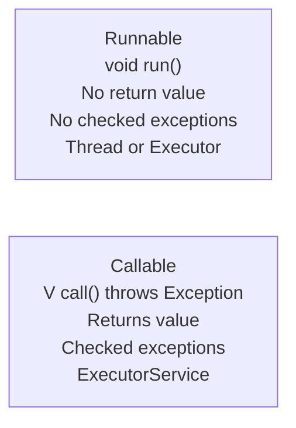

**Step-by-step**
1. Use `Runnable` for fire-and-forget work without a return value.
2. Use `Callable` when you need a result or checked exceptions.

**Architectural reasoning**
- Callable enables composition via `Future` and `CompletableFuture`.
- Favor executors for thread management in production.

```java
// Runnable — fire and forget
Runnable emailTask = () -> emailService.send("user@example.com");

// Callable — need result
Callable<UserProfile> profileTask = () ->
        userRepository.findById("user-123")
                .orElseThrow(() -> new UserNotFoundException("user-123"));

ExecutorService pool = Executors.newFixedThreadPool(5);

// Submit Callable → get Future
Future<UserProfile>    future  = pool.submit(profileTask);
CompletableFuture<?>   cFuture = CompletableFuture.supplyAsync(() ->
        userRepository.findById("user-123"));   // Modern approach

try {
UserProfile profile = future.get(5, TimeUnit.SECONDS);  // Blocking, timeout
} catch (TimeoutException e) {
        future.cancel(true);  // Cancel if too slow
}
```

---

## Q11. ExecutorService (Production Config)

> **🔰 Beginner's Concept**
> Creating a `new Thread()` per request is like hiring a new employee for every customer — expensive. A **thread pool** reuses threads:
> - **Core threads:** Always alive and ready. Pick up tasks immediately.
> - **Work queue:** Holds tasks when all core threads are busy.
> - **Max threads:** Extra threads created if queue overflows. Shut down after idle timeout.
> - **Rejection policy:** What to do when queue AND max threads are full (throw, log, or caller runs).
>
> 💡 **Sizing rule:** I/O-bound tasks → `pool size = CPU cores × 2`. CPU-bound tasks → `pool size = CPU cores + 1`.

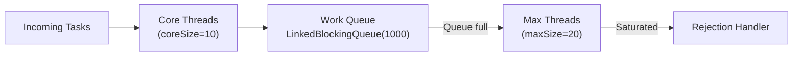

**Step-by-step**
1. Tasks are accepted and executed by core threads first.
2. When cores are busy, tasks are buffered in the work queue.
3. If the queue fills, the pool grows up to `maxSize`.
4. Once both queue and max threads are saturated, the rejection policy applies.

**Architectural reasoning**
- Queue size controls latency vs throughput trade-offs under load.
- Max threads absorb bursts but can increase context switching.
- Rejection policy is a safety valve to prevent cascading failures.

```java
@Configuration
public class ExecutorConfig {

    @Bean("orderProcessor")
    public ExecutorService orderProcessorPool() {
        return new ThreadPoolExecutor(
                10,                              // corePoolSize
                20,                              // maximumPoolSize
                60L, TimeUnit.SECONDS,           // keepAliveTime for extra threads
                new LinkedBlockingQueue<>(1_000),// bounded queue — prevents OOM!
                new ThreadFactoryBuilder()
                        .setNameFormat("order-processor-%d")
                        .setDaemon(false).build(),
                new ThreadPoolExecutor.CallerRunsPolicy() // Backpressure: caller runs
        );
    }

    @Bean("asyncNotifier")
    public ExecutorService asyncNotifierPool() {
        return Executors.newFixedThreadPool(
                Runtime.getRuntime().availableProcessors() * 2,
                r -> { Thread t = new Thread(r, "notifier"); t.setDaemon(true); return t; }
        );
    }
}
```

---

## Q12. Checked vs Unchecked Exceptions

> **🔰 Beginner's Concept**
> Java exceptions split into two categories based on whether the **compiler forces you to handle them**:
> - **Checked exceptions** (extend `Exception`): Compiler says handle or declare with `throws`. For recoverable situations: file not found, DB unreachable.
> - **Unchecked exceptions** (extend `RuntimeException`): Compiler is silent. For programming bugs: null pointer, array index out of bounds.
> - **Errors** (extend `Error`): JVM-level failures like `OutOfMemoryError`. Do NOT catch these — they're unrecoverable.
>
> 💡 In production Spring Boot: use **custom unchecked exceptions** + `@RestControllerAdvice` global handler for clean code.

```mermaid
mindmap
  root((Throwable))
    Error
      OutOfMemoryError
      StackOverflowError
      VirtualMachineError
    Exception
      Checked Exception
        IOException
        SQLException
        FileNotFoundException
      RuntimeException
        NullPointerException
        IllegalArgumentException
        IllegalStateException
        IndexOutOfBoundsException
        ClassCastException
```

**Step-by-step**
1. All throwable types inherit from `Throwable`.
2. `Error` types signal JVM-level issues; application code typically should not catch them.
3. `Exception` types split into checked (must handle) and runtime (optional).
4. Use checked exceptions for recoverable I/O/DB issues; runtime for programming errors.

**Architectural reasoning**
- Clear exception taxonomy improves error handling consistency in large systems.
- Checked exceptions force callers to make explicit recovery decisions.
- Runtime exceptions simplify APIs but require disciplined validation and testing.

```java
// Checked — compiler forces you to handle
public void readFile(String path) throws IOException {
    try (FileReader fr = new FileReader(path)) { /* process */ }
    // throws IOException if file not found
}

// ✅ Senior Pattern: Custom unchecked for business exceptions
public class OrderNotFoundException extends RuntimeException {
    private final String orderId;
    public OrderNotFoundException(String orderId) {
        super("Order not found: " + orderId);
        this.orderId = orderId;
    }
}

// Clean service code — no try/catch pollution
public Order getOrder(String id) {
    return orderRepository.findById(id)
            .orElseThrow(() -> new OrderNotFoundException(id));
}

// Global handler catches it
@RestControllerAdvice
public class GlobalExceptionHandler {
    @ExceptionHandler(OrderNotFoundException.class)
    public ResponseEntity<ErrorResponse> handleNotFound(OrderNotFoundException ex) {
        return ResponseEntity.status(404)
                .body(new ErrorResponse(404, ex.getMessage()));
    }
}
```

---

## Q13. Serialization / Deserialization

> **🔰 Beginner's Concept**
> **Serialization** = converting a Java object into bytes so it can be stored (file/DB/cache) or sent over a network.
> **Deserialization** = reconstructing the Java object from those bytes.
> - Mark the class `implements Serializable` and define `serialVersionUID` for version control.
> - Fields marked `transient` are excluded — use this for passwords, DB connections, derived fields.
> - `ObjectOutputStream.writeObject(obj)` serialises; `ObjectInputStream.readObject()` deserialises.
>
> 💡 Modern apps prefer **JSON serialization via Jackson** — language-agnostic, human-readable, easier to version.

```mermaid
flowchart LR
    Obj["UserSession object\nsessionId, userId, password (transient)"]
    Bytes["Byte stream"]
    Obj -->|serialize| Bytes
    Bytes -->|deserialize| Obj2["UserSession object"]
    Bytes --> File["File (session store)"]
    Bytes --> Net["Network (RMI)"]
    Bytes --> Cache["Cache (Redis)"]
```

**Step-by-step**
1. A Java object is serialized into a byte stream.
2. `transient` fields are excluded from serialization.
3. The byte stream can be stored, transmitted, or cached.
4. Deserialization reconstructs the object from bytes.

**Architectural reasoning**
- Serialization enables persistence and transport across process boundaries.
- `transient` protects sensitive data and prevents accidental leakage.
- Prefer JSON for external APIs; Java serialization is best for internal use cases.

```java
public class UserSession implements Serializable {
    private static final long serialVersionUID = 1L;  // Version control!
    private String sessionId;
    private String userId;
    private transient String password;  // transient = NOT serialized ✅
    private LocalDateTime createdAt;
}

// ✅ Modern Production: JSON with Jackson
@Component
public class JsonSerializer {
    private final ObjectMapper mapper = new ObjectMapper()
            .registerModule(new JavaTimeModule())
            .disable(SerializationFeature.WRITE_DATES_AS_TIMESTAMPS);

    public String toJson(Object obj) throws JsonProcessingException {
        return mapper.writeValueAsString(obj);
    }

    public <T> T fromJson(String json, Class<T> clazz) throws JsonProcessingException {
        return mapper.readValue(json, clazz);
    }
}
// JSON is language-agnostic, human-readable, versioning-friendly
```

---

## Q14. Garbage Collection

> **🔰 Beginner's Concept**
> Java manages memory automatically. The **Garbage Collector (GC)** finds objects no longer referenced by anything and frees their memory.
> - You never call `free()` in Java — GC does it, but you must avoid **memory leaks** (unintentionally holding references).
> - **Young Generation (Eden + Survivors):** Where new objects are born. Most die here. **Minor GC** is fast.
> - **Old Generation:** Long-lived objects promoted here. **Major GC** is slow and may cause pause spikes.
> - **GC pause:** The app briefly pauses while GC runs. Modern collectors (ZGC) reduce this to sub-milliseconds.
>
> 💡 **Default (Java 9+):** G1GC. Use **ZGC** for latency-critical services. Always set `-Xms = -Xmx` in production.

```mermaid
flowchart TB
    Heap["Heap Memory"]
    Young["Young Generation"]
    Eden["Eden"]
    S0["Survivor S0"]
    S1["Survivor S1"]
    Old["Old Generation"]
    Collected["Collected"]

    Heap --> Young
    Heap --> Old
    Young --> Eden
    Young --> S0
    Young --> S1
    Eden -->|Minor GC| S0
    S0 -->|age++| S1
    S1 -->|age++| Old
    Old -->|Major GC| Collected
```

**Step-by-step**
1. New objects are allocated in Eden.
2. Minor GC moves surviving objects between S0 and S1.
3. Long-lived objects are promoted to Old Generation.
4. Major GC collects the Old Generation.

**Architectural reasoning**
- Most objects die young, so a fast young-gen collector improves throughput.
- Large heaps favor collectors that keep pause times predictable.
- Promotion rate and survivor sizing are key tuning levers for latency.

```mermaid
flowchart LR
    Serial["SerialGC\nHigh pause\nSingle CPU, small heaps"]
    Parallel["ParallelGC\nMedium pause\nThroughput-optimized"]
    G1["G1GC (default)\nLow (~200ms)\nLarge heaps (4GB+)"]
    Z["ZGC\nSub-ms\nTB heaps, latency-critical"]
    Shen["ShenandoahGC\nSub-ms\nLow-pause concurrent"]
```

**Step-by-step**
1. Start with G1GC for balanced latency/throughput.
2. Use ParallelGC for throughput-heavy batch systems.
3. Choose ZGC/Shenandoah for ultra-low pause SLAs.

**Architectural reasoning**
- Collector choice is a latency vs throughput trade-off.
- Low-pause collectors reduce tail latency but increase CPU cost.
- Always validate with load tests before production rollout.

```java
// JVM flags for production
// -Xms2g -Xmx4g                 → heap size
// -XX:+UseG1GC                  → G1 collector (Java 9+ default)
// -XX:MaxGCPauseMillis=200       → target pause time
// -XX:+PrintGCDetails           → GC logging

// Avoid memory leaks:
// ❌ Static collections that grow forever
// ❌ Forgetting to close resources (use try-with-resources!)
// ✅ WeakReference for caches
private final Map<String, WeakReference<Data>> cache = new WeakHashMap<>();
```

---

## Q15. Java Streams

> **🔰 Beginner's Concept**
> **Streams** let you process collections of data in a declarative pipeline — like an assembly line in a factory:
> - **Source:** raw data — `List`, array, file lines, range (`IntStream.range(0, 100)`)
> - **Intermediate ops (lazy):** transform data — `filter()`, `map()`, `flatMap()`, `sorted()`, `distinct()`, `limit()`
> - **Terminal op (eager):** triggers the whole pipeline — `collect()`, `count()`, `reduce()`, `forEach()`, `findFirst()`
> - **Lazy evaluation:** nothing runs until a terminal operation is called. This enables short-circuit optimisations.
>
> 💡 Do NOT reuse a stream — after a terminal op, the stream is exhausted. Create a new stream for each pipeline.

```mermaid
flowchart LR
    Source["Source\nCollection/Array/Range/Files/Kafka"]
    Inter["Intermediate Ops\nfilter/map/flatMap/sorted/distinct/limit/peek"]
    Term["Terminal Ops\ncollect/reduce/count/findFirst/forEach"]
    Source --> Inter --> Term
```

**Step-by-step**
1. A source creates the stream.
2. Intermediate operations transform the stream lazily.
3. A terminal operation triggers execution and produces a result.

**Architectural reasoning**
- Lazy evaluation avoids unnecessary work and enables short-circuiting.
- Stream pipelines are expressive but should be profiled on hot paths.

```java
@Service
public class OrderAnalyticsService {

    public OrderSummary analyze(List<Order> orders, String customerId) {
        return orders.stream()
                .filter(o -> o.getCustomerId().equals(customerId))   // filter
                .filter(o -> o.getStatus() == OrderStatus.COMPLETED) // filter
                .collect(Collectors.teeing(
                        Collectors.summingDouble(o -> o.getAmount().doubleValue()), // total
                        Collectors.counting(),                                       // count
                        (total, count) -> new OrderSummary(total, count)
                ));
    }

    public Map<String, DoubleSummaryStatistics> statsByCategory(List<Order> orders) {
        return orders.stream()
                .collect(Collectors.groupingBy(
                        Order::getCategory,
                        Collectors.summarizingDouble(o -> o.getAmount().doubleValue())
                ));
        // Returns: { "ELECTRONICS" → {count=50, sum=250000, avg=5000, min=100, max=50000} }
    }
}
```

---

## Q16. Optional Class

> **🔰 Beginner's Concept**
> `Optional<T>` is a container that **may or may not** contain a non-null value. It makes "this might be null" explicit in the type system.
> - Without Optional: easy to forget null checks → `NullPointerException` at runtime.
> - With Optional: null safety is forced into the API contract — callers must handle the empty case.
> - Key methods: `isPresent()`, `get()`, `orElse(default)`, `orElseThrow()`, `map()`, `filter()`, `ifPresent()`
>
> 💡 Use Optional as **return types only** (not fields or parameters). Never call `optional.get()` without checking first.

```mermaid
flowchart LR
    subgraph Traditional
        T1["getUser(id)"] --> T2["if user != null"] --> T3["if address != null"] --> T4["getCity()"]
    end
    subgraph Optional
        O1["getUser(id) -> Optional"] --> O2["map(User::getAddress)"] --> O3["map(Address::getCity)"] --> O4["orElse('Unknown')"]
    end
```

**Step-by-step**
1. The traditional approach nests null checks.
2. Optional chains transformations with `map`.
3. `orElse` provides a safe default.

**Architectural reasoning**
- Optional makes null handling explicit and composable.
- Chains are easier to read and less error-prone.
- Avoid Optional for fields; use it for return types and APIs.

```java
// Repository returns Optional
public Optional<User> findByEmail(String email) {
    return userRepository.findByEmail(email);
}

// Service layer chaining
public String getUserCity(String userId) {
    return userRepository.findById(userId)
        .map(User::getAddress)             // User → Address (null-safe)
        .filter(a -> a.isVerified())       // only verified addresses
        .map(Address::getCity)             // Address → city string
        .map(String::toUpperCase)          // transform
        .orElse("UNKNOWN");                // safe default
}

// ❌ Anti-patterns to avoid
optional.get();                     // May throw NoSuchElementException
optional.isPresent() ? opt.get() : default;  // Verbose — use orElse instead
Optional<Optional<User>> nested;    // Never nest Optionals!
```

---

## Q17. Java Memory Model (JMM)

> **🔰 Beginner's Concept**
> Modern CPUs have multiple cores, each with their own **cache**. Without rules, Thread A's write might not be visible to Thread B.
> The **Java Memory Model (JMM)** defines when writes by one thread are guaranteed to be visible to other threads.
> - Without JMM guarantees: Thread 1 sets `flag = true` in its CPU cache. Thread 2 still reads `flag = false` from its cache.
> - **Happens-before:** If A happens-before B, all effects of A are visible to B.
> - `volatile`, `synchronized`, and `final` fields all establish happens-before relationships.
>
> 💡 The JMM is the spec. Use `volatile` for visibility, `synchronized` for atomicity, `AtomicXxx` for lock-free ops.

```mermaid
flowchart TB
  Main["Main Memory\nflag=false"]
  T1["Thread 1\nCPU Cache\nflag=true (updated locally)"]
  T2["Thread 2\nCPU Cache\nflag=false (stale)"]
  Main --> T1
  Main --> T2
  T1 -.no visibility.-> T2
```

**Step-by-step**
1. Both threads read `flag=false` from main memory.
2. Thread 1 updates its local cache to `flag=true`.
3. Thread 2 keeps reading the stale cached value.

**Architectural reasoning**
- Without memory barriers, CPU caches can serve stale values.
- `volatile` forces reads/writes through main memory.
- `synchronized` establishes a happens-before relationship for visibility.

```java
// Problem — Thread 2 may never see flag = true
private boolean flag = false;  // No visibility guarantee

// Solution 1: volatile (visibility only, no atomicity)
private volatile boolean flag = false;  // Always reads from main memory

// Solution 2: synchronized (visibility + atomicity)
private boolean flag = false;
public synchronized void setFlag()   { flag = true; }
public synchronized boolean getFlag(){ return flag; }

// Solution 3: AtomicBoolean (lock-free, CAS operations)
private final AtomicBoolean flag = new AtomicBoolean(false);
flag.set(true);
flag.compareAndSet(false, true);  // Atomic compare-and-swap
```

---

## Q18. volatile Keyword

> **🔰 Beginner's Concept**
> `volatile` ensures a variable is always **read from and written directly to main memory**, bypassing CPU caches.
> - Without `volatile`: Thread 1 updates `flag` in its CPU-1 cache. Thread 2 reads stale `false` from its CPU-2 cache. Bug!
> - With `volatile`: Every read/write goes through main memory. All threads always see the latest value.
> - **Limitation:** Only guarantees **visibility**, NOT atomicity. `count++` is 3 operations (read, increment, write) — NOT atomic.
>
> 💡 Use `volatile` for simple boolean flags (one writer, many readers). For counters, use `AtomicInteger`.

```mermaid
flowchart LR
  subgraph NoVol["Without volatile (CPU caches)"]
    NV1["CPU1 writes flag=true (cache)"] --> NV2["CPU2 reads flag=false (cache)"]
    NV2 --> NV3["BUG: stale read"]
  end
  subgraph Vol["With volatile (main memory)"]
    V1["CPU1 writes flag=true (main memory)"] --> V2["CPU2 reads flag=true (main memory)"]
    V2 --> V3["FIXED: latest value"]
  end
```

**Step-by-step**
1. Without `volatile`, each CPU can read from its local cache.
2. Updates from one thread may not be visible to others immediately.
3. `volatile` forces reads/writes through main memory, guaranteeing visibility.

**Architectural reasoning**
- Use `volatile` for simple state flags with single-writer, multi-reader patterns.
- Do not use `volatile` for compound operations like `i++` (not atomic).
- For atomic increments, use `AtomicInteger` or synchronize.

```java
public class ConfigManager {
    private volatile boolean configLoaded = false;  // Visibility guaranteed
    private volatile Map<String, String> config;    // Visible across threads

    public void loadConfig() {
        config = loadFromDatabase();                // Write to main memory
        configLoaded = true;                        // Write to main memory
    }

    public String getProperty(String key) {
        if (!configLoaded) return null;             // Always reads from main memory
        return config.get(key);
    }
}
```

```mermaid
flowchart TB
  V["volatile\nVisibility ✅\nAtomicity ❌"]
  S["synchronized\nVisibility ✅\nAtomicity ✅"]
  A["AtomicInteger\nVisibility ✅\nAtomicity ✅"]
```

**Step-by-step**
1. `volatile` provides visibility only.
2. `synchronized` provides visibility and atomicity.
3. `AtomicInteger` provides visibility and atomicity via CAS.

**Architectural reasoning**
- Choose the lightest primitive that satisfies correctness.
- Prefer atomics for counters and low-contention updates.
- Use `synchronized` when you need a critical section with multiple operations.

---

## Q19. Synchronization

> **🔰 Beginner's Concept**
> **Race condition:** Two threads read a shared variable simultaneously, both compute, both write back — one update is lost.
> - Example: `count = 0`. Thread 1 reads 0, Thread 2 reads 0. Both increment. Both write 1. Expected: 2. Got: 1. Bug!
> - `synchronized` puts a **monitor lock** on the object. Only one thread can execute the locked block at a time.
> - `ReentrantLock` gives more control: try-lock with timeout, fairness policy, multiple conditions.
>
> 💡 For simple counters and accumulators, use `AtomicInteger` or `LongAdder` — lock-free and much faster under contention.

```mermaid
flowchart LR
  subgraph NoSync["Without synchronization"]
    N1["Thread 1 read 0"] --> N2["Thread 1 write 1"]
    N3["Thread 2 read 0"] --> N4["Thread 2 write 1"]
    N2 -.lost update.-> N4
  end
  subgraph Sync["With synchronized"]
    S1["Thread 1 acquires lock"] --> S2["read/update/write -> count=1"] --> S3["release lock"]
    S4["Thread 2 acquires lock"] --> S5["read/update/write -> count=2"]
  end
```

**Step-by-step**
1. Without synchronization, both threads read the same value.
2. Each thread writes back its computed result, causing a lost update.
3. With `synchronized`, only one thread updates at a time.
4. The second thread sees the updated value and produces the correct count.

**Architectural reasoning**
- Race conditions are correctness bugs that surface under concurrency.
- Locks enforce mutual exclusion at the cost of throughput.
- For counters, prefer `AtomicInteger` or `LongAdder` to reduce lock contention.

```java
// intrinsic lock (synchronized)
public class TicketCounter {
    private int available = 100;

    public synchronized boolean bookTicket() {  // Object lock
        if (available > 0) { available--; return true; }
        return false;
    }
}

// ReentrantLock (more control)
public class AdvancedCounter {
    private final ReentrantLock lock = new ReentrantLock(true); // fair lock

    public boolean bookTicket() {
        if (lock.tryLock(100, TimeUnit.MILLISECONDS)) {  // Try with timeout
            try {
                if (available > 0) { available--; return true; }
                return false;
            } finally {
                lock.unlock();  // ALWAYS unlock in finally!
            }
        }
        return false;  // Could not acquire lock in time
    }
}

// ReadWriteLock — allows concurrent reads, exclusive writes
public class ProductCache {
    private final ReadWriteLock rwLock = new ReentrantReadWriteLock();

    public Product get(String id) {
        rwLock.readLock().lock();          // Multiple threads can read
        try { return cache.get(id); }
        finally { rwLock.readLock().unlock(); }
    }

    public void put(String id, Product p) {
        rwLock.writeLock().lock();         // Exclusive write access
        try { cache.put(id, p); }
        finally { rwLock.writeLock().unlock(); }
    }
}
```

---

## Q20. Concurrent Collections

> **🔰 Beginner's Concept**
> Standard collections (`HashMap`, `ArrayList`) are NOT thread-safe — concurrent writes corrupt their internal state.
> `java.util.concurrent` provides drop-in thread-safe replacements:
> - **`ConcurrentHashMap`** = thread-safe map. Uses segment/bucket locks — far faster than old `HashTable`.
> - **`CopyOnWriteArrayList`** = writes create a fresh array copy. Perfect for lists read often, written rarely.
> - **`LinkedBlockingQueue`** = thread-safe FIFO queue with `put()`/`take()` blocking — ideal for producer-consumer.
> - **`AtomicInteger` / `LongAdder`** = lock-free atomic counters.
>
> 💡 Choose based on access pattern: map → `ConcurrentHashMap`, queue → `BlockingQueue`, counter → `AtomicLong`.

```mermaid
flowchart LR
  SharedMap["Shared map"] --> CHM["ConcurrentHashMap"]
  WriteRare["Write-rarely list"] --> COW["CopyOnWriteArrayList"]
  Producer["Producer-Consumer"] --> LBQ["LinkedBlockingQueue"]
  Priority["Priority tasks"] --> PBQ["PriorityBlockingQueue"]
  PubSub["Pub/Sub in-process"] --> LTQ["LinkedTransferQueue"]
  SortedMap["Sorted shared map"] --> CSLM["ConcurrentSkipListMap"]
  Counter["Atomic counter"] --> LA["AtomicLong / LongAdder"]
```

**Step-by-step**
1. Identify the concurrency pattern (map, list, queue, counter).
2. Choose a collection that matches contention and access patterns.
3. Prefer specialized concurrent structures over manual locking.

**Architectural reasoning**
- Correctness and throughput depend on data structure selection.
- Copy-on-write is ideal for read-heavy workloads with rare writes.
- Blocking queues simplify producer/consumer backpressure.

```java
// ConcurrentHashMap — segment-level locking (16 segments by default)
ConcurrentHashMap<String, Integer> wordCount = new ConcurrentHashMap<>();
wordCount.merge("java", 1, Integer::sum);           // Atomic merge
wordCount.compute("java", (k, v) -> v == null ? 1 : v + 1);  // Atomic compute

// CopyOnWriteArrayList — creates copy on every write (for read-heavy)
CopyOnWriteArrayList<EventListener> listeners = new CopyOnWriteArrayList<>();
listeners.add(listener);      // Creates a new copy of array
listeners.forEach(l -> l.onEvent(event)); // Iterates snapshot — no CME!

// LongAdder — faster than AtomicLong under high contention
LongAdder clickCount = new LongAdder();
clickCount.increment();            // Multiple internal counters, merged on sum()
long total = clickCount.sum();     // Merge all internal counters
```

---

## Q21. Parallel Stream vs Stream

> **🔰 Beginner's Concept**
> - **Sequential stream:** processes elements one-by-one on the calling thread. Predictable, ordered.
> - **Parallel stream:** splits data across multiple threads from `ForkJoinPool.commonPool()`, then merges results.
> - **When parallel helps:** Large datasets (>10K elements) + CPU-intensive operations (no I/O, no shared state).
> - **When parallel HURTS:** Small datasets, I/O operations, synchronized code, order-sensitive logic.
>
> 💡 Always **benchmark** before choosing parallel. The overhead of splitting/merging often makes small datasets **slower**.

```mermaid
flowchart LR
  subgraph Seq["Sequential Stream"]
    S0["Main Thread"] --> S1["filter"] --> S2["map"] --> S3["result"]
  end
  subgraph Par["Parallel Stream"]
    P0["ForkJoinPool"] --> P1["partition data"]
    P1 --> P2["filter/map in parallel"]
    P2 --> P3["merge results"]
  end
```

**Step-by-step**
1. Sequential streams process elements one-by-one on a single thread.
2. Parallel streams partition data and process chunks concurrently.
3. Results are merged after parallel stages complete.

**Architectural reasoning**
- Parallel streams help CPU-bound workloads with large datasets.
- For I/O-bound or small datasets, parallel overhead can hurt performance.
- Always ensure operations are stateless and associative to avoid bugs.

```java
// Sequential — predictable order, single thread
long count = orders.stream()
    .filter(o -> o.getAmount().compareTo(BigDecimal.valueOf(1000)) > 0)
    .count();

// Parallel — uses ForkJoinPool.commonPool() (CPU cores - 1 threads)
BigDecimal total = orders.parallelStream()
    .filter(o -> o.getStatus() == OrderStatus.COMPLETED)
    .map(Order::getAmount)
    .reduce(BigDecimal.ZERO, BigDecimal::add);  // Must be associative!

// Custom pool for parallel streams (avoid stealing from common pool)
ForkJoinPool customPool = new ForkJoinPool(4);
customPool.submit(() ->
    orders.parallelStream().map(this::process).collect(Collectors.toList())
).get();

// ⚠️ Avoid parallel streams when:
// - Data set is small (< 10K elements)
// - Operations involve I/O, DB calls, or synchronized blocks
// - Order matters (use forEachOrdered)
// - Shared mutable state exists
```

---

## Q22. CompletableFuture

> **🔰 Beginner's Concept**
> `CompletableFuture` is Java's way to write **non-blocking asynchronous code** — start work, chain what to do next, don't wait.
> - **Sequential (slow):** fetch user (100ms) → fetch orders (100ms) → fetch notifications (100ms) = **300ms**
> - **Parallel (fast):** `allOf(userFuture, ordersFuture, notifFuture)` → all 3 run simultaneously = **~100ms**
> - Pipeline ops: `supplyAsync()` → `thenApply()` → `thenCombine()` → `exceptionally()` → `thenAccept()`
>
> 💡 Always supply a **custom executor** to `supplyAsync()` — the default ForkJoinPool can starve parallel streams.

```mermaid
flowchart TB
  A["supplyAsync()\nStart async task"]
  B["thenApply()\nTransform (sync)"]
  C["thenApplyAsync()\nTransform (async)"]
  D["thenCombine()\nCombine futures"]
  E["exceptionally()\nError handling"]
  F["thenAccept()\nConsume result"]
  G["join()/get()\nBlock for result"]
  A --> B --> C --> D --> E --> F --> G
```

**Step-by-step**
1. Start asynchronous work with `supplyAsync()`.
2. Transform results synchronously or asynchronously.
3. Combine independent futures when needed.
4. Handle errors and consume the final result.

**Architectural reasoning**
- Async pipelines reduce end-to-end latency by parallelizing independent work.
- Explicit executor usage prevents thread starvation in shared pools.
- Structured error handling avoids silent failures in production.

```java
@Service
public class DashboardAggregatorService {

    // Run 3 calls in parallel — not sequential!
    public DashboardData getDashboard(String userId) {
        CompletableFuture<UserProfile>  profileFuture  =
            CompletableFuture.supplyAsync(() -> userService.getProfile(userId), executor);

        CompletableFuture<List<Order>>  ordersFuture   =
            CompletableFuture.supplyAsync(() -> orderService.getRecent(userId), executor);

        CompletableFuture<List<Notification>> notifFuture =
            CompletableFuture.supplyAsync(() -> notifService.getUnread(userId), executor);

        // Wait for ALL to complete — parallel execution!
        CompletableFuture.allOf(profileFuture, ordersFuture, notifFuture).join();

        return DashboardData.builder()
            .profile(profileFuture.join())   // Already done — no blocking
            .orders(ordersFuture.join())
            .notifications(notifFuture.join())
            .build();
        // Sequential: 3 × 100ms = 300ms
        // Parallel:   max(100ms) = ~100ms ✅
    }

    // Pipeline with error handling
    public CompletableFuture<String> processOrder(OrderRequest req) {
        return CompletableFuture
            .supplyAsync(() -> validateOrder(req))
            .thenApplyAsync(order -> chargePaPayment(order), paymentExecutor)
            .thenApplyAsync(order -> updateInventory(order), inventoryExecutor)
            .thenApply(order -> "Order " + order.getId() + " completed")
            .exceptionally(ex -> {
                log.error("Order failed", ex);
                compensate(req);          // Rollback
                return "Order failed: " + ex.getMessage();
            });
    }
}
```

---

## Q23. Generics & Type Erasure

```mermaid
flowchart LR
  subgraph Compile["Compile Time"]
    G1["List<String>"] -->|type checked| OK1["OK"]
    G2["List<Integer>"] -->|type checked| OK2["OK"]
  end
  subgraph Runtime["Runtime — Type Erasure"]
    R1["List (raw type)"]
    R2["List (raw type)"]
  end
  OK1 -->|erase| R1
  OK2 -->|erase| R2
```

**What are Generics?**
Generics allow writing type-safe, reusable code. Type parameters are checked at compile time and erased at runtime.

**Step-by-step**
1. You declare `List<String>` — compiler enforces only Strings.
2. At runtime JVM sees just `List` — type info is erased.
3. Compiler inserts casts automatically where needed.

**Architectural reasoning**
- Eliminates `ClassCastException` at runtime by catching errors at compile time.
- Enables reusable algorithms (sort, search) that work on any type.
- Type erasure maintains backward compatibility with pre-generics code.

```java
// Generic class — single API, multiple types
public class ApiResponse<T> {
    private final T data;
    private final String message;
    private final int status;

    public static <T> ApiResponse<T> success(T data) {
        return new ApiResponse<>(data, "OK", 200);
    }
    public static <T> ApiResponse<T> error(String msg, int status) {
        return new ApiResponse<>(null, msg, status);
    }
}
// ApiResponse<UserDTO> r1 = ApiResponse.success(userDto);
// ApiResponse<List<Order>> r2 = ApiResponse.success(orders);

// Bounded type parameter
public <T extends Comparable<T>> T findMax(List<T> list) {
    return list.stream().max(Comparator.naturalOrder())
               .orElseThrow(() -> new NoSuchElementException("Empty list"));
}

// Wildcard — covariant read-only
public double sumAll(List<? extends Number> numbers) {
    return numbers.stream().mapToDouble(Number::doubleValue).sum();
}

// Wildcard — contravariant write
public void addNumbers(List<? super Integer> list) {
    list.add(1); list.add(2);
}

// Type erasure gotcha
List<String> strings = new ArrayList<>();
List<Integer> ints   = new ArrayList<>();
System.out.println(strings.getClass() == ints.getClass()); // true — both are ArrayList
```

**Interview tips**
- `List<String>` is NOT a subtype of `List<Object>` — use `List<? extends Object>` instead.
- Cannot create `new T[]` — use `(T[]) new Object[size]` with cast.
- Prefer bounded wildcards (`? extends / ? super`) for flexible APIs (PECS rule).

---

## Q24. Functional Interfaces & Lambdas (Java 8+)

```mermaid
flowchart TB
  subgraph BuiltIn["Built-in Functional Interfaces"]
    direction LR
    Supplier["Supplier<T>\n() -> T"]
    Consumer["Consumer<T>\nT -> void"]
    Function["Function<T,R>\nT -> R"]
    Predicate["Predicate<T>\nT -> boolean"]
    BiFunction["BiFunction<T,U,R>\n(T,U) -> R"]
    UnaryOp["UnaryOperator<T>\nT -> T"]
  end
```

**Step-by-step**
1. A functional interface has exactly one abstract method (`@FunctionalInterface`).
2. Lambda expressions provide a concise implementation of that interface.
3. Method references (`::`) are even more concise alternatives.

```java
// Built-in interfaces
Supplier<UUID>            idGen    = UUID::randomUUID;
Consumer<String>          logger   = msg -> log.info("Event: {}", msg);
Function<String, Integer> parser   = Integer::parseInt;
Predicate<String>         notEmpty = s -> !s.isBlank();
BiFunction<Integer, Integer, Integer> add = Integer::sum;
UnaryOperator<String>     trim     = s -> s.trim().toUpperCase();

// Function composition
Function<String, String> pipeline =
    ((Function<String, Integer>) Integer::parseInt)
        .andThen(n -> n * 2)
        .andThen(Object::toString);

// Predicate chaining
Predicate<Order> valid = ((Predicate<Order>) o -> o.getId() != null)
    .and(o -> o.getAmount() > 0)
    .and(o -> o.getStatus() == Status.PENDING);

// Custom functional interface with default combinator
@FunctionalInterface
public interface Validator<T> {
    ValidationResult validate(T input);

    default Validator<T> and(Validator<T> other) {
        return input -> {
            ValidationResult r = this.validate(input);
            return r.isValid() ? other.validate(input) : r;
        };
    }
}

// Method references — 4 kinds
list.forEach(System.out::println);      // instance method on arbitrary object
list.stream().map(String::toUpperCase); // instance method on type
list.stream().map(Integer::parseInt);   // static method
list.stream().map(Order::new);          // constructor reference
```

**Interview tips**
- `Predicate.not(String::isBlank)` — negate a method reference (Java 11+).
- Default methods in functional interfaces are allowed; only one abstract method matters.
- Use `Function.identity()` instead of `x -> x`.

---

## Q25. Comparable vs Comparator

```mermaid
flowchart LR
  Comparable["Comparable<T>\ncompareTo(T o)\nNatural ordering\nInside the class\nOne fixed order"]
  Comparator["Comparator<T>\ncompare(T a, T b)\nCustom ordering\nOutside the class\nMultiple orderings"]
  List["Collections.sort(list)"] --> Comparable
  List --> Comparator
```

```java
// Comparable — single natural order, baked into the class
public class Product implements Comparable<Product> {
    private String name;
    private BigDecimal price;

    @Override
    public int compareTo(Product other) {
        return this.price.compareTo(other.price); // natural: price ascending
    }
}

// Comparator — flexible, multiple orderings
Comparator<Product> byName      = Comparator.comparing(Product::getName);
Comparator<Product> byPriceDesc = Comparator.comparing(Product::getPrice).reversed();
Comparator<Product> combined    = Comparator.comparing(Product::getCategory)
                                             .thenComparing(Product::getName)
                                             .thenComparing(byPriceDesc);

List<Product> sorted = products.stream()
    .sorted(combined)
    .collect(Collectors.toList());

// Null-safe comparator
Comparator<String> nullSafe = Comparator.nullsFirst(Comparator.naturalOrder());

// TreeMap with custom order
TreeMap<Product, Integer> inventory = new TreeMap<>(byPriceDesc);
```

**When to use what**
- `Comparable` → class has one obvious natural order (e.g., dates, numbers).
- `Comparator` → multiple sort orders, or you cannot modify the class.

---

## Q26. Design Patterns — Most Asked

### Singleton

```java
// Thread-safe lazy — Bill Pugh idiom (preferred)
public class ConnectionPool {
    private ConnectionPool() { }
    private static class Holder {
        static final ConnectionPool INSTANCE = new ConnectionPool();
    }
    public static ConnectionPool getInstance() { return Holder.INSTANCE; }
}

// Enum singleton — Effective Java recommendation
public enum AppConfig {
    INSTANCE;
    public String get(String key) { return System.getProperty(key); }
}
```

### Factory

```java
public interface NotificationSender {
    void send(String to, String message);
}

public class NotificationFactory {
    public static NotificationSender create(String channel) {
        return switch (channel.toLowerCase()) {
            case "email" -> new EmailSender();
            case "sms"   -> new SmsSender();
            case "push"  -> new PushSender();
            default      -> throw new IllegalArgumentException("Unknown: " + channel);
        };
    }
}
```

### Builder

```java
public class OrderRequest {
    private final String customerId;
    private final List<OrderItem> items;
    private final String currency;

    private OrderRequest(Builder b) {
        this.customerId = Objects.requireNonNull(b.customerId);
        this.items      = List.copyOf(b.items);
        this.currency   = b.currency;
    }

    public static Builder builder(String customerId) { return new Builder(customerId); }

    public static class Builder {
        private final String customerId;
        private final List<OrderItem> items = new ArrayList<>();
        private String currency = "INR";

        private Builder(String cid) { this.customerId = cid; }
        public Builder item(OrderItem i)    { items.add(i); return this; }
        public Builder currency(String c)   { this.currency = c; return this; }
        public OrderRequest build()         { return new OrderRequest(this); }
    }
}
// OrderRequest.builder("c1").item(item1).currency("USD").build();
```

### Strategy

```java
public interface PricingStrategy {
    BigDecimal calculate(BigDecimal base, User user);
}

@Component("premium") public class PremiumPricing implements PricingStrategy {
    public BigDecimal calculate(BigDecimal base, User user) {
        return base.multiply(BigDecimal.valueOf(0.8)); // 20% discount
    }
}

@Service
public class PricingService {
    // Spring auto-injects all PricingStrategy beans keyed by bean name
    private final Map<String, PricingStrategy> strategies;
    public PricingService(Map<String, PricingStrategy> strategies) {
        this.strategies = strategies;
    }
    public BigDecimal getPrice(BigDecimal base, User user) {
        return strategies.getOrDefault(user.getType(), strategies.get("standard"))
                         .calculate(base, user);
    }
}
```

### Observer (Spring Events)

```java
public record OrderCreatedEvent(Order order) {}

@Service
public class OrderService {
    private final ApplicationEventPublisher publisher;

    @Transactional
    public Order createOrder(OrderRequest req) {
        Order order = orderRepo.save(build(req));
        publisher.publishEvent(new OrderCreatedEvent(order)); // notify all listeners
        return order;
    }
}

@Component public class EmailNotifier {
    @EventListener
    public void on(OrderCreatedEvent e) { emailService.sendConfirmation(e.order()); }
}

@Component public class AnalyticsTracker {
    @EventListener @Async
    public void on(OrderCreatedEvent e) { analytics.track(e.order()); }
}
```

---

## Q27. Deadlock — Detection & Prevention

```mermaid
flowchart LR
  T1["Thread 1\nholds Lock A\nwaits for Lock B"]
  T2["Thread 2\nholds Lock B\nwaits for Lock A"]
  T1 <-->|circular wait| T2
```

**Four conditions (Coffman)**
1. Mutual Exclusion — resource held by one thread
2. Hold and Wait — thread holds resource, waits for another
3. No Preemption — resource cannot be forcibly taken
4. Circular Wait — circular chain of waiting threads

```java
// Deadlock example
public void transfer(Account from, Account to, double amount) {
    synchronized (from) {          // Thread 1 locks A
        synchronized (to) {        // Thread 2 locks B — DEADLOCK
            from.debit(amount);
            to.credit(amount);
        }
    }
}

// Fix 1: Consistent lock ordering (break circular wait)
public void transferSafe(Account from, Account to, double amount) {
    Account first  = from.getId().compareTo(to.getId()) < 0 ? from : to;
    Account second = first == from ? to : from;
    synchronized (first) {
        synchronized (second) {    // Always locked in same global order
            from.debit(amount);
            to.credit(amount);
        }
    }
}

// Fix 2: tryLock with timeout (ReentrantLock)
public boolean transfer(Account from, Account to, double amount)
        throws InterruptedException {
    if (from.lock().tryLock(100, TimeUnit.MILLISECONDS)) {
        try {
            if (to.lock().tryLock(100, TimeUnit.MILLISECONDS)) {
                try {
                    from.debit(amount); to.credit(amount); return true;
                } finally { to.lock().unlock(); }
            }
        } finally { from.lock().unlock(); }
    }
    return false; // retry
}

// Fix 3: Use a single-threaded executor per account
// Fix 4: SELECT FOR UPDATE at DB level
```

---

## Q28. Java Memory Areas

```mermaid
flowchart TB
  subgraph JVM["JVM Memory"]
    subgraph Heap["Heap — GC managed, shared"]
      Young["Young Gen\nEden + Survivor S0/S1"]
      Old["Old Gen\nlong-lived objects"]
    end
    subgraph NonHeap["Non-Heap"]
      Meta["Metaspace\nclass metadata\nnative memory"]
      Code["Code Cache\nJIT compiled code"]
    end
    subgraph Thread["Per Thread"]
      Stack["JVM Stack\nstack frames\nlocal vars + refs"]
      PC["Program Counter"]
    end
  end
```

| Area | What is stored | GC? |
|---|---|---|
| **Young Gen** | New short-lived objects | Minor GC (fast) |
| **Old Gen** | Long-lived, promoted objects | Major GC (slow) |
| **Metaspace** | Class metadata, static fields | Rarely |
| **JVM Stack** | Method frames, local primitives | No — auto pop |
| **Code Cache** | JIT native compiled code | No |

**Common issues and fixes**

| Error | Cause | Fix |
|---|---|---|
| `OutOfMemoryError: Java heap space` | Heap full / memory leak | Increase `-Xmx`, fix leak |
| `OutOfMemoryError: Metaspace` | Too many classes / classloaders | Increase `-XX:MaxMetaspaceSize` |
| `StackOverflowError` | Deep / infinite recursion | Fix recursion, use iteration |
| Memory leak | Static collection grows forever | Use `WeakReference`, bounded cache |

```java
// Common memory leak — static map that never evicts
// static Map<String, byte[]> cache = new HashMap<>();  // BAD

// Fix: bounded cache with eviction
Cache<String, byte[]> cache = Caffeine.newBuilder()
    .maximumSize(1_000)
    .expireAfterWrite(10, TimeUnit.MINUTES)
    .build();

// Always close resources (prevents native memory leaks)
try (InputStream in = new FileInputStream("file.txt")) {
    // process
}

// JVM flags for production
// -Xms2g -Xmx4g           heap size
// -XX:+UseG1GC             G1 collector
// -XX:MaxGCPauseMillis=200 target pause
```

---

## Q29. Records & Sealed Classes (Java 16/17+)

```java
// RECORD — immutable data carrier
// Auto-generates: constructor, getters, equals, hashCode, toString
public record UserDTO(String id, String email, String name) {

    // Compact constructor for validation + normalization
    public UserDTO {
        Objects.requireNonNull(id, "id required");
        email = email.toLowerCase().trim();
    }

    // Custom method
    public String displayName() { return name + " <" + email + ">"; }
}
// Usage: new UserDTO("1", "USER@EXAMPLE.COM", "Alice")
// email normalized to user@example.com automatically

// Records as Spring REST DTOs
@RestController
public class UserController {
    @GetMapping("/{id}")
    public UserDTO getUser(@PathVariable String id) {
        return new UserDTO(id, "alice@example.com", "Alice");
    }
}

// SEALED CLASS — restricts which classes can implement/extend
public sealed interface PaymentResult
    permits PaymentResult.Success, PaymentResult.Failure, PaymentResult.Pending {

    record Success(String txnId, BigDecimal amount) implements PaymentResult {}
    record Failure(String code, String reason)      implements PaymentResult {}
    record Pending(String txnId, Instant expected)  implements PaymentResult {}
}

// Pattern matching switch — compiler enforces exhaustiveness
public String describe(PaymentResult result) {
    return switch (result) {
        case PaymentResult.Success s -> "Paid: " + s.txnId();
        case PaymentResult.Failure f -> "Failed: " + f.reason();
        case PaymentResult.Pending p -> "Pending until " + p.expected();
        // No default needed — compiler verifies all cases covered
    };
}
```

**When to use**
- **Record** → DTOs, value objects, event payloads, API request/response models.
- **Sealed class** → domain result types, error hierarchies, exhaustive type modeling.

---

# 🍃 Part 3: Spring Boot & Data Architecture

## Spring Boot Auto-Configuration

> **🔰 Beginner's Concept**
> Before Spring Boot, you had to manually configure every bean (DataSource, TransactionManager, MVC). Spring Boot eliminates this with **Auto-Configuration**:
> - Spring Boot scans your classpath. If `postgresql.jar` is present → automatically configures `DataSource`.
> - If `spring-data-redis.jar` is present → automatically configures `RedisTemplate`.
> - `@ConditionalOnMissingBean` = only auto-configure if YOU haven't already defined your own bean.
>
> 💡 Use `--debug` flag or `ConditionEvaluationReport` to see which auto-configurations are active and why.

```mermaid
flowchart TB
  A["@SpringBootApplication scans classpath"]
  B["Reads AutoConfiguration.imports"]
  C["Loads matching AutoConfigurations"]
  D["@ConditionalOnMissingBean checks"]
  E["ApplicationContext ready -> server starts"]

  A --> B --> C --> D --> E
  C --> DS["DataSourceAutoConfiguration\n(postgresql.jar present)"]
  C --> Redis["RedisAutoConfiguration\n(spring-data-redis.jar present)"]
  C --> Kafka["KafkaAutoConfiguration\n(spring-kafka.jar present)"]
  C --> Web["WebMvcAutoConfiguration\n(spring-web.jar present)"]
```

**Step-by-step**
1. Spring Boot scans the classpath from `@SpringBootApplication`.
2. It loads the auto-configuration imports list.
3. Matching auto-configurations are activated based on classpath conditions.
4. `@ConditionalOnMissingBean` lets your custom beans override defaults.
5. The application context is finalized and the server starts.

**Architectural reasoning**
- Classpath-driven configuration reduces boilerplate but requires awareness of defaults.
- Conditional beans enable extension without forking framework code.
- Understanding the startup chain is critical for debugging bean conflicts.

```java
@SpringBootApplication  // = @Configuration + @ComponentScan + @EnableAutoConfiguration
public class UrlShortenerApplication {
    public static void main(String[] args) {
        SpringApplication app = new SpringApplication(UrlShortenerApplication.class);
        app.setBannerMode(Banner.Mode.OFF);
        app.run(args);
    }
}
```

---

## Spring DI & IoC

> **🔰 Beginner's Concept**
> **Inversion of Control (IoC):** Instead of your code creating its dependencies (`new OrderRepo()`), a container creates and injects them.
> - **Without IoC:** `OrderService` creates its own `OrderRepository` — tightly coupled, hard to test.
> - **With IoC:** Spring creates `OrderRepository` and **injects** it into `OrderService` — loosely coupled, easily testable.
> - **Dependency Injection types:** Constructor (recommended), Field (`@Autowired`), Setter.
>
> 💡 Always prefer **constructor injection** — it makes dependencies explicit, allows `final` fields, and works without Spring in tests.

```mermaid
flowchart LR
  subgraph Traditional["Traditional (you control)"]
    OS["new OrderService()"]
    OR["new OrderRepo()"]
    Cache["new RedisCache()"]
    OS --> OR
    OS --> Cache
  end
  subgraph IoC["IoC Container controls"]
    C["ApplicationContext"]
    Svc["@Service OrderService"]
    Repo["@Repository OrderRepo"]
    C --> Svc
    C --> Repo
    Svc -->|@Autowired| Repo
  end
```

**Step-by-step**
1. Traditional code manually constructs and wires dependencies.
2. With IoC, the container instantiates beans based on annotations.
3. Dependencies are injected automatically at runtime.

**Architectural reasoning**
- IoC reduces boilerplate and centralizes lifecycle management.
- Dependency injection improves testability and modularity.
- Clear bean boundaries simplify refactoring and maintenance.

```java
// Stereotype annotations
@Component    → generic Spring bean
@Service      → business logic layer (semantic marker)
@Repository   → data access layer (+ exception translation)
@Controller   → web/REST layer

// Dependency Injection types:
// 1. Constructor Injection (RECOMMENDED ✅)
@Service
public class UrlShortenerService {
    private final UrlMapRepository repo;
    private final RedisTemplate<String, String> redis;

    // @Autowired optional when single constructor (Spring 4.3+)
    public UrlShortenerService(UrlMapRepository repo,
                               RedisTemplate<String, String> redis) {
        this.repo  = repo;   // Immutable, testable
        this.redis = redis;
    }
}

// 2. Field Injection (NOT recommended for production)
@Autowired private UrlMapRepository repo;  // Hard to test!

// 3. Setter Injection (for optional deps)
@Autowired(required = false)
public void setAnalyticsService(AnalyticsService svc) { this.analytics = svc; }
```

---

## REST API Design

> **🔰 Beginner's Concept**
> A **REST API** is a web service that uses HTTP methods as verbs and URLs as nouns to expose resources:
> - `GET /users/123` → retrieve user 123 (read-only, idempotent)
> - `POST /users` → create a new user (returns 201 Created)
> - `PUT /users/123` → replace user 123 completely (idempotent)
> - `PATCH /users/123` → partially update user 123
> - `DELETE /users/123` → delete user 123 (returns 204 No Content)
>
> 💡 **Best practices:** Version your API (`/api/v1/`), use nouns not verbs in URLs, return consistent error formats.

```java
@RestController
@RequestMapping("/api/v1/urls")
@RequiredArgsConstructor
@Validated
public class UrlController {

    @PostMapping("/shorten")
    @PreAuthorize("hasRole('USER')")
    public ResponseEntity<UrlResponse> shorten(
            @Valid @RequestBody ShortenRequest request,
            @AuthenticationPrincipal UserDetails user) {

        UrlResponse response = urlService.createShortUrl(request, user.getUsername());
        URI location = URI.create("/api/v1/urls/" + response.getShortCode());
        return ResponseEntity.created(location).body(response);  // 201 Created
    }

    @GetMapping("/{shortCode}/stats")
    public ResponseEntity<AnalyticsResponse> getStats(
            @PathVariable @Pattern(regexp = "[a-zA-Z0-9]{4,10}") String shortCode,
            @RequestParam(defaultValue = "0")  int page,
            @RequestParam(defaultValue = "20") int size) {

        return ResponseEntity.ok(analyticsService.getStats(shortCode,
                PageRequest.of(page, size, Sort.by("clickedAt").descending())));
    }

    @DeleteMapping("/{shortCode}")
    @ResponseStatus(HttpStatus.NO_CONTENT)  // 204
    public void delete(@PathVariable String shortCode,
                       @AuthenticationPrincipal UserDetails user) {
        urlService.delete(shortCode, user.getUsername());
    }
}
```

---

## Spring Data JPA (Production Patterns)

> **🔰 Beginner's Concept**
> **JPA** (Java Persistence API) is the standard for mapping Java objects to database tables. **Spring Data JPA** adds a repository layer on top:
> - `@Entity` = mark a class as a database table
> - `@Id @GeneratedValue` = primary key, auto-generated
> - `@Column`, `@OneToMany`, `@ManyToOne` = map relationships between tables
> - Spring generates SQL automatically from method names: `findByUserId()` → `SELECT * FROM ... WHERE user_id = ?`
>
> 💡 Always use `LAZY` fetch type for associations — `EAGER` causes N+1 queries and kills performance at scale.

```mermaid
erDiagram
  USER ||--o{ URL_MAP : owns
  URL_MAP }o--o{ TAG : tagged
  URL_MAP ||--o{ URL_MAP_TAG : join
  TAG ||--o{ URL_MAP_TAG : join
```

**Step-by-step**
1. A `USER` owns multiple `URL_MAP` records (one-to-many).
2. A `URL_MAP` can have multiple `TAG`s and vice-versa (many-to-many).
3. The join table (`url_map_tags`) materializes the many-to-many mapping.

**Architectural reasoning**
- Explicit join tables keep many-to-many relationships normalized and queryable.
- Lazy loading avoids N+1 queries when collections aren’t needed.
- Indexes on join columns are critical for analytics and tag filters.

```java
@Entity @Table(name = "url_maps",
    indexes = { @Index(columnList = "short_code", unique = true),
                @Index(columnList = "user_id") })
public class UrlMap {
    @Id @GeneratedValue(strategy = GenerationType.UUID)
    private UUID id;

    @Column(name = "short_code", nullable = false, unique = true, length = 10)
    private String shortCode;

    @Column(name = "original_url", nullable = false, columnDefinition = "TEXT")
    private String originalUrl;

    @ManyToOne(fetch = FetchType.LAZY)      // LAZY = no JOIN unless needed ✅
    @JoinColumn(name = "user_id")
    private User user;

    @Column(name = "expires_at")
    private Instant expiresAt;

    @Column(name = "click_count")
    @Version                                // Optimistic locking
    private Long clickCount = 0L;

    public boolean isAccessible() {         // Business logic in entity
        return isActive && (expiresAt == null || expiresAt.isAfter(Instant.now()));
    }
}

@Repository
public interface UrlMapRepository extends JpaRepository<UrlMap, UUID> {

    Optional<UrlMap> findByShortCode(String shortCode);

    // Prevents N+1: Single query with JOIN
    @Query("SELECT u FROM UrlMap u JOIN FETCH u.user WHERE u.shortCode = :code")
    Optional<UrlMap> findByShortCodeWithUser(@Param("code") String code);

    // Atomic click increment — no optimistic lock conflict
    @Modifying @Transactional
    @Query("UPDATE UrlMap u SET u.clickCount = u.clickCount + 1 WHERE u.shortCode = :code")
    int incrementClicks(@Param("code") String code);

    // Pagination
    Page<UrlMap> findByUserIdOrderByCreatedAtDesc(UUID userId, Pageable pageable);
}
```

---

## Lazy vs Eager Loading & N+1 Problem

> **🔰 Beginner's Concept**
> The **N+1 problem** is one of the most common performance killers in Spring JPA apps:
> - You fetch 100 users (1 query). For each user you access `user.getOrders()` → 100 more queries. Total: 101 queries!
> - **Lazy loading (default):** associations are NOT loaded until you access them. Efficient BUT causes N+1 if accessed in a loop.
> - **Eager loading:** loads everything in one JOIN query. Efficient for single record, but can explode with large collections.
>
> 💡 **Fix N+1:** Use `JOIN FETCH` in JPQL, `@EntityGraph`, or `@BatchSize`. Always check SQL logs in dev: `spring.jpa.show-sql=true`.

```mermaid
flowchart TB
  Q1["Query 1: SELECT * FROM users -> 100 users"]
  QN["N queries: SELECT * FROM orders WHERE user_id=? (for each user)"]
  Fix["JOIN FETCH: SELECT u,o FROM User u JOIN FETCH u.orders -> 1 query"]
  Q1 --> QN
  Q1 -.fix.-> Fix
```

**Step-by-step**
1. Load all users with one query.
2. For each user, a separate query loads their orders.
3. Total queries become `1 + N`, which scales poorly.
4. `JOIN FETCH` loads users and orders in a single query.

**Architectural reasoning**
- N+1 causes latency spikes and DB load under scale.
- Fetch joins or entity graphs are essential in read-heavy APIs.
- Always validate with `EXPLAIN ANALYZE` in production.

```java
// ❌ N+1 Problem
List<Order> orders = orderRepo.findAll();
orders.forEach(o -> o.getItems().size()); // N+1!

// ✅ Fix: JOIN FETCH
@Query("SELECT o FROM Order o LEFT JOIN FETCH o.items WHERE o.userId = :uid")
List<Order> findOrdersWithItems(@Param("uid") UUID userId);

// ✅ Fix: @EntityGraph (declarative)
@EntityGraph(attributePaths = {"orders", "orders.items"})
List<User> findByTenantId(String tenantId);

// ✅ Fix: Batch size (for collections)
@OneToMany(fetch = FetchType.LAZY)
@BatchSize(size = 50)           // Loads 50 collections in 1 SQL with IN clause
private List<Order> orders;
```

---

## Spring Security + JWT

> **🔰 Beginner's Concept**
> **JWT (JSON Web Token)** is a compact, signed token for stateless authentication:
> 1. User logs in with email + password → server verifies and returns a JWT.
> 2. Client stores JWT (in memory or HTTP-only cookie) and sends it in `Authorization: Bearer <token>` header.
> 3. Server validates the JWT signature on every request — no session storage needed.
> - JWT consists of: `Header.Payload.Signature` (Base64 encoded, dot-separated).
>
> 💡 **Security:** Keep JWT expiry short (15–60 min). Use refresh tokens for long sessions. Always verify signature — never trust unverified JWT claims.

```mermaid
sequenceDiagram
  participant C as Client
  participant Auth as Auth Server
  participant API as API Service
  participant F as JwtAuthFilter
  participant SC as SecurityContextHolder

  C->>Auth: POST /auth/login (email, password)
  Auth-->>C: JWT token
  C->>API: GET /api/urls (Authorization: Bearer token)
  API->>F: Filter chain
  F->>F: Verify signature + parse claims
  F->>F: Load UserDetails
  F->>SC: Set Authentication
  API-->>C: 200 OK
```

**Step-by-step**
1. The client authenticates and receives a JWT.
2. The JWT is included in the `Authorization` header on subsequent requests.
3. The filter verifies the signature and loads user details.
4. The security context is populated and the request proceeds.

**Architectural reasoning**
- Stateless JWT auth scales horizontally without server-side sessions.
- Filter-based validation centralizes security concerns and auditing.
- Short-lived access tokens reduce the blast radius if compromised.

```java
@Component
public class JwtAuthenticationFilter extends OncePerRequestFilter {

    @Override
    protected void doFilterInternal(HttpServletRequest request,
            HttpServletResponse response, FilterChain chain)
            throws ServletException, IOException {

        String token = extractToken(request);   // "Authorization: Bearer <token>"

        if (token != null && jwtService.isValid(token)) {
            String email = jwtService.extractEmail(token);
            UserDetails user = userDetailsService.loadUserByUsername(email);

            UsernamePasswordAuthenticationToken auth =
                new UsernamePasswordAuthenticationToken(user, null, user.getAuthorities());
            auth.setDetails(new WebAuthenticationDetailsSource().buildDetails(request));

            SecurityContextHolder.getContext().setAuthentication(auth); // Store in context
        }
        chain.doFilter(request, response);
    }
}

@Service
public class JwtService {
    @Value("${app.jwt.secret}") private String secret;
    @Value("${app.jwt.expiry:86400000}") private long expiryMs; // 24h

    public String generate(UserDetails user) {
        return Jwts.builder()
            .subject(user.getUsername())
            .claim("roles", user.getAuthorities().stream()
                .map(GrantedAuthority::getAuthority).toList())
            .issuedAt(new Date())
            .expiration(new Date(System.currentTimeMillis() + expiryMs))
            .signWith(getKey(), Jwts.SIG.HS256)
            .compact();
    }

    public boolean isValid(String token) {
        try { return !isExpired(token); }
        catch (JwtException e) { return false; }
    }
}
```

---

## @Transactional — Deep Dive

> **🔰 Beginner's Concept**
> `@Transactional` wraps a method in a database transaction: either ALL operations succeed (commit) OR ALL are undone (rollback).
> - Bank transfer: debit account A AND credit account B must BOTH succeed or BOTH fail — never one without the other.
> - Spring starts a transaction before the method, commits on success, rolls back on `RuntimeException`.
> - **Pitfall:** `@Transactional` only works when called from **outside** the bean (via Spring proxy). Calling `this.method()` bypasses it!
>
> 💡 Use `@Transactional(readOnly = true)` for read-only methods — Spring skips dirty-checking and can route to a read replica.

```mermaid
flowchart TB
  T["@Transactional method called"]
  T --> Begin["BEGIN TRANSACTION"]
  Begin --> Logic["Execute business logic"]
  Logic -->|success| Commit["COMMIT"]
  Logic -->|RuntimeException| Rollback["ROLLBACK"]
  Logic -->|CheckedException default| Commit2["COMMIT — pitfall!"]
  Commit --> DB["DB persisted"]
  Rollback --> RB["DB rolled back"]
```

**Propagation Types**

| Propagation | Behaviour |
|---|---|
| **REQUIRED** (default) | Join existing TX or create new |
| **REQUIRES_NEW** | Always create new TX; suspend current |
| **NESTED** | Savepoint inside current TX |
| **SUPPORTS** | Join if exists; non-TX otherwise |
| **NOT_SUPPORTED** | Suspend TX; run non-transactionally |
| **MANDATORY** | Must have TX; throw if not |
| **NEVER** | Must NOT have TX; throw if one exists |

**Isolation Levels**

| Level | Dirty Read | Non-Repeatable Read | Phantom Read |
|---|---|---|---|
| READ_UNCOMMITTED | possible | possible | possible |
| READ_COMMITTED | prevented | possible | possible |
| REPEATABLE_READ | prevented | prevented | possible |
| SERIALIZABLE | prevented | prevented | prevented |

```java
@Service
public class PaymentService {

    // Default: REQUIRED + rollback on RuntimeException only
    @Transactional
    public void processPayment(PaymentRequest req) {
        paymentRepo.save(build(req));
        notificationService.notify(req); // RuntimeException here -> full rollback
    }

    // Audit log must NEVER roll back with main TX
    @Transactional(propagation = Propagation.REQUIRES_NEW)
    public void auditLog(String action, String userId) {
        auditRepo.save(new AuditLog(action, userId, Instant.now()));
    }

    // Read-only: skips dirty checking, can use read replica
    @Transactional(readOnly = true)
    public List<Payment> getHistory(String userId) {
        return paymentRepo.findByUserId(userId);
    }

    // Rollback on checked exception too
    @Transactional(rollbackFor = PaymentException.class)
    public void retryPayment(String id) throws PaymentException { }

    // PITFALL: self-invocation bypasses Spring proxy!
    public void outer() {
        this.inner(); // @Transactional on inner() is IGNORED
    }
    @Transactional
    public void inner() { } // Only works when called from outside the bean
}
```

---

## Spring Boot Actuator & Health

> **🔰 Beginner's Concept**
> **Actuator** exposes management endpoints for your running Spring Boot app — no restart needed:
> - `/actuator/health` → is the app healthy? (used by Kubernetes liveness/readiness probes)
> - `/actuator/metrics` → JVM memory, GC, HTTP request rates, DB pool usage
> - `/actuator/loggers` → change log level at runtime without restart
> - `/actuator/prometheus` → metrics in Prometheus format for Grafana dashboards
>
> 💡 In production, **restrict Actuator endpoints** to internal networks only — they expose sensitive operational data.

```mermaid
flowchart LR
  App["Spring Boot App"] --> Actuator["Actuator"]
  Actuator --> Health["/actuator/health\nliveness + readiness"]
  Actuator --> Metrics["/actuator/metrics\nJVM, HTTP, DB, Kafka"]
  Actuator --> Loggers["/actuator/loggers\nchange log level live"]
  Actuator --> Env["/actuator/env"]
  Health --> K8s["Kubernetes probes"]
  Metrics --> Prom["Prometheus scrape"]
```

```yaml
management:
  endpoints:
    web:
      exposure:
        include: health,info,metrics,prometheus,loggers
  endpoint:
    health:
      show-details: always
      probes:
        enabled: true     # /actuator/health/liveness + /readiness for K8s
```

```java
@Component
public class ExternalApiHealth implements HealthIndicator {

    @Override
    public Health health() {
        try {
            client.ping();
            return Health.up().withDetail("status", "reachable").build();
        } catch (Exception e) {
            return Health.down().withDetail("error", e.getMessage()).build();
        }
    }
}
```

---

## Spring Cache Abstraction — @Cacheable

> **🔰 Beginner's Concept**
> Spring's cache abstraction lets you cache method results with annotations — your service code stays clean:
> - `@Cacheable` = cache the result. Next call with the same key returns from cache, skipping the method body.
> - `@CacheEvict` = remove an entry from the cache (e.g., when a record is updated/deleted).
> - `@CachePut` = always execute the method AND update the cache with the new result.
>
> 💡 The cache abstraction works with Redis, Caffeine, Ehcache — swap implementations via config without changing code.

```mermaid
flowchart LR
  Call["method call"] --> Check["Cache hit?"]
  Check -->|Yes| Return["Return cached value\n(method NOT executed)"]
  Check -->|No| Execute["Execute method"]
  Execute --> Store["Store result in cache"]
  Store --> Return2["Return value"]
```

```java
@Configuration @EnableCaching
public class CacheConfig {
    @Bean
    public CacheManager cacheManager(RedisConnectionFactory factory) {
        RedisCacheConfiguration cfg = RedisCacheConfiguration.defaultCacheConfig()
            .entryTtl(Duration.ofMinutes(30))
            .serializeValuesWith(RedisSerializationContext.SerializationPair
                .fromSerializer(new GenericJackson2JsonRedisSerializer()));
        return RedisCacheManager.builder(factory).cacheDefaults(cfg).build();
    }
}

@Service
public class UserService {

    @Cacheable(value = "users", key = "#userId", unless = "#result == null")
    public UserDTO getUser(String userId) {
        return userRepo.findById(userId).map(mapper::toDTO)
                       .orElseThrow(() -> new UserNotFoundException(userId));
    }

    @CacheEvict(value = "users", key = "#userId")
    public UserDTO updateUser(String userId, UpdateRequest req) {
        return mapper.toDTO(userRepo.save(buildUpdated(userId, req)));
    }

    @CachePut(value = "users", key = "#result.id")
    public UserDTO createUser(CreateRequest req) {
        return mapper.toDTO(userRepo.save(buildNew(req)));
    }

    // Evict from multiple caches at once
    @Caching(evict = {
        @CacheEvict(value = "users",        key = "#userId"),
        @CacheEvict(value = "userProfiles", key = "#userId")
    })
    public void deleteUser(String userId) { userRepo.deleteById(userId); }
}
```

---

## Spring Profiles

> **🔰 Beginner's Concept**
> **Profiles** let you have different configurations for different environments — without changing code:
> - `dev` profile: H2 in-memory DB, verbose SQL logging, no auth required.
> - `staging` profile: real PostgreSQL, moderate logging, basic auth.
> - `prod` profile: PostgreSQL + SSL, minimal logging, JWT auth, no debug endpoints.
> - Activate with: `SPRING_PROFILES_ACTIVE=prod` environment variable.
>
> 💡 Never hardcode environment-specific config in code. Use profiles + Config Server (or AWS Parameter Store) for secret management.

```mermaid
flowchart LR
  Code["Application Code"] --> Active["Active Profile\nspring.profiles.active"]
  Active --> Dev["dev\nH2, debug logs\nno security"]
  Active --> Staging["staging\nPostgreSQL, info logs\nbasic auth"]
  Active --> Prod["prod\nPostgreSQL+SSL\nerror logs, JWT"]
```

```yaml
# application.yml
spring:
  profiles:
    active: ${SPRING_PROFILES_ACTIVE:dev}

---
# application-dev.yml
spring:
  config:
    activate:
      on-profile: dev
  datasource:
    url: jdbc:h2:mem:testdb
  jpa:
    show-sql: true

---
# application-prod.yml
spring:
  config:
    activate:
      on-profile: prod
  datasource:
    url: ${DB_URL}
    password: ${DB_PASSWORD}
  jpa:
    show-sql: false
logging:
  level:
    root: ERROR
```

```java
@Configuration
public class StorageConfig {

    @Bean @Profile("dev")
    public StorageService local() { return new LocalFileStorage(); }

    @Bean @Profile({"staging","prod"})
    public StorageService s3() { return new S3Storage(); }

    @Bean @Profile("!prod")   // all non-prod
    public EmailService mockEmail() { return new MockEmailService(); }
}
```

---

## Global Exception Handler

> **🔰 Beginner's Concept**
> Without a global handler, exceptions bubble up to the framework and return ugly HTML error pages or inconsistent JSON.
> `@RestControllerAdvice` centralises all exception handling in ONE place:
> - `@ExceptionHandler(NotFoundException.class)` → return 404 with a standard error body
> - `@ExceptionHandler(ValidationException.class)` → return 400 with field-level error details
> - `@ExceptionHandler(Exception.class)` → catch-all for unexpected errors → return 500
>
> 💡 Define a standard `ErrorResponse` record for all errors. Clients can always parse the same structure.

```mermaid
flowchart TB
  Request["HTTP Request"] --> Controller["Controller"]
  Controller -->|throws| Ex["Exception"]
  Ex --> Handler["@RestControllerAdvice"]
  Handler --> R400["400 Bad Request\nValidation errors"]
  Handler --> R404["404 Not Found\nResource missing"]
  Handler --> R409["409 Conflict\nDuplicate resource"]
  Handler --> R500["500 Internal Error\nUnexpected exception"]
```

```java
@RestControllerAdvice
@Slf4j
public class GlobalExceptionHandler {

    @ExceptionHandler(MethodArgumentNotValidException.class)
    @ResponseStatus(HttpStatus.BAD_REQUEST)
    public ErrorResponse handleValidation(MethodArgumentNotValidException ex) {
        List<String> errors = ex.getBindingResult().getFieldErrors().stream()
            .map(e -> e.getField() + ": " + e.getDefaultMessage()).toList();
        return new ErrorResponse(400, "Validation failed", errors);
    }

    @ExceptionHandler(ResourceNotFoundException.class)
    @ResponseStatus(HttpStatus.NOT_FOUND)
    public ErrorResponse handleNotFound(ResourceNotFoundException ex) {
        return new ErrorResponse(404, ex.getMessage(), List.of());
    }

    @ExceptionHandler(DuplicateResourceException.class)
    @ResponseStatus(HttpStatus.CONFLICT)
    public ErrorResponse handleConflict(DuplicateResourceException ex) {
        return new ErrorResponse(409, ex.getMessage(), List.of());
    }

    @ExceptionHandler(Exception.class)
    @ResponseStatus(HttpStatus.INTERNAL_SERVER_ERROR)
    public ErrorResponse handleGeneral(Exception ex, HttpServletRequest req) {
        log.error("Unhandled error on {}: {}", req.getRequestURI(), ex.getMessage(), ex);
        return new ErrorResponse(500, "Internal server error", List.of());
    }
}

public record ErrorResponse(int status, String message, List<String> errors) {}
```

---

## HikariCP — Connection Pool

> **🔰 Beginner's Concept**
> Opening a new database connection is expensive (~50ms). A **connection pool** maintains a set of pre-opened connections and lends them to threads:
> - Thread needs DB → borrows a connection from pool → executes SQL → returns connection → pool reuses it.
> - **HikariCP** is the fastest Java connection pool (Spring Boot's default since 2.x).
> - `maximumPoolSize` = max concurrent DB connections. Too low = threads queue. Too high = DB overwhelmed.
>
> 💡 **Alert:** set `leak-detection-threshold: 5000` — logs a warning if a connection is held for >5s (likely a bug).

```mermaid
flowchart LR
  App["App Threads"] --> Pool["HikariCP Pool\nmax=20 connections"]
  Pool --> C1["DB Conn 1"]
  Pool --> C2["DB Conn 2"]
  Pool --> C3["DB Conn ..."]
  Pool -.->|connectionTimeout| Queue["Waiting threads"]
  C1 --> PG["PostgreSQL"]
  C2 --> PG
  C3 --> PG
```

```yaml
spring:
  datasource:
    hikari:
      pool-name: HikariMain
      maximum-pool-size: 20       # max open connections
      minimum-idle: 5             # always-ready connections
      connection-timeout: 30000   # 30s wait for connection from pool
      idle-timeout: 600000        # 10min idle before close
      max-lifetime: 1800000       # 30min max connection lifetime
      leak-detection-threshold: 5000   # log if held > 5s
      connection-test-query: SELECT 1
```

**Sizing rule of thumb**
- CPU-bound: `pool size = cores + 1`
- I/O-bound (typical): `pool size = cores * 2`
- Alert if `hikaricp.connections.timeout > 0` (pool exhaustion)

---

# 🏗️ Part 4: Microservices & Cloud Native

## Monolith vs Microservices

> **🔰 Beginner's Concept**
> **Monolith:** All features (User, Order, Payment, Inventory) live in **one** deployable JAR/WAR with a shared database.
> **Microservices:** Each feature is an **independent** service with its own database, deployed separately.
> - **Monolith pros:** Simple to develop and debug. No network calls between modules. One deployment.
> - **Monolith cons:** Scale the entire app even if only Orders module is hot. One team's bug can crash everything.
> - **Microservices pros:** Scale each service independently. Teams deploy independently. Tech flexibility per service.
> - **Microservices cons:** Network latency. Distributed transactions. Operational complexity multiplied by service count.
>
> 💡 **Rule:** Start with a monolith. Move to microservices only when you hit real scaling pain or team ownership problems.

```mermaid
flowchart TB
  subgraph Monolith["Monolith (single deployable unit)"]
    MApp["Application"]
    MUser["User Module"]
    MOrders["Orders Module"]
    MInv["Inventory Module"]
    MDB["Shared PostgreSQL"]
    MApp --> MUser
    MApp --> MOrders
    MApp --> MInv
    MApp --> MDB
  end

  subgraph Micro["Microservices"]
    U["User Service\nJava/Boot + PostgreSQL"]
    O["Order Service\nJava/Boot + MySQL"]
    A["Analytics Service\nPython/FastAPI + ClickHouse"]
    GW["API Gateway / Kafka"]
    U --> GW
    O --> GW
    A --> GW
  end
```

**Step-by-step**
1. A monolith packages all modules in a single deployable unit with a shared DB.
2. Microservices split modules into independent deployables with their own data stores.
3. An API gateway or event bus coordinates cross-service traffic.

**Architectural reasoning**
- Monoliths optimize developer velocity early on but scale poorly by feature.
- Microservices enable independent scaling and tech choices at the cost of complexity.
- The right choice depends on team size, deployment maturity, and scaling pain.

**Monolith trade-offs**
- ✅ Simple to develop, test, deploy
- ✅ No network latency between modules
- ❌ Scale entire app even if only one module is hot
- ❌ Technology lock-in across modules
- ❌ Large codebase leads to long build/test cycles

**Microservices trade-offs**
- ✅ Independent scaling (scale hot services only)
- ✅ Technology flexibility per service
- ✅ Smaller codebase per service
- ❌ Network latency and distributed transactions
- ❌ Operational complexity (multiple deployments)

---

## API Gateway Pattern

> **🔰 Beginner's Concept**
> An **API Gateway** is the single entry point for all client requests. Instead of clients knowing about 10 different services:
> - Client → Gateway (one URL) → Gateway routes to the right service.
> - Gateway handles cross-cutting concerns: authentication, rate limiting, SSL termination, logging, circuit breaking.
> - **Without gateway:** every service reimplements auth, rate limiting, CORS — massive duplication.
> - **With gateway:** centralised policies, internal services stay simple.
>
> 💡 Popular choices: **Spring Cloud Gateway** (Java), Kong, AWS API Gateway, NGINX. For Kubernetes, use an Ingress controller.

```mermaid
flowchart TB
  Client["Client Request"] --> GW["API Gateway"]
  GW --> Users["/api/users/** -> User Service"]
  GW --> Orders["/api/orders/** -> Order Service"]
  GW --> Urls["/api/urls/** -> URL Service"]

  subgraph Responsibilities
    Auth["Authentication (JWT validation)"]
    Rate["Rate Limiting (100 req/min)"]
    LB["Load Balancing"]
    CB["Circuit Breaker"]
    Log["Logging + Correlation-Id"]
    Route["Request Routing"]
    Cache["Response Caching (GET)"]
  end
  GW --- Auth
  GW --- Rate
  GW --- LB
  GW --- CB
  GW --- Log
  GW --- Route
  GW --- Cache
```

**Step-by-step**
1. The client sends a request to the API gateway.
2. The gateway authenticates, rate-limits, and applies resiliency policies.
3. The request is routed to the correct downstream service.
4. Responses can be cached or enriched before returning to the client.

**Architectural reasoning**
- Centralized policies reduce duplication across services.
- Gateways protect internal services from abuse and cascading failures.
- Routing and caching at the edge improves latency and reliability.

```yaml
# Spring Cloud Gateway
spring:
  cloud:
    gateway:
      routes:
        - id: url-service
          uri: lb://url-service          # lb:// = load balanced via Eureka
          predicates:
            - Path=/api/v1/urls/**
          filters:
            - name: CircuitBreaker
              args: { name: urlService, fallbackUri: forward:/fallback }
            - name: RequestRateLimiter
              args:
                redis-rate-limiter.replenishRate: 100
                redis-rate-limiter.burstCapacity: 200
            - AddRequestHeader=X-Correlation-Id, #{T(java.util.UUID).randomUUID()}
```

---

## SAGA Pattern (Distributed Transactions)

> **🔰 Beginner's Concept**
> In a microservices world, a single business operation spans multiple services. You can't use a single DB transaction across services.
> **SAGA** = a sequence of local transactions, each publishing an event that triggers the next service.
> - **Choreography SAGA:** Services react to each other's events (no central coordinator). Loose coupling.
> - **Orchestration SAGA:** A central orchestrator (Order Service) tells each service what to do. Easier to debug.
> - **Compensation:** If step 3 fails, run compensating actions for steps 1 and 2 to undo them.
>
> 💡 **Outbox Pattern:** Write the event to an outbox table in the SAME transaction as the business write. A poller publishes it to Kafka. Prevents lost events.

```mermaid
sequenceDiagram
  participant O as Order Service
  participant P as Payment Service
  participant I as Inventory Service

  O->>P: ORDER_CREATED
  P->>I: PAYMENT_SUCCESS
  I-->>O: STOCK_RESERVED

  alt Payment fails
    P-->>O: PAYMENT_FAILED
    O->>I: ORDER_CANCELLED (compensation)
  end
```

**Step-by-step**
1. Order service publishes `ORDER_CREATED`.
2. Payment service charges the card and emits `PAYMENT_SUCCESS`.
3. Inventory service reserves stock and confirms with `STOCK_RESERVED`.
4. On failure, a compensating action (`ORDER_CANCELLED`) is emitted.

**Architectural reasoning**
- Choreography avoids a central coordinator, improving autonomy.
- Compensating events maintain eventual consistency.
- Observability (correlation IDs) is critical to trace distributed flows.

```java
// Outbox Pattern — prevents dual write problem
@Service @Transactional
public class OrderService {

    public Order createOrder(OrderRequest req) {
        Order order = orderRepo.save(buildOrder(req));

        // Save event in SAME transaction as order — atomicity guaranteed!
        outboxRepo.save(OutboxEvent.builder()
            .aggregateId(order.getId())
            .eventType("ORDER_CREATED")
            .payload(objectMapper.writeValueAsString(order))
            .status(OutboxStatus.PENDING)
            .build());

        return order;// Separate poller reads outbox and publishes to Kafka
        // If Kafka fails, event stays in outbox → retried
    }

    @KafkaListener(topics = "payment-failed")
    @Transactional
    public void onPaymentFailed(PaymentFailedEvent event) {
        orderRepo.findById(event.getOrderId())
            .ifPresent(o -> { o.cancel(); orderRepo.save(o); }); // Compensation
    }
}
```
---

## Service Discovery — Eureka

> **🔰 Beginner's Concept**
> In a dynamic microservices environment, service instances come and go (autoscaling, rolling updates). How does Service A know where Service B is?
> **Service Discovery** answers this:
> - **Registration:** When a service starts, it registers with the registry (Eureka): "I am order-service at 10.0.0.5:8080".
> - **Discovery:** When payment-service wants to call order-service, it asks Eureka: "Where are the order-service instances?"
> - **Health checks:** Services send heartbeats. No heartbeat for 90s → deregistered automatically.
>
> 💡 In Kubernetes, use **CoreDNS** for service discovery instead of Eureka — K8s handles it natively with Services.

```mermaid
sequenceDiagram
  participant S as Service Instance
  participant E as Eureka Server
  participant C as Consumer Service

  S->>E: Register (name, host, port, health URL)
  S->>E: Heartbeat every 30s
  C->>E: Discover "order-service"
  E-->>C: [instance1:8081, instance2:8082]
  C->>S: Call instance1 (client-side load balanced)
  note over S,E: Heartbeat stops → deregistered after 90s
```

```yaml
# Eureka Server
eureka:
  client:
    register-with-eureka: false
    fetch-registry: false
  server:
    eviction-interval-timer-in-ms: 5000

# Each microservice client
eureka:
  client:
    service-url:
      defaultZone: http://eureka:8761/eureka/
  instance:
    prefer-ip-address: true
    lease-renewal-interval-in-seconds: 10
spring:
  application:
    name: order-service   # this becomes the service ID
```

```java
@Configuration
public class RestConfig {
    @Bean @LoadBalanced   // resolves service names via Eureka
    public RestTemplate restTemplate() { return new RestTemplate(); }
}

@Service
public class OrderClient {
    public PaymentDTO pay(PaymentRequest req) {
        // "payment-service" is resolved by Eureka to real host:port
        return restTemplate.postForObject(
            "http://payment-service/api/v1/payments", req, PaymentDTO.class);
    }
}
```

---

## Circuit Breaker — Resilience4j

> **🔰 Beginner's Concept**
> Imagine calling a downstream service that's slow or down. Without a circuit breaker, your threads pile up waiting → your service crashes too.
> **Circuit Breaker** prevents cascade failures:
> - **CLOSED (normal):** All requests pass through. Track failure rate.
> - **OPEN (tripped):** Too many failures. All requests fail-fast immediately (no waiting). Downstream gets breathing room.
> - **HALF-OPEN (recovery test):** Allow a few test requests. If they succeed → reset to CLOSED. If not → back to OPEN.
>
> 💡 Always define a **fallback method** — return cached data, a default value, or queue the request for retry.

```mermaid
stateDiagram-v2
  [*] --> CLOSED
  CLOSED --> OPEN: failure rate > threshold
  OPEN --> HALF_OPEN: wait duration elapsed
  HALF_OPEN --> CLOSED: test calls succeed
  HALF_OPEN --> OPEN: test calls fail
  CLOSED: All calls pass through
  OPEN: All calls fail-fast (fallback)
  HALF_OPEN: Limited test calls allowed
```

```yaml
resilience4j:
  circuitbreaker:
    instances:
      paymentService:
        sliding-window-size: 10
        failure-rate-threshold: 50        # open if 50% of last 10 calls fail
        wait-duration-in-open-state: 30s
        permitted-number-of-calls-in-half-open-state: 3
        slow-call-duration-threshold: 2s
        slow-call-rate-threshold: 80
  retry:
    instances:
      paymentService:
        max-attempts: 3
        wait-duration: 500ms
        exponential-backoff-multiplier: 2  # 500ms, 1s, 2s
  ratelimiter:
    instances:
      publicApi:
        limit-for-period: 100
        limit-refresh-period: 1s
```

```java
@Service @Slf4j
public class PaymentService {

    @CircuitBreaker(name = "paymentService", fallbackMethod = "paymentFallback")
    @Retry(name = "paymentService")
    @TimeLimiter(name = "paymentService")
    public CompletableFuture<PaymentResponse> processPayment(PaymentRequest req) {
        return CompletableFuture.supplyAsync(() -> gatewayClient.charge(req));
    }

    // Called when CB is OPEN or all retries exhausted
    public CompletableFuture<PaymentResponse> paymentFallback(
            PaymentRequest req, Exception ex) {
        log.warn("CB open — queuing payment: {}", ex.getMessage());
        paymentQueue.enqueue(req);
        return CompletableFuture.completedFuture(PaymentResponse.pending(req.getOrderId()));
    }
}
```

---

## Event-Driven Architecture — Kafka

> **🔰 Beginner's Concept**
> In **synchronous** (request-reply) architecture: Order Service calls Payment Service directly. If Payment is slow/down → Order is blocked.
> In **event-driven** architecture: Order Service publishes an `OrderCreated` event to Kafka. Payment, Inventory, and Analytics all **independently** consume it.
> - Services are **decoupled** — Order Service doesn't know or care who listens.
> - Services can process at **their own rate** — natural backpressure via Kafka's consumer offset.
> - Messages are **durable** — if a consumer is down, messages wait and are processed when it recovers.
>
> 💡 The trade-off: eventual consistency (not immediate). Make consumers **idempotent** — processing the same message twice must be safe.

```mermaid
sequenceDiagram
  participant P as Order Service (Producer)
  participant K as Kafka Broker
  participant C1 as Payment Service
  participant C2 as Analytics Service
  participant C3 as Notification Service

  P->>K: Publish OrderCreated (key=orderId)
  K-->>C1: OrderCreated (group: payment)
  K-->>C2: OrderCreated (group: analytics)
  K-->>C3: OrderCreated (group: notifications)
  C1->>K: Publish PaymentProcessed
  K-->>P: PaymentProcessed (order updates state)
```

```yaml
spring:
  kafka:
    bootstrap-servers: ${KAFKA_BROKERS:localhost:9092}
    producer:
      acks: all
      retries: 3
      properties:
        enable.idempotence: true     # exactly-once semantics
    consumer:
      group-id: ${spring.application.name}
      auto-offset-reset: earliest
      enable-auto-commit: false      # manual commit for reliability
    listener:
      ack-mode: MANUAL_IMMEDIATE
      concurrency: 3
```

```java
// Producer
@Service @Slf4j
public class OrderEventPublisher {

    public void publishOrderCreated(Order order) {
        var event = new OrderCreatedEvent(order.getId(), order.getTotal(), Instant.now());
        kafkaTemplate.send("order.created", order.getId().toString(), event)
            .whenComplete((result, ex) -> {
                if (ex != null) {
                    log.error("Publish failed — writing to outbox: {}", ex.getMessage());
                    outboxRepo.save(buildOutboxEvent(event));
                }
            });
    }
}

// Consumer — idempotent
@Component @Slf4j
public class PaymentConsumer {

    @KafkaListener(topics = "order.created", groupId = "payment-service")
    public void onOrderCreated(@Payload OrderCreatedEvent event,
                               Acknowledgment ack) {
        try {
            if (paymentRepo.existsByOrderId(event.orderId())) {
                log.info("Already processed — skipping duplicate");
                ack.acknowledge();
                return;
            }
            paymentService.processPayment(event);
            ack.acknowledge();      // commit AFTER successful processing
        } catch (Exception e) {
            log.error("Failed — will retry: {}", e.getMessage());
            // do NOT ack — Kafka will redeliver; eventually goes to DLQ
        }
    }
}
```

---

## Distributed Tracing — Micrometer + Zipkin

```mermaid
sequenceDiagram
  participant C as Client
  participant GW as API Gateway
  participant O as Order Service
  participant P as Payment Service
  participant Z as Zipkin

  C->>GW: Request (traceId=abc)
  GW->>O: Forward (traceId=abc, spanId=s1)
  O->>P: Call (traceId=abc, spanId=s2)
  P-->>O: Response
  O-->>GW: Response
  GW-->>C: Response
  O->>Z: Report span (abc/s1, duration, tags)
  P->>Z: Report span (abc/s2, duration, tags)
```

```yaml
management:
  tracing:
    sampling:
      probability: 1.0      # 100% in dev; 0.1 in prod
  zipkin:
    tracing:
      endpoint: http://zipkin:9411/api/v2/spans
logging:
  pattern:
    level: "%5p [%X{traceId},%X{spanId}]"
```

```java
// Spring Boot 3 + Micrometer — trace ID auto-propagated
// All logs include traceId and spanId automatically

@Service
public class OrderService {
    private final ObservationRegistry registry;

    public Order createOrder(OrderRequest req) {
        return Observation.createNotStarted("order.create", registry)
            .lowCardinalityKeyValue("customer.type", req.getCustomerType())
            .observe(() -> orderRepo.save(buildOrder(req)));
    }
}
```

---

## Config Server — Centralized Configuration

> **🔰 Beginner's Concept**
> With 20 microservices across dev/staging/prod, managing config files is a nightmare. **Config Server** centralises all configuration:
> - All configs live in a **Git repository**. Version-controlled, auditable, reviewable.
> - Services fetch their config from Config Server on startup.
> - Change a value in Git → trigger a refresh → all affected services pick up the new config **without restart**.
>
> 💡 Use **Spring Cloud Bus** (via Kafka) to broadcast config refresh to ALL instances simultaneously with one HTTP call.

```mermaid
flowchart TB
  Git["Git Repository\napplication configs"] --> CS["Config Server\n:8888"]
  CS --> S1["Service 1\n(reads on startup)"]
  CS --> S2["Service 2"]
  CS --> S3["Service 3"]
  S1 -.->|POST /actuator/refresh| CS
```

```yaml
# Config Server
spring:
  cloud:
    config:
      server:
        git:
          uri: https://github.com/myorg/configs
          default-label: main

# Client — bootstrap.yml
spring:
  application:
    name: order-service
  cloud:
    config:
      uri: http://config-server:8888
      fail-fast: true    # fail startup if config server unreachable
```

```java
// Refresh config without restart
@RestController @RefreshScope
public class FeatureFlagController {

    @Value("${features.newCheckout:false}")
    private boolean newCheckoutEnabled;

    @GetMapping("/checkout")
    public ResponseEntity<?> checkout(CheckoutRequest req) {
        return newCheckoutEnabled
            ? checkoutV2.process(req)
            : checkoutV1.process(req);
    }
}
// Trigger refresh: POST http://service/actuator/refresh
// Broadcast to all instances: Spring Cloud Bus + Kafka
```

---

# 💻 Part 5: Practical Coding Challenges

## Coding Q1: String Reversal

> **🔰 Pattern: Basic String Manipulation**
> String reversal is a fundamental building block for palindrome detection, anagram checking, and parsing problems.
> - **StringBuilder.reverse()** — simplest, one-liner. Uses Java's built-in buffer reversal.
> - **Two-pointer** — swap characters from both ends moving inward. O(n/2) swaps. Most interview-friendly.
> - **Recursive** — demonstrates recursion but uses O(n) stack space. Not recommended for large strings.
> - **When to use:** Any time you need character-level manipulation. Master this to solve palindrome, anagram, and rotation problems.

```java
// Method 1: StringBuilder — O(n) time, O(n) space
public String reverse(String s) {
    return new StringBuilder(s).reverse().toString();
}

// Method 2: Two-pointer — O(n) time, O(n) space (char array)
public String reverseTwoPointer(String s) {
    char[] chars = s.toCharArray();
    int left = 0, right = chars.length - 1;
    while (left < right) {
        char temp   = chars[left];
        chars[left]  = chars[right];
        chars[right] = temp;
        left++; right--;
    }
    return new String(chars);
}

// Method 3: Recursive — O(n) time, O(n) stack space
public String reverseRecursive(String s) {
    if (s.length() <= 1) return s;
    return reverseRecursive(s.substring(1)) + s.charAt(0);
}
```

---

## Coding Q2: Find Duplicates

> **🔰 Pattern: HashSet / Frequency Map**
> Finding duplicates appears in data validation, analytics deduplication, and cache invalidation scenarios.
> - **HashSet approach** — O(n) time, O(n) space. `set.add()` returns `false` if already present. Most intuitive.
> - **Frequency map** — O(n) time, O(n) space. Count occurrences, then filter count > 1.
> - **Sort + compare** — O(n log n) time, O(1) space. If sorted, duplicates are adjacent. No extra memory.
> - **Interview tip:** Ask if you can modify the input (allows sort approach). Ask about the value range (may allow index trick).

```java
// O(n) time, O(n) space — HashSet approach
public List<Integer> findDuplicates(int[] arr) {
    Set<Integer> seen = new HashSet<>();
    List<Integer> dupes = new ArrayList<>();
    for (int num : arr) {
        if (!seen.add(num)) dupes.add(num);  // add() returns false if already present
    }
    return dupes;
}

// O(n) time, O(n) space — frequency map
public Map<Integer, Long> findFrequencies(int[] arr) {
    return Arrays.stream(arr).boxed()
        .collect(Collectors.groupingBy(i -> i, Collectors.counting()));
}

// O(n log n) time, O(1) space — sort and compare
public List<Integer> findDuplicatesSorted(int[] arr) {
    Arrays.sort(arr);
    List<Integer> dupes = new ArrayList<>();
    for (int i = 1; i < arr.length; i++) {
        if (arr[i] == arr[i-1] && (i < 2 || arr[i] != arr[i-2])) {
            dupes.add(arr[i]);
        }
    }
    return dupes;
}
```

---

## Coding Q3: LRU Cache

> **🔰 Pattern: HashMap + Doubly Linked List**
> LRU (Least Recently Used) is a cache eviction policy — when cache is full, evict the item not accessed for the longest time.
> - **Real use:** CPU L1/L2 caches, Redis `allkeys-lru` eviction, browser history, OS page replacement.
> - **Key insight:** You need O(1) GET and O(1) PUT (including eviction). A plain list is O(n) for reordering.
> - **Solution:** `HashMap` for O(1) key lookup + `DoublyLinkedList` to track access order. Head = most recent, Tail = least recent.
> - Java's `LinkedHashMap(capacity, 0.75f, accessOrder=true)` gives you LRU in 3 lines.

```mermaid
flowchart LR
  Map["HashMap\nkey -> Node (O(1))"]
  subgraph List["Doubly Linked List"]
    Head["MRU (head)"] <--> N1["Node"] <--> N2["Node"] <--> Tail["LRU (tail)"]
  end
  Map --> List
```

**Step-by-step**
1. HashMap gives O(1) access to list nodes.
2. The list tracks recency with head = most recent, tail = least recent.
3. `GET` moves the node to head; `PUT` inserts/updates at head.
4. When capacity is exceeded, evict from tail.

**Architectural reasoning**
- Combining map + list achieves O(1) get/put and O(1) eviction.
- Recency ordering enables predictable cache behavior under load.
- This pattern generalizes to LFU/LRU variants in production caches.

```java
public class LRUCache<K, V> {
    private final int capacity;
    private final LinkedHashMap<K, V> cache;

    public LRUCache(int capacity) {
        this.capacity = capacity;
        this.cache = new LinkedHashMap<>(capacity, 0.75f, true) { // accessOrder=true
            @Override protected boolean removeEldestEntry(Map.Entry<K, V> eldest) {
                return size() > capacity;  // Auto-evict LRU
            }
        };
    }

    public synchronized V get(K key) {
        return cache.getOrDefault(key, null);
    }

    public synchronized void put(K key, V value) {
        cache.put(key, value);
    }
}

// Production: Use Caffeine cache
@Bean
public Cache<String, String> urlCache() {
    return Caffeine.newBuilder()
        .maximumSize(100_000)
        .expireAfterWrite(24, TimeUnit.HOURS)
        .recordStats()
        .build();
}
```

---

## Coding Q4: Pagination API

> **🔰 Pattern: Cursor/Offset Pagination**
> Pagination prevents loading millions of records at once. Two common strategies:
> - **Offset pagination** (`LIMIT 20 OFFSET 100`): Simple. Breaks on concurrent inserts/deletes (items shift). Good for UI pages.
> - **Cursor pagination** (last seen ID): More stable. Scales better. Used by Twitter/Instagram-style infinite scroll.
> - Spring Data: pass `Pageable` to repository methods → `Page<T>` response includes total count, has-next-page, content.
> - **Always cap page size** on the server side — never trust the client's `size` parameter unchecked.

```java
@GetMapping("/urls")
public ResponseEntity<Page<UrlResponse>> listUrls(
        @RequestParam(defaultValue = "0")  int page,
        @RequestParam(defaultValue = "20") int size,
        @RequestParam(defaultValue = "createdAt") String sortBy,
        @RequestParam(defaultValue = "desc") String direction,
        @AuthenticationPrincipal UserDetails user) {

    Sort sort = direction.equalsIgnoreCase("desc")
              ? Sort.by(sortBy).descending()
              : Sort.by(sortBy).ascending();

    Pageable pageable = PageRequest.of(page, Math.min(size, 100), sort); // Cap at 100

    Page<UrlMap> urls = urlRepo.findByUserId(getUserId(user), pageable);

    Page<UrlResponse> response = urls.map(urlMapper::toResponse);
    return ResponseEntity.ok(response);
}
// Response: { content: [...], totalElements: 500, totalPages: 25, page: 0, size: 20 }
```
---

## Coding Q5: Write REST API in Spring Boot

**Problem statement**
Build a simple CRUD REST API (e.g., `Todo`) with validation, service layer, and clean responses.

**Step-by-step**
1. Define the JPA entity and DTOs with validation rules.
2. Create a repository that extends `JpaRepository`.
3. Implement a service to encapsulate business logic and errors.
4. Expose REST endpoints in a controller with `@Valid`.
5. Centralize error handling with `@RestControllerAdvice`.

**Architectural reasoning**
- DTOs decouple API contracts from persistence models.
- Service layer isolates business logic for testing and reuse.
- Global exception handling keeps controllers clean and consistent.

```java
// Entity
@Entity
@Table(name = "todos")
public class Todo {
    @Id @GeneratedValue(strategy = GenerationType.IDENTITY)
    private Long id;

    @Column(nullable = false)
    private String title;

    private boolean completed = false;

    @CreationTimestamp
    private Instant createdAt;

    // getters/setters
}

// DTOs
public record TodoRequest(@NotBlank String title, Boolean completed) {}
public record TodoResponse(Long id, String title, boolean completed, Instant createdAt) {}

// Repository
public interface TodoRepository extends JpaRepository<Todo, Long> {}

// Service
@Service
public class TodoService {
    private final TodoRepository repo;

    public TodoService(TodoRepository repo) {
        this.repo = repo;
    }

    public TodoResponse create(TodoRequest request) {
        Todo todo = new Todo();
        todo.setTitle(request.title());
        todo.setCompleted(Boolean.TRUE.equals(request.completed()));
        return toResponse(repo.save(todo));
    }

    public TodoResponse get(Long id) {
        return toResponse(repo.findById(id)
            .orElseThrow(() -> new ResourceNotFoundException("Todo not found")));
    }

    public List<TodoResponse> list() {
        return repo.findAll().stream().map(this::toResponse).toList();
    }

    public TodoResponse update(Long id, TodoRequest request) {
        Todo todo = repo.findById(id)
            .orElseThrow(() -> new ResourceNotFoundException("Todo not found"));
        todo.setTitle(request.title());
        todo.setCompleted(Boolean.TRUE.equals(request.completed()));
        return toResponse(repo.save(todo));
    }

    public void delete(Long id) {
        if (!repo.existsById(id)) {
            throw new ResourceNotFoundException("Todo not found");
        }
        repo.deleteById(id);
    }

    private TodoResponse toResponse(Todo todo) {
        return new TodoResponse(todo.getId(), todo.getTitle(), todo.isCompleted(), todo.getCreatedAt());
    }
}

// Controller
@RestController
@RequestMapping("/api/todos")
public class TodoController {
    private final TodoService service;

    public TodoController(TodoService service) {
        this.service = service;
    }

    @PostMapping
    public ResponseEntity<TodoResponse> create(@Valid @RequestBody TodoRequest request) {
        return ResponseEntity.status(HttpStatus.CREATED).body(service.create(request));
    }

    @GetMapping("/{id}")
    public TodoResponse get(@PathVariable Long id) {
        return service.get(id);
    }

    @GetMapping
    public List<TodoResponse> list() {
        return service.list();
    }

    @PutMapping("/{id}")
    public TodoResponse update(@PathVariable Long id, @Valid @RequestBody TodoRequest request) {
        return service.update(id, request);
    }

    @DeleteMapping("/{id}")
    @ResponseStatus(HttpStatus.NO_CONTENT)
    public void delete(@PathVariable Long id) {
        service.delete(id);
    }
}

// Exception handler
@ResponseStatus(HttpStatus.NOT_FOUND)
public class ResourceNotFoundException extends RuntimeException {
    public ResourceNotFoundException(String message) { super(message); }
}

@RestControllerAdvice
public class GlobalExceptionHandler {
    @ExceptionHandler(ResourceNotFoundException.class)
    public ResponseEntity<Map<String, Object>> handleNotFound(ResourceNotFoundException ex) {
        Map<String, Object> body = Map.of("error", "NOT_FOUND", "message", ex.getMessage());
        return ResponseEntity.status(HttpStatus.NOT_FOUND).body(body);
    }
}
```

---

## Coding Q6: Design User Login System with JWT

**Problem statement**
Design a login API that authenticates users and returns a JWT token for accessing protected endpoints.

**Step-by-step**
1. Store users with encoded passwords and roles.
2. Authenticate credentials using `AuthenticationManager`.
3. Generate JWT tokens with subject and expiry claims.
4. Add a JWT filter to validate tokens per request.
5. Secure endpoints with Spring Security rules.

**Architectural reasoning**
- Stateless JWT tokens scale horizontally without server sessions.
- Filters decouple auth logic from controllers.
- Centralized security config enforces consistent access rules.

```xml
<!-- pom.xml dependencies -->
<dependency>
    <groupId>org.springframework.boot</groupId>
    <artifactId>spring-boot-starter-security</artifactId>
</dependency>
<dependency>
    <groupId>io.jsonwebtoken</groupId>
    <artifactId>jjwt-api</artifactId>
    <version>0.11.5</version>
</dependency>
<dependency>
    <groupId>io.jsonwebtoken</groupId>
    <artifactId>jjwt-impl</artifactId>
    <version>0.11.5</version>
    <scope>runtime</scope>
</dependency>
<dependency>
    <groupId>io.jsonwebtoken</groupId>
    <artifactId>jjwt-jackson</artifactId>
    <version>0.11.5</version>
    <scope>runtime</scope>
</dependency>
```

```java
// User entity
@Entity
@Table(name = "users")
public class AppUser {
    @Id @GeneratedValue(strategy = GenerationType.IDENTITY)
    private Long id;

    @Column(unique = true, nullable = false)
    private String username;

    @Column(nullable = false)
    private String password;

    @ElementCollection(fetch = FetchType.EAGER)
    private Set<String> roles = new HashSet<>();

    // getters/setters
}

public interface UserRepository extends JpaRepository<AppUser, Long> {
    Optional<AppUser> findByUsername(String username);
}

// UserDetailsService
@Service
public class AppUserDetailsService implements UserDetailsService {
    private final UserRepository repo;

    public AppUserDetailsService(UserRepository repo) {
        this.repo = repo;
    }

    @Override
    public UserDetails loadUserByUsername(String username) {
        AppUser user = repo.findByUsername(username)
            .orElseThrow(() -> new UsernameNotFoundException("User not found"));

        return User.withUsername(user.getUsername())
            .password(user.getPassword())
            .authorities(user.getRoles().toArray(new String[0]))
            .build();
    }
}

// JWT service
@Service
public class JwtService {
    @Value("${security.jwt.secret}")
    private String secret;

    private final long expirationMs = 60 * 60 * 1000; // 1 hour

    public String generateToken(UserDetails user) {
        Date now = new Date();
        Date expiry = new Date(now.getTime() + expirationMs);
        return Jwts.builder()
            .setSubject(user.getUsername())
            .setIssuedAt(now)
            .setExpiration(expiry)
            .signWith(Keys.hmacShaKeyFor(secret.getBytes(StandardCharsets.UTF_8)))
            .compact();
    }

    public String extractUsername(String token) {
        return parseClaims(token).getSubject();
    }

    public boolean isTokenValid(String token, UserDetails user) {
        return user.getUsername().equals(extractUsername(token)) &&
               parseClaims(token).getExpiration().after(new Date());
    }

    private Claims parseClaims(String token) {
        return Jwts.parserBuilder()
            .setSigningKey(Keys.hmacShaKeyFor(secret.getBytes(StandardCharsets.UTF_8)))
            .build()
            .parseClaimsJws(token)
            .getBody();
    }
}

// JWT filter
@Component
public class JwtAuthenticationFilter extends OncePerRequestFilter {
    private final JwtService jwtService;
    private final AppUserDetailsService userDetailsService;

    public JwtAuthenticationFilter(JwtService jwtService, AppUserDetailsService userDetailsService) {
        this.jwtService = jwtService;
        this.userDetailsService = userDetailsService;
    }

    @Override
    protected void doFilterInternal(HttpServletRequest request, HttpServletResponse response,
                                    FilterChain filterChain) throws ServletException, IOException {
        String header = request.getHeader("Authorization");
        if (header != null && header.startsWith("Bearer ")) {
            String token = header.substring(7);
            String username = jwtService.extractUsername(token);

            if (username != null && SecurityContextHolder.getContext().getAuthentication() == null) {
                UserDetails user = userDetailsService.loadUserByUsername(username);
                if (jwtService.isTokenValid(token, user)) {
                    UsernamePasswordAuthenticationToken auth =
                        new UsernamePasswordAuthenticationToken(user, null, user.getAuthorities());
                    auth.setDetails(new WebAuthenticationDetailsSource().buildDetails(request));
                    SecurityContextHolder.getContext().setAuthentication(auth);
                }
            }
        }
        filterChain.doFilter(request, response);
    }
}

// Security config
@Configuration
@EnableWebSecurity
public class SecurityConfig {
    private final JwtAuthenticationFilter jwtFilter;
    private final AppUserDetailsService userDetailsService;

    public SecurityConfig(JwtAuthenticationFilter jwtFilter, AppUserDetailsService userDetailsService) {
        this.jwtFilter = jwtFilter;
        this.userDetailsService = userDetailsService;
    }

    @Bean
    public SecurityFilterChain filterChain(HttpSecurity http) throws Exception {
        return http
            .csrf(csrf -> csrf.disable())
            .sessionManagement(sm -> sm.sessionCreationPolicy(SessionCreationPolicy.STATELESS))
            .authorizeHttpRequests(auth -> auth
                .requestMatchers("/api/auth/**").permitAll()
                .anyRequest().authenticated())
            .userDetailsService(userDetailsService)
            .addFilterBefore(jwtFilter, UsernamePasswordAuthenticationFilter.class)
            .build();
    }

    @Bean
    public AuthenticationManager authenticationManager(AuthenticationConfiguration config) throws Exception {
        return config.getAuthenticationManager();
    }

    @Bean
    public PasswordEncoder passwordEncoder() {
        return new BCryptPasswordEncoder();
    }
}

// Auth controller
@RestController
@RequestMapping("/api/auth")
public class AuthController {
    private final AuthenticationManager authenticationManager;
    private final JwtService jwtService;
    private final AppUserDetailsService userDetailsService;
    private final PasswordEncoder passwordEncoder;
    private final UserRepository userRepository;

    public AuthController(AuthenticationManager authenticationManager, JwtService jwtService,
                          AppUserDetailsService userDetailsService, PasswordEncoder passwordEncoder,
                          UserRepository userRepository) {
        this.authenticationManager = authenticationManager;
        this.jwtService = jwtService;
        this.userDetailsService = userDetailsService;
        this.passwordEncoder = passwordEncoder;
        this.userRepository = userRepository;
    }

    @PostMapping("/register")
    public ResponseEntity<Void> register(@Valid @RequestBody RegisterRequest request) {
        AppUser user = new AppUser();
        user.setUsername(request.username());
        user.setPassword(passwordEncoder.encode(request.password()));
        user.setRoles(Set.of("ROLE_USER"));
        userRepository.save(user);
        return ResponseEntity.status(HttpStatus.CREATED).build();
    }

    @PostMapping("/login")
    public AuthResponse login(@Valid @RequestBody AuthRequest request) {
        Authentication auth = new UsernamePasswordAuthenticationToken(request.username(), request.password());
        authenticationManager.authenticate(auth);
        UserDetails user = userDetailsService.loadUserByUsername(request.username());
        return new AuthResponse(jwtService.generateToken(user));
    }
}

// DTOs
public record RegisterRequest(@NotBlank String username, @NotBlank String password) {}
public record AuthRequest(@NotBlank String username, @NotBlank String password) {}
public record AuthResponse(String accessToken) {}
```

**Protected endpoint example**
```java
@GetMapping("/api/profile")
public Map<String, Object> profile(@AuthenticationPrincipal UserDetails user) {
    return Map.of("username", user.getUsername());
}
// Request header: Authorization: Bearer <token>
```

---

## Coding Q7: Two Pointers — Most Asked Pattern

> **🔰 Pattern: Two Pointers**
> Two pointers is one of the most commonly asked patterns in tech interviews. It reduces O(n²) brute-force to O(n).
> - **When to use:** Sorted arrays, pair/triplet sums, palindrome check, removing duplicates, container with most water.
> - **Technique:** Start one pointer at the left end (`l=0`) and one at the right (`r=n-1`). Move them toward each other based on a condition.
> - **Key insight:** In a sorted array, if `sum > target` → move right pointer left (decrease sum). If `sum < target` → move left pointer right.
> - **Variants:** Slow/fast pointers (cycle detection, middle of linked list), sliding window (see Q8).

**When to use**: sorted array, pair/triplet problems, palindrome, remove duplicates.

```mermaid
flowchart LR
  L["left pointer >"] -->|converge| M["meet in middle"]
  R["< right pointer"] -->|converge| M
```

```java
// 1. Two Sum II (sorted array) — O(n) time O(1) space
public int[] twoSum(int[] nums, int target) {
    int left = 0, right = nums.length - 1;
    while (left < right) {
        int sum = nums[left] + nums[right];
        if (sum == target)      return new int[]{left + 1, right + 1};
        else if (sum < target)  left++;
        else                    right--;
    }
    return new int[]{};
}

// 2. Remove duplicates in-place — O(n) time O(1) space
public int removeDuplicates(int[] nums) {
    int slow = 0;
    for (int fast = 1; fast < nums.length; fast++) {
        if (nums[fast] != nums[slow]) nums[++slow] = nums[fast];
    }
    return slow + 1;
}

// 3. Valid Palindrome — O(n) time O(1) space
public boolean isPalindrome(String s) {
    int left = 0, right = s.length() - 1;
    while (left < right) {
        while (left < right && !Character.isLetterOrDigit(s.charAt(left)))  left++;
        while (left < right && !Character.isLetterOrDigit(s.charAt(right))) right--;
        if (Character.toLowerCase(s.charAt(left)) !=
            Character.toLowerCase(s.charAt(right))) return false;
        left++; right--;
    }
    return true;
}

// 4. Container With Most Water — O(n) greedy two pointer
public int maxArea(int[] height) {
    int left = 0, right = height.length - 1, max = 0;
    while (left < right) {
        max = Math.max(max, Math.min(height[left], height[right]) * (right - left));
        if (height[left] < height[right]) left++; else right--;
    }
    return max;
}
```

---

## Coding Q8: Sliding Window — Most Asked Pattern

> **🔰 Pattern: Sliding Window**
> Sliding window reduces O(n²) nested-loop solutions to O(n) for subarray/substring problems.
> - **Fixed window:** `k`-sized window moves right one step at a time. Subtract left element, add right element.
> - **Variable window:** Expand right to include more elements. Shrink left when constraint is violated.
> - **When to use:** Max/min sum subarray of size k, longest substring without repeating chars, minimum window substring.
> - **Template:** `left=0`, iterate `right` from 0 to n. Add `arr[right]` to window. While window violates constraint, remove `arr[left++]`.

**When to use**: subarray/substring problems with a constraint (max, min, distinct count).

```mermaid
flowchart LR
  W["[  window  ]"]
  W -->|expand right| E["add element"]
  W -->|shrink left| S["remove element"]
```

```java
// 1. Max sum subarray of size k — O(n)
public int maxSumSubarray(int[] nums, int k) {
    int windowSum = 0, maxSum = 0;
    for (int i = 0; i < nums.length; i++) {
        windowSum += nums[i];
        if (i >= k - 1) {
            maxSum    = Math.max(maxSum, windowSum);
            windowSum -= nums[i - k + 1];
        }
    }
    return maxSum;
}

// 2. Longest substring without repeating chars — O(n)
public int lengthOfLongestSubstring(String s) {
    Map<Character, Integer> last = new HashMap<>();
    int max = 0, left = 0;
    for (int right = 0; right < s.length(); right++) {
        char c = s.charAt(right);
        if (last.containsKey(c) && last.get(c) >= left) {
            left = last.get(c) + 1;
        }
        last.put(c, right);
        max = Math.max(max, right - left + 1);
    }
    return max;
}

// 3. Minimum window substring — O(n)
public String minWindow(String s, String t) {
    Map<Character, Integer> need = new HashMap<>(), have = new HashMap<>();
    for (char c : t.toCharArray()) need.merge(c, 1, Integer::sum);
    int formed = 0, required = need.size(), left = 0;
    int minLen = Integer.MAX_VALUE, start = 0;
    for (int right = 0; right < s.length(); right++) {
        char c = s.charAt(right);
        have.merge(c, 1, Integer::sum);
        if (need.containsKey(c) && have.get(c).equals(need.get(c))) formed++;
        while (formed == required) {
            if (right - left + 1 < minLen) { minLen = right - left + 1; start = left; }
            char lc = s.charAt(left++);
            have.merge(lc, -1, Integer::sum);
            if (need.containsKey(lc) && have.get(lc) < need.get(lc)) formed--;
        }
    }
    return minLen == Integer.MAX_VALUE ? "" : s.substring(start, start + minLen);
}
```

---

## Coding Q9: Binary Search — Beyond Simple Search

> **🔰 Pattern: Binary Search**
> Binary search is not just for finding an element — it's a general technique for **searching in sorted space**.
> - **Classic:** Find target in sorted array. O(log n). Halve the search space each step.
> - **Left boundary:** Find the FIRST occurrence of target (continue searching left after finding a match).
> - **Right boundary:** Find the LAST occurrence of target (continue searching right after finding a match).
> - **Rotated array:** Determine which half is sorted, then check if target falls in that half.
> - **Key bug to avoid:** Use `mid = left + (right - left) / 2` not `(left + right) / 2` — prevents integer overflow.

**When to use**: sorted data, search space reduction, "find first/last", rotation.

```java
// 1. Classic binary search — O(log n)
public int search(int[] nums, int target) {
    int left = 0, right = nums.length - 1;
    while (left <= right) {
        int mid = left + (right - left) / 2;  // prevent overflow
        if      (nums[mid] == target) return mid;
        else if (nums[mid] < target)  left = mid + 1;
        else                          right = mid - 1;
    }
    return -1;
}

// 2. Find first position (left boundary)
public int findFirst(int[] nums, int target) {
    int left = 0, right = nums.length - 1, result = -1;
    while (left <= right) {
        int mid = left + (right - left) / 2;
        if (nums[mid] == target) { result = mid; right = mid - 1; } // keep going left
        else if (nums[mid] < target) left = mid + 1;
        else right = mid - 1;
    }
    return result;
}

// 3. Search in rotated sorted array
public int searchRotated(int[] nums, int target) {
    int left = 0, right = nums.length - 1;
    while (left <= right) {
        int mid = left + (right - left) / 2;
        if (nums[mid] == target) return mid;
        if (nums[left] <= nums[mid]) {           // left half is sorted
            if (nums[left] <= target && target < nums[mid]) right = mid - 1;
            else left = mid + 1;
        } else {                                  // right half is sorted
            if (nums[mid] < target && target <= nums[right]) left = mid + 1;
            else right = mid - 1;
        }
    }
    return -1;
}

// 4. Find minimum in rotated array
public int findMin(int[] nums) {
    int left = 0, right = nums.length - 1;
    while (left < right) {
        int mid = left + (right - left) / 2;
        if (nums[mid] > nums[right]) left = mid + 1;
        else right = mid;
    }
    return nums[left];
}
```

---

## Coding Q10: BFS & DFS — Graph/Tree Traversal

> **🔰 Pattern: BFS and DFS**
> Two fundamental graph traversal algorithms. Knowing when to use each is the key:
> - **BFS (Breadth-First Search):** Explore level by level using a **Queue**. Finds **shortest path** in unweighted graphs.
>   Use for: shortest path, level order traversal, nearest neighbour, word ladder.
> - **DFS (Depth-First Search):** Go deep first using a **Stack** (or recursion). Finds **all paths**, detects cycles, topological sort.
>   Use for: connected components, islands, cycle detection, topological order, maze solving.
> - **Interview tip:** DFS is usually simpler to code (recursion). BFS requires explicit queue management.

```mermaid
flowchart LR
  subgraph BFS["BFS — Level by Level"]
    BQ["Queue"] --> BL["Process level"] --> BN["Enqueue neighbours"]
  end
  subgraph DFS["DFS — Go Deep First"]
    DS["Stack / Recursion"] --> DB["Visit node"] --> DR["Recurse children"]
  end
```

```java
// BFS — level order traversal
public List<List<Integer>> levelOrder(TreeNode root) {
    List<List<Integer>> result = new ArrayList<>();
    if (root == null) return result;
    Queue<TreeNode> queue = new LinkedList<>();
    queue.offer(root);
    while (!queue.isEmpty()) {
        int size = queue.size();
        List<Integer> level = new ArrayList<>();
        for (int i = 0; i < size; i++) {
            TreeNode node = queue.poll();
            level.add(node.val);
            if (node.left  != null) queue.offer(node.left);
            if (node.right != null) queue.offer(node.right);
        }
        result.add(level);
    }
    return result;
}

// DFS — number of islands
public int numIslands(char[][] grid) {
    int count = 0;
    for (int i = 0; i < grid.length; i++) {
        for (int j = 0; j < grid[0].length; j++) {
            if (grid[i][j] == '1') { dfs(grid, i, j); count++; }
        }
    }
    return count;
}

private void dfs(char[][] grid, int i, int j) {
    if (i < 0 || i >= grid.length || j < 0 || j >= grid[0].length || grid[i][j] != '1') return;
    grid[i][j] = '0';  // mark visited
    dfs(grid, i+1, j); dfs(grid, i-1, j);
    dfs(grid, i, j+1); dfs(grid, i, j-1);
}

// DFS — detect cycle in directed graph
public boolean hasCycle(int n, int[][] edges) {
    List<List<Integer>> adj = new ArrayList<>();
    for (int i = 0; i < n; i++) adj.add(new ArrayList<>());
    for (int[] e : edges) adj.get(e[0]).add(e[1]);
    int[] state = new int[n]; // 0=unvisited, 1=visiting, 2=visited
    for (int i = 0; i < n; i++) {
        if (state[i] == 0 && dfs(adj, state, i)) return true;
    }
    return false;
}
private boolean dfs(List<List<Integer>> adj, int[] state, int node) {
    state[node] = 1;  // visiting
    for (int neighbour : adj.get(node)) {
        if (state[neighbour] == 1) return true;
        if (state[neighbour] == 0 && dfs(adj, state, neighbour)) return true;
    }
    state[node] = 2;  // visited
    return false;
}
```

---

## Coding Q11: Dynamic Programming — Core Patterns

> **🔰 Pattern: Dynamic Programming (DP)**
> DP solves problems by breaking them into **overlapping subproblems** and storing results to avoid recomputation.
> - **When to use:** "How many ways to...?", "Minimum/maximum...", "Is it possible to...?", "Longest/shortest..."
> - **Memoization (top-down):** Recursive solution + cache. Natural but uses call stack space.
> - **Tabulation (bottom-up):** Fill a table from smallest subproblems to the full problem. No recursion overhead.
> - **DP patterns to know:** Fibonacci/1D DP, Knapsack (0/1 and unbounded), LCS, Coin Change, House Robber, Grid paths.
> - **Interview tip:** Start with a recursive brute force. Then add memoization. Then convert to tabulation if needed.

```mermaid
flowchart TB
  DP["Dynamic Programming"]
  DP --> M["Memoization\nTop-down\nRecursion + cache"]
  DP --> T["Tabulation\nBottom-up\nIterative table"]
  M --> F["Fibonacci\nKnapsack\nLCS"]
  T --> F
```

```java
// 1. Fibonacci — O(n) with memoization
public int fib(int n, Map<Integer, Integer> memo) {
    if (n <= 1) return n;
    if (memo.containsKey(n)) return memo.get(n);
    int result = fib(n-1, memo) + fib(n-2, memo);
    memo.put(n, result);
    return result;
}

// 2. Fibonacci — O(n) bottom-up (space O(1))
public int fibDP(int n) {
    if (n <= 1) return n;
    int prev = 0, curr = 1;
    for (int i = 2; i <= n; i++) { int next = prev + curr; prev = curr; curr = next; }
    return curr;
}

// 3. Coin change — minimum coins
public int coinChange(int[] coins, int amount) {
    int[] dp = new int[amount + 1];
    Arrays.fill(dp, amount + 1);
    dp[0] = 0;
    for (int i = 1; i <= amount; i++) {
        for (int coin : coins) {
            if (coin <= i) dp[i] = Math.min(dp[i], dp[i - coin] + 1);
        }
    }
    return dp[amount] > amount ? -1 : dp[amount];
}

// 4. Longest common subsequence
public int lcs(String a, String b) {
    int m = a.length(), n = b.length();
    int[][] dp = new int[m+1][n+1];
    for (int i = 1; i <= m; i++) {
        for (int j = 1; j <= n; j++) {
            if (a.charAt(i-1) == b.charAt(j-1)) dp[i][j] = dp[i-1][j-1] + 1;
            else dp[i][j] = Math.max(dp[i-1][j], dp[i][j-1]);
        }
    }
    return dp[m][n];
}

// 5. 0/1 Knapsack
public int knapsack(int[] weights, int[] values, int capacity) {
    int n = weights.length;
    int[][] dp = new int[n+1][capacity+1];
    for (int i = 1; i <= n; i++) {
        for (int w = 0; w <= capacity; w++) {
            dp[i][w] = dp[i-1][w];
            if (weights[i-1] <= w)
                dp[i][w] = Math.max(dp[i][w], dp[i-1][w - weights[i-1]] + values[i-1]);
        }
    }
    return dp[n][capacity];
}
```

---

## Coding Q12: Rate Limiter — Production Implementation

> **🔰 Pattern: Rate Limiting Algorithms**
> Rate limiting protects APIs from abuse (DDoS, runaway clients) and enforces fair usage policies.
> - **Token Bucket:** Tokens refill at a fixed rate. Each request consumes a token. Allows burst up to bucket size.
> - **Leaky Bucket:** Requests drip out at a fixed rate regardless of input rate. Smooths traffic spikes.
> - **Fixed Window:** Count requests per time window (per minute). Simple but allows burst at window boundary.
> - **Sliding Window:** More accurate than fixed window. Uses timestamps or Redis sorted sets.
> - **In production:** Use Redis for distributed rate limiting — share state across all pods.

```mermaid
flowchart LR
  subgraph TokenBucket["Token Bucket"]
    TB1["Tokens added at fixed rate"]
    TB2["Request consumes 1 token"]
    TB3["Burst allowed up to bucket size"]
    TB1 --> TB2 --> TB3
  end
  subgraph SlidingWindow["Sliding Window Counter"]
    SW1["Track timestamps in window"]
    SW2["Count requests in last N seconds"]
    SW3["Reject if count exceeds limit"]
    SW1 --> SW2 --> SW3
  end
```

```java
// 1. In-memory Token Bucket (single instance)
public class TokenBucketRateLimiter {
    private final long capacity;
    private final long refillRatePerSecond;
    private long tokens;
    private long lastRefillTime;

    public TokenBucketRateLimiter(long capacity, long ratePerSecond) {
        this.capacity = capacity;
        this.refillRatePerSecond = ratePerSecond;
        this.tokens = capacity;
        this.lastRefillTime = System.currentTimeMillis();
    }

    public synchronized boolean tryAcquire() {
        refill();
        if (tokens > 0) { tokens--; return true; }
        return false;
    }

    private void refill() {
        long now = System.currentTimeMillis();
        long elapsed = (now - lastRefillTime) / 1000;
        tokens = Math.min(capacity, tokens + elapsed * refillRatePerSecond);
        lastRefillTime = now;
    }
}

// 2. Distributed Rate Limiter with Redis (production)
@Component
public class RedisRateLimiter {
    private final StringRedisTemplate redis;

    public boolean isAllowed(String userId, int maxRequests, int windowSeconds) {
        String key = "rate:" + userId + ":" + (System.currentTimeMillis() / (windowSeconds * 1000L));
        Long count = redis.opsForValue().increment(key);
        if (count == 1) redis.expire(key, Duration.ofSeconds(windowSeconds));
        return count <= maxRequests;
    }
}

// 3. Spring Filter for rate limiting
@Component
public class RateLimitFilter extends OncePerRequestFilter {
    private final RedisRateLimiter limiter;

    @Override
    protected void doFilterInternal(HttpServletRequest req,
            HttpServletResponse res, FilterChain chain)
            throws ServletException, IOException {
        String userId = req.getHeader("X-User-Id");
        if (userId != null && !limiter.isAllowed(userId, 100, 60)) {
            res.setStatus(429);
            res.getWriter().write("{\"error\":\"Too Many Requests\"}");
            return;
        }
        chain.doFilter(req, res);
    }
}
```

---

## Coding Q13: Base62 Encoder (URL Shortener Core)

> **🔰 Pattern: Number Base Conversion**
> Base62 uses 62 characters (0-9, A-Z, a-z) to encode a number as a short string — the core algorithm of URL shorteners.
> - **Why Base62?** `62^6 = 56 billion` unique codes from just 6 characters. URL-safe (no special chars).
> - **How it works:** Repeatedly divide the number by 62, map remainder to character, reverse the result.
> - **Example:** `encode(1000000)` → `"4c92"` (4 chars). `decode("4c92")` → `1000000`.
> - **In production:** Use an auto-increment DB ID or distributed Snowflake ID as the input to the encoder.

```java
public class Base62Encoder {
    private static final String CHARS =
        "0123456789ABCDEFGHIJKLMNOPQRSTUVWXYZabcdefghijklmnopqrstuvwxyz";
    private static final int BASE = 62;

    // Encode long id to short code
    public static String encode(long id) {
        if (id == 0) return String.valueOf(CHARS.charAt(0));
        StringBuilder sb = new StringBuilder();
        while (id > 0) {
            sb.append(CHARS.charAt((int)(id % BASE)));
            id /= BASE;
        }
        return sb.reverse().toString();
    }

    // Decode short code back to id
    public static long decode(String code) {
        long id = 0;
        for (char c : code.toCharArray()) {
            id = id * BASE + CHARS.indexOf(c);
        }
        return id;
    }
}
// encode(1000000) -> "4c92"   (6 chars handles 62^6 = 56B URLs)
// decode("4c92")  -> 1000000

// Production: Use auto-increment DB id or distributed Snowflake ID
@Service
public class UrlShortenerService {
    private final Base62Encoder encoder;
    private final UrlRepository repo;

    @Transactional
    public String createShortUrl(String longUrl) {
        UrlMap saved = repo.save(new UrlMap(longUrl));   // gets DB-generated id
        String code  = Base62Encoder.encode(saved.getId());
        saved.setShortCode(code);
        return code;
    }
}
```

---

# 🏢 Part 6: Real-World Production Questions

## Prod Q1: Handle 1 Million Requests

> **🔰 Beginner's Concept**
> Handling 1M+ requests/day (~12 req/sec average, ~120 req/sec peak) requires a layered approach — no single trick solves it.
> - **Layer 1 (CDN):** Serve static assets and cached responses at the network edge. Doesn't even reach your servers.
> - **Layer 2 (Load Balancer):** Distribute traffic across multiple app pods. Health check removes failed pods.
> - **Layer 3 (App pods, K8s HPA):** Scale horizontally — add pods when CPU > 70%.
> - **Layer 4 (Redis cache):** 90% of redirect lookups hit Redis (< 1ms). Only misses go to DB.
> - **Layer 5 (DB read replicas):** Route 90% reads to replicas. Primary only handles writes.
>
> 💡 **Start measurement-driven:** Profile first. Don't add Redis or replicas until you've confirmed where the actual bottleneck is.

```mermaid
flowchart TB
  L1["Layer 1: CDN\nCache static assets, TLS offload"]
  L2["Layer 2: Load Balancer\nDistribute traffic, health checks"]
  L3["Layer 3: App Pods\nHorizontal scale (K8s HPA)"]
  L4["Layer 4: Redis\nCache hot data, session store"]
  L5["Layer 5: DB Replicas\nRead from replicas (90% reads)"]
  L6["Layer 6: Kafka\nAsync analytics (decouple writes)"]
  L7["Layer 7: Connection Pool\nTune Hikari (20 connections/pod)"]
  L1 --> L2 --> L3 --> L4 --> L5 --> L6 --> L7
```

**Step-by-step**
1. Offload TLS and static traffic at the CDN.
2. Balance requests across pods at the load balancer.
3. Scale the app tier horizontally based on demand.
4. Cache hot data in Redis to reduce DB pressure.
5. Use read replicas to handle read-heavy traffic.
6. Push analytics to Kafka asynchronously.
7. Tune DB pools to avoid connection exhaustion.

**Architectural reasoning**
- Layered scaling prevents a single bottleneck from collapsing the system.
- Offloading at the edge keeps compute resources focused on core logic.
- Async pipelines protect user latency while maintaining throughput.

```yaml
# application.yml production tuning
server:
  tomcat:
    threads:
      max: 200                    # Handle 200 concurrent requests per pod
      min-spare: 20
    accept-count: 100             # Queue 100 more while threads busy
    connection-timeout: 5000

spring:
  datasource:
    hikari:
      maximum-pool-size: 20       # 3 pods × 20 = 60 total DB connections
      minimum-idle: 5
      connection-timeout: 3000    # Fail fast — don't wait > 3s for connection
      idle-timeout: 600000
      max-lifetime: 1800000
      leak-detection-threshold: 15000   # Alert if connection held > 15s
```

---

## Prod Q2: Optimize Slow API

> **🔰 Beginner's Concept**
> A slow API is usually caused by one of: N+1 DB queries, missing index, loading too much data, synchronous external calls.
> **Step-by-step diagnostic:**
> 1. **Measure first:** `@Timed` annotation + Grafana P99 latency. Never optimise blindly.
> 2. **Find SQL issues:** Enable `spring.jpa.show-sql=true`. Use `EXPLAIN ANALYZE` on slow queries.
> 3. **Fix N+1:** Add `JOIN FETCH` or `@EntityGraph`.
> 4. **Add indexes:** On columns used in `WHERE`, `JOIN`, `ORDER BY`.
> 5. **Cache hot data:** Redis for frequently read, rarely changed data.
>
> 💡 90% of API slowness is caused by DB problems (N+1, missing index). Fix DB first before adding cache.

```mermaid
flowchart TB
  S1["Step 1: Measure\nMicrometer @Timed\nGrafana P50/P99"]
  S2["Step 2: Find bottleneck\nSQL logging + Hibernate stats\nProfiler (JProfiler/async-profiler)"]
  S3["Step 3: Fix layer by layer\nDB indexes/N+1\nCache hot data\nCode optimizations\nNetwork batching/async"]
  S1 --> S2 --> S3
```

**Step-by-step**
1. Measure latency before changing anything.
2. Identify the bottleneck with logs and profiling.
3. Apply fixes in the DB, cache, code, and network layers.

**Architectural reasoning**
- Measurement prevents placebo optimizations.
- Profiling pinpoints the highest ROI changes.
- Layered fixes avoid shifting the bottleneck elsewhere.

```java
// Before: N+1 -> 101 queries, ~2000ms
List<Order> orders = orderRepo.findAll();
orders.forEach(o -> o.getItems().size()); // N+1!

// After: JOIN FETCH -> 1 query, ~50ms
@Query("SELECT o FROM Order o LEFT JOIN FETCH o.items WHERE o.userId = :uid")
List<Order> findOrdersWithItems(@Param("uid") UUID userId);

// Add index for slow queries
@Entity @Table(indexes = {
    @Index(columnList = "user_id"),                         // single
    @Index(columnList = "status, created_at DESC"),         // composite
    @Index(columnList = "short_code", unique = true)
})
public class UrlMap { }
```
---

## Prod Q3: Handle Distributed Transactions

> **🔰 Beginner's Concept**
> In microservices, a "place order" operation touches Order, Payment, and Inventory services — three separate databases.
> You **cannot** use a single SQL `TRANSACTION` across services. Instead, use the **SAGA pattern**:
> - Each service does its local transaction and publishes an event.
> - The next service consumes the event and does its local transaction.
> - If any step fails, **compensating actions** undo the previous steps (e.g., refund payment if inventory fails).
> - **Outbox pattern:** Write the event to an outbox table in the SAME DB transaction as the business write — prevents lost events.
>
> 💡 Accept **eventual consistency**. The system will be consistent eventually, but not immediately. Design for idempotent consumers.

### Sequence Diagram (Detailed Flow)

```mermaid
sequenceDiagram
    autonumber
    participant C as Client/API Gateway
    participant O as Order Service
    participant DB as Order DB
    participant OB as Outbox Table
    participant P as Outbox Publisher
    participant K as Kafka
    participant PS as Payment Service
    participant IS as Inventory Service
    participant MS as Message Store/Inbox
    participant M as Monitoring/Tracing

    C->>O: POST /orders
    O->>O: Validate request + authz
    O->>DB: Begin TX; save order (PENDING)O->>OB: Insert OrderCreated outbox event
    O->>DB: Commit TX
    O-->>C: 202 Accepted + orderId

    P->>OB: Poll un-published events
    P->>K: Publish OrderCreated (key=orderId)
    P->>OB: Mark event as published

    K-->>PS: OrderCreated
    PS->>MS: Idempotency check
    PS->>PS: Charge payment
    PS-->>K: PaymentSucceeded/Failed

    K-->>IS: OrderCreated
    IS->>MS: Idempotency check
    IS->>IS: Reserve inventory
    IS-->>K: InventoryReserved/Failed

    K-->>O: PaymentSucceeded/Failed
    K-->>O: InventoryReserved/Failed
    O->>DB: Update order state (CONFIRMED/REJECTED)
    O->>M: Emit metrics/traces/logs

```

## Component Explanation

- **Client/API Gateway**: Entry point; handles routing, auth, rate limits, and forwards requests to services.
- **Order Service**: Orchestrates the SAGA; creates initial order state; emits events; updates final state.
- **Order DB**: System-of-record for orders; ensures ACID within a single service boundary.
- **Outbox Table**: Stores events in the same DB transaction as the order write.
- **Outbox Publisher**: Reads outbox rows and publishes them to Kafka; marks as published.
- **Kafka**: Event bus for decoupled async communication; supports retries and backpressure.
- **Payment Service**: Charges or authorizes payment; emits success/failure events.
- **Inventory Service**: Reserves or releases stock; emits success/failure events.
- **Message Store/Inbox**: Dedup store to ensure idempotency (exactly-once processing semantics).
- **Monitoring/Tracing**: Captures metrics, logs, and traces for observability.

## Step-by-Step Working Flow

1. Order Service validates the request, starts a transaction, and writes the order as PENDING.
2. Outbox event is inserted within the same transaction to guarantee atomicity.
3. Client gets 202 immediately (async processing).
4. Outbox Publisher polls and publishes OrderCreated to Kafka.
5. Payment/Inventory services consume the event, dedupe, and process.
6. Each service emits success/failure events.
7. Order Service consumes responses and transitions order to CONFIRMED or REJECTED.
8. Monitoring collects metrics/logs/traces for SLA and debugging.

## Pros and Cons

**Pros**
- Avoids 2PC; high availability and scalability.
- Outbox prevents lost events on publish failures.
- Loose coupling; services can evolve independently.
- Backpressure handling via Kafka; resilient to spikes.

**Cons**
- Eventual consistency; not immediately synchronous.
- More moving parts (outbox, publisher, consumers).
- Requires careful idempotency and dedup logic.
- Harder debugging across distributed flows.

## Production-Level Design (Recommended)

- SAGA orchestration in Order Service (or choreography for simpler domains).
- Transactional Outbox + CDC (Debezium) or polling publisher.
- Idempotent consumers with an inbox table.
- DLQ and retry policies for Kafka consumers.
- Schema registry and versioned events.
- Observability standards: trace IDs, structured logs, and key SLO metrics.
- Timeouts + circuit breakers around external calls.
- Compensating actions (e.g., refund payment, release inventory).
- Security with OAuth2/JWT and least-privilege access.

## Production Issues and Resolutions

- **Lost events (DB commit succeeded, publish failed)**  
  **Resolution**: Transactional outbox with reliable publisher and retries.
- **Duplicate events (at-least-once delivery)**  
  **Resolution**: Inbox/idempotency store; ignore already-processed event IDs.
- **Consumer lag (slow downstream processing)**  
  **Resolution**: Scale consumers, optimize handlers, add partitioning.
- **Partial failures (payment succeeded, inventory failed)**  
  **Resolution**: Compensating transactions and consistent order state machine.
- **Outbox table growth**  
  **Resolution**: Archival/cleanup job, time-based partitioning, index tuning.
- **Schema evolution breaks consumers**  
  **Resolution**: Versioned events + schema registry compatibility rules.
- **Tracing gaps**  
  **Resolution**: Propagate trace/span IDs in headers and event payloads.
- **Hot partitions in Kafka**  
  **Resolution**: Use better partition keys or composite keys, re-balance.
- **Deployment rollouts causing mixed versions**  
  **Resolution**: Backward-compatible events, canary deployments, feature flags.


**Step-by-step**
1. Use SAGA (orchestration/choreography) for long-running workflows.
2. Use an Outbox table to atomically store events with the business write.
3. Make consumers idempotent and provide compensating actions for failures.

**Architectural reasoning**
- Avoid 2PC across services; accept eventual consistency for availability.
- Outbox prevents lost events if DB commit succeeds but publish fails.
- Idempotency and retries are required in distributed systems.

```java
@Entity
@Table(name = "outbox_events")
public class OutboxEvent {
    @Id
    private UUID id;
    private String aggregateType;
    private String aggregateId;
    private String eventType;
    @Lob
    private String payloadJson;
    private Instant createdAt;
    private boolean published;
}

public interface OutboxRepository extends JpaRepository<OutboxEvent, UUID> {
    List<OutboxEvent> findTop100ByPublishedFalseOrderByCreatedAtAsc();
}

@Service
@RequiredArgsConstructor
public class OrderService {
    private final OrderRepository orderRepository;
    private final OutboxRepository outboxRepository;
    private final ObjectMapper mapper;

    @Transactional
    public Order createOrder(CreateOrderRequest req) {
        Order order = Order.pending(req);
        orderRepository.save(order);

        OutboxEvent evt = new OutboxEvent();
        evt.setId(UUID.randomUUID());
        evt.setAggregateType("Order");
        evt.setAggregateId(order.getId().toString());
        evt.setEventType("OrderCreated");
        evt.setPayloadJson(toJson(mapper, new OrderCreatedEvent(order)));
        evt.setCreatedAt(Instant.now());
        evt.setPublished(false);
        outboxRepository.save(evt);

        return order;
    }

    private String toJson(ObjectMapper mapper, Object obj) {
        try { return mapper.writeValueAsString(obj); }
        catch (JsonProcessingException e) { throw new IllegalStateException(e); }
    }
}

@Component
@RequiredArgsConstructor
public class OutboxPublisher {
    private final OutboxRepository outboxRepository;
    private final KafkaTemplate<String, String> kafkaTemplate;

    @Scheduled(fixedDelay = 2000)
    @Transactional
    public void publish() {
        List<OutboxEvent> events = outboxRepository.findTop100ByPublishedFalseOrderByCreatedAtAsc();
        for (OutboxEvent evt : events) {
            kafkaTemplate.send("order.events", evt.getAggregateId(), evt.getPayloadJson());
            evt.setPublished(true);
        }
    }
}

@Service
@RequiredArgsConstructor
public class PaymentConsumer {
    private final PaymentRepository paymentRepository;

    @KafkaListener(topics = "order.events", groupId = "payment")
    @Transactional
    public void onOrderCreated(String payload) {
        OrderCreatedEvent event = parse(payload);

        if (paymentRepository.existsByOrderId(event.getOrderId())) {
            return; // idempotent
        }

        // process payment; emit PaymentSucceeded/Failed
    }

    private OrderCreatedEvent parse(String payload) {
        try { return new ObjectMapper().readValue(payload, OrderCreatedEvent.class); }
        catch (Exception e) { throw new RuntimeException(e); }
    }
}
```

---

## Prod Q4: Caching Strategy

> **🔰 Beginner's Concept**
> A cache stores frequently accessed data in fast memory (Redis) to avoid expensive DB/API calls on every request.
> - **Cache-aside (lazy loading):** App checks cache first. On miss, fetches from DB and populates cache. Most common.
> - **Read-through:** Cache fetches from DB on miss automatically (transparent to app).
> - **Write-through:** Every write goes to cache AND DB synchronously. Always consistent but slower writes.
> - **Write-behind (write-back):** Write to cache immediately, sync to DB asynchronously. Fast writes, risk of data loss.
>
> 💡 **Cache-aside is the default**. The hardest problem is **cache invalidation** — when to evict stale data. Use short TTLs for safety.

```mermaid
flowchart TB
  subgraph CacheAside["Cache-aside (lazy loading)"]
    CA1["Read: cache -> miss -> DB -> cache -> return"]
    CA2["Write: DB update -> cache invalidate"]
  end
  subgraph ReadThrough["Read-through"]
    RT1["App -> Cache; cache loads DB on miss"]
  end
  subgraph WriteThrough["Write-through"]
    WT1["App -> Cache -> DB (sync)"]
  end
  subgraph WriteBehind["Write-behind (write-back)"]
    WB1["App -> Cache -> DB (async)"]
  end
```

**Step-by-step**
1. Cache-aside loads on miss and invalidates on write.
2. Read-through delegates misses to the cache layer.
3. Write-through keeps DB consistent by syncing on writes.
4. Write-behind improves write latency by deferring DB writes.

**Architectural reasoning**
- Cache-aside is simplest and most common for read-heavy systems.
- Write-through is safest but increases write latency.
- Write-behind trades durability for throughput and must be monitored carefully.

```java
@Configuration @EnableCaching
public class CacheConfig {

    @Bean
    public CacheManager cacheManager(RedisConnectionFactory factory) {
        RedisCacheConfiguration config = RedisCacheConfiguration.defaultCacheConfig()
            .entryTtl(Duration.ofHours(1))
            .serializeKeysWith(RedisSerializationContext.SerializationPair
                .fromSerializer(new StringRedisSerializer()))
            .serializeValuesWith(RedisSerializationContext.SerializationPair
                .fromSerializer(new GenericJackson2JsonRedisSerializer()))
            .disableCachingNullValues();

        return RedisCacheManager.builder(factory)
            .cacheDefaults(config)
            .withCacheConfiguration("urls",
                config.entryTtl(Duration.ofHours(24)))
            .withCacheConfiguration("users",
                config.entryTtl(Duration.ofMinutes(30)))
            .build();
    }
}

@Service
public class UrlShortenerService {

    @Cacheable(value = "urls", key = "#shortCode",
               unless = "#result == null")
    public String resolveUrl(String shortCode) { /* DB query */ }

    @CacheEvict(value = "urls", key = "#shortCode")
    public void deleteUrl(String shortCode) { /* DB delete */ }

    @CachePut(value = "urls", key = "#result.shortCode")
    public UrlResponse updateUrl(UpdateRequest req) { /* update */ }
}
```

---

## Prod Q5: Circuit Breaker

> **🔰 Beginner's Concept**
> A **Circuit Breaker** stops calling a failing downstream service to prevent your service from failing too (cascade failure).
> - **Analogy:** A household circuit breaker trips when there's an overload, protecting the whole house from burning.
> - **CLOSED:** Normal. Calls pass through. Failure rate is tracked.
> - **OPEN:** Too many failures. All calls fail immediately (fast-fail). Downstream gets time to recover.
> - **HALF-OPEN:** After a wait period, let a few test calls through. If they succeed, close the circuit again.
>
> 💡 Always define a **fallback** — serve cached data, return a default, or enqueue for retry. Never let a tripped CB show errors to users.

```mermaid
stateDiagram-v2
  [*] --> CLOSED
  CLOSED --> OPEN : failures > threshold
  OPEN --> HALF_OPEN : timeout
  HALF_OPEN --> CLOSED : success
  HALF_OPEN --> OPEN : failure
```

**Step-by-step**
1. `CLOSED`: all requests flow through and failures are counted.
2. When failures exceed a threshold, the breaker moves to `OPEN`.
3. `OPEN`: requests fail fast until the timeout elapses.
4. `HALF_OPEN`: a limited number of test requests are allowed.
5. Success resets to `CLOSED`; failure returns to `OPEN`.

**Architectural reasoning**
- Fail-fast protects downstream systems from cascading overload.
- Half-open probing enables self-healing without manual intervention.
- Circuit breakers are essential for resilient microservice architectures.

```java
@Service
public class UrlShortenerService {

    @CircuitBreaker(name = "urlService", fallbackMethod = "fallbackResolve")
    @RateLimiter(name = "urlService")
    @Retry(name = "urlService")
    public String resolveUrl(String shortCode) {
        return urlMapRepository.findByShortCode(shortCode)
            .map(UrlMap::getOriginalUrl)
            .orElseThrow(() -> new UrlNotFoundException(shortCode));
    }

    // Fallback — called when circuit is OPEN or exception thrown
    public String fallbackResolve(String shortCode, Exception ex) {
        log.warn("Circuit open for shortCode: {}, reason: {}", shortCode, ex.getMessage());
        // Try in-memory cache as last resort
        return localCache.get(shortCode);
    }
}
```

```yaml
resilience4j:
  circuitbreaker:
    instances:
      urlService:
        failureRateThreshold: 50           # Open if 50% of calls fail
        slowCallRateThreshold: 80          # Open if 80% calls > 3s
        slowCallDurationThreshold: 3s
        waitDurationInOpenState: 10s       # Wait 10s before half-open
        slidingWindowSize: 10
        permittedNumberOfCallsInHalfOpenState: 5
  ratelimiter:
    instances:
      urlService:
        limitForPeriod: 100
        limitRefreshPeriod: 1s
        timeoutDuration: 0s               # Fail immediately if limit exceeded
```

---

## Prod Q6: Monitoring & Observability

> **🔰 Beginner's Concept**
> **Observability** = the ability to understand what's happening inside your system by examining its outputs.
> The three pillars:
> - **Metrics** ("how many / how fast?"): numeric measurements over time — request rate, latency P99, error rate, JVM heap.
> - **Logs** ("what happened and when?"): structured timestamped events — errors, state changes, audit trail.
> - **Traces** ("why was this request slow?"): request journey across services — shows which service/query caused the latency.
>
> 💡 **Toolchain:** Micrometer → Prometheus (collection) → Grafana (dashboards). Logback JSON → ELK. Micrometer Tracing → Zipkin/Jaeger.

```mermaid
flowchart LR
  Metrics["Metrics\nNumeric measurements over time\nMicrometer -> Prometheus -> Grafana"]
  Logs["Logs\nTimestamped events with context\nLogback JSON -> ELK"]
  Traces["Traces\nRequest journey across services\nMicrometer Tracing -> Zipkin/Jaeger"]
```

**Step-by-step**
1. Emit metrics for rates, latencies, and error counts.
2. Log structured events for forensic debugging.
3. Trace requests end-to-end to identify hotspots.

**Architectural reasoning**
- Metrics reveal trends; logs explain events; traces show causality.
- Using all three prevents blind spots during incidents.
- Standard tooling simplifies alerting and cross-team collaboration.

```java
@RestController
public class UrlController {

    private final MeterRegistry meterRegistry;
    private final Counter createCounter;
    private final Timer resolveTimer;

    public UrlController(MeterRegistry registry) {
        this.createCounter = Counter.builder("url.created")
            .description("URLs created").register(registry);
        this.resolveTimer  = Timer.builder("url.resolve.duration")
            .description("URL resolve latency").register(registry);
    }

    @PostMapping("/shorten")
    public ResponseEntity<UrlResponse> shorten(@RequestBody ShortenRequest req) {
        createCounter.increment();
        return ResponseEntity.ok(urlService.createShortUrl(req, getUserId()));
    }

    @GetMapping("/{code}")
    public ResponseEntity<Void> redirect(@PathVariable String code) {
        return resolveTimer.record(() -> {                    // Auto-times
            String url = urlService.resolveUrl(code);
            return ResponseEntity.status(302).location(URI.create(url)).build();
        });
    }
}
```

```yaml
# Expose actuator endpoints
management:
  endpoints:
    web:
      exposure:
        include: health, info, prometheus, metrics
  endpoint:
    health:
      show-details: when-authorized
      probes:
        enabled: true                     # /health/liveness + /health/readiness
  metrics:
    export:
      prometheus:
        enabled: true
```

```mermaid
flowchart TB
  subgraph Alerts["Alerts (PagerDuty)"]
    A1["P99 redirect latency > 200ms"]
    A2["Error rate > 1%"]
    A3["Cache hit ratio < 70%"]
    A4["DB connection pool > 80%"]
    A5["Kafka consumer lag > 10,000"]
  end
  subgraph Dashboards["Dashboards"]
    D1["Request rate per endpoint"]
    D2["JVM heap usage + GC pause times"]
    D3["DB query latency (p50/p95/p99)"]
    D4["Redis memory + hit/miss ratio"]
    D5["Kafka throughput + consumer lag"]
  end
```

**Step-by-step**
1. Set actionable alerts for latency, errors, cache, DB, and Kafka.
2. Track baseline dashboards for traffic, JVM, DB, cache, and streaming.
3. Use alerts to trigger response and dashboards to guide diagnosis.

**Architectural reasoning**
- Alerts catch incidents early; dashboards provide investigation depth.
- Thresholds should be tied to SLAs and error budgets.
- Observability is the backbone of reliable production systems.

---

## Prod Q7: Database Sharding & Scaling

> **🔰 Beginner's Concept**
> When a single database can't handle the write load or data volume, you split data across multiple database servers — this is **sharding**.
> - **Shard key:** The field used to decide which shard a row belongs to. Choose carefully — hard to change later!
> - **Hash sharding:** `shard = hash(userId) % 4`. Even distribution but range queries span all shards.
> - **Range sharding:** Shard 1 has users A-M, Shard 2 has N-Z. Range queries are easy but can create hot spots.
> - **Try these first before sharding:** Read replicas, Redis cache, table partitioning, vertical scaling.
>
> 💡 **Cross-shard JOIN is hard.** Design your data model to minimise cross-shard queries. Data that's queried together should live on the same shard.

```mermaid
flowchart TB
  App["Application"] --> Router["Shard Router"]
  Router -->|userId % 4 == 0| S0["Shard 0\nusers 0,4,8..."]
  Router -->|userId % 4 == 1| S1["Shard 1\nusers 1,5,9..."]
  Router -->|userId % 4 == 2| S2["Shard 2\nusers 2,6,10..."]
  Router -->|userId % 4 == 3| S3["Shard 3\nusers 3,7,11..."]
```

**Sharding strategies**

| Strategy | How | Pros | Cons |
|---|---|---|---|
| **Hash sharding** | `hash(key) % N` | Even distribution | Resharding is painful |
| **Range sharding** | key ranges per shard | Range queries easy | Hot partitions risk |
| **Directory sharding** | lookup table | Flexible | Extra hop, lookup table bottleneck |
| **Consistent hashing** | Virtual ring | Easy to add nodes | Complex implementation |

```java
// Simple shard routing
@Component
public class ShardRouter {
    private final Map<Integer, DataSource> shards;
    private final int shardCount;

    public DataSource getDataSource(String userId) {
        int shard = Math.abs(userId.hashCode()) % shardCount;
        return shards.get(shard);
    }
}

// Read replica routing — route reads to replica, writes to primary
@Configuration
public class DataSourceConfig {
    @Bean
    @Primary
    public DataSource routingDataSource(
            @Qualifier("primary") DataSource primary,
            @Qualifier("replica") DataSource replica) {
        return new AbstractRoutingDataSource() {
            @Override
            protected Object determineCurrentLookupKey() {
                return TransactionSynchronizationManager.isCurrentTransactionReadOnly()
                    ? "replica" : "primary";
            }
        };
    }
}

// Usage: readOnly=true routes to replica automatically
@Transactional(readOnly = true)
public List<Order> getOrders(String userId) {
    return orderRepo.findByUserId(userId); // hits read replica
}
```

**When to shard**
- Single DB cannot handle write throughput even with replicas
- Data size exceeds single-node storage
- Cross-shard queries are rare or acceptable

**Alternatives first** (try before sharding)
1. Vertical scale (bigger machine)
2. Read replicas (for read-heavy)
3. Caching layer (Redis)
4. DB partitioning (table-level, same node)

---

## Prod Q8: JVM Tuning for Production

> **🔰 Beginner's Concept**
> The JVM has many configurable parameters. In production, the most important are heap size and GC tuning:
> - `-Xms`/`-Xmx`: Min/max heap size. Set them **equal** to avoid heap resize pauses.
> - `-XX:+UseG1GC`: G1 garbage collector (default Java 9+). Good balance of throughput and latency.
> - `-XX:MaxGCPauseMillis=200`: Tell G1 to aim for max 200ms GC pauses.
> - `-XX:+UseContainerSupport`: Respect Docker/K8s memory limits (critical in containers!).
> - `-XX:MaxRAMPercentage=75`: Use 75% of container memory for heap.
>
> 💡 **Signs of GC trouble:** Frequent long pauses in logs, high `jvm_gc_pause_seconds` in Grafana, `OutOfMemoryError` in pod logs.

```mermaid
flowchart TB
  JVM["JVM"] --> Heap["Heap\n-Xms -Xmx"]
  JVM --> GC["GC\n-XX:+UseG1GC"]
  JVM --> Thread["Threads\n-Xss (stack size)"]
  JVM --> JIT["JIT\nC1+C2 compiler"]
  Heap --> Young["Young Gen\n-XX:NewRatio"]
  Heap --> Old["Old Gen\npromotion threshold"]
  GC --> Pause["-XX:MaxGCPauseMillis"]
  GC --> Collect["Minor GC (fast)\nMajor GC (slow)"]
```

**Key JVM flags for production (Java 17+)**

```bash
# Heap sizing
-Xms2g -Xmx2g                    # Same min/max avoids resize overhead

# GC — G1 (default Java 9+, best for latency+throughput balance)
-XX:+UseG1GC
-XX:MaxGCPauseMillis=200          # Target max pause time
-XX:G1HeapRegionSize=16m          # Region size (tune for large heaps)
-XX:InitiatingHeapOccupancyPercent=45

# ZGC (Java 17+ — sub-ms pauses, for latency-critical services)
-XX:+UseZGC
-XX:SoftMaxHeapSize=6g

# GC Logging
-Xlog:gc*:file=/logs/gc.log:time,uptime:filecount=5,filesize=20m

# JIT
-XX:+TieredCompilation              # C1 fast start, C2 full optimization

# Container awareness (Java 11+)
-XX:+UseContainerSupport            # Reads cgroup limits, not host limits
-XX:MaxRAMPercentage=75.0           # Use 75% of container memory

# Thread / stack
-Xss256k                            # Reduce stack per thread (default 1MB)
```

**Diagnosing GC problems**

```bash
# Live JVM inspection (no restart needed)
jstat -gcutil <pid> 1000            # GC stats every 1s
jmap -histo:live <pid>              # Object histogram
jcmd <pid> VM.native_memory         # Native memory breakdown

# Heap dump for memory leak analysis
jcmd <pid> GC.heap_dump /tmp/heap.hprof
# Analyze with: Eclipse MAT or VisualVM
```

```java
// Code patterns that affect GC

// BAD: String concatenation in loops creates many temp objects
String result = "";
for (int i = 0; i < 10000; i++) result += i;  // 10000 String objects

// GOOD: StringBuilder reuse
StringBuilder sb = new StringBuilder(65536);
for (int i = 0; i < 10000; i++) sb.append(i);

// BAD: Keeping large objects alive longer than needed
static Map<String, byte[]> globalCache = new HashMap<>();  // never evicts

// GOOD: Use soft/weak references for caches
private final Map<String, SoftReference<byte[]>> cache = new HashMap<>();
```

---

## Prod Q9: Security Hardening Checklist

> **🔰 Beginner's Concept**
> Security is not a feature — it's a discipline applied at every layer:
> - **Transport:** Always HTTPS. Redirect HTTP → HTTPS. Set `Strict-Transport-Security` header.
> - **Authentication:** Short-lived JWT (15-60 min) + refresh token rotation. Use BCrypt (strength 12) for passwords.
> - **Authorisation:** Least privilege. `@PreAuthorize("hasRole('ADMIN')")` on sensitive endpoints.
> - **Input validation:** `@Valid` + `@Pattern` on all incoming data. Prevents injection, XSS.
> - **Secrets management:** Never hardcode. Use Kubernetes Secrets, AWS Secrets Manager, or HashiCorp Vault.
>
> 💡 **Checklist:** HTTPS ✓ | BCrypt ✓ | Short JWT ✓ | Input validation ✓ | No secrets in code ✓ | Rate limiting ✓ | Audit logging ✓

```mermaid
flowchart TB
  subgraph Perimeter["Perimeter"]
    HTTPS["HTTPS/TLS everywhere"]
    CORS["CORS policy"]
    RateLimit["Rate limiting"]
  end
  subgraph Auth["Authentication & Authorization"]
    JWT2["Short-lived JWT\n15 min access token"]
    Refresh["Refresh token rotation"]
    RBAC["Role-based access\n@PreAuthorize"]
  end
  subgraph Data["Data Protection"]
    Hash["BCrypt passwords"]
    Enc["Encrypt PII at rest"]
    Mask["Mask in logs"]
  end
  subgraph API["API Security"]
    Val["Input validation\n@Valid + @Pattern"]
    Hdr["Security headers"]
    Audit["Audit logging"]
  end
```

```java
// Security config — production hardened
@Configuration @EnableWebSecurity @EnableMethodSecurity
public class SecurityConfig {

    @Bean
    public SecurityFilterChain chain(HttpSecurity http) throws Exception {
        return http
            .csrf(csrf -> csrf.disable())               // stateless API, no CSRF needed
            .sessionManagement(s -> s.sessionCreationPolicy(STATELESS))
            .headers(h -> h
                .frameOptions(fo -> fo.deny())           // prevent clickjacking
                .xssProtection(x -> x.enable())
                .contentSecurityPolicy(csp ->
                    csp.policyDirectives("default-src 'self'")))
            .authorizeHttpRequests(a -> a
                .requestMatchers("/api/public/**").permitAll()
                .requestMatchers("/api/admin/**").hasRole("ADMIN")
                .anyRequest().authenticated())
            .addFilterBefore(jwtFilter, UsernamePasswordAuthenticationFilter.class)
            .build();
    }
}

// Mask sensitive fields in logs
@JsonIgnore
private String password;

@ToString.Exclude    // Lombok — exclude from toString
private String creditCardNumber;

// Audit log every sensitive action
@Aspect @Component
public class AuditAspect {
    @AfterReturning("@annotation(Audited)")
    public void audit(JoinPoint jp) {
        auditService.log(jp.getSignature().getName(),
            SecurityContextHolder.getContext().getAuthentication().getName());
    }
}

// Input validation — prevent injection
public record CreateUserRequest(
    @NotBlank @Size(min=3, max=50)
    @Pattern(regexp = "^[a-zA-Z0-9_]+$") String username,  // alphanumeric only

    @NotBlank @Size(min=8, max=100) String password,

    @Email @NotBlank String email
) {}
```

**Security checklist**
- Never log passwords, tokens, or PII
- Use `BCryptPasswordEncoder` with strength 12+
- Set short JWT expiry (15 min) + refresh token rotation
- Enforce HTTPS — redirect HTTP to HTTPS
- Add rate limiting per user/IP on auth endpoints
- Validate and sanitise all inputs
- Use parameterised queries (JPA prevents SQL injection by default)
- Rotate secrets regularly; use Vault or AWS Secrets Manager

---

## Prod Q10: Graceful Shutdown & Zero-Downtime Deploy

> **🔰 Beginner's Concept**
> **Graceful shutdown** = when the app receives a stop signal (SIGTERM), it finishes in-flight requests before exiting.
> Without it: Kubernetes kills the pod mid-request → users see 502 errors during every deployment!
> - Enable in Spring Boot: `server.shutdown=graceful` + `spring.lifecycle.timeout-per-shutdown-phase=30s`
> - Kubernetes waits `terminationGracePeriodSeconds` before force-killing. Set it > your app's shutdown time.
> - `maxUnavailable: 0` in rolling update config ensures the old pod is not removed until the new one is healthy.
>
> 💡 **Zero-downtime deploy checklist:** Graceful shutdown ✓ | Readiness probe ✓ | `maxUnavailable: 0` ✓ | DB schema backward-compatible ✓

```mermaid
sequenceDiagram
  participant LB as Load Balancer
  participant K as Kubernetes
  participant P as Pod (old)
  participant N as Pod (new)

  K->>LB: Remove old pod from rotation
  LB-->>P: No new requests
  P->>P: Finish in-flight requests
  K->>N: Start new pod
  N->>N: Health checks pass
  K->>LB: Add new pod to rotation
  K->>P: SIGTERM -> graceful shutdown
  P->>P: Close DB pool, flush queues
```

```java
// Spring Boot — graceful shutdown (application.yml)
// server.shutdown: graceful
// spring.lifecycle.timeout-per-shutdown-phase: 30s

@Component
public class GracefulShutdownHook {
    private final ExecutorService executor;
    private final KafkaListenerEndpointRegistry kafkaRegistry;

    @PreDestroy
    public void shutdown() {
        log.info("Graceful shutdown initiated");
        kafkaRegistry.stop();                   // stop consuming new messages
        executor.shutdown();                    // stop accepting new tasks
        try {
            if (!executor.awaitTermination(25, TimeUnit.SECONDS)) {
                executor.shutdownNow();
            }
        } catch (InterruptedException e) {
            executor.shutdownNow();
        }
        log.info("Graceful shutdown complete");
    }
}

// Kubernetes — rolling update config
// strategy:
//   type: RollingUpdate
//   rollingUpdate:
//     maxSurge: 1
//     maxUnavailable: 0       <- never remove pod before new one is ready
// terminationGracePeriodSeconds: 40
```

**Zero-downtime checklist**
- `maxUnavailable: 0` in K8s rolling update
- Readiness probe must only pass when app is truly ready
- `terminationGracePeriodSeconds` > app shutdown time
- DB schema changes must be backward-compatible (add column, deploy, then drop old column)
- Feature flags for risky changes

---

# 🗄️ Part 8: Database Interview Questions — MySQL/PostgreSQL & MongoDB

> **For beginners:** Databases are the heart of every application. A missing index can cause 10M-row full table scans. A wrong isolation level can cause money to be double-charged. Interviewers test whether you understand *why* certain patterns exist.

### 🧠 Mental Model — Key Concepts Simplified

| Concept | What it is | Real-world analogy |
|---------|------------|-------------------|
| **Index** | Fast-lookup structure | Book index (vs reading every page) |
| **Transaction** | Group of operations treated as one unit | Bank transfer: debit + credit must both succeed |
| **Isolation level** | How much concurrent TXs see each other | Noise-cancelling headphones for transactions |
| **JOIN** | Combine data from multiple tables | VLOOKUP in Excel |
| **Partition** | Split large table into smaller physical pieces | Separate filing cabinets per year |
| **Replication** | Copies of data on multiple servers | Photo backup to multiple cloud drives |
| **Shard** | Split data across multiple DB servers | Different offices handle different zip codes |

### ⚡ Key Production Database Metrics

| Metric | Good target | Bad sign | Fix |
|--------|------------|----------|-----|
| Query execution time | < 10ms (OLTP) | > 500ms | Add index, rewrite query |
| Index hit ratio | > 99% | < 95% | Find missing indexes with `pg_stat_user_indexes` |
| Connection pool usage | < 70% | > 85% | Tune pool size or add PgBouncer |
| Replication lag | < 100ms | > 5s | Check network, reduce write load |
| Dead tuple % (PostgreSQL) | < 10% | > 20% | Run `VACUUM ANALYZE` |

---

## 📌 Table of Contents (Database)
1. ACID Properties
2. Indexes (Types, When to use, When NOT to use)
3. SQL Joins
4. Transactions & Isolation Levels
5. Normalization & Denormalization
6. Query Optimization
7. Partitioning & Sharding
8. Replication
9. PostgreSQL-Specific Features
10. MongoDB — Basics to Advanced

---

## DB-1: ACID Properties — The Foundation

```mermaid
flowchart LR
  ACID["ACID\nDatabase Guarantee"]
  ACID --> A["Atomicity\nAll or nothing\nTransaction commits\nentirely or rolls back"]
  ACID --> C["Consistency\nDB moves from one\nvalid state to another\n(constraints respected)"]
  ACID --> I["Isolation\nConcurrent transactions\ndon't interfere"]
  ACID --> D["Durability\nCommitted data survives\ncrash/restart"]
```

**Real-world example — Bank Transfer**

```sql
BEGIN;
  UPDATE accounts SET balance = balance - 1000 WHERE id = 1;  -- debit
  UPDATE accounts SET balance = balance + 1000 WHERE id = 2;  -- credit
COMMIT;
-- If either UPDATE fails → ROLLBACK → no money lost (Atomicity)
-- balance constraints enforced → Consistency
-- another transaction can't read half-done state → Isolation
-- after COMMIT, survives server crash → Durability
```

**Interview tip**: "What happens if the server crashes after COMMIT?"
→ PostgreSQL writes to WAL (Write-Ahead Log) before the COMMIT is acknowledged. On restart, WAL is replayed — data is not lost. This is how Durability is implemented.

### How Each ACID Property Is Implemented

| Property | Implementation | What breaks if violated |
|----------|---------------|------------------------|
| **Atomicity** | Undo log: on rollback, every change reversed | Account debited but never credited |
| **Consistency** | Constraints (FK, UNIQUE, CHECK) at COMMIT time | Order with non-existent user_id |
| **Isolation** | MVCC: each TX sees its own snapshot | Dirty read: acting on uncommitted data |
| **Durability** | WAL: changes journaled before data pages updated | Lost COMMIT: data confirmed but missing after crash |

### ACID vs BASE — Critical Senior Concept

| | ACID (SQL / relational) | BASE (NoSQL / distributed) |
|-|------------------------|---------------------------|
| Meaning | Atomicity, Consistency, Isolation, Durability | Basically Available, Soft state, Eventually consistent |
| Reads | Strong — always latest committed data | Eventual — may lag behind writes |
| Use when | Finance, orders, inventory (correctness first) | Social feeds, analytics, profiles (availability first) |
| Examples | PostgreSQL, MySQL | DynamoDB, Cassandra, MongoDB (default) |

> 💡 **Senior tip:** MongoDB added multi-document ACID transactions in v4.0 — but the default behavior is still BASE. Always clarify this in interviews.

### Common @Transactional Traps

```java
// TRAP 1: private method — @Transactional is SILENTLY IGNORED
@Transactional   // ❌ Spring proxy cannot intercept private methods!
private void processPayment(Order o) { ... }

// TRAP 2: Default doesn't roll back on checked exceptions
@Transactional                                // ❌ IOException NOT rolled back
public void save(Order o) throws IOException { ... }

@Transactional(rollbackFor = Exception.class) // ✅ rolls back on any exception
public void save(Order o) throws IOException { ... }

// TRAP 3: Self-invocation bypasses the proxy
@Transactional
public void outer() { this.inner(); }  // ❌ inner() runs without a transaction!
@Transactional(propagation = Propagation.REQUIRES_NEW)
public void inner() { ... }
```

---

## DB-2: Indexes — Types, When to Use, When NOT to Use

```mermaid
flowchart TB
  subgraph Types["Index Types"]
    BTree["B-Tree (default)\nEquality + Range\nORDER BY\nMost common"]
    Hash["Hash Index\nEquality only\n=, IN\nCannot range query"]
    Composite["Composite Index\nMultiple columns\nLeft-prefix rule"]
    Partial["Partial Index\nWHERE condition\nSmaller, faster"]
    Full["Full-Text Index\nText search\nGIN/GiST in PG"]
  end
```

**B-Tree Index — how it works**

```
Table: orders (10M rows)          Without index: Full table scan O(n)
SELECT * FROM orders               With index:   B-Tree lookup O(log n)
WHERE user_id = 'u123'
AND status = 'PENDING'

B-Tree structure:
        [500000]
       /        \
  [250000]    [750000]
  /     \     /     \
[u100][u400] [u600][u900]  ← leaf nodes point to actual rows
```

**PostgreSQL Index Examples**

```sql
-- Single column index
CREATE INDEX idx_orders_user_id ON orders(user_id);

-- Composite index (left-prefix rule: can use for user_id alone OR user_id+status)
CREATE INDEX idx_orders_user_status ON orders(user_id, status);

-- Partial index (only index pending orders — much smaller)
CREATE INDEX idx_orders_pending ON orders(created_at)
WHERE status = 'PENDING';

-- Expression index
CREATE INDEX idx_users_email_lower ON users(LOWER(email));
-- Now: SELECT * FROM users WHERE LOWER(email) = 'alice@example.com' uses index

-- Full-text search index (PostgreSQL)
CREATE INDEX idx_products_search ON products USING GIN(to_tsvector('english', name));
```

**When index HELPS vs HURTS**

| When it helps | When it hurts |
|---|---|
| High-cardinality columns (userId, email) | Low-cardinality columns (boolean, status with 2 values) |
| Frequent WHERE / JOIN / ORDER BY | Write-heavy tables (every INSERT/UPDATE must update index) |
| Large tables (> 100K rows) | Very small tables (full scan is faster) |
| Foreign key columns | Columns never used in queries |

```sql
-- Check if index is being used
EXPLAIN ANALYZE
SELECT * FROM orders WHERE user_id = 'u123' AND status = 'PENDING';
-- Seq Scan = no index used → add one
-- Index Scan = index used ✅
```

### The Left-Prefix Rule — Critical for Composite Indexes

```sql
-- Index: CREATE INDEX ON orders(user_id, status, created_at)
-- Like a phone book sorted by LAST NAME → FIRST NAME → CITY

-- ✅ Uses index — starts from leftmost column
SELECT * FROM orders WHERE user_id = 'u1';
SELECT * FROM orders WHERE user_id = 'u1' AND status = 'PENDING';

-- ❌ Does NOT use index — skips user_id (leftmost column)
SELECT * FROM orders WHERE status = 'PENDING';
SELECT * FROM orders WHERE created_at > '2024-01-01';
```

### Index Anti-Patterns

```sql
-- ❌ Function on indexed column destroys index
SELECT * FROM orders WHERE YEAR(created_at) = 2024;        -- full scan!
-- ✅ Range query uses index
SELECT * FROM orders WHERE created_at >= '2024-01-01' AND created_at < '2025-01-01';

-- ❌ Leading wildcard prevents index use
SELECT * FROM products WHERE name LIKE '%laptop%';          -- full scan!
-- ✅ Prefix match uses index
SELECT * FROM products WHERE name LIKE 'laptop%';

-- ❌ Type mismatch breaks index (user_id is VARCHAR)
SELECT * FROM orders WHERE user_id = 123;                   -- implicit cast, no index
SELECT * FROM orders WHERE user_id = '123';                 -- ✅ correct type
```

> 💡 **Production tip:** `SELECT * FROM pg_stat_user_indexes WHERE idx_scan = 0` — find unused indexes. Drop them to reduce write overhead.

---

## DB-3: SQL Joins — Visual + Practical

```mermaid
flowchart LR
  subgraph Joins["SQL Join Types"]
    INNER["INNER JOIN\nOnly matching rows\nin BOTH tables"]
    LEFT["LEFT JOIN\nAll rows from left\n+ matching right\n(NULL if no match)"]
    RIGHT["RIGHT JOIN\nAll rows from right\n+ matching left"]
    FULL["FULL OUTER JOIN\nAll rows from both\nNULL where no match"]
    CROSS["CROSS JOIN\nCartesian product\nEvery combo"]
    SELF["SELF JOIN\nTable joined\nwith itself"]
  end
```

**Practical examples**

```sql
-- Sample tables
-- users: id, name, email
-- orders: id, user_id, amount, status

-- INNER JOIN: users who have orders
SELECT u.name, COUNT(o.id) AS order_count
FROM users u
INNER JOIN orders o ON u.id = o.user_id
GROUP BY u.name;

-- LEFT JOIN: ALL users, even those with no orders
SELECT u.name, COALESCE(SUM(o.amount), 0) AS total_spent
FROM users u
LEFT JOIN orders o ON u.id = o.user_id
GROUP BY u.name;

-- Find users with NO orders (anti-join)
SELECT u.name
FROM users u
LEFT JOIN orders o ON u.id = o.user_id
WHERE o.id IS NULL;

-- SELF JOIN: Find employees and their managers
SELECT e.name AS employee, m.name AS manager
FROM employees e
LEFT JOIN employees m ON e.manager_id = m.id;
```

**Interview Q: INNER JOIN vs LEFT JOIN — when to choose?**
→ Use **INNER JOIN** when you only want records that match in both tables. Use **LEFT JOIN** when you want ALL records from the left table regardless of whether a match exists.

### N+1 Problem — Most Common ORM Interview Trap

```java
// N+1: 100 orders → 1 query for orders + 100 queries for users = 101 total!
List<Order> orders = orderRepo.findAll();     // Query 1
for (Order o : orders) {
    o.getUser().getName();                    // Query 2…101 (lazy load per row)
}

// Fix 1: JOIN FETCH — single SQL with JOIN
@Query("SELECT o FROM Order o JOIN FETCH o.user WHERE o.status = :status")
List<Order> findWithUsers(@Param("status") String status);

// Fix 2: @EntityGraph — clean, no raw JPQL
@EntityGraph(attributePaths = {"user", "items"})
List<Order> findByStatus(String status);

// Fix 3: @BatchSize — loads related entities in batches of N
@BatchSize(size = 20)
@ManyToOne(fetch = FetchType.LAZY)
private User user;
// Result: 1 query for orders + ⌈100/20⌉ = 5 queries = 6 total
```

> 💡 **How to detect N+1:** Enable SQL logging (`spring.jpa.show-sql=true`) and count queries for a single request. More than expected → N+1 problem.

---

## DB-4: Transactions & Isolation Levels

> **For beginners:** Without isolation, two transactions reading and writing the same data simultaneously can produce incorrect results. Isolation levels trade consistency against concurrency — higher levels are safer but slower.

### Concurrency Anomalies — What Each Means

| Anomaly | What happens | Real impact |
|---------|-------------|------------|
| **Dirty Read** | T1 reads T2's uncommitted data; T2 rolls back | T1 acts on data that never actually existed |
| **Non-Repeatable Read** | Same row read twice by T1 — different values | Report subtotals change mid-calculation |
| **Phantom Read** | Same query run twice — different rows appear | Seat count changes between check and booking |
| **Lost Update** | Two TXs read same value and both update — one overwrites | Stock: 5→4, 5→4 instead of 5→3 |

**Isolation Levels (PostgreSQL Default: READ COMMITTED)**

| Level | Dirty Read | Non-Repeatable | Phantom Read | Use When |
|---|---|---|---|---|
| READ UNCOMMITTED | Possible | Possible | Possible | Almost never |
| READ COMMITTED | Prevented | Possible | Possible | Default — most apps |
| REPEATABLE READ | Prevented | Prevented | Possible | Financial reports |
| SERIALIZABLE | Prevented | Prevented | Prevented | Critical accounting |

```sql
-- Set isolation level for a transaction
BEGIN TRANSACTION ISOLATION LEVEL REPEATABLE READ;
  SELECT SUM(balance) FROM accounts WHERE region = 'IN';
  -- Even if other transactions update rows, this query returns same result
COMMIT;

-- Optimistic locking in Spring Boot (no DB lock needed for low contention)
@Entity
public class Order {
    @Version
    private Long version;  // incremented on every update
    // If two transactions update same row, second one throws OptimisticLockException
}

-- Pessimistic locking (SELECT FOR UPDATE) — for high contention
SELECT * FROM tickets WHERE id = 1 FOR UPDATE;
-- Row is locked until transaction commits — nobody else can update it
```

### Optimistic vs Pessimistic Locking — When to Use Which

| | Optimistic | Pessimistic |
|-|-----------|------------|
| How | `@Version` check at UPDATE time | `SELECT FOR UPDATE` locks row immediately |
| When to use | Low contention (most CRUD ops) | High contention (tickets, inventory) |
| On conflict | `OptimisticLockException` → retry | Other TX waits or fails with NOWAIT |
| Performance | Better — no lock held during processing | Worse — others blocked while you process |

```java
// Optimistic: Spring Data adds WHERE id=? AND version=? automatically
@Entity public class Order { @Version private Long version; }

// Pessimistic: lock the row before checking
@Query(value = "SELECT * FROM seats WHERE id=:id FOR UPDATE", nativeQuery = true)
Seat lockSeat(@Param("id") Long id);

// SKIP LOCKED: multiple workers share a queue without blocking each other
@Query(value = "SELECT * FROM jobs WHERE status='PENDING' LIMIT 1 FOR UPDATE SKIP LOCKED",
       nativeQuery = true)
Optional<Job> claimNextJob();
```

> **Deadlock prevention:** Always acquire locks in the **same order**. Keep transactions short. Use `FOR UPDATE NOWAIT` to fail fast rather than wait indefinitely.

---

## DB-5: Normalization vs Denormalization

```mermaid
flowchart LR
  subgraph NF["Normalization (Remove Redundancy)"]
    N1["1NF: Atomic values\nNo repeating groups"]
    N2["2NF: Full dependency\non primary key"]
    N3["3NF: No transitive\ndependency"]
    N1 --> N2 --> N3
  end
  subgraph DN["Denormalization (Add Redundancy for Speed)"]
    D1["Duplicate columns\nacross tables to\navoid JOINs"]
    D2["Precomputed aggregates\n(total_orders column)"]
  end
```

**Normalization example**

```sql
-- BAD (not normalized): repeating data
orders: id | customer_name | customer_email | customer_city | product_name | price
-- If customer changes email → update every order row

-- GOOD (3NF): separate concerns
customers: id | name | email | city
products:  id | name | price
orders:    id | customer_id | product_id | quantity | ordered_at

-- Now: customer email change = 1 UPDATE in customers table
```

**When to denormalize?**

```sql
-- Reporting query with 5 JOINs is too slow at scale
-- Add a denormalized reporting table updated via Kafka event:

-- orders_summary: order_id | customer_name | product_name | total_amount | status
-- Updated by consumer when order/customer/product changes
-- Read reports from this table — no JOINs needed
```

**Rule of thumb**: Normalise for **writes** (OLTP). Denormalise for **reads** (OLAP/reporting).

### Normal Forms — Simplified

| Form | Rule | Violation | Fix |
|------|------|-----------|-----|
| **1NF** | Each column has one atomic value | `tags: "java,spring"` in one cell | Separate `tags` table |
| **2NF** | Non-key cols depend on WHOLE PK | `order_items(order_id, product_id, product_name)` — name depends on product_id only | Move to `products` table |
| **3NF** | No transitive dependencies | `users(id, zip, city)` — city depends on zip, not user | Separate `zip_codes(zip, city)` |

### OLTP vs OLAP

| Aspect | OLTP (Transactional) | OLAP (Analytical) |
|--------|---------------------|-------------------|
| Purpose | Fast INSERT/UPDATE/DELETE | Aggregate large datasets |
| Schema | Normalised (3NF) | Denormalised (Star/Snowflake) |
| Examples | Order creation, login | Revenue reports, dashboards |
| Database | PostgreSQL, MySQL | Redshift, BigQuery, ClickHouse |

> 💡 **Never run heavy aggregate reports on your production OLTP database** — feed an OLAP warehouse via Kafka/CDC instead.

---

## DB-6: Query Optimisation — Practical Guide

```mermaid
flowchart TB
  Slow["Slow Query Detected\nP99 > 1s"] --> Explain["EXPLAIN ANALYZE\nFind the bottleneck"]
  Explain --> SeqScan["Seq Scan on large table\n-> Add index"]
  Explain --> HashJoin["Hash Join on large sets\n-> Ensure join columns indexed"]
  Explain --> Nested["Nested Loop O(n²)\n-> Consider query rewrite"]
  SeqScan & HashJoin & Nested --> Verify["Verify improvement\nEXPLAIN ANALYZE again"]
```

```sql
-- Step 1: Find slow queries
SELECT query, mean_exec_time, calls
FROM pg_stat_statements
ORDER BY mean_exec_time DESC
LIMIT 10;

-- Step 2: Analyse the worst one
EXPLAIN ANALYZE
SELECT o.*, u.name, u.email
FROM orders o
JOIN users u ON o.user_id = u.id
WHERE o.status = 'PENDING'
  AND o.created_at > NOW() - INTERVAL '30 days'
ORDER BY o.created_at DESC;

-- Step 3: Read the output
-- "Seq Scan on orders" → missing index → CREATE INDEX idx_orders_status_created ON orders(status, created_at DESC)
-- "Rows Removed by Filter: 9800000" → index not selective enough → check statistics

-- Step 4: Avoid common anti-patterns
-- BAD: Function on indexed column kills index
SELECT * FROM users WHERE YEAR(created_at) = 2024;  -- Seq Scan!
-- GOOD:
SELECT * FROM users WHERE created_at >= '2024-01-01' AND created_at < '2025-01-01';

-- BAD: SELECT * in high-volume queries
SELECT * FROM orders WHERE user_id = 1;
-- GOOD: Only columns you need (avoid loading blobs, large text)
SELECT id, status, amount FROM orders WHERE user_id = 1;

-- BAD: N+1 in raw SQL
-- Loop calling: SELECT * FROM items WHERE order_id = ?
-- GOOD: Single query
SELECT o.id, i.name, i.price
FROM orders o
JOIN order_items i ON i.order_id = o.id
WHERE o.user_id = 1;
```

---

## DB-7: Partitioning

```mermaid
flowchart TB
  subgraph Partitioning["Table Partitioning — Split one large table into smaller physical partitions"]
    Range["Range Partitioning\norders_2024_01\norders_2024_02\nBest for time-series data"]
    List["List Partitioning\norders_IN\norders_US\nBest for known categories"]
    Hash["Hash Partitioning\norders_0 to orders_3\nBest for even distribution"]
  end
```

```sql
-- Range partitioning by month (PostgreSQL 10+)
CREATE TABLE orders (
    id UUID,
    user_id UUID,
    amount DECIMAL,
    created_at TIMESTAMPTZ NOT NULL
) PARTITION BY RANGE (created_at);

CREATE TABLE orders_2024_q1
    PARTITION OF orders
    FOR VALUES FROM ('2024-01-01') TO ('2024-04-01');

CREATE TABLE orders_2024_q2
    PARTITION OF orders
    FOR VALUES FROM ('2024-04-01') TO ('2024-07-01');

-- Queries automatically route to correct partition
SELECT * FROM orders WHERE created_at BETWEEN '2024-01-01' AND '2024-03-31';
-- Only scans orders_2024_q1 — much faster!

-- Drop old partition instantly (vs DELETE which is slow)
DROP TABLE orders_2023_q1;
```

**Partition vs Sharding**
- **Partition**: One DB server, split into multiple physical files. Transparent to the app.
- **Sharding**: Multiple DB servers. App must route to the correct shard. More complex, more scalable.

---

## DB-8: Replication

```mermaid
flowchart LR
  Primary["Primary\n(Master)\nHandles all writes"] -->|WAL stream| R1["Read Replica 1\nHandles read queries"]
  Primary -->|WAL stream| R2["Read Replica 2\nReporting queries"]
  subgraph Types["Replication Types"]
    Sync["Synchronous\nPrimary waits for\nreplica to confirm\n-> No data loss\n-> Higher write latency"]
    Async["Asynchronous (default)\nPrimary doesn't wait\n-> Possible replication lag\n-> Lower write latency"]
  end
```

```yaml
# Spring Boot — route reads to replica
spring:
  datasource:
    primary:
      url: jdbc:postgresql://primary:5432/mydb
    replica:
      url: jdbc:postgresql://replica:5432/mydb

# Use @Transactional(readOnly=true) → routes to replica automatically
# via AbstractRoutingDataSource
```

**Interview Q: What is replication lag and how do you handle it?**
→ Async replication means the replica might be slightly behind the primary (usually < 1s). For user-facing reads that need latest data (e.g., just after a write), read from primary. For analytics/reports, replica lag is acceptable.

### Replication Production Failure Scenarios

| Scenario | Symptom | Fix |
|----------|---------|-----|
| **Network partition** | Replica lag grows unboundedly | Alert on lag; route critical reads to primary |
| **Disk full on replica** | Replication stops entirely | Expand disk; clear WAL files carefully |
| **Long query on replica** | Blocks VACUUM; lag grows | Set `statement_timeout`; kill long queries on replica |
| **Primary crashes** | WAL not fully replicated (async) | Accept small data loss OR use synchronous replication |
| **Promote replica** | App must reconnect to new primary | Use connection pooler (PgBouncer); health-check aware load balancer |

```sql
-- Monitor replica lag (run on primary)
SELECT client_addr, state,
       pg_size_pretty(sent_lsn - replay_lsn) AS lag_size
FROM pg_stat_replication;
-- Alert: lag_size > '1 MB' → something is wrong
```

---

## DB-9: PostgreSQL-Specific Features

```sql
-- JSONB (binary JSON) — store flexible data with indexing
ALTER TABLE products ADD COLUMN attributes JSONB;

INSERT INTO products VALUES (1, 'Laptop', '{"brand": "Dell", "ram": "16GB", "storage": "512GB"}');

-- Query JSONB fields
SELECT * FROM products WHERE attributes->>'brand' = 'Dell';
SELECT * FROM products WHERE (attributes->>'ram')::text = '16GB';

-- Index on JSONB field
CREATE INDEX idx_products_brand ON products((attributes->>'brand'));

-- UPSERT (INSERT ... ON CONFLICT)
INSERT INTO url_maps (short_code, original_url, user_id)
VALUES ('abc123', 'https://example.com', 'user-1')
ON CONFLICT (short_code)
DO UPDATE SET original_url = EXCLUDED.original_url, updated_at = NOW();

-- CTEs (Common Table Expressions) — readable complex queries
WITH monthly_revenue AS (
    SELECT DATE_TRUNC('month', created_at) AS month,
           SUM(amount) AS revenue
    FROM orders
    WHERE status = 'COMPLETED'
    GROUP BY 1
),
prev_month AS (
    SELECT month, revenue,
           LAG(revenue) OVER (ORDER BY month) AS prev_revenue
    FROM monthly_revenue
)
SELECT month, revenue,
       ROUND(((revenue - prev_revenue) / prev_revenue) * 100, 2) AS growth_pct
FROM prev_month;

-- Window functions
SELECT user_id, amount,
       RANK() OVER (PARTITION BY user_id ORDER BY amount DESC) AS rank,
       SUM(amount) OVER (PARTITION BY user_id) AS user_total
FROM orders;

-- Explain a common performance question: UUID vs BIGSERIAL as primary key
-- UUID: globally unique (good for distributed), but random → index fragmentation
-- BIGSERIAL: sequential → cache-friendly B-Tree inserts, smaller index
-- PostgreSQL solution: gen_random_uuid() or UUID v7 (time-ordered) for best of both
```

---

## DB-10: MongoDB — Basics to Advanced

```mermaid
flowchart TB
  subgraph Mongo["MongoDB Concepts"]
    DB["Database"] --> Col["Collection\n(like SQL table)"]
    Col --> Doc["Document\n(like SQL row)\nBSON format"]
    Doc --> Field["Field\n(like SQL column)\nFlexible schema"]
  end
  subgraph VsSQL["MongoDB vs SQL Mapping"]
    T["Table -> Collection"]
    R["Row -> Document"]
    C["Column -> Field"]
    J["JOIN -> dollar-lookup or embedded doc"]
    I["Index -> Index (same concept)"]
  end
```

### MongoDB Basics — CRUD

```javascript
// INSERT
db.orders.insertOne({
  _id: ObjectId(),
  userId: "user-123",
  amount: 1500.00,
  status: "PENDING",
  items: [                          // embedded array — no JOIN needed!
    { name: "Laptop", qty: 1, price: 1500.00 }
  ],
  createdAt: new Date()
});

// FIND (equivalent to SELECT WHERE)
db.orders.find({ userId: "user-123", status: "PENDING" });

// FIND with projection (equivalent to SELECT specific columns)
db.orders.find(
  { userId: "user-123" },
  { _id: 1, amount: 1, status: 1 }  // 1=include, 0=exclude
);

// UPDATE
db.orders.updateOne(
  { _id: ObjectId("...") },
  { $set: { status: "CONFIRMED" }, $currentDate: { updatedAt: true } }
);

// UPSERT
db.users.updateOne(
  { email: "alice@example.com" },
  { $set: { name: "Alice", lastSeen: new Date() } },
  { upsert: true }                  // create if not exists
);

// DELETE
db.orders.deleteOne({ _id: ObjectId("...") });

// Bulk operations (efficient for batch inserts)
db.orders.bulkWrite([
  { insertOne: { document: { userId: "u1", amount: 100 } } },
  { updateOne: { filter: { _id: id1 }, update: { $set: { status: "DONE" } } } }
]);
```

### MongoDB Indexes

```javascript
// Single field index
db.orders.createIndex({ userId: 1 });           // 1=ascending, -1=descending

// Compound index (left-prefix rule same as SQL)
db.orders.createIndex({ userId: 1, status: 1, createdAt: -1 });

// Unique index
db.users.createIndex({ email: 1 }, { unique: true });

// Partial index (only index active orders)
db.orders.createIndex(
  { createdAt: -1 },
  { partialFilterExpression: { status: "PENDING" } }
);

// Text index (full-text search)
db.products.createIndex({ name: "text", description: "text" });
db.products.find({ $text: { $search: "laptop dell" } });

// Check index usage
db.orders.find({ userId: "user-123" }).explain("executionStats");
// Look for: IXSCAN (good) vs COLLSCAN (bad — no index)
```

### MongoDB Aggregation Pipeline

```mermaid
flowchart LR
  Docs["Documents"] --> Match["$match\nFilter documents\n(like WHERE)"]
  Match --> Group["$group\nAggregate\n(like GROUP BY)"]
  Group --> Sort["$sort\nOrder results"]
  Sort --> Limit["$limit\nTop N results"]
  Limit --> Project["$project\nSelect/reshape fields\n(like SELECT)"]
```

```javascript
// Aggregation example: Revenue by user for last 30 days
db.orders.aggregate([
  // Stage 1: Filter
  { $match: {
    status: "COMPLETED",
    createdAt: { $gte: new Date(Date.now() - 30 * 24 * 60 * 60 * 1000) }
  }},

  // Stage 2: Group and sum
  { $group: {
    _id: "$userId",
    totalRevenue: { $sum: "$amount" },
    orderCount:   { $sum: 1 },
    avgOrder:     { $avg: "$amount" }
  }},

  // Stage 3: Sort by revenue desc
  { $sort: { totalRevenue: -1 } },

  // Stage 4: Top 10 customers
  { $limit: 10 },

  // Stage 5: Lookup user details (like LEFT JOIN)
  { $lookup: {
    from: "users",
    localField: "_id",
    foreignField: "_id",
    as: "userDetails"
  }},

  // Stage 6: Reshape output
  { $project: {
    userId: "$_id",
    name: { $arrayElemAt: ["$userDetails.name", 0] },
    totalRevenue: 1,
    orderCount: 1
  }}
]);
```

### MongoDB Schema Design — Embed vs Reference

```mermaid
flowchart LR
  subgraph Embed["Embed (Denormalized)\nOne document has all data"]
    E1["Order document\ncontains items array\n-> 1 read to get everything\n-> Best for 1:few relationships"]
  end
  subgraph Ref["Reference (Normalized)\nDocuments link by ID"]
    R1["Order document\nhas userId field\n-> dollar-lookup needed\n-> Best for 1:many or many:many"]
  end
```

**Rule of thumb**:
- **Embed** when: data is read together, child data is bounded (< 100 items), child doesn't exist independently
- **Reference** when: data is large/unbounded, accessed independently, many-to-many relationships

```javascript
// Embed (good for order → items: always read together, bounded)
{
  _id: ObjectId("..."),
  userId: "user-123",
  items: [
    { name: "Laptop", qty: 1, price: 1500 },
    { name: "Mouse",  qty: 2, price: 30 }
  ],
  total: 1560
}

// Reference (good for order → user: user is a separate entity)
{
  _id: ObjectId("..."),
  userId: ObjectId("user-123"),  // reference to users collection
  total: 1560
}
// Fetch: db.orders.aggregate([{ $lookup: { from: "users", localField: "userId" ... } }])
```

### MongoDB Replication & Sharding

```mermaid
flowchart TB
  subgraph RS["Replica Set (HA)"]
    Primary2["Primary\nHandles writes"] -->|replicate| S1["Secondary 1"]
    Primary2 -->|replicate| S2["Secondary 2"]
    S1 & S2 -->|elect| Primary2
  end
  subgraph Shard["Sharded Cluster (Scale)"]
    Router["mongos\n(query router)"] --> Sh1["Shard 1\n(replica set)"]
    Router --> Sh2["Shard 2\n(replica set)"]
    Router --> Sh3["Shard 3\n(replica set)"]
    Config["Config Servers\n(metadata)"] --> Router
  end
```

```javascript
// Sharding — choose a good shard key
sh.enableSharding("mydb");
sh.shardCollection("mydb.orders", { userId: "hashed" });
// hashed = even distribution; range = range queries efficient
// Bad shard key: monotonically increasing (causes hot shard!)
// Good shard key: high cardinality, evenly distributed, matches query patterns
```

### MongoDB vs PostgreSQL — When to Choose

| Scenario | Choose | Reason |
|---|---|---|
| Structured relational data | PostgreSQL | ACID, JOINs, strong constraints |
| Flexible/dynamic schema | MongoDB | Schema-less, easy to evolve |
| Financial transactions | PostgreSQL | Full ACID, no eventual consistency risk |
| Product catalogue (varied attributes) | MongoDB | JSONB or embedded docs per product type |
| Complex reporting with JOINs | PostgreSQL | Window functions, CTEs, better SQL |
| Event storage / logs | MongoDB | Write-heavy, flexible schema, TTL indexes |
| High write throughput at scale | MongoDB | Horizontal sharding built-in |

---

## 🎯 Part 8 — Database Quick-Reference Cheat Sheet

| Topic | Key Answer |
|-------|-----------|
| **ACID** | Atomicity (undo log), Consistency (constraints), Isolation (MVCC), Durability (WAL) |
| **Isolation default** | PostgreSQL: READ COMMITTED; MySQL InnoDB: REPEATABLE READ |
| **B-Tree index** | Default; O(log n); supports equality, range, ORDER BY |
| **Composite index rule** | Left-prefix: `(a,b,c)` only used if query starts from `a` |
| **Covering index** | `INCLUDE(col)` — Index Only Scan, no heap fetch needed |
| **N+1 problem** | JPA lazy load in loop fires N queries — fix: JOIN FETCH or @EntityGraph |
| **Function on index** | `YEAR(col)` destroys index — use range query instead |
| **Optimistic vs Pessimistic** | @Version for low contention; SELECT FOR UPDATE for high contention |
| **Deadlock prevention** | Acquire locks in same order; keep TXs short; use NOWAIT |
| **MVCC** | PostgreSQL: each TX sees snapshot; reads never block writes |
| **Dead tuples** | Every UPDATE creates new row version; VACUUM reclaims old ones |
| **Replication lag** | Async replica behind primary; read from primary for fresh data |
| **Partitioning** | Range/List/Hash; query prunes to relevant partition automatically |
| **Sharding** | Multiple DB servers; app routes by shard key; avoid monotonic keys |
| **EXPLAIN ANALYZE** | Seq Scan=no index; Index Scan=good; check actual vs estimated rows |
| **Normalization** | 3NF: remove redundancy for writes; denormalize for OLAP reads |
| **@Transactional trap** | Ignored on private methods; doesn't rollback checked exceptions by default |
| **MongoDB embed vs reference** | Embed bounded 1:few (order items); reference large/shared (user) |
| **MongoDB transaction** | Requires replica set; multi-document ACID since v4.0 |
| **MongoDB shard key** | Never monotonic (hot shard); use hashed for even distribution |
| **WAL** | Write-Ahead Log: changes journaled before data pages — crash recovery + replication |

### Top 5 Database Interview Questions — Senior Level

1. **"How would you optimize a query that scans 50M rows?"**  
   EXPLAIN ANALYZE → Seq Scan → composite index on WHERE + ORDER BY columns → partial index for filtered subsets → range partitioning if time-series

2. **"Production DB running out of connections?"**  
   Check `pg_stat_activity` → kill idle transactions → add PgBouncer (transaction pooling) → fix connection leaks in Spring Boot HikariCP config

3. **"How do you migrate a 200M row table without downtime?"**  
   Add nullable column → batch backfill with throttle → add constraint NOT VALID → VALIDATE CONSTRAINT in background → deploy code change → drop old column

4. **"Explain N+1 and how to fix it in JPA."**  
   1 query for 100 orders + 100 lazy-loaded user queries = 101 total. Fix: `JOIN FETCH` in JPQL or `@EntityGraph(attributePaths = {"user"})` → 1 query with SQL JOIN.

5. **"When would you choose MongoDB over PostgreSQL?"**  
   Flexible/dynamic schema per document type → high write throughput needing horizontal sharding → event logs with TTL auto-expiry → product catalog with 50+ different attribute sets

---

# 📨 Part 9: Messaging — Kafka & RabbitMQ Interview Questions

---

> **For beginners:** Without messaging, an order service must call payment, inventory, email, and warehouse services synchronously — if any is slow or down, the order fails. With messaging, the order service publishes **one event**; downstream services consume it independently at their own pace. This is **loose coupling**.

### Why Messaging Matters — Visual Contrast

```
❌ Synchronous (tight coupling):
Order Service → Payment (300ms) → Inventory (200ms) → Email (400ms) → Warehouse (500ms)
Total: 1400ms. If Email is down → Order creation FAILS.

✅ Asynchronous (loose coupling):
Order Service → publishes 1 event → returns in 10ms
Payment, Inventory, Email, Warehouse each consume independently — failures isolated
```

### Core Concepts — Mental Model

| Concept | Meaning | Analogy |
|---------|---------|---------|
| **Topic/Queue** | Named channel for messages | A mailbox |
| **Producer** | Sends messages | Package sender |
| **Consumer** | Reads and processes messages | Recipient |
| **Broker** | Server that stores/routes messages | Post office |
| **Consumer Group** | Multiple consumers sharing work (Kafka) | Team splitting a mailbox |
| **Exchange** | Routes messages by rule (RabbitMQ) | Post office sorting machine |
| **DLQ** | Dead Letter Queue — failed messages | Return-to-sender pile |

### Kafka vs RabbitMQ — Quick Decision

| Need | Choose |
|------|--------|
| Message replay / reprocessing history | **Kafka** |
| Multiple independent consumer groups | **Kafka** |
| High throughput (1M+ msg/sec) | **Kafka** |
| Complex routing (direct/topic/fanout) | **RabbitMQ** |
| Task queue with competing workers | **RabbitMQ** |
| Request-reply (RPC over messaging) | **RabbitMQ** |
| Low latency (< 1ms) | **RabbitMQ** |

---

## 📌 Table of Contents (Messaging)
1. Kafka Architecture — Core Concepts
2. Kafka Producer — How it Works
3. Kafka Consumer & Consumer Groups
4. Kafka Delivery Guarantees
5. Kafka in Spring Boot
6. Kafka Advanced — Streams, Exactly-Once, Schema Registry
7. RabbitMQ Architecture — Core Concepts
8. RabbitMQ Exchange Types
9. RabbitMQ Reliability Patterns
10. Kafka vs RabbitMQ — When to Choose What

---

## MQ-1: Kafka Architecture — Core Concepts

```mermaid
flowchart TB
  subgraph Kafka["Kafka Cluster"]
    B1["Broker 1"] 
    B2["Broker 2"]
    B3["Broker 3 (leader for T1-P0)"]
    ZK["ZooKeeper / KRaft\n(metadata + leader election)"]
  end
  subgraph Topic["Topic: order.events (3 partitions, RF=3)"]
    P0["Partition 0\nLeader: Broker 3\nReplicas: B1,B2"]
    P1["Partition 1\nLeader: Broker 1\nReplicas: B2,B3"]
    P2["Partition 2\nLeader: Broker 2\nReplicas: B1,B3"]
  end
  Producer["Producer"] --> P0 & P1 & P2
  P0 --> CG1["Consumer Group A\nConsumer 1 -> P0\nConsumer 2 -> P1\nConsumer 3 -> P2"]
  P0 --> CG2["Consumer Group B\n(independent — own offset)"]
```

**Core concepts explained simply**

| Concept | What it is | Analogy |
|---|---|---|
| **Topic** | Named stream of messages | YouTube channel |
| **Partition** | Ordered, immutable log within a topic | YouTube playlist (ordered) |
| **Offset** | Position of a message in a partition | Page number in a book |
| **Broker** | Kafka server that stores partitions | Server in a data centre |
| **Producer** | Writes messages to topics | Content creator |
| **Consumer** | Reads messages from topics | Subscriber |
| **Consumer Group** | Group of consumers sharing work | Team watching playlist together |
| **Replication Factor** | How many brokers hold a copy | 3 backup copies |

**Key Interview Point — Why partitions matter**:
- **Parallelism**: Max consumers in a group = number of partitions
- **Ordering**: Messages with same key always go to same partition → ordered per key
- **Scale**: Add more partitions to scale throughput

### Common Kafka Interview Traps

```
❌ "Kafka guarantees global ordering"
✅ Kafka guarantees ordering WITHIN a partition only. Global ordering requires 1 partition (no parallelism).

❌ "More consumer instances = faster processing"
✅ Only up to partition count. Extra consumers sit idle. Increase partitions to add more parallelism.

❌ "You can reduce partition count later"
✅ Partitions can only INCREASE — never decrease. Plan partition count upfront!

❌ "Kafka is a queue — messages deleted after consumption"
✅ Kafka is a durable log. Messages are RETAINED for the configured period regardless of consumption.
```

---

## MQ-2: Kafka Producer — How it Works

```mermaid
flowchart LR
  App["Application"] --> Prod["Kafka Producer"]
  Prod --> Ser["Serializer\n(String/JSON/Avro)"]
  Ser --> Part["Partitioner\nWhich partition?\nkey hash % num_partitions"]
  Part --> Buf["RecordAccumulator\n(in-memory buffer)"]
  Buf -->|batch.size or linger.ms| Send["Network send\nto Broker Leader"]
  Send --> Acks["Acknowledgement\nacks=0/1/all"]
```

```java
// Spring Boot Kafka Producer configuration
@Configuration
public class KafkaProducerConfig {
    @Bean
    public ProducerFactory<String, Object> producerFactory() {
        Map<String, Object> config = new HashMap<>();
        config.put(ProducerConfig.BOOTSTRAP_SERVERS_CONFIG, "kafka:9092");
        config.put(ProducerConfig.KEY_SERIALIZER_CLASS_CONFIG, StringSerializer.class);
        config.put(ProducerConfig.VALUE_SERIALIZER_CLASS_CONFIG, JsonSerializer.class);

        // Reliability settings
        config.put(ProducerConfig.ACKS_CONFIG, "all");          // Wait for all replicas
        config.put(ProducerConfig.RETRIES_CONFIG, 3);            // Retry on transient failure
        config.put(ProducerConfig.ENABLE_IDEMPOTENCE_CONFIG, true); // No duplicates on retry

        // Throughput tuning
        config.put(ProducerConfig.BATCH_SIZE_CONFIG, 16384);    // 16KB batch
        config.put(ProducerConfig.LINGER_MS_CONFIG, 5);         // Wait 5ms to fill batch
        config.put(ProducerConfig.COMPRESSION_TYPE_CONFIG, "snappy");

        return new DefaultKafkaProducerFactory<>(config);
    }
}

@Service
public class OrderEventPublisher {
    private final KafkaTemplate<String, Object> kafkaTemplate;

    public void publish(Order order) {
        OrderCreatedEvent event = new OrderCreatedEvent(order);

        // Key = orderId → same order always goes to same partition → ordering guaranteed
        kafkaTemplate.send("order.events", order.getId().toString(), event)
            .whenComplete((result, ex) -> {
                if (ex != null) {
                    log.error("Publish failed: {}", ex.getMessage());
                    outboxRepo.save(buildOutboxEvent(event)); // fallback to outbox
                } else {
                    log.info("Published to partition={} offset={}",
                        result.getRecordMetadata().partition(),
                        result.getRecordMetadata().offset());
                }
            });
    }
}
```

**acks explained**:
- `acks=0`: Fire and forget. Fastest. May lose messages.
- `acks=1`: Leader acknowledges. Fast. Lose messages if leader crashes before replication.
- `acks=all`: All in-sync replicas acknowledge. Slowest. No data loss. **Use in production.**

### Producer Configuration Trade-offs

| Setting | Low value effect | High value effect | Production recommendation |
|---------|-----------------|------------------|--------------------------|
| `acks` | 0=fastest, messages lost | all=durable, slower | `all` |
| `batch.size` | Small batches, more network calls | Large batches, better throughput | `65536` (64KB) |
| `linger.ms` | 0=send immediately | Higher=fill batches first | `5-20ms` for throughput |
| `compression.type` | none=fast CPU, large network | gzip=small network, slow CPU | `lz4` (best balance) |
| `retries` | 0=no retry | INT_MAX | `3` with exponential backoff |

```java
// Key-based partitioning — same orderId always goes to same partition → ordering
kafkaTemplate.send("order.events",
    order.getId().toString(),     // KEY: hash(orderId) % numPartitions
    new OrderCreatedEvent(order));
// order-1 → partition 2 always; order-2 → partition 0 always ✅

// null key → round-robin (no ordering, max throughput)
kafkaTemplate.send("analytics.events", null, new ClickEvent());
```

---

## MQ-3: Kafka Consumer & Consumer Groups

```mermaid
flowchart TB
  subgraph CG["Consumer Group: payment-service"]
    C1["Consumer 1\nReads Partition 0"]
    C2["Consumer 2\nReads Partition 1"]
    C3["Consumer 3\nReads Partition 2"]
  end
  subgraph Topic2["Topic: order.events (3 partitions)"]
    P0B["Partition 0\n[msg1, msg2, msg3...]"]
    P1B["Partition 1\n[msg4, msg5, msg6...]"]
    P2B["Partition 2\n[msg7, msg8, msg9...]"]
  end
  P0B --> C1
  P1B --> C2
  P2B --> C3
```

```mermaid
flowchart LR
  subgraph Rule["Consumer Group Rules"]
    R1["1 partition -> 1 consumer at a time\nwithin a group"]
    R2["Consumers > Partitions\n= idle consumers"]
    R3["Consumers < Partitions\n= one consumer reads multiple"]
    R4["Multiple groups\n= each gets ALL messages\n(independent processing)"]
  end
```

```java
@Component
@Slf4j
public class PaymentConsumer {

    @KafkaListener(
        topics = "order.events",
        groupId = "payment-service",
        concurrency = "3"              // 3 consumer threads = 3 partitions in parallel
    )
    public void onOrderCreated(
            @Payload OrderCreatedEvent event,
            @Header(KafkaHeaders.RECEIVED_PARTITION) int partition,
            @Header(KafkaHeaders.OFFSET) long offset,
            Acknowledgment ack) {

        log.info("Processing orderId={} partition={} offset={}",
            event.orderId(), partition, offset);

        // IDEMPOTENCY CHECK — critical for at-least-once delivery
        if (processedEventRepo.existsByEventId(event.eventId())) {
            log.info("Duplicate event — skipping: {}", event.eventId());
            ack.acknowledge();  // still acknowledge to move offset
            return;
        }

        try {
            paymentService.processPayment(event);
            processedEventRepo.save(new ProcessedEvent(event.eventId()));
            ack.acknowledge();   // commit offset AFTER successful processing

        } catch (RetryableException e) {
            log.warn("Retryable error — will retry: {}", e.getMessage());
            // do NOT ack → Kafka will redeliver

        } catch (Exception e) {
            log.error("Fatal error — sending to DLQ: {}", e.getMessage());
            dlqTemplate.send("order.events.DLQ", event);
            ack.acknowledge();   // ack to move past this message
        }
    }
}
```

**Consumer group rebalancing** — happens when:
- Consumer joins or leaves the group
- Topic partition count changes
- Consumer fails health check

During rebalance: all consumers in the group pause briefly. In production, use `@KafkaListener` with `staticMemberId` and `session.timeout.ms` tuning to minimise rebalances.

### Consumer Lag — The Most Important Health Metric

```
Consumer Lag = Latest Offset in Partition  -  Consumer's Committed Offset
            = How many messages the consumer is behind

Lag = 0          → Consumer is real-time ✅
Lag = 1,000      → Slightly behind — watch it 👀
Lag > 10,000     → Consumer can't keep up — scale up immediately! 🚨
Lag growing      → Producer faster than consumer → add more consumer pods

Alert: kafka_consumer_group_lag > 10,000 per partition
Scale: KEDA ScaledObject → add pods when lag > 1,000
```

### Commit Offset — Critical: Always Manual in Production

```java
// ❌ AUTO COMMIT: offset committed before processing done — may lose messages on crash
spring.kafka.consumer.enable-auto-commit=true

// ✅ MANUAL COMMIT: only ack after successful processing
@KafkaListener(topics = "order.events", groupId = "payment-service")
public void onOrder(OrderCreatedEvent event, Acknowledgment ack) {
    try {
        paymentService.process(event);
        ack.acknowledge();   // ✅ commit offset AFTER successful processing
    } catch (RetryableException e) {
        // do NOT ack → Kafka redelivers this message on restart
    } catch (Exception e) {
        dlqTemplate.send("order.events.DLQ", event);
        ack.acknowledge();   // ack to move past poison message
    }
}
```

---

## MQ-4: Kafka Delivery Guarantees

```mermaid
flowchart TB
  subgraph Guarantees["Kafka Delivery Semantics"]
    AL["At-most-once\nMessages may be lost\nAck before processing\nNever retry\nFast but unreliable"]
    ALO["At-least-once (default)\nMessages may be duplicated\nAck after processing\nRetry on failure\nConsumer must be idempotent"]
    EO["Exactly-once\nNo loss, no duplicates\nKafka Transactions\nComplex, slight overhead\nFinancial use cases"]
  end
```

| Guarantee | How to achieve | Use when |
|---|---|---|
| **At-most-once** | `acks=0`, commit before processing | Metrics, non-critical events |
| **At-least-once** | `acks=all`, commit after processing, idempotent consumer | Most business events |
| **Exactly-once** | Kafka Transactions + `isolation.level=read_committed` | Payments, inventory |

> **Why at-least-once needs idempotency:** Consumer crashes AFTER processing but BEFORE committing offset → Kafka redelivers → message processed twice. Fix: store `eventId` in DB and skip if already processed.

```java
// Idempotency check — handle at-least-once delivery safely
@KafkaListener(topics = "order.events")
public void onOrder(OrderCreatedEvent event, Acknowledgment ack) {
    if (processedEvents.existsById(event.getEventId())) {
        ack.acknowledge();  // duplicate — skip silently
        return;
    }
    paymentService.charge(event);
    processedEvents.save(new ProcessedEvent(event.getEventId()));
    ack.acknowledge();
}
```

```java
// Exactly-once with Kafka Transactions
@Bean
public KafkaTransactionManager<String, String> kafkaTransactionManager(
        ProducerFactory<String, String> pf) {
    return new KafkaTransactionManager<>(pf);
}

@Transactional("kafkaTransactionManager")  // combines DB + Kafka in one transaction
public void processAndForward(OrderEvent input) {
    Order order = orderRepo.save(buildOrder(input));      // DB write
    kafkaTemplate.send("confirmed.orders", order.getId(), buildEvent(order)); // Kafka write
    // Both commit atomically or both rollback
}
```

---

## MQ-5: Kafka Advanced — Dead Letter Queue, Schema Registry, Lag Monitoring

```mermaid
flowchart LR
  Consume["Consumer"] -->|success| Ack["Commit offset"]
  Consume -->|fail retry 1| R1["Retry"]
  R1 -->|fail retry 2| R2["Retry"]
  R2 -->|fail retry 3| DLQ["Send to DLQ topic\norder.events.DLQ"]
  DLQ --> Alert["Alert fired\nManual inspection"]
  DLQ --> Replay["Fix + replay\nfrom DLQ"]
```

```java
// Dead Letter Queue with Spring Kafka
@Bean
public DefaultErrorHandler errorHandler(KafkaTemplate<String, Object> template) {
    DeadLetterPublishingRecoverer recoverer =
        new DeadLetterPublishingRecoverer(template,
            (record, ex) -> new TopicPartition(record.topic() + ".DLQ", record.partition()));

    return new DefaultErrorHandler(recoverer,
        new FixedBackOff(1000L, 3));  // retry 3 times, 1s apart
}
```

```yaml
# Schema Registry (Confluent) — versioned event contracts
spring:
  kafka:
    properties:
      schema.registry.url: http://schema-registry:8081
    producer:
      value-serializer: io.confluent.kafka.serializers.KafkaAvroSerializer
    consumer:
      value-deserializer: io.confluent.kafka.serializers.KafkaAvroDeserializer

# Consumer lag monitoring alert
# Alert: kafka_consumer_group_lag{group="payment-service"} > 10000
# Scale: kubectl scale deployment/payment-service --replicas=6
```

---

## MQ-6: RabbitMQ Architecture — Core Concepts

```mermaid
flowchart LR
  Producer["Producer\n(sends messages)"] --> Exchange["Exchange\n(routing engine)\nDirect/Topic/Fanout/Headers"]
  Exchange -->|binding key| Q1["Queue 1\n(payment.queue)"]
  Exchange -->|binding key| Q2["Queue 2\n(notification.queue)"]
  Exchange -->|binding key| Q3["Queue 3\n(analytics.queue)"]
  Q1 --> C1["Consumer 1"]
  Q2 --> C2["Consumer 2"]
  Q3 --> C3["Consumer 3"]
```

**Core concepts**

| Concept | What it is | Analogy |
|---|---|---|
| **Exchange** | Receives messages, routes to queues | Post office sorting room |
| **Queue** | Stores messages until consumed | Post box |
| **Binding** | Rule connecting exchange to queue | Delivery route |
| **Routing key** | Label on message used by exchange | Address on envelope |
| **Virtual Host** | Logical isolation of resources | Department in company |

---

## MQ-7: RabbitMQ Exchange Types

```mermaid
flowchart TB
  subgraph Direct["Direct Exchange\nExact routing key match"]
    DP["Producer\nrouting_key=payment"] --> DE["Direct Exchange"]
    DE -->|payment| DQ1["payment.queue"]
    DE -->|notification| DQ2["notification.queue"]
  end

  subgraph Topic["Topic Exchange\nPattern matching with * and #"]
    TP["Producer\nrouting_key=order.us.payment"] --> TE["Topic Exchange"]
    TE -->|order.*.payment| TQ1["payment.queue"]
    TE -->|order.#| TQ2["audit.queue"]
    TE -->|#.us.*| TQ3["us.queue"]
  end

  subgraph Fanout["Fanout Exchange\nBroadcast to all queues"]
    FP["Producer\n(no routing key)"] --> FE["Fanout Exchange"]
    FE --> FQ1["email.queue"]
    FE --> FQ2["sms.queue"]
    FE --> FQ3["push.queue"]
  end
```

**Topic pattern rules**:
- `*` matches exactly one word
- `#` matches zero or more words
- `order.us.payment` matches `order.*.payment` AND `order.#`

```java
// Spring Boot RabbitMQ configuration
@Configuration
public class RabbitMQConfig {

    // Direct Exchange
    @Bean
    public DirectExchange orderExchange() {
        return new DirectExchange("order.exchange");
    }

    // Queues
    @Bean public Queue paymentQueue()  { return QueueBuilder.durable("payment.queue").build(); }
    @Bean public Queue notifyQueue()   { return QueueBuilder.durable("notify.queue").build(); }

    // Bindings (routing key = "payment" routes to paymentQueue)
    @Bean
    public Binding paymentBinding(DirectExchange ex, Queue paymentQueue) {
        return BindingBuilder.bind(paymentQueue).to(ex).with("payment");
    }

    // Topic exchange for flexible routing
    @Bean
    public TopicExchange topicExchange() {
        return new TopicExchange("order.topic.exchange");
    }

    @Bean
    public Binding auditBinding(TopicExchange ex, Queue auditQueue) {
        return BindingBuilder.bind(auditQueue).to(ex).with("order.#"); // all order events
    }
}

// Producer
@Service
public class OrderPublisher {
    private final RabbitTemplate rabbitTemplate;

    public void publishPayment(OrderEvent event) {
        rabbitTemplate.convertAndSend("order.exchange", "payment", event);
    }

    public void broadcast(OrderEvent event) {
        rabbitTemplate.convertAndSend("order.fanout.exchange", "", event); // no routing key for fanout
    }
}

// Consumer
@Component
public class PaymentConsumer {
    @RabbitListener(queues = "payment.queue")
    public void onPayment(OrderEvent event) {
        paymentService.process(event);
    }
}
```

---

## MQ-8: RabbitMQ Reliability Patterns

```mermaid
flowchart TB
  subgraph Reliability["Reliability Guarantees"]
    Durable["Durable Queue + Persistent Messages\nSurvive broker restart"]
    Ack["Manual Acknowledgement\nMessage re-queued if consumer fails"]
    DLX["Dead Letter Exchange\nFailed messages routed to DLX"]
    Confirm["Publisher Confirms\nBroker confirms message persisted"]
  end
```

```java
// Durable queue + persistent message (survive restart)
@Bean
public Queue durableQueue() {
    return QueueBuilder.durable("orders.queue")   // durable=true
        .withArgument("x-dead-letter-exchange", "orders.dlx")  // DLX config
        .withArgument("x-dead-letter-routing-key", "dead")
        .withArgument("x-message-ttl", 300000)    // 5 min TTL
        .build();
}

// Dead Letter Exchange
@Bean public DirectExchange dlxExchange() { return new DirectExchange("orders.dlx"); }
@Bean public Queue dlxQueue()             { return QueueBuilder.durable("orders.dlq").build(); }
@Bean public Binding dlxBinding(DirectExchange dlxExchange, Queue dlxQueue) {
    return BindingBuilder.bind(dlxQueue).to(dlxExchange).with("dead");
}

// Manual ACK consumer
@RabbitListener(queues = "orders.queue", ackMode = "MANUAL")
public void onOrder(OrderEvent event, Channel channel,
                    @Header(AmqpHeaders.DELIVERY_TAG) long tag) throws IOException {
    try {
        orderService.process(event);
        channel.basicAck(tag, false);           // ACK — message removed from queue

    } catch (RetryableException e) {
        channel.basicNack(tag, false, true);    // NACK + requeue=true → retry
    } catch (Exception e) {
        channel.basicNack(tag, false, false);   // NACK + requeue=false → goes to DLX
    }
}

// Publisher confirms
@Bean
public RabbitTemplate rabbitTemplate(ConnectionFactory factory) {
    RabbitTemplate template = new RabbitTemplate(factory);
    template.setConfirmCallback((correlation, ack, reason) -> {
        if (!ack) log.error("Message not confirmed: {}", reason);
    });
    template.setReturnsCallback(returned ->
        log.error("Message returned — unroutable: {}", returned.getMessage()));
    return template;
}
```

---

## MQ-9: Kafka vs RabbitMQ — When to Choose What

```mermaid
flowchart TB
  subgraph KafkaStrengths["Kafka — Choose when"]
    K1["High throughput\n(millions msg/sec)"]
    K2["Message replay needed\n(consumers can re-read history)"]
    K3["Event sourcing\n(immutable log of facts)"]
    K4["Multiple independent consumers\n(each gets all messages)"]
    K5["Stream processing\n(Kafka Streams / Flink)"]
    K6["Long retention\n(days/weeks/forever)"]
  end
  subgraph RabbitStrengths["RabbitMQ — Choose when"]
    R1["Complex routing logic\n(direct/topic/fanout/headers)"]
    R2["Task queues\n(workers compete for tasks)"]
    R3["Low latency\n(sub-ms delivery)"]
    R4["Message priority queues"]
    R5["Request-reply pattern\n(RPC over messaging)"]
    R6["Per-message TTL\nand flexible policies"]
  end
```

**Detailed Comparison Table**

| Feature | Kafka | RabbitMQ |
|---|---|---|
| **Message ordering** | Per partition | Per queue |
| **Message retention** | Configurable (days/forever) | Deleted after consumption |
| **Replay** | Yes — seek to any offset | No — once consumed, gone |
| **Throughput** | Millions/sec | Hundreds of thousands/sec |
| **Routing** | Simple (partition by key) | Powerful (4 exchange types) |
| **Consumer model** | Pull (consumers poll) | Push (broker pushes) |
| **Scaling consumers** | Limited by partition count | Unlimited (competing consumers) |
| **Protocol** | Kafka protocol | AMQP |
| **Operational complexity** | Higher (ZooKeeper/KRaft) | Lower |
| **Use case** | Event streaming, audit log | Task queue, RPC, notifications |

**Real-world decision examples**:

| Scenario | Choice | Reason |
|---|---|---|
| Click analytics pipeline | Kafka | High volume, replay for reprocessing |
| Payment notifications | RabbitMQ | Complex routing (email/SMS/push), low latency |
| Order processing SAGA | Kafka | Multiple independent consumers, event replay |
| Background jobs (resize image) | RabbitMQ | Competing workers, simple task queue |
| Real-time fraud detection | Kafka | Stream processing with Kafka Streams |
| Microservice RPC call | RabbitMQ | Request-reply pattern |

```java
// Using BOTH in the same system (common at VMware/Comviva scale):
// Kafka: order.events, payment.events (high-volume, multi-consumer, replayable)
// RabbitMQ: notification.queue (complex routing to email/sms/push consumers)

@Service
public class OrderService {
    private final KafkaTemplate<String, Object> kafkaTemplate;    // for events
    private final RabbitTemplate rabbitTemplate;                   // for notifications

    @Transactional
    public Order createOrder(OrderRequest req) {
        Order order = orderRepo.save(build(req));

        // Kafka: high-volume event for downstream services
        kafkaTemplate.send("order.events", order.getId(), new OrderCreatedEvent(order));

        // RabbitMQ: targeted notification routing
        rabbitTemplate.convertAndSend("notification.exchange", "email", new EmailEvent(order));

        return order;
    }
}
```

---

## MQ-10: Interview Quick-Fire — Kafka & RabbitMQ

| Question | Answer |
|---|---|
| What is a Kafka offset? | Position of a message in a partition — consumer commits offset after processing |
| What happens when a consumer dies? | Consumer group rebalances — its partitions assigned to surviving consumers |
| How do you guarantee message ordering in Kafka? | Use same key for related messages → same partition → ordered delivery |
| What is a consumer group? | Set of consumers that share work on a topic — each partition assigned to one consumer |
| What is log compaction? | Kafka retains only latest value per key — useful for state snapshots |
| What is idempotent producer? | `enable.idempotence=true` — producer assigns sequence numbers, broker deduplicates retries |
| How many consumers can read one partition? | Exactly one per consumer group at a time |
| What is a RabbitMQ exchange? | Routes messages to queues based on type (direct/topic/fanout/headers) |
| What happens to unroutable messages in RabbitMQ? | Returned to producer (if mandatory=true) or dropped — use alternate-exchange |
| What is a DLQ? | Dead Letter Queue — receives messages that fail processing or expire |
| Kafka vs RabbitMQ for event sourcing? | Kafka — durable log, replay, long retention |
| How to scale Kafka consumers? | Increase partition count → add more consumer instances (max = partition count) |
| What is Kafka Streams? | Client library for stream processing on Kafka topics — stateful aggregations, joins |
| RabbitMQ competing consumers pattern? | Multiple consumers on same queue — broker round-robins messages between them |

---

## MQ-11: Kafka Streams — Real-Time Stream Processing

```mermaid
flowchart LR
  subgraph KStreams["Kafka Streams Topology"]
    Source["Source\nKStream from topic\norders.created"]
    Filter["filter()\nOnly COMPLETED orders"]
    Map["mapValues()\nTransform event"]
    Group["groupByKey()\nGroup by userId"]
    Agg["aggregate()\nRunning total per user"]
    Sink["Sink\nWrite to\norders.revenue topic"]
  end
  Source --> Filter --> Map --> Group --> Agg --> Sink
```

**What is Kafka Streams?**
A client-side library for real-time data processing **directly on Kafka** — no separate cluster (Flink/Spark) needed. Stateful, fault-tolerant, and scales by adding consumer instances.

```java
@Configuration
public class OrderRevenueTopology {

    @Bean
    public KStream<String, OrderEvent> orderRevenueStream(StreamsBuilder builder) {

        // Source — read from topic
        KStream<String, OrderEvent> orders =
            builder.stream("orders.created",
                Consumed.with(Serdes.String(), JsonSerdes.of(OrderEvent.class)));

        // ─── STATELESS OPERATIONS ────────────────────────────────
        KStream<String, OrderEvent> completed = orders
            .filter((key, order) -> order.getStatus().equals("COMPLETED"))
            .mapValues(order -> {
                order.setRevenueProcessed(true);
                return order;
            })
            .peek((key, value) -> log.info("Processing: {}", key));   // debug only

        // ─── STATEFUL: Running revenue total per user ─────────────
        KTable<String, Double> userRevenue = completed
            .groupBy((key, order) -> order.getUserId(),               // re-key by userId
                Grouped.with(Serdes.String(), JsonSerdes.of(OrderEvent.class)))
            .aggregate(
                () -> 0.0,                                             // initializer
                (userId, order, total) -> total + order.getAmount(),   // aggregator
                Materialized.<String, Double, KeyValueStore<Bytes, byte[]>>
                    as("user-revenue-store")
                    .withValueSerde(Serdes.Double())
            );

        // ─── WINDOWED: Revenue per user in last 1 hour ───────────
        TimeWindows window = TimeWindows.ofSizeWithNoGrace(Duration.ofHours(1));
        KTable<Windowed<String>, Double> hourlyRevenue = completed
            .groupBy((key, order) -> order.getUserId(),
                Grouped.with(Serdes.String(), JsonSerdes.of(OrderEvent.class)))
            .windowedBy(window)
            .aggregate(
                () -> 0.0,
                (userId, order, total) -> total + order.getAmount(),
                Materialized.as("hourly-revenue-store")
            );

        // ─── JOINING: Enrich order with user profile ─────────────
        KTable<String, UserProfile> users =
            builder.table("users.profile",
                Consumed.with(Serdes.String(), JsonSerdes.of(UserProfile.class)));

        KStream<String, EnrichedOrder> enriched = completed
            .join(users,
                (order, user) -> new EnrichedOrder(order, user),      // join logic
                Joined.with(Serdes.String(),
                    JsonSerdes.of(OrderEvent.class),
                    JsonSerdes.of(UserProfile.class)));

        // ─── SINK: Write enriched output ──────────────────────────
        enriched.to("orders.enriched",
            Produced.with(Serdes.String(), JsonSerdes.of(EnrichedOrder.class)));

        // Interactive query — query local state store from REST endpoint
        userRevenue.toStream().to("user.revenue",
            Produced.with(Serdes.String(), Serdes.Double()));

        return orders;
    }
}

// application.yml
// spring.kafka.streams.application-id: order-revenue-processor
// spring.kafka.streams.state-dir: /tmp/kafka-streams
```

**Kafka Streams vs Kafka Consumer — When to Use**

| Kafka Streams | Kafka Consumer |
|---|---|
| Stateful aggregations (running totals, counts) | Stateless event processing |
| Windowed computations (hourly/daily rollups) | Simple read → transform → write |
| Stream-table joins (enrich events with lookup) | Fire-and-forget sinks |
| Built-in fault tolerance with local state stores | Full control over offsets |
| No separate cluster needed | Lower operational overhead |

---

## MQ-12: Schema Registry & Event Versioning

```mermaid
flowchart LR
  P["Producer\n(Java)"] -->|Serialize Avro| SR["Schema Registry\nStores schemas\nVersions contracts"]
  SR -->|Schema ID| Kafka["Kafka Topic\nbytes: [magic, schemaId, payload]"]
  Kafka -->|Deserialize| C["Consumer\n(Java/Python)"]
  SR -->|Schema ID lookup| C
```

**Why Schema Registry?**
Without a contract, producers and consumers can drift — producer adds a field, consumer breaks. Schema Registry enforces compatibility rules before a schema change is allowed.

```java
// ─── Avro Schema (order-created.avsc) ────────────────────────────
// {
//   "type": "record",
//   "name": "OrderCreatedEvent",
//   "namespace": "com.example.events",
//   "fields": [
//     { "name": "orderId",   "type": "string" },
//     { "name": "userId",    "type": "string" },
//     { "name": "amount",    "type": "double" },
//     { "name": "currency",  "type": "string", "default": "INR" },
//     { "name": "createdAt", "type": "long",   "logicalType": "timestamp-millis" }
//   ]
// }

// Producer with Avro + Schema Registry
@Configuration
public class KafkaAvroProducerConfig {
    @Bean
    public ProducerFactory<String, OrderCreatedEvent> avroProducerFactory() {
        Map<String, Object> config = new HashMap<>();
        config.put(ProducerConfig.BOOTSTRAP_SERVERS_CONFIG, "kafka:9092");
        config.put(ProducerConfig.KEY_SERIALIZER_CLASS_CONFIG, StringSerializer.class);
        config.put(ProducerConfig.VALUE_SERIALIZER_CLASS_CONFIG, KafkaAvroSerializer.class);
        config.put("schema.registry.url", "http://schema-registry:8081");
        return new DefaultKafkaProducerFactory<>(config);
    }
}

// Consumer with Avro deserialization
config.put(ConsumerConfig.VALUE_DESERIALIZER_CLASS_CONFIG, KafkaAvroDeserializer.class);
config.put("schema.registry.url", "http://schema-registry:8081");
config.put("specific.avro.reader", "true");  // use generated class, not GenericRecord
```

**Schema compatibility modes**

| Mode | Rule | Use when |
|---|---|---|
| **BACKWARD** (default) | New schema can read data written by old schema | Adding new fields with defaults |
| **FORWARD** | Old schema can read data written by new schema | Removing optional fields |
| **FULL** | Both backward AND forward compatible | Stable public APIs |
| **NONE** | No compatibility check | Internal topics, rapid development |

```bash
# Check compatibility before deploy
curl -X POST -H "Content-Type: application/vnd.schemaregistry.v1+json" \
  --data '{"schema": "{...new schema...}"}' \
  http://schema-registry:8081/compatibility/subjects/order-created-value/versions/latest

# Register schema
curl -X POST http://schema-registry:8081/subjects/order-created-value/versions \
  -H "Content-Type: application/vnd.schemaregistry.v1+json" \
  -d '{"schema": "{...}"}'

# List versions
curl http://schema-registry:8081/subjects/order-created-value/versions
```

**Best practices**:
- Always evolve schemas backward-compatibly — add optional fields with defaults, never remove required fields
- Use `FULL` compatibility for topics shared across teams
- Include schema version in your CI/CD pipeline — fail build on incompatible changes

---

## MQ-13: Kafka Connect — CDC and Data Integration

```mermaid
flowchart LR
  subgraph Sources["Source Connectors"]
    DB["PostgreSQL\n(Debezium CDC)"] -->|row changes| Kafka
    S3["S3 Files"] -->|batch ingest| Kafka
    REST["REST API"] -->|poll| Kafka
  end
  subgraph Kafka["Kafka Cluster"]
    T1["orders.cdc\n(Debezium events)"]
    T2["products.sync"]
  end
  subgraph Sinks["Sink Connectors"]
    Kafka --> ES["Elasticsearch\n(search index)"]
    Kafka --> Mongo["MongoDB\n(read model)"]
    Kafka --> BQ["BigQuery\n(analytics)"]
    Kafka --> Redis2["Redis\n(cache warm)"]
  end
```

**Debezium — Change Data Capture from PostgreSQL:**

```json
// connector config (POST to Kafka Connect REST API)
{
  "name": "orders-postgres-cdc",
  "config": {
    "connector.class": "io.debezium.connector.postgresql.PostgresConnector",
    "database.hostname": "postgres",
    "database.port": "5432",
    "database.user": "replication_user",
    "database.password": "${DB_PASSWORD}",
    "database.dbname": "ecommerce",
    "database.server.name": "ecommerce",
    "table.include.list": "public.orders,public.products",
    "plugin.name": "pgoutput",
    "publication.autocreate.mode": "filtered",
    "snapshot.mode": "initial",
    "transforms": "unwrap",
    "transforms.unwrap.type": "io.debezium.transforms.ExtractNewRecordState",
    "transforms.unwrap.drop.tombstones": "false",
    "key.converter": "io.confluent.kafka.serializers.KafkaAvroSerializer",
    "value.converter": "io.confluent.kafka.serializers.KafkaAvroSerializer",
    "key.converter.schema.registry.url": "http://schema-registry:8081",
    "value.converter.schema.registry.url": "http://schema-registry:8081"
  }
}
```

```java
// Consume CDC events in Spring Boot
@KafkaListener(topics = "ecommerce.public.orders")
public void onOrderChange(OrderCdcEvent event) {
    switch (event.getOp()) {
        case "c" -> searchIndex.index(event.getAfter());    // create
        case "u" -> searchIndex.update(event.getAfter());   // update
        case "d" -> searchIndex.delete(event.getBefore());  // delete
    }
}
```

**Why CDC over Outbox Pattern?**

| Aspect | Debezium CDC | Outbox Pattern |
|---|---|---|
| App code change | None — reads DB log directly | Requires outbox table + publisher |
| Latency | Near real-time (ms) | Polling interval (1–5s) |
| Works with legacy apps | Yes — no code change needed | No — app must write outbox events |
| Event schema | Reflects DB schema changes | Controlled by application |
| Use when | Sync existing DB to other systems | Greenfield, full control needed |

---

## MQ-14: Kafka Production Tuning & Monitoring Checklist

```mermaid
flowchart TB
  subgraph Tuning["Production Tuning Areas"]
    P["Producer\nacks=all\nbatch.size=64KB\nlinger.ms=5\ncompression=lz4"]
    C["Consumer\nmax.poll.records=500\nenable.auto.commit=false\nmax.poll.interval.ms=300000"]
    B["Broker\nnum.partitions=12\nretention.ms=604800000\nreplication.factor=3"]
    M["Monitoring\nConsumer lag\nISR shrink\nDisk usage\nNetwork I/O"]
  end
```

**Producer tuning for throughput + reliability:**

```yaml
spring:
  kafka:
    producer:
      acks: all                          # No data loss
      retries: 3
      properties:
        enable.idempotence: true         # Exactly-once per partition
        max.in.flight.requests.per.connection: 5
        batch.size: 65536                # 64KB batch (default 16KB)
        linger.ms: 5                     # Wait 5ms to fill batch
        compression.type: lz4            # lz4 = fast; gzip = smaller
        buffer.memory: 33554432          # 32MB producer buffer
        delivery.timeout.ms: 120000      # 2 min total retry window
```

**Consumer tuning for throughput + lag management:**

```yaml
spring:
  kafka:
    consumer:
      properties:
        max.poll.records: 500            # Records per poll() call
        max.poll.interval.ms: 300000     # 5 min max between polls (long processing)
        session.timeout.ms: 45000        # Heartbeat timeout
        heartbeat.interval.ms: 15000     # Heartbeat every 15s
        fetch.min.bytes: 1024            # Wait for 1KB before returning
        fetch.max.wait.ms: 500           # Max wait if fetch.min.bytes not met
      enable-auto-commit: false          # Always manual commit in production
```

**Key production metrics to alert on:**

| Metric | Alert Threshold | Meaning |
|---|---|---|
| `kafka_consumer_group_lag` | > 10,000 msgs | Consumers can't keep up — scale up |
| `kafka_topic_partition_under_replicated` | > 0 | Replica not in sync — broker issue |
| `kafka_controller_active_count` | != 1 | Controller election issue |
| `kafka_network_request_total` (produce errors) | Spike | Producer rejections — check quotas |
| Broker disk usage | > 75% | Adjust retention or add storage |
| `kafka_log_log_size` per partition | Growing unbounded | Check `retention.ms` config |

**KEDA — event-driven autoscaling based on Kafka lag:**

```yaml
apiVersion: keda.sh/v1alpha1
kind: ScaledObject
metadata:
  name: payment-consumer-scaler
spec:
  scaleTargetRef:
    name: payment-service
  minReplicaCount: 2
  maxReplicaCount: 12           # matches partition count
  triggers:
    - type: kafka
      metadata:
        bootstrapServers: kafka:9092
        consumerGroup: payment-service
        topic: orders.created
        lagThreshold: "1000"    # scale up if lag > 1000 per partition
        offsetResetPolicy: latest
```

**Production readiness checklist:**

| Area | Checklist item |
|---|---|
| **Topics** | Replication factor ≥ 3; `min.insync.replicas=2`; appropriate retention |
| **Producer** | `acks=all`; `enable.idempotence=true`; retry + backoff configured |
| **Consumer** | Manual commit; idempotent processing; DLQ for poison messages |
| **Schema** | Schema Registry with BACKWARD compatibility; versioned events |
| **Security** | TLS encryption; SASL authentication; ACLs per consumer group |
| **Monitoring** | Consumer lag alert; ISR alert; disk usage alert; Grafana dashboard |
| **Scaling** | KEDA or HPA based on lag; partition count matches max expected pods |
| **DR** | Multi-region cluster or MirrorMaker2 replication to standby |

---

---

## 🎯 Part 9 — Messaging Quick-Reference Cheat Sheet

### Kafka One-Liners

| Question | Answer |
|----------|--------|
| What is a Kafka offset? | Position of a message in a partition — commit AFTER processing |
| Max consumers per topic? | Same as partition count — extra consumers idle |
| How to guarantee ordering? | Same message key → same partition → ordered per key |
| What is ISR? | In-Sync Replicas — fully caught up with leader |
| acks=all vs acks=1? | all=no data loss; 1=may lose if leader crashes before replication |
| What is consumer lag? | How many messages behind — alert if > 10K per partition |
| What is log compaction? | Keep only latest value per key — for materialized view topics |
| Can you decrease partitions? | **NO** — can only increase. Plan ahead! |
| What is a DLQ? | Dead Letter Queue — failed messages after max retries |
| What is Kafka Streams? | Client library for stateful stream processing directly on Kafka |

### RabbitMQ One-Liners

| Question | Answer |
|----------|--------|
| Exchange types? | Direct (exact key), Topic (wildcard `*`/`#`), Fanout (broadcast), Headers |
| Direct vs Fanout? | Direct routes by exact key; Fanout broadcasts to all bound queues |
| What is a DLX? | Dead Letter Exchange — receives expired or failed messages |
| Manual vs Auto ACK? | Manual: broker keeps message until explicit ack — use in production |
| Durable queue? | Survives broker restart; transient queue is lost on restart |
| Competing consumers? | Multiple consumers on same queue → broker round-robins |

### Top 5 Messaging Interview Questions

1. **"How do you ensure exactly-once processing in Kafka?"**  
   `enable.idempotence=true` + transactional producer + `isolation.level=read_committed` on consumer. OR implement idempotency: store `eventId` in DB, skip if already processed.

2. **"Consumer is slower than producer — what do you do?"**  
   Check lag → increase `concurrency` in @KafkaListener up to partition count → add partition count → use KEDA to auto-scale pods when lag > threshold.

3. **"How do you handle poison messages?"**  
   `DefaultErrorHandler` with `DeadLetterPublishingRecoverer` — after N retries → `topic.DLQ`. Alert on DLQ size. Fix bug. Replay from DLQ.

4. **"How do you prevent message loss in RabbitMQ?"**  
   Durable queues + persistent messages + manual ACK + publisher confirms (broker acks that message is persisted).

5. **"When would you use Kafka AND RabbitMQ in the same system?"**  
   Kafka: high-volume order events (replay, multiple consumer groups). RabbitMQ: notification routing (email/SMS/push by user preference, complex binding rules).

---

*End of Part 9 — Messaging: Kafka & RabbitMQ Interview Questions*

---

# 🔀 Part 10: Java Concurrency & Multithreading

> **Target Audience:** Senior Tech Lead interviews. Concurrency is a high-signal topic — interviewers use it to separate experienced engineers from those who've only worked on CRUD apps.

---

## 📋 Section Overview

```mermaid
mindmap
  root((Java Concurrency))
    Thread_Fundamentals
      Thread States
      synchronized keyword
      volatile keyword
      Atomic Operations
    Thread_Pools
      ExecutorService
      ThreadPoolExecutor
      ForkJoinPool
      Virtual Threads Java21
    High_Level_Abstractions
      CompletableFuture
      CountDownLatch
      CyclicBarrier
      Semaphore
    Concurrent_Collections
      ConcurrentHashMap
      CopyOnWriteArrayList
      BlockingQueue
    Pitfalls
      Deadlock
      Race Condition
      Livelock
      Thread Starvation
```

---

### Q1. Thread Lifecycle — States and Transitions

```mermaid
stateDiagram-v2
  [*] --> NEW : new Thread()
  NEW --> RUNNABLE : thread.start()
  RUNNABLE --> BLOCKED : waiting for monitor lock
  RUNNABLE --> WAITING : wait() / join() / park()
  RUNNABLE --> TIMED_WAITING : sleep(n) / wait(n) / join(n)
  BLOCKED --> RUNNABLE : lock acquired
  WAITING --> RUNNABLE : notify() / notifyAll() / interrupt()
  TIMED_WAITING --> RUNNABLE : timeout expired / interrupt()
  RUNNABLE --> TERMINATED : run() completes
```

| State | When | How to exit |
|-------|------|------------|
| **NEW** | Created but not started | `.start()` |
| **RUNNABLE** | Running or ready to run | Preemption, blocking, waiting |
| **BLOCKED** | Waiting for intrinsic lock (synchronized) | Lock released by holder |
| **WAITING** | `Object.wait()`, `Thread.join()`, `LockSupport.park()` | `notify()`, join completes, `unpark()` |
| **TIMED_WAITING** | `Thread.sleep(n)`, `wait(n)`, `join(n)` | Timeout expires |
| **TERMINATED** | `run()` completed or exception thrown | — |

---

### Q2. synchronized vs volatile vs Atomic

```java
public class ConcurrencyComparison {

    // ── synchronized ─────────────────────────────────────────────
    // Guarantees: mutual exclusion + visibility + atomicity for block
    private int counter = 0;

    public synchronized void increment() { counter++; }       // method-level
    public void increment2() {
        synchronized (this) { counter++; }                    // block-level (prefer smaller scope)
    }

    // ── volatile ─────────────────────────────────────────────────
    // Guarantees: visibility ONLY — NOT atomicity
    // Use for: flags, status fields read/written by single writer
    private volatile boolean running = true;

    public void stop()  { running = false; }                  // single writer ✅
    public void loop()  { while (running) { /* ... */ } }    // multiple readers ✅

    // WRONG: volatile does NOT make compound action atomic
    private volatile int count = 0;
    public void bad() { count++; }   // NOT thread-safe! read-modify-write is 3 ops

    // ── Atomic ───────────────────────────────────────────────────
    // Guarantees: lock-free atomic operations (CAS — Compare-And-Swap)
    // Use for: single-variable counters, accumulators
    private final AtomicInteger atomicCounter = new AtomicInteger(0);
    private final AtomicLong atomicLong = new AtomicLong(0);
    private final AtomicReference<String> atomicRef = new AtomicReference<>("init");

    public void atomicIncrement() { atomicCounter.incrementAndGet(); }  // thread-safe ✅
    public boolean casUpdate(String expected, String newVal) {
        return atomicRef.compareAndSet(expected, newVal);               // CAS ✅
    }

    // LongAdder — better than AtomicLong for high-contention counters
    private final LongAdder adder = new LongAdder();
    public void adderIncrement() { adder.increment(); }      // splits into cells — less contention
    public long adderSum() { return adder.sum(); }
}
```

| Feature | `synchronized` | `volatile` | `AtomicXxx` |
|---------|--------------|------------|------------|
| Mutual exclusion | ✅ Yes | ❌ No | ❌ No (CAS only) |
| Visibility | ✅ Yes | ✅ Yes | ✅ Yes |
| Atomicity of compound ops | ✅ Yes | ❌ No | ✅ For single variable |
| Performance | Moderate (lock overhead) | Very fast | Fast (CAS, no lock) |
| Best for | Complex critical sections | Single-writer flags | Counters, references |

---

### Q3. ThreadPoolExecutor — The Engine Behind ExecutorService

```java
// Core Spring Boot / production pattern
@Configuration
public class ThreadPoolConfig {

    @Bean("taskExecutor")
    public Executor taskExecutor() {
        ThreadPoolTaskExecutor executor = new ThreadPoolTaskExecutor();
        executor.setCorePoolSize(10);           // always-alive threads
        executor.setMaxPoolSize(50);            // max threads under load
        executor.setQueueCapacity(100);         // queue size before spawning max threads
        executor.setKeepAliveSeconds(60);       // idle thread timeout above core
        executor.setThreadNamePrefix("app-task-");
        executor.setRejectedExecutionHandler(new ThreadPoolExecutor.CallerRunsPolicy());
        // CallerRunsPolicy: if pool+queue full, run task in caller's thread (back-pressure)
        executor.initialize();
        return executor;
    }
}

// ThreadPoolExecutor flow:
// Task submitted → if < corePoolSize: new thread
//               → if = corePoolSize: add to queue
//               → if queue full AND < maxPoolSize: new thread
//               → if queue full AND = maxPoolSize: RejectedExecutionHandler

// Common rejection policies:
// AbortPolicy (default) — throw RejectedExecutionException
// CallerRunsPolicy       — caller thread runs the task (natural back-pressure)
// DiscardPolicy          — silently discard
// DiscardOldestPolicy    — discard oldest queued task and retry

// ⚠️  NEVER use Executors.newFixedThreadPool / newCachedThreadPool in production
// newFixedThreadPool  → unbounded queue → OOM under sustained load
// newCachedThreadPool → unbounded threads → thread explosion under burst
```

**Thread Pool Sizing Formula:**
```
CPU-bound tasks:   pool size = CPU cores + 1
I/O-bound tasks:   pool size = CPU cores × (1 + wait_time / compute_time)

Example: 8-core host, DB queries averaging 90ms I/O and 10ms compute
  pool size = 8 × (1 + 90/10) = 8 × 10 = 80 threads
  (with 100-item queue as buffer)
```

---

### Q4. CompletableFuture — Non-Blocking Async

```java
@Service
public class ProductService {

    // ── Chain async operations ────────────────────────────────────
    public CompletableFuture<ProductDto> getEnrichedProduct(String id) {
        return CompletableFuture
            .supplyAsync(() -> productRepository.findById(id).orElseThrow(), executor)
            .thenApplyAsync(product -> enrichWithInventory(product), executor)
            .thenApplyAsync(product -> enrichWithPricing(product), executor)
            .exceptionally(ex -> {
                log.error("Product enrichment failed for {}", id, ex);
                return ProductDto.fallback(id);
            });
    }

    // ── Parallel execution — run both, combine results ────────────
    public CompletableFuture<OrderSummary> getOrderSummary(String orderId) {
        CompletableFuture<Order> orderFuture =
            CompletableFuture.supplyAsync(() -> orderRepo.findById(orderId), executor);
        CompletableFuture<User> userFuture =
            CompletableFuture.supplyAsync(() -> userRepo.findByOrderId(orderId), executor);
        CompletableFuture<List<Item>> itemsFuture =
            CompletableFuture.supplyAsync(() -> itemRepo.findByOrderId(orderId), executor);

        return CompletableFuture.allOf(orderFuture, userFuture, itemsFuture)
            .thenApply(v -> OrderSummary.of(
                orderFuture.join(), userFuture.join(), itemsFuture.join()
            ));
    }

    // ── Race — first result wins ──────────────────────────────────
    public CompletableFuture<String> fastestCache(String key) {
        return CompletableFuture.anyOf(
            CompletableFuture.supplyAsync(() -> redisCache.get(key), executor),
            CompletableFuture.supplyAsync(() -> localCache.get(key), executor)
        ).thenApply(result -> (String) result);
    }

    // ── Timeout — fail fast ───────────────────────────────────────
    public CompletableFuture<String> withTimeout(String key) {
        return CompletableFuture
            .supplyAsync(() -> externalService.call(key), executor)
            .orTimeout(3, TimeUnit.SECONDS)           // Java 9+ — cancel on timeout
            .exceptionally(ex -> "fallback-value");
    }
}
```

| Method | Description | Returns |
|--------|-------------|---------|
| `supplyAsync(Supplier)` | Run async, produce value | `CompletableFuture<T>` |
| `runAsync(Runnable)` | Run async, no return | `CompletableFuture<Void>` |
| `thenApply(fn)` | Transform result (same thread) | `CompletableFuture<U>` |
| `thenApplyAsync(fn)` | Transform result (new thread) | `CompletableFuture<U>` |
| `thenCompose(fn)` | Chain future-returning function | `CompletableFuture<U>` |
| `thenCombine(other, fn)` | Combine two independent futures | `CompletableFuture<V>` |
| `allOf(futures...)` | Wait for ALL to complete | `CompletableFuture<Void>` |
| `anyOf(futures...)` | Return first to complete | `CompletableFuture<Object>` |
| `exceptionally(fn)` | Handle exception, provide fallback | `CompletableFuture<T>` |
| `orTimeout(n, unit)` | Throw TimeoutException after n units | `CompletableFuture<T>` |

---

### Q5. Virtual Threads — Java 21 Game Changer

```java
// ── Platform thread (classic) ─────────────────────────────────────
// 1:1 mapping to OS thread — 1-2 MB stack per thread
// 500–1000 threads = memory pressure + context-switch overhead
Thread platformThread = new Thread(() -> doWork());

// ── Virtual thread (Java 21) ─────────────────────────────────────
// M:N mapping — JVM schedules millions of virtual threads on few carrier (OS) threads
// ~1 KB memory per virtual thread — scale to millions
Thread virtualThread = Thread.ofVirtual().start(() -> doWork());

// Spring Boot 3.2+ — enable virtual threads globally
// application.yml:
// spring:
//   threads:
//     virtual:
//       enabled: true

// ExecutorService with virtual threads
ExecutorService virtualExecutor = Executors.newVirtualThreadPerTaskExecutor();
// Each task gets its own virtual thread — no pool sizing needed!

// ── When virtual threads shine ────────────────────────────────────
// Blocking I/O (DB queries, HTTP calls, file reads) — virtual thread yields and resumes
// High-concurrency servers (handle 100K concurrent requests with near-zero overhead)

// ── When virtual threads DON'T help ──────────────────────────────
// CPU-bound tasks — no benefit (still bound by CPU cores)
// Synchronized blocks holding a monitor — "pins" the carrier thread (use ReentrantLock instead)
// Thread-local caches with large objects — memory overhead with millions of VTs

@Configuration
@ConditionalOnProperty("spring.threads.virtual.enabled", havingValue = "true")
public class VirtualThreadConfig {
    @Bean
    public TomcatProtocolHandlerCustomizer<?> virtualThreadTomcatCustomizer() {
        return handler -> handler.setExecutor(Executors.newVirtualThreadPerTaskExecutor());
    }
}
```

**Virtual Threads vs Platform Threads:**

| Aspect | Platform Thread | Virtual Thread (Java 21) |
|--------|----------------|--------------------------|
| Memory | ~1–2 MB/thread | ~1–2 KB/thread |
| Creation cost | Expensive (OS call) | Cheap (JVM-managed) |
| Max practical count | ~1,000–10,000 | Millions |
| Best for | CPU-bound work | I/O-bound work |
| Blocking I/O | Blocks OS thread | Yields carrier thread |
| Spring Boot support | Classic default | 3.2+ `spring.threads.virtual.enabled` |

---

### Q6. Locks — ReentrantLock vs ReadWriteLock

```java
// ── ReentrantLock — explicit lock, more control than synchronized ─
private final ReentrantLock lock = new ReentrantLock();

public void criticalSection() {
    lock.lock();
    try {
        // protected section
    } finally {
        lock.unlock();   // always unlock in finally!
    }
}

// tryLock — non-blocking attempt
public boolean tryUpdate() {
    if (lock.tryLock(100, TimeUnit.MILLISECONDS)) {
        try { /* work */ return true; }
        finally { lock.unlock(); }
    }
    return false;  // could not acquire lock in time
}

// ── ReadWriteLock — many readers, exclusive writers ───────────────
private final ReadWriteLock rwLock = new ReentrantReadWriteLock();
private final Lock readLock  = rwLock.readLock();
private final Lock writeLock = rwLock.writeLock();
private Map<String, String> cache = new HashMap<>();

public String read(String key) {
    readLock.lock();
    try { return cache.get(key); }
    finally { readLock.unlock(); }
}

public void write(String key, String value) {
    writeLock.lock();
    try { cache.put(key, value); }
    finally { writeLock.unlock(); }
}
// Multiple threads can read simultaneously
// Write acquires exclusive lock — all readers blocked until write completes

// ── StampedLock — Java 8+, optimistic reads ───────────────────────
private final StampedLock stampedLock = new StampedLock();

public String optimisticRead(String key) {
    long stamp = stampedLock.tryOptimisticRead();  // non-blocking!
    String value = cache.get(key);
    if (!stampedLock.validate(stamp)) {            // check for concurrent write
        stamp = stampedLock.readLock();            // fall back to read lock
        try { value = cache.get(key); }
        finally { stampedLock.unlockRead(stamp); }
    }
    return value;
}
```

---

### Q7. Concurrent Collections — Internals

| Collection | Thread-safe? | Key feature | Use case |
|------------|-------------|-------------|---------|
| `HashMap` | ❌ No | Fast single-threaded | Single thread only |
| `Hashtable` | ✅ Yes (synchronized) | Whole-map lock | Legacy — avoid |
| `ConcurrentHashMap` | ✅ Yes (segment/bin locking) | High concurrency reads | General-purpose |
| `Collections.synchronizedMap` | ✅ Yes (synchronized wrapper) | Whole-map lock | Simple thread safety |
| `CopyOnWriteArrayList` | ✅ Yes (copy on mutation) | Lock-free reads | Read-heavy, rare writes |
| `BlockingQueue` (ArrayBlockingQueue) | ✅ Yes | Bounded + blocking | Producer-consumer |
| `LinkedBlockingQueue` | ✅ Yes | Optionally bounded | Thread pool task queue |
| `ConcurrentLinkedQueue` | ✅ Yes (CAS) | Non-blocking, unbounded | High-throughput queue |

```java
// ConcurrentHashMap atomic operations
ConcurrentHashMap<String, AtomicInteger> counts = new ConcurrentHashMap<>();
counts.computeIfAbsent("key", k -> new AtomicInteger(0)).incrementAndGet();
counts.merge("key", 1, Integer::sum);   // atomically add 1 to existing value

// Producer-consumer with BlockingQueue
BlockingQueue<Order> queue = new ArrayBlockingQueue<>(1000);

// Producer thread
void produce(Order order) throws InterruptedException {
    queue.put(order);   // blocks if queue full — back-pressure
}

// Consumer thread
void consume() throws InterruptedException {
    Order order = queue.take();  // blocks if queue empty
    process(order);
}
```

---

### Q8. Concurrency Pitfalls — Deadlock, Race Condition, Livelock

**Deadlock:**
```java
// Classic deadlock — A holds lock1, waits for lock2; B holds lock2, waits for lock1
Object lock1 = new Object(), lock2 = new Object();

Thread A = new Thread(() -> {
    synchronized (lock1) {
        sleep(10);
        synchronized (lock2) { /* ... */ }  // waits for B to release lock2
    }
});
Thread B = new Thread(() -> {
    synchronized (lock2) {
        sleep(10);
        synchronized (lock1) { /* ... */ }  // waits for A to release lock1
    }
});

// Prevention: always acquire locks in SAME order
// Detection: ThreadMXBean.findDeadlockedThreads() or jstack
// Fix: use tryLock with timeout; use one lock; use Lock Ordering
```

**Race Condition — check-then-act:**
```java
// WRONG — race between check and act
if (!cache.containsKey("key")) {                // Thread A checks: not present
    cache.put("key", computeExpensive());        // Thread B also checks: not present
}                                               // Both compute! Duplicate work or corruption

// CORRECT — atomic check-and-put
cache.computeIfAbsent("key", k -> computeExpensive());  // atomic
```

**Common anti-patterns summary:**

| Anti-Pattern | Problem | Fix |
|---|---|---|
| `new Thread()` in loop | Thread creation overhead | Use thread pool |
| `synchronized` on `this` | Wide lock scope | Lock on private object |
| `double-checked locking` without `volatile` | Partial object publication | Add `volatile` to field |
| Thread pool with unbounded queue | OOM under load | Bound the queue |
| `ThreadLocal` in thread pool | Value leaks between tasks | `remove()` in finally |
| Catching `InterruptedException` and ignoring | Breaks thread interruption | Re-interrupt or propagate |

---

### 🎯 Part 10 — Concurrency Quick Reference

| Topic | Key Interview Point |
|-------|-------------------|
| `volatile` | Visibility only, NOT atomicity — don't use for `i++` |
| `synchronized` | Mutual exclusion + visibility — works on object monitor |
| `AtomicInteger` | CAS-based, lock-free single-variable atomicity |
| `LongAdder` | Better than `AtomicLong` under high contention (multiple cells) |
| Virtual threads | Java 21 — millions of VTs on few OS threads — I/O-bound champion |
| `CompletableFuture.allOf` | Parallel fan-out; `anyOf` for first-wins race |
| `ConcurrentHashMap` | Segment-level locking (Java 7) → CAS + bin-level (Java 8+) |
| Deadlock detection | `jstack`, `ThreadMXBean.findDeadlockedThreads()` |
| Thread pool sizing | I/O-bound: `cores × (1 + wait/compute)` |
| `ReadWriteLock` | Many readers simultaneously; exclusive single writer |

---

# 🔐 Part 11: Spring Security & OAuth2 Deep Dive

> **Why this matters:** Security is non-negotiable in production. Expect deep questions on JWT internals, OAuth2 flows, CSRF, and how to secure microservices.

---

### Q1. Spring Security Architecture — How It Works

```mermaid
flowchart TB
  Request["HTTP Request"] --> FilterChain["SecurityFilterChain\n(ordered filter list)"]
  FilterChain --> |"UsernamePasswordAuthenticationFilter\nor JwtAuthenticationFilter"| AM["AuthenticationManager"]
  AM --> AP["AuthenticationProvider\ne.g. DaoAuthenticationProvider\nor JwtAuthenticationProvider"]
  AP --> |"load user"| UDS["UserDetailsService\nloadUserByUsername()"]
  UDS --> |"UserDetails"| AP
  AP --> |"Authentication object\nwith GrantedAuthorities"| SC["SecurityContextHolder\n(ThreadLocal)"]
  SC --> |"proceed"| Controller["@Controller / @RestController"]
```

```java
@Configuration
@EnableWebSecurity
@EnableMethodSecurity(prePostEnabled = true)   // enables @PreAuthorize
public class SecurityConfig {

    private final JwtAuthenticationFilter jwtFilter;

    @Bean
    public SecurityFilterChain filterChain(HttpSecurity http) throws Exception {
        return http
            .csrf(csrf -> csrf.disable())                        // stateless JWT — no CSRF needed
            .sessionManagement(sm ->
                sm.sessionCreationPolicy(SessionCreationPolicy.STATELESS))
            .authorizeHttpRequests(auth -> auth
                .requestMatchers("/api/v1/auth/**").permitAll()  // public endpoints
                .requestMatchers("/actuator/health").permitAll()
                .requestMatchers(HttpMethod.GET, "/api/v1/urls/**").authenticated()
                .requestMatchers("/api/v1/admin/**").hasRole("ADMIN")
                .anyRequest().authenticated()
            )
            .addFilterBefore(jwtFilter, UsernamePasswordAuthenticationFilter.class)
            .exceptionHandling(ex -> ex
                .authenticationEntryPoint(new HttpStatusEntryPoint(HttpStatus.UNAUTHORIZED))
                .accessDeniedHandler(new AccessDeniedHandlerImpl())
            )
            .build();
    }

    @Bean
    public PasswordEncoder passwordEncoder() {
        return new BCryptPasswordEncoder(12);  // strength 12 = ~250ms hash — adjust per hardware
    }

    @Bean
    public AuthenticationManager authManager(UserDetailsService uds) {
        var provider = new DaoAuthenticationProvider();
        provider.setUserDetailsService(uds);
        provider.setPasswordEncoder(passwordEncoder());
        return new ProviderManager(provider);
    }
}
```

---

### Q2. JWT — Implementation from Scratch

```java
// JWT structure: Header.Payload.Signature  (Base64URL encoded)
// Header: { "alg": "HS256", "typ": "JWT" }
// Payload: { "sub": "userId", "iat": 1700000000, "exp": 1700086400, "roles": ["USER"] }
// Signature: HMACSHA256(base64(header) + "." + base64(payload), secret)

@Component
public class JwtService {
    @Value("${jwt.secret}")         // 256-bit minimum secret key
    private String secret;
    @Value("${jwt.expiration:86400}") // 24h default
    private long expirationSeconds;

    private SecretKey signingKey() {
        return Keys.hmacShaKeyFor(Decoders.BASE64.decode(secret));
    }

    public String generateToken(UserDetails user) {
        Map<String, Object> claims = new HashMap<>();
        claims.put("roles", user.getAuthorities().stream()
            .map(GrantedAuthority::getAuthority).toList());
        return Jwts.builder()
            .claims(claims)
            .subject(user.getUsername())
            .issuedAt(new Date())
            .expiration(new Date(System.currentTimeMillis() + expirationSeconds * 1000))
            .signWith(signingKey(), Jwts.SIG.HS256)
            .compact();
    }

    public String extractUsername(String token) {
        return parseClaims(token).getSubject();
    }

    public boolean isTokenValid(String token, UserDetails userDetails) {
        final String username = extractUsername(token);
        return username.equals(userDetails.getUsername()) && !isTokenExpired(token);
    }

    private boolean isTokenExpired(String token) {
        return parseClaims(token).getExpiration().before(new Date());
    }

    private Claims parseClaims(String token) {
        return Jwts.parser().verifyWith(signingKey()).build()
                   .parseSignedClaims(token).getPayload();
    }
}

// JWT Filter — extract and validate token from Authorization header
@Component
@RequiredArgsConstructor
public class JwtAuthenticationFilter extends OncePerRequestFilter {

    private final JwtService jwtService;
    private final UserDetailsService userDetailsService;

    @Override
    protected void doFilterInternal(HttpServletRequest req,
                                    HttpServletResponse res, FilterChain chain)
            throws ServletException, IOException {
        final String authHeader = req.getHeader("Authorization");
        if (authHeader == null || !authHeader.startsWith("Bearer ")) {
            chain.doFilter(req, res);
            return;
        }
        final String jwt = authHeader.substring(7);
        final String username = jwtService.extractUsername(jwt);

        if (username != null && SecurityContextHolder.getContext().getAuthentication() == null) {
            UserDetails userDetails = userDetailsService.loadUserByUsername(username);
            if (jwtService.isTokenValid(jwt, userDetails)) {
                var authToken = new UsernamePasswordAuthenticationToken(
                    userDetails, null, userDetails.getAuthorities());
                authToken.setDetails(new WebAuthenticationDetailsSource().buildDetails(req));
                SecurityContextHolder.getContext().setAuthentication(authToken);
            }
        }
        chain.doFilter(req, res);
    }
}
```

---

### Q3. OAuth2 Flows — Which to Use When

```mermaid
flowchart TB
  subgraph Flows["OAuth2 Grant Types"]
    AC["Authorization Code\n+ PKCE\nBest for web/mobile apps\nUser logs in via IdP"]
    CC["Client Credentials\nService-to-service\nNo user involved\nM2M authentication"]
    DEV["Device Code\nTV / CLI apps\nNo browser available"]
    ROPC["Resource Owner Password\nLegacy — avoid\nApp handles user creds directly"]
  end
```

**Authorization Code + PKCE (Most Common):**
```mermaid
sequenceDiagram
  participant U as User Browser
  participant App as Your App
  participant IdP as Identity Provider (Keycloak/Auth0)
  participant API as Resource Server (Your API)

  U->>App: Click "Login"
  App->>App: Generate code_verifier, code_challenge (PKCE)
  App->>IdP: Redirect: /authorize?response_type=code&client_id=...&code_challenge=...
  IdP->>U: Login page
  U->>IdP: Credentials
  IdP->>App: Redirect: /callback?code=AUTH_CODE
  App->>IdP: POST /token (code + code_verifier)
  IdP-->>App: access_token (JWT) + refresh_token
  App->>API: GET /api/data (Bearer access_token)
  API->>API: Validate JWT signature & claims
  API-->>App: Protected resource
```

**Client Credentials (M2M):**
```java
// Spring Boot resource server — validates JWT from any OAuth2 IdP
@Configuration
public class ResourceServerConfig {
    @Bean
    public SecurityFilterChain resourceServer(HttpSecurity http) throws Exception {
        return http
            .oauth2ResourceServer(oauth2 ->
                oauth2.jwt(jwt ->
                    jwt.jwkSetUri("https://your-idp.com/.well-known/jwks.json")
                ))
            .authorizeHttpRequests(auth -> auth
                .requestMatchers("/api/internal/**").hasAuthority("SCOPE_internal")
                .anyRequest().authenticated()
            ).build();
    }
}

// application.yml for OAuth2 resource server
// spring:
//   security:
//     oauth2:
//       resourceserver:
//         jwt:
//           jwk-set-uri: https://keycloak:8080/realms/myrealm/protocol/openid-connect/certs
```

---

### Q4. Method-Level Security

```java
@Service
@RequiredArgsConstructor
public class OrderService {

    // Allow only ORDER_READ scope or ADMIN role
    @PreAuthorize("hasAuthority('SCOPE_order:read') or hasRole('ADMIN')")
    public Order getOrder(String id) { /* ... */ }

    // Only the order owner or admin can cancel
    @PreAuthorize("#orderId == authentication.name or hasRole('ADMIN')")
    public void cancelOrder(String orderId) { /* ... */ }

    // Post-filter — remove items user isn't allowed to see
    @PostFilter("filterObject.userId == authentication.name or hasRole('ADMIN')")
    public List<Order> getUserOrders() { /* ... */ }

    // Return value security
    @PostAuthorize("returnObject.userId == authentication.name")
    public Order getOrderSecure(String id) { /* ... */ }
}
```

---

### Q5. Common Security Vulnerabilities and Fixes

| Vulnerability | Description | Fix |
|---|---|---|
| **Weak JWT secret** | Short/guessable secret → forge tokens | Min 256-bit random secret via Vault/env var |
| **JWT without expiry** | Stolen token valid forever | Always set `exp` claim; short TTL (15 min) + refresh |
| **Storing JWT in localStorage** | XSS can steal token | Use `HttpOnly` cookie for web apps |
| **SQL injection via JPQL** | String concat in queries | Named parameters / `@Query` with `?1` |
| **CSRF on REST** | Cross-site state change | Stateless JWT = no CSRF; for sessions use `CsrfTokenRequestAttributeHandler` |
| **Broken object-level auth** | User A accesses User B's data | Always filter by `userId` from JWT, not request body |
| **Verbose error messages** | Reveals internals to attacker | Generic messages in prod; detail in logs only |
| **Insecure Direct Object Ref** | `/api/orders/123` — incremental IDs | Use UUIDs; check ownership in service |

---

### 🎯 Part 11 — Security Quick Reference

| Topic | Key Interview Point |
|-------|-------------------|
| JWT signature | HS256 (shared secret) or RS256 (public/private key pair) |
| Token storage | HttpOnly cookie for browsers; memory/secure storage for SPAs |
| PKCE | Prevents auth-code interception — always use with public clients |
| `@PreAuthorize` | Evaluated BEFORE method; `@PostAuthorize` AFTER (uses returnObject) |
| Refresh token | Long-lived token to get new access token — store securely server-side |
| Token revocation | JWT is stateless — can't revoke without blocklist (Redis) or short TTL |
| Spring Security 6 | `SecurityFilterChain` bean replaces `WebSecurityConfigurerAdapter` |
| BCrypt strength | `BCryptPasswordEncoder(12)` ≈ 250ms — tune to ~100–300ms on your hardware |

---

# 🧪 Part 12: Testing Strategy & Best Practices

> **Why this matters:** A 10-year tech lead is expected to own testing strategy. Know the pyramid, write all three layers, and understand when to use each.

---

### Testing Pyramid

```mermaid
flowchart TB
  subgraph Pyramid["Testing Pyramid — Cost vs Confidence"]
    E2E["E2E Tests\n10% of tests\nSlowest, most brittle\nSelenium, Cypress, REST-assured full flow"]
    INT["Integration Tests\n30% of tests\nMedium speed\nTestContainers, @SpringBootTest\nReal DB + real Spring context"]
    UNIT["Unit Tests\n60% of tests\nFastest, most isolated\nJUnit 5 + Mockito\nBusiness logic only"]
    UNIT --> INT --> E2E
  end
```

---

### Q1. Unit Testing with JUnit 5 + Mockito

```java
@ExtendWith(MockitoExtension.class)
class UrlShortenerServiceTest {

    @Mock
    private UrlMapRepository urlMapRepository;
    @Mock
    private RedisTemplate<String, String> redisTemplate;
    @Mock
    private CodeGeneratorService codeGenerator;

    @InjectMocks
    private UrlShortenerService urlShortenerService;

    @Test
    @DisplayName("Should shorten URL and cache the result")
    void shortenUrl_ShouldCacheAndPersist() {
        // Given (Arrange)
        String longUrl  = "https://example.com/very/long/path";
        String shortCode = "abc123";
        ShortenRequest request = new ShortenRequest(longUrl, null, null);

        when(codeGenerator.generate()).thenReturn(shortCode);
        when(urlMapRepository.save(any(UrlMap.class)))
            .thenAnswer(inv -> inv.getArgument(0));   // return the saved entity

        // When (Act)
        ShortenResponse response = urlShortenerService.shorten(request);

        // Then (Assert)
        assertThat(response.shortCode()).isEqualTo(shortCode);
        assertThat(response.shortUrl()).contains(shortCode);

        verify(urlMapRepository).save(argThat(urlMap ->
            urlMap.getOriginalUrl().equals(longUrl) &&
            urlMap.getShortCode().equals(shortCode)
        ));
        verify(redisTemplate.opsForValue()).set(
            eq("url:" + shortCode), eq(longUrl), any(Duration.class));
    }

    @Test
    @DisplayName("Should throw NotFoundException when code not found")
    void redirect_ShouldThrowWhenNotFound() {
        // Given
        String code = "notFound";
        when(redisTemplate.opsForValue().get("url:" + code)).thenReturn(null);
        when(urlMapRepository.findByShortCode(code)).thenReturn(Optional.empty());

        // When/Then
        assertThatThrownBy(() -> urlShortenerService.redirect(code))
            .isInstanceOf(UrlNotFoundException.class)
            .hasMessageContaining(code);
    }

    @ParameterizedTest
    @ValueSource(strings = {"", " ", "not-a-url", "ftp://unsupported.com"})
    @DisplayName("Should reject invalid URLs")
    void shorten_ShouldRejectInvalidUrls(String invalidUrl) {
        assertThatThrownBy(() ->
            urlShortenerService.shorten(new ShortenRequest(invalidUrl, null, null)))
            .isInstanceOf(InvalidUrlException.class);
    }
}
```

---

### Q2. Integration Testing with TestContainers

```java
// TestContainers — real infrastructure in Docker during tests
@SpringBootTest(webEnvironment = SpringBootTest.WebEnvironment.RANDOM_PORT)
@Testcontainers
@ActiveProfiles("test")
class UrlShortenerIntegrationTest {

    @Container
    static PostgreSQLContainer<?> postgres = new PostgreSQLContainer<>("postgres:15")
        .withDatabaseName("testdb")
        .withUsername("test")
        .withPassword("test");

    @Container
    static GenericContainer<?> redis = new GenericContainer<>("redis:7")
        .withExposedPorts(6379);

    @DynamicPropertySource
    static void overrideProperties(DynamicPropertyRegistry registry) {
        registry.add("spring.datasource.url",     postgres::getJdbcUrl);
        registry.add("spring.datasource.username", postgres::getUsername);
        registry.add("spring.datasource.password", postgres::getPassword);
        registry.add("spring.data.redis.host",    redis::getHost);
        registry.add("spring.data.redis.port",    () -> redis.getMappedPort(6379));
    }

    @Autowired private TestRestTemplate restTemplate;

    @Test
    void shortenAndRedirect_FullFlow() {
        // 1. Shorten
        ShortenRequest req = new ShortenRequest("https://example.com/full-path", null, null);
        ResponseEntity<ShortenResponse> createResp =
            restTemplate.postForEntity("/api/v1/urls/shorten", req, ShortenResponse.class);

        assertThat(createResp.getStatusCode()).isEqualTo(HttpStatus.CREATED);
        String code = createResp.getBody().shortCode();

        // 2. Redirect (follow=false to capture the 302 response)
        ResponseEntity<Void> redirectResp =
            restTemplate.exchange("/" + code, HttpMethod.GET, null, Void.class);
        assertThat(redirectResp.getStatusCode()).isEqualTo(HttpStatus.FOUND);
        assertThat(redirectResp.getHeaders().getLocation().toString())
            .isEqualTo("https://example.com/full-path");
    }
}
```

---

### Q3. Spring Test Slices — Fast Focused Tests

```java
// @WebMvcTest — Spring MVC only (no DB, no service beans)
// Fast! Loads only controller layer
@WebMvcTest(UrlController.class)
class UrlControllerTest {
    @Autowired MockMvc mockMvc;
    @MockBean UrlShortenerService service;  // Mock the service

    @Test
    void shorten_Returns201WithShortUrl() throws Exception {
        when(service.shorten(any())).thenReturn(new ShortenResponse("abc123", "https://sho.rt/abc123"));

        mockMvc.perform(post("/api/v1/urls/shorten")
                .contentType(MediaType.APPLICATION_JSON)
                .content("""{"longUrl":"https://example.com"}"""))
            .andExpect(status().isCreated())
            .andExpect(jsonPath("$.shortCode").value("abc123"))
            .andExpect(jsonPath("$.shortUrl").value("https://sho.rt/abc123"));
    }
}

// @DataJpaTest — JPA layer only (no web, uses H2 by default)
@DataJpaTest
@AutoConfigureTestDatabase(replace = AutoConfigureTestDatabase.Replace.NONE)  // use real DB
@Testcontainers
class UrlMapRepositoryTest {
    @Container
    static PostgreSQLContainer<?> postgres = new PostgreSQLContainer<>("postgres:15");

    @Autowired UrlMapRepository repository;

    @Test
    void findByShortCode_ReturnsCorrectMapping() {
        UrlMap saved = repository.save(new UrlMap("abc123", "https://example.com", null));
        assertThat(repository.findByShortCode("abc123")).isPresent()
            .map(UrlMap::getOriginalUrl).hasValue("https://example.com");
    }
}
```

---

### Q4. Test Doubles — Stubs vs Mocks vs Spies

```java
// STUB — provides canned answers (use when: just need a value returned)
when(codeGenerator.generate()).thenReturn("fixed-code");   // stub

// MOCK — verifies interactions (use when: behavior matters, not just output)
verify(urlMapRepository, times(1)).save(any(UrlMap.class)); // mock verification
verify(kafkaTemplate, never()).send(anyString(), any());     // verify NOT called

// SPY — real object with selective overriding (use when: mostly real, one part mocked)
@Spy
private CodeGeneratorService realCodeGenerator;
doReturn("fixed").when(realCodeGenerator).generate();  // override one method

// CAPTOR — capture argument for detailed assertion
@Captor ArgumentCaptor<UrlMap> urlMapCaptor;

verify(urlMapRepository).save(urlMapCaptor.capture());
UrlMap saved = urlMapCaptor.getValue();
assertThat(saved.getShortCode()).hasSize(6);
assertThat(saved.getCreatedAt()).isNotNull();
```

---

### Q5. Testing Async Code and Kafka Consumers

```java
// Testing async code with CompletableFuture
@Test
void asyncEnrichment_CompletesWithinTimeout() {
    CompletableFuture<ProductDto> future = productService.getEnrichedProduct("p-123");
    assertThat(future)
        .succeedsWithin(Duration.ofSeconds(2))
        .satisfies(dto -> assertThat(dto.getName()).isEqualTo("Laptop"));
}

// Testing Kafka consumer with @EmbeddedKafka
@SpringBootTest
@EmbeddedKafka(partitions = 1, topics = {"url-events"})
class ClickEventConsumerTest {
    @Autowired KafkaTemplate<String, ClickEvent> kafkaTemplate;
    @Autowired ClickEventRepository repository;

    @Test
    void consumeClickEvent_PersistsToDatabase() throws Exception {
        ClickEvent event = new ClickEvent("abc123", "192.168.1.1", Instant.now());
        kafkaTemplate.send("url-events", event).get();

        await().atMost(5, TimeUnit.SECONDS)
               .untilAsserted(() ->
                   assertThat(repository.findByShortCode("abc123")).isNotEmpty()
               );
    }
}
```

---

### 🎯 Part 12 — Testing Quick Reference

| Type | Annotation | Speed | What it tests |
|------|-----------|-------|---------------|
| Unit | `@ExtendWith(MockitoExtension.class)` | Fastest | Pure business logic, no Spring |
| Controller Slice | `@WebMvcTest` | Fast | HTTP, validation, serialisation |
| JPA Slice | `@DataJpaTest` | Medium | SQL, mappings, custom queries |
| Full Integration | `@SpringBootTest` + TestContainers | Slowest | Full stack with real DB/Redis/Kafka |
| Embedded Kafka | `@EmbeddedKafka` | Medium | Kafka producer/consumer |

| Anti-Pattern | Better approach |
|---|---|
| Mock everything including `String`, `List` | Only mock infrastructure (DB, HTTP, cache) |
| Test implementation details | Test observable behaviour (inputs and outputs) |
| Share mutable state between tests | Each test creates its own data |
| Ignore flaky tests | Fix them immediately — they erode trust |
| Skip testing error paths | Test exception scenarios and edge cases |

---

# 🌐 Part 13: API Design Best Practices

> **For Senior engineers:** API design decisions have long-term consequences. Expect questions on versioning, idempotency, pagination, and REST vs GraphQL trade-offs.

---

### Q1. REST API Design Principles

```
Resource naming:
  ✅ GET    /api/v1/orders/{id}          — get order
  ✅ POST   /api/v1/orders               — create order
  ✅ PUT    /api/v1/orders/{id}          — full replace
  ✅ PATCH  /api/v1/orders/{id}          — partial update
  ✅ DELETE /api/v1/orders/{id}          — delete

  ❌ GET    /api/getOrder?id=1           — verb in URL
  ❌ POST   /api/v1/order/create         — action in URL
  ❌ GET    /api/v1/delete_order/{id}    — wrong method

Nested resources (max 2 levels deep):
  ✅ GET /api/v1/orders/{orderId}/items
  ❌ GET /api/v1/users/{id}/orders/{orderId}/items/{itemId}/reviews — too deep

Status codes:
  200 OK             — successful GET/PUT/PATCH
  201 Created        — successful POST (include Location header)
  204 No Content     — successful DELETE
  400 Bad Request    — invalid input / validation failure
  401 Unauthorized   — not authenticated
  403 Forbidden      — authenticated but not authorized
  404 Not Found      — resource doesn't exist
  409 Conflict       — duplicate / state conflict
  422 Unprocessable  — semantic validation failure
  429 Too Many Req   — rate limit exceeded
  500 Internal Error — unexpected server error
```

---

### Q2. API Versioning Strategies

| Strategy | Example | Pros | Cons |
|----------|---------|------|------|
| **URI versioning** | `/api/v1/orders` | Simple, visible, easy cache | URL changes on version bump |
| **Header versioning** | `Accept: application/vnd.api.v2+json` | Clean URLs | Less discoverable |
| **Query parameter** | `/api/orders?version=2` | Easy for testing | Pollutes query string |
| **Subdomain** | `v2.api.example.com` | Full isolation | More infrastructure |

```java
// Spring Boot — URI versioning (recommended for REST APIs)
@RestController
@RequestMapping("/api/v1/orders")
public class OrderControllerV1 {
    @GetMapping("/{id}")
    public OrderResponseV1 getOrder(@PathVariable String id) { /* ... */ }
}

@RestController
@RequestMapping("/api/v2/orders")
public class OrderControllerV2 {
    @GetMapping("/{id}")
    public OrderResponseV2 getOrder(@PathVariable String id) { /* ... */ }
}

// Best practice: support N and N-1 versions simultaneously
// Deprecation notice: add header "Sunset: Sat, 31 Dec 2026 00:00:00 GMT"
// Communicate deprecation 6 months in advance
```

---

### Q3. Pagination — Cursor vs Offset

```java
// ── OFFSET pagination (simple, has problems) ─────────────────────
// Problem: OFFSET 10000 scans and discards 10000 rows — O(n) cost
// Problem: items can shift between pages if new data is inserted
@GetMapping
public Page<OrderResponse> getOrders(
    @RequestParam(defaultValue = "0") int page,
    @RequestParam(defaultValue = "20") int size) {
    return orderService.findAll(PageRequest.of(page, size, Sort.by("id")));
}
// Response: { content: [...], page: 0, size: 20, totalElements: 50000, totalPages: 2500 }

// ── CURSOR pagination (production-grade) ─────────────────────────
// Based on last-seen ID — O(1) regardless of page depth
// Cursor = opaque token (base64 encoded last ID + timestamp)
@GetMapping("/cursor")
public CursorPage<OrderResponse> getOrdersCursor(
    @RequestParam(required = false) String cursor,  // null = first page
    @RequestParam(defaultValue = "20") int limit) {

    UUID lastId = cursor != null ? decodeCursor(cursor) : null;
    List<Order> orders = orderRepository.findAfterCursor(lastId, limit + 1);
    boolean hasNext = orders.size() > limit;
    if (hasNext) orders = orders.subList(0, limit);

    String nextCursor = hasNext ? encodeCursor(orders.get(orders.size()-1).getId()) : null;
    return new CursorPage<>(orders.stream().map(OrderResponse::from).toList(), nextCursor);
}

// SQL for cursor pagination (indexed — O(log n))
// SELECT * FROM orders WHERE id > :lastId ORDER BY id LIMIT :limit
```

---

### Q4. Idempotency — Critical for Payment APIs

```java
// Idempotency-Key header: client generates UUID per request
// If same key seen again, return cached response (don't process twice)
@PostMapping("/payments")
public ResponseEntity<PaymentResponse> createPayment(
    @RequestHeader("Idempotency-Key") String idempotencyKey,
    @RequestBody @Valid PaymentRequest request) {

    // Check cache first
    Optional<PaymentResponse> cached = idempotencyStore.get(idempotencyKey);
    if (cached.isPresent()) {
        return ResponseEntity.ok(cached.get());   // return stored result
    }

    PaymentResponse response = paymentService.process(request);
    idempotencyStore.put(idempotencyKey, response, Duration.ofHours(24));
    return ResponseEntity.status(HttpStatus.CREATED).body(response);
}

// Idempotent HTTP methods by default:
// GET, PUT, DELETE — safe to retry
// POST — NOT idempotent by default → add Idempotency-Key for safety
// PATCH — depends on implementation (increment vs set)
```

---

### Q5. REST vs GraphQL vs gRPC

| Feature | REST | GraphQL | gRPC |
|---------|------|---------|------|
| Protocol | HTTP/1.1 | HTTP/1.1 (POST) | HTTP/2 |
| Data format | JSON | JSON | Protocol Buffers (binary) |
| Contract | OpenAPI (optional) | Schema (SDL) | `.proto` file (required) |
| Fetching | Fixed response shape | Client specifies fields | Fixed per RPC method |
| Over/under-fetch | Common problem | Solved by design | No over-fetch |
| Real-time | SSE / WebSocket | Subscriptions | Bidirectional streaming |
| Browser friendly | ✅ Native | ✅ Yes | ⚠️ Needs grpc-web |
| Best for | Public APIs, CRUD | Complex data graphs (BFF) | Internal microservices |
| Caching | HTTP caching (GET) | Hard (all POST) | No HTTP caching |

```java
// gRPC Spring Boot example
// 1. Define .proto
// service OrderService {
//   rpc GetOrder (OrderRequest) returns (OrderResponse);
//   rpc StreamOrders (StreamRequest) returns (stream OrderResponse);
// }

// 2. Server
@GrpcService
public class OrderGrpcService extends OrderServiceGrpc.OrderServiceImplBase {
    @Override
    public void getOrder(OrderRequest request, StreamObserver<OrderResponse> observer) {
        Order order = orderService.findById(request.getId());
        observer.onNext(OrderResponse.newBuilder()
            .setId(order.getId())
            .setStatus(order.getStatus())
            .build());
        observer.onCompleted();
    }
}

// 3. Client
@Component
public class OrderGrpcClient {
    private final OrderServiceBlockingStub stub;
    public OrderGrpcClient(Channel channel) {
        this.stub = OrderServiceGrpc.newBlockingStub(channel);
    }
    public OrderResponse getOrder(String id) {
        return stub.getOrder(OrderRequest.newBuilder().setId(id).build());
    }
}
```

---

### Q6. Rate Limiting in Spring Boot

```java
// Token bucket rate limiter with Redis (production-grade)
@Component
@RequiredArgsConstructor
public class RateLimitFilter extends OncePerRequestFilter {

    private final RedisTemplate<String, String> redisTemplate;
    private static final int MAX_REQUESTS = 100;
    private static final int WINDOW_SECONDS = 60;

    @Override
    protected void doFilterInternal(HttpServletRequest req,
                                    HttpServletResponse res, FilterChain chain)
            throws ServletException, IOException {
        String clientIp = req.getRemoteAddr();
        String key = "rate_limit:" + clientIp;

        Long count = redisTemplate.opsForValue().increment(key);
        if (count == 1) {
            redisTemplate.expire(key, Duration.ofSeconds(WINDOW_SECONDS));
        }

        res.setHeader("X-Rate-Limit-Limit", String.valueOf(MAX_REQUESTS));
        res.setHeader("X-Rate-Limit-Remaining", String.valueOf(Math.max(0, MAX_REQUESTS - count)));

        if (count > MAX_REQUESTS) {
            res.setStatus(HttpStatus.TOO_MANY_REQUESTS.value());
            res.getWriter().write("{\"error\":\"Rate limit exceeded\"}");
            return;
        }
        chain.doFilter(req, res);
    }
}
```

---

### 🎯 Part 13 — API Design Quick Reference

| Topic | Key Interview Point |
|-------|-------------------|
| REST vs RPC | REST = resource-oriented; gRPC = action-oriented; use gRPC for internal microservices |
| Versioning | URI versioning (`/v1/`, `/v2/`) — most common, simplest to understand |
| Idempotency | `PUT` and `DELETE` are naturally idempotent; `POST` needs Idempotency-Key header |
| Pagination | Cursor pagination for deep pages (O(1)); offset for simple needs (O(n)) |
| HATEOAS | Links in response show available actions — rarely required, but good to know |
| 429 Too Many Requests | Always include `Retry-After` header with rate limit response |
| API Gateway responsibilities | Auth, rate limiting, routing, SSL termination, request/response transformation |
| GraphQL N+1 | Use DataLoader (batching) to avoid N+1 queries in GraphQL resolvers |

---

# ⚡ Part 14: Redis Deep Dive

> **Why this matters:** Redis is in almost every production Java stack. Senior engineers are expected to know data structures, patterns, clustering, and failure modes.

---

### Q1. Redis Data Structures and When to Use Each

```mermaid
flowchart TB
  subgraph Structures["Redis Data Structures"]
    String["String\nSimplest KV\ncounters, cache, sessions, flags"]
    Hash["Hash\nField-value pairs\nUser profile, product attributes"]
    List["List\nOrdered linked list\nJob queues, activity feeds"]
    Set["Set\nUnordered unique members\nTags, unique visitors"]
    SortedSet["Sorted Set (ZSet)\nMembers with scores\nLeaderboards, rate limiting"]
    Stream["Stream\nAppend-only log\nEvent sourcing, message queue"]
    HyperLogLog["HyperLogLog\nProbabilistic unique count\n~0.81% error, 12KB max"]
    Bitmap["Bitmap\nBit operations on strings\nUser activity, feature flags"]
  end
```

```java
// ── String — cache-aside, counters ───────────────────────────────
redisTemplate.opsForValue().set("url:abc123", "https://example.com", Duration.ofHours(24));
redisTemplate.opsForValue().increment("visit_count:abc123");  // atomic INCR

// ── Hash — entity attributes (partial update, no full object deserialise) ──
redisTemplate.opsForHash().putAll("user:123", Map.of(
    "name", "Alice", "email", "alice@example.com", "tier", "gold"
));
redisTemplate.opsForHash().get("user:123", "email");  // get single field

// ── List — recent activity feed, simple queue ─────────────────────
redisTemplate.opsForList().leftPush("feed:user:123", eventJson);   // LPUSH
redisTemplate.opsForList().range("feed:user:123", 0, 19);           // latest 20 items
redisTemplate.opsForList().rightPop("job-queue");                   // RPOP — FIFO queue

// ── Sorted Set — leaderboard, rate limiter window ─────────────────
redisTemplate.opsForZSet().add("leaderboard", "player:alice", 9850.0);  // ZADD score
redisTemplate.opsForZSet().reverseRangeWithScores("leaderboard", 0, 9); // top 10

// Sliding window rate limiter
String windowKey = "rate:" + userId + ":" + (System.currentTimeMillis() / 60_000);
redisTemplate.opsForZSet().add(windowKey, UUID.randomUUID().toString(),
    System.currentTimeMillis());
redisTemplate.expire(windowKey, Duration.ofMinutes(2));
long count = redisTemplate.opsForZSet()
    .count(windowKey, System.currentTimeMillis() - 60_000, System.currentTimeMillis());
if (count > 100) throw new RateLimitException();

// ── HyperLogLog — unique URL visitors (approx, 12KB per counter) ──
redisTemplate.opsForHyperLogLog().add("unique_visitors:abc123", userId);
long approxUniqueCount = redisTemplate.opsForHyperLogLog().size("unique_visitors:abc123");
```

---

### Q2. Cache Patterns

```mermaid
flowchart TB
  subgraph CacheAside["Cache-Aside (Lazy Loading) — Most Common"]
    CA1["Read: check cache"]
    CA2{Cache hit?}
    CA3["Return cached value"]
    CA4["Read from DB"]
    CA5["Write to cache (TTL)"]
    CA6["Return DB value"]
    CA1 --> CA2
    CA2 -->|Yes| CA3
    CA2 -->|No| CA4 --> CA5 --> CA6
  end

  subgraph WriteThrough["Write-Through"]
    WT1["Write to cache AND DB\nsynchronously on every write"]
  end

  subgraph WriteBehind["Write-Behind (Write-Back)"]
    WB1["Write to cache immediately\nAsync flush to DB"]
    WB2["Risk: data loss if cache fails\nbefore flush"]
  end
```

| Pattern | Read latency | Write latency | Data freshness | Risk |
|---------|-------------|--------------|----------------|------|
| **Cache-Aside** | Fast (cache hit) / Slow (miss) | DB only — normal | May be stale until TTL | Cache miss stampede |
| **Write-Through** | Fast (always cached) | Slow (DB + cache) | Always fresh | Write overhead |
| **Write-Behind** | Fast (always cached) | Fast (cache only) | May be stale briefly | Data loss on crash |
| **Read-Through** | Fast (cache handles miss) | DB only | May be stale | Cache library complexity |

---

### Q3. Cache Stampede and Solutions

```java
// Problem: 1000 threads all miss cache at same time → DB overwhelmed
// Solution 1: Mutex lock (only one thread fetches, rest wait)
@Cacheable(value = "urls", key = "#code")  // Spring Cache auto-handles this
public String getOriginalUrl(String code) {
    return urlMapRepository.findByShortCode(code)
        .map(UrlMap::getOriginalUrl)
        .orElseThrow(() -> new UrlNotFoundException(code));
}

// Solution 2: Probabilistic early expiration (PER)
// Re-cache before TTL expires — avoids mass expiration
public String getWithEarlyExpiry(String key) {
    RedisCachedValue cached = getCachedWithTtl(key);
    double recomputeTime = 0.1;  // seconds to recompute
    double ttlRemaining = cached.getTtlSeconds();
    double delta = -recomputeTime * Math.log(Math.random());
    if (ttlRemaining - delta <= 0) {
        // Probabilistically recompute before expiry
        String fresh = fetchFromDb(key);
        cache(key, fresh, TTL);
        return fresh;
    }
    return cached.getValue();
}

// Solution 3: TTL jitter — stagger expirations
long jitter = (long)(Math.random() * 300);  // 0-300 seconds random
redisTemplate.opsForValue().set(key, value, Duration.ofSeconds(BASE_TTL + jitter));
// Prevents thundering herd from simultaneous TTL expiry
```

---

### Q4. Distributed Lock with Redis

```java
// Redisson (recommended for production distributed locks)
@Component
@RequiredArgsConstructor
public class DistributedLockService {
    private final RedissonClient redisson;

    public <T> T executeWithLock(String lockKey, long waitSec, long leaseSec,
                                  Callable<T> task) throws Exception {
        RLock lock = redisson.getLock(lockKey);
        boolean acquired = lock.tryLock(waitSec, leaseSec, TimeUnit.SECONDS);
        if (!acquired) {
            throw new LockAcquisitionException("Could not acquire lock: " + lockKey);
        }
        try {
            return task.call();
        } finally {
            if (lock.isHeldByCurrentThread()) {
                lock.unlock();
            }
        }
    }
}

// Use case: prevent duplicate URL shortening of same long URL
public ShortenResponse shorten(ShortenRequest req) {
    String lockKey = "shorten_lock:" + DigestUtils.md5Hex(req.longUrl());
    return lockService.executeWithLock(lockKey, 1, 5, () -> {
        // Check duplicate inside lock
        return urlMapRepository.findByOriginalUrl(req.longUrl())
            .map(ShortenResponse::from)
            .orElseGet(() -> createNew(req));
    });
}

// Why Redisson vs raw SET NX EX:
// Redisson: automatic lease renewal for long tasks, fair lock option, watchdog
// Raw: simple but prone to expiry during lock held — another thread can steal it
```

---

### Q5. Redis Cluster vs Sentinel

| Feature | Redis Standalone | Redis Sentinel | Redis Cluster |
|---------|-----------------|---------------|--------------|
| High availability | ❌ Single point of failure | ✅ Auto-failover | ✅ Auto-failover |
| Horizontal scaling | ❌ No | ❌ No (read replicas only) | ✅ Sharding across nodes |
| Data distribution | All on one node | All on one primary | 16384 hash slots across shards |
| Multi-key operations | ✅ All keys | ✅ All keys | ⚠️ Same slot only (use `{tag}`) |
| Minimum nodes | 1 | 3 (1P + 1R + 1 sentinel) | 6 (3P + 3R minimum) |
| Use case | Dev, small apps | Production HA | Large scale, multi-GB data |

```yaml
# Spring Boot — Redis Cluster config
spring:
  data:
    redis:
      cluster:
        nodes:
          - redis-node-1:6379
          - redis-node-2:6379
          - redis-node-3:6379
        max-redirects: 3
      lettuce:
        cluster:
          refresh:
            adaptive: true     # auto-refresh topology on slot errors
            period: 30s
```

---

### Q6. Redis Persistence — RDB vs AOF

| Feature | RDB (Snapshot) | AOF (Append-Only File) |
|---------|---------------|----------------------|
| Mechanism | Point-in-time snapshot via `BGSAVE` | Append every write command to log |
| Recovery speed | Fast (load snapshot) | Slow (replay log) |
| Data loss on crash | Up to last snapshot (minutes) | At most 1 second (with `fsync=everysec`) |
| File size | Compact (binary) | Larger (grows over time, rewrite with `BGREWRITEAOF`) |
| Performance impact | Fork + snapshot = memory spike | `fsync` overhead |
| Use case | Cache (some data loss OK) | Session store, rate limits (no data loss) |

```
# redis.conf
save 900 1        # RDB: snapshot if 1 key changed in 900s
save 300 10       # RDB: snapshot if 10 keys changed in 300s
appendonly yes    # Enable AOF
appendfsync everysec  # fsync every second (good balance)
```

---

### 🎯 Part 14 — Redis Quick Reference

| Topic | Key Interview Point |
|-------|-------------------|
| Cache stampede | TTL jitter + probabilistic early refresh + mutex per key |
| Distributed lock | Use Redisson (watchdog, auto-renewal); SET NX EX for simple cases |
| Sorted Set rate limiter | Sliding window: ZADD timestamp as score, ZCOUNT for window |
| Redis Cluster sharding | 16384 hash slots; use `{tag}` in key for cross-slot operations |
| AOF vs RDB | AOF = less data loss; RDB = faster restart; use both in production |
| HyperLogLog | Count unique visitors with 12 KB regardless of cardinality |
| Key naming | `entity:id:field` — e.g., `url:abc123`, `rate:user:123:2024010110` |
| Eviction policy | `allkeys-lru` for cache; `noeviction` for session/rate-limit data |

---

# ☁️ Part 15: Cloud & DevOps — AWS, CI/CD, IaC

> **Why this matters:** Senior tech leads are expected to own deployments, cloud costs, and infrastructure. Know AWS services, CI/CD pipelines, and IaC tools.

---

### Q1. Core AWS Services — Mapped to Our Stack

```mermaid
flowchart TB
  subgraph Compute["Compute"]
    ECS["ECS Fargate\nServerless containers\nNo EC2 management"]
    EKS["EKS\nManaged Kubernetes\nMax control"]
    EC2["EC2 + ASG\nFull VM control\nCustom setups"]
    Lambda["Lambda\nEvent-driven\nShort functions"]
  end
  subgraph Data["Data"]
    RDS["RDS PostgreSQL\nManaged PostgreSQL\nMulti-AZ, read replicas"]
    Elasticache["ElastiCache Redis\nManaged Redis\nCluster mode"]
    MSK["MSK\nManaged Kafka\nAuto-scaling brokers"]
    S3["S3\nObject storage\nStatic assets, backups"]
    DDB["DynamoDB\nServerless NoSQL\nSingle-digit ms at any scale"]
  end
  subgraph Network["Network & Edge"]
    ALB["ALB\nLayer 7 LB\nPath/host routing"]
    CF["CloudFront\nGlobal CDN\nEdge caching"]
    R53["Route 53\nDNS + Health checks\nFailover routing"]
    ACM["ACM\nFree TLS certs\nAuto-renew"]
  end
  subgraph Ops["Operations"]
    CW["CloudWatch\nMetrics + Logs + Alarms"]
    SM["Secrets Manager\nRotating secrets\nDB passwords, API keys"]
    IAM["IAM\nFine-grained permissions\nIRSA for pods"]
    ECR["ECR\nPrivate Docker registry\nVulnerability scanning"]
  end
```

| Our Component | AWS Service | Why |
|---|---|---|
| Spring Boot pods | EKS or ECS Fargate | Managed K8s or serverless containers |
| PostgreSQL | RDS PostgreSQL Multi-AZ | Automated backups, failover, patching |
| Redis | ElastiCache (Cluster mode) | Managed sharding, automatic failover |
| Kafka | MSK | Managed brokers, auto-scaling storage |
| Docker images | ECR | Private, secure, vulnerability scanning |
| Secrets | Secrets Manager | Auto-rotation, audit logs |
| Logs | CloudWatch Logs | Centralised, queryable with Insights |
| Metrics | CloudWatch + Managed Prometheus | Native AWS + K8s metrics |

---

### Q2. CI/CD Pipeline — GitHub Actions

```yaml
# .github/workflows/deploy.yml
name: Build, Test, Deploy

on:
  push:
    branches: [main]
  pull_request:
    branches: [main]

jobs:
  test:
    runs-on: ubuntu-latest
    services:
      postgres:
        image: postgres:15
        env: { POSTGRES_DB: testdb, POSTGRES_USER: test, POSTGRES_PASSWORD: test }
        ports: ["5432:5432"]
      redis:
        image: redis:7
        ports: ["6379:6379"]
    steps:
      - uses: actions/checkout@v4
      - uses: actions/setup-java@v4
        with: { java-version: '17', distribution: 'temurin' }
      - uses: actions/cache@v4
        with:
          path: ~/.m2/repository
          key: ${{ runner.os }}-maven-${{ hashFiles('**/pom.xml') }}
      - name: Run Tests
        run: ./mvnw test
      - name: Upload Test Report
        if: always()
        uses: actions/upload-artifact@v4
        with: { name: test-results, path: target/surefire-reports/ }

  build-and-push:
    needs: test
    runs-on: ubuntu-latest
    if: github.ref == 'refs/heads/main'
    permissions: { id-token: write, contents: read }
    steps:
      - uses: actions/checkout@v4
      - name: Configure AWS Credentials (OIDC — no long-lived secrets)
        uses: aws-actions/configure-aws-credentials@v4
        with:
          role-to-assume: arn:aws:iam::123456789:role/github-actions-role
          aws-region: ap-south-1
      - name: Login to Amazon ECR
        id: login-ecr
        uses: aws-actions/amazon-ecr-login@v2
      - name: Build and Push Docker Image
        env: { IMAGE_TAG: ${{ github.sha }} }
        run: |
          docker build -t $ECR_REGISTRY/$ECR_REPO:$IMAGE_TAG .
          docker push $ECR_REGISTRY/$ECR_REPO:$IMAGE_TAG
          echo "image=$ECR_REGISTRY/$ECR_REPO:$IMAGE_TAG" >> $GITHUB_OUTPUT

  deploy-staging:
    needs: build-and-push
    runs-on: ubuntu-latest
    environment: staging
    steps:
      - name: Deploy to EKS Staging
        run: |
          aws eks update-kubeconfig --name staging-cluster --region ap-south-1
          helm upgrade --install url-service ./helm/url-service \
            --namespace staging \
            --set image.tag=${{ github.sha }} \
            --set replicaCount=2 \
            --wait --timeout=5m

  deploy-production:
    needs: deploy-staging
    runs-on: ubuntu-latest
    environment:
      name: production
      url: https://api.myapp.com
    steps:
      - name: Deploy to EKS Production (Blue-Green)
        run: |
          aws eks update-kubeconfig --name prod-cluster --region ap-south-1
          helm upgrade --install url-service ./helm/url-service \
            --namespace production \
            --set image.tag=${{ github.sha }} \
            --set replicaCount=5 \
            --wait --timeout=10m
      - name: Run Smoke Tests
        run: ./scripts/smoke_test.sh https://api.myapp.com
```

---

### Q3. Infrastructure as Code — Terraform

```hcl
# terraform/rds.tf — PostgreSQL RDS instance
resource "aws_db_instance" "postgres" {
  identifier           = "url-service-db"
  engine               = "postgres"
  engine_version       = "15.4"
  instance_class       = "db.t3.medium"
  allocated_storage    = 100
  storage_type         = "gp3"
  storage_encrypted    = true
  kms_key_id           = aws_kms_key.rds.arn

  db_name  = "urldb"
  username = "dbadmin"
  password = data.aws_secretsmanager_secret_version.db_password.secret_string

  vpc_security_group_ids = [aws_security_group.rds.id]
  db_subnet_group_name   = aws_db_subnet_group.main.name
  publicly_accessible    = false

  backup_retention_period = 7
  backup_window           = "03:00-04:00"
  maintenance_window      = "sun:04:00-sun:05:00"
  deletion_protection     = true          # prevent accidental delete

  multi_az               = true           # automatic standby in second AZ

  performance_insights_enabled = true
  monitoring_interval          = 60       # Enhanced Monitoring
  monitoring_role_arn          = aws_iam_role.rds_monitoring.arn

  tags = { Name = "url-service-postgres", Environment = "production" }
}

# terraform/eks.tf — EKS node group with auto-scaling
resource "aws_eks_node_group" "app" {
  cluster_name    = aws_eks_cluster.main.name
  node_group_name = "app-nodes"
  node_role_arn   = aws_iam_role.eks_node.arn
  subnet_ids      = aws_subnet.private[*].id
  instance_types  = ["t3.medium"]

  scaling_config {
    desired_size = 3
    min_size     = 2
    max_size     = 10
  }

  update_config {
    max_unavailable = 1   # rolling update — only 1 node down at a time
  }
}
```

---

### Q4. Helm Chart — Kubernetes Deployment Template

```yaml
# helm/url-service/values.yaml
replicaCount: 3
image:
  repository: 123456789.dkr.ecr.ap-south-1.amazonaws.com/url-service
  tag: latest
  pullPolicy: Always

resources:
  requests: { cpu: 250m, memory: 512Mi }
  limits:   { cpu: 1000m, memory: 1Gi }

autoscaling:
  enabled: true
  minReplicas: 3
  maxReplicas: 20
  targetCPUUtilizationPercentage: 70

env:
  - name: SPRING_PROFILES_ACTIVE
    value: "prod"
  - name: DB_URL
    valueFrom:
      secretKeyRef: { name: db-credentials, key: url }
  - name: REDIS_HOST
    valueFrom:
      configMapKeyRef: { name: app-config, key: redis-host }

probes:
  liveness:  { path: /actuator/health/liveness,  initialDelaySeconds: 30 }
  readiness: { path: /actuator/health/readiness, initialDelaySeconds: 10 }
```

---

### Q5. Cost Optimisation Strategies

| Strategy | Savings | When to apply |
|----------|---------|--------------|
| **Reserved Instances** (1-3yr) | 40-60% vs On-Demand | Steady-state baseline workloads |
| **Spot Instances** | 70-90% vs On-Demand | Stateless, fault-tolerant workers |
| **Graviton3 (ARM)** | 20-40% better price-perf | Any containerised Java workload |
| **S3 Intelligent Tiering** | Auto-moves cold data | Infrequently accessed object storage |
| **RDS gp3 storage** | 20% cheaper than gp2 | Always migrate to gp3 |
| **Fargate Spot** | Up to 70% off | Batch jobs, non-critical services |
| **Right-sizing** | 30-50% | Review CloudWatch metrics monthly |
| **NAT Gateway → VPC Endpoint** | $32/mo/AZ → $7/mo | S3, ECR, Secrets Manager traffic |

```
Cost optimisation mindset for interviews:
1. Measure first — use AWS Cost Explorer + CloudWatch to find waste
2. Right-size before reserving — a smaller instance costs less even with On-Demand
3. Auto-scaling > over-provisioning — HPA shrinks at night
4. Spot for stateless pods — app is already stateless with Redis/RDS
5. Graviton for Java — excellent price-performance, Spring Boot runs fine on ARM
```

---

### Q6. Observability on AWS

```yaml
# CloudWatch Container Insights for EKS
# application.yml — ship logs in JSON to CloudWatch
logging:
  config: classpath:logback-spring.xml

# logback-spring.xml
# <appender name="CLOUDWATCH" class="ca.pjer.logback.AwsLogsAppender">
#   <logGroupName>/url-service/production</logGroupName>
#   <logRegion>ap-south-1</logRegion>
# </appender>

# AWS Distro for OpenTelemetry (ADOT) — traces to X-Ray or Jaeger
management:
  tracing:
    sampling:
      probability: 0.1    # sample 10% of traces in prod (adjust per volume)
  otlp:
    tracing:
      endpoint: http://adot-collector:4318/v1/traces
```

---

### 🎯 Part 15 — Cloud & DevOps Quick Reference

| Topic | Key Interview Point |
|-------|-------------------|
| EKS vs ECS | EKS = full K8s power, more complex; ECS = simpler, AWS-native, less portable |
| RDS Multi-AZ | Synchronous standby replica in another AZ — automatic failover < 60s |
| IAM for pods | IRSA (IAM Roles for Service Accounts) — pods get temp credentials, no static keys |
| OIDC in GitHub Actions | Keyless auth — GitHub pod gets temp AWS creds via OIDC, no stored secrets |
| Terraform state | Store in S3 with DynamoDB locking — never commit state to git |
| Helm vs raw YAML | Helm = templated, versioned, parameterised K8s manifests |
| GitOps | ArgoCD watches Git for desired state, auto-syncs cluster to match |
| Cost monitoring | AWS Cost Explorer + Budget alerts + Trusted Advisor recommendations |
| Spot instances | 70-90% cheaper, interruption in 2 min — handle gracefully with SIGTERM |
| Graviton3 | ARM-based EC2, 20-40% better price-performance for Java workloads |

---

# 🐳 Docker & Kubernetes: Basics to Advanced

---

## 📌 Table of Contents
1. Docker Basics
2. Docker Advanced
3. Kubernetes Basics
4. Kubernetes Advanced
5. Staging vs Production Workflow
6. Practical Implementation
7. Deployment Process Step-by-Step
8. When to Use What and Why
9. Common Production Issues and Resolutions
10. Pros & Cons Summary

---

## 1) Docker Basics

### What Docker is
Docker packages an application and all its dependencies into a portable **image**, then runs it as an isolated **container**.
This solves "it works on my machine" by making the environment part of the artifact.

### Core Concepts

| Concept | Description |
|---|---|
| **Image** | Immutable template built from a Dockerfile (OS + runtime + app code) |
| **Container** | A running instance of an image |
| **Registry** | Storage for images (Docker Hub, AWS ECR, GCR, ACR) |
| **Dockerfile** | Step-by-step recipe to build an image |
| **Volume** | Persistent storage that survives container restarts |
| **Network** | Isolated virtual network for containers to communicate |

### Docker Internal Architecture

```mermaid
flowchart TB
  subgraph Host["Host Machine"]
    direction TB
    Docker["Docker Engine (Daemon)"]
    subgraph C1["Container 1"]
      App1["App Process"]
      Libs1["Libraries"]
    end
    subgraph C2["Container 2"]
      App2["App Process"]
      Libs2["Libraries"]
    end
    Docker --> C1
    Docker --> C2
  end
  Dev["Developer"] -->|docker build / run| Docker
  Registry["Image Registry"] -->|docker pull| Docker
  Docker -->|docker push| Registry
```

### Simple Docker Workflow

```mermaid
flowchart LR
  Dev["Developer"] -->|docker build| Image["Docker Image"]
  Image -->|docker run| Container["Running Container"]
  Image -->|docker push| Registry["Image Registry"]
  Registry -->|docker pull| Server["Runtime Server"]
  Server --> Container
```

### Basic Dockerfile Example

```dockerfile
# Base image
FROM eclipse-temurin:17-jre

# Working directory inside container
WORKDIR /app

# Copy built artifact
COPY target/app.jar app.jar

# Expose port
EXPOSE 8080

# Run command
ENTRYPOINT ["java", "-jar", "app.jar"]
```

**When to use Docker**
- Local development consistency
- Packaging legacy apps
- CI/CD pipelines
- Staging and production deployments

**Pros**
- Portable, repeatable builds
- Fast start and resource-efficient
- Works consistently across environments

**Cons**
- Requires image security practices
- Stateful apps need extra care (volumes)
- Networking and debugging can be complex

---

## 2) Docker Advanced

### Multi-Stage Builds (Reduce Image Size)

```dockerfile
# Stage 1: Build
FROM maven:3.9-eclipse-temurin-17 AS build
WORKDIR /app
COPY . .
RUN mvn -q -DskipTests package

# Stage 2: Runtime only (no Maven, no source code)
FROM eclipse-temurin:17-jre
WORKDIR /app
COPY --from=build /app/target/app.jar app.jar
EXPOSE 8080
ENTRYPOINT ["java", "-jar", "app.jar"]
```

**Why**: The final image is small and contains no build tools or source code.

### Networking Modes

| Mode | Description | When to Use |
|---|---|---|
| **bridge** | Default; containers on same host can communicate | Local dev |
| **host** | Container shares host network stack | High-performance needs |
| **overlay** | Multi-host networking (Swarm/K8s) | Distributed systems |
| **none** | No networking | Isolated jobs |

### Docker Compose (Multi-Service Local Dev)

```yaml
version: "3.9"
services:
  app:
    build: .
    ports:
      - "8080:8080"
    environment:
      - SPRING_DATASOURCE_URL=jdbc:postgresql://db:5432/mydb
    depends_on:
      - db
      - redis

  db:
    image: postgres:15
    environment:
      POSTGRES_DB: mydb
      POSTGRES_PASSWORD: secret

  redis:
    image: redis:7
```

### Security Best Practices
- Use minimal base images (jre not jdk, alpine variants)
- Run as non-root user inside container
- Scan images with Trivy or Clair
- Never embed secrets in images

---

## 3) Kubernetes Basics

### What Kubernetes is
Kubernetes (K8s) is a container **orchestration** platform that automates:
- Deployment and scaling of containers
- Self-healing (restart crashed containers)
- Rolling updates and rollbacks
- Service discovery and load balancing

### Kubernetes Architecture

```mermaid
flowchart TB
  subgraph ControlPlane["Control Plane"]
    API["API Server"]
    Sched["Scheduler"]
    CM["Controller Manager"]
    ETCD["etcd (State Store)"]
  end
  subgraph Node1["Worker Node 1"]
    Kubelet1["Kubelet"]
    subgraph Pod1["Pod"]
      C1["Container"]
    end
  end
  subgraph Node2["Worker Node 2"]
    Kubelet2["Kubelet"]
    subgraph Pod2["Pod"]
      C2["Container"]
    end
  end
  User["kubectl / CI"] --> API
  API --> Sched
  API --> CM
  API --> ETCD
  Sched --> Kubelet1
  Sched --> Kubelet2
  Kubelet1 --> Pod1
  Kubelet2 --> Pod2
```

### Key Kubernetes Objects

| Object | Description |
|---|---|
| **Pod** | Smallest unit; wraps one or more containers |
| **Deployment** | Manages pod replicas and rolling updates |
| **Service** | Stable DNS/IP for accessing pods |
| **Ingress** | HTTP/HTTPS routing from outside the cluster |
| **ConfigMap** | Externalize non-sensitive config |
| **Secret** | Externalize sensitive config (passwords, tokens) |
| **Namespace** | Logical isolation (dev/staging/prod) |
| **HPA** | Horizontal Pod Autoscaler |

### Request Flow Inside Kubernetes

```mermaid
flowchart LR
  Internet["Internet"] --> Ingress["Ingress Controller"]
  Ingress --> Service["K8s Service (ClusterIP)"]
  Service --> Pod1["Pod 1"]
  Service --> Pod2["Pod 2"]
  Service --> Pod3["Pod 3"]
  Pod1 --> DB["Database"]
  Pod2 --> DB
  Pod3 --> DB
```

**When to use Kubernetes**
- Production workloads with scaling needs
- Multi-service architectures
- High availability requirements
- Automated rollouts/rollbacks

**Pros**
- Auto-scaling, self-healing
- Rolling updates and rollbacks
- Strong ecosystem (logging, monitoring, CI/CD)

**Cons**
- Steep learning curve
- Operational complexity
- Cost overhead for small projects

---

## 4) Kubernetes Advanced

### Horizontal Pod Autoscaler (HPA)

```mermaid
flowchart LR
  Metrics["Metrics Server"] -->|CPU / Memory| HPA["HPA Controller"]
  HPA -->|scale up/down| Deployment["Deployment"]
  Deployment --> Pod1["Pod 1"]
  Deployment --> Pod2["Pod 2"]
  Deployment --> Pod3["Pod 3 (new)"]
```

```yaml
apiVersion: autoscaling/v2
kind: HorizontalPodAutoscaler
metadata:
  name: my-app-hpa
spec:
  scaleTargetRef:
    apiVersion: apps/v1
    kind: Deployment
    name: my-app
  minReplicas: 2
  maxReplicas: 10
  metrics:
  - type: Resource
    resource:
      name: cpu
      target:
        type: Utilization
        averageUtilization: 70
```

### Advanced Object Types

| Object | Use Case |
|---|---|
| **StatefulSet** | Stateful apps like databases (stable identity + storage) |
| **DaemonSet** | Run one pod per node (log agents, monitoring) |
| **Job/CronJob** | Batch or scheduled tasks |
| **Operator** | Automate complex stateful apps (Kafka, PostgreSQL) |
| **NetworkPolicy** | Control pod-to-pod traffic rules |

### Liveness vs Readiness Probes

```yaml
livenessProbe:
  httpGet:
    path: /actuator/health/liveness
    port: 8080
  initialDelaySeconds: 30
  periodSeconds: 10

readinessProbe:
  httpGet:
    path: /actuator/health/readiness
    port: 8080
  initialDelaySeconds: 20
  periodSeconds: 5
```

- **Liveness**: Is the container alive? If not, restart it.
- **Readiness**: Is the container ready for traffic? If not, remove from load balancer.

---

## 5) Staging vs Production Workflow

### Environment Comparison

| Aspect | Staging | Production |
|---|---|---|
| **Purpose** | Validate releases | Serve real users |
| **Data** | Anonymized / test data | Real data |
| **Scale** | Reduced replicas | Full scale |
| **Access** | Developers / QA | Ops / SRE only |
| **Rollout** | Fast, frequent | Canary / blue-green |
| **Monitoring** | Optional alerts | Full alerting + SLOs |

### CI/CD + Docker + Kubernetes Full Flow

```mermaid
sequenceDiagram
  participant Dev as Developer
  participant Git as Git Repository
  participant CI as CI Pipeline
  participant Reg as Image Registry
  participant Stg as Staging Cluster
  participant QA as QA / Test Suite
  participant Prod as Production Cluster

  Dev->>Git: Push code / PR merge
  Git->>CI: Trigger pipeline
  CI->>CI: Run unit + integration tests
  CI->>CI: docker build + tag (myapp:1.2.3)
  CI->>Reg: docker push myapp:1.2.3
  CI->>Stg: kubectl set image (myapp:1.2.3)
  Stg->>Stg: Rolling update
  Stg->>QA: Run smoke + regression tests
  QA-->>CI: Tests passed
  CI->>Prod: Promote same image (myapp:1.2.3)
  Prod->>Prod: Canary or rolling update
  Prod-->>CI: Deployment confirmed
```

### Blue-Green Deployment

```mermaid
flowchart TB
  LB["Load Balancer"]
  LB -->|100% traffic| Blue["Blue - v1.0 (current)"]
  LB -.->|0% traffic| Green["Green - v2.0 (new)"]
  Step1["Step 1: Deploy v2.0 to Green with no traffic"]
  Step2["Step 2: Test Green internally"]
  Step3["Step 3: Switch LB to Green (instant cutover)"]
  Step4["Step 4: Keep Blue on standby for rollback"]
```

### Canary Deployment

```mermaid
flowchart LR
  LB["Load Balancer"]
  LB -->|90% traffic| Stable["Stable v1.0"]
  LB -->|10% traffic| Canary["Canary v2.0"]
  Canary -->|metrics OK| Full["Full Rollout v2.0"]
  Canary -->|metrics bad| Rollback["Rollback to v1.0"]
```

---

## 6) Practical Implementation (Spring Boot + Docker + K8s)

### Full Kubernetes Deployment YAML

```yaml
apiVersion: apps/v1
kind: Deployment
metadata:
  name: my-app
  namespace: production
spec:
  replicas: 3
  selector:
    matchLabels:
      app: my-app
  strategy:
    type: RollingUpdate
    rollingUpdate:
      maxSurge: 1
      maxUnavailable: 0
  template:
    metadata:
      labels:
        app: my-app
    spec:
      containers:
      - name: my-app
        image: my-registry/my-app:1.2.3
        ports:
        - containerPort: 8080
        envFrom:
        - configMapRef:
            name: my-app-config
        - secretRef:
            name: my-app-secrets
        resources:
          requests:
            cpu: "250m"
            memory: "512Mi"
          limits:
            cpu: "1"
            memory: "1Gi"
        livenessProbe:
          httpGet:
            path: /actuator/health/liveness
            port: 8080
          initialDelaySeconds: 30
          periodSeconds: 10
        readinessProbe:
          httpGet:
            path: /actuator/health/readiness
            port: 8080
          initialDelaySeconds: 20
          periodSeconds: 5
---
apiVersion: v1
kind: Service
metadata:
  name: my-app-service
  namespace: production
spec:
  selector:
    app: my-app
  ports:
  - port: 80
    targetPort: 8080
  type: ClusterIP
---
apiVersion: networking.k8s.io/v1
kind: Ingress
metadata:
  name: my-app-ingress
  namespace: production
spec:
  rules:
  - host: myapp.example.com
    http:
      paths:
      - path: /
        pathType: Prefix
        backend:
          service:
            name: my-app-service
            port:
              number: 80
```

### ConfigMap and Secret

```yaml
apiVersion: v1
kind: ConfigMap
metadata:
  name: my-app-config
data:
  SPRING_PROFILES_ACTIVE: "production"
  SERVER_PORT: "8080"
---
apiVersion: v1
kind: Secret
metadata:
  name: my-app-secrets
type: Opaque
stringData:
  SPRING_DATASOURCE_PASSWORD: "supersecret"
  JWT_SECRET: "jwttoken123"
```

---

## 7) Deployment Process Step-by-Step

### Full Deployment Pipeline

```mermaid
flowchart TB
  S1["Step 1: Code Push"] --> S2["Step 2: CI Build + Test"]
  S2 --> S3["Step 3: Docker Build + Tag"]
  S3 --> S4["Step 4: Push to Registry"]
  S4 --> S5["Step 5: Deploy to Staging"]
  S5 --> S6["Step 6: Run Tests on Staging"]
  S6 -->|Pass| S7["Step 7: Promote to Production"]
  S6 -->|Fail| FB["Fix + Rebuild"]
  S7 --> S8["Step 8: Rolling/Canary Rollout"]
  S8 --> S9["Step 9: Health Checks Pass"]
  S9 -->|OK| S10["Step 10: Full Traffic Switched"]
  S9 -->|Fail| RB["Rollback to Previous Version"]
```

### Step-by-Step Explanation

**Step 1 — Code Push**
- Developer pushes to Git; pipeline is triggered automatically.
- Docker helps: Nothing yet — this is the trigger point.

**Step 2 — CI Build + Test**
- Unit tests, integration tests, and static analysis run.
- Docker helps: Tests run inside containers for consistent environments.

**Step 3 — Docker Build + Tag**
- `docker build -t myapp:1.2.3 .` creates an immutable artifact.
- Docker helps: Same image used in every environment; no rebuilds needed.

**Step 4 — Push to Registry**
- `docker push myapp:1.2.3` stores the image in ECR/GCR/Docker Hub.
- Docker helps: Centralized artifact storage; auditable versioned releases.

**Step 5 — Deploy to Staging**
- `kubectl set image deployment/my-app my-app=myapp:1.2.3 -n staging`
- Kubernetes helps: Rolling update with zero downtime in staging.

**Step 6 — Run Tests on Staging**
- Smoke, regression, and performance tests run against staging.
- Kubernetes helps: Staging mirrors prod topology (replicas, configs, secrets).

**Step 7 — Promote to Production**
- Same image tag promoted; no rebuild.
- Docker helps: Identical artifact validated in staging now goes to prod.

**Step 8 — Rolling or Canary Rollout**
- Kubernetes deploys new pods gradually; old pods stay until new ones are ready.
- Kubernetes helps: Zero-downtime rollout; readiness probes gate traffic.

**Step 9 — Health Checks Pass**
- Liveness and readiness probes confirm pods are healthy.
- Kubernetes helps: Unhealthy pods are automatically replaced before traffic is served.

**Step 10 — Full Traffic Switched or Rollback**
- On success: full traffic to new version.
- On failure: `kubectl rollout undo deployment/my-app` instantly reverts.
- Kubernetes helps: One-command rollback to last known good state.

---

## 8) When to Use What and Why

| Scenario | Docker Only | Docker + Kubernetes |
|---|---|---|
| Local development | Yes | Optional |
| Single-service app | Yes | Optional |
| CI/CD pipelines | Yes | Yes |
| Multiple microservices | No | Yes |
| Auto-scaling needed | No | Yes |
| High availability (HA) | No | Yes |
| Rolling updates / rollbacks | No | Yes |
| Multi-environment management | No | Yes |
| Production workloads | Limited | Yes |

---

## 9) Common Production Issues and Resolutions

### Docker Issues

| Issue | Cause | Resolution |
|---|---|---|
| Large image size | Too many layers, full JDK | Multi-stage builds, slim base images |
| Container crashes on start | Wrong entrypoint, missing config | Check logs, validate ENV vars |
| Port conflicts | Multiple containers on same port | Use distinct host port mappings |
| Security vulnerabilities | Outdated base image | Scan with Trivy, update regularly |
| OOM killed | No memory limits | Set memory limits in run or compose |

### Kubernetes Issues

| Issue | Cause | Resolution |
|---|---|---|
| CrashLoopBackOff | App crash, bad config, missing secret | kubectl logs, kubectl describe pod |
| ImagePullBackOff | Wrong image name/tag, no registry auth | Fix image tag, add imagePullSecrets |
| Pending pods | Insufficient node resources | Scale nodes or reduce resource requests |
| OOMKilled | Memory limit too low | Increase memory limits or optimize app |
| Readiness probe failing | App slow to start, wrong endpoint | Increase initialDelaySeconds |
| HPA not scaling | Metrics server missing, wrong metric | Install metrics-server, verify HPA config |
| Rolling update stuck | New pods not becoming ready | Fix probes, check logs, rollback |
| Config drift | Manual changes to cluster | Use GitOps (ArgoCD, Flux) |

---

## 10) Pros & Cons Summary

### Docker

| Pros | Cons |
|---|---|
| Portable, consistent environments | Requires image security hygiene |
| Fast startup, lightweight | Stateful apps need volume management |
| Simplifies dependency management | Networking complexity at scale |
| Works in any cloud or on-prem | No built-in orchestration |
| Version-controlled artifacts | Image bloat if not managed carefully |

### Kubernetes

| Pros | Cons |
|---|---|
| Auto-scaling (HPA/VPA/KEDA) | Steep learning curve |
| Self-healing (restarts failed pods) | Operational overhead |
| Zero-downtime rolling deployments | Over-engineered for small apps |
| Multi-environment via namespaces | Cost of running control plane |
| Strong ecosystem (Helm, ArgoCD) | Complex networking and RBAC |
| Works with any cloud provider | Debugging distributed issues is hard |

---

## Summary Diagram: Full Stack View

```mermaid
flowchart TB
  subgraph Dev["Development"]
    Code["Source Code"] --> DockerBuild["docker build"]
    DockerBuild --> Image["Docker Image (tagged)"]
  end
  subgraph CI["CI Pipeline"]
    Image --> Test["Run Tests"]
    Test --> Push["Push to Registry"]
  end
  subgraph Staging["Staging Cluster (K8s)"]
    Push --> StgDeploy["kubectl apply"]
    StgDeploy --> StgPods["Pods (staging)"]
    StgPods --> StgTest["Smoke + Regression Tests"]
  end
  subgraph Production["Production Cluster (K8s)"]
    StgTest -->|Promote same image| ProdDeploy["kubectl apply"]
    ProdDeploy --> ProdPods["Pods (prod replicas 3+)"]
    ProdPods --> HPA["HPA (auto-scale)"]
    ProdPods --> Probes["Liveness/Readiness Probes"]
    ProdPods --> Monitor["Prometheus + Grafana + ELK"]
  end
```

**Key takeaway**
- **Docker** = consistent, portable, versioned artifact
- **Kubernetes** = safe, automated, scalable, observable deployment platform
- Together they eliminate environment drift, manual scaling, and risky deployments


# 🎓 Part 7: Interview Cheat Sheet

> **Purpose:** Last-minute rapid-fire reference for Senior Java Tech Lead interviews. Scan this section the morning of your interview — every table is a question you *will* be asked.

---

## 🗺️ What's In This Section

```mermaid
mindmap
  root((Interview Cheat Sheet))
    Quick-Fire One-Liners
      Java Core
      Collections
      Multithreading
      Spring Boot
      Spring Data JPA
      Microservices
      System Design
      SQL and Database
      REST and HTTP
      Docker and Kubernetes
    Decision Tables
      Architecture choices
      Data and Caching
      Messaging and Resilience
      Infrastructure
    Reference Sheets
      HTTP Status Codes
      Big-O Complexity
      Last-Minute Power Tips
    Behavioral STAR Answers
      10 Most-Asked Questions
      What interviewers really evaluate
    System Design Framework
      5-Step structured approach
      Capacity estimation formulas
    Tricky Java Questions
      Integer cache gotchas
      Operator precedence
    Anti-Patterns to Avoid
      Code smells
      Production mistakes
```

---

## 📌 Quick Navigation

| # | Sub-section | What you get |
|---|---|---|
| 1 | ⚡ Java Core One-Liners | JVM, `==` vs `equals()`, `volatile`, `synchronized` |
| 2 | ⚡ Collections One-Liners | HashMap internals, fail-fast/fail-safe, TreeMap |
| 3 | ⚡ Multithreading One-Liners | Thread vs Runnable, deadlock, AtomicInteger, ForkJoin |
| 4 | ⚡ Spring Boot One-Liners | Auto-config, `@Bean`, scopes, `@Async`, `@Scheduled` |
| 5 | ⚡ Spring Data JPA One-Liners | N+1, LAZY/EAGER, optimistic lock, dirty checking |
| 6 | ⚡ Microservices One-Liners | CAP, SAGA, Outbox, Circuit Breaker, CQRS |
| 7 | ⚡ System Design One-Liners | Horizontal scale, cache eviction, sharding, CDN |
| 8 | ⚡ SQL & Database One-Liners | Index types, JOINS, ACID, connection pooling |
| 9 | ⚡ REST & HTTP One-Liners | Idempotency, 401 vs 403, PUT vs PATCH, ETag |
| 10 | ⚡ Docker & K8s One-Liners | Image vs Container, HPA, probes, rolling update |
| 11 | 🎯 Design Decision Tables | When to use what — architecture, data, messaging, infra |
| 12 | 📊 HTTP Status Codes | Full 2xx/3xx/4xx/5xx reference with real-world usage |
| 13 | 📊 Complexity Cheat Sheet | Data structure + sorting algorithm Big-O table |
| 14 | 🔥 Behavioral STAR Answers | 10 most-asked behavioral questions fully answered |
| 15 | 🗺️ System Design Framework | 5-step approach + capacity estimation formulas |
| 16 | 🎩 Tricky Java Questions | Integer cache, `String` pool, operator precedence |
| 17 | ❌ Common Anti-Patterns | What NOT to do — code smells and production mistakes |
| 18 | ❓ Questions to Ask | Thoughtful questions that impress interviewers |

---

## ⏱️ How to Use This Section

| When | What to do |
|---|---|
| **7 days before** | Go through all one-liner tables — mark anything you hesitate on |
| **3 days before** | Deep-dive on weak spots, practice STAR answers out loud |
| **1 day before** | Skim design decision tables, HTTP codes, and complexity reference |
| **Morning of** | Re-read Quick Navigation above — it'll all click |

> 💡 **Senior Lead tip:** Interviewers aren't just testing *what* you know — they're evaluating *how you think*. Always state your assumption, name the trade-off, and give the "it depends" reason before your answer.

---

# 👤 Resume-Based Interview Q&A — Digamber Singh

> Questions an interviewer **will** ask based on your resume, skills, and projects — organised from **Hard → Medium**, with best answers.

```mermaid
flowchart LR
  subgraph Flow["Interview Question Flow"]
    I["Introduction\n& Career Story"] --> P["Project Deep-Dive\n(Comviva + VMware)"]
    P --> T["Technical Skill\nDeep-Dives"]
    T --> A["Architecture &\nDesign Decisions"]
    A --> L["Leadership &\nTeam Management"]
    L --> C["Cloud/DevOps\n& Testing"]
  end
```

---

## 🔴 Hard Questions

---

### H1. Tell me about yourself — Senior Lead version

**What they want**: Career narrative, leadership signal, technical depth, impact numbers.

**Best Answer**:

> "I'm a Senior Technical Lead with 9.5 years in Java and Spring Boot ecosystems, specialising in high-throughput microservices and event-driven architectures with Kafka.
>
> At **Comviva**, I currently architect Spring Boot microservices for Quote Management and Salesforce integration — systems handling 100K+ daily transactions. I reduced API latency by 25% through async processing and Redis caching, and I lead a 5-engineer Agile team where I focus on mentoring, TDD adoption, and CI/CD hygiene.
>
> Before that, at **VMware**, I built billing and invoice microservices processing millions of transactions daily. I also led a ColdFusion-to-Spring Boot migration and introduced BDD automation with GitLab CI/CD, which raised test coverage by 80%.
>
> I care deeply about observability, production reliability, and enabling teams to ship confidently. I'm now targeting a role where I can drive broader architectural decisions at scale — designing systems that balance velocity with correctness."

**Follow-up**: *What's your biggest technical achievement?*
> "At Comviva, I prototyped Spring AI integration with Kafka pipelines to enable intelligent querying of event streams. The team saw 20–30% productivity gains in debugging and querying workflows — a strong signal that AI-assisted tooling will reshape how we operate microservices at scale."

---

### H2. You reduced API latency by 25% at Comviva. Walk me through exactly how.

**What they want**: Specific debugging approach, measurable fix, production mindset.

```mermaid
flowchart TB
  Problem["Quote API P99: 800ms\nTarget: < 600ms"] --> Measure["Measure first\nMicrometer @Timed\nGrafana P50/P95/P99"]
  Measure --> Root["Root cause: N+1 query\n+ synchronous Salesforce call\non every request"]
  Root --> Fix1["Fix 1: JOIN FETCH\nreduced DB queries\n1 query instead of N+1"]
  Root --> Fix2["Fix 2: Async Salesforce sync\nvia Kafka event\nnot in request path"]
  Root --> Fix3["Fix 3: Redis cache\nquote lookups TTL=5min"]
  Fix1 & Fix2 & Fix3 --> Result["P99: 800ms -> 590ms\n(-26%) in 2 weeks"]
```

**Best Answer**:

> "First I profiled with Micrometer and Grafana to find the slowest paths — P99 was around 800ms. Zipkin traces showed two problems:
>
> 1. The Quote list endpoint had an N+1 query — fetching quotes then loading each quote's line items in a loop. Fixed with `JOIN FETCH` and an `@EntityGraph` — reduced DB round trips from ~50 to 1 per request.
>
> 2. Every quote creation synchronously called the Salesforce REST API, which added 200–400ms. I moved that to an async Kafka event — the quote was persisted immediately and Salesforce sync happened in the background via a consumer.
>
> 3. For hot quote lookups, I added Redis cache-aside with a 5-minute TTL.
>
> End result: P99 dropped from 800ms to 590ms, roughly 26% improvement. I added alerting on P99 > 700ms so we'd catch regressions early."

---

### H3. Describe the architecture of the Salesforce integration microservice you built.

**Best Answer**:

```mermaid
flowchart TB
  Client["API Client"] --> QMS["Quote Management Service\n(Spring Boot)"]
  QMS --> DB["PostgreSQL\n(quotes, line items)"]
  QMS --> OB["Outbox Table\n(same transaction)"]
  OB --> Poller["Outbox Publisher\n(@Scheduled every 2s)"]
  Poller --> Kafka["Kafka Topic\nquote.created"]
  Kafka --> SFC["Salesforce Consumer\n(Spring Boot)"]
  SFC --> SFAPI["Salesforce REST API\n(OAuth2 client_credentials)"]
  SFC --> DLQ["DLQ on failure\n(manual retry + alert)"]
```

> "The Quote Management Service uses the **Outbox pattern** for Salesforce sync. When a quote is created, both the quote entity and an outbox event are written in a single transaction — this guarantees no event is lost even if Kafka goes down. A scheduler polls the outbox and publishes `quote.created` events.
>
> A separate Salesforce consumer service reads from Kafka and calls Salesforce's REST API using OAuth2 client_credentials flow. It's idempotent — we check the Salesforce record ID before inserting. Failures go to a DLQ with alerting. This decoupling means Salesforce downtime doesn't affect quote creation latency."

---

### H4. You handled millions of transactions per day at VMware. How did you design for that scale?

**Best Answer**:

```mermaid
flowchart LR
  Load["Millions txns/day\n~120 TPS avg\nPeak 500 TPS"] --> Strategy["Design Strategy"]
  Strategy --> DB["PostgreSQL\nRead replica for reports\nPartitioned billing tables by month"]
  Strategy --> Cache["Redis\nCache invoice status\nTTL 30min"]
  Strategy --> Async["Kafka\nDecouple billing events\nfrom invoice generation"]
  Strategy --> Pool["HikariCP\nmax=20 per pod\n3 pods = 60 DB conns"]
  Strategy --> HPA["K8s HPA\nScale pods at 70% CPU"]
```

> "At VMware, the billing service processed invoices for millions of SaaS subscriptions daily — roughly 120 TPS average with 500 TPS peaks around billing cycles.
>
> Key design decisions:
> - **Partitioned PostgreSQL** tables by billing month to keep query scans small
> - **Read replica** for all reporting and invoice-listing queries — primary only for writes
> - **Kafka** to decouple billing event generation from invoice creation — smoothed burst writes
> - **Redis** to cache invoice status (paid/unpaid) since it's read 10x more than it's written
> - **HikariCP** pool sized at 20 connections per pod with 3 pods, staying well under DB limit
> - **K8s HPA** configured to scale at 70% CPU — we never had a billing-cycle outage after tuning this"

---

### H5. Walk me through the ColdFusion to Spring Boot migration at VMware. What challenges did you face?

**Best Answer**:

```mermaid
flowchart LR
  CF["Legacy ColdFusion\nAPIs (tightly coupled\nno tests)"] --> Strategy["Migration Strategy\nStrangler Fig Pattern"]
  Strategy --> A["Phase 1: Parallel run\nNew Spring Boot endpoints\nRoute 5% traffic via feature flag"]
  A --> B["Phase 2: API contract\nmap CF endpoints -> REST"]
  B --> C["Phase 3: Data layer\nmigrate shared DB schema\nto owned service tables"]
  C --> D["Phase 4: Decommission CF\nafter 100% traffic on new service"]
```

> "The main challenge was that ColdFusion code had no tests and mixed DB access with view logic. We used the **Strangler Fig pattern** — we didn't rewrite all at once.
>
> First, I mapped every CF endpoint to a REST equivalent with the same contract. Then I built the Spring Boot service with full test coverage (unit + integration) and deployed it behind a feature flag — initially routing 5% of traffic while both ran in parallel.
>
> The hardest part was data ownership. ColdFusion shared a monolithic DB schema across teams. I worked with the DBA to extract the tables our service owned into a separate schema, then created a migration period where both services read from the old schema while we backfilled the new one.
>
> Outcome: 25% efficiency improvement, zero data loss, and a knowledge transfer document that helped 3 other teams do the same migration."

---

### H6. Explain your Playwright automation framework architecture. How did you integrate it with CI/CD?

**Best Answer**:

```mermaid
flowchart TB
  FW["Playwright Framework\n(TypeScript + Java API layer)"]
  FW --> API["API Test Layer\nSpring Boot REST assertions\nHTTP client + JSON schema validation"]
  FW --> UI["UI Test Layer\nPage Object Model\nBrowser automation"]
  FW --> CI["Jenkins Pipeline\n(Bitbucket webhook trigger)"]
  CI --> Parallel["Parallel execution\n4 browser workers"]
  Parallel --> Report["Allure Report\n+ Slack notification on failure"]
  Parallel --> Gate["Quality gate:\n< 2% failure rate -> deploy\n> 2% -> block + alert"]
```

> "I built a two-layer framework: an API test layer using Java HTTP client that validates response contracts and status codes, and a UI layer using Playwright's Page Object Model for end-to-end flows.
>
> Key design decisions:
> - **Page Object Model** — each page is a class; tests don't have raw selectors. Reduced maintenance when UI changed by 60%.
> - **Parallel execution** — 4 workers in Jenkins, cutting test suite from 40 min to 12 min.
> - **Quality gate** — if failure rate > 2%, the Jenkins pipeline blocks deployment automatically.
> - **Allure reporting** + Slack integration — failed tests post screenshots and stack traces to the team channel immediately.
>
> This increased defect detection by 40% and eliminated the manual regression cycle before each release."

---

### H7. How do you design a Kafka-based event streaming system for high-volume transactions?

**Best Answer**:

```mermaid
flowchart TB
  P["Producer\nSpring Boot Service\nacks=all, idempotent=true"] --> K["Kafka Cluster\n3 brokers\n12 partitions/topic\nreplication-factor=3"]
  K --> CG1["Consumer Group 1\nPayment Processing\n3 instances x 4 partitions"]
  K --> CG2["Consumer Group 2\nAudit/Analytics\n2 instances"]
  K --> DLQ["DLQ topic\n(after 3 retries)"]
  CG1 --> Idem["Idempotency check\n(DB or Redis dedup key)"]
  Idem --> Ack["Manual ack\nafter success"]
```

> "For the Comviva Kafka setup:
>
> **Producer side**: `acks=all` to guarantee no message loss, `enable.idempotence=true` to prevent duplicates, and we write events via the Outbox pattern so DB commit and event publish are atomic.
>
> **Topic design**: Partition by a business key (e.g., customerId or orderId) to guarantee ordering per entity. 12 partitions allowed us to scale to 12 parallel consumers per group.
>
> **Consumer side**: `enable.auto.commit=false` — we only commit offsets after successful processing. Idempotency check before every write (check if event ID already processed). After 3 retries, message goes to a DLQ with alerting.
>
> **Monitoring**: Kafka consumer lag alert at 10K messages, Grafana dashboard showing throughput/lag per consumer group, JMX metrics exposed to Prometheus."

---

### H8. You prototyped Spring AI. Explain the architecture and production challenges you'd foresee.

**Best Answer**:

```mermaid
flowchart LR
  Kafka["Kafka Event Stream\norder.created, payment.failed"] --> Consumer["Spring Boot Consumer"]
  Consumer --> AI["Spring AI\nOpenAI / Local LLM\nChat + Embedding API"]
  AI --> Prompt["Prompt Engineering\nSystem: You are a Kafka event analyst\nUser: Summarise last 100 failures"]
  AI --> Vector["Vector Store\n(pgvector or Pinecone)\nEvent embeddings"]
  Vector --> Query["Semantic Search\nFind similar past incidents"]
  AI --> Response["Structured Response\nRoot cause + suggested fix"]
```

> "The prototype I built at Comviva used Spring AI to provide intelligent querying of Kafka event streams. Developers could ask in natural language: 'Show me all payment failures in the last hour for enterprise customers' — instead of writing Kafka Consumer code.
>
> Architecture:
> - Events were embedded using Spring AI's `EmbeddingClient` and stored in a vector database (we used pgvector on PostgreSQL)
> - On query, user's natural language question was embedded and matched against the vector store for semantic retrieval
> - Retrieved events were sent as context to an LLM (OpenAI via Spring AI's `ChatClient`) with a system prompt explaining event schema
>
> **Production challenges I'd foresee**:
> 1. **Cost**: LLM API calls at scale — need token budgeting and caching common queries
> 2. **Latency**: LLM responses are 1–3s; not suitable for real-time critical paths
> 3. **Hallucination**: LLMs can fabricate facts — need guardrails and structured output validation
> 4. **Data privacy**: Event payloads may contain PII — need masking before sending to external LLM APIs"

---

## 🟡 Medium Questions

---

### M1. Walk me through your daily work as a Senior Technical Lead at Comviva.

**Best Answer**:

> "My day typically splits into three areas:
>
> **Architecture & code** (40%): I review PRs with a focus on design patterns, N+1 risks, exception handling, and test coverage. I also write critical components — service orchestration, Kafka consumer patterns, circuit breakers.
>
> **Team leadership** (35%): I run daily standups, unblock engineers, do 1:1s, and review sprint progress. I actively mentor juniors on microservices patterns, TDD, and debugging techniques. When we started TDD adoption, I pair-programmed with 3 engineers over 2 sprints.
>
> **Process & reliability** (25%): I own the CI/CD pipeline quality, maintain runbooks for production incidents, and review monitoring dashboards weekly. If an alert fires outside business hours, I'm the first escalation point."

---

### M2. How did you improve sprint velocity by 20% at Comviva?

**Best Answer**:

> "When I joined the team, sprint velocity was inconsistent — engineers were frequently blocked waiting for environments or unclear requirements.
>
> Three changes I made:
> 1. **Automated environment provisioning** — replaced manual environment setup with Docker Compose + CI scripts. Blocked time from 'waiting for environment' went from 2 days/sprint to 0.
> 2. **Definition of Ready** — introduced a checklist for stories before sprint planning: API contract defined, edge cases identified, test data prepared. This cut mid-sprint re-work by 40%.
> 3. **Mob debugging sessions** — for complex issues, instead of one engineer blocked for a day, the team debugs together for 1 hour. Knowledge spreads and blockers clear faster.
>
> Combined, these changes improved our velocity consistently by about 20% over 3 sprints."

---

### M3. How do you approach mentoring junior engineers?

**Best Answer**:

> "I follow a progressive model:
>
> **Week 1–2 (Observe)**: They shadow me on PRs and architecture discussions. I explain the 'why' behind decisions, not just the 'what'.
>
> **Week 3–4 (Pair)**: We pair-program on a real feature. I ask guiding questions rather than give answers — 'What would happen if this API is called twice?' or 'How would we test this in isolation?'
>
> **Month 2 (Supervised independence)**: They own a feature end-to-end. I review their design doc before they code, and their PR before merge.
>
> **Month 3+ (Full ownership)**: They own features, run their own PR reviews, and start reviewing others.
>
> The measure of success isn't that they know what I know — it's that they can reason independently about trade-offs. My goal is to make myself unnecessary for day-to-day decisions."

---

### M4. How do you handle technical debt in a fast-paced team?

**Best Answer**:

> "I use three practices:
>
> 1. **Make debt visible** — every shortcut gets a `TODO: JIRA-123` comment and a story in the backlog with a severity label (low/medium/high). Invisible debt is the most dangerous kind.
>
> 2. **20% rule** — in sprint planning, we budget roughly 20% of capacity for tech debt. This isn't negotiable — I discuss it with the PM as 'paying interest on a loan'. If we skip it, the debt compounds.
>
> 3. **Debt threshold for new features** — if a service has test coverage below 60% or cyclomatic complexity above a threshold, new features touching that service must include a cleanup task. You can't add floors to a crumbling foundation.
>
> The hardest part is getting product alignment. I frame it as: 'Our deploy time is 3 hours because of this debt — fixing it saves 20 engineer-hours/month.' That makes it a business case, not a tech preference."

---

### M5. You worked on Informatica ETL workflows at VMware. How did you approach improving efficiency by 50%?

**Best Answer**:

> "The ETL pipeline at VMware extracted billing data from multiple source systems, transformed it, and loaded it into our data warehouse for invoice generation. It was slow — 8-hour runs that sometimes failed silently.
>
> My improvements:
> 1. **Parallelised transformations** — identified that 6 independent mapping steps were running sequentially. Restructured to run them in parallel using Informatica's partitioning, cutting run time by 35%.
> 2. **Added idempotency** — each pipeline step now checks if the target records exist before loading. Partial failures no longer caused data duplication on retry.
> 3. **Monitoring** — added logging at each transformation step and alerts on record count anomalies (if output record count drops > 10% from previous run, alert fires).
>
> Combined, run time dropped from 8 hours to 4 hours, and the silent failure rate dropped to zero."

---

### M6. Describe your experience with AWS/GCP in production.

**Best Answer**:

> "At VMware, our microservices ran on GCP. I worked hands-on with:
> - **GKE (Google Kubernetes Engine)**: Deployed and operated all our Spring Boot services. Managed Deployments, Services, Ingress, ConfigMaps, HPA.
> - **Cloud SQL**: PostgreSQL managed instance with read replicas for the billing DB.
> - **Pub/Sub**: Used for cross-region event streaming before we fully adopted Kafka.
> - **Cloud Storage**: Invoice PDF storage.
> - **GCP Monitoring + Cloud Logging**: Dashboards for JVM metrics, latency, error rates.
>
> At Comviva, I work with AWS: EC2 for Jenkins agents, S3 for artifact storage, RDS PostgreSQL, and EKS for service deployment. I've also configured CloudWatch alarms integrated with Slack for incident alerting."

---

### M7. How do you handle a production incident? Walk through your process.

**Best Answer**:

```mermaid
flowchart LR
  Alert["Alert fires\n(PagerDuty/Slack)"] --> Triage["Triage\n< 5 min\nScope + severity"]
  Triage --> Mitigate["Mitigate\n< 15 min\nRollback / feature flag / restart"]
  Mitigate --> RCA["Root Cause Analysis\n(Zipkin traces + ELK logs)"]
  RCA --> Fix["Permanent fix\n(code + test + deploy)"]
  Fix --> Postmortem["Blameless postmortem\nTimeline + actions + runbook update"]
```

> "My process follows: Detect → Triage → Mitigate → Diagnose → Fix → Prevent.
>
> The key principle: **mitigate first, understand second**. If rolling back resolves the issue, I roll back immediately and do root cause analysis after users are unaffected. I document everything in a timeline in real-time — even during the incident — so the postmortem is accurate.
>
> At Comviva, we had a Kafka consumer lag spike that caused quote processing to back up. I scaled the consumer group from 3 to 6 instances in 4 minutes via `kubectl scale`, which cleared the backlog within 15 minutes. Root cause was a slow Salesforce API call blocking consumer threads. Long-term fix: added a `@TimeLimiter` with fallback and separated Salesforce calls to a dedicated thread pool."

---

### M8. How do you approach CI/CD pipeline design?

**Best Answer**:

```mermaid
flowchart LR
  Push["Git Push\n(feature branch)"] --> Build["Build + Unit Tests\n(Maven + JUnit)"]
  Build --> Quality["Quality Gate\nJacoco > 80%\nSonarQube < 5 issues"]
  Quality --> Integration["Integration Tests\nTestcontainers\n(real DB + Redis)"]
  Integration --> Docker["Docker Build\n(multi-stage)"]
  Docker --> Staging["Deploy Staging\n(kubectl apply)"]
  Staging --> Smoke["Smoke Tests\n(Playwright)"]
  Smoke -->|Pass| Prod["Deploy Production\n(manual approval gate)"]
  Smoke -->|Fail| Notify["Slack alert\nBlock deploy"]
```

> "At Comviva, I designed our Jenkins pipeline with these stages:
>
> 1. **Build + unit tests** — fast feedback, < 3 minutes
> 2. **Quality gate** — JaCoCo coverage > 80%, SonarQube code quality check
> 3. **Integration tests** — Testcontainers spins up real PostgreSQL and Redis, tests run against them
> 4. **Docker build** — multi-stage Dockerfile, image tagged with Git SHA
> 5. **Deploy to staging** — `kubectl set image`, wait for rollout to complete
> 6. **Smoke tests** — Playwright runs critical path tests against staging
> 7. **Manual approval + production deploy** — one-click with rollback option
>
> This pipeline reduced production incidents by 30% and saved ~20 engineer-hours/month previously spent on manual testing and deployments."

---

### M9. What is your approach to code reviews?

**Best Answer**:

> "I review for four things in order of priority:
>
> 1. **Correctness** — will this code do what it's supposed to? Edge cases, null handling, exception propagation
> 2. **Production readiness** — logging, metrics, alerting, timeouts, graceful shutdown
> 3. **Maintainability** — naming, method size, test coverage, no magic numbers
> 4. **Performance** — N+1 queries, unbounded collections, missing indexes
>
> I leave positive comments too — if someone used a pattern well, I call it out. Code review shouldn't only be a list of problems.
>
> My rule: never request changes on style alone unless we have a formatter rule for it. Automated tools (Checkstyle, SonarQube) handle style — humans review logic and design."

---

### M10. Where do you see yourself in 3 years?

**Best Answer**:

> "In 3 years I want to be in a Principal Engineer or Engineering Manager role — the path depends on the organisation, but both appeal to me.
>
> On the technical side: I want to go deeper in distributed systems — working on platforms that are used by tens of engineers, not just building product features. I'm particularly interested in event-driven architectures, AI-assisted developer tooling (which I've started prototyping with Spring AI), and observable systems at scale.
>
> On the leadership side: I enjoy growing engineers. I want to build the kind of team culture where juniors become seniors and seniors become leads — because that multiplies impact.
>
> This role is a natural step because [customise: mention the company's tech stack, scale, or mission that excites you specifically]."

---

## 📋 Quick-Reference: Resume-Based Follow-Up Questions

| Area | Question | One-line answer |
|---|---|---|
| **Intro** | Why are you looking to move? | Growth in scope — want to drive architecture at larger scale |
| **Comviva** | How large was the Salesforce integration codebase? | ~15 microservices, 3 owned by my team |
| **Comviva** | How did you handle Kafka consumer failures? | Retry with backoff + DLQ + Slack alert after max retries |
| **VMware** | How did you ensure zero data loss in billing? | Outbox pattern + Kafka acks=all + idempotent consumers |
| **VMware** | What was the biggest challenge in the ColdFusion migration? | Schema ownership — shared DB across teams |
| **Skills** | Rate yourself in Kubernetes 1–10 | 7 — deploying, HPA, rolling updates, probes; not deep on networking/operators |
| **Skills** | What's your strongest area? | Microservices design + Kafka event-driven architecture |
| **Skills** | Weakest area? | Front-end — I understand React basics but wouldn't build a production UI alone |
| **Leadership** | How do you handle an underperforming team member? | Private 1:1 → understand root cause → clear goals + timeline → escalate if needed |
| **Testing** | Why Playwright over Selenium? | Native async, faster, better API testing, auto-wait, modern DevX |
| **Spring AI** | Is Spring AI production-ready? | Prototyping stage — use for internal tools, not customer-critical paths yet |
| **Career** | Why CDAC after B.Tech? | CDAC gave me deep Java + advanced computing fundamentals that set my career direction |

---

## Top 10 Questions to Master

```mermaid
flowchart TB
  subgraph Core["Core Java & Spring"]
    T1["1. Spring Boot Auto-Config"]
    T2["2. Dependency Injection"]
    T3["3. REST API Design"]
    T4["4. Exception Handling"]
    T5["5. Spring Security + JWT"]
  end
  subgraph Data["Data & Concurrency"]
    T6["6. JPA & N+1 Problem"]
    T7["7. Lazy vs Eager Loading"]
    T8["8. Multithreading"]
  end
  subgraph Arch["Architecture & Ops"]
    T9["9. Microservices & SAGA"]
    T10["10. Garbage Collection"]
  end
```

---

### T1. Spring Boot Auto-Configuration

**What interviewers ask**: *How does Spring Boot auto-configure without XML?*

```mermaid
flowchart LR
  A["@SpringBootApplication"] --> B["Scans classpath"]
  B --> C["Reads AutoConfiguration.imports"]
  C --> D["@ConditionalOnClass\n@ConditionalOnMissingBean"]
  D -->|condition met| E["Bean registered"]
  D -->|your @Bean exists| F["Your bean wins"]
```

**Key answer**: Spring Boot reads `META-INF/spring/org.springframework.boot.autoconfigure.AutoConfiguration.imports`, applies `@Conditional` checks, and only creates beans when conditions pass. Your custom `@Bean` always takes priority.

```java
// How to override auto-configuration
@Configuration
public class MyDataSourceConfig {
    @Bean  // Your bean wins — DataSourceAutoConfiguration backs off
    public DataSource dataSource() {
        return DataSourceBuilder.create()
            .url("jdbc:postgresql://localhost/mydb")
            .username("user").password("pass").build();
    }
}

// How to exclude auto-configuration
@SpringBootApplication(exclude = {DataSourceAutoConfiguration.class})

// How to write your own
@AutoConfiguration
@ConditionalOnClass(RedisClient.class)          // only if Redis on classpath
@ConditionalOnMissingBean(RedisClient.class)    // only if not already defined
public class MyRedisAutoConfiguration {
    @Bean
    public RedisClient redisClient() { return RedisClient.create(); }
}
```

**Follow-up Q**: *What is `spring.factories` vs `AutoConfiguration.imports`?*
→ `spring.factories` is the old way (Spring Boot 2.x). `AutoConfiguration.imports` is the new way (Spring Boot 3.x, faster startup).

---

### T2. Dependency Injection

**What interviewers ask**: *Why constructor injection over field injection?*

```mermaid
flowchart LR
  subgraph Field["Field Injection (BAD)"]
    F1["@Autowired field"] --> F2["Hard to test\nCannot mock\nNull in tests"]
  end
  subgraph Constructor["Constructor Injection (GOOD)"]
    C1["final field\nconstructor arg"] --> C2["Immutable\nTestable\nExplicit deps"]
  end
```

```java
// BAD — field injection
@Service
public class OrderService {
    @Autowired private OrderRepository repo;  // null in unit tests!
    @Autowired private PaymentService payment;
}

// GOOD — constructor injection (immutable, testable)
@Service
public class OrderService {
    private final OrderRepository repo;
    private final PaymentService payment;

    public OrderService(OrderRepository repo, PaymentService payment) {
        this.repo    = repo;
        this.payment = payment;
    }
}

// Test with no Spring context needed
class OrderServiceTest {
    @Test void test() {
        var repo    = mock(OrderRepository.class);
        var payment = mock(PaymentService.class);
        var svc     = new OrderService(repo, payment);  // clean
    }
}
```

**Follow-up Q**: *When would you use `@Qualifier` vs `@Primary`?*
→ `@Primary` marks one bean as default; `@Qualifier("name")` selects a specific bean at injection point. Use `@Qualifier` when you need different implementations in different places.

---

### T3. REST API Design

**What interviewers ask**: *Design a RESTful API for a resource. What status codes would you use?*

```mermaid
flowchart LR
  POST["POST /orders\n201 Created\nLocation header"] --> GET["GET /orders/{id}\n200 OK\n404 Not Found"]
  GET --> PUT["PUT /orders/{id}\n200 OK\n204 No Content"]
  PUT --> DELETE["DELETE /orders/{id}\n204 No Content\n404 Not Found"]
  GET --> LIST["GET /orders?page=0&size=20\n200 OK with pagination"]
```

```java
@RestController
@RequestMapping("/api/v1/orders")
public class OrderController {

    @PostMapping
    public ResponseEntity<OrderDTO> create(@Valid @RequestBody CreateOrderRequest req) {
        OrderDTO order = orderService.create(req);
        URI location = URI.create("/api/v1/orders/" + order.getId());
        return ResponseEntity.created(location).body(order);  // 201 + Location header
    }

    @GetMapping("/{id}")
    public ResponseEntity<OrderDTO> get(@PathVariable UUID id) {
        return ResponseEntity.ok(orderService.get(id));  // 200 or 404 via exception
    }

    @PatchMapping("/{id}")   // PATCH for partial update, PUT for full replace
    public ResponseEntity<OrderDTO> update(@PathVariable UUID id,
                                           @Valid @RequestBody UpdateOrderRequest req) {
        return ResponseEntity.ok(orderService.update(id, req));
    }

    @DeleteMapping("/{id}")
    @ResponseStatus(HttpStatus.NO_CONTENT)  // 204
    public void delete(@PathVariable UUID id) { orderService.delete(id); }
}
```

**Follow-up Q**: *What is idempotency and which methods are idempotent?*
→ GET, PUT, DELETE are idempotent (same result every time). POST is not. Use `Idempotency-Key` header for POST to make retries safe.

---

### T4. Exception Handling

**What interviewers ask**: *How do you handle exceptions globally in Spring Boot?*

```mermaid
flowchart TB
  Request --> Controller --> Service --> Repository
  Repository -->|throws| RE["ResourceNotFoundException\n(RuntimeException)"]
  RE -->|bubbles up| Handler["@RestControllerAdvice\nGlobalExceptionHandler"]
  Handler --> Response["Structured JSON error\n{status, message, traceId}"]
```

```java
// Custom exception hierarchy
public class AppException extends RuntimeException {
    private final String code;
    public AppException(String code, String message) {
        super(message); this.code = code;
    }
}
public class ResourceNotFoundException extends AppException {
    public ResourceNotFoundException(String resource, Object id) {
        super("NOT_FOUND", resource + " not found: " + id);
    }
}

// Global handler
@RestControllerAdvice @Slf4j
public class GlobalExceptionHandler {

    @ExceptionHandler(ResourceNotFoundException.class)
    @ResponseStatus(HttpStatus.NOT_FOUND)
    public ErrorResponse handleNotFound(ResourceNotFoundException ex,
                                        HttpServletRequest req) {
        return new ErrorResponse(404, ex.getMessage(),
            req.getHeader("X-Trace-Id"));
    }

    @ExceptionHandler(MethodArgumentNotValidException.class)
    @ResponseStatus(HttpStatus.BAD_REQUEST)
    public ErrorResponse handleValidation(MethodArgumentNotValidException ex) {
        List<String> errors = ex.getBindingResult().getFieldErrors()
            .stream().map(e -> e.getField() + ": " + e.getDefaultMessage()).toList();
        return new ErrorResponse(400, "Validation failed", errors);
    }
}

public record ErrorResponse(int status, String message, Object details) {}
```

**Follow-up Q**: *What is RFC 7807 Problem Details?*
→ Standard JSON format: `{type, title, status, detail, instance}`. Use `ProblemDetail` class in Spring Boot 3+.

---

### T5. Spring Security + JWT

**What interviewers ask**: *Walk me through the JWT authentication flow.*

```mermaid
sequenceDiagram
  participant C as Client
  participant F as JwtFilter
  participant SC as SecurityContext
  participant API as Controller

  C->>F: GET /api/orders\nAuthorization: Bearer token
  F->>F: Extract + verify signature
  F->>F: Check expiry
  F->>SC: Set Authentication (user + roles)
  SC->>API: Request proceeds
  API-->>C: 200 OK
```

```java
// Token validation in filter — key points
@Component
public class JwtFilter extends OncePerRequestFilter {
    @Override
    protected void doFilterInternal(HttpServletRequest req,
            HttpServletResponse res, FilterChain chain) throws ... {
        String header = req.getHeader("Authorization");
        if (header == null || !header.startsWith("Bearer ")) {
            chain.doFilter(req, res); return;
        }
        String token = header.substring(7);
        try {
            Claims claims = jwtService.parse(token);           // throws if invalid/expired
            String username = claims.getSubject();
            UserDetails user = userDetailsService.loadUserByUsername(username);
            var auth = new UsernamePasswordAuthenticationToken(
                user, null, user.getAuthorities());
            SecurityContextHolder.getContext().setAuthentication(auth);
        } catch (JwtException e) {
            res.sendError(401, "Invalid token");
            return;
        }
        chain.doFilter(req, res);
    }
}
```

**Follow-up Q**: *How do you handle token refresh and revocation?*
→ Issue short-lived access tokens (15 min) + long-lived refresh tokens (7 days). Store refresh token hash in DB. On revocation, delete from DB. Use `@Version` on refresh token entity to prevent race conditions.

---

### T6. JPA & N+1 Problem

**What interviewers ask**: *What is the N+1 problem and how do you fix it?*

```mermaid
flowchart TB
  subgraph NPlus1["N+1 Problem"]
    Q1["SELECT * FROM orders -- 1 query"] --> QN["SELECT * FROM items WHERE order_id=1\nSELECT * FROM items WHERE order_id=2\n... N more queries"]
  end
  subgraph Fix["Fix with JOIN FETCH"]
    JF["SELECT o FROM Order o LEFT JOIN FETCH o.items\n-- 1 query returns everything"]
  end
```

```java
// Problem
List<Order> orders = orderRepo.findAll();
orders.forEach(o -> o.getItems().size()); // triggers N queries!

// Fix 1: JOIN FETCH
@Query("SELECT o FROM Order o LEFT JOIN FETCH o.items WHERE o.userId = :uid")
List<Order> findWithItems(@Param("uid") UUID uid);

// Fix 2: @EntityGraph (declarative, no JPQL)
@EntityGraph(attributePaths = {"items", "items.product"})
List<Order> findByUserId(UUID userId);

// Fix 3: @BatchSize (for large collections)
@OneToMany @BatchSize(size = 50)
private List<Item> items;

// Always check with: spring.jpa.show-sql=true + EXPLAIN ANALYZE
```

**Follow-up Q**: *What is the difference between `JOIN FETCH` and `@EntityGraph`?*
→ Both produce a JOIN in SQL. `JOIN FETCH` is JPQL-level; `@EntityGraph` is declarative and can be composed. Prefer `@EntityGraph` for reusability across queries.

---

### T7. Lazy vs Eager Loading

**What interviewers ask**: *When would you use EAGER loading?*

| Scenario | Fetch Type | Reason |
|---|---|---|
| `@ManyToOne` to User (almost always needed) | EAGER | Usually needed; small object |
| `@OneToMany` orders list | LAZY | Could be 1000s of items |
| `@OneToOne` profile (always shown) | EAGER | 1:1, low cost |
| `@ManyToMany` tags | LAZY | Potentially large; load on demand |

```java
@Entity
public class Order {
    @ManyToOne(fetch = FetchType.LAZY)      // default for @ManyToOne in some configs
    private User user;                       // load only when accessed

    @OneToMany(fetch = FetchType.LAZY)      // ALWAYS lazy for collections
    private List<OrderItem> items;

    // For DTOs, use projections to avoid loading entities entirely
}

// Best practice: use projections for read-only queries
public interface OrderSummary {
    UUID getId(); String getStatus(); BigDecimal getTotal();
}
// No entity loaded — straight to DTO via JDBC
List<OrderSummary> summaries = orderRepo.findByUserId(userId, OrderSummary.class);
```

---

### T8. Multithreading

**What interviewers ask**: *How do you manage thread pools in Spring Boot?*

```mermaid
flowchart TB
  Tasks["Incoming Tasks"] --> Pool["ThreadPoolExecutor"]
  Pool --> Core["Core Threads\n(always alive)"]
  Core -->|busy| Queue["Bounded Queue\n(backpressure)"]
  Queue -->|full| Max["Max Threads\n(temporary burst)"]
  Max -->|exhausted| Reject["Rejection Policy\nCallerRuns / Abort"]
```

```java
@Configuration @EnableAsync
public class AsyncConfig {

    @Bean("taskExecutor")
    public Executor taskExecutor() {
        ThreadPoolTaskExecutor exec = new ThreadPoolTaskExecutor();
        exec.setCorePoolSize(10);
        exec.setMaxPoolSize(20);
        exec.setQueueCapacity(500);            // bounded — prevents OOM
        exec.setThreadNamePrefix("async-");
        exec.setRejectedExecutionHandler(new ThreadPoolExecutor.CallerRunsPolicy());
        exec.initialize();
        return exec;
    }
}

@Service
public class NotificationService {
    @Async("taskExecutor")                    // runs on separate thread
    public CompletableFuture<Void> send(String userId) {
        emailClient.sendWelcome(userId);
        return CompletableFuture.completedFuture(null);
    }
}

// Parallel with timeout
CompletableFuture<UserDTO> userFuture     = supplyAsync(() -> userService.get(id), executor);
CompletableFuture<List<Order>> orderFuture = supplyAsync(() -> orderService.list(id), executor);

UserDashboard dashboard = userFuture
    .thenCombine(orderFuture, UserDashboard::new)
    .orTimeout(3, TimeUnit.SECONDS)
    .exceptionally(ex -> UserDashboard.empty());
```

---

### T9. Microservices Architecture

**What interviewers ask**: *Explain SAGA pattern and when you would use it.*

```mermaid
flowchart LR
  subgraph Choreography["Choreography SAGA (event-driven)"]
    OS["Order Service"] -->|OrderCreated event| PS["Payment Service"]
    PS -->|PaymentDone event| IS["Inventory Service"]
    IS -->|StockReserved event| OS2["Order: CONFIRMED"]
    PS -->|PaymentFailed event| OS3["Order: CANCELLED\n(compensation)"]
  end
```

**When to choose Choreography vs Orchestration**:
- **Choreography**: Simple flows, few services, low coupling. Services react to events.
- **Orchestration**: Complex flows, many services, central saga coordinator class manages state.

```java
// Choreography: each service listens and reacts
@Service
public class InventoryService {
    @KafkaListener(topics = "payment.completed")
    @Transactional
    public void onPaymentCompleted(PaymentCompletedEvent event) {
        if (inventory.reserve(event.items())) {
            publisher.publish(new StockReservedEvent(event.orderId()));
        } else {
            publisher.publish(new StockFailedEvent(event.orderId()));
            // triggers compensation in Order Service
        }
    }
}
```

**Follow-up Q**: *What is the Outbox pattern and why is it needed?*
→ Without Outbox: if DB commits but Kafka publish fails, event is lost. Outbox: write event to DB table in same transaction, then a poller publishes it. Guarantees at-least-once delivery.

---

### T10. Garbage Collection

**What interviewers ask**: *Which GC would you choose and why?*

```mermaid
flowchart LR
  G1["G1GC\nDefault Java 9+\nBalanced\nHeap 4GB–32GB\nPause ~200ms"]
  ZGC["ZGC\nJava 17+\nSub-ms pauses\nTB heaps\nLatency critical"]
  Parallel["ParallelGC\nBatch/throughput\nLarger pauses OK\nHigh throughput"]

  UseCase1["Web API\nlatency SLA"] --> G1
  UseCase2["Real-time\nsub-ms SLA"] --> ZGC
  UseCase3["Batch job\nthroughput"] --> Parallel
```

```bash
# G1GC — balanced (most common for web services)
-XX:+UseG1GC -XX:MaxGCPauseMillis=200 -Xms2g -Xmx2g

# ZGC — latency-critical (Java 17+)
-XX:+UseZGC -XX:SoftMaxHeapSize=6g -Xmx8g

# Container-aware (always add in K8s pods)
-XX:+UseContainerSupport -XX:MaxRAMPercentage=75.0

# GC logging for production analysis
-Xlog:gc*:file=/logs/gc.log:time,uptime:filecount=5,filesize=20m
```

**Follow-up Q**: *How do you diagnose a memory leak?*
→ 1. Watch `jvm.memory.used` trend in Grafana (growing, never drops). 2. Take heap dump: `jcmd <pid> GC.heap_dump /tmp/heap.hprof`. 3. Analyse in Eclipse MAT — look for `Retained Heap` top objects. 4. Common culprits: static collections, unclosed streams, missing `@PreDestroy` cleanup.

---

### ⭐ Senior Scenario-Based Questions (Deep Dive)

```mermaid
flowchart LR
  Prompt["Scenario prompt"] --> Clarify["Clarify\nSLA + scale + constraints"]
  Clarify --> Diagnose["Diagnose\nFind root cause"]
  Diagnose --> Options["State 2-3 options\n+ trade-offs"]
  Options --> Decide["Choose + justify"]
  Decide --> Rollback["Rollback plan"]
  Rollback --> Prevent["Prevent recurrence"]
```

---

#### Scenario 1: Latency spike after deployment

**Interviewer**: *P99 latency jumped from 80ms to 2s after a release. What do you do?*

| Step | Action |
|---|---|
| **1. Don't panic — isolate** | Check if spike is on all endpoints or specific ones. Compare deploy timestamp vs spike start. |
| **2. Roll back first if SLA breached** | `kubectl rollout undo deployment/my-service` — fix forward only if rollback is impossible. |
| **3. Root-cause if not rolling back** | Check: new slow query? New external call? GC pressure? Log correlation IDs around slow requests. |
| **4. Instrument** | `@Timed` on suspect methods, `EXPLAIN ANALYZE` on new queries, check Zipkin traces for longest spans. |
| **5. Prevent** | Add P99 SLO alert on every deploy. Performance test in staging. Gate deployment on latency baseline. |

```java
// Add to suspect method to measure
@Timed(value = "order.process", percentiles = {0.5, 0.95, 0.99})
public OrderDTO processOrder(OrderRequest req) { ... }
// Alert: order.process_seconds{quantile="0.99"} > 1.0
```

---

#### Scenario 2: Cache-DB inconsistency in production

**Interviewer**: *Users are seeing stale data. Cache and DB are out of sync. How do you fix it?*

```mermaid
flowchart LR
  Write["Update DB"] -->|cache evict fails| Stale["Cache still has old value"]
  Stale --> User["User reads stale data"]
  Fix1["Fix: Shorter TTL\n(eventual consistency)"]
  Fix2["Fix: Write-through\n(sync cache+DB)"]
  Fix3["Fix: Versioned keys\nv1:product:123"]
```

| Immediate fix | Long-term fix |
|---|---|
| Flush affected cache keys: `redis-cli DEL key` | Add `@CacheEvict` on every write path |
| Reduce TTL to 60s temporarily | Use versioned cache keys |
| Add cache-miss logging to spot affected users | Consider CDC (Debezium) for cache population |

```java
@Transactional
public ProductDTO updateProduct(UUID id, UpdateRequest req) {
    Product p = repo.save(build(id, req));
    cache.evict("product:" + id);          // evict AFTER DB commit
    return mapper.toDTO(p);
}
// Why after commit? If you evict before and transaction rolls back,
// cache is empty but DB has old value — phantom miss.
```

---

#### Scenario 3: Scale from 10K to 100K RPS in 3 months

**Interviewer**: *Your service handles 10K RPS today. In 3 months you expect 100K. Plan it.*

```mermaid
flowchart TB
  Step1["Month 1\nMeasure bottlenecks\nLoad test at 2x current"] --> Step2["Month 2\nFix identified bottlenecks\nDB read replicas\nCache tuning\nHPA tuning"]
  Step2 --> Step3["Month 3\nLoad test at 10x\nCanary to 10%\nMonitor + full rollout"]
```

**Bottleneck checklist**:
1. **DB** → Add read replicas, connection pooling, query optimisation, indexes
2. **Cache** → Increase Redis memory, tune TTL, fix stampede (probabilistic refresh)
3. **App tier** → HPA min/max replicas, thread pool sizing, async I/O
4. **Network** → CDN for static, gzip compression, HTTP/2
5. **Observability** → SLO dashboards, per-tier latency breakdown

---

#### Scenario 4: Production OOM — service keeps restarting

**Interviewer**: *Pods are OOMKilled every few hours. How do you investigate?*

| Step | Tool | What to look for |
|---|---|---|
| Check K8s events | `kubectl describe pod` | OOMKilled reason, memory limit |
| Trend heap usage | Grafana: `jvm.memory.used` | Growing over hours = leak |
| Take heap dump | `jcmd <pid> GC.heap_dump` | Analyse in Eclipse MAT |
| Find leak | MAT Leak Suspects | Top retained objects |
| Common culprits | — | Static `HashMap`, unclosed streams, Hibernate L1 cache not cleared |

```java
// Common leak — static cache with no eviction
// WRONG:
static final Map<String, byte[]> cache = new HashMap<>(); // never evicted!

// RIGHT: bounded + evicting
Cache<String, byte[]> cache = Caffeine.newBuilder()
    .maximumSize(10_000)
    .expireAfterWrite(10, TimeUnit.MINUTES)
    .build();

// Hibernate leak — clear L1 cache in batch jobs
@Transactional
public void processBatch(List<UUID> ids) {
    for (int i = 0; i < ids.size(); i++) {
        process(ids.get(i));
        if (i % 100 == 0) { em.flush(); em.clear(); } // prevent L1 bloat
    }
}
```

---

#### Scenario 5: Design a system under 45 minutes

**Interviewer**: *Design a URL shortener for 500K writes/day, 5M reads/day.*

```mermaid
flowchart LR
  Client --> CDN["CDN\n(cache redirects)"]
  CDN -->|miss| GW["API Gateway\n(auth + rate limit)"]
  GW --> App["App Service\n(Spring Boot × 3 pods)"]
  App --> Redis["Redis\n(shortCode -> URL\nTTL 24h)"]
  App -->|cache miss| PG["PostgreSQL\n(primary + replica)"]
  App --> Kafka["Kafka\n(click analytics)"]
```

**Answer framework (4 minutes)**:
1. **Clarify**: 500K writes, 5M reads, 99.9% uptime, < 50ms redirect latency
2. **Estimate**: 58 writes/s, 580 reads/s, 250 MB/day storage
3. **Design**: Base62 short code from DB auto-id, Redis cache-aside, CDN for hot URLs
4. **Trade-offs**: Redis TTL vs freshness; eventual analytics vs strong consistency
5. **Scaling**: HPA on app tier, read replica for DB, Kafka decouples analytics

---

#### Scenario 6: Monolith to microservices migration

**Interviewer**: *Your monolith is getting painful. How do you migrate?*

```mermaid
flowchart LR
  M["Monolith"] -->|Step 1| SF["Identify seams\nby domain + team ownership"]
  SF -->|Step 2| Strangler["Strangler Fig\nRoute new traffic to microservice\nOld code still handles legacy"]
  Strangler -->|Step 3| Extract["Extract service\nDeploy independently"]
  Extract -->|Step 4| Decouple["Async events\nreplace direct calls"]
  Decouple -->|Step 5| Decommission["Remove from monolith"]
```

**What to extract first**: Choose a module that is:
- Independently scalable (high load)
- Owned by one team
- Has a clean API boundary
- Doesn't share DB tables with 5 other modules

**Red flags**: Shared DB across services (anti-pattern). Each service must own its data.

---

#### Scenario 7: Security incident — JWT token leaked

**Interviewer**: *A valid JWT was found in public logs. What do you do?*

| Time | Action |
|---|---|
| **T+0 (immediate)** | Rotate JWT signing secret — all old tokens instantly invalid |
| **T+5 min** | Identify scope of leak: which logs? CI/CD? What was the token for? |
| **T+10 min** | Force logout: if using refresh tokens, delete all refresh tokens for affected users |
| **T+30 min** | Fix root cause: add `@JsonIgnore`/`@ToString.Exclude` on token fields; mask in log filter |
| **T+2 hrs** | Audit access logs for the leaked token — check for unauthorized access |
| **Post-incident** | Add secret scanning to CI/CD pipeline (GitHub secret scanning, truffleHog) |

```java
// Add log masking filter
@Component
public class SensitiveDataMaskingFilter extends OncePerRequestFilter {
    private static final Pattern TOKEN_PATTERN =
        Pattern.compile("Bearer [A-Za-z0-9-_=]+\\.[A-Za-z0-9-_=]+\\.?[A-Za-z0-9-_.+/=]*");

    @Override protected void doFilterInternal(...) {
        // log sanitized version only — never log Authorization header
    }
}
```

---

#### Scenario 8: Kafka consumer lag building up

**Interviewer**: *Consumer lag on the payments topic has grown to 1 million messages. What do you do?*

```mermaid
flowchart TB
  Lag["Consumer lag: 1M messages"] --> D1["Diagnose\nIs consumer alive?\nIs processing slow?\nIs it a partition imbalance?"]
  D1 -->|slow processing| Fix1["Scale consumers\n(up to partition count)"]
  D1 -->|partition imbalance| Fix2["Rebalance partitions\nIncrease partition count"]
  D1 -->|poison message| Fix3["Skip or DLQ\nManual offset reset"]
```

```bash
# Check lag
kafka-consumer-groups.sh --bootstrap-server kafka:9092 \
  --describe --group payment-service

# Reset offset to skip bad message
kafka-consumer-groups.sh --bootstrap-server kafka:9092 \
  --group payment-service --topic payments \
  --reset-offsets --to-offset 12345 --execute

# Increase partitions (cannot reduce!)
kafka-topics.sh --alter --topic payments --partitions 12
```

**Prevention**: Alert on `kafka_consumer_group_lag > 10000`. Scale consumer pods via KEDA (Kubernetes Event-Driven Autoscaling) based on lag metric.

---

#### Scenario 9: Cost optimisation without SLA regression

**Interviewer**: *Cloud bill is 40% over budget. How do you reduce it without breaking SLAs?*

| Area | Action | Typical saving |
|---|---|---|
| **Right-size pods** | Check CPU/memory utilisation. Scale down oversized pods. | 20-30% |
| **HPA tuning** | Lower `minReplicas` for off-peak hours. | 15-20% |
| **Cache hit ratio** | Increase TTL for stable data, avoid cache misses. | Reduces DB cost |
| **DB right-sizing** | Use read replicas only when needed; spot/preemptible for non-prod. | 20-40% |
| **Spot instances** | Use spot/preemptible for stateless app pods. | 60-80% for those pods |
| **Log volume** | Reduce log verbosity in prod (WARN not DEBUG). | Reduces storage cost |

---

#### Scenario 10: API is correct but intermittently failing for some users

**Interviewer**: *5% of requests fail randomly. Not reproducible locally. How do you debug?*

**Investigation approach**:
1. **Correlate** — check if failures are tied to a specific pod, region, user segment, or time window
2. **Trace** — use Zipkin/Jaeger to find spans that fail; look for timeout patterns
3. **Logs** — search by traceId in ELK; find the exact exception and stack trace
4. **Reproduce** — add debug logging gated by a feature flag for affected users only
5. **Hypothesis** — race condition? Flaky external call? Connection pool exhaustion? Clock skew?

```java
// Add structured logging with trace context
@Slf4j @Service
public class PaymentService {
    public PaymentResult process(PaymentRequest req) {
        log.info("payment.start orderId={} userId={} amount={}",
            req.orderId(), req.userId(), req.amount());
        try {
            var result = gateway.charge(req);
            log.info("payment.success orderId={} txnId={}", req.orderId(), result.txnId());
            return result;
        } catch (Exception e) {
            log.error("payment.error orderId={} error={}", req.orderId(), e.getMessage(), e);
            throw e;
        }
    }
}
// All logs automatically include traceId + spanId via Micrometer
```

---

## Quick Reference: Design Decisions

```mermaid
flowchart LR
  Q["Design question"] --> A["State the default choice"]
  A --> B["Explain when to deviate"]
  B --> C["Give trade-off"]
```

### Architecture Decisions

| Question | Senior-Level Answer | When to deviate |
|---|---|---|
| **302 vs 301 redirect?** | **302** — temporary, no browser caching, analytics always fires | Use 301 only if URL is permanently moved and you want browser caching |
| **Monolith vs Microservices?** | **Monolith first** — simpler, faster to build | Split when team > 8, or a module has unique scaling/tech needs |
| **SQL vs NoSQL?** | **SQL (PostgreSQL)** — ACID, relational, mature tooling | NoSQL when schema is highly dynamic or horizontal write scale needed |
| **Sync vs Async communication?** | **Sync (REST/gRPC)** for user-facing reads | Async (Kafka) for write-heavy, decoupled, analytics, notifications |
| **REST vs GraphQL?** | **REST** — simple, cacheable, standard | GraphQL when clients need flexible queries (mobile, BFF layer) |
| **JWT vs Session?** | **JWT** — stateless, scales across pods | Session if you need instant revocation and can afford sticky sessions |
| **Push vs Pull notifications?** | **Pull (polling)** for simplicity | WebSocket / SSE for real-time low-latency UX requirements |

---

### Data & Caching Decisions

| Question | Senior-Level Answer | When to deviate |
|---|---|---|
| **Cache-aside vs Read-through?** | **Cache-aside** — app controls miss logic, simpler | Read-through for uniform access pattern via cache library (Caffeine) |
| **Redis vs Memcached?** | **Redis** — data structures, persistence, pub/sub | Memcached for pure key-value with very high throughput, simpler ops |
| **Optimistic vs Pessimistic lock?** | **Optimistic** (`@Version`) — low contention | Pessimistic (`SELECT FOR UPDATE`) when contention is high (ticket booking) |
| **UUID vs Long ID?** | **Long (auto-increment)** — smaller, index-friendly | UUID when IDs must be generated client-side or across distributed nodes |
| **Normalise vs Denormalise?** | **Normalise** — reduce duplication, easier writes | Denormalise for read-heavy reporting tables where join cost is unacceptable |
| **Soft delete vs Hard delete?** | **Soft delete** (`deleted_at`) — audit trail, recoverable | Hard delete for GDPR right-to-erasure or truly transient data |

---

### Messaging & Resilience Decisions

| Question | Senior-Level Answer | When to deviate |
|---|---|---|
| **Kafka vs RabbitMQ?** | **Kafka** — high throughput, replay, event sourcing, audit log | RabbitMQ for complex routing (topic exchanges), priority queues, small scale |
| **At-least-once vs Exactly-once?** | **At-least-once + idempotent consumers** — simpler, more resilient | Exactly-once (Kafka transactions) for financial ledgers where duplicates are catastrophic |
| **Circuit breaker vs Timeout only?** | **Circuit breaker + timeout** — prevents cascading failures | Timeout-only for non-critical calls where CB complexity is not justified |
| **Retry with backoff vs DLQ?** | **Retry with exponential backoff** first | DLQ after max retries for manual inspection of poison messages |
| **2PC vs SAGA?** | **SAGA** — available, scalable, no coordinator single point of failure | 2PC only within a single DB or when strong consistency is non-negotiable |

---

### Infrastructure Decisions

| Question | Senior-Level Answer | When to deviate |
|---|---|---|
| **HPA trigger (CPU vs custom)?** | **CPU 70%** for compute-bound | Custom Kafka lag metric for consumer pods; request-per-second for API pods |
| **Liveness vs Readiness probe?** | Both: Liveness restarts broken pods; Readiness stops traffic to not-ready pods | Startup probe for slow-starting apps (avoids early Liveness kill) |
| **Blue-green vs Canary?** | **Canary** — gradual rollout, real user signal, lower risk | Blue-green for instant full cutover with immediate rollback capability |
| **ConfigMap vs Secrets?** | **ConfigMap** for non-sensitive; **Secret** for credentials | Use Vault / AWS Secrets Manager for secret rotation and audit |
| **Rolling update vs Recreate?** | **Rolling update** — zero downtime | Recreate for schema-breaking changes where two versions cannot coexist |

---

### Quick Decision Matrix

```mermaid
flowchart TB
  Traffic["High read traffic"] --> Cache["Add Redis cache\nCache-aside, TTL"]
  Traffic2["High write traffic"] --> Queue["Add Kafka queue\nAsync processing"]
  Latency["P99 latency high"] --> Trace["Trace with Zipkin\nFind slow span\nFix N+1 or add index"]
  Scale["Need auto-scale"] --> HPA["K8s HPA\nCPU or custom metric"]
  Fail["Cascading failures"] --> CB["Circuit Breaker\nResilience4j"]
  Stale["Stale cache"] --> TTL["Shorter TTL or\nEvent-driven invalidation"]
```

---

## HTTP Status Codes Cheat Sheet

### Full Reference with Real-World Usage

```mermaid
flowchart LR
  HTTP["HTTP Response"] --> S2["2xx\nSuccess"]
  HTTP --> S3["3xx\nRedirect"]
  HTTP --> S4["4xx\nClient Error"]
  HTTP --> S5["5xx\nServer Error"]
  S2 --> A["200 OK\n201 Created\n202 Accepted\n204 No Content\n206 Partial Content"]
  S3 --> B["301 Moved Permanently\n302 Found (temp)\n304 Not Modified\n307 Temporary Redirect"]
  S4 --> C["400 Bad Request\n401 Unauthorized\n403 Forbidden\n404 Not Found\n405 Method Not Allowed\n409 Conflict\n410 Gone\n415 Unsupported Media Type\n422 Unprocessable Entity\n429 Too Many Requests"]
  S5 --> D["500 Internal Server Error\n502 Bad Gateway\n503 Service Unavailable\n504 Gateway Timeout"]
```

### 2xx — Success

| Code | Name | When to use | Example |
|---|---|---|---|
| **200** | OK | Successful GET, PUT, PATCH | Return resource or updated resource |
| **201** | Created | Successful POST creating a resource | Return new resource + `Location` header |
| **202** | Accepted | Async operation accepted for processing | Return job ID; client polls for result |
| **204** | No Content | Successful DELETE or PUT with no body | DELETE `/orders/123` succeeded |
| **206** | Partial Content | Paginated or range response | File download with `Range` header |

### 3xx — Redirection

| Code | Name | When to use | Cached? |
|---|---|---|---|
| **301** | Moved Permanently | Resource permanently moved to new URL | Yes — browser caches forever |
| **302** | Found | Temporary redirect; original URL will return | No — browser re-requests every time |
| **304** | Not Modified | Client cache is still valid (`If-None-Match`) | — client uses cached body |
| **307** | Temporary Redirect | Same as 302 but method must NOT change | No |

**URL Shortener rule**: Always use **302** to ensure analytics fires every click.

### 4xx — Client Errors

| Code | Name | When to use | Client should |
|---|---|---|---|
| **400** | Bad Request | Malformed JSON, wrong data type | Fix the request body |
| **401** | Unauthorized | Missing or invalid authentication | Login / refresh token |
| **403** | Forbidden | Authenticated but no permission | Request elevated access |
| **404** | Not Found | Resource does not exist | Stop retrying |
| **405** | Method Not Allowed | POST on a GET-only endpoint | Check API docs |
| **409** | Conflict | Duplicate resource, optimistic lock failure | Retry with updated data |
| **410** | Gone | Resource permanently deleted | Remove from index |
| **415** | Unsupported Media Type | Wrong `Content-Type` header | Set `Content-Type: application/json` |
| **422** | Unprocessable Entity | Valid JSON but business rules violated | Fix business logic error |
| **429** | Too Many Requests | Rate limit exceeded | Wait `Retry-After` seconds |

### 5xx — Server Errors

| Code | Name | Meaning | Client should |
|---|---|---|---|
| **500** | Internal Server Error | Unhandled exception | Retry with backoff; report bug |
| **502** | Bad Gateway | Upstream service returned invalid response | Retry; check upstream |
| **503** | Service Unavailable | Service overloaded or in maintenance | Retry-After; circuit break |
| **504** | Gateway Timeout | Upstream timed out | Retry; check timeout config |

### Key Distinctions for Interviews

| Pair | Difference |
|---|---|
| **401 vs 403** | 401 = *who are you?* (auth missing). 403 = *I know who you are, but no.* |
| **400 vs 422** | 400 = syntax error (bad JSON). 422 = semantic error (invalid business value) |
| **301 vs 302** | 301 = permanent (cached). 302 = temporary (not cached) — use 302 for URL shortener |
| **502 vs 503** | 502 = upstream returned garbage. 503 = upstream is down/overloaded |
| **200 vs 204** | 200 = has response body. 204 = success with no body (DELETE) |

```java
// Spring Boot response code examples
@PostMapping("/orders")
public ResponseEntity<OrderDTO> create(@Valid @RequestBody CreateOrderRequest req) {
    OrderDTO order = service.create(req);
    return ResponseEntity
        .created(URI.create("/api/orders/" + order.getId()))  // 201 + Location
        .body(order);
}

@DeleteMapping("/{id}")
@ResponseStatus(HttpStatus.NO_CONTENT)          // 204
public void delete(@PathVariable UUID id) { service.delete(id); }

@PostMapping("/jobs")
public ResponseEntity<JobStatus> submitJob(@RequestBody JobRequest req) {
    String jobId = jobService.submit(req);
    return ResponseEntity
        .accepted()                                           // 202
        .body(new JobStatus(jobId, "PROCESSING"));
}
```

---

## 🎯 Interview Cheat Sheet — Quick Fire Answers

### ⚡ Java Core — One-Liners

| Question | Answer |
|----------|--------|
| JVM vs JRE vs JDK | JVM runs bytecode -> JRE = JVM + libraries -> JDK = JRE + compiler tools |
| `==` vs `equals()` | `==` compares references, `equals()` compares content |
| `final` vs `finally` vs `finalize` | `final`=no change, `finally`=always runs, `finalize`=GC hook (deprecated) |
| `abstract` vs `interface` | abstract=partial impl+state, interface=contract+default methods (Java 8+) |
| `String` immutability | Stored in String Pool, thread-safe, hashCode cached |
| checked vs unchecked | checked=compile-time (IOException), unchecked=runtime (NPE) |
| `volatile` | Visibility guarantee — reads/writes go to main memory, not CPU cache |
| `synchronized` | Visibility + atomicity — only one thread at a time |
| `transient` | Field skipped during Java serialization |
| `static` | Belongs to class, not instance — shared across all objects |

---

### ⚡ Collections — One-Liners

| Question | Answer |
|----------|--------|
| HashMap internal | Array of buckets + LinkedList/TreeNode (Java 8+), hash(key) -> bucket index |
| HashMap vs HashTable | HashMap=not thread-safe+allows null, HashTable=synchronized+no null (legacy) |
| HashMap vs ConcurrentHashMap | ConcurrentHashMap=segment-level lock, no full lock on reads |
| ArrayList vs LinkedList | ArrayList=O(1) get, O(n) insert; LinkedList=O(1) insert/delete, O(n) get |
| HashSet vs TreeSet vs LinkedHashSet | Hash=O(1) no order, Tree=O(log n) sorted, Linked=insertion order |
| fail-fast vs fail-safe | fail-fast=throws CME on modify during iteration; fail-safe=iterates copy |
| When LinkedList? | Frequent insert/delete at head/tail; implement Queue/Deque |
| When TreeMap? | Need sorted keys, range queries (`subMap`, `headMap`, `tailMap`) |

---

### ⚡ Multithreading — One-Liners

| Question | Answer |
|----------|--------|
| Thread vs Runnable | Runnable preferred — allows class to extend other classes |
| `wait()` vs `sleep()` | `wait()`=releases lock+waits for notify; `sleep()`=holds lock+pauses |
| `notify()` vs `notifyAll()` | `notify()`=wakes one thread; `notifyAll()`=wakes all waiting threads |
| Deadlock | Two threads each holding a lock the other needs — circular wait |
| Livelock | Threads keep reacting to each other but no progress (busy-wait) |
| Race condition | Two threads read-modify-write same variable without sync |
| AtomicInteger vs synchronized | AtomicInteger=CAS lock-free (faster); synchronized=mutex (broader) |
| ThreadLocal | Per-thread variable — used for request context, DB connections |
| ForkJoinPool | Divide-and-conquer work stealing — used by parallelStream() |
| ExecutorService shutdown | `shutdown()`=wait for tasks; `shutdownNow()`=interrupt immediately |

---

### ⚡ Spring Boot — One-Liners

| Question | Answer |
|----------|--------|
| `@SpringBootApplication` | `@Configuration` + `@ComponentScan` + `@EnableAutoConfiguration` |
| Auto-configuration | Reads `AutoConfiguration.imports`, loads beans if classpath condition matches |
| `@Bean` vs `@Component` | `@Bean`=method in `@Configuration` (3rd party classes); `@Component`=your class |
| `@Primary` vs `@Qualifier` | `@Primary`=default when multiple; `@Qualifier("name")`=explicit selection |
| `@Transactional` propagation | `REQUIRED`=join/create; `REQUIRES_NEW`=always new; `NESTED`=savepoint |
| `@Transactional` isolation | READ_COMMITTED (default) -> REPEATABLE_READ -> SERIALIZABLE |
| Bean scopes | `singleton`(default), `prototype`, `request`, `session`, `application` |
| `@Async` | Runs method in separate thread — needs `@EnableAsync` + ExecutorService config |
| `@Scheduled` | Runs method on schedule — needs `@EnableScheduling` |
| `@Value` vs `@ConfigurationProperties` | `@Value`=single property; `@ConfigurationProperties`=group of properties (type-safe) |

---

### ⚡ Spring Data JPA — One-Liners

| Question | Answer |
|----------|--------|
| N+1 problem | 1 query loads parents -> N queries load each child -> use JOIN FETCH |
| `FetchType.LAZY` vs `EAGER` | LAZY=load on access (default OneToMany); EAGER=always load (default ManyToOne) |
| `@Transactional` on repository | Required for `@Modifying` queries; Spring Data adds it by default on save/delete |
| Optimistic vs Pessimistic locking | Optimistic=`@Version` field check; Pessimistic=`SELECT FOR UPDATE` DB lock |
| `CascadeType.ALL` risk | Can accidentally delete children — prefer explicit cascade types |
| `@EntityGraph` | Declarative JOIN FETCH — avoids N+1 without JPQL |
| Dirty checking | JPA auto-detects changes to managed entities in transaction -> auto UPDATE |
| `save()` vs `saveAndFlush()` | `save()`=queued until commit; `saveAndFlush()`=immediate SQL (for tests) |

---

### ⚡ Microservices — One-Liners

| Question | Answer |
|----------|--------|
| CAP theorem | Can only guarantee 2 of 3: **C**onsistency, **A**vailability, **P**artition tolerance |
| SAGA pattern | Distributed transaction via compensating events (no 2PC across services) |
| Outbox pattern | Write event to DB in same transaction -> poller publishes to Kafka (no dual write) |
| Circuit breaker states | CLOSED -> (failures) -> OPEN -> (timeout) -> HALF_OPEN -> (success) -> CLOSED |
| API Gateway role | Auth, rate limit, routing, circuit break, CORS, logging in one place |
| Service discovery | Eureka/Consul — services register themselves, clients discover via name |
| 2PC vs SAGA | 2PC=synchronous+blocking+single coordinator; SAGA=async+eventual consistency |
| Idempotency key | Client sends unique ID -> server deduplicates retried requests |
| Event sourcing | Store events (facts) not state — replay to rebuild state at any point |
| CQRS | Separate read model (optimized query) from write model (command) |

---

### ⚡ System Design — One-Liners

| Question | Answer |
|----------|--------|
| Horizontal vs Vertical scaling | Horizontal=add more machines; Vertical=add more CPU/RAM to one machine |
| Load balancer algorithms | Round-robin, Least connections, IP hash (sticky sessions), Weighted |
| Cache eviction policies | LRU (Least Recently Used), LFU (Least Frequently Used), TTL expiry |
| Cache stampede | Many cache misses hit DB simultaneously — fix with mutex/probabilistic refresh |
| Database sharding | Split data horizontally across DB nodes by shard key (userId, region) |
| Read replica | Master handles writes, replicas handle reads — async replication lag |
| Consistent hashing | Add/remove nodes with minimal key remapping — used in Redis Cluster, Cassandra |
| Rate limiting algorithms | Token bucket (burst ok), Leaky bucket (smooth), Fixed/Sliding window counter |
| CDN | Cache static assets at edge nodes near users — reduces latency + origin load |
| Message queue benefits | Decoupling, async processing, load leveling, retry, fan-out |

---

### ⚡ SQL & Database — One-Liners

| Question | Answer |
|----------|--------|
| Index types | B-Tree (range/equality), Hash (equality only), Composite (left-prefix rule) |
| When index helps | High cardinality columns, frequent WHERE/JOIN/ORDER BY columns |
| When index hurts | Write-heavy tables, low cardinality (boolean), small tables |
| INNER vs LEFT JOIN | INNER=matching rows only; LEFT=all left rows + matched right (NULL if no match) |
| GROUP BY vs HAVING | GROUP BY=aggregate rows; HAVING=filter after aggregation (like WHERE for groups) |
| ACID | Atomicity, Consistency, Isolation, Durability |
| Transaction isolation problems | Dirty read -> Non-repeatable read -> Phantom read (each needs higher isolation) |
| `EXPLAIN ANALYZE` | Shows query plan + actual execution time — use to find missing indexes |
| Connection pooling | Reuse DB connections — HikariCP default: min=10, max=10 per Spring Boot app |
| NoSQL vs SQL | SQL=ACID+relations+schema; NoSQL=scale+flexible schema+eventual consistency |

---

### ⚡ REST & HTTP — One-Liners

| Question | Answer |
|----------|--------|
| Idempotent methods | GET, PUT, DELETE — same request = same result; POST is NOT idempotent |
| 401 vs 403 | 401=not authenticated (who are you?); 403=authenticated but forbidden (no permission) |
| 400 vs 422 | 400=malformed request (bad JSON); 422=valid format but semantic error (invalid data) |
| PUT vs PATCH | PUT=replace entire resource; PATCH=partial update |
| REST vs GraphQL | REST=multiple endpoints fixed response; GraphQL=single endpoint client-specified fields |
| HTTP/1.1 vs HTTP/2 | HTTP/2=multiplexed streams, header compression, server push — faster |
| `Content-Type` vs `Accept` | `Content-Type`=what I'm sending; `Accept`=what I want back |
| ETag | Hash of response — client sends `If-None-Match` -> 304 Not Modified if unchanged |
| CORS | Browser security policy — server must allow cross-origin via `Access-Control-Allow-Origin` |
| Rate limit headers | `X-RateLimit-Limit`, `X-RateLimit-Remaining`, `Retry-After` |

---

### ⚡ Docker & Kubernetes — One-Liners

| Question | Answer |
|----------|--------|
| Docker image vs container | Image=blueprint (immutable); Container=running instance of image |
| Multi-stage build | Separate build stage (fat JDK) from run stage (slim JRE) — smaller image |
| Pod vs Deployment | Pod=single instance; Deployment=manages N replicas + rolling update |
| Service types | ClusterIP(internal), NodePort(external port), LoadBalancer(cloud LB) |
| ConfigMap vs Secret | ConfigMap=non-sensitive config; Secret=base64 encoded sensitive data |
| Liveness vs Readiness probe | Liveness=restart if unhealthy; Readiness=remove from LB if not ready |
| HPA | Horizontal Pod Autoscaler — scales pods based on CPU/memory/custom metrics |
| Resource requests vs limits | Requests=guaranteed allocation; Limits=max allowed (throttled/OOMKilled if exceeded) |
| Rolling update | Replace pods gradually — zero downtime deployment |
| Namespace | Virtual cluster isolation within K8s — dev/staging/prod in same cluster |

---

### 🎯 Last-Minute Power Tips

```mermaid
mindmap
  root((Last-Minute Power Tips))
    Before the Interview
      Review company tech stack
      Prepare 2-3 STAR stories
      Know your resume projects cold
      Practice system design out loud
      Revise Java 17+ features
    During the Interview
      Clarify requirements first
      State assumptions out loud
      Start simple -> add complexity
      Mention trade-offs
      Ask clarifying questions
    Java 17+ Features
      Records
      Sealed classes
      Text blocks
      Pattern matching
      Switch expressions
      Virtual threads (Java 21)
```

**Step-by-step**
1. Prepare focused stories and refresh modern Java features.
2. Run interviews like design reviews: clarify, assume, and trade-off.
3. Show awareness of new language/runtime features when relevant.

**Architectural reasoning**
- Preparation reduces cognitive load so you can reason clearly under pressure.
- Structured thinking signals seniority and ownership.
- Modern Java features demonstrate up-to-date engineering practice.

---

### 📊 Complexity Cheat Sheet

| Data Structure | Access | Search | Insert | Delete |
|---------------|--------|--------|--------|--------|
| Array | O(1) | O(n) | O(n) | O(n) |
| ArrayList | O(1) | O(n) | O(n) | O(n) |
| LinkedList | O(n) | O(n) | O(1) | O(1) |
| HashMap | O(1) avg | O(1) avg | O(1) avg | O(1) avg |
| TreeMap | O(log n) | O(log n) | O(log n) | O(log n) |
| HashSet | — | O(1) avg | O(1) avg | O(1) avg |
| Binary Search | — | O(log n) | — | — |
| Heap (PriorityQueue) | O(1) peek | O(n) | O(log n) | O(log n) |
| Stack/Queue | O(1) | O(n) | O(1) | O(1) |

| Sorting Algorithm | Best | Average | Worst | Space |
|------------------|------|---------|-------|-------|
| QuickSort | O(n log n) | O(n log n) | O(n²) | O(log n) |
| MergeSort | O(n log n) | O(n log n) | O(n log n) | O(n) |
| TimSort (Java Arrays.sort) | O(n) | O(n log n) | O(n log n) | O(n) |
| HeapSort | O(n log n) | O(n log n) | O(n log n) | O(1) |
| BubbleSort | O(n) | O(n²) | O(n²) | O(1) |

---

### 🔥 Behavioral Question Cheat Sheet

```mermaid
flowchart LR
  S["Situation\n30 sec\nContext + team + project"] --> T["Task\n20 sec\nYour specific responsibility"]
  T --> A["Action\n90 sec\nWhat YOU did\nTechnical decisions\nWhy you chose it"]
  A --> R["Result\n20 sec\nMeasurable outcome\nLesson learned"]
```

**STAR rules**:
- Keep total answer under 3 minutes
- Use **I**, not **we** — interviewers want YOUR contribution
- Always quantify the result: latency, cost, uptime %
- End with what you learned or would do differently

---

#### Most-asked behavioral questions with STAR structure

**Q1: Tell me about the hardest technical problem you solved.**

| Part | What to say |
|---|---|
| **Situation** | "Our payment service was experiencing 2% failures randomly — only in production, not reproducible locally." |
| **Task** | "I was the senior engineer on-call. I had to root-cause and fix it within our 4-hour SLA." |
| **Action** | "I added structured logging with traceIds, queried ELK for failed traces, and found all failures originated from one DB replica with clock skew. I verified with `EXPLAIN ANALYZE` — the replica was 3 seconds behind. I rerouted writes-that-read to the primary." |
| **Result** | "Failures dropped to 0% within 20 minutes. I added a replication lag alert < 1s and wrote a runbook. Never recurred." |

**What interviewers look for**: Systematic debugging, use of tooling, measurable fix, prevention mindset.

---

**Q2: Tell me about a time you disagreed with a technical decision.**

| Part | What to say |
|---|---|
| **Situation** | "The team decided to use a shared database across 3 microservices for speed of delivery." |
| **Task** | "I believed this would create tight coupling and make independent deployments impossible." |
| **Action** | "I prepared a 1-pager with trade-offs: shared DB = 2 weeks faster now, but 6 months of pain when we need to change schema. I proposed a bounded-context split with async events. We compromised: shared DB for 3 months with a migration plan." |
| **Result** | "We met the deadline AND migrated to separate schemas on schedule. The migration was smoother because we had planned for it." |

**What interviewers look for**: Data-driven argument, collaboration, knowing when to compromise.

---

**Q3: Tell me about a production incident you handled.**

| Part | What to say |
|---|---|
| **Situation** | "At 2am, our URL redirect service hit 100% error rate. 50K users affected." |
| **Task** | "I was primary on-call. SLA required < 15 min to mitigate." |
| **Action** | "Checked Grafana — Redis CPU 100%. Heap dump showed a cache stampede: TTLs all expired simultaneously. I immediately raised Redis memory limit and staggered TTL by adding jitter. Deployed in 8 minutes." |
| **Result** | "Service restored in 11 minutes. Cache hit ratio back to 95%. I added TTL jitter (`TTL = base + random(0, 30s)`) as standard pattern and documented in the runbook." |

**What interviewers look for**: Calm under pressure, systematic triage, fast mitigation, prevention.

---

**Q4: Tell me about a time you improved team process.**

| Part | What to say |
|---|---|
| **Situation** | "Deployment to production took 3-4 hours, mostly manual approval and environment setup." |
| **Task** | "I volunteered to lead a CI/CD improvement initiative." |
| **Action** | "Mapped the current pipeline, identified 3 manual steps (integration test setup, config copy, DB migration). Automated each with GitHub Actions + Flyway + Helm. Added a staging gate that auto-promoted to production on green tests." |
| **Result** | "Deployment time went from 3 hours to 18 minutes. Deploy frequency went from weekly to daily. Zero rollbacks in first 2 months." |

---

**Q5: Tell me about a time you delivered under pressure.**

| Part | What to say |
|---|---|
| **Situation** | "3 days before a major product launch, a critical API had P99 latency of 8 seconds under load." |
| **Task** | "I had to fix it without delaying the launch." |
| **Action** | "Used async-profiler — found 80% time in a DB query loading 500 related entities per request (N+1). Added JOIN FETCH and a Redis cache. Tested in staging: P99 dropped to 120ms. Deployed to production behind a feature flag, monitored, fully enabled." |
| **Result** | "Launch happened on time. API P99 stayed under 150ms. I documented N+1 detection as part of our code review checklist." |

---

**Q6: Describe a time you mentored a junior engineer.**

| Part | What to say |
|---|---|
| **Situation** | "A junior on my team was struggling with async programming — their code had race conditions and deadlocks." |
| **Task** | "I wanted to help them become independently productive with concurrency in 4 weeks." |
| **Action** | "Set up weekly 1:1 code review sessions focused on concurrency. Created a 'concurrency cheatsheet' we both used. Pair-programmed on a real ticket involving `CompletableFuture`. Gave progressively harder tasks." |
| **Result** | "Within 4 weeks they independently solved a threading bug I hadn't seen before. They became the team's go-to for async issues within 3 months." |

---

**Q7: Tell me about technical debt you chose to take on or pay down.**

| Part | What to say |
|---|---|
| **Situation** | "We had a critical feature request with a hard deadline. The cleanest solution needed 2 weeks; a quick hack 3 days." |
| **Task** | "I had to decide: ship fast or ship right." |
| **Action** | "Chose the quick path but created a tech debt ticket, documented the hack, added a TODO with the ticket number, and got agreement from the PM to allocate 2 sprint days the following month to fix it." |
| **Result** | "Shipped on time. Cleaned up as planned. The key was making debt visible and scheduling repayment, not hoping to 'get to it later'." |

---

#### What senior interviewers are really evaluating

```mermaid
flowchart TB
  subgraph Technical["Technical Depth"]
    T1["Can you debug systematically?"]
    T2["Do you use the right tools?"]
    T3["Do you measure results?"]
  end
  subgraph Ownership["Ownership & Impact"]
    O1["Do you take initiative?"]
    O2["Do you prevent recurrence?"]
    O3["Do you quantify impact?"]
  end
  subgraph Collaboration["Collaboration"]
    C1["Do you disagree constructively?"]
    C2["Do you lift others?"]
    C3["Do you communicate clearly?"]
  end
```

| What they ask | What they really want to know |
|---|---|
| "Tell me about a failure" | Can you admit mistakes, learn, and prevent recurrence? |
| "How do you make technical decisions?" | Do you evaluate trade-offs or just follow trends? |
| "Hardest problem" | Do you debug systematically or randomly? |
| "Disagreed with your team" | Are you collaborative or stubborn? |
| "Impact of your work" | Do you measure outcomes or just ship features? |

---

## 🗺️ System Design Interview — Structured Approach

```mermaid
flowchart TB
  S1["1 Clarify Requirements\n2–3 min\nFunctional + Non-Functional\nScale estimates"] --> S2["2 Capacity Estimation\n2–3 min\nQPS, Storage, Bandwidth"]
  S2 --> S3["3 High-Level Design\n5–10 min\nCore components diagram\nData flow"]
  S3 --> S4["4 Deep Dive\n15–20 min\nDB schema, API design\nKey algorithm\nBottlenecks"]
  S4 --> S5["5 Trade-offs & Improvements\n5 min\nScaling plan\nFailure modes\nWhat you'd change"]
```

**Step 1 — Clarify (always do this first)**
- Who are the users? What are the core use cases?
- Read:Write ratio? (e.g., 95:5 for URL shortener)
- Target scale? (1K/10K/1M RPS)
- Latency SLA? Consistency requirement?
- Any existing systems to integrate with?

**Step 2 — Capacity estimation (quick)**

| Metric | Formula | Example |
|---|---|---|
| QPS | `DAU × actions / 86400` | 10M users × 5 req = ~580 QPS |
| Storage/day | `writes × record_size` | 500K × 500B = 250 MB/day |
| Cache size | `daily_reads × 20% × record_size` | hot 20% = ~450 MB |
| Bandwidth | `QPS × avg_response_size` | 580 × 1KB = 580 KB/s |

**Step 3 — Core components to always mention**

```
Client → CDN → Load Balancer → API Gateway → Services
                                                ↓
                                        Cache (Redis)
                                                ↓
                                       Database (Primary/Replica)
                                                ↓
                                       Message Queue (Kafka)
                                                ↓
                                       Monitoring (Prometheus/Grafana)
```

**Step 4 — Deep dive checklist**
- DB schema: tables, indexes, relationships
- API contract: endpoints, request/response
- Core algorithm: hashing, encoding, querying
- Failure modes: what if DB is down? cache misses? Kafka lag?

---

## 🎩 Tricky Java Interview Questions

| Question | Tricky Part | Answer |
|---|---|---|
| `Integer a=127; Integer b=127; a==b?` | Integer cache | `true` — cached -128 to 127 |
| `Integer a=128; Integer b=128; a==b?` | Integer cache | `false` — new objects |
| `String s = new String("hello"); s.intern() == "hello"?` | String pool | `true` — intern returns pooled ref |
| Output of `System.out.println(1+2+"3")` | Operator precedence | `"33"` — `1+2=3` then `3+"3"="33"` |
| Output of `System.out.println("1"+2+3)` | Left-to-right eval | `"123"` — `"1"+2="12"` then `"12"+3="123"` |
| Can you override `static` methods? | Method hiding | No — static methods are hidden, not overridden |
| Can `interface` have `private` methods? | Java 9+ | Yes — `private` default helpers since Java 9 |
| Is `HashMap` ordered? | Map ordering | No — use `LinkedHashMap` (insertion) or `TreeMap` (sorted) |
| What does `volatile` NOT guarantee? | Atomicity | `volatile` does NOT guarantee atomicity (e.g. `i++` is not safe) |
| Can `finally` block return a value? | Exception flow | Yes — overrides try/catch return (avoid doing this) |
| What is diamond problem in Java? | Multiple inheritance | Interface default method conflict — resolved by override |
| `List<String>` assignable to `List<Object>`? | Generics invariance | No — use `List<? extends Object>` |
| `null instanceof String`? | instanceof | `false` — null is never an instance of anything |
| Can constructor be `private`? | Singleton/Factory | Yes — used in Singleton and static factory patterns |
| Does `HashMap.get()` return null for missing key? | Null ambiguity | Yes — same as if key mapped to `null` — use `containsKey()` to distinguish |

---

## ❌ Common Interview Anti-Patterns (What NOT to Do)

| Anti-Pattern | Why It's Bad | Better Approach |
|---|---|---|
| Field injection `@Autowired` on fields | Not testable, hides dependencies | Constructor injection |
| Catching `Exception` everywhere | Swallows bugs silently | Catch specific exceptions |
| `return null` from methods | Forces null checks on callers | Return `Optional<T>` |
| Nested null checks | Fragile, hard to read | Use `Optional.map()` chain |
| Business logic in controller | Hard to test, violates SRP | Move to `@Service` layer |
| Eager loading all associations | N+1, out-of-memory | Default LAZY, JOIN FETCH where needed |
| Unbounded `ThreadPoolExecutor` queue | OOM under load | Use `LinkedBlockingQueue(bounded)` |
| `new ObjectMapper()` per request | Expensive, not thread-safe | Inject as `@Bean` singleton |
| Log sensitive data (passwords, tokens) | Security breach | Use `@JsonIgnore`, mask in logs |
| No idempotency on payment APIs | Duplicate charges | Idempotency key per request |
| Hardcoded secrets in code | Security disaster | Use env vars / Vault / Secrets Manager |
| No circuit breaker on external calls | Cascading failures | Wrap with Resilience4j |

---

## ❓ Questions to Ask the Interviewer

**Technical depth questions**
- What does the current tech stack look like, and are there plans to evolve it?
- How do you handle database migrations in production?
- What monitoring and alerting tools does the team use?
- How long does a typical deployment take end-to-end?
- How do you handle incidents — on-call, runbooks, postmortems?

**Architecture & process questions**
- What is the biggest technical challenge the team is currently facing?
- How do you balance shipping features vs. paying down technical debt?
- How are architectural decisions made — RFC process, ADRs?
- How large are the services, and how are they broken down?

**Team & growth questions**
- How does code review work here?
- How does the team handle knowledge sharing?
- What does the onboarding process look like for a new engineer?
- What growth opportunities are there for a Senior/Lead engineer?

---

# 🗄️ Part 16: MySQL/PostgreSQL & MongoDB Interview Mastery
> **Target Audience:** 10+ years Senior Tech Lead. Answers cover production-grade design, trade-offs, and real-world scenarios.

> **For beginners:** Part 8 covered database fundamentals. Part 16 goes deeper — PostgreSQL internals (MVCC, WAL, VACUUM), advanced MongoDB schema patterns, sharding design, and production-level answers for 10-year experience interviews.

### PostgreSQL vs MySQL — Key Differences at Senior Level

| Feature | PostgreSQL | MySQL (InnoDB) |
|---------|-----------|----------------|
| Default isolation | READ COMMITTED | REPEATABLE READ |
| MVCC | Per-row versioning (heap tuples) | Undo log segments |
| JSON support | JSONB (binary, fully indexed) | JSON (text, limited indexing) |
| Partitioning | Declarative RANGE/LIST/HASH (v10+) | Similar but fewer features |
| Replication | Streaming WAL + Logical replication | Binlog (statement/row/mixed) |
| Extensions | PostGIS, pg_trgm, uuid-ossp, TimescaleDB | Fewer ecosystem options |
| Use case | Complex queries, JSONB mixed workloads | Simple CRUD, wide hosting support |

---
## 📋 Section Overview
```mermaid
mindmap
  root((Database Mastery))
    SQL_Databases
      MySQL_PostgreSQL
        ACID Transactions
        Indexes and Query Plan
        MVCC Architecture
        Partitioning and Sharding
        Replication
        Performance Tuning
    NoSQL_Databases
      MongoDB
        Document Model
        Aggregation Pipeline
        Indexes and Atlas Search
        Replica Sets and Sharding
        Change Streams
        Schema Design Patterns
```
---
🔵 MySQL / PostgreSQL Interview Questions
---
### Q1. What is ACID? How does it apply in production?
**ACID** = **A**tomicity, **C**onsistency, **I**solation, **D**urability
```mermaid
flowchart LR
  A["Atomicity\nAll or nothing\nIF charge fails rollback order"]
  C["Consistency\nData rules always hold\nBalance cannot go negative"]
  I["Isolation\nConcurrent TXs isolated\nRead Committed is default"]
  D["Durability\nCommitted data survives crash\nWAL or Redo log on disk"]
  A --> C --> I --> D
```
| Property | What it means | How enforced |
|----------|--------------|-------------|
| **Atomicity** | All operations succeed or all rolled back | Undo logs (InnoDB), WAL (PostgreSQL) |
| **Consistency** | DB transitions between valid states only | Constraints, FK checks, triggers |
| **Isolation** | Concurrent transactions do not interfere | MVCC, Locking |
| **Durability** | Committed data survives crashes | WAL flushed to disk before ack |
**Real production scenario — e-commerce order:**
```sql
BEGIN;
  UPDATE inventory SET quantity = quantity - 1 WHERE product_id = 'P001';
  INSERT INTO payments (order_id, amount, status) VALUES ('ORD001', 999.00, 'CHARGED');
  INSERT INTO orders (id, status) VALUES ('ORD001', 'CONFIRMED');
COMMIT;
-- If any step fails, entire transaction is rolled back automatically
```
---
### Q2. Types of Indexes — When to Use What
```mermaid
flowchart TB
  subgraph IndexTypes["Index Types"]
    BT["B-Tree Index\nDefault for most columns\nRange and equality queries\nORDER BY optimization"]
    Comp["Composite Index\nMultiple columns\nLeft-prefix rule applies\nCovers most query patterns"]
    Full["Full-Text Index\nText search\nMySQL FULLTEXT\nPostgres GIN or GiST"]
    Part["Partial Index PostgreSQL\nIndex subset of rows\nWHERE condition on index\nSmaller and faster scans"]
    Cover["Covering Index\nIncludes all SELECT columns\nNo heap access needed\nFastest read pattern"]
  end
```
**Composite Index — Left-Prefix Rule (Critical for interviews):**
```sql
-- Index on (user_id, status, created_at)
CREATE INDEX idx_orders_user_status_date ON orders(user_id, status, created_at DESC);
-- Uses index (left-prefix matches)
SELECT * FROM orders WHERE user_id = 1 AND status = 'ACTIVE';
SELECT * FROM orders WHERE user_id = 1;
-- Does NOT use index (skips user_id — first column missing)
SELECT * FROM orders WHERE status = 'ACTIVE';
SELECT * FROM orders WHERE created_at > '2024-01-01';
```
**When index HURTS performance:**

| Scenario | Why it hurts | Solution |
|----------|-------------|---------|
| Write-heavy table | Every INSERT/UPDATE/DELETE updates index | Remove unused indexes |
| Low cardinality column (boolean) | DB ignores index anyway | Use partial index instead |
| Very small table (< 1000 rows) | Full scan is faster | Skip the index |
| Too many indexes on same table | Write amplification | Audit and drop unused ones |

**Covering Index — The Performance Crown Jewel:**
```sql
-- Query: id, amount, status for a user filtered by status
SELECT id, amount, status FROM orders
WHERE user_id = 'u-123' AND status = 'PENDING';

-- Regular index: heap fetch needed for amount and status columns
CREATE INDEX idx_orders_user ON orders(user_id);
-- Plan: Index Scan → then heap fetch per row

-- Covering index: ALL needed columns in the index — no heap fetch!
CREATE INDEX idx_orders_covering ON orders(user_id, status) INCLUDE (id, amount);
-- Plan: Index Only Scan — never touches table → dramatically faster
```

> 💡 **Production tip:** `SELECT * FROM pg_stat_user_indexes WHERE idx_scan = 0` — find indexes NEVER used in production. Drop them to cut write overhead.
---
### Q3. PostgreSQL MVCC — How Concurrent Reads and Writes Work
**MVCC = Multi-Version Concurrency Control** — reads never block writes, writes never block reads.
```mermaid
sequenceDiagram
  participant T1 as Transaction 1 Read
  participant T2 as Transaction 2 Write
  participant PG as PostgreSQL
  T1->>PG: BEGIN then SELECT balance WHERE id=1
  PG-->>T1: balance = 1000 snapshot at T1 start
  T2->>PG: BEGIN then UPDATE balance=800 WHERE id=1
  T2->>PG: COMMIT, new version row created old kept
  T1->>PG: SELECT balance WHERE id=1 again
  PG-->>T1: balance = 1000 STILL sees old snapshot
  T1->>PG: COMMIT
  Note over PG: Old version cleaned by VACUUM autovacuum
```
**Key senior insight:** PostgreSQL never overwrites rows on UPDATE — it writes a **new version**. Old versions become **dead tuples** until `autovacuum` cleans them.

> **For beginners:** Dead tuples = wasted disk space + slower sequential scans. A high-traffic orders table can accumulate millions of dead tuples after bulk updates. `VACUUM` reclaims them. `autovacuum` runs automatically but may be too slow for high-write tables.

```sql
-- Monitor dead tuple bloat
SELECT schemaname, tablename, n_dead_tup, n_live_tup,
       round(n_dead_tup * 100.0 / NULLIF(n_live_tup + n_dead_tup, 0), 2) AS dead_pct
FROM pg_stat_user_tables
ORDER BY n_dead_tup DESC;
-- Alert if dead_pct > 20% — bloat is impacting performance

-- Force VACUUM (non-blocking, reclaims space)
VACUUM ANALYZE orders;

-- Tune autovacuum for high-write tables (vacuum when 1% dead, not default 20%)
ALTER TABLE orders SET (
  autovacuum_vacuum_scale_factor = 0.01,
  autovacuum_analyze_scale_factor = 0.005
);
```

**Production scenario:** After a bulk price update on 5M rows, orders table had 40% dead tuples. Sequential scans took 8s. Fix: `VACUUM ANALYZE orders` (30s, non-blocking) → scan time dropped to 200ms.
---
### Q4. Transaction Isolation Levels
| Isolation Level | Dirty Read | Non-Repeatable | Phantom | Use Case |
|----------------|-----------|----------------|---------|---------|
| **READ UNCOMMITTED** | Possible | Possible | Possible | Analytics approximations only |
| **READ COMMITTED** (MySQL/PG default) | Prevented | Possible | Possible | Most OLTP applications |
| **REPEATABLE READ** (MySQL InnoDB default) | Prevented | Prevented | Possible | Financial reports |
| **SERIALIZABLE** | Prevented | Prevented | Prevented | Banking, stock trading |
```sql
-- Set isolation for a session
SET TRANSACTION ISOLATION LEVEL REPEATABLE READ;
BEGIN;
  SELECT balance FROM accounts WHERE user_id = 1;
  -- Same result guaranteed even if another TX commits in between
  SELECT balance FROM accounts WHERE user_id = 1;
COMMIT;
```
---
### Q5. EXPLAIN ANALYZE — Reading Query Plans
```sql
EXPLAIN ANALYZE
SELECT o.id, o.status, u.email
FROM orders o
JOIN users u ON o.user_id = u.id
WHERE o.status = 'PENDING'
  AND o.created_at > NOW() - INTERVAL '7 days'
ORDER BY o.created_at DESC
LIMIT 50;
```
**EXPLAIN ANALYZE — Red Flags and Fixes:**

| **Red Flag in EXPLAIN ANALYZE** | **Meaning** | **Fix** | **Example** |
|--------------------------------------|--------------------------------------------|--------------------------------------------------------|----------------------------------------------------|
| `Seq Scan` on a large table | No usable index — full table scan | `CREATE INDEX` on WHERE / JOIN columns | `CREATE INDEX ON orders(status)` |
| `Nested Loop` with high row estimate | Missing index on join / FK column | Add index on the FK / join column | `CREATE INDEX ON orders(user_id)` |
| High `actual time` vs low `estimated` | Stale table statistics | Run `ANALYZE table_name` or tune autovacuum | `ANALYZE orders;` |
| `Sort` node on a large dataset | No index covering the ORDER BY column | Add sort column(s) to a composite index | `CREATE INDEX ON orders(user_id, created_at DESC)` |
| `rows=1` estimated but `rows=50000` actual | Very poor cardinality estimate | Increase `default_statistics_target`, re-run `ANALYZE` | `ALTER TABLE orders ALTER COLUMN status SET STATISTICS 500` |
| `Hash Join` unexpectedly replaced by `Nested Loop` | Planner chose wrong join strategy under scale | Set `enable_nestloop=off` temporarily, or add index | `SET enable_nestloop = off;` |
| `Bitmap Heap Scan` with very high row count | Index used but heap fetch still expensive | Use a covering index to avoid heap access | `CREATE INDEX ON orders(status) INCLUDE (id, amount)` |
| `Parallel Seq Scan` still slow | Parallelism active but a targeted index would be faster | Add partial/covering index to eliminate the scan | `CREATE INDEX CONCURRENTLY idx_orders_pending ON orders(created_at) WHERE status='PENDING'` |

```sql
-- Partial index matching the query exactly
CREATE INDEX CONCURRENTLY idx_orders_pending_date
ON orders(created_at DESC)
WHERE status = 'PENDING';
-- CONCURRENTLY = no table lock during creation
```
---

### Q6. Database Partitioning

```mermaid
flowchart TB
  subgraph Partitioning["PostgreSQL Range Partitioning"]
    Parent["orders parent table\nNo data stored here directly"]
    P1["orders_2024_q1\nJan-Mar 2024"]
    P2["orders_2024_q2\nApr-Jun 2024"]
    P3["orders_2024_q3\nJul-Sep 2024"]
    P4["orders_2024_q4\nOct-Dec 2024"]
    Parent --> P1
    Parent --> P2
    Parent --> P3
    Parent --> P4
  end
  subgraph Benefits["Benefits of Partitioning"]
    B1["Partition pruning\nQuery scans only relevant partition"]
    B2["Fast archival\nDROP partition vs millions of DELETE rows"]
    B3["Parallel queries\nEach partition scanned independently"]
  end
```

| Partition Type | Use case | Example |
|----------------|---------|---------|
| **Range** | Time-series, logs | PARTITION BY RANGE (created_at) |
| **List** | Fixed set of values | PARTITION BY LIST (region) |
| **Hash** | Even distribution | PARTITION BY HASH (user_id) |

```sql
CREATE TABLE orders (
    id UUID NOT NULL,
    user_id UUID NOT NULL,
    created_at TIMESTAMP NOT NULL
) PARTITION BY RANGE (created_at);

CREATE TABLE orders_2024_q1 PARTITION OF orders
    FOR VALUES FROM ('2024-01-01') TO ('2024-04-01');

CREATE TABLE orders_2024_q2 PARTITION OF orders
    FOR VALUES FROM ('2024-04-01') TO ('2024-07-01');

-- Indexes on parent automatically propagate to all partitions
CREATE INDEX ON orders(user_id, created_at DESC);
```
---

### Q7. Replication — Primary/Replica Setup

```mermaid
flowchart LR
  subgraph WriteP["Write Path"]
    App["Application"]
    Primary["Primary DB\nWrite master"]
    WAL["WAL / Binlog"]
    App -->|writes| Primary
    Primary --> WAL
  end
  subgraph ReadP["Read Path async replication"]
    R1["Replica 1\nRead replica"]
    R2["Replica 2\nRead replica"]
    WAL -->|stream| R1
    WAL -->|stream| R2
    ReadApp["Application\nread-only queries"] -->|reads| R1
    ReadApp -->|reads| R2
  end
```

**Spring Boot read/write routing to primary vs replica:**

```java
@Configuration
public class DataSourceRoutingConfig {
    @Bean @Primary
    public DataSource routingDataSource(
            @Qualifier("primaryDS") DataSource primary,
            @Qualifier("replicaDS") DataSource replica) {

        AbstractRoutingDataSource routing = new AbstractRoutingDataSource() {
            @Override
            protected Object determineCurrentLookupKey() {
                // readOnly=true transactions route to replica
                return TransactionSynchronizationManager.isCurrentTransactionReadOnly()
                        ? "replica" : "primary";
            }
        };
        routing.setTargetDataSources(Map.of("primary", primary, "replica", replica));
        routing.setDefaultTargetDataSource(primary);
        return routing;
    }
}

@Transactional(readOnly = true)  // Automatically routes to replica
public List<Order> findRecentOrders(UUID userId) {
    return orderRepository.findByUserIdOrderByCreatedAtDesc(userId);
}

@Transactional  // Routes to primary
public Order createOrder(OrderRequest req) {
    return orderRepository.save(buildOrder(req));
}
```
---

### Q8. SQL Performance Anti-Patterns

```sql
-- BAD: Function on indexed column destroys index usage
SELECT * FROM orders WHERE YEAR(created_at) = 2024;
-- GOOD: Range condition leverages index
SELECT * FROM orders WHERE created_at BETWEEN '2024-01-01' AND '2024-12-31';

-- BAD: OFFSET pagination scans and discards rows — O(n) cost
SELECT * FROM orders ORDER BY id LIMIT 20 OFFSET 10000;
-- GOOD: Keyset pagination — O(1) regardless of depth
SELECT * FROM orders WHERE id > :lastSeenId ORDER BY id LIMIT 20;

-- BAD: SELECT * fetches all columns, more I/O, breaks covering indexes
SELECT * FROM orders WHERE user_id = ?;
-- GOOD: Select only needed columns
SELECT id, status, amount, created_at FROM orders WHERE user_id = ?;

-- BAD: OR conditions on different columns cause table scan
SELECT * FROM orders WHERE user_id = ? OR email = ?;
-- GOOD: UNION ALL — each branch uses its own index
SELECT * FROM orders WHERE user_id = ?
UNION ALL
SELECT * FROM orders WHERE email = ? AND user_id IS NULL;
```
---

### Q9. PostgreSQL Advanced Features — Window Functions, CTEs, JSONB

**Window Functions — running totals and rankings without GROUP BY:**

```sql
SELECT
    user_id, order_date, amount,
    SUM(amount) OVER (PARTITION BY user_id ORDER BY order_date) AS running_total,
    RANK() OVER (PARTITION BY user_id ORDER BY amount DESC) AS amount_rank,
    LAG(amount, 1) OVER (PARTITION BY user_id ORDER BY order_date) AS prev_amount
FROM orders;
```

**CTEs — readable complex multi-step queries:**

```sql
WITH recent_orders AS (
    SELECT user_id, COUNT(*) AS order_count, SUM(amount) AS total_spent
    FROM orders
    WHERE created_at > NOW() - INTERVAL '30 days'
    GROUP BY user_id
),
high_value_users AS (
    SELECT user_id FROM recent_orders
    WHERE order_count > 5 AND total_spent > 500
)
SELECT u.email, ro.order_count, ro.total_spent
FROM users u
JOIN high_value_users hvu ON u.id = hvu.user_id
JOIN recent_orders ro ON u.id = ro.user_id;
```

**JSONB — flexible schema with full SQL power:**

```sql
CREATE TABLE events (
    id UUID PRIMARY KEY,
    event_type VARCHAR(50),
    payload JSONB,
    created_at TIMESTAMP
);

-- GIN index enables fast JSONB queries
CREATE INDEX idx_events_payload ON events USING GIN(payload);

-- Query nested JSON — uses GIN index
SELECT * FROM events
WHERE payload->>'userId' = 'user-123'
  AND (payload->>'amount')::numeric > 100;

-- Update a specific nested JSON field
UPDATE events
SET payload = jsonb_set(payload, '{status}', '"processed"')
WHERE id = 'evt-001';
```
---
```sql
-- Partial index matching the query exactly
CREATE INDEX CONCURRENTLY idx_orders_pending_date
ON orders(created_at DESC)
WHERE status = 'PENDING';
-- CONCURRENTLY = no table lock during creation
```
---

## 🟢 MongoDB Interview Questions

> **For beginners:** MongoDB stores data as **documents** (BSON/JSON) instead of rows and columns. No fixed schema — documents in the same collection can have different fields. Great for polymorphic data; requires careful modeling to avoid performance pitfalls.

### MongoDB vs SQL Mental Model

| SQL Term | MongoDB Equivalent | Key Difference |
|----------|-------------------|----------------|
| Database | Database | Same concept |
| Table | Collection | No fixed schema per collection |
| Row | Document | BSON — supports nested objects and arrays |
| Column | Field | Each document can have different fields |
| Primary Key | `_id` | Auto-generated ObjectId (12 bytes) |
| JOIN | `$lookup` (aggregation) | Prefer embedding — $lookup is expensive |
| Foreign Key | Manual ObjectId reference | No enforced referential integrity |
| Transaction | Session transaction (v4.0+) | Requires replica set; avoid when embedding works |
| Index | Index | Same types: single, compound, text, geo, TTL, partial |

---

### Q10. Document Model vs Relational Model

```mermaid
flowchart LR
  subgraph Relational["Relational — Normalized"]
    UT["users table\nid name email"]
    OT["orders table\nid user_id total"]
    IT["items table\nid order_id product qty"]
    UT -->|JOIN| OT
    OT -->|JOIN| IT
  end
  subgraph Document["MongoDB — Embedded Documents"]
    UD["user document\nid name email\norders embedded array\nitems embedded inside orders"]
  end
```

**Embed vs Reference — Decision Guide:**

| Factor | Embed (Denormalize) | Reference (Normalize) |
|---|---|---|
| Relationship | 1:1 or 1:few | 1:many or many:many |
| Access pattern | Always loaded together | Accessed independently |
| Size of sub-documents | Bounded (< 100 items) | Unbounded / large |
| Update frequency | Updated together | Updated independently |
| Example | Order → items (always shown) | Order → user (user is shared) |

```javascript
// Rule: embed if you always need it, reference if it's large or shared

// EMBED — order always shows its items
{
  _id: ObjectId("order-1"),
  customerId: "user-123",
  status: "CONFIRMED",
  items: [
    { name: "Laptop", qty: 1, price: 1500 },
    { name: "Mouse",  qty: 2, price: 30 }
  ],
  total: 1560,
  createdAt: ISODate("2024-01-15")
}

// REFERENCE — customer is a separate entity, shared across orders
{
  _id: ObjectId("order-1"),
  customerId: ObjectId("user-123"),   // reference
  total: 1560
}
// Join with $lookup in aggregation pipeline when customer details needed
```

**Senior interview tip**: MongoDB's 16 MB document limit means unbounded arrays (e.g., all tweets by a user) must use references. Always ask: "Will this array ever grow large?"

---

### Q11. MongoDB CRUD Operations — Production Patterns

```javascript
// ─── INSERT ──────────────────────────────────────────────────────
// insertOne
db.products.insertOne({
  name: "Sony WH-1000XM5",
  category: "headphones",
  price: 349.99,
  stock: 100,
  tags: ["wireless", "noise-cancelling"],
  createdAt: new Date()
});

// insertMany — batch (unordered=continue on error)
db.products.insertMany([
  { name: "MacBook Pro", price: 2499 },
  { name: "iPad Pro",    price: 1099 }
], { ordered: false });

// ─── READ ────────────────────────────────────────────────────────
// Find with filter + projection + sort + limit
db.products.find(
  { category: "headphones", price: { $lte: 500 } },    // filter
  { name: 1, price: 1, _id: 0 }                         // projection (0 = exclude)
).sort({ price: 1 }).limit(10);

// Query operators
db.orders.find({
  status: { $in: ["PENDING", "PROCESSING"] },           // $in
  amount: { $gte: 100, $lte: 1000 },                    // range
  "address.city": "Mumbai",                              // nested field
  tags: { $all: ["urgent", "vip"] },                    // array contains all
  items: { $elemMatch: { price: { $gt: 500 } } }        // array element match
});

// ─── UPDATE ──────────────────────────────────────────────────────
// updateOne — $set, $inc, $push, $pull
db.products.updateOne(
  { _id: ObjectId("...") },
  {
    $set: { price: 299.99, updatedAt: new Date() },
    $inc: { stock: -1 },                                // decrement stock
    $push: { tags: "sale" }                             // add to array
  }
);

// updateMany
db.orders.updateMany(
  { status: "PENDING", createdAt: { $lt: new Date("2024-01-01") } },
  { $set: { status: "EXPIRED" } }
);

// findOneAndUpdate — returns document (before or after update)
const updated = db.inventory.findOneAndUpdate(
  { sku: "LAPTOP-001", stock: { $gt: 0 } },
  { $inc: { stock: -1 } },
  { returnDocument: "after" }                           // return updated doc
);

// UPSERT — insert if not exists
db.users.updateOne(
  { email: "alice@example.com" },
  { $set: { name: "Alice", lastLogin: new Date() }, $setOnInsert: { createdAt: new Date() } },
  { upsert: true }
);

// ─── DELETE ──────────────────────────────────────────────────────
db.sessions.deleteMany({ expiresAt: { $lt: new Date() } });  // cleanup expired
db.orders.deleteOne({ _id: ObjectId("..."), status: "DRAFT" });

// ─── BULK WRITE — atomic batch ───────────────────────────────────
db.inventory.bulkWrite([
  { updateOne: { filter: { sku: "A" }, update: { $inc: { qty: -5 } } } },
  { updateOne: { filter: { sku: "B" }, update: { $inc: { qty: 10 } } } },
  { insertOne: { document: { sku: "C", qty: 50 } } }
], { ordered: false });
```

---

### Q12. MongoDB Indexes — Types and Production Usage

```mermaid
flowchart TB
  subgraph IndexTypes["MongoDB Index Types"]
    SI["Single Field\n{userId: 1}\nEquality + Range + Sort"]
    CI["Compound Index\n{userId:1, status:1}\nLeft-prefix rule"]
    MI["Multikey Index\nAuto on array fields\nOne array field max in compound"]
    TI["Text Index\nFull-text search\n$text operator"]
    GI["Geospatial\n2dsphere for lat/lon\n$near, $geoWithin"]
    PI["Partial Index\nfilterExpression\nSmaller, faster"]
    TTL["TTL Index\nexpireAfterSeconds\nAuto-delete old docs"]
    WI["Wildcard Index\nAll-fields pattern\nDynamic schemas"]
  end
```

```javascript
// Compound index — order matters (Equality → Sort → Range = ESR rule)
db.orders.createIndex({ userId: 1, status: 1, createdAt: -1 });
// Supports: {userId}, {userId, status}, {userId, status, createdAt}
// Does NOT support: {status} alone or {createdAt} alone

// Partial index — only index active products (much smaller)
db.products.createIndex(
  { price: 1 },
  { partialFilterExpression: { status: "active", price: { $gt: 0 } } }
);

// TTL index — auto-delete sessions after 1 hour
db.sessions.createIndex(
  { createdAt: 1 },
  { expireAfterSeconds: 3600 }
);

// Text index — full-text search
db.articles.createIndex({ title: "text", body: "text" });
db.articles.find({ $text: { $search: "spring boot microservices" } },
                 { score: { $meta: "textScore" } })
           .sort({ score: { $meta: "textScore" } });

// Wildcard index — for dynamic/unpredictable fields
db.products.createIndex({ "attributes.$**": 1 });
// Supports queries on any path inside attributes

// Check index usage in explain
db.orders.find({ userId: "u-123", status: "PENDING" })
         .explain("executionStats");
// IXSCAN = index used ✅ | COLLSCAN = full scan ❌

// List all indexes
db.orders.getIndexes();

// Drop unused index
db.orders.dropIndex("idx_name");

// Create index in background (non-blocking in older versions)
// MongoDB 4.2+: all index builds use simultaneous read/write access
db.orders.createIndex({ createdAt: -1 }, { background: true });
```

**Interview Q**: *What is the ESR rule?*
→ Put **E**quality fields first, then **S**ort fields, then **R**ange fields in compound indexes. This maximises index efficiency by narrowing the scan before applying range conditions.

---

### Q13. Aggregation Pipeline — Production Patterns

```mermaid
flowchart LR
  Docs["Collection\nDocuments"] --> Match["$match\nFilter early\nUse indexes"]
  Match --> Lookup["$lookup\nJOIN other collection"]
  Lookup --> Group["$group\nAggregate\nSUM AVG COUNT"]
  Group --> Project["$project\nReshape output\nAdd computed fields"]
  Project --> Sort["$sort\n+ $limit\n+ $skip"]
  Sort --> Out["$out / $merge\nWrite to collection"]
```

```javascript
// ─── BASIC: Revenue report per category ──────────────────────────
db.orders.aggregate([
  { $match: { status: "COMPLETED", createdAt: { $gte: ISODate("2024-01-01") } } },
  { $unwind: "$items" },                                         // flatten items array
  { $group: {
      _id: "$items.category",
      totalRevenue: { $sum: { $multiply: ["$items.price", "$items.qty"] } },
      orderCount:   { $sum: 1 },
      avgOrderValue: { $avg: "$amount" }
  }},
  { $sort: { totalRevenue: -1 } },
  { $limit: 10 },
  { $project: {
      category: "$_id",
      totalRevenue: { $round: ["$totalRevenue", 2] },
      orderCount: 1,
      _id: 0
  }}
]);

// ─── $lookup: JOIN users to orders ───────────────────────────────
db.orders.aggregate([
  { $match: { status: "PENDING" } },
  { $lookup: {
      from: "users",
      localField: "userId",
      foreignField: "_id",
      as: "customer"
  }},
  { $unwind: { path: "$customer", preserveNullAndEmpty: true } },
  { $project: {
      orderId: "$_id",
      customerEmail: "$customer.email",
      amount: 1,
      status: 1
  }}
]);

// ─── $facet: Multiple aggregations in one pass ───────────────────
db.products.aggregate([
  { $match: { status: "active" } },
  { $facet: {
      byCategory: [
        { $group: { _id: "$category", count: { $sum: 1 } } }
      ],
      priceStats: [
        { $group: { _id: null, avg: { $avg: "$price" }, max: { $max: "$price" } } }
      ],
      topProducts: [
        { $sort: { sales: -1 } },
        { $limit: 5 },
        { $project: { name: 1, price: 1, sales: 1 } }
      ]
  }}
]);

// ─── $bucket: Price range distribution ───────────────────────────
db.products.aggregate([
  { $bucket: {
      groupBy: "$price",
      boundaries: [0, 50, 100, 250, 500, 1000],
      default: "1000+",
      output: { count: { $sum: 1 }, avgPrice: { $avg: "$price" } }
  }}
]);

// ─── Pipeline optimisation tips ──────────────────────────────────
// 1. Put $match and $limit FIRST to reduce documents in pipeline
// 2. $match before $lookup to filter before joining
// 3. Use allowDiskUse: true for > 100MB intermediate results
db.orders.aggregate([...], { allowDiskUse: true });
```

---

### Q14. MongoDB Schema Design Patterns

```mermaid
flowchart TB
  subgraph Patterns["MongoDB Schema Design Patterns"]
    Bucket["Bucket Pattern\nGroup time-series data\ninto buckets\nReduces document count"]
    Computed["Computed Pattern\nPre-compute and cache\naggregated values\nFast reads"]
    Outlier["Outlier Pattern\nMain doc + overflow doc\nfor unusually large arrays"]
    Extended["Extended Reference\nEmbed frequently-read fields\nReference rest\nBest of both worlds"]
    Subset["Subset Pattern\nEmbed top N items\nReference full list\nPage size optimization"]
  end
```

```javascript
// ─── BUCKET PATTERN — time-series (IoT, analytics) ───────────────
// Instead of one document per sensor reading:
// { sensorId, timestamp, value }  → millions of small documents

// Group readings into hourly buckets:
{
  sensorId: "sensor-001",
  date: ISODate("2024-01-15T10:00:00Z"),   // bucket start
  count: 60,                                // readings in bucket
  measurements: [
    { minute: 0, temp: 22.1 },
    { minute: 1, temp: 22.3 },
    // ... 58 more
  ],
  stats: { min: 21.5, max: 23.1, avg: 22.2 }
}
// Index: { sensorId: 1, date: -1 } — range queries by sensor+time

// ─── COMPUTED PATTERN — cache aggregated results ─────────────────
// Product document stores pre-computed review stats
{
  _id: ObjectId("prod-1"),
  name: "Laptop",
  price: 1500,
  // Computed and updated on each review write:
  reviewStats: {
    count: 250,
    avgRating: 4.3,
    distribution: { "5": 120, "4": 80, "3": 30, "2": 15, "1": 5 }
  }
}
// On new review: $inc count, recalculate avg, update distribution

// ─── EXTENDED REFERENCE — avoid full $lookup ─────────────────────
// Order embeds frequently-read customer fields (no join needed for display)
{
  _id: ObjectId("order-1"),
  customer: {
    _id: ObjectId("user-123"),
    name: "Alice Chen",          // duplicated for read performance
    email: "alice@example.com"   // duplicated for read performance
  },
  // Full customer document lives in users collection
  amount: 1560
}
// Trade-off: customer name change requires updating embedded copies too

// ─── SUBSET PATTERN — latest N comments on a post ────────────────
{
  _id: ObjectId("post-1"),
  title: "Spring Boot Best Practices",
  recentComments: [           // Top 10 only — embedded for fast display
    { author: "Bob", text: "Great article!", date: ISODate("...") },
    // ... 9 more
  ],
  commentCount: 347           // total count (computed)
}
// All 347 comments live in a separate comments collection
// Fetch full thread: db.comments.find({ postId: "post-1" }).sort({ date: -1 })
```

---

### Q15. MongoDB Transactions — ACID in a Distributed Database

```mermaid
sequenceDiagram
  participant App as Application
  participant Mongo as MongoDB
  participant RS as Replica Set

  App->>Mongo: session.startTransaction()
  App->>Mongo: db.orders.insertOne({...}, { session })
  App->>Mongo: db.inventory.updateOne({...}, { session })
  App->>Mongo: session.commitTransaction()
  Mongo->>RS: Write to oplog on all members
  RS-->>Mongo: Majority write confirmed
  Mongo-->>App: Transaction committed
  Note over Mongo,RS: Rollback on any failure
```

```javascript
// Multi-document ACID transaction (requires replica set)
const session = client.startSession();

try {
  session.startTransaction({
    readConcern: { level: "snapshot" },
    writeConcern: { w: "majority" }
  });

  // Both operations succeed or both roll back
  await db.collection("accounts").updateOne(
    { userId: "alice", balance: { $gte: 500 } },
    { $inc: { balance: -500 } },
    { session }
  );

  await db.collection("accounts").updateOne(
    { userId: "bob" },
    { $inc: { balance: 500 } },
    { session }
  );

  await db.collection("transfers").insertOne({
    from: "alice", to: "bob", amount: 500,
    timestamp: new Date()
  }, { session });

  await session.commitTransaction();
  console.log("Transfer complete");

} catch (error) {
  await session.abortTransaction();   // full rollback
  throw error;
} finally {
  session.endSession();
}
```

**Key constraints**:
- Requires **replica set** (at minimum a single-node replica set) — not standalone
- Maximum transaction duration: **60 seconds** (configurable)
- Keep transactions **short** — long transactions cause lock contention
- **Prefer embedding** over transactions where possible — transactions add overhead

**Interview Q**: *When would you use MongoDB transactions vs embedding?*
→ Use embedding first — it's atomic by default (single document write is always atomic). Use transactions only for multi-collection writes that must be atomic together (e.g., debit + credit across collections, order + inventory).

---

### Q16. Replica Sets — High Availability

```mermaid
flowchart TB
  subgraph RS["Replica Set — 3 Node Minimum"]
    P["Primary\nHandles all writes\nReads (default)"]
    S1["Secondary 1\nAsync replication\nCan serve reads"]
    S2["Secondary 2\nAsync replication\nVote only or data"]
    P -->|oplog stream| S1
    P -->|oplog stream| S2
  end
  subgraph Election["Automatic Failover"]
    E1["Primary goes down"]
    E2["Secondaries hold election\n(majority vote needed)"]
    E3["New Primary elected\nin < 10 seconds"]
    E1 --> E2 --> E3
  end
```

```javascript
// Read preference — route reads to secondary
const client = new MongoClient(uri, {
  readPreference: "secondaryPreferred"  // reads go to secondary, fallback to primary
});

// Read preference options:
// primary           — always read from primary (strong consistency)
// primaryPreferred  — primary if available, else secondary
// secondary         — always read from secondary (may see stale data)
// secondaryPreferred— secondary if available, else primary (most common for scaling reads)
// nearest           — lowest latency node (good for geo-distributed apps)

// Write concern — control durability guarantee
db.orders.insertOne(
  { order: "..." },
  { writeConcern: { w: "majority", j: true, wtimeout: 5000 } }
  // w: "majority" — wait for majority of replica set members to acknowledge
  // j: true       — wait for write to journal (disk) before ack
  // wtimeout      — fail if not acknowledged within 5s
);

// Check replication status
rs.status()           // shows all members, health, optime lag
rs.printReplicationInfo()  // shows oplog size and coverage window
```

**Common replica set issues**:
| Issue | Symptom | Fix |
|---|---|---|
| Replication lag | Secondary optime far behind primary | Increase network bandwidth, reduce write load |
| Split brain | Two primaries elected | Check network partition; ensure odd number of votes |
| Elections slow | App sees 10–30s downtime | Tune `electionTimeoutMillis` (default 10s) |

---

### Q17. MongoDB Sharding — Horizontal Scaling

```mermaid
flowchart TB
  subgraph Cluster["Sharded Cluster"]
    Client["Application"]
    Mongos["mongos\nQuery Router"]
    CS["Config Servers\n3 node replica set\nChunk metadata"]
    Sh1["Shard 1\nReplica Set\nuserId: 0–999999"]
    Sh2["Shard 2\nReplica Set\nuserId: 1000000–1999999"]
    Sh3["Shard 3\nReplica Set\nuserId: 2000000+"]
    Client --> Mongos
    Mongos --> CS
    Mongos --> Sh1
    Mongos --> Sh2
    Mongos --> Sh3
  end
```

**Shard Key Selection — Critical Interview Topic**

| Shard Key Type | Example | Good for | Problem |
|---|---|---|---|
| **Hashed** | `{ userId: "hashed" }` | Even write distribution | No range queries |
| **Range** | `{ createdAt: 1 }` | Range queries | Hot shard (all writes go to latest range) |
| **Compound** | `{ region: 1, userId: 1 }` | Zone sharding by region | More complex routing |
| **Monotonic** | `{ _id: 1 }` (auto-increment) | ❌ Never use | Always inserts into last chunk = hot shard |

```javascript
// Enable sharding on a database
sh.enableSharding("ecommerce");

// Shard a collection — hashed key for even distribution
sh.shardCollection("ecommerce.orders", { userId: "hashed" });

// Shard a collection — range key for time-based partitioning
sh.shardCollection("ecommerce.events", { createdAt: 1 });

// Zone sharding — route traffic by region (GDPR compliance)
sh.addShardTag("shard1", "US");
sh.addShardTag("shard2", "EU");
sh.addTagRange(
  "ecommerce.users",
  { region: "US", userId: MinKey },
  { region: "US", userId: MaxKey },
  "US"
);

// Check shard distribution
db.orders.getShardDistribution();
// Shows: chunk count per shard, data size, % distribution

// Chunk balancing — MongoDB auto-balances when imbalanced
sh.getBalancerState()     // true/false
sh.startBalancer()        // trigger balancing
```

**Interview Q**: *What happens when you choose a bad shard key?*
→ A monotonically increasing key (like ObjectId or timestamp) means all new documents go to the last chunk on one shard — creating a **hot shard**. All writes pile up on one node while others are idle. Fix: use hashed shard key for write-heavy collections.

---

### Q18. Change Streams — Real-Time Event Processing

```mermaid
flowchart LR
  App["Application writes\nto MongoDB"] --> Oplog["Oplog\n(replication log)"]
  Oplog --> CS["Change Stream\n(cursor on oplog)"]
  CS --> L1["Listener 1\nCache invalidation"]
  CS --> L2["Listener 2\nElastic sync"]
  CS --> L3["Listener 3\nNotification service"]
```

```javascript
// Watch a collection for changes
const changeStream = db.collection("orders").watch(
  [{ $match: { "operationType": { $in: ["insert", "update"] } } }],
  { fullDocument: "updateLookup" }  // include the full updated document
);

changeStream.on("change", (change) => {
  console.log("Operation:", change.operationType);
  console.log("Document:", change.fullDocument);
  console.log("Fields changed:", change.updateDescription?.updatedFields);

  // Use resume token to restart from last processed event
  lastResumeToken = change._id;
});

// Resume after crash using resume token (store it durably)
const resumeStream = db.collection("orders").watch([], {
  resumeAfter: lastResumeToken,      // pick up exactly where you left off
  fullDocument: "updateLookup"
});

// Watch entire database
const dbStream = db.watch();

// Watch entire cluster
const clusterStream = client.watch();
```

**Change Stream use cases**:
| Use Case | What to watch | What to do |
|---|---|---|
| Cache invalidation | `orders` collection updates | Evict Redis keys matching updated document |
| Search sync | `products` collection | Re-index document in Elasticsearch |
| Audit log | All collections | Write change events to audit table |
| Event-driven microservices | `orders` inserts | Publish to Kafka as alternative to Outbox |
| Real-time dashboard | `metrics` collection | Push to WebSocket clients |

**Requirement**: Change Streams require a replica set or sharded cluster. They **do not work** on standalone `mongod`.

---

## 📋 MongoDB Quick-Reference Interview Cheat Sheet

| Topic | Key Point |
|---|---|
| Document max size | 16 MB |
| Default `_id` type | ObjectId (12 bytes: 4 timestamp + 5 random + 3 counter) |
| Replica set minimum | 3 nodes (1 primary + 2 secondaries) for majority writes |
| Sharding requirement | Replica set on each shard + 3 config servers + mongos |
| Transactions | Requires replica set; multi-document ACID since v4.0 |
| Aggregation memory | 100 MB per stage; use `allowDiskUse: true` for larger |
| Index types | Single, Compound, Multikey, Text, Geo, Hashed, Wildcard, Partial, TTL |
| ESR rule | Equality → Sort → Range for compound index field order |
| Change stream requirement | Replica set or sharded cluster (not standalone) |
| Atlas Search engine | Apache Lucene — full-text, facets, fuzzy, autocomplete |
| Vector search | kNN on float embeddings — RAG / semantic search use cases |
| Schema design priority | Embed for cohesion; reference for independence and scale |

---

## 🔥 Part 16 — Production Issues & Resolutions

### PostgreSQL Production Issues

| Issue | Symptoms | Root Cause | Resolution |
|-------|----------|-----------|-----------|
| **Table bloat** | Disk growing, slow Seq Scan | Dead tuples from high UPDATE/DELETE, autovacuum not keeping up | Tune autovacuum; run `VACUUM ANALYZE`; use `pg_repack` for zero-downtime |
| **Connection exhaustion** | "too many connections" error | Pool misconfigured or connection leak | Add PgBouncer (transaction pooling); check for leaks in HikariCP config |
| **Slow query after deploy** | Query suddenly 10x slower | Index stats stale after large data change | Run `ANALYZE table_name`; check `pg_stat_statements` |
| **Replication lag spike** | Replica serves stale data | Long query on replica blocking WAL replay | Set `statement_timeout` on replica; kill long queries |
| **Lock contention** | Requests queuing, high `pg_locks` | Long TX holding row lock | Monitor `pg_stat_activity`; kill idle-in-transaction sessions |
| **Migration downtime** | ALTER TABLE locks table | Adding NOT NULL column without default | Add nullable → backfill → add constraint NOT VALID → VALIDATE CONSTRAINT |

### MongoDB Production Issues

| Issue | Symptoms | Root Cause | Resolution |
|-------|----------|-----------|-----------|
| **Hot shard** | One shard at 100% CPU, others idle | Monotonic shard key (ObjectId, timestamp) | Re-shard with hashed key; zone sharding for geo distribution |
| **Document growth** | Documents near 16MB limit | Unbounded embedded array growing | Refactor to Outlier pattern or separate collection |
| **Full collection scan** | Pipeline slow, COLLSCAN in explain | Missing index | Add index; verify with `db.collection.explain("executionStats")` |
| **Change stream drops** | Listener misses events after network blip | Resume token expired (oplog rolled over) | Store resume token durably; increase oplog size |
| **Slow aggregation** | Pipeline times out | Missing `$match` early, huge intermediate results | Move `$match` first; add index for `$match` stage; use `allowDiskUse: true` |

### Top 5 Part 16 Senior Interview Questions

**Q: "How does PostgreSQL MVCC work? What is table bloat?"**
> PostgreSQL never overwrites rows — every UPDATE creates a new row version. Old versions become dead tuples until VACUUM reclaims them. High UPDATE tables without proper autovacuum settings develop bloat. Monitor: `n_dead_tup` in `pg_stat_user_tables`. Fix: tune `autovacuum_vacuum_scale_factor = 0.01`; use `pg_repack` for zero-downtime reclaim.

**Q: "How do you choose a MongoDB shard key?"**
> High cardinality + matches query pattern + NOT monotonically increasing. Use hashed shard key for write distribution. Never use `createdAt` or ObjectId as range shard key — all inserts go to last chunk (hot shard).

**Q: "What is PostgreSQL WAL and why does it matter for replication?"**
> WAL is the durability mechanism: every change journaled to WAL file (sequential I/O) BEFORE modifying data pages. On crash, WAL replayed to recover. WAL also shipped to replica for streaming replication. WAL archiving enables point-in-time recovery (PITR).

**Q: "How would you implement soft delete without slowing queries?"**
> Add `deleted_at TIMESTAMP NULL`. Partial index: `CREATE INDEX ON orders(user_id) WHERE deleted_at IS NULL` — covers only active rows. All queries add `AND deleted_at IS NULL`. Background job archives old deleted records.

**Q: "How do MongoDB Change Streams work under the hood?"**
> Change Streams are a cursor on the **oplog** — a capped collection recording every write operation. Requires replica set (no oplog on standalone). Resume token = oplog timestamp of last processed event. Store resume token durably to recover after crash.

---

<div align="center">

## 🏆 Tech Stack Summary

### Full Production Architecture

```mermaid
flowchart TB
  subgraph Client["Client Layer"]
    Browser["Browser / Mobile"]
    CDN["CDN\nCloudFront / Fastly\nStatic assets + cached redirects"]
  end

  subgraph Gateway["Gateway Layer"]
    LB["Load Balancer\nNginx / ALB"]
    GW["API Gateway\nSpring Cloud Gateway\nAuth + Rate Limit + Routing"]
  end

  subgraph App["Application Layer"]
    SVC1["URL Service\nSpring Boot 3.x\nJava 17"]
    SVC2["User Service\nSpring Boot 3.x"]
    SVC3["Analytics Service\nSpring Boot 3.x"]
  end

  subgraph Data["Data Layer"]
    PG["PostgreSQL\nPrimary + Read Replica\nFlyway migrations"]
    REDIS["Redis Cluster\nCache-aside + TTL\nRate limiter"]
    KAFKA["Kafka\nClick events\nUser events"]
  end

  subgraph Ops["Operations Layer"]
    DOCKER["Docker\nContainerised builds\nMulti-stage"]
    K8S["Kubernetes\nHPA + Rolling updates\nConfigMap + Secret"]
    PROM["Prometheus + Grafana\nMetrics + Alerts"]
    ELK["ELK Stack\nStructured logs"]
    ZIPKIN["Zipkin / Jaeger\nDistributed traces"]
    R4J["Resilience4j\nCircuit Breaker + Retry"]
  end

  Browser --> CDN --> LB --> GW
  GW --> SVC1 & SVC2 & SVC3
  SVC1 --> REDIS --> PG
  SVC1 --> KAFKA --> SVC3
  SVC1 & SVC2 --> R4J
  DOCKER --> K8S
  K8S --> SVC1 & SVC2 & SVC3
  SVC1 & SVC2 & SVC3 --> PROM & ELK & ZIPKIN
```

---

### 🧠 Senior Engineer Mindset — Every Choice Is a Trade-off

> **For beginners:** In interviews, never say "we use X because it's popular." Always explain the trade-off. Use this formula:
> *"We chose X because [specific requirement]. We considered Y but rejected it because [specific trade-off]."*
>
> Example: *"We chose Kafka over RabbitMQ because we need message replay for our analytics pipeline and multiple independent consumer groups for payment, inventory, and notification services."*

### Component-by-Component Rationale

| Component | Technology | Why this choice | Alternative considered |
|---|---|---|---|
| **Backend** | Spring Boot 3.x + Java 17 | Mature, production-ready, huge ecosystem, constructor DI, auto-config | Quarkus (faster startup, smaller image) |
| **Database** | PostgreSQL + Flyway | ACID, JSONB support, read replicas, Flyway for safe migrations | MySQL (less advanced features), MongoDB (no joins) |
| **Cache** | Redis (cache-aside, TTL) | Sub-ms reads, data structures, pub/sub, TTL per key | Memcached (simpler but no data structures) |
| **Messaging** | Kafka | High throughput, replay, consumer groups, durable log | RabbitMQ (simpler routing but no replay) |
| **Security** | Spring Security + JWT + OAuth2 | Stateless, horizontally scalable, standard OAuth2 flows | Session-based (requires sticky sessions) |
| **Container** | Docker multi-stage | Slim runtime image, reproducible builds, no JDK in prod | Jib (no Dockerfile needed) |
| **Orchestration** | Kubernetes + HPA | Auto-scaling, rolling updates, self-healing, namespace isolation | ECS (simpler but less portable) |
| **Observability** | Prometheus + Grafana + ELK + Zipkin | Full three-pillar observability (metrics, logs, traces) | Datadog (all-in-one, paid) |
| **Resilience** | Resilience4j | Circuit breaker, retry, rate limiter, bulkhead — all per service | Hystrix (deprecated), Istio (infra-level) |

---

### Request Flow — End to End

```mermaid
sequenceDiagram
  participant U as User
  participant CDN as CDN
  participant GW as API Gateway
  participant SVC as URL Service
  participant Cache as Redis
  participant DB as PostgreSQL
  participant Kafka as Kafka

  U->>CDN: GET /abc123
  CDN-->>U: 302 (if cached)
  CDN->>GW: Cache miss
  GW->>GW: Validate JWT + rate limit
  GW->>SVC: Route to URL Service
  SVC->>Cache: GET url:abc123
  Cache-->>SVC: HIT → original URL
  SVC-->>GW: 302 redirect
  GW-->>U: 302 Found
  SVC->>Kafka: Publish ClickEvent (async)
  Kafka-->>SVC: Analytics consumed later
```

---

### Production SLO Targets

| Metric | Target | Alert threshold |
|---|---|---|
| Redirect P99 latency | < 50ms | > 200ms |
| API availability | 99.9% | < 99.5% over 5 min |
| Cache hit ratio | > 90% | < 70% |
| DB connection pool usage | < 70% | > 85% |
| Kafka consumer lag | < 1000 msgs | > 10,000 msgs |
| Error rate (5xx) | < 0.1% | > 1% |
| Pod restart count | 0 per hour | > 2 per hour |

---

### 🔍 Key Component Deep-Dives

**Spring Boot 3.x + Java 17** — Why this?
- Java 17 LTS: Records (immutable DTOs, no Lombok), sealed classes, text blocks, 25% better GC
- Spring Boot 3: native image support, Spring Security 6, virtual threads (Java 21)
- Constructor injection: explicit dependencies, easy unit testing, immutable fields

**PostgreSQL + Flyway** — Why this?
- ACID + JSONB + window functions + read replicas + logical replication
- Flyway: versioned migration scripts run automatically on startup — like Git for schema
- Alternative for simple apps: H2 in-memory for tests, PostgreSQL for prod

**Redis** — Why this?
- Sub-millisecond reads: URL redirect cache — 80μs vs 5ms DB query
- TTL per key: URL cache expires after 24h; rate limit counters expire after 1 minute
- Cache stampede: when TTL expires, use mutex lock or probabilistic early refresh

**Kafka** — Why this?
- URL shortener generates millions of click events → need replay capability for analytics
- Multiple independent consumers: analytics-service, notification-service, audit-service each get ALL events
- RabbitMQ: used if you need complex routing per notification type (email/SMS/push)

**Resilience4j** — Why this?
- Circuit Breaker: CLOSED → (50% failures in 10s window) → OPEN → (30s wait) → HALF-OPEN → probe → CLOSED
- Bulkhead: limits max concurrent calls to slow service — prevents thread pool exhaustion
- Retry: exponential backoff on transient failures (network blips, DB connection timeouts)

---

### 🎯 Tech Stack Interview Q&A

**Q: "How would you scale from 100 to 100M users?"**
```
100 users:   Single Spring Boot + PostgreSQL + Redis (monolith is fine!)
100K users:  Read replica + Kafka + horizontal pod scaling (2-5 pods)
1M users:    Microservices split + CDN + DB partitioning + Redis cluster
10M+ users:  DB sharding + multi-region + CQRS + event sourcing where needed
Key: measure FIRST, scale WHERE the bottleneck is — don't over-engineer
```

**Q: "How do you deploy without downtime?"**
```
Kubernetes Rolling Update:
1. New pods start (v2)  →  readinessProbe: /actuator/health must return 200
2. Traffic gradually shifts to new pods
3. Old pods get SIGTERM → preStop: sleep 10s → graceful shutdown
4. Old pods terminate after terminationGracePeriodSeconds
5. Rollback: kubectl rollout undo deployment/url-service (< 30s)
```

**Q: "How do you handle a cascading service failure?"**
```
Resilience4j Circuit Breaker:
CLOSED  → normal operation
OPEN    → 50% failures in 10s window → fast-fail all requests (return cached/fallback)
HALF-OPEN → after 30s, allow 5 probe requests
→ probes succeed: CLOSED again
→ probes fail: OPEN again (another wait period)
Combined with: Bulkhead (max 10 concurrent) + Timeout (cancel at 3s)
```

**Q: "How do you manage secrets in production?"**
```
Dev:        application-dev.yml with placeholders
CI/CD:      Environment variables via GitHub Actions secrets
Kubernetes: k8s Secrets (base64 encoded, mounted as env vars)
Production: HashiCorp Vault / AWS Secrets Manager (auto-rotate, audited)
Rule: NEVER hardcode secrets in code or Docker image
```

**Q: "Explain the three pillars of observability."**
```
Metrics  (Prometheus + Grafana):  What is happening — CPU, req/sec, error rate, JVM heap
Logs     (ELK Stack):             What happened — structured JSON events, searchable across pods
Traces   (Zipkin / Jaeger):       Why it's slow — request spans: Gateway→Service→Redis→DB
Together: alert on metrics → search logs for context → trace to find root cause
```

---

### Tech Stack Quick Reference

```mermaid
flowchart LR
  subgraph Row1["Business Logic"]
    Backend["Spring Boot 3.x\nJava 17/21"] --> Database["PostgreSQL\n+ Flyway"] --> Cache["Redis\ncache-aside"] --> Messaging["Kafka\nanalytics"]
  end
  subgraph Row2["Platform & Ops"]
    Security["Spring Security\nJWT + OAuth2"] --> Container["Docker\n+ Kubernetes HPA"] --> Monitor["Prometheus\nGrafana + ELK + Zipkin"] --> Resilience["Resilience4j\nCB + Retry + RL"]
  end
```

| Layer | Technology | Purpose |
|-------|-----------|---------|
| Application | Spring Boot 3.x, Java 17 | Business logic, REST APIs |
| Database | PostgreSQL + Flyway | ACID storage, schema migrations |
| Cache | Redis Cluster | Sub-ms reads, rate limiting, TTL |
| Messaging | Kafka | Async events, analytics, replay |
| Security | Spring Security, JWT, OAuth2 | Stateless auth, token validation |
| Container | Docker multi-stage | Reproducible, slim runtime images |
| Orchestration | Kubernetes + HPA | Auto-scaling, zero-downtime deploy |
| Observability | Prometheus, Grafana, ELK, Zipkin | Metrics, logs, distributed traces |
| Resilience | Resilience4j | Circuit breaker, retry, bulkhead |

**Built with ❤️ for Senior Java Tech Lead Interview Preparation**

*Architecture • Scalability • Trade-offs • Production-Grade Design*

</div>

<div align="center">

*🏆 You've got this! Confidence + preparation = Senior Java Tech Lead offer*

</div>
