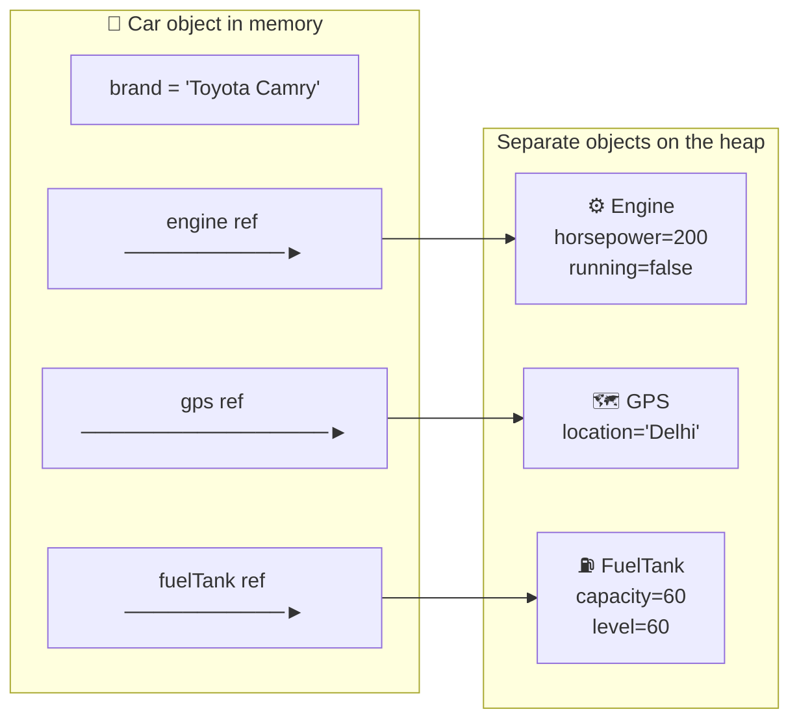
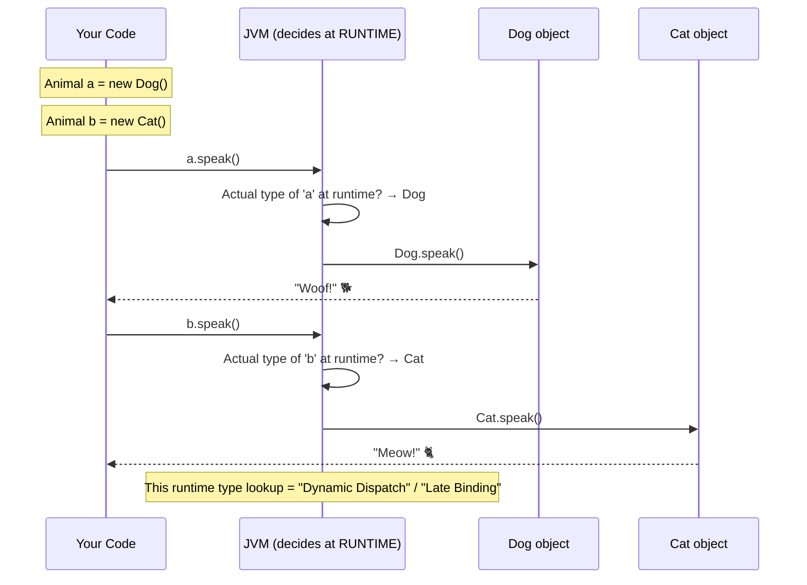

> 🔑 **IS-A vs HAS-A** — one of the most asked OOP questions:
> - **IS-A** = Inheritance (`Dog extends Animal`) — use when a "Dog is a kind of Animal" makes sense
> - **HAS-A** = Composition (`Dog has a Collar`) — use when ownership/containing makes more sense
> - **Rule**: Prefer **HAS-A** (composition) over IS-A (inheritance) — it's more flexible and testable!

---

#### 🔗 HAS-A Relationship (Composition) — Deep Dive

**Beginner Analogy 🚗**: Think of a **Car**. A Car IS-A Vehicle? ✅ Yes. But a Car also **HAS-A** Engine, **HAS-A** Steering Wheel, **HAS-A** GPS. The Engine is NOT a Car — it's a *part* of a Car. That's composition!

```mermaid
flowchart TB
    subgraph IsA["❌ IS-A Inheritance — tight coupling (fragile)"]
        Vehicle["🚗 Vehicle\n+ speed\n+ accelerate()"]
        Car["Car extends Vehicle\n+ numDoors"]
        Truck["Truck extends Vehicle\n+ payload"]
        Vehicle --> Car
        Vehicle --> Truck
    end

    subgraph HasA["✅ HAS-A Composition — loose coupling (flexible)"]
        Car2["🚗 Car"]
        Engine["⚙️ Engine\n+ horsepower\n+ start()\n+ stop()"]
        GPS["🗺️ GPS\n+ navigate(dest)"]
        FuelTank["⛽ FuelTank\n+ capacity\n+ refuel()"]
        Car2 -->"owns" Engine
        Car2 -->"owns" GPS
        Car2 -->"owns" FuelTank
    end
```

> 💡 **Key insight**: With composition you can swap `Engine` for an `ElectricMotor` without touching anything else in the Car class. With inheritance, changing the parent risks breaking all children — tight coupling!

**Three Flavours of HAS-A:**

```mermaid
flowchart LR
    subgraph Composition["🔴 Composition — strong ownership\nChild CANNOT exist without parent"]
        House["🏠 House"] -->"owns" Room["🚪 Room\n(demolished with House)"]
    end

    subgraph Aggregation["🟡 Aggregation — weak ownership\nChild CAN exist independently"]
        Library["📚 Library"] -->"contains" Book["📖 Book\n(Book survives Library closing)"]
    end

    subgraph Dependency["🟢 Dependency — uses temporarily\nPassed as a method parameter"]
        Chef["👨‍🍳 Chef"] -->"uses" Knife["🔪 Knife\n(borrowed, not owned)"]
    end
```

**Full Java Implementation — Car with Engine, GPS, FuelTank:**

```java
// ── STEP 1: Define the PARTS (the "HAS" objects) ─────────────────

class Engine {
    private int horsepower;
    private boolean running;

    public Engine(int horsepower) { this.horsepower = horsepower; }

    public void start() {
        running = true;
        System.out.println("Engine started! " + horsepower + "hp roaring 🔥");
    }
    public void stop() {
        running = false;
        System.out.println("Engine stopped ✅");
    }
    public boolean isRunning() { return running; }
}

class GPS {
    private String currentLocation;
    public GPS(String startLocation) { this.currentLocation = startLocation; }

    public String navigate(String destination) {
        return "📍 Navigating: " + currentLocation + " → " + destination;
    }
}

class FuelTank {
    private double capacity;
    private double currentLevel;

    public FuelTank(double capacity) {
        this.capacity = capacity;
        this.currentLevel = capacity;               // start full
    }
    public void refuel(double litres) {
        currentLevel = Math.min(capacity, currentLevel + litres);
        System.out.println("⛽ Tank: " + currentLevel + "L / " + capacity + "L");
    }
    public double getLevel() { return currentLevel; }
}

// ── STEP 2: Compose the OWNER (Car HAS-A Engine + GPS + FuelTank) ─

class Car {
    private String brand;
    private Engine engine;      // 🔴 Composition — Car creates & owns Engine
    private GPS gps;            // 🔴 Composition — Car creates & owns GPS
    private FuelTank fuelTank;  // 🔴 Composition — Car creates & owns FuelTank

    public Car(String brand, int horsepower, double tankCapacity) {
        this.brand    = brand;
        this.engine   = new Engine(horsepower);     // Car builds its own engine
        this.gps      = new GPS("Delhi");
        this.fuelTank = new FuelTank(tankCapacity);
    }

    // Car DELEGATES to its parts — it doesn't do the work itself
    public void start() {
        if (fuelTank.getLevel() > 0) {
            engine.start();                         // delegate to Engine
            System.out.println(brand + " ready to go! 🚗");
        } else {
            System.out.println("❌ No fuel! Please refuel first.");
        }
    }

    public void stop()                    { engine.stop(); }                // delegate to Engine
    public String navigateTo(String dest) { return gps.navigate(dest); }   // delegate to GPS
    public void refuel(double litres)     { fuelTank.refuel(litres); }     // delegate to FuelTank
}

// ── STEP 3: Use it ───────────────────────────────────────────────

Car myCar = new Car("Toyota Camry", 200, 60.0);
myCar.start();                                       // Engine started! 200hp roaring 🔥
                                                     // Toyota Camry ready to go! 🚗
System.out.println(myCar.navigateTo("Mumbai"));      // 📍 Navigating: Delhi → Mumbai
myCar.refuel(10.0);                                  // ⛽ Tank: 60.0L / 60.0L
myCar.stop();                                        // Engine stopped ✅

// 🔄 POWER OF COMPOSITION: want an electric version?
// Just swap Engine for ElectricMotor — the Car class itself is UNCHANGED!
```



**IS-A vs HAS-A Decision Guide:**

| Scenario | Relationship | Reason |
|---|---|---|
| `Dog` → `Animal` | **IS-A** ✅ | A dog truly IS a kind of animal |
| `Car` → `Engine` | **HAS-A** ✅ | Engine is a PART of a car |
| `Manager` → `Employee` | **IS-A** ✅ | A manager IS an employee |
| `User` → `Address` | **HAS-A** ✅ | Address is data held by User |
| `Order` → `OrderItems` | **HAS-A** ✅ | Items are parts of an order |
| Java's `Stack extends Vector` | **BAD IS-A** ❌ | Stack is NOT a Vector; exposes wrong methods |

> ⚠️ **Famous Java mistake**: `Stack extends Vector` is a classic IS-A misuse. Because Stack inherits Vector, callers can do `stack.add(0, "x")` — inserting at any position — which completely breaks the LIFO contract. Composition would have hidden those methods and prevented the bug.

---

#### 🎭 Polymorphism — Two Types You MUST Know

> 💡 **Polymorphism** = "many forms" — the same method name behaves differently depending on context.
> Java has **two kinds**:
> - **Compile-time** (Static Polymorphism) = resolved by the **compiler** → **Method Overloading**
> - **Runtime** (Dynamic Polymorphism) = resolved by the **JVM at runtime** → **Method Overriding**

---

##### ⏱️ Compile-Time Polymorphism — Method Overloading

**Analogy**: A vending machine with ONE button labelled "Dispense". Put in ₹10 → gives chocolate. Put in ₹20 → gives crisps. Same button, different behaviour based on **what you give it** — and the machine "knows" at design time which slot to use.

```mermaid
flowchart TB
    subgraph Overloading["Compile-Time Polymorphism — same name, different signatures"]
        direction TB
        Caller["Calculator calc = new Calculator()"]

        Caller -->"calc.add(5, 3)"            M1["add(int a, int b)\n→ returns 8"]
        Caller -->"calc.add(2.5, 1.5)"        M2["add(double a, double b)\n→ returns 4.0"]
        Caller -->"calc.add(1, 2, 3)"         M3["add(int a, int b, int c)\n→ returns 6"]
        Caller -->"calc.add('Hello', ' World')" M4["add(String a, String b)\n→ returns 'Hello World'"]

        CompileNote["🔧 COMPILER picks the right method\nbased on argument TYPES and COUNT\nat COMPILE time — before the program even runs"]
    end
    style CompileNote fill:#1a3a5c,stroke:#4fc3f7
```

```java
// ── COMPILE-TIME POLYMORPHISM — Method Overloading ───────────────

class Calculator {

    // Same name "add" — different parameter signatures
    public int add(int a, int b) {
        System.out.println("▶ Called: add(int, int)");
        return a + b;
    }

    public double add(double a, double b) {           // overload: different param types
        System.out.println("▶ Called: add(double, double)");
        return a + b;
    }

    public int add(int a, int b, int c) {             // overload: different param count
        System.out.println("▶ Called: add(int, int, int)");
        return a + b + c;
    }

    public String add(String a, String b) {           // overload: String params
        System.out.println("▶ Called: add(String, String)");
        return a + b;
    }

    // ❌ NOT valid overloading — only return type differs → COMPILE ERROR
    // public double add(int a, int b) { return (double)(a + b); }
}

// ── USAGE ────────────────────────────────────────────────────────
Calculator calc = new Calculator();

System.out.println(calc.add(5, 3));              // ▶ add(int, int)       → 8
System.out.println(calc.add(2.5, 1.5));          // ▶ add(double, double) → 4.0
System.out.println(calc.add(1, 2, 3));           // ▶ add(int, int, int)  → 6
System.out.println(calc.add("Hello", " World")); // ▶ add(String, String) → Hello World

// The compiler decides WHICH add() to call at compile time based on argument types
```

> 🔑 **Rules for Method Overloading:**
> - Methods must have the **same name**
> - Must differ in **parameter type, count, or order**
> - Return type **alone** is NOT enough to overload (compile error)
> - Can exist in the **same class** — no inheritance needed
> - `static` methods CAN be overloaded

---

##### 🏃 Runtime Polymorphism — Method Overriding

**Analogy**: A "play" button on different apps. Press it on Spotify → music plays. Press it on Netflix → video plays. The SAME method call produces DIFFERENT behaviour — decided at **runtime** based on the actual object type.



```mermaid
flowchart TB
    subgraph Overriding["Runtime Polymorphism — same signature, different behaviour per subclass"]
        Animal2["abstract class Animal\n+ speak(): String  ← defines CONTRACT"]

        Animal2 -->"extends" Dog2["class Dog\n@Override speak() → 'Woof!' 🐕"]
        Animal2 -->"extends" Cat2["class Cat\n@Override speak() → 'Meow!' 🐈"]
        Animal2 -->"extends" Bird2["class Bird\n@Override speak() → 'Tweet!' 🦜"]

        Ref["Animal ref = new Dog()\nref.speak()"]
        Ref -->"JVM checks actual type at RUNTIME" Dog2
        RuntimeNote["🏃 JVM decides WHICH speak()\nto call at RUNTIME\nbased on actual object type"]
    end
    style RuntimeNote fill:#1a3a5c,stroke:#4caf50
```

```java
// ── RUNTIME POLYMORPHISM — Method Overriding ─────────────────────

abstract class Animal {
    private String name;
    public Animal(String name) { this.name = name; }
    public String getName()    { return name; }

    public abstract String speak();                   // CONTRACT — defines WHAT, not HOW
    public void sleep() { System.out.println(name + " is sleeping 💤"); }
}

class Dog extends Animal {
    private String breed;
    public Dog(String name, String breed) { super(name); this.breed = breed; }

    @Override
    public String speak() { return "Woof! 🐕"; }     // Dog's HOW
}

class Cat extends Animal {
    public Cat(String name) { super(name); }

    @Override
    public String speak() { return "Meow! 🐈"; }     // Cat's HOW
}

class Bird extends Animal {
    public Bird(String name) { super(name); }

    @Override
    public String speak() { return "Tweet! 🦜"; }    // Bird's HOW
}

// ── RUNTIME POLYMORPHISM IN ACTION ───────────────────────────────
List<Animal> shelter = List.of(
    new Dog("Rex", "Labrador"),
    new Cat("Whiskers"),
    new Bird("Tweety"),
    new Dog("Buddy", "Poodle")
);

for (Animal a : shelter) {
    // Reference type = Animal (parent) — but JVM calls the REAL speak() at runtime
    System.out.println(a.getName() + " says: " + a.speak());
}
// Output:
// Rex says:      Woof!  🐕    ← JVM called Dog.speak()
// Whiskers says: Meow!  🐈    ← JVM called Cat.speak()
// Tweety says:   Tweet! 🦜    ← JVM called Bird.speak()
// Buddy says:    Woof!  🐕    ← JVM called Dog.speak()

// ✅ Adding Lion? Zero changes to the loop — just add a new class!
// class Lion extends Animal { @Override public String speak() { return "Roar! 🦁"; } }
```

> 🔑 **Rules for Method Overriding:**
> - Same **method name** and **exact same parameters** (identical signature)
> - Return type must be **same or a subtype** (covariant return)
> - Access modifier must be **same or broader** (`protected` → `public` ✅, `public` → `private` ❌)
> - Always use `@Override` — compiler warns you if the signature doesn't match
> - `static` and `private` methods **cannot** be overridden (they are hidden, not overridden)

---

##### 📊 Compile-Time vs Runtime Polymorphism — Full Comparison

| Feature | ⏱️ Compile-Time (Overloading) | 🏃 Runtime (Overriding) |
|---|---|---|
| **Also called** | Static polymorphism | Dynamic polymorphism |
| **Resolved by** | Compiler | JVM at runtime |
| **Resolved at** | Compile time | Runtime |
| **Method signature** | Must **DIFFER** (type / count) | Must be **IDENTICAL** |
| **Return type** | Can differ | Same or subtype only |
| **Inheritance needed?** | ❌ No — same class is fine | ✅ Yes — parent–child |
| **Annotation** | None | `@Override` (recommended) |
| **Performance** | ⚡ Faster (decided upfront) | Tiny overhead (dynamic dispatch) |
| **Static methods** | ✅ Can be overloaded | ❌ Cannot be overridden (only hidden) |
| **Keyword trigger** | None special | `extends` / `implements` |
| **Classic example** | `print(int)` vs `print(String)` | `Dog.speak()` vs `Cat.speak()` |

```java
// ── SIDE-BY-SIDE MINI EXAMPLE ────────────────────────────────────

// 1️⃣ COMPILE-TIME — same class, DIFFERENT signatures
class Printer {
    public void print(int n)           { System.out.println("Integer: " + n); }
    public void print(String s)        { System.out.println("String: " + s); }
    public void print(int n, String s) { System.out.println("Both: " + n + ", " + s); }
    // Compiler picks at compile time based on what you pass
}

// 2️⃣ RUNTIME — parent-child, SAME signature, different body
class Shape {
    public double area() { return 0; }
}
class Circle extends Shape {
    private double radius;
    public Circle(double r) { this.radius = r; }
    @Override public double area() { return Math.PI * radius * radius; }
}
class Rectangle extends Shape {
    private double w, h;
    public Rectangle(double w, double h) { this.w = w; this.h = h; }
    @Override public double area() { return w * h; }
}

Shape s1 = new Circle(5);        // reference type = Shape (parent)
Shape s2 = new Rectangle(4, 6);  // reference type = Shape (parent)
System.out.println(s1.area());    // 78.53  ← JVM calls Circle.area()    at RUNTIME
System.out.println(s2.area());    // 24.0   ← JVM calls Rectangle.area() at RUNTIME
```
