---

# 🧩 DSA & Problem Solving — Complete Interview Guide

> **What is DSA?** Data Structures and Algorithms — the foundation of every coding interview. A data structure organises data; an algorithm is a step-by-step process to solve a problem efficiently. Think of a library: the **bookshelves = data structure**, and **how the librarian finds a book = algorithm**.

> **Reading tip:** Read LEVEL 1 top to bottom before moving to LEVEL 2. Every pattern builds on the previous. After each pattern, you should be able to: (1) recognise the trigger in an interview problem, (2) write the template from memory, (3) state the time/space complexity.

---

## 📏 Big-O Notation — The Foundation of Everything

> **Why it matters:** Every interview problem requires you to state time and space complexity. Big-O is the language interviewers use. If you can't analyse complexity, no answer is complete.

### What is Big-O?

Big-O describes how runtime (or memory) grows as input size `n` grows. It measures the **worst case** and **ignores constants**.

```
f(n) = 3n² + 5n + 100
Big-O = O(n²)   ← only the fastest-growing term matters
         ↑ constant 3 is ignored
```

### Complexity Chart — From Best to Worst

```
O(1)        Constant    — does NOT grow with n
O(log n)    Logarithmic — halves the problem each step (binary search)
O(n)        Linear      — one pass through the input
O(n log n)  Linearithmic— sort algorithms (merge sort, heap sort)
O(n²)       Quadratic   — nested loops
O(2^n)      Exponential — generate all subsets
O(n!)       Factorial   — generate all permutations
```

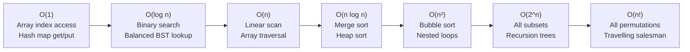

### How to Analyse Complexity

```java
// O(1) — constant time regardless of n
int first = arr[0];
map.put("key", "value");

// O(n) — one loop over n elements
for (int i = 0; i < n; i++) { ... }

// O(n²) — nested loops
for (int i = 0; i < n; i++)
    for (int j = 0; j < n; j++) { ... }

// O(log n) — problem halves each iteration
int lo = 0, hi = n - 1;
while (lo <= hi) {
    int mid = lo + (hi - lo) / 2;
    if (arr[mid] == target) return mid;
    else if (arr[mid] < target) lo = mid + 1;
    else hi = mid - 1;
}

// O(n log n) — sort then O(n) work
Arrays.sort(arr);            // O(n log n)
for (int x : arr) { ... }   // O(n)
// Total: O(n log n) — larger term dominates
```

### Space Complexity — Common Cases

| Space | When | Example |
|-------|------|---------|
| **O(1)** | Fixed extra variables | Two pointers, counters |
| **O(n)** | Copy of input, hash map | Storing all elements |
| **O(n²)** | 2D matrix, DP table | Grid DP, adjacency matrix |
| **O(log n)** | Recursion stack depth (balanced tree) | Binary search recursive |
| **O(n)** | Recursion stack depth (linear) | DFS on a line |

---

### 🧮 Big-O Simplification Rules — For Beginners

> These four rules are ALL you need to simplify any Big-O expression. Memorise them.

```
RULE 1 — Drop constants:
  O(2n) = O(n)        (2 passes through an array is still "linear")
  O(500) = O(1)       (500 fixed operations, regardless of n)
  O(3n²) = O(n²)

RULE 2 — Keep only the dominant (fastest-growing) term:
  O(n² + n) = O(n²)   (n² dominates n for large n)
  O(n + log n) = O(n) (n dominates log n)
  O(n³ + n² + n) = O(n³)

RULE 3 — Separate independent loops ADD:
  for (int i = 0; i < n; i++) { ... }    // O(n)
  for (int j = 0; j < m; j++) { ... }    // O(m)
  // Total: O(n + m)  NOT O(n * m)!

RULE 4 — Nested loops MULTIPLY:
  for (int i = 0; i < n; i++) {
      for (int j = 0; j < n; j++) { ... }  // O(n²) — nested!
  }
  for (int i = 0; i < n; i++) {
      binarySearch(arr);  // O(log n) inside loop
  }
  // Total: O(n log n)
```

### ⚡ Practical Speed Guide — How Fast is "Fast Enough"?

> Computers run about **10⁸ to 10⁹ simple operations per second**. Use this table to tell if your solution will pass a coding interview time limit (typically 1–2 seconds).

| n (input size) | O(log n) | O(n) | O(n log n) | O(n²) | O(2ⁿ) |
|---------------|---------|------|-----------|-------|-------|
| 10 | instant | instant | instant | instant | instant |
| 100 | instant | instant | instant | instant | ❌ slow |
| 1,000 | instant | instant | instant | OK | ❌ timeout |
| 10,000 | instant | instant | OK | OK | ❌ timeout |
| 100,000 | instant | OK | OK | ❌ slow | ❌ timeout |
| 1,000,000 | instant | OK | OK | ❌ timeout | ❌ timeout |
| 10,000,000 | instant | borderline | ❌ slow | ❌ timeout | ❌ timeout |

> **Rule of Thumb:** If `n ≤ 10⁴` → O(n²) is fine. If `n ≤ 10⁵` → need O(n log n) or better. If `n ≤ 10⁶` → need O(n) or O(n log n). If `n ≤ 10⁹` → need O(log n) or O(1).

### 🚫 Common Beginner Mistakes in Big-O

```java
// MISTAKE 1: "I see ONE loop, so it must be O(n)"
// ❌ Wrong — this loop runs log n times, not n times!
int n = 1_000_000;
while (n > 1) {
    n = n / 2;  // n halves each iteration → O(log n)!
}

// MISTAKE 2: Forgetting that String operations inside loops add cost
// ❌ This is O(n²) because String concatenation creates a new String each time
String result = "";
for (int i = 0; i < n; i++) {
    result += "a";  // Each += creates a new String of growing length!
}
// ✅ Use StringBuilder → O(n)

// MISTAKE 3: Not counting recursion stack depth as space
void dfs(TreeNode root) {   // Appears to use O(1) space... but
    if (root == null) return;
    dfs(root.left);          // Each recursive call uses stack frame!
    dfs(root.right);         // Stack depth = tree height = O(h) space
}
// Balanced tree: O(log n) space. Skewed (worst case): O(n) space.

// MISTAKE 4: Assuming HashMap is always O(1)
// ✅ Average O(1) — but only with a good hash function
// ❌ Worst case O(n) (Java 7-) or O(log n) (Java 8+ treeification)
// In interview: always say "O(1) average, O(log n) worst"
```

### 🎯 Big-O Quick Mental Model

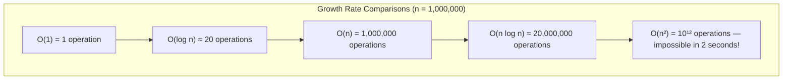

---

> 💡 **Interview Tip:** Always state time AND space complexity unprompted. Say: *"This solution is O(n) time and O(n) space because I use a hash map that can store up to n elements."*

**❓ Interview Questions:**

**Q: "What is the time complexity of looking up an element in a HashMap?"**
> A: O(1) average case — Java's HashMap uses hashing to compute the bucket index directly. Worst case is O(n) if all keys hash to the same bucket (hash collision, degenerate chain), but with a good hash function this is extremely rare. Java 8+ converts long chains to Red-Black Trees, making worst case O(log n).

**Q: "How do you calculate the Big-O of a recursive function?"**
> A: Use the **Recurrence Relation** approach. For example, `T(n) = 2T(n/2) + O(n)` (merge sort) — this solves to O(n log n) by the Master Theorem. For simpler cases: count the number of recursive calls × work per call. Binary search: 1 call × O(1) work = T(n) = T(n/2) + O(1) → O(log n). Fibonacci naive: 2 calls each level × O(1) = O(2^n) calls total.

**Q: "Is O(n log n) better than O(n²)? By how much?"**
> A: Yes, significantly. For n = 1,000,000: O(n log n) ≈ 20 million operations (fast). O(n²) = 1 trillion operations (takes hours). The ratio is n/log n ≈ 50,000x faster. This is why merge sort (O(n log n)) vs bubble sort (O(n²)) makes an enormous real-world difference for large inputs.

---

## 🟢 LEVEL 1 — Core Patterns (Start Here)

---

### Pattern 1 — Two Pointers

> 🧠 **Beginner's First Question: Why Two Pointers?**
>
> Imagine finding two numbers in a sorted array that add to a target.
>
> **Brute Force — O(n²):** Two nested loops — try every possible pair.
> ```java
> // ❌ Too slow for large inputs
> for (int i = 0; i < n; i++)
>     for (int j = i+1; j < n; j++)
>         if (arr[i] + arr[j] == target) return new int[]{i, j};
> ```
>
> **Two Pointers — O(n):** Use the SORTED order as a compass. If `arr[L] + arr[R]` is too small, only moving `L` right (toward bigger values) can increase the sum. If too big, only moving `R` left can decrease it. Each step eliminates at least one element — so the whole array is processed in O(n).

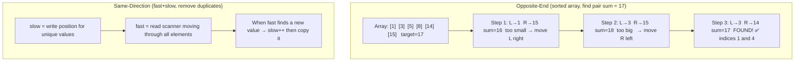

**Step-by-step logic:**
1. Sort the array (if not already sorted)
2. Place `L=0` and `R=last` pointers
3. Compute `sum = arr[L] + arr[R]`
4. If `sum < target` → increment `L` (need a larger left value)
5. If `sum > target` → decrement `R` (need a smaller right value)
6. If `sum == target` → answer found
7. Loop ends when `L >= R` (no pair found)

> **What is it?** Use two index variables that move through the array, usually from opposite ends (left pointer and right pointer) or both from the same side at different speeds.

> **Real-world analogy:** Two people searching a sorted bookshelf from both ends. If the combined price of books at both ends is too high, move the right pointer left (cheaper book). Too low — move left pointer right (more expensive book).

**When to use Two Pointers — TRIGGER WORDS:**
```
✅ Sorted array + find pair with target sum
✅ "Is it a palindrome?"
✅ "Container / trap water between elements"
✅ Remove duplicates in-place
✅ Merge two sorted arrays
✅ Partitioning (like quicksort pivot)
✅ String matching problems (with two strings)
```

**Template:**
```java
// Opposite-end two pointers (sorted array)
public int[] twoSum(int[] nums, int target) {
    int left = 0, right = nums.length - 1;
    while (left < right) {
        int sum = nums[left] + nums[right];
        if (sum == target)      return new int[]{left, right};
        else if (sum < target)  left++;   // need bigger sum
        else                    right--;  // need smaller sum
    }
    return new int[]{};
}

// Same-direction two pointers (remove duplicates)
public int removeDuplicates(int[] nums) {
    int slow = 0;  // slow = position to write next unique element
    for (int fast = 1; fast < nums.length; fast++) {
        if (nums[fast] != nums[slow]) {
            slow++;
            nums[slow] = nums[fast];
        }
    }
    return slow + 1;
}
```

**Classic Problems:**

| Problem | Two-pointer approach | Complexity |
|---------|---------------------|-----------|
| Two Sum II (sorted) | Left + right, move based on sum | O(n) time, O(1) space |
| Valid Palindrome | Left + right, compare chars | O(n) time, O(1) space |
| Container With Most Water | Left + right, move shorter line | O(n) time, O(1) space |
| 3Sum | Fix one, two-pointer on rest | O(n²) time, O(1) space |
| Trapping Rain Water | Track left_max and right_max | O(n) time, O(1) space |
| Remove Duplicates from Sorted Array | Slow + fast pointer | O(n) time, O(1) space |

**Trapping Rain Water — Intuition Build:**
```
Array: [0,1,0,2,1,0,1,3,2,1,2,1]
Water trapped: 6

Key insight: water at position i = min(max_left, max_right) - height[i]
Two-pointer: maintain left_max and right_max as you converge

left=0, right=11
If height[left] < height[right]: process left side
  water += left_max - height[left] (if left_max > height[left])
  left++
Else: process right side
  water += right_max - height[right]
  right--
```

```java
public int trap(int[] height) {
    int left = 0, right = height.length - 1;
    int leftMax = 0, rightMax = 0, water = 0;
    while (left < right) {
        if (height[left] < height[right]) {
            if (height[left] >= leftMax) leftMax = height[left];
            else water += leftMax - height[left];
            left++;
        } else {
            if (height[right] >= rightMax) rightMax = height[right];
            else water += rightMax - height[right];
            right--;
        }
    }
    return water;
}
// Time: O(n)  Space: O(1)
```

> 💡 **Tip:** If the array is NOT sorted and you need pairs, use a **hash map** instead (O(n) with O(n) space). Two pointers require sorted input for opposite-end approach.

**❓ Interview Q: "Can you solve 3Sum without a hash map in O(n²)?"**
> A: Yes — sort the array O(n log n), then for each element `nums[i]`, use two pointers on the remaining right portion `[i+1, n-1]` to find pairs summing to `-nums[i]`. Skip duplicates by advancing pointers when `nums[i] == nums[i-1]`. Total: O(n²) time, O(1) extra space.

### 🚫 Common Beginner Mistakes — Two Pointers

```java
// MISTAKE 1: Not sorting the array first for opposite-end approach
int[] unsorted = {4, 1, 8, 3};
// ❌ Two-pointer on unsorted won't work — "too small/too big" logic breaks
// ✅ Always sort first: Arrays.sort(unsorted);  then apply two pointers

// MISTAKE 2: Wrong termination condition — using < instead of <=
while (left < right) { ... }   // ✅ Correct — stop when pointers meet
while (left <= right) { ... }  // ❌ Off-by-one for pair problems

// MISTAKE 3: Forgetting to skip duplicates in 3Sum
for (int i = 0; i < nums.length - 2; i++) {
    if (i > 0 && nums[i] == nums[i-1]) continue;  // ✅ Skip duplicate i
    // ... two pointers
    while (left < right) {
        // After finding a triplet:
        while (left < right && nums[left] == nums[left+1]) left++;   // ✅ skip dup
        while (left < right && nums[right] == nums[right-1]) right--; // ✅ skip dup
    }
}

// MISTAKE 4: Moving both pointers at once when only one should move
if (sum == target) {
    // ❌ Wrong: left++; right--;  — you might skip valid pairs
    // ✅ Correct: return new int[]{left, right};  — stop, you found the answer
    // For all-pairs version: left++; right--; AND skip duplicates
}
```

### 📋 Two Pointers — One-Page Cheat Card

| Type | When to Use | Direction | Key Code |
|------|-------------|-----------|----------|
| **Opposite ends** | Sorted array, pair/triplet sum | L→ ←R converging | `left++` or `right--` |
| **Same direction** | Remove duplicates, partition | slow→ fast→ | `if new: slow++; arr[slow]=arr[fast]` |
| **Fast/slow** | Cycle detection, find middle | 1-step & 2-step | `slow=slow.next; fast=fast.next.next` |

```
DECISION FLOW:
  Is array sorted?          → YES: Try opposite-end two pointers first
  Is it a substring problem? → YES: Try sliding window (Pattern 2)
  Is it a linked list?       → YES: Try fast/slow (Pattern 6)
  Unsorted + find pairs?     → Use HashMap (Pattern 5) for O(n)
```

---

### Pattern 2 — Sliding Window

```mermaid
### Pattern 2 — Sliding Window

> 🧠 **Beginner's First Question: Why Sliding Window?**
>
> Problem: Find the maximum sum of 3 consecutive elements in `[2, 1, 5, 1, 3, 2]`.
>
> **Brute Force — O(n×k):** Recalculate the sum of every window from scratch.
> ```java
> // ❌ Recalculates sum from scratch every window
> int maxSum = 0;
> for (int i = 0; i <= n - k; i++) {
>     int sum = 0;
>     for (int j = i; j < i + k; j++) sum += arr[j]; // re-adds same elements!
>     maxSum = Math.max(maxSum, sum);
> }
> ```
>
> **Sliding Window — O(n):** When the window slides right, you simply **add the new element entering** and **subtract the element leaving**. No recomputation needed!
> ```
> Window [2,1,5] sum=8  →  remove 2, add 1  →  Window [1,5,1] sum=7
>                                                NOT a new sum from scratch
> ```

```mermaid
flowchart TB
  subgraph Fixed["Fixed Window k=3 on array 2-1-5-1-3-2"]
    F1["Init window: [2,1,5]  sum=8"]
    F2["Slide: remove 2 add 1 → [1,5,1]  sum=7"]
    F3["Slide: remove 1 add 3 → [5,1,3]  sum=9  ← max"]
    F4["Slide: remove 5 add 2 → [1,3,2]  sum=6"]
    F1 --> F2 --> F3 --> F4
  end
  subgraph Variable["Variable Window — Longest Substring Without Repeating"]
    V1["right++ expands: add char to window"]
    V2["Window valid? No duplicate chars"]
    V3["YES → record length = right - left + 1"]
    V4["NO (duplicate found) → left++ shrinks window"]
    V1 --> V2
    V2 -->|valid| V3 --> V1
    V2 -->|invalid| V4 --> V2
  end
```

**Step-by-step logic:**
1. For **fixed window**: init first window sum, then slide by adding `arr[right]` and subtracting `arr[right - k]`
2. For **variable window**: expand `right` unconditionally; shrink `left` when window violates constraint
3. Update the answer inside the valid-window check (max length, min length, etc.)
4. Window size at any time = `right - left + 1`
5. **Ask yourself**: "When is the window invalid?" → that condition drives `left++`

> **What is it?** Maintain a "window" (contiguous subarray or substring) that slides through the data. Instead of recalculating from scratch, add the new element entering the window and remove the element leaving it.

> **Real-world analogy:** A train window sliding past the countryside. New scenery enters the right side; old scenery exits the left side. You don't restart from the beginning each time the window moves.

**When to use — TRIGGER WORDS:**
```
✅ "Contiguous subarray/substring with condition..."
✅ "Longest/shortest subarray where..."
✅ "Maximum sum of exactly k elements"
✅ "All anagrams in a string"
✅ "Minimum window containing all characters"
✅ "Subarray with given sum" (positive numbers)
```

**Two types:**

| Type | When | What changes |
|------|------|-------------|
| **Fixed-size window** | "Window of exactly k elements" | Window moves rigidly, size constant |
| **Variable-size window** | "Longest/shortest window satisfying condition" | Window expands on right, shrinks on left |

**Templates:**
```java
// FIXED window — Maximum sum of k consecutive elements
// Array: [2, 1, 5, 1, 3, 2], k=3
// Expected: 9 (subarray [5,1,3])
public int maxSumFixed(int[] nums, int k) {
    int windowSum = 0;
    // Step 1: Build the FIRST window
    for (int i = 0; i < k; i++) windowSum += nums[i];  // windowSum = 2+1+5 = 8
    int maxSum = windowSum;
    // Step 2: Slide the window — add right, remove left
    for (int i = k; i < nums.length; i++) {
        windowSum += nums[i] - nums[i - k];  // add nums[i], remove nums[i-k]
        // i=3: windowSum = 8 + 1 - 2 = 7  (window [1,5,1])
        // i=4: windowSum = 7 + 3 - 1 = 9  (window [5,1,3]) ← new max!
        // i=5: windowSum = 9 + 2 - 5 = 6  (window [1,3,2])
        maxSum = Math.max(maxSum, windowSum);
    }
    return maxSum;  // 9
}

// VARIABLE window — Longest substring without repeating characters
public int lengthOfLongestSubstring(String s) {
    Map<Character, Integer> lastSeen = new HashMap<>();
    int maxLen = 0;
    int left = 0;
    for (int right = 0; right < s.length(); right++) {
        char c = s.charAt(right);
        // Shrink window if duplicate found — move left past the last occurrence
        if (lastSeen.containsKey(c) && lastSeen.get(c) >= left) {
            left = lastSeen.get(c) + 1;
        }
        lastSeen.put(c, right);
        maxLen = Math.max(maxLen, right - left + 1);
    }
    return maxLen;
}
// Time: O(n)  Space: O(min(n, alphabet_size))
```

**Minimum Window Substring — The King of Sliding Window:**
```
Problem: Given s="ADOBECODEBANC", t="ABC"
         Find minimum window in s containing all chars of t.
Answer: "BANC"

Intuition:
  1. Count chars needed from t → need = {A:1, B:1, C:1}
  2. Expand right until window contains all needed chars (formed == required)
  3. Record window size, then shrink from left to find minimum
  4. If shrinking breaks a needed char, expand right again
```

```java
public String minWindow(String s, String t) {
    if (s.isEmpty() || t.isEmpty()) return "";
    Map<Character, Integer> need = new HashMap<>();
    for (char c : t.toCharArray()) need.merge(c, 1, Integer::sum);
    int required = need.size();  // distinct chars needed
    int formed = 0;              // distinct chars currently satisfied
    Map<Character, Integer> window = new HashMap<>();
    int left = 0, minLen = Integer.MAX_VALUE, minLeft = 0;
    for (int right = 0; right < s.length(); right++) {
        char c = s.charAt(right);
        window.merge(c, 1, Integer::sum);
        if (need.containsKey(c) && window.get(c).equals(need.get(c))) formed++;
        // Shrink window while all chars satisfied
        while (formed == required) {
            if (right - left + 1 < minLen) {
                minLen = right - left + 1;
                minLeft = left;
            }
            char lc = s.charAt(left++);
            window.merge(lc, -1, Integer::sum);
            if (need.containsKey(lc) && window.get(lc) < need.get(lc)) formed--;
        }
    }
    return minLen == Integer.MAX_VALUE ? "" : s.substring(minLeft, minLeft + minLen);
}
// Time: O(|s| + |t|)  Space: O(|s| + |t|)
```

> 💡 **Tip:** For variable window, the pattern is always: `right` pointer expands the window, `left` pointer shrinks it. Ask: "When should I shrink?" — shrink when the window violates the condition.

**❓ Interview Q: "How is sliding window different from two pointers?"**
> A: Sliding window is a special case of two pointers where both pointers move in the **same direction** (left and right both go right). The "window" between them is what we care about. Two pointers (opposite ends) work on sorted arrays for pair problems. Sliding window works on contiguous subarray/substring problems regardless of sorting.

### 🚫 Common Beginner Mistakes — Sliding Window

```java
// MISTAKE 1: Recalculating window from scratch (defeats the purpose)
// ❌ O(n*k) — still nested loop thinking
for (int i = 0; i <= n-k; i++) {
    int sum = 0;
    for (int j = i; j < i+k; j++) sum += arr[j]; // recalculating!
}
// ✅ Build first window, then slide: windowSum += arr[i] - arr[i-k]

// MISTAKE 2: For variable window — shrinking when you should expand
// The window should GROW on right, SHRINK on left — not both simultaneously
for (int right = 0; right < n; right++) {
    // ❌ Wrong: moving left++ every time right moves (that's not a window)
    // ✅ Correct: only move left++ when the WINDOW BECOMES INVALID
    while (windowIsInvalid()) left++;
    // NOW record the answer
    maxLen = Math.max(maxLen, right - left + 1);
}

// MISTAKE 3: Recording answer outside the valid window check
for (int right = 0; right < n; right++) {
    addToWindow(s.charAt(right));
    // ❌ Wrong: recording answer even when window might still be invalid
    maxLen = Math.max(maxLen, right - left + 1);
    while (windowIsInvalid()) removeFromWindow(s.charAt(left++));
    // ✅ Correct: record AFTER shrinking
    // maxLen = Math.max(maxLen, right - left + 1);  // moved here
}

// MISTAKE 4: Forgetting to update the "window state" when expanding/shrinking
Map<Character, Integer> freq = new HashMap<>();
for (int right = 0; right < s.length(); right++) {
    char c = s.charAt(right);
    freq.merge(c, 1, Integer::sum);  // ✅ Update state on expand
    while (freq.size() > k) {
        char lc = s.charAt(left++);
        freq.merge(lc, -1, Integer::sum);
        if (freq.get(lc) == 0) freq.remove(lc);  // ✅ Update state on shrink
    }
}
```

### 📋 Sliding Window — One-Page Cheat Card

```
FIXED window (size k):
  1. Build first window (loop i=0 to k-1)
  2. Record answer
  3. Slide: for i=k to n-1:
       windowState += add(arr[i])
       windowState -= remove(arr[i-k])
       Record answer

VARIABLE window:
  1. left=0, right=0
  2. for right = 0 to n-1:
       add(arr[right]) to window
       while window is INVALID: remove(arr[left]), left++
       record answer (window is now valid)

ASK YOURSELF: "What makes the window invalid?" → drives the while condition
```

---

### Pattern 3 — Prefix Sum

```mermaid
flowchart LR
  subgraph BuildPhase["Build Phase O(n)"]
### Pattern 3 — Prefix Sum

> 🧠 **Beginner's First Question: Why Prefix Sum?**
>
> Problem: You have an array `[3, 1, 4, 1, 5]`. Answer 1000 queries: "What is the sum of elements from index `l` to `r`?"
>
> **Brute Force — O(n) per query, O(n×q) total:** Add elements from l to r each time.
> ```java
> // ❌ Re-adds elements for every query
> int sum = 0;
> for (int i = l; i <= r; i++) sum += arr[i]; // O(n) per query
> ```
>
> **Prefix Sum — O(n) build + O(1) per query:** Precompute cumulative sums once, then each query is just a subtraction!
> ```java
> // ✅ One-time O(n) build, then O(1) per query
> prefix[r+1] - prefix[l]  // any range sum in constant time
> ```

```mermaid
flowchart TB
  subgraph Build["Step 1 — Build Phase O(n)"]
    B1["arr:    [ 3 ][ 1 ][ 4 ][ 1 ][ 5 ]"]
    B2["index:    0    1    2    3    4"]
    B3["prefix: [0][ 3 ][ 4 ][ 8 ][ 9 ][14]"]
    B4["prefix[0]=0 (empty prefix), prefix[i+1] = prefix[i] + arr[i]"]
    B1 --> B3
    B4 -.explains.-> B3
  end
  subgraph Query["Step 2 — Query Phase O(1)"]
    Q1["Sum of arr[1..3] = arr[1]+arr[2]+arr[3] = 1+4+1 = 6"]
    Q2["= prefix[4] - prefix[1]"]
    Q3["= 9 - 3 = 6  ✅"]
    Q1 --> Q2 --> Q3
  end
  subgraph SubarrayK["Step 3 — Subarray Sum = k Trick"]
    K1["Walk array maintaining running prefix sum"]
    K2["At each step i: check if (sum - k) exists in seen map"]
    K3["If yes: those many subarrays ending at i sum to k"]
    K4["Init map with {0:1} to count subarrays starting at index 0"]
    K1 --> K2 --> K3
    K4 -.initialisation.-> K1
  end
  Build --> Query
  Query --> SubarrayK
```

**Why `prefix[r+1] - prefix[l]` works — visual proof:**
```
arr =   [ 3,  1,  4,  1,  5 ]
        idx:  0   1   2   3   4

prefix = [ 0,  3,  4,  8,  9, 14 ]
         idx:  0   1   2   3   4   5
         
prefix[i] = sum of arr[0] to arr[i-1]

Sum of arr[1..3] (inclusive):
  = arr[1] + arr[2] + arr[3]
  = 1 + 4 + 1 = 6
  
  Using prefix:
  = prefix[4] - prefix[1]
  = (0+3+1+4+1) - (0+3)
  = 9 - 3 = 6  ✅

Intuition: prefix[r+1] = sum of arr[0..r]
           prefix[l]   = sum of arr[0..l-1]
           Subtracting cancels the left part, leaving arr[l..r]
```

**Step-by-step logic:**
1. Build `prefix[0] = 0`, `prefix[i+1] = prefix[i] + arr[i]`
2. Range sum `[l, r]` = `prefix[r+1] - prefix[l]` — O(1) per query
3. For "subarrays summing to k": as you walk the array, for each `sum` check if `sum - k` is in the map
4. Initialise map with `{0: 1}` to handle subarrays starting at index 0
5. After checking, store `sum → count` in the map

> **What is it?** Precompute a `prefix[i]` array where `prefix[i]` = sum of all elements from index 0 to i-1. Any range sum `[l, r]` is then answered in **O(1)** using `prefix[r+1] - prefix[l]`.

> **Real-world analogy:** A bank statement. Instead of adding every transaction from day 1 to find your balance on day 80, the bank shows a running total. Balance on day 80 minus balance on day 30 = spending during those 50 days. O(1) lookup.

**When to use — TRIGGER WORDS:**
```
✅ "Sum of subarray from index l to r" (multiple queries)
✅ "Number of subarrays with sum equal to k"
✅ "Count subarrays with sum divisible by k"
✅ "Find pivot index where left sum = right sum"
✅ "2D grid — sum of rectangle"
```

**Template:**
```java
// Build prefix sum
int[] prefix = new int[nums.length + 1];
prefix[0] = 0;
for (int i = 0; i < nums.length; i++) {
    prefix[i + 1] = prefix[i] + nums[i];
}
// Range sum query [l, r] in O(1)
int rangeSum = prefix[r + 1] - prefix[l];
```

**Subarray Sum Equals K — The Classic:**
```
Problem: Count subarrays with sum = k
Brute force: O(n²) — try all pairs
Optimal: O(n) using prefix sum + hash map

Key insight: If prefix[j] - prefix[i] = k,
            then subarray [i..j-1] sums to k.
            Rearrange: prefix[i] = prefix[j] - k
            So: for each j, count how many previous i's have prefix[i] = prefix[j] - k
```

```java
public int subarraySum(int[] nums, int k) {
    Map<Integer, Integer> prefixCount = new HashMap<>();
    prefixCount.put(0, 1);  // empty prefix has sum 0 — crucial!
    int count = 0, sum = 0;
    for (int num : nums) {
        sum += num;
        // How many previous prefixes have value (sum - k)?
        count += prefixCount.getOrDefault(sum - k, 0);
        prefixCount.merge(sum, 1, Integer::sum);
    }
    return count;
}
// Time: O(n)  Space: O(n)
```

```
Trace with nums=[1,2,3], k=3:

Step | num | sum | sum-k | prefixCount before add | count
  0  |     |  0  |       | {0:1}                   |  0
  1  |  1  |  1  |  -2   | {0:1}                   |  0  → {0:1, 1:1}
  2  |  2  |  3  |   0   | {0:1, 1:1}       → +1   |  1  → {0:1,1:1,3:1}
  3  |  3  |  6  |   3   | {0:1,1:1,3:1}    → +1   |  2  → {0:1,1:1,3:1,6:1}
Answer: 2 (subarrays [1,2] and [3])
```

> 💡 **Critical trick:** Always initialise `prefixCount.put(0, 1)`. This handles the case where the entire prefix from index 0 sums to k.

**❓ Interview Q: "Why do we store prefix sums in a map instead of an array?"**
> A: Because prefix sums can be negative (if the array has negative numbers) or very large, making an array index infeasible. A hash map stores only the prefix sums that actually appear, giving O(1) lookup. The key is the prefix sum value; the value is how many times that prefix sum was seen.

### 🚫 Common Beginner Mistakes — Prefix Sum

```java
// MISTAKE 1: Off-by-one — forgetting the +1 offset in prefix array
int[] prefix = new int[nums.length];   // ❌ should be nums.length + 1
// Because prefix[0] = 0 (empty prefix), prefix array needs one extra slot

// ✅ Correct
int[] prefix = new int[nums.length + 1];
prefix[0] = 0;
for (int i = 0; i < nums.length; i++) prefix[i+1] = prefix[i] + nums[i];
// Range [l, r]: prefix[r+1] - prefix[l]

// MISTAKE 2: Forgetting to initialise the map with {0: 1}
Map<Integer, Integer> map = new HashMap<>();
// ❌ Wrong — will miss subarrays that start at index 0
// E.g., [3, -3], k=0 — the subarray [3,-3] sums to 0
// When we reach index 1, sum=0, sum-k=0, but map doesn't have 0!

// ✅ Correct — always seed with empty prefix
map.put(0, 1);

// MISTAKE 3: For 2D prefix sums — wrong formula
int[][] p = new int[m+1][n+1];
for (int i = 1; i <= m; i++)
    for (int j = 1; j <= n; j++)
        // ❌ p[i][j] = p[i-1][j] + p[i][j-1] + grid[i-1][j-1]  (double-counts corner)
        // ✅ Inclusion-exclusion:
        p[i][j] = p[i-1][j] + p[i][j-1] - p[i-1][j-1] + grid[i-1][j-1];
// Rectangle sum (r1,c1) to (r2,c2):
// p[r2+1][c2+1] - p[r1][c2+1] - p[r2+1][c1] + p[r1][c1]
```

---

### Pattern 4 — Binary Search

> 🧠 **Beginner's First Question: Why Binary Search?**
>
> Problem: Find if target `7` exists in sorted array `[1, 3, 5, 7, 9, 11, 13]`.
>
> **Linear Search — O(n):** Check every element one by one. With 1 billion elements, worst case = 1 billion checks.
>
> **Binary Search — O(log n):** Look at the MIDDLE element. If it's too big, the target must be in the LEFT half — discard the right half entirely. If too small, discard the left half. With 1 billion elements, you find the answer in ≤ 30 checks! (log₂(1,000,000,000) ≈ 30)
>
> **The key requirement:** The search space must be SORTED (or have a monotonic property — "all elements on the left satisfy condition X, all on right don't").

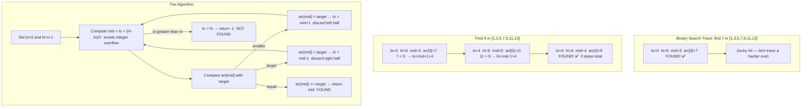

**Step-by-step logic:**
1. Define search space with `lo` and `hi`
2. Compute `mid` without overflow: `lo + (hi - lo) / 2`
3. Compare `arr[mid]` with target — eliminate the half that cannot contain the answer
4. Repeat until `lo > hi` (not found) or `arr[mid] == target`
5. **For answer-space binary search**: define a `predicate(mid)` function; binary search the boundary where predicate changes from false to true

> **What is it?** On a sorted (or monotonic) search space, eliminate half the possibilities each step by comparing the middle element with the target.

> **Real-world analogy:** Dictionary lookup. You open the dictionary at the middle page. If "Target" comes alphabetically before that page, go to the left half. Otherwise go right. Repeat until found. You find any word in ≤ 20 page-flips in a 1-million-page dictionary.

**When to use — TRIGGER WORDS:**
```
✅ "Sorted array — find target / leftmost / rightmost"
✅ "Find minimum value satisfying a condition" (binary search on answer)
✅ "Rotated sorted array"
✅ "Mountain array / peak element"
✅ "Koko eating bananas / capacity ship" — monotonic condition
✅ "Minimum maximum / Maximum minimum" — binary search on answer
```

**Three Templates:**
```java
// Template 1: Classic — find exact target
public int binarySearch(int[] nums, int target) {
    int lo = 0, hi = nums.length - 1;
    while (lo <= hi) {
        int mid = lo + (hi - lo) / 2;  // avoid integer overflow
        if (nums[mid] == target) return mid;
        if (nums[mid] < target)  lo = mid + 1;
        else                     hi = mid - 1;
    }
    return -1;  // not found
}

// Template 2: Find leftmost position (lower bound)
public int lowerBound(int[] nums, int target) {
    int lo = 0, hi = nums.length;
    while (lo < hi) {          // Note: hi = nums.length (exclusive)
        int mid = lo + (hi - lo) / 2;
        if (nums[mid] < target) lo = mid + 1;
        else                    hi = mid;     // could be the answer, don't exclude
    }
    return lo;  // first index >= target
}

// Template 3: Binary search on ANSWER (monotonic predicate)
// "Minimum days to make m bouquets"
public int minDays(int[] bloomDay, int m, int k) {
    int lo = 1, hi = 1_000_000_000;
    while (lo < hi) {
        int mid = lo + (hi - lo) / 2;
        if (canMake(bloomDay, mid, m, k)) hi = mid;
        else                              lo = mid + 1;
    }
    return canMake(bloomDay, lo, m, k) ? lo : -1;
}
private boolean canMake(int[] days, int day, int m, int k) {
    int bouquets = 0, flowers = 0;
    for (int d : days) {
        if (d <= day) { flowers++; if (flowers == k) { bouquets++; flowers = 0; } }
        else          flowers = 0;
    }
    return bouquets >= m;
}
```

**Binary Search on Answer — The Advanced Trick:**
```
Pattern: "Find MINIMUM X such that condition(X) is TRUE"
         "Find MAXIMUM X such that condition(X) is FALSE"

Key insight: if condition(X) is true for all X >= answer,
             the valid/invalid values form two contiguous blocks:
             [invalid, invalid, ..., ANSWER, valid, valid, ...]
             Binary search on this range!

Examples:
  "Minimum speed to arrive on time"   → binary search on speed
  "Minimum capacity to ship packages" → binary search on capacity
  "Koko eating bananas in h hours"    → binary search on eating speed
  "Split array largest sum"           → binary search on max subarray sum
```

> 💡 **Common bug:** Use `mid = lo + (hi - lo) / 2` NOT `mid = (lo + hi) / 2`. The second form overflows for large lo and hi values (e.g. when lo=hi=1_500_000_000, `lo+hi` overflows int).

**❓ Interview Q: "How do you binary search on a rotated sorted array?"**
> A: A rotated sorted array like `[4,5,6,7,0,1,2]` has a pivot. At any mid, one half is always sorted. Check which half is sorted: if `nums[lo] <= nums[mid]`, the left half is sorted — check if target is in `[nums[lo], nums[mid]]`, otherwise search right. Else the right half is sorted — check if target is in `[nums[mid], nums[hi]]`, otherwise search left. Time O(log n).

### 🚫 Common Beginner Mistakes — Binary Search

```java
// MISTAKE 1: Integer overflow in mid calculation
// ❌ Wrong — overflows when lo and hi are large positive ints
int mid = (lo + hi) / 2;
// ✅ Correct — safe formula
int mid = lo + (hi - lo) / 2;

// MISTAKE 2: Infinite loop — wrong boundary update
while (lo < hi) {
    int mid = lo + (hi - lo) / 2;
    if (nums[mid] < target) lo = mid;  // ❌ lo never advances past mid → infinite loop!
    else hi = mid;
}
// ✅ Always advance lo to mid+1 (not mid) when discarding left half
if (nums[mid] < target) lo = mid + 1;

// MISTAKE 3: Wrong termination — using lo < hi vs lo <= hi
// For EXACT MATCH: use lo <= hi (stops when pointers cross)
// For LOWER BOUND (find first position): use lo < hi (stops when they meet)
// Rule: if you write hi = mid (not mid-1), use lo < hi

// MISTAKE 4: For "Binary Search on Answer" — wrong predicate direction
// Problem: "find MINIMUM value X where condition is true"
// ❌ Wrong: if (check(mid)) lo = mid + 1;  (expands search upward)
// ✅ Correct: if (check(mid)) hi = mid;     (narrow down to find minimum true)
//             else              lo = mid + 1; (check(mid) false → need bigger)

// MISTAKE 5: Forgetting to handle empty array
if (nums == null || nums.length == 0) return -1;  // ✅ always check this first
```

### 📋 Binary Search — Three Templates at a Glance

```
Template 1 — FIND EXACT (lo <= hi):
  while (lo <= hi) {
      mid = lo + (hi-lo)/2
      if arr[mid] == target: return mid
      if arr[mid] < target:  lo = mid + 1
      else:                  hi = mid - 1
  }
  return -1  // not found

Template 2 — FIND LEFTMOST / FIRST TRUE (lo < hi):
  while (lo < hi) {
      mid = lo + (hi-lo)/2
      if predicate(mid): hi = mid      // could be answer, narrow left
      else:              lo = mid + 1  // definitely not answer
  }
  return lo  // lo == hi, converged to answer

Template 3 — BINARY SEARCH ON ANSWER:
  lo = min_possible_answer
  hi = max_possible_answer
  while (lo < hi) {
      mid = lo + (hi-lo)/2
      if canAchieve(mid): hi = mid  // mid works, try smaller
      else:               lo = mid + 1
  }
  return lo
```

---

### Pattern 5 — Hash Map & Hash Set

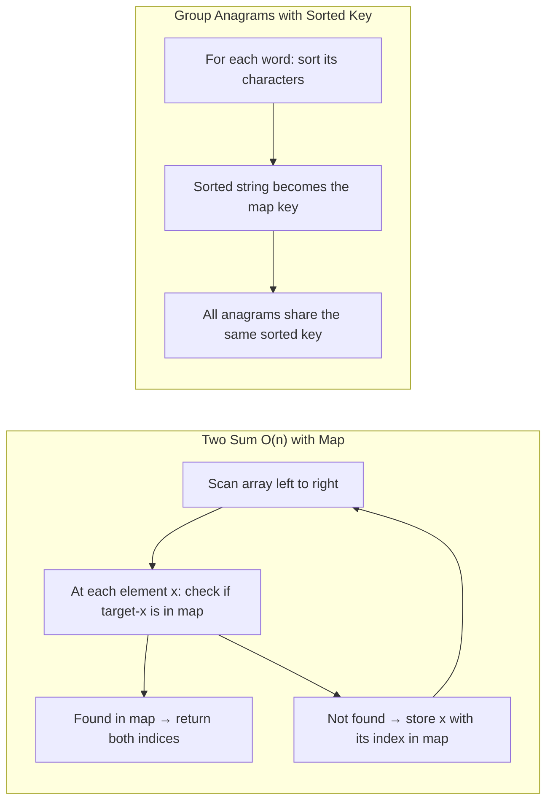

**Step-by-step logic:**
1. HashMap converts O(n) search to O(1) lookup — eliminates inner loops
2. For pair problems: store `what you have seen`, look up `what you need`
3. For grouping: derive a canonical key (sorted string, frequency array) that all group members share
4. For frequency counting: use `map.merge(key, 1, Integer::sum)`
5. **Trade-off**: O(n) extra space for O(1) lookup time

> **What is it?** Use a hash map (key → value) or hash set (unique values) to achieve O(1) average lookup, insertion, and deletion — eliminating the need for nested loops.

> **Real-world analogy:** A phone book. To find Alice's number with a phone book, you don't scan every name — you look up 'A' and go straight to Alice. Hash map = the phone book index.

**When to use — TRIGGER WORDS:**
```
✅ "Check if element exists" — use HashSet O(1) vs contains in list O(n)
✅ "Count frequency of elements" — Map<T, Integer>
✅ "Find pair/group with property" — store seen elements
✅ "Two Sum (unsorted)" — store complement
✅ "Group anagrams" — sorted string as key
✅ "Longest consecutive sequence" — HashSet for O(1) lookup
✅ "First non-repeating character" — LinkedHashMap preserves insertion order
```

**Templates:**
```java
// Two Sum — O(n) using hash map
public int[] twoSum(int[] nums, int target) {
    Map<Integer, Integer> seen = new HashMap<>(); // value → index
    for (int i = 0; i < nums.length; i++) {
        int complement = target - nums[i];
        if (seen.containsKey(complement))
            return new int[]{seen.get(complement), i};
        seen.put(nums[i], i);
    }
    return new int[]{};
}

// Group Anagrams — sort word as key
public List<List<String>> groupAnagrams(String[] strs) {
    Map<String, List<String>> map = new HashMap<>();
    for (String s : strs) {
        char[] chars = s.toCharArray();
        Arrays.sort(chars);
        String key = new String(chars);  // sorted string = canonical form
        map.computeIfAbsent(key, k -> new ArrayList<>()).add(s);
    }
    return new ArrayList<>(map.values());
}

// Longest Consecutive Sequence — O(n) with HashSet
public int longestConsecutive(int[] nums) {
    Set<Integer> set = new HashSet<>();
    for (int n : nums) set.add(n);
    int best = 0;
    for (int n : set) {
        if (!set.contains(n - 1)) {  // only start from sequence beginning
            int cur = n, streak = 1;
            while (set.contains(++cur)) streak++;
            best = Math.max(best, streak);
        }
    }
    return best;
}
// Time: O(n)  Space: O(n)
```

> 💡 **Tip:** When the problem asks for a pair/triplet satisfying a condition, your first thought should be: "Can I use a hash map to reduce from O(n²) to O(n)?" Almost always yes — store what you've seen, look up what you need.

### 🔧 How HashMap Works Internally (For Beginners)

```mermaid
flowchart TB
  subgraph InternalStructure["HashMap Internal Structure"]
    K["Key (e.g. \"Alice\")"]
    H["hashCode() mod capacity → bucket index"]
    B["Bucket Array [16 slots by default]"]
    C0["bucket[0]: empty"]
    C2["bucket[2]: Entry(Alice → 30)"]
    C7["bucket[7]: Entry(Bob → 25) → Entry(Charlie → 35) (collision)"]
    K --> H --> B
    B --> C0
    B --> C2
    B --> C7
  end
  subgraph Java8["Java 8+ Improvement"]
    J1["Chain length ≤ 8: Linked List  O(n) worst"]
    J2["Chain length > 8: Red-Black Tree  O(log n) worst"]
    J1 --> J2
  end
```

```
Step-by-step: map.put("Alice", 30)
  1. Java calls "Alice".hashCode()  → say 64,578,234
  2. bucket = 64,578,234 % 16 = bucket[2]
  3. Store Entry("Alice" → 30) in bucket[2]

Step-by-step: map.get("Alice")
  1. Java calls "Alice".hashCode()  → same 64,578,234
  2. bucket = 64,578,234 % 16 = bucket[2]
  3. Check bucket[2] for key "Alice"  → found! return 30
  Total: O(1) average

Two keys in same bucket = COLLISION
  - Java stores them as a chain (linked list)
  - Linear scan through chain to find right key
  - If > 8 keys in one bucket: chain upgrades to Red-Black Tree (O(log n))
```

### 🚫 Common Beginner Mistakes — HashMap

```java
// MISTAKE 1: Using == to compare keys (wrong for objects)
Map<String, Integer> map = new HashMap<>();
map.put("java", 1);
String key = "java";
if (key == "java") { ... }        // ❌ Reference comparison — may fail!
if (key.equals("java")) { ... }   // ✅ Content comparison — always correct
// Note: for String literals, == may work due to String pool, but DON'T rely on it

// MISTAKE 2: Using mutable objects as keys (breaks hashing)
List<Integer> mutableKey = new ArrayList<>(Arrays.asList(1, 2, 3));
map.put(mutableKey, "value");
mutableKey.add(4);  // ❌ Changes hashCode! Now you can never retrieve "value"
// ✅ Use immutable keys: String, Integer, Long, UUID, or your own immutable class

// MISTAKE 3: Checking containsKey + get separately (two lookups)
if (map.containsKey(key)) {
    int val = map.get(key);  // ❌ Two separate hash lookups
}
// ✅ One lookup with getOrDefault or computeIfAbsent
int val = map.getOrDefault(key, 0);
map.computeIfAbsent(key, k -> new ArrayList<>()).add(item);

// MISTAKE 4: ConcurrentModificationException when modifying during iteration
for (String k : map.keySet()) {
    if (shouldRemove(k)) map.remove(k);  // ❌ CME!
}
// ✅ Use iterator.remove() or collect keys first, then remove
map.entrySet().removeIf(e -> shouldRemove(e.getKey()));  // ✅ clean
```

---

## 🟡 LEVEL 2 — Intermediate Patterns

---

### Pattern 6 — Fast & Slow Pointers (Floyd's Cycle Detection)

> 🧠 **Beginner's First Question: How does fast catching slow prove a cycle?**
>
> **Intuition:** Imagine two runners on a track. If the track is a straight line (no cycle), the fast runner reaches the finish line and the slow runner never catches up. If the track is a loop (cycle), the fast runner will eventually lap the slow runner and they'll be at the same position. The gap between them decreases by 1 each step (fast gains 1 position per iteration relative to slow), so they MUST meet.
>
> **Why `fast = fast.next.next`?** Fast moves 2 steps per iteration. Relative to slow (1 step), fast gains 1 position each iteration. Inside a cycle of length C, they meet within C steps.

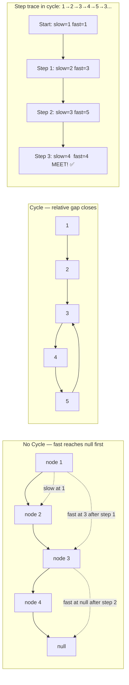

**Step-by-step logic:**
1. Both start at `head`
2. Each iteration: `slow = slow.next`, `fast = fast.next.next`
3. If `fast == null` or `fast.next == null` → no cycle (reached end)
4. If `slow == fast` → cycle detected
5. **Find middle**: when fast reaches null, slow is at the middle
6. **Find cycle start**: after meeting point, reset slow to head, move both 1 step — they meet at cycle start

> **What is it?** Two pointers that move at different speeds through a linked list or sequence — slow moves 1 step, fast moves 2 steps. If there's a cycle, fast catches slow. If no cycle, fast reaches the end.

> **Real-world analogy:** Two runners on a circular track. If the track loops, the faster runner will eventually lap and meet the slower one. If the track is straight, the faster runner finishes first without meeting.

**When to use — TRIGGER WORDS:**
```
✅ "Detect cycle in linked list"
✅ "Find middle of linked list"
✅ "Find start of cycle in linked list"
✅ "Happy number" (number theory cycle detection)
✅ "Palindrome linked list" (find middle, reverse second half)
```

```java
// Detect cycle
public boolean hasCycle(ListNode head) {
    ListNode slow = head, fast = head;
    while (fast != null && fast.next != null) {
        slow = slow.next;        // 1 step
        fast = fast.next.next;   // 2 steps
        if (slow == fast) return true;   // cycle detected!
    }
    return false;  // fast reached end — no cycle
}

// Find middle of linked list
public ListNode findMiddle(ListNode head) {
    ListNode slow = head, fast = head;
    while (fast != null && fast.next != null) {
        slow = slow.next;
        fast = fast.next.next;
    }
    return slow;  // slow is at middle when fast reaches end
}
// For even-length list [1,2,3,4]: slow stops at 3 (second middle)
// For odd-length  list [1,2,3]:   slow stops at 2 (exact middle)

// Find start of cycle (Floyd's algorithm phase 2)
public ListNode detectCycleStart(ListNode head) {
    ListNode slow = head, fast = head;
    // Phase 1: find meeting point
    while (fast != null && fast.next != null) {
        slow = slow.next;
        fast = fast.next.next;
        if (slow == fast) break;
    }
    if (fast == null || fast.next == null) return null;
    // Phase 2: move one pointer to head; both at 1 step — they meet at cycle start
    slow = head;
    while (slow != fast) {
        slow = slow.next;
        fast = fast.next;
    }
    return slow;  // start of cycle
}
```

```
Why Floyd's phase 2 works:
  Let: F = distance head → cycle start
       C = cycle length
       h = distance meeting point → cycle start

  At meeting point:
    slow traveled: F + h
    fast traveled: F + h + C  (fast did one full extra loop)
    fast = 2 × slow:  F + h + C = 2(F + h)  → C = F + h  → F = C - h

  So: reset slow to head. Move both 1 step.
  slow needs F steps to reach cycle start.
  fast needs (C - h) = F steps to reach cycle start (from meeting point).
  They meet exactly at the cycle start!
```

### 🚫 Common Beginner Mistakes — Fast & Slow

```java
// MISTAKE 1: Not checking fast.next before fast.next.next
while (fast != null && fast.next != null) {  // ✅ ALWAYS both checks
    slow = slow.next;
    fast = fast.next.next;   // if fast.next is null, fast.next.next throws NPE!
}
// Always: while (fast != null && fast.next != null)

// MISTAKE 2: Initialising fast and slow at different positions
ListNode slow = head;
ListNode fast = head.next;  // ❌ off by one — breaks the middle-finding math
// ✅ Both start at HEAD

// MISTAKE 3: For finding middle — misidentifying which node is "middle"
// For list [1,2,3,4]: slow stops at 3 (second of two middles)
// For list [1,2,3]:   slow stops at 2 (exact middle)
// Be clear in your answer which middle you need

// MISTAKE 4: Forgetting to handle empty list and single-node list
if (head == null || head.next == null) return false;  // ✅ edge cases first
```

---

### Pattern 7 — Stack & Monotonic Stack

> 🧠 **Beginner's First Question: What is a Stack and when does it help?**
>
> A **Stack** is like a pile of plates — you can only add or remove from the TOP. LIFO: Last In, First Out.
> - `push(x)` → put x on top
> - `pop()` → remove and return the top
> - `peek()` → look at the top without removing
>
> **Why is this useful?** Many problems have a "nested" or "matching" structure where the most recent thing matters most. Classic example: parentheses — when you see `)`, the only thing you care about is the most recent unmatched `(`. A stack gives O(1) access to the most recent item.
>
> **A Monotonic Stack** is a stack that's kept in sorted order (all increasing or all decreasing). When a new element violates the order, we pop until order is restored. This finds "next greater" or "next smaller" elements in O(n) total.

```mermaid
flowchart TB
  subgraph StackOps["Stack Operations — Plate Pile Analogy"]
    push1["push(5) → [5]"]
    push2["push(3) → [5,3]"]
    push3["push(8) → [5,3,8]"]
    pop1["pop() → returns 8  stack=[5,3]"]
    peek1["peek() → returns 3  stack=[5,3] unchanged"]
    push1 --> push2 --> push3 --> pop1 --> peek1
  end
  subgraph MonoStack["Monotonic Stack — Next Greater Element for [2,1,5,6,2,3]"]
    MS1["i=0 val=2: stack empty push index 0.  Stack=[0]"]
    MS2["i=1 val=1: 1 less than arr[0]=2 push index 1.  Stack=[0,1]"]
    MS3["i=2 val=5: 5 > arr[1]=1 pop 1 result[1]=5.  5 > arr[0]=2 pop 0 result[0]=5.  push 2.  Stack=[2]"]
    MS4["i=3 val=6: 6 > arr[2]=5 pop 2 result[2]=6.  push 3.  Stack=[3]"]
    MS5["i=4 val=2: 2 < arr[3]=6 push 4.  Stack=[3,4]"]
    MS6["i=5 val=3: 3 > arr[4]=2 pop 4 result[4]=3.  3 < arr[3]=6 push 5.  Stack=[3,5]"]
    MS7["End: stack [3,5] have no next greater → result=-1"]
    MS8["Result: [5, 5, 6, -1, 3, -1] ✅"]
    MS1 --> MS2 --> MS3 --> MS4 --> MS5 --> MS6 --> MS7 --> MS8
  end
```

**Step-by-step logic:**
1. Use a stack that stores **indices** (not values)
2. For each element at `i`: while stack top's value < current value → pop and record `result[popped] = nums[i]`
3. Push current index
4. After the loop, remaining indices in stack have no next greater element → `-1`
5. Each element is pushed and popped **at most once** → O(n) total

> **What is it?** A stack follows LIFO (Last-In, First-Out). A monotonic stack maintains elements in increasing or decreasing order — elements are popped when a "greater" or "smaller" element is found.

**When to use stack — TRIGGER WORDS:**
```
✅ "Valid parentheses / balanced brackets"
✅ "Next greater element / next smaller element"
✅ "Daily temperatures" (days until warmer)
✅ "Largest rectangle in histogram"
✅ "Evaluate expression"
✅ "Decode string" (nested brackets)


    MS5["i=4 val=2: 2 less than 6 → push 4. Stack: [3,4]"]
    MS6["i=5 val=3: 3 greater than 2 → pop 4, result-4=3. 3 less than 6 → push 5. Stack: [3,5]"]
    MS7["End: indices 3 and 5 still in stack → result=-1"]
    MS8["Final result: 5 5 6 -1 3 -1"]
    MS1 --> MS2 --> MS3 --> MS4 --> MS5 --> MS6 --> MS7 --> MS8
  end
```

**Step-by-step logic:**
1. Use a stack that stores **indices** (not values)
2. For each element at `i`: while stack top's value < current value → pop and record `result[popped] = nums[i]`
3. Push current index
4. After the loop, remaining indices in stack have no next greater element → `-1`
5. Each element is pushed and popped **at most once** → O(n) total

> **What is it?** A stack follows LIFO (Last-In, First-Out). A monotonic stack maintains elements in increasing or decreasing order — elements are popped when a "greater" or "smaller" element is found.

**When to use stack — TRIGGER WORDS:**
```
✅ "Valid parentheses / balanced brackets"
✅ "Next greater element / next smaller element"
✅ "Daily temperatures" (days until warmer)
✅ "Largest rectangle in histogram"
✅ "Evaluate expression"
✅ "Decode string" (nested brackets)
✅ Any problem with "previous/next larger/smaller element"
```

```java
// Valid Parentheses
public boolean isValid(String s) {
    Deque<Character> stack = new ArrayDeque<>();
    for (char c : s.toCharArray()) {
        if (c == '(' || c == '[' || c == '{') {
            stack.push(c);
        } else {
            if (stack.isEmpty()) return false;
            char top = stack.pop();
            if (c == ')' && top != '(') return false;
            if (c == ']' && top != '[') return false;
            if (c == '}' && top != '{') return false;
        }
    }
    return stack.isEmpty();
}

// Next Greater Element — Monotonic Stack O(n)
public int[] nextGreaterElement(int[] nums) {
    int n = nums.length;
    int[] result = new int[n];
    Arrays.fill(result, -1);
    Deque<Integer> stack = new ArrayDeque<>(); // stores INDICES of elements
    for (int i = 0; i < n; i++) {
        // Pop all elements SMALLER than current — current is their "next greater"
        while (!stack.isEmpty() && nums[stack.peek()] < nums[i]) {
            result[stack.pop()] = nums[i];
        }
        stack.push(i);  // push current index (no greater element found yet)
    }
    return result;
}
// Time: O(n) — each element pushed and popped at most once
```

```
Monotonic stack intuition for [2, 1, 5, 6, 2, 3]:

i=0: push 0 (val 2).  Stack: [0]
i=1: push 1 (val 1).  Stack: [0,1]  (1 < 2, keep both)
i=2: val=5 > 1 → pop 1, result[1]=5. val=5 > 2 → pop 0, result[0]=5. push 2.
     Stack: [2]
i=3: val=6 > 5 → pop 2, result[2]=6. push 3. Stack: [3]
i=4: val=2 < 6, push 4. Stack: [3,4]
i=5: val=3 > 2 → pop 4, result[4]=3. 3 < 6, push 5. Stack: [3,5]
End: remaining in stack have no next greater → result=-1
Result: [5, 5, 6, -1, 3, -1]
```

### 🚫 Common Beginner Mistakes — Stack

```java
// MISTAKE 1: Using java.util.Stack (legacy, synchronized, slow)
Stack<Integer> stack = new Stack<>();  // ❌ old, slow
// ✅ Use ArrayDeque as a stack — faster, modern
Deque<Integer> stack = new ArrayDeque<>();
stack.push(5);      // push to top
stack.pop();        // remove from top
stack.peek();       // look at top

// MISTAKE 2: Forgetting to check if stack is empty before pop/peek
result[stack.pop()] = nums[i];  // ❌ EmptyStackException if stack is empty!
// ✅ Always check: while (!stack.isEmpty() && ...)

// MISTAKE 3: Pushing values instead of indices in monotonic stack
// Many problems need to know WHERE the element was, not just its value
stack.push(nums[i]);  // ❌ lost the index — can't compute distances/widths
stack.push(i);        // ✅ push the index; retrieve value with nums[stack.peek()]

// MISTAKE 4: Wrong pop condition for decreasing vs increasing monotonic stack
// Increasing stack (next GREATER): pop when current > stack top
while (!stack.isEmpty() && nums[stack.peek()] < nums[i]) stack.pop();
// Decreasing stack (next SMALLER): pop when current < stack top
while (!stack.isEmpty() && nums[stack.peek()] > nums[i]) stack.pop();
```

---

### Pattern 8 — BFS (Breadth-First Search)

> 🧠 **Beginner's First Question: Why BFS for shortest path?**
>
> Imagine you're in a maze. DFS (depth-first) picks one direction and goes as far as possible before backtracking — it might explore a very long wrong path before finding the exit. BFS explores ALL paths simultaneously, level by level. It first checks all paths of length 1, then length 2, then length 3... So the FIRST time it reaches the exit, it's guaranteed to be the SHORTEST path.
>
> **Think of it like ripples in water**: drop a stone and ripples spread outward uniformly in all directions. BFS = the ripple pattern.

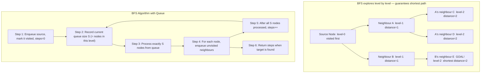


    L2b["level-2 D"]
    L2c["level-2 E  END"]
    L0 --> L1a
    L0 --> L1b
    L1a --> L2a
    L1a --> L2b
    L1b --> L2c
  end
  subgraph BFSAlgo["Algorithm"]
    A1["Enqueue start, mark visited, steps=0"]
    A2["For each level: process ALL nodes in queue"]
    A3["Enqueue unvisited neighbours, mark visited"]
    A4["steps++ after entire level is processed"]
    A5["Return steps when target found"]
    A1 --> A2 --> A3 --> A4 --> A2
    A3 --> A5
  end
```

**Step-by-step logic:**
1. Add start node to queue and mark visited
2. While queue not empty: record current queue `size` (= nodes in this level)
3. Process exactly `size` nodes, enqueue their unvisited neighbours
4. After processing the level, increment `steps`
5. BFS **guarantees shortest path** because nodes are visited in order of increasing distance

> **What is it?** Explore nodes level by level using a queue. All nodes at distance 1 are processed before distance 2, etc. Guarantees shortest path in unweighted graphs.

> **Real-world analogy:** Spreading a rumour. Everyone you tell directly (level 1) tells their friends (level 2) who tell their friends (level 3). The rumour spreads outward uniformly layer by layer.

**When to use — TRIGGER WORDS:**
```
✅ "Shortest path" in unweighted graph/grid
✅ "Level-order traversal" of a tree
✅ "Minimum number of steps/moves"
✅ "Nearest cell satisfying condition" in a matrix
✅ "Number of connected components" (can also use DFS/Union Find)
✅ "Word Ladder" (shortest transformation)
```

```java
// BFS Template — shortest path in grid
public int bfs(int[][] grid, int startR, int startC, int endR, int endC) {
    int rows = grid.length, cols = grid[0].length;
    boolean[][] visited = new boolean[rows][cols];
    Queue<int[]> queue = new LinkedList<>();
    queue.offer(new int[]{startR, startC});
    visited[startR][startC] = true;
    int steps = 0;
    int[][] dirs = {{0,1},{0,-1},{1,0},{-1,0}};  // 4 directions
    while (!queue.isEmpty()) {
        int size = queue.size();  // process level by level
        for (int i = 0; i < size; i++) {
            int[] cell = queue.poll();
            if (cell[0] == endR && cell[1] == endC) return steps;
            for (int[] d : dirs) {
                int nr = cell[0] + d[0], nc = cell[1] + d[1];
                if (nr >= 0 && nr < rows && nc >= 0 && nc < cols
                    && !visited[nr][nc] && grid[nr][nc] == 0) {
                    visited[nr][nc] = true;
                    queue.offer(new int[]{nr, nc});
                }
            }
        }
        steps++;
    }
    return -1;  // not reachable
}
// Time: O(rows × cols)  Space: O(rows × cols)
```

### 🚫 Common Beginner Mistakes — BFS

```java
// MISTAKE 1: Forgetting to mark visited BEFORE enqueue (causes re-visiting)
queue.offer(start);
// ❌ Wrong — another path might enqueue the same node before we process it
// ✅ Correct — mark when you ENQUEUE, not when you PROCESS
visited[r][c] = true;
queue.offer(new int[]{r, c});

// MISTAKE 2: Not processing level-by-level when you need step count
while (!queue.isEmpty()) {
    int[] cell = queue.poll();
    // ❌ Wrong — steps++ here increments for every node, not every level
    steps++;
}
// ✅ Correct — capture queue SIZE before processing to count full levels
while (!queue.isEmpty()) {
    int size = queue.size();   // all nodes at current level
    for (int i = 0; i < size; i++) {
        int[] cell = queue.poll();
        // ... enqueue neighbours
    }
    steps++;  // ✅ one increment per LEVEL, not per node
}

// MISTAKE 3: Using visited array wrong in multi-source BFS
// Multi-source BFS: enqueue ALL sources at the start
// (e.g., find distance from nearest 0 in a binary matrix)
for (int r = 0; r < rows; r++)
    for (int c = 0; c < cols; c++)
        if (grid[r][c] == 0) {
            queue.offer(new int[]{r, c});
            visited[r][c] = true;  // mark all sources visited
        }
```

---

### Pattern 9 — DFS (Depth-First Search)

> 🧠 **Beginner's First Question: BFS vs DFS — When to choose which?**
>
> | Question | Use |
> |----------|-----|
> | "Shortest path / minimum steps" | **BFS** — explores shortest paths first |
> | "Does a path EXIST?" | **DFS** — simpler, just explore and backtrack |
> | "All paths / connected components" | **DFS** — natural with recursion |
> | "Level-by-level processing" | **BFS** — natural with queue |
>
> **DFS goes DEEP first.** It's like navigating a maze by always turning left — you explore one full corridor to its end before trying the next one. It uses recursion (implicitly using the call stack) or an explicit stack.

```mermaid
flowchart TB
  subgraph DFSMaze["DFS in a Maze — Goes Deep Before Wide"]
    Start["Start at (0,0)"]
    D1["Go right → (0,1)"]
    D2["Go right → (0,2)  dead end"]
    D3["Backtrack → (0,1)"]
    D4["Go down → (1,1)  explore deeper"]
    D5["...continue..."]
    Start --> D1 --> D2 --> D3 --> D4 --> D5
  end
  subgraph DFSGrid["DFS on 2D Grid (Number of Islands)"]
    G1["Find unvisited land cell (grid=1)"]
    G2["Mark it as visited (grid=0 — sink it)"]
    G3["Recurse in 4 directions: up down left right"]
    G4["Each direction: if in bounds and grid=1 recurse"]
    G5["When all 4 directions exhausted: return to caller"]
    G6["Back in outer loop: increment island count"]
    G1 --> G2 --> G3 --> G4 --> G5 --> G6
  end
  subgraph DFSOrder["DFS Tree Traversal Orders"]
    O1["Preorder:  root first  then left  then right  — serialize tree"]
    O2["Inorder:   left first  then root  then right  — BST sorted output"]
    O3["Postorder: left first  then right  then root  — bottom-up: height/delete"]
    O1 --> O2 --> O3
  end
```

**Step-by-step logic:**
1. Mark current node/cell as visited **before** recursing (prevents infinite loop)
2. For each valid unvisited neighbour, recurse
3. When you return from recursion, you are "backtracking" — you can undo state if needed
4. **Preorder**: process root before children — good for copying/printing trees
5. **Postorder**: process children first — good for computing height, deleting trees, bottom-up DP on trees

> **What is it?** Explore as deep as possible before backtracking. Implemented recursively (call stack) or iteratively (explicit stack).

**When to use — TRIGGER WORDS:**
```
✅ "Path between two nodes"
✅ "All paths in a graph"
✅ "Topological sort" (DFS-based)
✅ "Connected components" (count islands)
✅ "Tree problems" (max depth, paths, diameter)
✅ "Detect cycle in directed graph"
✅ "Backtracking" (subsets, permutations)
```

```java
// DFS on a graph
public void dfs(int node, Map<Integer, List<Integer>> graph,
                boolean[] visited) {
    visited[node] = true;
    // process node here
    for (int neighbour : graph.getOrDefault(node, List.of())) {
        if (!visited[neighbour]) {
            dfs(neighbour, graph, visited);
        }
    }
}

// Number of Islands — DFS on 2D grid
public int numIslands(char[][] grid) {
    int count = 0;
    for (int r = 0; r < grid.length; r++) {
        for (int c = 0; c < grid[0].length; c++) {
            if (grid[r][c] == '1') {
                count++;
                dfsIsland(grid, r, c);  // sink the entire island
            }
        }
    }
    return count;
}
private void dfsIsland(char[][] grid, int r, int c) {
    if (r < 0 || r >= grid.length || c < 0 || c >= grid[0].length
        || grid[r][c] == '0') return;
    grid[r][c] = '0';  // mark visited by sinking
    dfsIsland(grid, r+1, c);
    dfsIsland(grid, r-1, c);
    dfsIsland(grid, r, c+1);
    dfsIsland(grid, r, c-1);
}
```

### 🚫 Common Beginner Mistakes — DFS

```java
// MISTAKE 1: Not marking visited BEFORE recursing → stack overflow / infinite loop
void dfs(char[][] grid, int r, int c) {
    // ❌ Wrong — not marking before recursive calls means neighbours will re-visit this cell
    if (r<0||r>=grid.length||c<0||c>=grid[0].length||grid[r][c]=='0') return;
    dfs(grid, r+1, c);  // neighbour recurses, sees this cell unvisited, infinite loop!
    grid[r][c] = '0';   // ← too late!
    
    // ✅ Correct — mark FIRST
    grid[r][c] = '0';   // mark visited before recursing
    dfs(grid, r+1, c);
    dfs(grid, r-1, c);
    dfs(grid, r, c+1);
    dfs(grid, r, c-1);
}

// MISTAKE 2: Stack overflow for large inputs — recursive DFS has O(n) stack depth
// For a 300×300 grid all-land, DFS would call 90,000 deep recursive calls
// ❌ May cause StackOverflowError on large inputs
// ✅ Convert to iterative DFS with an explicit stack for production code
Deque<int[]> stack = new ArrayDeque<>();
stack.push(new int[]{startR, startC});
while (!stack.isEmpty()) {
    int[] curr = stack.pop();
    // process and push neighbours
}

// MISTAKE 3: Using DFS when BFS is needed (they give DIFFERENT results!)
// DFS does NOT guarantee shortest path in unweighted graphs
// "Find shortest path from A to B" → MUST use BFS
// "Check if path exists from A to B" → either works, DFS is simpler
```

---

### Pattern 10 — Merge Intervals

> 🧠 **Beginner's First Question: Why sort before merging?**
>
> Without sorting, you'd need to compare every interval against every other — O(n²). After sorting by start time, you only need ONE pass: each interval can only overlap with the one right before it in the sorted order. The current interval either overlaps (extend last merged) or doesn't (start a new one).
>
> **Overlap condition:** `intervals[i].start <= lastMerged.end` — the new interval starts before the previous one ends.

```mermaid
flowchart TB
  subgraph Sort["Step 1 — Sort by start time  O(n log n)"]
    S1["Input (unsorted):  [15,18]  [1,3]  [8,10]  [2,6]"]
    S2["After sort:        [1,3]    [2,6]  [8,10]  [15,18]"]
    S1 --> S2
  end
  subgraph MergePass["Step 2 — Single pass merge  O(n)"]
    M1["Take [1,3]:   result = [[1,3]]"]
    M2["[2,6]: start=2 <= last.end=3  OVERLAP → extend: result = [[1,6]]"]
    M3["[8,10]: start=8 > last.end=6  NO overlap → add: result = [[1,6],[8,10]]"]
    M4["[15,18]: start=15 > last.end=10  NO overlap → add: result = [[1,6],[8,10],[15,18]]"]
    M1 --> M2 --> M3 --> M4
  end
  subgraph Visual["Overlap Visualised on Number Line"]
    V1["[1---3]"]
    V2["  [2-----6]   overlaps [1,3] → merge to [1,6]"]
    V3["         [8--10]  gap after 6 → new interval"]
    V4["               [15--18]  gap → new interval"]
    V1 --> V2 --> V3 --> V4
  end
```

**Step-by-step logic:**
1. Sort intervals by their `start` value
2. Initialize result with first interval
3. For each next interval: if `start <= result.last.end` → merge by extending end to `max(end, next.end)`
4. Otherwise: no overlap, append as new interval
5. **Meeting rooms**: sort by start; use min-heap of end times to track active rooms

> **What is it?** Sort intervals by start time, then merge overlapping ones by comparing the end of the current merged interval with the start of the next interval.

**When to use — TRIGGER WORDS:**
```
✅ "Merge overlapping intervals"
✅ "Insert interval into list"
✅ "Meeting rooms — can attend all?" (no overlaps needed)
✅ "Minimum meeting rooms required" (max overlapping at any time)
✅ "Employee free time"
```

```java
// Merge Intervals
public int[][] merge(int[][] intervals) {
    Arrays.sort(intervals, (a, b) -> a[0] - b[0]);  // sort by start
    List<int[]> merged = new ArrayList<>();
    for (int[] interval : intervals) {
        if (merged.isEmpty() || merged.get(merged.size()-1)[1] < interval[0]) {
            merged.add(interval);         // no overlap — add as new interval
        } else {
            // Overlap — extend the end of the last interval
            merged.get(merged.size()-1)[1] =
                Math.max(merged.get(merged.size()-1)[1], interval[1]);
        }
    }
    return merged.toArray(new int[0][]);
}
// Time: O(n log n) for sort  Space: O(n) for output

// Meeting Rooms II — minimum rooms needed (= max overlapping intervals at any time)
public int minMeetingRooms(int[][] intervals) {
    int n = intervals.length;
    int[] starts = new int[n], ends = new int[n];
    for (int i = 0; i < n; i++) { starts[i] = intervals[i][0]; ends[i] = intervals[i][1]; }
    Arrays.sort(starts); Arrays.sort(ends);
    int rooms = 0, endPtr = 0;
    for (int i = 0; i < n; i++) {
        if (starts[i] < ends[endPtr]) rooms++;  // new meeting starts before one ends
        else                          endPtr++;  // one meeting ended — reuse room
    }
    return rooms;
}
```

### 🚫 Common Beginner Mistakes — Merge Intervals

```java
// MISTAKE 1: Forgetting to sort first
// ❌ Without sorting, non-adjacent overlapping intervals won't be merged
// ✅ Always: Arrays.sort(intervals, (a, b) -> a[0] - b[0]);

// MISTAKE 2: Using strict < instead of <= for overlap check
// [1,3] and [3,5] — do they overlap? Start of 2nd == end of 1st
// It depends on definition (open vs closed intervals). Usually closed = overlap
if (last[1] < interval[0])    { add new }   // open: touching intervals are separate
if (last[1] < interval[0])    { add new }   // both valid — know which you need

// MISTAKE 3: Not using Math.max when extending the end
// [1,10] followed by [2,5] — if you just do last[1] = interval[1] you SHRINK it!
last[1] = interval[1];                      // ❌ may shrink: [1,10] → [1,5]
last[1] = Math.max(last[1], interval[1]);   // ✅ always extend or keep

// MISTAKE 4: Meeting Rooms II — confusing "minimum rooms" with "max simultaneous"
// They're the same thing! Max # of overlapping intervals at any point = min rooms.
// Trick: sort starts and ends separately; compare them with two pointers
```

---

### Pattern 11 — Backtracking

```mermaid
### Pattern 11 — Backtracking

> 🧠 **Beginner's First Question: What is "backtracking" exactly?**
>
> **Backtracking** = Brute-force search with smart pruning. You build a solution step by step, making one choice at a time. If at any point the current partial solution cannot possibly lead to a valid answer, you **undo** (backtrack) the last choice and try the next option.
>
> **The three-step rhythm** repeated at every level:
> 1. **CHOOSE** — pick the next option (add element to path)
> 2. **EXPLORE** — recurse deeper (make the next choice)
> 3. **UNCHOOSE** — undo the choice (remove element from path)
>
> **Analogy:** Password cracker. You try 'a' for position 1, then try all options for position 2... if 'aa' is wrong at position 2, you backtrack and try 'ab'. The key insight: once you know a branch is wrong, you skip the ENTIRE subtree under it.

```mermaid
flowchart TB
  subgraph SubsetsTree["All Subsets of [1,2,3] — Backtracking Decision Tree"]
    Root["Start: current=[]"]
    Root -->|"include 1"| A["[1]"]
    Root -->|"skip 1"| B["[ ]"]
    A -->|"include 2"| C["[1,2]"]
    A -->|"skip 2"| D["[1]"]
    C -->|"include 3"| E["[1,2,3] ✅ ADD"]
    C -->|"skip 3"| F["[1,2] ✅ ADD"]
    D -->|"include 3"| G["[1,3] ✅ ADD"]
    D -->|"skip 3"| H["[1] ✅ ADD"]
    B -->|"include 2"| I["[2]"]
    B -->|"skip 2"| J["[ ]"]
    I -->|"include 3"| K["[2,3] ✅ ADD"]
    I -->|"skip 3"| L["[2] ✅ ADD"]
    J -->|"include 3"| M["[3] ✅ ADD"]
    J -->|"skip 3"| N["[] ✅ ADD"]
  end
  subgraph Pruning["Pruning = Skip Invalid Branches Early"]
    P1["Combination Sum target=7  candidates=[2,3,6,7]"]
    P2["At some point current=[3,6]  sum=9 > 7"]
    P3["PRUNE: no need to add more — any addition makes sum even larger"]
    P4["Backtrack immediately — saves exploring whole subtree"]
    P1 --> P2 --> P3 --> P4
  end
```

**Step-by-step logic:**
1. **Choose**: add an element to the current path
2. **Explore**: recurse deeper with the updated path

3. **Unchoose**: remove the element (backtrack) — restore state for the next choice
4. **Pruning**: add `if (condition) break/continue` to skip branches that can never produce a valid answer
5. Every node in the tree represents a partial solution; leaf nodes are complete solutions

> **What is it?** Explore all possible solutions by building candidates incrementally and abandoning (backtrack) a candidate as soon as it cannot lead to a valid solution.

> **Real-world analogy:** Solving a maze. You try a path; if you hit a dead end, you backtrack to the last junction and try a different path. You explore all paths systematically.

**When to use — TRIGGER WORDS:**
```
✅ "All subsets / power set"
✅ "All permutations"
✅ "All combinations summing to target"
✅ "N-Queens, Sudoku solver"
✅ "Word search in grid"
✅ "Generate all valid parentheses"
```

**Template — The Universal Backtracking Framework:**
```java
public void backtrack(State state, List<Result> results) {
    if (isGoal(state)) {        // BASE CASE: found a valid solution
        results.add(new Result(state));
        return;
    }
    for (Choice choice : getChoices(state)) {
        if (isValid(state, choice)) {
            makeChoice(state, choice);     // CHOOSE
            backtrack(state, results);     // EXPLORE
            undoChoice(state, choice);     // UNCHOOSE (backtrack)
        }
    }
}

// Subsets — O(2^n)
public List<List<Integer>> subsets(int[] nums) {
    List<List<Integer>> result = new ArrayList<>();
    backtrack(nums, 0, new ArrayList<>(), result);
    return result;
}
private void backtrack(int[] nums, int start,
                       List<Integer> current, List<List<Integer>> result) {
    result.add(new ArrayList<>(current));  // every state is a valid subset
    for (int i = start; i < nums.length; i++) {
        current.add(nums[i]);               // CHOOSE
        backtrack(nums, i + 1, current, result);  // EXPLORE
        current.remove(current.size() - 1); // UNCHOOSE
    }
}

// Combination Sum — reuse elements allowed
public List<List<Integer>> combinationSum(int[] candidates, int target) {
    List<List<Integer>> result = new ArrayList<>();
    Arrays.sort(candidates);
    backtrack(candidates, 0, target, new ArrayList<>(), result);
    return result;
}
private void backtrack(int[] nums, int start, int remaining,
                       List<Integer> current, List<List<Integer>> result) {
    if (remaining == 0) { result.add(new ArrayList<>(current)); return; }
    for (int i = start; i < nums.length; i++) {
        if (nums[i] > remaining) break;  // pruning — no point continuing
        current.add(nums[i]);
        backtrack(nums, i, remaining - nums[i], current, result); // i not i+1 (reuse)
        current.remove(current.size() - 1);
    }
}
```

> 💡 **Tip:** Always add **pruning** to backtracking. Pruning = early `break` or `continue` that avoids exploring obviously invalid branches. In combination sum: `if (nums[i] > remaining) break`. This can reduce O(2^n) to much less in practice.

### 🚫 Common Beginner Mistakes — Backtracking

```java
// MISTAKE 1: Forgetting to UNDO the choice (not backtracking)
current.add(nums[i]);
backtrack(nums, i+1, current, result);
// ❌ Missing: current.remove(current.size()-1);
// Without undo, 'current' grows forever and all results are wrong!
// ✅ ALWAYS undo:
current.add(nums[i]);               // CHOOSE
backtrack(nums, i+1, current, result); // EXPLORE
current.remove(current.size()-1);   // UNCHOOSE ← absolutely required

// MISTAKE 2: Copying the list reference instead of its contents
result.add(current);  // ❌ All results point to the SAME list (which changes!)
result.add(new ArrayList<>(current));  // ✅ Snapshot the current state

// MISTAKE 3: Generating duplicate subsets/combinations (no dedup)
// For subsets of [1,1,2]: need to skip duplicate choices at the same level
Arrays.sort(nums);  // ✅ Sort first to group duplicates
for (int i = start; i < nums.length; i++) {
    if (i > start && nums[i] == nums[i-1]) continue;  // ✅ skip duplicate branch
    // ...
}

// MISTAKE 4: For permutations — reusing elements
// ❌ Using 'start' index (that's for combinations, not permutations)
// ✅ For permutations use a 'used' boolean array
boolean[] used = new boolean[nums.length];
for (int i = 0; i < nums.length; i++) {
    if (used[i]) continue;  // already in current path
    used[i] = true;
    current.add(nums[i]);
    backtrack(nums, current, used, result);
    current.remove(current.size()-1);
    used[i] = false;
}
```

---

## 🔴 LEVEL 3 — Advanced Patterns

---

### Pattern 12 — Dynamic Programming (DP)

> 🧠 **Beginner's First Question: What is DP and why not just use recursion?**
>
> **The Problem with Plain Recursion (Fibonacci example):**
> ```
> fib(5) calls fib(4) and fib(3)
> fib(4) calls fib(3) and fib(2)   ← fib(3) computed AGAIN!
> fib(3) calls fib(2) and fib(1)   ← fib(2) computed AGAIN!
> Total calls for fib(5): 15 calls. For fib(50): ~10¹⁰ calls!
> ```
>
> **DP = Recursion + Memory (Memoisation) or Building up (Tabulation):**
> ```
> Memoisation:   Store fib(3)=3 after computing it. Next time fib(3) is needed → O(1) lookup!
> Tabulation:    Build dp[0]=0, dp[1]=1, dp[2]=1, dp[3]=2... bottom-up. Never recompute.
> Both turn O(2^n) → O(n) for Fibonacci!
> ```
>
> **The 3 Must-Have Conditions for DP:**
> 1. **Optimal substructure**: optimal solution built from optimal sub-solutions
> 2. **Overlapping subproblems**: same subproblems are computed multiple times
> 3. **Recurrence relation**: `dp[i]` depends on smaller `dp[j]` values

```mermaid
flowchart TB
  subgraph WhyDP["Why DP: Fibonacci Naive vs Memoised"]
    F1["fib(5) naive: 15 function calls  O(2^n)"]
    F2["fib(5) with memo: 5 unique calls  O(n)"]
    F1 --> F2
  end
  subgraph CoinDP["Coin Change dp-table for coins 1-2-5 amount=6"]
    D0["dp[0]=0  base: 0 coins for amount 0"]
    D1["dp[1]=1  use coin 1"]
    D2["dp[2]=1  use coin 2"]
    D3["dp[3]=2  best: coin2+coin1  or  coin1+coin1+coin1"]
    D4["dp[4]=2  best: coin2+coin2"]
    D5["dp[5]=1  use coin 5"]
    D6["dp[6]=2  use coin5+coin1"]
    D0 --> D1 --> D2 --> D3 --> D4 --> D5 --> D6
  end

  subgraph Approaches["Top-down vs Bottom-up"]
    TD["Top-down memoisation: recurse from target, cache subproblems"]
    BU["Bottom-up tabulation: fill dp from base case upward"]
    TD -.same complexity.-> BU
  end
```

**Step-by-step logic:**
1. Define state: `dp[i]` = minimum coins to make amount `i`
2. Base case: `dp[0] = 0`
3. Transition: `dp[i] = min(dp[i], dp[i - coin] + 1)` for each coin ≤ i
4. Answer: `dp[amount]`
5. **Ask yourself**: what is the smallest subproblem? What does `dp[i]` represent? How do I build `dp[i]` from smaller values?

> **What is it?** Break a problem into overlapping subproblems. Solve each subproblem once, store the result, reuse it. Eliminates redundant computation in exponential-time recursive solutions.

> **Real-world analogy:** Fibonacci — computing F(10) the naive way recalculates F(5), F(4), F(3)... thousands of times. With DP (memoisation), each value is computed once and stored. It's like writing answers on a notepad instead of recalculating from scratch every time.

**How to identify a DP problem:**
```
1. Problem asks for OPTIMAL value (max/min/count)
2. Current choice affects future choices
3. Overlapping subproblems exist (same inputs recur)

If these 3 are true → DP. Otherwise try greedy/two pointers.

TRIGGER WORDS:
✅ "Minimum/Maximum number of ways/steps/coins"
✅ "Number of ways to..."
✅ "Longest increasing/common subsequence"
✅ "Can you reach the end?"
✅ "Partition into subsets with equal sum"
✅ "Edit distance between two strings"
```

**The 5 DP Patterns — Memorise These:**

#### DP Pattern 1: Fibonacci / 1D DP
```java
// Climbing stairs — O(n) time, O(1) space
public int climbStairs(int n) {
    if (n <= 2) return n;
    int prev2 = 1, prev1 = 2;
    for (int i = 3; i <= n; i++) {
        int curr = prev1 + prev2;
        prev2 = prev1;
        prev1 = curr;
    }
    return prev1;
}
// dp[i] = dp[i-1] + dp[i-2]  (1 step from i-1, or 2 steps from i-2)
```

#### DP Pattern 2: 0/1 Knapsack
```
Problem: N items, each with weight[i] and value[i].
         Knapsack capacity W. Maximise value without exceeding W.
         Each item can be included AT MOST once (0/1 choice).

State: dp[i][w] = max value using first i items with capacity w
Transition:
  Skip item i:  dp[i][w] = dp[i-1][w]
  Take item i:  dp[i][w] = dp[i-1][w - weight[i]] + value[i]
  Choose max:   dp[i][w] = max(skip, take)
```
```java
public int knapsack(int[] weights, int[] values, int W) {
    int n = weights.length;
    int[] dp = new int[W + 1];  // space-optimised: 1D array
    for (int i = 0; i < n; i++) {
        for (int w = W; w >= weights[i]; w--) {  // iterate BACKWARDS for 0/1
            dp[w] = Math.max(dp[w], dp[w - weights[i]] + values[i]);
        }
    }
    return dp[W];
}
// Time: O(n×W)  Space: O(W)
```

#### DP Pattern 3: Unbounded Knapsack
```java
// Coin Change — minimum coins (each coin can be used unlimited times)
public int coinChange(int[] coins, int amount) {
    int[] dp = new int[amount + 1];
    Arrays.fill(dp, amount + 1);  // initialise to "impossible" value
    dp[0] = 0;
    for (int i = 1; i <= amount; i++) {
        for (int coin : coins) {
            if (coin <= i) {
                dp[i] = Math.min(dp[i], dp[i - coin] + 1);
            }
        }
    }
    return dp[amount] > amount ? -1 : dp[amount];
}
// dp[i] = min coins to make amount i
// Transition: dp[i] = min(dp[i], dp[i - coin] + 1) for each coin
```

#### DP Pattern 4: LCS / 2D DP on Strings
```java
// Longest Common Subsequence
public int longestCommonSubsequence(String text1, String text2) {
    int m = text1.length(), n = text2.length();
    int[][] dp = new int[m + 1][n + 1];  // dp[i][j] = LCS of text1[0..i-1] and text2[0..j-1]
    for (int i = 1; i <= m; i++) {
        for (int j = 1; j <= n; j++) {
            if (text1.charAt(i-1) == text2.charAt(j-1))
                dp[i][j] = dp[i-1][j-1] + 1;   // chars match — extend LCS
            else
                dp[i][j] = Math.max(dp[i-1][j], dp[i][j-1]);  // take best without one char
        }
    }
    return dp[m][n];
}
```

#### DP Pattern 5: Interval DP
```java
// Longest Palindromic Subsequence
public int longestPalindromeSubseq(String s) {
    int n = s.length();
    int[][] dp = new int[n][n];
    for (int i = 0; i < n; i++) dp[i][i] = 1;  // single char is palindrome of length 1
    for (int len = 2; len <= n; len++) {
        for (int i = 0; i <= n - len; i++) {
            int j = i + len - 1;
            if (s.charAt(i) == s.charAt(j))
                dp[i][j] = dp[i+1][j-1] + 2;
            else
                dp[i][j] = Math.max(dp[i+1][j], dp[i][j-1]);
        }
    }
    return dp[0][n-1];
}
```

**DP Decision Tree:**
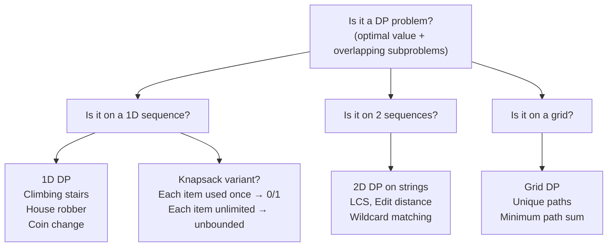

> 💡 **DP Tip:** Start with recursive solution (top-down). Add memoisation. Then convert to bottom-up iterative if needed. Always think: *"What is my subproblem? What state do I need? What is the transition?"*

**❓ Interview Q: "What is the difference between DP and recursion with memoisation?"**
> A: Memoisation is top-down DP — start from the original problem, recurse down, cache results. Bottom-up DP builds from base cases up to the answer, typically using a table. Both have the same time complexity. Bottom-up avoids recursion stack overflow for large inputs and is usually slightly faster (no function call overhead). Choose based on which direction is easier to think about — top-down is often more intuitive for tree/graph DP.

### 🚫 Common Beginner Mistakes — Dynamic Programming

```java
// MISTAKE 1: Not defining the state clearly
// ❌ Wrong: "dp[i] = answer"  — what does that even mean?
// ✅ Correct: explicitly name it:
// dp[i] = minimum number of coins to make amount i
// dp[i][j] = length of LCS of text1[0..i-1] and text2[0..j-1]

// MISTAKE 2: Wrong base case — the most common DP bug
int[] dp = new int[amount + 1];
// ❌ Wrong: dp[0] = 1  (for coin change minimum — should be 0 coins for amount 0)
// ✅ Correct: dp[0] = 0;  Arrays.fill(dp, amount + 1);  (amount+1 = "impossible" sentinel)

// MISTAKE 3: Wrong iteration order for 0/1 Knapsack (each item used AT MOST ONCE)
for (int i = 0; i < n; i++)
    for (int w = 0; w <= W; w++)    // ❌ Forward: allows item i to be reused!
        dp[w] = Math.max(dp[w], dp[w - weight[i]] + value[i]);
// ✅ 0/1 Knapsack: iterate BACKWARDS through capacity
for (int i = 0; i < n; i++)
    for (int w = W; w >= weight[i]; w--)  // ✅ Backward prevents reuse
        dp[w] = Math.max(dp[w], dp[w - weight[i]] + value[i]);

// MISTAKE 4: Forgetting to handle impossible states
int[] dp = new int[amount + 1];
Arrays.fill(dp, Integer.MAX_VALUE);  // all amounts start as "impossible"
dp[0] = 0;
// When building transition: check dp[i - coin] != Integer.MAX_VALUE before using it!
if (dp[i - coin] != Integer.MAX_VALUE)
    dp[i] = Math.min(dp[i], dp[i - coin] + 1);

// MISTAKE 5: 2D string DP — index off-by-one
// dp[i][j] represents text1[0..i-1] and text2[0..j-1]  (1-indexed subproblems)
// So access text1.charAt(i-1) and text2.charAt(j-1) inside the loop
// dp array is (m+1) x (n+1) to include the empty-string base cases
```

### 📋 DP — 5-Step Problem-Solving Framework

```
1. IDENTIFY: Is it asking for optimal (min/max/count) with overlapping subproblems?
2. STATE:    Define dp[i] or dp[i][j] in plain English. What does it represent?
3. BASE:     What are the simplest cases? (empty array, zero amount, single char)
4. TRANSITION: How does dp[i] depend on dp[i-1], dp[i-2], or dp[i-k]?
5. ANSWER:  Which cell contains the final answer? dp[n]? dp[m][n]? max(dp[])?

Example — House Robber:
  State:      dp[i] = max money robbing first i houses
  Base:       dp[0]=0, dp[1]=nums[0]
  Transition: dp[i] = max(dp[i-1], dp[i-2] + nums[i-1])  ← skip or rob house i
  Answer:     dp[n]
```

---

### Pattern 13 — Graphs (BFS/DFS/Topological Sort)

> 🧠 **Beginner's First Question: What is a Graph and how is it different from a Tree?**
>
> A **Tree** is a special graph with: exactly N-1 edges for N nodes, no cycles, one root, and every node reachable from root. A **Graph** is more general: any number of edges, may have cycles, may have disconnected components, no single root.
>
> **Graph vocabulary you must know:**
> - **Node/Vertex**: a point in the graph
> - **Edge**: a connection between two nodes (directed = one-way, undirected = two-way)
> - **In-degree**: number of edges pointing INTO a node
> - **Adjacent/Neighbour**: nodes directly connected by an edge
> - **Connected Component**: a group of nodes where every node can reach every other

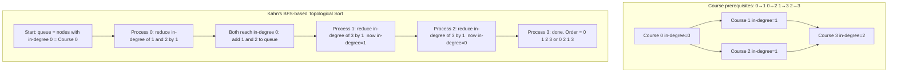

**Step-by-step logic:**
1. Compute in-degree for every node
2. Enqueue all nodes with in-degree = 0 (no prerequisites)
3. Poll a node, add to result, decrement each neighbour's in-degree
4. If a neighbour's in-degree becomes 0, enqueue it
5. If result size = total nodes: valid order exists; else: **cycle detected** (not all nodes were reachable)

**Graph representations:**
```java
// Adjacency list — most common
Map<Integer, List<Integer>> graph = new HashMap<>();
// or for dense graphs
List<List<Integer>> adj = new ArrayList<>();

// Build undirected graph from edge list
for (int[] edge : edges) {
    adj.get(edge[0]).add(edge[1]);
    adj.get(edge[1]).add(edge[0]);
}
```

**Topological Sort — When order matters:**
```
Used for: Course Schedule, Build Order, Task Dependency
"A must come before B" = directed edge A → B

Method 1: Kahn's Algorithm (BFS-based)
  1. Compute in-degree of every node
  2. Add all nodes with in-degree=0 to queue
  3. Process queue: add to result, decrement neighbours' in-degree
  4. If neighbour's in-degree becomes 0, add to queue
  5. If result size == num nodes: valid. Else: cycle exists.
```

```java
public int[] topologicalSort(int numCourses, int[][] prerequisites) {
    int[] inDegree = new int[numCourses];
    List<List<Integer>> adj = new ArrayList<>();
    for (int i = 0; i < numCourses; i++) adj.add(new ArrayList<>());
    for (int[] pre : prerequisites) {
        adj.get(pre[1]).add(pre[0]);
        inDegree[pre[0]]++;
    }
    Queue<Integer> queue = new LinkedList<>();
    for (int i = 0; i < numCourses; i++)
        if (inDegree[i] == 0) queue.offer(i);
    int[] order = new int[numCourses];
    int idx = 0;
    while (!queue.isEmpty()) {
        int course = queue.poll();
        order[idx++] = course;
        for (int next : adj.get(course)) {
            if (--inDegree[next] == 0) queue.offer(next);
        }
    }
    return idx == numCourses ? order : new int[]{};  // empty = cycle detected
}
```

**Dijkstra's Shortest Path:**
```java
public int[] dijkstra(int n, int[][] edges, int src) {
    List<int[]>[] graph = new List[n];
    for (int i = 0; i < n; i++) graph[i] = new ArrayList<>();
    for (int[] e : edges) {
        graph[e[0]].add(new int[]{e[1], e[2]});
        graph[e[1]].add(new int[]{e[0], e[2]});
    }
    int[] dist = new int[n];
    Arrays.fill(dist, Integer.MAX_VALUE);
    dist[src] = 0;
    PriorityQueue<int[]> pq = new PriorityQueue<>((a,b) -> a[1]-b[1]); // min-heap by distance
    pq.offer(new int[]{src, 0});
    while (!pq.isEmpty()) {
        int[] curr = pq.poll();
        int node = curr[0], d = curr[1];
        if (d > dist[node]) continue;  // stale entry
        for (int[] nb : graph[node]) {
            int newDist = dist[node] + nb[1];
            if (newDist < dist[nb[0]]) {
                dist[nb[0]] = newDist;
                pq.offer(new int[]{nb[0], newDist});
            }
        }
    }
    return dist;
}
// Time: O((V + E) log V)  Space: O(V + E)
```

---

### Pattern 14 — Heap / Priority Queue

> 🧠 **Beginner's First Question: What is a Heap and why not just sort?**
>
> **Problem:** Find the 3 largest numbers from a stream of 1 million numbers.
>
> **Sort approach — O(n log n):** Sort all 1 million numbers, take last 3. But you must see ALL numbers before sorting.
>
> **Heap approach — O(n log k):** Maintain a min-heap of exactly k=3 elements. For each new number: add it (O(log k)), and if heap size > k, remove the smallest (O(log k)). When done, the heap holds the k=3 largest numbers. For a stream, you don't need to store all numbers!
>
> **Why min-heap for k-LARGEST?** Because we need to kick out the smallest of the "k largest seen so far" whenever we add a new larger candidate. The min-heap gives us O(1) access to that smallest element.

```mermaid
flowchart TB
  subgraph HeapStructure["Min-Heap Internal Structure (Array-backed)"]
    H0["Index 0: 1 (ROOT = always minimum)"]
    H1["Index 1: 3  (left child of root)"]
    H2["Index 2: 5  (right child of root)"]
    H3["Index 3: 7  (left child of index 1)"]
    H4["Index 4: 9  (right child of index 1)"]
    H5["Index 5: 8  (left child of index 2)"]
    H0 --> H1
    H0 --> H2
    H1 --> H3
    H1 --> H4
    H2 --> H5
  end
  subgraph HeapRule["Heap Property"]
    R1["Min-heap: parent ALWAYS less-than-or-equal to children"]
    R2["Root is always the MINIMUM element  O(1) access"]
    R3["Add: insert at end, bubble UP  O(log n)"]
    R4["Remove root: swap root with last, remove last, bubble DOWN  O(log n)"]
    R1 --> R2 --> R3 --> R4
  end
  subgraph KthLargest["K-th Largest Trick with min-heap of size k"]
    L1["For each new number: add it to min-heap"]
    L2["If heap size > k: poll() to remove the minimum"]
    L3["The root (minimum of heap) = the k-th largest overall"]
    L4["Why? Heap holds the k largest seen. Smallest of those = k-th largest."]
    L1 --> L2 --> L3 --> L4
  end
```

**Step-by-step logic:**
1. Java `PriorityQueue` is a **min-heap** by default
2. `offer(x)` → O(log n) bubbles up to maintain heap property
3. `poll()` → O(log n) removes root (minimum), bubbles down
4. `peek()` → O(1) reads minimum without removing
5. **Kth largest**: maintain min-heap of exactly k elements — the root (minimum of heap) = kth largest overall

> **What is it?** A priority queue that always gives you the min (min-heap) or max (max-heap) element in O(log n). Perfect for "find the K-th largest/smallest" problems.

**When to use — TRIGGER WORDS:**
```
✅ "K largest / K smallest elements"
✅ "Kth largest element in a stream"
✅ "Top K frequent elements"
✅ "Merge K sorted lists/arrays"
✅ "Median from data stream"
✅ "Task scheduler"
✅ "Dijkstra / Prim's algorithm"
```

```java
// Kth Largest Element — min-heap of size k
public int findKthLargest(int[] nums, int k) {
    PriorityQueue<Integer> minHeap = new PriorityQueue<>();  // min-heap
    for (int num : nums) {
        minHeap.offer(num);
        if (minHeap.size() > k) minHeap.poll();  // keep only k largest
    }
    return minHeap.peek();  // kth largest = min of k largest
}
// Time: O(n log k)  Space: O(k)

// Top K Frequent Elements
public int[] topKFrequent(int[] nums, int k) {
    Map<Integer, Integer> freq = new HashMap<>();
    for (int n : nums) freq.merge(n, 1, Integer::sum);
    PriorityQueue<Integer> minHeap = new PriorityQueue<>((a,b) -> freq.get(a) - freq.get(b));
    for (int num : freq.keySet()) {
        minHeap.offer(num);
        if (minHeap.size() > k) minHeap.poll();
    }
    return minHeap.stream().mapToInt(Integer::intValue).toArray();
}

// Merge K Sorted Lists
public ListNode mergeKLists(ListNode[] lists) {
    PriorityQueue<ListNode> pq = new PriorityQueue<>((a,b) -> a.val - b.val);
    for (ListNode node : lists) if (node != null) pq.offer(node);
    ListNode dummy = new ListNode(0), curr = dummy;
    while (!pq.isEmpty()) {
        ListNode min = pq.poll();
        curr.next = min;
        curr = curr.next;
        if (min.next != null) pq.offer(min.next);
    }
    return dummy.next;
}
// Time: O(N log k) where N = total nodes, k = number of lists
```

### 🚫 Common Beginner Mistakes — Heap / Priority Queue

```java
// MISTAKE 1: Java's PriorityQueue is a MIN-heap by default
PriorityQueue<Integer> pq = new PriorityQueue<>();
pq.offer(5); pq.offer(1); pq.offer(3);
pq.poll();  // returns 1 (minimum) — NOT 5!

// For MAX-heap: use reversed comparator
PriorityQueue<Integer> maxHeap = new PriorityQueue<>(Collections.reverseOrder());
// or: new PriorityQueue<>((a, b) -> b - a);

// MISTAKE 2: Using poll() without checking isEmpty()
pq.poll();  // ❌ returns null (or throws NPE) if empty
if (!pq.isEmpty()) pq.poll();  // ✅ safe

// MISTAKE 3: Kth LARGEST → use MIN-heap; Kth SMALLEST → use MAX-heap
// Kth largest: keep k LARGEST in min-heap. Root = k-th largest.
// Kth smallest: keep k SMALLEST in max-heap. Root = k-th smallest.
PriorityQueue<Integer> forKthLargest  = new PriorityQueue<>();         // min-heap
PriorityQueue<Integer> forKthSmallest = new PriorityQueue<>((a,b)->b-a); // max-heap

// MISTAKE 4: Updating priority of an element already in heap
// Java's PriorityQueue does NOT support efficient decrease-key!
// If you need to update priority: remove old entry, add new entry
// Better: use lazy deletion — mark stale entries and skip them when polling
```

---

### Pattern 15 — Union Find (Disjoint Set)

> 🧠 **Beginner's First Question: What problem does Union Find solve?**
>
> Given a network of computers, quickly answer: "Are computer A and computer B in the same connected group?" And: "Connect computer A and computer B."
>
> **Why not just use BFS/DFS?** BFS/DFS checks connectivity in O(V+E) per query. With 1M queries that's very slow. Union Find answers each query in near **O(1)** after initial setup!
>
> **Two operations:**
> - `find(x)` — "Which group does x belong to?" Returns the root/representative of x's component
> - `union(x, y)` — "Merge x's group and y's group"
>
> **Path Compression** makes `find` faster by flattening the tree as you walk up. **Union by Rank** keeps the tree shallow by always attaching the smaller tree under the larger one.

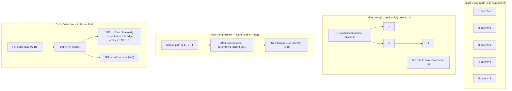

**Step-by-step logic:**
1. Initialise: `parent[i] = i` for all nodes
2. `find(x)`: follow parent pointers to root; apply path compression on the way back
3. `union(x, y)`: find roots; attach smaller-rank root under larger-rank root
4. If `find(x) == find(y)`: already same component — adding an edge = cycle
5. **Path compression + union by rank** → effectively O(1) per operation

> **What is it?** Tracks which elements belong to the same connected component. Two operations: `find` (which component?) and `union` (merge two components). Both run in near-O(1) with path compression + union by rank.

**When to use — TRIGGER WORDS:**
```

    CY1["Add edge between A and B"]
    CY2{"find(A) == find(B)?"}
    CY3["YES → adding this edge creates a cycle"]
    CY4["NO → safe to union them"]
    CY1 --> CY2 --> CY3
    CY2 --> CY4
  end
```

**Step-by-step logic:**
1. Initialise: `parent[i] = i` for all nodes
2. `find(x)`: follow parent pointers to root; apply path compression on the way back
3. `union(x, y)`: find roots; attach smaller-rank root under larger-rank root
4. If `find(x) == find(y)`: already same component — adding an edge = cycle
5. **Path compression + union by rank** → effectively O(1) per operation

> **What is it?** Tracks which elements belong to the same connected component. Two operations: `find` (which component?) and `union` (merge two components). Both run in near-O(1) with path compression + union by rank.

**When to use — TRIGGER WORDS:**
```
✅ "Connected components"
✅ "Detect cycle in undirected graph"
✅ "Number of provinces / friend circles"
✅ "Redundant connection"
✅ "Minimum spanning tree" (Kruskal's algorithm)
✅ "Accounts merge"
```

```java
class UnionFind {
    int[] parent, rank;

    UnionFind(int n) {
        parent = new int[n];
        rank   = new int[n];
        for (int i = 0; i < n; i++) parent[i] = i;  // each node is its own parent
    }

    public int find(int x) {
        if (parent[x] != x)
            parent[x] = find(parent[x]);  // path compression: flatten tree
        return parent[x];
    }

    public boolean union(int x, int y) {
        int px = find(x), py = find(y);
        if (px == py) return false;  // already connected — adding this edge creates cycle
        if (rank[px] < rank[py]) { int tmp = px; px = py; py = tmp; }
        parent[py] = px;  // union by rank: attach smaller tree under larger
        if (rank[px] == rank[py]) rank[px]++;
        return true;
    }

    public boolean connected(int x, int y) { return find(x) == find(y); }
}

// Redundant Connection — find the edge that creates a cycle
public int[] findRedundantConnection(int[][] edges) {
    UnionFind uf = new UnionFind(edges.length + 1);
    for (int[] edge : edges) {
        if (!uf.union(edge[0], edge[1])) return edge;  // union returns false = cycle!
    }
    return new int[]{};
}
```

### 🚫 Common Beginner Mistakes — Union Find

```java
// MISTAKE 1: Forgetting path compression → O(log n) degrades to O(n) per find
public int find(int x) {
    if (parent[x] != x) return find(parent[x]);  // ❌ no compression, deep trees
    return parent[x];
}
// ✅ With path compression — flatten the tree as you walk up
public int find(int x) {
    if (parent[x] != x) parent[x] = find(parent[x]);  // ← key line: compress!
    return parent[x];
}

// MISTAKE 2: Forgetting union by rank → tree stays balanced; without it, degrades
public void union(int x, int y) {
    parent[find(x)] = find(y);  // ❌ always attaches x under y, may create long chains
}
// ✅ Union by rank: attach smaller-rank tree under larger-rank tree
public boolean union(int x, int y) {
    int px = find(x), py = find(y);
    if (px == py) return false;  // already connected
    if (rank[px] < rank[py]) { int t = px; px = py; py = t; }
    parent[py] = px;
    if (rank[px] == rank[py]) rank[px]++;
    return true;
}

// MISTAKE 3: Using wrong initial size — nodes might be 1-indexed
// If nodes are labeled 1..n, allocate size n+1
UnionFind uf = new UnionFind(n + 1);  // ✅ handles 1-indexed nodes safely

// MISTAKE 4: Forgetting Union Find only works for UNDIRECTED graphs
// For directed graph cycle detection → use DFS with 3-color marking
// (WHITE=unvisited, GRAY=in-progress, BLACK=done)
```

---

### Pattern 16 — Trie (Prefix Tree)

### Pattern 16 — Trie (Prefix Tree)

> 🧠 **Beginner's First Question: Why Trie instead of HashSet for word search?**
>
> **HashSet approach:**
> - `contains("car")` → O(L) — fast for exact match
> - `startsWith("ca")` → O(?) — you'd have to check ALL words in the set, O(n×L)!
>
> **Trie approach:**
> - `search("car")` → O(L) — same speed
> - `startsWith("ca")` → O(L) — just walk the prefix path, no need to check all words!
>
> **The key insight:** A Trie shares common prefixes. "car" and "cat" both share the path `c→a`. Instead of storing two full strings, the Trie stores `c→a→r` and `c→a→t` — the `c→a` part is shared. This gives O(L) for ALL prefix operations.

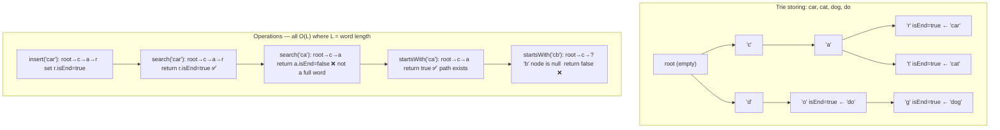

**Step-by-step logic:**
1. Each node has `children[26]` (26 letters) and `isEnd` boolean
2. **Insert** "car": root → c (create if missing) → a → r, set `r.isEnd = true`
3. **Insert** "cat": root → c (already exists) → a (already exists) → t (create), set `t.isEnd = true`
4. **Search** "car": follow c → a → r, return `r.isEnd` (true)
5. **startsWith** "ca": follow c → a, return `true` (path exists, don't check isEnd)

> **What is it?** A tree where each path from root to a node represents a string prefix. Children are indexed by character. Enables O(L) insert, search, and prefix-check where L = word length.

**When to use — TRIGGER WORDS:**
```
✅ "Autocomplete / search suggestions"
✅ "Word search — does prefix exist?"
✅ "Longest common prefix"
✅ "Design Add and Search Words with wildcards"
✅ "Word Search II in a grid"
✅ "Maximum XOR of two numbers"
```

```java
class Trie {
    private TrieNode root = new TrieNode();

    static class TrieNode {
        TrieNode[] children = new TrieNode[26];
        boolean isEnd = false;
    }

    public void insert(String word) {
        TrieNode node = root;
        for (char c : word.toCharArray()) {
            int idx = c - 'a';
            if (node.children[idx] == null)
                node.children[idx] = new TrieNode();
            node = node.children[idx];
        }
        node.isEnd = true;
    }

    public boolean search(String word) {
        TrieNode node = root;
        for (char c : word.toCharArray()) {
            int idx = c - 'a';
            if (node.children[idx] == null) return false;
            node = node.children[idx];
        }
        return node.isEnd;
    }

    public boolean startsWith(String prefix) {
        TrieNode node = root;
        for (char c : prefix.toCharArray()) {
            int idx = c - 'a';
            if (node.children[idx] == null) return false;
            node = node.children[idx];
        }
        return true;  // prefix exists whether or not it's a full word
    }
}
// insert/search/startsWith: O(L) time where L = word length
// Space: O(ALPHABET_SIZE x L x N) where N = number of words
```

### 🚫 Common Beginner Mistakes — Trie

```java
// MISTAKE 1: Off-by-one in character index
int idx = c - 'A';  // ❌ if words contain lowercase letters, use 'a'
int idx = c - 'a';  // ✅ for lowercase; c - 'A' for uppercase only

// MISTAKE 2: Using HashMap<Character, TrieNode> children — slower but more flexible
// For lowercase letters only → use TrieNode[] children = new TrieNode[26];  O(1) per char
// For full Unicode or mixed → use Map<Character, TrieNode> children; O(1) avg but more memory

// MISTAKE 3: Forgetting to check node for null during search/startsWith
public boolean search(String word) {
    TrieNode node = root;
    for (char c : word.toCharArray()) {
        int idx = c - 'a';
        if (node.children[idx] == null) return false;  // ✅ null check before going deeper
        node = node.children[idx];
    }
    return node.isEnd;  // ✅ must be marked as end of word, not just existing node
}

// MISTAKE 4: Confusing search() and startsWith()
// search("cat"):       must reach the 't' node AND that node must have isEnd=true
// startsWith("cat"):   only need to reach the 't' node — isEnd doesn't matter
// Example: if only "catch" is in trie, search("cat")=false but startsWith("cat")=true
```

---

## 🟣 LEVEL 4 — Expert Patterns

---

### Pattern 17 — Greedy Algorithms

> 🧠 **Beginner's First Question: What is the "greedy choice property" and how do you prove greedy works?**
>
> A greedy algorithm makes the **locally best choice** at each step without reconsidering past choices. It works ONLY when the "greedy choice property" holds: the locally best choice is always part of a globally optimal solution.
>
> **How to tell if greedy works — Exchange Argument:**
> Assume the optimal solution makes a different choice at some step. Show that swapping that choice with the greedy choice produces a solution that is at least as good. If the swap never hurts → greedy is correct.
>
> **Classic "greedy fails" example:** Coin change with `[1, 3, 4]`, amount=6
> - Greedy picks 4 first → `4+1+1=3 coins`
> - Optimal is `3+3=2 coins`  
> - Greedy fails because picking 4 (locally best) prevents the better 3+3 solution
> - **The fix:** Use DP instead when greedy choice property doesn't hold

> **What is it?** At each step make the locally best choice without reconsidering past choices. Greedy works when making the best local choice always leads to the globally best outcome.

> **Real-world analogy:** Choosing a checkout queue at a supermarket. You always join the shortest queue visible right now. You don't simulate all possible queue movements. This local-best strategy typically gets you through quickly.

**Greedy vs DP — how to decide:**

```mermaid
flowchart LR
  Q{"Does local best always lead to global best?"}
  Q -->|Yes| G["Greedy\nO(n log n) or O(n)"]
  Q -->|No| D["Dynamic Programming\nO(n^2) or O(nW)"]
  G --> GEx["Activity selection\nJump Game\nCoin change standard coins\nHuffman coding"]
  D --> DEx["0-1 Knapsack\nLongest Increasing Subsequence\nEdit distance\nCoin change arbitrary coins"]
```

**Classic Greedy Problems:**

```java
// GREEDY 1: Maximum non-overlapping intervals (Activity Selection)
// Key insight: always pick the activity that ENDS EARLIEST
public int maxActivities(int[][] intervals) {
    Arrays.sort(intervals, (a, b) -> a[1] - b[1]);  // sort by END time
    int count = 1, lastEnd = intervals[0][1];
    for (int i = 1; i < intervals.length; i++) {
        if (intervals[i][0] >= lastEnd) {   // starts after last one ends
            count++;
            lastEnd = intervals[i][1];
        }
    }
    return count;
}
// WHY GREEDY WORKS: Ending earliest leaves maximum room for future activities.
// Exchange argument: if any optimal solution picks activity A over greedy's B
// (where B ends earlier), swapping A→B never reduces future choices.

// GREEDY 2: Jump Game — can you reach the end?
public boolean canJump(int[] nums) {
    int maxReach = 0;
    for (int i = 0; i < nums.length; i++) {
        if (i > maxReach) return false;          // can't reach position i
        maxReach = Math.max(maxReach, i + nums[i]);
    }
    return true;
}
// Greedy: at each position, track the MAXIMUM index reachable so far.

// GREEDY 3: Jump Game II — minimum jumps to reach end
public int jump(int[] nums) {
    int jumps = 0, curEnd = 0, farthest = 0;
    for (int i = 0; i < nums.length - 1; i++) {
        farthest = Math.max(farthest, i + nums[i]);
        if (i == curEnd) {           // reached the boundary of current jump range
            jumps++;
            curEnd = farthest;       // extend to the farthest we could reach
        }
    }
    return jumps;
}

// GREEDY 4: Gas Station — find valid circular tour start
public int canCompleteCircuit(int[] gas, int[] cost) {
    int totalGas = 0, currentGas = 0, startStation = 0;
    for (int i = 0; i < gas.length; i++) {
        totalGas   += gas[i] - cost[i];
        currentGas += gas[i] - cost[i];
        if (currentGas < 0) {        // cannot reach next from startStation
            startStation = i + 1;    // try starting from next station
            currentGas = 0;
        }
    }
    return totalGas >= 0 ? startStation : -1;
}
```

**Step-by-step greedy logic:**

```mermaid
flowchart TB
  G1["Define the greedy choice: what is locally best at each step?"]
  G2["Sort if needed (greedy often requires a specific ordering)"]
  G3["Make greedy choice at each step without looking back"]
  G4["Prove correctness: exchange argument or induction"]
  G5["If proof fails → switch to Dynamic Programming"]
  G1 --> G2 --> G3 --> G4 --> G5
```

**❓ Interview Q: "When does greedy fail? Give an example."**
> **A:** Greedy fails when a locally optimal choice blocks a globally better one. Classic example: Coin change with coins `[1, 3, 4]`, amount = 6. Greedy picks `4+1+1 = 3 coins`. Optimal is `3+3 = 2 coins`. Greedy fails because choosing 4 (locally best) blocks the better 3+3 solution. This is why coin change requires DP for arbitrary coin denominations but greedy works for standard denominations (1, 5, 10, 25 cents).

### 🚫 Common Beginner Mistakes — Greedy

```java
// MISTAKE 1: Not sorting when order matters
// Activity selection: must sort by END time (not start time!)
Arrays.sort(intervals, (a, b) -> a[0] - b[0]);  // ❌ sort by start
Arrays.sort(intervals, (a, b) -> a[1] - b[1]);  // ✅ sort by end — locally best is earliest ending

// MISTAKE 2: Applying greedy to coin change with arbitrary denominations
// Greedy works for US coins [1,5,10,25] — NOT for arbitrary coins!
// int[] coins = {1, 3, 4}; amount = 6;
// ❌ Greedy: 4 + 1 + 1 = 3 coins
// ✅ DP:     3 + 3 = 2 coins
// Always verify greedy correctness with an exchange argument

// MISTAKE 3: Confusing greedy sort direction
// Maximum activities: sort by EARLIEST end (maximize room for future)
// Minimum waiting time: sort by SHORTEST job first
// Minimize max lateness: sort by EARLIEST deadline
// Wrong sort = wrong greedy = wrong answer!

// MISTAKE 4: Greedy on "minimum coins" without checking if greedy works
// For canonical coin systems (each denomination is multiple of smaller): greedy works
// For non-canonical (e.g., coins [1,3,4]): DP required
```

---

### Pattern 18 — Bit Manipulation

> 🧠 **Beginner's First Question: What are bits and why should I care?**
>
> Every integer in Java is stored as 32 binary digits (bits). Each bit is 0 or 1.
> ```
> 13 in binary:  0000 0000 0000 0000 0000 0000 0000 1101
>                                                     ↑ bit 0 (value 1)
>                                                    ↑ bit 1 (value 0)  
>                                                   ↑ bit 2 (value 1)
>                                                  ↑ bit 3 (value 1)
> Value: 8 + 4 + 0 + 1 = 13
> ```
>
> **Why use bit manipulation?**
> - Single number problem: O(n) time, **O(1) space** using XOR (vs O(n) space HashSet)
> - Check if power of 2: **one line** with `n & (n-1) == 0` (vs counting bits in a loop)
> - Bitmask DP: represent a SET of elements as a single integer (e.g., visited=0b1011 means nodes 0,1,3 visited)

> **What is it?** Operate on individual bits using `&`, `|`, `^`, `~`, `<<`, `>>`. Gives O(1) or O(n) solutions for problems that would otherwise need more time or space.

**Core Bit Operations — Visualised:**

```
OPERATION   SYMBOL   EXAMPLE (a=6=110, b=3=011)   RESULT    USE CASE
AND           &       110 & 011 = 010 = 2            2        Check/clear specific bits
OR            |       110 | 011 = 111 = 7            7        Set specific bits
XOR           ^       110 ^ 011 = 101 = 5            5        Toggle bits; pairs cancel
NOT           ~       ~6 = -7  (flips all bits)      -7       Invert all bits
LEFT SHIFT   <<       6 << 1 = 12  (multiply by 2)  12        Fast multiplication
RIGHT SHIFT  >>       6 >> 1 = 3   (divide by 2)     3        Fast division

KEY TRICKS:
  x & 1      → 1 if odd, 0 if even
  x >> 1     → integer divide by 2
  x & (x-1)  → REMOVES the lowest set bit (one 1-bit disappears)
  x & (-x)   → ISOLATES the lowest set bit
  x ^ x = 0  → XOR same values cancel out
  x ^ 0 = x  → XOR with 0 leaves value unchanged
```

x & 1           → 1 if x is odd, 0 if even
x >> 1          → integer divide by 2
x << 1          → multiply by 2
x & (x-1)       → REMOVE the lowest set bit (magic trick!)
x & (-x)        → ISOLATE the lowest set bit
x ^ x = 0       → XOR same numbers cancel
x ^ 0 = x       → XOR with 0 leaves unchanged
```

```mermaid
flowchart LR
  subgraph BitTricks["Core Bit Tricks"]
    B1["x AND 1: check odd or even"]
    B2["x AND x-1: remove lowest set bit"]
    B3["x XOR x = 0: pairs cancel each other"]
    B4["x XOR 0 = x: lone value survives XOR"]
    B1 --> B2 --> B3 --> B4
  end
  subgraph UseCases["When to use bit manipulation"]
    U1["Find single non-duplicate in pairs: XOR all elements"]
    U2["Count set bits: loop n = n AND n-1 until zero"]
    U3["Check power of 2: n > 0 AND n AND n-1 equals zero"]
    U4["Missing number: XOR all indices with all values"]
    U1 --> U2 --> U3 --> U4
  end
```

```java
// PROBLEM 1: Single Number — one appears once, rest appear twice
public int singleNumber(int[] nums) {
    int result = 0;
    for (int n : nums) result ^= n;  // XOR: pairs cancel (a^a=0), lone value survives
    return result;
}
// [4,1,2,1,2] → 4^1^2^1^2 = 4^(1^1)^(2^2) = 4^0^0 = 4 ✅
// Time: O(n)  Space: O(1)

// PROBLEM 2: Count set bits (Hamming weight)
public int hammingWeight(int n) {
    int count = 0;
    while (n != 0) {
        n = n & (n - 1);  // remove the lowest set bit each iteration
        count++;
    }
    return count;
}
// 12 = 1100: 12&11=1000 (count=1), 8&7=0000 (count=2). Two 1-bits.

// PROBLEM 3: Power of Two
public boolean isPowerOfTwo(int n) {
    return n > 0 && (n & (n - 1)) == 0;  // power of 2 has exactly one set bit
}

// PROBLEM 4: Missing Number in [0..n]
public int missingNumber(int[] nums) {
    int xor = nums.length;
    for (int i = 0; i < nums.length; i++) {
        xor ^= i ^ nums[i];  // XOR all indices [0..n-1] and all array values
    }
    return xor;  // paired values cancel; missing number survives
}

// PROBLEM 5: Counting bits for all numbers 0..n — O(n) with DP + bit trick
public int[] countBits(int n) {
    int[] dp = new int[n + 1];
    for (int i = 1; i <= n; i++) {
        dp[i] = dp[i >> 1] + (i & 1);  // i>>1 = i/2, (i&1) = last bit
    }
    return dp;
}
```

**Bit Manipulation Cheat Sheet:**

| Operation | Code | Use Case |
|-----------|------|----------|
| Check bit `i` | `(n >> i) & 1` | Is bit i set? |
| Set bit `i` | `n \| (1 << i)` | Turn bit i on |
| Clear bit `i` | `n & ~(1 << i)` | Turn bit i off |
| Toggle bit `i` | `n ^ (1 << i)` | Flip bit i |
| Remove lowest set bit | `n & (n-1)` | Count set bits loop |
| Isolate lowest set bit | `n & (-n)` | Find rightmost 1 |
| Is power of 2 | `n > 0 && (n & (n-1)) == 0` | Exactly one set bit |

**❓ Interview Q: "Why is XOR useful for finding a single non-duplicate?"**
> **A:** XOR has two key properties: `a ^ a = 0` (same values cancel) and `a ^ 0 = a` (zero is the identity). When you XOR all elements, every element that appears twice produces a `0`. The one element that appears only once is XORed with `0` and survives, because `0 ^ x = x`. This gives O(n) time and O(1) space — far better than sorting (O(n log n)) or using a hash set (O(n) space).

### 🚫 Common Beginner Mistakes — Bit Manipulation

```java
// MISTAKE 1: Integer overflow with left shift
int n = 1 << 31;  // ❌ overflows signed int (int is 32 bits, bit 31 is sign bit)
long n = 1L << 31;  // ✅ use long for large shifts

// MISTAKE 2: Using / 2 instead of >> 1 for negative numbers
int x = -6;
x >> 1;   // = -3  ✅ arithmetic right shift (fills with sign bit)
x / 2;    // = -3  ✅ same for negative, but >> is slightly faster

// MISTAKE 3: Confusing ~ (bitwise NOT) with ! (logical NOT)
int n = 5;
~n;   // = -6  (flips all 32 bits: ~00000101 = 11111010 = -6 in two's complement)
!n;   // ❌ compile error — ! is for booleans only

// MISTAKE 4: Precedence — & has LOWER precedence than ==
if (n & 1 == 0) { ... }   // ❌ parsed as n & (1 == 0) = n & false = wrong!
if ((n & 1) == 0) { ... } // ✅ always use parentheses with bitwise operators

// MISTAKE 5: n & (n-1) trick — only removes ONE bit, not all bits
// To count all set bits: loop while n != 0
int count = 0;
while (n != 0) { n &= (n - 1); count++; }  // ✅ removes one bit per iteration
```

---

### Pattern 19 — Binary Tree Deep Dive

> 🧠 **Beginner's First Question: Why do most tree problems use recursion?**
>
> A tree is a **recursively defined structure**: a node + its left subtree (which is also a tree) + its right subtree (which is also a tree). This means the solution for a tree is naturally built from solutions for its subtrees. That's recursion!
>
> **The magic template for almost ALL tree problems:**
> ```java
> ReturnType solve(TreeNode root) {
>     if (root == null) return BASE_CASE;        // empty tree
>     ReturnType leftResult  = solve(root.left); // solve left subtree
>     ReturnType rightResult = solve(root.right);// solve right subtree
>     return COMBINE(leftResult, root.val, rightResult); // combine
> }
> ```
>
> **What changes between problems:** Only the base case and how you combine. Max depth: `1 + max(left, right)`. Path sum: check if `root.val == targetSum` at leaves. LCA: check if both p and q found on different sides.

> **What is it?** Most binary tree problems are solved by DFS with the right traversal order and the right return value. Each recursive call returns information "upward" that its parent uses.

**The Five Tree Traversals:**

```mermaid
flowchart TB
  subgraph ExampleTree["Example Tree"]
    T4["4 root"]
    T4 --> T2["2"]
    T4 --> T6["6"]
    T2 --> T1["1"]
    T2 --> T3["3"]
    T6 --> T5["5"]
    T6 --> T7["7"]
  end
  subgraph Orders["Traversal results"]
    PR["Preorder root-left-right: 4 2 1 3 6 5 7"]
    IN["Inorder left-root-right: 1 2 3 4 5 6 7  sorted for BST!"]
    PO["Postorder left-right-root: 1 3 2 5 7 6 4"]
    LO["Level-order BFS: 4 then 2-6 then 1-3-5-7"]
    PR --> IN --> PO --> LO
  end
```

**When to use which traversal:**

| Traversal | Use When |
|-----------|----------|
| **Preorder** | Serialize tree, clone tree, print paths top-down |
| **Inorder** | BST sorted order, validate BST, find kth smallest |
| **Postorder** | Compute height from leaves up, delete tree, bottom-up DP |
| **Level-order (BFS)** | Level-by-level results, minimum depth, zigzag traversal |

```java
// Maximum depth — classic postorder
public int maxDepth(TreeNode root) {
    if (root == null) return 0;
    return 1 + Math.max(maxDepth(root.left), maxDepth(root.right));
}

// Diameter of Binary Tree (longest path — may not pass through root)
private int maxDiameter = 0;
public int diameterOfBinaryTree(TreeNode root) {
    computeHeight(root);
    return maxDiameter;
}
private int computeHeight(TreeNode node) {
    if (node == null) return 0;
    int left  = computeHeight(node.left);
    int right = computeHeight(node.right);
    maxDiameter = Math.max(maxDiameter, left + right);  // path through this node
    return 1 + Math.max(left, right);                   // height returned upward
}

// Lowest Common Ancestor (LCA) — most important tree problem
public TreeNode lowestCommonAncestor(TreeNode root, TreeNode p, TreeNode q) {
    if (root == null || root == p || root == q) return root;
    TreeNode left  = lowestCommonAncestor(root.left, p, q);
    TreeNode right = lowestCommonAncestor(root.right, p, q);
    if (left != null && right != null) return root;  // p and q on different sides
    return left != null ? left : right;              // both on same side
}

// Validate Binary Search Tree — pass min/max bounds downward
public boolean isValidBST(TreeNode root) {
    return validate(root, Long.MIN_VALUE, Long.MAX_VALUE);
}
private boolean validate(TreeNode node, long min, long max) {
    if (node == null) return true;
    if (node.val <= min || node.val >= max) return false;
    return validate(node.left,  min, node.val) &&
           validate(node.right, node.val, max);
}

// Binary Tree Maximum Path Sum — hard but common in interviews
private int maxPathSum = Integer.MIN_VALUE;
public int maxPathSum(TreeNode root) {
    gainFromNode(root);
    return maxPathSum;
}
private int gainFromNode(TreeNode node) {
    if (node == null) return 0;
    int leftGain  = Math.max(gainFromNode(node.left),  0);  // ignore negative subtrees
    int rightGain = Math.max(gainFromNode(node.right), 0);
    maxPathSum = Math.max(maxPathSum, node.val + leftGain + rightGain);
    return node.val + Math.max(leftGain, rightGain);  // return max single-branch
}
```

**Tree Problem Pattern Decision Guide:**

```mermaid
flowchart TB
  Q{"What are you computing?"}
  Q --> H["Height or depth from leaves up\n→ Postorder DFS"]
  Q --> P["Path sum from root down\n→ Preorder DFS accumulate"]
  Q --> L["Level-by-level result\n→ BFS with queue"]
  Q --> S["Sorted order or BST property\n→ Inorder DFS"]
  Q --> A["LCA or path between two nodes\n→ Postorder with upward return"]
  Q --> SER["Serialize or reconstruct\n→ Preorder with null markers"]
```

**❓ Interview Q: "Why is inorder traversal special for a BST?"**
> **A:** In a BST, for every node, all left-subtree values are smaller and all right-subtree values are larger. Inorder traversal visits `left (smaller) → root → right (larger)`, which produces elements in **sorted ascending order**. This means: (1) the kth smallest element is the kth element in inorder, (2) to validate a BST you can check inorder produces a strictly increasing sequence, (3) BST problems often use inorder implicitly.

### 🚫 Common Beginner Mistakes — Binary Tree

```java
// MISTAKE 1: Returning without checking null first (NullPointerException)
public int maxDepth(TreeNode root) {
    return 1 + Math.max(maxDepth(root.left), maxDepth(root.right)); // ❌ NPE when root==null
}
// ✅ Always handle null base case first
public int maxDepth(TreeNode root) {
    if (root == null) return 0;
    return 1 + Math.max(maxDepth(root.left), maxDepth(root.right));
}

// MISTAKE 2: Wrong traversal order for the problem
// Computing height (postorder): need children heights BEFORE computing parent
// ❌ Preorder (computes root before children — wrong for height)
public int height(TreeNode root) {
    if (root == null) return 0;
    int h = 1 + Math.max(height(root.left), height(root.right));  // ✅ postorder
    return h;
}

// MISTAKE 3: Using a global variable carelessly in tree DFS
private int max = 0;  // ❌ not reset between test calls in coding interview!
// ✅ Either pass it as a parameter, or reset in the public method
// Better: use int[] max = new int[1]; (single-element array acts as mutable reference)

// MISTAKE 4: For BST validation — using inorder check instead of passing bounds
// ❌ Checking inorder is sorted works but is two-pass (extra space)
// ✅ Pass (min, max) bounds down: validate(node, Long.MIN_VALUE, Long.MAX_VALUE)
private boolean validate(TreeNode node, long min, long max) {
    if (node == null) return true;
    if (node.val <= min || node.val >= max) return false;
    return validate(node.left, min, node.val) &&
           validate(node.right, node.val, max);
}
```

---

### Pattern 20 — Linked List Techniques

> 🧠 **Beginner's First Question: Why is linked list manipulation so tricky?**
>
> Unlike arrays where you can index directly (`arr[i]`), linked lists only expose `head` — the first node. To reach any node you must follow `next` pointers. This means:
> 1. You can easily **lose access** to nodes if you overwrite pointers in the wrong order
> 2. You must be careful about **null** (end of list) at every step
> 3. The **dummy head** trick eliminates special-casing the head node
>
> **The Golden Rule of Linked List Pointer Manipulation:**
> > **Always save `next` before overwriting it!**
> ```java
> ListNode next = curr.next;  // SAVE first
> curr.next = prev;           // NOW overwrite
> prev = curr;                // advance
> curr = next;                // advance with saved value
> ```

> **What is it?** Linked list manipulation is almost always about pointer tricks in-place. The three essential techniques: the **dummy head node**, **fast and slow pointers**, and **in-place reversal**.

**The Dummy Head Node — always use it:**
```
Without dummy: special case for inserting/removing at head
With dummy:    dummy.next = head; treat head like any other node; return dummy.next

Rule: ListNode dummy = new ListNode(0); dummy.next = head;
```

**In-place Reversal Step-by-Step:**

```mermaid
flowchart TB
  subgraph Reverse["Reverse 1 to 2 to 3 to null"]
    R1["prev=null  curr=1  save next=2"]
    R2["set curr.next=null  prev=1  curr=2  save next=3"]
    R3["set curr.next=1  prev=2  curr=3  save next=null"]
    R4["set curr.next=2  prev=3  curr=null  DONE"]
    R5["return prev which is 3  new head: 3 to 2 to 1"]
    R1 --> R2 --> R3 --> R4 --> R5
  end
```

```java
// Reverse Linked List — iterative
public ListNode reverseList(ListNode head) {
    ListNode prev = null, curr = head;
    while (curr != null) {
        ListNode next = curr.next;  // save next before overwriting
        curr.next = prev;           // reverse the link
        prev = curr;                // advance prev
        curr = next;                // advance curr
    }
    return prev;  // prev is the new head
}

// Palindrome Linked List — O(n) time, O(1) space
public boolean isPalindrome(ListNode head) {
    ListNode slow = head, fast = head;
    // Step 1: find middle using fast/slow
    while (fast != null && fast.next != null) {
        slow = slow.next;
        fast = fast.next.next;
    }
    // Step 2: reverse second half
    ListNode reversed = reverseList(slow);
    // Step 3: compare first half with reversed second half
    ListNode left = head, right = reversed;
    while (right != null) {
        if (left.val != right.val) return false;
        left = left.next;
        right = right.next;
    }
    return true;
}

// Remove Nth Node From End — single pass with two pointers
public ListNode removeNthFromEnd(ListNode head, int n) {
    ListNode dummy = new ListNode(0);
    dummy.next = head;
    ListNode fast = dummy, slow = dummy;
    // Advance fast n+1 steps ahead
    for (int i = 0; i <= n; i++) fast = fast.next;
    while (fast != null) { slow = slow.next; fast = fast.next; }
    slow.next = slow.next.next;  // skip (remove) the nth-from-end node
    return dummy.next;
}
// When fast=null, slow is exactly at the node BEFORE the target → perfect

// Merge Two Sorted Lists
public ListNode mergeTwoLists(ListNode l1, ListNode l2) {
    ListNode dummy = new ListNode(0), curr = dummy;
    while (l1 != null && l2 != null) {
        if (l1.val <= l2.val) { curr.next = l1; l1 = l1.next; }
        else                  { curr.next = l2; l2 = l2.next; }
        curr = curr.next;
    }
    curr.next = (l1 != null) ? l1 : l2;
    return dummy.next;
}

// Add Two Numbers (digits in reverse in linked list)
public ListNode addTwoNumbers(ListNode l1, ListNode l2) {
    ListNode dummy = new ListNode(0), curr = dummy;
    int carry = 0;
    while (l1 != null || l2 != null || carry != 0) {
        int sum = carry;
        if (l1 != null) { sum += l1.val; l1 = l1.next; }
        if (l2 != null) { sum += l2.val; l2 = l2.next; }
        carry = sum / 10;
        curr.next = new ListNode(sum % 10);
        curr = curr.next;
    }
    return dummy.next;
}
```

**Linked List Tricks Quick Reference:**

| Problem | Technique | Key Insight |
|---------|-----------|-------------|
| Find middle | Fast/slow pointers | Slow is at mid when fast reaches end |
| Detect cycle | Fast/slow; if `fast==slow` | Floyd's cycle detection |
| Find cycle start | Floyd phase 2 | Reset slow to head; both meet at start |
| Reverse in-place | `prev/curr/next` pattern | Save next before overwriting |
| Nth from end | Two pointers gap=n+1 | When fast=null, slow is before target |
| Palindrome | Find mid + reverse + compare | In-place O(1) space trick |
| Merge sorted | Dummy head + compare | Simplifies head edge case |

**❓ Interview Q: "How do you detect the intersection of two linked lists in O(n) time and O(1) space?"**
> **A:** Create two pointers `pA = headA` and `pB = headB`. Advance both. When `pA` reaches null, redirect it to `headB`. When `pB` reaches null, redirect it to `headA`. They meet at the intersection after both traverse the same total distance `(a + b - common)` steps. If no intersection, both reach null simultaneously. Time O(a+b), Space O(1) — no hash set needed.

### 🚫 Common Beginner Mistakes — Linked List

```java
// MISTAKE 1: Losing a node by overwriting next before saving it
curr.next = prev;   // ❌ now curr.next is gone — can never reach rest of list!
// ✅ ALWAYS save next first
ListNode next = curr.next;  // SAVE
curr.next = prev;           // then overwrite
prev = curr;
curr = next;

// MISTAKE 2: Returning head instead of dummy.next
ListNode dummy = new ListNode(0);
dummy.next = head;
// ... modify the list ...
return head;        // ❌ if head was removed or changed, this is wrong
return dummy.next;  // ✅ always return dummy.next

// MISTAKE 3: Off-by-one in "nth from end" — gap must be n+1, not n
// To remove nth node from end, slow must stop at the node BEFORE the target
for (int i = 0; i <= n; i++) fast = fast.next;  // ✅ advance n+1 steps with dummy
// If you advance only n steps, slow stops AT the target (can't relink)

// MISTAKE 4: Not handling edge cases
// Empty list, single node, two nodes — all need separate mental checks
if (head == null || head.next == null) return head;  // ✅ always guard

// MISTAKE 5: Reversing only part of the list without relinking properly
// When reversing second half for palindrome check:
//   1. Find middle (fast/slow)
//   2. Reverse from middle to end
//   3. Compare with first half
//   4. (Optional) Restore the list to original order after comparison
```

---

## 🏆 Senior-Level DSA Interview Q&A

> These are the conceptual questions senior interviewers ask. A 10-year engineer must give trade-off-aware, production-grade answers.


---

**Q1: "When would you use a TreeMap vs HashMap in production?"**
> **A:** Use `TreeMap` when you need **sorted key order** or **range-based queries** like `headMap()`, `tailMap()`, `subMap()`, `floorKey()`, `ceilingKey()`. Operations are O(log n) vs O(1) average for HashMap. Production examples: booking system ("next available slot after time T"), sliding window maximum (SortedMap of indices), leaderboards needing top-N in a score range, calendar event ranges in e-commerce. If you only need O(1) lookups and ordering doesn't matter → use HashMap.

---

**Q2: "Explain when BFS and DFS each shine in production systems."**
> **A:** **BFS** guarantees shortest path in unweighted graphs — use for: social network "friends within 2 hops", shortest delivery route (unweighted roads), web crawlers bounded by depth levels, propagating cache invalidation breadth-first. **DFS** uses less memory for deep trees, handles backtracking naturally — use for: file system traversal, permission inheritance checks, detecting circular dependencies (topological sort), recursive category trees in e-commerce, Sudoku/constraint solving. Production rule: BFS = "shortest"; DFS = "exhaustive / all paths".

---

**Q3: "Why is quicksort faster in practice despite the same O(n log n) as mergesort?"**
> **A:** Quicksort works **in-place** on contiguous memory — excellent CPU cache locality (sequential access patterns). Mergesort requires O(n) extra space and writes to scattered memory locations. Quicksort's constant factor is ~2x smaller in practice. However quicksort's worst case is O(n²) with a bad pivot; mitigated by randomisation or median-of-three pivot selection. Java's `Arrays.sort(int[])` uses **dual-pivot quicksort** (Yaroslavskiy) for primitives — cache-friendly, ~10-20% faster than classic quicksort. `Arrays.sort(Object[])` uses **Timsort** (stable, exploits real-world sorted runs).

---

**Q4: "What is amortised O(1) for ArrayList.add() and why does it matter?"**
> **A:** ArrayList doubles capacity when full — occasional O(n) copy at sizes 1, 2, 4, 8, ..., n. Total cost for n insertions: `n + n/2 + n/4 + ... = 2n = O(n)`. Amortised per insertion: O(n)/n = **O(1)**. It matters for production because: (1) you can append to ArrayList in a hot loop without performance concern, (2) understanding amortisation helps explain similar patterns — HashMap resizing, StringBuilder append, database WAL (write-ahead log) flushing. The "spread expensive work over many cheap operations" model applies broadly.

---

**Q5: "What is the time complexity of HashMap when all keys hash to the same bucket?"**
> **A:** Worst-case O(n) per operation for Java 7 and earlier (linear chain). Java 8+ converts chains longer than **TREEIFY_THRESHOLD (8)** to a **Red-Black Tree**, making worst case **O(log n)** per operation. In practice this almost never happens with Java's well-distributed `hashCode()`. But it's a real attack vector: adversaries can craft keys that deliberately collide to degrade performance to O(n) — called a "HashDoS" attack. Java's HashMap uses randomised hashing (since Java 7u6) for String keys to mitigate this.

---

**Q6: "How would you find the median from a data stream in O(log n) per insertion?"**
> **A:** Maintain two heaps: a **max-heap** for the lower half and a **min-heap** for the upper half. Invariant: `maxHeap.size() == minHeap.size()` or `maxHeap.size() == minHeap.size() + 1`. For each new number: offer to max-heap, then balance by offering max-heap's root to min-heap, then if min-heap is bigger, offer min-heap's root back to max-heap. Median = max-heap root (odd total) or average of both roots (even total). `addNum()`: O(log n). `findMedian()`: O(1). This is exactly `MedianFinder` on LeetCode — a canonical two-heaps problem.

---

**Q7: "Explain the difference between greedy and DP with a concrete example."**
> **A:** Coin change is the perfect contrast. With coins `[1, 5, 6]`, amount = 10: **Greedy** picks `6 + 1 + 1 + 1 + 1 = 5 coins`. **DP** finds `5 + 5 = 2 coins`. Greedy fails here because taking 6 (locally largest) prevents the 5+5 solution. **When greedy works**: when the "greedy choice property" holds — the locally best choice is always part of the globally best solution. Proof technique: exchange argument (show that swapping greedy's choice for any other never improves the result). When proof fails → DP. Activity Selection, Dijkstra, and Huffman Coding all admit greedy proofs.

---

**Q8: "How does Java's Arrays.sort() choose between algorithms?"**
> **A:** Java 7+ `Arrays.sort()`:
> - `int[]`, `long[]`, `float[]`, `double[]` primitives → **dual-pivot quicksort** (Yaroslavskiy). In-place, cache-friendly, but unstable. Uses **insertion sort** for arrays of size < 47 (small arrays; less overhead). Uses **merge sort merge** when the array appears nearly sorted (detect sorted runs).
> - `Object[]` / generics → **Timsort**. Stable. Detects and exploits natural runs in input. Best case O(n) for nearly-sorted; worst case O(n log n). Uses **binary insertion sort** for runs shorter than 32 elements.
> Senior answer: knowing which algorithm Java uses matters for understanding why sorting a `List<Integer>` preserves equal-element order (stable), but you shouldn't rely on that for correctness.

---

## 📊 LeetCode Problem Priority List — by Difficulty

### EASY — Master All 15 First

| # | Problem | Pattern | Key Insight |
|---|---------|---------|-------------|
| 1 | Two Sum | HashMap | store complement, O(n) single pass |
| 2 | Best Time to Buy and Sell Stock | Single pass | track min so far, max profit |
| 3 | Contains Duplicate | HashSet | O(1) existence check |
| 4 | Valid Palindrome | Two Pointers | skip non-alphanumeric, compare ends |
| 5 | Valid Anagram | Frequency count | 26-char array or frequency map |
| 6 | Invert Binary Tree | DFS | swap left/right recursively |
| 7 | Maximum Depth of Binary Tree | DFS | 1 + max(left, right) |
| 8 | Linked List Cycle | Fast/Slow | Floyd's algorithm |
| 9 | Reverse Linked List | prev/curr/next | save next before overwriting |
| 10 | Merge Two Sorted Lists | Dummy head | simpler than handling empty edge cases |
| 11 | Climbing Stairs | DP Fibonacci | dp[i] = dp[i-1] + dp[i-2] |
| 12 | Valid Parentheses | Stack | push open, pop on close, check match |
| 13 | Binary Search | Binary Search | lo + (hi-lo)/2 to avoid overflow |
| 14 | Flood Fill | DFS on grid | change value = mark visited |
| 15 | Majority Element | Boyer-Moore voting | cancel every non-majority pair |

---

### MEDIUM — Core 20 Every Senior Engineer Must Know

| # | Problem | Pattern | Key Insight |
|---|---------|---------|-------------|
| 1 | 3Sum | Sort + Two Pointers | fix one element, two-pointer on the rest, skip duplicates |
| 2 | Longest Substring Without Repeating | Sliding Window | map char to last-seen index; `left = lastSeen[c] + 1` |
| 3 | Group Anagrams | HashMap | sorted string as canonical key |
| 4 | Top K Frequent Elements | Min-Heap size k | root of size-k heap = kth most frequent |
| 5 | Product of Array Except Self | Prefix + Suffix | no division; left pass then right pass |
| 6 | Find Min in Rotated Sorted Array | Binary Search | the minimum is in the unsorted half |
| 7 | Search in Rotated Sorted Array | Binary Search | identify which half is sorted, check target range |
| 8 | Subarray Sum Equals K | Prefix Sum + Map | count occurrences of `prefixSum - k` |
| 9 | Merge Intervals | Sort + Merge | sort by start; extend end when overlap |
| 10 | Binary Tree Level Order Traversal | BFS | queue + track level size |
| 11 | Validate BST | DFS + bounds | pass `(min, max)` constraints downward |
| 12 | LRU Cache | LinkedHashMap or DLL+Map | O(1) get and put |
| 13 | Number of Islands | DFS/BFS | sink visited cells, count calls |
| 14 | Course Schedule | Topological Sort | Kahn's BFS; cycle = not all processed |
| 15 | Coin Change | DP Unbounded | dp[i] = min(dp[i], dp[i-coin]+1) |
| 16 | Longest Increasing Subsequence | DP or Patience Sort | O(n log n) with binary search |
| 17 | House Robber | DP | dp[i] = max(dp[i-1], dp[i-2]+nums[i]) |
| 18 | Kth Largest Element | QuickSelect or Heap | min-heap of size k |
| 19 | Decode Ways | DP | check 1-digit and 2-digit possibilities |
| 20 | Combination Sum | Backtracking | reuse allowed; sort + prune when > remaining |

---

### HARD — Know the Approach (Senior Expectation)

| # | Problem | Pattern | Approach |
|---|---------|---------|----------|
| 1 | Trapping Rain Water | Two Pointers | track leftMax and rightMax; process the smaller side |
| 2 | Sliding Window Maximum | Monotonic Deque | deque stores indices; front = max; remove out-of-window |
| 3 | Minimum Window Substring | Sliding Window | need/formed counters; shrink when all chars satisfied |
| 4 | Serialize and Deserialize Tree | DFS + Queue | preorder with null markers; reconstruct with queue |
| 5 | Word Ladder | BFS + word graph | transform one character at a time; BFS levels = min steps |
| 6 | N-Queens | Backtracking | column + diagonal sets for O(1) conflict check |
| 7 | Median from Data Stream | Two Heaps | maxHeap (lower half) + minHeap (upper half); balance after each insert |
| 8 | Largest Rectangle in Histogram | Monotonic Stack | stack of indices; pop when shorter bar found; area = height × width |
| 9 | Regular Expression Matching | DP | `dp[i][j]` = text[0..i] matches pattern[0..j]; handle `*` as zero-or-more |
| 10 | Edit Distance | 2D DP | dp[i][j] = 1 + min(insert, delete, replace) |

---

## 🎯 Pattern Trigger Word Master Index

> Use this as a mental lookup table during interviews. See the input shape → immediately know which pattern to apply.

```
TRIGGER → PATTERN

sorted array + find pair/triplet with target sum
  → TWO POINTERS (opposite ends)

"in-place", duplicate removal, slow+fast advancement
  → TWO POINTERS (same direction, fast+slow)

contiguous subarray / substring + constraint
  → SLIDING WINDOW (fixed size or variable)

multiple range-sum queries on same array
  → PREFIX SUM

number of subarrays with sum equal to k
  → PREFIX SUM + HASH MAP

sorted or monotonically ordered search space
  → BINARY SEARCH

"find minimum X where condition(X) is true"
  → BINARY SEARCH ON ANSWER (predicate function)

check existence / count frequency / group by property
  → HASH MAP or HASH SET

linked list + cycle detection / middle / palindrome
  → FAST AND SLOW POINTERS (Floyd's)

balanced parentheses / matching brackets
  → STACK

next greater element / daily temperatures / histogram
  → MONOTONIC STACK

shortest path in unweighted graph or grid
  → BFS (guarantees minimum steps)

level-order / minimum steps / spreading from a source
  → BFS

all paths / connected components / cycle in directed graph
  → DFS

topological order / task dependencies / course schedule
  → TOPOLOGICAL SORT (Kahn's BFS or DFS-based)

overlapping intervals / meeting rooms / schedules
  → MERGE INTERVALS (sort by start)

all subsets / all permutations / all valid combinations
  → BACKTRACKING (choose → explore → unchoose)

optimal value (min/max/count) + overlapping subproblems
  → DYNAMIC PROGRAMMING

1D sequence, "ways to reach" or "minimum/maximum steps"
  → DP (1D, Fibonacci-style or Knapsack)

two sequences / strings, "longest common" / edit distance
  → DP (2D table on both strings)

K largest / K smallest / streaming top-K
  → HEAP (min-heap of size K)

connected components / cycle in undirected / merge groups
  → UNION FIND (path compression + union by rank)

prefix search / autocomplete / dictionary word search
  → TRIE

"can you always make the greedy choice and be optimal?"
  → GREEDY (prove with exchange argument)

single non-duplicate when rest appear twice
  → BIT MANIPULATION (XOR)

count set bits / power of 2 checks
  → BIT MANIPULATION (n & (n-1))

binary tree height / bottom-up computation
  → POSTORDER DFS (compute children before root)

binary tree path sum / top-down accumulation
  → PREORDER DFS (carry value from root down)

BST sorted order / kth smallest / BST validation
  → INORDER DFS (left → root → right = sorted)
```

---

## 📅 60-Day Study Plan — Structured Path to DSA Mastery

> Follow this plan for 2 problems per day = 120 problems in 60 days. This covers all patterns at all levels.

| Week | Focus | Patterns | Problems to Solve |
|------|-------|---------|-------------------|
| Week 1 | Foundations | Big-O, Two Pointers, Sliding Window | Two Sum, Three Sum, Longest Substring, Trapping Rain Water |
| Week 2 | Search & Hash | Prefix Sum, Binary Search, Hash Map | Subarray Sum = K, Search Rotated Array, Group Anagrams |
| Week 3 | Linked Lists | Fast/Slow, Reversal, Merge | Cycle Detection, Palindrome LL, Merge K Sorted |
| Week 4 | Stacks & Trees | Monotonic Stack, DFS, BFS | Daily Temperatures, Max Depth, Level Order, Islands |
| Week 5 | Intervals & Graphs | Merge Intervals, Topological Sort | Merge Intervals, Course Schedule, Clone Graph |
| Week 6 | Backtracking | Backtracking + pruning | Subsets, Permutations, Combination Sum, N-Queens |
| Week 7 | Dynamic Programming | 1D DP, 2D DP, Knapsack | Coin Change, LCS, House Robber, Longest Palindrome |
| Week 8 | Advanced | Heaps, Union Find, Trie, Greedy, Bit | Top K Freq, Redundant Connection, Implement Trie, Jump Game |
| Week 9 | Hard Problems | Mixed patterns | Median Stream, LRU Cache, Word Ladder, Serialize Tree |
| Week 10 | Mock Interviews | Timed practice | Full LeetCode mock + verbal explanation + complexity analysis |

---

*🏆 DSA Mastery Formula: Pattern Recognition + Clean Implementation + Complexity Analysis*

*Practice 2–3 problems per day for 60 days with active recall (write solution from memory after 24 hours). This is the fastest path to cracking senior-level coding interviews.*
